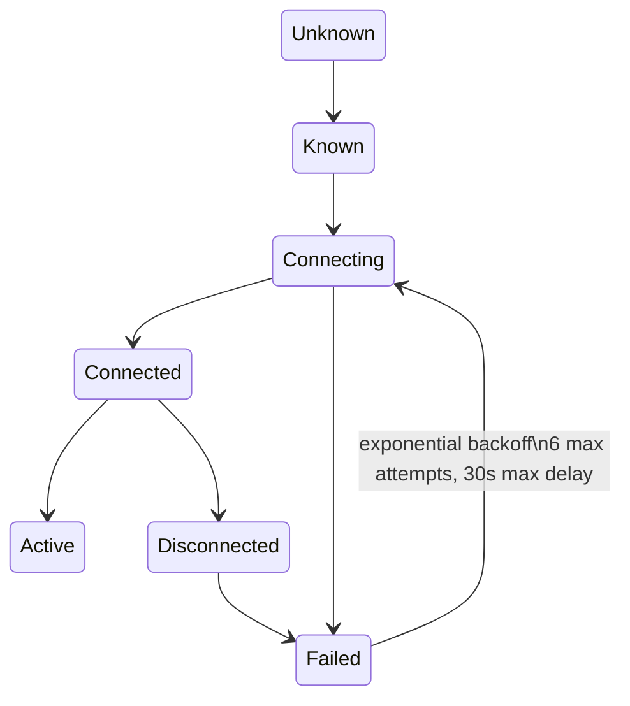

# Hypercolor Daemon Development

The daemon (`hypercolor-daemon`) serves the REST API, WebSocket protocol, and orchestrates the render pipeline. Runs on `127.0.0.1:9420`.

## AppState

`AppState` holds 35+ fields (many `Arc`-wrapped), shared with Axum handlers via `State<Arc<AppState>>` extractor. Key fields:

- `effect_engine: Arc<Mutex<EffectEngine>>` — active effect lifecycle
- `effect_registry: Arc<RwLock<EffectRegistry>>` — effect catalog (metadata, search, categories)
- `event_bus: Arc<HypercolorBus>` — system-wide event bus (broadcast + watch channels)
- `backend_manager: Arc<Mutex<BackendManager>>` — device output routing
- `config_manager: Option<Arc<ConfigManager>>` — wraps `ArcSwap<HypercolorConfig>` for lock-free reads; `None` in tests
- `device_registry: DeviceRegistry` — device tracking (internally `Arc`-wrapped, cloneable)
- `scene_manager: Arc<RwLock<SceneManager>>` — scene CRUD, priority stack, transitions
- `render_loop: Arc<RwLock<RenderLoop>>` — frame timing and pipeline skeleton
- `spatial_engine: Arc<RwLock<SpatialEngine>>` — maps canvas pixels to LED positions
- `profiles: Arc<RwLock<ProfileStore>>` — saved lighting configurations
- `library_store: Arc<dyn LibraryStore>` — favorites, presets, playlists (JSON-backed or in-memory)
- `credential_store: Arc<CredentialStore>` — AES-256-GCM encrypted network credentials
- `power_state: watch::Sender<OutputPowerState>` — global brightness and output state

**Why Mutex on EffectEngine/BackendManager?** They hold `dyn` trait objects that aren't `Sync`. `RwLock` requires `Sync` on the inner type.

## REST API Patterns

All routes under `/api/v1/`. Success envelope:

```rust
pub struct ApiResponse<T: Serialize> {
    pub data: T,
    pub meta: Meta,
}

pub struct Meta {
    pub api_version: String,    // "1.0"
    pub request_id: String,     // "req_{uuid_v7}"
    pub timestamp: String,      // ISO 8601 UTC, e.g. "2026-03-29T12:00:00.000Z"
}
```

Errors use a separate `ApiErrorResponse` with `error: ErrorBody` containing `code: ErrorCode`, `message`, and optional `details`. `ApiError` is a unit struct with static builder methods (`not_found()`, `bad_request()`, `internal()`, `conflict()`, `validation()`, `unauthorized()`, `forbidden()`, `rate_limited()`).

Key route groups (path parameters use `{id}` Axum syntax, not `:id`):

| Prefix | Purpose |
|--------|---------|
| `/effects` | List, detail, apply, stop, rescan |
| `/effects/active` | Current effect state |
| `/effects/current/controls` | Live control PATCH + reset |
| `/effects/{id}/apply` | Apply an effect by ID |
| `/devices` | Connected devices, discover, identify, pair, attachments |
| `/devices/{id}/logical-devices` | Per-device logical segmentation |
| `/logical-devices` | Global logical device CRUD |
| `/attachments/templates` | Attachment template CRUD + categories/vendors |
| `/scenes` | Scene CRUD + `{id}/activate` |
| `/library/favorites` | Favorites CRUD |
| `/library/presets` | User preset management + `{id}/apply` |
| `/library/playlists` | Playlist CRUD + activate/stop |
| `/layouts` | Spatial layout CRUD + active + preview + `{id}/apply` |
| `/profiles` | Profile save/load + `{id}/apply` |
| `/config` | Show/get/set/reset system config values |
| `/settings/brightness` | Global brightness get/set |
| `/status` | Daemon status (aliased as `/state`) |
| `/server` | Server identity |
| `/diagnose` | System diagnostics |

## WebSocket Protocol

Single endpoint at `/api/v1/ws`. Five channel types:

| Channel | Data | Format |
|---------|------|--------|
| `events` | State changes (effect applied, device connected) | JSON |
| `frames` | LED color output per device | Binary |
| `canvas` | Render canvas pixels (default 640x480, configurable) | Binary (header `0x03`) |
| `spectrum` | Audio analysis (FFT, beats) | JSON |
| `metrics` | Performance telemetry (FPS, frame times) | JSON |

**Subscribe on connect:**
```json
{ "type": "subscribe", "channels": ["events", "metrics"] }
```

**Backpressure**: Slow consumers get dropped frames, not memory growth. The WS handler sends a `Backpressure` server message (JSON) with `dropped_frames`, `channel`, `recommendation: "reduce_fps"`, and `suggested_fps` so the UI can auto-throttle.

## Event Bus (HypercolorBus)

Two communication patterns on the bus, all lock-free:

| Pattern | Channel | Use |
|---------|---------|-----|
| `broadcast` (256 capacity) | `tokio::sync::broadcast` | Discrete state changes (`HypercolorEvent` variants) |
| `watch` (latest-value) | `tokio::sync::watch` | Frame data, spectrum, canvas (consumers see latest only) |

Events are wrapped in `TimestampedEvent` with ISO 8601 `timestamp` and `mono_ms` (monotonic millis since bus creation) for frame correlation. The bus is `Send + Sync` and shared via `Arc<HypercolorBus>`.

## Render Pipeline (5 Stages)

Runs on a **dedicated OS thread** with its own Tokio runtime (isolated from API thread pool):

| Stage | Budget | What Happens |
|-------|--------|-------------|
| Input Sampling | 1.0ms | Audio DSP + screen capture |
| Effect Render | 8.0ms | `EffectEngine::tick()` → Canvas |
| Spatial Sample | 0.5ms | Canvas pixels → LED colors via zone positions |
| Device Push | 2.0ms | Route colors to `BackendManager` → USB/network |
| Bus Publish | 0.1ms | Broadcast state events + watch updates |

**Adaptive FPS**: Tiers at 10/20/30/45/60. On 2 consecutive budget misses → downshift. On sustained headroom → upshift. Prevents frame drops from cascading.

## Device Lifecycle State Machine

Per-device states managed by `DeviceLifecycleManager` — a **pure state machine** that emits actions for async executors (no I/O itself):



Hot-plug: USB device events trigger state transitions. The lifecycle manager decides whether to reconnect, the executor performs the actual transport operations.

## Configuration

- **Config file**: TOML (`config.toml`), loaded by `ConfigManager` which wraps `ArcSwap<HypercolorConfig>` for lock-free reads
- **Data storage**: `~/.local/share/hypercolor/` (9 JSON data files: `profiles.json`, `layouts.json`, `library.json`, `device-settings.json`, `attachment-profiles.json`, `layout-auto-exclusions.json`, `logical-devices.json`, `effect-layouts.json`, `runtime-state.json`)
- **Hot-reload**: `ConfigManager` uses `Arc<ArcSwap<HypercolorConfig>>` for atomic pointer swap on config change
- **Encrypted**: Credentials stored via `CredentialStore` using AES-256-GCM encryption (file-backed, not keyring)

## MCP Server Integration

14 tools exposed via Model Context Protocol for AI control:

| Tool | Purpose |
|------|---------|
| `set_effect` | Apply effect by name/query (fuzzy match) with optional controls and transition |
| `list_effects` | Browse effect catalog with category/audio_reactive filters |
| `stop_effect` | Stop the active effect |
| `set_color` | Apply a solid color effect |
| `get_devices` | List connected devices |
| `set_brightness` | Set global brightness (0-255) |
| `get_status` | Current daemon state snapshot |
| `activate_scene` | Activate a scene by name/ID |
| `list_scenes` | List all scenes |
| `create_scene` | Create a new scene |
| `get_audio_state` | Audio analysis snapshot |
| `set_profile` | Apply a lighting profile |
| `get_layout` | Get the active spatial layout |
| `diagnose` | System diagnostics |

5 resources: `hypercolor://state`, `hypercolor://devices`, `hypercolor://effects`, `hypercolor://profiles`, `hypercolor://audio`. The MCP server uses fuzzy matching for effect/profile names.

## Detailed References

- **`references/api-patterns.md`** — Full route catalog with request/response shapes, middleware chain, error handling conventions
- **`references/event-bus.md`** — Event taxonomy, frame correlation with mono_ms, subscription patterns, backpressure tuning
