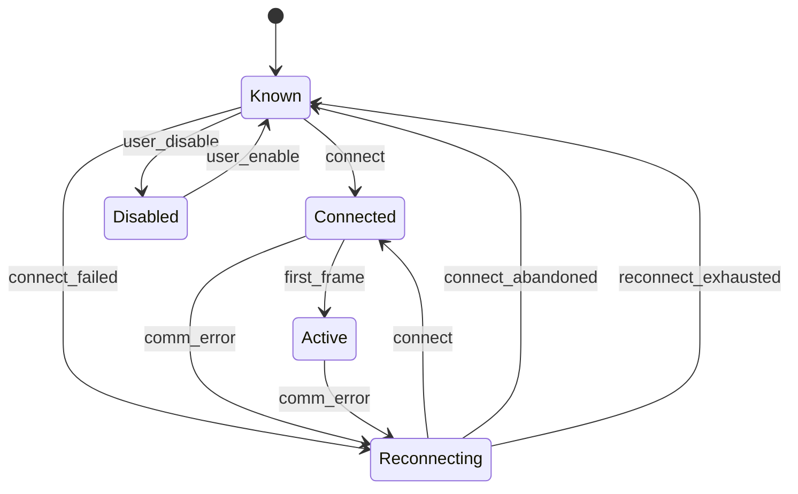

# Hypercolor Daemon Development

The daemon (`hypercolor-daemon`) serves the REST API, WebSocket protocol, and orchestrates the render pipeline. Runs on `127.0.0.1:9420`.

## AppState

`AppState` holds 47 fields (many `Arc`-wrapped), shared with Axum handlers via the `State<Arc<AppState>>` extractor. The first field is the one that matters most:

- `domains: DomainContexts` — the complete domain service graph; every mutating handler goes through it
- `event_bus: Arc<HypercolorBus>` — system-wide event bus (broadcast + watch lanes)
- `backend_manager: Arc<Mutex<BackendManager>>` — device output routing
- `config_manager: Option<Arc<ConfigManager>>` — wraps `ArcSwap<HypercolorConfig>` for lock-free reads; `None` in tests
- `device_registry: DeviceRegistry` — device tracking (internally `Arc`-wrapped, cloneable)
- `scene_manager: SceneService` — scene CRUD, priority stack, transitions
- `render_loop: Arc<RwLock<RenderLoop>>` — frame timing and pipeline skeleton
- `spatial_engine: SpatialService` — maps canvas pixels to LED positions; an `ArcSwap` newtype, so reads are lock-free
- `output_power: OutputPower` — the canonical global power and brightness authority
- `scene_transactions: SceneTransactionQueue` — frame-boundary scene changes mirrored into the render thread
- `security_state: SecurityState` — API auth and rate limiting for HTTP and WS command dispatch
- `extensions` / `api_extensions` — typed state and route mounters owned by downstream daemon extensions

`library_store` and `input_manager` are private; reach them through `state.library_store()` and `state.input_manager()`. There is no `effect_engine`, no `effect_registry`, no `credential_store`, and no `power_state` field: the effect catalog lives inside `domains.effects`, and power lives in `output_power`.

**Why Mutex on BackendManager?** It holds `dyn` trait objects that aren't `Sync`. `RwLock` requires `Sync` on the inner type.

## Domain Services

`AppState::domains` (`src/domain/context.rs`) is the composition root for eleven authorities, each owning its own commit ordering, persistence, and event publication:

`runtime_session`, `devices`, `scene`, `layout`, `output`, `platform`, `display`, `diagnostics`, `effects`, `scene_tree`, `scene_library`.

A handler is a thin adapter: convert wire input, call one service function, wrap the outcome. It does not lock a subsystem mutex, and event publication is the service's job in almost every domain, because the service knows when the commit actually landed. The config routes are the standing exception: `api/config.rs` publishes `ConfigChanged` from the handler itself, after the save succeeds. Follow the service pattern unless you are extending that route family. Mutations take their provenance beside the command as a `MutationContext` (`MutationContext::api()` for REST, `MutationContext::mcp()` for MCP), never inside the command payload.

```rust
// src/api/output.rs (both handlers in full)
pub async fn get_output(State(state): State<Arc<AppState>>) -> Response {
    envelope::ok(domain::output::get_output(&state.domains.output))
}

pub async fn patch_output(
    State(state): State<Arc<AppState>>,
    Json(request): Json<OutputPatchRequest>,
) -> Response {
    match domain::output::patch_output(&state.domains.output, request).await {
        Ok(outcome) => envelope::ok(outcome.output),
        Err(error) => error.into_response(),
    }
}
```

Services return `Result<T, DomainError>` and never mention Axum, `Response`, or an HTTP status. Each transport owns exactly one `DomainError` projection, so the same service backs REST, MCP, WS commands, and the CLI.

## REST API Patterns

All routes under `/api/v1/`. Request and response contracts live in `hypercolor_types::api` (seventeen domain modules plus `envelope`), shared by the daemon, the web UI, the TUI, the CLI, and the generated Python client. Never hand-mirror one of these types in the daemon.

```rust
// hypercolor_types::api::envelope
pub struct ApiResponse<T> {
    pub data: T,
    pub meta: ResponseMeta,
}

pub struct ResponseMeta {
    pub api_version: String,    // "1.0"
    pub request_id: String,     // "req_{uuid_v7}"
    pub timestamp: String,      // ISO 8601 UTC, e.g. "2026-03-29T12:00:00.000Z"
}
```

Handlers wrap payloads with the free functions in `crate::api::envelope`: `envelope::ok(data)` (200), `envelope::created(data)` (201), `envelope::accepted(data)` (202). They return `Response`, not `Json<...>`.

Most list routes answer `ListResponse<T> { items, total, page }`, where `page: Option<PageInfo>` is present only on routes that genuinely page. Domain aliases name the concrete shape, so `EffectListResponse` is `ListResponse<EffectSummary>`. Five list routes do not: `/displays`, `/capture/monitors`, `/config/schema`, and `/simulators/displays` put a bare JSON array in `data` (they are declared with `OperationDoc::get_vec` rather than `get_list`), and `/control-surfaces` answers `ControlSurfaceListResponse { surfaces }`. Check the route's `OperationDoc` before assuming the envelope shape.

Errors have exactly one REST rendering: the `IntoResponse` impl on `DomainError` in `src/api/error.rs`. The error type itself lives in `src/domain/mod.rs` and stays transport free, because each transport owns its own projection. A handler builds the variant that describes the failure and calls `.into_response()`; a helper returns `Result<T, DomainError>` so the route can `?` it or match on it. Constructors read like the failure: `DomainError::not_found(ResourceKind::Scene, id)`, `validation(msg)`, `validation_field(field, msg)`, `malformed(msg)`, `conflict(msg)`, `unauthorized(msg)`, `forbidden(msg)`, `unsupported_media_type(msg)`. Never hand-build an error body and never hand a `Response` back through a `Result`; `tests/api_error_surface_tests.rs` scans every file under `src/` for both and fails the build.

The error envelope is `{ error: { code, message, details }, meta }`, where `details` is omitted entirely when the variant carries no structured context. See `references/api-patterns.md` for the full variant, code, and status table.

Key route groups (path parameters use `{id}` Axum syntax, not `:id`):

| Prefix                      | Purpose                                                 |
| --------------------------- | ------------------------------------------------------- |
| `/effects`                  | Effect catalog, detail, apply, install, rescan          |
| `/effects/{id}/apply`       | Replace one live zone stack with an effect              |
| `/scene`                    | Read or patch the complete live scene document          |
| `/scene/zones`              | Live zone, member, layout, layer, and control mutations |
| `/devices`                  | Connected devices, discovery, pairing, segments         |
| `/devices/{id}/attachments` | Embedded attachment bindings and validation             |
| `/attachments/templates`    | Attachment template collection                          |
| `/scenes`                   | Scene CRUD + snapshot + `{id}/activate`                 |
| `/library/favorites`        | Favorites CRUD                                          |
| `/library/presets`          | User preset CRUD                                        |
| `/library/playlists`        | Playlist CRUD + activate/deactivate                     |
| `/layouts`                  | Spatial layout CRUD + active + preview + `{id}/apply`   |
| `/config`                   | Show/get/set/reset system config values                 |
| `/output`                   | Global output power and brightness get/patch            |
| `/system`                   | Public identity, authorized status, audio devices, sensors |
| `/diagnose`                 | System diagnostics                                      |
| `/assets`                   | User media asset CRUD plus `{id}/blob` and `{id}/thumbnail` |
| `/capture`                  | Screen-recording authorization, monitor list, source selection |
| `/input/authorize`          | Input-monitoring permission grant                       |
| `/media/authorize`          | Media Automation permission grant                       |
| `/control-surfaces`         | Control surface catalog, value patch, action invocation |
| `/displays`                 | Display devices, face assign/composition/controls, frame |
| `/drivers`                  | Driver module catalog, config, controls                 |
| `/simulators/displays`      | Virtual display simulator CRUD plus `{id}/frame`        |

`/health` sits at the root, outside `/api/v1`.

**Route registration.** Routes never register with a bare `.route()`. Each domain owns a sub-router in `src/api/routes/<domain>.rs` exporting `pub(super) fn router() -> OpenApiRouter<Arc<AppState>>`, and every entry goes through `openapi::documented_route(path, method_router, [OperationDoc..])` so the operation lands in the OpenAPI document. `routes::versioned()` merges all eighteen sub-routers. See `references/api-patterns.md` for the full pattern and the gate that enforces it.

**Security.** One `enforce_security` middleware layer (`src/api/security.rs`) wraps the whole router with a `SecurityState` carrying auth config, the macOS session credential, the network access policy, and a rate limiter. Exactly one serving `SecurityState` is minted per process in `api::build_state`; every other `AppState` is a worker projection holding `SecurityState::unserved`. When a UI directory is configured, a `StaticAssetSurface` tells the middleware which prefixes belong to the API so a browser fetching a stylesheet is not asked for a bearer header. CORS origins come from `WebConfig` and apply only while security is enabled.

**Extensions.** Downstream builds layer on without patching the daemon: `AppState::extensions` (an `ExtensionRegistry`) holds their typed state, and each `Arc<dyn ApiExtension>` in `AppState::api_extensions` gets `mount_api_routes(router)` called on the `OpenApiRouter` before it is split, so extension routes are documented like any other. Extensions push their own state changes as `HypercolorEvent::ExtensionStateChanged`, which the WS event relay carries with no daemon changes.

## WebSocket Protocol

Single endpoint at `/api/v1/ws`. All fifteen topics are declared in one `define_ws_topics!` block in `hypercolor-leptos-ext/src/ws/registry.rs`, which is the single definition of the wire format for the daemon, the web UI, and the TUI. Never hand-roll a frame layout.

| Topic                 | Data                                                 | Binary tags        | Backpressure    |
| --------------------- | ---------------------------------------------------- | ------------------ | --------------- |
| `events`              | State changes (effect applied, device connected)     | JSON               | Lossless        |
| `frame_events`        | `FrameRendered` events, split off the default channel | JSON              | Lossless        |
| `input_events`        | Host `InputEventReceived` events; control-authorized because they carry keystroke data | JSON | Lossless |
| `metrics`             | Performance telemetry (FPS, frame times)             | JSON               | DropWithNotice  |
| `device_metrics`      | Per-device metrics snapshots                         | JSON               | DropWithNotice  |
| `sensors`             | System sensor readings                               | JSON               | LatestWins      |
| `frames`              | LED color output per device                          | `0x01`             | DropWithNotice  |
| `spectrum`            | Audio analysis (FFT, beats)                          | `0x02`             | DropWithNotice  |
| `canvas`              | Render canvas pixels (default 640x480, configurable) | `0x03`             | LatestWins      |
| `screen_canvas`       | Screen-source canvas                                 | `0x05`             | LatestWins      |
| `web_viewport_canvas` | Web-viewport preview canvas                          | `0x06`             | LatestWins      |
| `display_preview`     | Per-display preview frames (keyed by device)         | `0x07`, `0x12`     | LatestWins      |
| `zone_preview`        | Per-zone preview frames                              | `0x08`, `0x0c`     | LatestWins      |
| `screen_zones`        | Ambilight screen-zone frames                         | `0x09`, `0x0e`, `0x11` | LatestWins  |
| `interactive_preview` | Interactive preview lane (keyed by preview id)       | `0x0a`, `0x0d`     | LatestWins      |

`0x0b` is the wide passive-preview frame four topics share, `0x0f` and `0x10` are the chunk and cancellation envelopes every preview stream rides, and `0x04` is deliberately unassigned. A single WS message may not exceed `MAX_WS_MESSAGE_BYTES` (1 MiB).

**Subscribe on connect:**

```json
{
  "type": "subscribe",
  "topics": [{ "topic": "events" }, { "topic": "metrics" }]
}
```

**Client messages** are more than subscribe. The full vocabulary in `src/api/ws/protocol.rs` is `subscribe`, `unsubscribe`, `command` (`{ id, method, path, body }`, REST-equivalent execution over the socket), `zone_layout_preview`, `zone_layout_preview_clear`, `input_inject`, `interactive_preview_claim_authoritative`, and `interactive_preview_release_authoritative`.

**Backpressure**: Slow consumers get dropped frames, not memory growth. The WS handler sends a `Backpressure` server message (JSON) with `dropped_frames`, `topic`, `recommendation: "reduce_fps"`, and `suggested_fps` so the UI can auto-throttle.

**Keyed topics**: `display_preview` (keyed by device) and `interactive_preview` (keyed by the client's preview id) hold one subscription per key, so a selector names both the topic and its key. Subscribing to `interactive_preview` is what opens its render lane.

## Event Bus (HypercolorBus)

Two communication patterns on the bus, all lock-free:

| Pattern                    | Channel                  | Use                                                      |
| -------------------------- | ------------------------ | -------------------------------------------------------- |
| `broadcast` (256 capacity) | `tokio::sync::broadcast` | Discrete state changes (`HypercolorEvent` variants)      |
| `watch` (latest-value)     | `tokio::sync::watch`     | Frame data, spectrum, canvas (consumers see latest only) |

Events are wrapped in `TimestampedEvent` with ISO 8601 `timestamp` and `mono_ms` (monotonic millis since bus creation) for frame correlation. The bus is `Send + Sync` and shared via `Arc<HypercolorBus>`.

## Render Pipeline (5 Stages)

Runs on a **dedicated OS thread** with its own Tokio runtime (isolated from API thread pool):

| Stage          | Budget | What Happens                                   |
| -------------- | ------ | ---------------------------------------------- |
| Input Sampling | 1.0ms  | Audio DSP + screen capture                     |
| Effect Render  | 8.0ms  | Renderer pool `render_into` → SparkleFlinger composition → Canvas |
| Spatial Sample | 0.5ms  | Canvas pixels → LED colors via zone positions  |
| Device Push    | 2.0ms  | Route colors to `BackendManager` → USB/network |
| Bus Publish    | 0.1ms  | Broadcast state events + watch updates         |

**Adaptive FPS**: Tiers at 10/20/30/45/60. On 2 consecutive budget misses → downshift. On sustained headroom → upshift. Prevents frame drops from cascading.

## Modern Diagnostics & Telemetry

Do not ask Bliss to paste logs first. The dev environment should query the daemon:

```bash
just diagnose -- --json
hypercolor diagnose --system -j
curl -s -X POST http://127.0.0.1:9420/api/v1/diagnose -H 'content-type: application/json' -d '{"system":true}'
curl -s http://127.0.0.1:9420/api/v1/system
```

`/api/v1/diagnose` returns checks plus `snapshot.render`, `snapshot.usb`, and `snapshot.device_output`. The WebSocket `metrics` channel and authenticated `/api/v1/system` status expose the same latest-frame fields for live UI/agent inspection.

Key LED-frame fields:

- `output_frame_source`: `current_frame`, `published_frame`, or `routed_reuse`
- `output_reuses_published_frame`: render reused the last published LED frame data
- `output_routing_signature`, `output_zone_shape_signature`, `output_unassigned_behavior_generation`: changed signatures explain why output reuse did or did not happen
- `devices_written`, `total_leds`, `sample_us`, `push_us`, `publish_us`, `total_us`
- GPU sampling flags: `gpu_sample_deferred`, `gpu_sample_stale`, `gpu_sample_retry_hit`, `gpu_sample_queue_saturated`, `gpu_sample_wait_blocked`, `gpu_sample_cpu_fallback`, `cpu_readback_skipped`, `gpu_readback_failed`

Key device-output fields:

- Per queue: `backend_id`, `mapped_layout_ids`, `uses_frame_sink`, `worker_finished`, `delivered_fps`, `accepted_fps`, `coalesced_target_cadence`, `coalesced_backend_overrun`, `transport_started`, `transport_completed`, `transport_failed`, `avg_queue_wait_ms`, `avg_transport_latency_ms`, `queue_generation`, and delivery sequence watermarks
- USB actor: `display_frames_delayed_for_led_total`, `display_led_priority_wait_avg_ms`, `display_led_priority_wait_max_ms`

Jank triage:

- Displays smooth but LEDs jank: inspect `output_frame_source` and GPU stale/deferred flags before touching USB.
- All USB LEDs jank in unison: suspect shared LED sample/output freshness or shared queue pressure before per-device protocol bugs.
- One device/family janks: compare `delivered_fps` with the target, split target-cadence coalescing from backend-overrun coalescing, then inspect queue wait, transport latency, and `last_error`.
- `output_frame_source=current_frame`, high `gpu_sample_retry_hit`, low sample/push times, and `wake_late` warnings point at host scheduler pressure rather than the LED pipeline. On Windows, check for active `cargo.exe`/`rustc.exe`/`link.exe`/`cl.exe` jobs before tuning render code; direct repo-local Cargo builds can steal enough CPU to wake the render thread several milliseconds late.
- `coalesced_target_cadence` is expected latest-frame replacement when a device has a lower target FPS than the render loop. Treat `coalesced_backend_overrun` as pressure: correlate it with queue wait, transport latency, failures, and delivered cadence.
- Never reduce canvas resolution, FPS ceilings, or performance caps to hide telemetry symptoms. Fix the root cause.

## Device Lifecycle State Machine

Per-device states managed by `DeviceLifecycleManager`, a **pure state machine** that emits actions for async executors (no I/O itself). `DeviceState` has exactly five variants: `Known`, `Connected`, `Active`, `Reconnecting`, `Disabled`.


```mermaid
stateDiagram-v2
    [*] --> Known
    Known --> Connected : connect
    Known --> Reconnecting : connect_failed
    Connected --> Active : first_frame
    Connected --> Reconnecting : comm_error
    Active --> Reconnecting : comm_error
    Reconnecting --> Connected : connect
    Reconnecting --> Known : connect_abandoned
    Reconnecting --> Known : reconnect_exhausted
    Known --> Disabled : user_disable
    Disabled --> Known : user_enable
```

Any state answers `user_disable` by moving to `Disabled`, and a hot-unplug drops the device straight back to `Known`. Reconnect backoff starts at 1s, doubles by a factor of 2.0, jitters by 0.1, and ceilings at 1 minute (`ReconnectPolicy::default`). `DeviceLifecycleManager::default` caps attempts at 6, after which the machine falls back to `Known`.

Hot-plug: USB device events trigger state transitions. The lifecycle manager decides whether to reconnect, the executor performs the actual transport operations.

## Configuration

- **Config file**: TOML (`config.toml`), loaded by `ConfigManager` which wraps `ArcSwap<HypercolorConfig>` for lock-free reads
- **Two storage tiers**, both resolved by `ConfigManager`. The data tier (`ConfigManager::data_dir()`, `$XDG_DATA_HOME/hypercolor`) holds portable user content: `scenes.json`, `layouts.json`, `layout-auto-exclusions.json`, `logical-devices.json`, `library.json`, `attachment-profiles.json`, `simulated-displays.json`. The state tier (`ConfigManager::state_dir()`, `$XDG_STATE_HOME/hypercolor`) holds machine-local state: `device-settings.json`, `runtime-state.json`, `display-preferences.json`, `device-aliases.json`, `driver-inventory.json`.
- **Tier migration**: the state-tier stores open through `load_migrated(legacy_data_path, canonical_state_path)`, so an old install's data-tier copy is adopted once and then written to the state tier.
- **Hot-reload**: `ConfigManager` uses `Arc<ArcSwap<HypercolorConfig>>` for atomic pointer swap on config change
- **Encrypted**: Credentials stored via `CredentialStore` using AES-256-GCM encryption (file-backed, not keyring)

## MCP Server Integration

The MCP surface rides an `rmcp` `StreamableHttpService` mounted at `McpConfig::base_path` (default `/mcp`) and merged into the router only when `mcp.enabled`. 17 tools exposed via Model Context Protocol for AI control:

| Tool               | Purpose                                                            |
| ------------------ | ------------------------------------------------------------------ |
| `set_effect`       | Apply one deterministically selected effect with optional controls |
| `list_effects`     | Browse effect catalog with category/audio_reactive filters         |
| `set_color`        | Apply a solid color effect                                         |
| `set_output_power` | Pause or resume output without discarding effect state             |
| `clear_zone`       | Clear one non-display zone or every non-display zone               |
| `adjust_controls`  | Patch typed values and clear bindings on one live layer            |
| `get_devices`      | List connected devices                                             |
| `set_brightness`   | Set global brightness (0-100 percent)                              |
| `get_status`       | Current daemon state snapshot                                      |
| `activate_scene`   | Activate a scene by name/ID                                        |
| `list_scenes`      | List all scenes                                                    |
| `create_scene`     | Create a new scene                                                 |
| `get_audio_state`  | Audio analysis snapshot                                            |
| `get_sensor_data`  | System telemetry snapshot or one named sensor reading              |
| `set_display_face` | Assign an HTML display face to a display device                    |
| `get_layout`       | Get the active spatial layout                                      |
| `diagnose`         | Canonical safe diagnostics from the shared REST collector          |

Every tool declares `read_only`, `destructive`, and `idempotent` annotations.
The destructive set is `set_effect`, `set_color`, `clear_zone`,
`activate_scene`, and `set_display_face`. `adjust_controls` is a
non-destructive atomic patch.

`diagnose` accepts only an empty closed object and returns the canonical REST
diagnostic data object: `checks`, `summary`, and `snapshot`. It always runs the
safe default checks and never exposes the protected `macos_screen_parity` check.

5 resources: `hypercolor://state`, `hypercolor://devices`, `hypercolor://effects`, `hypercolor://scenes`, `hypercolor://audio`. Empty `get_status` and `get_devices` calls use the same builders as their matching resources. Effect, scene, zone, layer, device, and display-face selectors resolve exact IDs, exact case-insensitive names, or unique case-insensitive name substrings; ambiguity returns structured candidates. Color text uses its separate fuzzy resolver.

## Detailed References

- **`references/api-patterns.md`** — Full route catalog with request/response shapes, middleware chain, error handling conventions
- **`references/event-bus.md`** — Event taxonomy, frame correlation with mono_ms, subscription patterns, backpressure tuning
