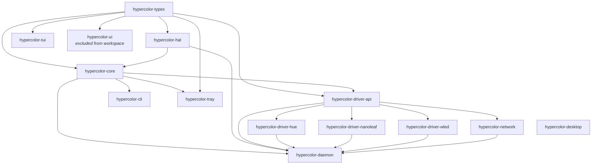

# Hypercolor

Open-source RGB lighting orchestration engine for Linux, written in Rust.

## Quick Start

```bash
# Primary interface — use justfile recipes
just verify          # fmt + lint + test (run after every change)
just check           # Type-check without building
just build           # Debug build (dev profile)
just build-preview   # Near-release performance, fast compile
just release         # Full release build (LTO, stripped)

# Run
just daemon          # Daemon on :9420 (preview profile, debug logging)
just daemon-servo    # Daemon with Servo HTML effect rendering
just tui             # TUI client (auto-starts daemon)
just tray            # System tray applet
just cli             # CLI tool (`hypercolor`)
just dev             # Daemon + UI dev server together

# UI / SDK
just ui-dev          # Leptos dev server on :9430, proxies API to :9420
just sdk-dev         # TypeScript SDK dev server with HMR
just effects-build   # Build all HTML effects -> effects/hypercolor/*.html
just effect-build X  # Build single effect by name

# Testing
just test            # All workspace tests
just test-crate X    # Test specific crate
just test-one X      # Run single test by name pattern

# Quality
just lint            # Clippy with -D warnings
just lint-fix        # Clippy auto-fix
just deny            # License + advisory audit (cargo-deny)
just doc-open        # Build and open API docs
```

All `just` commands route through `scripts/cargo-cache-build.sh`, which manages
sccache/ccache, clang+lld linking on Linux, and Servo build state.

## Project Structure

```
crates/
  hypercolor-types/        # Pure data types — zero deps, no logic, no I/O
  hypercolor-core/         # Engine: traits, bus, sampler, config, render loop
  hypercolor-hal/          # Hardware abstraction — USB/HID drivers
  hypercolor-driver-api/   # Stable boundary for network driver plugins
  hypercolor-driver-hue/   # Philips Hue network driver
  hypercolor-driver-nanoleaf/  # Nanoleaf network driver
  hypercolor-driver-wled/  # WLED network driver
  hypercolor-network/      # Driver registry and orchestration
  hypercolor-daemon/       # Binary: daemon + REST API + WebSocket + MCP
  hypercolor-cli/          # Binary: `hypercolor` CLI tool
  hypercolor-tui/          # Library: Ratatui terminal UI, launched via `hypercolor tui`
  hypercolor-tray/         # Binary: system tray applet
  hypercolor-desktop/      # Binary: Tauri native shell (excluded from default CI)
  hypercolor-leptos-ext/   # Leptos 0.8 extension helpers for the web UI
  hypercolor-leptos-ext-macros/  # Proc macros powering hypercolor-leptos-ext
  hypercolor-ui/           # Leptos 0.8 CSR web UI (WASM, Trunk) — EXCLUDED from workspace
sdk/                       # TypeScript SDK for HTML effects (Bun monorepo)
data/drivers/vendors/      # Canonical device database (30 vendor TOMLs, consumed by `just compat`)
data/compat/               # Generated compatibility matrix outputs (JSON + markdown snippets)
docs/specs/                # Implementation specs (numbered)
docs/design/               # Design documents (numbered)
docs/archive/              # Superseded plans, shipped decisions, stale snapshots
docs/content/              # Public documentation (Zola site at https://hyperb1iss.github.io/hypercolor)
.agents/                   # AI agent skills and agent definitions
```

## Crate Dependency Graph



Do NOT create cross-crate circular dependencies. `hypercolor-hal` must NEVER depend
on `core` (would be circular). Network drivers depend on `driver-api`, not on `core` directly.

## Architecture

### Render Pipeline

The daemon runs a render loop on a dedicated thread, targeting adaptive FPS (10/20/30/45/60):

```
InputManager::sample_all()        → Collect audio, screen, keyboard data
build_frame_scene_snapshot()      → Capture active scene, effect groups, and live control state
SparkleFlinger::compose_frame()   → Each producer runs at its own cadence; the compositor latches the newest surface per producer and blends into one canonical RGBA canvas (640×480 default, configurable)
SpatialEngine::sample()           → Map composed canvas pixels to LED positions → ZoneColors
BackendManager::write_frame()     → Group by device, queue async sends
HypercolorBus::publish()          → Publish frame data, canvas preview, timing metrics
```

`FpsController` auto-shifts between tiers: downshifts fast on budget misses, upshifts
slowly on sustained headroom.

### Event Bus

`HypercolorBus` uses three lock-free communication patterns:

- **Broadcast** (256 capacity) — discrete events (device connected, effect changed).
  Every subscriber sees every event. Non-blocking; drops silently if channel is full.
- **Watch** (latest-value) — high-frequency frame data and spectrum data.
  Subscribers skip stale frames automatically. Used for device output and preview streaming.
- **Watch** (canvas) — render canvas and screen-source canvas as `CanvasFrame` (RGBA bytes).

Rule of thumb: events are broadcast, data streams are watch.

### Key Traits

- **`DeviceBackend`** (`core/src/device/traits.rs`) — hardware communication.
  Methods: discover, connect, write_colors, disconnect. Long-running I/O dispatched internally.
- **`EffectRenderer`** (`core/src/effect/traits.rs`) — polymorphic renderer (wgpu and Servo
  both implement this). Input: `FrameInput` (timing, audio, interaction, screen). Output: `Canvas`.
- **`InputSource`** (`core/src/input/traits.rs`) — audio, screen capture, keyboard, MIDI.
  One broken source never crashes the render loop.
- **`Protocol`** (`hal/src/protocol.rs`) — USB/HID wire-format encoding per device family.
  See hal-driver-development skill for implementation patterns.

### AppState

The daemon's shared state is `Arc`-wrapped and injected into every Axum handler. Key detail:
`EffectEngine` is behind `Mutex` (not `RwLock`) because `dyn EffectRenderer` is `Send` but
NOT `Sync`. Read-heavy subsystems (EffectRegistry, SceneManager, SpatialEngine) use `RwLock`.

## UI Crate

`hypercolor-ui` is **excluded from the Cargo workspace**. `cargo check --workspace` does NOT
cover it. Build and test separately:

```bash
just ui-dev          # Dev server on :9430, proxies API to :9420
just ui-test         # Run UI crate tests
just ui-build        # Production build
```

Tech stack: Leptos 0.8 CSR, Tailwind v4 with SilkCircuit tokens, wasm-bindgen, leptos_icons.
Trunk orchestrates Tailwind compilation before WASM build (see `crates/hypercolor-ui/Trunk.toml`).

**Gotcha:** `leptos_icons::Icon`'s `style` prop accepts `MaybeProp<String>` — it takes
`&str` or `String`, NOT closures. Use conditional rendering to vary icon styles reactively.

## SDK

TypeScript SDK for building HTML effects, managed with **Bun**:

```bash
just sdk-install         # bun install
just sdk-dev             # Dev server with HMR
just sdk-build           # Build packages
just effects-build       # Build all effects -> effects/hypercolor/*.html
just effect-build NAME   # Build single effect
```

`effects/hypercolor/` is generated build output (gitignored). Never hand-edit, never commit.
Make changes in `sdk/src/effects/` and regenerate.

## Build Profiles

| Profile   | Command              | Use For                                                                                         |
| --------- | -------------------- | ----------------------------------------------------------------------------------------------- |
| `dev`     | `just build`         | Edit-compile loops. Hypercolor crates at opt-level 1, deps at 2, Servo/mozjs at 3.              |
| `preview` | `just build-preview` | Local testing. Like dev but disables debug-assertions and overflow-checks in Hypercolor crates. |
| `release` | `just release`       | Distribution. LTO, codegen-units=1, panic=abort, stripped.                                      |

The daemon defaults to `preview` profile (`just daemon`) for responsive local iteration
without the runtime cliffs of unoptimized Servo.

## Conventions

- **Edition 2024**, Rust 1.94+
- **Tests in `tests/` directory** — NOT inline `#[cfg(test)]` blocks. Named `{feature}_tests.rs`.
- **`unsafe_code` is forbidden** across the entire workspace
- **Clippy pedantic** at deny level — see `Cargo.toml` for allowed exceptions
- **`unwrap()` is forbidden** — use `?`, `.ok()`, `expect("reason")`, or handle errors properly
- **`thiserror`** for library errors, **`anyhow`** for application errors
- **`tracing`** for all logging (never `println!` in library code)
- **Serde** with `#[serde(rename_all = "snake_case")]` on enums, `#[serde(default)]` for compat
- **Conventional commits**: `feat(scope):`, `fix(scope):`, `refactor(scope):`, etc.
- **Apache-2.0** license

### Emoji

Expressive, not excessive. One per heading max. Never multiple in a row.

**Use:** 💜 (brand) 🔮 (magic/future) ⚡ (energy/fast) 💎 (quality) 🌈 (variety) 🌊 (flow)
🎯 (goals) 🔥 (important, sparingly) 🪄 (automation) 🧪 (experiments) 🦋 (transformation)

**Never use:** 🚀 (dead) ✨ (filler) 💯 (try-hard) 🙏 (ambiguous) 👀 (overused)

In terminal output, emoji serve as status indicators, not decoration. In docs, they belong
in section headers only, not body text. See `~/dev/conventions/shared/STYLE_GUIDE.md` for
the full SilkCircuit emoji philosophy.

## API Surface

The daemon exposes REST + WebSocket on `:9420` (Axum):

- `GET /api/v1/effects` — List all effects
- `POST /api/v1/effects/{id}/apply` — Apply effect to devices
- `PATCH /api/v1/effects/current/controls` — Update live controls
- `GET /api/v1/devices` — Connected devices
- `GET/POST/DELETE /api/v1/library/favorites` — Favorites CRUD
- `GET/POST /api/v1/scenes` + `POST /api/v1/scenes/{id}/activate` — Scene management
- `GET/POST /api/v1/layouts` — Spatial layout CRUD
- `GET/POST /api/v1/profiles` — Profile save/load
- `WebSocket /api/v1/ws` — Real-time state (events, canvas frames, metrics, spectrum)
- **MCP server** — 14 tools, 5 resources for AI integration

Response envelope: `{ data: T, meta: { api_version, request_id, timestamp } }`.

## Gotchas

- **EffectRenderer is Send not Sync.** Wrap in `Mutex`, not `RwLock`. This is by design —
  Servo's renderer is single-threaded.
- **Canvas defaults to 640x480 but is configurable.** Flow dimensions from `daemon.canvas_width`
  and `daemon.canvas_height` through the engine — never hardcode. Both canvas size and target
  FPS retune live via `SceneTransaction::ResizeCanvas` (frame-boundary) and `RenderLoop::set_tier`
  respectively. Spatial coordinates are normalized `[0.0, 1.0]`, so effects stay resolution-
  independent. LED positions are generated once from topology and cached; call `update_layout()`
  to regenerate.
- **Watch vs broadcast.** Don't use broadcast for high-frequency data (frame colors, spectrum).
  Watch gives latest-value semantics; broadcast queues every event.
- **Cargo deny exceptions.** Three transitive Servo/Tauri vulns are allow-listed in `deny.toml`
  (gtk3-rs unmaintained, ml-dsa timing, rsa Marvin). No upgrade path. Don't try to fix these.
- **Device fingerprinting.** Scanners provide stable fingerprints so re-discovered devices
  keep their `DeviceId` even if transport details (IP, USB path) change.
- **FPS adaptation.** The render loop auto-shifts between 5 tiers. Downshift is aggressive
  (2 consecutive budget misses), upshift is conservative (sustained headroom).
- **Performance ceilings are product behavior.** Never intentionally reduce preview/runtime
  performance caps to hide Linux Tauri/WebKitGTK issues. Preserve the intended ceiling and fix
  root causes with profiling, rendering changes, build/profile choices, or explicit user controls.

## Agent Coordination

Multiple agents may work simultaneously. Follow these rules:

1. **Own your files** — only modify files in your assigned module
2. **Never touch `lib.rs`** of another crate without coordination
3. **`cargo check --workspace`** must pass after your changes (does NOT cover `hypercolor-ui`)
4. **No placeholder implementations** — implement the real logic or don't create the file
5. **Tests are mandatory** — every public type/function needs coverage in `tests/`
6. **Never edit generated code** — especially `effects/hypercolor/` (build artifacts, not source)

## Agent Skills & Agents

Domain-specific knowledge lives in `.agents/`. Skills trigger automatically based on the
work being done. Each skill's `SKILL.md` contains core knowledge; `references/` subdirectories
hold detailed deep-dives.

```
.agents/skills/
  protocol-research/          # USB captures, community docs, spec writing workflow
  hal-driver-development/     # Protocol trait, zerocopy, CommandBuffer, wire formats
  native-effect-authoring/    # EffectRenderer contract, AudioData, Canvas API
  rgb-effect-design/          # LED color science, HTML canvas effects, palette design
  leptos-ui-development/      # Leptos 0.8 signals, WebSocket binary protocol, SilkCircuit tokens
  daemon-development/         # AppState, REST API, event bus, render pipeline, MCP

.agents/agents/
  driver-porter/              # End-to-end driver porting (research -> spec -> implement -> test)
  effect-reviewer/            # Validates effects against LED hardware best practices
```

**Driver families:** Razer, Lian Li (ENE/TL), ASUS Aura, Corsair (Lighting Node/LINK/LCD),
Dygma, Ableton Push 2, QMK, PrismRGB. Network backends: Hue, Nanoleaf, WLED.

For HAL driver implementation patterns (zerocopy structs, CommandBuffer, Protocol trait,
wire-format gotchas), see the `hal-driver-development` skill. For protocol research
methodology, see `protocol-research`.

## Specs & Design Docs

Implementation specs live in `docs/specs/` (numbered). Design docs in `docs/design/` (numbered).
Always check the relevant spec before implementing a module.
