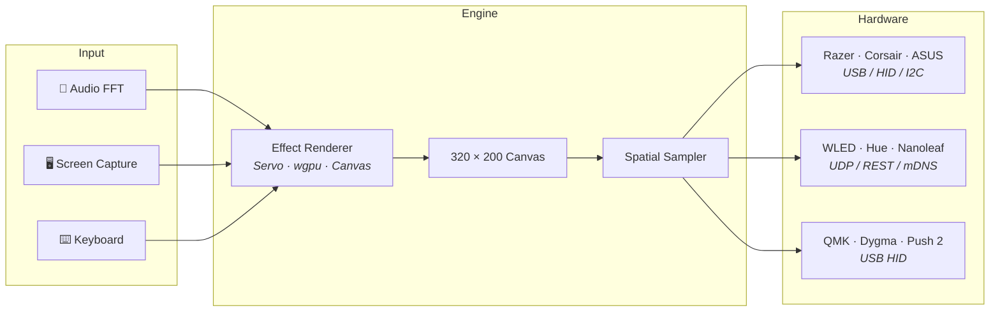
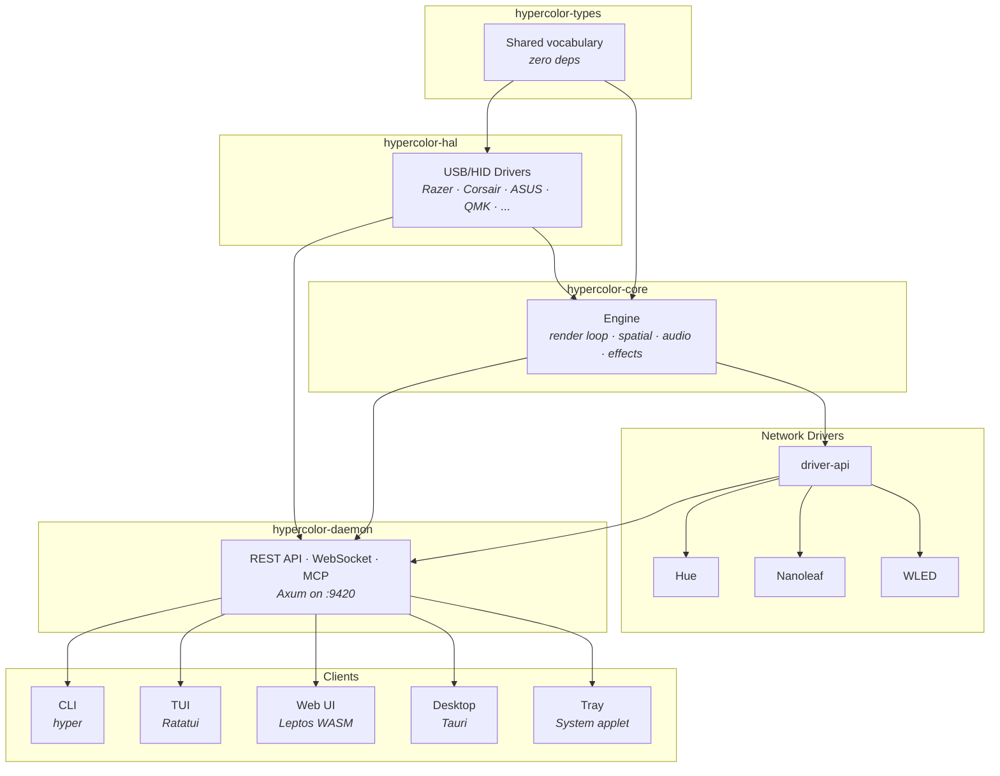

<p align="center">
  
</p>

<h1 align="center">Hypercolor</h1>

<p align="center">
  <strong>Open-Source RGB Lighting Engine for Linux</strong><br>
  <sub>✦ Effects are web pages. Your desk is the canvas. ✦</sub>
</p>

<p align="center">
  
  
  
  
  
</p>

<p align="center">
  <a href="https://github.com/hyperb1iss/hypercolor/blob/main/LICENSE">
    
  </a>
</p>

<p align="center">
  <a href="#-the-vision">Vision</a> •
  <a href="#-how-it-works">How It Works</a> •
  <a href="#-features">Features</a> •
  <a href="#-the-ui">The UI</a> •
  <a href="#️-the-tui">The TUI</a> •
  <a href="#-get-started">Get Started</a> •
  <a href="#-the-effect-sdk">Effect SDK</a> •
  <a href="#-architecture">Architecture</a> •
  <a href="#-contributing">Contributing</a>
</p>

---

## 🔮 The Vision

RGB lighting on Linux has always been fragmented — a patchwork of single-vendor tools, half-working
daemons, and effects that look like they were designed in 2012. Meanwhile, the best effects engine
is proprietary, Windows-only, and locked behind a subscription.

**Hypercolor changes that.**

One daemon. Every RGB device on your desk. Keyboards, mice, LED strips, smart lights, case fans —
all unified under a single engine that runs at 60fps. Effects aren't hardcoded routines; they're
**web pages** rendered by an embedded Servo browser and sampled onto your physical LED layout in
real time.

Your entire desk becomes a single synchronized canvas.

## ⚡ How It Works



Effects render to a virtual 320×200 pixel canvas. The spatial engine samples that canvas at each
LED's physical position. Audio, screen capture, and keyboard input feed into effects in real time.
One effect paints the whole room — your keyboard, your LED strip, your case fans — all synchronized
from the same visual source.

## 🌈 Features

### 🔌 Supported Hardware

| Backend | Protocol | Devices |
|---------|----------|---------|
| **Razer** | USB HID | Huntsman V2, Basilisk V3, Blade 14/15, Seiren Emote |
| **Corsair** | USB HID | iCUE LINK System Hub, Lighting Node, LCD displays |
| **ASUS** | USB HID / SMBus | Aura motherboards, GPUs, DRAM |
| **WLED** | UDP DDP + mDNS | Any WLED-compatible LED strip or controller |
| **PrismRGB** | USB HID | PrismRGB 8/S/Mini controllers |
| **Philips Hue** | REST / mDNS | Hue Bridge-connected lights |
| **Nanoleaf** | REST / mDNS | Light Panels, Canvas, Shapes |
| **Dygma Defy** | USB HID | Dygma Defy split keyboard |
| **QMK** | USB HID | Any QMK-compatible keyboard |
| **Ableton Push 2** | USB Bulk | Push 2 pad/button grid |

More drivers are being added regularly. Community driver contributions are especially welcome —
see [CONTRIBUTING.md](CONTRIBUTING.md) for how to get started.

### 🖥️ Dual Render Path

- **Servo** — an embedded browser rendering HTML Canvas, WebGL, and GLSL shaders headless at
  60fps. Existing community effects work unmodified.
- **wgpu** — native GPU shaders compiled to Vulkan, OpenGL, or Metal for maximum performance.

### 🎨 30+ Built-In Effects

Hypercolor ships with a curated library of handcrafted effects spanning ambient, audio-reactive,
generative, and interactive categories:

| | | | |
|---|---|---|---|
| Borealis | Neon City | Digital Rain | Meteor Storm |
| Shockwave | Voronoi Glass | Bubble Garden | Spectral Fire |
| Plasma Engine | Synth Horizon | Deep Current | Lava Lamp |
| Poisonous | Fiberflies | Ember Glow | Frost Crystal |
| Nebula Drift | Nyan Dash | Retro Rink | Frequency Cascade |

Every effect is open source, well-documented, and serves as a reference for writing your own.

### 🗺️ Spatial Layout Engine

Map your physical desk in the UI. Drag devices onto a 2D canvas, define LED topologies (strips,
matrices, rings), and the spatial sampler handles the rest — bilinear interpolation, area
averaging, or Gaussian sampling at every LED position.

### 🎧 Audio-Reactive Pipeline

Real-time FFT with beat detection, mel-band analysis, chromagram, and spectral features. Effects
react to bass hits, BPM, spectral centroid, or the full 200-bin spectrum. Lock-free buffering
ensures the render loop never blocks on audio.

### ✨ And More

- **Scene engine** with priority stacking, Oklab cross-fades, and automation rules
- **REST API + WebSocket** for full programmatic control
- **MCP server** for AI assistant integration (Claude Code, Cursor, etc.)
- **CLI tool** (`hyper`) with table/JSON output and shell completions
- **Hot-reload** — edit an effect, see it live instantly
- **Screen capture** input for ambient backlighting
- **D-Bus integration** for desktop automation triggers

## 💎 The UI

A web UI served directly by the daemon. Browse effects, tweak controls in real time, manage
devices, and design spatial layouts — all from your browser.

<table>
  <tr>
    <td align="center">
      <br>
      <sub>Effects browser with live preview</sub>
    </td>
    <td align="center">
      <br>
      <sub>Real-time controls with canvas preview</sub>
    </td>
  </tr>
  <tr>
    <td align="center">
      <br>
      <sub>Drag-and-drop spatial layout editor</sub>
    </td>
    <td align="center">
      <br>
      <sub>Device management</sub>
    </td>
  </tr>
</table>

- **Effects browser** — search, filter by category, favorites, audio-reactive tags
- **Live canvas preview** — the active effect streams in the sidebar and control panel
- **Auto-generated controls** — sliders, dropdowns, color pickers, and toggles derived from
  effect metadata
- **Spatial layout editor** — drag-and-drop device placement on a 2D canvas
- **Ambient reactivity** — the UI subtly tints its edges to match the active effect
- **Command palette** (⌘K) for keyboard-driven navigation

## 🖥️ The TUI

A terminal UI with true-color LED preview, audio visualization, and fullscreen effect rendering.
Runs anywhere you have a terminal.

<table>
  <tr>
    <td align="center">
      <br>
      <sub>Dashboard with live preview and device table</sub>
    </td>
    <td align="center">
      <br>
      <sub>Effects browser with control sliders</sub>
    </td>
  </tr>
  <tr>
    <td align="center">
      <br>
      <sub>Fullscreen preview — Bubble Garden</sub>
    </td>
    <td align="center">
      <br>
      <sub>Fullscreen preview — Cymatics</sub>
    </td>
  </tr>
</table>

- **Live effect preview** rendered in true-color half-block characters
- **Fullscreen mode** (F11) — effect fills the entire terminal
- **Audio spectrum** — real-time level meter and beat indicators
- **Quick actions** — number keys for instant effect switching

## 🚀 Get Started

### Install

```bash
git clone https://github.com/hyperb1iss/hypercolor.git
cd hypercolor
./scripts/install.sh
```

The installer builds the daemon, CLI, TUI, and web UI, installs a systemd user service, sets up
udev rules for USB device access, and persists `i2c-dev` so SMBus RGB devices survive reboot.

### Run

```bash
# Start the daemon (opens UI at http://localhost:9420)
hypercolor

# Or use the TUI (auto-starts a local daemon)
hypercolor-tui

# Or control from the command line
hyper effects list
hyper effects activate "Neon City"
hyper devices
```

### Development

If you're hacking on Hypercolor itself, we use [just](https://github.com/casey/just) for
development workflows:

```bash
just daemon          # Run daemon with hot reload
just tui             # Run the TUI
just ui-dev          # Leptos UI dev server on :9430
just sdk-dev         # SDK dev server with HMR
just verify          # fmt + lint + test
```

## ✦ The Effect SDK

Effects are TypeScript (or pure GLSL). The SDK compiles them to self-contained HTML files
that the engine renders at 60fps. Audio data, control values, and canvas context are all
injected automatically.

```typescript
import { effect } from '@hypercolor/sdk'
import shader from './fragment.glsl'

export default effect('Borealis', shader, {
    speed:          [1, 10, 5],       // → slider
    intensity:      [0, 100, 82],     // → slider
    palette:        ['Northern Lights', 'SilkCircuit', 'Cyberpunk'],  // → dropdown
}, {
    description: 'Aurora borealis — layered curtains of light',
})
```

Four tiers meet you where you are: **GLSL** (single file, zero JS), **`effect()`** (one-liner
shader binding), **`canvas()`** (Canvas 2D draw functions), and **full OOP** (class-based
with lifecycle hooks).

See the [Effect SDK Guide](docs/content/effects/sdk.md) for the full API reference.

## 🏗️ Architecture



14 crates with clear boundaries. Rust 2024 edition, `#![forbid(unsafe_code)]`, clippy pedantic.
The render loop runs on a dedicated thread with adaptive FPS (10–60fps). Lock-free channels
connect the event bus. Servo provides full web platform rendering headless.

## 📡 Status

Hypercolor is in active development (v0.1.0). The core engine, effect SDK, web UI, TUI, and
10 device backends are functional. We use Hypercolor daily — every screenshot in this README
was captured from a live instance with real hardware.

**Coming soon:** Lian Li Uni Hub support, scene automation engine, effect marketplace,
Wasmtime plugin system for community backends.

## 💜 Contributing

We welcome contributions! Whether it's new device drivers, effects, UI improvements, or
documentation — there's plenty to build.

**Writing effects** is the easiest way to start — the SDK makes it straightforward to create
something beautiful. **Device drivers** are where we need the most help — if you own hardware
Hypercolor doesn't support yet, you're in a unique position to contribute.

See [`CONTRIBUTING.md`](CONTRIBUTING.md) for guidelines.

## 📄 License

Apache-2.0 — See [LICENSE](LICENSE)

---

<p align="center">
  <a href="https://github.com/hyperb1iss/hypercolor">
    
  </a>
  &nbsp;&nbsp;
  <a href="https://ko-fi.com/hyperb1iss">
    
  </a>
</p>

<p align="center">
  <sub>
    If Hypercolor lights up your desk, give us a ⭐ or <a href="https://ko-fi.com/hyperb1iss">support the project</a>
    <br><br>
    ✦ Built with obsession by <a href="https://hyperbliss.tech"><strong>Hyperbliss</strong></a> ✦
  </sub>
</p>
