<p align="center">
  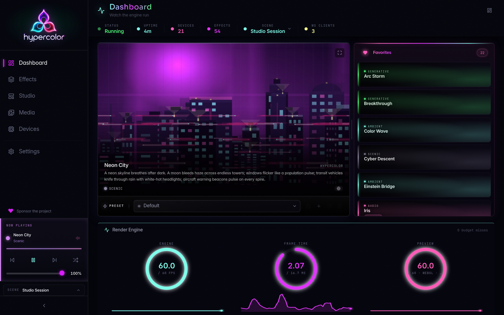
</p>

<h1 align="center">Hypercolor</h1>

<p align="center">
  <strong>Open-Source RGB Lighting Engine for Linux, macOS, and Windows</strong><br>
  <sub>✦ Your world is a canvas: paint every pixel. ✦</sub>
</p>

<p align="center">
  
  
  
  
  
</p>

<p align="center">
  <a href="https://github.com/hyperb1iss/hypercolor/blob/main/LICENSE">
    
  </a>
</p>

<p align="center">
  <a href="#-the-vision">Vision</a> •
  <a href="#-how-it-works">How It Works</a> •
  <a href="#-features">Features</a> •
  <a href="#-the-ui">The UI</a> •
  <a href="#️-the-tui">The TUI</a> •
  <a href="#-get-started">Get Started</a> •
  <a href="#-the-effect-sdk">Effect SDK</a> •
  <a href="#-architecture">Architecture</a> •
  <a href="#-contributing">Contributing</a>
</p>

---

## 🔮 The Vision

RGB lighting is a mess. Single-vendor tools that don't talk to each other, half-working daemons,
and effects that look like they were designed in 2012. The one great effects engine is proprietary,
Windows-only, and behind a subscription.

**Hypercolor is the fix.**

One daemon. Every RGB device you own. Motherboards, keyboards, mice, LED strips, smart lights,
case fans, all driven by the same engine at 60fps. Effects aren't hardcoded routines. They're
web pages, rendered by an embedded Servo browser and sampled onto your physical LED layout
every frame.

Your world is a canvas. Paint every pixel.

## ⚡ How It Works

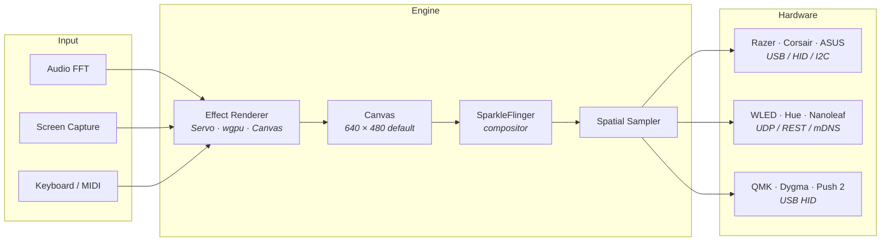

Effects render to a virtual RGBA canvas, 640×480 by default and tunable in the daemon's rendering
settings. **SparkleFlinger**, the render-thread compositor, latches the newest surface from each
producer at the frame boundary and blends them into one canonical frame every tick. The spatial
engine samples that frame at each LED's physical position. Effects use normalized `[0.0, 1.0]`
coordinates, so they stay resolution-independent across canvas sizes. Audio, screen capture, and
keyboard input feed the render every frame. One effect paints the whole room. Your keyboard,
your LED strip, your case fans, all drawing from the same source.

## 🌈 Features

### 🔌 Supported Hardware

| Backend | Protocol | Devices |
|---------|----------|---------|
| **Razer** | USB HID | Huntsman V2, Basilisk V3, Blade 14/15, Seiren Emote |
| **Corsair** | USB HID | iCUE LINK System Hub, Lighting Node, LCD displays |
| **ASUS** | USB HID / SMBus | Aura motherboards, GPUs, DRAM |
| **WLED** | UDP DDP + mDNS | Any WLED-compatible LED strip or controller |
| **PrismRGB** | USB HID | PrismRGB 8/S/Mini controllers |
| **Philips Hue** | REST / mDNS | Hue Bridge-connected lights |
| **Nanoleaf** | REST / mDNS | Light Panels, Canvas, Shapes |
| **Dygma Defy** | USB HID | Dygma Defy split keyboard |
| **QMK** | USB HID | Any QMK-compatible keyboard |
| **Ableton Push 2** | USB Bulk | Push 2 pad/button grid |

New drivers land often. If you own hardware Hypercolor doesn't support yet, see
[CONTRIBUTING.md](CONTRIBUTING.md).

### 🖥️ Dual Render Path

- **Servo:** an embedded browser rendering HTML Canvas, WebGL, and GLSL shaders headless at
  60fps. Existing community effects work unmodified.
- **wgpu:** native GPU shaders compiled to Vulkan, OpenGL, or Metal for maximum performance.

### 🎨 40+ Built-In Effects

Hypercolor ships 40+ effects across four packs: Synthwave, Cosmic, Audio Reactive, and Organic.
Ambient backgrounds, shader-heavy showpieces, and beat-synced visualizers. Every one is open
source and built to be forked.

| | | | |
|---|---|---|---|
| Borealis | Neon City | Hyperspace | Cymatics |
| Synth Horizon | Fractalux | Iris | Arc Storm |
| Voidweaver | Lava Lamp | Ink Tide | Wormhole |
| Nebula Drift | Frequency Cascade | Spectral Fire | Cyber Descent |
| Bubble Garden | Nyan Dash | Deep Current | Breakthrough |

### 🗺️ Spatial Layout Engine

Map your physical desk in the UI. Drag devices onto a 2D canvas, define LED topologies (strips,
matrices, rings), and the spatial sampler resolves pixels to LEDs. Pick nearest, bilinear, area
average, or Gaussian sampling at every position.

### 🎧 Audio-Reactive Pipeline

FFT with beat detection, mel-band analysis, chromagram, and spectral features. Effects react
to bass hits, BPM, spectral centroid, or the full 200-bin spectrum. Lock-free buffering keeps
the render loop from ever blocking on audio.

### 🌊 And More

- **Scene engine** with priority stacking, Oklab cross-fades, and automation rules
- **REST API + WebSocket** for full programmatic control
- **MCP server** for AI assistant integration (Claude Code, Cursor, and friends)
- **CLI tool** (`hypercolor`) with table/JSON output and shell completions
- **Hot-reload** on effect changes, no restart required
- **Screen capture** input for ambient backlighting
- **D-Bus integration** for desktop automation triggers

## 💎 The UI

A web UI served directly by the daemon. Browse effects, tweak controls live, manage devices,
and design spatial layouts from any browser.

<table>
  <tr>
    <td align="center">
      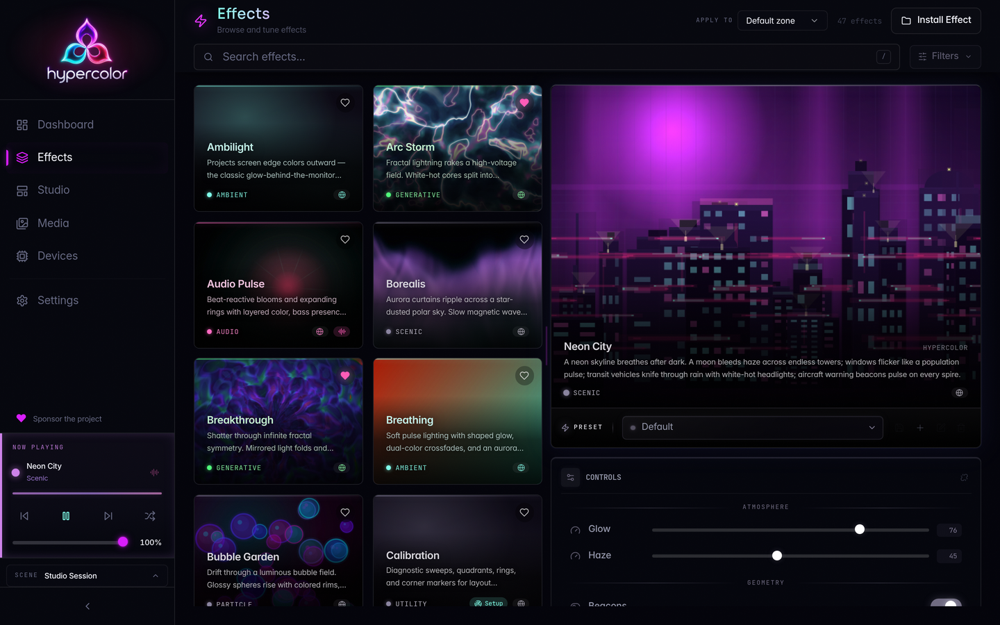<br>
      <sub>Effects browser with live preview</sub>
    </td>
    <td align="center">
      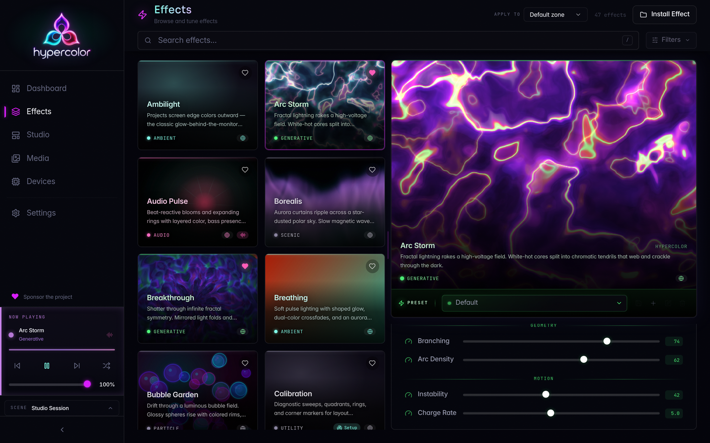<br>
      <sub>Control panel with canvas preview</sub>
    </td>
  </tr>
  <tr>
    <td align="center">
      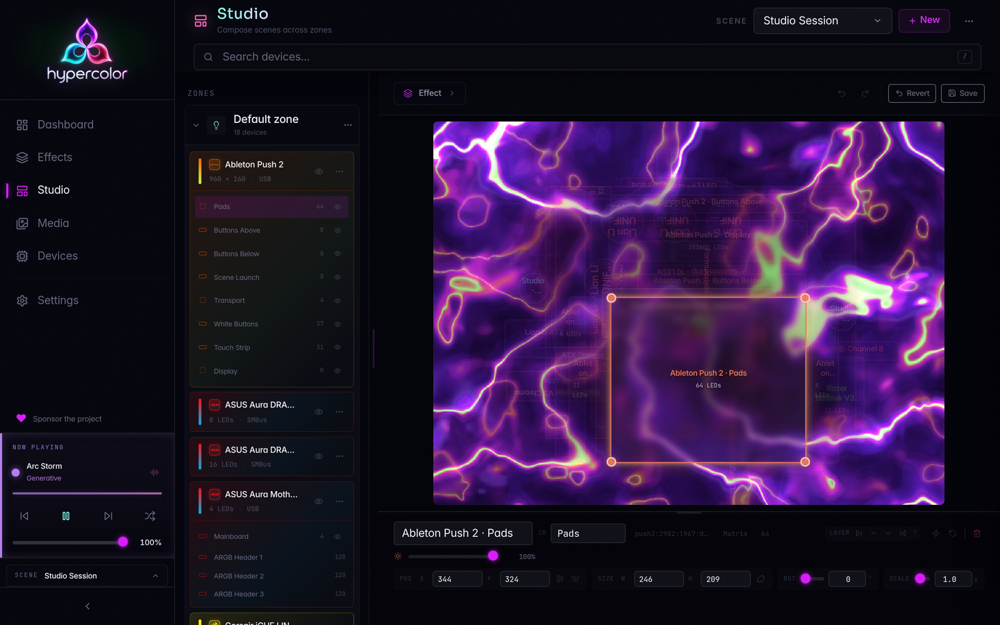<br>
      <sub>Drag-and-drop spatial layout editor</sub>
    </td>
    <td align="center">
      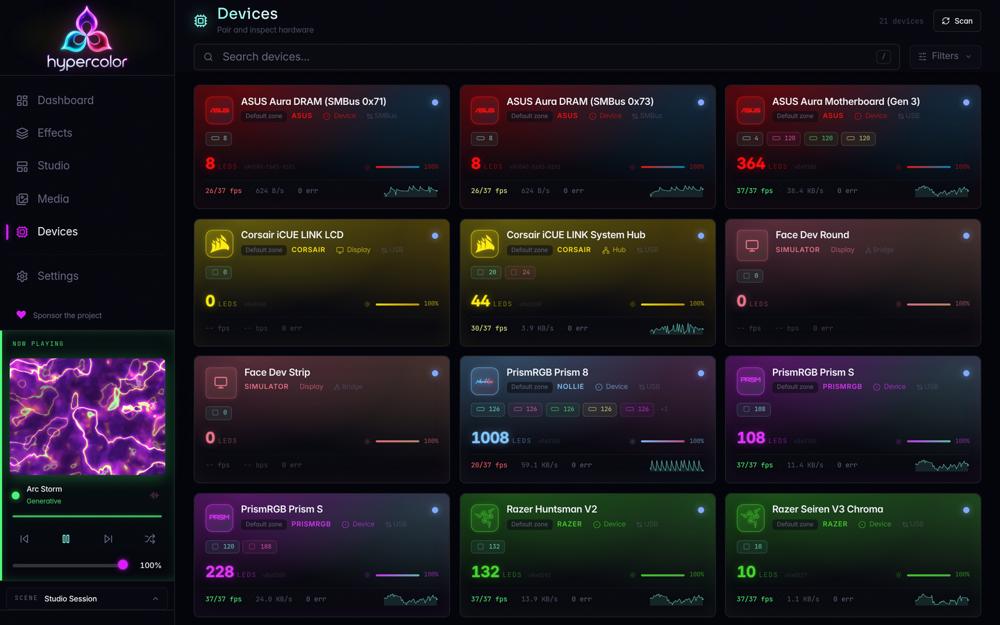<br>
      <sub>Device management</sub>
    </td>
  </tr>
</table>

- **Effects browser:** search, filter by category, favorites, audio-reactive tags
- **Live canvas preview:** the active effect streams in the sidebar and control panel
- **Auto-generated controls:** sliders, dropdowns, color pickers, and toggles derived from
  effect metadata
- **Spatial layout editor:** drag-and-drop device placement on a 2D canvas
- **Ambient reactivity:** the UI tints its edges to match the active effect
- **Command palette** (⌘K) for keyboard-driven navigation

## 🖥️ The TUI

A terminal UI with true-color LED preview, audio visualization, and fullscreen effect rendering.
Runs wherever you have a terminal.

<table>
  <tr>
    <td align="center">
      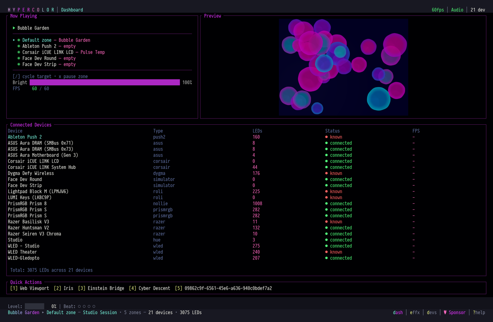<br>
      <sub>Dashboard with live preview and device table</sub>
    </td>
    <td align="center">
      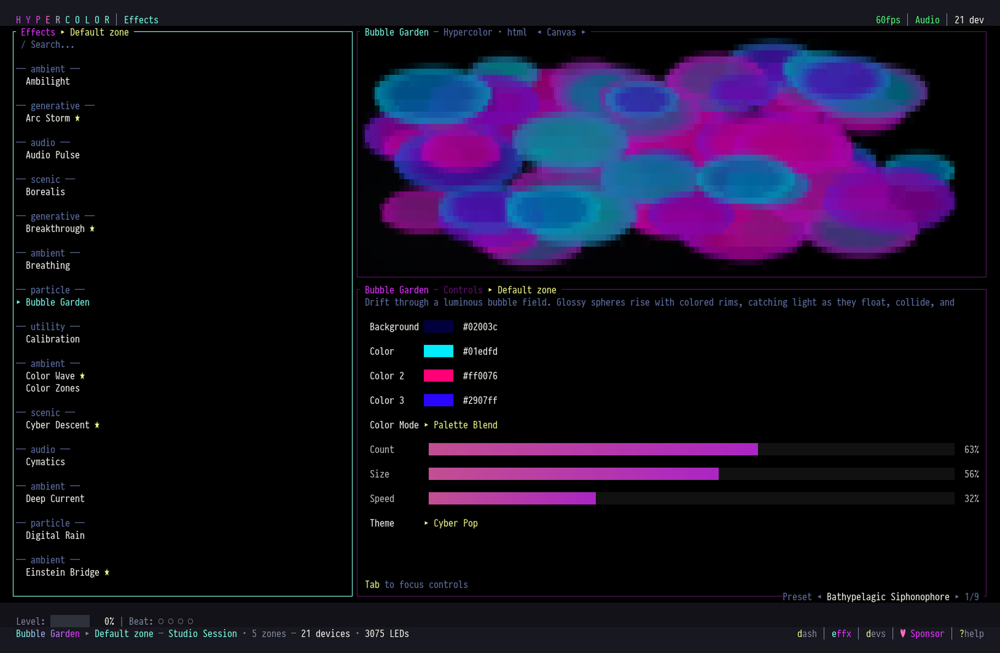<br>
      <sub>Effects browser with control sliders</sub>
    </td>
  </tr>
  <tr>
    <td align="center">
      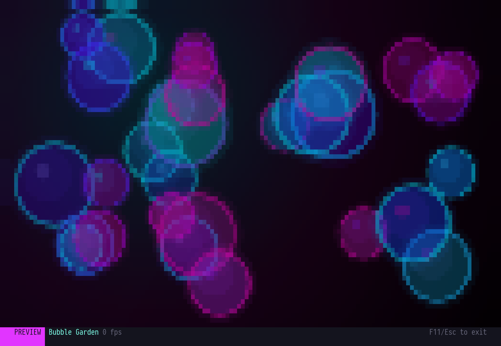<br>
      <sub>Bubble Garden fullscreen</sub>
    </td>
    <td align="center">
      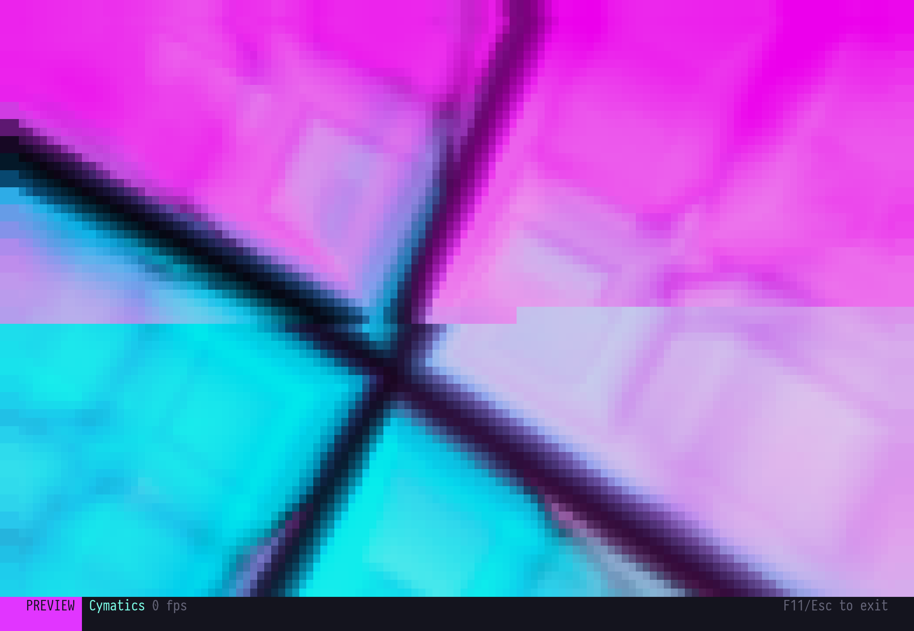<br>
      <sub>Cymatics fullscreen</sub>
    </td>
  </tr>
</table>

- **Live effect preview** rendered in true-color half-block characters
- **Fullscreen mode** (F11) fills the entire terminal with the active effect
- **Audio spectrum** with level meter and beat indicators
- **Quick actions:** number keys for instant effect switching

## 🎯 Get Started

Hypercolor is Linux-first with working macOS and Windows support. Deeper integration on Mac
and Windows is actively growing.

### Install on Linux

```bash
git clone https://github.com/hyperb1iss/hypercolor.git
cd hypercolor
./scripts/install.sh
```

The installer builds the daemon, CLI, TUI, and web UI, installs a systemd user service, sets
up udev rules for USB device access, and persists `i2c-dev` so SMBus RGB devices survive
reboot.

### Install on macOS and Windows

```bash
git clone https://github.com/hyperb1iss/hypercolor.git
cd hypercolor
cargo build --release
```

The daemon and CLI build clean on all three platforms. Service management and permission setup
are still manual outside Linux.

### Run

```bash
# Start the daemon (opens UI at http://localhost:9420)
hypercolor-daemon

# Control from the command line
hypercolor effects list
hypercolor effects activate "Neon City"
hypercolor devices

# Or drop into the interactive terminal dashboard (auto-starts a local daemon)
hypercolor tui
```

### Development

Hacking on Hypercolor itself? We use [just](https://github.com/casey/just) for development
workflows.

```bash
just daemon          # Run daemon with hot reload
just tui             # Run the TUI
just ui-dev          # Leptos UI dev server on :9430
just sdk-dev         # SDK dev server with HMR
just verify          # fmt + lint + test
```

## ✦ The Effect SDK

Effects are TypeScript, Canvas, or pure GLSL. The SDK compiles them to self-contained HTML
files that the engine renders at 60fps. Audio data, control values, and canvas context are
all injected automatically.

```typescript
import { effect } from '@hypercolor/sdk'
import shader from './fragment.glsl'

export default effect('Borealis', shader, {
    speed:          [1, 10, 5],       // → slider
    intensity:      [0, 100, 82],     // → slider
    palette:        ['Northern Lights', 'SilkCircuit', 'Cyberpunk'],  // → dropdown
}, {
    description: 'Aurora borealis, layered curtains of light',
})
```

Four tiers, pick the one that fits: **GLSL** (single file, zero JS), **`effect()`** (one-liner
shader binding), **`canvas()`** (Canvas 2D draw functions), and **full OOP** (class-based with
lifecycle hooks).

See the [Effect SDK Guide](docs/content/effects/sdk.md) for the full API reference.

## 🏗️ Architecture

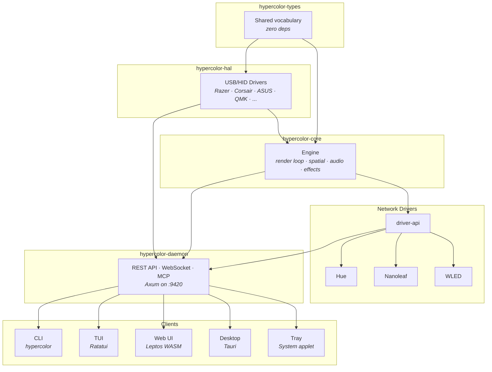

It's Rust all the way down. 14 crates, zero `unsafe`, clippy pedantic. The daemon, CLI, TUI,
tray applet, and HAL drivers are all Rust. The web UI is Rust compiled to WASM via Leptos.
Even the embedded browser is Servo (Rust). The only non-Rust code is the TypeScript effect
SDK and the GLSL shaders it compiles.

The render thread runs on a dedicated OS thread with adaptive FPS (10 to 60, auto-shifting
across 5 tiers based on measured budget). Each tick, SparkleFlinger composes frame producers
into one canonical surface, with a zero-copy bypass fast path when a single full-opacity
layer is active. The event bus uses lock-free `tokio::sync::watch` channels for high-frequency
frame data and `broadcast` for discrete events. `zerocopy` structs handle wire-format encoding
at zero allocation cost per frame. The spatial engine caches LED positions and samples the
composed frame with configurable interpolation (nearest, bilinear, area average, Gaussian).

`#![forbid(unsafe_code)]` across the entire workspace. Edition 2024. Rust 1.94+.

## 📡 Status

Hypercolor is in active development (v0.1.0). The core engine, effect SDK, web UI, TUI, and
10 device backends all work today. Linux has the deepest support, with macOS and Windows
tracking closely. Every screenshot in this README was captured from a live instance running
on real hardware.

**Coming soon:** Lian Li Uni Hub support, scene automation engine, effect marketplace, and a
Wasmtime plugin system for community backends.

## 💜 Contributing

Hypercolor grows on contributions. Drivers, effects, UI polish, docs, all of it lands here.

**Writing effects** is the fastest way in. The SDK compiles TypeScript, Canvas, or GLSL
straight to HTML, and the engine picks them up on save. **Device drivers** are where the
leverage is highest. If you own hardware that isn't on the supported list, you're the person
to add it.

See [`CONTRIBUTING.md`](CONTRIBUTING.md) for guidelines.

## 📄 License

Apache-2.0. See [LICENSE](LICENSE).

---

<p align="center">
  <a href="https://github.com/hyperb1iss/hypercolor">
    
  </a>
  &nbsp;&nbsp;
  <a href="https://ko-fi.com/hyperb1iss">
    
  </a>
</p>

<p align="center">
  <sub>
    If Hypercolor lights up your desk, give us a ⭐ or <a href="https://ko-fi.com/hyperb1iss">support the project</a>
    <br><br>
    ✦ Built with obsession by <a href="https://hyperbliss.tech"><strong>Hyperbliss</strong></a> ✦
  </sub>
</p>
