<p align="center">
  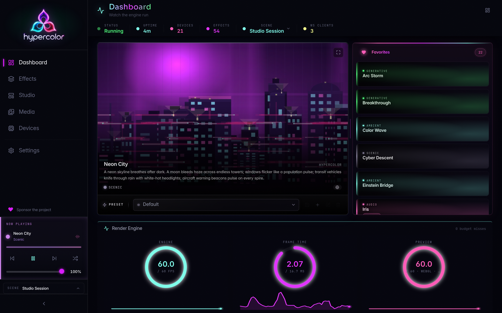
</p>

<h1 align="center">Hypercolor</h1>

<p align="center">
  <strong>Open-source RGB lighting engine for Linux, Windows, and macOS</strong><br>
  <sub>✦ Your world is a canvas: paint every pixel. ✦</sub>
</p>

<p align="center">
  
  
  
  
  
</p>

<p align="center">
  <a href="https://github.com/hyperb1iss/hypercolor/blob/main/LICENSE">
    
  </a>
</p>

<p align="center">
  <a href="#-the-vision">Vision</a> •
  <a href="#-how-it-works">How It Works</a> •
  <a href="#-features">Features</a> •
  <a href="#-the-ui">The UI</a> •
  <a href="#️-the-tui">The TUI</a> •
  <a href="#-get-started">Get Started</a> •
  <a href="#-the-effect-sdk">Effect SDK</a> •
  <a href="#️-architecture">Architecture</a> •
  <a href="#-status">Status</a> •
  <a href="#security-and-conduct">Security</a> •
  <a href="#-contributing">Contributing</a>
</p>

---

## 🔮 The Vision

RGB lighting is a mess. Single-vendor tools that don't talk to each other, half-working daemons,
and effects that look like they were designed in 2012. The one great effects engine is proprietary,
Windows-only, and behind a subscription.

**Hypercolor is the fix.**

One app. Every RGB device you own. Motherboards, keyboards, mice, LED strips, smart lights,
case fans, all driven by the same engine at up to 60fps. Effects aren't hardcoded routines.
They're web pages, rendered by an embedded Servo browser and sampled onto your physical LED
layout every frame. And it runs on Linux, Windows, and macOS.

Your world is a canvas. Paint every pixel.

## ⚡ How It Works

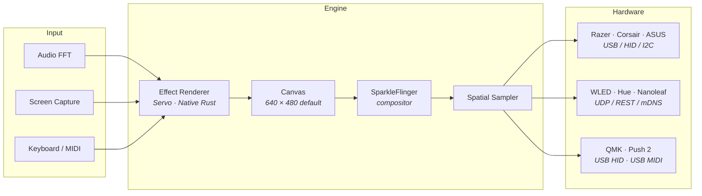
```mermaid
graph LR
    subgraph Input
        A[Audio FFT]
        B[Screen Capture]
        C[Keyboard / MIDI]
    end

    subgraph Engine
        D[Effect Renderer<br><i>Servo · Native Rust</i>]
        E[Canvas<br><i>640 × 480 default</i>]
        SF[SparkleFlinger<br><i>compositor</i>]
        F[Spatial Sampler]
    end

    subgraph Hardware
        G[Razer · Corsair · ASUS<br><i>USB / HID / I2C</i>]
        H[WLED · Hue · Nanoleaf<br><i>UDP / REST / mDNS</i>]
        I[QMK · Push 2<br><i>USB HID · USB MIDI</i>]
    end

    A & B & C --> D
    D --> E --> SF --> F
    F --> G & H & I
```

Effects render to a virtual RGBA canvas, 640×480 by default and tunable in the daemon's rendering
settings. **SparkleFlinger**, the render-thread compositor, latches the newest surface from each
producer at the frame boundary and blends them into one canonical frame every tick. The spatial
engine samples that frame at each LED's physical position. Effects use normalized `[0.0, 1.0]`
coordinates, so they stay resolution-independent across canvas sizes. Audio, screen capture, and
keyboard input feed the render every frame. One effect paints the whole room. Your keyboard,
your LED strip, your case fans, all drawing from the same source.

## 🌈 Features

### 🔌 Supported Hardware

<!-- BEGIN COMPAT -->
<!-- GENERATED by scripts/gen-compat.ts. Do not edit inside the BEGIN/END COMPAT block. Run `just compat` to refresh. -->

Hypercolor tracks **418 devices** across **32 vendors** in `data/drivers/vendors/`. **183** ship with a working driver today across **12 driver families**. **233 more** are researched or known, awaiting implementation or hardware to test.

| Vendor | Supported | In progress | Researched | Blocked | Drivers |
|---|--:|--:|--:|--:|---|
| [Ableton](docs/content/hardware/compatibility.md#ableton) | 1 | — | — | — | `push2` |
| [Alienware](docs/content/hardware/compatibility.md#alienware) | — | — | 3 | — | — |
| [Aqua Computer](docs/content/hardware/compatibility.md#aquacomputer) | — | — | 4 | — | — |
| [ASRock](docs/content/hardware/compatibility.md#asrock) | — | — | 4 | — | — |
| [ASUS](docs/content/hardware/compatibility.md#asus) | 10 | — | 10 | — | `asus` |
| [Cooler Master](docs/content/hardware/compatibility.md#coolermaster) | — | — | 20 | — | — |
| [Corsair](docs/content/hardware/compatibility.md#corsair) | 49 | — | 34 | — | `corsair` |
| [Dygma](docs/content/hardware/compatibility.md#dygma) | — | — | — | 2 | `dygma` |
| [EVGA](docs/content/hardware/compatibility.md#evga) | — | — | 7 | — | — |
| [Fnatic](docs/content/hardware/compatibility.md#fnatic) | — | — | 3 | — | — |
| [Gigabyte](docs/content/hardware/compatibility.md#gigabyte) | — | — | 8 | — | — |
| [Glorious](docs/content/hardware/compatibility.md#glorious) | 1 | — | 4 | — | `qmk` |
| [Govee](docs/content/hardware/compatibility.md#govee) | 4 | — | — | — | `govee` |
| [HyperX](docs/content/hardware/compatibility.md#hyperx) | — | — | 16 | — | — |
| [HYTE](docs/content/hardware/compatibility.md#hyte) | — | — | 2 | — | — |
| [Lian Li](docs/content/hardware/compatibility.md#lianli) | 13 | — | 2 | — | `lianli` |
| [Logitech](docs/content/hardware/compatibility.md#logitech) | — | — | 9 | — | — |
| [Mountain](docs/content/hardware/compatibility.md#mountain) | — | — | 4 | — | — |
| [MSI](docs/content/hardware/compatibility.md#msi) | — | — | 11 | — | — |
| [Nanoleaf](docs/content/hardware/compatibility.md#nanoleaf) | 1 | — | — | — | `nanoleaf` |
| [Nollie](docs/content/hardware/compatibility.md#nollie) | 19 | — | — | — | `nollie` |
| [NZXT](docs/content/hardware/compatibility.md#nzxt) | — | — | 17 | — | — |
| [Philips](docs/content/hardware/compatibility.md#philips) | 1 | — | — | — | `hue` |
| [PrismRGB](docs/content/hardware/compatibility.md#prismrgb) | 3 | — | — | — | `nollie`, `prismrgb` |
| [QMK](docs/content/hardware/compatibility.md#qmk) | 10 | — | — | — | `qmk` |
| [Razer](docs/content/hardware/compatibility.md#razer) | 70 | — | 38 | — | `razer` |
| [Roccat](docs/content/hardware/compatibility.md#roccat) | — | — | 14 | — | — |
| [Sony](docs/content/hardware/compatibility.md#sony) | — | — | 3 | — | — |
| [SteelSeries](docs/content/hardware/compatibility.md#steelseries) | — | — | 6 | — | — |
| [Thermaltake](docs/content/hardware/compatibility.md#thermaltake) | — | — | 10 | — | — |
| [WLED](docs/content/hardware/compatibility.md#wled) | 1 | — | — | — | `wled` |
| [Wooting](docs/content/hardware/compatibility.md#wooting) | — | — | 4 | — | — |

New drivers land often. Full matrix: [docs/content/hardware/compatibility.md](docs/content/hardware/compatibility.md). If you own hardware Hypercolor doesn't support yet, see [CONTRIBUTING.md](CONTRIBUTING.md).
<!-- END COMPAT -->

### 🖥️ Dual Render Path

- **Servo:** an embedded browser rendering HTML Canvas, WebGL, and GLSL shaders headless at
  60fps. Existing community effects work unmodified.
- **Native Rust:** compiled-in CPU renderers for the built-in effects, with no browser in the
  frame path.

Composition is GPU-accelerated separately: the SparkleFlinger compositor uses wgpu to blend
producer surfaces and to import Servo frames.

### 🎨 57 Built-In Effects

Hypercolor ships 57 built-in effects (46 authored with the SDK, 11 native Rust, 10 of them
in builds without the Servo renderer) spanning ambient, audio-reactive, shader, generative,
and interactive styles, plus 7 display faces for devices with LCD panels. Ambient backgrounds, shader-heavy showpieces, beat-synced
visualizers, and Keystrike, an interactive effect that lights up under your keystrokes.
Every one is open source and built to be forked, and the catalog ships with curated cover
art and tuned presets.

|               |                   |               |               |
| ------------- | ----------------- | ------------- | ------------- |
| Borealis      | Neon City         | Hyperspace    | Cymatics      |
| Synth Horizon | Fractalux         | Iris          | Arc Storm     |
| Voidweaver    | Lava Lamp         | Ink Tide      | Wormhole      |
| Nebula Drift  | Frequency Cascade | Spectral Fire | Cyber Descent |
| Bubble Garden | Nyan Dash         | Deep Current  | Breakthrough  |

### 🗺️ Spatial Layout Engine

Map your physical desk in the UI. Drag devices onto a 2D canvas, define LED topologies (strips,
matrices, rings), and the spatial sampler resolves pixels to LEDs. Pick nearest, bilinear, area
average, or Gaussian sampling at every position.

### 🎧 Audio-Reactive Pipeline

FFT with beat detection, mel-band analysis, chromagram, and spectral features. Effects react
to bass hits, BPM, spectral centroid, or the full 200-bin spectrum. Lock-free buffering keeps
the render loop from ever blocking on audio.

### ⌨️ Interactive Effects

Effects can react to your keyboard and mouse. The input pipeline is consent-gated and
demand-driven: it is off by default, sources open devices only while an interactive effect
is running, and input events ride a dedicated control-tier channel that never leaves the
render pipeline. Native backends per platform: evdev on Linux, Raw Input on Windows, and a
Core Graphics event tap on macOS.

### 🌊 And More

- **Scene engine** with priority stacking, Oklab cross-fades, and automation rules
- **Display faces** for LCD-equipped devices: clocks, sensor dashboards, now-playing panels
- **Screen capture** input for ambient backlighting: Desktop Duplication on Windows
  (works out of the box), Wayland portal on Linux (opt-in), and Apple's system picker on
  macOS
- **Portable device identity**: devices keep their identity across cable moves, IP churn,
  and BIOS renumbering, and layouts can be rebound after hardware swaps
- **REST API + WebSocket** for full programmatic control
- **MCP server** for AI assistant integration (Claude Code, Cursor, and friends)
- **CLI tool** (`hypercolor`) with table/JSON output and shell completions
- **Hot-reload** on effect changes, no restart required
- **Session and power awareness** on all three platforms: logind and screensaver over D-Bus
  on Linux, `WM_POWERBROADCAST` plus WTS session lock/unlock on Windows, and NSWorkspace
  plus IOKit system-power notifications on macOS

## 💎 The UI

The web UI is built right in: open `http://localhost:9420` and everything is there, no
separate install. Browse effects, tweak controls live, manage devices, and design spatial
layouts from any browser. The whole thing is responsive, so your phone works as a remote
control for the rig.

<table>
  <tr>
    <td align="center">
      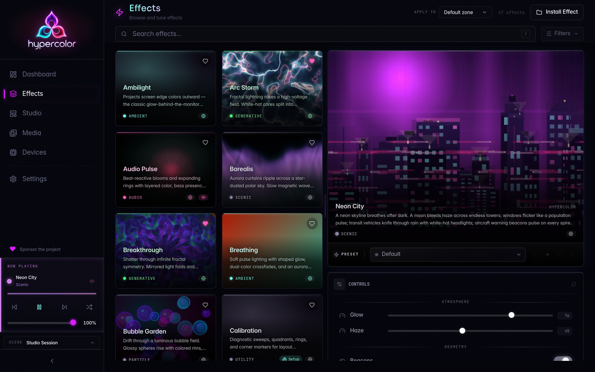<br>
      <sub>Effects browser with live preview</sub>
    </td>
    <td align="center">
      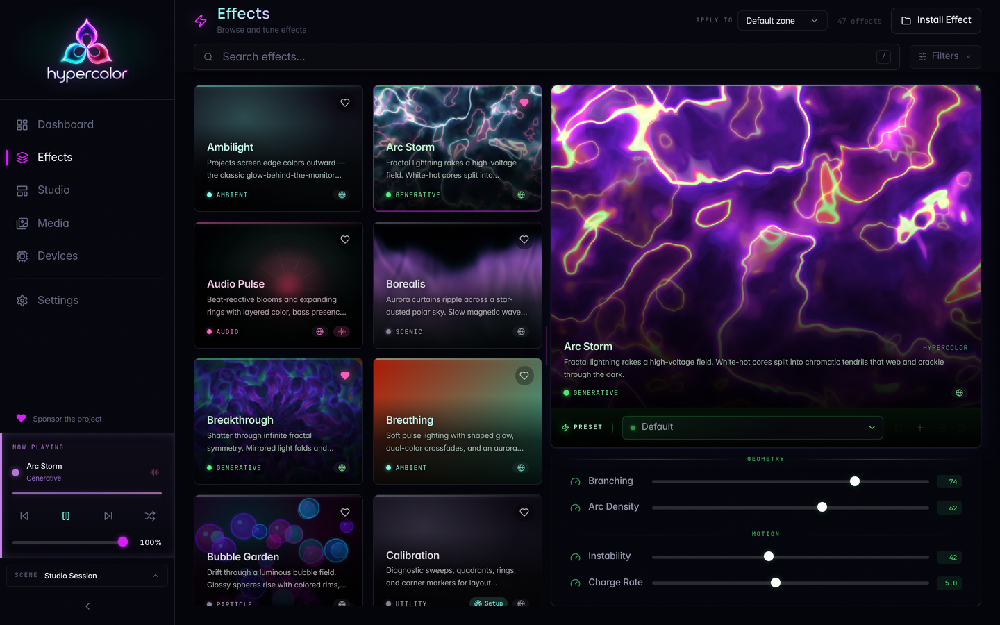<br>
      <sub>Control panel with canvas preview</sub>
    </td>
  </tr>
  <tr>
    <td align="center">
      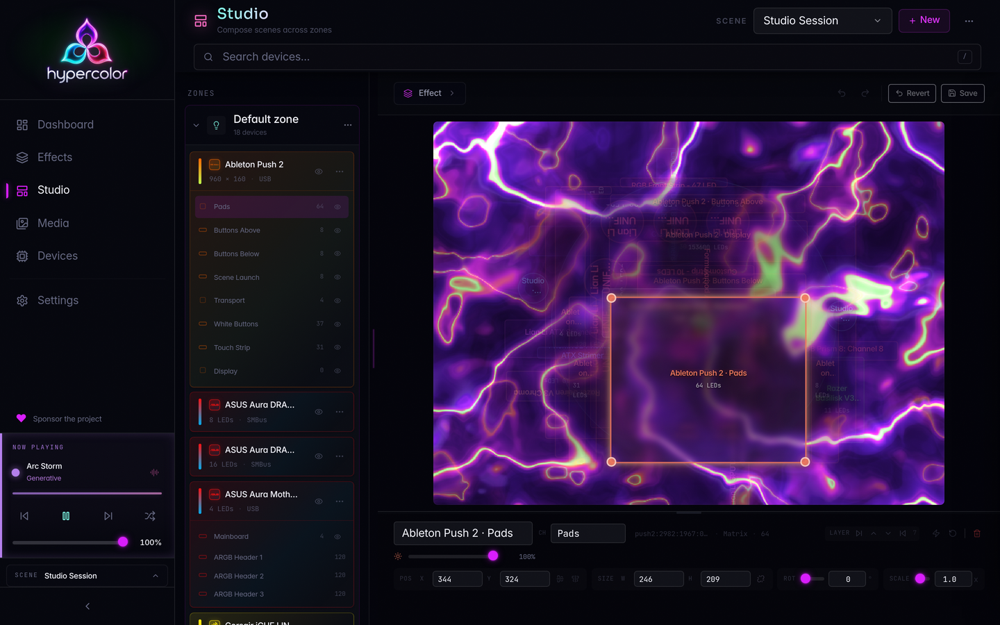<br>
      <sub>Drag-and-drop spatial layout editor</sub>
    </td>
    <td align="center">
      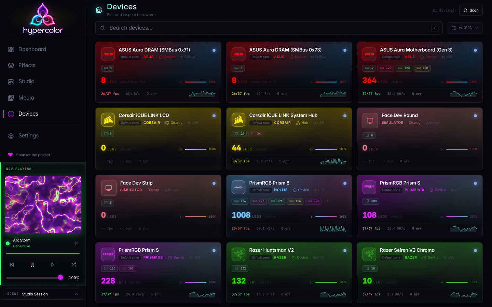<br>
      <sub>Device management</sub>
    </td>
  </tr>
  <tr>
    <td align="center">
      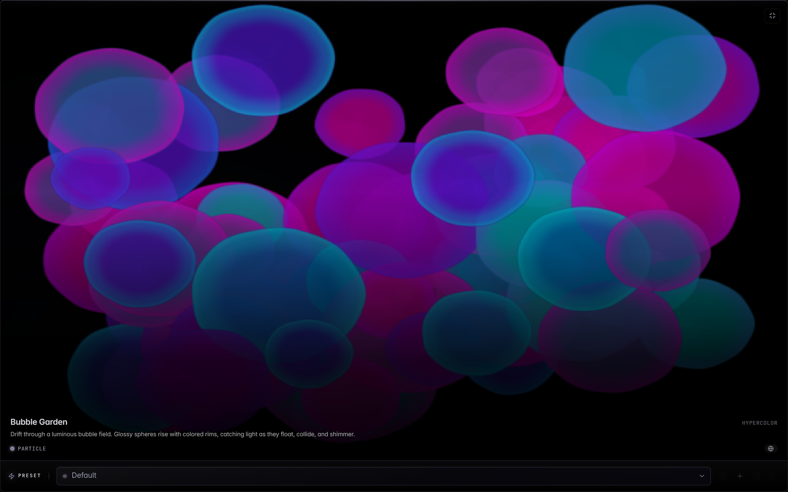<br>
      <sub>Fullscreen canvas: Bubble Garden</sub>
    </td>
    <td align="center">
      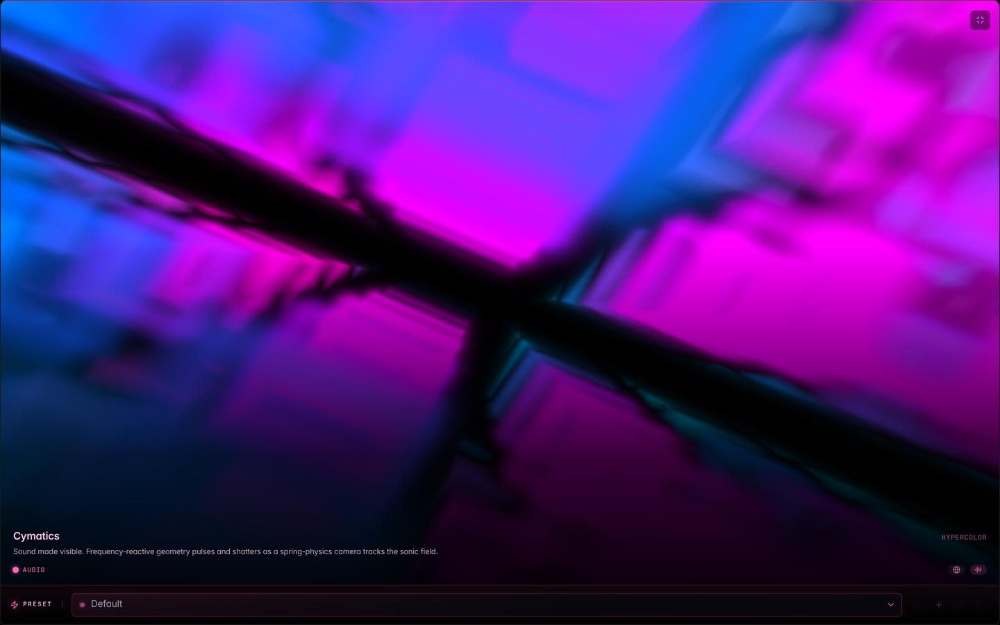<br>
      <sub>Fullscreen canvas: Cymatics, audio-reactive</sub>
    </td>
  </tr>
</table>

- **Effects browser:** search, filter by category, favorites, audio-reactive tags
- **Live canvas preview:** the active effect streams in the sidebar and control panel
- **Auto-generated controls:** sliders, dropdowns, color pickers, and toggles derived from
  effect metadata
- **Spatial layout editor:** drag-and-drop device placement on a 2D canvas
- **Ambient reactivity:** the UI tints its edges to match the active effect
- **Command palette** (⌘K) for keyboard-driven navigation

## 🖥️ The TUI

A terminal UI with true-color LED preview, audio visualization, and fullscreen effect rendering.
Runs wherever you have a terminal.

<table>
  <tr>
    <td align="center">
      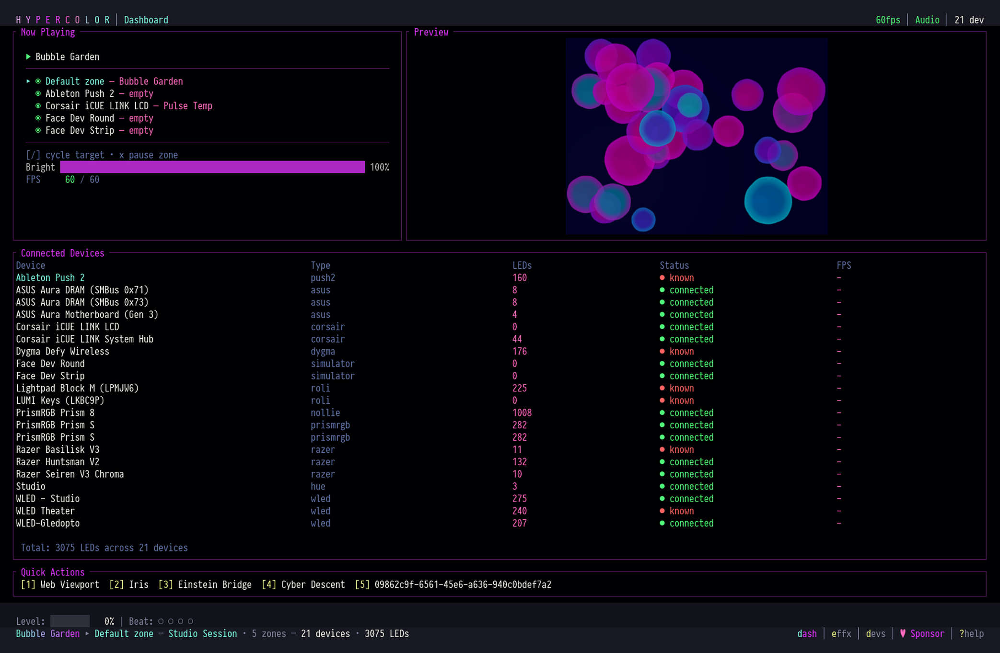<br>
      <sub>Dashboard with live preview and device table</sub>
    </td>
    <td align="center">
      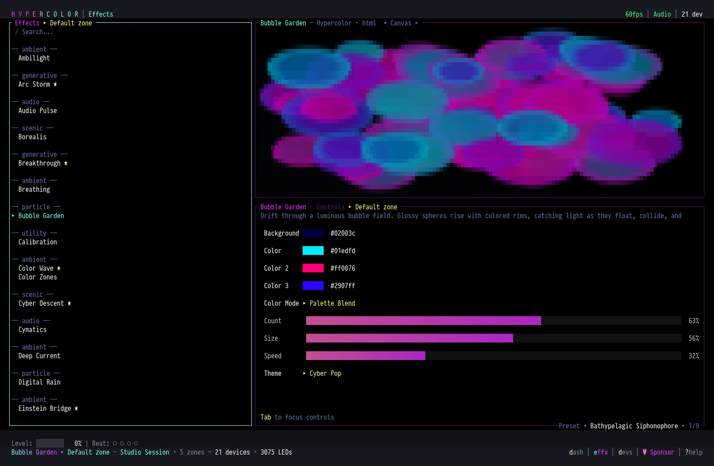<br>
      <sub>Effects browser with control sliders</sub>
    </td>
  </tr>
</table>

- **Live effect preview** rendered in true-color half-block characters
- **Fullscreen mode** (`z`) fills the entire terminal with the active effect
- **Audio spectrum** with level meter and beat indicators
- **Quick actions:** number keys for instant effect switching

## 🎯 Get Started

Public CI ships Linux and Windows installers with every tagged release. Signed
macOS artifacts use a manual release lane because they require Developer ID
signing, notarization, and physical acceptance. Grab an available artifact from
the [GitHub releases page](https://github.com/hyperb1iss/hypercolor/releases), or
use one of the paths below.

### Install on Linux

The release installer downloads the right tarball, verifies its checksum, and sets up the
systemd user service:

```bash
curl -fsSL https://raw.githubusercontent.com/hyperb1iss/hypercolor/main/scripts/install-release.sh | bash
```

Device-node permissions are a separate step: run `just udev-install` from a source
checkout, or install the `.deb` or AUR package, both of which ship the udev rules
themselves.

Debian and Ubuntu users can install the `.deb` from the releases page. Arch users have
[`hypercolor-bin`](https://aur.archlinux.org/packages/hypercolor-bin) on the AUR, and the
Homebrew formula works on Linux too: `brew install hyperb1iss/tap/hypercolor`.

Building from source instead:

```bash
git clone https://github.com/hyperb1iss/hypercolor.git
cd hypercolor
cargo install just
just setup
just install
```

Setup installs the Rust toolchain, system packages, Bun, Trunk, cargo-deny, and frontend
dependencies. The installer then builds the daemon, CLI, TUI, web UI, and bundled effects,
installs a systemd user service, sets up udev rules for USB device access, and persists
`i2c-dev` so SMBus RGB devices survive reboot. Interactive effects also need the input
rules, which `just udev-install` adds (the `.deb` and AUR packages ship both files).

### Install on Windows

Grab `Hypercolor_<version>_x64-setup.exe` from the
[GitHub releases page](https://github.com/hyperb1iss/hypercolor/releases). The install is
per-machine, so expect one UAC prompt; hardware setup runs inside that same elevated pass,
including the optional [PawnIO](https://github.com/namazso/PawnIO) driver that unlocks
motherboard and DRAM SMBus lighting (ASUS Aura and friends). Hypercolor only offers the
PawnIO step when compatible hardware is detected. Tested on Windows 10 22H2 and
Windows 11 23H2/24H2, x64.

> Current Windows builds are not code-signed, so SmartScreen will warn on first run.
> Choose **More info**, then **Run anyway**.

Hue, WLED, Nanoleaf, Govee, and USB-HID lighting (Razer, Corsair, Lian Li, and friends)
work out of the box. So do screen-reactive effects: Windows capture uses Desktop
Duplication and is enabled by default.

### Install on macOS

When a release includes an accepted macOS build, download
`Hypercolor-<version>-arm64.dmg` for Apple Silicon or the `-x86_64.dmg` build for
Intel from the
[GitHub releases page](https://github.com/hyperb1iss/hypercolor/releases). Drag
the app into `/Applications` and launch. Minimum macOS 15.2 (Sequoia).

Or via Homebrew Cask:

```bash
brew install --cask hyperb1iss/tap/hypercolor-app
```

> Public CI does not publish unsigned macOS packages. macOS artifacts and the
> matching Homebrew updates are promoted manually only after signing,
> notarization, and the signed physical acceptance checkpoint pass.

Hue, WLED, Nanoleaf, Govee, and USB-HID lighting all work out of the box. Hypercolor asks
for Microphone, Screen Recording, or Input Monitoring access only when you explicitly
enable the matching audio, screen, or keyboard feature. Pointer-only effects do not need
Input Monitoring.

### What works where

| Capability | Linux | Windows | macOS |
| --- | --- | --- | --- |
| Effects, devices, web UI, TUI, CLI | ✓ | ✓ | ✓ |
| Audio-reactive (microphone) | ✓ | ✓ | ✓ |
| Audio-reactive (system audio) | ✓ native monitor | loopback device¹ | loopback device¹ |
| Screen capture | Wayland portal, opt-in | Desktop Duplication, default on | ScreenCaptureKit system picker |
| Keyboard/mouse input | evdev | Raw Input² | Core Graphics event tap³ |
| Motherboard / DRAM RGB (SMBus) | `i2c-dev` | PawnIO helper | not available |
| Session and power integration | logind + screensaver | power + session lock | NSWorkspace + IOKit |
| Background service | systemd user service | Windows service⁴ | launchd agent |

¹ System-audio reactivity needs a loopback input the OS exposes: Stereo Mix or a virtual
cable on Windows, BlackHole or Loopback on macOS.
² A daemon installed as a Windows service cannot see host input across the session
boundary; run it in your session for interactive effects.
³ Keyboard listening needs Input Monitoring. Pointer-only effects do not.
⁴ Or per-user autostart via the desktop app.

### Run

Installed the desktop app? Just launch **Hypercolor** and you're done: it starts the
engine, sits in your tray, and opens the UI. The terminal route works everywhere too:

```bash
# Start the engine (serves the UI at http://localhost:9420)
hypercolor-daemon

# Control from the command line
hypercolor effects list
hypercolor effects activate "Neon City"
hypercolor devices list

# Or drop into the interactive terminal dashboard (auto-starts a local daemon)
hypercolor tui
```

### Development

Hacking on Hypercolor itself? We use [just](https://github.com/casey/just) for development
workflows.

```bash
just daemon          # Run daemon locally
just tui             # Run the TUI
just ui-dev          # Leptos UI dev server on :9430
just sdk-dev         # SDK dev server with HMR
just verify          # fmt + lint + test
```

`just verify` covers the Rust workspace. Use the focused gates for surfaces outside
that workspace: `just ui-test && just ui-build` for the Leptos UI, `just sdk-lint
&& just sdk-check && just sdk-build` for the TypeScript SDK, `just python-verify`
for the Python client, `just compat-check` for device data, and `just docs-build`
for documentation.

## ✦ The Effect SDK

Effects are TypeScript, Canvas, or pure GLSL. The SDK compiles them to self-contained HTML
files that the engine renders at 60fps. Audio data, control values, and canvas context are
all injected automatically.

```typescript
import { effect } from "hypercolor";
import shader from "./fragment.glsl";

export default effect(
  "Borealis",
  shader,
  {
    speed: [1, 10, 5], // → slider
    intensity: [0, 100, 82], // → slider
    palette: ["Northern Lights", "SilkCircuit", "Cyberpunk"], // → dropdown
  },
  {
    description: "Aurora borealis, layered curtains of light",
  },
);
```

Four tiers, pick the one that fits: **GLSL** (single file, zero JS), **`effect()`** (one-liner
shader binding), **`canvas()`** (Canvas 2D draw functions), and **full OOP** (class-based with
lifecycle hooks).

See the [Effect SDK Guide](docs/content/effects/_index.md) for the full API reference.

## 🏗️ Architecture

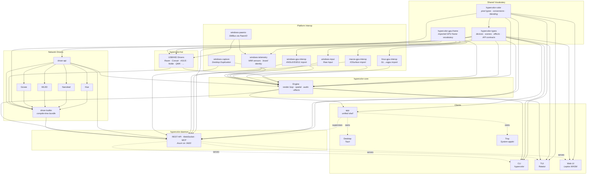
```mermaid
graph TD
    subgraph vocab [Shared Vocabulary]
        CK[hypercolor-color<br><i>pixel types · conversions · blending</i>]
        T[hypercolor-types<br><i>devices · scenes · effects · API contracts</i>]
        GF[hypercolor-gpu-frame<br><i>imported GPU frame vocabulary</i>]
    end

    subgraph hal [hypercolor-hal]
        H[USB/HID Drivers<br><i>Razer · Corsair · ASUS · Nollie · QMK · ...</i>]
    end

    subgraph platform [Platform Interop]
        LGI[linux-gpu-interop<br><i>GL→wgpu import</i>]
        MGI[macos-gpu-interop<br><i>IOSurface import</i>]
        WGI[windows-gpu-interop<br><i>ANGLE/D3D11 import</i>]
        WCA[windows-capture<br><i>Desktop Duplication</i>]
        WIN[windows-input<br><i>Raw Input</i>]
        WPI[windows-pawnio<br><i>SMBus via PawnIO</i>]
        WT[windows-telemetry<br><i>WMI sensors · board identity</i>]
    end

    subgraph core [hypercolor-core]
        C[Engine<br><i>render loop · spatial · audio · effects</i>]
    end

    subgraph drivers [Network Drivers]
        API[driver-api]
        DB[driver-builtin<br><i>compile-time bundle</i>]
        API --> HUE[Hue]
        API --> NL[Nanoleaf]
        API --> WL[WLED]
        API --> GV[Govee]
        HUE & NL & WL & GV --> DB
    end

    subgraph daemon [hypercolor-daemon]
        D[REST API · WebSocket · MCP<br><i>Axum on :9420</i>]
    end

    subgraph clients [Clients]
        CLI[CLI<br><i>hypercolor</i>]
        TUI[TUI<br><i>Ratatui</i>]
        UI[Web UI<br><i>Leptos WASM</i>]
        DT[Desktop<br><i>Tauri</i>]
        TR[Tray<br><i>System applet</i>]
        APP[app<br><i>unified shell</i>]
    end

    CK --> T
    CK & T --> H & C & D & CLI & TUI & UI
    T --> API & DB & APP & WIN & WT
    GF --> C & D & LGI & MGI & WGI
    WPI --> H & WT
    H --> C & DB
    LGI & MGI & WGI & WCA & WIN & WT --> C
    MGI & WGI & WCA --> D
    API --> C & DB & D
    C --> D & CLI & TUI & APP
    DB --> D
    D -. serves .-> CLI & TUI & UI
    APP -. owns .-> DT & TR
    APP -. supervises .-> D
```

Solid arrows are Cargo dependencies, pointing from the dependency to the crate that
consumes it; dashed arrows are runtime relationships, not build edges. `hypercolor-color`
and `hypercolor-types` reach nearly every crate in the workspace, so only the structural
edges are drawn here. The full graph is in [AGENTS.md](AGENTS.md).

It's Rust all the way down. The daemon, CLI, TUI, unified app, and HAL drivers are
all Rust. The web UI is Rust compiled to WASM via Leptos. Even the embedded browser
is Servo (Rust). The only non-Rust code is the TypeScript effect SDK and the GLSL
shaders it compiles.

The render thread runs on a dedicated OS thread with adaptive FPS (10 to 60, auto-shifting
across 5 tiers based on measured budget). Each tick, SparkleFlinger composes frame producers
into one canonical surface, with a zero-copy bypass fast path when a single full-opacity
layer is active. The event bus uses lock-free `tokio::sync::watch` channels for high-frequency
frame data and `broadcast` for discrete events. `zerocopy` structs handle wire-format encoding
at zero allocation cost per frame. The spatial engine caches LED positions and samples the
composed frame with configurable interpolation (nearest, bilinear, area average, Gaussian).

Workspace lints forbid `unsafe` in application, driver, and domain crates. The explicit
exceptions are the audited platform crates (GPU surface import on all three platforms,
screen capture via PipeWire, ScreenCaptureKit, and Desktop Duplication, host input on
macOS and Windows, session and power monitors on all three platforms, macOS now-playing
media, the PawnIO SMBus broker, the signed Windows helper, and platform filesystem glue)
plus the desktop app shell; each opts out explicitly and denies undocumented unsafe
blocks. Edition 2024. Rust 1.94+.

## 📡 Status

Hypercolor is in active development. The core engine, effect SDK, web UI, TUI,
and 12 shipping driver families work today on Linux, Windows, and macOS. Public
release automation ships Linux and Windows installers; signed macOS artifacts
use the manual acceptance lane described above. Every screenshot in this README
was captured from a live instance running on real hardware.

Worth knowing before you install:

- SMBus (motherboard/DRAM RGB) is Linux and Windows only. The "What works where" table
  above has the full picture.
- Session and power integration covers sleep/resume on all three platforms, plus screen
  lock/unlock on Linux and Windows and session active/inactive on macOS. Idle-based dimming
  is implemented in the policy layer but no platform monitor reports idle transitions yet.
- Windows binaries are not yet code-signed, so expect a SmartScreen warning on
  first launch. Published macOS artifacts are signed and notarized after manual
  acceptance.
- The [`hypercolor`](https://www.npmjs.com/package/hypercolor) SDK and
  [`create-hypercolor`](https://www.npmjs.com/package/create-hypercolor) scaffolder are on
  npm; scaffold an effect workspace with `bun create hypercolor`. The Python client is on
  PyPI as [`hypercolor`](https://pypi.org/project/hypercolor/).

**Coming soon:** effect marketplace, Wasmtime plugin system for community backends, Wooting
analog keyboards, and driver families for Cooler Master, NZXT, and Logitech. See the
[full compatibility matrix](docs/content/hardware/compatibility.md) for researched hardware
waiting on implementation.

## Security And Conduct

Please report vulnerabilities through the process in [`SECURITY.md`](SECURITY.md). Community
participation follows the [`CODE_OF_CONDUCT.md`](CODE_OF_CONDUCT.md).

## 💜 Contributing

Hypercolor grows on contributions. Drivers, effects, UI polish, docs, all of it lands here.

**Writing effects** is the fastest way in. The SDK compiles TypeScript, Canvas, or GLSL
straight to HTML, and the engine picks them up on save. **Device drivers** are where the
leverage is highest. If you own hardware that isn't on the supported list, you're the person
to add it.

See [`CONTRIBUTING.md`](CONTRIBUTING.md) for guidelines.

## 📄 License

Apache-2.0. See [LICENSE](LICENSE).

---

<p align="center">
  <a href="https://github.com/hyperb1iss/hypercolor">
    
  </a>
  &nbsp;&nbsp;
  <a href="https://ko-fi.com/hyperb1iss">
    
  </a>
</p>

<p align="center">
  <sub>
    If Hypercolor lights up your desk, give us a ⭐ or <a href="https://ko-fi.com/hyperb1iss">support the project</a>
    <br><br>
    ✦ Built with obsession by <a href="https://hyperbliss.tech"><strong>Hyperbliss</strong></a> ✦
  </sub>
</p>
