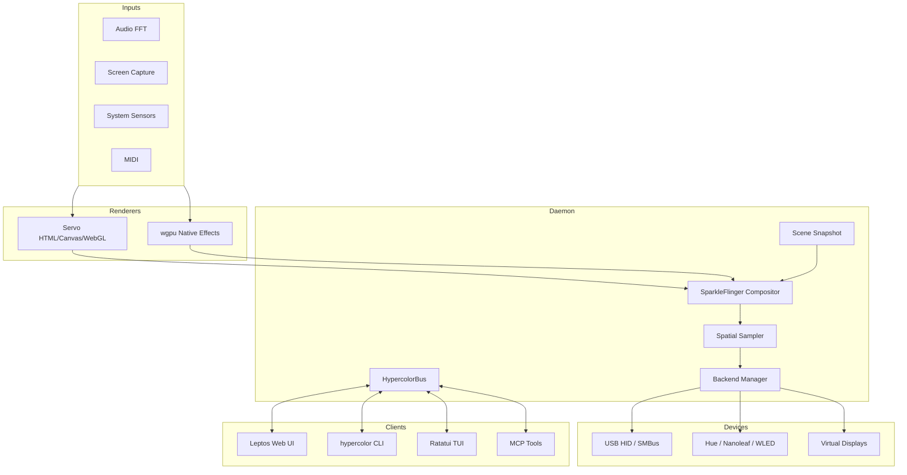
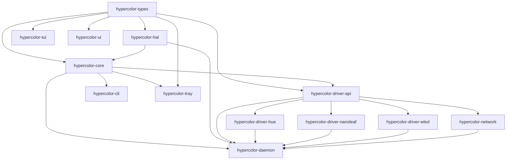

# Hypercolor Architecture

Hypercolor is a daemon-first RGB lighting engine for Linux. The daemon owns
hardware access, rendering, scene state, and persistence. Every user surface
talks to that daemon through REST, WebSocket, or MCP instead of touching devices
directly.

For the public documentation site version of this overview, see
[`docs/content/architecture/_index.md`](content/architecture/_index.md).

## Runtime Shape

## Render Pipeline

The render loop runs on a dedicated thread with adaptive FPS tiers. Each frame:

1. Samples input sources such as audio, screen, keyboard, MIDI, and sensors.
2. Captures the active scene, render groups, and live control state.
3. Renders each producer at its own cadence.
4. Uses SparkleFlinger to latch the newest producer surfaces and compose one
   canonical RGBA canvas.
5. Samples that canvas through the spatial engine into per-zone LED colors.
6. Queues hardware writes through the backend manager.
7. Publishes frame data, canvas preview, metrics, and events on HypercolorBus.

The canvas defaults to 640x480 and is configurable. Spatial coordinates are
normalized, so effects stay resolution-independent. Canvas size can be retuned
through the scene transaction path at frame boundaries; target FPS can also be
retuned live.

## Crate Boundaries

Key rules:

- `hypercolor-types` is pure shared vocabulary.
- `hypercolor-hal` depends on `hypercolor-types`, not on `hypercolor-core`.
- Network drivers depend on `hypercolor-driver-api`.
- `hypercolor-ui` is excluded from the Cargo workspace and builds separately
  through Trunk.
- Cross-crate circular dependencies are forbidden.

## Interfaces

- **REST API:** Axum serves `/api/v1/*` on port `9420`. Success responses use
  `{ data, meta }` envelopes with per-request IDs.
- **WebSocket:** `/api/v1/ws` carries real-time events, state, preview frames,
  metrics, and spectrum data.
- **MCP:** The daemon exposes tools and resources for AI-assisted control.
- **CLI/TUI:** The `hypercolor` CLI and Ratatui TUI use daemon APIs rather than
  a private local IPC channel.
- **Web UI:** Leptos 0.8 CSR compiled to WASM via Trunk. The daemon can serve
  the built UI for local control.

## Event Bus

`HypercolorBus` uses the channel semantics that match each data shape:

- `broadcast` for discrete events where every subscriber should see every event.
- `watch` for latest-value frame data, spectrum data, and preview canvases.

Events are history. High-frequency data streams are latest value.

## Platform And Safety

Linux is the supported launch platform because hardware permissions, udev,
PipeWire/audio capture, systemd user services, and release verification are all
gated there. macOS release artifacts and Windows source builds are experimental
until the same installer and runtime gates exist.

Application, driver, and domain crates inherit `unsafe_code = "forbid"`. The
current opt-outs are dedicated interop crates:

- `hypercolor-linux-gpu-interop` for Linux GPU surface import.
- `hypercolor-windows-pawnio` for Windows service/process boundaries.

Those crates isolate platform calls and deny undocumented unsafe blocks.

## Current Stack

| Area          | Choice                                        |
| ------------- | --------------------------------------------- |
| Language      | Rust 2024                                     |
| API server    | Axum + tower-http                             |
| Web UI        | Leptos 0.8 CSR + Trunk + Tailwind v4          |
| TUI           | Ratatui                                       |
| Render paths  | Servo HTML/Canvas/WebGL and wgpu native       |
| Effects SDK   | Bun + TypeScript, outputting LightScript HTML |
| Config        | TOML                                          |
| Observability | tracing + structured API request IDs          |
| License       | Apache-2.0                                    |
