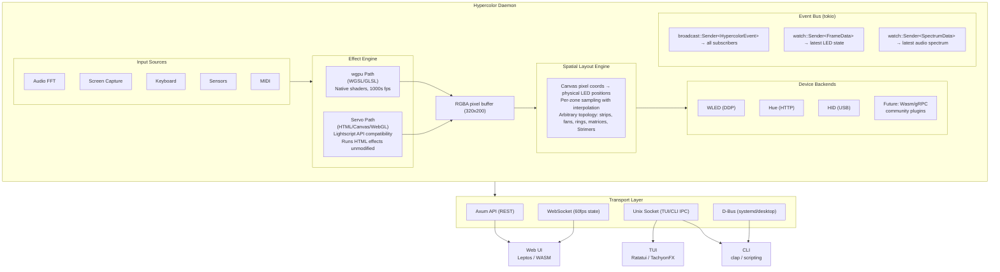
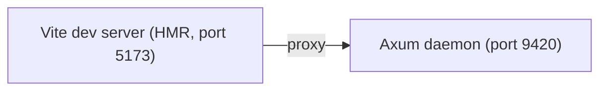

# Hypercolor Architecture

> Open-source RGB lighting orchestration engine for Linux, written in Rust.

---

## Vision

Hypercolor is the open-source, Linux-native RGB lighting engine that doesn't exist yet. A daemon-first lighting engine that runs HTML/Canvas effects at 60fps, samples pixels at LED positions, and pushes colors to every RGB device in your setup — WLED strips, Philips Hue bulbs, and raw USB HID devices like PrismRGB.

**Core premise:** Effects are web pages. A 320×200 canvas renders visual effects (shaders, animations, particle systems). A spatial mapping engine samples that canvas at each LED's position. Color data flows to hardware over multiple transport protocols. The entire system is controllable via a gorgeous web UI, a snappy TUI, a scriptable CLI, or pure headless daemon mode.

---

## System Architecture



---

## Cargo Workspace Layout

```
hypercolor/
├── Cargo.toml                          # Workspace root
├── ARCHITECTURE.md
├── RESEARCH.md
├── DRIVERS.md
├── WEB_ENGINES.md
│
├── crates/
│   ├── hypercolor-core/                # Shared library — the brain
│   │   ├── Cargo.toml
│   │   └── src/
│   │       ├── lib.rs
│   │       ├── effect/                 # Effect engine + registry
│   │       │   ├── mod.rs
│   │       │   ├── engine.rs           # Dual-path render orchestrator
│   │       │   ├── registry.rs         # Effect discovery + metadata
│   │       │   ├── wgpu_renderer.rs    # Native shader pipeline
│   │       │   ├── servo_renderer.rs   # HTML/Canvas effect runner
│   │       │   └── types.rs            # ControlValue, EffectMetadata, etc.
│   │       ├── device/                 # Device backend abstraction
│   │       │   ├── mod.rs
│   │       │   ├── traits.rs           # DeviceBackend, DevicePlugin traits
│   │       │   ├── wled.rs             # WLED DDP/E1.31
│   │       │   ├── hid.rs              # Direct USB HID (PrismRGB)
│   │       │   ├── hue.rs              # Philips Hue bridge
│   │       │   └── discovery.rs        # Auto-detection + mDNS
│   │       ├── spatial/                # Spatial layout engine
│   │       │   ├── mod.rs
│   │       │   ├── layout.rs           # Zone definitions, LED positions
│   │       │   ├── sampler.rs          # Canvas → LED color sampling
│   │       │   ├── topology.rs         # Strip, matrix, ring, custom
│   │       │   └── editor.rs           # Layout serialization/deserialization
│   │       ├── input/                  # Input source abstraction
│   │       │   ├── mod.rs
│   │       │   ├── traits.rs           # InputSource trait
│   │       │   ├── audio.rs            # Audio capture + FFT
│   │       │   ├── screen.rs           # Screen capture (PipeWire)
│   │       │   └── keyboard.rs         # Keyboard state
│   │       ├── bus/                    # Event bus + shared state
│   │       │   ├── mod.rs
│   │       │   ├── events.rs           # HypercolorEvent enum
│   │       │   └── state.rs            # FrameData, SpectrumData watches
│   │       └── config/                 # Configuration management
│   │           ├── mod.rs
│   │           ├── profile.rs          # Effect profiles + scenes
│   │           └── layout.rs           # Spatial layout config
│   │
│   ├── hypercolor-daemon/              # Binary: the service
│   │   ├── Cargo.toml
│   │   └── src/
│   │       ├── main.rs                 # tokio::main, service init
│   │       ├── api/                    # REST + WebSocket (Axum)
│   │       │   ├── mod.rs
│   │       │   ├── routes.rs           # HTTP endpoints
│   │       │   └── ws.rs               # WebSocket frame streaming
│   │       ├── web/                    # Embedded SvelteKit (rust-embed)
│   │       │   └── mod.rs
│   │       └── dbus/                   # D-Bus service (zbus)
│   │           └── mod.rs
│   │
│   ├── hypercolor-tui/                 # Binary: terminal interface
│   │   ├── Cargo.toml
│   │   └── src/
│   │       ├── main.rs
│   │       └── widgets/                # LED preview, spectrum, device list
│   │
│   └── hypercolor-cli/                 # Binary: command-line tool
│       ├── Cargo.toml
│       └── src/
│           └── main.rs                 # clap derive subcommands
│
├── web/                                # SvelteKit frontend
│   ├── package.json
│   ├── vite.config.ts
│   └── src/
│       ├── routes/                     # Pages
│       ├── lib/
│       │   ├── components/             # Svelte components
│       │   ├── stores/                 # WebSocket state stores
│       │   └── three/                  # Three.js spatial editor
│       └── app.html
│
├── effects/                            # Effect library
│   ├── native/                         # wgpu WGSL/GLSL shaders
│   ├── custom/                         # User's Lightscript effects
│   ├── builtin/                        # Stock effects
│   └── community/                      # Community HTML effects
│
└── resources/                          # Runtime assets
    ├── servo/                          # Servo resource files (UA stylesheet, etc.)
    └── devices/                        # Device presets + LED layouts
```

---

## Core Engine

### Render Loop

The heart of Hypercolor is a 60fps render loop running on the daemon's main async runtime:

```rust
pub struct RenderLoop {
    effect_engine: EffectEngine,        // wgpu or Servo renderer
    spatial_engine: SpatialEngine,       // Canvas → LED sampler
    backends: Vec<Box<dyn DeviceBackend>>,
    input_sources: Vec<Box<dyn InputSource>>,
    bus: HypercolorBus,
    frame_rate: u32,                     // Target FPS (default: 60)
}

impl RenderLoop {
    pub async fn run(&mut self) {
        let frame_interval = Duration::from_secs_f64(1.0 / self.frame_rate as f64);

        loop {
            let frame_start = Instant::now();

            // 1. Sample all input sources
            let inputs = self.sample_inputs().await;

            // 2. Render effect → RGBA canvas buffer
            let canvas = self.effect_engine.render(inputs).await;

            // 3. Spatial mapping: sample canvas at LED positions
            let led_colors = self.spatial_engine.sample(&canvas);

            // 4. Push to all device backends
            for backend in &mut self.backends {
                backend.push_frame(&led_colors).await;
            }

            // 5. Publish frame to event bus (for UI preview)
            self.bus.frame.send_replace(FrameData::new(&led_colors));

            // 6. Wait for next frame
            let elapsed = frame_start.elapsed();
            if elapsed < frame_interval {
                tokio::time::sleep(frame_interval - elapsed).await;
            }
        }
    }
}
```

### Event Bus

All frontends subscribe to the same event stream. Two channel types for different semantics:

```rust
pub struct HypercolorBus {
    /// Every subscriber sees every event (device connect, profile change, errors)
    pub events: broadcast::Sender<HypercolorEvent>,

    /// Only the latest value matters — subscribers skip stale frames
    pub frame: watch::Sender<FrameData>,

    /// Latest audio spectrum for visualization
    pub spectrum: watch::Sender<SpectrumData>,
}

pub enum HypercolorEvent {
    DeviceConnected(DeviceInfo),
    DeviceDisconnected(String),
    EffectChanged(String),
    ProfileLoaded(String),
    InputSourceAdded(String),
    Error(String),
}
```

The daemon runs the core engine. TUI/CLI connect via Unix socket. Web frontend via WebSocket. All receive the same events.

---

## Effect System

### Dual-Path Architecture

Mirrors the dual-engine approach (fast path for Canvas 2D, full engine for WebGL):

#### Path 1: wgpu Native Shaders (Fast Path)

For effects designed specifically for Hypercolor. Maximum performance, minimum overhead.

```rust
pub struct WgpuRenderer {
    device: wgpu::Device,
    queue: wgpu::Queue,
    pipeline: wgpu::RenderPipeline,
    staging_buffer: wgpu::Buffer,       // MAP_READ for pixel readback
    output_texture: wgpu::Texture,      // Render target (320×200)
}

impl WgpuRenderer {
    pub async fn render(&mut self, time: f32, uniforms: &Uniforms) -> Canvas {
        // 1. Update uniform buffer
        // 2. Execute render/compute pass
        // 3. Copy output texture → staging buffer
        // 4. Map staging buffer → CPU-accessible RGBA pixels
        // Returns Canvas { width: 320, height: 200, pixels: Vec<u8> }
    }
}
```

At 320×200, readback is 256KB/frame — trivially fast. wgpu abstracts Vulkan/OpenGL, so it works everywhere.

#### Path 2: Servo Embedded (Compatibility Path)

For running existing HTML effects and Lightscript effects unmodified.

```rust
pub struct ServoRenderer {
    servo: Servo,
    webview: WebView,
    ctx: Rc<SoftwareRenderingContext>,   // Headless, no window needed
}

impl ServoRenderer {
    pub fn new() -> Result<Self> {
        let ctx = SoftwareRenderingContext::new(
            PhysicalSize::new(320, 200)
        )?;

        let servo = Servo::new(
            Default::default(),
            Default::default(),
            Rc::new(ctx.clone()),
            Box::new(MinimalEmbedder),
            Box::new(MinimalWindow),
            Default::default(),
        );

        Ok(Self { servo, webview: servo.new_webview(url), ctx })
    }

    pub fn render(&mut self) -> Canvas {
        self.servo.spin_event_loop();
        self.webview.paint();

        let image = self.ctx.read_to_image(
            Box2D::from_size(Size2D::new(320, 200))
        );

        Canvas::from_rgba(image.unwrap().as_raw(), 320, 200)
    }

    pub fn inject_control(&self, name: &str, value: &str) {
        self.webview.evaluate_javascript(
            &format!("window['{}'] = {}; window.update?.();", name, value),
            |_| {},
        );
    }

    pub fn inject_audio(&self, audio: &AudioData) {
        // Update window.engine.audio with current FFT data
    }
}
```

**Servo integration details:**
- `SoftwareRenderingContext` for headless rendering (OSMesa backend, no GPU/display required)
- `read_to_image()` returns `ImageBuffer<Rgba<u8>>` — exactly what we need
- `evaluate_javascript()` for injecting control values and audio data
- `WebView` + `WebViewDelegate` for lifecycle management
- MPL-2.0 license — file-level copyleft, compatible with MIT/Apache for our code
- Not on crates.io — git dependency with pinned revision + `rust-toolchain` from Servo repo
- Build time: ~20-40 min clean (SpiderMonkey is heavy). Cached builds are fast.

### Effect Metadata & Controls

Effects declare their parameters via metadata. The system must support two formats:

**HTML meta tags (LightScript compatibility):**
```html
<meta property="speed" label="Speed" type="number" min="1" max="10" default="5" />
<meta property="palette" label="Palette" type="combobox" values="Aurora,Rainbow,Neon" default="Aurora" />
```

**Rust-native effect definition:**
```rust
pub struct EffectMetadata {
    pub id: String,
    pub name: String,
    pub description: String,
    pub author: String,
    pub controls: Vec<ControlDefinition>,
    pub audio_reactive: bool,
}

pub struct ControlDefinition {
    pub id: String,
    pub label: String,
    pub control_type: ControlType,
    pub default: ControlValue,
    pub tooltip: Option<String>,
}

pub enum ControlType {
    Number { min: f32, max: f32, step: Option<f32> },
    Boolean,
    Combobox { values: Vec<String> },
    Color,
    Hue { min: f32, max: f32 },
    TextField,
}

pub enum ControlValue {
    Number(f32),
    Boolean(bool),
    String(String),
}
```

### Lightscript API Compatibility

The Servo renderer must implement the Lightscript runtime contract. Key surface:

**Window globals injected by the host:**
```
window.<controlId> = value          // Control values
window.update()                     // Called when controls change
window.engine.audio                 // { level, density, width, freq[200] }
window.engine.zone                  // { hue[], saturation[], lightness[] }
```

**Standard shader uniforms (Three.js WebGL effects):**
```glsl
uniform float iTime;               // Elapsed seconds
uniform vec2 iResolution;          // Canvas size (320, 200)
uniform vec2 iMouse;               // Mouse position (rarely used)
uniform float iAudioLevel;         // Overall audio (0-1)
uniform float iAudioBass;          // Bass band (0-1)
uniform float iAudioMid;           // Mid band (0-1)
uniform float iAudioTreble;        // Treble band (0-1)
uniform sampler2D iAudioSpectrum;  // 200-bin FFT texture
```

**Audio data (full Lightscript audio API):**
```
Standard:    level, bass, mid, treble, freq[200], beat, beatPulse
Mel scale:   melBands[24], melBandsNormalized[24]
Chromagram:  chromagram[12], dominantPitch, dominantPitchConfidence
Spectral:    spectralFlux, spectralFluxBands[3], brightness, spread, rolloff
Harmonic:    harmonicHue, chordMood (-1..1 minor→major)
Beat:        beatPhase, beatConfidence, beatAnticipation, onset, onsetPulse
```

The Servo renderer injects this data into `window.engine.audio` every frame. Effects read it via `getAudioData()` or directly through the audio uniforms.

---

## Device Backend System

### Plugin Architecture: Phased Approach

#### Phase 1: Compile-Time Trait Objects (Ship First)

Bevy-inspired plugin pattern. All backends compiled into the binary behind feature flags.

```rust
/// Lifecycle hooks for backend initialization
pub trait DevicePlugin: Send + Sync {
    fn build(&self, engine: &mut Engine);
    fn ready(&self) -> bool { true }
    fn cleanup(&mut self) {}
}

/// Core device communication trait
pub trait DeviceBackend: Send + Sync {
    fn name(&self) -> &str;
    fn discover(&mut self) -> Result<Vec<DeviceInfo>>;
    fn connect(&mut self, device: &DeviceInfo) -> Result<DeviceHandle>;
    fn push_frame(&mut self, handle: &DeviceHandle, colors: &[Rgb]) -> Result<()>;
    fn disconnect(&mut self, handle: DeviceHandle) -> Result<()>;
}

/// Input source trait (audio, screen capture, keyboard, etc.)
pub trait InputSource: Send + Sync {
    fn name(&self) -> &str;
    fn sample(&mut self) -> Result<InputData>;
    fn sample_rate_hz(&self) -> f64;
}
```

Current Cargo features:
```toml
[features]
default = []
servo = ["dep:servo", "dep:dpi", "dep:rustls", "dep:mozjs-jit"]
```

Device backends are built into `hypercolor-core` today.

#### Phase 2: Wasm Extensions (Community Plugins)

When community plugin authors appear, add Wasmtime + WIT:

```wit
// hypercolor-plugin.wit
interface device-backend {
    record device-info {
        id: string,
        name: string,
        led-count: u32,
    }

    discover: func() -> list<device-info>
    push-frame: func(device-id: string, colors: list<tuple<u8, u8, u8>>) -> result<_, string>
}
```

Plugins compile to `wasm32-wasip1`. Sandboxed execution, can't crash the host. The WIT interface ensures type safety across the Wasm boundary.

#### Phase 3: Optional Process Plugins

Hypercolor does not carry a dedicated bridge-only architecture today. If we
introduce out-of-process plugins later, they should be generic plugin
boundaries.

### Backend Implementations

**WLED** (`ddp-rs` crate):
- UDP DDP packets — 480 pixels/packet, no universe management
- E1.31/sACN fallback via `sacn` crate (170 pixels/universe)
- mDNS auto-discovery
- Multiple WLED devices simultaneously

**PrismRGB / Nollie** (direct USB HID via `hidapi`):
- Prism 8: 8 channels × 126 LEDs, GRB format, `packet_id = index + channel*6`, frame commit `0xFF`
- Prism S: Strimer cables (ATX 120 LEDs + GPU 108/162 LEDs), RGB format, chunked buffer
- Prism Mini: 1 channel × 128 LEDs, `0xAA` marker packets, hardware lighting config
- Nollie 8: Identical protocol to Prism 8, different VID
- All protocols fully reverse-engineered — see DRIVERS.md

**Philips Hue** (`reqwest` + Hue API v2):
- REST/SSE bridge API
- Entertainment API for low-latency streaming
- Bridge discovery via mDNS

---

## Spatial Layout Engine

The bridge between the effect canvas and physical LED hardware.

### Data Model

```rust
pub struct SpatialLayout {
    pub canvas_width: u32,               // 320
    pub canvas_height: u32,              // 200
    pub zones: Vec<DeviceZone>,
}

pub struct DeviceZone {
    pub device_id: String,               // Which backend device
    pub zone_name: String,               // e.g., "Channel 1", "ATX Strimer"
    pub topology: LedTopology,
    pub position: (f32, f32),            // Zone position on canvas (normalized 0-1)
    pub size: (f32, f32),                // Zone size on canvas (normalized 0-1)
    pub rotation: f32,                   // Degrees
    pub led_positions: Vec<(f32, f32)>,  // LED positions within zone (normalized)
}

pub enum LedTopology {
    Strip { count: u32 },
    Matrix { width: u32, height: u32 },
    Ring { count: u32 },
    Custom,                              // Arbitrary LED positions
}
```

### Sampling

```rust
pub struct SpatialSampler;

impl SpatialSampler {
    /// Sample canvas at each LED's physical position
    pub fn sample(canvas: &Canvas, layout: &SpatialLayout) -> Vec<DeviceColors> {
        layout.zones.iter().map(|zone| {
            let colors: Vec<Rgb> = zone.led_positions.iter().map(|&(lx, ly)| {
                // Transform local zone coords → global canvas coords
                let (cx, cy) = zone.transform_to_canvas(lx, ly);

                // Bilinear interpolation at canvas position
                canvas.sample_bilinear(cx, cy)
            }).collect();

            DeviceColors {
                device_id: zone.device_id.clone(),
                zone_name: zone.zone_name.clone(),
                colors,
            }
        }).collect()
    }
}
```

### Layout Editor

The web UI provides a drag-and-drop spatial editor (Three.js / Canvas 2D):
- Drag device zones onto the canvas
- Resize, rotate, reposition
- Preview effect output in real-time on the zone shapes
- Import device presets (Strimer 20×6, fan ring 16 LEDs, etc.)
- Export/import layouts as JSON

---

## Input Sources

### Audio Capture + FFT

```rust
pub struct AudioInput {
    stream: cpal::Stream,               // System audio capture
    fft: Arc<Mutex<FftProcessor>>,
}

pub struct FftProcessor {
    // spectrum-analyzer crate with Hann windowing
    pub bins: [f32; 200],               // FFT frequency bins
    pub bass: f32,                       // Low-frequency energy
    pub mid: f32,                        // Mid-frequency energy
    pub treble: f32,                     // High-frequency energy
    pub level: f32,                      // Overall level (RMS)
    pub beat: BeatDetector,             // Onset/beat detection
}
```

**Crate stack:** `cpal` for cross-platform audio capture (PulseAudio/ALSA/PipeWire on Linux), `spectrum-analyzer` or `realfft` for FFT, custom beat detection.

### Screen Capture

```rust
pub struct ScreenInput {
    // lamco-pipewire for Wayland (DMA-BUF zero-copy)
    // xcap fallback for X11
    // Both work through XDG Desktop Portal
}
```

Captures screen content, downsamples to effect canvas resolution. Used for ambient lighting ("Screen Ambience" style effects).

### Keyboard State

Global keyboard state for reactive effects (key press → color flash). Requires evdev on Linux or global hook integration.

---

## Frontend Architecture

### Web UI: Axum + SvelteKit

The primary interface. Served by the daemon itself — no separate web server.

**Development:**


**Production:**
```
Axum serves embedded SvelteKit build (via rust-embed)
Single binary: hypercolor contains the entire web UI
```

**WebSocket protocol:** Binary frames at configurable rate (default: 30fps for preview, full 60fps available). Each frame contains current LED colors for all zones — the web UI renders a live preview.

**Key UI components:**
- Effect browser + search/filter
- Control panel (auto-generated from effect metadata)
- Spatial layout editor (Three.js drag-and-drop)
- Live LED preview (Canvas 2D rendering of zone colors)
- Device manager (discover, connect, configure)
- Profile/scene editor
- Audio spectrum visualizer

### TUI: Ratatui + TachyonFX

SSH-friendly terminal interface. Connects to the running daemon over Unix socket.

**Widgets:**
- Live LED strip preview (true-color half-blocks, 2 pixels per cell)
- Current effect name + parameter sliders
- Audio spectrum (Sparkline/BarChart)
- Device status dashboard
- Effect switcher with keyboard navigation

### CLI: clap

Scriptable command-line interface for automation.

```
hypercolor daemon [--port 9420] [--no-web]      # Start daemon
hypercolor tui                                    # Launch TUI
hypercolor set <effect> [--device <name>]         # Set effect
hypercolor list [devices|effects|profiles]        # List resources
hypercolor profile <name>                         # Apply profile
hypercolor capture [screen|audio] --status        # Capture status
hypercolor completion [bash|zsh|fish]             # Shell completions
```

### D-Bus Integration (zbus)

```
tech.hyperbliss.hypercolor1
├── .SetEffect(name, params)
├── .ListDevices() → [(id, name, status)]
├── .GetState() → { effect, profile, fps }
├── signal DeviceConnected(id, name)
├── signal DeviceDisconnected(id)
└── signal EffectChanged(name)
```

Enables desktop integration: systemd service management, GNOME extension hooks, KDE integration, hotkey triggers.

---

## Crate Dependencies

### Core

| Crate | Purpose | License |
|---|---|---|
| `tokio` | Async runtime | MIT |
| `wgpu` | GPU compute/render (Vulkan/OpenGL) | MIT/Apache |
| `image` | Pixel buffer types | MIT/Apache |
| `serde` + `toml` | Configuration serialization | MIT/Apache |
| `tracing` | Structured logging | MIT |
| `thiserror` | Error types | MIT/Apache |
| `notify` | Filesystem watcher (effect hot-reload) | CC0/Artistic |
| `rgb` | Color types | MIT |

### Device Backends

| Crate | Purpose | License | Feature Flag |
|---|---|---|---|
| `ddp-rs` | WLED DDP protocol | MIT | `wled` |
| `sacn` | E1.31/sACN protocol | MIT/Apache | `wled-sacn` |
| `hidapi` | USB HID (PrismRGB) | MIT | `hid` |
| `reqwest` | HTTP (Hue, REST APIs) | MIT/Apache | `hue` |

### Input Sources

| Crate | Purpose | License |
|---|---|---|
| `cpal` | Audio capture (cross-platform) | Apache-2.0 |
| `spectrum-analyzer` | FFT + frequency analysis | MIT/Apache |
| `lamco-pipewire` | Screen capture (Wayland) | MIT |
| `xcap` | Screen capture (X11 fallback) | Apache-2.0 |

### Frontends

| Crate | Purpose | License |
|---|---|---|
| `axum` + `tower-http` | Web server + WebSocket | MIT |
| `axum-embed` / `rust-embed` | Embed SvelteKit in binary | MIT |
| `ratatui` | TUI rendering | MIT |
| `tachyonfx` | TUI visual effects | MIT |
| `clap` | CLI argument parsing | MIT/Apache |
| `zbus` | D-Bus IPC | MIT |

### Servo (Effect Engine)

| Crate | Purpose | License |
|---|---|---|
| `libservo` | HTML/Canvas/WebGL renderer | MPL-2.0 |
| `surfman` | GPU surface management | MIT/Apache/MPL |

Servo is a git dependency (not on crates.io). Requires pinned revision + matching `rust-toolchain`. MPL-2.0 is file-level copyleft — our code stays MIT/Apache, only modified Servo files carry MPL.

---

## Phased Roadmap

### Phase 0: Foundation
- Cargo workspace scaffold
- `hypercolor-core` with effect engine trait, device backend trait, event bus
- wgpu renderer: load WGSL shader → render 320×200 → read pixels
- Basic spatial sampler (linear strip mapping)
- DDP output to one WLED device
- CLI: `hypercolor daemon` + `hypercolor set <shader>`
- **Ship target:** A single wgpu shader lighting a WLED strip

### Phase 1: Hardware Expansion
- USB HID backend: PrismRGB Prism 8, Prism S, Prism Mini, Nollie 8
- Multi-device support with zone-per-device mapping
- Audio input source (cpal + FFT)
- Configuration file (TOML profiles)

### Phase 2: Web Compatibility
- Servo integration: headless HTML/Canvas rendering
- Lightscript API shim (inject controls + audio into window globals)
- Parse `<meta>` tags for effect metadata/controls
- Run existing HTML effects
- Web UI: Axum + embedded SvelteKit with effect browser + live preview

### Phase 3: Full Frontend Suite
- Spatial layout editor (Three.js drag-and-drop in web UI)
- TUI (Ratatui) with LED preview and effect switching
- Screen capture input source
- Profile/scene system with scheduling
- D-Bus service + systemd integration
- Philips Hue backend

### Phase 4: Ecosystem
- Wasm plugin runtime (Wasmtime + WIT) for community device backends
- Effect development server with hot-reload
- Effect marketplace / repository
- Home Assistant integration
- Mobile-friendly web UI

---

## Key Decisions & Rationale

| Decision | Choice | Why |
|---|---|---|
| **Language** | Rust | Performance (60fps render loop), safety (USB HID), ecosystem (wgpu, Servo, Ratatui) |
| **Effect renderer** | wgpu + Servo dual path | Native performance for new effects + compatibility with 230 existing HTML effects |
| **Web UI framework** | SvelteKit (not Leptos/Dioxus) | Rich Canvas/WebGL ecosystem needed for spatial editor; effects are literally HTML — they render natively in a browser UI |
| **Web server** | Axum | tokio-native, first-class WebSocket, serves embedded SPA |
| **Plugin system** | Compile-time traits → Wasm later | Ship fast with zero overhead; add runtime extensibility when community demands it |
| **TUI** | Ratatui | Established in the ecosystem (git-iris, unifi-cli), true-color LED preview |
| **Audio** | cpal + spectrum-analyzer | Cross-platform capture, efficient FFT |
| **IPC** | tokio broadcast/watch channels | Multi-consumer events + latest-value state — perfect for real-time LED data |
| **Config format** | TOML | Rust ecosystem standard, human-readable |
| **Canvas resolution** | 320×200 | LightScript standard; 256KB/frame readback is negligible |
| **License** | MIT/Apache-2.0 (dual) | Maximum openness, GPL-2.0 components isolated behind process boundaries |
