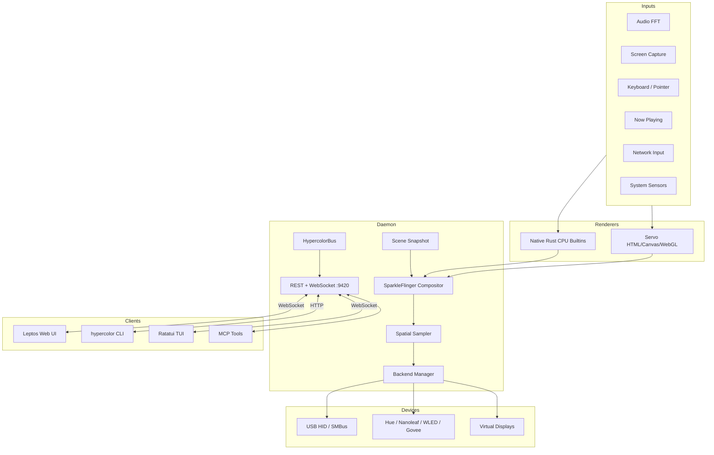

# Hypercolor Architecture

Hypercolor is a daemon-first RGB lighting engine for Linux, Windows, and
macOS. The daemon owns
hardware access, rendering, scene state, and persistence. Every user surface
talks to that daemon through REST, WebSocket, or MCP instead of touching devices
directly.

For the public documentation site version of this overview, see
[`docs/content/architecture/_index.md`](content/architecture/_index.md).

## Runtime Shape

```mermaid
graph TD
    subgraph Inputs
        Audio[Audio FFT]
        Screen[Screen Capture]
        Interaction[Keyboard / Pointer]
        Media[Now Playing]
        Network[Network Input]
        Sensors[System Sensors]
    end

    subgraph Renderers
        Html[Servo HTML/Canvas/WebGL]
        Native[Native Rust CPU Builtins]
    end

    subgraph Daemon
        Scene[Scene Snapshot]
        Flinger[SparkleFlinger Compositor]
        Spatial[Spatial Sampler]
        Manager[Backend Manager]
        Bus[HypercolorBus]
        Api[REST + WebSocket :9420]
    end

    subgraph Devices
        Usb[USB HID / SMBus]
        Net[Hue / Nanoleaf / WLED / Govee]
        Sim[Virtual Displays]
    end

    subgraph Clients
        Web[Leptos Web UI]
        Cli[hypercolor CLI]
        Tui[Ratatui TUI]
        Mcp[MCP Tools]
    end

    Inputs --> Html
    Inputs --> Native
    Html --> Flinger
    Native --> Flinger
    Scene --> Flinger
    Flinger --> Spatial
    Spatial --> Manager
    Manager --> Usb
    Manager --> Net
    Manager --> Sim
    Bus --> Api
    Api <-->|WebSocket| Web
    Api <-->|HTTP| Cli
    Api <-->|WebSocket| Tui
    Api <--> Mcp
```

`HypercolorBus` is in-process. Clients never attach to it directly; they reach
the daemon over REST, WebSocket, or MCP, and the API layer relays bus traffic
onto those transports. The six input source kinds are audio, screen,
interaction, media, network, and sensors. MIDI is not one of them: MIDI note,
control-change, pitch-bend, and realtime messages travel as discrete input
events through the interaction routing path, not as a sampled source. Govee
ships as a first-class network driver; the OpenRGB SDK bridge is an opt-in
fallback rather than a default backend.

## Render Pipeline

The render loop runs on a dedicated thread with adaptive FPS tiers. Input
sampling sits outside the loop: a separate publication pump drives audio,
screen, interaction, media, network, and sensor sources at whatever cadence
live demand requires, and writes their latest values plus bounded event queues
into immutable input graph slots. The frame publishes its demand rather than
pulling the sources itself. Each frame:

1. Reads the immutable input graph for this frame's shared inputs.
2. Captures the active scene, render zones, and live control state.
3. Renders each producer at its own cadence.
4. Uses SparkleFlinger to latch the newest producer surfaces and compose one
   canonical RGBA canvas.
5. Samples that canvas through the spatial engine into per-zone LED colors.
6. Queues hardware writes through the backend manager.
7. Publishes frame data, canvas preview, metrics, and events on HypercolorBus.

The canvas defaults to 640x480 and is configurable. Spatial coordinates are
normalized, so effects stay resolution-independent. Canvas size can be retuned
through the scene transaction path at frame boundaries; target FPS can also be
retuned live.

`FpsController` shifts between five tiers: 10 fps on a 100ms budget, 20 fps on
50ms, 30 fps on roughly 33.3ms, 45 fps on roughly 22.2ms, and 60 fps on roughly
16.6ms. Downshift is fast, triggering on two consecutive budget misses. Upshift
is slow, requiring sustained headroom over a configurable window, so the loop
does not oscillate between tiers.

## Crate Boundaries

```mermaid
graph TD
    subgraph Foundation
        C[hypercolor-color]
        T[hypercolor-types]
        CORE[hypercolor-core]
        HAL[hypercolor-hal]
    end

    subgraph Neutral["Neutral Vocabulary"]
        GF[hypercolor-gpu-frame]
        WR[hypercolor-worker-retention]
    end

    subgraph Platform
        LGPU[hypercolor-linux-gpu-interop]
        LINP[hypercolor-linux-input]
        LSES[hypercolor-linux-session]
        PIPE[hypercolor-pipewire-interop]
        MCAP[hypercolor-macos-capture]
        MGPU[hypercolor-macos-gpu-interop]
        MINP[hypercolor-macos-input]
        MMED[hypercolor-macos-media]
        MOWN[hypercolor-macos-owner]
        MSES[hypercolor-macos-session]
        WGPU[hypercolor-windows-gpu-interop]
        WPAW[hypercolor-windows-pawnio]
        WCAP[hypercolor-windows-capture]
        WINP[hypercolor-windows-input]
        WSES[hypercolor-windows-session]
        WTEL[hypercolor-windows-telemetry]
        WHLP[hypercolor-windows-helper]
    end

    subgraph Storage
        PFS[hypercolor-platform-fs]
        PER[hypercolor-persistence]
    end

    subgraph Drivers
        DAPI[hypercolor-driver-api]
        DS[hypercolor-driver-support]
        DBI[hypercolor-driver-builtin]
        HUE[hypercolor-driver-hue]
        NL[hypercolor-driver-nanoleaf]
        WLED[hypercolor-driver-wled]
        GOV[hypercolor-driver-govee]
        ORS[hypercolor-openrgb-sdk]
        ORD[hypercolor-driver-openrgb]
        NET[hypercolor-network]
    end

    subgraph UITooling["UI Tooling"]
        LEXT[hypercolor-leptos-ext]
    end

    subgraph Binaries
        D[hypercolor-daemon]
        CLI[hypercolor-cli]
        TUI[hypercolor-tui]
        APP[hypercolor-app]
        UI[hypercolor-ui<br><i>excluded from workspace</i>]
    end

    C --> T
    C & T --> HAL
    C & T & HAL & GF & WR & PFS & PER & DAPI --> CORE
    GF --> LGPU & MGPU & WGPU
    WR --> LINP & MINP & WINP & MSES
    T --> LINP & MINP & WINP & MCAP & WTEL
    PIPE & LINP & MCAP & MINP & WCAP & WINP & WTEL --> CORE
    LGPU & MGPU & WGPU -.->|optional| CORE
    MMED -.->|macOS| CORE
    WPAW -.->|Windows| HAL
    WPAW -.->|Windows| WTEL
    MCAP -.->|optional| MGPU
    WCAP -.->|optional| WGPU
    CORE & T --> LSES & MSES & WSES
    PFS --> PER & MOWN & DAPI & DS
    T --> DAPI
    DAPI & PER & T --> DS
    C & T & DAPI & DS --> HUE & NL
    T & DAPI & DS --> WLED & GOV
    T & ORS & DAPI --> ORD
    T & DAPI --> NET
    T & CORE & DAPI & DS & NET --> DBI
    HAL & HUE & NL & WLED & GOV & ORD -.->|optional| DBI
    C & T & CORE & GF & PFS & DAPI & DS & NET & LEXT & LSES & MOWN --> D
    DBI -.->|optional| D
    MCAP & MINP & MSES -.->|macOS| D
    MGPU -.->|macOS, optional| D
    WSES -.->|Windows| D
    WCAP & WGPU -.->|Windows, optional| D
    C & T & CORE & PFS --> CLI
    MOWN -.->|macOS| CLI
    TUI -.->|optional| CLI
    C & T & CORE & LEXT --> TUI
    T & CORE & MOWN --> APP
    LSES -.->|Linux| APP
    MINP -.->|macOS| APP
    C & T & LEXT --> UI
```

Arrows point from a dependency to the crate that depends on it. Solid edges are
unconditional `[dependencies]`; dotted edges are optional (Cargo feature) or
target-gated. `hypercolor-windows-helper` has no workspace dependencies and no
edges: it is a standalone signed binary that `hypercolor-app` launches as a
subprocess.

Key rules:

- `hypercolor-color` is the bottom of the graph: the color kernel has no
  internal dependencies at all. `hypercolor-types` is the shared data
  vocabulary layered directly on top of it, and nearly every other crate
  depends on `hypercolor-types`.
- `hypercolor-gpu-frame` and `hypercolor-worker-retention` are neutral leaf
  vocabularies with no internal dependencies. `gpu-frame` carries imported GPU
  frame facts (format, timings, origin, leases) between the three
  `*-gpu-interop` crates, the engine, and the daemon. `worker-retention` is the
  process-wide reaper for workers that outlive bounded shutdown, used by the
  engine, the three host-input crates, and `hypercolor-macos-session`.
- `hypercolor-hal` depends on `hypercolor-types`, not on `hypercolor-core`.
- The daemon has no direct `hypercolor-hal` dependency. The HAL reaches it
  transitively through `hypercolor-driver-builtin`.
- Network and hardware drivers depend on the traits and types in
  `hypercolor-driver-api`. Native network drivers use
  `hypercolor-driver-support` for concrete host services.
- `hypercolor-driver-builtin` aggregates the optional driver crates behind
  feature flags. It is the crate that pulls in `hypercolor-hal` and every
  concrete driver (Hue, Nanoleaf, WLED, Govee, and the OpenRGB bridge)
  alongside `hypercolor-network`.
- `hypercolor-persistence` owns the durable write path and the process-wide
  flush registry, so every store that must survive shutdown writes through it.
  It sits below both the engine and the driver crates.
- `hypercolor-leptos-ext` depends on no other internal crate.
- Platform crates own native acquisition and OS calls behind one seam per
  capability, and they compile on every target through stubs. That is why
  `hypercolor-core` depends on seven of them unconditionally: `windows-input`,
  `windows-capture`, `windows-telemetry`, `macos-input`, `macos-capture`,
  `linux-input`, and `pipewire-interop`. Only `hypercolor-macos-media` is
  target-gated
  there, and only the three `*-gpu-interop` crates are behind Cargo features.
  The daemon is the opposite shape: it target-gates its macOS and Windows
  crates and takes `platform-fs`, `linux-session`, and `macos-owner`
  unconditionally. `hypercolor-windows-helper` is a standalone signed binary
  that `hypercolor-app` invokes as a subprocess.
- The Storage crates sit outside the platform boundary.
  `hypercolor-platform-fs` is the audited filesystem seam and is the one
  Storage crate with an unsafe opt-out, scoped to Windows.
  `hypercolor-persistence` inherits the workspace `forbid`.
- `hypercolor-ui` is excluded from the Cargo workspace and builds separately
  through Trunk.
- Cross-crate circular dependencies are forbidden.

## Interfaces

- **REST API:** Axum serves `/api/v1/*` on port `9420`. Success responses use
  `{ data, meta }` envelopes with per-request IDs. The request and response
  contracts live in `hypercolor-types::api`, seventeen domain modules plus a
  shared `envelope` module; the daemon serializes those types and every client
  deserializes the same ones.
- **WebSocket:** `/api/v1/ws` carries real-time events, state, preview frames,
  metrics, and spectrum data.
- **MCP:** The daemon exposes seventeen tools, five resources, and three prompt
  templates for AI-assisted control.
- **CLI/TUI:** The `hypercolor` CLI and Ratatui TUI use daemon APIs rather than
  a private local IPC channel.
- **Web UI:** Leptos 0.8 CSR compiled to WASM via Trunk. The daemon can serve
  the built UI for local control.

## Event Bus

`HypercolorBus` uses the channel semantics that match each data shape:

- `broadcast` for discrete events where every subscriber should see every event.
  Capacity is 256, sized to absorb a discovery burst while keeping the channel
  under roughly 128 KB, which is about 8 to 25 seconds of runway for a stalled
  subscriber at a steady 10 to 30 events per second.
- `watch` for latest-value streams. There are five: frame data, spectrum data,
  canvas previews, authoritative scene canvases, and per-zone canvases.

Events are history. High-frequency data streams are latest value. The bus is
`Send + Sync` and cloneable, channel operations are lock-free, and the only
critical section is short-lived deduplication of low-frequency status events.

## AppState

`AppState` is the daemon's shared state, `Arc`-wrapped and injected into every
Axum handler. Its shape encodes the concurrency rules:

- Scene, layout, effect, and spatial state is not reached through raw locks.
  It lives behind the domain services in `AppState::domains`, alongside
  `scene_manager: SceneService` and `spatial_engine: SpatialService`, which own
  their own commit ordering and event publication.
- Subsystems that own a `!Sync` renderer or a serialized device path sit behind
  `Mutex`: `backend_manager: Arc<Mutex<BackendManager>>` is the canonical case.
- Read-heavy stores sit behind `RwLock`: `render_loop`, `performance`,
  `asset_library`, and `attachment_registry` among them.
- `event_bus: Arc<HypercolorBus>` and the render loop handle are shared with
  the daemon's live instances, so API calls operate on the same subsystems the
  render pipeline runs on.
- `input_manager` is private. The live input graph is shared with the render
  thread and reached from handlers through typed handles such as
  `input_publication_demands`, `browser_input`, and `screen_capacity_status`.

## Platform And Safety

All three platforms ship installers: Linux gets a tarball, a `.deb`, an AUR
package, and a Homebrew formula; Windows gets a per-machine NSIS installer;
macOS gets DMGs for both architectures plus a Homebrew cask. CI gates Linux,
Windows, and macOS alike on every push to `main` and on every pull request;
the macOS lane compiles, lints, and exercises platform fixtures on both Apple
Silicon and Intel runners. Linux-specific
runtime integration (udev rules, PipeWire portal capture, systemd user
services, logind session events) has native counterparts where required.
macOS screen capture uses ScreenCaptureKit; SMBus remains unsupported there.

Application, driver, and domain crates inherit `unsafe_code = "forbid"`. There
are exactly sixteen opt-outs, all audited platform crates plus the app shell:

- `hypercolor-linux-gpu-interop`, `hypercolor-macos-gpu-interop`, and
  `hypercolor-windows-gpu-interop` for GPU surface import.
- `hypercolor-pipewire-interop` for the XDG Portal and PipeWire capture
  boundary.
- `hypercolor-macos-input` for Core Graphics event taps and
  `hypercolor-windows-input` for Raw Input. `hypercolor-linux-input` needs no
  opt-out; its evdev path is safe Rust.
- `hypercolor-macos-capture` for ScreenCaptureKit acquisition and retained
  frame ownership, and `hypercolor-windows-capture` for Desktop Duplication.
- `hypercolor-macos-media` for the Apple Event scripting adapters behind
  now-playing metadata.
- `hypercolor-linux-session`, `hypercolor-macos-session`, and
  `hypercolor-windows-session` for logind, AppKit/IOKit, and Win32 session and
  power notifications.
- `hypercolor-windows-pawnio` for SMBus access through the PawnIO kernel
  driver.
- `hypercolor-windows-helper` for the signed elevated helper binary.
- `hypercolor-platform-fs` for privileged filesystem operations (unsafe is
  still forbidden there off Windows).
- `hypercolor-app` for the Win32 power-event message pump.

Every opt-out denies `clippy::undocumented_unsafe_blocks`.

## Current Stack

| Area          | Choice                                               |
| ------------- | ---------------------------------------------------- |
| Language      | Rust 2024                                            |
| API server    | Axum + tower-http                                    |
| Web UI        | Leptos 0.8 CSR + Trunk + Tailwind v4                 |
| TUI           | Ratatui                                              |
| Render paths  | Servo HTML/Canvas/WebGL and native Rust CPU builtins |
| Effects SDK   | Bun + TypeScript, outputting LightScript HTML        |
| Config        | TOML                                                 |
| Observability | tracing + structured API request IDs                 |
| License       | Apache-2.0                                           |
