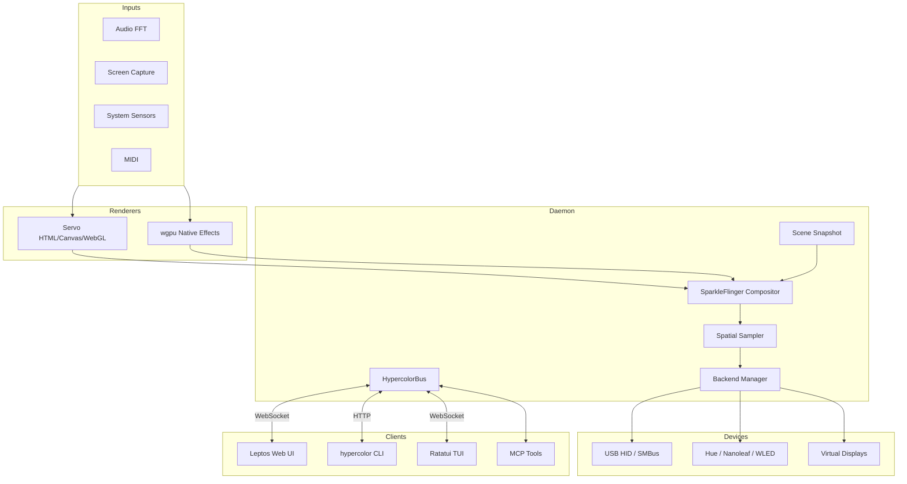

# Hypercolor Architecture

Hypercolor is a daemon-first RGB lighting engine for Linux, Windows, and
macOS. The daemon owns
hardware access, rendering, scene state, and persistence. Every user surface
talks to that daemon through REST, WebSocket, or MCP instead of touching devices
directly.

For the public documentation site version of this overview, see
[`docs/content/architecture/_index.md`](content/architecture/_index.md).

## Runtime Shape

```mermaid
graph TD
    subgraph Inputs
        Audio[Audio FFT]
        Screen[Screen Capture]
        Sensors[System Sensors]
        MIDI[MIDI]
    end

    subgraph Renderers
        Html[Servo HTML/Canvas/WebGL]
        Native[wgpu Native Effects]
    end

    subgraph Daemon
        Scene[Scene Snapshot]
        Flinger[SparkleFlinger Compositor]
        Spatial[Spatial Sampler]
        Manager[Backend Manager]
        Bus[HypercolorBus]
    end

    subgraph Devices
        Usb[USB HID / SMBus]
        Net[Hue / Nanoleaf / WLED]
        Sim[Virtual Displays]
    end

    subgraph Clients
        Web[Leptos Web UI]
        Cli[hypercolor CLI]
        Tui[Ratatui TUI]
        Mcp[MCP Tools]
    end

    Inputs --> Html
    Inputs --> Native
    Html --> Flinger
    Native --> Flinger
    Scene --> Flinger
    Flinger --> Spatial
    Spatial --> Manager
    Manager --> Usb
    Manager --> Net
    Manager --> Sim
    Bus <-->|WebSocket| Web
    Bus <-->|HTTP| Cli
    Bus <-->|WebSocket| Tui
    Bus <--> Mcp
```

## Render Pipeline

The render loop runs on a dedicated thread with adaptive FPS tiers. Each frame:

1. Samples input sources such as audio, screen, keyboard, MIDI, and sensors.
2. Captures the active scene, render groups, and live control state.
3. Renders each producer at its own cadence.
4. Uses SparkleFlinger to latch the newest producer surfaces and compose one
   canonical RGBA canvas.
5. Samples that canvas through the spatial engine into per-zone LED colors.
6. Queues hardware writes through the backend manager.
7. Publishes frame data, canvas preview, metrics, and events on HypercolorBus.

The canvas defaults to 640x480 and is configurable. Spatial coordinates are
normalized, so effects stay resolution-independent. Canvas size can be retuned
through the scene transaction path at frame boundaries; target FPS can also be
retuned live.

## Crate Boundaries

```mermaid
graph TD
    subgraph Foundation
        T[hypercolor-types]
        CORE[hypercolor-core]
        HAL[hypercolor-hal]
    end

    subgraph Platform
        LGPU[hypercolor-linux-gpu-interop]
        MGPU[hypercolor-macos-gpu-interop]
        WGPU[hypercolor-windows-gpu-interop]
        WPAW[hypercolor-windows-pawnio]
        WCAP[hypercolor-windows-capture]
        WINP[hypercolor-windows-input]
        WHLP[hypercolor-windows-helper]
        PFS[hypercolor-platform-fs]
    end

    subgraph Drivers
        DAPI[hypercolor-driver-api]
        DS[hypercolor-driver-support]
        DBI[hypercolor-driver-builtin]
        HUE[hypercolor-driver-hue]
        NL[hypercolor-driver-nanoleaf]
        WLED[hypercolor-driver-wled]
        GOV[hypercolor-driver-govee]
        ORS[hypercolor-openrgb-sdk]
        ORD[hypercolor-driver-openrgb]
        NET[hypercolor-network]
    end

    subgraph UITooling["UI Tooling"]
        LEXT[hypercolor-leptos-ext]
    end

    subgraph Binaries
        D[hypercolor-daemon]
        CLI[hypercolor-cli]
        TUI[hypercolor-tui]
        TRAY[hypercolor-tray]
        APP[hypercolor-app]
        UI[hypercolor-ui<br><i>excluded from workspace</i>]
    end

    T --> HAL
    T --> CORE
    HAL --> CORE
    T & CORE --> DAPI
    DAPI --> DS
    DAPI & DS --> HUE
    DAPI & DS --> NL
    DAPI & DS --> WLED
    DAPI & DS --> GOV
    ORS & DAPI --> ORD
    DAPI & DS & CORE --> DBI
    DAPI --> NET
    CORE & HAL & DAPI & DS & NET & PFS --> D
    LEXT --> D
    LEXT --> TUI
    DBI -.->|optional| D
    CORE --> CLI
    T --> TUI
    TUI -.->|optional| CLI
    CORE & T --> TRAY
    CORE & T --> APP
    T & LEXT --> UI
```

Key rules:

- `hypercolor-types` is pure shared vocabulary; it has no other internal deps.
- `hypercolor-hal` depends on `hypercolor-types`, not on `hypercolor-core`.
- Network and hardware drivers depend on the traits and types in
  `hypercolor-driver-api`. Native network drivers use
  `hypercolor-driver-support` for concrete host services.
- `hypercolor-driver-builtin` aggregates the optional driver crates behind
  feature flags.
- `hypercolor-leptos-ext` depends on no other internal crate.
- The Platform subgraph crates isolate unsafe platform calls; `hypercolor-core`
  and the daemon consume them behind target and feature gates, so those edges
  stay off the graph. `hypercolor-platform-fs` is an unconditional daemon
  dependency and is drawn. `hypercolor-windows-helper` is a standalone signed
  binary that `hypercolor-app` invokes as a subprocess.
- `hypercolor-ui` is excluded from the Cargo workspace and builds separately
  through Trunk.
- Cross-crate circular dependencies are forbidden.

## Interfaces

- **REST API:** Axum serves `/api/v1/*` on port `9420`. Success responses use
  `{ data, meta }` envelopes with per-request IDs.
- **WebSocket:** `/api/v1/ws` carries real-time events, state, preview frames,
  metrics, and spectrum data.
- **MCP:** The daemon exposes tools and resources for AI-assisted control.
- **CLI/TUI:** The `hypercolor` CLI and Ratatui TUI use daemon APIs rather than
  a private local IPC channel.
- **Web UI:** Leptos 0.8 CSR compiled to WASM via Trunk. The daemon can serve
  the built UI for local control.

## Event Bus

`HypercolorBus` uses the channel semantics that match each data shape:

- `broadcast` for discrete events where every subscriber should see every event.
- `watch` for latest-value frame data, spectrum data, and preview canvases.

Events are history. High-frequency data streams are latest value.

## Platform And Safety

All three platforms ship installers: Linux gets a tarball, a `.deb`, an AUR
package, and a Homebrew formula; Windows gets a per-machine NSIS installer;
macOS gets DMGs for both architectures plus a Homebrew cask. CI gates Linux
and Windows on every push. Pull requests also compile, lint, and exercise
platform fixtures on Apple Silicon and Intel macOS runners. Linux-specific
runtime integration (udev rules, PipeWire portal capture, systemd user
services, logind session events) has native counterparts where required.
macOS screen capture uses ScreenCaptureKit; SMBus remains unsupported there.

Application, driver, and domain crates inherit `unsafe_code = "forbid"`. The
current opt-outs are the audited platform crates plus the app shell:

- `hypercolor-linux-gpu-interop`, `hypercolor-macos-gpu-interop`, and
  `hypercolor-windows-gpu-interop` for GPU surface import.
- `hypercolor-windows-pawnio` for SMBus access through the PawnIO kernel
  driver.
- `hypercolor-windows-capture` and `hypercolor-windows-input` for Desktop
  Duplication capture and Raw Input.
- `hypercolor-windows-helper` for the signed elevated helper binary.
- `hypercolor-platform-fs` for privileged filesystem operations (unsafe is
  still forbidden there off Windows).
- `hypercolor-app` for the Win32 power-event message pump.

Every opt-out denies `clippy::undocumented_unsafe_blocks`.

## Current Stack

| Area          | Choice                                        |
| ------------- | --------------------------------------------- |
| Language      | Rust 2024                                     |
| API server    | Axum + tower-http                             |
| Web UI        | Leptos 0.8 CSR + Trunk + Tailwind v4          |
| TUI           | Ratatui                                       |
| Render paths  | Servo HTML/Canvas/WebGL and wgpu native       |
| Effects SDK   | Bun + TypeScript, outputting LightScript HTML |
| Config        | TOML                                          |
| Observability | tracing + structured API request IDs          |
| License       | Apache-2.0                                    |
