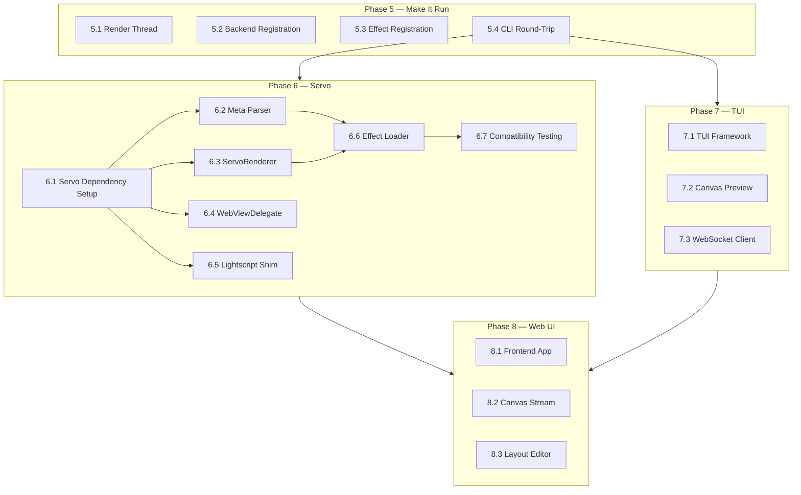

# Hypercolor — Next Phases Roadmap

> From "1,050 tests passing" to "running system with visual effects"

---

## Where We Are

**10 commits, 4 crates, 1,050 tests, 0 clippy warnings.**

| Layer | Status | Notes |
|-------|--------|-------|
| **Types** | Done | 7 modules, full serde, Oklab/Oklch color math |
| **Core engine** | Done | Render loop, FPS tiers, effect engine, spatial sampler |
| **Device backends** | Done | WLED (DDP/E1.31), mock backend |
| **Audio pipeline** | Done | FFT, beat detection, mel bands, chromagram |
| **Screen capture** | Done | Sector analysis, temporal smoothing, letterbox detection |
| **Scene engine** | Done | Priority stack, Oklab transitions, automation rules |
| **Event bus** | Done | Broadcast + watch channels, category filtering |
| **REST API** | Done | 24 endpoints, Axum 0.8, proper envelope |
| **WebSocket** | Done | Subscriptions, backpressure, `hypercolor-v1` subprotocol |
| **MCP server** | Done | JSON-RPC 2.0, 14 tools, 5 resources, fuzzy matching |
| **CLI** | Done | 10 subcommand groups, output formatting |
| **Built-in effects** | Done | 6 native Rust renderers (Solid, Gradient, Rainbow, Breathing, AudioPulse, ColorWave) |
| **Mock harness** | Done | MockDeviceBackend, MockTransportScanner, MockEffectRenderer |
| **Integration tests** | Done | Full pipeline end-to-end proven in tests |

### What's NOT Working Yet

- **Daemon doesn't actually run a render thread** — it starts/stops the render loop but never drives frames
- **No backends registered at startup** — discovery orchestrator has no scanners
- **No effects registered at startup** — registry is empty
- **Servo not integrated** — 230 HTML/Canvas effects are just files sitting in `effects/`
- **No TUI** — terminal dashboard doesn't exist
- **No web UI** — no visual preview of effects
- **CLI commands hit endpoints that don't return real data** — most handlers return mock responses

---

## Phase 5: Make It Run

**Goal:** `cargo run -p hypercolor-daemon` starts a daemon that discovers devices, renders effects, and pushes colors. Controllable via CLI.

### 5.1 — Wire the Render Thread

The `RenderLoop` exists as a timing skeleton. Wire it into a real frame loop:

```
tokio::spawn(async move {
    loop {
        if !render_loop.tick() { break; }

        // 1. Sample inputs (audio, screen)
        let input_data = input_manager.sample().await;

        // 2. Render effect → Canvas
        let canvas = effect_engine.tick(dt, &audio_data)?;

        // 3. Spatial sample → per-device RGB arrays
        for zone in layout.zones {
            let colors = sampler::sample_zone(&canvas, &zone, &layout);
            backend.write_colors(&device_id, &colors).await?;
        }

        // 4. Publish frame event
        bus.publish(FrameRendered { frame_number, fps });

        // 5. Sleep for remaining budget
        let stats = render_loop.frame_complete();
        tokio::time::sleep(stats.sleep_duration).await;
    }
});
```

**Files:** `crates/hypercolor-daemon/src/render_thread.rs` (new)
**Test:** Starts daemon with mock backend, verifies frames are produced and colors written

### 5.2 — Backend Registration + Discovery at Startup

Wire backends into `DaemonState::initialize()`:

- Register `MockDeviceBackend` (always available, for testing)
- Register `WledBackend` (if WLED devices configured)
- Run initial `DiscoveryOrchestrator::full_scan()` on startup
- Schedule periodic re-scans

**Files:** `crates/hypercolor-daemon/src/startup.rs` (modify)

### 5.3 — Register Built-in Effects at Startup

Call `register_builtin_effects()` during daemon init. Wire `create_builtin_renderer()` into the effect activation path so that when the API receives `POST /effects/{id}/apply`, it creates the right renderer.

**Files:** `crates/hypercolor-daemon/src/startup.rs`, `crates/hypercolor-daemon/src/api/effects.rs`

### 5.4 — CLI → Daemon Round-Trip

Make these CLI commands actually work end-to-end:
- `hypercolor status` — shows real daemon state (FPS, device count, active effect)
- `hypercolor devices list` — shows discovered devices
- `hypercolor effects list` — shows registered effects
- `hypercolor effects activate rainbow` — activates the Rainbow effect
- `hypercolor effects stop` — stops the active effect

**Verify:** `cargo run -p hypercolor-daemon &` then `cargo run -p hypercolor-cli -- status` works

### Estimated Scope
- 4-5 files modified, 1-2 new
- 20-30 new integration tests
- Daemon binary actually runs and responds to CLI

---

## Phase 6: Servo Integration

**Goal:** Run all 230 HTML effects (Canvas 2D + WebGL) through Servo headlessly, producing Canvas frames at 60fps.

**Architecture Decision:** See `docs/design/WEB_ENGINE_DECISION.md`. Going all-in on Servo. Canvas 2D, WebGL, JS execution, color parsing, text rendering, gradients, compositing — all handled by the browser engine. We build only the integration layer.

### 6.1 — Servo Dependency Setup

- Add `libservo` as a git dependency with pinned revision (target: v0.0.5+)
- Feature-gate: `features = ["servo"]` so the daemon compiles without it for quick dev
- Set up `rust-toolchain` compatibility
- Verify `cargo build` with the servo feature on Windows MSVC
- Test: `SoftwareRenderingContext::new(320, 200)` creates successfully
- Use the cache workflow in `docs/development/SERVO_BUILD_CACHING.md` to avoid
  repeated expensive native builds

```toml
[dependencies]
libservo = { git = "https://github.com/servo/servo", rev = "PIN", optional = true }

[features]
default = ["servo"]
servo = ["dep:libservo"]
```

**Files:** `crates/hypercolor-core/Cargo.toml`, workspace `Cargo.toml`
**Risk:** Build time. Mitigated by prebuilt SpiderMonkey archives + feature gate.

### 6.2 — HTML Meta Tag Parser

Parse `<meta>` tags from HTML effects to extract:
- Title, description, publisher
- Control definitions (type, min, max, default, label)
- Category detection
- Audio reactivity detection (scan for `engine.audio`, `iAudioLevel`, etc.)

Lenient regex-based extraction — NOT a full HTML parser. This module is independent of Servo and works without the `servo` feature.

**Files:** `crates/hypercolor-core/src/effect/meta_parser.rs` (new)
**Test:** Parse all 230 effects, verify metadata extraction

### 6.3 — ServoRenderer

Implement `EffectRenderer` backed by Servo:

```rust
pub struct ServoRenderer {
    servo: Servo,
    webview: WebView,
    rendering_ctx: Rc<SoftwareRenderingContext>,
    delegate: Rc<HypercolorWebViewDelegate>,
}
```

- `init()` — Create `SoftwareRenderingContext(320, 200)`, init Servo, create WebView, load HTML
- `tick()` — Inject per-frame data via JS eval, `spin_event_loop()`, `paint()`, `read_to_image()` → `Canvas`
- `set_control()` — Evaluate JS: `window['speed'] = 5.0; window.onspeedChanged?.()`
- `destroy()` — Drop WebView and Servo instance

**Files:** `crates/hypercolor-core/src/effect/servo_renderer.rs` (new)

### 6.4 — HypercolorWebViewDelegate

Implement `WebViewDelegate` to handle Servo callbacks:

- `notify_new_frame_ready()` — Signal that a frame can be read
- `notify_url_changed()` — Log navigation events
- `notify_page_loaded()` — Signal effect initialization complete
- `notify_console_message()` — Forward JS console output to tracing

Minimal implementation — we don't need navigation, history, cookies, etc.

**Files:** `crates/hypercolor-core/src/effect/servo_delegate.rs` (new)

### 6.5 — Lightscript API Shim

Inject LightScript-compatible runtime into each effect via JS evaluation:

```javascript
window.engine = {
    audio: { level: 0, bass: 0, mid: 0, treble: 0,
             freq: new Float32Array(200), beat: false, beatPulse: 0 },
    width: 320, height: 200
};
```

Per-frame injection via `webview.evaluate_javascript()`:
- Update `window.engine.audio` with current FFT/beat data
- Set `window.<controlId>` globals from meta tag properties
- Call `on<Prop>Changed()` when controls change

**Files:** `crates/hypercolor-core/src/effect/lightscript.rs` (new)

### 6.6 — Effect Discovery + Loading

Scan `effects/` directories for HTML files:
- Parse meta tags → `EffectMetadata`
- Register in `EffectRegistry` with `EffectSource::Html`
- When activated, create `ServoRenderer` pointing at the HTML file
- Detect Canvas 2D vs WebGL usage (grep for `WebGLRenderer`/`THREE.`) for diagnostics

**Files:** `crates/hypercolor-core/src/effect/loader.rs` (new)

### 6.7 — Effect Compatibility Testing

Test each effect category against the ServoRenderer:

- **Builtin HTML effects (5):** Must all render correctly
- **Community Canvas 2D (210):** Sample 20+, verify visual output
- **Custom WebGL (13):** Test all Three.js effects, verify WebGL context creation
- **DOM outliers (2):** Screen Ambience (CSS filters), Tetris (jQuery) — best effort

Create a test harness that loads an effect, renders N frames, and verifies non-black output.

**Files:** `crates/hypercolor-core/tests/servo_integration_tests.rs` (new)

### Estimated Scope
- 5-6 new files
- Servo feature-gated to avoid slow builds during unrelated development
- All 230 HTML effects runnable (Canvas 2D + WebGL)
- Tests verify: meta parsing, Servo init, frame production, pixel readback, audio injection

---

## Phase 7: TUI Dashboard

**Goal:** `hypercolor tui` launches a Ratatui terminal dashboard for monitoring and control.

### 7.1 — TUI Framework

Ratatui with `crossterm` backend. Vim-style keybindings. SilkCircuit Neon color palette.

**Layout:**
```
┌─ Hypercolor ─────────────────────────────────────────────────┐
│ ┌─ Devices ──────────────┐ ┌─ Active Effect ──────────────┐ │
│ │ ● WLED Strip (60 LEDs) │ │ Rainbow                      │ │
│ │ ● WLED Matrix (256)    │ │ FPS: 60 (Full tier)          │ │
│ │ ○ Desk LED Strip       │ │ Frame: 12,847                │ │
│ │                        │ │ Canvas: 320×200              │ │
│ └────────────────────────┘ └──────────────────────────────┘ │
│ ┌─ Audio ────────────────┐ ┌─ Effect Controls ────────────┐ │
│ │ ▐█████████░░░░░░░│ RMS │ │ speed: ████████░░ 0.7       │ │
│ │ ▐████░░░░░░░░░░░░│ Bass│ │ scale: ██████████ 1.0       │ │
│ │ ▐██████░░░░░░░░░░│ Mid │ │ brightness: ██████░░ 0.8    │ │
│ │ ▐███░░░░░░░░░░░░░│ Treb│ │                             │ │
│ │ BPM: 128  Beat: ●      │ │                             │ │
│ └────────────────────────┘ └─────────────────────────────┘ │
│ ┌─ Canvas Preview ───────────────────────────────────────┐  │
│ │  ░░▒▒▓▓██████████▓▓▒▒░░  (braille-dot color preview)  │  │
│ └────────────────────────────────────────────────────────┘  │
│ [d]evices [e]ffects [s]cenes [a]udio [c]onfig [q]uit       │
└──────────────────────────────────────────────────────────────┘
```

**Features:**
- Live device status (connected/disconnected, LED count)
- Active effect name + FPS + frame counter
- Audio visualizer (RMS, band levels, BPM, beat indicator)
- Effect control sliders (adjustable with arrow keys)
- Canvas preview using braille dots or half-block characters for color approximation
- Vim-style navigation (`j/k` scroll, `Enter` select, `q` quit)
- Tab views: Devices, Effects, Scenes, Audio, Config

### 7.2 — Canvas Preview Widget

Custom Ratatui widget that renders a downscaled version of the 320×200 Canvas using Unicode braille characters (⠿) or half-block characters (▀▄) with 24-bit terminal color. Each character cell represents a 2×4 or 2×2 pixel region.

This is the "see what the Canvas runner is doing" piece — you can watch the effect animate in your terminal.

### 7.3 — WebSocket-Driven Live Updates

TUI connects to the daemon's WebSocket at `ws://localhost:9420/api/v1/ws`:
- Subscribe to `frame`, `device`, `effect`, `audio` events
- Update dashboard widgets in real-time at 10-15fps (terminal can't do 60)
- Backpressure: TUI drops frames if rendering can't keep up

**Files:** New crate or module in `hypercolor-cli`
**Deps:** `ratatui`, `crossterm`, `tungstenite` or `tokio-tungstenite`

### Estimated Scope
- 8-12 new files
- 30+ tests for widget rendering, event handling
- `hypercolor tui` launches a live dashboard

---

## Phase 8: Web UI

**Goal:** Browser-based dashboard with live effect preview, spatial layout editor, and full control surface.

### 8.1 — Embedded Web Frontend

Axum serves a SvelteKit (or Leptos) frontend from the daemon binary:
- Effect browser with thumbnails (from `.png` files in `effects/`)
- Live canvas preview via WebSocket (stream raw RGBA or compressed frames)
- Device management (discover, connect, rename)
- Spatial layout editor (drag zones onto a canvas representation)

### 8.2 — Live Canvas Stream

WebSocket binary frames: daemon sends downscaled canvas data to browser:
- Option A: Raw RGBA at reduced resolution (80×50 = 16KB/frame)
- Option B: WebP/PNG compressed (2-5KB/frame)
- Browser renders to `<canvas>` element with `requestAnimationFrame`

### 8.3 — Spatial Layout Editor

Three.js or Canvas 2D editor:
- Drag device zones onto the 320×200 canvas
- See LED positions overlaid on the live effect preview
- Adjust zone rotation, scale, sampling mode
- Save layouts to daemon via REST API

---

## Phase Dependency Graph



**Critical path:** Phase 5 → Phase 6 → Phase 7 → Phase 8

**Parallelism opportunities:**
- Phase 6 (Servo) and Phase 7 (TUI) can be developed simultaneously
- Phase 5.1-5.3 are independent (3 parallel agents)
- Phase 6.2-6.5 are independent after 6.1 completes (4 parallel agents)

---

## Risk Register

| Risk | Impact | Mitigation |
|------|--------|------------|
| Servo API breaks on version bump | Integration needs fixing | Pin to specific git rev. Update deliberately. |
| Servo build time (8-15 min clean) | Slower CI and dev iteration | Feature-gate. Native effects work without Servo. Cargo caching. |
| WebGL incomplete in Servo | Some Three.js effects won't render | Test each effect. File upstream issues. WebGPU may be alternative. |
| Servo binary size (~50-100MB) | Larger distribution | Acceptable for persistent daemon. Not a CLI tool. |
| Servo on Windows needs MSVC | Can't use Cygwin for Servo builds | Use native MSVC toolchain. Cygwin for everything else. |
| Canvas 2D rendering bugs vs Chrome | Visual differences | Test against effect corpus. Fix upstream or apply tweaks. |
| TUI color fidelity | Low-res preview | Use braille dots + 24-bit color; accept limitations |
| No real devices configured | No real devices | Mock backend always available for testing |

---

## Definition of "Runnable System"

When Phase 5 is complete, this should work:

```bash
# Terminal 1: Start the daemon
cargo run -p hypercolor-daemon

# Terminal 2: Interact via CLI
hypercolor status              # Shows: running, 60fps, 0 devices
hypercolor effects list        # Shows: 6 built-in effects
hypercolor effects activate rainbow
hypercolor status              # Shows: running, 60fps, effect: Rainbow

# With WLED running:
hypercolor devices list        # Shows discovered devices
hypercolor devices discover    # Triggers rescan
```

When Phase 6 is complete, this should also work:

```bash
hypercolor effects list        # Shows: 6 built-in + 230 HTML effects
hypercolor effects activate "Voronoi Flow"  # Activates a WebGL effect via Servo
hypercolor effects activate "Rainbow Wave"  # Activates a Canvas 2D effect via Servo
hypercolor status              # Shows: running, 60fps, effect: Voronoi Flow, renderer: Servo
```

When Phase 7 is complete, this should work:

```bash
# Terminal 1: Start the daemon
cargo run -p hypercolor-daemon

# Terminal 2: Launch TUI
hypercolor tui                 # Live dashboard with canvas preview
```

You see the effect animating in your terminal via braille-dot color approximation.
