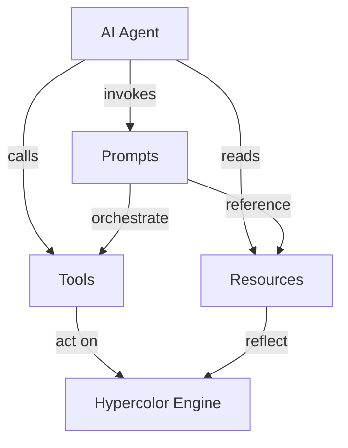

+++
title = "Agents & MCP"
description = "Drive Hypercolor with AI agents over MCP and the CLI: 16 tools, 5 resources, 3 prompts, plus a scriptable command line."
sort_by = "weight"
weight = 0
template = "section.html"
+++

Hypercolor is built to be driven by AI agents. Point an assistant at the daemon and it can read the live lighting state, browse the effect catalog, apply visuals, tune brightness, manage scenes, and diagnose a misbehaving device, all over two complementary surfaces: a built-in **MCP server** and a scriptable **CLI**. This section shows how to wire them up and put them to work.


Hypercolor exposes the same engine through every interface. Whether an agent calls an MCP tool, runs a CLI command, or hits the REST API, it operates on one shared state through the event bus, so a change made one way is instantly visible everywhere.


## Two surfaces, one engine 🔮

There are two ways to put an agent in control. They are not competitors. Most real workflows cross between them.

| Surface | Transport | Best for |
| --- | --- | --- |
| **MCP server** | Streamable HTTP at `http://127.0.0.1:9420/mcp` | Conversational assistants (Claude, Cursor, Zed) that speak the Model Context Protocol natively |
| **CLI** (`hypercolor`) | HTTP to the daemon on `:9420` | Shell scripts, cron jobs, CI, and agents that shell out and branch on exit codes |

The MCP server gives a model structured tools, browsable resources, and ready-made prompts. The CLI gives any agent that can run a command a machine-readable contract through `--json` output and exit codes. When a job needs both, for example building an effect with the SDK and then applying it, you reach across the line: the SDK authoring CLI installs the effect, then an MCP tool or the daemon CLI applies it.


The MCP server is **off by default**. Until you enable it in config, `http://127.0.0.1:9420/mcp` returns 404. Start at [MCP setup](@/agents/mcp-setup.md), which leads with turning it on.


## The three MCP primitives

The MCP server speaks in three kinds of building blocks. Knowing which is which tells an agent how to use it.

**Tools** are actions and queries the model invokes with structured arguments, the verbs. There are **16**: `set_effect`, `list_effects`, `stop_effect`, `set_color`, `get_devices`, `set_brightness`, `get_status`, `activate_scene`, `list_scenes`, `create_scene`, `get_audio_state`, `get_sensor_data`, `set_display_face`, `set_profile`, `get_layout`, and `diagnose`. Eight of those are read-only (`get_status`, `list_effects`, `get_devices`, `get_audio_state`, `get_sensor_data`, `list_scenes`, `get_layout`, `diagnose`); the rest mutate state. See the [tools reference](@/agents/tools-reference.md).

**Resources** are browsable, read-only views of live state under the `hypercolor://` scheme, the nouns. There are **5**: `hypercolor://state`, `hypercolor://devices`, `hypercolor://effects`, `hypercolor://profiles`, and `hypercolor://audio`. An agent reads a resource to orient itself before acting. See the [resources reference](@/agents/resources-reference.md).

**Prompts** are guided, parameterized templates a client surfaces as slash commands. There are **3**: `mood_lighting`, `troubleshoot`, and `setup_automation`. Each one encodes a known-good flow so the model does not have to invent it. See [prompt templates](@/agents/prompt-templates.md).


The server ships its own operating instructions to every connected client: start with `get_status` or the `hypercolor://state` resource before making changes, use `list_effects` to discover the catalog before applying visuals, and prefer structured arguments and resource reads over guessing the current state. That read-then-act discipline is the through-line for every agent workflow here.


## Where to go next


New to agent control? Walk it in order: enable the server, learn the tools, then study a worked playbook.


- **[MCP setup](@/agents/mcp-setup.md)** — Turn the server on, then copy-paste connection config for Claude Code, Claude Desktop, Cursor, Zed, and generic MCP clients.
- **[Tools reference](@/agents/tools-reference.md)** — All 16 tools with arguments, defaults, enums, read-only and idempotency flags, and a worked call for each.
- **[Resources reference](@/agents/resources-reference.md)** — The 5 `hypercolor://` resources, their payload shapes, and how fresh each one is.
- **[Prompt templates](@/agents/prompt-templates.md)** — The 3 shipped prompts, their arguments, and when each one fits.
- **[CLI scripting for agents](@/agents/cli-scripting.md)** — Drive the daemon from a shell: `--json` output, exit codes, env vars, and a state-first workflow.
- **[Agent workflows](@/agents/workflows.md)** — End-to-end playbooks with real call-and-response pairs: set a calm scene, build and apply an effect, diagnose a sick device.

## Authentication in one line

Local agents need no credentials. Loopback requests bypass auth entirely, so an assistant talking to `127.0.0.1:9420` just works. A bearer token is only required when the daemon is reached from a non-loopback address, in which case the agent sends `Authorization: Bearer <token>` using a key from `HYPERCOLOR_API_KEY` (control) or `HYPERCOLOR_READ_API_KEY` (read-only). Full detail, including the loopback exemption and remote-client allowlisting, lives in [MCP setup](@/agents/mcp-setup.md).

## Beyond MCP: the CLI as an agent tool

Any agent that can run a shell command can drive Hypercolor without speaking MCP at all. The `hypercolor` CLI emits machine-readable JSON with `-j` (or `--format json`) and exits non-zero on failure, so an agent can branch on the result. Three top-level commands are easy to confuse, so keep them straight:

- `hypercolor server` — query the daemon's identity, version, capabilities, and run a quick health check.
- `hypercolor servers` — discover Hypercolor daemons advertised over mDNS on the local network and save them as connection profiles.
- `hypercolor service` — manage the daemon's lifecycle (start, stop, restart, enable or disable autostart, tail logs).

Read the full command tree and agent recipes in [CLI scripting for agents](@/agents/cli-scripting.md), backed by the complete [CLI reference](@/api/cli.md).

<!-- product shot: agent driving Hypercolor (no captured image available yet) -->
