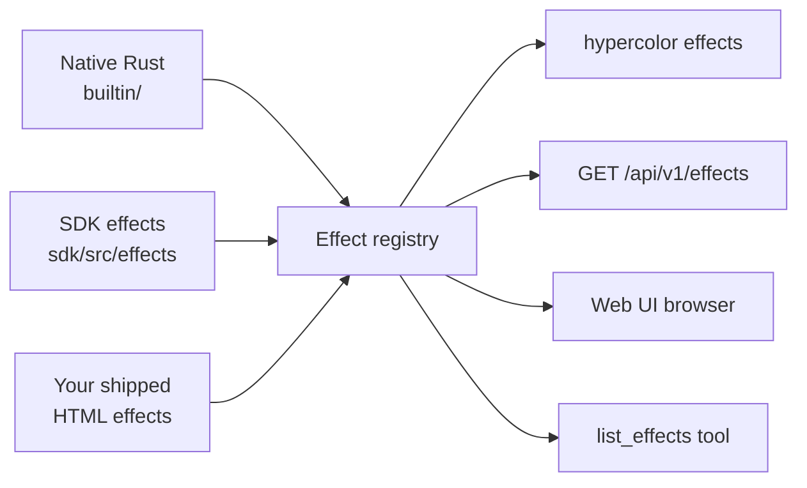

+++
title = "Effect catalog"
description = "Browse the Hypercolor effect library from the CLI, REST API, web UI, or an MCP agent — counts, categories, filters, and a visual gallery."
weight = 190
+++

The catalog is whatever the daemon currently has loaded. Browse it live with `hypercolor effects list`, `GET /api/v1/effects`, the web UI effects browser, or the MCP `list_effects` tool. Every surface reads the same registry, so the list reflects exactly what is installed right now: built-in effects, SDK effects, and anything you have shipped yourself.


Two effect families ship out of the box. Eleven native effects are compiled into the daemon (`crates/hypercolor-core/src/effect/builtin/`), and roughly forty-seven SDK effects build from `sdk/src/effects/` into self-contained HTML. Those numbers move as the library grows, so the catalog is the source of truth, not a count pinned in a doc. Query the daemon to see what you actually have.


Effect counts drift as the library grows and as you install your own work. Never hardcode a total — ask the daemon. `hypercolor effects list -o json` returns the full set with a `pagination` block, and the web UI shows the live count beside the search box.


## Browse from the CLI

The `hypercolor effects` command tree is the fastest way to explore the catalog from a terminal or a script.

```bash
# Every effect, as a table
hypercolor effects list

# Filter to audio-reactive effects only
hypercolor effects list --audio

# Free-text search across names and descriptions
hypercolor effects list --search aurora

# Narrow by category or rendering engine
hypercolor effects list --category ambient
hypercolor effects list --engine native

# Full detail for one effect
hypercolor effects info borealis
```

`effects list` takes four filters, all optional and combinable: `--engine <native|web|wasm>`, `--audio` (a flag, audio-reactive only), `--search <text>`, and `--category <name>`. The table view prints effect name, category, author, and version, then a count footer. Add `-o json` for the raw response or `-o plain` for one name per line, which pipes cleanly into other tools.

```bash
# Names only, ready for a shell loop
hypercolor effects list -o plain | grep -i fire

# Activate the first match with a speed shorthand
hypercolor effects activate spectral-fire --speed 60
```

After installing a new effect into the daemon's library directory, run `hypercolor effects rescan` to make the daemon re-read the catalog. The command reports how many effects it found.

## Browse over REST

`GET /api/v1/effects` returns the catalog as a list of effect summaries wrapped in the standard `{ data, meta }` envelope.


List the effect catalog. Optional query parameters mirror the CLI filters: `search`, `category`, `engine`, and `audio=true`. The response carries `items` (an array of effect summaries) and a `pagination` block.


Each entry in `items` is an effect summary with this shape:

```json
{
  "id": "borealis",
  "name": "Borealis",
  "description": "Slow aurora curtains in cool greens and violets.",
  "author": "Hypercolor",
  "category": "ambient",
  "source": "html",
  "runnable": true,
  "tags": ["aurora", "ambient", "cool"],
  "version": "1.0.0",
  "audio_reactive": false,
  "cover_image_url": "/api/v1/effects/borealis/cover"
}
```

The `runnable` field matters when you build tooling on top of the catalog. An effect can be registered but not runnable on the current build — GLSL shader effects authored for the future native lane report `runnable: false` until that path ships, and the daemon refuses to apply them. Filter on `runnable` before offering an effect to a user. The `source` field tells you the rendering path: `html` (SDK and raw HTML effects rendered through Servo), `native` (a compiled-in Rust renderer), or `shader` (the future GPU lane, not runnable today).

`GET /api/v1/effects/{id}` returns full detail for a single effect, including its control definitions and any presets. Reach for it when you want to render a controls panel or validate a parameter before applying.

## Categories

Effects carry a category for discovery and filtering. The canonical taxonomy lives in `EffectCategory` (`crates/hypercolor-types/src/effect.rs`) and serializes as snake_case:

| Category | What lives here |
|---|---|
| `ambient` | Slow, set-and-forget — aurora, breathing, gradient |
| `audio` | Music-reactive — spectrum, beat pulse, waveform |
| `generative` | Algorithmic and mathematical — voronoi, fractals, cellular automata |
| `particle` | Physics simulations — fire, meteors, bubbles |
| `scenic` | Environmental compositions — cyberpunk city, underwater |
| `interactive` | Input-responsive — keystroke ripple, heatmap |
| `fun` | Playful and seasonal — corner hunt, snowfall, dragonfire |
| `source` | Live feeds and sampled surfaces — web pages, cameras, screen capture |
| `utility` | Functional — solid color, off, system monitor |
| `display` | Full-fidelity HTML display faces for LCD surfaces |


The MCP `list_effects` tool exposes its own filter enum (`ambient`, `reactive`, `audio`, `gaming`, `productivity`, `utility`, `interactive`, `generative`) which does not map one-to-one onto `EffectCategory`. When you filter from an agent, use the MCP enum; when you filter over REST or the CLI, use the canonical category names in the table above.


## Browse from an MCP agent

An agent driving Hypercolor reads the catalog with the read-only `list_effects` tool before applying anything. It accepts `category`, `audio_reactive`, `query` (full-text across names, descriptions, and tags), plus `limit` (default 20, max 100) and `offset` for pagination.

```json
{
  "name": "list_effects",
  "arguments": {
    "category": "audio",
    "audio_reactive": true,
    "limit": 10
  }
}
```

The companion `set_effect` tool takes a `query` that accepts an exact name, a partial match, or a natural-language description ("something with northern lights", "calm blue waves") and returns the matched effect with a confidence score. The canonical agent loop is read state, discover options with `list_effects`, then apply with `set_effect`. The MCP server is off by default — enable it in the daemon's `[mcp]` config before an agent can reach the catalog.

## Visual gallery

The web UI renders each effect as a live, animated tile, which is the best way to actually choose one. The cards below are static captures of a selection of shipped effects; the running UI shows every effect in your library, animated, with search and category filters above the grid.

  

  

  

  

  

  

  

  

## Where effects come from



The eleven native effects are part of the daemon binary. The SDK effects build from TypeScript and GLSL sources into HTML artifacts. Effects you author land in the daemon's library directory and join the same registry after a rescan. Every browsing surface reads that one registry, so the catalog stays consistent no matter how you query it.

## Add your own

The catalog grows when you ship an effect. Start at [creating effects](@/effects/creating-effects.md) for the scaffold-to-hardware loop, then [the dev workflow](@/effects/dev-workflow.md) for the build, validate, and ship cycle. To add a compiled-in native effect, see [native Rust effects](@/effects/native-rust-effects.md), which walks through registration in `builtin/mod.rs`. Once shipped, your effect appears in `hypercolor effects list` alongside everything else after a `hypercolor effects rescan`.
