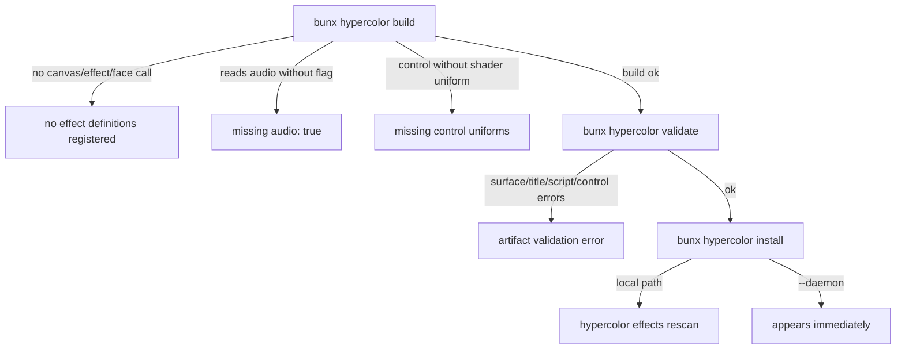

+++
title = "Effect build troubleshooting"
description = "The build-time hard errors the Hypercolor SDK throws, what each one means, and the exact fix for every failure mode."
weight = 150
template = "page.html"
+++

When `bunx hypercolor build` fails, it fails loudly, with one of a small set of precise error strings. Each one maps to a real contract the SDK enforces at build time, not at runtime, so a clean build is your guarantee the effect will load in the daemon. This page lists every hard error the build can throw, the message verbatim, why the check exists, and the fix.

These checks live in two places: the metadata-extraction worker (`sdk/packages/core/src/tooling/metadata-worker.ts`), which runs each effect module in isolation to read its registered definition, and the HTML validator (`sdk/packages/core/src/tooling/validate.ts`), which inspects the compiled artifact. The build runs the first; `bunx hypercolor validate` runs the second.


Pass `--json` to either command for machine-readable output, and `--strict` to `validate` to make warnings exit non-zero. Without `--strict`, `validate` exits `1` only on hard errors; warnings still print.


## "no effect definitions were registered"

```text
Metadata extraction failed for <path>: no effect definitions were registered
```

The build imports your module and waits for it to call one of the three effect entry points: `canvas()`, `effect()`, or `face()`. Each call registers a definition as a side effect. If the module finishes importing without registering anything, there is no effect to extract metadata from, and the build stops here.

This is almost always one of three mistakes:

- The module never **calls** an entry point. Declaring a draw function and exporting it is not enough; you have to pass it to `canvas(...)`.
- The entry-point call is guarded behind a condition that is false at import time (inside an `if`, a lazy callback, or a function that never runs).
- The wrong file was passed as the entry. The `--all` discovery looks for `effects/<id>/main.ts`; a stray helper file with no registration call will trip this if you point the build at it directly.

The fix is to make sure the top level of your module unconditionally calls `canvas`, `effect`, or `face`:

```ts
import { canvas } from 'hypercolor'

canvas('Aurora', { hue: [0, 360, 200] }, (ctx, controls) => {
  // draw
})
```

The default export is irrelevant to registration. `canvas()` returns `undefined`; the registration happens through the call itself, so `export default` is optional and never the thing the build is looking for.

## "missing audio: true"

```text
Audio reactivity validation failed for <path>: effect uses audio helpers but is missing audio: true
```

This is the single most common build failure, and the one people most often assume is cosmetic. It is not. `{ audio: true }` is the flag that makes the daemon inject the audio pipeline into your effect's runtime. If you read audio without it, the effect would silently get no data on real hardware, so the build refuses to let that ship.

The check scans your source for any of these patterns and fails if it finds one while `audio: true` is absent:

```text
audio(        ctx.audio        getAudioData(        engine.audio
```

The fix is to set the flag in the options object:

```ts
import { canvas, audio } from 'hypercolor'

canvas('Pulse', { sensitivity: [0, 1, 0.6] }, { audio: true }, (ctx, controls) => {
  const a = audio()
  // react to a.level, a.beatPulse, etc.
})
```


The scan is textual. A commented-out `audio()` call or a string literal containing `engine.audio` will trip it. Remove the dead reference rather than adding `audio: true` to an effect that does not actually use audio, otherwise you advertise reactivity the effect does not deliver.


For the full audio surface and the per-frame pull model, see [Audio API](@/effects/audio.md).

## "missing control uniforms"

```text
Shader binding validation failed for <path>: missing control uniforms <names>
```

This one fires only for GLSL shader effects authored with `effect()`. Every control you declare (except `asset` controls) must have a matching uniform in the fragment shader, because the daemon binds control values by uniform name. A declared control with no uniform to receive it is a dead control, so the build rejects it.

The naming rule is mechanical: a control key becomes `i` plus the PascalCased key. So `speed` → `iSpeed`, `trailLength` → `iTrailLength`, `palette` → `iPalette`. If you declared `trailLength` but your shader has no `uniform float iTrailLength;`, you get the error naming `iTrailLength`.

Two fixes, depending on intent:

- You meant to use the control. Add the uniform to the shader:

  ```glsl
  uniform float iTrailLength;
  ```

- You renamed the uniform on purpose. Pass the `uniform` option on the control factory so the build expects your name instead of the derived one.

The mirror case, an `i*` uniform in the shader with **no** matching control, only warns. The build lists it so you can spot typos, but it does not stop. Built-in uniforms (`iTime`, `iResolution`, `iMouse`) and the audio uniforms (anything starting `iAudio`) are exempt from both checks.

See [GLSL shader effects](@/effects/glsl-effects.md) for the full uniform map and the `speed`/`palette` magic-name behavior.

## Palette magic not firing

There is no error for this one, which is exactly why it is confusing. The palette shorthand only auto-converts under one specific shape, and any deviation silently leaves you with a plain string instead of a sampleable palette.

The magic triggers only when the **shorthand** declaration uses the **exact key** `palette` with an array of color stops:

```ts
canvas('Flow', { palette: ['#e135ff', '#80ffea', '#ff6ac1'] }, (ctx, controls) => {
  const color = controls.palette(0.5) // works: palette is a PaletteFn
})
```

It does **not** fire if you:

- Use a different key (`colors: [...]` stays a string array, never a function).
- Declare it explicitly with `combo('Palette', [...])` instead of the shorthand.

When the magic does not fire, the value reaches your draw function as a raw string. The recovery is to rebuild the sampler yourself inside the draw:

```ts
import { createPaletteFn } from 'hypercolor'

const palette = createPaletteFn(controls.colors) // controls.colors is a palette name string
const color = palette(0.5)
```

In shaders, the same `palette` shorthand becomes an integer index uniform (`uniform int iPalette`) rather than a function. The full registry and the Oklab sampling internals are in [Palettes](@/effects/palettes.md).

## Artifact validation errors

`bunx hypercolor validate dist/*.html` inspects the compiled HTML rather than the source module. These are the hard errors it raises (each one sets exit code `1`):

| Code | Meaning | Fix |
|---|---|---|
| `MISSING_RENDER_SURFACE` | No render surface element in the HTML | The build emits `#exCanvas` for canvas/shader effects and `#faceContainer` for faces. A missing surface means the artifact was hand-edited or built wrong; rebuild from source. |
| `MISSING_TITLE` | No `<title>` tag | The first argument to `canvas`/`effect`/`face` is the name; it becomes the title. Supply a name. |
| `MISSING_SCRIPT` | No `<script>` tag | The bundle is missing. Rebuild; do not hand-author the artifact. |
| `INVALID_CONTROL_TYPE` | A control declares an unknown type | Use a real control factory. Valid types are `number`, `boolean`, `color`, `combobox`, `hue`, `text`/`textfield`, `sensor`, `rect`, `asset`. |
| `DUPLICATE_CONTROL_ID` | Two controls share a key | Control keys must be unique within an effect. Rename one. |
| `INVALID_CONTROL_RANGE` | A numeric control has `min >= max` | Fix the shorthand bounds (`[min, max, default]`). |
| `MISSING_COMBOBOX_VALUES` | A combobox declares no options | Give the dropdown a non-empty `string[]` of values. |
| `INVALID_MEDIA_KIND` | An `asset` control names an unknown media kind | Use `any`, `image`, `video`, or `lottie`. |
| `INVALID_PRESET_JSON` | A preset's `preset-controls` is not valid JSON | Fix the preset definition in source and rebuild. |

The validator also emits **warnings** that do not fail the build unless you pass `--strict`. The most useful ones to know:

- `MISSING_VERSION` — the `hypercolor-version` meta tag is absent. The build normally writes it; its absence means a hand-built or stale artifact.
- `DEFAULT_OUT_OF_RANGE` — a control's default sits outside its own declared `[min, max]`.
- `EXTERNAL_ASSET_REFERENCE` — the artifact references an external script or link tag, so it is not self-contained. Effects must inline everything; a CDN reference will not load on a daemon without network access.
- `UNUSUAL_CANVAS_WIDTH` / `UNUSUAL_CANVAS_HEIGHT` — a declared canvas dimension falls outside the sane `100–1920` band. Usually a sign you hardcoded a size; effects should read `ctx.canvas.width`/`ctx.canvas.height` per frame instead, since the daemon canvas defaults to 640×480 but is configurable.

## "hypercolor dev has been removed"

```text
hypercolor dev has been removed. Use build, validate, and install against the real daemon/app preview instead.
```

The old `bunx hypercolor dev` preview server is gone. It exits `1` with this message. There is no standalone browser preview anymore; the iteration loop is build, install, and preview inside the actual daemon or desktop app. Any tutorial that tells you to run `hypercolor dev` is stale. The current loop is documented in [Dev workflow](@/effects/dev-workflow.md).

## The build runs but the effect does not appear

If the build and validate both pass but your effect is not in the daemon's catalog, the artifact never reached the daemon. Two install paths exist:

- **Local install** (`bunx hypercolor install dist/*.html`) copies the validated HTML into `$XDG_DATA_HOME/hypercolor/effects/user/` (falling back to `~/.local/share/hypercolor/effects/user/`). The daemon picks these up on startup or when you run `hypercolor effects rescan`.
- **Daemon install** (`bunx hypercolor install dist/*.html --daemon`) POSTs the artifact to a running daemon at `http://127.0.0.1:9420` (override with `--daemon-url` or `HYPERCOLOR_DAEMON_URL`), so it appears immediately with no restart.

If you used the local path and nothing shows up, the daemon has not rescanned. Run `hypercolor effects rescan`, or use `--daemon` to push directly. The system CLI is documented at [CLI reference](@/api/cli.md).


A clean `build` plus `validate` is the contract. If both pass, every check on this page passed, the artifact is self-contained, and the effect will load. The only remaining failure surface is delivery, which the install paths above cover.


## Quick reference



For the authoring CLI flags behind these commands, see [SDK CLI reference](@/effects/sdk-cli-reference.md).
