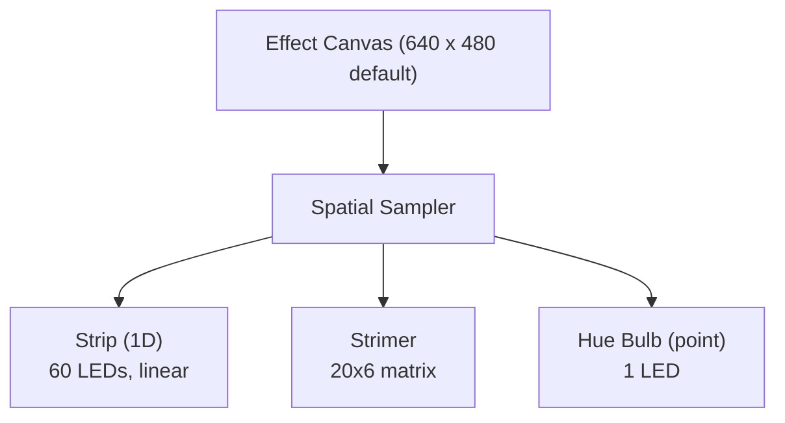

# Hypercolor Design: Spatial Layout Engine

> The bridge between beautiful pixels and physical photons.

---

## Table of Contents

1. [The Mapping Problem](#1-the-mapping-problem)
2. [Zone Editor UX](#2-zone-editor-ux)
3. [Device Shape Library](#3-device-shape-library)
4. [Per-Effect Layouts](#4-per-effect-layouts)
5. [Multi-Room / Multi-Space](#5-multi-room--multi-space)
6. [3D Layout](#6-3d-layout)
7. [Topology Management](#7-topology-management)
8. [Sampling Algorithms](#8-sampling-algorithms)
9. [Layout Persistence](#9-layout-persistence)
10. [Persona Scenarios](#10-persona-scenarios)

---

## 1. The Mapping Problem

### The Core Challenge

Every effect in Hypercolor renders to a single RGBA canvas (640x480 by default, configurable) -- a flat, continuous, pixel-perfect
rectangle. But the LEDs that consume those pixels exist in a wildly different reality:

- **Scattered across 3D space** -- inside a PC case, behind a monitor, along a desk edge, across a ceiling
- **Varying topologies** -- linear strips, 2D matrices, circular fan rings, single isolated bulbs
- **Different densities** -- a Strimer has 120 LEDs packed into 30cm; a room accent strip has 60 LEDs across 3 meters
- **Multiple devices on different protocols** -- USB HID, network DDP, HTTP REST, all needing color data simultaneously

The spatial layout engine solves one deceptively simple question: **for each physical LED, where on the
effect canvas should we sample its color?** (Zone positions are stored in normalized [0,1] coordinates
so layouts stay valid across canvas resolution changes.)



### The Dimensional Collapse

The fundamental tension is a **3D-to-2D-to-discrete** mapping:

```
Physical 3D Space          Effect Canvas          Discrete LEDs
─────────────────          ─────────────          ─────────────
  (x, y, z)         →       (u, v)          →      Color[n]
                        ┌──────────┐
    ┌──┐ Fan ring       │ ████████ │         LED 0:  #FF2288
    │  │ mounted        │ ████████ │         LED 1:  #FF3377
    │  │ vertically     │ ████████ │         LED 2:  #FF4466
    │  │ at z=0.3       │ ████████ │         ...
    └──┘                └──────────┘         LED 15: #CC1199
```

**Step 1: Physical space to canvas** -- The user places device zones on the 2D canvas, deciding
where each device "lives" in the effect's visual field. A fan at the top-left of the case gets placed
at the top-left of the canvas. A desk strip along the bottom gets placed along the bottom edge.

**Step 2: Canvas to LED colors** -- Each LED within a zone has a normalized position. The sampler
transforms that position through the zone's canvas placement (position, size, rotation) to find the
exact canvas pixel coordinate, then reads the color.

### Why This is Hard

**Density mismatch.** A 20x6 Strimer matrix mapped to a 40x12 pixel region of the canvas means each
LED covers a 2x2 area. A Hue bulb mapped to the same region should average the _entire_ 40x12 area
into one color. The sampler must handle both extremes.

**Topology mismatch.** A fan ring is circular in physical space but must sample from a rectangular
canvas region. A strip is 1D but maps to a 2D canvas area. The mapping must feel natural -- a rainbow
sweeping left-to-right on the canvas should sweep around a fan ring smoothly, not jump erratically.

**Scale mismatch.** One person's setup is 6 devices in a PC case. Another's is 30 devices across a
house. The canvas resolution is a tunable quality/perf knob (640x480 by default), but the physical
space it represents can range from 40cm to 40 meters.

---

## 2. Zone Editor UX

### Editor Overview

The spatial layout editor lives in the web UI (SvelteKit + Canvas 2D / Three.js). It is the primary
interface for telling Hypercolor where devices exist relative to each other.

```
┌─────────────────────────────────────────────────────────────────────────┐
│  Hypercolor ─ Spatial Layout Editor                       [PC Case ▾]  │
├─────────────────────────────────────────────────────────────────────────┤
│                                                                         │
│  ┌───────────────────── Toolbar ──────────────────────────────────────┐ │
│  │ [Select] [Move] [Rotate] [Scale]  │  [Snap ✓] [Grid ✓] [Guides]  │ │
│  │ [Undo] [Redo] │ [Copy] [Paste]    │  Zoom: [−] 100% [+] [Fit]    │ │
│  └───────────────────────────────────────────────────────────────────┘ │
│                                                                         │
│  ┌─── Device Library ───┐  ┌──────── Canvas ────────────────────────┐  │
│  │                       │  │                                        │  │
│  │  ▸ PC Case            │  │    ┌───────────────────┐               │  │
│  │    ○ LED Strips       │  │    │  ●●●●●●●●●●●●●●●  │ ← Strip     │  │
│  │    ○ Fan Rings        │  │    │  ●●●●●●●●●●●●●●●  │              │  │
│  │    ○ Motherboard      │  │    └───────────────────┘               │  │
│  │    ○ Strimers         │  │                                        │  │
│  │  ▸ Peripherals        │  │  ┌─────────┐    ┌─────────┐           │  │
│  │    ○ Keyboard         │  │  │  ◦ ◦ ◦   │    │  ◦ ◦ ◦   │          │  │
│  │    ○ Mouse            │  │  │ ◦     ◦  │    │ ◦     ◦  │          │  │
│  │    ○ Headset          │  │  │  ◦ ◦ ◦   │    │  ◦ ◦ ◦   │          │  │
│  │  ▸ Room               │  │  └─ Fan 1 ──┘    └─ Fan 2 ──┘          │  │
│  │    ○ WLED Strips      │  │                                        │  │
│  │    ○ Hue Bulbs        │  │         ┌──────────────────┐           │  │
│  │    ○ Room Outline     │  │         │ ●●●●●●●●●●●●●●●● │           │  │
│  │                       │  │         │ ●●●●●●●●●●●●●●●● │ ← Strimer│  │
│  │  ── Connected ──      │  │         │ ●●●●●●●●●●●●●●●● │           │  │
│  │  ✓ Prism S #1         │  │         │ ●●●●●●●●●●●●●●●● │           │  │
│  │  ✓ Prism S #2         │  │         │ ●●●●●●●●●●●●●●●● │           │  │
│  │  ✓ Nollie 8           │  │         │ ●●●●●●●●●●●●●●●● │           │  │
│  │  ✓ ASUS Z790-A        │  │         └──────────────────┘           │  │
│  │  ✓ WLED-Desk          │  │                                        │  │
│  │  ✓ WLED-Ceiling       │  │       ●  ← Hue Bulb (desk lamp)       │  │
│  │  ✓ Hue Bridge         │  │                                        │  │
│  │                       │  └────────────────────────────────────────┘  │
│  └───────────────────────┘                                              │
│                                                                         │
│  ┌──────────── Properties ──────────────────────────────────────────┐  │
│  │ Selected: ATX Strimer (Prism S #1)                                │  │
│  │ Position: X [145] Y [120]  Size: W [80] H [48]  Rotation: [0°]   │  │
│  │ Topology: Matrix 20×6    LEDs: 120    Sampling: Bilinear          │  │
│  │ [Reset Position] [Remove from Layout] [Duplicate]                 │  │
│  └───────────────────────────────────────────────────────────────────┘  │
│                                                                         │
│  ┌───── Effect Preview ─────────────────────────────────────────────┐  │
│  │ [▸ Preview ON]  Effect: Nebula     FPS: 60                        │  │
│  │ The canvas renders the active effect in real-time behind the      │  │
│  │ device zones. LEDs on each zone light up with their sampled       │  │
│  │ colors as you drag — instant visual feedback.                     │  │
│  └───────────────────────────────────────────────────────────────────┘  │
└─────────────────────────────────────────────────────────────────────────┘
```

### Interaction Model

**Drag from library.** Devices appear in the left panel, organized by category. Connected devices
show with a checkmark. Drag a device shape onto the canvas to place it. If a connected device has a
known shape preset (e.g., "Prism S - ATX Strimer"), it auto-selects the right topology.

**Direct manipulation.** Click a zone to select it. Drag to move. Corner handles to resize. Rotation
handle (circular arrow above the zone) to rotate. Hold Shift while dragging to constrain to axis.
Double-click to edit individual LED positions within the zone (advanced mode).

**Canvas navigation.** Scroll to zoom. Middle-click drag (or two-finger drag) to pan. `Ctrl+0` to
fit all zones in view. Minimap in the corner for large layouts.

### Snap and Alignment

```
Snap Behaviors:
  Grid snap ─────── Configurable grid (8px, 16px, 32px default)
  Edge snap ─────── Zone edges attract to nearby zone edges
  Center snap ───── Zone centers align with other zone centers
  Canvas snap ───── Edges align to canvas boundaries
  Spacing snap ──── Equal spacing between adjacent zones

Alignment Guides (appear on hover/drag):
  ┌─────────────────────────────────────────┐
  │           │                              │
  │  ┌────┐  ┊  ← center alignment guide    │
  │  │Fan1│  ┊                               │
  │  └────┘  ┊                               │
  │           ┊                               │
  │  ┌────┐  ┊                               │
  │  │Fan2│  ┊  ← dragging Fan2 into         │
  │  └────┘  ┊     center alignment          │
  │           │                              │
  └─────────────────────────────────────────┘
```

Smart snap is enabled by default with a 4px attraction radius. Hold `Alt` to temporarily disable
snap while dragging.

### Live Effect Preview

The canvas background renders the currently active effect in real-time (piped from the daemon via
WebSocket). As the user drags zones around, the LED dots within each zone update their colors
instantly based on their new canvas positions. This creates an immediate feedback loop:

```
Effect Preview (real-time):
  ┌───────────────────────────────────────┐
  │  ▓▓░░▒▒▓▓██▓▓▒▒░░▓▓░░▒▒▓▓██▓▓▒▒░░  │
  │  ▓░▒▓████████████▓▒░▒▓████████████▓  │
  │  ░▒  ┌────────────────────┐  ████▓▒  │ ← Strimer zone overlaid
  │  ▒▓  │ ●●●●●●●●●●●●●●●●●●│  ████▓▒  │    on the live effect.
  │  ▓█  │ ●●●●●●●●●●●●●●●●●●│  ████▓▒  │    Each ● is colored by
  │  ██  │ ●●●●●●●●●●●●●●●●●●│  ████▓▒  │    the pixel beneath it.
  │  ██  │ ●●●●●●●●●●●●●●●●●●│  ▓▓▒░▓▓  │
  │  ▓█  │ ●●●●●●●●●●●●●●●●●●│  ░▒▓███  │
  │  ▒▓  │ ●●●●●●●●●●●●●●●●●●│  ▒▓████  │
  │  ░▒  └────────────────────┘  ▓█████  │
  │  ▓▓░░▒▒▓▓██▓▓▒▒░░▓▓░░▒▒▓▓██▓▓▒▒░░  │
  └───────────────────────────────────────┘

  The ● dots glow with the sampled color. Move the zone
  left and the colors shift. Resize it and the sampling
  density changes. Instant, visceral feedback.
```

### Undo/Redo

Full undo/redo stack with standard `Ctrl+Z` / `Ctrl+Shift+Z`. Each action is an atomic operation:

- Move zone
- Resize zone
- Rotate zone
- Add zone
- Remove zone
- Change zone property (sampling mode, topology override)
- Multi-select group operations

The undo stack is kept in-memory with a depth of 100 operations. Undo state is local to the editing
session and not persisted.

### Copy/Paste

`Ctrl+C` copies selected zone(s). `Ctrl+V` pastes with a slight offset (so the paste is visible).
Useful for mirroring symmetric setups -- place left fan, copy, paste, flip horizontally for right fan.

### Multi-Select

`Ctrl+Click` to add zones to selection. `Ctrl+A` to select all. Drag a selection rectangle to lasso
multiple zones. Group operations (move, align, distribute) apply to all selected zones.

### Keyboard Shortcuts

```
Navigation:
  Scroll         Zoom in/out
  Middle-drag    Pan canvas
  Ctrl+0         Fit all zones in view
  Ctrl+=         Zoom in
  Ctrl+-         Zoom out

Editing:
  Delete         Remove selected zone(s)
  Ctrl+D         Duplicate selected zone(s)
  Ctrl+Z         Undo
  Ctrl+Shift+Z   Redo
  Ctrl+C/V       Copy / Paste
  Ctrl+A         Select all
  Escape         Deselect

Precision:
  Arrow keys     Nudge 1px (with snap disabled)
  Shift+arrows   Nudge 8px (grid-aligned)
  Alt (held)     Disable snap temporarily
  Shift (held)   Constrain to axis while dragging
  R (held)       Enter rotation mode (drag to rotate)
```

### Mobile / Touch Support

The editor must work on tablets and phones (for users adjusting layouts from the couch):

- **Touch drag** to move zones
- **Pinch-to-zoom** for canvas navigation
- **Two-finger drag** to pan
- **Long-press** for context menu (delete, duplicate, properties)
- **Property panel** slides up as a bottom sheet on mobile
- **Device library** accessible via hamburger menu or bottom tab

Touch targets are enlarged to 44px minimum. Snap zones are widened on touch to compensate for finger
imprecision. The toolbar collapses to essential actions on narrow viewports.

---

## 3. Device Shape Library

### Shape Presets

Each device type in Hypercolor has a shape preset that defines its LED topology, default dimensions,
and visual appearance in the editor. Presets are stored in `resources/devices/` as JSON files.

### Strip (Linear)

The most common topology. A 1D line of evenly-spaced LEDs.

```
Strip Shape:
  ┌─────────────────────────────────────────┐
  │ ● ● ● ● ● ● ● ● ● ● ● ● ● ● ● ● ● ● │   ← 18 LEDs
  └─────────────────────────────────────────┘

  Default: horizontal, full canvas width
  Configurable:
    - LED count (1-300)
    - Density (LEDs per meter, affects default spacing)
    - Direction (left-to-right or right-to-left)
    - Orientation (horizontal/vertical/diagonal)
```

**Preset variants:**

| Preset      | LEDs  | Typical Use          |
| ----------- | ----- | -------------------- |
| `strip-30`  | 30/m  | Standard WS2812B     |
| `strip-60`  | 60/m  | High-density WS2812B |
| `strip-144` | 144/m | Ultra-dense SK6812   |
| `wled-1m`   | 30    | 1m WLED segment      |
| `wled-2m`   | 60    | 2m WLED segment      |
| `wled-5m`   | 150   | 5m WLED strip        |

### Fan Ring (Circular)

LEDs arranged in a circle, typical of PC case fans.

```
Fan Ring Shape (16 LEDs, 120mm):

         ● ● ●
       ●         ●
     ●             ●
     ●             ●
     ●             ●
       ●         ●
         ● ● ●

  LED positions computed from polar coordinates:
    for i in 0..led_count:
      angle = (i / led_count) * 2π + start_angle
      x = 0.5 + 0.5 * cos(angle)
      y = 0.5 + 0.5 * sin(angle)
```

**Preset variants:**

| Preset         | LEDs | Size                           |
| -------------- | ---- | ------------------------------ |
| `fan-120mm-8`  | 8    | 120mm                          |
| `fan-120mm-12` | 12   | 120mm                          |
| `fan-120mm-16` | 16   | 120mm                          |
| `fan-120mm-18` | 18   | 120mm (Corsair QL)             |
| `fan-120mm-34` | 34   | 120mm (Corsair QL inner+outer) |
| `fan-140mm-16` | 16   | 140mm                          |
| `fan-140mm-18` | 18   | 140mm                          |
| `fan-200mm-24` | 24   | 200mm                          |

For dual-ring fans (like Corsair QL120 with inner and outer rings), the shape is two concentric
circles:

```
Dual-Ring Fan (34 LEDs: 16 outer + 18 inner):

         ● ● ●
       ●  ○ ○ ○  ●
     ●  ○       ○  ●
     ● ○         ○ ●      ● = outer ring (16)
     ●  ○       ○  ●      ○ = inner ring (18)
       ●  ○ ○ ○  ●
         ● ● ●
```

### Motherboard Zones

Motherboards have irregular LED zones -- underglow strips, I/O shroud accents, chipset heatsink
lighting. These are defined as named rectangular sub-zones.

```
ASUS ROG STRIX Z790-A Preset:

  ┌──────────────────────────────────────┐
  │ ┌─I/O Shield──┐                      │
  │ │ ● ● ● ● ● ● │                      │
  │ └──────────────┘                      │
  │                        ┌─VRM Heatsink─┐│
  │                        │ ● ● ● ● ● ● ││
  │                        └──────────────┘│
  │                                        │
  │     ┌─PCH Heatsink─┐                   │
  │     │   ● ● ● ●     │                  │
  │     └────────────────┘                  │
  │                                        │
  │ ● ● ● ● ● ● ● ● ● ● ← Edge Strip    │
  └──────────────────────────────────────┘

  Each sub-zone is independently positionable but grouped
  as one device. Drag the group to move all zones together.
  Ungroup to position sub-zones independently.
```

**Preset variants:**

| Preset                      | Zones          | LEDs         |
| --------------------------- | -------------- | ------------ |
| `mobo-asus-z790-strix`      | 4              | ~30          |
| `mobo-asus-z790-hero`       | 6              | ~50          |
| `mobo-msi-z790-edge`        | 3              | ~24          |
| `mobo-gigabyte-z790-master` | 4              | ~32          |
| `mobo-generic`              | 1 (edge strip) | configurable |

### Strimers (Matrix)

Lian Li Strimer cables are 2D LED matrices with a known geometry. The Prism S controller drives them.

```
24-pin ATX Strimer (20 x 6 = 120 LEDs):

  ┌──────────────────────────────────────┐
  │ ● ● ● ● ● ● ● ● ● ● ● ● ● ● ● ● ● ● ● ● │  row 0
  │ ● ● ● ● ● ● ● ● ● ● ● ● ● ● ● ● ● ● ● ● │  row 1
  │ ● ● ● ● ● ● ● ● ● ● ● ● ● ● ● ● ● ● ● ● │  row 2
  │ ● ● ● ● ● ● ● ● ● ● ● ● ● ● ● ● ● ● ● ● │  row 3
  │ ● ● ● ● ● ● ● ● ● ● ● ● ● ● ● ● ● ● ● ● │  row 4
  │ ● ● ● ● ● ● ● ● ● ● ● ● ● ● ● ● ● ● ● ● │  row 5
  └──────────────────────────────────────┘

  Direct pixel grid mapping. Each LED maps to a unique
  canvas coordinate. Matrix topology = simplest case.


Dual 8-pin GPU Strimer (27 x 4 = 108 LEDs):

  ┌──────────────────────────────────────────────┐
  │ ● ● ● ● ● ● ● ● ● ● ● ● ● ● ● ● ● ● ● ● ● ● ● ● ● ● ● │  row 0
  │ ● ● ● ● ● ● ● ● ● ● ● ● ● ● ● ● ● ● ● ● ● ● ● ● ● ● ● │  row 1
  │ ● ● ● ● ● ● ● ● ● ● ● ● ● ● ● ● ● ● ● ● ● ● ● ● ● ● ● │  row 2
  │ ● ● ● ● ● ● ● ● ● ● ● ● ● ● ● ● ● ● ● ● ● ● ● ● ● ● ● │  row 3
  └──────────────────────────────────────────────┘


Triple 8-pin GPU Strimer (27 x 6 = 162 LEDs):

  ┌──────────────────────────────────────────────┐
  │ ● ● ● ● ● ● ● ● ● ● ● ● ● ● ● ● ● ● ● ● ● ● ● ● ● ● ● │  row 0
  │ ● ● ● ● ● ● ● ● ● ● ● ● ● ● ● ● ● ● ● ● ● ● ● ● ● ● ● │  row 1
  │ ● ● ● ● ● ● ● ● ● ● ● ● ● ● ● ● ● ● ● ● ● ● ● ● ● ● ● │  row 2
  │ ● ● ● ● ● ● ● ● ● ● ● ● ● ● ● ● ● ● ● ● ● ● ● ● ● ● ● │  row 3
  │ ● ● ● ● ● ● ● ● ● ● ● ● ● ● ● ● ● ● ● ● ● ● ● ● ● ● ● │  row 4
  │ ● ● ● ● ● ● ● ● ● ● ● ● ● ● ● ● ● ● ● ● ● ● ● ● ● ● ● │  row 5
  └──────────────────────────────────────────────┘
```

### Monitor Backlight

LED strips arranged behind a monitor in a rectangular loop. The topology is four connected strips
(top, right, bottom, left) forming a frame.

```
Monitor Backlight (Ambilight-style):

        ● ● ● ● ● ● ● ● ● ● ● ● ● ● ●   ← top (15 LEDs)
      ●                                   ●
      ●                                   ●
      ●          (monitor face)           ●  ← sides (8 each)
      ●                                   ●
      ●                                   ●
      ●                                   ●
      ●                                   ●
        ● ● ● ● ● ● ● ● ● ● ● ● ● ● ●   ← bottom (15 LEDs)

  Total: 46 LEDs in a perimeter loop
  Mapping: follows the canvas edge, like a picture frame
  Corner LEDs sample canvas corners.

  Configurable:
    - Aspect ratio (16:9, 21:9, 32:9)
    - LED count per side
    - Corner behavior (sharp, chamfered, skip)
    - Start position (bottom-left, top-left, etc.)
    - Direction (CW, CCW)
```

### Keyboard Outline (Per-Key)

Per-key RGB keyboards have irregular LED positions matching the key layout.

```
Keyboard Outline (simplified TKL):

  ┌───┐ ┌───┬───┬───┬───┐ ┌───┬───┬───┬───┐ ┌───┬───┬───┬───┐
  │Esc│ │F1 │F2 │F3 │F4 │ │F5 │F6 │F7 │F8 │ │F9 │F10│F11│F12│
  ├───┼─┴─┬─┴─┬─┴─┬─┴─┬─┴─┬─┴─┬─┴─┬─┴─┬─┴─┬─┴─┬─┴─┬─┴─┬─┴───┤
  │ ~ │ 1 │ 2 │ 3 │ 4 │ 5 │ 6 │ 7 │ 8 │ 9 │ 0 │ - │ = │ Bksp │
  ├───┴─┬─┴─┬─┴─┬─┴─┬─┴─┬─┴─┬─┴─┬─┴─┬─┴─┬─┴─┬─┴─┬─┴─┬─┴─┬───┤
  │ Tab │ Q │ W │ E │ R │ T │ Y │ U │ I │ O │ P │ [ │ ] │ \ │
  └─────┴───┴───┴───┴───┴───┴───┴───┴───┴───┴───┴───┴───┴───┘
                          ... (etc)

  Each key = 1 LED at its center position.
  Pre-built layouts for:
    - ANSI full-size, TKL, 75%, 65%, 60%
    - ISO variants
    - Razer Huntsman V2 (exact key positions)
    - Custom (upload from OpenRGB export)
```

For Hypercolor, keyboard shapes are primarily visual reference -- the actual per-key colors come from
sampling the canvas at each key's position. This means any canvas effect automatically becomes a
per-key keyboard effect.

### Room Outline

For room-scale layouts, the editor provides a floorplan-style shape.

```
Room Outline:

  ┌─────────────────────────────────────────────┐
  │                                              │
  │    ┌─ Monitor ─┐                             │
  │    │ ● ● ● ● ● │                            │
  │    │ ●       ● │   ● ● ● ● ● ● ← Shelf     │
  │    │ ● ● ● ● ● │     strip                  │
  │    └───────────┘                             │
  │         │                                    │
  │    ┌─ Desk Edge ──────────────────┐          │
  │    │ ● ● ● ● ● ● ● ● ● ● ● ● ● │          │
  │    └──────────────────────────────┘          │
  │                                              │
  │ ● ● ● ● ● ● ● ● ● ● ● ● ● ● ● ● ← Ceiling│
  │                                      strip   │
  │                      ●  ← Hue floor lamp     │
  │                                              │
  └─────────────────────────────────────────────┘
```

The room outline is a rectangular boundary with configurable dimensions. Devices are placed within
it using real-world measurements (meters) that auto-scale to the canvas.

### Single Bulbs (Point Sources)

Hue bulbs, smart lamps, and single-LED indicators are represented as a single point.

```
Single Bulb Shape:

     ╭───╮
     │ ● │    ← 1 LED
     ╰───╯

  Sampling mode: Area average (configurable radius)
  The bulb samples an area of the canvas, not a single pixel,
  to get a representative color for the room region it illuminates.

  Default sampling radius: 16px (adjustable in properties)
```

### Custom / Arbitrary

For devices that don't fit any preset, the user can manually place individual LED positions.

```
Custom Shape (arbitrary placement):

     ●          ●
        ●    ●
     ●     ●     ●
        ●    ●
     ●          ●

  Created by:
  1. Start with a blank zone
  2. Click to place individual LEDs
  3. Drag to reposition
  4. Import from CSV: x,y pairs (normalized 0-1)
```

### Shape Definition Format

Implementation should use TOML manifests so built-in presets and user-authored
custom attachments share the same format.

```toml
schema_version = 1
id = "strimer-atx-24pin"
name = "Lian Li Strimer Plus V2 - 24-pin ATX"
category = "strimer"
tags = ["lian-li", "strimer", "prism-s", "cable"]

[default_size]
width = 0.80
height = 0.24

[topology]
type = "matrix"
width = 20
height = 6
serpentine = false
start_corner = "top_left"

[[compatible_slots]]
families = ["prismrgb"]
models = ["prism_s"]
slots = ["atx-strimer"]
```

```toml
schema_version = 1
id = "fan-120mm-16"
name = "120mm Fan Ring (16 LED)"
category = "fan"
tags = ["fan", "120mm", "generic"]

[default_size]
width = 0.40
height = 0.40

[topology]
type = "ring"
count = 16
start_angle = 0.0
direction = "clockwise"
```

```toml
schema_version = 1
id = "my-custom-pump-cap"
name = "Custom Pump Cap"
category = "aio"
origin = "user"
tags = ["custom", "aio"]

[default_size]
width = 0.28
height = 0.28

[topology]
type = "custom"
positions = [
  { x = 0.10, y = 0.50 },
  { x = 0.50, y = 0.10 },
  { x = 0.90, y = 0.50 },
  { x = 0.50, y = 0.90 },
]
```

---

## 4. Per-Effect Layouts

### The Problem

Not every effect looks good with the same zone placement. A sweeping horizontal gradient works great
when your strip is horizontal. But a radial pulse effect looks better when zones are centered. A
"Screen Ambience" effect needs zones arranged to match physical monitor positions. A music visualizer
might want all zones stacked vertically for a spectrum bar layout.

Some engines handle this by giving each effect its own independent layout. Hypercolor takes a smarter
approach.

### Architecture: Global Layout + Per-Effect Overrides

```
┌──────────────────────────────────────────────────────────┐
│                    Global Layout                          │
│  The default placement of all devices.                    │
│  Represents the actual physical arrangement.              │
│  Most effects use this directly.                         │
│                                                           │
│  ┌─ Strip ─┐   ┌─ Fan ─┐   ┌─ Strimer ─┐               │
│  │●●●●●●●●●│   │ ◦   ◦ │   │●●●●●●●●●●●│               │
│  └─────────┘   │◦     ◦│   │●●●●●●●●●●●│               │
│                 │ ◦   ◦ │   │●●●●●●●●●●●│               │
│                 └───────┘   └───────────┘               │
└──────────────────────────────────────────────────────────┘
                          │
              ┌───────────┼────────────┐
              │           │            │
              ▼           ▼            ▼
       ┌────────────┐  ┌───────┐  ┌──────────┐
       │  Override:  │  │  No   │  │ Override: │
       │  "Spectrum" │  │ over- │  │ "Ambient" │
       │             │  │ ride  │  │           │
       │  All zones  │  │ ──→   │  │ Zones     │
       │  stacked    │  │ uses  │  │ match     │
       │  vertically │  │global │  │ monitor   │
       │  for bars   │  │layout │  │ bezel     │
       └────────────┘  └───────┘  └──────────┘
```

### How It Works

**Global layout** is the canonical "where are my devices?" definition. It represents physical reality.
This is what the user edits in the main layout editor.

**Per-effect overrides** are optional. An effect can declare a layout preset (or the user can assign
one). The override doesn't create a whole new layout from scratch -- it applies _transforms_ to the
global layout:

```rust
pub struct LayoutOverride {
    /// Which global layout this overrides (None = active global layout)
    pub base_layout: Option<String>,

    /// Zone-level overrides. Missing zones inherit from global.
    pub zone_overrides: HashMap<String, ZoneOverride>,

    /// Zones to hide in this layout
    pub hidden_zones: Vec<String>,

    /// Global transform applied after zone overrides
    pub canvas_transform: Option<CanvasTransform>,
}

pub struct ZoneOverride {
    pub position: Option<(f32, f32)>,
    pub size: Option<(f32, f32)>,
    pub rotation: Option<f32>,
    pub sampling_mode: Option<SamplingMode>,
}

pub enum CanvasTransform {
    /// Mirror the entire layout horizontally or vertically
    Mirror { axis: Axis },
    /// Rotate the entire layout
    Rotate { degrees: f32 },
    /// Scale all zones toward center
    Scale { factor: f32 },
    /// Collapse all zones to a specific arrangement
    Arrangement(LayoutArrangement),
}

pub enum LayoutArrangement {
    /// All zones stacked vertically (for spectrum/bar effects)
    VerticalStack,
    /// All zones stacked horizontally
    HorizontalStack,
    /// All zones centered and overlapping (for radial/pulse effects)
    Centered,
    /// Zones arranged in a ring
    Ring,
}
```

### Why Per-Effect Layouts?

| Scenario                | Global Layout               | Better Override                                              |
| ----------------------- | --------------------------- | ------------------------------------------------------------ |
| **Audio spectrum bars** | Devices scattered naturally | Stack all zones vertically -- each zone = one frequency band |
| **Screen ambience**     | General PC case layout      | Zones match physical monitor surround positions              |
| **Radial pulse**        | Devices in a line           | All zones centered, radiating outward                        |
| **Left-right sweep**    | Complex 3D layout           | Flatten everything to a horizontal strip                     |
| **Per-device solid**    | Mixed layout                | Each zone shrunk to a point (pure color per device)          |

### Quick Preset Switching

The UI provides a layout preset dropdown on the effect panel:

```
┌─────────────────────────────────────┐
│ Effect: Nebula                       │
│ Layout: [Global (Default)     ▾]    │
│          ├─ Global (Default)        │
│          ├─ Vertical Stack          │
│          ├─ Horizontal Stack        │
│          ├─ Centered                │
│          ├─ Monitor Surround        │
│          ├─ Custom: "My Spectrum"   │
│          └─ Edit Overrides...       │
└─────────────────────────────────────┘
```

Built-in arrangement presets are computed on the fly from the global layout. Custom overrides are
saved per-effect and persisted in the profile.

### Effect-Declared Layout Hints

Effects can declare layout preferences in their metadata:

```html
<!-- LightScript compatibility -->
<meta property="layout_hint" content="vertical_stack" />

<!-- Hypercolor native -->
<meta name="hc:layout" content="centered" />
<meta
  name="hc:layout_reason"
  content="Radial effect works best with centered zones"
/>
```

```rust
// Rust native effect
pub fn metadata() -> EffectMetadata {
    EffectMetadata {
        layout_hint: Some(LayoutArrangement::Centered),
        ..Default::default()
    }
}
```

When an effect with a layout hint is activated, Hypercolor shows a subtle prompt:

```
┌──────────────────────────────────────────────┐
│  This effect suggests "Centered" layout.      │
│  [Apply]  [Keep Current]  [Don't Ask Again]   │
└──────────────────────────────────────────────┘
```

---

## 5. Multi-Room / Multi-Space

### The Scale Problem

Hypercolor isn't just a PC lighting tool. With WLED strips on ESP32s and Hue bulbs on bridges,
a single Hypercolor instance can orchestrate lighting across an entire home. The effect canvas
must stretch from "6 fans in a PC case" to "47 devices across 4 rooms" without breaking.

### Space Hierarchy

```
Hypercolor Instance
  │
  ├── Space: "Office"
  │   ├── Zone Group: "PC Case"
  │   │   ├── ATX Strimer (Prism S #1)
  │   │   ├── GPU Strimer (Prism S #1)
  │   │   ├── Front Fan x3 (Nollie 8 ch 1-3)
  │   │   ├── Top Fan x2 (Nollie 8 ch 4-5)
  │   │   ├── Rear Fan (Nollie 8 ch 6)
  │   │   ├── Case Strip (Nollie 8 ch 7)
  │   │   └── Motherboard (ASUS Z790-A)
  │   │
  │   ├── Zone Group: "Desk"
  │   │   ├── Desk Edge Strip (WLED-Desk)
  │   │   ├── Monitor Backlight (WLED-Monitor)
  │   │   ├── Keyboard (Razer Huntsman V2)
  │   │   └── Mouse (Razer Basilisk V3)
  │   │
  │   └── Zone Group: "Room"
  │       ├── Ceiling Strip (WLED-Ceiling)
  │       ├── Shelf Strip (WLED-Shelf)
  │       └── Desk Lamp (Hue Bulb)
  │
  ├── Space: "Living Room"
  │   ├── TV Backlight (WLED-TV)
  │   ├── Accent Strip (WLED-Couch)
  │   ├── Floor Lamp (Hue Bulb)
  │   └── Ceiling Pendant (Hue Bulb)
  │
  └── Space: "Bedroom"
      ├── Bed Underglow (WLED-Bed)
      ├── Headboard Strip (WLED-Headboard)
      └── Nightstand Lamp (Hue Bulb)
```

### Space Modes

Each space gets its own canvas or shares one. Three modes:

**1. Unified Canvas (One Effect, All Spaces)**

```
┌─────────────── Single 320x200 Canvas ─────────────────┐
│                                                         │
│  ┌─ Office ──────┐  ┌─ Living Room ─┐  ┌─ Bedroom ──┐ │
│  │ ●●● ◦◦◦ ●●●  │  │  ●●●●●●       │  │   ●●●●●    │ │
│  │ ●●● ◦◦◦ ●●●  │  │  ●     ●      │  │   ●   ●    │ │
│  │ ●●● ◦◦◦ ●●●  │  │  ●     ●      │  │   ●●●●●    │ │
│  │ ●●●●●●●●●●●  │  │  ●●●●●●       │  │            │ │
│  └───────────────┘  └───────────────┘  └────────────┘ │
│                                                         │
│  One effect flows across every room. A rainbow          │
│  sweep moves from office → living room → bedroom.       │
└─────────────────────────────────────────────────────────┘
```

The entire house is mapped onto one canvas. Zones are positioned to reflect relative physical
locations. A wave effect literally ripples through the house.

**2. Per-Space Canvas (Independent Effects)**

```
┌─ Office Canvas ──┐  ┌─ Living Room ────┐  ┌─ Bedroom ──────┐
│   320x200         │  │   320x200         │  │   320x200       │
│   Effect: Nebula  │  │   Effect: Chill   │  │   Effect: Glow  │
│                    │  │                    │  │                 │
│   ●●● ◦◦◦ ●●●    │  │   ●●●●●●          │  │    ●●●●●        │
│   ●●● ◦◦◦ ●●●    │  │   ●     ●         │  │    ●   ●        │
│   ●●● ◦◦◦ ●●●    │  │   ●     ●         │  │    ●●●●●        │
│   ●●●●●●●●●●●    │  │   ●●●●●●          │  │                 │
│                    │  │                    │  │                 │
└────────────────────┘  └────────────────────┘  └─────────────────┘
```

Each space runs its own effect on its own canvas. The office has an energetic visualizer, the
living room has a calm ambient glow, the bedroom has a warm breathing effect.

**3. Linked Spaces (Shared Effect, Coordinated)**

```
┌─ Office Canvas ──┐  ┌─ Living Room ────┐
│   320x200         │  │   320x200         │
│   Effect: Wave    │  │   Effect: Wave    │
│   Phase: 0°       │  │   Phase: +120°    │
│                    │  │                    │
│   Same effect,     │  │   but offset in    │
│   full canvas      │  │   time/phase to    │
│   per room         │  │   create flow      │
└────────────────────┘  └────────────────────┘

The wave appears to travel FROM the office TO the living room
because the living room's effect is phase-shifted.
```

### Cross-Space Effect Continuity

For the unified canvas mode to feel right, the spatial engine needs to understand adjacency:

```rust
pub struct SpaceDefinition {
    pub id: String,
    pub name: String,
    /// Physical dimensions in meters
    pub dimensions: (f32, f32),
    /// Position relative to a reference point (e.g., front door)
    pub world_position: (f32, f32),
    /// Canvas region this space occupies (normalized 0-1)
    pub canvas_region: Rect,
    /// Zone groups within this space
    pub groups: Vec<ZoneGroup>,
}

pub struct ZoneGroup {
    pub id: String,
    pub name: String,
    /// Position within the space (normalized 0-1)
    pub position: (f32, f32),
    pub zones: Vec<DeviceZone>,
}
```

The canvas region for each space is computed from world positions:

```
World Layout (top-down floorplan):

    ┌──────────────────┬────────────────┐
    │                   │                 │
    │   Office          │   Living Room   │
    │   4m x 3m         │   5m x 4m      │
    │                   │                 │
    │                   │                 │
    ├──────────────────┤                 │
    │                   │                 │
    │   Bedroom         │                 │
    │   3m x 3m         │                 │
    │                   │                 │
    └──────────────────┴────────────────┘

    → Mapped to 320x200 canvas proportionally:

    ┌──────────┬──────────────┐
    │  Office   │  Living Room │  y: 0-114
    │  0-142    │  142-320     │
    │           │              │
    ├──────────┤              │
    │  Bedroom  │              │  y: 114-200
    │  0-142    │              │
    └──────────┴──────────────┘
```

### Indoor/Outdoor

WLED installations on porches, gardens, and exterior walls work identically. They're just zones in
an "Outdoor" space. The unified canvas can span indoor and outdoor:

```
┌─── Indoor ───────────────────┬─── Outdoor ────────┐
│                               │                     │
│  Office    Living Room        │  Porch   Garden     │
│  ●●●●●    ●●●●●              │  ●●●●●   ●●●●●●●  │
│                               │                     │
└───────────────────────────────┴─────────────────────┘
```

---

## 6. 3D Layout

### The Question

Should the editor support 3D placement? A PC case is inherently 3D -- fans are at different depths,
strips wrap around edges, the Strimer hangs vertically. Room layouts have ceiling, floor, and wall
positions.

### Assessment

**2D is usually sufficient.** The vast majority of effects are designed for a 2D canvas. The z-axis
in physical space rarely maps to meaningful differences in the effect output. Two fans at different
depths in a case should show the same part of the effect if they're at the same x,y position from
the viewer's perspective.

**When 3D matters:**

| Scenario                 | Why 3D Helps                                             | 2D Workaround                            |
| ------------------------ | -------------------------------------------------------- | ---------------------------------------- |
| Glass side panel PC      | Viewer sees depth; front fans vs rear fans should differ | Offset zones slightly on the 2D canvas   |
| Room with ceiling strips | Ceiling and floor are at different z                     | Different canvas regions (top vs bottom) |
| Wrap-around effects      | Effect wraps around a 3D object                          | Multiple zones with rotation             |
| Physical modeling        | Accurate distance-based falloff for Hue bulbs            | Adjust sampling radius manually          |

### The Hybrid Approach

Hypercolor uses **2D-first with optional 3D metadata**:

```
┌─────────────────────────────────────────────────────┐
│                   Editor Modes                        │
│                                                       │
│  [2D Layout]  ←── Default. Fast. Intuitive.           │
│   Flat canvas, drag zones, done.                      │
│                                                       │
│  [3D Preview] ←── Optional. Visual-only.              │
│   Shows a 3D rendering of zone placement              │
│   using Three.js. Helps visualize the physical        │
│   setup but doesn't change the mapping math.          │
│                                                       │
│  [3D Layout]  ←── Advanced. Phase 4+.                 │
│   Full 3D positioning with projection to canvas.      │
│   Needed for room-scale and wrap-around effects.      │
│   Uses camera metaphor: "virtual camera" captures     │
│   the 3D scene and projects it to the 2D canvas.      │
└─────────────────────────────────────────────────────┘
```

### 3D Preview (Phase 3)

A Three.js visualization that renders the physical layout in 3D. It is read-only by default -- the
user still drags zones in 2D, but sees a 3D preview of how they correspond to physical space.

```
3D Preview Wireframe:

        ┌────────────────────────────────┐
       ╱                                ╱│
      ╱      ○ ○ ○   ← top fans       ╱ │
     ╱                                ╱  │
    ┌────────────────────────────────┐   │
    │                                │   │
    │  ┌──────┐  ← Strimer          │   │
    │  │██████│    (vertical)        │   │
    │  │██████│                      │   │
    │  │██████│                      │   ├── case depth
    │  └──────┘                      │  ╱
    │                                │ ╱
    │  ○ ○ ○ ○   ← front fans       │╱
    └────────────────────────────────┘

    Camera can orbit, zoom, rotate.
    Zones are colored with their live LED values.
    Purely for visualization -- editing stays 2D.
```

### 3D Layout (Phase 4+)

Full 3D positioning requires a **camera projection model**:

```rust
pub struct Camera3D {
    pub position: Vec3,
    pub look_at: Vec3,
    pub up: Vec3,
    pub fov: f32,
    pub near: f32,
    pub far: f32,
}

pub struct Zone3D {
    /// Position in 3D world space
    pub position: Vec3,
    /// Normal vector (which way the LEDs face)
    pub normal: Vec3,
    /// 2D zone definition (topology, LEDs, etc.)
    pub zone: DeviceZone,
}

impl SpatialEngine3D {
    /// Project 3D zone positions to 2D canvas coordinates
    pub fn project(&self, zones: &[Zone3D], camera: &Camera3D) -> SpatialLayout {
        let view_matrix = Mat4::look_at(camera.position, camera.look_at, camera.up);
        let proj_matrix = Mat4::perspective(camera.fov, 320.0/200.0, camera.near, camera.far);

        // For each zone, project its center to canvas coords
        // Then project each LED position relative to the projected zone
        // Apply facing angle: zones facing away from camera are dimmed or hidden
        // ...
    }
}
```

**xLights reference:** xLights (for Christmas display programming) has a robust 3D model editor
where users place props in 3D space and map them to sequences. Their approach works well for
static installations but would be over-engineered for most Hypercolor use cases. We take
inspiration from their 3D preview but keep the 2D editor as the primary workflow.

### Recommendation

**Ship with 2D only.** Add 3D preview in Phase 3. Add full 3D layout in Phase 4 only if user
demand justifies it. The 2D canvas works for 95% of use cases, and the override system lets users
compensate for any depth-related issues by adjusting zone positions manually.

---

## 7. Topology Management

### Topology Types

Each device zone has a topology that defines how its LEDs are geometrically arranged. The topology
determines how LED positions are computed within the zone's bounding rectangle.

```rust
pub enum LedTopology {
    /// LEDs in a straight line
    Strip {
        count: u32,
        direction: StripDirection,
    },

    /// LEDs in a regular grid
    Matrix {
        width: u32,
        height: u32,
        /// Serpentine wiring (alternating row direction)
        serpentine: bool,
    },

    /// LEDs in a circle
    Ring {
        count: u32,
        /// Angle of LED 0 (radians, 0 = right/3 o'clock)
        start_angle: f32,
        /// CW or CCW
        direction: RingDirection,
    },

    /// Concentric rings (dual-ring fans)
    ConcentricRings {
        rings: Vec<RingDef>,
    },

    /// Perimeter loop (monitor backlight)
    Perimeter {
        top: u32,
        right: u32,
        bottom: u32,
        left: u32,
        start_corner: Corner,
        direction: PerimeterDirection,
    },

    /// Arbitrary LED positions
    Custom {
        /// Normalized (0-1) positions within the zone
        positions: Vec<(f32, f32)>,
    },

    /// Single point (smart bulbs)
    Point,
}

pub enum StripDirection {
    LeftToRight,
    RightToLeft,
    TopToBottom,
    BottomToTop,
}

pub struct RingDef {
    pub count: u32,
    pub radius: f32,  // 0-1 normalized
    pub start_angle: f32,
}
```

### Position Computation

Given a topology and a zone's bounding box on the canvas, computing LED canvas positions is
straightforward:

```
STRIP (1D → 2D):

  Zone bounding box: (x=40, y=80, w=240, h=12)
  LED count: 60
  Direction: LeftToRight

  For each LED i:
    t = i / (count - 1)          // 0.0 to 1.0
    local_x = t                   // Spread across zone width
    local_y = 0.5                 // Centered vertically

    canvas_x = x + local_x * w   // 40 + t * 240
    canvas_y = y + local_y * h   // 80 + 0.5 * 12 = 86

  Result:
  ┌──────────────────────────────────────┐
  │ ●  ●  ●  ●  ●  ●  ●  ●  ●  ●  ●  ● │  y=86
  └──────────────────────────────────────┘
   x=40                              x=280


MATRIX (2D → 2D):

  Zone bounding box: (x=100, y=60, w=80, h=24)
  Grid: 20 x 6

  For each LED at (col, row):
    local_x = col / (width - 1)
    local_y = row / (height - 1)

    canvas_x = x + local_x * w
    canvas_y = y + local_y * h

  Result:
  ┌──────────────────────────────────────┐
  │ ● ● ● ● ● ● ● ● ● ● ● ● ● ● ● ● ● ● ● ● │
  │ ● ● ● ● ● ● ● ● ● ● ● ● ● ● ● ● ● ● ● ● │
  │ ● ● ● ● ● ● ● ● ● ● ● ● ● ● ● ● ● ● ● ● │
  │ ● ● ● ● ● ● ● ● ● ● ● ● ● ● ● ● ● ● ● ● │
  │ ● ● ● ● ● ● ● ● ● ● ● ● ● ● ● ● ● ● ● ● │
  │ ● ● ● ● ● ● ● ● ● ● ● ● ● ● ● ● ● ● ● ● │
  └──────────────────────────────────────┘


RING (Polar → 2D):

  Zone bounding box: (x=60, y=40, w=40, h=40)
  LED count: 16, start_angle: 0

  For each LED i:
    angle = start_angle + (i / count) * 2π
    local_x = 0.5 + 0.45 * cos(angle)   // 0.45 radius (slight margin)
    local_y = 0.5 + 0.45 * sin(angle)

    canvas_x = x + local_x * w
    canvas_y = y + local_y * h

  Result:
        ● ● ●
      ●         ●
    ●             ●
    ●             ●
    ●             ●
      ●         ●
        ● ● ●


PERIMETER (Monitor backlight):

  Zone bounding box: (x=20, y=10, w=160, h=90)
  Top: 15, Right: 8, Bottom: 15, Left: 8
  Start: BottomLeft, Direction: CW

  LEDs are distributed evenly along each edge:

  ● ● ● ● ● ● ● ● ● ● ● ● ● ● ●   ← top
  ●                               ●
  ●                               ●
  ●                               ●   ← sides
  ●                               ●
  ●                               ●
  ●                               ●
  ●                               ●
  ● ● ● ● ● ● ● ● ● ● ● ● ● ● ●   ← bottom

  Corner LEDs sit at exact corners. Edge LEDs are
  evenly spaced along their respective edge.


POINT (Single bulb):

  Zone bounding box: (x=200, y=150, w=20, h=20)

  One LED at the center:
    canvas_x = x + w/2 = 210
    canvas_y = y + h/2 = 160

  Sampling uses area average over the entire bounding box.
```

### Rotation Transform

When a zone is rotated, LED positions are transformed through the zone's rotation matrix before
mapping to canvas coordinates:

```
Rotated Strip (45°):

  Without rotation:     With 45° rotation:
  ● ● ● ● ● ● ● ●                  ●
                                   ●
                                 ●
                               ●        Zone center is
                             ●          the pivot point
                           ●
                         ●
                       ●

  Transform:
    // Rotate around zone center
    let center = (zone.x + zone.w/2, zone.y + zone.h/2);
    let cos_r = cos(zone.rotation);
    let sin_r = sin(zone.rotation);

    let dx = canvas_x - center.0;
    let dy = canvas_y - center.1;

    let rotated_x = center.0 + dx * cos_r - dy * sin_r;
    let rotated_y = center.1 + dx * sin_r + dy * cos_r;
```

### Segment Groups (Strimers)

The Strimer is physically 6 parallel strips but logically a 20x6 matrix. The Prism S controller
treats them as a linear buffer of 120 RGB values, laid out row-by-row. The topology engine must
know this mapping:

```
Strimer Internal Layout:

  Physical (6 parallel strips):
    Strip 0: LED[0]  LED[1]  LED[2]  ... LED[19]     (20 LEDs)
    Strip 1: LED[20] LED[21] LED[22] ... LED[39]     (20 LEDs)
    Strip 2: LED[40] LED[41] LED[42] ... LED[59]     (20 LEDs)
    Strip 3: LED[60] LED[61] LED[62] ... LED[79]     (20 LEDs)
    Strip 4: LED[80] LED[81] LED[82] ... LED[99]     (20 LEDs)
    Strip 5: LED[100] LED[101] ...    ... LED[119]   (20 LEDs)

  Logical (matrix buffer sent to Prism S):
    [R0G0B0, R1G1B1, R2G2B2, ..., R119G119B119]

  Spatial mapping (matrix topology):
    LED index = row * 20 + col
    local_x = col / 19
    local_y = row / 5

  The sampler computes canvas colors for the 20x6 grid,
  then flattens to the 120-element buffer expected by
  the Prism S protocol.
```

### Serpentine Wiring

Some LED matrices use serpentine (zigzag) wiring where alternating rows run in opposite directions.
This is a physical wiring detail, not a spatial concern -- the topology engine always computes
positions in logical grid order. The device backend handles the serpentine reordering when building
the output buffer.

```
Serpentine Wiring:

  Logical grid:         Physical wiring:
  0  1  2  3  4         0 → 1 → 2 → 3 → 4
  5  6  7  8  9                              ↓
  10 11 12 13 14        9 ← 8 ← 7 ← 6 ← 5
                        ↓
                        10 → 11 → 12 → 13 → 14

  The sampler outputs colors in logical grid order.
  The backend remaps: row 1 reversed → [9,8,7,6,5]
```

---

## 8. Sampling Algorithms

### Overview

Sampling is the act of reading a color from the effect canvas at a specific (possibly fractional)
coordinate. Different sampling strategies trade off between speed, quality, and appropriateness for
different device types.

```
Sampling Visualization:

  Canvas pixels (zoomed in, 8x8 region):
  ┌─────┬─────┬─────┬─────┬─────┬─────┬─────┬─────┐
  │#F00 │#E10 │#C30 │#A50 │#870 │#690 │#4B0 │#2D0 │
  ├─────┼─────┼─────┼─────┼─────┼─────┼─────┼─────┤
  │#F00 │#E10 │#C30 │#A50 │#870 │#690 │#4B0 │#2D0 │
  ├─────┼─────┼─────┼─────┼─────┼─────┼─────┼─────┤
  │#E00 │#D10 │#B30 │#950 │#770 │#590 │#3B0 │#1D0 │
  ├─────┼──●──┼─────┼─────┼─────┼─────┼─────┼─────┤
  │#D00 │#C10 │#A30 │#850 │#670 │#490 │#2B0 │#0D0 │
  ├─────┼─────┼─────┼─────┼─────┼─────┼─────┼─────┤
  │#C00 │#B10 │#930 │#750 │#570 │#390 │#1B0 │#0D0 │
  └─────┴─────┴─────┴─────┴─────┴─────┴─────┴─────┘

  LED position at (1.3, 2.7) -- falls between pixels
  ● marks the sample point
```

### Nearest-Neighbor

The simplest approach. Round the fractional coordinate to the nearest integer pixel.

```rust
pub fn sample_nearest(canvas: &Canvas, x: f32, y: f32) -> Rgb {
    let px = (x.round() as u32).min(canvas.width - 1);
    let py = (y.round() as u32).min(canvas.height - 1);
    canvas.pixel(px, py)
}
```

```
Nearest-Neighbor Sampling:

  ● at (1.3, 2.7) → pixel (1, 3) → #C10

  Fast. Cheap. Produces color stepping artifacts
  when LEDs are close together. Fine for low-density
  strips (30/m) but noticeable on high-density devices.

  Performance: O(1) per LED
  Quality: Low (pixelated transitions)
  Best for: Low-density strips, prototyping
```

### Bilinear Interpolation

Blends the four surrounding pixels based on the fractional position. The standard default.

```rust
pub fn sample_bilinear(canvas: &Canvas, x: f32, y: f32) -> Rgb {
    let x0 = x.floor() as u32;
    let y0 = y.floor() as u32;
    let x1 = (x0 + 1).min(canvas.width - 1);
    let y1 = (y0 + 1).min(canvas.height - 1);

    let fx = x.fract();
    let fy = y.fract();

    let c00 = canvas.pixel(x0, y0);
    let c10 = canvas.pixel(x1, y0);
    let c01 = canvas.pixel(x0, y1);
    let c11 = canvas.pixel(x1, y1);

    // Blend horizontally then vertically
    let top = lerp_rgb(c00, c10, fx);
    let bot = lerp_rgb(c01, c11, fx);
    lerp_rgb(top, bot, fy)
}
```

```
Bilinear Interpolation:

  ● at (1.3, 2.7):

  ┌──────┬──────┐
  │ #D10 │ #B30 │  y=2  (weight: 0.3)
  │      │      │
  ├──●───┼──────┤
  │ #C10 │ #A30 │  y=3  (weight: 0.7)
  └──────┴──────┘
   x=1     x=2
   (0.7)   (0.3)

  top  = lerp(#D10, #B30, 0.3)  ≈ #C91C
  bot  = lerp(#C10, #A30, 0.3)  ≈ #B71C
  final = lerp(top, bot, 0.7)   ≈ #BC1C

  Smooth color transitions. Minimal cost.
  The default for most devices.

  Performance: O(1) per LED (4 pixel reads + 3 lerps)
  Quality: Good (smooth gradients)
  Best for: Most devices, default sampling mode
```

### Area Average

For devices that represent a large physical area (Hue bulbs illuminating a room section, large zone
RGB), sampling a single point is wrong. The device should reflect the _average_ color of its canvas
region.

```rust
pub fn sample_area_average(
    canvas: &Canvas,
    center_x: f32,
    center_y: f32,
    radius_x: f32,
    radius_y: f32,
) -> Rgb {
    let x0 = (center_x - radius_x).max(0.0) as u32;
    let y0 = (center_y - radius_y).max(0.0) as u32;
    let x1 = (center_x + radius_x).min(canvas.width as f32 - 1.0) as u32;
    let y1 = (center_y + radius_y).min(canvas.height as f32 - 1.0) as u32;

    let mut r_sum: u32 = 0;
    let mut g_sum: u32 = 0;
    let mut b_sum: u32 = 0;
    let mut count: u32 = 0;

    for py in y0..=y1 {
        for px in x0..=x1 {
            let c = canvas.pixel(px, py);
            r_sum += c.r as u32;
            g_sum += c.g as u32;
            b_sum += c.b as u32;
            count += 1;
        }
    }

    Rgb {
        r: (r_sum / count) as u8,
        g: (g_sum / count) as u8,
        b: (b_sum / count) as u8,
    }
}
```

```
Area Average Sampling:

  Hue bulb at center=(160, 100), radius=(40, 25):

  ┌───────────────────────────────────────┐
  │                                        │
  │        ┌─────────────────────┐         │
  │        │ ░░▒▒▓▓████▓▓▒▒░░   │         │
  │        │ ░▒▓████████████▓▒░  │  ← All  │
  │        │ ▒▓██████████████▓▒  │    these │
  │        │ ▓████████████████▓  │    pixels│
  │        │ ▒▓██████████████▓▒  │    are   │
  │        │ ░▒▓████████████▓▒░  │    averaged
  │        │ ░░▒▒▓▓████▓▓▒▒░░   │         │
  │        └─────────────────────┘         │
  │                                        │
  └───────────────────────────────────────┘

  Result: A warm orange-red average of the entire region.
  The Hue bulb emits a color that represents the overall
  mood of that canvas area, not any specific pixel.

  Performance: O(area) per LED — can be expensive for large radii
  Quality: Excellent for ambient/mood lighting
  Best for: Hue bulbs, single-color smart lights, large zones
```

**Optimization for area average:** For large radii, use a precomputed **summed area table** (integral
image) to compute any rectangular average in O(1):

```rust
pub struct SummedAreaTable {
    data: Vec<(u64, u64, u64)>,  // Cumulative (R, G, B) sums
    width: u32,
    height: u32,
}

impl SummedAreaTable {
    pub fn from_canvas(canvas: &Canvas) -> Self { /* ... */ }

    pub fn average(&self, x0: u32, y0: u32, x1: u32, y1: u32) -> Rgb {
        // O(1) regardless of area size
        let area = ((x1 - x0 + 1) * (y1 - y0 + 1)) as u64;
        let sum = self.rect_sum(x0, y0, x1, y1);
        Rgb {
            r: (sum.0 / area) as u8,
            g: (sum.1 / area) as u8,
            b: (sum.2 / area) as u8,
        }
    }
}
```

Building the summed area table is O(width \* height) -- e.g. ~64K ops for 320x200 or ~307K for
640x480 -- still negligible at 60fps. After that, every area average query is O(1).

### Gaussian-Weighted Area Average

A refinement of area average where center pixels contribute more than edge pixels. Produces more
natural color blending for ambient lighting.

```
Gaussian-Weighted Sampling:

  Weight distribution (radial falloff):

         0.1  0.2  0.3  0.2  0.1
         0.2  0.4  0.6  0.4  0.2
         0.3  0.6  1.0  0.6  0.3    ← center has highest weight
         0.2  0.4  0.6  0.4  0.2
         0.1  0.2  0.3  0.2  0.1

  More computationally expensive than flat average.
  Precompute weight kernel per zone at layout time.

  Best for: Premium ambient lighting where color accuracy matters
```

### Edge-Weighted Sampling

For strip ends that physically extend beyond the canvas edge, the sampler can extrapolate or clamp:

```rust
pub enum EdgeBehavior {
    /// Clamp to canvas edge color (default)
    Clamp,
    /// Wrap around to opposite edge (for seamless loop effects)
    Wrap,
    /// Fade to black at edges
    FadeToBlack { falloff: f32 },
    /// Mirror at edges
    Mirror,
}
```

```
Edge Behaviors:

  Clamp:         |████████████████████| → LED past edge = edge color
  Wrap:          |████████████████████| → LED past edge = opposite edge
  Fade:          |████████████████░░░░| → LED past edge fades to black
  Mirror:        |████████████████████| → LED past edge = mirrored

  Default: Clamp. Most effects already handle their own edge behavior.
  Wrap is useful for seamless loop effects (e.g., a strip that wraps
  around a desk -- the effect should be continuous).
```

### Precomputed Lookup Tables

For layouts that don't change frame-to-frame (which is most of the time), the canvas coordinates for
each LED can be precomputed once and reused every frame.

```rust
pub struct PrecomputedSampler {
    /// Canvas coordinates for each LED, organized by zone
    sample_points: Vec<SamplePoint>,
    /// Dirty flag: set when layout changes
    dirty: bool,
}

pub struct SamplePoint {
    /// Canvas pixel coordinates (fractional)
    pub x: f32,
    pub y: f32,
    /// Sampling mode for this point
    pub mode: SamplingMode,
    /// Precomputed weights (for area/gaussian sampling)
    pub weights: Option<SamplingWeights>,
    /// Zone index (for output routing)
    pub zone_idx: usize,
    /// LED index within zone
    pub led_idx: usize,
}

pub enum SamplingMode {
    Nearest,
    Bilinear,
    AreaAverage { radius_x: f32, radius_y: f32 },
    GaussianArea { sigma: f32, radius: u32 },
}

impl PrecomputedSampler {
    /// Recompute sample points from layout (called when layout changes)
    pub fn rebuild(&mut self, layout: &SpatialLayout) {
        self.sample_points.clear();
        for (zone_idx, zone) in layout.zones.iter().enumerate() {
            let canvas_positions = zone.compute_canvas_positions(
                layout.canvas_width,
                layout.canvas_height,
            );
            for (led_idx, (x, y)) in canvas_positions.iter().enumerate() {
                self.sample_points.push(SamplePoint {
                    x: *x,
                    y: *y,
                    mode: zone.sampling_mode.clone(),
                    weights: None, // Computed lazily for area modes
                    zone_idx,
                    led_idx,
                });
            }
        }
        self.dirty = false;
    }

    /// Sample all LEDs from canvas (called every frame)
    pub fn sample_all(&self, canvas: &Canvas) -> Vec<Rgb> {
        self.sample_points.iter().map(|sp| {
            match &sp.mode {
                SamplingMode::Nearest => sample_nearest(canvas, sp.x, sp.y),
                SamplingMode::Bilinear => sample_bilinear(canvas, sp.x, sp.y),
                SamplingMode::AreaAverage { radius_x, radius_y } =>
                    sample_area_average(canvas, sp.x, sp.y, *radius_x, *radius_y),
                SamplingMode::GaussianArea { sigma, radius } =>
                    sample_gaussian(canvas, sp.x, sp.y, *sigma, *radius),
            }
        }).collect()
    }
}
```

### Performance Budget

At 60fps with a target of 1ms for spatial sampling:

```
Performance Targets (per frame):

  Canvas: 320 x 200 = 64,000 pixels = 256 KB

  ┌─────────────────────────────────────────────────────┐
  │ Total LEDs │ Bilinear (per LED) │ Total Sample Time  │
  ├─────────────────────────────────────────────────────┤
  │     100    │     ~50ns          │     ~5μs           │
  │     500    │     ~50ns          │    ~25μs           │
  │   1,000    │     ~50ns          │    ~50μs           │
  │   5,000    │     ~50ns          │   ~250μs           │
  │  10,000    │     ~50ns          │   ~500μs           │
  └─────────────────────────────────────────────────────┘

  Bilinear sampling for 10,000 LEDs = 500μs.
  Well within the 1ms budget. Even area averaging with
  precomputed summed area tables stays under 1ms.

  The sampler is NOT the bottleneck. Effect rendering
  (especially Servo) and device I/O dominate frame time.
```

### SIMD Optimization (Future)

For extreme LED counts (10,000+), the sampling loop is trivially parallelizable with SIMD:

```rust
// Conceptual -- actual SIMD impl would use std::simd or packed_simd
pub fn sample_bilinear_simd(canvas: &Canvas, points: &[(f32, f32)]) -> Vec<Rgb> {
    // Process 4 sample points simultaneously using f32x4
    // Each iteration: 4 pixel lookups + 4 bilinear blends
    // ~4x speedup on x86_64 with SSE/AVX
}
```

For most Hypercolor setups (100-2000 LEDs), scalar bilinear is already fast enough. SIMD is pure
future-proofing for massive installations.

---

## 9. Layout Persistence

### File Format

Layouts are stored as JSON for maximum portability and human readability.

```json
{
  "version": 1,
  "name": "Bliss's Setup",
  "description": "Office PC + room lighting",
  "created": "2026-03-01T18:00:00Z",
  "modified": "2026-03-01T18:45:00Z",

  "canvas": {
    "width": 320,
    "height": 200
  },

  "spaces": [
    {
      "id": "office",
      "name": "Office",
      "dimensions": { "width": 4.0, "height": 3.0, "unit": "meters" },
      "groups": [
        {
          "id": "pc-case",
          "name": "PC Case",
          "zones": [
            {
              "id": "atx-strimer",
              "name": "ATX Strimer",
              "device_id": "prism-s-1",
              "device_channel": "atx",
              "shape_preset": "strimer-atx-24pin",
              "topology": {
                "type": "matrix",
                "width": 20,
                "height": 6
              },
              "position": { "x": 0.35, "y": 0.4 },
              "size": { "width": 0.3, "height": 0.15 },
              "rotation": 0,
              "sampling": "bilinear",
              "edge_behavior": "clamp"
            },
            {
              "id": "front-fan-1",
              "name": "Front Fan (Bottom)",
              "device_id": "nollie-8",
              "device_channel": "ch1",
              "shape_preset": "fan-120mm-16",
              "topology": {
                "type": "ring",
                "count": 16,
                "start_angle": 0
              },
              "position": { "x": 0.05, "y": 0.7 },
              "size": { "width": 0.12, "height": 0.12 },
              "rotation": 0,
              "sampling": "bilinear"
            }
          ]
        },
        {
          "id": "room",
          "name": "Room Lighting",
          "zones": [
            {
              "id": "desk-strip",
              "name": "Desk Edge",
              "device_id": "wled-desk",
              "shape_preset": "strip-60",
              "topology": {
                "type": "strip",
                "count": 120,
                "direction": "left_to_right"
              },
              "position": { "x": 0.05, "y": 0.9 },
              "size": { "width": 0.9, "height": 0.03 },
              "rotation": 0,
              "sampling": "bilinear"
            },
            {
              "id": "desk-lamp",
              "name": "Desk Lamp",
              "device_id": "hue-bridge.lamp-1",
              "shape_preset": "point",
              "topology": { "type": "point" },
              "position": { "x": 0.8, "y": 0.75 },
              "size": { "width": 0.08, "height": 0.08 },
              "sampling": {
                "type": "area_average",
                "radius_x": 20,
                "radius_y": 20
              }
            }
          ]
        }
      ]
    }
  ],

  "effect_overrides": {
    "spectrum-visualizer": {
      "arrangement": "vertical_stack",
      "hidden_zones": ["desk-lamp"]
    }
  }
}
```

### File Location

```
~/.config/hypercolor/
├── config.toml              # Main daemon config
├── layouts/
│   ├── default.json         # Active layout
│   ├── pc-only.json         # Saved preset: just the PC
│   ├── full-room.json       # Saved preset: everything
│   └── exported/
│       └── shared-layout.json   # Exported for sharing
└── profiles/
    ├── gaming.toml
    ├── chill.toml
    └── work.toml
```

### Import/Export

**Export** produces a self-contained JSON file with all zone definitions, shape presets (inline), and
device topology. Device IDs are included but not required for import -- the importer maps zones to
available devices by shape/topology match.

**Import** workflow:

```
1. User selects a .json layout file
2. Parser validates schema version and structure
3. Device matching:
   ┌─────────────────────────────────────────────────────┐
   │ Import: "Bliss's Setup"                              │
   │                                                       │
   │ Zone Mapping:                                        │
   │ ┌──────────────────┬──────────────────┬────────────┐ │
   │ │ Layout Zone       │ Your Device      │ Status     │ │
   │ ├──────────────────┼──────────────────┼────────────┤ │
   │ │ ATX Strimer       │ Prism S #1       │ ✓ Matched  │ │
   │ │ GPU Strimer       │ Prism S #1       │ ✓ Matched  │ │
   │ │ Front Fan 1       │ Nollie 8 ch1     │ ✓ Matched  │ │
   │ │ Desk Strip        │ WLED-Desk        │ ✓ Matched  │ │
   │ │ Desk Lamp         │ —                │ ⚠ Missing  │ │
   │ │ Ceiling Strip     │ —                │ ⚠ Missing  │ │
   │ └──────────────────┴──────────────────┴────────────┘ │
   │                                                       │
   │ [Import Matched Only]  [Import All]  [Cancel]        │
   └─────────────────────────────────────────────────────┘
4. Unmatched zones are imported as "unassigned" (visible in editor
   but not connected to any device). User can assign them later.
```

### Layout Migration

When devices change (a controller is replaced, a strip is lengthened, a fan is removed), the layout
needs to adapt:

```rust
pub struct LayoutMigration {
    /// Zones referencing devices that no longer exist
    pub orphaned_zones: Vec<String>,
    /// New devices that have no zone assignment
    pub unassigned_devices: Vec<DeviceInfo>,
    /// Zones whose device LED count changed
    pub count_mismatches: Vec<CountMismatch>,
}

pub struct CountMismatch {
    pub zone_id: String,
    pub layout_count: u32,
    pub device_count: u32,
}
```

When the daemon detects a mismatch on startup:

```
┌─────────────────────────────────────────────────────┐
│ Layout Migration Needed                               │
│                                                       │
│ Changes detected since last session:                  │
│                                                       │
│ ⚠ "Front Fan 2" — device disconnected               │
│   [Remove Zone]  [Keep (unassigned)]                 │
│                                                       │
│ ✦ New device: "WLED-Kitchen" (60 LEDs)               │
│   [Add to Layout]  [Ignore]                          │
│                                                       │
│ ⚠ "Desk Strip" — LED count changed (120 → 150)      │
│   [Update Zone]  [Keep Old Count]                    │
│                                                       │
│ [Apply All]  [Review Each]  [Skip Migration]         │
└─────────────────────────────────────────────────────┘
```

### Auto-Layout Suggestions

When a new device is connected with no layout, Hypercolor can suggest placement:

```rust
pub fn suggest_placement(
    layout: &SpatialLayout,
    new_device: &DeviceInfo,
) -> SuggestedPlacement {
    match new_device.device_type {
        DeviceType::Strip => {
            // Place horizontally at the bottom of the canvas
            // below existing zones, full width
            SuggestedPlacement {
                position: (0.05, find_lowest_zone(layout) + 0.05),
                size: (0.90, 0.04),
                rotation: 0.0,
            }
        }
        DeviceType::Fan => {
            // Place in a grid with other fans
            let fan_count = count_fans(layout);
            let col = fan_count % 3;
            let row = fan_count / 3;
            SuggestedPlacement {
                position: (0.05 + col as f32 * 0.15, 0.05 + row as f32 * 0.15),
                size: (0.12, 0.12),
                rotation: 0.0,
            }
        }
        DeviceType::SmartBulb => {
            // Place as a point in the bottom-right (ambient zone)
            SuggestedPlacement {
                position: (0.85, 0.85),
                size: (0.08, 0.08),
                rotation: 0.0,
            }
        }
        _ => SuggestedPlacement::default(),
    }
}
```

Auto-layout is a _suggestion_. The UI previews the suggested position with a ghost outline and the
user confirms or adjusts.

### Schema Versioning

The layout JSON includes a `version` field. Schema changes are handled with forward-compatible
migrations:

```
Version 1: Initial schema (this document)
Version 2+: Future additions (3D coordinates, new topology types, etc.)

Migration path: v1 → v2 → ... → current
Each version bump has a migration function.
Old layouts are auto-upgraded on load.
```

---

## 10. Persona Scenarios

### Bliss: The Power User

**Setup:** 12 devices, 2 PrismRGB controllers, Corsair AIO, motherboard underglow, Razer keyboard,
Razer mouse, 8 WLED strips around the room.

```
Bliss's Layout:

  ┌──────────────────────────────────────────────────────────────┐
  │                          Canvas (320 x 200)                    │
  │                                                                │
  │  ┌─ WLED Ceiling Strip ────────────────────────────────────┐  │
  │  │ ● ● ● ● ● ● ● ● ● ● ● ● ● ● ● ● ● ● ● ● ● ● ● ● ● │  │
  │  └─────────────────────────────────────────────────────────┘  │
  │                                                                │
  │  ┌─ Shelf Strip ─┐        ┌─ Monitor BL ──────────────────┐  │
  │  │ ● ● ● ● ● ● ● │        │ ● ● ● ● ● ● ● ● ● ● ● ● ● │  │
  │  └────────────────┘        │ ●                           ● │  │
  │                             │ ●   ┌───── PC Case ─────┐  ● │  │
  │  ┌─ Shelf Strip 2┐        │ ●   │ ○ ○ ○   ← top fans│  ● │  │
  │  │ ● ● ● ● ● ● ● │        │ ●   │ ○ ○     (Nollie8) │  ● │  │
  │  └────────────────┘        │ ● ● │● ● ● ● ● ● ● ● ● │ ● │  │
  │                             └─────│● ● ● ● ● ● ● ● ● │───┘  │
  │                                    │● ● ● ● ● ● ● ● ● │      │
  │                                    │● ● ● ● ● ● ● ● ● │← ATX │
  │                                    │● ● ● ● ● ● ● ● ● │ Strimr│
  │  ┌─ Accent Strip ─────────┐      │● ● ● ● ● ● ● ● ● │      │
  │  │ ● ● ● ● ● ● ● ● ● ● ● │      │         ├─ GPU ──┤│      │
  │  └─────────────────────────┘      │  ○ ○ ○  │●●●●●●●●││      │
  │                                    │  front  │●●●●●●●●││      │
  │   ● Lamp                          │  fans   │●●●●●●●●││      │
  │   (Hue)                            │         │●●●●●●●●│← GPU │
  │                                    │  ◦◦◦◦◦◦◦│(Strimer)│ Strimr│
  │  ┌─── Keyboard ──────────────────┐│ mobo    └────────┘│      │
  │  │ ● ● ● ● ● ● ● ● ● ● ● ● ● ● ││ underglow         │      │
  │  │ ● ● ● ● ● ● ● ● ● ● ● ● ● ● │└──────────────────┘      │
  │  │ ● ● ● ● ● ● ● ● ● ● ● ● ● ● │  ●Mouse                  │
  │  └────────────────────────────────┘                            │
  │                                                                │
  │  ┌─ Desk Edge Strip ──────────────────────────────────────┐   │
  │  │ ● ● ● ● ● ● ● ● ● ● ● ● ● ● ● ● ● ● ● ● ● ● ● ● ● │   │
  │  └─────────────────────────────────────────────────────────┘   │
  │                                                                │
  │  ┌─ Floor Accent ─────────────────────────────────────────┐   │
  │  │ ● ● ● ● ● ● ● ● ● ● ● ● ● ● ● ● ● ● ● ● ● ● ● ● ● │   │
  │  └─────────────────────────────────────────────────────────┘   │
  └────────────────────────────────────────────────────────────────┘

  Device Count:    12
  Total LEDs:      ~850
  Spaces:          1 (Office, unified canvas)
  Zone Groups:     3 (PC Case, Desk, Room)
  Sampling:        Bilinear for all except Hue lamp (area average)

  Bliss's workflow:
  1. Initial setup: drag all 12 devices from the library
  2. Position PC case devices in a cluster (center-right)
  3. Arrange room strips along edges (top=ceiling, bottom=floor)
  4. Place keyboard + mouse near the bottom-center
  5. Hue lamp as a point in the corner
  6. Save as "Full Room" preset
  7. Create a "PC Only" preset that hides room strips
  8. Use per-effect overrides for audio visualizers (vertical stack)
```

**Bliss's pain points that Hypercolor solves:**

- Traditional layout editors are clunky for 12 devices -- Hypercolor's snap/align makes it fast
- Per-effect layouts in other engines require redoing the entire layout -- Hypercolor's override system
  applies transforms to the global layout
- Room-scale WLED strips aren't natively supported in most engines -- Hypercolor treats them as
  first-class citizens
- No live preview while editing in other tools -- Hypercolor shows real-time effect colors on zones

---

### Jake: The Minimalist

**Setup:** 1 RGB motherboard, 1 LED strip. Just wants it to look cool with zero effort.

```
Jake's Layout:

  ┌──────────────────────────────────────┐
  │           Canvas (320 x 200)          │
  │                                        │
  │   ┌─ Motherboard ──────────────────┐  │
  │   │                                  │  │
  │   │     ◦ ◦ ◦ ◦ ◦  (I/O shield)    │  │
  │   │                                  │  │
  │   │  ◦ ◦ ◦ ◦ ◦ ◦ ◦ (edge strip)    │  │
  │   └──────────────────────────────────┘  │
  │                                        │
  │   ┌─ LED Strip ────────────────────┐  │
  │   │ ● ● ● ● ● ● ● ● ● ● ● ● ● ● │  │
  │   └────────────────────────────────┘  │
  │                                        │
  └──────────────────────────────────────┘

  Device Count:    2
  Total LEDs:      ~50
  Spaces:          1 (auto)
  Setup Time:      ~30 seconds
```

**Jake's workflow:**

1. Hypercolor auto-discovers the motherboard via OpenRGB and the strip via WLED mDNS
2. Auto-layout places the motherboard centered, strip below it
3. Jake picks an effect from the browser. Done.
4. He never opens the layout editor. The auto-layout is good enough.

**Design implication:** Auto-layout must produce a reasonable default for 1-3 devices with zero
user intervention. The layout editor is there for power users, but the happy path should require
zero layout configuration.

---

### Alex: The Ambient Architect

**Setup:** WLED strips on every shelf, Hue bulbs in every lamp. 30 devices across the house.
Room-scale ambient lighting. No PC RGB at all.

```
Alex's Layout (Unified Canvas, Multi-Room):

  ┌──────────────────────────────────────────────────────────────────┐
  │                         Canvas (320 x 200)                        │
  │                                                                    │
  │  ┌─── Office ──────────────┐  ┌──── Living Room ────────────────┐│
  │  │                          │  │                                  ││
  │  │  ● ● ● ● ← ceiling     │  │  ● ● ● ● ● ● ● ← ceiling      ││
  │  │                          │  │                                  ││
  │  │  ● ● shelf              │  │  ● ● ● ● ← TV backlight        ││
  │  │  ● ● shelf              │  │                                  ││
  │  │                          │  │  ● couch lamp (Hue)             ││
  │  │  ● desk lamp (Hue)     │  │  ● floor lamp (Hue)             ││
  │  │                          │  │                                  ││
  │  │  ● ● ● ● ← desk edge  │  │  ● ● ● ● ● ● ← accent strip   ││
  │  └──────────────────────────┘  └──────────────────────────────────┘│
  │                                                                    │
  │  ┌─── Bedroom ─────────────┐  ┌──── Kitchen ───────────────────┐ │
  │  │                          │  │                                  │ │
  │  │  ● ● ● ← headboard     │  │  ● ● ● ● ● ← cabinet under   │ │
  │  │                          │  │                                  │ │
  │  │  ● nightstand (Hue)    │  │  ● ● ← island strip            │ │
  │  │                          │  │                                  │ │
  │  │  ● ● ● ← bed underglow │  │  ● pendant (Hue)               │ │
  │  └──────────────────────────┘  └──────────────────────────────────┘ │
  │                                                                    │
  └────────────────────────────────────────────────────────────────────┘

  Device Count:    30 (22 WLED segments + 8 Hue bulbs)
  Total LEDs:      ~1,200 (strips) + 8 (bulbs) = ~1,208
  Spaces:          4 (Office, Living Room, Bedroom, Kitchen)
  Canvas Mode:     Unified (one effect flows across all rooms)
```

**Alex's workflow:**

1. Create 4 spaces with physical dimensions
2. Hypercolor auto-maps them to canvas regions proportionally
3. Within each space, drag WLED strips to their wall positions
4. Place Hue bulbs as point sources with large sampling radii
5. Pick "Aurora" effect -- it now flows through the entire house
6. A green shimmer starts in the office, flows through the living room,
   and fades into the bedroom. The Hue bulbs pulse with the average
   color of their room region.

**The key challenge for Alex:** 30 devices on one canvas means each device occupies a tiny region.
Effects designed for PC-scale (6 devices) may look wrong at room-scale (30 devices in the same
320x200 space). Solutions:

1. **Per-space canvas mode** -- each room gets its own full 320x200 canvas and runs the same effect
   independently. The effect fills each room without being diluted.
2. **Linked spaces with phase offset** -- each room runs the same effect but with a time delay,
   creating a wave-through-the-house illusion without cramming everything onto one canvas.
3. **Higher canvas resolution** -- for room-scale, Hypercolor could render at 640x400 or 960x600.
   This is configurable per-layout. The performance impact is minimal (256KB → 1MB per frame).

**Design implication:** The canvas resolution should not be hardcoded at 320x200. It should be
configurable, with 320x200 as the default for LightScript compatibility and higher resolutions
available for multi-room setups.

```rust
pub struct CanvasConfig {
    /// Canvas width (default: 320, max: 1920)
    pub width: u32,
    /// Canvas height (default: 200, max: 1200)
    pub height: u32,
    /// Whether effects should be informed of the non-standard resolution
    pub notify_effects: bool,
}
```

---

## Appendix: Data Flow Summary

```
SPATIAL ENGINE DATA FLOW (COMPLETE)

  Effect Engine                  Spatial Engine                 Device Backends
  ─────────────                  ──────────────                 ───────────────

  ┌──────────┐    RGBA buffer    ┌──────────────┐   DeviceColors   ┌──────────┐
  │  wgpu /  │ ───────────────→  │ Precomputed  │ ──────────────→  │ OpenRGB  │
  │  Servo   │    320x200        │  Sampler     │                   │ (TCP)    │
  │ Renderer │    256 KB/frame   │              │   DeviceColors   ├──────────┤
  └──────────┘                   │  for each    │ ──────────────→  │  WLED    │
                                  │  LED:        │                   │ (DDP)    │
  ┌──────────┐                   │   1. lookup  │   DeviceColors   ├──────────┤
  │  Layout  │    SpatialLayout  │      canvas  │ ──────────────→  │   HID    │
  │  Editor  │ ───────────────→  │      coords  │                   │(PrismRGB)│
  │  (Web UI)│    on change      │   2. sample  │   DeviceColors   ├──────────┤
  └──────────┘                   │      pixel   │ ──────────────→  │   Hue    │
                                  │   3. output  │                   │ (HTTP)   │
  ┌──────────┐                   │      Rgb     │                   └──────────┘
  │  Layout  │    JSON file      │              │
  │  Storage │ ←───────────────  │  Rebuilds    │
  │  (disk)  │    on save        │  sample LUT  │
  └──────────┘                   │  when layout │
                                  │  changes     │
                                  └──────────────┘
```

### Sampling Mode Decision Tree

```
Which sampling mode should a zone use?

  Is it a single bulb (Hue, smart light)?
  ├── YES → Area Average (radius = zone size)
  │         The bulb represents a room region, not a pixel.
  │
  └── NO → Is it a low-density strip (< 30 LEDs/m)?
           ├── YES → Bilinear (smooth transitions between LEDs)
           │
           └── NO → Is it a matrix (Strimer, keyboard)?
                    ├── YES → Bilinear (direct pixel-to-LED mapping)
                    │         (Nearest-neighbor acceptable for exact grids)
                    │
                    └── NO → Is it a fan ring?
                             ├── YES → Bilinear (polar mapping handles the rest)
                             │
                             └── Default: Bilinear
```

Bilinear is the universal default. Area average is the exception for ambient/point devices. Nearest-
neighbor is available as a performance escape hatch but should rarely be needed at 320x200 canvas
resolution.

---

## Appendix: Rust Module Structure

```
crates/hypercolor-core/src/spatial/
├── mod.rs              // Public API: SpatialEngine, SpatialLayout
├── layout.rs           // DeviceZone, ZoneGroup, SpaceDefinition
├── topology.rs         // LedTopology enum + position computation
├── sampler.rs          // PrecomputedSampler, sampling algorithms
├── transform.rs        // Zone transforms (rotation, scaling, projection)
├── override.rs         // LayoutOverride, per-effect layout transforms
├── migration.rs        // Layout migration when devices change
├── persistence.rs      // JSON serialization/deserialization
└── auto_layout.rs      // Auto-placement suggestions for new devices
```

This maps cleanly to the module structure defined in ARCHITECTURE.md, expanding the four files
listed there (`layout.rs`, `sampler.rs`, `topology.rs`, `editor.rs`) into the full set needed for
production.

---

_Spatial engine design by Nova. Pixels meet photons._
