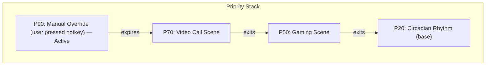
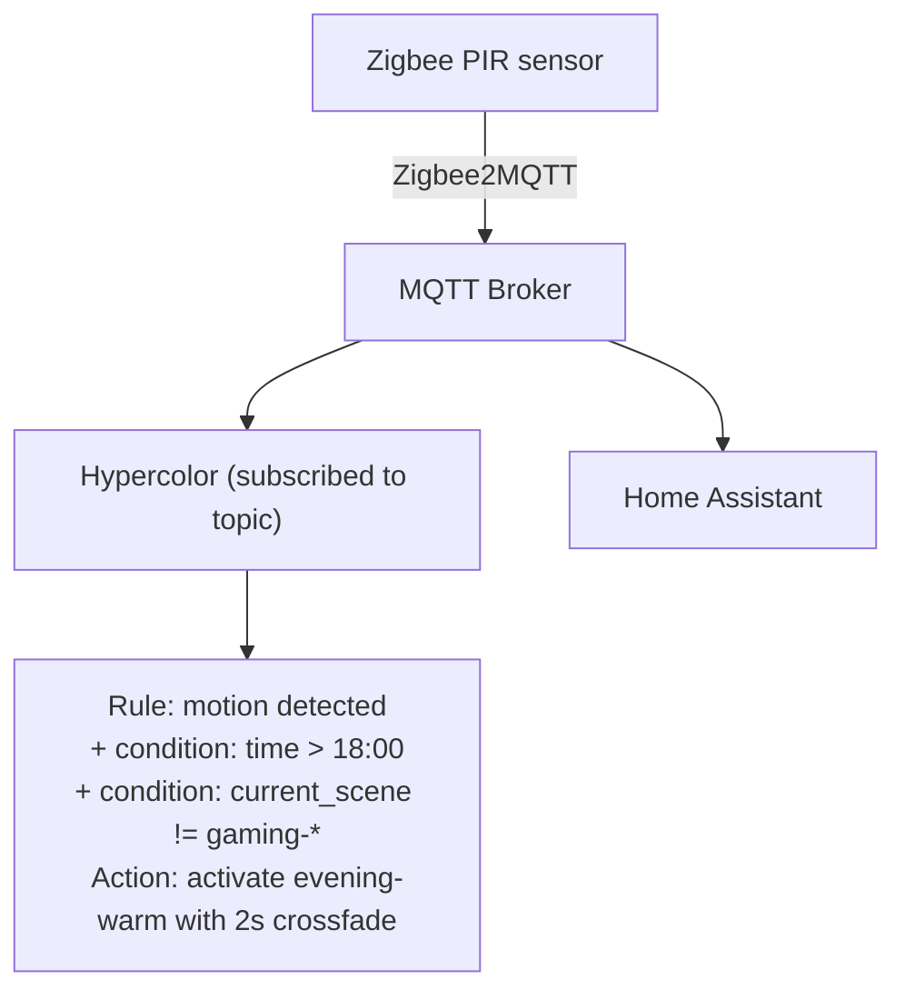
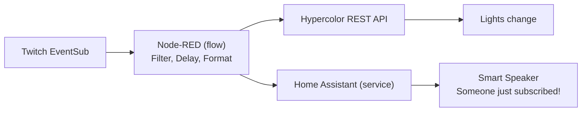

# 07 — Scenes, Scheduling & Automation

> Turning Hypercolor from a pretty light engine into an ambient intelligence system.

---

## Overview

Scenes and automation are the layer where Hypercolor stops being a toy and starts being infrastructure. A scene captures a complete lighting state across every device. Automation decides _when_ and _why_ scenes change. Together, they make your lighting respond to your life without you touching a single button.

This document defines the data model, transition system, scheduling engine, trigger framework, automation rule language, smart home integration, and contextual awareness system. Everything flows through the existing event bus (`HypercolorBus`) and is controllable via REST API, D-Bus, CLI, TUI, and web UI.

---

## 1. Scenes

### What Is a Scene?

A scene is a **complete, serializable snapshot** of the desired lighting state across some or all devices. It answers: "What should every LED look like right now?"

```rust
/// A complete lighting state definition
pub struct Scene {
    pub id: SceneId,                      // UUID v7 (time-sortable)
    pub name: String,                     // Human-readable: "Cozy Evening"
    pub description: Option<String>,
    pub author: Option<String>,           // For shared/community scenes
    pub tags: Vec<String>,                // ["evening", "warm", "relaxing"]
    pub scope: SceneScope,                // Which devices this scene targets
    pub assignments: Vec<ZoneAssignment>, // Effect + params per zone
    pub global_brightness: f32,           // 0.0 - 1.0, master dimmer
    pub transition: TransitionSpec,       // How to enter this scene
    pub created_at: DateTime<Utc>,
    pub updated_at: DateTime<Utc>,
}

pub enum SceneScope {
    /// Every device the daemon manages
    Full,
    /// Only PC-attached devices (OpenRGB, USB HID)
    PcOnly,
    /// Only network devices (WLED, Hue)
    RoomOnly,
    /// Explicit device list
    Devices(Vec<DeviceId>),
    /// Explicit zone list
    Zones(Vec<ZoneId>),
}

/// What a single zone should do within this scene
pub struct ZoneAssignment {
    pub zone_id: ZoneId,                  // device_id + zone_name
    pub effect_id: String,                // Effect to run (or "static" for solid color)
    pub parameters: HashMap<String, ControlValue>,  // Effect-specific params
    pub brightness: Option<f32>,          // Zone-level override (multiplied with global)
    pub color_override: Option<Rgb>,      // For "static" effect or tint overlay
}
```

### Scene Creation

**From current state** — the most natural workflow. You tweak things until they look right, then save.

```
hypercolor scene save "Late Night Coding"
hypercolor scene save "Late Night Coding" --scope pc-only --tag coding --tag night
```

The daemon snapshots every zone's current effect, parameters, and brightness into a new `Scene` struct. This is also the primary path in the web UI: a "Save as Scene" button that captures the live state.

**From scratch** — build in the scene editor (web UI) by assigning effects to zones on the spatial layout, adjusting parameters, and previewing in real-time before saving.

**From import** — load a `.hyperscene.toml` file or a community scene pack. The import system resolves device-agnostic zone references to the user's actual hardware (more on this in Section 10).

**From composition** — layer scenes together. A base scene provides the foundation, overlays modify specific zones.

### Scene Storage

```
~/.config/hypercolor/
├── scenes/
│   ├── cozy-evening.toml
│   ├── deep-focus.toml
│   ├── gaming-reactive.toml
│   └── stream-intro.toml
├── packs/                          # Community scene packs
│   ├── cyberpunk/
│   │   ├── pack.toml               # Pack metadata
│   │   ├── neon-city.toml
│   │   ├── netrunner.toml
│   │   └── corpo-plaza.toml
│   └── nature/
│       ├── pack.toml
│       ├── forest.toml
│       └── ocean.toml
└── schedules/
    ├── weekday.toml
    └── weekend.toml
```

**Scene file format** (TOML):

```toml
[scene]
id = "01956a3c-7d2e-7f00-a1b2-c3d4e5f6a7b8"
name = "Late Night Coding"
description = "Minimal purple ambience. Easy on the eyes, hard on the bugs."
tags = ["coding", "night", "minimal"]
scope = "pc-only"
global_brightness = 0.35

[scene.transition]
type = "crossfade"
duration_ms = 2000
easing = "ease-in-out"

[[assignments]]
zone = "case-fans"
effect = "breathing"
brightness = 0.3
[assignments.parameters]
color = "#e135ff"
speed = 0.4
min_brightness = 0.1

[[assignments]]
zone = "gpu-strimer"
effect = "static"
color = "#80ffea"
brightness = 0.2

[[assignments]]
zone = "ram-sticks"
effect = "static"
color = "#e135ff"
brightness = 0.15

[[assignments]]
zone = "keyboard"
effect = "key-reactive"
[assignments.parameters]
base_color = "#1a1a2e"
press_color = "#e135ff"
decay_ms = 400
```

### Scene Composition

Scenes can be layered. A **base scene** defines the full state; an **overlay** modifies specific zones without touching the rest.

```rust
pub struct ComposedScene {
    pub base: SceneId,
    pub overlays: Vec<SceneOverlay>,
}

pub struct SceneOverlay {
    pub scene_id: SceneId,
    pub priority: u8,                    // Higher wins on conflict
    pub opacity: f32,                    // 0.0 - 1.0, blend with base
    pub zones: Option<Vec<ZoneId>>,      // Limit overlay to specific zones
}
```

**Example**: "Cozy Evening" as base + "Audio Reactive Accent" overlay on just the WLED strips. The PC stays warm and static while the room strips pulse to music.

```
hypercolor scene compose "Cozy + Music" \
  --base "cozy-evening" \
  --overlay "audio-accent" --zones wled-desk,wled-shelf --opacity 0.7
```

### Sub-Scenes

Sub-scenes are just scenes with a non-`Full` scope. They only touch the devices they claim:

| Type           | Scope        | Use Case                               |
| -------------- | ------------ | -------------------------------------- |
| **Full scene** | `Full`       | Complete lighting state, every device  |
| **PC scene**   | `PcOnly`     | Case, peripherals, strimers only       |
| **Room scene** | `RoomOnly`   | WLED strips, Hue bulbs only            |
| **Zone scene** | `Zones(...)` | Just the keyboard, just the desk strip |

Applying a sub-scene leaves unaddressed zones unchanged. This is essential for independence: you can switch your PC lighting for gaming without disturbing the room's relaxed vibe.

---

## 2. Transitions

Transitions define how the system moves between scenes. Nobody wants jarring snap-cuts when the vibe shifts.

### Transition Spec

```rust
pub struct TransitionSpec {
    pub transition_type: TransitionType,
    pub duration: Duration,
    pub easing: EasingFunction,
}

pub enum TransitionType {
    /// Instant switch, no interpolation
    Cut,

    /// Smooth color interpolation over duration
    Crossfade,

    /// Directional wipe across the spatial layout
    Wipe {
        direction: WipeDirection,         // Left, Right, Up, Down, Radial
        softness: f32,                    // Edge softness (0.0 = hard, 1.0 = gradient)
    },

    /// Brief flash of a color, then new scene
    Flash {
        flash_color: Rgb,                 // Usually white or accent color
        flash_duration: Duration,         // Typically 100-300ms
    },

    /// Fade to black, hold, then fade into new scene
    Blackout {
        hold_duration: Duration,          // Time at full black
    },

    /// Run a transition effect (a special effect that blends two scenes)
    Effect {
        effect_id: String,                // Transition effect name
        parameters: HashMap<String, ControlValue>,
    },
}

pub enum WipeDirection {
    Left,
    Right,
    Up,
    Down,
    RadialIn,
    RadialOut,
    Diagonal { angle: f32 },
}

pub enum EasingFunction {
    Linear,
    EaseIn,
    EaseOut,
    EaseInOut,
    /// Cubic bezier (like CSS transitions)
    CubicBezier(f32, f32, f32, f32),
    /// Steps (discrete jumps)
    Steps { count: u32, jump: StepJump },
}

pub enum StepJump {
    Start,
    End,
    Both,
    None,
}
```

### Transition Execution

The render loop manages transitions as a first-class concept. During a transition, two scenes coexist:

```rust
pub struct TransitionState {
    pub from_scene: SceneId,
    pub to_scene: SceneId,
    pub spec: TransitionSpec,
    pub started_at: Instant,
    pub progress: f32,                    // 0.0 to 1.0
}

impl TransitionState {
    /// Calculate blended LED colors for the current frame
    pub fn blend(
        &self,
        from_colors: &[DeviceColors],
        to_colors: &[DeviceColors],
        layout: &SpatialLayout,
    ) -> Vec<DeviceColors> {
        let t = self.spec.easing.apply(self.progress);

        match &self.spec.transition_type {
            TransitionType::Cut => to_colors.to_vec(),

            TransitionType::Crossfade => {
                // Per-LED linear interpolation in perceptual color space (Oklab)
                blend_colors(from_colors, to_colors, t)
            }

            TransitionType::Wipe { direction, softness } => {
                // Each LED's blend factor depends on its spatial position
                // relative to the wipe front
                spatial_wipe(from_colors, to_colors, layout, direction, *softness, t)
            }

            TransitionType::Flash { flash_color, flash_duration } => {
                let flash_ratio = flash_duration.as_secs_f32()
                    / self.spec.duration.as_secs_f32();
                if t < flash_ratio {
                    // Flash phase: blend toward flash color
                    let flash_t = t / flash_ratio;
                    blend_to_solid(from_colors, *flash_color, flash_t)
                } else {
                    // Reveal phase: blend from flash to new scene
                    let reveal_t = (t - flash_ratio) / (1.0 - flash_ratio);
                    blend_from_solid(*flash_color, to_colors, reveal_t)
                }
            }

            TransitionType::Blackout { hold_duration } => {
                let total = self.spec.duration.as_secs_f32();
                let hold = hold_duration.as_secs_f32() / total;
                let fade_each = (1.0 - hold) / 2.0;

                if t < fade_each {
                    // Fade to black
                    blend_to_solid(from_colors, Rgb::BLACK, t / fade_each)
                } else if t < fade_each + hold {
                    // Hold black
                    solid_colors(Rgb::BLACK, from_colors.len())
                } else {
                    // Fade to new scene
                    let reveal_t = (t - fade_each - hold) / fade_each;
                    blend_from_solid(Rgb::BLACK, to_colors, reveal_t)
                }
            }

            TransitionType::Effect { .. } => {
                // Delegate to a custom transition effect renderer
                // (effects that accept two framebuffers and a progress value)
                todo!("Custom transition effects")
            }
        }
    }
}
```

### Color Interpolation

Interpolation happens in **Oklab perceptual color space**, not RGB. RGB interpolation produces muddy grays when blending between saturated colors (red-to-blue goes through ugly brown). Oklab gives smooth, visually linear gradients.

```rust
fn blend_colors(from: &[DeviceColors], to: &[DeviceColors], t: f32) -> Vec<DeviceColors> {
    from.iter().zip(to.iter()).map(|(f, t_colors)| {
        DeviceColors {
            device_id: f.device_id.clone(),
            zone_name: f.zone_name.clone(),
            colors: f.colors.iter().zip(t_colors.colors.iter()).map(|(a, b)| {
                let a_lab = oklab::srgb_to_oklab(*a);
                let b_lab = oklab::srgb_to_oklab(*b);
                let mixed = Oklab {
                    l: lerp(a_lab.l, b_lab.l, t),
                    a: lerp(a_lab.a, b_lab.a, t),
                    b: lerp(a_lab.b, b_lab.b, t),
                };
                oklab::oklab_to_srgb(mixed)
            }).collect(),
        }
    }).collect()
}
```

### Spatial Wipe Mechanics

Wipe transitions leverage the spatial layout engine. Each LED has a physical position; the wipe front sweeps across that space:

```
    Wipe Right (t = 0.4, softness = 0.3)
    ┌──────────────────────────────────┐
    │ ████████████░░░░░                │  ← LED strip (horizontal)
    │ from scene  │soft│  to scene     │
    │             │edge│               │
    └──────────────────────────────────┘
                  ^
           wipe front at 40%
```

Each LED's blend factor is calculated from its normalized X position (for horizontal wipes) or distance from center (for radial wipes), with softness controlling the gradient width at the boundary.

### Transition Presets

Common transitions available out of the box:

| Name          | Type                  | Duration | Notes                            |
| ------------- | --------------------- | -------- | -------------------------------- |
| `instant`     | Cut                   | 0ms      | No animation                     |
| `smooth`      | Crossfade             | 1000ms   | Default for most scene switches  |
| `slow-fade`   | Crossfade             | 3000ms   | For circadian/time-based changes |
| `dramatic`    | Blackout (500ms hold) | 2000ms   | Scene reveals                    |
| `flash-white` | Flash (#fff, 200ms)   | 800ms    | Alert / notification             |
| `sweep-right` | Wipe Right (0.4 soft) | 1500ms   | Directional drama                |
| `sunrise`     | Crossfade             | 30000ms  | 30-second warm fade-in           |
| `sleep`       | Crossfade             | 60000ms  | 60-second fade to off            |

---

## 3. Scheduling

### Time-Based Automation Engine

The scheduler runs as a background task on the tokio runtime. It evaluates a list of schedule rules against the current time and fires scene changes when conditions match.

```rust
pub struct Scheduler {
    rules: Vec<ScheduleRule>,
    location: Option<GeoLocation>,        // For sunrise/sunset calculations
    timezone: chrono_tz::Tz,
    next_evaluation: Instant,
}

pub struct ScheduleRule {
    pub id: RuleId,
    pub name: String,
    pub enabled: bool,
    pub priority: u8,                     // Higher wins on time conflict
    pub schedule: ScheduleExpr,
    pub action: ScheduleAction,
}

pub enum ScheduleExpr {
    /// Cron-style expression: "0 9 * * 1-5" (9am weekdays)
    Cron(String),

    /// Specific time with day filter
    Time {
        hour: u8,
        minute: u8,
        days: DayFilter,
    },

    /// Relative to sunrise/sunset (requires location)
    Solar {
        event: SolarEvent,
        offset: Duration,                 // Can be negative
        days: DayFilter,
    },

    /// Circadian rhythm — continuous color temperature shift
    Circadian(CircadianProfile),

    /// Date-specific: holidays, special events
    Date {
        month: u8,
        day: u8,
        recurrence: DateRecurrence,
    },
}

pub enum SolarEvent {
    Sunrise,
    Sunset,
    CivilDawn,                            // ~30 min before sunrise
    CivilDusk,                            // ~30 min after sunset
    SolarNoon,
}

pub enum DayFilter {
    Every,
    Weekdays,                             // Mon-Fri
    Weekends,                             // Sat-Sun
    Specific(Vec<chrono::Weekday>),
}

pub enum DateRecurrence {
    Yearly,                               // Same date every year
    Once(u16),                            // Specific year only
    Range { start: NaiveDate, end: NaiveDate },
}

pub enum ScheduleAction {
    /// Switch to a scene
    ActivateScene {
        scene_id: SceneId,
        transition: Option<TransitionSpec>,  // Override scene's default transition
    },

    /// Adjust global brightness without changing scene
    SetBrightness {
        brightness: f32,
        transition_ms: u64,
    },

    /// Run an arbitrary automation rule
    TriggerRule(RuleId),

    /// Power state
    PowerOff { transition_ms: u64 },
    PowerOn { scene_id: SceneId },
}
```

### Schedule File Format

```toml
# ~/.config/hypercolor/schedules/weekday.toml

[schedule]
name = "Weekday Routine"
enabled = true
timezone = "America/Los_Angeles"
location = { lat = 47.6062, lon = -122.3321 }   # Seattle

[[rules]]
name = "Morning Warmup"
schedule = { type = "solar", event = "sunrise", offset = "-30m" }
days = "weekdays"
action = { scene = "warm-sunrise", transition = { type = "crossfade", duration = "30s" } }

[[rules]]
name = "Work Mode"
schedule = { type = "time", hour = 9, minute = 0 }
days = "weekdays"
action = { scene = "deep-focus", transition = { type = "crossfade", duration = "5s" } }

[[rules]]
name = "Lunch Break"
schedule = { type = "time", hour = 12, minute = 0 }
days = "weekdays"
action = { scene = "bright-daylight" }

[[rules]]
name = "Afternoon Wind-down"
schedule = { type = "time", hour = 15, minute = 0 }
days = "weekdays"
action = { scene = "warm-afternoon", transition = { type = "crossfade", duration = "10m" } }

[[rules]]
name = "Evening Vibes"
schedule = { type = "solar", event = "sunset", offset = "0m" }
days = "every"
action = { scene = "evening-warm", transition = { type = "crossfade", duration = "20m" } }

[[rules]]
name = "Night Mode"
schedule = { type = "time", hour = 22, minute = 0 }
days = "every"
action = { scene = "dim-warm", transition = { type = "crossfade", duration = "15m" } }

[[rules]]
name = "Sleep"
schedule = { type = "time", hour = 23, minute = 30 }
days = "every"
priority = 5
action = { type = "power_off", transition = "60s" }
```

### Circadian Rhythm Engine

Rather than discrete scene switches, circadian mode provides a **continuous** color temperature and brightness curve throughout the day. It runs as a special always-on schedule that the user can enable/disable.

```rust
pub struct CircadianProfile {
    pub name: String,
    pub keyframes: Vec<CircadianKeyframe>,
    pub interpolation: InterpolationMode,  // Linear, Catmull-Rom spline
}

pub struct CircadianKeyframe {
    pub time: NaiveTime,                   // Time of day
    pub color_temp: u32,                   // Kelvin (2700 warm - 6500 cool)
    pub brightness: f32,                   // 0.0 - 1.0
    pub saturation_boost: f32,             // Extra saturation for accent colors
}
```

**Default circadian profile:**

```
Time     Color Temp   Brightness   Character
─────────────────────────────────────────────
06:00    2700K        0.10         Pre-dawn: barely there warm glow
07:00    3500K        0.40         Sunrise: golden warm-up
09:00    5000K        0.85         Morning: alert, productive
12:00    6500K        1.00         Noon: full daylight
15:00    5500K        0.90         Afternoon: still bright, warming
18:00    4000K        0.70         Evening: golden hour begins
20:00    3200K        0.50         Twilight: relaxation
22:00    2700K        0.30         Night: cozy minimum
23:00    2200K        0.15         Late: near-dark amber
00:00    1800K        0.05         Midnight: barely visible warmth
```

```
Brightness ─────────────────────────────────────
1.0  │            ╭────╮
     │          ╭─╯    ╰──╮
0.7  │        ╭─╯          ╰──╮
     │      ╭─╯               ╰──╮
0.3  │    ╭─╯                    ╰──╮
     │  ╭─╯                        ╰──╮
0.0  │──╯                              ╰──
     └────┬────┬────┬────┬────┬────┬────┬──
          6am  9am  12pm 3pm  6pm  9pm  12am

Color Temp ─────────────────────────────────────
6500K │            ╭──╮
      │          ╭─╯  ╰─╮
5000K │        ╭─╯      ╰──╮
      │      ╭─╯            ╰──╮
3500K │    ╭─╯                  ╰──╮
      │  ╭─╯                      ╰──╮
2000K │──╯                            ╰──
      └────┬────┬────┬────┬────┬────┬────┬──
           6am  9am  12pm 3pm  6pm  9pm  12am
```

Circadian mode applies as a **color temperature filter** on top of the active scene's output. The effect's colors are shifted toward the target color temperature using a white-point adaptation transform. This means you can run a "rainbow wave" effect and it'll still respect the circadian warmth at night.

### Sunrise/Sunset Calculation

Uses the `sun` crate (MIT) for solar position calculations. The user provides their coordinates once; the scheduler precomputes sunrise/sunset times daily.

```rust
impl Scheduler {
    fn compute_solar_times(&self, date: NaiveDate) -> SolarTimes {
        let loc = self.location.expect("Location required for solar scheduling");
        SolarTimes {
            sunrise: sun::time_of_transit(
                date, sun::Direction::Rising, sun::Planet::Earth,
                loc.lat, loc.lon, sun::Elevation::Horizon,
            ),
            sunset: sun::time_of_transit(
                date, sun::Direction::Setting, sun::Planet::Earth,
                loc.lat, loc.lon, sun::Elevation::Horizon,
            ),
            civil_dawn: sun::time_of_transit(
                date, sun::Direction::Rising, sun::Planet::Earth,
                loc.lat, loc.lon, sun::Elevation::Civil,
            ),
            civil_dusk: sun::time_of_transit(
                date, sun::Direction::Setting, sun::Planet::Earth,
                loc.lat, loc.lon, sun::Elevation::Civil,
            ),
        }
    }
}
```

### Holiday & Special Date Scheduling

```toml
[[rules]]
name = "Christmas"
schedule = { type = "date", month = 12, day = 25, recurrence = "yearly" }
action = { scene = "christmas-magic" }
priority = 10   # Overrides normal schedule

[[rules]]
name = "Halloween"
schedule = { type = "date", month = 10, day = 31, recurrence = "yearly" }
action = { scene = "spooky-halloween" }
priority = 10

[[rules]]
name = "Pride Month"
schedule = { type = "date_range", start = "06-01", end = "06-30", recurrence = "yearly" }
action = { scene = "pride-rainbow" }
priority = 8

[[rules]]
name = "Trans Day of Visibility"
schedule = { type = "date", month = 3, day = 31, recurrence = "yearly" }
action = { scene = "trans-pride" }
priority = 10
```

### Vacation Mode

Simulates occupancy when the house is empty. Randomizes scene changes within a believable time window.

```rust
pub struct VacationMode {
    pub enabled: bool,
    pub wake_range: (NaiveTime, NaiveTime),     // 6:30-7:30am
    pub sleep_range: (NaiveTime, NaiveTime),     // 10:00-11:30pm
    pub activity_changes_per_hour: f32,          // ~0.5 (change every ~2 hours)
    pub scenes: Vec<SceneId>,                    // Pool of "normal life" scenes
    pub randomize_brightness: bool,              // Slight brightness variation
    pub room_only: bool,                         // Only mess with visible-from-outside devices
}
```

Vacation mode picks a random wake time within the range each day, simulates scene changes at random intervals throughout the "awake" period, and fades off at a random sleep time. From outside, it looks like someone's home.

---

## 4. Triggers

Triggers are **event-driven** scene changes. Where schedules are "at this time, do this," triggers are "when this happens, do this."

### Trigger Architecture

```rust
pub trait TriggerSource: Send + Sync {
    /// Unique identifier for this trigger source
    fn id(&self) -> &str;

    /// Human-readable name
    fn name(&self) -> &str;

    /// Subscribe to trigger events from this source
    fn subscribe(&self) -> broadcast::Receiver<TriggerEvent>;

    /// Check current state (for condition evaluation)
    fn current_state(&self) -> TriggerState;
}

pub struct TriggerEvent {
    pub source: String,                   // Which trigger source
    pub event_type: String,               // What happened
    pub payload: serde_json::Value,       // Event-specific data
    pub timestamp: Instant,
}

pub struct TriggerState {
    pub source: String,
    pub values: HashMap<String, serde_json::Value>,
}
```

### Desktop Triggers

Monitor desktop environment state via D-Bus and freedesktop APIs.

```rust
pub struct DesktopTriggerSource {
    dbus_connection: zbus::Connection,
}

// Events this source emits:
// desktop.screen_locked
// desktop.screen_unlocked
// desktop.workspace_changed { from: 1, to: 3 }
// desktop.fullscreen_entered { app: "steam_app_570" }
// desktop.fullscreen_exited
// desktop.idle_entered { idle_seconds: 300 }
// desktop.idle_exited
// desktop.session_active
// desktop.session_inactive
// desktop.power_state { state: "battery" | "ac" | "low_battery" }
```

**Implementation**: Subscribe to `org.freedesktop.ScreenSaver`, `org.gnome.Mutter.IdleMonitor`, and `org.freedesktop.login1` D-Bus signals. For workspace changes on Wayland/GNOME, use `org.gnome.Shell` D-Bus interface.

### Application Triggers

Track running applications and respond to launches/exits.

```rust
pub struct AppTriggerSource {
    /// Monitor /proc for process changes (Linux)
    proc_watcher: notify::Watcher,
    /// Known application signatures
    app_registry: HashMap<String, AppSignature>,
}

pub struct AppSignature {
    pub name: String,                     // "Steam Game"
    pub detection: AppDetection,
}

pub enum AppDetection {
    /// Match process name
    ProcessName(String),                  // "vlc", "code", "firefox"
    /// Match window class (X11/Wayland)
    WindowClass(String),                  // "steam_app_*", "obs"
    /// Match desktop file
    DesktopEntry(String),                 // "com.obsproject.Studio"
    /// Custom: process name + arguments
    ProcessArgs { name: String, args_contain: String },
}

// Events:
// app.launched { app: "obs", pid: 12345 }
// app.exited { app: "obs" }
// app.focused { app: "code", window_title: "main.rs - hypercolor" }
// app.unfocused { app: "code" }
```

**Pre-configured app signatures:**

| App Category   | Detection                                  | Trigger                                  |
| -------------- | ------------------------------------------ | ---------------------------------------- |
| Games (Steam)  | `steam_app_*` process                      | `app.launched { category: "game" }`      |
| Games (Lutris) | `lutris-wrapper`                           | `app.launched { category: "game" }`      |
| IDE/Editor     | `code`, `nvim`, `idea`                     | `app.launched { category: "ide" }`       |
| Media Player   | `vlc`, `mpv`, `celluloid`                  | `app.launched { category: "media" }`     |
| Video Call     | `zoom`, `teams`, `discord` w/ screen share | `app.launched { category: "call" }`      |
| Streaming      | `obs`, `obs-studio`                        | `app.launched { category: "streaming" }` |
| Browser        | `firefox`, `chromium`                      | `app.focused { category: "browser" }`    |

### System Triggers

```rust
pub struct SystemTriggerSource {
    /// udev monitor for USB events
    udev_monitor: tokio::sync::mpsc::Receiver<UdevEvent>,
    /// Network state via NetworkManager D-Bus
    network_monitor: zbus::Connection,
}

// Events:
// system.usb_connected { vendor_id: "1532", product_id: "026C", name: "Razer Huntsman" }
// system.usb_disconnected { vendor_id: "1532", product_id: "026C" }
// system.network_connected { interface: "wlan0", ssid: "HomeNetwork" }
// system.network_disconnected { interface: "wlan0" }
// system.power_ac
// system.power_battery
// system.power_low_battery { percent: 15 }
// system.suspend
// system.resume
// system.display_connected { output: "HDMI-1" }
// system.display_disconnected { output: "HDMI-1" }
```

### External Triggers

#### Webhook Receiver

The daemon's REST API accepts incoming webhook triggers:

```
POST /api/v1/trigger
{
    "source": "external",
    "event": "doorbell.ring",
    "payload": { "camera": "front_door" }
}
```

Protected by API key authentication. Any external system that can POST JSON can trigger scene changes.

#### MQTT Client

```rust
pub struct MqttTriggerSource {
    client: rumqttc::AsyncClient,
    subscriptions: Vec<MqttSubscription>,
}

pub struct MqttSubscription {
    pub topic: String,                    // "homeassistant/binary_sensor/motion_office/state"
    pub event_type: String,               // "ha.motion_office"
    pub payload_mapping: PayloadMapping,  // How to interpret the message
}
```

Subscribe to MQTT topics and translate messages into trigger events. This is the primary integration path for Home Assistant, Zigbee sensors, and any IoT device.

#### Home Assistant State Changes

```rust
pub struct HomeAssistantTriggerSource {
    /// HA WebSocket API client
    ws_client: HaWebSocketClient,
    /// Entities we're watching
    watched_entities: Vec<HaEntityWatch>,
}

pub struct HaEntityWatch {
    pub entity_id: String,                // "binary_sensor.office_motion"
    pub trigger_on: HaTriggerCondition,   // state == "on", attribute > threshold
    pub event_type: String,               // "ha.office_motion_on"
}

// Events:
// ha.entity_changed { entity_id: "binary_sensor.office_motion", state: "on" }
// ha.entity_changed { entity_id: "sensor.office_temperature", state: "23.5" }
// ha.event { event_type: "tag_scanned", tag_id: "living-room-nfc" }
```

### Audio Triggers

Audio analysis runs in the input source pipeline, but certain patterns generate trigger events:

```rust
pub struct AudioTriggerSource {
    audio_input: Arc<AudioInput>,
}

// Events:
// audio.silence { duration_seconds: 30 }
// audio.loud { level: 0.95, duration_ms: 200 }
// audio.beat_detected { bpm: 128, confidence: 0.85 }
// audio.frequency_peak { band: "bass", level: 0.9 }
// audio.music_started    (silence → sustained audio)
// audio.music_stopped    (sustained audio → silence)
```

### Stream Triggers

For live streamers. Integrates with Twitch/YouTube APIs via webhook or EventSub.

```rust
pub struct StreamTriggerSource {
    /// Twitch EventSub WebSocket
    twitch_ws: Option<TwitchEventSub>,
}

// Events:
// stream.started
// stream.ended
// stream.subscription { user: "coolviewer42", tier: 1, months: 6 }
// stream.bits { user: "generous_person", amount: 500 }
// stream.raid { from: "friendly_streamer", viewers: 150 }
// stream.follow { user: "new_friend" }
// stream.channel_point_redeem { reward: "change_lights", user: "viewer123" }
// stream.hype_train { level: 3 }
// stream.poll_ended { winner: "option_b" }
```

### Calendar Triggers

Read calendar events from local CalDAV or through HA calendar integration:

```rust
pub struct CalendarTriggerSource {
    /// Poll calendar every N minutes
    poll_interval: Duration,
    calendars: Vec<CalendarConfig>,
}

// Events:
// calendar.event_starting { title: "Team Standup", in_minutes: 5 }
// calendar.event_started { title: "Team Standup" }
// calendar.event_ended { title: "Team Standup" }
// calendar.focus_time_started   (Calendar "Focus Time" block)
// calendar.focus_time_ended
```

---

## 5. Automation Rules

### The Rule Engine

Automation rules connect triggers to actions with optional conditions and constraints. This is the "IFTTT for lighting" brain.

```rust
pub struct AutomationRule {
    pub id: RuleId,
    pub name: String,
    pub description: Option<String>,
    pub enabled: bool,
    pub priority: u8,                     // 0-255, higher wins conflicts

    pub trigger: TriggerExpr,             // WHEN this happens...
    pub conditions: Vec<ConditionExpr>,   // AND these are true...
    pub action: ActionExpr,               // DO this.

    pub cooldown: Option<Duration>,       // Don't re-trigger within this window
    pub active_hours: Option<TimeRange>,  // Only active during these hours
    pub tags: Vec<String>,                // For grouping and management
}
```

### Trigger Expressions

```rust
pub enum TriggerExpr {
    /// Single event match
    Event {
        source: String,                   // "desktop", "app", "ha", etc.
        event_type: String,               // "screen_locked", "launched", etc.
        filter: Option<serde_json::Value>, // Match specific payload fields
    },

    /// Multiple events must fire (order doesn't matter)
    All(Vec<TriggerExpr>),

    /// Any of these events fires
    Any(Vec<TriggerExpr>),

    /// Event sequence (ordered, within a time window)
    Sequence {
        events: Vec<TriggerExpr>,
        within: Duration,
    },
}
```

### Condition Expressions

Conditions are checked **at the moment a trigger fires**. They gate whether the action actually runs.

```rust
pub enum ConditionExpr {
    /// Check current state of a trigger source
    State {
        source: String,
        key: String,
        op: ComparisonOp,
        value: serde_json::Value,
    },

    /// Current time within a range
    TimeRange {
        start: NaiveTime,
        end: NaiveTime,
    },

    /// Current day matches
    DayOfWeek(DayFilter),

    /// Current scene is (or isn't) a specific scene
    CurrentScene {
        scene_id: SceneId,
        negated: bool,
    },

    /// A specific rule hasn't fired recently
    CooldownExpired {
        rule_id: RuleId,
        duration: Duration,
    },

    /// Boolean combinators
    And(Vec<ConditionExpr>),
    Or(Vec<ConditionExpr>),
    Not(Box<ConditionExpr>),
}

pub enum ComparisonOp {
    Eq,
    Ne,
    Gt,
    Lt,
    Gte,
    Lte,
    Contains,
    Matches(String),                      // Regex
}
```

### Action Expressions

```rust
pub enum ActionExpr {
    /// Switch to a scene
    ActivateScene {
        scene_id: SceneId,
        transition: Option<TransitionSpec>,
    },

    /// Restore the scene that was active before the current one
    RestorePreviousScene {
        transition: Option<TransitionSpec>,
    },

    /// Adjust brightness without changing scene
    SetBrightness {
        brightness: f32,
        transition_ms: u64,
    },

    /// Set a specific zone's effect
    SetZoneEffect {
        zone_id: ZoneId,
        effect_id: String,
        parameters: HashMap<String, ControlValue>,
    },

    /// Apply a temporary overlay (auto-removes after duration)
    TemporaryOverlay {
        scene_id: SceneId,
        duration: Duration,
        transition: Option<TransitionSpec>,
    },

    /// Execute multiple actions in sequence
    Sequence(Vec<ActionExpr>),

    /// Execute multiple actions in parallel
    Parallel(Vec<ActionExpr>),

    /// Wait before next action (in a sequence)
    Delay(Duration),

    /// Fire a webhook (notify external systems)
    Webhook {
        url: String,
        method: String,
        body: Option<serde_json::Value>,
    },

    /// Publish MQTT message
    MqttPublish {
        topic: String,
        payload: String,
    },

    /// No-op (useful for testing)
    Noop,
}
```

### Rule File Format

```toml
# ~/.config/hypercolor/rules/gaming.toml

[[rules]]
name = "Game Launch → Gaming Mode"
description = "Switch to reactive gaming scene when a game starts"
priority = 50
cooldown = "30s"

[rules.trigger]
type = "event"
source = "app"
event_type = "launched"
filter = { category = "game" }

[rules.conditions]
# Only during evening/night (don't override work lighting during day)
time_range = { start = "17:00", end = "03:00" }

[rules.action]
type = "activate_scene"
scene = "gaming-reactive"
transition = { type = "flash", flash_color = "#e135ff", flash_duration = "200ms", duration = "800ms" }

# ─────────────────────────────────────────────

[[rules]]
name = "Game Exit → Restore"
priority = 50

[rules.trigger]
type = "event"
source = "app"
event_type = "exited"
filter = { category = "game" }

[rules.action]
type = "restore_previous_scene"
transition = { type = "crossfade", duration = "2s" }

# ─────────────────────────────────────────────

[[rules]]
name = "Screen Lock → Dim"
priority = 30

[rules.trigger]
type = "event"
source = "desktop"
event_type = "screen_locked"

[rules.action]
type = "set_brightness"
brightness = 0.05
transition_ms = 3000

# ─────────────────────────────────────────────

[[rules]]
name = "Screen Unlock → Restore"
priority = 30

[rules.trigger]
type = "event"
source = "desktop"
event_type = "screen_unlocked"

[rules.action]
type = "set_brightness"
brightness = 1.0   # Restores to scene's configured brightness
transition_ms = 1000

# ─────────────────────────────────────────────

[[rules]]
name = "Video Call → Calm"
description = "Reduce distracting lighting during video calls"
priority = 60

[rules.trigger]
type = "any"
events = [
    { source = "app", event_type = "launched", filter = { name = "zoom" } },
    { source = "app", event_type = "launched", filter = { name = "teams" } },
]

[rules.action]
type = "activate_scene"
scene = "video-call-calm"
transition = { type = "crossfade", duration = "1s" }
```

### Priority Resolution

When multiple rules trigger simultaneously or conflict, priority determines the winner:

```
Priority Tiers:
  0-29    Background (circadian, ambient adjustments)
  30-49   Normal (screen lock, idle, time-based)
  50-69   Active (app launches, games, media)
  70-89   Important (video calls, stream events)
  90-99   Critical (alerts, safety, manual override)
  100+    System (fail-safe, seizure protection)

Resolution: Highest priority wins. Ties broken by most-recently-triggered.
Active rule IDs tracked in a priority stack for restore operations.
```



### Rule Templates

Pre-built rule sets for common patterns. Users install templates and customize.

```
hypercolor rules template list
hypercolor rules template install gaming
hypercolor rules template install streaming
hypercolor rules template install home-office
hypercolor rules template install circadian
```

| Template      | Rules Included                                                 |
| ------------- | -------------------------------------------------------------- |
| `gaming`      | Game launch/exit, fullscreen toggle, achievement flash         |
| `streaming`   | Stream start/end, sub/donation/raid reactions, scene switching |
| `home-office` | Work hours focus, meeting detection, break reminders           |
| `circadian`   | Full-day color temp schedule, sunrise/sunset triggers          |
| `media`       | Music start/stop, video player, audio-reactive overlays        |
| `security`    | Motion sensor lights, door alerts, vacation mode               |
| `party`       | Audio-reactive everything, guest mode, DJ transitions          |

### Rule Testing & Simulation

Before deploying rules to production lighting, test them in simulation:

```
# Dry-run: show what would happen without changing lights
hypercolor rules test --event 'app.launched { name: "steam_app_570" }'

# Result:
# ✓ Rule "Game Launch → Gaming Mode" would fire
#   Priority: 50
#   Conditions: time_range 17:00-03:00 → PASS (current: 20:15)
#   Action: Activate scene "gaming-reactive"
#   Transition: Flash #e135ff 200ms → 800ms total

# Simulate a full evening timeline
hypercolor rules simulate --from "17:00" --to "02:00" --events-file evening-events.json

# Timeline output:
# 17:00  [circadian] Color temp → 4000K, brightness → 0.70
# 18:30  [solar] Sunset trigger → "evening-warm" (crossfade 20m)
# 19:15  [app] Steam launched → "gaming-reactive" (flash)
# 21:30  [app] Steam exited → restore "evening-warm" (crossfade 2s)
# 22:00  [schedule] Night mode → "dim-warm" (crossfade 15m)
# 23:30  [schedule] Sleep → power off (fade 60s)
```

---

## 6. Smart Home Integration

### Home Assistant Custom Component

Hypercolor exposes itself to HA as a native integration with multiple entity types:

```
homeassistant/
└── custom_components/
    └── hypercolor/
        ├── __init__.py           # Setup, config entry
        ├── manifest.json
        ├── config_flow.py        # UI-based setup (host, port, API key)
        ├── light.py              # Light entities per zone
        ├── select.py             # Scene selector, effect selector
        ├── switch.py             # Automation rule toggles
        ├── sensor.py             # FPS, active scene, device status
        ├── number.py             # Brightness, effect parameters
        ├── button.py             # Trigger scene, restart daemon
        └── coordinator.py        # WebSocket data coordinator
```

**Entity mapping:**

| HA Entity                            | Hypercolor Concept | Capabilities                      |
| ------------------------------------ | ------------------ | --------------------------------- |
| `light.hypercolor_case_fans`         | Device zone        | On/off, brightness, color, effect |
| `light.hypercolor_desk_strip`        | Device zone (WLED) | On/off, brightness, color, effect |
| `select.hypercolor_active_scene`     | Current scene      | Scene list dropdown               |
| `select.hypercolor_effect_case_fans` | Zone effect        | Effect list dropdown              |
| `switch.hypercolor_gaming_rule`      | Automation rule    | Enable/disable                    |
| `switch.hypercolor_circadian`        | Circadian mode     | Enable/disable                    |
| `sensor.hypercolor_fps`              | Render loop FPS    | Diagnostic                        |
| `sensor.hypercolor_active_scene`     | Current scene name | State                             |
| `number.hypercolor_brightness`       | Global brightness  | 0-100 slider                      |
| `button.hypercolor_next_scene`       | Cycle scenes       | Press to advance                  |

### Bidirectional Communication

**Hypercolor controls HA** — Push lighting state as HA entity updates so HA automations can reference it. Also directly call HA services:

```rust
pub struct HaServiceCall {
    pub domain: String,                   // "light", "switch", "scene"
    pub service: String,                  // "turn_on", "activate"
    pub data: serde_json::Value,          // Service-specific params
    pub target: Option<HaTarget>,
}

// Example: Hypercolor tells HA to turn on a Hue bulb
// (for devices managed by HA, not Hypercolor directly)
ha_client.call_service(HaServiceCall {
    domain: "light",
    service: "turn_on",
    data: json!({ "brightness": 128, "color_temp": 350 }),
    target: Some(HaTarget::Entity("light.hallway_hue".into())),
}).await?;
```

**HA controls Hypercolor** — HA automations call Hypercolor's REST API:

```yaml
# Home Assistant automation example
automation:
  - alias: "Office motion → lights on"
    trigger:
      - platform: state
        entity_id: binary_sensor.office_motion
        to: "on"
    condition:
      - condition: state
        entity_id: select.hypercolor_active_scene
        state: "off"
    action:
      - service: select.select_option
        target:
          entity_id: select.hypercolor_active_scene
        data:
          option: "deep-focus"

  - alias: "Temperature → color shift"
    trigger:
      - platform: numeric_state
        entity_id: sensor.office_temperature
        above: 26
    action:
      - service: rest_command.hypercolor_trigger
        data:
          event: "ha.temperature_hot"
          payload:
            temp: "{{ states('sensor.office_temperature') }}"
```

### MQTT Discovery

Hypercolor publishes MQTT discovery messages so HA auto-detects it without manual config:

```rust
pub struct MqttDiscovery {
    pub discovery_prefix: String,         // "homeassistant" (default)
}

impl MqttDiscovery {
    pub fn publish_zone_as_light(&self, zone: &DeviceZone) {
        let topic = format!(
            "{}/light/hypercolor_{}/config",
            self.discovery_prefix,
            zone.zone_name.to_snake_case()
        );

        let payload = json!({
            "name": format!("Hypercolor {}", zone.zone_name),
            "unique_id": format!("hypercolor_{}", zone.device_id),
            "command_topic": format!("hypercolor/zone/{}/set", zone.zone_name),
            "state_topic": format!("hypercolor/zone/{}/state", zone.zone_name),
            "brightness": true,
            "color_mode": true,
            "supported_color_modes": ["rgb"],
            "effect": true,
            "effect_list": ["static", "breathing", "rainbow", "audio-reactive"],
            "device": {
                "identifiers": ["hypercolor"],
                "name": "Hypercolor",
                "model": "RGB Orchestration Engine",
                "manufacturer": "hyperb1iss",
                "sw_version": env!("CARGO_PKG_VERSION"),
            }
        });

        self.client.publish(topic, QoS::AtLeastOnce, true, payload).await;
    }
}
```

### MQTT State Publishing

Every scene change, brightness adjustment, or device event is published to MQTT topics:

```
hypercolor/status                 → { "state": "running", "fps": 60, "scene": "deep-focus" }
hypercolor/scene/active           → "deep-focus"
hypercolor/zone/{name}/state      → { "state": "ON", "brightness": 200, "color": {"r":225,"g":53,"b":255} }
hypercolor/zone/{name}/effect     → "breathing"
hypercolor/event/scene_changed    → { "from": "cozy-evening", "to": "deep-focus" }
hypercolor/event/device_connected → { "id": "wled-desk", "name": "Desk Strip" }
```

### Integration Examples

**Motion sensor triggers office lights:**



**Temperature-reactive accent lighting:**

```toml
# Rule: Shift accent color based on room temperature
[[rules]]
name = "Temperature Color Shift"
priority = 15   # Background, low priority

[rules.trigger]
type = "event"
source = "ha"
event_type = "entity_changed"
filter = { entity_id = "sensor.office_temperature" }

[rules.conditions]
current_scene = { not = "off" }

[rules.action]
type = "set_zone_effect"
zone = "desk-accent-strip"
effect = "static"
# Color mapped from temperature:
# 18°C = cool blue (#80ffea), 22°C = neutral, 26°C = warm red (#ff6363)
parameters = { color = "{{ temperature_to_color(trigger.payload.state) }}" }
```

**NFC tag scene switching:**

Tap an NFC tag on your desk → HA fires an event → Hypercolor switches scene:

```yaml
# HA automation
automation:
  - alias: "NFC tag → Hypercolor scene"
    trigger:
      - platform: tag
        tag_id: "desk-focus-tag"
    action:
      - service: rest_command.hypercolor_scene
        data:
          scene: "deep-focus"
          transition: "smooth"
```

### Node-RED Integration

Node-RED can orchestrate complex multi-step flows using Hypercolor's REST API:



---

## 7. Contextual Awareness

Beyond simple triggers, Hypercolor can infer _what you're doing_ from system signals and adapt accordingly. This layer sits above individual triggers and maintains a state machine of "modes."

### Context Engine

```rust
pub struct ContextEngine {
    pub current_context: UserContext,
    pub detectors: Vec<Box<dyn ContextDetector>>,
    pub history: VecDeque<ContextChange>,  // Last 100 context switches
}

pub enum UserContext {
    Working {
        app_category: String,             // "ide", "browser", "terminal"
        focus_duration: Duration,
    },
    Gaming {
        game_name: Option<String>,
        fullscreen: bool,
    },
    Media {
        media_type: MediaType,            // Movie, Music, Stream
        app: String,
    },
    Streaming {
        platform: String,                 // "twitch", "youtube"
        scene: String,                    // OBS scene name
    },
    InCall {
        app: String,                      // "zoom", "teams", "discord"
    },
    Idle {
        idle_duration: Duration,
    },
    Away,                                 // Extended idle or screen locked
    Manual,                               // User explicitly overrode automation
}

pub trait ContextDetector: Send + Sync {
    fn detect(&self, signals: &SystemSignals) -> Option<(UserContext, f32)>;
    // Returns (context, confidence 0.0-1.0)
}
```

### Detection Logic

Each context detector examines available signals and votes with a confidence score. The highest-confidence context wins.

```rust
pub struct SystemSignals {
    pub foreground_app: Option<String>,
    pub foreground_window_title: Option<String>,
    pub fullscreen: bool,
    pub idle_seconds: u64,
    pub audio_playing: bool,
    pub audio_input_active: bool,         // Microphone in use
    pub gpu_usage_percent: f32,
    pub cpu_usage_percent: f32,
    pub network_activity: NetworkActivity,
    pub screen_locked: bool,
    pub active_displays: u32,
}
```

**Work Mode Detection:**

```rust
struct WorkDetector;

impl ContextDetector for WorkDetector {
    fn detect(&self, signals: &SystemSignals) -> Option<(UserContext, f32)> {
        let work_apps = ["code", "nvim", "idea", "goland", "pycharm",
                         "firefox", "chromium", "thunderbird", "slack"];

        if let Some(app) = &signals.foreground_app {
            if work_apps.iter().any(|w| app.contains(w)) {
                let confidence = if signals.idle_seconds < 120 { 0.8 } else { 0.4 };
                return Some((UserContext::Working {
                    app_category: categorize_app(app),
                    focus_duration: Duration::from_secs(0), // Tracked externally
                }, confidence));
            }
        }
        None
    }
}
```

**Gaming Mode Detection:**

```rust
struct GamingDetector;

impl ContextDetector for GamingDetector {
    fn detect(&self, signals: &SystemSignals) -> Option<(UserContext, f32)> {
        // High confidence: fullscreen + high GPU + known game process
        if signals.fullscreen && signals.gpu_usage_percent > 50.0 {
            if let Some(app) = &signals.foreground_app {
                if is_game_process(app) {
                    return Some((UserContext::Gaming {
                        game_name: Some(app.clone()),
                        fullscreen: true,
                    }, 0.95));
                }
            }
            // Fullscreen + high GPU but unknown app — probably a game
            return Some((UserContext::Gaming {
                game_name: None,
                fullscreen: true,
            }, 0.7));
        }
        None
    }
}
```

**AFK / Away Detection:**

```rust
struct AfkDetector;

impl ContextDetector for AfkDetector {
    fn detect(&self, signals: &SystemSignals) -> Option<(UserContext, f32)> {
        if signals.screen_locked {
            return Some((UserContext::Away, 0.99));
        }

        match signals.idle_seconds {
            0..=299 => None,                           // < 5 min: not idle
            300..=599 => Some((UserContext::Idle {      // 5-10 min: idle
                idle_duration: Duration::from_secs(signals.idle_seconds),
            }, 0.6)),
            600..=1799 => Some((UserContext::Idle {     // 10-30 min: definitely idle
                idle_duration: Duration::from_secs(signals.idle_seconds),
            }, 0.9)),
            _ => Some((UserContext::Away, 0.95)),       // 30+ min: away
        }
    }
}
```

### Context-to-Scene Mapping

Users configure which scene maps to each context:

```toml
# ~/.config/hypercolor/context.toml

[context.working]
scene = "deep-focus"
transition = { type = "crossfade", duration = "3s" }
# Variant: if working late at night, use dimmer version
[[context.working.variants]]
condition = { time_range = { start = "21:00", end = "06:00" } }
scene = "late-night-coding"

[context.gaming]
scene = "gaming-reactive"
transition = { type = "flash", flash_color = "#e135ff", duration = "800ms" }

[context.media.music]
scene = "audio-reactive-chill"
transition = { type = "crossfade", duration = "2s" }

[context.media.movie]
scene = "cinema-mode"
transition = { type = "blackout", hold = "500ms", duration = "2s" }

[context.streaming]
scene = "stream-default"
# Stream-specific scenes handled by stream trigger rules

[context.in_call]
scene = "video-call-calm"
transition = { type = "crossfade", duration = "1s" }

[context.idle]
# Progressive dimming
action = { type = "set_brightness", brightness = 0.15, transition_ms = 10000 }

[context.away]
action = { type = "power_off", transition = "30s" }
```

### Ambient Light Sensor Integration

If the user has a USB light sensor or a smart home lux sensor:

```rust
pub struct AmbientLightAdapter {
    /// Source: HA sensor, USB sensor, or webcam-based estimation
    source: AmbientLightSource,
    /// Smoothing window to avoid flicker
    smoothing: ExponentialMovingAverage,
}

pub enum AmbientLightSource {
    HomeAssistant { entity_id: String },
    UsbSensor { device_path: String },
    /// Use webcam to estimate room brightness (privacy: local only, no image storage)
    WebcamEstimate,
}

impl AmbientLightAdapter {
    /// Returns brightness multiplier (0.0 - 1.0)
    /// Bright room → dim LEDs (less contrast needed)
    /// Dark room → dim LEDs (less eye strain)
    /// Medium room → full brightness (best contrast)
    pub fn brightness_multiplier(&self, lux: f32) -> f32 {
        match lux {
            l if l < 10.0 => 0.3,          // Very dark: gentle
            l if l < 50.0 => 0.6,          // Dim: moderate
            l if l < 200.0 => 1.0,         // Normal: full
            l if l < 500.0 => 0.8,         // Bright: back off
            _ => 0.5,                       // Very bright: minimal
        }
    }
}
```

---

## 8. Persona Scenarios

Three complete day-in-the-life walkthroughs showing every system component working together.

### Marcus — The Daily Rhythm

Marcus is a software developer who works from home. His setup: PC with OpenRGB-managed RGB, two WLED desk strips, and Hue ceiling bulbs in his office. He values a calm, structured environment.

```
═══════════════════════════════════════════════════════════════
 Marcus's Weekday — Automated Lighting Timeline
═══════════════════════════════════════════════════════════════

 05:45  [circadian] Pre-dawn tick → 2700K, brightness 0.05
        Barely-there amber glow from desk strips. PC LEDs off.

 06:00  [schedule: solar] Sunrise -30min →
        Scene: "warm-sunrise"
        Transition: 30s crossfade
        - WLED strips: slow warm breathing (#ffb347 → #ff8c42)
        - Hue ceiling: 2700K at 20%
        - PC LEDs: still off (scope: room-only)

 06:30  [circadian] Auto-ramp continues
        Color temp → 3200K, brightness → 0.30

 07:00  Marcus wakes up, touches keyboard
        [trigger: desktop.idle_exited]
        → brightness boost to 0.50 (2s fade)

 09:00  [schedule: time] Work starts
        Scene: "deep-focus"
        Transition: 5s crossfade
        - PC case: static SilkCircuit purple (#e135ff) at 30%
        - Keyboard: minimal white backlight, key-reactive purple
        - WLED strips: cool white (#f0f0ff) at 60%
        - Hue ceiling: 5000K at 85%
        - RAM + Strimer: static cyan (#80ffea) at 15%

 09:00  [context: working] IDE detected, confirms focus mode
        No scene change (already in deep-focus)

 10:30  [trigger: calendar.event_starting]
        "Team Standup" starts in 5 minutes
        → brightness bump to 100% (warm face lighting)
        → keyboard backlight off (camera-friendly)

 10:45  [trigger: calendar.event_ended]
        → restore "deep-focus" (2s crossfade)

 12:00  [schedule: time] Lunch
        Scene: "bright-daylight"
        Transition: 10s crossfade
        - All zones: 6500K, full brightness
        - PC LEDs: cheerful rainbow wave at low intensity

 13:00  [context: working] Back at IDE
        → restore "deep-focus"

 15:00  [circadian] Afternoon shift begins
        Color temp → 5000K, brightness → 0.85
        Smooth 10-minute ramp, no discrete scene change

 17:30  Marcus launches Baldur's Gate 3
        [trigger: app.launched { category: "game" }]
        [context: gaming] Fullscreen + high GPU confirmed
        Scene: "gaming-reactive"
        Transition: flash #e135ff → 800ms
        - All PC LEDs: audio-reactive effect ("electric-hex")
        - WLED strips: game-color matched ambient
        - Hue ceiling: dim to 15%, warm accent
        - Strimers: pulsing cyan

 20:00  Marcus quits the game
        [trigger: app.exited { category: "game" }]
        [context: idle] → restore previous
        But schedule says evening now, so:
        Scene: "evening-warm" (sunset triggered earlier at 18:15)
        Transition: 2s crossfade

 20:00  [circadian] Evening colors active
        Color temp → 3200K, brightness → 0.50
        Warm, relaxed. Purple and amber palette.

 22:00  [schedule: time] Night mode
        Scene: "dim-warm"
        Transition: 15-minute crossfade (slow)
        - Everything dims to 30%
        - Color temp → 2700K
        - PC LEDs: gentle breathing at minimum

 23:00  [trigger: desktop.screen_locked]
        → brightness → 5% (3s fade)

 23:30  [schedule: time] Sleep
        → power off (60s fade to black)
        All devices to hardware default / off state

═══════════════════════════════════════════════════════════════
```

### Luna — The Streamer's Flow

Luna streams 4 nights a week on Twitch. Her setup: heavy RGB PC build, ring light, two camera-facing WLED panels, desk underglow, and room accent strips. Lighting IS part of the content.

```
═══════════════════════════════════════════════════════════════
 Luna's Stream Night — Event-Driven Lighting
═══════════════════════════════════════════════════════════════

 18:00  Luna opens OBS
        [trigger: app.launched { name: "obs" }]
        [context: streaming]
        Scene: "pre-stream-setup"
        - All LEDs: neutral white for camera setup
        - Room panels: 5000K flat lighting
        - PC case: SilkCircuit theme (purple/cyan breathing)

 18:30  Stream goes live
        [trigger: stream.started]
        Scene: "stream-intro"
        Transition: blackout → dramatic reveal
        Action sequence:
          1. Blackout (all LEDs off, 2s)
          2. PC case: "electric-space" effect fades in
          3. Strimers: neon cyan sweep
          4. Desk underglow: purple pulse
          5. Room panels: gradual warm fill
          6. Ring light: on at 80%

 18:35  Gaming segment
        Luna switches OBS to "Gaming" scene
        [trigger: ha.event { event_type: "obs_scene_changed" }]
        or [trigger: app.focused { name: "game_process" }]
        Scene: "stream-gaming"
        Transition: wipe right, 1.5s
        - PC case: audio-reactive to game audio
        - Room panels: game-color-matched ambient
        - Desk underglow: reactive bass pulse

 19:00  First subscriber of the night!
        [trigger: stream.subscription { tier: 1 }]
        Action: temporary_overlay
        - ALL LEDs: 3-second celebration flash sequence
          Frame 0-500ms: flash white
          Frame 500-1500ms: rainbow wave burst
          Frame 1500-3000ms: fade back to scene
        - Cooldown: 5s (rapid subs don't seizure-flash)

 19:15  Someone drops 1000 bits
        [trigger: stream.bits { amount >= 500 }]
        Action: temporary_overlay, 5s duration
        - All LEDs: "golden shower" particle effect
        - Intensity scales with bit amount
        - Hue ceiling: warm golden pulse

 20:00  "Just Chatting" segment
        Luna switches OBS scene
        Scene: "stream-chill"
        Transition: slow crossfade 3s
        - PC case: gentle breathing (purple/pink)
        - Room panels: warm, flattering light
        - Desk underglow: slow color cycle
        - Ring light: boosted to 90%

 20:30  RAID INCOMING (150 viewers)
        [trigger: stream.raid { viewers >= 50 }]
        Action: sequence
          1. ALL LEDs: rapid strobe (#e135ff / #80ffea), 2s
          2. "Fireworks" particle effect, 5s
          3. Restore stream scene
        Cooldown: 30s

 21:30  Channel point redemption: "Change Lights"
        [trigger: stream.channel_point_redeem { reward: "change_lights" }]
        Action: random scene from "stream-scenes" pool, 60s duration
        Then auto-restore to current scene

 22:00  Stream ends
        [trigger: stream.ended]
        Scene: "stream-outro"
        Action: sequence
          1. "Thank You" scene: warm, slowly dimming
          2. 60s hold
          3. Crossfade to "evening-warm" (personal time)

 22:05  [context: idle/manual]
        Back to normal schedule-based lighting

═══════════════════════════════════════════════════════════════
```

### Bliss — The Hacker's Workspace

Bliss is a principal engineer. Her setup: custom-built PC running Hypercolor (of course), dual monitors, mechanical keyboard, PrismRGB strimers, WLED desk strip, and room accent LEDs. She values minimal distraction during deep work and celebration when things go right.

```
═══════════════════════════════════════════════════════════════
 Bliss's Coding Session — Context-Aware Lighting
═══════════════════════════════════════════════════════════════

 09:00  Bliss opens her IDE (Neovim in Ghostty)
        [context: working { app: "nvim" }]
        Scene: "silkcircuit-focus"
        - Keyboard: SilkCircuit purple base, reactive typing (#80ffea flashes)
        - Strimers: static electric purple (#e135ff) at 20%
        - Case fans: slow breathing, deep purple
        - Desk strip: cool white (#f0f0ff) at 40%
        - Room: off (minimize distraction)

 09:05  Bliss enters "flow state" (no input pauses > 10s for 30+ min)
        [context: working { focus_duration > 30m }]
        → brightness dims to 25% (peripheral vision reduction)
        → keyboard reactive effects become subtler
        → everything else holds steady

 11:00  Build triggered (cargo build)
        [trigger: webhook from build system]
        Action: set_zone_effect
        - Desk strip: progress bar effect
          Left-to-right fill, cyan (#80ffea)
          Speed based on estimated build time

 11:02  Build succeeds
        [trigger: webhook { event: "build_success" }]
        Action: temporary_overlay, 3s
        - ALL LEDs: green (#50fa7b) flash → fade
        - Desk strip: success green pulse, 2 cycles

 11:15  Tests running
        [trigger: webhook { event: "tests_started" }]
        - Desk strip: progress bar, electric yellow (#f1fa8c)

 11:16  Tests pass (247/247)
        [trigger: webhook { event: "tests_passed" }]
        Action: temporary_overlay, 2s
        - Desk strip: fills green (#50fa7b), stays 2s
        - Case fans: green flash

 11:16  (If tests had failed)
        [trigger: webhook { event: "tests_failed", count: 3 }]
        Action: temporary_overlay, 5s
        - Desk strip: error red (#ff6363) pulse
        - Keyboard: briefly highlights F5 key (re-run shortcut) in red

 14:00  Deploy to staging
        [trigger: webhook { event: "deploy_started" }]
        - Strimers: slow rainbow crawl (deployment in progress)
        - Desk strip: cycling cyan → purple → cyan

 14:05  Deploy succeeded
        [trigger: webhook { event: "deploy_success" }]
        Action: sequence
          1. All LEDs: "celebration" effect (particles, 5s)
          2. Flash success green
          3. Restore "silkcircuit-focus"

 17:00  Video call starts
        [trigger: app.launched { name: "zoom" }]
        [context: in_call]
        Scene: "video-call-calm"
        Transition: 1s crossfade
        - Keyboard backlight: off (no visual noise on camera)
        - Desk strip: warm face-light, boosted
        - Room accent: soft warm fill
        - PC case: minimal, non-distracting

 17:30  Call ends, Bliss closes Zoom
        [trigger: app.exited { name: "zoom" }]
        → restore "silkcircuit-focus"

 23:00  Late-night debugging
        [context: working + time > 22:00]
        Scene: "late-night-silkcircuit"
        - Everything at 15% brightness
        - Color temp shifted warm (circadian filter active)
        - Keyboard: only active keys lit, very dim
        - Strimers: static deep purple, barely visible
        - Total vibe: dark room, one lit screen, ambient purple glow

═══════════════════════════════════════════════════════════════
```

---

## 9. Edge Cases & Safety

### Conflict Resolution

**Two rules fire simultaneously:**

The priority system handles this. Higher-priority rules win. If priorities are equal, the most recently triggered rule wins. The "loser" rule's action is queued — if the winner's context ends, the queued rule may still apply.

```rust
pub struct RuleEngine {
    active_rules: BTreeMap<u8, Vec<ActiveRule>>,  // Priority → active rules
    rule_history: VecDeque<RuleExecution>,

    /// The priority stack of active scenes
    scene_stack: Vec<SceneStackEntry>,
}

pub struct SceneStackEntry {
    pub scene_id: SceneId,
    pub activated_by: RuleId,
    pub priority: u8,
    pub entered_at: Instant,
    pub auto_expire: Option<Instant>,     // For temporary overlays
}
```

When a higher-priority rule activates, the current scene is pushed onto the stack. When that rule's context ends, the stack pops and the previous scene is restored with its configured transition.

### Seizure Protection (Rate Limiting)

Rapid scene switching or strobing effects can be dangerous. Hypercolor enforces safety limits at the engine level.

```rust
pub struct SafetyLimiter {
    /// Maximum scene switches per second
    max_switches_per_second: f32,          // Default: 2.0
    /// Maximum brightness delta per frame
    max_brightness_delta_per_frame: f32,   // Default: 0.1 (10% per frame)
    /// Minimum transition duration (prevents instant full-brightness changes)
    min_transition_ms: u64,                // Default: 100
    /// Photosensitive mode: reduces all flash effects
    photosensitive_mode: bool,
    /// Hard cap on strobe frequency (Hz)
    max_strobe_frequency: f32,             // Default: 3.0 Hz
}

impl SafetyLimiter {
    /// Called before every scene switch
    pub fn allow_switch(&mut self) -> bool {
        let now = Instant::now();
        let elapsed = now.duration_since(self.last_switch);
        let min_interval = Duration::from_secs_f32(1.0 / self.max_switches_per_second);

        if elapsed < min_interval {
            tracing::warn!(
                "Scene switch rate-limited. {}ms since last switch, minimum {}ms",
                elapsed.as_millis(), min_interval.as_millis()
            );
            return false;
        }
        self.last_switch = now;
        true
    }

    /// Applied per-frame to prevent dangerous brightness spikes
    pub fn clamp_brightness_change(&self, current: f32, target: f32) -> f32 {
        let delta = target - current;
        let clamped_delta = delta.clamp(
            -self.max_brightness_delta_per_frame,
            self.max_brightness_delta_per_frame
        );
        current + clamped_delta
    }
}
```

**Photosensitive mode** (user-configurable):

- All flash transitions become crossfades
- Strobe effects capped at 3Hz
- Maximum brightness change rate reduced by 50%
- Temporary overlays (sub alerts, etc.) use gentler effects

### Daemon Crash Recovery

**What happens to the lights if Hypercolor crashes?**

```rust
pub enum CrashRecoveryStrategy {
    /// Devices return to their hardware default state
    /// (Most USB HID devices have a firmware-level fallback effect)
    HardwareDefault,

    /// Set all devices to a specific safe color before entering normal operation
    /// If the daemon crashes, devices hold whatever they had
    LastKnownGood,

    /// Write a "safe state" to devices periodically
    /// On crash, hardware timers return to this state
    PeriodicSafeState {
        interval: Duration,               // Write safe state every N seconds
        color: Rgb,                       // Warm white is a good default
        brightness: f32,
    },
}
```

**Per-backend behavior:**

| Backend      | Crash Behavior                                    | Recovery                                             |
| ------------ | ------------------------------------------------- | ---------------------------------------------------- |
| **PrismRGB** | Hardware effect activates (set during init)       | Devices show static color set by `0xFE 0x02` command |
| **OpenRGB**  | LEDs hold last frame indefinitely                 | OpenRGB daemon manages its own fallback              |
| **WLED**     | Devices revert to their saved state after timeout | WLED firmware handles this natively                  |
| **Hue**      | Bulbs hold last state                             | Hue bridge manages its own state                     |

**Startup recovery:**

```rust
impl Daemon {
    async fn startup(&mut self) -> Result<()> {
        // 1. Read last-known state from disk
        let last_state = StateStore::load_last_state()?;

        // 2. Check if we crashed (abnormal exit flag)
        if last_state.was_crash {
            tracing::warn!("Recovering from crash. Restoring last known scene.");
            self.apply_scene(&last_state.scene_id, TransitionType::Crossfade).await?;
        } else {
            // Normal startup: apply schedule or default scene
            let scene = self.scheduler.current_scene();
            self.apply_scene(&scene, TransitionType::Crossfade).await?;
        }

        // 3. Set clean-exit flag to false (will set to true on graceful shutdown)
        StateStore::set_clean_exit(false)?;

        Ok(())
    }

    async fn shutdown(&mut self) -> Result<()> {
        // 1. Set hardware fallback on all devices
        for backend in &mut self.backends {
            backend.set_hardware_fallback().await?;
        }

        // 2. Save current state
        StateStore::save_state(&self.current_state)?;

        // 3. Mark clean exit
        StateStore::set_clean_exit(true)?;

        Ok(())
    }
}
```

### Network Partition

When WLED or Hue devices lose connectivity:

```rust
pub struct NetworkDeviceHealth {
    pub device_id: DeviceId,
    pub last_successful_push: Instant,
    pub consecutive_failures: u32,
    pub state: NetworkDeviceState,
}

pub enum NetworkDeviceState {
    Healthy,
    Degraded { failures: u32 },           // Some frames dropped
    Disconnected,                          // Can't reach device
    Reconnecting { attempt: u32 },
}

impl NetworkDeviceState {
    pub fn transition(&mut self, push_result: Result<()>) {
        match (self, push_result) {
            (Healthy, Err(_)) => *self = Degraded { failures: 1 },
            (Degraded { failures }, Err(_)) if *failures >= 10 => {
                *self = Disconnected;
                // Emit event: device lost
            },
            (Degraded { failures }, Err(_)) => *failures += 1,
            (Disconnected, _) => {
                // Start reconnection loop (exponential backoff)
                *self = Reconnecting { attempt: 1 };
            },
            (Reconnecting { .. }, Ok(_)) => *self = Healthy,
            (_, Ok(_)) => *self = Healthy,
        }
    }
}
```

**Behavior during network partition:**

- PC-attached devices continue rendering normally
- Network device frames are dropped (not queued — stale frames are useless)
- Event bus emits `DeviceDisconnected` events
- Reconnection attempts with exponential backoff (1s, 2s, 4s, 8s... max 60s)
- On reconnection, immediately push current frame (no transition)
- Web UI shows device health status with clear indicators

### Power Outage Recovery

After a power outage, everything restarts:

1. systemd starts Hypercolor daemon
2. Daemon reads last-known state (marked as crash since no clean exit)
3. Applies the schedule-appropriate scene for the current time
4. Re-discovers network devices (WLED/Hue come back online with their own boot sequence)
5. Reconnects to OpenRGB daemon when it becomes available

The daemon doesn't wait for all devices — it applies the scene to whatever's available and catches devices up as they come online.

---

## 10. Scene Sharing & Community Packs

### Device-Agnostic Scene Format

Shared scenes can't reference specific device IDs (my "wled-desk-strip" isn't yours). Instead, they use **abstract zone roles**:

```rust
pub enum ZoneRole {
    /// PC case interior lighting
    CaseInterior,
    /// Case fans
    CaseFans,
    /// RAM stick LEDs
    RamSticks,
    /// GPU (card itself or Strimer)
    GpuAccent,
    /// CPU cooler / AIO
    CpuCooler,
    /// Keyboard
    Keyboard,
    /// Mouse
    Mouse,
    /// Desk underglow or strip
    DeskStrip,
    /// Monitor backlight / bias lighting
    MonitorBacklight,
    /// Room accent strips
    RoomAccent,
    /// Ceiling / overhead
    Ceiling,
    /// Shelf / furniture accent
    ShelfAccent,
    /// Custom role (user-defined)
    Custom(String),
}
```

**Portable scene file (`.hyperscene.toml`):**

```toml
[meta]
name = "Cyberpunk Netrunner"
description = "Neon-soaked digital dystopia. Hot pink, electric blue, acid green."
author = "hyperb1iss"
version = "1.0.0"
tags = ["cyberpunk", "neon", "dramatic", "gaming"]
preview_image = "netrunner-preview.png"

[defaults]
global_brightness = 0.7
transition = { type = "wipe", direction = "right", softness = 0.6, duration = "2s" }

[[zones]]
role = "case_interior"
effect = "cyber-rain"
parameters = { speed = 0.7, density = 0.5, primary_color = "#ff2a6d", secondary_color = "#05d9e8" }
brightness = 0.6

[[zones]]
role = "gpu_accent"
effect = "breathing"
parameters = { color = "#ff2a6d", speed = 0.3, min_brightness = 0.2 }

[[zones]]
role = "keyboard"
effect = "key-reactive"
parameters = { base_color = "#0a0a12", press_color = "#05d9e8", trail_color = "#ff2a6d", decay_ms = 600 }

[[zones]]
role = "desk_strip"
effect = "gradient-wave"
parameters = { colors = ["#ff2a6d", "#05d9e8", "#01012b"], speed = 0.4 }
brightness = 0.5

[[zones]]
role = "room_accent"
effect = "static"
parameters = { color = "#05d9e8" }
brightness = 0.2

[[zones]]
role = "monitor_backlight"
effect = "static"
parameters = { color = "#0a0a12" }
brightness = 0.3
```

### Zone Role Mapping

When a user imports a scene, they map abstract zone roles to their actual hardware zones:

```toml
# ~/.config/hypercolor/zone-mapping.toml

[mapping]
case_interior = ["prism8-ch1", "prism8-ch2"]
case_fans = ["prism8-ch3", "prism8-ch4", "prism8-ch5"]
ram_sticks = ["openrgb-gskill-trident"]
gpu_accent = ["prism-s-gpu-strimer"]
cpu_cooler = ["openrgb-corsair-aio"]
keyboard = ["openrgb-razer-huntsman"]
mouse = ["openrgb-razer-basilisk"]
desk_strip = ["wled-desk-left", "wled-desk-right"]
monitor_backlight = ["wled-monitor-bias"]
room_accent = ["wled-shelf", "hue-accent-strip"]
ceiling = ["hue-ceiling-1", "hue-ceiling-2"]
```

This mapping is configured once. All imported scenes automatically resolve to the user's hardware.

### Scene Pack Format

A scene pack bundles multiple related scenes with shared effects:

```
cyberpunk-pack/
├── pack.toml                     # Pack metadata
├── preview.png                   # Pack preview image
├── scenes/
│   ├── netrunner.hyperscene.toml
│   ├── corpo-plaza.hyperscene.toml
│   ├── neon-district.hyperscene.toml
│   └── data-heist.hyperscene.toml
└── effects/                      # Custom effects used by scenes
    ├── cyber-rain.html
    ├── neon-grid.html
    └── data-stream.wgsl
```

```toml
# pack.toml
[pack]
name = "Cyberpunk"
description = "Living in the neon-lit future. 4 scenes inspired by the digital underground."
author = "hyperb1iss"
version = "1.2.0"
license = "CC-BY-4.0"
tags = ["cyberpunk", "neon", "sci-fi", "gaming"]
homepage = "https://github.com/hyperb1iss/hypercolor-packs"
preview = "preview.png"

[pack.scenes]
netrunner = { file = "scenes/netrunner.hyperscene.toml", description = "Deep dive into the net" }
corpo_plaza = { file = "scenes/corpo-plaza.hyperscene.toml", description = "Corporate cold luxury" }
neon_district = { file = "scenes/neon-district.hyperscene.toml", description = "Street-level neon chaos" }
data_heist = { file = "scenes/data-heist.hyperscene.toml", description = "Tense infiltration vibes" }

[pack.effects]
# Custom effects bundled with the pack
cyber_rain = { file = "effects/cyber-rain.html", type = "html" }
neon_grid = { file = "effects/neon-grid.html", type = "html" }
data_stream = { file = "effects/data-stream.wgsl", type = "wgsl" }
```

### Distribution

```
# Install from a git repository
hypercolor pack install https://github.com/hyperb1iss/hypercolor-packs/cyberpunk

# Install from a local directory
hypercolor pack install ./my-scene-pack/

# Install from the community registry (future)
hypercolor pack install cyberpunk

# List installed packs
hypercolor pack list

# Export your scenes as a pack
hypercolor pack export "My Evening Pack" --scenes cozy-evening,late-night,sleep --output my-pack/
```

### Community Scene Gallery (Future)

A web-based gallery where users browse, preview, and install scene packs:

```
┌──────────────────────────────────────────────────────────┐
│  Hypercolor Scene Gallery                                 │
├──────────────────────────────────────────────────────────┤
│                                                           │
│  ┌─────────┐  ┌─────────┐  ┌─────────┐  ┌─────────┐    │
│  │ Cyber-  │  │ Nature  │  │ Cozy    │  │ Retro   │    │
│  │ punk    │  │ Vibes   │  │ Evening │  │ Wave    │    │
│  │ ▓▓▓▓▓▓ │  │ ░░▒▒▓▓ │  │ ▒▒▒▒▒▒ │  │ ▓▓▒▒░░ │    │
│  │ ★★★★☆  │  │ ★★★★★  │  │ ★★★★☆  │  │ ★★★☆☆  │    │
│  │ 4 scenes│  │ 6 scenes│  │ 3 scenes│  │ 5 scenes│    │
│  │ @neon   │  │ @forest │  │ @hyper  │  │ @retro  │    │
│  │ [Install]│ │ [Install]│ │ [Install]│ │ [Install]│   │
│  └─────────┘  └─────────┘  └─────────┘  └─────────┘    │
│                                                           │
│  ◀ 1  2  3  4  5 ▶                                       │
└──────────────────────────────────────────────────────────┘
```

Packs are hosted as git repositories. The gallery is a curated index. Users can submit packs via PR. Each pack includes a preview image and zone role declarations so the gallery can show compatibility ("Works with: desk strip, keyboard, case fans").

---

## System Integration Diagram

How all the pieces fit together inside the daemon:

```mermaid
graph TD
    subgraph daemon["Hypercolor Daemon"]
        subgraph triggers["Trigger Sources"]
            Desktop & App & System & MQTT & HA & Audio & Stream & Calendar
        end

        Context["Context Engine<br/>Detectors → UserContext (working / gaming / media / idle)"]
        Scheduler["Scheduler (time-based)<br/>Cron, solar, circadian"]
        Rules["Rule Engine (event-based)<br/>Priority stack, conditions, actions"]
        SceneManager["Scene Manager<br/>Scene loading, composition, overlay stack<br/>Safety limiter (rate limiting, photosensitive mode)"]
        Transition["Transition Engine<br/>Crossfade, wipe, flash, blackout blending<br/>Oklab color interpolation"]
        EffectEngine["Effect Engine<br/>wgpu path (native) + Servo path (HTML/JS)<br/>Renders each zone's assigned effect"]
        SpatialLayout["Spatial Layout Engine<br/>Canvas pixel coords → physical LED positions"]
        DeviceBackends["Device Backends<br/>OpenRGB | WLED | Hue | USB HID | Network health monitor"]
        EventBus["Event Bus<br/>→ Web UI, TUI, CLI, D-Bus, MQTT publisher, HA component"]
    end

    triggers -->|TriggerEvent| Context
    Context --> Scheduler
    Context --> Rules
    Scheduler -->|SceneAction| SceneManager
    Rules -->|SceneAction| SceneManager
    SceneManager -->|TransitionState| Transition
    Transition -->|Per-zone effect + params| EffectEngine
    EffectEngine -->|RGBA pixel buffer| SpatialLayout
    SpatialLayout -->|LED colors per device| DeviceBackends
```



---

## CLI Reference

Scene and automation commands exposed through the CLI:

```
# ── Scenes ──────────────────────────────────────────────
hypercolor scene list                              # List all scenes
hypercolor scene show <name>                       # Show scene details
hypercolor scene activate <name> [--transition smooth|instant|dramatic]
hypercolor scene save <name> [--scope full|pc|room] [--tag <tag>...]
hypercolor scene delete <name>
hypercolor scene compose <name> --base <scene> --overlay <scene> [--zones ...]
hypercolor scene export <name> --output <path>
hypercolor scene import <path>

# ── Scheduling ──────────────────────────────────────────
hypercolor schedule list                           # List all schedule rules
hypercolor schedule enable <name>
hypercolor schedule disable <name>
hypercolor schedule preview [--date 2026-03-15]    # Show what triggers today

# ── Automation Rules ────────────────────────────────────
hypercolor rules list                              # List all rules
hypercolor rules enable <name>
hypercolor rules disable <name>
hypercolor rules test --event '<event json>'       # Dry-run a trigger
hypercolor rules simulate --from <time> --to <time>
hypercolor rules template list
hypercolor rules template install <name>

# ── Context ─────────────────────────────────────────────
hypercolor context status                          # Show current detected context
hypercolor context override <manual|auto>          # Manual override mode

# ── Scene Packs ─────────────────────────────────────────
hypercolor pack list
hypercolor pack install <url-or-name>
hypercolor pack remove <name>
hypercolor pack export <name> --scenes <scene1,scene2,...> --output <path>

# ── Transitions ─────────────────────────────────────────
hypercolor transition preview <type> [--duration 2s] [--from <scene> --to <scene>]
```

---

## Implementation Phases

This system is large. It ships incrementally, aligned with the roadmap in ARCHITECTURE.md:

### Phase 3A: Scenes & Transitions (MVP)

- Scene data model and TOML storage
- Scene save/load/activate via CLI and REST API
- Crossfade and cut transitions (Oklab interpolation)
- Global brightness control
- Scene switching via D-Bus (desktop hotkeys)
- Basic priority stack (manual > schedule > default)

### Phase 3B: Scheduling

- Cron-style schedule rules
- Time-of-day scene switching
- Day-of-week filtering
- Schedule preview CLI command
- Web UI: schedule editor

### Phase 3C: Triggers & Rules

- Desktop trigger source (screen lock, idle, workspace)
- Application trigger source (game/media detection)
- Rule engine with conditions and priority
- Rule templates for gaming, media, work
- Rule testing/simulation mode

### Phase 3D: Context Engine

- Work/gaming/media/idle detection
- Context-to-scene mapping
- Focus duration tracking
- AFK progressive dimming

### Phase 4A: Smart Home Integration

- MQTT client (publish state, subscribe to triggers)
- MQTT discovery for HA auto-detection
- Home Assistant custom component (light + select + sensor entities)
- Webhook trigger endpoint
- Bidirectional HA communication

### Phase 4B: Advanced Features

- Circadian rhythm engine
- Solar time calculations
- Wipe and flash transitions
- Scene composition and overlays
- Stream trigger source (Twitch EventSub)
- Calendar triggers
- Vacation mode

### Phase 4C: Community

- Device-agnostic scene format
- Zone role mapping
- Scene pack format and CLI
- Community scene gallery

---

## Appendix: Crate Dependencies (New)

| Crate        | Purpose                        | License    |
| ------------ | ------------------------------ | ---------- |
| `cron`       | Cron expression parsing        | MIT/Apache |
| `sun`        | Sunrise/sunset calculation     | MIT        |
| `chrono-tz`  | Timezone handling              | MIT/Apache |
| `rumqttc`    | MQTT client (async)            | Apache-2.0 |
| `oklab`      | Perceptual color interpolation | MIT        |
| `uuid`       | Scene IDs (v7 time-sorted)     | MIT/Apache |
| `serde_json` | Trigger payloads, HA API       | MIT/Apache |

---

_This document is part of the Hypercolor design series. See also: [ARCHITECTURE.md](../../ARCHITECTURE.md), [DRIVERS.md](../../DRIVERS.md), [WEB_ENGINES.md](../../WEB_ENGINES.md)._
