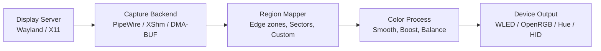
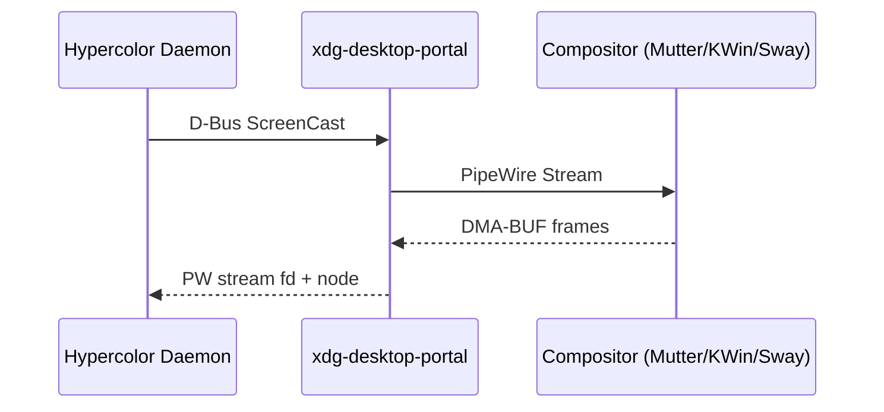
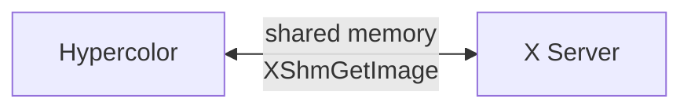
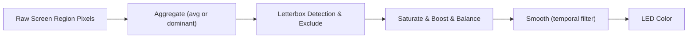
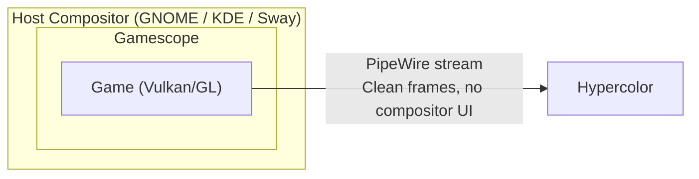
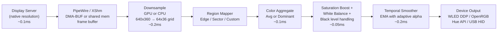

# 08 — Screen Capture & Ambient Lighting

> Ambilight for everything. Capture screen content, extract colors, drive LEDs.

---

## Overview

Screen capture is an **input source** in Hypercolor's architecture — it feeds color data into the render pipeline just like audio FFT or keyboard state. But unlike those inputs, screen capture can also _replace_ the effect engine entirely: instead of rendering a canvas effect and sampling it at LED positions, we sample the actual screen content and push those colors directly to hardware.

This document covers the full pipeline: capturing pixels from the display server, mapping screen regions to LED zones, processing raw colors into good LED output, and handling the edge cases that make or break the experience.



---

## 1. Screen Capture Pipeline

### 1.1 Wayland: PipeWire + XDG Desktop Portal

Wayland compositors don't expose screen buffers directly. Screen capture goes through the **XDG Desktop Portal** — a D-Bus interface that brokers access to screen content via PipeWire streams.

**Flow:**



1. Hypercolor calls `org.freedesktop.portal.ScreenCast.CreateSession()`
2. Portal presents a permission dialog (Wayland security model — user must approve)
3. User selects which monitor(s) to share
4. Portal returns a PipeWire node ID
5. Hypercolor connects a PipeWire stream consumer to that node
6. Frames arrive as `SPA_DATA_DmaBuf` or `SPA_DATA_MemPtr` buffers

**DMA-BUF zero-copy path:**

When the compositor supports it (GNOME/Mutter since 41, KDE/KWin since 5.27), frames arrive as DMA-BUF file descriptors. The GPU owns the buffer — no CPU copy required. We can:

- Import the DMA-BUF into a wgpu texture for GPU-side downsampling
- Or `mmap()` for direct CPU access (still faster than a full copy)

```rust
pub struct PipeWireCapture {
    portal: ScreenCastPortal,
    stream: PipeWireStream,
    config: CaptureConfig,
    /// Reusable staging buffer for downsampled frames
    staging: Vec<u8>,
}

pub struct CaptureConfig {
    /// Target output resolution (not capture resolution)
    pub sample_width: u32,       // e.g., 64 for a 64-sector horizontal grid
    pub sample_height: u32,      // e.g., 36 for a 36-sector vertical grid
    pub target_fps: u32,         // 30 or 60
    pub prefer_dmabuf: bool,     // Prefer GPU zero-copy path
    pub cursor_visible: bool,    // Include cursor in capture
    pub monitor: MonitorSelect,  // Which display to capture
}

pub enum MonitorSelect {
    Primary,
    All,
    ByName(String),
    ByIndex(u32),
}
```

**Crate: `lamco-pipewire` (v0.1.4)**

Provides a `Send + Sync` wrapper around PipeWire's non-thread-safe API via a dedicated thread + mpsc command channel. Supports DMA-BUF negotiation, multi-monitor concurrent capture, format negotiation with automatic fallbacks, and cursor extraction.

```rust
use lamco_pipewire::{PipeWireManager, CaptureConfig};

let manager = PipeWireManager::new()?;
let stream = manager.start_capture(CaptureConfig {
    prefer_dmabuf: true,
    buffer_count: 4,
    ..Default::default()
})?;

// Each frame arrives with format metadata
loop {
    let frame = stream.next_frame().await?;
    match frame.buffer_type {
        BufferType::DmaBuf(fd) => { /* GPU path */ },
        BufferType::MemPtr(ptr) => { /* CPU path */ },
    }
}
```

**Permission model:**

On first capture, GNOME/KDE shows a portal dialog: "Hypercolor wants to record your screen." The user picks which monitor(s) to share. This token can be persisted across sessions via `restore_token` in the portal API — so the dialog only appears once. Hypercolor should store this token in its config.

### 1.2 X11: XShm + XGetImage

X11 has no permission model for screen capture — any client can read any pixel. Two methods:

**XShm (shared memory) — fast path:**



- Allocates a shared memory segment (`shmget`)
- Calls `XShmGetImage()` to blit screen contents into shared memory
- Zero-copy from X server's perspective — one memcpy to our buffer
- Performance: ~2-4ms per frame at 1920x1080, negligible at our downsampled resolution

**XGetImage — slow fallback:**

- Transfers pixel data over the X11 socket
- ~10-15ms per frame at 1080p
- Only needed if XShm extension isn't available (rare)

**Crate: `xcap` (Apache 2.0)**

Cross-platform screen capture library. On Linux, uses XShm for X11 and PipeWire for Wayland. Returns `image::RgbaImage` buffers.

```rust
use xcap::Monitor;

let monitors = Monitor::all()?;
let primary = &monitors[0];
let screenshot = primary.capture_image()?; // RgbaImage
```

Simple API, but no streaming mode — each call is a discrete screenshot. For our purposes we'd call it in a loop at target FPS, which works fine for X11 where there's no stream setup overhead.

### 1.3 Capture Backend Selection

```rust
pub enum CaptureBackend {
    /// Wayland: PipeWire stream via XDG Desktop Portal
    /// DMA-BUF zero-copy when compositor supports it
    PipeWire(PipeWireCapture),

    /// X11: XShm shared memory capture
    /// No permission dialog, fast, battle-tested
    XShm(XShmCapture),

    /// Fallback: xcap crate (works on both, slower)
    Xcap(XcapCapture),
}

impl CaptureBackend {
    /// Auto-detect the best backend for the current session
    pub fn auto_detect() -> Result<Self> {
        if std::env::var("WAYLAND_DISPLAY").is_ok() {
            // Wayland session — must use PipeWire portal
            Ok(Self::PipeWire(PipeWireCapture::new()?))
        } else if std::env::var("DISPLAY").is_ok() {
            // X11 session — use XShm for speed
            Ok(Self::XShm(XShmCapture::new()?))
        } else {
            // Headless or unknown — try xcap as universal fallback
            Ok(Self::Xcap(XcapCapture::new()?))
        }
    }
}
```

### 1.4 Multi-Monitor Capture

Three modes with distinct tradeoffs:

| Mode                        | Description                                  | Use Case                      |
| --------------------------- | -------------------------------------------- | ----------------------------- |
| **Single monitor**          | Capture one display, all LED zones map to it | Monitor backlight strip       |
| **All monitors, stitched**  | Combine all displays into one virtual canvas | Multi-monitor desk setup      |
| **Per-monitor independent** | Each monitor drives its own LED zones        | Different content per display |

For stitched mode, the system queries monitor geometry (position + resolution) and assembles a virtual canvas:

```
Monitor Layout:           Virtual Canvas:
┌────────┐┌────────┐     ┌─────────────────┐
│ 2560×  ││ 1920×  │     │                 │
│ 1440   ││ 1080   │     │  Combined view  │
│        ││        │     │  4480 × 1440    │
└────────┘└────────┘     └─────────────────┘
```

The portal API's `SelectSources` method supports multi-monitor selection natively on Wayland. On X11, we capture the root window which already spans all monitors.

### 1.5 Headless / Remote Considerations

| Scenario               | Behavior                                                                 |
| ---------------------- | ------------------------------------------------------------------------ |
| **Headless server**    | Screen capture unavailable — gracefully disabled                         |
| **SSH session**        | If X11 forwarding is active, capture local X display; otherwise disabled |
| **VNC/RDP**            | Capture the local virtual framebuffer (VNC server's display)             |
| **Wayland + headless** | No portal available — fall back to X11/xcap or disable                   |
| **Container**          | Requires host PipeWire socket mount or X11 socket forwarding             |

---

## 2. Region Mapping

The region mapper translates screen geometry into LED zones. This is the spatial bridge between "what's on screen" and "which LEDs show what color."

### 2.1 Edge Sampling (Monitor Backlight)

The most common ambilight configuration: LED strips around the monitor edges. Each LED maps to a thin slice of the screen edge.

```
         ┌─── Top strip (N LEDs) ───┐
         │  T1  T2  T3  T4 ... TN   │
    ┌────┼───────────────────────────┼────┐
    │ L1 │                           │ R1 │
    │ L2 │                           │ R2 │
    │ L3 │       Screen Content      │ R3 │
    │ L4 │                           │ R4 │
    │ L5 │                           │ R5 │
    │ LM │                           │ RM │
    └────┼───────────────────────────┼────┘
         │  B1  B2  B3  B4 ... BN   │
         └─── Bottom strip (N LEDs) ┘
```

Each edge LED samples a rectangular region extending inward from the screen edge:

```rust
pub struct EdgeConfig {
    /// How far inward from the edge to sample (as fraction of screen dimension)
    /// 0.05 = sample the outer 5% of the screen
    pub depth: f32,

    /// LED counts per edge
    pub top: u32,
    pub bottom: u32,
    pub left: u32,
    pub right: u32,

    /// Gap at corners (LEDs that span the corner bend)
    pub corner_gap: u32,
}

impl EdgeConfig {
    /// Generate sampling rectangles for each LED position
    pub fn build_regions(&self, screen_w: u32, screen_h: u32) -> Vec<SampleRegion> {
        let mut regions = Vec::new();
        let depth_px_h = (screen_h as f32 * self.depth) as u32;
        let depth_px_w = (screen_w as f32 * self.depth) as u32;

        // Top edge: divide width evenly, sample top `depth` rows
        let segment_w = screen_w / self.top;
        for i in 0..self.top {
            regions.push(SampleRegion {
                x: i * segment_w,
                y: 0,
                width: segment_w,
                height: depth_px_h,
                edge: Edge::Top,
                led_index: i,
            });
        }

        // Right, Bottom, Left edges follow the same pattern...
        // (bottom is reversed for continuous LED strip winding)
        regions
    }
}
```

### 2.2 Corner Blending

Corners are where two edge strips meet. Without blending, there's a jarring discontinuity where top-strip colors meet side-strip colors. The fix: corner LEDs sample a weighted blend of both adjacent edges.

```
Corner detail:
         ┌──────────
    T(N) │ T(N) samples here ←─────┐
    ─────┤                          │ Blended
         │ R(1) samples here ←──┐  │ region
    R(1) │                      │  │
         │                      ▼  ▼
         │    ┌──────────────────────┐
         │    │  Corner blend zone   │
         │    │  Both T(N) and R(1)  │
         │    │  sample this area    │
         │    │  with distance-based │
         │    │  weighting           │
         │    └──────────────────────┘
```

```rust
pub fn blend_corner(
    top_color: Rgb,
    side_color: Rgb,
    position_along_corner: f32,  // 0.0 = fully top, 1.0 = fully side
) -> Rgb {
    let t = smooth_step(position_along_corner); // Ease in-out
    top_color.lerp(&side_color, t)
}

fn smooth_step(t: f32) -> f32 {
    t * t * (3.0 - 2.0 * t) // Hermite interpolation
}
```

### 2.3 Sector Grid

For devices that aren't edge strips — think ceiling panels, desk underglow, or WLED matrices — the screen divides into an N x M grid of sectors, each mapped to a device or device zone.

```
┌─────────┬─────────┬─────────┬─────────┐
│ (0,0)   │ (1,0)   │ (2,0)   │ (3,0)   │
│ Ceiling │ Ceiling │ Ceiling │ Ceiling │
│ Panel 1 │ Panel 2 │ Panel 3 │ Panel 4 │
├─────────┼─────────┼─────────┼─────────┤
│ (0,1)   │ (1,1)   │ (2,1)   │ (3,1)   │
│ Left    │ Center  │ Center  │ Right   │
│ Desk    │  Left   │  Right  │ Desk    │
├─────────┼─────────┼─────────┼─────────┤
│ (0,2)   │ (1,2)   │ (2,2)   │ (3,2)   │
│ Left    │ Under   │ Under   │ Right   │
│ Floor   │ Desk L  │ Desk R  │ Floor   │
└─────────┴─────────┴─────────┴─────────┘
```

```rust
pub struct SectorGrid {
    pub columns: u32,
    pub rows: u32,
    /// Map (col, row) → device/zone assignment
    pub assignments: HashMap<(u32, u32), DeviceZoneRef>,
}

pub struct DeviceZoneRef {
    pub device_id: String,
    pub zone_name: String,
}
```

### 2.4 Custom Region Shapes

Power users may want non-rectangular sampling regions — L-shaped desk zones, circular fan regions, triangular Nanoleaf panels. The region mapper supports arbitrary polygons:

```rust
pub enum RegionShape {
    /// Simple rectangle (most common)
    Rect { x: f32, y: f32, width: f32, height: f32 },

    /// Arbitrary polygon (Nanoleaf triangles, L-shaped zones)
    Polygon { vertices: Vec<(f32, f32)> },

    /// Circular region (fan rings, AIO ring)
    Circle { center: (f32, f32), radius: f32 },

    /// Annular sector (arc segment of a ring)
    Arc { center: (f32, f32), inner_r: f32, outer_r: f32, start_angle: f32, sweep: f32 },
}
```

For polygon regions, we use a point-in-polygon test during sampling and average all pixels that fall within the boundary. At our downsampled resolution this is fast — we're testing against a 64x36 grid, not native resolution.

### 2.5 Multi-Monitor Spanning

When LED zones span multiple monitors (e.g., a single strip behind a dual-monitor setup), the region mapper works in **virtual canvas coordinates** that span the full desktop geometry:

```
Physical monitors:        Virtual canvas (what region mapper sees):

┌──────────┐┌──────────┐  ┌─────────────────────────┐
│ Monitor 1││ Monitor 2│  │ 0,0              5120,0  │
│ 2560×1440││ 2560×1440│  │                          │
│          ││          │  │      5120 × 1440         │
└──────────┘└──────────┘  │                          │
                           │ 0,1440          5120,1440│
                           └─────────────────────────┘

LED strip runs behind both monitors continuously:
[ L1 L2 L3 ... L30 | L31 L32 ... L60 ]
  ←── Monitor 1 ──→  ←── Monitor 2 ──→
```

The edge sampling config for this setup would specify `top: 60` LEDs spanning the full 5120px virtual width, and the region mapper automatically handles the monitor boundary.

---

## 3. Color Processing

Raw screen pixels are terrible LED colors. Screens display subtle gradients, text, and UI chrome — LEDs want saturated, bold, smooth colors. The color processing pipeline transforms captured screen data into visually pleasing LED output.

### 3.1 Processing Pipeline



### 3.2 Color Aggregation: Average vs. Dominant

Two strategies for reducing a region of pixels to a single color:

**Average color** (simple, fast):

```rust
pub fn average_color(pixels: &[Rgb]) -> Rgb {
    let (r, g, b) = pixels.iter().fold((0u64, 0u64, 0u64), |(r, g, b), px| {
        (r + px.r as u64, g + px.g as u64, b + px.b as u64)
    });
    let n = pixels.len() as u64;
    Rgb::new((r / n) as u8, (g / n) as u8, (b / n) as u8)
}
```

Pros: fast, stable. Cons: muddy when a region contains multiple distinct colors (e.g., a UI with blue header and white body → washed-out lavender).

**Dominant color extraction** (perceptually better):

Use a simplified k-means or histogram peak detection in HSL space:

```rust
pub fn dominant_color(pixels: &[Rgb], bucket_count: u32) -> Rgb {
    // 1. Convert to HSL
    // 2. Build hue histogram (ignoring very dark and very desaturated pixels)
    // 3. Find peak hue bucket
    // 4. Average all pixels within ±15° of peak hue
    // 5. Return that average in RGB

    let mut hue_buckets = vec![0u32; bucket_count as usize];
    let mut hue_accum: Vec<Vec<Hsl>> = vec![Vec::new(); bucket_count as usize];

    for px in pixels {
        let hsl = px.to_hsl();
        // Skip near-black (L < 0.08) and near-gray (S < 0.10)
        if hsl.lightness < 0.08 || hsl.saturation < 0.10 {
            continue;
        }
        let bucket = (hsl.hue / 360.0 * bucket_count as f32) as usize;
        let bucket = bucket.min(bucket_count as usize - 1);
        hue_buckets[bucket] += 1;
        hue_accum[bucket].push(hsl);
    }

    // Find the most populated bucket
    let peak = hue_buckets.iter().enumerate()
        .max_by_key(|(_, &count)| count)
        .map(|(i, _)| i)
        .unwrap_or(0);

    // Average colors in the peak bucket
    average_hsl(&hue_accum[peak]).to_rgb()
}
```

**Recommendation:** Use dominant color by default for edge zones (where perceptual accuracy matters), average for sector grids (where speed and stability matter). Make it configurable per zone.

### 3.3 Saturation Boosting

Screen content is designed for displays with wide color gamuts viewed at arm's length. LEDs viewed peripherally need more punch. A saturation multiplier in HSL space:

```rust
pub fn boost_saturation(color: Hsl, factor: f32) -> Hsl {
    Hsl {
        hue: color.hue,
        saturation: (color.saturation * factor).min(1.0),
        lightness: color.lightness,
    }
}
```

Default factor: **1.4** — perceptually noticeable boost without neon clown vibes. Configurable 1.0 - 2.5 range.

### 3.4 Black Level Handling

When screen content is dark (loading screens, dark movie scenes, letterbox bars), what should the LEDs do?

| Strategy            | Behavior                                     | Best For                    |
| ------------------- | -------------------------------------------- | --------------------------- |
| **Off**             | LEDs turn off when region is below threshold | Pure cinema, no distraction |
| **Dim ambient**     | Hold a very dim warm white (2700K-ish)       | Cozy movie watching         |
| **Last color fade** | Slowly fade from last non-black color to off | Smooth transitions          |
| **Bias lighting**   | Static neutral color (D65 white at 5%)       | Eye strain reduction        |

```rust
pub struct BlackLevelConfig {
    /// Luminance threshold below which content is "black" (0.0 - 1.0)
    pub threshold: f32,           // Default: 0.03
    pub strategy: BlackStrategy,
    /// For DimAmbient: the warm white color and brightness
    pub ambient_color: Rgb,       // Default: Rgb(255, 200, 150) at 5% brightness
    /// For LastColorFade: seconds to fade to black
    pub fade_duration: f32,       // Default: 3.0
}

pub enum BlackStrategy {
    Off,
    DimAmbient,
    LastColorFade,
    BiasLighting,
}
```

### 3.5 White Balance Adjustment

Different LED strip types have different white points. WS2812B leans blue; SK6812 RGBW has a dedicated white channel. The white balance stage corrects for this:

```rust
pub struct WhiteBalance {
    pub r_gain: f32,  // Default: 1.0
    pub g_gain: f32,  // Default: 1.0 (green is usually the reference)
    pub b_gain: f32,  // Default: 0.85 (reduce blue for warmer output)
}

impl WhiteBalance {
    pub fn apply(&self, color: Rgb) -> Rgb {
        Rgb::new(
            (color.r as f32 * self.r_gain).min(255.0) as u8,
            (color.g as f32 * self.g_gain).min(255.0) as u8,
            (color.b as f32 * self.b_gain).min(255.0) as u8,
        )
    }
}
```

Users should be able to set this per-device (since different LED hardware has different color reproduction).

### 3.6 Temporal Smoothing

The most critical processing step for ambient lighting quality. Without smoothing, LEDs flicker madly during action scenes, fast cuts, and UI transitions.

**Exponential moving average (EMA):**

```rust
pub struct TemporalSmoother {
    /// Smoothing factor: 0.0 = frozen, 1.0 = no smoothing
    /// Default: 0.15 for cinema, 0.4 for gaming
    pub alpha: f32,
    prev_colors: Vec<Rgb>,
}

impl TemporalSmoother {
    pub fn smooth(&mut self, new_colors: &[Rgb]) -> Vec<Rgb> {
        if self.prev_colors.len() != new_colors.len() {
            self.prev_colors = new_colors.to_vec();
            return new_colors.to_vec();
        }

        let result: Vec<Rgb> = new_colors.iter()
            .zip(self.prev_colors.iter())
            .map(|(new, prev)| {
                Rgb::new(
                    lerp_u8(prev.r, new.r, self.alpha),
                    lerp_u8(prev.g, new.g, self.alpha),
                    lerp_u8(prev.b, new.b, self.alpha),
                )
            })
            .collect();

        self.prev_colors = result.clone();
        result
    }
}

fn lerp_u8(a: u8, b: u8, t: f32) -> u8 {
    (a as f32 + (b as f32 - a as f32) * t) as u8
}
```

**Adaptive smoothing** — adjust alpha based on the magnitude of color change:

```rust
pub fn adaptive_alpha(prev: Rgb, new: Rgb, base_alpha: f32) -> f32 {
    let delta = color_distance(prev, new); // 0.0 - 1.0 normalized
    if delta > 0.6 {
        // Large change (scene cut): react quickly
        (base_alpha * 3.0).min(1.0)
    } else if delta < 0.05 {
        // Tiny change (static scene): smooth heavily
        base_alpha * 0.5
    } else {
        base_alpha
    }
}
```

This gives the best of both worlds: smooth ambient in calm scenes, responsive reaction to dramatic changes.

### 3.7 Letterbox Detection

Content doesn't always fill the screen. 2.39:1 movies on a 16:9 monitor have black bars top and bottom. 4:3 content has bars on the sides. Sampling black bars produces dead LEDs — we need to detect and exclude them.

**Algorithm:**

```rust
pub struct LetterboxDetector {
    /// Number of consecutive frames a bar must be present before we trust it
    pub confidence_frames: u32,   // Default: 15 (~0.5s at 30fps)
    /// Maximum brightness for a row/column to be considered "black"
    pub black_threshold: f32,     // Default: 0.02
    /// Minimum bar size (fraction of screen) to trigger detection
    pub min_bar_fraction: f32,    // Default: 0.05 (5% of screen height)

    top_bar_frames: u32,
    bottom_bar_frames: u32,
    left_bar_frames: u32,
    right_bar_frames: u32,
    detected_bars: LetterboxBars,
}

pub struct LetterboxBars {
    pub top: u32,     // Pixels of black bar at top
    pub bottom: u32,  // Pixels of black bar at bottom
    pub left: u32,    // Pixels of black bar at left
    pub right: u32,   // Pixels of black bar at right
}

impl LetterboxDetector {
    pub fn analyze(&mut self, frame: &DownsampledFrame) -> LetterboxBars {
        // Scan from top: count rows where average luminance < threshold
        let top_black = self.scan_rows_from_top(frame);
        // Scan from bottom
        let bottom_black = self.scan_rows_from_bottom(frame);
        // Scan from left/right for pillarbox
        let left_black = self.scan_cols_from_left(frame);
        let right_black = self.scan_cols_from_right(frame);

        // Require confidence: bars must be stable for N frames
        // (prevents false detection during dark scenes)
        self.update_confidence(top_black, bottom_black, left_black, right_black);

        self.detected_bars.clone()
    }
}
```

When letterboxing is detected, edge sampling regions shift inward to sample actual content instead of black bars. The adjustment happens smoothly over ~0.5s to avoid jarring shifts.

---

## 4. Game Integration

### 4.1 Direct Game Capture vs. Desktop Capture

Two approaches for gaming:

| Approach             | Method                              | Pros                                      | Cons                                       |
| -------------------- | ----------------------------------- | ----------------------------------------- | ------------------------------------------ |
| **Desktop capture**  | PipeWire/XShm as above              | Universal, no game cooperation needed     | Captures overlay, HUD, notification popups |
| **Gamescope nested** | Capture Gamescope's PipeWire output | Clean game frames, no compositor overhead | Only works with Gamescope                  |

### 4.2 Gamescope Integration

Valve's Gamescope is a micro-compositor for gaming. It wraps a game in its own Wayland session with resolution scaling, frame limiting, and HDR support. Critically, **Gamescope exposes its output as a PipeWire node** — perfect for our capture pipeline.



**Launch integration:**

```bash
# Hypercolor could offer a launch wrapper:
hypercolor gamescope -- %command%

# Which translates to:
gamescope -W 2560 -H 1440 --expose-wayland -- %command%
# + connect Hypercolor's PipeWire consumer to Gamescope's output node
```

Steam's launch options could use this directly:

```
hypercolor gamescope -- %command%
```

### 4.3 Game-Specific Profiles

Detect running games and load tailored capture configs:

```toml
# ~/.config/hypercolor/games/cyberpunk2077.toml
[match]
process_name = "Cyberpunk2077.exe"  # Via /proc or gamescope
# Alternative: steam_app_id = 1091500

[capture]
mode = "gaming"
smoothing_alpha = 0.35        # Faster response for action
saturation_boost = 1.6        # Cyberpunk's neon aesthetic

[exclusion_zones]
# Don't sample the minimap (top-right corner)
[[exclusion_zones.regions]]
x = 0.85
y = 0.0
width = 0.15
height = 0.15
label = "minimap"

# Don't sample the health bar area (bottom-left)
[[exclusion_zones.regions]]
x = 0.0
y = 0.85
width = 0.25
height = 0.15
label = "health_bar"
```

**Game detection** via procfs:

```rust
pub fn detect_running_game(profiles: &[GameProfile]) -> Option<&GameProfile> {
    let procs = std::fs::read_dir("/proc").ok()?;
    for entry in procs.flatten() {
        if let Ok(cmdline) = std::fs::read_to_string(
            entry.path().join("cmdline")
        ) {
            for profile in profiles {
                if cmdline.contains(&profile.process_name) {
                    return Some(profile);
                }
            }
        }
    }
    None
}
```

### 4.4 HUD Exclusion

Games overlay HUDs, health bars, minimaps, and inventory UI. These are visually static and sampling them produces boring, constant colors. Exclusion zones let users mask out these areas:

```
┌─────────────────────────────────────────┐
│  ┌─────┐                   ┌─────────┐ │
│  │SKIP │                   │  SKIP   │ │
│  │(HP) │                   │(minimap)│ │
│  └─────┘                   └─────────┘ │
│                                          │
│        Game content → sample this        │
│                                          │
│  ┌───────────────────────────────────┐  │
│  │           SKIP (hotbar)           │  │
│  └───────────────────────────────────┘  │
└─────────────────────────────────────────┘
```

Exclusion zones are simple: during region sampling, any pixel that falls within an exclusion rectangle is skipped. This is applied before color aggregation.

### 4.5 Gaming Performance Impact

Screen capture during gaming must be nearly invisible. Performance budget:

| Component            | Budget | Strategy                                          |
| -------------------- | ------ | ------------------------------------------------- |
| **Frame capture**    | <1ms   | DMA-BUF zero-copy (PipeWire) — no CPU involvement |
| **Downsampling**     | <0.5ms | GPU compute shader: native → 64x36 grid           |
| **Color processing** | <0.2ms | CPU: process 2304 sectors                         |
| **LED output**       | <0.5ms | Async DDP/HID — doesn't block capture             |
| **Total**            | <2.2ms | ~0.5% of a 16.6ms frame at 60fps                  |

**Key optimization: capture at reduced resolution.** PipeWire's format negotiation lets us request frames at a lower resolution than native. Instead of capturing 2560x1440 and downsampling ourselves, we ask the compositor to deliver 640x360 frames. The compositor's GPU scaler does this work for free.

```rust
// In PipeWire stream parameters:
spa_format_video_raw_build(
    &mut buffer,
    SPA_VIDEO_FORMAT_BGRA,
    SPA_VIDEO_MAX_SIZE(640, 360),   // Capture resolution
    SPA_VIDEO_MAX_FRAMERATE(30, 1), // 30fps is plenty for ambient
);
```

**Adaptive quality:** Under high GPU load, automatically reduce capture resolution and frame rate:

```rust
pub struct AdaptiveCapture {
    pub min_resolution: (u32, u32),   // 160x90
    pub max_resolution: (u32, u32),   // 640x360
    pub min_fps: u32,                  // 15
    pub max_fps: u32,                  // 60

    /// If frame capture takes longer than this, reduce quality
    pub latency_threshold: Duration,   // 4ms
}
```

---

## 5. Video / Movie Mode

### 5.1 Letterbox-Aware Capture

Movie mode activates when letterboxing is detected (see section 3.7). The system adjusts automatically:

```
21:9 movie on 16:9 display:

Before letterbox detection:       After detection:
┌─────────────────────────┐     ┌─────────────────────────┐
│▓▓▓▓▓▓ black bar ▓▓▓▓▓▓▓│     │     (ignored)           │
│                          │     │─ ─ ─ ─ ─ ─ ─ ─ ─ ─ ─ ─│
│   Movie content          │     │   Movie content ← LEDs  │
│                          │     │   sample from here       │
│▓▓▓▓▓▓ black bar ▓▓▓▓▓▓▓│     │─ ─ ─ ─ ─ ─ ─ ─ ─ ─ ─ ─│
└─────────────────────────┘     │     (ignored)           │
                                 └─────────────────────────┘
```

Top/bottom edge LEDs remap to sample from the first non-black rows of actual content.

### 5.2 HDR Content Handling

HDR content uses PQ (Perceptual Quantizer) or HLG transfer functions and wide color gamut (BT.2020). LEDs are SDR devices (sRGB gamut, 8-bit). The pipeline needs an HDR → SDR tone mapping stage:

```rust
pub fn tonemap_pq_to_sdr(r: f32, g: f32, b: f32) -> (f32, f32, f32) {
    // PQ EOTF: linearize from PQ curve
    let (lr, lg, lb) = pq_eotf(r, g, b);

    // Scale from HDR luminance (up to 10000 nits) to SDR range (0-1)
    // Using Reinhard tone mapping with white point at 1000 nits
    let white_point = 1000.0;
    let lr = lr / (1.0 + lr / white_point);
    let lg = lg / (1.0 + lg / white_point);
    let lb = lb / (1.0 + lb / white_point);

    // Gamut map BT.2020 → sRGB
    let (sr, sg, sb) = bt2020_to_srgb(lr, lg, lb);

    // Apply sRGB gamma
    (srgb_oetf(sr), srgb_oetf(sg), srgb_oetf(sb))
}
```

**Detection:** PipeWire stream metadata includes the format and color space. If the compositor is running in HDR mode, frames may arrive in a 10-bit or floating-point format with PQ transfer. Hypercolor detects this and engages the tone mapper automatically.

### 5.3 Subtitle Exclusion

Subtitles sit in the bottom ~15% of the content area (after letterbox adjustment). Hard-coded subtitles can't be excluded, but we can treat the subtitle region specially:

```rust
pub struct SubtitleExclusion {
    /// Enable subtitle region detection
    pub enabled: bool,
    /// Bottom fraction of content area to monitor for subtitles
    pub region_height: f32,   // Default: 0.12 (bottom 12%)
    /// If the bottom region has high-contrast text-like content,
    /// use the color from the region above it instead
    pub fallback_strategy: SubtitleFallback,
}

pub enum SubtitleFallback {
    /// Use the color from the region just above the subtitle area
    SampleAbove,
    /// Hold the last non-subtitle color
    HoldPrevious,
    /// Ignore — sample normally (subtitles don't bother this user)
    Disabled,
}
```

### 5.4 Content-Aware Color Extraction

For cinematic content, the dominant color of the _scene_ matters more than pixel-accurate sampling. A "mood extraction" mode that reads the overall scene tone:

```rust
pub enum ContentMode {
    /// Direct sampling: each zone gets its region's color (standard)
    Direct,
    /// Mood extraction: entire frame → single dominant color applied
    /// to all zones with edge-based luminance variation
    Mood,
    /// Hybrid: edge zones use direct sampling, interior zones use mood
    Hybrid,
}
```

Mood mode is particularly effective for movies: instead of the left strip showing blue and the right strip showing orange during a dialogue scene, the entire setup takes on the warm amber tone of the scene's lighting. More cinematic, less distracting.

### 5.5 Transition Speed Profiles

| Profile      | Smoothing Alpha | Best For                                |
| ------------ | --------------- | --------------------------------------- |
| **Cinema**   | 0.08 - 0.12     | Movies, slow transitions, zero flicker  |
| **TV**       | 0.15 - 0.25     | TV shows, moderate responsiveness       |
| **Gaming**   | 0.30 - 0.50     | Fast action, responsive to explosions   |
| **Reactive** | 0.60 - 0.80     | Music visualizer mode, maximum response |
| **Instant**  | 1.0             | Debug / testing, raw unfiltered output  |

---

## 6. Multi-Monitor

### 6.1 Monitor-to-Zone Assignment

The configuration maps physical monitors to LED zones:

```toml
# ~/.config/hypercolor/ambient.toml

[[monitor]]
name = "DP-1"            # Wayland output name
position = "primary"

  [[monitor.zones]]
  device = "wled-desk"
  type = "edge"
  edges = { top = 30, bottom = 30, left = 20, right = 20 }
  depth = 0.06

  [[monitor.zones]]
  device = "prism8-ch1"
  type = "sector"
  sector = { col = 1, row = 0, cols = 2, rows = 1 }  # Top-center sector

[[monitor]]
name = "HDMI-1"
position = "secondary"

  [[monitor.zones]]
  device = "wled-shelf"
  type = "edge"
  edges = { top = 15, left = 10, right = 10 }
  depth = 0.08
```

### 6.2 Operating Modes

**Independent ambient per monitor:**

Each monitor runs its own capture and color extraction pipeline. Monitor 1's game drives the desk LEDs; Monitor 2's Discord chat drives the shelf LEDs. Completely independent.

**Primary display only:**

Only the primary monitor captures. Secondary monitors are ignored. Simplest config, lowest resource usage.

**Unified canvas:**

All monitors combine into one virtual canvas. LED zones span the full desktop. Best for matching multi-monitor setups where you want one continuous ambient experience.

### 6.3 Ultrawide Segmentation

Ultrawide monitors (21:9, 32:9) benefit from finer-grained segmentation. A 32:9 super-ultrawide is effectively two monitors in one panel:

```
Samsung G9 49" (5120 × 1440):
┌────────────────────────────────────────────────────┐
│  Zone A           │  Zone B           │  Zone C    │
│  (left third)     │  (center third)   │  (right)   │
│                   │                   │            │
│  → Left strip     │  → Desk underglow │  → Right   │
│  → Left panel     │  → Center panel   │    strip   │
└────────────────────────────────────────────────────┘
```

The region mapper supports arbitrary subdivision — not just edge strips, but splitting the ultrawide into logical segments that map to different device groups.

---

## 7. Desktop Integration

Beyond screen mirroring — Hypercolor can react to desktop state, not just pixel content.

### 7.1 Active Window Color Extraction

Sample colors from the focused window's title bar or content area. Your IDE theme drives your room lighting:

```rust
pub struct WindowAwareCapture {
    /// Only sample the focused window, not the full screen
    pub focused_window_only: bool,
    /// Use the window's dominant theme color (from GTK/Qt theme hints)
    pub use_theme_color: bool,
    /// Exclude window decorations from sampling
    pub exclude_decorations: bool,
}
```

**Implementation on Wayland:** The XDG Desktop Portal's ScreenCast API supports window selection (not just monitor selection). When `focused_window_only` is true, Hypercolor captures only the active window's content — ignoring the desktop background and other windows.

**Implementation on X11:** Use `_NET_ACTIVE_WINDOW` atom to get the focused window ID, then `XGetWindowAttributes` + `XGetImage` on that specific window.

### 7.2 Wallpaper Color Sampling

For a static ambient mode: extract dominant colors from the desktop wallpaper and hold them as a constant ambient lighting scheme. No screen capture loop needed — just sample once when wallpaper changes.

```rust
pub fn wallpaper_ambient(wallpaper_path: &Path) -> Vec<Rgb> {
    let img = image::open(wallpaper_path).ok()?;
    let small = img.resize(64, 36, image::imageops::Lanczos3);

    // Extract 4-6 dominant colors using k-means
    let palette = extract_palette(&small, 5);

    // Map palette colors to LED zones based on spatial position
    // Left side of wallpaper → left LED strip, etc.
    map_palette_to_zones(&palette)
}
```

**Detection:** Monitor D-Bus for `org.freedesktop.portal.Settings` changes to `org.freedesktop.appearance` or GNOME's `org.gnome.desktop.background picture-uri`.

### 7.3 Notification Flash

Brief LED flash when a desktop notification appears:

```rust
pub struct NotificationFlash {
    pub enabled: bool,
    pub flash_color: Rgb,         // Default: white
    pub flash_duration_ms: u32,   // Default: 300
    pub flash_brightness: f32,    // 0.0 - 1.0, default: 0.8
    /// Which LED zones flash (None = all)
    pub target_zones: Option<Vec<String>>,
}
```

**Implementation:** Subscribe to `org.freedesktop.Notifications` D-Bus signals. On `Notify`, trigger a brief overlay on the current ambient colors, then fade back.

### 7.4 Dark/Light Mode Sync

When the desktop switches between dark and light modes, shift the ambient lighting to match:

| Desktop Mode | Ambient Shift                                       |
| ------------ | --------------------------------------------------- |
| Dark mode    | Warmer color temperature (3000K), lower brightness  |
| Light mode   | Cooler color temperature (5000K), higher brightness |

```rust
pub fn watch_color_scheme() -> watch::Receiver<ColorScheme> {
    // Monitor org.freedesktop.portal.Settings
    //   namespace: "org.freedesktop.appearance"
    //   key: "color-scheme"
    //   0 = no preference, 1 = dark, 2 = light
    // ...
}
```

This integrates with GNOME's dark/light toggle, KDE's color scheme settings, and any freedesktop-compliant desktop.

---

## 8. Persona Scenarios

### Jake — Gaming

Jake is playing Elden Ring with a 27" 1440p monitor, WLED strip behind the monitor (60 LEDs, edge layout), and Prism 8 driving four case fans.

**Config:**

```toml
[profile.gaming]
capture_backend = "pipewire"
capture_fps = 30                    # 30fps is plenty for ambient
smoothing_alpha = 0.35              # Responsive for combat
saturation_boost = 1.5
black_strategy = "dim_ambient"      # Dark caves still have subtle glow

[[profile.gaming.zones]]
device = "wled-monitor"
type = "edge"
edges = { top = 20, bottom = 20, left = 10, right = 10 }
depth = 0.06
```

**Experience:** A dragon breathes fire from the right side of the screen. The right LED strip flares orange-red within ~100ms (3 frames at 30fps capture, smoothing alpha 0.35). Left strip shows the dark cavern's blue-grey. Bottom strip picks up the grassy terrain's green-brown. The transition feels organic, not jarring.

**Performance:** PipeWire delivers 640x360 DMA-BUF frames. GPU downsamples to 64x36 sector grid. Total CPU overhead: <1%. Jake doesn't notice any FPS impact.

### Sam — Movie Night

Sam is watching Blade Runner 2049 on a 34" ultrawide with a WLED strip behind the monitor and Hue bulbs in the room.

**Config:**

```toml
[profile.cinema]
capture_fps = 24                    # Match film frame rate
smoothing_alpha = 0.10              # Very smooth, cinematic transitions
saturation_boost = 1.3
content_mode = "hybrid"             # Mood for room lights, direct for monitor strip
black_strategy = "last_color_fade"
letterbox_detection = true

[[profile.cinema.zones]]
device = "wled-monitor"
type = "edge"
edges = { top = 25, bottom = 25, left = 15, right = 15 }
content_mode = "direct"             # Edge-accurate for monitor backlight

[[profile.cinema.zones]]
device = "hue-living-room"
type = "sector"
sector = { col = 0, row = 0, cols = 1, rows = 1 }  # Full screen → single mood color
content_mode = "mood"               # Scene mood drives room lighting
```

**Experience:** The orange desert scenes bathe the room in warm amber via Hue bulbs. The monitor backlight strip shows accurate edge colors — orange on the right, deep blue sky on the left. Transitions between scenes take 2-3 seconds (alpha 0.10), creating a cinematic wash effect. The 2.39:1 letterbox bars are auto-detected and ignored — top and bottom edge LEDs sample actual content, not black.

### Bliss — Coding

Bliss is coding in Neovim with the SilkCircuit Neon theme. A WLED strip behind the monitor provides ambient lighting that subtly matches the editor theme.

**Config:**

```toml
[profile.coding]
capture_backend = "pipewire"
capture_fps = 10                    # Low FPS — editor is mostly static
smoothing_alpha = 0.06              # Very slow transitions
saturation_boost = 1.2
content_mode = "mood"               # Overall theme mood, not line-by-line sampling

# Alternative: static wallpaper mode
# wallpaper_ambient = true          # Just sample wallpaper colors
```

**Experience:** The editor is mostly dark (`#1a1a2e` background) with electric purple (`#e135ff`) keywords and neon cyan (`#80ffea`) function names. The mood extraction picks up the dominant dark blue-purple tone and the monitor strip holds a very subtle deep purple ambient. When Bliss switches to a browser (white background), the ambient slowly shifts to a cooler, brighter tone over ~10 seconds. No flicker, no distraction — just a gentle atmosphere that matches the screen without demanding attention.

### Alex — Living Room Ambilight

Alex has a 55" TV running through a Raspberry Pi with WLED, with a 120-LED strip behind the TV driving a ceiling-mounted WLED strip for room-wide ambilight.

**Config:**

```toml
[profile.tv_ambilight]
capture_backend = "pipewire"        # Or HDMI capture card → PipeWire
capture_fps = 30
smoothing_alpha = 0.12
saturation_boost = 1.4
letterbox_detection = true
subtitle_exclusion = true
black_strategy = "dim_ambient"

[[profile.tv_ambilight.zones]]
device = "wled-tv-backlight"
type = "edge"
edges = { top = 40, bottom = 40, left = 25, right = 25 }
depth = 0.08

[[profile.tv_ambilight.zones]]
device = "wled-ceiling"
type = "sector"
sector = { col = 0, row = 0, cols = 4, rows = 1 }
content_mode = "mood"
```

**Experience:** Watching Planet Earth: the ceiling strip takes on the scene's mood — deep ocean blue during underwater sequences, warm savanna gold during safari shots. The TV backlight strip provides accurate edge lighting that extends the screen into the wall. Transitions between shots are smooth. Subtitles don't cause the bottom LEDs to flash white. During commercials (lots of rapid cuts and bright graphics), the smoothing keeps things calm rather than seizure-inducing.

---

## 9. Performance Budgets

### 9.1 Target Specifications

| Metric                          | Target | Acceptable | Unacceptable |
| ------------------------------- | ------ | ---------- | ------------ |
| **CPU overhead (1080p, 30fps)** | <2%    | <5%        | >10%         |
| **CPU overhead (4K, 30fps)**    | <3%    | <7%        | >15%         |
| **Capture latency**             | <5ms   | <10ms      | >33ms        |
| **End-to-end latency**          | <50ms  | <100ms     | >200ms       |
| **Memory usage**                | <20MB  | <50MB      | >100MB       |
| **GPU overhead**                | <1%    | <3%        | >5%          |

### 9.2 Capture Cost Breakdown

**Wayland (PipeWire, DMA-BUF zero-copy):**

| Step                             | Time (1080p) | Time (4K)   | CPU Cost            |
| -------------------------------- | ------------ | ----------- | ------------------- |
| PipeWire frame delivery          | ~0.1ms       | ~0.1ms      | Near zero (DMA-BUF) |
| GPU downsample (compute shader)  | ~0.2ms       | ~0.3ms      | Near zero (GPU)     |
| Color extraction (64x36 grid)    | ~0.1ms       | ~0.1ms      | Minimal             |
| Color processing (smooth, boost) | ~0.05ms      | ~0.05ms     | Minimal             |
| **Total per frame**              | **~0.45ms**  | **~0.55ms** | **<1%**             |

**X11 (XShm):**

| Step                | Time (1080p) | Time (4K)    | CPU Cost          |
| ------------------- | ------------ | ------------ | ----------------- |
| XShmGetImage        | ~2ms         | ~8ms         | Moderate (memcpy) |
| CPU downsample      | ~0.5ms       | ~2ms         | Moderate          |
| Color extraction    | ~0.1ms       | ~0.1ms       | Minimal           |
| Color processing    | ~0.05ms      | ~0.05ms      | Minimal           |
| **Total per frame** | **~2.65ms**  | **~10.15ms** | **3-5%**          |

The Wayland DMA-BUF path is roughly 5-20x faster than X11 because the GPU does the heavy lifting.

### 9.3 Downsampling Strategy

Native resolution frames are wasteful — we don't need 2073600 pixels (1080p) to drive 60-120 LEDs. The downsampling pipeline reduces the data volume dramatically:

```
Native frame (2560 × 1440 = 3,686,400 px)
       │
       ▼  PipeWire negotiated resolution (request 640 × 360)
Reduced frame (640 × 360 = 230,400 px)
       │
       ▼  GPU compute shader or CPU box filter
Sector grid (64 × 36 = 2,304 sectors)
       │
       ▼  Region mapper selects relevant sectors
LED colors (~60-200 values)
```

The 1600x reduction from native to sector grid is where all the performance savings live. At 2304 sectors, the color extraction math is trivial — we're processing fewer pixels than a single 48x48 icon.

### 9.4 Adaptive Quality

When system load is high (gaming), automatically degrade capture quality:

```rust
pub struct QualityController {
    frame_times: VecDeque<Duration>,   // Rolling window of last 30 frame times
    current_resolution: (u32, u32),
    current_fps: u32,

    config: AdaptiveConfig,
}

impl QualityController {
    pub fn evaluate(&mut self, last_frame_time: Duration) -> QualityAdjustment {
        self.frame_times.push_back(last_frame_time);
        if self.frame_times.len() > 30 {
            self.frame_times.pop_front();
        }

        let avg = self.average_frame_time();

        if avg > self.config.high_latency_threshold {
            // System is stressed — reduce quality
            QualityAdjustment::ReduceResolution
        } else if avg < self.config.low_latency_threshold
            && self.current_resolution < self.config.max_resolution
        {
            // System has headroom — increase quality
            QualityAdjustment::IncreaseResolution
        } else {
            QualityAdjustment::Hold
        }
    }
}
```

Quality steps: `640x360 → 320x180 → 160x90 → 80x45` and FPS: `60 → 30 → 15`. The lowest quality (80x45 at 15fps) is still perfectly adequate for ambient lighting — LEDs don't need pixel-accurate sampling.

---

## 10. Edge Cases

### 10.1 DRM-Protected Content

**Problem:** Streaming services (Netflix, Disney+, Amazon Prime) use HDCP/DRM. On Wayland, the compositor may blank or black-fill DRM-protected windows in the PipeWire screen capture stream.

**Behavior by browser:**

| Browser           | DRM Content in Capture                             |
| ----------------- | -------------------------------------------------- |
| Firefox (Wayland) | Black rectangle for DRM-protected video element    |
| Chrome (Wayland)  | Black rectangle (hardware overlay path)            |
| Chrome (X11)      | Visible (X11 has no per-window capture protection) |
| Electron apps     | Varies by app configuration                        |

**Mitigation:**

1. **Detect black windows:** If a previously-capturing region suddenly goes all-black for >2 seconds, likely DRM kicked in. Notify the user.
2. **Fall back to bias lighting:** When DRM is detected, switch to static bias lighting or wallpaper-derived ambient instead of dead black LEDs.
3. **HDMI capture card:** For dedicated media setups, an HDMI splitter + USB capture card bypasses DRM entirely and feeds frames through V4L2 → PipeWire. This is the standard Hyperion/HyperHDR approach.
4. **X11 session:** DRM content is visible in X11 screen capture. Users who prioritize ambient lighting for streaming might prefer running their browser on X11 (XWayland or native X session).

### 10.2 VR Headset Connected

When a VR headset is connected, the system may have displays that are:

- The desktop monitor (capture this)
- The VR headset's left/right eye displays (don't capture these)
- A VR mirror window on the desktop (could capture this for ambient)

**Strategy:** Only capture monitors explicitly selected in configuration. VR displays won't appear in the XDG Desktop Portal's monitor selection dialog because they're not part of the desktop session. If a VR mirror window is open, the user can select that specific window for capture.

### 10.3 HDR → SDR Conversion

Covered in detail in section 5.2. Key points:

- PipeWire frame metadata tells us the color space and transfer function
- If PQ (HDR10) or HLG: apply tone mapping before color extraction
- Reinhard tone mapping with a configurable white point (default: 1000 nits)
- Gamut mapping from BT.2020 → sRGB for LED output

### 10.4 Screensaver / Lock Screen

| State                         | Behavior                                                        |
| ----------------------------- | --------------------------------------------------------------- |
| **Screen active**             | Normal capture                                                  |
| **Screensaver running**       | Continue capture (screensavers can be pretty)                   |
| **Screen locked**             | **Stop capture** — no ambient. Optionally: static bias lighting |
| **DPMS off (screen blanked)** | **Stop capture** — LEDs off or static dim                       |
| **Idle timeout**              | Fade to dim or off based on user preference                     |

**Detection:** Monitor `org.freedesktop.ScreenSaver` D-Bus for lock state. Monitor `org.freedesktop.login1.Session.IdleHint` for idle detection. Watch for DPMS state changes via PipeWire stream state (stream goes inactive when display blanks).

```rust
pub async fn watch_session_state(bus: &zbus::Connection) -> watch::Receiver<SessionState> {
    // Subscribe to screensaver and login1 signals
    // SessionState::Active | Idle | Locked | DpmsOff
}
```

### 10.5 Remote Desktop

| Scenario                         | Behavior                                                                     |
| -------------------------------- | ---------------------------------------------------------------------------- |
| **Local machine, remote viewer** | Capture local display (the one with LEDs attached)                           |
| **Remote machine, local viewer** | Don't capture — remote machine has no local LEDs                             |
| **VNC server on local machine**  | Capture the VNC server's virtual framebuffer if physical display unavailable |
| **Wayland remote desktop**       | PipeWire stream may come from remote desktop portal — capture it normally    |

The key insight: Hypercolor captures the **local** display because that's where the LEDs are. If someone is viewing this machine remotely via VNC/RDP, the LED behavior should reflect what's on the physical screen, not what the remote viewer sees.

### 10.6 Display Hot-Plug

Monitors connect and disconnect. When a captured monitor is unplugged:

1. PipeWire stream goes to `Error` or `Unconnected` state
2. Hypercolor detects the disconnection
3. LED zones mapped to that monitor either:
   - Switch to static/fallback color
   - Remap to remaining monitors
   - Turn off gracefully (fade to black over 2s)
4. When the monitor reconnects, PipeWire stream can be re-established
5. User may need to re-approve the portal dialog (depends on token persistence)

### 10.7 Compositor-Specific Quirks

| Compositor       | Notes                                                                               |
| ---------------- | ----------------------------------------------------------------------------------- |
| **GNOME/Mutter** | Full DMA-BUF support since GNOME 41. Portal dialog is clean. Restore tokens work.   |
| **KDE/KWin**     | DMA-BUF since Plasma 5.27. Portal dialog supports window selection.                 |
| **Sway/wlroots** | DMA-BUF via `wlr-screencopy-unstable`. Portal support via `xdg-desktop-portal-wlr`. |
| **Hyprland**     | Uses `xdg-desktop-portal-hyprland`. Full PipeWire DMA-BUF support.                  |
| **Gamescope**    | Exposes PipeWire output node. Can be captured like any other PipeWire source.       |
| **X11 (any WM)** | XShm works universally. No permissions needed. No DMA-BUF.                          |

---

## Data Flow: Complete Pipeline



Total: < 2ms per frame @ 30fps = < 6% of frame budget

---

## InputSource Trait Implementation

Screen capture integrates with Hypercolor's existing `InputSource` trait:

```rust
pub struct ScreenCaptureInput {
    backend: CaptureBackend,
    region_mapper: RegionMapper,
    color_processor: ColorProcessor,
    letterbox: LetterboxDetector,
    config: ScreenCaptureConfig,
}

impl InputSource for ScreenCaptureInput {
    fn name(&self) -> &str { "screen_capture" }

    fn sample(&mut self) -> Result<InputData> {
        // 1. Capture frame from display server
        let frame = self.backend.capture()?;

        // 2. Detect letterboxing
        let bars = self.letterbox.analyze(&frame);

        // 3. Map regions and extract colors
        let mut zone_colors = self.region_mapper.extract(&frame, &bars);

        // 4. Process colors (saturation, black level, white balance)
        self.color_processor.process(&mut zone_colors);

        // 5. Return as InputData for the render loop
        Ok(InputData::ScreenCapture(zone_colors))
    }

    fn sample_rate_hz(&self) -> f64 {
        self.config.capture_fps as f64
    }
}
```

When screen capture is the active mode, it **bypasses the effect engine entirely**. Instead of rendering a canvas effect and sampling it through the spatial layout engine, the screen capture input produces device colors directly, which are pushed straight to the device backends.

```
Normal effect mode:
  Effect Engine → Canvas → Spatial Sampler → Device Backends

Screen capture mode:
  Screen Capture Input → Region Mapper → Color Processor → Device Backends
  (effect engine is idle)
```

---

## Configuration Schema

```toml
[screen_capture]
# Backend selection: "auto", "pipewire", "xshm", "xcap"
backend = "auto"

# Capture settings
fps = 30
resolution = [640, 360]       # Capture resolution (before downsampling)
prefer_dmabuf = true
monitor = "primary"           # "primary", "all", or output name like "DP-1"

# Color processing
aggregation = "dominant"      # "average" or "dominant"
saturation_boost = 1.4
smoothing_alpha = 0.15
content_mode = "direct"       # "direct", "mood", "hybrid"

# Black level
[screen_capture.black_level]
threshold = 0.03
strategy = "dim_ambient"      # "off", "dim_ambient", "last_color_fade", "bias_lighting"
ambient_color = [255, 200, 150]
ambient_brightness = 0.05
fade_duration = 3.0

# White balance (per-device overrides also supported)
[screen_capture.white_balance]
r_gain = 1.0
g_gain = 1.0
b_gain = 0.85

# Letterbox detection
[screen_capture.letterbox]
enabled = true
confidence_frames = 15
black_threshold = 0.02
min_bar_fraction = 0.05

# Subtitle exclusion
[screen_capture.subtitles]
enabled = true
region_height = 0.12
fallback = "sample_above"

# Adaptive quality
[screen_capture.adaptive]
enabled = true
min_resolution = [160, 90]
max_resolution = [640, 360]
min_fps = 15
max_fps = 60
latency_threshold_ms = 4

# Game profiles directory
game_profiles_dir = "~/.config/hypercolor/games/"
```

---

## Dependencies

| Crate            | Purpose                                        | License           | Feature Flag      |
| ---------------- | ---------------------------------------------- | ----------------- | ----------------- |
| `lamco-pipewire` | Wayland screen capture via PipeWire            | MIT               | `screen-pipewire` |
| `lamco-portal`   | XDG Desktop Portal for permissions             | MIT               | `screen-pipewire` |
| `xcap`           | X11 screen capture (XShm) + fallback           | Apache-2.0        | `screen-x11`      |
| `zbus`           | D-Bus for portal, notifications, session state | MIT               | (already in core) |
| `image`          | Pixel buffer types, downsampling               | MIT OR Apache-2.0 | (already in core) |
| `wgpu`           | GPU compute shader for downsampling            | MIT OR Apache-2.0 | (already in core) |

Feature flags keep the dependency tree lean. A headless server build without screen capture compiles without PipeWire or X11 dependencies.

---

## Implementation Phases

### Phase 1: Basic Capture (MVP)

- PipeWire backend with DMA-BUF support
- X11/XShm fallback
- Edge sampling for single monitor
- Average color aggregation
- EMA temporal smoothing
- Single WLED output
- CLI: `hypercolor capture --monitor DP-1 --device wled-desk`

### Phase 2: Smart Processing

- Dominant color extraction
- Letterbox detection
- Saturation boost + white balance
- Black level handling
- Sector grid mapping
- Multi-device output

### Phase 3: Game + Movie Modes

- Game detection via procfs
- Gamescope integration
- HUD exclusion zones
- Game-specific profiles
- Content-aware mood extraction
- HDR tone mapping
- Subtitle exclusion

### Phase 4: Desktop Integration

- Active window capture
- Wallpaper ambient mode
- Dark/light mode sync
- Notification flash
- Multi-monitor spanning
- Adaptive quality controller

### Phase 5: Polish

- Web UI for region mapping editor (drag LED zones onto screen preview)
- TUI live preview of captured colors
- D-Bus service for other apps to query/control ambient mode
- Community game profile sharing
