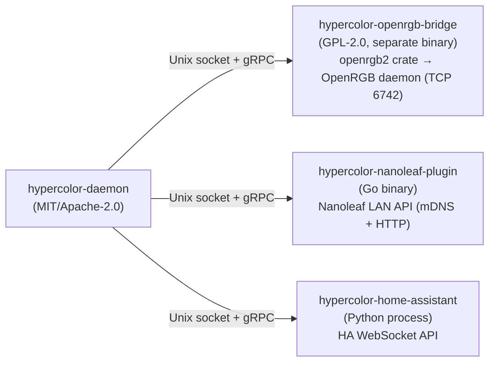
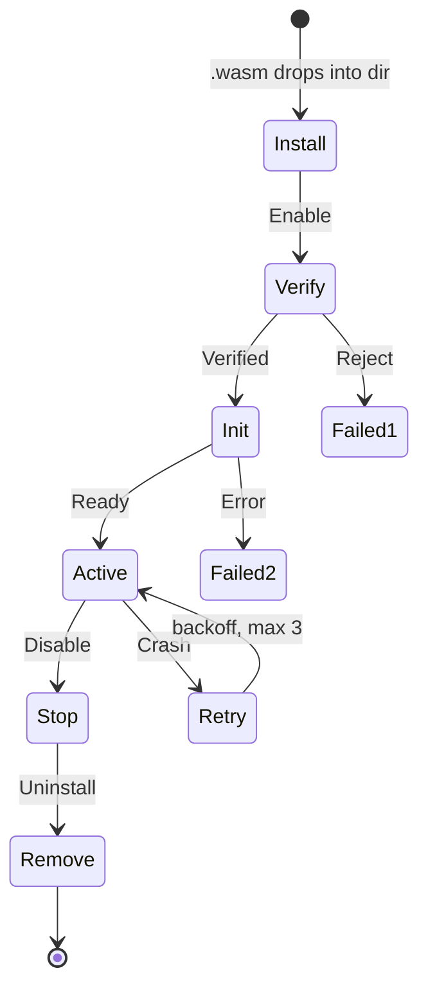
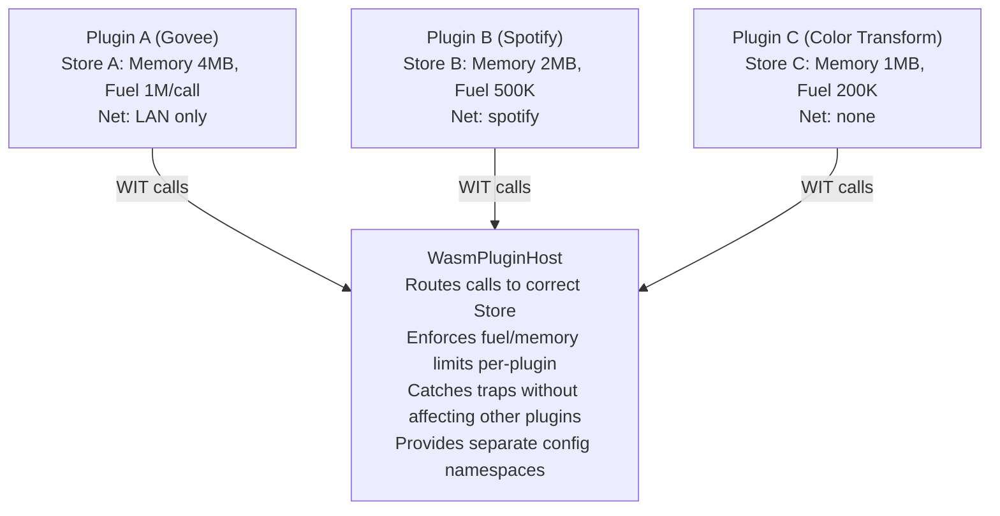
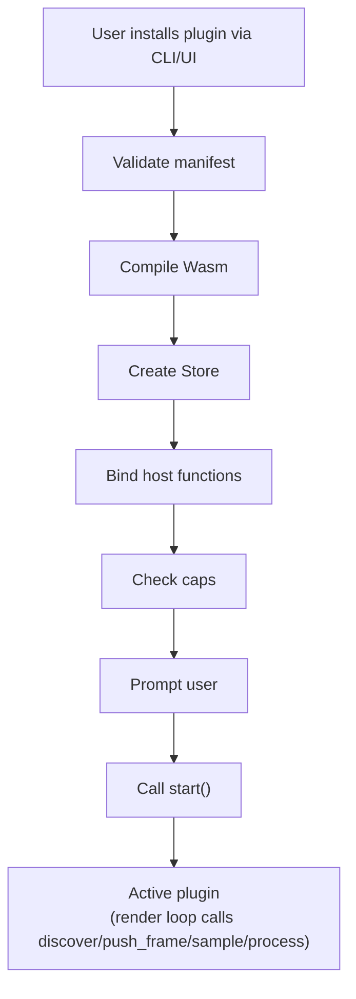

# 09 — Plugin & Extension Ecosystem

> How Hypercolor grows beyond what the core team can build.

---

## Table of Contents

1. [Philosophy](#1-philosophy)
2. [Extension Points](#2-extension-points)
3. [Three-Phase Plugin Architecture](#3-three-phase-plugin-architecture)
4. [WIT Interface Definitions](#4-wit-interface-definitions)
5. [Wasm Plugin Runtime](#5-wasm-plugin-runtime)
6. [gRPC Process Bridge](#6-grpc-process-bridge)
7. [Plugin Development Experience](#7-plugin-development-experience)
8. [Plugin Distribution](#8-plugin-distribution)
9. [Plugin Marketplace UI](#9-plugin-marketplace-ui)
10. [Cross-Language Plugins](#10-cross-language-plugins)
11. [Plugin Security](#11-plugin-security)
12. [First-Party vs. Plugin Boundary](#12-first-party-vs-plugin-boundary)
13. [Persona Scenarios](#13-persona-scenarios)
14. [Ecosystem Growth Strategy](#14-ecosystem-growth-strategy)

---

## 1. Philosophy

Hypercolor's plugin system exists because no core team can support every RGB controller, every data source, every integration, every artistic vision. The ecosystem is the product.

**Three tenets:**

1. **Plugin authors are users too.** The development experience -- from scaffolding to publishing -- should be delightful and well-documented. If writing a plugin is painful, nobody writes plugins.

2. **Progressive complexity.** A simple device backend in Rust behind a feature flag should take an afternoon. A sandboxed Wasm plugin in Go should take a weekend. A gRPC bridge in Python should take an evening. Match the complexity to the author's ambition.

3. **Safety by default.** A community plugin cannot crash the daemon, access the filesystem without permission, or exfiltrate user data. Wasm sandboxing and the permission model are non-negotiable. Trust is earned, not assumed.

**Reference implementations studied:**

| Project | Model | What we take from it |
|---|---|---|
| **Zed** | WIT-based Wasm extensions | WIT interface contracts, capability-based permissions, `extension.toml` manifest |
| **Nushell** | stdio JSON-RPC plugins | Process isolation, language-agnostic, plugin registry with signatures |
| **Bevy** | Compile-time `Plugin` trait + `App::add_plugins()` | Zero-overhead trait-based plugins, builder pattern, feature flags |
| **LightScript engines** | JS device drivers + HTML effects | Separate effect authoring from device communication, meta-tag driven UI |
| **OpenRGB** | Qt C++ plugins (DLL/.so) | Plugin categories (effects, hardware sync, scheduling), SDK bindings |

---

## 2. Extension Points

Not everything should be extensible. These are the surfaces where community contribution delivers the most value, mapped to which plugin mechanism serves each best.

### 2.1 Device Backends

**What:** New hardware protocol implementations -- talking to RGB controllers the core team doesn't own.

**Examples:** Govee WiFi LEDs, Nanoleaf, Corsair iCUE Link (without OpenLinkHub), Razer direct HID, Elgato Light Strip, LIFX, custom Arduino controllers.

**Interface:** `DeviceBackend` trait -- discover devices, connect, push frames, disconnect.

**Best mechanism:** Phase 1 (compile-time) for first-party backends with well-known protocols. Phase 2 (Wasm) for community backends that need network access. Phase 3 (gRPC) for backends requiring native USB HID or GPL-licensed dependencies.

```
Extension surface: Device discovery, connection management, frame pushing
Data flow:        LED colors (Vec<Rgb>) → plugin → hardware
Frequency:        60fps (hot path)
```

### 2.2 Input Sources

**What:** New data inputs that feed the effect engine -- anything that produces time-varying data effects can react to.

**Examples:** Weather API (temperature maps to color temperature), Spotify now-playing (album art palette extraction), stock ticker (price as hue), IoT sensors (temperature, humidity, motion), game state (health bar color), system metrics (CPU/GPU load), MIDI controllers (CC values mapped to effect parameters), heart rate monitors.

**Interface:** `InputSource` trait -- name, sample rate, sample data.

**Best mechanism:** Wasm for network-based sources (weather, Spotify, stocks). Compile-time for system-level sources (audio, screen capture, keyboard). gRPC for sources requiring native libraries.

```
Extension surface: Data sampling and transformation
Data flow:        External world → plugin → InputData → effect engine uniforms
Frequency:        Variable (1Hz for weather, 60Hz for MIDI, 44100Hz for audio)
```

### 2.3 Effect Formats

**What:** New rendering engines beyond the built-in wgpu and Servo paths.

**Examples:** Shadertoy GLSL loader, Processing/p5.js runner, TouchDesigner-style node graphs, Rive animations, Lottie animations, GIF/APNG player, video file player.

**Interface:** `EffectRenderer` trait -- accepts uniforms/inputs, produces a 320x200 RGBA canvas buffer.

**Best mechanism:** Compile-time (these are performance-critical and deeply integrated). A Wasm-based effect renderer would add latency on the hot path -- acceptable for some formats, not others.

```
Extension surface: Frame rendering pipeline
Data flow:        InputData + uniforms → plugin → Canvas (320x200 RGBA)
Frequency:        60fps (hottest path)
Performance:      Must produce a frame in <16ms
```

### 2.4 Integrations

**What:** Bidirectional bridges to external platforms.

**Examples:** Home Assistant (publish device state, subscribe to automations), OBS (scene change triggers effect switch), Discord (rich presence, voice activity as input), Spotify/last.fm (now playing), Twitch (chat events, sub alerts as color bursts), StreamDeck (hardware button triggers).

**Interface:** `Integration` trait -- lifecycle hooks, event subscription, command publishing.

**Best mechanism:** Wasm for pure-network integrations. gRPC for integrations requiring persistent connections or complex state machines. Compile-time for deeply-coupled integrations (Home Assistant is important enough to be first-party).

```
Extension surface: External platform bridging
Data flow:        Bidirectional -- Hypercolor events <→ external platform
Frequency:        Event-driven (not per-frame)
```

### 2.5 Color Processing

**What:** Custom color transforms in the pipeline between spatial sampling and device output.

**Examples:** Palette generators (extract palette from images, create harmonious schemes), color correction (per-device gamma curves, white balance), color space transforms (perceptual uniformity via Oklab), accessibility filters (deuteranopia simulation), dithering algorithms, brightness limiters (power budget enforcement for WS2812).

**Interface:** `ColorTransform` trait -- accepts `&[Rgb]`, returns `Vec<Rgb>`. Chainable.

**Best mechanism:** Wasm (color math is pure computation, perfect for sandboxing). Compile-time for performance-critical transforms in the hot path.

```
Extension surface: Post-sampling color pipeline
Data flow:        Vec<Rgb> → transform chain → Vec<Rgb>
Frequency:        60fps, per-device
Performance:      Must process N LEDs in <2ms
```

### 2.6 UI Panels

**What:** Custom web UI components that extend the SvelteKit frontend.

**Examples:** Custom device configuration panels (Govee-specific settings), visualization widgets (3D room view), analytics dashboards (frame timing, power consumption), effect authoring tools (node-based shader editor).

**Interface:** Web Components standard (custom elements). Plugins register panels via manifest. The SvelteKit shell renders them in designated slots.

**Best mechanism:** Not Wasm -- these are standard web components loaded into the SvelteKit frontend. Distributed as ES modules alongside the plugin package.

```
Extension surface: Web UI shell
Data flow:        WebSocket state → component → user interaction → REST API
Frequency:        UI frame rate, event-driven
```

### Extension Point Summary

| Extension Point | Hot Path? | Phase 1 (Trait) | Phase 2 (Wasm) | Phase 3 (gRPC) | UI Panel |
|---|---|---|---|---|---|
| Device backends | Yes (60fps) | First-party | Community | GPL/native USB | Config panel |
| Input sources | Varies | System-level | Network-based | Native libs | Status widget |
| Effect formats | Yes (60fps) | Core renderers | Lightweight only | Not recommended | N/A |
| Integrations | No (events) | HA, D-Bus | Network APIs | Complex state | Settings panel |
| Color processing | Yes (60fps) | Core transforms | Pure math | Not recommended | N/A |
| UI panels | No | N/A | N/A | N/A | Web Components |

---

## 3. Three-Phase Plugin Architecture

The plugin system evolves in three phases, each building on the last. This is not a rewrite -- each phase adds a new capability while the previous mechanisms remain available.

### Phase 1: Compile-Time Trait Objects (Ship First)

**When:** Day one. This is how Hypercolor ships.

**Model:** Bevy-style `Plugin` trait. All backends are compiled into the binary, gated by Cargo feature flags. Zero runtime overhead, full type safety, access to all Rust APIs.

```rust
/// The plugin registration trait. Every extension point starts here.
pub trait HypercolorPlugin: Send + Sync + 'static {
    /// Human-readable plugin name
    fn name(&self) -> &str;

    /// Register this plugin's capabilities with the engine
    fn build(&self, app: &mut HypercolorApp);

    /// Called after all plugins are registered, before the render loop starts
    fn ready(&self, _app: &HypercolorApp) -> Result<()> { Ok(()) }

    /// Cleanup on shutdown
    fn cleanup(&mut self) {}
}

/// The application builder that plugins register into
pub struct HypercolorApp {
    backends: Vec<Box<dyn DeviceBackend>>,
    input_sources: Vec<Box<dyn InputSource>>,
    integrations: Vec<Box<dyn Integration>>,
    color_transforms: Vec<Box<dyn ColorTransform>>,
    event_handlers: Vec<Box<dyn EventHandler>>,
}

impl HypercolorApp {
    pub fn add_backend<B: DeviceBackend + 'static>(&mut self, backend: B) -> &mut Self {
        self.backends.push(Box::new(backend));
        self
    }

    pub fn add_input_source<I: InputSource + 'static>(&mut self, source: I) -> &mut Self {
        self.input_sources.push(Box::new(source));
        self
    }

    pub fn add_integration<G: Integration + 'static>(&mut self, integration: G) -> &mut Self {
        self.integrations.push(Box::new(integration));
        self
    }

    pub fn add_color_transform<C: ColorTransform + 'static>(&mut self, transform: C) -> &mut Self {
        self.color_transforms.push(Box::new(transform));
        self
    }
}
```

**Registration in the daemon:**

```rust
// hypercolor-daemon/src/main.rs
fn main() {
    let mut app = HypercolorApp::new();

    // First-party plugins, feature-gated
    #[cfg(feature = "wled")]
    app.add_plugin(WledPlugin::default());

    #[cfg(feature = "hid")]
    app.add_plugin(HidPlugin::default());

    #[cfg(feature = "hue")]
    app.add_plugin(HuePlugin::default());

    // Phase 2: Load Wasm plugins from disk
    #[cfg(feature = "wasm-plugins")]
    app.add_plugin(WasmPluginHost::new("~/.config/hypercolor/plugins/"));

    // Phase 3: Connect gRPC bridges
    #[cfg(feature = "grpc-bridge")]
    app.add_plugin(GrpcBridgePlugin::new());

    // Always available
    app.add_plugin(AudioInputPlugin::default());
    app.add_plugin(ScreenCapturePlugin::default());

    app.run().await;
}
```

**Feature flag matrix:**

```toml
[features]
default = ["wled", "hid", "audio", "screen-capture"]

# Device backends
wled = ["dep:ddp-rs"]
hid = ["dep:hidapi"]
hue = ["dep:reqwest"]
openrgb = ["grpc-bridge"]           # Always via bridge (GPL isolation)

# Input sources
audio = ["dep:cpal", "dep:spectrum-analyzer"]
screen-capture = ["dep:xcap"]
midi = ["dep:midir"]

# Plugin runtime
wasm-plugins = ["dep:wasmtime", "dep:wasmtime-wasi"]
grpc-bridge = ["dep:tonic"]

# Effect engines
servo = ["dep:libservo"]            # HTML/Canvas compatibility path
```

**Why Phase 1 works for launch:** No runtime complexity. No IPC overhead on the hot path. A contributor adds a new backend by implementing `DeviceBackend`, adding a feature flag, and opening a PR. The maintainer reviews Rust code they can fully audit. This is how most Rust projects handle extensibility (wgpu adapters, Bevy plugins, Axum extractors).

### Phase 2: Wasm Extensions (Community Plugins)

**When:** When the first external contributor wants to write a plugin without forking the repo.

**Model:** Wasmtime runtime with WIT (WebAssembly Interface Types) contracts. Plugins compile to `wasm32-wasip2` and run sandboxed inside the daemon process. The host grants capabilities (network, timers) through WIT interfaces. Inspired by Zed's extension model.

```
hypercolor-daemon
├── WasmPluginHost
│   ├── wasmtime::Engine (shared, singleton)
│   ├── wasmtime::Linker (per-plugin, binds host functions)
│   └── plugins/
│       ├── govee-wifi/
│       │   ├── plugin.toml          # Manifest
│       │   ├── govee_wifi.wasm      # Compiled plugin
│       │   └── ui/                  # Optional web component panel
│       │       └── settings.js
│       └── spotify-input/
│           ├── plugin.toml
│           └── spotify_input.wasm
```

**Plugin manifest (`plugin.toml`):**

```toml
[plugin]
id = "govee-wifi"
name = "Govee WiFi LED Backend"
version = "0.2.1"
description = "Control Govee WiFi LED strips and bulbs via their LAN API"
author = "kai"
license = "MIT"
homepage = "https://github.com/kai/hypercolor-govee"
min_hypercolor = "0.3.0"

[capabilities]
type = "device-backend"              # Extension point
network = true                       # Needs UDP/TCP for Govee LAN API
filesystem = false
usb = false

[capabilities.network]
allowed_hosts = ["*.local", "10.*", "192.168.*"]  # LAN only
allowed_ports = [4003]               # Govee LAN API port

[ui]
settings_panel = "ui/settings.js"    # Optional web component
```

**Performance budget:** Wasm plugins on the hot path (device backends, color transforms) must meet frame timing requirements. The host enforces a per-frame execution budget:

| Extension Point | Budget per call | Enforcement |
|---|---|---|
| Device backend `push_frame` | 8ms | Fuel-based timeout, skip frame on overrun |
| Color transform `process` | 2ms | Fuel-based timeout, passthrough on overrun |
| Input source `sample` | 4ms | Fuel-based timeout, reuse last value |
| Integration event handler | 50ms | Fuel-based timeout, log warning |

### Phase 3: gRPC Process Bridge (Out-of-Process Plugins)

**When:** Needed from Phase 1 for OpenRGB (GPL isolation). Becomes the "write in any language" escape hatch.

**Model:** Plugins run as separate processes, communicating with the daemon over Unix domain sockets using gRPC (tonic on the Rust side). The same WIT-derived interfaces, but serialized over protobuf instead of Wasm memory.



**When to use gRPC over Wasm:**

| Criterion | Use Wasm | Use gRPC |
|---|---|---|
| License contamination (GPL) | -- | Yes |
| Needs raw USB/HID access | -- | Yes |
| Needs persistent connections | Possible (WASI sockets) | Easier |
| Language has no Wasm target | -- | Yes |
| Performance-critical (60fps) | Preferred (in-process) | Viable (adds ~1ms IPC) |
| Plugin author's preference | Rust, Go, C | Python, Ruby, Node.js |

**gRPC service definition:**

```protobuf
syntax = "proto3";
package hypercolor.plugin.v1;

service DeviceBackendPlugin {
    rpc GetInfo(Empty) returns (PluginInfo);
    rpc Discover(DiscoverRequest) returns (stream DeviceInfo);
    rpc Connect(ConnectRequest) returns (ConnectResponse);
    rpc PushFrame(PushFrameRequest) returns (PushFrameResponse);
    rpc Disconnect(DisconnectRequest) returns (Empty);
    rpc Shutdown(Empty) returns (Empty);
}

service InputSourcePlugin {
    rpc GetInfo(Empty) returns (PluginInfo);
    rpc Sample(SampleRequest) returns (SampleResponse);
    rpc GetSampleRate(Empty) returns (SampleRateResponse);
}

message PushFrameRequest {
    string device_id = 1;
    bytes rgb_data = 2;           // Packed RGB bytes, 3 per LED
    uint32 led_count = 3;
}

message PluginInfo {
    string id = 1;
    string name = 2;
    string version = 3;
    string description = 4;
    repeated string capabilities = 5;
}
```

**Bridge lifecycle:** The daemon spawns bridge processes on startup (configured in `~/.config/hypercolor/config.toml`), monitors them via health checks, and restarts them on crash with exponential backoff.

```toml
# ~/.config/hypercolor/config.toml

[[bridge]]
id = "openrgb"
command = "hypercolor-openrgb-bridge"
socket = "/run/hypercolor/openrgb.sock"
restart_policy = "always"
restart_delay_ms = 1000
max_restarts = 5

[[bridge]]
id = "nanoleaf-go"
command = "/opt/hypercolor/plugins/nanoleaf-plugin"
socket = "/run/hypercolor/nanoleaf.sock"
restart_policy = "on-failure"
```

---

## 4. WIT Interface Definitions

WIT (WebAssembly Interface Types) defines the contract between the host and Wasm plugins. These same interfaces inform the gRPC protobuf definitions -- one source of truth, two transport mechanisms.

### 4.1 Core Types

```wit
package hypercolor:plugin@0.1.0;

/// Shared types used across all extension points
interface types {
    /// RGB color value
    record rgb {
        r: u8,
        g: u8,
        b: u8,
    }

    /// Device information returned by discovery
    record device-info {
        id: string,
        name: string,
        manufacturer: string,
        led-count: u32,
        zones: list<zone-info>,
    }

    /// Zone within a device
    record zone-info {
        name: string,
        led-count: u32,
        topology: zone-topology,
    }

    /// Physical LED arrangement
    enum zone-topology {
        strip,
        matrix,
        ring,
        custom,
    }

    /// Input data sample
    record input-sample {
        /// Timestamp in microseconds since plugin start
        timestamp-us: u64,
        /// Named float values (e.g., "temperature" = 22.5)
        float-values: list<tuple<string, f64>>,
        /// Named string values (e.g., "track_name" = "...")
        string-values: list<tuple<string, string>>,
        /// Named color values (e.g., "dominant_color" = rgb)
        color-values: list<tuple<string, rgb>>,
        /// Raw frequency spectrum (for audio-like sources)
        spectrum: list<f32>,
    }

    /// Plugin health status
    enum health-status {
        healthy,
        degraded,
        unhealthy,
    }

    /// Plugin error with context
    record plugin-error {
        code: string,
        message: string,
        recoverable: bool,
    }

    /// Control definition for plugin settings
    record control-definition {
        id: string,
        label: string,
        control-type: control-type,
        default-value: string,
        tooltip: option<string>,
    }

    /// Types of user-facing controls
    variant control-type {
        number(number-range),
        boolean,
        text,
        color,
        select(list<string>),
    }

    record number-range {
        min: f64,
        max: f64,
        step: option<f64>,
    }
}
```

### 4.2 Device Backend Interface

```wit
interface device-backend {
    use types.{rgb, device-info, plugin-error, health-status, control-definition};

    /// Return metadata about this backend
    get-info: func() -> backend-info;

    /// Discover available devices on the network/bus
    discover: func() -> result<list<device-info>, plugin-error>;

    /// Connect to a specific device
    connect: func(device-id: string) -> result<_, plugin-error>;

    /// Push a frame of LED colors to a connected device
    /// colors: flat list of RGB values, 3 bytes per LED
    push-frame: func(device-id: string, colors: list<rgb>) -> result<_, plugin-error>;

    /// Disconnect from a device gracefully
    disconnect: func(device-id: string) -> result<_, plugin-error>;

    /// Health check for monitoring
    health: func() -> health-status;

    /// Plugin-specific settings schema
    get-settings: func() -> list<control-definition>;

    /// Apply a settings change
    set-setting: func(key: string, value: string) -> result<_, plugin-error>;

    record backend-info {
        id: string,
        name: string,
        version: string,
        description: string,
        author: string,
        /// Transport hint for the host (network, usb, serial, bluetooth)
        transport: string,
    }
}
```

### 4.3 Input Source Interface

```wit
interface input-source {
    use types.{input-sample, plugin-error, health-status, control-definition};

    /// Return metadata about this input source
    get-info: func() -> source-info;

    /// Initialize the input source (called once on enable)
    start: func() -> result<_, plugin-error>;

    /// Sample the current value
    sample: func() -> result<input-sample, plugin-error>;

    /// Target sample rate in Hz
    sample-rate-hz: func() -> f64;

    /// Cleanup
    stop: func() -> result<_, plugin-error>;

    /// Health check
    health: func() -> health-status;

    /// Settings
    get-settings: func() -> list<control-definition>;
    set-setting: func(key: string, value: string) -> result<_, plugin-error>;

    record source-info {
        id: string,
        name: string,
        version: string,
        description: string,
        author: string,
        /// Names and descriptions of the values this source produces
        output-schema: list<output-field>,
    }

    record output-field {
        name: string,
        description: string,
        field-type: field-type,
    }

    enum field-type {
        float-value,
        string-value,
        color-value,
        spectrum,
    }
}
```

### 4.4 Color Transform Interface

```wit
interface color-transform {
    use types.{rgb, plugin-error, control-definition};

    /// Transform a batch of LED colors
    /// Called once per device per frame -- must be fast
    process: func(colors: list<rgb>) -> list<rgb>;

    /// Metadata
    get-info: func() -> transform-info;

    /// Settings
    get-settings: func() -> list<control-definition>;
    set-setting: func(key: string, value: string) -> result<_, plugin-error>;

    record transform-info {
        id: string,
        name: string,
        version: string,
        description: string,
        /// Where in the pipeline this transform should run
        stage: transform-stage,
    }

    enum transform-stage {
        /// After spatial sampling, before device-specific correction
        post-sample,
        /// After device correction, just before output
        pre-output,
    }
}
```

### 4.5 Integration Interface

```wit
interface integration {
    use types.{plugin-error, health-status, control-definition};

    /// Initialize the integration
    start: func() -> result<_, plugin-error>;

    /// Called when Hypercolor events occur
    on-event: func(event: hypercolor-event) -> result<_, plugin-error>;

    /// Poll for commands from the external platform
    poll-commands: func() -> list<integration-command>;

    /// Stop the integration
    stop: func() -> result<_, plugin-error>;

    /// Health check
    health: func() -> health-status;

    /// Settings
    get-settings: func() -> list<control-definition>;
    set-setting: func(key: string, value: string) -> result<_, plugin-error>;

    /// Events from Hypercolor that the integration may react to
    variant hypercolor-event {
        effect-changed(string),
        profile-loaded(string),
        device-connected(string),
        device-disconnected(string),
        frame-stats(frame-stats),
    }

    record frame-stats {
        fps: f32,
        frame-time-ms: f32,
        active-devices: u32,
        total-leds: u32,
    }

    /// Commands from the external platform to Hypercolor
    variant integration-command {
        set-effect(string),
        set-profile(string),
        set-brightness(f32),
        set-control(set-control-cmd),
        trigger-scene(string),
    }

    record set-control-cmd {
        control-id: string,
        value: string,
    }
}
```

### 4.6 Host Capabilities (What the Host Provides to Plugins)

```wit
/// Capabilities granted to plugins by the host
interface host {
    /// Logging (always available)
    log: func(level: log-level, message: string);

    /// Get a configuration value (scoped to this plugin's namespace)
    get-config: func(key: string) -> option<string>;

    /// Set a configuration value (persisted across restarts)
    set-config: func(key: string, value: string);

    /// Emit an event to the Hypercolor event bus
    emit-event: func(event-type: string, payload: string);

    enum log-level {
        trace,
        debug,
        info,
        warn,
        error,
    }
}

/// Network capability (granted per plugin.toml)
interface network {
    /// HTTP GET request
    http-get: func(url: string, headers: list<tuple<string, string>>)
        -> result<http-response, string>;

    /// HTTP POST request
    http-post: func(url: string, headers: list<tuple<string, string>>, body: list<u8>)
        -> result<http-response, string>;

    /// Send UDP datagram
    udp-send: func(host: string, port: u16, data: list<u8>) -> result<_, string>;

    /// Receive UDP datagram (with timeout)
    udp-recv: func(port: u16, timeout-ms: u32) -> result<list<u8>, string>;

    /// mDNS service discovery
    mdns-discover: func(service-type: string, timeout-ms: u32) -> list<mdns-service>;

    record http-response {
        status: u16,
        headers: list<tuple<string, string>>,
        body: list<u8>,
    }

    record mdns-service {
        name: string,
        host: string,
        port: u16,
        properties: list<tuple<string, string>>,
    }
}

/// Timer capability (always available)
interface timer {
    /// Get monotonic time in milliseconds since plugin start
    now-ms: func() -> u64;

    /// Sleep for a duration (cooperative, yields to host)
    sleep-ms: func(ms: u32);
}
```

---

## 5. Wasm Plugin Runtime

### 5.1 Architecture

The `WasmPluginHost` manages all Wasm plugins within the daemon process. One `wasmtime::Engine` (with shared compilation cache) serves all plugins. Each plugin gets its own `wasmtime::Store` with isolated memory and fuel metering.

```rust
pub struct WasmPluginHost {
    engine: wasmtime::Engine,
    plugins: HashMap<String, LoadedWasmPlugin>,
    plugin_dir: PathBuf,
    watcher: notify::RecommendedWatcher,  // Hot-reload on file change
}

struct LoadedWasmPlugin {
    id: String,
    manifest: PluginManifest,
    store: wasmtime::Store<PluginState>,
    instance: wasmtime::Instance,
    status: PluginStatus,
    metrics: PluginMetrics,
}

struct PluginState {
    /// Granted capabilities
    capabilities: CapabilitySet,
    /// Plugin-scoped configuration store
    config: HashMap<String, String>,
    /// Fuel budget for execution limiting
    fuel_budget: u64,
    /// Log buffer (flushed to tracing)
    log_buffer: Vec<LogEntry>,
}

struct PluginMetrics {
    total_calls: u64,
    total_errors: u64,
    avg_execution_us: f64,
    peak_execution_us: u64,
    memory_bytes: usize,
    last_health_check: Instant,
    last_health_status: HealthStatus,
}
```

### 5.2 Plugin Lifecycle



**States:**

| State | Description |
|---|---|
| `Installed` | Files present in plugin directory, not yet loaded |
| `Verified` | Manifest parsed, signature checked (if signed), capabilities validated |
| `Initializing` | Wasm module compiled, instance created, `start()` called |
| `Active` | Plugin is running and responding to calls |
| `Degraded` | Plugin returned errors or timed out, operating with reduced trust |
| `Disabled` | User manually disabled, or too many failures |
| `Error` | Unrecoverable error, requires user intervention |

**Lifecycle hooks:**

```
install  → Validate manifest, check min_hypercolor version, verify signature
enable   → Compile Wasm module, create Store with capabilities, call start()
update   → Graceful stop of old version → install new version → enable
disable  → Call stop(), release Store and Instance, keep files
uninstall→ disable → remove files from plugin directory
```

### 5.3 Resource Limits

```rust
/// Per-plugin resource configuration
pub struct PluginLimits {
    /// Maximum Wasm linear memory (default: 64MB)
    pub max_memory_bytes: usize,

    /// Fuel per call (maps roughly to instruction count)
    /// Default: 1_000_000 (~1ms of computation)
    pub fuel_per_call: u64,

    /// Maximum wall-clock time per call (enforced via async timeout)
    pub max_call_duration: Duration,

    /// Maximum number of pending network requests
    pub max_concurrent_requests: usize,

    /// Maximum response body size for HTTP requests
    pub max_response_bytes: usize,

    /// Rate limit: maximum calls per second
    pub max_calls_per_second: u32,
}

impl Default for PluginLimits {
    fn default() -> Self {
        Self {
            max_memory_bytes: 64 * 1024 * 1024,   // 64 MB
            fuel_per_call: 1_000_000,
            max_call_duration: Duration::from_millis(16),
            max_concurrent_requests: 4,
            max_response_bytes: 10 * 1024 * 1024,  // 10 MB
            max_calls_per_second: 120,              // 2x frame rate
        }
    }
}
```

### 5.4 Error Handling & Graceful Degradation

A plugin crash must never take down the daemon or affect other plugins.

**Error escalation ladder:**

1. **Single call failure:** Log warning, use fallback (skip frame, reuse last value, passthrough colors). Plugin stays `Active`.
2. **Repeated failures (>5 in 10s):** Plugin enters `Degraded` state. Reduce call frequency. Emit `PluginDegraded` event (UI shows warning).
3. **Wasm trap / OOM / fuel exhaustion:** Plugin enters `Error` state. Attempt restart with backoff (1s, 2s, 4s). Emit `PluginError` event.
4. **3 failed restarts:** Plugin enters `Disabled` state. User notified. Manual re-enable required.
5. **Host-side panic (should never happen):** `catch_unwind` around all Wasm calls. Log critical error, disable plugin.

**Fallback behaviors by extension point:**

| Extension Point | On Plugin Failure |
|---|---|
| Device backend | Device shows as disconnected, LEDs hold last color |
| Input source | Effect receives zero/default values, continues running |
| Color transform | Passthrough (colors unchanged) |
| Integration | External platform loses sync, reconnects when plugin recovers |

---

## 6. gRPC Process Bridge

### 6.1 Architecture

```
hypercolor-daemon
│
├── BridgeManager
│   ├── Spawns bridge processes based on config
│   ├── Monitors health via gRPC Health service
│   ├── Restarts on crash with exponential backoff
│   └── Bridges appear as DeviceBackend / InputSource to the core
│
├── gRPC Client (tonic) ──unix:///run/hypercolor/openrgb.sock──▶ OpenRGB Bridge
├── gRPC Client (tonic) ──unix:///run/hypercolor/nanoleaf.sock──▶ Nanoleaf Plugin
└── gRPC Client (tonic) ──unix:///run/hypercolor/ha.sock──▶ HA Integration
```

### 6.2 Bridge Process SDK

For plugin authors building gRPC bridges, we provide lightweight SDKs:

**Rust (`hypercolor-bridge-sdk`):**
```rust
use hypercolor_bridge_sdk::prelude::*;

#[derive(Default)]
struct NanoleafBackend {
    panels: Vec<NanoleafPanel>,
}

#[async_trait]
impl DeviceBackendService for NanoleafBackend {
    async fn discover(&self, _req: Request<DiscoverRequest>) -> Result<Response<...>> {
        let panels = nanoleaf::discover_mdns().await?;
        // ...
    }

    async fn push_frame(&self, req: Request<PushFrameRequest>) -> Result<Response<...>> {
        let panel = self.find_panel(&req.get_ref().device_id)?;
        panel.set_colors(&req.get_ref().rgb_data).await?;
        Ok(Response::new(PushFrameResponse::default()))
    }
}

#[tokio::main]
async fn main() {
    hypercolor_bridge_sdk::serve(NanoleafBackend::default()).await;
}
```

**Python (`hypercolor-bridge-python`):**
```python
from hypercolor_bridge import DeviceBackendService, serve

class GoveeBackend(DeviceBackendService):
    async def discover(self, request):
        devices = await govee_lan.discover()
        return [DeviceInfo(id=d.ip, name=d.name, led_count=d.led_count) for d in devices]

    async def push_frame(self, request):
        device = self.devices[request.device_id]
        await device.set_colors(request.rgb_data)

if __name__ == "__main__":
    serve(GoveeBackend())
```

**Go (`hypercolor-bridge-go`):**
```go
package main

import "github.com/hyperbliss/hypercolor-bridge-go/sdk"

type NanoleafBackend struct {
    sdk.UnimplementedDeviceBackendServer
}

func (b *NanoleafBackend) Discover(ctx context.Context, req *pb.DiscoverRequest) (*pb.DiscoverResponse, error) {
    // ...
}

func main() {
    sdk.Serve(&NanoleafBackend{})
}
```

### 6.3 Frame Batching for gRPC Backends

The gRPC IPC overhead (~0.5-1ms per call) matters at 60fps. For device backends, the host uses frame batching:

```
Instead of:  push_frame(device_a) → push_frame(device_b) → push_frame(device_c)
             0.5ms + 0.5ms + 0.5ms = 1.5ms

We send:     push_frame_batch([device_a, device_b, device_c])
             0.5ms total (one round-trip)
```

The gRPC service includes a `PushFrameBatch` RPC for this case. Single-device plugins can ignore it and just implement `PushFrame`.

---

## 7. Plugin Development Experience

### 7.1 CLI Scaffolding

```bash
# Scaffold a new Wasm device backend plugin (Rust)
$ hypercolor plugin new my-govee-backend --type device-backend --lang rust
  Creating plugin: my-govee-backend
  Type: device-backend (Wasm)
  Language: Rust

  Created:
    my-govee-backend/
    ├── Cargo.toml              # wasm32-wasip2 target, hypercolor-plugin-sdk dep
    ├── plugin.toml             # Plugin manifest
    ├── src/
    │   └── lib.rs              # DeviceBackend impl with TODOs
    ├── tests/
    │   └── integration.rs      # Test harness with device simulator
    └── README.md

  Next steps:
    cd my-govee-backend
    cargo build --target wasm32-wasip2
    hypercolor plugin install ./target/wasm32-wasip2/release/my_govee_backend.wasm

# Scaffold a gRPC bridge (Python)
$ hypercolor plugin new ha-integration --type integration --lang python --bridge
  Creating plugin: ha-integration
  Type: integration (gRPC bridge)
  Language: Python

  Created:
    ha-integration/
    ├── pyproject.toml           # uv project with hypercolor-bridge-python dep
    ├── plugin.toml
    ├── src/
    │   └── ha_integration/
    │       ├── __init__.py
    │       └── main.py          # Integration service impl
    └── tests/
        └── test_integration.py

# Scaffold an input source (Go, Wasm)
$ hypercolor plugin new midi-input --type input-source --lang go
```

**Supported scaffolding targets:**

| Language | Wasm Plugin | gRPC Bridge | Notes |
|---|---|---|---|
| Rust | Yes | Yes | First-class support, same SDK as core |
| Go | Yes (TinyGo) | Yes | TinyGo for Wasm, standard Go for gRPC |
| Python | No | Yes | gRPC only (no Wasm target) |
| C/C++ | Yes | Yes | Wasm via wasi-sdk |
| AssemblyScript | Yes | No | TypeScript-like, good for color transforms |
| JavaScript/TS | No | Yes (via Node.js) | gRPC bridge with @grpc/grpc-js |

### 7.2 Development Server

The `hypercolor dev` command runs a development server with live reload, eliminating the compile-install-restart cycle.

```bash
$ cd my-govee-backend
$ hypercolor dev
  Plugin: my-govee-backend v0.1.0 (device-backend)
  Mode: development (hot-reload enabled)
  Watching: src/**/*.rs, plugin.toml
  Dashboard: http://localhost:9421/dev/my-govee-backend

  [14:32:01] Compiled my_govee_backend.wasm (342 KB, 1.2s)
  [14:32:01] Loaded into daemon (replacing previous version)
  [14:32:01] Discover found 2 devices: "Govee Strip A", "Govee Bulb B"
  [14:32:02] push_frame: 150 LEDs, 0.3ms

  [14:32:45] Source changed: src/lib.rs
  [14:32:46] Recompiled (0.8s), hot-swapped
  [14:32:46] Discover found 2 devices (unchanged)
```

**Development dashboard** (`http://localhost:9421/dev/<plugin-id>`):
- Live call log (every `discover`, `push_frame`, `sample` call with timing)
- Plugin memory usage graph
- Error log with stack traces (via DWARF debug info in Wasm)
- Settings panel (test your plugin's controls)
- Device simulator controls (if using the simulator)

### 7.3 Device Simulator

Plugin authors don't need physical hardware. The simulator provides virtual devices that the plugin can discover and push frames to, with visual feedback in the web UI.

```bash
$ hypercolor dev --simulate "strip:60" --simulate "matrix:16x16" --simulate "ring:24"
  Simulated devices:
    sim-strip-1:  60 LED strip    → http://localhost:9421/sim/sim-strip-1
    sim-matrix-1: 16x16 LED matrix → http://localhost:9421/sim/sim-matrix-1
    sim-ring-1:   24 LED ring     → http://localhost:9421/sim/sim-ring-1
```

The simulator web UI renders the virtual LEDs in real-time (WebSocket frame streaming, same as the main preview). Plugin authors see their color output without any hardware.

**For device backend plugins**, the simulator also provides a mock hardware endpoint:

```bash
$ hypercolor dev --mock-hardware govee
  Mock Govee LAN API running at 10.255.0.1:4003
  Responds to discovery broadcasts and color commands
  Renders received colors in simulator UI
```

### 7.4 Testing Framework

```rust
// tests/integration.rs
use hypercolor_plugin_test::prelude::*;

#[tokio::test]
async fn test_discover_finds_devices() {
    let harness = TestHarness::new("my-govee-backend")
        .with_mock_network(mock_govee_discovery_response())
        .build()
        .await;

    let devices = harness.call_discover().await.unwrap();
    assert_eq!(devices.len(), 2);
    assert_eq!(devices[0].name, "Govee Strip H6159");
    assert_eq!(devices[0].led_count, 60);
}

#[tokio::test]
async fn test_push_frame_performance() {
    let harness = TestHarness::new("my-govee-backend")
        .with_connected_device("10.0.0.5", 60)
        .build()
        .await;

    let colors: Vec<Rgb> = (0..60).map(|i| Rgb { r: i as u8 * 4, g: 0, b: 255 }).collect();

    let timing = harness.bench_push_frame("10.0.0.5", &colors, 1000).await;
    assert!(timing.p99 < Duration::from_millis(8), "p99 exceeds frame budget");
}

#[tokio::test]
async fn test_graceful_disconnect() {
    let harness = TestHarness::new("my-govee-backend")
        .with_connected_device("10.0.0.5", 60)
        .build()
        .await;

    // Simulate network drop
    harness.network().drop_connection("10.0.0.5").await;

    let result = harness.call_push_frame("10.0.0.5", &colors).await;
    assert!(result.is_err());
    assert!(result.unwrap_err().recoverable);
}
```

### 7.5 Documentation

**Plugin author documentation** lives at `docs.hypercolor.dev/plugins/` and covers:

| Section | Contents |
|---|---|
| **Getting Started** | 15-minute tutorial: scaffold, implement, test, install |
| **API Reference** | Auto-generated from WIT definitions with examples for each function |
| **Cookbook** | Common patterns: mDNS discovery, chunked USB writes, rate limiting, error recovery |
| **Architecture Guide** | How the host calls your plugin, threading model, memory layout |
| **Examples** | Annotated source of every first-party plugin |
| **Migration Guide** | Porting JS device plugins to Hypercolor |
| **Troubleshooting** | Common Wasm build issues, debugging with DWARF, profiling |

### 7.6 Example Plugins

Every first-party plugin is also a learning resource. They live in the main repo under `crates/plugins/` with extensive doc comments:

```
crates/plugins/
├── hypercolor-wled/          # WLED DDP backend (compile-time, ~300 LOC)
├── hypercolor-hid/           # USB HID backend (compile-time, ~500 LOC)
├── hypercolor-hue/           # Philips Hue backend (compile-time, ~400 LOC)
├── hypercolor-audio/         # Audio FFT input source (compile-time, ~600 LOC)
├── hypercolor-screen/        # Screen capture input (compile-time, ~400 LOC)
├── hypercolor-openrgb-bridge/ # OpenRGB gRPC bridge (GPL-2.0, ~350 LOC)
└── examples/
    ├── example-wasm-backend/   # Minimal Wasm device backend (~100 LOC)
    ├── example-wasm-input/     # Weather API input source (~80 LOC)
    ├── example-wasm-transform/ # Gamma correction color transform (~40 LOC)
    └── example-grpc-python/    # Python gRPC bridge template (~60 LOC)
```

---

## 8. Plugin Distribution

### 8.1 Distribution Channels (Progressive)

Plugins can be installed from three sources, each with different trust levels:

#### Local Install (Day One)

Drop a `.wasm` file and `plugin.toml` into `~/.config/hypercolor/plugins/<plugin-id>/`. The daemon discovers it on next start (or immediately via file watcher).

```bash
# Manual install
$ cp my_plugin.wasm plugin.toml ~/.config/hypercolor/plugins/my-plugin/

# CLI install from local build
$ hypercolor plugin install ./target/wasm32-wasip2/release/my_plugin.wasm

# CLI install from a directory
$ hypercolor plugin install ./my-plugin/
```

**Trust level:** Untrusted. User is explicitly opting in by placing files. Capabilities from `plugin.toml` are shown for confirmation on first enable.

#### Git Install (Phase 2)

Point the CLI at a Git repository. Hypercolor clones, verifies the manifest, and installs.

```bash
$ hypercolor plugin install --git https://github.com/kai/hypercolor-govee
  Cloning kai/hypercolor-govee...
  Found: plugin.toml (device-backend, v0.2.1)
  Found: prebuilt wasm at releases/govee_wifi.wasm (verified sha256)
  Capabilities requested: network (*.local:4003)

  Install this plugin? [y/N] y
  Installed: govee-wifi v0.2.1

$ hypercolor plugin install --git https://github.com/kai/hypercolor-govee --rev v0.3.0
```

**Trust level:** Semi-trusted. User chose the source. Signature verification if the author signs releases.

#### Registry (Phase 3)

A central registry at `registry.hypercolor.dev` -- inspired by crates.io but much simpler.

```bash
$ hypercolor plugin search govee
  govee-wifi       v0.2.1  Device backend for Govee WiFi LEDs    by kai       downloads: 1,247
  govee-bluetooth  v0.1.0  Govee BLE backend (requires bridge)   by sam       downloads: 342

$ hypercolor plugin install govee-wifi
  Downloading govee-wifi v0.2.1 from registry.hypercolor.dev...
  Signature: verified (signed by kai, key fingerprint: A3F2...9B1C)
  Capabilities requested: network (*.local:4003)

  Install this plugin? [y/N] y
  Installed: govee-wifi v0.2.1
```

**Trust level:** Highest for signed plugins from known authors. Registry performs basic automated checks (malware scan, manifest validation, Wasm module validation).

### 8.2 Versioning

Plugins follow SemVer. The `min_hypercolor` field in `plugin.toml` declares the minimum daemon version required.

**WIT interface versioning:** The WIT package version (`hypercolor:plugin@0.1.0`) is the plugin API version. Breaking changes increment the major version. The host supports loading plugins compiled against older WIT versions through compatibility shims.

```
hypercolor:plugin@0.1.0  →  Supported from Hypercolor 0.1.0
hypercolor:plugin@0.2.0  →  New fields added, backward compatible
hypercolor:plugin@1.0.0  →  Breaking change, old plugins still loaded via shim
```

### 8.3 Dependency Management

Plugins do not depend on each other. There is no inter-plugin dependency graph -- each plugin is self-contained. This is a deliberate constraint to avoid the npm-style dependency hell.

If a plugin needs a shared library (e.g., a color math crate), it compiles it into its own Wasm module. The tradeoff is slightly larger `.wasm` files; the benefit is zero dependency conflicts.

### 8.4 Signed Plugins

Plugin authors can sign their `.wasm` modules with Ed25519 keys. The registry stores public keys. Users can choose to only install signed plugins.

```toml
# plugin.toml
[signature]
algorithm = "ed25519"
public_key = "A3F2...9B1C"
signature = "base64-encoded-signature"
```

**Trust model:**

| Trust Level | Description | UX |
|---|---|---|
| **Unsigned** | No signature, could be anyone | Yellow warning in UI, manual confirmation |
| **Self-signed** | Author generated their own key | Plugin shows author's key fingerprint |
| **Registry-verified** | Author's key registered on registry.hypercolor.dev | Green checkmark, author name displayed |
| **Core-team-signed** | Signed by the Hypercolor project key | Blue "Official" badge |

### 8.5 Auto-Update

Plugins installed from the registry can opt into auto-updates:

```toml
# ~/.config/hypercolor/config.toml

[plugins.updates]
auto_update = "patch"     # "none", "patch", "minor", "all"
check_interval = "6h"
```

- `patch`: Auto-update `0.2.1` to `0.2.2`, but not `0.3.0`
- `minor`: Auto-update to `0.3.0`, but not `1.0.0`
- `all`: Always update (brave)
- `none`: Manual only

Updates are downloaded in the background, applied on next daemon restart (or live-swapped if the plugin supports it via the `hot_reload` manifest flag).

---

## 9. Plugin Marketplace UI

The marketplace is a section of the SvelteKit web UI, not a separate website. It pulls data from `registry.hypercolor.dev` and renders it inline.

### 9.1 Browse & Search

```
┌─────────────────────────────────────────────────────────────────────────────┐
│  Plugins                                                    [Search...]     │
├─────────────────────────────────────────────────────────────────────────────┤
│                                                                             │
│  [All] [Device Backends] [Input Sources] [Integrations] [Color] [Effects]  │
│                                                                             │
│  Sort: [Most Popular ▾]                                                    │
│                                                                             │
│  ┌─────────────────────────────────────┐  ┌─────────────────────────────── │
│  │  Govee WiFi LEDs           v0.2.1  │  │  Spotify Now Playing   v1.0.0 │
│  │  by kai          1,247 downloads   │  │  by sam        3,891 downloads │
│  │  Device Backend   Signed           │  │  Input Source   Official       │
│  │                                     │  │                                │
│  │  Control Govee WiFi LED strips     │  │  Album art palette, track      │
│  │  and bulbs via LAN API.            │  │  metadata, playback state.     │
│  │                                     │  │                                │
│  │  [Install]                          │  │  [Install]                     │
│  └─────────────────────────────────────┘  └────────────────────────────── │
│                                                                             │
│  ┌─────────────────────────────────────┐  ┌─────────────────────────────── │
│  │  Nanoleaf Shapes           v0.3.2  │  │  MIDI Controller       v0.5.0 │
│  │  by yuki        502 downloads      │  │  by alex       1,055 downloads│
│  │  Device Backend   gRPC Bridge      │  │  Input Source   Wasm           │
│  │                                     │  │                                │
│  │  Nanoleaf Shapes and Canvas        │  │  Map MIDI CC, notes, and       │
│  │  panels via mDNS + REST API.       │  │  velocity to effect params.    │
│  │                                     │  │                                │
│  │  [Install]                          │  │  [Install]                     │
│  └─────────────────────────────────────┘  └────────────────────────────── │
│                                                                             │
└─────────────────────────────────────────────────────────────────────────────┘
```

### 9.2 Plugin Detail Page

```
┌─────────────────────────────────────────────────────────────────────────────┐
│  ← Back                                                                     │
│                                                                             │
│  Govee WiFi LEDs                                              v0.2.1       │
│  by kai  ·  github.com/kai/hypercolor-govee  ·  MIT License                │
│  1,247 downloads  ·  Updated 2 days ago  ·  Signed                         │
│                                                                             │
│  ──────────────────────────────────────────────────────────────────────     │
│                                                                             │
│  Control Govee WiFi LED strips and bulbs via their LAN API.                │
│  Supports H6159, H6163, H6104, H61A8, and other WiFi models.              │
│                                                                             │
│  Features:                                                                  │
│  • Auto-discovery via UDP broadcast                                        │
│  • 60fps frame streaming via Govee LAN Protocol v2                         │
│  • Per-segment control for multi-segment strips                            │
│  • Scene and music mode fallback when disconnected                         │
│                                                                             │
│  Permissions:                                                               │
│  • Network: UDP broadcast, port 4003 (Govee LAN API)                       │
│  • No filesystem access                                                    │
│  • No USB access                                                           │
│                                                                             │
│  [Install]   [View Source]   [Report Issue]                                │
│                                                                             │
│  ──────────────────────────────────────────────────────────────────────     │
│                                                                             │
│  Changelog                                                                  │
│  v0.2.1 — Fixed discovery timeout on large networks                        │
│  v0.2.0 — Added multi-segment support                                      │
│  v0.1.0 — Initial release                                                  │
│                                                                             │
└─────────────────────────────────────────────────────────────────────────────┘
```

### 9.3 Installed Plugin Management

```
┌─────────────────────────────────────────────────────────────────────────────┐
│  Installed Plugins                                                          │
├─────────────────────────────────────────────────────────────────────────────┤
│                                                                             │
│  ┌──────────────────────────────────────────────────────────────────────┐  │
│  │  Govee WiFi LEDs  v0.2.1              Active   0.3ms avg   2.1 MB  │  │
│  │  Device Backend · 2 devices connected                               │  │
│  │  [Settings]  [Disable]  [Uninstall]  [Logs]                        │  │
│  └──────────────────────────────────────────────────────────────────────┘  │
│                                                                             │
│  ┌──────────────────────────────────────────────────────────────────────┐  │
│  │  Spotify Now Playing  v1.0.0          Active   12ms avg    1.8 MB  │  │
│  │  Input Source · Connected to: hyperb1iss                            │  │
│  │  [Settings]  [Disable]  [Uninstall]  [Logs]                        │  │
│  └──────────────────────────────────────────────────────────────────────┘  │
│                                                                             │
│  ┌──────────────────────────────────────────────────────────────────────┐  │
│  │  OpenRGB Bridge  v0.1.0               Degraded  1.2ms avg  N/A    │  │
│  │  gRPC Bridge · Connection unstable (3 reconnects in 1h)             │  │
│  │  [Settings]  [Restart]  [Logs]                                     │  │
│  └──────────────────────────────────────────────────────────────────────┘  │
│                                                                             │
│  Plugin Health                                                              │
│  ┌──────────────────────────────────────────────────────────────────────┐  │
│  │  Total plugins: 3      Active: 2      Degraded: 1      Errors: 0  │  │
│  │  Avg frame contribution: 1.8ms (of 16.6ms budget)                  │  │
│  │  Total plugin memory: 3.9 MB                                        │  │
│  └──────────────────────────────────────────────────────────────────────┘  │
│                                                                             │
└─────────────────────────────────────────────────────────────────────────────┘
```

### 9.4 Plugin Settings Panel

Each plugin declares `control-definition` entries via WIT. The UI auto-generates a settings panel from these declarations -- the same pattern Hypercolor uses for effect controls.

```
┌─────────────────────────────────────────────────────────────────────────────┐
│  Govee WiFi LEDs — Settings                                                │
├─────────────────────────────────────────────────────────────────────────────┤
│                                                                             │
│  Discovery                                                                  │
│  ┌──────────────────────────────────────────────────────────┐              │
│  │  Broadcast Address     [10.0.0.255          ]            │              │
│  │  Discovery Timeout     [────────●──────] 3s              │              │
│  │  Auto-rediscover       [■] Every 60 seconds              │              │
│  └──────────────────────────────────────────────────────────┘              │
│                                                                             │
│  Performance                                                                │
│  ┌──────────────────────────────────────────────────────────┐              │
│  │  Frame Rate Limit      [──────────●────] 60fps           │              │
│  │  Packet Batching       [■] Enabled                       │              │
│  └──────────────────────────────────────────────────────────┘              │
│                                                                             │
│  [Save]  [Reset to Defaults]                                               │
│                                                                             │
└─────────────────────────────────────────────────────────────────────────────┘
```

### 9.5 Plugin Logs

Every plugin's `log()` calls are captured and surfaced in the UI. Development-mode plugins also get DWARF-based stack traces.

```
┌─────────────────────────────────────────────────────────────────────────────┐
│  Govee WiFi LEDs — Logs                          [Clear]  [Auto-scroll ■] │
├─────────────────────────────────────────────────────────────────────────────┤
│  14:32:01.003  INFO   Discovery broadcast sent to 10.0.0.255:4001         │
│  14:32:01.045  INFO   Found device: H6159 at 10.0.0.42 (60 LEDs)         │
│  14:32:01.047  INFO   Found device: H6163 at 10.0.0.88 (150 LEDs)        │
│  14:32:01.200  INFO   Connected to H6159 (keep-alive: 5s)                 │
│  14:32:01.210  INFO   Connected to H6163 (keep-alive: 5s)                 │
│  14:32:15.003  WARN   H6163: frame dropped (network timeout, 12ms)        │
│  14:32:15.020  INFO   H6163: reconnected                                   │
│  14:35:00.000  DEBUG  Health check: healthy (2 devices, avg 0.3ms/frame)  │
└─────────────────────────────────────────────────────────────────────────────┘
```

---

## 10. Cross-Language Plugins

### 10.1 Language Support Matrix

| Language | Wasm Plugin | gRPC Bridge | SDK Available | Best For |
|---|---|---|---|---|
| **Rust** | Native | Native | `hypercolor-plugin-sdk` | Device backends, performance-critical plugins |
| **Go** | Via TinyGo | Native | `hypercolor-bridge-go` | Network-heavy integrations, gRPC bridges |
| **C/C++** | Via wasi-sdk | Via gRPC libs | Header-only WIT bindings | Porting existing device libraries |
| **AssemblyScript** | Native | No | `@hypercolor/plugin-sdk` | Color transforms, lightweight math |
| **Python** | No | Native | `hypercolor-bridge-python` | Rapid prototyping, ML/AI integrations |
| **JavaScript/TS** | No | Via Node.js gRPC | `@hypercolor/bridge-sdk` | Web API integrations, quick scripts |
| **Zig** | Via Wasm target | Yes | Community bindings | Systems-level, embedded controllers |
| **C#/.NET** | Via wasm-experimental | Native | Community bindings | Porting Artemis/OpenRGB.NET plugins |

### 10.2 Audience Mapping

**"I know Rust and want maximum performance"** → Phase 1 compile-time plugin or Wasm plugin. Use `hypercolor-plugin-sdk`. Zero indirection, full type safety, hot-reload in dev mode.

**"I know Go/Rust and want a sandboxed community plugin"** → Phase 2 Wasm plugin. Compile to `wasm32-wasip2`, distribute via registry. Network access through WIT capabilities.

**"I know Python and want to prototype fast"** → Phase 3 gRPC bridge. `pip install hypercolor-bridge-python`, implement the service interface, run as a subprocess. 50 lines to a working plugin.

**"I have an existing C++ device library"** → Phase 3 gRPC bridge. Wrap the library in a thin gRPC server. Or compile to Wasm via wasi-sdk if the library has no OS-specific dependencies.

**"I just want to write LED effects"** → Not a plugin. Effects are HTML/Canvas/WebGL files or WGSL shaders. Drop them in `~/.config/hypercolor/effects/`. No compilation, no manifest, no SDK. See the effect system docs.

### 10.3 Language-Specific SDKs

Each SDK provides:

1. **Type definitions** matching the WIT interfaces (auto-generated via `wit-bindgen` or protobuf codegen)
2. **A harness** that handles lifecycle boilerplate (Wasm component model exports, or gRPC server setup)
3. **Test utilities** (mock host, device simulator client, assertion helpers)
4. **A template** that `hypercolor plugin new` uses for scaffolding

**Rust SDK example (Wasm):**

```rust
use hypercolor_plugin_sdk::prelude::*;

#[hypercolor_plugin]
struct MyBackend {
    devices: Vec<DiscoveredDevice>,
}

#[hypercolor_plugin]
impl DeviceBackend for MyBackend {
    fn get_info(&self) -> BackendInfo {
        BackendInfo {
            id: "my-backend".into(),
            name: "My Custom Backend".into(),
            version: env!("CARGO_PKG_VERSION").into(),
            description: "A custom device backend".into(),
            author: "me".into(),
            transport: "network".into(),
        }
    }

    fn discover(&mut self) -> Result<Vec<DeviceInfo>, PluginError> {
        // The host.network capability is available via self.host
        let response = self.host.http_get("http://device.local/api/info", &[])?;
        let info: DeviceApiResponse = serde_json::from_slice(&response.body)?;
        // ...
        Ok(vec![DeviceInfo { /* ... */ }])
    }

    fn push_frame(&mut self, device_id: &str, colors: &[Rgb]) -> Result<(), PluginError> {
        let packet = build_protocol_packet(colors);
        self.host.udp_send("device.local", 4003, &packet)?;
        Ok(())
    }
}
```

**Go SDK example (gRPC):**

```go
package main

import (
    "context"
    sdk "github.com/hyperbliss/hypercolor-bridge-go"
    pb "github.com/hyperbliss/hypercolor-bridge-go/proto"
)

type MyBackend struct {
    pb.UnimplementedDeviceBackendPluginServer
}

func (b *MyBackend) GetInfo(ctx context.Context, _ *pb.Empty) (*pb.PluginInfo, error) {
    return &pb.PluginInfo{
        Id:          "my-go-backend",
        Name:        "My Go Backend",
        Version:     "0.1.0",
        Description: "A Go gRPC bridge plugin",
    }, nil
}

func (b *MyBackend) Discover(req *pb.DiscoverRequest, stream pb.DeviceBackendPlugin_DiscoverServer) error {
    // mDNS discovery, send results as stream
    return nil
}

func (b *MyBackend) PushFrame(ctx context.Context, req *pb.PushFrameRequest) (*pb.PushFrameResponse, error) {
    // Send colors to hardware
    return &pb.PushFrameResponse{}, nil
}

func main() {
    sdk.Serve(&MyBackend{})
}
```

---

## 11. Plugin Security

### 11.1 Threat Model

| Threat | Severity | Mitigation |
|---|---|---|
| Malicious Wasm plugin reads user files | High | Wasm has no filesystem access by default. Capability must be explicitly granted. |
| Plugin exfiltrates data over network | High | Network access restricted to declared hosts/ports in `plugin.toml` |
| Plugin crashes and takes down daemon | High | Wasm traps are caught. gRPC bridges are separate processes. `catch_unwind` on all plugin call boundaries. |
| Plugin consumes excessive CPU | Medium | Wasmtime fuel metering. Frame budget enforcement. Automatic throttling on overrun. |
| Plugin consumes excessive memory | Medium | Wasmtime memory limits. gRPC bridges monitored via `/proc/[pid]/status`. |
| Supply chain attack via registry | High | Signed plugins. Automated malware scanning. Manual review for featured plugins. |
| Plugin A interferes with Plugin B | Medium | Complete isolation. Separate Wasm stores. No shared memory. No inter-plugin communication. |
| Man-in-the-middle on plugin download | Medium | HTTPS for registry. SHA256 integrity checks. Signature verification. |

### 11.2 Permission System

Plugins declare required capabilities in `plugin.toml`. The host presents these to the user on install. The user can approve, deny, or modify.

**Capability hierarchy:**

```
host (always granted)
├── log             — Write to plugin log
├── config          — Read/write plugin-scoped config
├── emit-event      — Publish events to the bus
└── timer           — Monotonic clock, sleep

network (requested)
├── http            — HTTP GET/POST to allowed hosts
├── udp             — UDP send/recv on allowed ports
├── tcp             — TCP connect to allowed hosts
└── mdns            — mDNS service discovery

filesystem (requested, rare)
├── read            — Read from allowed paths
└── write           — Write to allowed paths (plugin data dir only)

usb (gRPC bridges only)
└── hid             — USB HID device access (via host passthrough)
```

**Permission prompt on install:**

```
Plugin "govee-wifi" requests the following permissions:

  Network:
    UDP send/receive on port 4003 (Govee LAN API)
    Hosts: *.local, 10.*, 192.168.*

  No filesystem access requested.
  No USB access requested.

  Allow? [y/N]
```

### 11.3 Wasm Sandboxing Details

Wasmtime provides strong isolation guarantees:

- **Memory isolation:** Each plugin gets its own linear memory. Cannot read/write host memory or other plugins' memory.
- **No raw syscalls:** Wasm modules cannot make system calls. All I/O goes through WIT host functions that the daemon controls.
- **Deterministic execution:** Same inputs produce same outputs (modulo network responses). Useful for testing and debugging.
- **Fuel metering:** The host sets a fuel budget before each call. When fuel runs out, the Wasm execution traps cleanly.
- **No threads (WASI preview 2):** Plugins are single-threaded from their perspective. The host may call them from different async tasks, but the `Store` is not `Send` -- only one call at a time.

### 11.4 Registry Code Review

Plugins published to `registry.hypercolor.dev` go through automated and manual review:

**Automated (on every publish):**

1. Manifest validation (required fields, valid semver, valid capability declarations)
2. Wasm module validation (valid component model, exports match declared plugin type)
3. Static analysis: scan for suspicious patterns (base64-encoded data, obfuscated strings)
4. Build from source (if source URL provided): verify reproducible build matches uploaded `.wasm`
5. Size limits: max 10MB for `.wasm` module, max 50MB total package

**Manual (for "Featured" designation):**

1. Source code review by a core team member or trusted community reviewer
2. Functionality testing with real or simulated hardware
3. Performance benchmarking against frame budget

### 11.5 Plugin Isolation: Multi-Plugin Safety



If Plugin A traps (OOM, fuel exhaustion, panic), Plugins B and C continue running unaffected. The host marks Plugin A as `Error`, attempts restart, and logs the failure.

---

## 12. First-Party vs. Plugin Boundary

### 12.1 What Lives in Core (Never a Plugin)

These are the bones of the system. Extracting them would create indirection without benefit:

| Component | Why Core |
|---|---|
| **Render loop** | The timing-critical heartbeat. Plugins participate in it; they don't own it. |
| **wgpu renderer** | Native shader pipeline, deeply coupled to GPU state management. |
| **Servo renderer** | HTML effect runner, complex lifecycle, ~20 min build time. |
| **Spatial layout engine** | Canvas-to-LED mapping, geometry transforms. Pure math, no hardware specificity. |
| **Event bus** | The nervous system. All communication flows through it. |
| **Configuration system** | Profile, scene, layout persistence. Plugins read/write their own namespace. |
| **Web UI shell** | SvelteKit app, Axum server, WebSocket frame streaming. Plugins contribute panels, not pages. |
| **TUI** | Ratatui rendering, Unix socket client. Displays plugin status, doesn't host plugins. |
| **CLI** | clap command structure. `hypercolor plugin *` subcommands interact with the plugin system. |
| **Plugin host** | WasmPluginHost, BridgeManager. The meta-plugin system itself is core. |

### 12.2 What Ships as First-Party Plugins

These are maintained by the core team but architecturally are plugins, using the same traits and interfaces as community plugins:

| Plugin | Type | Mechanism | Why Plugin |
|---|---|---|---|
| **WLED** | Device backend | Compile-time (feature `wled`) | Protocol-specific. Users without WLED don't need it. |
| **USB HID (PrismRGB)** | Device backend | Compile-time (feature `hid`) | Hardware-specific. Reference implementation of the trait. |
| **Philips Hue** | Device backend | Compile-time (feature `hue`) | Network protocol, optional dependency on `reqwest`. |
| **OpenRGB** | Device backend | gRPC bridge (GPL-2.0 isolated) | GPL contamination requires process boundary. |
| **Audio FFT** | Input source | Compile-time (feature `audio`) | System-level access (`cpal`). Core use case but optional. |
| **Screen capture** | Input source | Compile-time (feature `screen-capture`) | System-level access (PipeWire/X11). Optional. |
| **Home Assistant** | Integration | Compile-time or gRPC | Important enough for first-party, but architecturally an integration. |

### 12.3 What the Community Builds

The spaces we intentionally leave open for community contribution:

| Category | Examples | Expected Mechanism |
|---|---|---|
| **WiFi LED backends** | Govee, LIFX, Yeelight, Tuya, Elgato | Wasm (network-based) |
| **Panel/shape backends** | Nanoleaf, Twinkly | Wasm or gRPC |
| **Bluetooth backends** | Govee BLE, generic BLE | gRPC (needs native BLE stack) |
| **Arduino/ESP custom** | FastLED serial, custom UDP | Wasm or gRPC |
| **Music service inputs** | Spotify, Apple Music, last.fm | Wasm (REST APIs) |
| **IoT sensor inputs** | Home weather station, CO2, heart rate | Wasm or gRPC |
| **MIDI input** | MIDI CC, note, velocity mapping | gRPC (needs `midir` or similar) |
| **Game integration inputs** | Game state from memory/API | gRPC |
| **Platform integrations** | OBS, Discord, Twitch, StreamDeck | Wasm or gRPC |
| **Color transforms** | Palette generators, accessibility filters | Wasm |
| **UI panels** | Custom device config, analytics | Web Components (ES modules) |

### 12.4 The Migration Path

First-party plugins start as compile-time trait implementations. As the Wasm plugin system matures, some may be extracted to standalone Wasm plugins -- proving that the community plugin experience is production-quality.

```
Phase 1: WLED backend = Rust code in hypercolor-core, feature-gated
Phase 2: WLED backend = also available as Wasm plugin (both coexist)
Phase 3: WLED Wasm plugin becomes the canonical version; compile-time version deprecated
```

This migration is not required -- compile-time plugins are fine forever. But if a first-party plugin works flawlessly as Wasm, it validates the platform for community authors.

---

## 13. Persona Scenarios

### 13.1 Kai: Govee WiFi LED Backend in Rust

**Who:** Kai is a Rust developer with three Govee H6159 LED strips. She wants them to sync with Hypercolor effects alongside her existing WLED setup.

**Journey:**

```bash
# Day 1: Scaffold and explore
$ hypercolor plugin new govee-wifi --type device-backend --lang rust
$ cd govee-wifi
$ cat src/lib.rs   # Read the annotated template, understand the trait

# Day 1: Implement discovery
# Govee devices respond to UDP broadcast on port 4001
# Kai reads the Govee LAN API docs, implements discover()

# Day 1: Test with simulator
$ hypercolor dev --simulate "strip:60" --simulate "strip:60" --simulate "strip:60"
# Sees three virtual strips in the web UI, confirms her discover() returns them

# Day 2: Implement push_frame
# Govee LAN API accepts RGB data over UDP port 4003
# Kai implements the packet format, tests against her real hardware

$ hypercolor dev
# Her real Govee strips light up with the current Hypercolor effect!

# Day 3: Polish and publish
# Adds settings (discovery timeout, broadcast address)
# Writes integration tests with the mock network
# Signs the plugin with her Ed25519 key

$ hypercolor plugin publish
# govee-wifi v0.1.0 published to registry.hypercolor.dev
```

**Plugin architecture:**
- Wasm plugin (compiles to `wasm32-wasip2`)
- Capabilities: `network` (UDP broadcast 4001, UDP send 4003, hosts: `*.local`, `10.*`, `192.168.*`)
- ~200 lines of Rust
- Settings: broadcast address, discovery timeout, frame rate limit

### 13.2 Sam: MIDI Input Source

**Who:** Sam is a music producer with an Akai MIDI controller. He wants to map MIDI CC knobs to Hypercolor effect parameters in real-time.

**Journey:**

```bash
# MIDI requires native USB access → gRPC bridge
$ hypercolor plugin new midi-input --type input-source --lang rust --bridge

# Sam implements the bridge using the midir crate for MIDI I/O
# The bridge reads MIDI CC messages and exposes them as InputSource samples

# InputSample output:
# float_values: [("cc_1", 0.75), ("cc_2", 0.3), ("velocity", 0.9)]
# string_values: [("last_note", "C#4")]

# In Hypercolor's effect system, Sam maps:
# CC 1 → effect "speed" parameter
# CC 2 → effect "color_shift" parameter
# Note velocity → brightness burst
```

**Plugin architecture:**
- gRPC bridge (separate process, needs `midir` crate for native MIDI)
- No Wasm capabilities needed (USB access via native process)
- ~150 lines of Rust
- Settings: MIDI device selection, CC-to-parameter mapping

### 13.3 Community Member: Nanoleaf Plugin in Go

**Who:** A community contributor who knows Go, has Nanoleaf Shapes panels, and doesn't want to learn Rust.

**Journey:**

```bash
# Go + Nanoleaf REST API → gRPC bridge is the natural fit
$ hypercolor plugin new nanoleaf-shapes --type device-backend --lang go --bridge

# The Go SDK handles gRPC boilerplate
# They implement Discover (mDNS for _nanoleafapi._tcp) and PushFrame (REST API)

# Nanoleaf's streaming API (UDP) for low-latency color updates
# They implement the External Control protocol for 60fps streaming

# Testing against real hardware:
$ cd nanoleaf-shapes
$ go run . &
$ hypercolor bridge connect ./nanoleaf-shapes
# Panels light up!

# They open a PR to the community plugins repo
# or publish directly to the registry
$ hypercolor plugin publish --source https://github.com/them/hypercolor-nanoleaf
```

**Plugin architecture:**
- gRPC bridge (Go binary)
- Uses Go's net package for mDNS discovery and UDP streaming
- ~250 lines of Go
- Settings: auth token, panel layout orientation

### 13.4 Yuki: Color Palette Generator

**Who:** Yuki is a designer who wants to generate LED color palettes from photographs. They know AssemblyScript (TypeScript-like, compiles to Wasm).

**Journey:**

```bash
$ hypercolor plugin new palette-from-image --type color-transform --lang assemblyscript

# Yuki implements a k-means clustering algorithm in AssemblyScript
# The transform extracts dominant colors from the current effect frame
# and quantizes the LED output to the extracted palette

# The plugin exposes settings:
# - Number of palette colors (2-12)
# - Quantization mode (nearest, dithered)
# - Source: "effect" (sample from canvas) or "image" (upload a photo)

# Testing:
$ hypercolor dev
# Yuki loads an effect, enables the palette transform
# LEDs now display the effect using only colors from their uploaded photo
```

**Plugin architecture:**
- Wasm plugin (AssemblyScript compiles to `wasm32`)
- No capabilities needed (pure computation)
- ~120 lines of AssemblyScript
- Pipeline stage: `post-sample` (after spatial mapping, before output)

---

## 14. Ecosystem Growth Strategy

### 14.1 Phase 1: Seed (Months 1-6)

**Goal:** Prove the plugin system works by shipping high-value first-party plugins as real plugins (not monolithic code).

**Actions:**

| Action | Purpose |
|---|---|
| Ship WLED, HID, Hue, Audio, Screen Capture as trait-based plugins | Reference implementations for every extension point |
| Ship OpenRGB as gRPC bridge | Prove the bridge model works for GPL isolation |
| Write the "Build Your First Plugin" tutorial (15 minutes to working code) | Reduce friction to zero for the curious |
| Annotate every first-party plugin with doc comments explaining "why" | Learning by reading real, production code |
| Create the device simulator and dev server | Remove the "I don't have the hardware" barrier |
| Publish the WIT interfaces as a standalone package | Let people start designing plugins before the Wasm runtime ships |

### 14.2 Phase 2: Cultivate (Months 6-12)

**Goal:** Get 10 community-authored plugins published. Quality over quantity.

**Actions:**

| Action | Purpose |
|---|---|
| Launch `registry.hypercolor.dev` with search, install, and signed publishing | Frictionless distribution |
| Plugin Development Contest: "Light Up Something New" | Cash/hardware prizes for the best 5 plugins. Govee, Nanoleaf, Elgato, LIFX, MIDI -- the most-requested devices. |
| Featured Plugins program | Hand-curated showcase on the marketplace. Code-reviewed and battle-tested. |
| "Plugin of the Month" blog post | Interview the author, walk through the code, explain the design decisions. |
| Cross-post plugin announcements to r/MechanicalKeyboards, r/WLED, r/homeassistant, r/openrgb | Reach communities that already care about RGB |
| Provide a community Discord channel for plugin authors | Direct access to core team for API questions |

### 14.3 Phase 3: Scale (Months 12-24)

**Goal:** Self-sustaining ecosystem. Community plugins outnumber first-party ones.

**Actions:**

| Action | Purpose |
|---|---|
| Plugin API stability guarantee (WIT `1.0.0`) | Authors trust that their plugins won't break on update |
| Automated testing infrastructure for registry plugins | CI runs plugin test suites against new Hypercolor releases |
| Community reviewers program | Trusted community members can approve plugins for "Featured" |
| Plugin dependency on shared data (e.g., audio spectrum, device list) | Enable richer inter-plugin cooperation without direct coupling |
| Annual "Hypercolor Plugin Awards" | Celebrate the best community contributions |
| Corporate plugin program | Companies with proprietary hardware (Corsair, NZXT, Elgato) can publish official plugins |

### 14.4 Success Metrics

| Metric | Phase 1 Target | Phase 2 Target | Phase 3 Target |
|---|---|---|---|
| Published plugins | 6 (all first-party) | 16 (10 community) | 50+ |
| Unique plugin authors | 1 (core team) | 10 | 30+ |
| Monthly plugin installs | N/A | 500 | 5,000 |
| Plugin API stability | Breaking changes OK | Deprecation warnings | SemVer 1.0 guarantee |
| Avg time to first plugin | N/A | < 2 hours | < 1 hour |
| Plugin crash rate | < 1/hour | < 1/day | < 1/week |

### 14.5 Developer Relations

**Documentation quality is the product.** Every frustrated plugin author who gives up is a plugin that doesn't exist. Invest disproportionately in:

1. **Error messages:** When a plugin fails to load, the error message should tell the author exactly what's wrong and how to fix it. `"Plugin 'my-backend' failed: push_frame returned 180 RGB values but device 'strip-1' has 60 LEDs (expected 60)"` -- not `"type mismatch"`.

2. **Migration guides:** When the WIT interface changes, provide a line-by-line migration guide with before/after code samples.

3. **Debugging tools:** `hypercolor plugin debug <id>` dumps the plugin's memory state, recent call log, and fuel usage. `hypercolor plugin bench <id>` runs a standardized performance benchmark.

4. **Office hours:** Monthly live stream where the core team answers plugin development questions. Record and publish as searchable archive.

### 14.6 The JS Plugin Migration Path

A significant growth vector: helping existing JS device plugin authors port their drivers to Hypercolor.

**JS Plugin → Hypercolor Rust mapping:**

| JS Plugin API | Hypercolor Equivalent |
|---|---|
| `device.write(data, len)` | `host.usb_hid_write(data)` (gRPC bridge) |
| `device.read(data, len, timeout)` | `host.usb_hid_read(timeout)` (gRPC bridge) |
| `device.addChannel(name, count)` | `DeviceInfo.zones` |
| `device.channel(name).getColors()` | `push_frame(colors)` receives colors from host |
| `device.setFrameRateTarget(fps)` | `plugin.toml` frame_rate setting |
| `device.log(msg)` | `host.log(level, msg)` |

**Porting guide structure:**
1. Map the USB VID/PID and interface from the JS plugin
2. Translate the initialization sequence (`device.write` calls → HID write commands)
3. Translate the render loop (`getColors` → `push_frame`)
4. Test with `hypercolor dev` and the device simulator
5. Validate with real hardware

Over 200 community device plugins exist in the JS ecosystem. Each one ported is a new class of hardware supported on Linux.

---

## Appendix A: Plugin Directory Structure

```
~/.config/hypercolor/
├── config.toml                        # Main config (includes bridge definitions)
├── plugins/
│   ├── govee-wifi/                    # Wasm plugin
│   │   ├── plugin.toml               # Manifest
│   │   ├── govee_wifi.wasm           # Compiled module
│   │   ├── config.toml               # Plugin-specific persisted config
│   │   └── ui/
│   │       └── settings.js           # Optional web component
│   ├── spotify-input/
│   │   ├── plugin.toml
│   │   ├── spotify_input.wasm
│   │   └── config.toml
│   └── palette-generator/
│       ├── plugin.toml
│       ├── palette_generator.wasm
│       └── config.toml
├── bridges/
│   ├── openrgb/
│   │   └── config.toml               # Bridge-specific config
│   └── nanoleaf/
│       └── config.toml
└── cache/
    └── plugins/
        └── registry/                  # Cached registry index
```

## Appendix B: Plugin Event Flow



## Appendix C: Registry API (Sketch)

```
GET  /api/v1/plugins                     # List all plugins (paginated)
GET  /api/v1/plugins?type=device-backend # Filter by type
GET  /api/v1/plugins?q=govee            # Search
GET  /api/v1/plugins/{id}               # Plugin detail
GET  /api/v1/plugins/{id}/versions      # Version history
GET  /api/v1/plugins/{id}/{version}     # Specific version metadata
GET  /api/v1/plugins/{id}/{version}/download  # Download .wasm
POST /api/v1/plugins                     # Publish new plugin (auth required)
PUT  /api/v1/plugins/{id}/{version}     # Update version (auth required)
POST /api/v1/plugins/{id}/yank/{version} # Yank a version (auth required)
```

Authentication via API tokens. Publishing requires email verification. Yanking prevents new installs but doesn't break existing ones.
