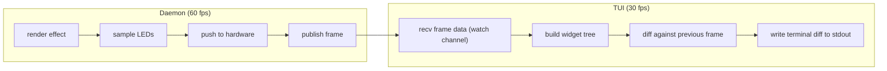

# Hypercolor TUI & CLI Design

> The terminal is sacred ground. Treat it accordingly.

---

## Table of Contents

1. [TUI Vision](#1-tui-vision)
2. [TUI Layout](#2-tui-layout)
3. [TUI Views](#3-tui-views)
4. [TUI Interactions](#4-tui-interactions)
5. [CLI Commands](#5-cli-commands)
6. [CLI Output Design](#6-cli-output-design)
7. [Shell Integration](#7-shell-integration)
8. [SSH / Remote Usage](#8-ssh--remote-usage)
9. [TUI Performance](#9-tui-performance)
10. [Persona Scenarios](#10-persona-scenarios)

---

## 1. TUI Vision

### Philosophy

Most RGB software treats the terminal as an afterthought -- a debug console, a config dumper, a glorified `echo`. Hypercolor's TUI is none of that. It is a **live instrument** for controlling light.

The TUI should feel like you're looking through a window into your lighting rig. LEDs pulse in real time. Audio spectrum dances across frequency bands. Effects shift and breathe. You're not reading about what your lights are doing -- you're _watching_ them do it, rendered in true-color Unicode right in your terminal.

**Design pillars:**

- **Alive, not static.** Every view has motion. The LED preview strip is always updating. The spectrum analyzer is always listening. Even idle screens shimmer with subtle TachyonFX transitions.
- **Keyboard-first, mouse-aware.** Vim bindings for power users, arrow keys for everyone else. No interaction requires a mouse, but mouse clicks and scrolling work where they make sense.
- **Information-dense, not cluttered.** Think htop's data density meets neomutt's clean hierarchy. Every pixel of terminal real estate earns its place.
- **SSH-native.** The TUI connects to the daemon over HTTP on `:9420`. No GPU, no display server, no X11 forwarding. SSH into your rig from your phone and switch effects.
- **SilkCircuit identity.** The TUI _is_ SilkCircuit Neon. Electric Purple accents, Neon Cyan interactions, Coral data points. The palette isn't decoration -- it's wayfinding.

### The Half-Block LED Preview

The signature visual element: a **live LED strip preview** using Unicode half-block characters (`U+2580` upper half block, `U+2584` lower half block). Each terminal cell renders two vertical pixels by setting the foreground to one LED color and the background to another. On a 120-column terminal, that's 120 LEDs visible per row at true 24-bit RGB color.

```
LED Preview (60 LEDs shown, 2 pixels per cell via half-block):
▄▄▄▄▄▄▄▄▄▄▄▄▄▄▄▄▄▄▄▄▄▄▄▄▄▄▄▄▄▄▄▄▄▄▄▄▄▄▄▄▄▄▄▄▄▄▄▄▄▄▄▄▄▄▄▄▄▄▄▄
(imagine each cell glowing a different hue from a rainbow wave)
```

For matrix layouts (Strimer grids, fan arrays), multiple rows of half-blocks create a 2D pixel canvas. A 20x6 Strimer grid renders as 3 rows of 20 half-block cells -- legible, live, and beautiful.

### TachyonFX Integration

TachyonFX provides shader-like post-processing on rendered terminal cells. We use it for:

- **View transitions** -- dissolve, sweep, or glitch between screens
- **Focus effects** -- selected items glow or pulse with color shifts
- **Idle shimmer** -- subtle color cycling on borders and decorative elements
- **Alert animations** -- device disconnect flashes, error pulses
- **Startup sequence** -- the initial render cascades in with a sweep effect

These effects operate on already-rendered cells, meaning they layer on top of standard Ratatui widgets with zero architectural coupling.

### Audio Spectrum in Terminal

When audio capture is active, the TUI renders a real-time FFT spectrum using Ratatui's `BarChart` or a custom `Sparkline` widget. The 200-bin spectrum data from the daemon is downsampled to fit the available terminal width, with frequency bands colored from bass (Coral `#ff6ac1`) through mids (Electric Yellow `#f1fa8c`) to treble (Neon Cyan `#80ffea`).

```
Audio Spectrum
 ▂▃▅▇█▇▅▃▂▁▁▂▃▄▅▆▇█▇▆▅▄▃▂▁▁▁▂▃▄▅▆▇▆▅▄▃▂▁▁▁▁▂▃▄▅▄▃▂▁▁▁▁▁▂▃▂▁
 Bass ─────────────── Mids ─────────────── Treble ───────────────
```

---

## 2. TUI Layout

### Primary Layout (120x40 minimum)

The TUI uses a vertical split with persistent chrome (status bar, LED preview) and a flexible main content area.

```
┌──────────────────────────────────────────────────────────────────────────────────────────────────────────────────────┐
│  HYPERCOLOR                                                                         ⚡ 60fps │ 🔊 Audio │ 4 devices  │
├──────────────────────────────────────────────────────────────────────────────────────────────────────────────────────┤
│ ▄▄▄▄▄▄▄▄▄▄▄▄▄▄▄▄▄▄▄▄▄▄▄▄▄▄▄▄▄▄▄▄▄▄▄▄▄▄▄▄▄▄▄▄▄▄▄▄▄▄▄▄▄▄▄▄▄▄▄▄▄▄▄▄▄▄▄▄▄▄▄▄▄▄▄▄▄▄▄▄▄▄▄▄▄▄▄▄▄▄▄▄▄▄▄▄▄▄▄▄▄▄▄▄▄▄▄▄ │
│ ▀▀▀▀▀▀▀▀▀▀▀▀▀▀▀▀▀▀▀▀▀▀▀▀▀▀▀▀▀▀▀▀▀▀▀▀▀▀▀▀▀▀▀▀▀▀▀▀▀▀▀▀▀▀▀▀▀▀▀▀▀▀▀▀▀▀▀▀▀▀▀▀▀▀▀▀▀▀▀▀▀▀▀▀▀▀▀▀▀▀▀▀▀▀▀▀▀▀▀▀▀▀▀▀▀▀▀▀ │
├──────────┬───────────────────────────────────────────────────────────────────────────────────────────────────────────┤
│          │                                                                                                          │
│  NAV     │   MAIN CONTENT AREA                                                                                      │
│          │                                                                                                          │
│  [D]ash  │   (varies by active view)                                                                                │
│  [E]ffx  │                                                                                                          │
│  [C]trl  │                                                                                                          │
│  De[v]   │                                                                                                          │
│  [P]rof  │                                                                                                          │
│  [S]ettg │                                                                                                          │
│  De[b]ug │                                                                                                          │
│          │                                                                                                          │
│          │                                                                                                          │
│          │                                                                                                          │
│          │                                                                                                          │
│          │                                                                                                          │
│          │                                                                                                          │
│          │                                                                                                          │
│          │                                                                                                          │
│          │                                                                                                          │
│          │                                                                                                          │
│          │                                                                                                          │
│          │                                                                                                          │
├──────────┴──────────────┬───────────────────────────────────────────────────────────────────────────────────────┬────┤
│ ▂▃▅▇█▇▅▃▂▁▁▂▃▅▆▇█▇▆▅▃▂ │  ♪ Audio: PipeWire monitor │ Level: ▇▇▇▇▇▇░░ 72% │ Beat: ● ● ○ ○                  │ ◈  │
├─────────────────────────┴───────────────────────────────────────────────────────────────────────────────────────┴────┤
│  Rainbow Wave ─── WLED Strip (120) · Prism 8 Ch1-4 (504) · Strimer ATX (120) ─── Profile: Evening                  │
└────────────────────────────────────────────────────────────────────────────────────────────────────────────────────────┘
```

### Layout Regions

| Region           | Height   | Purpose                                          |
| ---------------- | -------- | ------------------------------------------------ |
| **Title Bar**    | 1 row    | App name, daemon FPS, audio status, device count |
| **LED Preview**  | 2 rows   | Live half-block rendering of current LED colors  |
| **Nav Sidebar**  | Flexible | View selector with keybinding hints              |
| **Main Content** | Flexible | Active view content (the largest area)           |
| **Audio Strip**  | 1-2 rows | Spectrum mini-view + audio stats (collapsible)   |
| **Status Bar**   | 1 row    | Current effect, active devices, profile name     |

### Responsive Behavior

The layout adapts to terminal dimensions:

| Width           | Behavior                                             |
| --------------- | ---------------------------------------------------- |
| **120+ cols**   | Full layout: sidebar + main content                  |
| **80-119 cols** | Sidebar collapses to icons; main content fills width |
| **< 80 cols**   | Full-width single panel; nav via Tab cycling         |

| Height         | Behavior                                     |
| -------------- | -------------------------------------------- |
| **40+ rows**   | Full layout with LED preview + audio strip   |
| **30-39 rows** | Audio strip collapses into status bar        |
| **24-29 rows** | LED preview reduces to 1 row; compact mode   |
| **< 24 rows**  | Minimal mode: main content + status bar only |

### Color Architecture

All TUI chrome uses the SilkCircuit Neon palette:

```
┌─ Borders, separators ───────────── dim Electric Purple (#e135ff at 40%)
├─ Selected/focused items ─────────── Neon Cyan (#80ffea) bold
├─ Data values, counts ────────────── Coral (#ff6ac1)
├─ Keybinding hints ───────────────── Electric Yellow (#f1fa8c) dim
├─ Active/success indicators ──────── Success Green (#50fa7b)
├─ Errors, disconnected ───────────── Error Red (#ff6363)
├─ Section titles ─────────────────── Electric Purple (#e135ff) bold
├─ Body text ──────────────────────── base white (#f8f8f2)
└─ Dimmed/secondary text ──────────── gray (#6272a4)
```

---

## 3. TUI Views

### 3.1 Dashboard

The landing screen. A single-glance overview of the entire lighting system.

```
┌────────────────────────────────────────────────────────────────────────────────────────────────┐
│  HYPERCOLOR                                                            ⚡ 60fps │ 🔊 │ 4 dev  │
├────────────────────────────────────────────────────────────────────────────────────────────────┤
│ ▄▄▄▄▄▄▄▄▄▄▄▄▄▄▄▄▄▄▄▄▄▄▄▄▄▄▄▄▄▄▄▄▄▄▄▄▄▄▄▄▄▄▄▄▄▄▄▄▄▄▄▄▄▄▄▄▄▄▄▄▄▄▄▄▄▄▄▄▄▄▄▄▄▄▄▄▄▄▄▄▄▄▄▄▄▄▄▄│
├──────┬─────────────────────────────────────────────────────────────────────────────────────────┤
│      │ ┌─ Current Effect ──────────────────────┐ ┌─ System Health ─────────────────────────┐ │
│ [D]  │ │                                        │ │                                          │ │
│  E   │ │   ✦ Rainbow Wave                       │ │   Daemon    ● running     pid 4821       │ │
│  C   │ │                                        │ │   Engine    wgpu          Vulkan 1.3     │ │
│  V   │ │   Speed     ▓▓▓▓▓▓▓▓░░░░  65%         │ │   Render    60.0 fps     16.6ms/frame   │ │
│  P   │ │   Intensity ▓▓▓▓▓▓▓▓▓▓░░  85%         │ │   Audio     PipeWire     48kHz stereo   │ │
│  S   │ │   Direction →  horizontal              │ │   Memory    42 MB        ▓▓▓░░ 8%       │ │
│  B   │ │   Palette   Aurora                     │ │   Uptime    3h 42m                      │ │
│      │ │                                        │ │                                          │ │
│      │ └────────────────────────────────────────┘ └──────────────────────────────────────────┘ │
│      │                                                                                        │
│      │ ┌─ Connected Devices ───────────────────────────────────────────────────────────────┐  │
│      │ │                                                                                    │  │
│      │ │   Device                    Type       LEDs    Status    FPS     Zone              │  │
│      │ │  ─────────────────────────────────────────────────────────────────────────────────  │  │
│      │ │   WLED Living Room          WLED/DDP    120    ● ok      60     Strip              │  │
│      │ │   Prism 8 Controller        USB HID    1008    ● ok      33     8x Strip           │  │
│      │ │   Strimer ATX               USB HID     120    ● ok      60     20x6 Matrix        │  │
│      │ │   Strimer GPU               USB HID     108    ● ok      60     27x4 Matrix        │  │
│      │ │                                                                                    │  │
│      │ │   Total: 1,356 LEDs across 4 devices                                              │  │
│      │ │                                                                                    │  │
│      │ └────────────────────────────────────────────────────────────────────────────────────┘  │
│      │                                                                                        │
│      │ ┌─ Quick Actions ──────────────────────────────────────────────────────────────────┐   │
│      │ │  [1] Rainbow Wave  [2] Aurora Drift  [3] Breathing  [4] Solid White  [5] Off     │   │
│      │ └──────────────────────────────────────────────────────────────────────────────────┘   │
├──────┴────────────────┬───────────────────────────────────────────────────────────────────────┤
│ ▂▃▅▇█▇▅▃▂▁▁▂▃▅▆▇█▇▆▅ │ ♪ PipeWire │ Level: ▇▇▇▇▇░░░ 58% │ Beat: ● ● ○ ○                    │
├───────────────────────┴───────────────────────────────────────────────────────────────────────┤
│  Rainbow Wave ── 4 devices (1,356 LEDs) ── Profile: Evening ── 3:42 uptime                    │
└───────────────────────────────────────────────────────────────────────────────────────────────┘
```

**Dashboard content:**

- **Current Effect** -- Name, parameter summary with inline progress bars, audio reactivity indicator
- **System Health** -- Daemon PID, engine type, render FPS, audio source, memory, uptime
- **Connected Devices** -- Table with device name, protocol type, LED count, connection status, output FPS, zone topology
- **Quick Actions** -- Number keys 1-9 map to favorite effects for instant switching

### 3.2 Effect Browser

Browse, search, and preview all available effects.

```
┌──────────────────────────────────────────────────────────────────────────────────────────────┐
│  HYPERCOLOR                                                          ⚡ 60fps │ 🔊 │ 4 dev  │
├──────────────────────────────────────────────────────────────────────────────────────────────┤
│ ▄▄▄▄▄▄▄▄▄▄▄▄▄▄▄▄▄▄▄▄▄▄▄▄▄▄▄▄▄▄▄▄▄▄▄▄▄▄▄▄▄▄▄▄▄▄▄▄▄▄▄▄▄▄▄▄▄▄▄▄▄▄▄▄▄▄▄▄▄▄▄▄▄▄▄▄▄▄▄▄▄▄▄▄▄▄│
├──────┬───────────────────────────────────────────────────────────────────────────────────────┤
│      │ ┌─ Effects ─────────────────────────┐  ┌─ Preview ────────────────────────────────┐  │
│  D   │ │  / Search...                       │  │                                          │  │
│ [E]  │ │                                    │  │        ▄▄▄▄▄▄▄▄▄▄▄▄▄▄▄▄▄▄▄▄▄▄▄▄        │  │
│  C   │ │  ── Native (wgpu) ──────────────── │  │        ▄▄▄▄▄▄▄▄▄▄▄▄▄▄▄▄▄▄▄▄▄▄▄▄        │  │
│  V   │ │  ▸ Rainbow Wave          ✦ native  │  │        ▄▄▄▄▄▄▄▄▄▄▄▄▄▄▄▄▄▄▄▄▄▄▄▄        │  │
│  P   │ │    Aurora Drift          ✦ native  │  │        ▄▄▄▄▄▄▄▄▄▄▄▄▄▄▄▄▄▄▄▄▄▄▄▄        │  │
│  S   │ │    Plasma Storm          ✦ native  │  │        ▄▄▄▄▄▄▄▄▄▄▄▄▄▄▄▄▄▄▄▄▄▄▄▄        │  │
│  B   │ │    Breathing             ✦ native  │  │        ▀▀▀▀▀▀▀▀▀▀▀▀▀▀▀▀▀▀▀▀▀▀▀▀        │  │
│      │ │    Solid Color           ✦ native  │  │                                          │  │
│      │ │    Fire                  ✦ native  │  │  Rainbow Wave                            │  │
│      │ │    Matrix Rain           ✦ native  │  │  by Hypercolor · native wgpu             │  │
│      │ │                                    │  │                                          │  │
│      │ │  ── Web (Servo) ────────────────── │  │  Smooth rainbow gradient that flows      │  │
│      │ │    Neon Highway          ◈ web     │  │  across all LED zones. Supports           │  │
│      │ │    Cosmic Pulse          ◈ web     │  │  speed, direction, and palette            │  │
│      │ │    Digital Rain          ◈ web     │  │  customization.                           │  │
│      │ │    Vaporwave Sunset      ◈ web     │  │                                          │  │
│      │ │                                    │  │  Audio reactive: no                      │  │
│      │ │  ── Community ──────────────────── │  │  Parameters: 4                           │  │
│      │ │    Galaxy Spiral         ◈ web     │  │                                          │  │
│      │ │    Firefly               ◈ web     │  │  ─── Controls ──────────────────         │  │
│      │ │    Ripple                ◈ web     │  │  Speed       ▓▓▓▓▓▓▓░░░░  65%           │  │
│      │ │                                    │  │  Intensity   ▓▓▓▓▓▓▓▓▓░░  85%           │  │
│      │ │  18 effects (7 native, 11 web)     │  │  Direction   → horizontal               │  │
│      │ │                                    │  │  Palette     [Aurora ▾]                  │  │
│      │ └────────────────────────────────────┘  └──────────────────────────────────────────┘  │
├──────┴────────────────┬──────────────────────────────────────────────────────────────────────┤
│ ▂▃▅▇█▇▅▃▂▁▁▂▃▅▆▇█▇▆▅ │ ♪ PipeWire │ Level: ▇▇▇▇▇░░░ 58% │ Beat: ● ● ○ ○                   │
├───────────────────────┴──────────────────────────────────────────────────────────────────────┤
│  Rainbow Wave ── 4 devices (1,356 LEDs) ── Profile: Evening                                  │
└──────────────────────────────────────────────────────────────────────────────────────────────┘
```

**Effect Browser content:**

- **Effect list** (left pane) -- grouped by engine type (native/web/community), with search filter (`/` to activate)
- **Preview pane** (right pane) -- canvas preview rendered as half-block pixels, effect metadata, inline parameter controls
- **Canvas preview** -- a 24-column by 12-row half-block grid showing a downsampled view of the effect canvas (640x480 by default). Updates at the TUI frame rate
- **Interaction** -- `j/k` or arrows to browse list, `Enter` to activate, `Tab` to switch to preview pane for parameter editing

### 3.3 Effect Control

Focused parameter editing for the active effect. This is where you dial in the look.

```
┌──────────────────────────────────────────────────────────────────────────────────────────────┐
│  HYPERCOLOR                                                          ⚡ 60fps │ 🔊 │ 4 dev  │
├──────────────────────────────────────────────────────────────────────────────────────────────┤
│ ▄▄▄▄▄▄▄▄▄▄▄▄▄▄▄▄▄▄▄▄▄▄▄▄▄▄▄▄▄▄▄▄▄▄▄▄▄▄▄▄▄▄▄▄▄▄▄▄▄▄▄▄▄▄▄▄▄▄▄▄▄▄▄▄▄▄▄▄▄▄▄▄▄▄▄▄▄▄▄▄▄▄▄▄▄▄│
├──────┬───────────────────────────────────────────────────────────────────────────────────────┤
│      │ ┌─ Rainbow Wave ─ Controls ───────────────────────────────────────────────────────┐  │
│  D   │ │                                                                                  │  │
│  E   │ │   Speed                                                                          │  │
│ [C]  │ │   ◀ ▓▓▓▓▓▓▓▓▓▓▓▓▓▓▓▓▓▓░░░░░░░░░░░░ ▶   65%       [1-100]                      │  │
│  V   │ │                                                                                  │  │
│  P   │ │   Intensity                                                                      │  │
│  S   │ │   ◀ ▓▓▓▓▓▓▓▓▓▓▓▓▓▓▓▓▓▓▓▓▓▓▓▓▓░░░░░ ▶   85%       [0-100]                      │  │
│  B   │ │                                                                                  │  │
│      │ │   Wavelength                                                                     │  │
│      │ │   ◀ ▓▓▓▓▓▓▓▓▓▓▓▓░░░░░░░░░░░░░░░░░░ ▶   40%       [10-200]                     │  │
│      │ │                                                                                  │  │
│      │ │   Direction                                                                      │  │
│      │ │   ( ) ← Left   (●) → Right   ( ) ↑ Up   ( ) ↓ Down                             │  │
│      │ │                                                                                  │  │
│      │ │   Palette                                                                        │  │
│      │ │   [▸ Aurora    ]  Rainbow · Neon · Ocean · Lava · Custom                         │  │
│      │ │                                                                                  │  │
│      │ │   Smoothing         [●] On                                                       │  │
│      │ │   Mirror            [ ] Off                                                      │  │
│      │ │                                                                                  │  │
│      │ │   ─── Color (Palette: Custom) ──────────────────────────────────────────         │  │
│      │ │                                                                                  │  │
│      │ │   Hue        ◀ ▓▓▓▓▓▓▓▓▓▓▓▓▓▓▓░░░░░░░░░░░░░░░ ▶  180°                         │  │
│      │ │   Saturation ◀ ▓▓▓▓▓▓▓▓▓▓▓▓▓▓▓▓▓▓▓▓▓▓▓▓▓▓▓▓░░ ▶   92%                         │  │
│      │ │   Lightness  ◀ ▓▓▓▓▓▓▓▓▓▓▓▓▓▓▓░░░░░░░░░░░░░░░ ▶   50%                         │  │
│      │ │   Preview    ████████                                                            │  │
│      │ │                                                                                  │  │
│      │ └──────────────────────────────────────────────────────────────────────────────────┘  │
├──────┴────────────────┬──────────────────────────────────────────────────────────────────────┤
│ ▂▃▅▇█▇▅▃▂▁▁▂▃▅▆▇█▇▆▅ │ ♪ PipeWire │ Level: ▇▇▇▇▇░░░ 58% │ Beat: ● ● ○ ○                   │
├───────────────────────┴──────────────────────────────────────────────────────────────────────┤
│  Rainbow Wave ── 4 devices (1,356 LEDs) ── Profile: Evening                                  │
└──────────────────────────────────────────────────────────────────────────────────────────────┘
```

**Control widgets (auto-generated from `ControlDefinition`):**

| `ControlType`               | Widget                                  | Keys                                                          |
| --------------------------- | --------------------------------------- | ------------------------------------------------------------- |
| `Number { min, max, step }` | Horizontal slider with `◀ ▓░ ▶`         | `h/l` or `Left/Right` to adjust, number keys for direct input |
| `Boolean`                   | Toggle `[●] On / [ ] Off`               | `Space` or `Enter` to toggle                                  |
| `Combobox { values }`       | Dropdown `[▸ value ]` with list         | `Enter` to open, `j/k` to select                              |
| `Color`                     | HSL sliders + color swatch `████`       | Tab between H/S/L, adjust with `h/l`                          |
| `Hue { min, max }`          | Hue-specific slider with color gradient | `h/l` to adjust                                               |
| `TextField`                 | Inline text input                       | `Enter` to edit, `Esc` to confirm                             |

### 3.4 Device Manager

View and manage all connected RGB devices.

```
┌──────────────────────────────────────────────────────────────────────────────────────────────┐
│  HYPERCOLOR                                                          ⚡ 60fps │ 🔊 │ 4 dev  │
├──────────────────────────────────────────────────────────────────────────────────────────────┤
│ ▄▄▄▄▄▄▄▄▄▄▄▄▄▄▄▄▄▄▄▄▄▄▄▄▄▄▄▄▄▄▄▄▄▄▄▄▄▄▄▄▄▄▄▄▄▄▄▄▄▄▄▄▄▄▄▄▄▄▄▄▄▄▄▄▄▄▄▄▄▄▄▄▄▄▄▄▄▄▄▄▄▄▄▄▄▄│
├──────┬───────────────────────────────────────────────────────────────────────────────────────┤
│      │ ┌─ Devices ─────────────────────────┐  ┌─ Device Detail ──────────────────────────┐ │
│  D   │ │                                    │  │                                          │ │
│  E   │ │  ▸ WLED Living Room       ● ok     │  │  WLED Living Room                       │ │
│  C   │ │    Prism 8 Controller     ● ok     │  │                                          │ │
│ [V]  │ │    Strimer ATX (Prism S)  ● ok     │  │  Protocol    WLED / DDP                 │ │
│  P   │ │    Strimer GPU (Prism S)  ● ok     │  │  Address     192.168.1.42:4048           │ │
│  S   │ │                                    │  │  LED Count   120                         │ │
│  B   │ │                                    │  │  Topology    Strip (linear)              │ │
│      │ │  ── Discovered ────────────        │  │  Color Fmt   RGB                         │ │
│      │ │    ? WLED Kitchen          new      │  │  Output FPS  60                          │ │
│      │ │    ? WLED Desk             new      │  │  Latency     0.8ms                      │ │
│      │ │                                    │  │  Firmware     WLED 0.15.3                │ │
│      │ │                                    │  │                                          │ │
│      │ │                                    │  │  ─── Zone Mapping ────────────────────── │ │
│      │ │                                    │  │                                          │ │
│      │ │                                    │  │  Canvas position: (0.1, 0.3)             │ │
│      │ │                                    │  │  Canvas size:     (0.8, 0.05)            │ │
│      │ │                                    │  │  Rotation:        0deg                   │ │
│      │ │                                    │  │                                          │ │
│      │ │                                    │  │  ─── Live Preview ────────────────────── │ │
│      │ │                                    │  │                                          │ │
│      │ │                                    │  │  ▄▄▄▄▄▄▄▄▄▄▄▄▄▄▄▄▄▄▄▄▄▄▄▄▄▄▄▄▄▄▄▄▄▄▄▄ │ │
│      │ │                                    │  │  (120 LEDs, showing this zone only)      │ │
│      │ │                                    │  │                                          │ │
│      │ │  4 connected · 2 discovered        │  │  [Enter] Configure  [d] Disconnect       │ │
│      │ └────────────────────────────────────┘  └──────────────────────────────────────────┘ │
├──────┴────────────────┬──────────────────────────────────────────────────────────────────────┤
│ ▂▃▅▇█▇▅▃▂▁▁▂▃▅▆▇█▇▆▅ │ ♪ PipeWire │ Level: ▇▇▇▇▇░░░ 58%                                   │
├───────────────────────┴──────────────────────────────────────────────────────────────────────┤
│  Rainbow Wave ── 4 devices (1,356 LEDs) ── Profile: Evening                                  │
└──────────────────────────────────────────────────────────────────────────────────────────────┘
```

**Device Manager features:**

- **Device list** (left) -- connected devices with status dot, discovered-but-unconnected below a separator
- **Detail pane** (right) -- full device info, protocol, zone mapping, per-device LED preview
- **Actions** -- `Enter` to configure/connect, `d` to disconnect, `r` to rediscover, `a` to add manually
- **Multi-channel devices** (Prism 8) expand into sub-items showing per-channel LED counts

### 3.5 Profile/Scene Manager

Manage lighting profiles -- saved combinations of effect + parameters + device mappings.

```
┌──────────────────────────────────────────────────────────────────────────────────────────────┐
│  HYPERCOLOR                                                          ⚡ 60fps │ 🔊 │ 4 dev  │
├──────────────────────────────────────────────────────────────────────────────────────────────┤
│ ▄▄▄▄▄▄▄▄▄▄▄▄▄▄▄▄▄▄▄▄▄▄▄▄▄▄▄▄▄▄▄▄▄▄▄▄▄▄▄▄▄▄▄▄▄▄▄▄▄▄▄▄▄▄▄▄▄▄▄▄▄▄▄▄▄▄▄▄▄▄▄▄▄▄▄▄▄▄▄▄▄▄▄▄▄▄│
├──────┬───────────────────────────────────────────────────────────────────────────────────────┤
│      │ ┌─ Profiles ────────────────────────┐  ┌─ Profile Detail ─────────────────────────┐ │
│  D   │ │                                    │  │                                          │ │
│  E   │ │  ▸ Evening            ● active     │  │  Evening                                 │ │
│  C   │ │    Gaming                          │  │                                          │ │
│ [V]  │ │    Movie Night                     │  │  Effect     Aurora Drift                 │ │
│ [P]  │ │    Focus                           │  │  Speed      45%                          │ │
│  S   │ │    Party Mode                      │  │  Intensity  60%                          │ │
│  B   │ │    Sleep                           │  │  Palette    Ocean                        │ │
│      │ │    All Off                         │  │  Audio      disabled                     │ │
│      │ │                                    │  │                                          │ │
│      │ │                                    │  │  ─── Device Overrides ────────────────── │ │
│      │ │                                    │  │                                          │ │
│      │ │                                    │  │  WLED Strip       brightness: 40%        │ │
│      │ │                                    │  │  Strimer ATX      brightness: 60%        │ │
│      │ │                                    │  │  Prism 8 Ch5-8    off                    │ │
│      │ │                                    │  │                                          │ │
│      │ │                                    │  │  ─── Schedule ────────────────────────── │ │
│      │ │                                    │  │                                          │ │
│      │ │                                    │  │  Activate at      sunset                 │ │
│      │ │                                    │  │  Deactivate at    23:00                  │ │
│      │ │                                    │  │                                          │ │
│      │ │  7 profiles                        │  │  [Enter] Apply  [e] Edit  [n] New        │ │
│      │ └────────────────────────────────────┘  └──────────────────────────────────────────┘ │
├──────┴────────────────┬──────────────────────────────────────────────────────────────────────┤
│ ▂▃▅▇█▇▅▃▂▁▁▂▃▅▆▇█▇▆▅ │ ♪ off │ Profile: Evening (active)                                   │
├───────────────────────┴──────────────────────────────────────────────────────────────────────┤
│  Aurora Drift ── 4 devices (1,356 LEDs) ── Profile: Evening                                  │
└──────────────────────────────────────────────────────────────────────────────────────────────┘
```

**Profile features:**

- **Profile list** -- name + active indicator, sorted by last used
- **Detail pane** -- effect, parameters, per-device overrides, schedule
- **Actions** -- `Enter` to apply, `e` to edit (opens profile editor modal), `n` to create new from current state, `x` to delete (with confirmation)
- **Schedule** -- optional time-of-day or sunset/sunrise triggers (synced with HA if configured)

### 3.6 Settings

Daemon configuration and TUI preferences.

```
┌──────────────────────────────────────────────────────────────────────────────────────────────┐
│  HYPERCOLOR                                                          ⚡ 60fps │ 🔊 │ 4 dev  │
├──────────────────────────────────────────────────────────────────────────────────────────────┤
│ ▄▄▄▄▄▄▄▄▄▄▄▄▄▄▄▄▄▄▄▄▄▄▄▄▄▄▄▄▄▄▄▄▄▄▄▄▄▄▄▄▄▄▄▄▄▄▄▄▄▄▄▄▄▄▄▄▄▄▄▄▄▄▄▄▄▄▄▄▄▄▄▄▄▄▄▄▄▄▄▄▄▄▄▄▄▄│
├──────┬───────────────────────────────────────────────────────────────────────────────────────┤
│      │ ┌─ Settings ──────────────────────────────────────────────────────────────────────┐  │
│  D   │ │                                                                                  │  │
│  E   │ │  ── Daemon ─────────────────────────────────────────────────────────────         │  │
│  C   │ │                                                                                  │  │
│  V   │ │   Render FPS        ◀ ▓▓▓▓▓▓▓▓▓▓▓▓▓▓▓▓▓▓▓▓▓▓▓▓▓▓▓▓▓▓ ▶   60                   │  │
│  P   │ │   Canvas Width      320                                                          │  │
│ [S]  │ │   Canvas Height     200                                                          │  │
│  B   │ │   API Port          9420                                                         │  │
│      │ │   Auto-discover     [●] On                                                       │  │
│      │ │                                                                                  │  │
│      │ │  ── Audio ──────────────────────────────────────────────────────────────         │  │
│      │ │                                                                                  │  │
│      │ │   Source             [▸ PipeWire Monitor          ]                              │  │
│      │ │   Sample Rate        48000 Hz                                                    │  │
│      │ │   FFT Bins           200                                                         │  │
│      │ │   Gain               ◀ ▓▓▓▓▓▓▓▓▓▓▓▓▓▓▓░░░░░░░░░░░░░░ ▶   50%                  │  │
│      │ │   Beat Sensitivity   ◀ ▓▓▓▓▓▓▓▓▓▓▓▓▓▓▓▓▓▓▓▓░░░░░░░░░ ▶   65%                  │  │
│      │ │                                                                                  │  │
│      │ │  ── TUI Display ────────────────────────────────────────────────────────         │  │
│      │ │                                                                                  │  │
│      │ │   TUI Refresh Rate   ◀ ▓▓▓▓▓▓▓▓▓▓▓▓▓▓▓░░░░░░░░░░░░░░ ▶   30 fps               │  │
│      │ │   LED Preview        [●] Visible                                                 │  │
│      │ │   Audio Panel        [●] Visible                                                 │  │
│      │ │   Animations         [●] Enabled                                                 │  │
│      │ │   Color Scheme       [▸ SilkCircuit Neon           ]                             │  │
│      │ │                                                                                  │  │
│      │ │  ── Network ────────────────────────────────────────────────────────────         │  │
│      │ │                                                                                  │  │
│      │ │   Daemon Address     127.0.0.1:9420                                               │  │
│      │ │   WebSocket URL    ws://127.0.0.1:9420/api/v1/ws                               │  │
│      │ │   WebSocket Port     9420                                                        │  │
│      │ │                                                                                  │  │
│      │ └──────────────────────────────────────────────────────────────────────────────────┘  │
├──────┴────────────────┬──────────────────────────────────────────────────────────────────────┤
│ ▂▃▅▇█▇▅▃▂▁▁▂▃▅▆▇█▇▆▅ │ ♪ PipeWire │ Level: ▇▇▇▇▇░░░ 58%                                   │
├───────────────────────┴──────────────────────────────────────────────────────────────────────┤
│  Rainbow Wave ── 4 devices (1,356 LEDs) ── Profile: Evening                                  │
└──────────────────────────────────────────────────────────────────────────────────────────────┘
```

### 3.7 Debug View

For development and troubleshooting. Shows the internals.

```
┌──────────────────────────────────────────────────────────────────────────────────────────────┐
│  HYPERCOLOR                                                          ⚡ 60fps │ 🔊 │ 4 dev  │
├──────────────────────────────────────────────────────────────────────────────────────────────┤
│ ▄▄▄▄▄▄▄▄▄▄▄▄▄▄▄▄▄▄▄▄▄▄▄▄▄▄▄▄▄▄▄▄▄▄▄▄▄▄▄▄▄▄▄▄▄▄▄▄▄▄▄▄▄▄▄▄▄▄▄▄▄▄▄▄▄▄▄▄▄▄▄▄▄▄▄▄▄▄▄▄▄▄▄▄▄▄│
├──────┬───────────────────────────────────────────────────────────────────────────────────────┤
│      │ ┌─ Frame Timing ────────────────────┐  ┌─ Event Log ──────────────────────────────┐ │
│  D   │ │                                    │  │                                          │ │
│  E   │ │  Render    16.4ms  ▓▓▓▓▓▓▓░░░░     │  │  14:32:01.482  DeviceConnected           │ │
│  C   │ │  Sample     0.3ms  ▓░░░░░░░░░░     │  │               WLED Living Room           │ │
│  V   │ │  Push       1.2ms  ▓░░░░░░░░░░     │  │  14:32:01.344  EffectChanged              │ │
│  P   │ │  Total     17.9ms  ▓▓▓▓▓▓▓▓░░░     │  │               Rainbow Wave                │ │
│  S   │ │  Budget    16.7ms  ────────────     │  │  14:31:58.102  ProfileLoaded              │ │
│ [B]  │ │  Headroom  -1.2ms  over budget!     │  │               Evening                     │ │
│      │ │                                    │  │  14:31:55.001  InputSourceAdded            │ │
│      │ │  ── FPS History (60s) ───────────  │  │               PipeWire Audio               │ │
│      │ │  60▕▄▄▄▄▄▄▄▄▄▄▄▄▄▄▄▄▄▄▄▄▄▄▄▄▄▄▄  │  │  14:31:54.823  DeviceConnected            │ │
│      │ │  30▕                               │  │               Prism 8 Controller           │ │
│      │ │   0▕───────────────────────────── t │  │  14:31:54.201  DeviceConnected            │ │
│      │ │                                    │  │               Strimer ATX                   │ │
│      │ │  ── Per-Device Latency ──────────  │  │  14:31:54.198  DeviceConnected            │ │
│      │ │  WLED Strip      0.8ms  UDP DDP    │  │               Strimer GPU                   │ │
│      │ │  Prism 8         2.1ms  USB HID    │  │  14:31:52.000  daemon started              │ │
│      │ │  Strimer ATX     1.8ms  USB HID    │  │               pid: 4821                    │ │
│      │ │  Strimer GPU     1.8ms  USB HID    │  │                                          │ │
│      │ │                                    │  │  [c] Clear  [f] Filter  [p] Pause         │ │
│      │ └────────────────────────────────────┘  └──────────────────────────────────────────┘ │
│      │                                                                                      │
│      │ ┌─ IPC Traffic ─────────────────────────────────────────────────────────────────────┐│
│      │ │ → SET_EFFECT {"name":"Rainbow Wave","params":{"speed":65}}                        ││
│      │ │ ← OK {"effect":"Rainbow Wave","active":true}                                      ││
│      │ │ → GET_STATE                                                                       ││
│      │ │ ← STATE {"fps":60.0,"effect":"Rainbow Wave","devices":4,"leds":1356}              ││
│      │ └───────────────────────────────────────────────────────────────────────────────────┘│
├──────┴────────────────┬──────────────────────────────────────────────────────────────────────┤
│ ▂▃▅▇█▇▅▃▂▁▁▂▃▅▆▇█▇▆▅ │ ♪ PipeWire │ Render: 17.9ms (over budget)                           │
├───────────────────────┴──────────────────────────────────────────────────────────────────────┤
│  Rainbow Wave ── 4 devices (1,356 LEDs) ── Profile: Evening ── DEBUG MODE                    │
└──────────────────────────────────────────────────────────────────────────────────────────────┘
```

**Debug view content:**

- **Frame timing** -- per-stage breakdown (render, sample, push), budget comparison, headroom warning
- **FPS history** -- sparkline graph over the last 60 seconds
- **Per-device latency** -- transport-level timing for each output backend
- **Event log** -- scrollable log of `HypercolorEvent` stream with timestamps
- **IPC traffic** -- raw HTTP request/response pairs to the daemon REST API (for TUI/CLI development)

---

## 4. TUI Interactions

### Navigation Model

The TUI uses a **panel-focused navigation** model. At any time, one panel has focus (indicated by a bright Neon Cyan border). Input is interpreted in the context of the focused panel.

### Global Keybindings

These work from any view, any panel:

| Key                 | Action                                     |
| ------------------- | ------------------------------------------ |
| `D`                 | Switch to Dashboard                        |
| `E`                 | Switch to Effect Browser                   |
| `C`                 | Switch to Effect Control                   |
| `V`                 | Switch to Device Manager                   |
| `P`                 | Switch to Profile Manager                  |
| `S`                 | Switch to Settings                         |
| `B`                 | Switch to Debug View                       |
| `Tab` / `Shift+Tab` | Cycle focus between panels in current view |
| `q` / `Ctrl+C`      | Quit TUI (daemon keeps running)            |
| `?`                 | Toggle help overlay                        |
| `:`                 | Enter command mode                         |
| `Ctrl+L`            | Force redraw                               |

### In-Panel Navigation

| Key           | Action                                     |
| ------------- | ------------------------------------------ |
| `j` / `Down`  | Move selection down                        |
| `k` / `Up`    | Move selection up                          |
| `h` / `Left`  | Decrease slider value / collapse tree node |
| `l` / `Right` | Increase slider value / expand tree node   |
| `g` / `Home`  | Jump to first item                         |
| `G` / `End`   | Jump to last item                          |
| `Enter`       | Activate selected item / confirm           |
| `Esc`         | Cancel / back / close modal                |
| `/`           | Activate search filter in lists            |
| `Space`       | Toggle boolean / select item               |

### Slider Interaction

Number sliders respond to graduated input:

| Key               | Step Size                 |
| ----------------- | ------------------------- |
| `h` / `l`         | 1% (fine)                 |
| `H` / `L` (Shift) | 10% (coarse)              |
| `0`-`9`           | Jump to 0%-90% directly   |
| `Enter`           | Open direct numeric input |

### Quick-Switch Shortcuts

From the Dashboard or any view:

| Key              | Action                                        |
| ---------------- | --------------------------------------------- |
| `1`-`9`          | Apply quick-access effect slot (configurable) |
| `p` then `1`-`9` | Apply profile by number                       |
| `Ctrl+Space`     | Toggle between current effect and "Off"       |

### Command Mode

Pressing `:` opens a command input at the bottom of the screen (vim-style), with tab-completion:

```
:set rainbow-wave --speed 80 --palette neon
:profile apply evening
:device disconnect "WLED Kitchen"
:export profiles ~/hypercolor-backup.toml
:fps 30
:audio off
:quit
```

The command syntax mirrors the CLI subcommand structure, so muscle memory transfers between TUI command mode and shell CLI usage.

### Modal Dialogs

Modals appear centered over the current view for confirmations, selections, and text input:

```
┌─ Confirm ──────────────────────────────┐
│                                         │
│   Disconnect "Prism 8 Controller"?      │
│                                         │
│   This will turn off 1008 LEDs on       │
│   8 channels.                           │
│                                         │
│        [Enter] Confirm    [Esc] Cancel  │
│                                         │
└─────────────────────────────────────────┘
```

Modals steal focus. `Esc` always dismisses them. `Enter` confirms the primary action.

### Mouse Support

Mouse interactions are optional but supported:

- **Click** on nav sidebar items to switch views
- **Click** on list items to select
- **Scroll wheel** to navigate lists
- **Click** on slider track to jump to position
- **Click** on toggle to flip

Mouse events are handled via crossterm's mouse capture. The TUI works perfectly without any mouse interaction.

---

## 5. CLI Commands

The CLI is a standalone binary (`hypercolor`) using clap's derive API. Every command communicates with the daemon over HTTP (`reqwest` client, `http://localhost:9420` by default).

### Command Tree

```
hypercolor
├── daemon                              # Daemon lifecycle management
│   ├── start [--port PORT] [--no-web]  # Start the daemon
│   ├── stop                            # Graceful shutdown
│   ├── restart                         # Stop + start
│   └── status                          # Daemon health check
│
├── tui                                 # Launch the TUI
│   └── [--host HOST] [--fps FPS]       # Remote daemon, TUI refresh rate
│
├── status                              # Current state snapshot
│   └── [--json] [--watch]              # Machine output, live updates
│
├── set <EFFECT>                        # Set the active effect
│   ├── --speed <0-100>                 # Numeric parameter
│   ├── --intensity <0-100>             # Numeric parameter
│   ├── --palette <NAME>                # Combobox parameter
│   ├── --param <KEY=VALUE>...          # Arbitrary key=value pairs
│   ├── --device <NAME>                 # Target specific device(s)
│   └── --transition <DURATION>         # Fade transition time (ms)
│
├── off                                 # Turn all LEDs off (alias: set off)
│
├── list                                # List resources
│   ├── devices                         # Connected devices
│   ├── effects                         # Available effects
│   ├── profiles                        # Saved profiles
│   ├── inputs                          # Active input sources
│   └── [--json] [--quiet]             # Output format flags
│
├── device                              # Device operations
│   ├── list                            # List devices (alias for list devices)
│   ├── info <DEVICE>                   # Detailed device info
│   ├── discover                        # Trigger device discovery
│   ├── connect <DEVICE>                # Connect to a discovered device
│   ├── disconnect <DEVICE>             # Disconnect a device
│   ├── test <DEVICE>                   # Flash test pattern on device
│   └── rename <DEVICE> <NAME>          # Set display name
│
├── profile                             # Profile management
│   ├── list                            # List profiles
│   ├── apply <NAME>                    # Apply a profile
│   ├── save <NAME>                     # Save current state as profile
│   ├── delete <NAME>                   # Delete a profile
│   ├── show <NAME>                     # Show profile detail
│   └── edit <NAME>                     # Open profile in $EDITOR (TOML)
│
├── capture                             # Input source control
│   ├── audio                           # Audio capture management
│   │   ├── start [--source <NAME>]     # Start audio capture
│   │   ├── stop                        # Stop audio capture
│   │   └── status                      # Audio source info
│   └── screen                          # Screen capture management
│       ├── start [--display <N>]       # Start screen capture
│       ├── stop                        # Stop screen capture
│       └── status                      # Screen capture info
│
├── config                              # Configuration management
│   ├── show                            # Print current config (TOML)
│   ├── edit                            # Open config in $EDITOR
│   ├── get <KEY>                       # Get a config value
│   ├── set <KEY> <VALUE>               # Set a config value
│   └── reset                           # Reset to defaults
│
├── plugin                              # Plugin management (Phase 2+)
│   ├── list                            # List installed plugins
│   ├── install <PATH|URL>              # Install a Wasm plugin
│   ├── remove <NAME>                   # Remove a plugin
│   └── info <NAME>                     # Plugin metadata
│
├── export                              # Backup / export
│   ├── profiles <FILE>                 # Export all profiles
│   ├── layout <FILE>                   # Export spatial layout
│   └── all <DIR>                       # Full backup
│
├── import                              # Restore / import
│   ├── profiles <FILE>                 # Import profiles
│   ├── layout <FILE>                   # Import spatial layout
│   └── effects <DIR>                   # Import effect files
│
├── watch                               # Live streaming output
│   ├── [--fps <N>]                     # Update rate (default: 10)
│   ├── [--format <FORMAT>]             # Output format: text, json, csv
│   └── [--filter <EVENT_TYPE>]         # Filter by event type
│
└── completion                          # Shell completion scripts
    ├── bash                            # Generate bash completions
    ├── zsh                             # Generate zsh completions
    └── fish                            # Generate fish completions
```

### Clap Derive Structure

```rust
use clap::{Parser, Subcommand, ValueEnum};

#[derive(Parser)]
#[command(name = "hypercolor")]
#[command(about = "RGB lighting orchestration engine for Linux")]
#[command(version, long_about = None)]
#[command(propagate_version = true)]
pub struct Cli {
    /// Daemon host address (for remote connections)
    #[arg(long, global = true, env = "HYPERCOLOR_HOST")]
    pub host: Option<String>,

    /// Daemon port (used with HYPERCOLOR_HOST)
    #[arg(long, global = true, env = "HYPERCOLOR_PORT", default_value = "9420")]
    pub port: Option<u16>,

    /// Output format
    #[arg(long, global = true, default_value = "text")]
    pub format: OutputFormat,

    /// Suppress non-essential output
    #[arg(long, short, global = true)]
    pub quiet: bool,

    /// Disable colored output
    #[arg(long, global = true, env = "NO_COLOR")]
    pub no_color: bool,

    #[command(subcommand)]
    pub command: Commands,
}

#[derive(Subcommand)]
pub enum Commands {
    /// Start, stop, or manage the daemon
    Daemon(DaemonArgs),
    /// Launch the terminal user interface
    Tui(TuiArgs),
    /// Show current system state
    Status(StatusArgs),
    /// Set the active effect
    Set(SetArgs),
    /// Turn all LEDs off
    Off,
    /// List resources (devices, effects, profiles)
    List(ListArgs),
    /// Manage devices
    Device(DeviceArgs),
    /// Manage lighting profiles
    Profile(ProfileArgs),
    /// Control input capture (audio, screen)
    Capture(CaptureArgs),
    /// Manage configuration
    Config(ConfigArgs),
    /// Manage plugins
    Plugin(PluginArgs),
    /// Export data for backup
    Export(ExportArgs),
    /// Import data from backup
    Import(ImportArgs),
    /// Stream live events
    Watch(WatchArgs),
    /// Generate shell completions
    Completion(CompletionArgs),
}

#[derive(ValueEnum, Clone)]
pub enum OutputFormat {
    Text,
    Json,
    Csv,
}
```

---

## 6. CLI Output Design

### Principle: Beautiful by Default, Machine-Readable by Flag

Every command produces styled, human-friendly output by default. Add `--json` for scripting, `--quiet` for piping.

### `hypercolor status`

```
  ╭─ Hypercolor ────────────────────────────────────────────────╮
  │                                                              │
  │   Daemon     ● running          pid 4821   uptime 3h 42m    │
  │   Engine     wgpu (Vulkan 1.3)  60.0 fps   16.4ms/frame    │
  │   Audio      PipeWire monitor   48kHz      ● capturing      │
  │   Effect     Rainbow Wave       speed: 65  palette: Aurora  │
  │   Profile    Evening            since 20:18                  │
  │                                                              │
  │   ── Devices ────────────────────────────────────────────   │
  │                                                              │
  │   WLED Living Room       ● 120 LEDs    DDP     0.8ms        │
  │   Prism 8 Controller     ● 1008 LEDs   HID     2.1ms        │
  │   Strimer ATX            ● 120 LEDs    HID     1.8ms        │
  │   Strimer GPU            ● 108 LEDs    HID     1.8ms        │
  │                                                              │
  │   Total: 1,356 LEDs across 4 devices                        │
  │                                                              │
  ╰──────────────────────────────────────────────────────────────╯
```

Colors in the above output:

- "Hypercolor" title: Electric Purple bold
- Status dots `●`: Success Green (running) / Error Red (stopped)
- Device names: Neon Cyan
- Numeric values: Coral
- Labels: dim white
- Box borders: dim Electric Purple

### `hypercolor list devices`

```
  Device                     Protocol    LEDs    Status    Latency    Zone
  ──────────────────────────────────────────────────────────────────────────
  WLED Living Room           DDP          120    ● ok       0.8ms     Strip
  Prism 8 Controller         USB HID     1008    ● ok       2.1ms     8x Strip
  Strimer ATX (Prism S #1)   USB HID      120    ● ok       1.8ms     20x6 Matrix
  Strimer GPU (Prism S #1)   USB HID      108    ● ok       1.8ms     27x4 Matrix

  4 devices · 1,356 LEDs
```

### `hypercolor list effects`

```
  Effect                     Engine     Audio    Parameters    Author
  ──────────────────────────────────────────────────────────────────────────
  Rainbow Wave               ✦ native   no       4             Hypercolor
  Aurora Drift               ✦ native   yes      6             Hypercolor
  Plasma Storm               ✦ native   yes      5             Hypercolor
  Breathing                  ✦ native   no       3             Hypercolor
  Solid Color                ✦ native   no       1             Hypercolor
  Fire                       ✦ native   yes      4             Hypercolor
  Neon Highway               ◈ web      yes      7             Community
  Cosmic Pulse               ◈ web      yes      5             Community
  Digital Rain               ◈ web      no       3             Community

  9 effects (6 native, 3 web)
```

### `hypercolor set rainbow-wave --speed 80`

```
  ✦ Effect set: Rainbow Wave
    speed: 80  intensity: 85  palette: Aurora  direction: right
    Applied to 4 devices (1,356 LEDs)
```

### `hypercolor device test "WLED Living Room"`

```
  Testing WLED Living Room...
  ▓▓▓▓▓▓▓▓▓▓▓▓▓▓▓▓▓▓▓▓▓▓▓▓▓▓▓▓▓▓░░░░░░░░░░  Phase 3/5: Blue sweep
  Test complete. Device responding normally.
```

### `hypercolor profile apply evening`

```
  ✦ Profile: Evening
    Effect      Aurora Drift (speed: 45, palette: Ocean)
    Brightness  WLED: 40%  Strimers: 60%  Prism 8 Ch5-8: off
    Audio       disabled
    Applied in 120ms
```

### JSON Output Mode

Every command supports `--json` (or `--format json`) for scripting:

```json
{
  "daemon": {
    "status": "running",
    "pid": 4821,
    "uptime_secs": 13320
  },
  "engine": {
    "type": "wgpu",
    "backend": "Vulkan 1.3",
    "fps": 60.0,
    "frame_time_ms": 16.4
  },
  "effect": {
    "name": "Rainbow Wave",
    "params": {
      "speed": 65,
      "intensity": 85,
      "palette": "Aurora",
      "direction": "right"
    }
  },
  "devices": [
    {
      "name": "WLED Living Room",
      "protocol": "ddp",
      "leds": 120,
      "status": "connected",
      "latency_ms": 0.8
    }
  ],
  "profile": "Evening"
}
```

### Quiet Mode

`--quiet` strips all decoration, outputting only essential data. Designed for piping:

```bash
# List device names only
$ hypercolor list devices --quiet
WLED Living Room
Prism 8 Controller
Strimer ATX
Strimer GPU

# Get current effect name
$ hypercolor status --quiet
Rainbow Wave
```

### Color Detection

The CLI respects the `NO_COLOR` environment variable ([no-color.org](https://no-color.org)). Additionally:

1. If stdout is not a TTY, colors are disabled automatically
2. `--no-color` flag for explicit override
3. `HYPERCOLOR_COLOR=always` forces color even when piped (for `less -R` workflows)

### Error Output

Errors use the Error Red palette with clear, actionable messages:

```
  ✗ Cannot connect to daemon
    http://127.0.0.1:9420 — connection refused.
    Start the daemon with: hypercolor daemon start
```

```
  ✗ Device not found: "WLED Bedroom"
    Available devices:
      WLED Living Room
      Prism 8 Controller
    Did you mean "WLED Living Room"?
```

### Progress Indicators

Long operations (device discovery, effect installation) use inline progress:

```
  Discovering devices...
  ⠸ Scanning USB HID...         found 3
  ⠴ Scanning mDNS (WLED)...     found 2
  ⠦ Scanning OpenRGB (6742)...  timeout

  5 devices found (3 USB, 2 network)
```

---

## 7. Shell Integration

### Shell Completions

Generated via clap's built-in completion generator. Install with:

```bash
# bash
hypercolor completion bash > /etc/bash_completion.d/hypercolor

# zsh
hypercolor completion zsh > "${fpath[1]}/_hypercolor"

# fish
hypercolor completion fish > ~/.config/fish/completions/hypercolor.fish
```

Completions include:

- All subcommands and flags
- Dynamic completions for device names (queried from daemon)
- Dynamic completions for effect names
- Dynamic completions for profile names
- File path completions for import/export commands

### Environment Variables

| Variable            | Default                            | Purpose                                              |
| ------------------- | ---------------------------------- | ---------------------------------------------------- |
| `HYPERCOLOR_HOST`   | `127.0.0.1`                        | Daemon host address                                  |
| `HYPERCOLOR_PORT`   | `9420`                             | Daemon port                                          |
| `HYPERCOLOR_CONFIG` | `~/.config/hypercolor/config.toml` | Config file path                                     |
| `HYPERCOLOR_COLOR`  | `auto`                             | Color output: `auto`, `always`, `never`              |
| `NO_COLOR`          | (none)                             | Disable color when set (any value)                   |
| `HYPERCOLOR_LOG`    | `warn`                             | Log level: `error`, `warn`, `info`, `debug`, `trace` |

### Watch Mode

`hypercolor watch` streams real-time events for monitoring and scripting:

```bash
# Stream all events as JSON
hypercolor watch --format json

# Stream only device events
hypercolor watch --filter device

# Stream LED colors at 10fps (CSV for data analysis)
hypercolor watch --format csv --fps 10

# Pipe to jq for processing
hypercolor watch --format json | jq 'select(.type == "effect_changed") | .effect'
```

Output format for `--format json`:

```jsonl
{"ts":"2026-03-01T20:32:01.482Z","type":"device_connected","device":"WLED Living Room","leds":120}
{"ts":"2026-03-01T20:32:01.500Z","type":"effect_changed","effect":"Rainbow Wave","params":{"speed":65}}
{"ts":"2026-03-01T20:32:01.516Z","type":"frame","fps":60.0,"devices":4,"leds":1356}
```

### Pipe-Friendly Commands

Every command that lists data supports clean, scriptable output:

```bash
# Get all device names, one per line
hypercolor list devices --quiet

# Check if daemon is running (exit code 0 = running, 1 = stopped)
hypercolor daemon status --quiet && echo "running"

# Apply effects conditionally
hypercolor status --json | jq -r '.effect.name' | grep -q "Off" && \
  hypercolor set rainbow-wave

# Count total LEDs
hypercolor list devices --json | jq '[.[].leds] | add'

# Disconnect all WLED devices
hypercolor list devices --json | \
  jq -r '.[] | select(.protocol == "ddp") | .name' | \
  xargs -I{} hypercolor device disconnect "{}"
```

### Config File

CLI preferences are stored in the same TOML config as the daemon:

```toml
# ~/.config/hypercolor/config.toml

[cli]
default_format = "text"     # text | json
color = "auto"              # auto | always | never
pager = "less -R"           # pager for long output

[tui]
refresh_fps = 30            # TUI rendering frame rate
show_led_preview = true     # LED preview strip visibility
show_audio_panel = true     # Audio spectrum panel visibility
animations = true           # TachyonFX transitions
vim_mode = true             # vim keybindings (vs arrow-only)

[tui.quick_effects]         # Dashboard quick-switch slots
1 = "rainbow-wave"
2 = "aurora-drift"
3 = "breathing"
4 = "solid-white"
5 = "off"
```

---

## 8. SSH / Remote Usage

### Architecture

The TUI is a client. The daemon is the server. They communicate over HTTP and WebSocket on `:9420`. The TUI never touches hardware directly -- it sends commands and receives state updates.

```
Local:
  hypercolor-tui ──── http://127.0.0.1:9420 ──── hypercolor-daemon

Remote (SSH):
  ssh user@desktop "hypercolor tui"
  └─ hypercolor-tui ── http://127.0.0.1:9420 ── hypercolor-daemon (on desktop)

Remote (TCP, direct):
  hypercolor tui --host 192.168.1.42:9420
  └─ hypercolor-tui ── http://192.168.1.42:9420 ── hypercolor-daemon
```

### SSH Usage

The most common remote scenario: SSH into the machine running the daemon, launch the TUI.

```bash
# From laptop, control desktop lights
ssh desktop "hypercolor tui"

# Or use CLI directly over SSH
ssh desktop "hypercolor set aurora-drift --speed 40"

# Or with the remote flag (no SSH needed, daemon exposes TCP)
hypercolor --host desktop:9420 set aurora-drift --speed 40
```

**No GPU, no display server, no X11 forwarding required.** The TUI renders entirely in the terminal using crossterm. The daemon handles all GPU work independently.

### Bandwidth Considerations

The TUI receives frame data from the daemon for the LED preview. Over SSH, this is the primary bandwidth consumer.

| Data                                | Size    | Rate     | Bandwidth    |
| ----------------------------------- | ------- | -------- | ------------ |
| LED frame (1,356 LEDs x 3 bytes)    | ~4 KB   | 30 fps   | ~120 KB/s    |
| Audio spectrum (200 bins x 4 bytes) | ~800 B  | 30 fps   | ~24 KB/s     |
| Events (device, effect changes)     | ~100 B  | sporadic | negligible   |
| TUI terminal output (120x40 diff)   | ~2-5 KB | 30 fps   | ~60-150 KB/s |

**Total estimated bandwidth: ~200-300 KB/s** -- well within any SSH connection, including tethered mobile.

### Low-Bandwidth Mode

For constrained connections (cellular, high-latency VPN):

```bash
hypercolor tui --low-bandwidth
```

Low-bandwidth mode:

- Reduces LED preview update rate to 5 fps
- Disables audio spectrum visualization
- Disables TachyonFX animations
- Reduces TUI refresh to 10 fps
- Uses smaller terminal diff chunks

Alternatively, use the CLI for zero-bandwidth overhead (single request/response per command).

### tmux / screen Compatibility

The TUI runs correctly inside tmux and screen:

- Uses crossterm's terminal detection for capability queries
- Handles `SIGWINCH` (terminal resize) events
- Does not rely on terminal-specific escape sequences beyond standard ANSI + true-color
- `Ctrl+b` (tmux prefix) passes through cleanly since the TUI doesn't bind it

**Recommended tmux setup:**

```bash
# In ~/.tmux.conf
set -g default-terminal "tmux-256color"
set -ag terminal-overrides ",*:RGB"     # Enable true-color passthrough
```

### Remote Daemon Connection

For managing a headless RGB server (e.g., a dedicated Raspberry Pi running Hypercolor):

```bash
# Direct TCP connection (daemon must be configured to listen on network)
hypercolor --host 192.168.1.100:9420 status

# Or set it as default
export HYPERCOLOR_HOST=192.168.1.100:9420
hypercolor status
```

The daemon binds `127.0.0.1:9420` by default. To allow remote connections, configure a broader listen address:

```toml
[daemon.network]
listen = "0.0.0.0:9420"              # Accept connections from the local network
auth_token = "..."                    # Required for network connections
tls = false                           # TLS for production deployments
```

### Terminal Requirements

The TUI adapts to terminal capabilities:

| Feature             | Required?   | Fallback                                                   |
| ------------------- | ----------- | ---------------------------------------------------------- |
| True color (24-bit) | Recommended | 256-color palette approximation                            |
| Unicode             | Required    | (no fallback -- box drawing and half-blocks are essential) |
| Alternate screen    | Required    | (standard terminal feature)                                |
| Mouse events        | Optional    | Keyboard-only navigation                                   |
| Clipboard           | Optional    | No copy/paste integration                                  |

**Target terminals** (all support true-color + Unicode):

- Ghostty
- Kitty
- Alacritty
- WezTerm
- foot
- Any modern terminal over SSH

---

## 9. TUI Performance

### Rendering Architecture

The TUI rendering loop is decoupled from the daemon's effect rendering loop:



The daemon publishes LED frame data via a `tokio::sync::watch` channel. The TUI's receiver always gets the **latest** frame, skipping any intermediate frames it couldn't render in time. This means the TUI never falls behind -- it just shows fewer frames.

### Performance Targets

| Metric              | Target  | Rationale                                                  |
| ------------------- | ------- | ---------------------------------------------------------- |
| TUI frame rate      | 30 fps  | Smooth enough for visual preview; saves terminal bandwidth |
| LED preview latency | < 50ms  | Frame publish to terminal write                            |
| Input latency       | < 20ms  | Key press to visual response                               |
| Memory footprint    | < 15 MB | TUI binary + runtime state                                 |
| Startup time        | < 200ms | Time to first rendered frame                               |
| CPU usage (idle)    | < 1%    | When no LED data is changing                               |
| CPU usage (active)  | < 5%    | During active LED preview + audio spectrum                 |

### Scaling with Device Count

The TUI's primary scaling concern is the LED preview strip. With more devices comes more LEDs to render.

| Setup                 | LEDs   | Preview Width | Strategy                       |
| --------------------- | ------ | ------------- | ------------------------------ |
| Single WLED strip     | 120    | 120 cells     | 1:1 mapping, fits in one row   |
| Moderate (your setup) | 1,356  | 120 cells     | Downsample, aggregate zones    |
| Large (30+ devices)   | 5,000+ | 120 cells     | Zone-based summary, expandable |

**Downsampling strategy:** When LED count exceeds terminal width, the preview shows a representative sample. Each pixel in the preview represents multiple physical LEDs, using average color. Users can zoom into specific zones in the Device Manager view.

**Zone aggregation for large setups:** Instead of a flat LED strip, the preview shows zones as labeled segments:

```
[WLED-LR·120] [Prism8-Ch1·126] [Prism8-Ch2·126] [ATX·120] [GPU·108] ...
▄▄▄▄▄▄▄▄▄▄▄▄▄ ▄▄▄▄▄▄▄▄▄▄▄▄▄▄▄ ▄▄▄▄▄▄▄▄▄▄▄▄▄▄▄ ▄▄▄▄▄▄▄▄▄ ▄▄▄▄▄▄▄▄
```

### Diff-Based Terminal Updates

Ratatui's backend uses differential rendering -- only cells that changed since the last frame are written to stdout. For a stable lighting effect, most cells don't change frame-to-frame, so terminal write volume stays low.

Worst case (rapid full-canvas effect like strobe): the entire LED preview strip redraws every frame. At 120 columns x 2 rows x ~20 bytes per cell (ANSI color sequence), that's ~4.8 KB per frame, or ~144 KB/s at 30 fps. Trivial.

### Audio Spectrum Rendering

The spectrum widget downsamples 200 FFT bins to the available width (typically 20-40 columns in the audio strip). Bar heights are quantized to 8 levels using Unicode block elements (`▁▂▃▄▅▆▇█`). At 30 fps, the spectrum update is ~40 bytes/frame -- negligible.

### Memory Budget

| Component                        | Estimated Size                 |
| -------------------------------- | ------------------------------ |
| Ratatui buffer (120x40 cells)    | ~96 KB (2 buffers for diffing) |
| LED frame data (5,000 LEDs max)  | ~15 KB                         |
| Audio spectrum (200 bins)        | ~800 B                         |
| Widget state (lists, selections) | ~50 KB                         |
| TachyonFX effect state           | ~10 KB                         |
| IPC connection buffers           | ~32 KB                         |
| Binary + static data             | ~5 MB                          |
| **Total**                        | **< 10 MB typical**            |

---

## 10. Persona Scenarios

### Bliss: SSH Mood Lighting

> Bliss is on her laptop in the living room. Her desktop is running Hypercolor in the office. She wants to switch to something chill for the evening.

```bash
# SSH into the desktop
laptop$ ssh desktop

# Launch the TUI
desktop$ hypercolor tui
```

The TUI connects to the running daemon. The LED preview shows her current effect (Rainbow Wave at full speed -- too energetic). She presses `E` to open the Effect Browser, types `/aurora` to filter, highlights "Aurora Drift", and presses `Enter`.

The LED preview smoothly transitions to slow, oceanic greens and blues. She presses `C` to open controls, navigates to the Speed slider, and taps `h` a few times to bring it down to 30%. The lights in the office slow to a gentle drift.

She presses `P` to open Profiles, selects "Evening", and presses `Enter`. The profile applies Aurora Drift at 45% speed with the Ocean palette, dims the WLED strip to 40%, and turns off Prism 8 channels 5-8 (the case fans she doesn't need lit at night).

```
  ✦ Profile: Evening applied
```

She presses `q` to exit the TUI. The lights keep running. The daemon doesn't care that the TUI disconnected.

### Jake: One Command and Done

> Jake doesn't want to learn a TUI. He wants his lights to look cool with one terminal command.

```bash
$ hypercolor set rainbow --speed fast
```

Wait, "fast" isn't a number. The CLI helps:

```
  ✗ Invalid value for --speed: "fast"
    Expected: number between 1 and 100
    Hint: --speed 90 for fast, --speed 30 for slow
```

Jake tries again:

```bash
$ hypercolor set rainbow-wave --speed 90

  ✦ Effect set: Rainbow Wave
    speed: 90  intensity: 85  palette: Aurora  direction: right
    Applied to 4 devices (1,356 LEDs)
```

Done. He adds it to his `.bashrc`:

```bash
alias lights-rainbow="hypercolor set rainbow-wave --speed 90"
alias lights-off="hypercolor off"
alias lights-chill="hypercolor profile apply evening"
```

### Dev: Scripting and Automation

> A developer building a monitoring dashboard wants to pipe Hypercolor data into their tooling.

```bash
# List connected devices as JSON, filter with jq
$ hypercolor list devices --json | jq '.[] | select(.status == "connected")'
{
  "name": "WLED Living Room",
  "protocol": "ddp",
  "leds": 120,
  "status": "connected",
  "latency_ms": 0.8,
  "zone": "strip"
}
...

# Monitor frame rate in real time
$ hypercolor watch --format json --filter frame | \
    jq -r '"FPS: \(.fps) | Devices: \(.devices) | LEDs: \(.leds)"'
FPS: 60.0 | Devices: 4 | LEDs: 1356
FPS: 59.8 | Devices: 4 | LEDs: 1356
FPS: 60.1 | Devices: 4 | LEDs: 1356

# Health check script
#!/bin/bash
if ! hypercolor daemon status --quiet 2>/dev/null; then
    echo "Hypercolor daemon is down, restarting..."
    hypercolor daemon start
fi

DEVICE_COUNT=$(hypercolor list devices --json | jq length)
if [ "$DEVICE_COUNT" -lt 4 ]; then
    echo "Warning: only $DEVICE_COUNT devices connected (expected 4)"
    hypercolor device discover
fi

# Set effect based on system state
CPU_TEMP=$(sensors -j | jq '.["coretemp-isa-0000"]["Package id 0"].temp1_input')
if (( $(echo "$CPU_TEMP > 80" | bc -l) )); then
    hypercolor set fire --intensity 100 --palette lava
elif (( $(echo "$CPU_TEMP > 60" | bc -l) )); then
    hypercolor set breathing --palette aurora --speed 50
else
    hypercolor set solid --param "color=#50fa7b"  # cool green
fi
```

### Marcus: Cron Job Profile Scheduling

> Marcus wants his lights to automatically change throughout the day without touching a terminal.

```bash
# crontab -e
# Morning: bright, energetic
0 7 * * * /usr/bin/hypercolor profile apply "morning"

# Work hours: subtle, focused
0 9 * * 1-5 /usr/bin/hypercolor profile apply "focus"

# Evening: warm, relaxed
0 18 * * * /usr/bin/hypercolor profile apply "evening"

# Late night: dim, minimal
0 23 * * * /usr/bin/hypercolor profile apply "sleep"

# Weekend party mode (Friday/Saturday 8PM)
0 20 * * 5,6 /usr/bin/hypercolor profile apply "party-mode"

# Turn off at 2AM
0 2 * * * /usr/bin/hypercolor off
```

Each command completes in under 100ms (connect to socket, send command, receive confirmation, disconnect). No daemon restart, no state file manipulation -- just a clean IPC call.

Marcus can verify his schedule is working:

```bash
$ hypercolor status --quiet
Aurora Drift

$ hypercolor profile show evening
  Profile: Evening
  Effect:      Aurora Drift
  Parameters:  speed=45 intensity=60 palette=Ocean
  Overrides:   WLED brightness=40% Prism8-Ch5-8=off
  Schedule:    sunset to 23:00
  Last applied: today 18:00
```

---

## Appendix A: Widget Catalog

Custom Ratatui widgets built for Hypercolor:

| Widget         | Description                                                  | Source                     |
| -------------- | ------------------------------------------------------------ | -------------------------- |
| `LedStrip`     | Half-block LED preview with zone labels                      | `widgets/led_strip.rs`     |
| `LedMatrix`    | 2D half-block grid for matrix zones (Strimers)               | `widgets/led_matrix.rs`    |
| `SpectrumBar`  | FFT frequency spectrum with colored bands                    | `widgets/spectrum.rs`      |
| `ParamSlider`  | Horizontal slider with value display and fine/coarse control | `widgets/slider.rs`        |
| `ColorPicker`  | HSL sliders with color swatch preview                        | `widgets/color_picker.rs`  |
| `DeviceStatus` | Device name + status dot + LED count badge                   | `widgets/device_status.rs` |
| `EffectCard`   | Effect name + engine badge + audio indicator                 | `widgets/effect_card.rs`   |
| `FpsGraph`     | Sparkline-style FPS history over time                        | `widgets/fps_graph.rs`     |
| `BeatPulse`    | Animated beat indicator dots                                 | `widgets/beat_pulse.rs`    |

## Appendix B: Transport Protocol

TUI/CLI communicate with the daemon over HTTP REST and WebSocket on `:9420`. The CLI uses `reqwest` for one-shot REST calls. The TUI upgrades to a WebSocket connection (`/api/v1/ws`) for real-time state pushes.

```
REST request:   POST /api/v1/effects/rainbow-wave/apply
REST response:  { "data": { "effect": "Rainbow Wave", "active": true }, "meta": { ... } }

WS stream:  { "type": "frame",    "data": { "fps": 60.0, "leds": [...] } }
WS stream:  { "type": "spectrum", "data": { "bins": [...], "level": 0.72, "beat": true } }
WS stream:  { "type": "event",    "data": { "kind": "device_connected", "device": "WLED Strip" } }
```

WebSocket messages are server-pushed after the client connects. All responses follow the standard envelope: `{ data: T, meta: { api_version, request_id, timestamp } }`.

Frame data is sent at the TUI's requested rate (default 30fps), not the daemon's render rate (60fps). The daemon decimates frames to match the client's consumption rate.

## Appendix C: TachyonFX Effect Recipes

Predefined TachyonFX compositions for TUI transitions and idle animations:

| Recipe            | Effect                                                 | When Used                |
| ----------------- | ------------------------------------------------------ | ------------------------ |
| `view_transition` | Horizontal sweep dissolve (200ms)                      | Switching between views  |
| `focus_glow`      | Border color pulse (Neon Cyan, 1s period)              | Focused panel border     |
| `idle_shimmer`    | Subtle hue rotation on decorative borders (10s period) | When TUI is idle         |
| `alert_flash`     | Error Red pulse (3 flashes, 150ms each)                | Device disconnect, error |
| `success_fade`    | Success Green highlight that fades (500ms)             | Action confirmed         |
| `startup_cascade` | Top-to-bottom reveal with fade-in (400ms)              | TUI initial render       |
| `slider_feedback` | Brief color flash on value change (100ms)              | Adjusting a parameter    |
