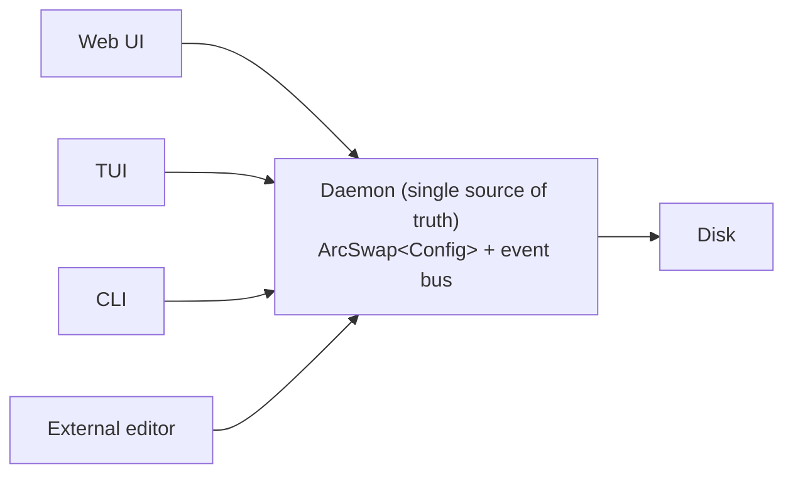
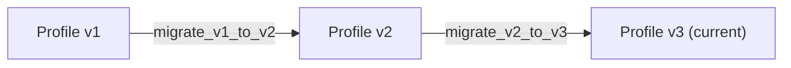

# 11 — Configuration & Profile Management

> The memory layer. Every profile, scene, calibration, and preference — persisted, portable, and conflict-free.

---

## Overview

Hypercolor's configuration system must serve four very different humans: Bliss, who symlinks everything from a dotfiles repo; Jake, who never opens a terminal; Marcus, who exports 15 profiles monthly; and Robin, who just migrated from Windows and expects magic. The system must be simultaneously git-friendly, web-UI-friendly, migration-proof, and multi-editor-safe.

**Core design principles:**

1. **TOML everywhere** — Human-readable, Rust-native, git-diffable
2. **XDG compliant** — Config, data, state, and cache in the right places
3. **Split files** — One concern per file, never a monolith
4. **Event-driven propagation** — Changes broadcast over the event bus; no polling
5. **Schema-versioned** — Every file declares its schema version; migrations are automatic
6. **Secrets never in TOML** — Keyring integration for tokens and API keys

---

## 1. Configuration File Structure

### XDG Directory Layout

```
$XDG_CONFIG_HOME/hypercolor/         # ~/.config/hypercolor/
├── hypercolor.toml                  # Main daemon config
├── devices/                         # Per-device config + calibration
│   ├── prism-8-abc123.toml
│   ├── wled-living-room.toml
│   └── razer-huntsman-v2.toml
├── layouts/                         # Spatial layout definitions
│   ├── default.toml
│   └── desktop-v2.toml
├── profiles/                        # Saved lighting states
│   ├── gaming.toml
│   ├── chill.toml
│   └── stream.toml
├── scenes/                          # Multi-profile compositions
│   ├── movie-night.toml
│   └── deep-work.toml
└── templates/                       # User-created profile templates
    └── my-base.toml

$XDG_DATA_HOME/hypercolor/           # ~/.local/share/hypercolor/
├── effects/                         # User-installed effects
│   ├── custom/                      # User's own effects
│   └── community/                   # Downloaded from marketplace
├── imports/                         # Staging area for imports
└── backups/                         # Auto-backup before migrations

$XDG_STATE_HOME/hypercolor/          # ~/.local/state/hypercolor/
├── last-profile.toml                # Active state on last shutdown
├── device-state.toml                # Last known device connections
└── migration.log                    # Migration audit trail

$XDG_CACHE_HOME/hypercolor/          # ~/.cache/hypercolor/
├── effect-thumbnails/               # Generated preview images
├── servo-cache/                     # Servo browser engine cache
└── discovery-cache.toml             # Cached mDNS/network discovery results

$XDG_RUNTIME_DIR/hypercolor/         # /run/user/1000/hypercolor/
├── hypercolor.sock                  # Unix domain socket (IPC)
├── hypercolor.pid                   # PID file
└── frame.shm                        # Shared memory for frame data (optional)
```

### System-Wide Defaults (Optional)

```
/etc/hypercolor/
├── hypercolor.toml                  # System admin defaults (merged under user config)
└── devices/                         # Org-wide device presets
```

Resolution order: `/etc/hypercolor/` < `$XDG_CONFIG_HOME/hypercolor/` < CLI flags < environment variables. Later values win. System config provides defaults; user config overrides.

### Main Configuration File

```toml
# ~/.config/hypercolor/hypercolor.toml
# Hypercolor daemon configuration
schema_version = 3

[daemon]
# Network
listen_address = "127.0.0.1"
port = 9420
unix_socket = true                     # Enable Unix socket IPC

# Performance
target_fps = 60
canvas_width = 320
canvas_height = 200
max_devices = 32

# Logging
log_level = "info"                     # trace, debug, info, warn, error
log_file = ""                          # Empty = stderr only; path enables file logging

# Service behavior
start_profile = "last"                 # "last" | "default" | profile name
shutdown_behavior = "hardware_default" # "hardware_default" | "off" | "static"
shutdown_color = "#1a1a2e"             # Used when shutdown_behavior = "static"

[web_ui]
enabled = true
open_browser = false                   # Auto-open browser on daemon start
cors_origins = []                      # Extra origins allowed only when API key auth is active
websocket_fps = 30                     # Preview frame rate for web clients
# API key auth is configured with HYPERCOLOR_API_KEY and HYPERCOLOR_READ_API_KEY.

[effect_engine]
# Renderer selection
preferred_renderer = "auto"            # "auto" | "wgpu" | "servo"
servo_enabled = true                   # Enable Servo path (HTML/Canvas effects)
wgpu_backend = "auto"                  # "auto" | "vulkan" | "opengl"

# Effect paths (in addition to XDG_DATA_HOME/hypercolor/effects/)
extra_effect_dirs = []

# Hot reload
watch_effects = true                   # Reload effects on file change
watch_config = true                    # Reload config on file change

[audio]
enabled = true
device = "default"                     # PulseAudio/PipeWire device name or "default"
fft_size = 1024
smoothing = 0.8                        # FFT smoothing factor (0.0 - 1.0)
noise_gate = 0.02                      # Below this level = silence
beat_sensitivity = 0.6                 # Beat detection threshold (0.0 - 1.0)

[screen_capture]
enabled = false
source = "auto"                        # "auto" | "pipewire" | "x11"
capture_fps = 30                       # Independent of render FPS
monitor = 0                            # Monitor index

[discovery]
# Auto-detect network devices
mdns_enabled = true
scan_interval_secs = 300               # Re-scan every 5 minutes
wled_scan = true
hue_scan = true
openrgb_host = "127.0.0.1"
openrgb_port = 6742

[dbus]
enabled = true
bus_name = "tech.hyperbliss.hypercolor1"

# Feature flags — experimental or in-progress features
[features]
wasm_plugins = false
hue_entertainment = false
midi_input = false
```

### Environment Variable Overrides

Every config key maps to an environment variable with `HYPERCOLOR_` prefix and `__` as separator:

```bash
HYPERCOLOR_DAEMON__PORT=9421
HYPERCOLOR_DAEMON__TARGET_FPS=30
HYPERCOLOR_WEB_UI__ENABLED=false
HYPERCOLOR_AUDIO__DEVICE="alsa_output.usb-Focusrite-monitor"
```

This lets systemd unit files or container environments override without touching config files.

---

## 2. Profile System

A profile is a complete, self-contained snapshot of a lighting state. It answers: "what does every zone look like right now?"

### Profile Schema

```toml
# ~/.config/hypercolor/profiles/gaming.toml
schema_version = 2

[profile]
id = "gaming"
name = "Gaming Mode"
description = "High-energy reactive lighting for gaming sessions"
author = "Bliss"
created = 2026-03-01T14:30:00Z
modified = 2026-03-15T09:12:00Z
tags = ["gaming", "audio-reactive", "high-energy"]

# Optional: inherit defaults from another profile, then override
base_profile = ""                      # Empty = no inheritance

# Global overrides (applied to all zones unless zone-specific)
[profile.defaults]
brightness = 0.85                      # 0.0 - 1.0
saturation = 1.0                       # 0.0 - 1.0 (applied as post-process)
speed = 1.0                            # Global speed multiplier
transition_ms = 500                    # Fade time when switching TO this profile

# Audio settings applied globally
[profile.defaults.audio]
enabled = true
sensitivity = 0.7                      # 0.0 - 1.0
bass_boost = 1.2                       # Multiplier for bass band
reactive_brightness = true             # Modulate brightness with audio level

# Per-zone effect assignments
[[profile.zones]]
zone_id = "prism-8-abc123:channel-0"   # device_id:zone_name
effect = "builtin/neon-shift"          # Effect path (relative to effect dirs)
layout = "default"                     # Which spatial layout to use

  [profile.zones.params]               # Effect-specific parameters
  speed = 75
  palette = "Aurora"

  [profile.zones.overrides]            # Zone-specific overrides
  brightness = 1.0                     # Override global for this zone
  saturation = 0.9

[[profile.zones]]
zone_id = "wled-desk-strip"
effect = "community/aurora"
layout = "default"

  [profile.zones.params]
  speed = 40
  color_1 = "#80ffea"
  color_2 = "#e135ff"

  [profile.zones.overrides]
  brightness = 0.6

[[profile.zones]]
zone_id = "razer-huntsman-v2:keyboard"
effect = "native/audio-spectrum"
layout = "default"

  [profile.zones.params]
  color_mode = "gradient"
  gradient_start = "#e135ff"
  gradient_end = "#80ffea"
  smoothing = 0.7

  [profile.zones.overrides]
  brightness = 0.75

  [profile.zones.audio]                # Zone-specific audio override
  sensitivity = 0.9
  bass_boost = 1.5

# Zones not listed inherit from defaults or remain unchanged
```

### Zone ID Format

Zone IDs follow a deterministic format for stability across restarts:

```
<device-id>:<zone-name>

Where device-id is:
  USB devices:   <backend>-<vid>-<pid>-<serial>      e.g. "hid-16d5-1f01-abc123"
  Network:       <backend>-<hostname-or-ip>           e.g. "wled-desk-strip"
  OpenRGB:       openrgb-<controller-id>-<zone-idx>   e.g. "openrgb-0-2"
  Hue:           hue-<bridge-id>-<light-id>           e.g. "hue-abc-12"

And zone-name is:
  The zone's human-readable slug                      e.g. "channel-0", "keyboard", "logo"
```

When a device serial or hostname changes (e.g., WLED renamed), the profile editor offers a re-mapping UI. Old IDs are kept as aliases in device config.

### Profile Inheritance

Profiles can extend a base profile. This enables "Gaming" as a base with "Gaming + Stream" layering on webcam-facing zones:

```toml
# profiles/gaming-stream.toml
[profile]
id = "gaming-stream"
name = "Gaming + Stream"
base_profile = "gaming"                # Inherit all zones from gaming

# Only override what's different
[[profile.zones]]
zone_id = "wled-cam-ring"             # Zone not in base = added
effect = "builtin/solid-color"
  [profile.zones.params]
  color = "#e135ff"
  [profile.zones.overrides]
  brightness = 0.4                     # Subtle, not distracting on camera
```

**Resolution order:** base profile defaults < base profile zones < child defaults < child zones. A child zone with the same `zone_id` fully replaces the base zone (no deep merge of params — that way lies madness).

### Profile Versioning

Every profile save increments an internal revision counter stored in state:

```toml
# ~/.local/state/hypercolor/profile-revisions.toml
[revisions]
gaming = 14
chill = 7
"gaming-stream" = 3
```

This is not for user consumption — it's the daemon's concurrency control mechanism. When a frontend submits a profile update, it includes the revision it was editing. If the revision doesn't match (another frontend edited it in the meantime), the daemon rejects the update with a conflict error, and the frontend must re-fetch.

---

## 3. Scene System

Scenes compose multiple profiles with transitions and optional scheduling triggers.

```toml
# ~/.config/hypercolor/scenes/movie-night.toml
schema_version = 1

[scene]
id = "movie-night"
name = "Movie Night"
description = "Dim everything, enable screen ambience on desk strip"
tags = ["media", "ambient", "relaxing"]

# Scene is a sequence of profile activations with transitions
[[scene.steps]]
profile = "movie-ambient"
transition = "fade"
transition_ms = 2000

# Optional: activate only specific zones from the profile
# (empty = all zones in the profile)
zone_filter = []

# Optional: schedule triggers
[scene.schedule]
enabled = false
# cron = "0 20 * * FRI"              # Every Friday at 8 PM
# condition = "audio_idle > 30s"     # Or: activate when audio is idle for 30s

# Optional: D-Bus / HA triggers
[scene.triggers]
dbus_signal = ""                       # e.g., "org.mpris.MediaPlayer2.Playing"
home_assistant_entity = ""             # e.g., "media_player.living_room"
home_assistant_state = ""              # e.g., "playing"
```

### Multi-Step Scenes

For more complex scenarios — "sunset to night" progressive transitions:

```toml
# scenes/evening-progression.toml
[scene]
id = "evening-progression"
name = "Evening Progression"

[[scene.steps]]
profile = "sunset-warm"
transition = "fade"
transition_ms = 3000
hold_ms = 0                            # 0 = hold indefinitely until next trigger

[[scene.steps]]
profile = "night-dim"
transition = "fade"
transition_ms = 5000
delay_ms = 1800000                     # 30 minutes after previous step
hold_ms = 0

# trigger = "time" means steps auto-advance based on delay_ms
[scene.playback]
mode = "sequential"                    # "sequential" | "manual" (advance via API)
loop = false
```

---

## 4. Live Config Editing

### The Multi-Editor Problem

Four frontends can simultaneously modify configuration:



### Architecture: Daemon as Authority

The daemon holds the canonical config in memory via `arc_swap::ArcSwap<Config>`. All mutations flow through the daemon. Frontends are clients, never writers.

```rust
pub struct ConfigManager {
    /// The live config — atomically swappable, lock-free reads
    config: ArcSwap<HypercolorConfig>,

    /// Monotonic revision counter for optimistic concurrency
    revision: AtomicU64,

    /// Filesystem watcher for external edits
    watcher: notify::RecommendedWatcher,

    /// Event bus for broadcasting changes
    bus: broadcast::Sender<ConfigEvent>,
}

pub enum ConfigEvent {
    /// A specific config section changed
    ConfigChanged {
        section: ConfigSection,
        revision: u64,
        source: ChangeSource,
    },

    /// A profile was created, updated, or deleted
    ProfileChanged {
        id: String,
        action: ChangeAction,
        revision: u64,
    },

    /// Device config or calibration changed
    DeviceConfigChanged {
        device_id: String,
        revision: u64,
    },

    /// Layout changed
    LayoutChanged {
        layout_id: String,
        revision: u64,
    },

    /// Config conflict detected (external edit while unsaved changes)
    ConflictDetected {
        path: PathBuf,
        expected_revision: u64,
        actual_revision: u64,
    },
}

pub enum ChangeSource {
    WebUI,
    TUI,
    CLI,
    DBus,
    FileSystem,   // External editor / hot-reload
    Migration,
    API,
}

pub enum ChangeAction {
    Created,
    Updated,
    Deleted,
}
```

### Mutation Flow

```
1. Frontend sends: PATCH /api/config/audio { sensitivity: 0.9, revision: 14 }
2. Daemon checks: current revision == 14?
   - Yes → apply change, increment to 15, persist to disk, broadcast ConfigChanged
   - No  → return 409 Conflict with current revision + current values
3. All connected frontends receive ConfigChanged event via WebSocket / Unix socket
4. Each frontend updates its local state from the event payload
```

### External File Editing (Hot-Reload)

The daemon watches `$XDG_CONFIG_HOME/hypercolor/` with `notify`:

```rust
impl ConfigManager {
    fn handle_fs_event(&self, event: notify::Event) {
        match event.kind {
            EventKind::Modify(_) | EventKind::Create(_) => {
                // Debounce: wait 100ms for editor save-rename patterns
                // (vim writes to .swp, renames; nano writes directly)
                tokio::time::sleep(Duration::from_millis(100)).await;

                // Re-read the file
                let new_config = self.reload_file(&event.paths[0]);

                // If valid, apply and broadcast
                match new_config {
                    Ok(config) => {
                        self.apply(config, ChangeSource::FileSystem);
                    }
                    Err(e) => {
                        // Invalid TOML — log warning, keep current config
                        tracing::warn!(
                            path = %event.paths[0].display(),
                            error = %e,
                            "External config edit produced invalid TOML — ignoring"
                        );
                        self.bus.send(ConfigEvent::ParseError {
                            path: event.paths[0].clone(),
                            error: e.to_string(),
                        });
                    }
                }
            }
            _ => {}
        }
    }
}
```

### Conflict Resolution Strategy

**Last-write-wins with revision gating.** The daemon never merges — it accepts or rejects wholesale:

| Scenario                                                      | Behavior                                                                                                                                     |
| ------------------------------------------------------------- | -------------------------------------------------------------------------------------------------------------------------------------------- |
| Web UI edits brightness while TUI is open                     | TUI receives `ConfigChanged`, updates its slider                                                                                             |
| CLI applies a profile while Web UI is showing controls        | Web UI receives `ProfileChanged`, refreshes the panel                                                                                        |
| Vim saves `hypercolor.toml` while Web UI has unsaved changes  | Daemon reloads from disk, broadcasts `ConfigChanged` with `source: FileSystem`. Web UI shows "Config updated externally" toast and refreshes |
| Two frontends submit conflicting changes at the same revision | First one wins (revision increments). Second gets 409 Conflict                                                                               |

**Why not CRDT / OT?** Config is small, changes are infrequent (not a collaborative text editor), and the mental model of "reload from daemon" is simple for users. Optimistic concurrency with revision checking is the right complexity level.

---

## 5. Device Configuration

Each discovered device gets its own config file. Created automatically on first detection, editable by the user.

```toml
# ~/.config/hypercolor/devices/hid-16d5-1f01-abc123.toml
schema_version = 1

[device]
id = "hid-16d5-1f01-abc123"
name = "Prism 8 — Case Fans"          # User-assigned friendly name
backend = "hid"
vendor_id = "16d5"
product_id = "1f01"
serial = "abc123"
enabled = true

# Previous IDs (for profile portability when hardware changes)
aliases = []

[device.protocol]
# Backend-specific protocol settings
color_format = "grb"                   # "rgb" | "grb" | "bgr"
brightness_multiplier = 0.75           # Hardware-specific brightness cap
frame_rate = 60                        # Device-specific FPS target

[device.zones]
# Zone definitions — auto-detected, user-refinable
[[device.zones.list]]
name = "channel-0"
led_count = 54                         # Auto-detected or user-set
topology = "strip"
enabled = true

[[device.zones.list]]
name = "channel-1"
led_count = 16
topology = "ring"
enabled = true

[[device.zones.list]]
name = "channel-2"
led_count = 0                          # Empty channel
enabled = false

# ... up to channel-7 for Prism 8

# Calibration (see Section 7)
[device.calibration]
brightness_curve = "linear"            # "linear" | "gamma" | "custom"
gamma = 2.2
white_point = [255, 240, 220]         # Per-channel max (some LEDs have blue/green tint)
color_temp_k = 6500                    # Target color temperature

# Shutdown behavior for this specific device
[device.shutdown]
behavior = "static"                    # "off" | "static" | "hardware_default"
color = "#1a1a2e"
```

### Network Device Config

```toml
# ~/.config/hypercolor/devices/wled-desk-strip.toml
schema_version = 1

[device]
id = "wled-desk-strip"
name = "Desk Underglow"
backend = "wled"
hostname = "wled-desk.local"           # mDNS name or IP
ip = "192.168.1.42"                    # Resolved / static IP
enabled = true
aliases = ["wled-192.168.1.42"]        # Old ID before mDNS rename

[device.protocol]
transport = "ddp"                      # "ddp" | "e131"
color_format = "rgb"
brightness_multiplier = 1.0

# WLED-specific
[device.protocol.wled]
segment = 0                            # WLED segment to control (0 = all)

[device.zones]
[[device.zones.list]]
name = "strip"
led_count = 120
topology = "strip"
enabled = true

[device.calibration]
brightness_curve = "gamma"
gamma = 2.8                            # WLED strips often need higher gamma
white_point = [255, 255, 255]
color_temp_k = 6500
```

### Hue Device Config

```toml
# ~/.config/hypercolor/devices/hue-bridge1-light12.toml
schema_version = 1

[device]
id = "hue-bridge1-light12"
name = "Desk Lamp (Hue)"
backend = "hue"
bridge_id = "bridge1"
light_id = "12"
enabled = true

[device.protocol]
transport = "entertainment"            # "entertainment" | "rest"
color_format = "rgb"
# Hue API token stored in system keyring, NOT here
# Key: "hypercolor/hue/bridge1/token"

[device.zones]
[[device.zones.list]]
name = "bulb"
led_count = 1
topology = "single"
enabled = true

[device.calibration]
gamut = "C"                            # Hue color gamut (A, B, C)
brightness_curve = "gamma"
gamma = 2.2
min_brightness = 0.01                  # Hue bulbs flicker below certain levels
transition_time_ms = 100               # Hue-specific transition smoothing
```

---

## 6. Spatial Layout Configuration

Layouts map devices to positions on the 320x200 effect canvas.

```toml
# ~/.config/hypercolor/layouts/default.toml
schema_version = 1

[layout]
id = "default"
name = "Desktop Setup"
description = "Primary desktop with case, desk strip, and peripherals"
canvas_width = 320
canvas_height = 200
created = 2026-03-01T14:30:00Z
modified = 2026-03-15T09:12:00Z

# Background image for the layout editor (optional)
background_image = ""                  # Path to setup photo for alignment reference

[[layout.zones]]
device_id = "hid-16d5-1f01-abc123"
zone_name = "channel-0"

# Position on canvas (normalized 0.0 - 1.0)
x = 0.1
y = 0.3
width = 0.8
height = 0.05
rotation = 0.0                         # Degrees

# LED arrangement within the zone
topology = "strip"
led_count = 54
direction = "left-to-right"            # "left-to-right" | "right-to-left" | "top-to-bottom" | etc.
mirror = false
zigzag = false                         # For matrix: alternate row directions

[[layout.zones]]
device_id = "wled-desk-strip"
zone_name = "strip"
x = 0.05
y = 0.85
width = 0.9
height = 0.03
rotation = 0.0
topology = "strip"
led_count = 120
direction = "left-to-right"

[[layout.zones]]
device_id = "hid-16d5-1f01-abc123"
zone_name = "channel-1"
x = 0.45
y = 0.15
width = 0.1
height = 0.1
rotation = 0.0
topology = "ring"
led_count = 16
direction = "clockwise"

[[layout.zones]]
device_id = "razer-huntsman-v2"
zone_name = "keyboard"
x = 0.15
y = 0.65
width = 0.7
height = 0.15
rotation = 0.0
topology = "matrix"
led_count = 110
matrix_width = 22
matrix_height = 5
direction = "left-to-right"

# Strimer cable — uses a grid layout
[[layout.zones]]
device_id = "hid-16d0-1294-strimer1"
zone_name = "atx-24pin"
x = 0.0
y = 0.0
width = 0.3
height = 0.2
rotation = 15.0                        # Angled for the Strimer's actual orientation
topology = "matrix"
led_count = 120
matrix_width = 20
matrix_height = 6
direction = "left-to-right"

# Custom topology with explicit LED positions (for irregular shapes)
[[layout.zones]]
device_id = "hue-bridge1-light12"
zone_name = "bulb"
x = 0.85
y = 0.5
width = 0.05
height = 0.05
rotation = 0.0
topology = "custom"
led_count = 1
# For custom topology, explicit positions (normalized within zone bounds)
led_positions = [[0.5, 0.5]]
```

### Layout Presets

Common device geometries ship as built-in presets that users can drag into the layout editor:

```toml
# Built into the binary (resources/devices/presets/)
# Lian Li Strimer Plus V2 — ATX 24-pin
[preset]
name = "Strimer V2 ATX 24-pin"
vendor = "Lian Li"
topology = "matrix"
led_count = 120
matrix_width = 20
matrix_height = 6
default_width = 0.3
default_height = 0.2

# Corsair LL120 Fan
[preset]
name = "Corsair LL120 Fan"
vendor = "Corsair"
topology = "ring"
led_count = 16
default_width = 0.08
default_height = 0.08
```

---

## 7. Device Calibration

### Why Calibration Matters

- A WS2812B strip at full white draws enough current to droop voltage and shift colors
- PrismRGB Prism 8 uses GRB byte order; Prism S uses RGB
- Some LED strips have a blue tint at low brightness; others are warm
- A Hue bulb's "red" is not the same red as a WLED strip's "red"
- Brightness perception is non-linear — gamma correction is essential

### Calibration Schema (Per-Device)

```toml
# Within device config: [device.calibration]

[device.calibration]
# Brightness
brightness_curve = "gamma"             # "linear" | "gamma" | "cie1931" | "custom"
gamma = 2.2                            # For gamma curve
max_brightness = 0.75                  # Hard cap (0.0 - 1.0) — prevents blinding LEDs
min_brightness = 0.0                   # Floor (some devices flicker below a threshold)

# Color correction
white_point = [255, 240, 220]         # RGB max values (corrects tint)
color_temp_k = 6500                    # Target color temperature for whites
gamma_rgb = [2.2, 2.2, 2.2]          # Per-channel gamma (fine-tuning)

# Color order (auto-detected for known devices, configurable for generic)
color_format = "rgb"                   # "rgb" | "grb" | "bgr" | "rgbw" | "grbw"

# LED geometry
led_count = 120                        # Actual connected LEDs (may differ from max)
led_density = 60                       # LEDs per meter (for spatial calculations)

# Power limiting
power_limit_watts = 0.0               # 0 = unlimited. Non-zero enables power estimation
power_per_led_mw = 60                  # Milliwatts per LED at full white (WS2812B ~60mW)
voltage = 5.0                          # Supply voltage

# Custom brightness curve (when brightness_curve = "custom")
# LUT: input brightness (0-255) → output brightness (0-255)
# Only needs key points; values are linearly interpolated
[device.calibration.custom_curve]
points = [[0, 0], [64, 10], [128, 50], [192, 130], [255, 255]]
```

### CIE 1931 Brightness Curve

For physically accurate brightness perception, the CIE 1931 lightness function:

```rust
/// CIE 1931 lightness correction
/// Maps linear brightness (0.0-1.0) to perceptually uniform brightness
fn cie1931(brightness: f32) -> f32 {
    if brightness <= 0.08 {
        brightness / 903.3
    } else {
        ((brightness + 0.16) / 1.16).powf(3.0)
    }
}
```

This is applied as a post-processing step in the `SpatialSampler`, after effect rendering and before device output. Each device's calibration is applied independently.

### Calibration Wizard

The web UI offers a guided calibration flow:

1. **White balance** — Display pure white, user adjusts RGB sliders until the LED looks neutral white
2. **Brightness range** — Ramp from 0 to 100%, user marks where flickering starts (min) and where it's painfully bright (max)
3. **Gamma** — Display a grayscale gradient, user picks the gamma that looks most even
4. **Color accuracy** — Display primary colors (R, G, B), user confirms they look correct or adjusts

Results are saved to `[device.calibration]` in the device config file.

---

## 8. Import/Export

### Export Formats

#### Full Backup

```bash
hypercolor export --full --output ~/hypercolor-backup-2026-03-15.tar.gz
```

Creates a compressed archive of the entire config tree:

```
hypercolor-backup-2026-03-15.tar.gz
├── manifest.toml                      # Backup metadata
├── config/
│   ├── hypercolor.toml
│   ├── devices/
│   ├── layouts/
│   ├── profiles/
│   ├── scenes/
│   └── templates/
└── effects/
    ├── custom/
    └── community/
```

Manifest:

```toml
[backup]
version = 1
hypercolor_version = "0.1.0"
created = 2026-03-15T10:30:00Z
hostname = "nova-desktop"
device_count = 8
profile_count = 15
effect_count = 42

# Device list (for import mapping)
[[backup.devices]]
id = "hid-16d5-1f01-abc123"
name = "Prism 8 — Case Fans"
backend = "hid"

[[backup.devices]]
id = "wled-desk-strip"
name = "Desk Underglow"
backend = "wled"
```

#### Single Profile Export

```bash
hypercolor export --profile gaming --output gaming.hypercolor.toml
```

Produces a self-contained TOML file with the profile + referenced effect metadata (but not effect files themselves — those are identified by path/id for the recipient to install):

```toml
# gaming.hypercolor.toml
[export]
type = "profile"
hypercolor_version = "0.1.0"
exported = 2026-03-15T10:30:00Z
exported_by = "Bliss"

# The profile itself (complete copy)
[profile]
# ... full profile TOML as defined in Section 2 ...

# Effect references (so the importer knows what to install)
[[export.effects]]
id = "builtin/neon-shift"
source = "builtin"                     # "builtin" | "community" | "custom"

[[export.effects]]
id = "community/aurora"
source = "community"
url = "https://effects.hypercolor.dev/aurora"  # Optional: download link
```

### Import

```bash
hypercolor import gaming.hypercolor.toml
```

Import flow:

1. Parse the file, validate schema version
2. Check for effect dependencies — warn if any are missing
3. If device IDs don't match local devices, prompt for re-mapping:
   ```
   Profile references device "hid-16d5-1f01-abc123" (Prism 8 — Case Fans)
   No matching device found. Map to:
     1. hid-16d5-1f01-def456 (Prism 8 — Top Fans)
     2. Skip this zone
     3. Import anyway (fix later)
   ```
4. Save profile to `~/.config/hypercolor/profiles/`
5. Optionally activate immediately

### LightScript Import Wizard

For users migrating from Windows, Hypercolor can import existing configuration:

```bash
hypercolor import --lightscript /mnt/windows/Users/Stefanie/AppData/Local/VortxEngine/
```

**What it reads:**

| Source                           | Hypercolor Target                                        |
| -------------------------------- | -------------------------------------------------------- |
| `Effects/*.html`                 | `$XDG_DATA_HOME/hypercolor/effects/community/`           |
| `settings.json` (device layouts) | `~/.config/hypercolor/layouts/imported-lightscript.toml` |
| `profiles/`                      | `~/.config/hypercolor/profiles/imported-*.toml`          |
| Device → effect mappings         | Best-effort zone assignments in profile                  |

**What it translates:**

```rust
pub struct LightScriptImporter {
    /// Parse settings.json for device layouts
    fn import_layout(&self, settings: &Path) -> Result<SpatialLayout>;

    /// Copy effect HTML files, strip platform-specific paths
    fn import_effects(&self, effects_dir: &Path) -> Result<Vec<EffectInfo>>;

    /// Map source device names to Hypercolor device IDs
    /// Uses fuzzy matching on device names + VID/PID when available
    fn map_devices(&self, source_devices: &[SourceDevice]) -> Vec<DeviceMapping>;

    /// Generate a migration report
    fn report(&self) -> MigrationReport;
}

pub struct MigrationReport {
    pub effects_imported: usize,
    pub effects_skipped: Vec<(String, String)>,  // (name, reason)
    pub devices_mapped: Vec<DeviceMapping>,
    pub devices_unmapped: Vec<String>,
    pub warnings: Vec<String>,
}
```

**Known limitations documented in the wizard output:**

- The LightScript canvas is always 320x200; Hypercolor matches this by default
- The `<meta>` control values map directly to Lightscript globals
- WebGL effects require Servo renderer (won't work with wgpu path)
- Screen Ambience effect needs PipeWire reconfiguration for Linux
- Hardware lighting (Prism Mini `0xBB` commands) needs separate per-device config

---

## 9. Migration System

### Schema Versioning

Every config file carries a `schema_version` integer at the top level. The daemon validates this on load.

```rust
pub struct MigrationEngine {
    migrations: BTreeMap<(ConfigKind, u32, u32), Box<dyn Migration>>,
}

pub trait Migration: Send + Sync {
    /// Source and target schema versions
    fn from_version(&self) -> u32;
    fn to_version(&self) -> u32;

    /// Which config file type this applies to
    fn config_kind(&self) -> ConfigKind;

    /// Transform the TOML document in place
    fn migrate(&self, doc: &mut toml_edit::DocumentMut) -> Result<()>;

    /// Human-readable description of what changed
    fn description(&self) -> &str;
}

pub enum ConfigKind {
    Main,
    Device,
    Layout,
    Profile,
    Scene,
}
```

### Migration Chain

Migrations form a linear chain per config kind. The engine walks from the file's current version to the latest:



### Concrete Migration Example

```rust
pub struct ProfileV1ToV2;

impl Migration for ProfileV1ToV2 {
    fn from_version(&self) -> u32 { 1 }
    fn to_version(&self) -> u32 { 2 }
    fn config_kind(&self) -> ConfigKind { ConfigKind::Profile }

    fn description(&self) -> &str {
        "Add audio sensitivity settings per zone (previously global-only)"
    }

    fn migrate(&self, doc: &mut toml_edit::DocumentMut) -> Result<()> {
        // v1 had [profile.audio] at top level only
        // v2 adds optional [profile.zones.audio] per zone
        // Migration: copy global audio settings as defaults, no zone overrides
        // (preserves exact behavior — zones inherit from defaults)

        doc["schema_version"] = toml_edit::value(2);

        // No structural changes needed — v2 just adds an optional field
        // that defaults to inheriting from [profile.defaults.audio]
        Ok(())
    }
}
```

### Migration Safety

1. **Auto-backup before migration** — The original file is copied to `$XDG_DATA_HOME/hypercolor/backups/` with a timestamp suffix before any modification
2. **Atomic writes** — Write to `.tmp` file, then `rename()` (atomic on Linux/ext4/btrfs)
3. **Migration log** — Every migration is recorded in `$XDG_STATE_HOME/hypercolor/migration.log`:
   ```
   2026-03-15T10:30:00Z  profiles/gaming.toml  v1 → v2  "Add audio sensitivity settings per zone"
   2026-03-15T10:30:00Z  hypercolor.toml       v2 → v3  "Add feature flags section"
   ```
4. **Dry-run mode** — `hypercolor migrate --dry-run` shows what would change without modifying files

### Backward Compatibility Guarantees

| Guarantee                            | Policy                                                                                |
| ------------------------------------ | ------------------------------------------------------------------------------------- |
| **Config files from older versions** | Always auto-migrated on daemon start                                                  |
| **Config files from newer versions** | Rejected with clear error ("this config requires Hypercolor >= 0.5.0")                |
| **Removed settings**                 | Preserved as `[deprecated]` section for one major version, then stripped              |
| **Renamed settings**                 | Migration renames them; old name works for one major version with deprecation warning |
| **Breaking schema changes**          | Only in major versions (0.x → 1.0, 1.x → 2.0). Always accompanied by auto-migration   |

### Version Compatibility Header

Every config file can optionally declare minimum version:

```toml
schema_version = 3
min_hypercolor_version = "0.3.0"       # Optional: reject if daemon is too old
```

---

## 10. Defaults & Templates

### Sensible Defaults

Every config field has a compile-time default in Rust via `Default` impl and `serde` defaults. A fresh Hypercolor install with zero config files must work — the daemon creates `hypercolor.toml` with defaults on first run.

```rust
#[derive(Debug, Clone, Serialize, Deserialize)]
pub struct DaemonConfig {
    #[serde(default = "default_listen_address")]
    pub listen_address: String,

    #[serde(default = "default_port")]
    pub port: u16,

    #[serde(default = "default_target_fps")]
    pub target_fps: u32,

    // ...
}

fn default_listen_address() -> String { "127.0.0.1".into() }
fn default_port() -> u16 { 9420 }
fn default_target_fps() -> u32 { 60 }
```

### Device-Specific Defaults

When a device is first detected, its config file is generated with vendor-specific defaults:

```rust
pub fn defaults_for_device(vid: u16, pid: u16) -> DeviceDefaults {
    match (vid, pid) {
        // PrismRGB Prism 8 — GRB, 75% brightness cap
        (0x16D5, 0x1F01) => DeviceDefaults {
            color_format: ColorFormat::GRB,
            brightness_multiplier: 0.75,
            frame_rate: 60,
            zones: vec![
                ZoneDefault::new("channel-0", 126, Topology::Strip),
                ZoneDefault::new("channel-1", 126, Topology::Strip),
                // ... channels 2-7
            ],
            ..Default::default()
        },

        // PrismRGB Prism S — RGB, 50% brightness
        (0x16D0, 0x1294) => DeviceDefaults {
            color_format: ColorFormat::RGB,
            brightness_multiplier: 0.50,
            frame_rate: 33,
            zones: vec![
                ZoneDefault::new("atx-24pin", 120, Topology::Matrix { w: 20, h: 6 }),
                ZoneDefault::new("gpu-8pin", 108, Topology::Matrix { w: 27, h: 4 }),
            ],
            ..Default::default()
        },

        // WLED — sane network defaults
        _ if is_wled => DeviceDefaults {
            color_format: ColorFormat::RGB,
            brightness_multiplier: 1.0,
            calibration: CalibrationDefaults {
                gamma: 2.8,  // LED strips need higher gamma than monitors
                ..Default::default()
            },
            ..Default::default()
        },

        // Generic fallback
        _ => DeviceDefaults::default(),
    }
}
```

### Profile Templates

Ship with the binary. Users can apply them as starting points.

```toml
# Built-in template: Gaming
# resources/templates/gaming.toml
[profile]
id = "template:gaming"
name = "Gaming"
description = "High-energy audio-reactive lighting. Intense colors, fast response."
tags = ["gaming", "audio-reactive", "template"]

[profile.defaults]
brightness = 0.85
saturation = 1.0
speed = 1.2
transition_ms = 200                    # Fast transitions

[profile.defaults.audio]
enabled = true
sensitivity = 0.8
bass_boost = 1.3
reactive_brightness = true
```

```toml
# Built-in template: Chill
# resources/templates/chill.toml
[profile]
id = "template:chill"
name = "Chill"
description = "Relaxed ambient glow. Slow color shifts, low brightness."
tags = ["ambient", "relaxing", "template"]

[profile.defaults]
brightness = 0.4
saturation = 0.7
speed = 0.3
transition_ms = 2000                   # Slow fades

[profile.defaults.audio]
enabled = false
```

```toml
# Built-in template: Work
# resources/templates/work.toml
[profile]
id = "template:work"
name = "Work"
description = "Minimal distraction. Static warm white on desk, everything else dim."
tags = ["productivity", "minimal", "template"]

[profile.defaults]
brightness = 0.3
saturation = 0.0                       # Desaturated = less distracting
speed = 0.0
transition_ms = 1000
```

```toml
# Built-in template: Stream
# resources/templates/stream.toml
[profile]
id = "template:stream"
name = "Stream"
description = "Camera-friendly lighting with accent colors for brand consistency."
tags = ["streaming", "webcam", "template"]

[profile.defaults]
brightness = 0.5                       # Not too bright on camera
saturation = 0.8
speed = 0.5
transition_ms = 800

[profile.defaults.audio]
enabled = true
sensitivity = 0.5                      # Subtle reactivity
bass_boost = 1.0
reactive_brightness = false            # Stable brightness for camera
```

```toml
# Built-in template: Movie Night
# resources/templates/movie.toml
[profile]
id = "template:movie"
name = "Movie Night"
description = "Screen-reactive ambient lighting. Extends your display into the room."
tags = ["media", "screen-capture", "ambient", "template"]

[profile.defaults]
brightness = 0.5
saturation = 0.9
speed = 1.0
transition_ms = 500

[profile.defaults.audio]
enabled = false                        # Screen capture drives the lighting
```

### Factory Reset

```bash
hypercolor reset --confirm
```

1. Backs up current config to `$XDG_DATA_HOME/hypercolor/backups/pre-reset-<timestamp>/`
2. Removes all files from `$XDG_CONFIG_HOME/hypercolor/`
3. Regenerates defaults on next daemon start
4. Preserves `$XDG_DATA_HOME/hypercolor/effects/` (user's installed effects are not config)

Partial reset:

```bash
hypercolor reset --profiles           # Delete all profiles, keep device config
hypercolor reset --devices            # Re-detect all devices, lose calibration
hypercolor reset --layouts            # Delete spatial layouts
```

---

## 11. Secret Management

### What Needs Secrets

| Secret                      | Source                        | Used For                           |
| --------------------------- | ----------------------------- | ---------------------------------- |
| Hue bridge API token        | Bridge link-button pairing    | Hue REST/Entertainment API         |
| WLED auth token             | WLED web UI (if auth enabled) | Authenticated API access           |
| Web UI password             | User-configured               | Remote access to Hypercolor web UI |
| Future: HA long-lived token | Home Assistant settings       | HA REST API integration            |
| Future: MQTT credentials    | MQTT broker                   | Pub/sub integration                |

### Storage Strategy

**Never in TOML. Never in git.**

```rust
pub trait SecretStore: Send + Sync {
    fn get(&self, key: &str) -> Result<Option<String>>;
    fn set(&self, key: &str, value: &str) -> Result<()>;
    fn delete(&self, key: &str) -> Result<()>;
    fn list_keys(&self) -> Result<Vec<String>>;
}
```

**Keyring backend hierarchy (tried in order):**

1. **Secret Service API** (D-Bus) — Works with GNOME Keyring, KDE Wallet, KeePassXC
2. **`$XDG_DATA_HOME/hypercolor/.secrets`** — Encrypted file fallback (for headless/SSH systems)
3. **Environment variables** — `HYPERCOLOR_SECRET_HUE_TOKEN`, etc.

```rust
pub struct KeyringStore {
    service: String,  // "hypercolor"
}

impl SecretStore for KeyringStore {
    fn get(&self, key: &str) -> Result<Option<String>> {
        // Uses the `keyring` crate which auto-selects:
        // - Linux: Secret Service D-Bus API (GNOME Keyring / KDE Wallet)
        // - Fallback: encrypted file via `keyring::credential::LinuxStore`
        let entry = keyring::Entry::new(&self.service, key)?;
        match entry.get_password() {
            Ok(secret) => Ok(Some(secret)),
            Err(keyring::Error::NoEntry) => Ok(None),
            Err(e) => Err(e.into()),
        }
    }

    fn set(&self, key: &str, value: &str) -> Result<()> {
        let entry = keyring::Entry::new(&self.service, key)?;
        entry.set_password(value)?;
        Ok(())
    }
}
```

**Key naming convention:**

```
hypercolor/hue/<bridge-id>/token
hypercolor/wled/<device-id>/auth
hypercolor/web-ui/password
hypercolor/ha/token
```

### Config File References

Device config references secrets by key name, never by value:

```toml
# In device config
[device.protocol.hue]
bridge_id = "bridge1"
# Token stored in keyring at "hypercolor/hue/bridge1/token"
# NOT stored here
```

The daemon resolves secrets at runtime. If a secret is missing, the device enters a "needs setup" state visible in the web UI.

### CLI Secret Management

```bash
hypercolor secret set hue/bridge1/token "your-token-here"
hypercolor secret get hue/bridge1/token
hypercolor secret delete hue/bridge1/token
hypercolor secret list
```

---

## 12. Dotfiles Integration

### Design for Symlinkability

The entire `$XDG_CONFIG_HOME/hypercolor/` tree is designed to live in a git repo and be symlinked into place:

```
~/dev/dotfiles/
├── hypercolor/
│   ├── hypercolor.toml
│   ├── devices/
│   │   ├── prism-8-abc123.toml
│   │   └── wled-desk-strip.toml
│   ├── layouts/
│   │   └── default.toml
│   ├── profiles/
│   │   ├── gaming.toml
│   │   ├── chill.toml
│   │   └── work.toml
│   └── scenes/
│       └── movie-night.toml
└── install.conf.yaml                  # DotBot config
```

DotBot link:

```yaml
# install.conf.yaml
- link:
    ~/.config/hypercolor: hypercolor
```

**What's safe to commit:** Everything. Secrets are in the system keyring, not in these files. Device configs contain hardware IDs (not sensitive) and calibration data (useful to version).

### Machine-Specific Overrides

For users with multiple machines (desktop + laptop), use include directives:

```toml
# hypercolor.toml (shared base)
schema_version = 3

[daemon]
port = 9420
target_fps = 60

# Machine-specific overrides
# This file is NOT in the dotfiles repo — it's local to each machine
include = ["hypercolor.local.toml"]
```

```toml
# hypercolor.local.toml (on desktop — not in git)
[daemon]
listen_address = "0.0.0.0"            # Allow LAN access on desktop

[audio]
device = "alsa_output.usb-Focusrite-monitor"

[discovery]
openrgb_host = "127.0.0.1"
```

```toml
# hypercolor.local.toml (on laptop — not in git)
[daemon]
listen_address = "127.0.0.1"          # Localhost only on laptop

[audio]
device = "default"

[discovery]
openrgb_host = ""                      # No OpenRGB on laptop
```

**Include resolution:**

```rust
fn load_config(path: &Path) -> Result<HypercolorConfig> {
    let mut config: HypercolorConfig = toml::from_str(&fs::read_to_string(path)?)?;

    // Process includes (one level deep — no recursive includes)
    if let Some(includes) = &config.include {
        for include_path in includes {
            let include_file = path.parent().unwrap().join(include_path);
            if include_file.exists() {
                let override_config: HypercolorConfig =
                    toml::from_str(&fs::read_to_string(&include_file)?)?;
                config.merge(override_config);  // Deep merge, override wins
            }
            // Missing include files are silently ignored (they're optional)
        }
    }

    Ok(config)
}
```

### .gitignore Recommendations

Generated automatically on `hypercolor init` or documented in the project wiki:

```gitignore
# Hypercolor dotfiles .gitignore

# Machine-specific overrides (not shared)
hypercolor.local.toml

# State files (runtime, not config)
# These live in XDG_STATE_HOME anyway, but just in case
*.pid
*.sock
*.shm

# Never commit (shouldn't be here, but safety net)
.secrets
*.key
*.pem
```

### Profile-Per-Machine Strategy

For different profiles on different machines, use the same profile names with machine-specific zone assignments:

```toml
# profiles/gaming.toml (in dotfiles — shared)
[profile]
id = "gaming"
name = "Gaming Mode"

[profile.defaults]
brightness = 0.85
speed = 1.2

[profile.defaults.audio]
enabled = true
sensitivity = 0.8

# Desktop zones — these device IDs only exist on the desktop
[[profile.zones]]
zone_id = "hid-16d5-1f01-abc123:channel-0"
effect = "builtin/neon-shift"
  [profile.zones.params]
  speed = 75

# Laptop zones — these device IDs only exist on the laptop
[[profile.zones]]
zone_id = "wled-laptop-strip:strip"
effect = "builtin/neon-shift"
  [profile.zones.params]
  speed = 50
```

The daemon gracefully ignores zones referencing devices that aren't connected. The profile works on both machines — each machine just activates its own zones. No per-machine branching needed.

---

## 13. Persona Scenarios

### Bliss — The Dotfiles Sorcerer

Bliss has a `~/dev/dotfiles` repo managed by DotBot. Different machines, same config.

**Setup:**

```bash
# In dotfiles repo
mkdir -p hypercolor/{devices,layouts,profiles,scenes}

# DotBot config
echo '- link:
    ~/.config/hypercolor: hypercolor' >> install.conf.yaml

dotbot -c install.conf.yaml
```

**Daily workflow:**

```bash
# Edit a profile in Neovim
nvim ~/.config/hypercolor/profiles/gaming.toml
# Daemon hot-reloads automatically — changes appear on LEDs in <200ms

# Commit the change to dotfiles
cd ~/dev/dotfiles
git add hypercolor/profiles/gaming.toml
git commit -m "hypercolor: tune gaming profile bass boost"

# On laptop (after git pull + dotbot install):
# Same profile, different devices — just works
```

**Machine differences:**

- Desktop: 12 devices, Prism 8 + WLED + Razer + Hue. `hypercolor.local.toml` opens port to LAN
- Laptop: 2 WLED strips. `hypercolor.local.toml` uses localhost only
- Same profiles in git. Zones for absent devices are silently skipped

---

### Jake — The Web UI Purist

Jake installed Hypercolor from AUR, started the systemd service, and opened `localhost:9420`. He has never and will never open a terminal for RGB configuration.

**First-run experience:**

1. Daemon starts, auto-discovers 4 WLED devices and OpenRGB controller
2. Opens `localhost:9420` — web UI shows "Welcome" wizard
3. Wizard: "We found 5 devices! Let's set up your layout."
4. Drag-and-drop spatial editor: place device zones on a canvas
5. "Pick a starting profile" — selects "Chill" template
6. Done. LEDs are glowing. Total config files created: 6 (all auto-generated)

**Making changes:**

- Brightness slider in web UI → daemon receives PATCH, saves to disk, broadcasts event
- Tries a new effect → drag from effect browser to a device zone
- Creates a new profile → "Save As" button → names it "Evening" → `evening.toml` auto-created
- The TOML files exist, perfectly formatted, but Jake never sees them

---

### Marcus — The Archivist

Marcus has 15 profiles and exports a full backup on the first of every month.

**Backup workflow:**

```bash
# Monthly backup (could be a cron job)
hypercolor export --full --output ~/backups/hypercolor/hypercolor-$(date +%Y-%m).tar.gz
```

**Profile organization:**

```
profiles/
├── morning-sunrise.toml
├── morning-coffee.toml
├── work-focus.toml
├── work-meeting.toml
├── lunch-break.toml
├── afternoon-code.toml
├── evening-sunset.toml
├── evening-dinner.toml
├── night-movie.toml
├── night-gaming.toml
├── night-chill.toml
├── weekend-party.toml
├── weekend-cleaning.toml
├── sleep.toml
└── away.toml
```

**Scene scheduling (planned for Phase 3):**

```toml
# scenes/weekday.toml
[scene]
id = "weekday"
name = "Weekday Auto"

[[scene.steps]]
profile = "morning-sunrise"
[scene.steps.trigger]
cron = "0 6 * * 1-5"

[[scene.steps]]
profile = "work-focus"
[scene.steps.trigger]
cron = "0 9 * * 1-5"

[[scene.steps]]
profile = "evening-sunset"
[scene.steps.trigger]
cron = "0 18 * * 1-5"

[[scene.steps]]
profile = "night-chill"
[scene.steps.trigger]
cron = "0 22 * * 1-5"
```

Marcus uses the CLI to manage his collection:

```bash
hypercolor profile list                          # See all 15
hypercolor profile show morning-sunrise          # Inspect one
hypercolor profile diff morning-sunrise evening-sunset  # Compare two
hypercolor profile clone evening-sunset --name night-reading  # Duplicate + modify
```

---

### Robin — The Windows Refugee

Robin just installed Linux (CachyOS, on Bliss's recommendation). She has a full RGB setup on her Windows partition and wants to bring it all over.

**Migration flow:**

```bash
# Mount Windows partition
sudo mount /dev/nvme0n1p3 /mnt/windows

# Run the import wizard
hypercolor import --lightscript /mnt/windows/Users/Robin/AppData/Local/VortxEngine/
```

**Wizard output:**

```
╔══════════════════════════════════════════════════════════════════╗
║                  LightScript Import Wizard                       ║
╠══════════════════════════════════════════════════════════════════╣
║                                                                  ║
║  ✦ Scanning for HTML effects...                                  ║
║                                                                  ║
║  Effects found:          47                                      ║
║  Device configurations:  6                                       ║
║  Profiles:               3                                       ║
║                                                                  ║
║  ── Effect Import ──────────────────────────────────────────     ║
║  ✓ Imported:  42 effects (Canvas 2D)                             ║
║  ✓ Imported:   3 effects (WebGL — requires Servo renderer)       ║
║  ⚠ Skipped:    2 effects (Screen Ambience — reconfigure for      ║
║                           PipeWire)                              ║
║                                                                  ║
║  ── Device Mapping ─────────────────────────────────────────     ║
║  ✓ ASUS Z790-A AURA        → openrgb-0-0 (via OpenRGB)         ║
║  ✓ Razer Huntsman V2        → openrgb-2-0 (via OpenRGB)         ║
║  ✓ Razer Basilisk V3        → openrgb-3-0 (via OpenRGB)         ║
║  ✓ WLED Living Room         → wled-living-room (auto-detected)  ║
║  ⚠ PrismRGB Prism 8         → hid-16d5-1f01-abc123 (native)    ║
║  ⚠ PrismRGB Prism S         → hid-16d0-1294-def456 (native)    ║
║                                                                  ║
║  ── Layout Import ──────────────────────────────────────────     ║
║  ✓ Imported spatial layout with 6 zones                          ║
║  ⚠ Manual adjustment recommended (coordinate systems differ)    ║
║                                                                  ║
║  ── Profile Import ─────────────────────────────────────────     ║
║  ✓ "Default"   → imported-default.toml                          ║
║  ✓ "Gaming"    → imported-gaming.toml                           ║
║  ✓ "Chill"     → imported-chill.toml                            ║
║                                                                  ║
║  Import complete! Open localhost:9420 to fine-tune your layout.  ║
╚══════════════════════════════════════════════════════════════════╝
```

Robin opens the web UI, adjusts the spatial layout (the imported coordinate system maps to 320x200 but zone positions need visual tweaking), and she's running the same effects on Linux within 10 minutes.

---

## 14. Rust Types Summary

The config module (`hypercolor-core/src/config/`) exposes these primary types:

```rust
// config/mod.rs — public API surface

/// The complete, deserialized daemon configuration
pub struct HypercolorConfig {
    pub schema_version: u32,
    pub daemon: DaemonConfig,
    pub web_ui: WebUIConfig,
    pub effect_engine: EffectEngineConfig,
    pub audio: AudioConfig,
    pub screen_capture: ScreenCaptureConfig,
    pub discovery: DiscoveryConfig,
    pub dbus: DBusConfig,
    pub features: FeatureFlags,
}

/// Manages live config, file watching, and event propagation
pub struct ConfigManager {
    config: ArcSwap<HypercolorConfig>,
    revision: AtomicU64,
    watcher: notify::RecommendedWatcher,
    bus: broadcast::Sender<ConfigEvent>,
    secret_store: Box<dyn SecretStore>,
    migration_engine: MigrationEngine,
    config_dir: PathBuf,
}

impl ConfigManager {
    /// Load config from XDG directories, running migrations if needed
    pub async fn load(config_dir: &Path) -> Result<Self>;

    /// Get current config (lock-free read via ArcSwap)
    pub fn get(&self) -> arc_swap::Guard<Arc<HypercolorConfig>>;

    /// Apply a config mutation (validates, persists, broadcasts)
    pub async fn update(&self, mutation: ConfigMutation, source: ChangeSource) -> Result<u64>;

    /// Subscribe to config change events
    pub fn subscribe(&self) -> broadcast::Receiver<ConfigEvent>;

    /// Load a specific profile
    pub async fn load_profile(&self, id: &str) -> Result<Profile>;

    /// Save a profile (create or update)
    pub async fn save_profile(&self, profile: &Profile) -> Result<u64>;

    /// List all available profiles
    pub fn list_profiles(&self) -> Result<Vec<ProfileSummary>>;

    /// Load a device config
    pub fn device_config(&self, device_id: &str) -> Result<DeviceConfig>;

    /// Load a spatial layout
    pub fn layout(&self, layout_id: &str) -> Result<SpatialLayoutConfig>;

    /// Export full backup
    pub async fn export_full(&self, output: &Path) -> Result<()>;

    /// Export a single profile
    pub async fn export_profile(&self, id: &str, output: &Path) -> Result<()>;

    /// Import from file (profile, backup, or LightScript)
    pub async fn import(&self, input: &Path, opts: ImportOptions) -> Result<ImportResult>;

    /// Resolve XDG paths
    pub fn config_dir(&self) -> &Path;
    pub fn data_dir(&self) -> &Path;
    pub fn state_dir(&self) -> &Path;
    pub fn cache_dir(&self) -> &Path;
}
```

### XDG Resolution

```rust
use directories::ProjectDirs;

pub fn xdg_dirs() -> ProjectDirs {
    // Produces:
    //   config: ~/.config/hypercolor/
    //   data:   ~/.local/share/hypercolor/
    //   cache:  ~/.cache/hypercolor/
    ProjectDirs::from("dev", "hyperbliss", "hypercolor")
        .expect("Failed to determine XDG directories")
}

pub fn state_dir() -> PathBuf {
    // XDG_STATE_HOME fallback: ~/.local/state/hypercolor/
    std::env::var("XDG_STATE_HOME")
        .map(PathBuf::from)
        .unwrap_or_else(|_| {
            dirs::home_dir().unwrap().join(".local/state")
        })
        .join("hypercolor")
}

pub fn runtime_dir() -> PathBuf {
    // XDG_RUNTIME_DIR: /run/user/1000/hypercolor/
    std::env::var("XDG_RUNTIME_DIR")
        .map(PathBuf::from)
        .unwrap_or_else(|_| PathBuf::from("/tmp"))
        .join("hypercolor")
}
```

---

## 15. CLI Commands Reference

```
hypercolor config show                              # Print current config as TOML
hypercolor config get daemon.target_fps             # Get single value
hypercolor config set daemon.target_fps 30          # Set single value
hypercolor config edit                              # Open $EDITOR on hypercolor.toml
hypercolor config validate                          # Check all config files for errors
hypercolor config paths                             # Show all resolved XDG paths

hypercolor profile list                             # List all profiles
hypercolor profile show <name>                      # Print profile TOML
hypercolor profile apply <name>                     # Activate a profile
hypercolor profile create <name> [--from <template>]  # Create from template
hypercolor profile delete <name>                    # Delete (with confirmation)
hypercolor profile clone <name> --name <new>        # Duplicate
hypercolor profile diff <a> <b>                     # Compare two profiles

hypercolor device list                              # List detected devices
hypercolor device show <id>                         # Print device config
hypercolor device calibrate <id>                    # Launch calibration wizard
hypercolor device rename <id> <name>                # Set friendly name

hypercolor layout list                              # List layouts
hypercolor layout show <name>                       # Print layout TOML
hypercolor layout edit <name>                       # Open layout in web editor

hypercolor export --full --output <path>            # Full backup
hypercolor export --profile <name> --output <path>  # Single profile
hypercolor import <path>                            # Import profile/backup
hypercolor import --lightscript <path>               # LightScript import wizard

hypercolor migrate --dry-run                        # Preview pending migrations
hypercolor migrate                                  # Run all pending migrations

hypercolor secret set <key> <value>                 # Store in keyring
hypercolor secret get <key>                         # Retrieve from keyring
hypercolor secret delete <key>                      # Remove from keyring
hypercolor secret list                              # List stored keys

hypercolor reset --confirm                          # Factory reset
hypercolor reset --profiles                         # Reset profiles only
hypercolor reset --devices                          # Re-detect devices
```

---

## Open Questions

1. **Profile sharing format** — Should exported profiles use a URL scheme for effect dependencies (`hypercolor://effect/community/aurora`) or just reference by name and let the importer resolve?

2. **Cloud sync** — Should there be an optional sync backend (git-based? S3? custom)? Or is dotfiles + manual export sufficient for v1?

3. **Multi-user** — If the daemon runs as a system service, should per-user profiles be supported? Or is single-user-per-machine the right assumption?

4. **Real-time config diffing** — Should the web UI show a live diff when external edits are detected, or just reload silently?

5. **Profile tagging / search** — With 15+ profiles (Marcus scenario), is tag-based filtering in the CLI/UI sufficient, or do we need folders/categories?
