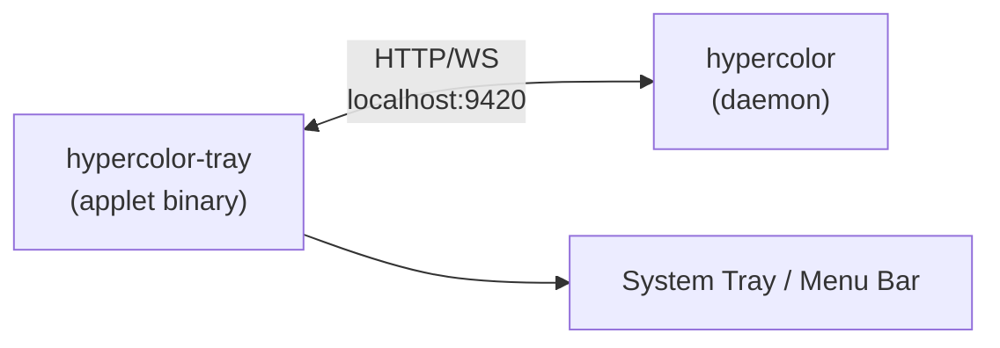

# Distribution, System Integration & Status Applet

> Spec for cross-platform distribution (curl installer, Homebrew), background service
> management (systemd on Linux, launchd on macOS), and a lightweight status bar applet
> that provides quick-access controls and opens the web UI in the user's browser.

## Overview

Hypercolor runs as a background daemon serving a web UI on `localhost:9420`. Users need:

1. A one-liner to install from prebuilt binaries
2. The daemon running automatically on login
3. A status bar presence for quick controls
4. The full UI accessible in their browser

This spec covers all four across Linux and macOS. It builds on the existing
[desktop integration spec](14-desktop-integration.md) (systemd, D-Bus, XDG, SNI tray)
and [installation bootstrap spec](20-installation-bootstrap.md) (user-local install layout).

---

## Distribution Channels

### 1. Curl Installer (`install.hypercolor.dev`)

A single shell script that detects the platform, downloads the correct prebuilt binaries
from GitHub Releases, and sets up system integration.

```bash
curl -fsSL https://install.hypercolor.dev | bash
```

**Detection logic:**

```
OS       = uname -s → Linux | Darwin
ARCH     = uname -m → x86_64 | aarch64 | arm64
ARTIFACT = hypercolor-{os}-{arch}   (e.g., hypercolor-linux-amd64)
```

**Mapping:**

| Platform | Artifact Suffix | Binaries |
|----------|----------------|----------|
| Linux x86_64 | `linux-amd64` | `hypercolor-daemon`, `hypercolor` |
| Linux aarch64 | `linux-arm64` | `hypercolor-daemon`, `hypercolor` |
| macOS arm64 | `macos-arm64` | `hypercolor-daemon`, `hypercolor` |

**Install steps (Linux):**

1. Detect latest release tag from GitHub API (`/repos/hyperb1iss/hypercolor/releases/latest`)
2. Download `hypercolor-daemon-linux-{arch}` and `hypercolor-linux-{arch}` to temp dir
3. Install binaries to `~/.local/bin/`
4. Install systemd user service to `~/.config/systemd/user/hypercolor.service`
5. Install desktop entry to `~/.local/share/applications/hypercolor.desktop`
6. Install `hypercolor-open` launcher helper to `~/.local/bin/`
7. Prompt for udev rules installation (requires sudo):
   - Copy `99-hypercolor.rules` to `/etc/udev/rules.d/`
   - Load `i2c-dev` module and persist via `/etc/modules-load.d/`
   - Reload udev and trigger device scan
8. Enable and start the systemd user service
9. Generate shell completions for detected shell
10. Print success message with web UI URL

**Install steps (macOS):**

1. Detect latest release tag from GitHub API
2. Download `hypercolor-daemon-macos-arm64` and `hypercolor-macos-arm64` to temp dir
3. Install binaries to `~/.local/bin/` (create if needed, add to PATH advice)
4. Install launchd agent plist to `~/Library/LaunchAgents/`
5. Load the launchd agent
6. Generate shell completions for detected shell
7. Print success message with web UI URL

**Script features:**

- `--version <tag>` — install a specific version instead of latest
- `--no-service` — skip systemd/launchd setup
- `--uninstall` — remove binaries, service, and config (prompts for confirmation)
- Respects `HYPERCOLOR_INSTALL_DIR` env var (default: `~/.local/bin`)
- Idempotent — safe to re-run for upgrades
- Verifies SHA256 checksum of downloaded binaries against release asset checksums
- Colorized output with status indicators, respects `NO_COLOR`

**Hosted at:** The script lives in the repo at `scripts/install-release.sh` and is served
via GitHub Pages or a redirect from `install.hypercolor.dev`.

### 2. Homebrew (macOS)

Handled by CI — the `homebrew-update` job in `ci.yml` auto-generates the formula in
`hyperb1iss/homebrew-tap` on each tagged release.

```bash
brew install hyperb1iss/tap/hypercolor
```

The formula installs `hypercolor-daemon` and `hypercolor` binaries. Post-install caveats instruct the
user to load the launchd agent:

```
To start hypercolor as a background service:
  launchctl load ~/Library/LaunchAgents/tech.hyperbliss.hypercolor.plist

Or start manually:
  hypercolor --foreground
```

The formula should include a `service` block so `brew services start hypercolor` works:

```ruby
service do
  run [opt_bin/"hypercolor"]
  keep_alive true
  log_path var/"log/hypercolor.log"
  error_log_path var/"log/hypercolor.log"
end
```

### 3. Future: Flatpak / AUR / .deb / .rpm

Out of scope for this spec. The existing `install.sh` (build-from-source) covers
power users. Distro packages can be added later using the CI build artifacts as inputs.

---

## Background Service

### Linux: systemd User Service

The existing service unit in `packaging/systemd/user/hypercolor.service` is the foundation.
Updates needed for production readiness:

```ini
[Unit]
Description=Hypercolor RGB Lighting Daemon
Documentation=https://github.com/hyperb1iss/hypercolor
After=graphical-session.target dbus.socket
Wants=graphical-session.target

[Service]
Type=notify
ExecStart=%h/.local/bin/hypercolor --ui-dir %h/.local/share/hypercolor/ui
WatchdogSec=30
Restart=on-failure
RestartSec=3
Environment=HYPERCOLOR_LOG=info
Environment=RUST_BACKTRACE=1

# Resource limits
MemoryMax=512M
CPUQuota=25%

# Security hardening
ProtectHome=read-only
ProtectSystem=strict
ReadWritePaths=%h/.config/hypercolor %h/.local/share/hypercolor %h/.local/state/hypercolor
PrivateTmp=true
NoNewPrivileges=true

[Install]
WantedBy=default.target
```

**Key changes from current:**
- `Type=notify` with `WatchdogSec=30` — daemon sends `sd_notify` heartbeats every 15s
- Resource limits — prevents runaway memory/CPU from a broken effect
- Security hardening — minimal filesystem access
- Explicit `ReadWritePaths` for config, data, and state directories

**Daemon-side `sd_notify` integration:**

The daemon must call `sd_notify(READY=1)` after binding the HTTP listener and completing
device discovery. It must send `WATCHDOG=1` every 15 seconds from the render loop.
Use the `sd-notify` crate (pure Rust, no libsystemd dependency).

### macOS: launchd Agent

New file: `packaging/launchd/tech.hyperbliss.hypercolor.plist`

```xml
<?xml version="1.0" encoding="UTF-8"?>
<!DOCTYPE plist PUBLIC "-//Apple//DTD PLIST 1.0//EN"
  "http://www.apple.com/DTDs/PropertyList-1.0.dtd">
<plist version="1.0">
<dict>
    <key>Label</key>
    <string>tech.hyperbliss.hypercolor</string>

    <key>ProgramArguments</key>
    <array>
        <string>~/.local/bin/hypercolor</string>
    </array>

    <key>RunAtLoad</key>
    <true/>

    <key>KeepAlive</key>
    <dict>
        <key>SuccessfulExit</key>
        <false/>
    </dict>

    <key>ThrottleInterval</key>
    <integer>3</integer>

    <key>StandardOutPath</key>
    <string>~/Library/Logs/hypercolor/hypercolor.log</string>

    <key>StandardErrorPath</key>
    <string>~/Library/Logs/hypercolor/hypercolor.log</string>

    <key>EnvironmentVariables</key>
    <dict>
        <key>HYPERCOLOR_LOG</key>
        <string>info</string>
        <key>PATH</key>
        <string>/usr/local/bin:/usr/bin:/bin:~/.local/bin</string>
    </dict>

    <key>ProcessType</key>
    <string>Standard</string>

    <key>LowPriorityBackgroundIO</key>
    <true/>
</dict>
</plist>
```

**Lifecycle:**

```bash
# Load (start now + start on login)
launchctl load ~/Library/LaunchAgents/tech.hyperbliss.hypercolor.plist

# Unload (stop now + stop starting on login)
launchctl unload ~/Library/LaunchAgents/tech.hyperbliss.hypercolor.plist

# Manual start/stop without changing login behavior
launchctl start tech.hyperbliss.hypercolor
launchctl stop tech.hyperbliss.hypercolor
```

**Key design decisions:**
- `RunAtLoad: true` — starts on login without requiring a separate autostart mechanism
- `KeepAlive.SuccessfulExit: false` — restarts on crash but not on clean shutdown
- `ThrottleInterval: 3` — minimum 3 seconds between restart attempts
- `ProcessType: Standard` — normal scheduling priority (not `Background`)
- `LowPriorityBackgroundIO: true` — reduce I/O priority for USB polling
- Logs to `~/Library/Logs/hypercolor/` — visible in Console.app

### CLI Service Management

The `hypercolor` CLI wraps platform-specific service commands behind a unified interface:

```bash
hypercolor service start       # systemctl --user start / launchctl start
hypercolor service stop        # systemctl --user stop / launchctl stop
hypercolor service restart     # systemctl --user restart / launchctl kickstart
hypercolor service status      # systemctl --user status / launchctl print
hypercolor service enable      # systemctl --user enable / launchctl load
hypercolor service disable     # systemctl --user disable / launchctl unload
hypercolor service logs        # journalctl --user -u hypercolor / tail -f ~/Library/Logs/...
```

This is already specced in [15-cli-commands.md](../specs/15-cli-commands.md). The
implementation must detect the platform at runtime and dispatch to the correct backend.

---

## Status Bar Applet

A lightweight, separate binary that provides system tray / menu bar presence. It
communicates with the daemon exclusively via the REST API on `localhost:9420`.

### Architecture



**Why a separate binary (not embedded in the daemon):**
- Daemon runs headless — no GUI toolkit dependency
- Tray binary can crash/restart independently
- Different lifecycle: tray follows desktop session, daemon can outlive it
- Different dependencies: tray needs platform GUI APIs, daemon doesn't

**Why REST API (not D-Bus on Linux):**
- Consistent cross-platform interface (same code path on Linux and macOS)
- D-Bus is Linux-only; REST API works everywhere the daemon runs
- WebSocket for real-time state updates (effect changes, device connect/disconnect)
- D-Bus integration remains available for desktop environments that prefer it
  (GNOME extension, KDE integration) as specced in 14-desktop-integration.md

### Linux Implementation

**Toolkit:** `ksni` crate for StatusNotifierItem (SNI) protocol.

SNI is the modern replacement for the legacy XEmbed system tray. Supported by:
- KDE Plasma (native)
- XFCE (native since 4.16)
- MATE (native)
- Budgie (native)
- GNOME (via AppIndicator extension — pre-installed on Ubuntu)
- Sway/wlroots (via `waybar` SNI module)

**Autostart:** XDG autostart entry at `~/.config/autostart/hypercolor-tray.desktop`:

```ini
[Desktop Entry]
Type=Application
Name=Hypercolor Tray
Exec=hypercolor-tray
Icon=hypercolor
Comment=Hypercolor system tray indicator
X-GNOME-Autostart-enabled=true
X-GNOME-Autostart-Phase=Applications
NoDisplay=true
```

This starts the tray applet on login. The applet connects to the daemon (which is started
independently by systemd). If the daemon isn't running, the tray shows a disconnected state
and retries every 5 seconds.

### macOS Implementation

**Toolkit:** `objc2` + `objc2-app-kit` crates for native `NSStatusItem` menu bar integration.

A native macOS menu bar item using AppKit APIs directly — no Electron, no webview, no
cross-platform abstraction. This produces a ~2MB binary that feels native.

**Alternative considered:** `tao` + `tray-icon` crates (cross-platform). Rejected because
the macOS menu bar has specific conventions (no left-click action, no scroll events) that
cross-platform abstractions handle poorly.

**Autostart:** The launchd agent for the daemon handles background startup. The tray applet
is a separate launchd agent or a Login Item:

`~/Library/LaunchAgents/tech.hyperbliss.hypercolor-tray.plist` — same pattern as the daemon
plist, but with `LSUIElement: true` equivalent (no Dock icon).

Alternatively, register as a Login Item via `SMAppService` (macOS 13+) which integrates
with System Settings > General > Login Items.

### Tray Menu Structure

```
┌────────────────────────────┐
│ ✦ Hypercolor          ► │  ← header with status dot (green/yellow/red)
├────────────────────────────┤
│ ▶ Aurora Borealis          │  ← current effect name
│ ♫ Audio Reactive           │  ← current mode indicator (if applicable)
├────────────────────────────┤
│ Effects                  ► │  ← submenu: favorites + recent effects
│ Profiles                 ► │  ← submenu: saved profiles
├────────────────────────────┤
│ ☀ Brightness  ████░░ 70%   │  ← brightness display (click to cycle presets)
│ ⏸ Pause                    │  ← toggle pause/resume
│ ⏭ Next Effect              │  ← quick-cycle through favorites
├────────────────────────────┤
│ Open Web UI                │  ← opens http://localhost:9420 in default browser
├────────────────────────────┤
│ Quit Hypercolor            │  ← stops tray applet (daemon keeps running)
│ Quit Everything            │  ← stops tray + daemon
└────────────────────────────┘
```

### Tray Icon States

| State | Icon | Description |
|-------|------|-------------|
| Active | Filled, colored | Daemon running, effect active |
| Paused | Filled, dimmed | Daemon running, output paused |
| Disconnected | Outline only | Daemon not reachable |
| Error | Warning badge | Daemon error state |

Icons should be provided as:
- **Linux:** SVG (symbolic icons for dark/light theme compatibility)
- **macOS:** PDF template image (automatically adapts to light/dark menu bar)

### WebSocket State Sync

The tray applet connects to `ws://localhost:9420/api/v1/ws` and subscribes to real-time
state updates. This keeps the menu current without polling:

- Effect changes → update "current effect" label
- Device connect/disconnect → update status indicator
- Brightness changes → update brightness display
- Pause/resume → update pause toggle state
- Daemon shutdown → switch to disconnected state, begin reconnect loop

### "Open Web UI" Behavior

The primary interaction. Clicking "Open Web UI" (or left-clicking the tray icon on Linux):

1. Check if daemon is running (GET `/api/v1/status`)
2. If not running, attempt to start it (`hypercolor service start`)
3. Wait up to 5 seconds for health check
4. Open `http://localhost:9420` in the default browser:
   - **Linux:** `xdg-open`
   - **macOS:** `open`
5. If the browser already has the tab open, it just focuses — the web UI is a SPA

---

## Install Layout Summary

### Linux (`~/.local` user install)

```
~/.local/bin/
    hypercolor              # daemon
    hypercolor              # CLI (hosts `hypercolor tui`)
    hypercolor-tray         # status bar applet
    hypercolor-open         # legacy launcher helper (kept for .desktop)
~/.local/share/hypercolor/
    ui/                     # embedded web UI static files
~/.local/share/applications/
    hypercolor.desktop      # desktop launcher
~/.local/share/icons/hicolor/scalable/apps/
    hypercolor.svg          # app icon
~/.config/systemd/user/
    hypercolor.service      # daemon service unit
~/.config/autostart/
    hypercolor-tray.desktop # tray applet autostart
~/.config/hypercolor/
    config.toml             # user configuration
    profiles/               # saved profiles
/etc/udev/rules.d/
    99-hypercolor.rules     # device access rules (sudo)
/etc/modules-load.d/
    i2c-dev.conf            # kernel module persistence (sudo)
```

### macOS (`~/.local` + `~/Library` install)

```
~/.local/bin/
    hypercolor              # daemon
    hypercolor              # CLI (hosts `hypercolor tui`)
    hypercolor-tray         # menu bar applet
~/Library/LaunchAgents/
    tech.hyperbliss.hypercolor.plist       # daemon agent
    tech.hyperbliss.hypercolor-tray.plist  # tray applet agent
~/Library/Logs/hypercolor/
    hypercolor.log          # daemon log output
~/Library/Application Support/hypercolor/
    config.toml             # user configuration
    profiles/               # saved profiles
```

---

## Implementation Phases

### Phase 1: Distribution (this PR)
- [x] CI builds cross-platform binaries (linux-amd64, linux-arm64, macos-arm64)
- [x] CI creates GitHub releases with binaries attached
- [x] CI updates Homebrew tap
- [ ] `scripts/install-release.sh` — curl installer for prebuilt binaries
- [ ] Launchd plist for macOS daemon
- [ ] Update Homebrew formula with `service` block

### Phase 2: Service Hardening
- [ ] `sd_notify` integration in daemon (READY=1 + WATCHDOG=1)
- [ ] Update systemd unit to `Type=notify` with hardening
- [ ] `hypercolor service` CLI commands with platform detection
- [ ] Launchd lifecycle management in CLI

### Phase 3: Status Bar Applet
- [ ] `hypercolor-tray` binary scaffold (separate crate: `crates/hypercolor-tray`)
- [ ] Linux: `ksni` SNI implementation with icon states
- [ ] macOS: `objc2-app-kit` NSStatusItem implementation
- [ ] WebSocket state sync from daemon
- [ ] Menu structure with effect switching, brightness, pause
- [ ] "Open Web UI" action
- [ ] XDG autostart entry (Linux)
- [ ] Launchd agent for tray (macOS)

### Phase 4: Polish
- [ ] Tray icon set (SVG symbolic for Linux, PDF template for macOS)
- [ ] Homebrew post-install caveats
- [ ] `hypercolor doctor` / `hypercolor diagnose` for installation health checks
- [ ] Uninstall support in curl installer
