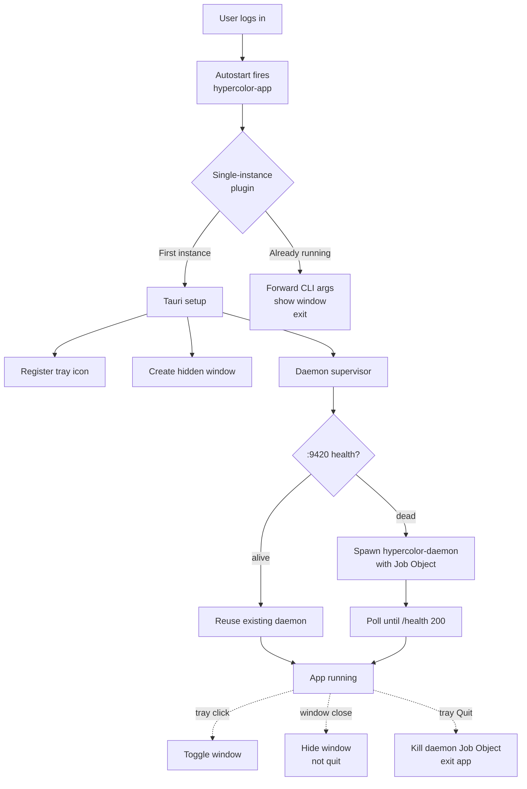
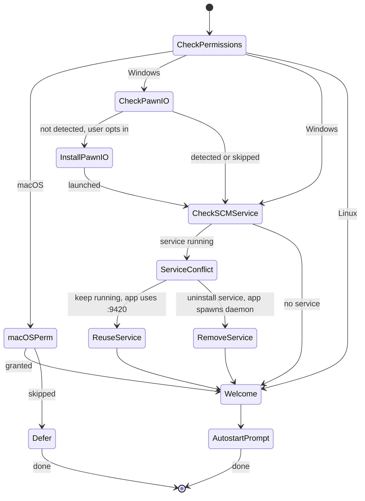

# 46 — Cross-Platform Packaging & Unified App Architecture

> One front door per platform. Reuse the daemon, lifecycle, and dist tooling we already have.
> Add a single Tauri app that owns the tray, the window, and the supervisor — and ship it
> with a real installer on Windows, a DMG on macOS, and the existing tarball/AUR/Homebrew
> story on Linux.

**Status:** Proposed
**Author:** Nova
**Date:** 2026-05-03

---

## Table of Contents

1. [Overview & Goals](#1-overview--goals)
2. [What We Reuse](#2-what-we-reuse)
3. [What We Build](#3-what-we-build)
4. [Architecture](#4-architecture)
5. [Per-Platform Process Lifecycle](#5-per-platform-process-lifecycle)
6. [The Unified App (`hypercolor-app`)](#6-the-unified-app-hypercolor-app)
7. [Preview Pipeline Gating](#7-preview-pipeline-gating)
8. [Asset Layout](#8-asset-layout)
9. [Logging & Diagnostics](#9-logging--diagnostics)
10. [Installer Formats](#10-installer-formats)
11. [Code Signing & Notarization](#11-code-signing--notarization)
12. [First-Run Experience](#12-first-run-experience)
13. [Migration Plan](#13-migration-plan)
14. [Phasing](#14-phasing)
15. [Risks & Open Questions](#15-risks--open-questions)
16. [Appendix](#16-appendix)

---

## 1. Overview & Goals

Hypercolor's components — daemon, CLI, tray, Tauri shell, Leptos UI, SDK — already exist
as workspace crates. What's missing is **one cohesive front door** for the desktop user:
click a tray icon, get a window; close the window, app stays in tray; sign in, the app is
already running. This doc specifies that integration, the installer formats that deliver
it, and the per-platform lifecycle nuances that make it feel native everywhere.

### Goals

1. **One front door**: a single binary (`hypercolor-app`) per platform that owns the tray
   icon, the Tauri window, single-instance enforcement, and the daemon supervisor.
2. **Autostart on login**: opt-out, user-toggleable in settings, idiomatic per platform.
3. **Zero-CPU preview when hidden**: leverage the daemon's existing
   subscriber-count gating (see [§7](#7-preview-pipeline-gating)).
4. **Reuse existing infrastructure**: systemd user service on Linux, LaunchAgent on
   macOS, AUR PKGBUILD, Homebrew formula, `scripts/dist.sh` tarball assembler, the
   `--windows-service` SCM mode for headless deployments. None of these get rewritten.
5. **Real installers**: NSIS for Windows v1, DMG for macOS v1, tarball + AUR + Homebrew
   for Linux v1. Everything else (MSI, AppImage, deb/rpm, Cask) is explicitly v1.1+.

### Non-Goals (v1)

- Microsoft Store / Mac App Store distribution (sandbox forbids the system access we need).
- Flatpak / Snap (sandbox + USB portal complexity, defer).
- Auto-updater plugin (Tauri 2 has one — wire after v1 ships).
- "Headless app" for servers (use the SCM service on Windows or systemd/launchd directly).

### Supersedes & References

This doc **adds to**, doesn't replace:

- [`14-desktop-integration.md`](14-desktop-integration.md) — Linux DE integration, systemd, D-Bus
- [`20-installation-bootstrap.md`](20-installation-bootstrap.md) — install script + path conventions
- [`25-distribution-and-applet.md`](25-distribution-and-applet.md) — curl installer, tarball, browser-based applet
- [`../specs/32-windows-platform-support.md`](../specs/32-windows-platform-support.md) — Windows SCM service, PawnIO, audio/SMBus

When this doc and the older specs disagree on a point in the unified-app architecture,
this doc wins. The older specs remain accurate for browser-based and headless flows.

---

## 2. What We Reuse

Existing infrastructure that stays as-is. **Don't rewrite what works.**

| Component | Path | What It Does |
|---|---|---|
| Daemon binary | `crates/hypercolor-daemon/` | The engine. Same binary across platforms |
| `--windows-service` SCM mode | `crates/hypercolor-daemon/src/windows_service.rs` | Headless Windows deploy, optional |
| Path resolution | `crates/hypercolor-core/src/config/paths.rs` | XDG/AppData split is correct, don't touch |
| Effect path resolver | `crates/hypercolor-core/src/effect/paths.rs:15-77` | Bundled + user effects, with dev fallback |
| Distribution tarball builder | `scripts/dist.sh` | Per-platform tarball assembly. Already covers macOS, Linux, both arches |
| Linux systemd user service | `packaging/systemd/user/hypercolor.service` | Watchdog, hardening, resource limits |
| Linux udev rules | `udev/99-hypercolor.rules` | Vendor-wide USB + i2c-dev access via `uaccess` |
| Linux desktop entry | `packaging/desktop/hypercolor.desktop.in` | XDG application registration |
| Linux `hypercolor-open` shim | `packaging/bin/hypercolor-open` | Service-start + browser-open fallback |
| AUR PKGBUILD | `packaging/aur/PKGBUILD` | Arch Linux distribution |
| Homebrew formula | `packaging/homebrew/hypercolor.rb` | macOS + Linux Homebrew |
| macOS LaunchAgent template | `packaging/launchd/tech.hyperbliss.hypercolor.plist` | Per-user agent for Homebrew install |
| Windows service installer scripts | `scripts/install-windows-service.ps1`, `uninstall-windows-service.ps1`, `diagnose-windows.ps1` | Stay in repo, become `tools/` payload of NSIS installer |
| Subscriber-count preview gating | `crates/hypercolor-daemon/src/preview_runtime.rs` | Already short-circuits encoding when subscribers=0 |
| Health endpoint | `crates/hypercolor-daemon/src/api/mod.rs:1220` | Used by supervisor to probe existing daemon |
| Tauri shell skeleton | `crates/hypercolor-desktop/` | Becomes `hypercolor-app` after refactor |

**Codex review verified**: preview gating actually skips encoding when subscribers = 0,
proven by `pipeline_runtime.rs:610`, `frame_io.rs:213/295`,
`frame_composer.rs:535-542`, and the test at `render_thread_tests.rs:3670`.

---

## 3. What We Build

New work, scoped to the v1 unified-app vision.

| Component | New | Why |
|---|---|---|
| `crates/hypercolor-app/` | 🆕 | Renamed from `hypercolor-desktop`. Adds tray, supervisor, plugins |
| Daemon supervisor module | 🆕 | Spawns `hypercolor-daemon` as child + Job Object reaping (Windows) / process group (Unix) |
| Tray menu module | 🆕 | Ports `hypercolor-tray`'s menu logic onto Tauri 2's tray API |
| Single-instance integration | 🆕 | `tauri-plugin-single-instance` + named-mutex daemon lock |
| Autostart integration | 🆕 | `tauri-plugin-autostart` with capability permissions |
| Window-visibility preview hook | 🆕 | Leptos UI listens for `visibilitychange`; Tauri emits to webview on hide |
| Rotating file logger | 🆕 | `tracing-appender` `RollingFileAppender` for both daemon and app |
| First-run flow | 🆕 | PawnIO detection (Windows), permission walkthrough (macOS), SCM-service detection (Windows) |
| Tauri NSIS bundler config | 🆕 | `bundle.windows.nsis` block in `tauri.conf.json` |
| Tauri DMG bundler config | 🆕 | `bundle.macOS` block + Homebrew Cask formula |
| Notarization workflow | 🆕 | GitHub Actions step using `xcrun notarytool` |
| AppImage build (deferred to v1.1) | 🆕 | Bundle WebKit2GTK 4.1 for old-distro reach |

**Retired**: `crates/hypercolor-tray/` — its menu logic moves into `hypercolor-app`'s tray
module. Source stays in git history. Crate is removed from the workspace once the new
app is shipping. See [§13](#13-migration-plan).

---

## 4. Architecture

### 4.1 Process Model



Three processes total, two binaries:

| Process | Binary | Lifetime |
|---|---|---|
| App + tray + window | `hypercolor-app(.exe)` | Login → logout (autostart) |
| Daemon | `hypercolor-daemon(.exe)` | Spawned by app, reaped via Job Object / process group |
| (optional) SCM service | `hypercolor-daemon(.exe) --windows-service` | OS lifecycle. App detects + reuses |

### 4.2 Crate Refactor

```
crates/
  hypercolor-desktop/     →   hypercolor-app/        (renamed, expanded)
  hypercolor-tray/        →   (deleted after migration; menu logic absorbed)
  hypercolor-daemon/      →   (unchanged)
  hypercolor-cli/         →   (unchanged)
  hypercolor-core/        →   (unchanged)
  ...                     →   (unchanged)
```

`hypercolor-app` Cargo.toml additions:

```toml
[dependencies]
tauri = { version = "2", features = ["devtools", "tray-icon"] }
tauri-plugin-single-instance = "2"
tauri-plugin-autostart = "2"
hypercolor-types = { workspace = true }
hypercolor-core = { workspace = true }   # for path helpers
reqwest = { workspace = true }            # health probe
serde.workspace = true
serde_json.workspace = true
tokio = { workspace = true }
tracing.workspace = true
tracing-subscriber.workspace = true
tracing-appender = "0.2"                  # rolling file logs
anyhow.workspace = true
url = "2.5"
open = "5"                                # tray "Open log folder", etc.
image = { version = "0.25", default-features = false, features = ["png"] }

[target.'cfg(target_os = "windows")'.dependencies]
win32job = "2.0"                          # safe Job Object wrapper, no unsafe_code violation
single-instance = "0.3"                   # named mutex for daemon lock (used by supervisor)

[target.'cfg(target_os = "linux")'.dependencies]
single-instance = "0.3"

[target.'cfg(target_os = "macos")'.dependencies]
single-instance = "0.3"
```

Workspace lints stay enforced (`unsafe_code = "forbid"`, clippy pedantic). `win32job` is
a vetted safe wrapper around the Win32 Job Object API.

---

## 5. Per-Platform Process Lifecycle

The same `hypercolor-app` binary, different daemon-acquisition strategies.

### 5.1 Windows

**Recommended (consumer):** per-user app, app spawns daemon as child.

```
HKCU\...\Run\Hypercolor → "C:\Users\<user>\AppData\Local\Programs\Hypercolor\hypercolor-app.exe" --minimized
   ↓ (login)
hypercolor-app.exe
   ├─ tauri-plugin-single-instance acquires named mutex "Global\Hypercolor.App"
   ├─ tray icon registered
   ├─ window created (visible: false because of --minimized)
   └─ supervisor::start_daemon()
        ├─ probe http://127.0.0.1:9420/health
        │   ├─ 200 → reuse existing daemon (could be SCM service)
        │   └─ fail → spawn child:
        │       cmd: <install_dir>\hypercolor-daemon.exe
        │            --bind 127.0.0.1:9420
        │            --ui-dir <install_dir>\ui
        │       stdio: redirected to %LOCALAPPDATA%\hypercolor\logs\daemon-YYYY-MM-DD.log
        │       JobObject: KILL_ON_JOB_CLOSE | DIE_ON_UNHANDLED_EXCEPTION
        └─ poll /health until 200 (max 20s, otherwise show error)
```

**Optional (headless):** SCM service via existing `--windows-service` mode, installed by
`scripts/install-windows-service.ps1`. The app detects the service at first run and
asks: *"A Hypercolor service is already running. Use it (recommended) or replace it
with a per-user daemon?"* Either choice is valid — see [§12](#12-first-run-experience).

### 5.2 Linux

**Recommended:** systemd user service for the daemon, app is the optional UI front door.

```
~/.config/autostart/hypercolor-app.desktop  ← Tauri autostart plugin writes this
   ↓ (graphical login)
hypercolor-app
   ├─ tauri-plugin-single-instance acquires lock
   ├─ tray icon (libappindicator / SNI)
   ├─ window created (hidden)
   └─ supervisor:
        ├─ probe :9420/health
        │   ├─ 200 → reuse (the systemd service is already running — typical case)
        │   └─ fail → check `systemctl --user is-active hypercolor.service`
        │       ├─ enabled but not running → `systemctl --user start hypercolor.service`
        │       └─ disabled or missing → fall back to spawning daemon as child
```

**Why prefer systemd over app-spawned on Linux?** The systemd user service already
exists with watchdog, journald logging, dependency ordering on `graphical-session.target`,
and security hardening (`packaging/systemd/user/hypercolor.service`). The app should
trust systemd to run the daemon; spawning as a child is a fallback for users who haven't
enabled the service (e.g., someone who installed via the curl script and skipped
`systemctl --user enable`).

**`hypercolor-open`** stays as the browser-only path. Users who don't want the Tauri app
keep their existing flow. The two coexist — `hypercolor-app` and `hypercolor-open` both
detect-and-reuse the same daemon.

### 5.3 macOS

**Recommended (consumer, DMG install):** app spawns daemon as child.

```
~/Library/LaunchAgents/tech.hyperbliss.hypercolor.app.plist  ← Tauri autostart plugin writes this
   ↓ (login)
/Applications/Hypercolor.app/Contents/MacOS/hypercolor-app
   ├─ tauri-plugin-single-instance
   ├─ NSStatusItem (tray)
   ├─ window hidden
   └─ supervisor:
        ├─ probe :9420/health
        │   ├─ 200 → reuse (Homebrew users will have a LaunchAgent already running)
        │   └─ fail → spawn child:
        │       cmd: <install>/Hypercolor.app/Contents/Resources/hypercolor-daemon
        │            --bind 127.0.0.1:9420
        │            --ui-dir <install>/Hypercolor.app/Contents/Resources/ui
        │       process group: setpgid(0, 0); kill on app exit
```

**Optional (Homebrew):** existing `brew services start hypercolor` flow keeps working.
LaunchAgent at `~/Library/LaunchAgents/tech.hyperbliss.hypercolor.plist` (note: this is
the **daemon's** plist, distinct from the app's autostart plist which Tauri manages).
App detects and reuses.

**Two LaunchAgents can coexist** — one for the daemon (Homebrew installs), one for the
app (Tauri autostart). Different `Label` keys. The app's plist runs `hypercolor-app`,
which probes and reuses the daemon if Homebrew already started it.

---

## 6. The Unified App (`hypercolor-app`)

### 6.1 Crate Layout

```
crates/hypercolor-app/
  Cargo.toml
  build.rs
  tauri.conf.json
  capabilities/
    default.json              ← single-instance, autostart, tray permissions
  icons/
    32x32.png ... 1024x1024.png
    icon.icns
    icon.ico
  src/
    main.rs                   ← Tauri::Builder setup, plugins, window event hooks
    daemon_client.rs          ← REST + WebSocket client (ported from hypercolor-tray)
    state.rs                  ← In-memory cached daemon state (ported)
    supervisor/
      mod.rs                  ← Health probe, spawn, reap
      windows.rs              ← win32job AssignProcessToJobObject
      unix.rs                 ← setpgid + kill-on-exit
    tray/
      mod.rs                  ← Tauri 2 tray icon registration
      menu.rs                 ← Dynamic menu builder (ported from hypercolor-tray)
      icons.rs                ← Status-aware tray icon switching
    window/
      visibility.rs           ← visibilitychange hook → WS unsubscribe
    autostart.rs              ← User-facing toggle wrappers
    first_run/
      mod.rs                  ← First-run state machine
      pawnio_check.rs         ← Windows-only PawnIO detection
      mac_permissions.rs      ← macOS Privacy & Security walkthrough
      service_conflict.rs     ← Windows SCM service detection
    logging.rs                ← Rolling file appender setup
    cli.rs                    ← `--minimized`, `--show`, `--quit`
  tests/
    supervisor_tests.rs
    state_tests.rs            ← Ported from hypercolor-tray
```

### 6.2 Main Entry Point

```rust
// crates/hypercolor-app/src/main.rs (sketch — not final)
#![cfg_attr(not(debug_assertions), windows_subsystem = "windows")]

fn main() -> anyhow::Result<()> {
    logging::init_rolling_file_appender()?;

    let cli = cli::parse();

    tauri::Builder::default()
        // Single-instance MUST be registered first per Tauri docs
        .plugin(tauri_plugin_single_instance::init(|app, args, _cwd| {
            // The original instance will receive forwarded args here.
            // Default behavior is no-op — we MUST explicitly show + focus.
            window::show_main(app);
            cli::dispatch_forwarded(args, app);
        }))
        .plugin(tauri_plugin_autostart::init(
            tauri_plugin_autostart::MacosLauncher::LaunchAgent,
            Some(vec!["--minimized"]),
        ))
        .setup(move |app| {
            tray::register(app)?;
            window::create_main(app, cli.start_minimized)?;
            supervisor::start(app)?;
            first_run::maybe_show(app)?;
            Ok(())
        })
        .on_window_event(|window, event| {
            match event {
                tauri::WindowEvent::CloseRequested { api, .. } => {
                    let _ = window.hide();
                    api.prevent_close();
                }
                tauri::WindowEvent::Focused(false)
                | tauri::WindowEvent::Resized(_) => {
                    window::visibility::sync_to_webview(window);
                }
                _ => {}
            }
        })
        .run(tauri::generate_context!())
        .map_err(|e| anyhow::anyhow!("tauri runtime error: {e}"))?;

    Ok(())
}
```

### 6.3 Tray Menu

Tauri 2 owns the tray. Menu rebuilds on relevant daemon WS events
(`effect_started`, `active_scene_changed`, `brightness_changed`, `paused`/`resumed`).
The menu structure ports directly from `crates/hypercolor-tray/src/menu.rs:12-27`:

| Menu item | Action |
|---|---|
| `▶ <effect name>` (label, when active) | Disabled label |
| Effects ▸ | Submenu listing all effects |
| Profiles ▸ | Submenu listing profiles |
| Scenes ▸ | Submenu listing scenes |
| Brightness: 75% (label) | Disabled label |
| Pause / Resume | Toggle |
| Stop Effect | Visible only when an effect is running |
| ─── | Separator |
| Show Window | Show + focus the Tauri window |
| Open Web UI | Falls back to default browser at `:9420` |
| Open Logs Folder | `open::that(logs_dir())` |
| Open User Effects Folder | `open::that(user_effects_dir())` |
| Settings… | Show window + navigate to settings route |
| ─── | Separator |
| Quit Hypercolor | Real shutdown — see [§6.5](#65-daemon-supervisor) |

### 6.4 Window Behavior

| Action | Result |
|---|---|
| Click tray (left, Windows/Linux) | Toggle window visible/hidden |
| Click tray (left, macOS) | Open menu (macOS convention) |
| Right-click tray | Context menu |
| Window close button | Hide window — does NOT quit |
| `Cmd+Q` / `Alt+F4` | Hide window (overridden in Tauri) |
| Tray "Quit" menu | Real shutdown sequence |
| Second `hypercolor-app` invocation | Single-instance plugin forwards args, original shows window |
| `hypercolor-app --show` | Show + focus window from CLI |
| `hypercolor-app --quit` | Initiate graceful shutdown |
| `hypercolor-app --minimized` | Start with window hidden (used by autostart) |

### 6.5 Daemon Supervisor

The supervisor lives in `crates/hypercolor-app/src/supervisor/`, with platform-specific
process-binding code in `windows.rs` and `unix.rs`.

**Spawn flow:**

```rust
// supervisor/mod.rs (sketch)
pub async fn start(app: &AppHandle) -> Result<()> {
    if probe_health().await {
        info!("daemon already running, reusing");
        return Ok(());
    }
    let child = spawn_daemon_with_job_object(app)?;
    wait_until_healthy(Duration::from_secs(20)).await?;
    Ok(())
}

async fn probe_health() -> bool {
    reqwest::Client::new()
        .get("http://127.0.0.1:9420/health")
        .timeout(Duration::from_millis(500))
        .send()
        .await
        .map(|r| r.status().is_success())
        .unwrap_or(false)
}
```

**Reaping (Windows):** `win32job` crate creates a Job Object with
`JOB_OBJECT_LIMIT_KILL_ON_JOB_CLOSE`. App's process handle and the daemon's child handle
are both assigned to the job. When the app process dies (clean exit, crash, kill from
Task Manager), the kernel reaps the daemon automatically. **No `unsafe` blocks required**
— `win32job` is a safe wrapper.

**Reaping (Unix):** `setpgid(0, 0)` to put the daemon in its own process group. On app
exit, send `SIGTERM` to the group, wait 3s, then `SIGKILL`. POSIX `prctl(PR_SET_PDEATHSIG)`
is Linux-only and macOS doesn't have an equivalent, so we use the explicit signal path.

**Quit sequence:**

```
User clicks "Quit Hypercolor" in tray
   ↓
1. Tray emits Quit event
2. App calls supervisor.shutdown()
3. Supervisor closes the Job Object (Windows) or sends SIGTERM (Unix)
   → daemon receives stop signal, runs its existing graceful-shutdown path
4. App waits up to 5s for daemon process exit; on timeout, force kill
5. App tray icon dropped
6. App process exits 0
```

> ⚠️ **No `POST /api/v1/shutdown` route exists** in the daemon today (verified in
> codex review against `api/mod.rs:1218-1220`). For v1, we rely on Job Object
> close / SIGTERM. If we want a graceful HTTP-driven shutdown later, add an
> authenticated route. Not needed for v1.

### 6.6 Single-Instance

Two layers:

**Layer 1 — App** (Tauri plugin, named mutex on Windows / D-Bus on Linux / port lock on macOS):

```rust
.plugin(tauri_plugin_single_instance::init(|app, args, _cwd| {
    // Required: explicit show + focus + dispatch.
    // Default callback is no-op (codex confirmed).
    if let Some(w) = app.get_webview_window("main") {
        let _ = w.unminimize();
        let _ = w.show();
        let _ = w.set_focus();
    }
    cli::handle_args(args, app);
}))
```

**Layer 2 — Daemon** (`single-instance` crate, named mutex):

```rust
// In hypercolor-daemon::main, before binding the port
let _instance = single_instance::SingleInstance::new("hypercolor-daemon")?;
if !_instance.is_single() {
    eprintln!("daemon already running on this user account; exiting");
    return Ok(());  // peaceful exit, supervisor will reuse the existing one
}
```

**Codex correction**: original plan used `fd-lock` which is advisory; the `single-instance`
crate uses a named mutex on Windows and works correctly for our case.

### 6.7 Autostart

**Tauri plugin writes:**

| Platform | Path | Format |
|---|---|---|
| Windows | `HKCU\Software\Microsoft\Windows\CurrentVersion\Run\Hypercolor` | `"C:\...\hypercolor-app.exe" --minimized` |
| Linux | `~/.config/autostart/hypercolor-app.desktop` | XDG Autostart spec |
| macOS | `~/Library/LaunchAgents/tech.hyperbliss.hypercolor.app.plist` | LaunchAgent |

**Capability permissions** (Tauri 2 requires explicit grants):

```json
// crates/hypercolor-app/capabilities/default.json
{
  "$schema": "../gen/schemas/desktop-schema.json",
  "identifier": "default",
  "description": "Default capability for the main window",
  "windows": ["main"],
  "permissions": [
    "core:default",
    "autostart:allow-enable",
    "autostart:allow-disable",
    "autostart:allow-is-enabled",
    "core:tray:default",
    "core:window:allow-show",
    "core:window:allow-hide",
    "core:window:allow-set-focus",
    "core:window:allow-unminimize"
  ]
}
```

**Default policy**: enabled on first run. User can toggle in Settings → Startup. Toggling
off removes the registry/plist/desktop entry; toggling on writes it back. The app does
NOT need to be running for autostart to fire next session.

> Per [§5.2](#52-linux), on Linux we autostart **the app**, not the daemon. The daemon
> is autostarted by systemd (`systemctl --user enable hypercolor.service`) which is
> independent. They coexist.

---

## 7. Preview Pipeline Gating

The daemon already does the right thing — we just have to wire the UI side honestly.

### 7.1 Daemon Side (Already Correct)

`crates/hypercolor-daemon/src/preview_runtime.rs` tracks subscriber counts per stream
(`canvas_receivers`, `screen_canvas_receivers`, `web_viewport_canvas_receivers`,
`internal_canvas_receivers`). Each `PreviewFrameReceiver` increments on construction,
decrements on `Drop`.

`PreviewDemandSummary { subscribers: u32, max_fps, ... }` is published to the render
thread via `ArcSwap`. The render pipeline consults this:

- `render_thread/pipeline_runtime.rs:610` — gate publication on subscriber count
- `render_thread/frame_io.rs:213, 295` — skip publishing when `receivers == 0`
- `render_thread/frame_composer.rs:535-542` — skip preview surface construction when not required

A test in `render_thread_tests.rs:3670+3705` asserts that **no preview frames are
published** when there are zero subscribers. This is verified, not hypothetical.

**Result**: when the UI WebSocket disconnects from the `canvas` channel, the daemon's
preview encoding pipeline goes idle. Device frames keep rendering — LEDs need updates
regardless of UI state.

### 7.2 UI Side (Two-Layer Hook)

**Layer 1 — Page Visibility API (free, no daemon work):**

The Leptos UI listens for `visibilitychange` and toggles WS subscriptions:

```js
document.addEventListener('visibilitychange', () => {
  if (document.hidden) {
    ws.send(JSON.stringify({ type: 'unsubscribe', channels: ['canvas', 'spectrum'] }));
  } else {
    ws.send(JSON.stringify({ type: 'subscribe', channels: ['canvas', 'spectrum', 'events', 'metrics'] }));
  }
});
```

**Layer 2 — Tauri Window Event (covers Windows minimize that doesn't fire visibilitychange):**

```rust
.on_window_event(|window, event| {
    match event {
        tauri::WindowEvent::Focused(false) | tauri::WindowEvent::Resized(_) => {
            // Tell the webview about visibility change explicitly
            window::visibility::sync_to_webview(window);
        }
        _ => {}
    }
})
```

The webview then calls the same JS path. Belt-and-suspenders — visibility API alone
misses some Windows minimize states.

### 7.3 Verification

Acceptance criteria for the v1 milestone:

1. With Hypercolor running and an effect active, observe daemon CPU baseline (window visible).
2. Hide window via close button.
3. Within 1 second, `/api/v1/status` reports `preview_runtime.canvas_demand.subscribers = 0`.
4. CPU drops measurably (target: at least 30% reduction in daemon CPU when the only
   active subscriber was the UI).
5. Show window — subscribers increment, CPU returns to baseline.

Process Explorer / `top` / Activity Monitor are sufficient for the verification step.
We can add a doc-level benchmark later via the existing `graphics-pipeline-soak` script.

---

## 8. Asset Layout

### 8.1 Per-Platform Paths

Resolved from `crates/hypercolor-core/src/config/paths.rs` (don't change).

| Asset | Windows | Linux | macOS |
|---|---|---|---|
| Config (`hypercolor.toml`, settings) | `%APPDATA%\hypercolor\` (Roaming) | `$XDG_CONFIG_HOME/hypercolor/` | `~/Library/Application Support/hypercolor/` |
| Data (state, profiles, layouts, instance ID) | `%LOCALAPPDATA%\hypercolor\` | `$XDG_DATA_HOME/hypercolor/` | `~/Library/Application Support/hypercolor/` |
| Bundled effects (resolved by `bundled_effects_root()`) | `%LOCALAPPDATA%\hypercolor\effects\bundled\` | `$XDG_DATA_HOME/hypercolor/effects/bundled/` | `~/Library/Application Support/hypercolor/effects/bundled/` |
| User effects (resolved by `user_effects_dir()`) | `%LOCALAPPDATA%\hypercolor\effects\user\` | `$XDG_DATA_HOME/hypercolor/effects/user/` | `~/Library/Application Support/hypercolor/effects/user/` |
| Cache | `%LOCALAPPDATA%\hypercolor\cache\` | `$XDG_CACHE_HOME/hypercolor/` | `~/Library/Caches/hypercolor/` |
| Logs (rotating) | `%LOCALAPPDATA%\hypercolor\logs\` | `~/.local/state/hypercolor/logs/` (also journald via systemd) | `~/Library/Logs/Hypercolor/` |
| Binaries (per-user install) | `%LOCALAPPDATA%\Programs\Hypercolor\` | `~/.local/bin/` (curl install) or `/usr/bin/` (AUR/deb) | `/Applications/Hypercolor.app/Contents/MacOS/` |
| UI (`ui/index.html`, WASM, etc.) | `<install_dir>\ui\` | `<install_dir>/share/hypercolor/ui/` | `Hypercolor.app/Contents/Resources/ui/` |
| Daemon `--ui-dir` arg | `<install_dir>\ui` | `<install_dir>/share/hypercolor/ui` | `Hypercolor.app/Contents/Resources/ui` |
| Windows tools | `<install_dir>\tools\` | n/a | n/a |

Windows tool resources include the service installer helpers, diagnostics, the
`hypercolor-smbus-service.exe` broker, and a pinned PawnIO payload under
`tools\pawnio\` for machines with motherboard or DRAM SMBus devices.

### 8.2 Roaming vs Local — The Split

**Verdict: keep the existing split.** `paths.rs:19-91` already does the right thing on
all platforms:

- `config_dir()` — settings that should travel between machines (`hypercolor.toml`)
- `data_dir()` — state bound to a specific machine (profiles reference device IDs;
  layouts reference physical hardware; instance ID is per-install)

Documented for users in the upcoming docs site. Cross-machine config portability is a
v2 feature via explicit "Export bundle" / "Import bundle" actions, not roaming-by-magic.

### 8.3 Effects + UI Delivery (BLOCKER Resolution)

**Codex flagged this as a v1 blocker** (verified at `daemon.rs:108`, `daemon.rs:154-156`,
`api/mod.rs:1229-1231`): the daemon serves UI files only when `--ui-dir <path>` is
provided OR the dev fallback `crates/hypercolor-ui/dist` exists. Effects are resolved
from `data_dir()/effects/bundled` or the dev fallback `<repo>/effects/`.

**Solution:** the native app does both before supervising the daemon:

1. Copy `ui/` into the install directory (read-only program files).
2. Stage `effects/bundled/` inside the Tauri resources, then copy those SDK-built
   HTML files into the **data directory** on app startup. The path resolver finds
   them automatically before the daemon scans effects.
3. Pass `--ui-dir <install_dir>/ui` when spawning the daemon.

**Why effects go to data dir, not install dir:** users may add their own effects to
`effects/user/`, and the path resolver searches `bundled` first then `user`. Having
both under one root keeps the layout coherent. Bundled effects are read-only at install
time (file ACLs); the user dir is writeable. On reinstall/update, the bundled folder
is overwritten while the user folder is preserved — installer logic handles this
explicitly.

### 8.4 SDK Faces

"Faces" is the SDK term (`sdk/src/faces/<name>/main.ts`) for HTML effects built into
`effects/hypercolor/<name>.html`. They're a subset of effects, treated identically by
the path resolver. No separate handling needed — they ship in the same `bundled/` tree.

If we add a "user faces" UI later (drag-and-drop a `.html` into Hypercolor), it lands
in `effects/user/` like any other user-authored effect.

---

## 9. Logging & Diagnostics

### 9.1 Rolling File Logger

Both daemon and app use `tracing-appender::rolling::RollingFileAppender` with daily
rotation, keep last 7 days. File path is `data_dir().join("logs")`.

```rust
// app and daemon both do this in their bootstrap
let file_appender = tracing_appender::rolling::daily(logs_dir, "app.log");
let (non_blocking, _guard) = tracing_appender::non_blocking(file_appender);
tracing_subscriber::registry()
    .with(fmt::Layer::new().with_writer(non_blocking).with_ansi(false))
    .with(fmt::Layer::new().with_writer(io::stdout).with_ansi(stdout_is_terminal()))
    .with(EnvFilter::from_default_env())
    .init();
```

The existing logging setup at `crates/hypercolor-daemon/src/startup/logging.rs:153-158`
detects ANSI capability — keep that for stdout, disable ANSI for files.

### 9.2 Diagnostics Export

Tray menu item: **"Export Diagnostics"** → produces a zip at `~/Desktop/hypercolor-diagnostics-<timestamp>.zip` containing:

- Last 7 days of `logs/app.log*`, `logs/daemon.log*`
- Output of `/api/v1/status`
- Output of `/api/v1/diagnose`
- Sanitized config (`hypercolor.toml` with API keys redacted)
- `device-settings.json`, `runtime-state.json`, `layouts.json`, `profiles.json`
- Platform info (`OS version`, `CPU`, `RAM`, GPU model)
- Hypercolor version

Users send this to support / file as GitHub issue. Deliberately a manual user action,
not auto-uploaded. Privacy-preserving by default.

### 9.3 Windows Event Log

**Deferred to v1.1.** Codex flagged this as a CONCERN, not BLOCKER. Rationale:

- Desktop users rarely look at Event Viewer; they look at log files.
- "Export Diagnostics" covers the "I need to send Stef the bug" path.
- Event Log integration is more useful for SCM service mode (where stdout vanishes),
  but the PowerShell scripts already redirect daemon output to a file in service mode.

When we wire it, use the `eventlog` crate or `windows-eventlog` for the daemon's service
mode only. App always uses file logs.

---

## 10. Installer Formats

### 10.1 Windows — NSIS via Tauri 2 (v1)

`crates/hypercolor-app/tauri.conf.json` additions:

```json
{
  "productName": "Hypercolor",
  "version": "0.1.0",
  "identifier": "tech.hyperbliss.hypercolor",
  "app": {
    "windows": [],
    "security": {}
  },
  "bundle": {
    "active": true,
    "targets": ["nsis"],
    "category": "Utility",
    "shortDescription": "RGB lighting orchestration",
    "longDescription": "Hypercolor — open-source RGB lighting orchestration for your devices.",
    "icon": [
      "icons/32x32.png",
      "icons/128x128.png",
      "icons/icon.ico"
    ],
    "resources": [
      "../../effects/hypercolor/*",
      "../../crates/hypercolor-ui/dist/**/*",
      "../../scripts/install-windows-service.ps1",
      "../../scripts/uninstall-windows-service.ps1",
      "../../scripts/diagnose-windows.ps1"
    ],
    "externalBin": [
      "../../target/release/hypercolor-daemon",
      "../../target/release/hypercolor"
    ],
    "windows": {
      "webviewInstallMode": { "type": "downloadBootstrapper" },
      "nsis": {
        "installMode": "currentUser",
        "installerIcon": "icons/installer.ico",
        "headerImage": "icons/installer-header.png",
        "sidebarImage": "icons/installer-sidebar.bmp",
        "license": "../../LICENSE",
        "displayLanguageSelector": false,
        "languages": ["English"],
        "installerHooks": "installer.nsh"
      },
      "digestAlgorithm": "sha256",
      "timestampUrl": "http://timestamp.digicert.com"
    }
  }
}
```

> **Codex correction**: Tauri NSIS uses `currentUser` (not `perUser`). Verified against
> https://tauri.app/distribute/windows-installer/.

**`installer.nsh` custom hook** does what Tauri's defaults can't:

```nsis
; installer.nsh — custom NSIS hook for Hypercolor
!macro NSIS_HOOK_POSTINSTALL
  ; Add hypercolor.exe to user PATH
  EnVar::SetHKCU
  EnVar::AddValue "Path" "$INSTDIR"
  Pop $0  ; discard

  ; Bundled effects are copied by the app at startup from Tauri resources.
!macroend

!macro NSIS_HOOK_PREUNINSTALL
  ; Remove from PATH
  EnVar::SetHKCU
  EnVar::DeleteValue "Path" "$INSTDIR"
  Pop $0

  ; DO NOT delete user data — preserve effects/user, profiles, layouts
  ; Optionally prompt: "Also remove user data?"
!macroend
```

**Output**: `Hypercolor_0.1.0_x64-setup.exe`, ~80–120 MB (mostly Servo + WebView2
bootstrapper). Unsigned for early alpha; signed for v1.

### 10.2 Linux — Reuse What We Have, Add AppImage Later

**v1 channels** (all exist already):

| Channel | Status | Build |
|---|---|---|
| Tarball + curl installer | ✅ `scripts/dist.sh` | CI builds `hypercolor-{version}-linux-{arch}.tar.gz` |
| AUR `hypercolor-bin` | ✅ `packaging/aur/PKGBUILD` | CI updates SHA256 on release |
| Homebrew (Linux) | ✅ `packaging/homebrew/hypercolor.rb` | CI updates `hyperb1iss/homebrew-tap` on release |

**`scripts/dist.sh` updates** for unified app:

- Add `hypercolor-app` to the binary list (line ~239 in current script).
- Bundle Tauri 2 runtime deps into the tarball for portable installs (or rely on system
  packages — dual-track).

**v1.1 channels:**

- **AppImage** with bundled WebKit2GTK 4.1 — solves the Ubuntu 22.04 LTS problem (only
  ships 4.0). Use `linuxdeploy-plugin-appimage` or `appimage-builder`.
- **deb / rpm** via `cargo-deb` and `cargo-generate-rpm`. Auto-build in CI matrix.
- **Flatpak** — defer to v2. Sandbox + USB portal complexity isn't worth v1 effort.

### 10.3 macOS — DMG + Homebrew Cask (v1)

**Tauri DMG bundler config:**

```json
"bundle": {
  "targets": ["dmg", "app"],
  "macOS": {
    "frameworks": [],
    "minimumSystemVersion": "11.0",
    "exceptionDomain": "",
    "signingIdentity": "Developer ID Application: Stefanie Jane (TEAMID)",
    "providerShortName": "TEAMID",
    "entitlements": "entitlements.plist",
    "dmg": {
      "background": "icons/dmg-background.png",
      "windowSize": { "width": 660, "height": 400 },
      "iconPosition": { "x": 180, "y": 170 },
      "applicationFolderPosition": { "x": 480, "y": 170 }
    }
  }
}
```

**`entitlements.plist`** for hardened runtime + capabilities:

```xml
<plist version="1.0">
<dict>
    <key>com.apple.security.cs.allow-jit</key>
    <true/>
    <key>com.apple.security.cs.allow-unsigned-executable-memory</key>
    <true/>
    <key>com.apple.security.network.client</key>
    <true/>
    <key>com.apple.security.network.server</key>
    <true/>
    <key>com.apple.security.device.audio-input</key>
    <true/>
    <key>com.apple.security.device.usb</key>
    <true/>
    <key>NSMicrophoneUsageDescription</key>
    <string>Hypercolor uses your microphone for audio-reactive lighting effects.</string>
    <key>NSAppleEventsUsageDescription</key>
    <string>Hypercolor uses input events for keyboard-reactive lighting effects.</string>
</dict>
</plist>
```

> Screen recording permission has no Info.plist key — TCC-managed, prompted at first
> capture attempt. Walk users through it in [§12.3](#123-macos-permissions).

**Output**: `Hypercolor-0.1.0-arm64.dmg` (Apple Silicon) and
`Hypercolor-0.1.0-x86_64.dmg` (Intel, courtesy build).

**Homebrew Cask** (separate from existing CLI Homebrew formula):

```ruby
# packaging/homebrew/hypercolor-app.rb (Cask)
cask "hypercolor-app" do
  version "0.1.0"
  sha256 "..."

  url "https://github.com/hyperb1iss/hypercolor/releases/download/v#{version}/Hypercolor-#{version}-arm64.dmg",
      verified: "github.com/hyperb1iss/hypercolor/"

  name "Hypercolor"
  desc "Open-source RGB lighting orchestration"
  homepage "https://github.com/hyperb1iss/hypercolor"

  app "Hypercolor.app"

  zap trash: [
    "~/Library/Application Support/hypercolor",
    "~/Library/Caches/hypercolor",
    "~/Library/Logs/Hypercolor",
    "~/Library/LaunchAgents/tech.hyperbliss.hypercolor.app.plist",
  ]
end
```

CLI users keep `brew install hyperb1iss/tap/hypercolor`. Desktop users get
`brew install --cask hyperb1iss/tap/hypercolor-app`. Both can coexist.

---

## 11. Code Signing & Notarization

### 11.1 Windows — Microsoft Trusted Signing (Recommended)

| Item | Detail |
|---|---|
| Cost | $9.99/month + ~$20 one-time identity verification |
| Trust level | EV-equivalent — immediate SmartScreen trust, no warnings |
| Setup | Azure subscription → enroll Trusted Signing → identity validation (3-5 days) → cert provisioned in Azure HSM |
| CI | First-class GitHub Actions: `azure/trusted-signing-action@v0` |

**GitHub Actions step:**

```yaml
- name: Sign installer
  uses: azure/trusted-signing-action@v0
  with:
    azure-tenant-id: ${{ secrets.AZURE_TENANT_ID }}
    azure-client-id: ${{ secrets.AZURE_CLIENT_ID }}
    azure-client-secret: ${{ secrets.AZURE_CLIENT_SECRET }}
    endpoint: https://wus2.codesigning.azure.net/
    trusted-signing-account-name: hyperbliss
    certificate-profile-name: hypercolor
    files-folder: ${{ github.workspace }}/target/release/bundle/nsis
    files-folder-filter: exe
```

Sign: `hypercolor-app.exe`, `hypercolor-daemon.exe`, `hypercolor.exe`, the NSIS installer
itself, and the uninstaller.

**Alternatives** (not recommended for v1):

- **EV Certificate** ($400-600/year, hardware token, painful CI)
- **OV Certificate** ($100-200/year, software key, SmartScreen warnings until reputation builds)
- **Unsigned** — alpha/internal only

### 11.2 macOS — Apple Developer ID + Notarization (Required)

| Item | Detail |
|---|---|
| Cost | $99/year Apple Developer Program |
| Setup | Apply, identity check (1-2 days), provision Developer ID Application + Developer ID Installer in Keychain Access |
| Notarization | Mandatory for distribution outside MAS. Free, automated via `xcrun notarytool` |
| Stapling | `xcrun stapler staple` attaches notarization ticket for offline verification |

**GitHub Actions workflow:**

```yaml
- name: Import signing certs
  uses: apple-actions/import-codesign-certs@v3
  with:
    p12-file-base64: ${{ secrets.APPLE_DEVELOPER_ID_P12 }}
    p12-password: ${{ secrets.APPLE_DEVELOPER_ID_P12_PASSWORD }}

- name: Build and sign
  run: |
    cargo tauri build --target aarch64-apple-darwin
  env:
    APPLE_SIGNING_IDENTITY: "Developer ID Application: Stefanie Jane (TEAMID)"

- name: Notarize
  run: |
    xcrun notarytool submit \
      target/aarch64-apple-darwin/release/bundle/dmg/Hypercolor_0.1.0_aarch64.dmg \
      --apple-id "${{ secrets.APPLE_ID }}" \
      --team-id "${{ secrets.APPLE_TEAM_ID }}" \
      --password "${{ secrets.APPLE_APP_SPECIFIC_PASSWORD }}" \
      --wait

- name: Staple
  run: |
    xcrun stapler staple target/aarch64-apple-darwin/release/bundle/dmg/Hypercolor_0.1.0_aarch64.dmg
```

### 11.3 Linux — No Signing (v1)

Distro repos handle integrity (AUR uses SHA256 in PKGBUILD, Homebrew uses SHA256 in
formula). Optionally GPG-sign release tarballs for users verifying manually:

```bash
gpg --armor --detach-sign hypercolor-0.1.0-linux-amd64.tar.gz
```

Public key on Stef's GitHub profile and in the README. Pure user opt-in; not part of
any package manager flow.

### 11.4 Cost Summary

| Year 1 | Ongoing |
|---|---|
| Microsoft Trusted Signing setup ($20) + 12 months ($120) = **$140** | $120/year |
| Apple Developer Program ($99) = **$99** | $99/year |
| **Total: $239** for v1 launch | **$219/year** ongoing |

Cheap insurance against trust friction. Recommend committing on greenlight.

---

## 12. First-Run Experience

State machine: present → check → resolve → continue.



### 12.1 Windows — PawnIO Detection

`crates/hypercolor-app/src/first_run/pawnio_check.rs`:

1. Check for `C:\Program Files\PawnIO\PawnIOLib.dll`.
2. Check for bundled `tools\pawnio\PawnIO_setup.exe` and `tools\pawnio\modules\*.bin`.
3. Check for the `PawnIO` service in `services.msc` (use `sc query PawnIO`).
4. If missing, show panel: *"Motherboard and DDR memory RGB may need PawnIO.
   Hypercolor includes the official PawnIO installer and only asks Windows for
   elevation when you choose to enable this hardware path."*
5. Buttons: **[Install hardware support]** runs
   `tools\install-windows-hardware-support.ps1` under UAC elevation;
   **[Skip — I don't have that hardware]** dismisses;
   **[Remind me later]** delays until next launch.

**Bundle PawnIO.** The Windows app stages the official `PawnIO_setup.exe`
and the three SMBus modules Hypercolor currently loads: `SmbusI801.bin`,
`SmbusPIIX4.bin`, and `SmbusNCT6793.bin`. `scripts/fetch-pawnio-assets.ps1`
pins release versions and verifies SHA256 before copying them into the Tauri
resource tree. The installer remains explicit: nothing privileged runs until the
user presses the hardware-support button and accepts UAC.

**Privilege boundary:** only motherboard/DRAM SMBus access goes through the
`HypercolorSmBus` broker. NvAPI and ADL GPU I2C are vendor driver APIs and stay
in the regular user-mode daemon. USB HID, WinUSB devices, and network devices
also stay user-mode; WinUSB driver binding is an install-time prerequisite, not a
daemon privilege reason.

**Native app commands:** the Tauri shell exposes `detect_pawnio_support` and
`launch_pawnio_helper` to the loopback daemon UI. The first command reports
bundled payload, PawnIO runtime, and service state; the second launches the
single elevated helper that installs PawnIO, copies modules, registers
`HypercolorSmBus`, and starts it unless the UI asks not to.

### 12.2 Windows — SCM Service Detection

If `:9420/health` responds AND `sc query Hypercolor` shows the service running:

> A Hypercolor service is already running on this machine. This usually means an
> administrator installed Hypercolor in headless mode.
>
> - **Use the existing service** — no changes, the app will connect to it. Recommended
>   if you didn't install it yourself.
> - **Replace with per-user mode** — uninstall the service and let the app manage the
>   daemon. Recommended for normal desktop use; gives better audio support.

If the user picks "Replace with per-user mode", the app shells out to
`scripts/uninstall-windows-service.ps1` (which it has bundled in `tools/`) under
elevation prompt, then starts its own daemon child.

### 12.3 macOS Permissions

Walk the user through each permission with deep links:

| Permission | When needed | Deep link |
|---|---|---|
| Microphone | Audio-reactive effects | Triggered automatically on first capture; no deep link needed |
| Screen Recording | Screen capture effects | `x-apple.systempreferences:com.apple.preference.security?Privacy_ScreenCapture` |
| Accessibility | Keyboard-reactive effects | `x-apple.systempreferences:com.apple.preference.security?Privacy_Accessibility` |
| LaunchAgent (autostart) | Login | Automatic, no permission |
| USB device access | HID devices | Automatic for HID; no deep link |

UI shows each as a row with status (granted ✓ / not granted ✗ / not yet asked) and a
**[Grant]** button. Multi-pass — they can come back to it. App functions without these,
just with reduced features.

### 12.4 Linux

No special first-run beyond welcome + autostart prompt. udev rules and i2c-dev module
loading are handled by the package post-install (AUR's `hypercolor.install`, or the
curl installer's prompts). The app is just the UI front door.

### 12.5 Welcome + Autostart

Final step on all platforms:

> **Welcome to Hypercolor!**
>
> Hypercolor will run in your system tray. Click the icon to open or hide this window.
>
> ☑ Start Hypercolor when I sign in
>
> [Get started]

Default checked. Toggle is also available later in Settings → Startup.

---

## 13. Migration Plan

### 13.1 Crate Changes

| From | To | Action |
|---|---|---|
| `crates/hypercolor-desktop/` | `crates/hypercolor-app/` | Rename, then expand |
| `crates/hypercolor-tray/src/menu.rs` | `crates/hypercolor-app/src/tray/menu.rs` | Port from `tray-icon` to Tauri 2 |
| `crates/hypercolor-tray/src/daemon.rs` | `crates/hypercolor-app/src/daemon_client.rs` | Move verbatim |
| `crates/hypercolor-tray/src/state.rs` | `crates/hypercolor-app/src/state.rs` | Move verbatim |
| `crates/hypercolor-tray/tests/state_tests.rs` | `crates/hypercolor-app/tests/state_tests.rs` | Move verbatim |
| `crates/hypercolor-tray/` | (deleted) | After `hypercolor-app` ships and one release cycle of overlap |

**Workspace edits:**

- `Cargo.toml` — replace `crates/hypercolor-tray` with `crates/hypercolor-app` once ready.
  Until then, both coexist (`hypercolor-app` as a new member, `hypercolor-tray` still
  building).
- Workspace excludes (`exclude = ["crates/hypercolor-ui"]`) stays. `hypercolor-app` joins
  default workspace CI.

### 13.2 Workspace CI

Today: `hypercolor-desktop` is excluded (`.github/workflows/ci.yml:28-30`).

Goal: `hypercolor-app` joins default `cargo check --workspace`, runs full clippy + tests.
Add Tauri build deps to CI runners:

- Ubuntu: `libwebkit2gtk-4.1-dev libgtk-3-dev libayatana-appindicator3-dev`
- macOS: nothing (Tauri uses system WebKit)
- Windows: WebView2 SDK (already on `windows-latest` runners)

**Per-OS bundle artifacts** uploaded on release tag:

```yaml
# .github/workflows/release.yml additions
- ubuntu-latest: hypercolor-app-x86_64.AppImage (v1.1)
- macos-14:      Hypercolor-arm64.dmg
- macos-13:      Hypercolor-x86_64.dmg  (Intel courtesy)
- windows-latest: Hypercolor_x64-setup.exe (NSIS)
```

### 13.3 Documentation Updates

| Doc | Update |
|---|---|
| `README.md` | Add "Install" section with per-platform commands |
| `docs/design/14-desktop-integration.md` | Add cross-reference to this doc; note app is the new front door |
| `docs/design/25-distribution-and-applet.md` | Mark applet section as superseded by [§6.3](#63-tray-menu) |
| `docs/specs/32-windows-platform-support.md` | Mark Phase 5 (Installer) as detailed in this doc |
| `docs/content/` (Zola site) | New "Install Hypercolor" page with per-OS quickstart |

---

## 14. Phasing

### v1.0 — Polished First Release (target: 4-6 weeks of focused work)

| # | Item | Platform | Notes |
|---|---|---|---|
| 1 | `hypercolor-app` crate scaffold | All | Rename + expand `hypercolor-desktop` |
| 2 | Tauri 2 plugins wired (single-instance, autostart) | All | Capability permissions |
| 3 | Tray menu ported | All | From `hypercolor-tray` to Tauri 2 |
| 4 | Daemon supervisor + `win32job` (Windows) / process group (Unix) | All | |
| 5 | Window-hidden preview gating | All | Visibility API + Tauri event |
| 6 | Rolling file logs + Export Diagnostics | All | |
| 7 | NSIS installer with `currentUser` + custom hook | Windows | PATH editing, effects copy |
| 8 | DMG bundle + entitlements | macOS | Hardened runtime |
| 9 | Notarization workflow | macOS | GitHub Actions |
| 10 | Microsoft Trusted Signing | Windows | All exes + installer |
| 11 | First-run flow (PawnIO, SCM service, mac perms) | per-platform | |
| 12 | Workspace CI brings `hypercolor-app` into default lane | All | |
| 13 | Tarball builder updates | Linux/macOS | Add `hypercolor-app` to `dist.sh` |
| 14 | Homebrew Cask formula | macOS | Separate from existing CLI formula |
| 15 | Documentation (README install section, docs site) | All | |

### v1.1 — Reach (target: 4-8 weeks after v1)

- AppImage build for old-distro reach (Ubuntu 22.04 LTS WebKit2GTK 4.0 problem)
- deb / rpm via `cargo-deb` / `cargo-generate-rpm`
- Auto-updater plugin (`tauri-plugin-updater`)
- Windows Event Log integration (daemon SCM mode only)
- Authenticated `POST /api/v1/shutdown` endpoint for cleaner app→daemon shutdown
- Microsoft Store packaging (MSIX) — investigate, decide based on user demand

### v2 — Future (no commitment)

- Flatpak with USB portal integration
- Mac App Store (sandbox investigation)
- Cross-machine config bundle export/import (the proper roaming story)
- Self-update via GitHub Releases (signed)

---

## 15. Risks & Open Questions

### 15.1 Risks

| Risk | Likelihood | Mitigation |
|---|---|---|
| Tauri 2 NSIS bundler quirks (custom installer hooks) | Medium | Tested patterns exist in tauri-apps community examples |
| `tauri-plugin-single-instance` Linux flakiness on Wayland | Medium | Plugin uses D-Bus on Linux, should be fine; fallback to file lock if needed |
| WebView2 install on offline Windows machines | Low | `downloadBootstrapper` mode handles offline gracefully (prompts user) |
| Apple notarization rejection (false positives on Servo binaries) | Low | First submission — handle hardened runtime entitlements correctly upfront |
| User has Hypercolor SCM service AND tries to install per-user app | Medium | First-run service detection ([§12.2](#122-windows--scm-service-detection)) |
| Daemon crash leaves stale lock file | Low | `single-instance` crate uses kernel-managed mutex on Windows; auto-released |
| Job Object reaping doesn't fire on Windows app crash | Very Low | Kernel-managed; tested behavior for 25+ years |
| macOS LaunchAgent + Homebrew + DMG install collision | Medium | Both write to different `Label`s; Tauri autostart writes `*.app.plist` distinct from existing daemon plist |

### 15.2 Open Questions

| Question | Path to resolve |
|---|---|
| Do we want `hypercolor.exe ui` (CLI subcommand) to launch the app? | Easy — just spawn `hypercolor-app --show`. Defer until users ask |
| Should the app surface daemon FPS / metrics in the tray? | Probably yes, as a label like "60 fps · 12% CPU". Decide during tray menu implementation |
| What's the dev workflow for `hypercolor-app`? | `just app-dev` recipe — `cargo tauri dev` with daemon already running. Add to justfile in v1 |
| Do we want Tauri sidecar pattern or external child process? | External (current plan). Sidecar embeds the binary in the bundle, which is fine, but supervisor logic is identical |
| What happens on Windows fast user switching? | Daemon dies with the app (Job Object); next user gets a fresh spawn. Clean. |

---

## 16. Appendix

### 16.1 Crate Dependencies Added

| Crate | Where | Why |
|---|---|---|
| `tauri-plugin-single-instance` v2 | `hypercolor-app` | Process singleton + arg forwarding |
| `tauri-plugin-autostart` v2 | `hypercolor-app` | Per-platform login autostart |
| `win32job` v2 | `hypercolor-app` (Windows) | Safe Job Object wrapper, no `unsafe_code` |
| `single-instance` v0.3 | `hypercolor-app` + `hypercolor-daemon` | Named mutex (Windows) / D-Bus (Linux) / port lock (macOS) |
| `tracing-appender` v0.2 | `hypercolor-app` + `hypercolor-daemon` | Rolling file logger |
| `open` v5 | `hypercolor-app` | Open URL / file paths from tray menu |

All workspace-compatible, all maintained.

### 16.2 References

**Tauri 2 documentation:**
- https://v2.tauri.app/plugin/single-instance/
- https://v2.tauri.app/plugin/autostart/
- https://tauri.app/distribute/windows-installer/
- https://tauri.app/reference/config/

**Windows-specific:**
- https://docs.rs/win32job
- https://docs.rs/single-instance
- https://learn.microsoft.com/en-us/windows/win32/coreaudio/loopback-recording
- https://learn.microsoft.com/en-us/azure/trusted-signing/

**macOS-specific:**
- https://developer.apple.com/documentation/security/notarizing_macos_software_before_distribution
- https://developer.apple.com/documentation/bundleresources/entitlements
- https://developer.apple.com/library/archive/documentation/MacOSX/Conceptual/BPSystemStartup/Chapters/CreatingLaunchdJobs.html

**Linux-specific:**
- https://specifications.freedesktop.org/autostart-spec/autostart-spec-latest.html
- https://specifications.freedesktop.org/basedir-spec/basedir-spec-latest.html

### 16.3 File Path Quick Reference

Verified file:line citations from this doc:

- Daemon `--ui-dir` resolution: `crates/hypercolor-daemon/src/daemon.rs:108`, `:154-156`
- UI router static-file serving: `crates/hypercolor-daemon/src/api/mod.rs:1229-1231`
- Effect path resolver: `crates/hypercolor-core/src/effect/paths.rs:15-77`
- Bundled effects root: `crates/hypercolor-core/src/effect/paths.rs:15`
- User effects dir: `crates/hypercolor-core/src/effect/paths.rs:49`
- `data_dir()` / `config_dir()`: `crates/hypercolor-core/src/config/paths.rs:19-91`
- Preview subscriber tracking: `crates/hypercolor-daemon/src/preview_runtime.rs`
- Preview gating in render thread: `crates/hypercolor-daemon/src/render_thread/pipeline_runtime.rs:610`, `frame_io.rs:213,295`, `frame_composer.rs:535-542`
- Preview gating verified by test: `crates/hypercolor-daemon/tests/render_thread_tests.rs:3670,3705`
- Health route: `crates/hypercolor-daemon/src/api/mod.rs:1220`
- Audio init under SYSTEM concern: `crates/hypercolor-daemon/src/startup/services.rs:502,511`
- Logging stdout/ANSI detection: `crates/hypercolor-daemon/src/startup/logging.rs:153-158`
- Windows service dispatcher: `crates/hypercolor-daemon/src/windows_service.rs:9-25`
- SCM service installer port collision detection: `scripts/install-windows-service.ps1:125,139`
- Workspace `unsafe_code = "forbid"`: `Cargo.toml:19`

### 16.4 SilkCircuit Brand Notes

The app should pick up the existing SilkCircuit aesthetic: dark surfaces, electric purple
accents, neon cyan highlights. Tray icon variants (active/paused/disconnected) should
use the palette per `~/.claude/CLAUDE.md` conventions. Tauri window chrome on Windows
uses native frame; on macOS uses native traffic lights; on Linux respects user theme.
The Leptos UI handles its own theming.

---

*End of doc.*
