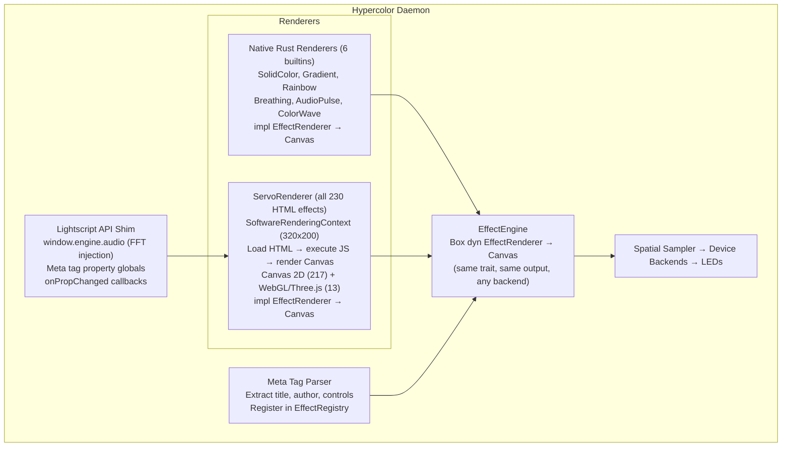

# Web Engine Architecture Decision

> **Decision: Servo (all-in)**
> **Date:** 2026-03-02
> **Status:** Accepted (supersedes 2026-03-01 Pure Rust decision)

---

## Context

Hypercolor has 236 HTML effects (LightScript format) that need to run headlessly at 60fps on a 320x200 canvas with RGBA pixel readback. After three rounds of research — initial survey (8 engines), deep Servo analysis (embedding API, build system, Canvas/WebGL status), and honest effort comparison (DIY vs Servo) — we're going all-in on Servo.

## Why Servo

### The Effect Corpus

| Category | Count | Rendering | Needs |
|---|---|---|---|
| Community effects | 210 | Canvas 2D | JS + Canvas 2D |
| Builtin HTML effects | 5 | Canvas 2D | JS + Canvas 2D |
| Custom effects | 13 | Three.js + WebGL | JS + WebGL |
| Native Rust builtins | 6 | Direct pixel math | Nothing (already done) |
| DOM outliers | 2 | jQuery/CSS | Full browser |

A DIY Canvas 2D bridge (rquickjs + skia-safe) covers 93% but **cannot run the 13 WebGL effects** — which are our own lightscript-workshop creations. Servo handles 100%.

### Servo Is Genuinely Accelerating

| Metric | 2023 | 2024 | 2025 |
|---|---|---|---|
| PRs merged | ~800 | 1,771 | **3,183** |
| Contributors | 54 | 129 | **146** |
| Releases | 0 | 0 | **5 (v0.0.1→v0.0.5)** |

Funded by Sovereign Tech Fund (~545K EUR), Igalia, Linux Foundation Europe. Summer 2026 alpha target. Monthly release cadence. The project is the healthiest it's ever been.

### Our Concerns Are Mostly Resolved

| Concern | Status | Evidence |
|---|---|---|
| Build complexity | **Improved** | Prebuilt SpiderMonkey archives. `cargo run -p servo --example winit_minimal` works. CI down to 8 min. |
| Windows/Cygwin | **Addressed** | Native MSVC builds work. v0.0.5 ships Windows binary. Use MSVC toolchain, not Cygwin. |
| Software rendering perf | **Non-issue** | 320x200 = 256KB/frame. Software GL does 100s of FPS at this resolution. |
| Vello memory growth | **Fixed** | PRs #38356 and #38406 merged. Scene pruned each frame. |
| API instability | **Converging** | WebViewDelegate pattern is the settled architecture. Breaking changes slowing. |
| No crates.io | **In progress** | Actively pinning deps toward eventual crates.io publish. Git dep works for us. |
| Dependency weight | **Real, accepted** | ~50-100MB binary, ~40-80MB RAM. Acceptable for a persistent daemon. |

### DIY Was Underestimated

The 12-17 day estimate for a Canvas 2D bridge was optimistic. Real-world implementations (@napi-rs/canvas, skia-canvas) have taken **years**. Honest estimate: 6-10 weeks for good coverage, plus ongoing edge-case maintenance. And it still can't do WebGL.

## Architecture



## Servo Integration Plan

### Dependencies

```toml
[dependencies]
servo = { version = "0.1", default-features = false, optional = true }

[features]
default = ["servo"]
servo = ["dep:servo"]
```

Feature-gated so the daemon compiles and runs with just the native Rust effects when Servo isn't available (CI, quick dev iteration, etc.).

### Key Servo Types We Use

| Type | Purpose |
|---|---|
| `Servo` | Top-level engine handle. Event loop, webview creation. |
| `WebView` | Per-effect browser instance. Navigate, paint, resize. |
| `WebViewDelegate` | Trait for receiving callbacks (frame ready, navigation). |
| `SoftwareRenderingContext` | Headless rendering — no window, no GPU required. |
| `RenderingContext::read_to_image()` | Pixel readback → `ImageBuffer<Rgba<u8>>` → our `Canvas`. |

### Render Loop Integration

```
Per frame:
1. Inject audio data + control values via JS evaluation
2. Servo processes requestAnimationFrame callbacks
3. Canvas 2D / WebGL operations execute
4. servo.spin_event_loop() + webview.paint()
5. rendering_context.read_to_image() → RGBA pixels
6. Convert to Hypercolor Canvas
7. Return from EffectRenderer::tick()
```

### What We Build

| Component | Description |
|---|---|
| `ServoRenderer` | `impl EffectRenderer` backed by Servo. Manages lifecycle. |
| `MetaTagParser` | Regex-based `<meta>` tag extraction from HTML effects. |
| `LightscriptShim` | JS injection layer for `window.engine.audio` and controls. |
| `EffectLoader` | Scans `effects/` dirs, parses meta, registers in `EffectRegistry`. |
| `ServoPool` (optional) | Reuse Servo instances across effect switches to avoid startup cost. |

## Risks & Mitigations

| Risk | Impact | Mitigation |
|---|---|---|
| Servo API breaks on update | Integration needs fixing | Pin to specific git rev. Update deliberately. |
| WebGL 1.0 incomplete in Servo | Some Three.js effects may not render | Test each effect. File Servo issues. WebGPU is more complete. |
| Build time (clean) | 8-15 min with prebuilt SpiderMonkey | Feature-gate. Native effects work without Servo. CI caching. |
| Binary size (~50-100MB) | Larger distribution | Acceptable for a persistent daemon. Not a CLI tool. |
| Servo on Windows (MSVC only) | Can't build under Cygwin directly | Use native MSVC toolchain for Servo builds. |
| Canvas 2D rendering bugs | Visual differences from Chrome | Test against effect corpus. Fix upstream or apply CSS tweaks. |

## What We Don't Build

- No Canvas 2D API bridge (Servo handles this)
- No embedded JS engine (Servo includes SpiderMonkey)
- No color parser (Servo handles CSS colors)
- No gradient implementation (Servo handles this)
- No compositing modes (Servo handles this)
- No text rendering (Servo handles this)
- No Path2D SVG parsing (Servo handles this)

All of that comes for free. We focus on the **integration layer**: lifecycle management, audio injection, meta tag parsing, and the `EffectRenderer` trait bridge.

## Previous Decision (Superseded)

The 2026-03-01 decision chose Pure Rust Canvas 2D (rquickjs + skia-safe). This was revised after:
1. Deeper research showed Servo's concerns were largely mitigated
2. DIY effort was underestimated (6-10 weeks, not 12-17 days)
3. WebGL effects (our own lightscript-workshop creations) can't run on the DIY path
4. Servo handles 100% of the effect corpus automatically
5. The user's preference: "go all in on servo"
