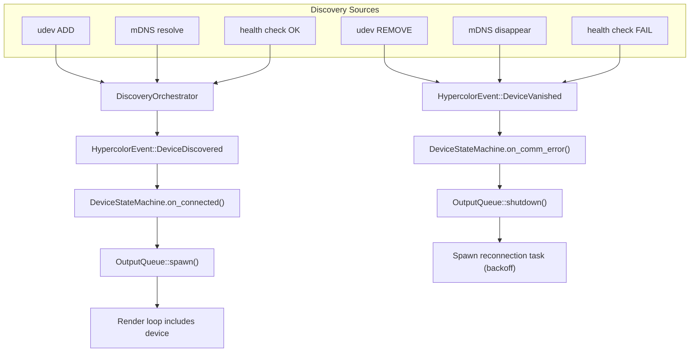

# Spec 02 — Device Backend System

> Implementation-ready technical specification for Hypercolor's device backend layer.

**Status:** Draft
**Author:** Nova
**Date:** 2026-03-01
**Crate:** `hypercolor-core::device`

---

## Table of Contents

1. [Overview](#1-overview)
2. [DeviceBackend Trait](#2-devicebackend-trait)
3. [DevicePlugin Trait](#3-deviceplugin-trait)
4. [DeviceInfo](#4-deviceinfo)
5. [DeviceHandle](#5-devicehandle)
6. [DeviceState Machine](#6-devicestate-machine)
7. [DeviceIdentifier](#7-deviceidentifier)
8. [OutputQueue](#8-outputqueue)
9. [DiscoveryOrchestrator](#9-discoveryorchestrator)
10. [Hot-Plug Event Model](#10-hot-plug-event-model)
11. [Feature Flag Design](#11-feature-flag-design)
12. [Error Types](#12-error-types)
13. [Wire Format & Color Types](#13-wire-format--color-types)
14. [Module Layout](#14-module-layout)

---

## 1. Overview

The device backend system is the output half of Hypercolor's pipeline. It receives
sampled LED color data from the spatial engine and pushes it to physical hardware
over USB HID, UDP (DDP/E1.31), HTTP/DTLS (Philips Hue), and future transports.

### Design constraints

- **60fps hot path.** `push_frame` is called every 16.6ms. It must never block
  the render loop. All I/O is dispatched asynchronously via per-backend output
  queues.
- **Graceful degradation.** A disconnected device must not crash the daemon or
  stall other devices. Errors are caught, logged, and fed into the reconnection
  state machine.
- **Compile-time extensibility (Phase 1).** Backends are Rust trait objects
  behind Cargo feature flags. No runtime plugin loading yet.
- **Latest-frame semantics.** If the transport cannot keep up (USB HID at full
  Prism 8 load takes ~49ms), stale frames are silently dropped and only the
  newest frame is transmitted.

### Crate dependencies (by feature)

| Feature     | Crate       | Purpose                                        |
| ----------- | ----------- | ---------------------------------------------- |
| `wled`      | `ddp-rs`    | DDP packet construction                        |
| `wled-sacn` | `sacn`      | E1.31/sACN fallback                            |
| `hid`       | `hidapi`    | USB HID communication                          |
| `hue`       | `reqwest`   | Hue bridge REST + Entertainment API            |
| _(core)_    | `tokio`     | Async runtime, channels, timers                |
| _(core)_    | `rgb`       | Color types                                    |
| _(core)_    | `serde`     | Serialization for DeviceInfo, DeviceIdentifier |
| _(core)_    | `tracing`   | Structured logging                             |
| _(core)_    | `thiserror` | Error types                                    |

Current backends are native transports; there is no dedicated bridge crate in
the active architecture.

---

## 2. DeviceBackend Trait

The core communication trait. Every hardware protocol implements this. All methods
are async because every transport involves I/O (USB writes, UDP sends, TCP streams).

The trait is object-safe so backends can be stored as `Box<dyn DeviceBackend>` in
the render loop's backend registry.

````rust
use crate::device::{
    DeviceError, DeviceHandle, DeviceInfo, DeviceIdentifier, Rgb,
};

/// Core device communication trait.
///
/// Implementors provide hardware-specific discovery, connection management,
/// and frame pushing for a single transport protocol. Each backend manages
/// one or more physical devices over the same transport (e.g., all WLED
/// devices over UDP, all USB HID controllers over hidapi).
///
/// # Lifecycle
///
/// ```text
/// discover() -> connect() -> push_frame() ... push_frame() -> disconnect()
///     ^                          |                                  |
///     |                          +--- DeviceError::Disconnected ----+
///     +--- re-discover after reconnect backoff ----+
/// ```
///
/// # Thread safety
///
/// Backends are `Send + Sync` and called from the tokio runtime. Long-running
/// I/O (USB HID packet trains) must be dispatched to a dedicated task or
/// thread internally -- `push_frame` returns immediately after queuing.
#[async_trait::async_trait]
pub trait DeviceBackend: Send + Sync {
    /// Human-readable backend name for logging and UI display.
    ///
    /// Examples: `"WLED (DDP)"`, `"USB HID (PrismRGB)"`, `"Hue Entertainment"`.
    fn name(&self) -> &str;

    /// Unique backend identifier used in configuration and feature gating.
    ///
    /// Examples: `"wled"`, `"hid"`, `"hue"`.
    fn id(&self) -> &str;

    /// Scan for devices reachable via this backend's transport.
    ///
    /// Called at startup (full scan), on manual rescan, and after hot-plug
    /// events that hint a device may have appeared. Implementations should
    /// complete within the discovery time budget:
    ///
    /// | Transport | Target | Maximum |
    /// |-----------|--------|---------|
    /// | USB HID   | <100ms | 500ms   |
    /// | mDNS      | 3s     | 10s     |
    /// | UDP bcast | 3s     | 5s      |
    /// | Hue       | 1s     | 5s      |
    ///
    /// Returns all devices currently reachable. The `DiscoveryOrchestrator`
    /// handles deduplication across backends.
    async fn discover(&mut self) -> Result<Vec<DeviceInfo>, DeviceError>;

    /// Establish a connection to a specific device.
    ///
    /// For USB HID: opens the HID device file, runs initialization sequence.
    /// For WLED: verifies reachability via HTTP `/json/info`, caches metadata.
    /// For Hue: authenticates with the bridge, establishes Entertainment stream.
    ///
    /// Returns an opaque [`DeviceHandle`] that identifies this connection for
    /// subsequent `push_frame` and `disconnect` calls.
    ///
    /// # Errors
    ///
    /// - `DeviceError::PermissionDenied` -- USB HID device not accessible.
    /// - `DeviceError::NotFound` -- Device no longer present.
    /// - `DeviceError::ConnectionFailed` -- Transport-level failure.
    async fn connect(&mut self, device: &DeviceInfo) -> Result<DeviceHandle, DeviceError>;

    /// Push a frame of LED color data to a connected device.
    ///
    /// This is the hot-path method, called at 60fps (or the device's native
    /// rate). Implementations MUST NOT block -- if the transport is slower
    /// than the frame rate, queue the frame internally and drop stale ones.
    ///
    /// The `colors` slice contains one RGB triplet per LED, ordered by zone
    /// then by LED index within the zone. The slice length matches the
    /// device's total LED count as reported by [`DeviceInfo::total_led_count`].
    ///
    /// # Errors
    ///
    /// - `DeviceError::Disconnected` -- Device was unplugged or lost.
    /// - `DeviceError::Timeout` -- Frame could not be queued (queue full).
    async fn push_frame(
        &mut self,
        handle: &DeviceHandle,
        colors: &[Rgb],
    ) -> Result<(), DeviceError>;

    /// Cleanly disconnect from a device.
    ///
    /// For USB HID: sends the shutdown color, activates hardware mode, closes
    /// the device file. For WLED: no action needed (stateless UDP). For
    /// Hue: tears down the Entertainment stream.
    ///
    /// The `DeviceHandle` is consumed and invalidated.
    async fn disconnect(&mut self, handle: DeviceHandle) -> Result<(), DeviceError>;

    /// Push a solid color to all LEDs on a device. Convenience for testing.
    ///
    /// Default implementation constructs a uniform color buffer and delegates
    /// to `push_frame`.
    async fn push_solid(
        &mut self,
        handle: &DeviceHandle,
        color: Rgb,
        led_count: usize,
    ) -> Result<(), DeviceError> {
        let colors = vec![color; led_count];
        self.push_frame(handle, &colors).await
    }

    /// Query the firmware version of a connected device, if supported.
    ///
    /// Returns `None` for backends/devices that don't support firmware queries.
    async fn query_firmware(
        &self,
        handle: &DeviceHandle,
    ) -> Result<Option<FirmwareInfo>, DeviceError> {
        let _ = handle;
        Ok(None)
    }

    /// The maximum frame rate this backend can sustain for a given device.
    ///
    /// The output queue uses this to throttle dispatch. Devices that cannot
    /// keep up with 60fps (e.g., Prism 8 at full 8-channel load, Hue
    /// Entertainment) report their actual ceiling here.
    fn max_fps(&self, handle: &DeviceHandle) -> u32 {
        let _ = handle;
        60
    }
}

/// Firmware information returned by backends that support version queries.
#[derive(Debug, Clone, serde::Serialize, serde::Deserialize)]
pub struct FirmwareInfo {
    /// Version string (e.g., "2", "1.0.0", "0.15.3").
    pub version: String,

    /// Known issues for this firmware version.
    pub known_issues: Vec<String>,

    /// Available update version, if known.
    pub update_available: Option<String>,
}
````

### Why `async_trait`?

All backend methods involve I/O. `async_trait` enables `Box<dyn DeviceBackend>`
in the render loop while keeping the trait object-safe. The heap allocation from
`async_trait` is negligible compared to the I/O latency of any real transport.

### Why `&mut self` on discover/connect/push_frame?

Backends hold mutable internal state: open HID handles, TCP connections, cached
device lists, output queues. `&mut self` communicates this clearly and prevents
accidental aliasing. The render loop holds `Vec<Box<dyn DeviceBackend>>` with
exclusive ownership of each backend.

---

## 3. DevicePlugin Trait

Bevy-inspired lifecycle trait for registering backends (and other extension
points) with the engine. Every backend ships as a plugin that registers itself
during daemon startup.

````rust
use crate::engine::HypercolorApp;

/// Lifecycle hooks for backend initialization and teardown.
///
/// Plugins are the unit of registration for all extension points. A device
/// backend plugin typically:
///
/// 1. In `build()`: registers its `DeviceBackend` impl with the app.
/// 2. In `ready()`: verifies runtime dependencies (hidapi available, network
///    reachable, Hue bridge reachable).
/// 3. In `cleanup()`: disconnects all devices, releases resources.
///
/// # Example
///
/// ```rust
/// pub struct WledPlugin {
///     config: WledConfig,
/// }
///
/// impl DevicePlugin for WledPlugin {
///     fn name(&self) -> &str { "WLED (DDP)" }
///
///     fn build(&self, app: &mut HypercolorApp) {
///         app.add_backend(WledBackend::new(self.config.clone()));
///     }
///
///     fn ready(&self, app: &HypercolorApp) -> Result<(), DeviceError> {
///         // No runtime deps -- UDP is always available
///         Ok(())
///     }
///
///     fn cleanup(&mut self) {
///         // WLED is stateless UDP -- nothing to clean up
///     }
/// }
/// ```
pub trait DevicePlugin: Send + Sync + 'static {
    /// Human-readable plugin name.
    fn name(&self) -> &str;

    /// Register this plugin's capabilities with the engine.
    ///
    /// Called once during daemon startup, before the render loop starts.
    /// Plugins register backends, input sources, or other extension points
    /// by calling methods on `HypercolorApp`.
    fn build(&self, app: &mut HypercolorApp);

    /// Verify that runtime dependencies are available.
    ///
    /// Called after all plugins have been `build()`-ed, before the render
    /// loop starts. Return `Err` to indicate the plugin cannot function
    /// (missing library, unreachable service, etc.). The daemon logs the
    /// error and continues without this plugin.
    ///
    /// Default: always ready.
    fn ready(&self, _app: &HypercolorApp) -> Result<(), DeviceError> {
        Ok(())
    }

    /// Clean up resources on daemon shutdown.
    ///
    /// Called during graceful shutdown. Plugins should disconnect all
    /// devices, send shutdown colors, close file handles, and release
    /// any system resources.
    ///
    /// Default: no-op.
    fn cleanup(&mut self) {}
}
````

### Plugin registration in the daemon

```rust
// hypercolor-daemon/src/main.rs
fn register_plugins(app: &mut HypercolorApp) {
    #[cfg(feature = "wled")]
    app.add_plugin(WledPlugin::default());

    #[cfg(feature = "hid")]
    app.add_plugin(HidPlugin::default());

    #[cfg(feature = "hue")]
    app.add_plugin(HuePlugin::default());

}
```

---

## 4. DeviceInfo

Identity, capabilities, and topology of a discovered or connected device. This is
the primary data structure exchanged between the discovery layer, the device
registry, the spatial layout engine, and all frontends (web, TUI, CLI).

```rust
use crate::device::{DeviceIdentifier, LedTopology, ConnectionType, DeviceFamily};

/// Complete description of a device's identity, capabilities, and topology.
///
/// Populated during discovery and enriched during connection (e.g., firmware
/// version, per-channel LED counts for Prism 8). Serialized to TOML for the
/// device registry (`~/.config/hypercolor/devices.toml`) and transmitted to
/// frontends via the event bus.
#[derive(Debug, Clone, serde::Serialize, serde::Deserialize)]
pub struct DeviceInfo {
    /// Stable unique identifier. See [`DeviceIdentifier`] for details.
    pub identifier: DeviceIdentifier,

    /// User-facing display name.
    ///
    /// Initially set from the device database (e.g., "PrismRGB Prism 8").
    /// Users can override this with a custom name (e.g., "Main Case RGB").
    pub name: String,

    /// Hardware manufacturer or brand.
    pub vendor: String,

    /// Device family classification.
    pub family: DeviceFamily,

    /// Transport/connection type.
    pub connection: ConnectionType,

    /// Zones within this device, each with its own LED topology.
    ///
    /// A single-zone device (most WLED strips) has one entry. Multi-zone
    /// devices (Prism 8 with 8 channels, Prism S with ATX + GPU cables,
    /// Hue entertainment groups) have many.
    pub zones: Vec<ZoneInfo>,

    /// Firmware version, if known.
    pub firmware_version: Option<String>,

    /// Whether the device requires elevated permissions to access.
    pub needs_permissions: bool,
}

/// A single zone within a device.
///
/// Each zone maps to a contiguous range of LEDs with a specific topology.
/// The spatial layout engine positions zones on the canvas independently.
#[derive(Debug, Clone, serde::Serialize, serde::Deserialize)]
pub struct ZoneInfo {
    /// Zone name (e.g., "Channel 1", "ATX Strimer", "Keyboard Backlight").
    pub name: String,

    /// Number of LEDs in this zone.
    pub led_count: u32,

    /// Physical arrangement of LEDs.
    pub topology: LedTopology,
}

/// Physical LED arrangement within a zone.
#[derive(Debug, Clone, serde::Serialize, serde::Deserialize)]
pub enum LedTopology {
    /// Linear strip of LEDs.
    Strip {
        /// Number of LEDs in the strip.
        count: u32,
    },

    /// 2D matrix of LEDs (e.g., Strimer cable, LED panel).
    Matrix {
        /// Columns.
        width: u32,
        /// Rows.
        height: u32,
    },

    /// Circular ring of LEDs (e.g., fan, Hue Iris).
    Ring {
        /// Number of LEDs around the ring.
        count: u32,
    },

    /// Arbitrary LED positions. Positions are specified in the spatial layout.
    Custom,
}

/// How the device connects to the host.
#[derive(Debug, Clone, Copy, PartialEq, Eq, Hash, serde::Serialize, serde::Deserialize)]
pub enum ConnectionType {
    /// USB HID (PrismRGB, Nollie).
    UsbHid,

    /// UDP DDP (WLED primary protocol).
    WledDdp,

    /// UDP E1.31/sACN (WLED fallback, other DMX devices).
    E131,

    /// HTTP REST + DTLS Entertainment API (Philips Hue).
    PhilipsHue,

    /// gRPC over Unix socket (out-of-process bridge plugins).
    GrpcBridge,
}

/// Device family classification for protocol selection and device database lookup.
#[derive(Debug, Clone, Copy, PartialEq, Eq, Hash, serde::Serialize, serde::Deserialize)]
pub enum DeviceFamily {
    /// PrismRGB Prism 8 -- 8 channels, GRB, 0xFF frame commit.
    Prism8,

    /// Nollie 8 v2 -- identical protocol to Prism 8, different VID.
    Nollie8,

    /// PrismRGB Prism S -- Strimer controller, RGB, chunked buffer.
    PrismS,

    /// PrismRGB Prism Mini -- single channel, 0xAA marker packets.
    PrismMini,

    /// WLED ESP8266/ESP32 controller.
    Wled,

    /// Philips Hue bridge + lights.
    PhilipsHue,

    /// Unknown or user-defined device family.
    Custom(String),
}

impl DeviceInfo {
    /// Total LED count across all zones.
    pub fn total_led_count(&self) -> u32 {
        self.zones.iter().map(|z| z.led_count).sum()
    }

    /// Whether this device supports firmware version queries.
    pub fn supports_firmware_query(&self) -> bool {
        matches!(
            self.family,
            DeviceFamily::Prism8
                | DeviceFamily::Nollie8
                | DeviceFamily::PrismMini
                | DeviceFamily::Wled
        )
    }
}
```

### `Custom` variant in `DeviceFamily`

`DeviceFamily::Custom(String)` cannot derive `Copy`. To keep the common families
`Copy`-able, split into a separate approach:

```rust
/// Compact device family for known hardware. Copy + Eq + Hash.
#[derive(Debug, Clone, Copy, PartialEq, Eq, Hash, serde::Serialize, serde::Deserialize)]
pub enum DeviceFamily {
    Prism8,
    Nollie8,
    PrismS,
    PrismMini,
    Wled,
    PhilipsHue,
    Unknown,
}
```

User-defined families are handled at the device database / config level, not in
the enum. This keeps `DeviceFamily` trivially copyable and hashable.

---

## 5. DeviceHandle

Opaque handle representing a live connection to a device. Returned by
`DeviceBackend::connect()`, consumed by `disconnect()`, and borrowed by
`push_frame()`.

```rust
use std::sync::atomic::{AtomicU64, Ordering};

/// Opaque handle to a connected device.
///
/// Handles are issued by `DeviceBackend::connect()` and uniquely identify
/// an active connection. They are cheap to clone (just an ID + metadata)
/// and are used as keys in the output queue and state machine maps.
///
/// Handles intentionally do not carry backend-specific state. The backend
/// maps the handle's `id` to its internal connection state (open HID file,
/// TCP stream, cached IP, etc.).
///
/// # Validity
///
/// A handle is valid from the moment `connect()` returns `Ok` until
/// `disconnect()` is called or the backend emits `DeviceError::Disconnected`.
/// Using a stale handle returns `DeviceError::InvalidHandle`.
#[derive(Debug, Clone, PartialEq, Eq, Hash)]
pub struct DeviceHandle {
    /// Monotonically increasing connection ID. Globally unique within a
    /// daemon session. Prevents stale handle reuse after reconnection.
    id: u64,

    /// The device this handle refers to.
    device_id: DeviceIdentifier,

    /// Backend that issued this handle.
    backend_id: &'static str,
}

/// Global handle counter. Atomic to support concurrent backend connections.
static NEXT_HANDLE_ID: AtomicU64 = AtomicU64::new(1);

impl DeviceHandle {
    /// Create a new handle for a freshly connected device.
    ///
    /// Called internally by `DeviceBackend::connect()` implementations.
    pub(crate) fn new(device_id: DeviceIdentifier, backend_id: &'static str) -> Self {
        Self {
            id: NEXT_HANDLE_ID.fetch_add(1, Ordering::Relaxed),
            device_id,
            backend_id,
        }
    }

    /// The unique connection ID.
    pub fn id(&self) -> u64 {
        self.id
    }

    /// The device this handle connects to.
    pub fn device_id(&self) -> &DeviceIdentifier {
        &self.device_id
    }

    /// The backend that owns this connection.
    pub fn backend_id(&self) -> &str {
        self.backend_id
    }
}
```

### Why monotonic IDs?

When a device disconnects and reconnects, it gets a new `DeviceHandle` with a
new `id`. Any code holding a stale handle from the previous connection will get
`DeviceError::InvalidHandle` instead of accidentally writing to a different
device or a recycled file descriptor.

---

## 6. DeviceState Machine

Every device tracked by the daemon has a state. Transitions are enforced at the
type level through method signatures that accept and return specific states.

### State diagram

```text
                          +----------+
              discover    |          |  hot-plug remove /
         +--------------->|  Known   |<--- max reconnect ---+
         |                |          |     attempts failed   |
         |                +----+-----+                       |
         |                     | connect()                   |
         |                     v                             |
         |              +-----------+                        |
         |              |           |                        |
         |              | Connected |-----+                  |
         |              |           |     | comm error       |
         |              +-----+-----+     |                  |
         |                    |           v                  |
         |                    |    +--------------+          |
         |          push_frame|    |              |          |
         |           success  |    | Reconnecting |----------+
         |                    |    | (backoff)    |   give up
         |                    v    |              |
         |              +----+-----+---+--+------+
         |              |              |
         |              |    Active    |
         |              |  (rendering) |
         |              |              |
         |              +------+-------+
         |                     | user disable /
         |                     | daemon shutdown
         |                     v
         |              +------------+
         |              |            |
         +----<---------| Disabled   |
           user enable  |  (by user) |
                        |            |
                        +------------+
```

### Types

```rust
use std::time::{Duration, Instant};

/// Device lifecycle state.
///
/// Each state carries the data relevant to that phase. Transitions are
/// performed via methods on [`DeviceStateMachine`] that enforce valid
/// progressions.
#[derive(Debug, Clone, PartialEq, Eq, serde::Serialize, serde::Deserialize)]
pub enum DeviceState {
    /// Device has been discovered but not yet connected.
    ///
    /// Entered on first discovery or after a disconnect where the device
    /// is still physically present but the connection was intentionally
    /// dropped (e.g., backend cleanup during shutdown).
    Known,

    /// Connection established, awaiting first successful frame push.
    ///
    /// Entered when `DeviceBackend::connect()` returns `Ok`. The device
    /// is initialized but has not yet proven it can accept frame data.
    Connected,

    /// Actively receiving and rendering frames.
    ///
    /// Entered after the first successful `push_frame()` call in the
    /// Connected state. This is the steady-state for healthy devices.
    Active,

    /// Connection lost, attempting to reconnect with exponential backoff.
    ///
    /// Entered when `push_frame()` or a health check returns a
    /// communication error. The reconnection loop runs in a background
    /// task.
    Reconnecting {
        /// When the last connection attempt failed.
        since: Instant,
        /// Number of reconnection attempts so far.
        attempt: u32,
        /// Delay before the next attempt.
        next_retry: Duration,
    },

    /// Intentionally disabled by the user.
    ///
    /// The device is known but the user has chosen not to use it.
    /// No connection attempts are made. Re-enabled via user action.
    Disabled,
}

/// Manages state transitions for a single device.
///
/// Enforces the state machine diagram above. Invalid transitions return
/// `DeviceError::InvalidTransition`.
pub struct DeviceStateMachine {
    /// Current device state.
    state: DeviceState,

    /// The device this machine tracks.
    device_id: DeviceIdentifier,

    /// Active connection handle, if connected or active.
    handle: Option<DeviceHandle>,

    /// Reconnection policy.
    reconnect_policy: ReconnectPolicy,

    /// Timestamp of last state change.
    last_transition: Instant,
}

/// Reconnection backoff configuration.
#[derive(Debug, Clone)]
pub struct ReconnectPolicy {
    /// Initial delay before first retry (default: 1s).
    pub initial_delay: Duration,

    /// Maximum delay between retries (default: 60s).
    pub max_delay: Duration,

    /// Multiplier applied to delay after each failure (default: 2.0).
    pub backoff_factor: f64,

    /// Maximum number of attempts before giving up.
    /// `None` means retry indefinitely.
    pub max_attempts: Option<u32>,

    /// Jitter factor (0.0-1.0) applied to each delay to prevent thundering
    /// herd when multiple devices reconnect simultaneously.
    pub jitter: f64,
}

impl Default for ReconnectPolicy {
    fn default() -> Self {
        Self {
            initial_delay: Duration::from_secs(1),
            max_delay: Duration::from_secs(60),
            backoff_factor: 2.0,
            max_attempts: None,
            jitter: 0.1,
        }
    }
}

impl DeviceStateMachine {
    /// Create a new state machine for a freshly discovered device.
    pub fn new(device_id: DeviceIdentifier) -> Self {
        Self {
            state: DeviceState::Known,
            device_id,
            handle: None,
            reconnect_policy: ReconnectPolicy::default(),
            last_transition: Instant::now(),
        }
    }

    /// Current state.
    pub fn state(&self) -> &DeviceState {
        &self.state
    }

    /// Active handle, if any.
    pub fn handle(&self) -> Option<&DeviceHandle> {
        self.handle.as_ref()
    }

    /// Transition: Known -> Connected.
    ///
    /// Called when `DeviceBackend::connect()` succeeds.
    pub fn on_connected(&mut self, handle: DeviceHandle) -> Result<(), DeviceError> {
        match &self.state {
            DeviceState::Known | DeviceState::Reconnecting { .. } => {
                self.handle = Some(handle);
                self.state = DeviceState::Connected;
                self.last_transition = Instant::now();
                Ok(())
            }
            _ => Err(DeviceError::InvalidTransition {
                device: self.device_id.clone(),
                from: self.state.variant_name().to_string(),
                to: "Connected".to_string(),
            }),
        }
    }

    /// Transition: Connected -> Active.
    ///
    /// Called after the first successful `push_frame()`.
    pub fn on_frame_success(&mut self) -> Result<(), DeviceError> {
        match &self.state {
            DeviceState::Connected => {
                self.state = DeviceState::Active;
                self.last_transition = Instant::now();
                Ok(())
            }
            DeviceState::Active => {
                // Already active -- this is normal, not an error.
                Ok(())
            }
            _ => Err(DeviceError::InvalidTransition {
                device: self.device_id.clone(),
                from: self.state.variant_name().to_string(),
                to: "Active".to_string(),
            }),
        }
    }

    /// Transition: Connected|Active -> Reconnecting.
    ///
    /// Called when a communication error occurs.
    pub fn on_comm_error(&mut self) -> Result<(), DeviceError> {
        match &self.state {
            DeviceState::Connected | DeviceState::Active => {
                self.handle = None;
                self.state = DeviceState::Reconnecting {
                    since: Instant::now(),
                    attempt: 0,
                    next_retry: self.reconnect_policy.initial_delay,
                };
                self.last_transition = Instant::now();
                Ok(())
            }
            _ => Err(DeviceError::InvalidTransition {
                device: self.device_id.clone(),
                from: self.state.variant_name().to_string(),
                to: "Reconnecting".to_string(),
            }),
        }
    }

    /// Advance the reconnection counter.
    ///
    /// Returns the delay before the next attempt, or `None` if max attempts
    /// exhausted (transitions to Known).
    pub fn on_reconnect_failed(&mut self) -> Option<Duration> {
        if let DeviceState::Reconnecting { attempt, next_retry, .. } = &mut self.state {
            *attempt += 1;

            if self.reconnect_policy.max_attempts.is_some_and(|max| *attempt >= max) {
                // Give up -- return to Known state
                self.state = DeviceState::Known;
                self.last_transition = Instant::now();
                return None;
            }

            let base_delay = next_retry.as_secs_f64() * self.reconnect_policy.backoff_factor;
            let clamped = base_delay.min(self.reconnect_policy.max_delay.as_secs_f64());

            // Apply jitter: delay * (1.0 +/- jitter)
            let jitter_range = clamped * self.reconnect_policy.jitter;
            let jittered = clamped + (rand::random::<f64>() * 2.0 - 1.0) * jitter_range;

            let delay = Duration::from_secs_f64(jittered.max(0.1));
            *next_retry = delay;

            Some(delay)
        } else {
            None
        }
    }

    /// Transition: any -> Disabled.
    ///
    /// User-initiated. Disconnects cleanly if currently connected.
    pub fn on_user_disable(&mut self) {
        self.handle = None;
        self.state = DeviceState::Disabled;
        self.last_transition = Instant::now();
    }

    /// Transition: Disabled -> Known.
    ///
    /// User re-enables the device. It will be picked up on the next
    /// discovery cycle or can be explicitly connected.
    pub fn on_user_enable(&mut self) {
        if self.state == DeviceState::Disabled {
            self.state = DeviceState::Known;
            self.last_transition = Instant::now();
        }
    }

    /// Transition: any -> Known.
    ///
    /// Called on hot-plug removal (udev REMOVE, mDNS disappear).
    pub fn on_hot_unplug(&mut self) {
        self.handle = None;
        self.state = DeviceState::Known;
        self.last_transition = Instant::now();
    }
}

impl DeviceState {
    /// Variant name for logging and error messages.
    pub fn variant_name(&self) -> &'static str {
        match self {
            DeviceState::Known => "Known",
            DeviceState::Connected => "Connected",
            DeviceState::Active => "Active",
            DeviceState::Reconnecting { .. } => "Reconnecting",
            DeviceState::Disabled => "Disabled",
        }
    }

    /// Whether the device is in a state where frames can be pushed.
    pub fn is_renderable(&self) -> bool {
        matches!(self, DeviceState::Connected | DeviceState::Active)
    }
}
```

### Serde for `Reconnecting`

`DeviceState::Reconnecting` contains `Instant` which doesn't implement
`Serialize`. For persistence (device registry TOML), `Reconnecting` serializes
as `"Known"` -- the reconnection loop is transient runtime state, not persisted.

---

## 7. DeviceIdentifier

Stable, unique identity for a device that persists across reboots and reconnects.
Each transport has its own identifier shape because the available identity signals
differ fundamentally between USB, network, and bridge protocols.

```rust
use std::net::IpAddr;

/// Unique, stable identifier for a physical device.
///
/// Used as the primary key in the device registry and as the deduplication
/// key during discovery. Two `DeviceIdentifier` values are equal if they
/// refer to the same physical hardware, even if connection details (IP
/// address, USB path) have changed.
///
/// # Stability guarantees
///
/// | Variant | Primary key | Stable across... |
/// |---------|-------------|------------------|
/// | `UsbHid` | VID:PID + serial | Reboots, port changes (with serial) |
/// | `UsbHid` | VID:PID + path | Same USB port only (without serial) |
/// | `Network` | MAC address | Reboots, DHCP reassignment |
/// | `HueBridge` | Bridge ID + light ID | Reboots, network changes |
#[derive(Debug, Clone, Hash, PartialEq, Eq, serde::Serialize, serde::Deserialize)]
pub enum DeviceIdentifier {
    /// USB HID device identified by vendor/product IDs.
    ///
    /// Uses the USB serial number as the primary stable identity. Falls
    /// back to the USB topology path (bus + port chain) for devices
    /// without serial numbers (common with PrismRGB controllers).
    UsbHid {
        /// USB Vendor ID (e.g., 0x16D5 for PrismRGB).
        vendor_id: u16,

        /// USB Product ID (e.g., 0x1F01 for Prism 8).
        product_id: u16,

        /// USB serial number string, if the device provides one.
        /// This is the preferred stable identifier.
        serial: Option<String>,

        /// USB topology path (e.g., "usb-0000:00:14.0-2.3").
        /// Used as fallback identity when serial is absent.
        /// Changes if the user moves the USB cable to a different port.
        usb_path: Option<String>,
    },

    /// Network device identified by MAC address.
    ///
    /// Used for WLED and other WiFi/Ethernet-connected devices. The MAC
    /// address is the only truly stable identifier -- IP addresses change
    /// with DHCP, mDNS hostnames can be reconfigured.
    Network {
        /// MAC address in colon-separated hex (e.g., "A4:CF:12:34:AB:CD").
        /// Primary stable identity.
        mac_address: String,

        /// Last known IP address. Cached for fast reconnection, but not
        /// used for identity comparison.
        #[serde(skip_serializing_if = "Option::is_none")]
        last_ip: Option<IpAddr>,

        /// mDNS hostname (e.g., "wled-kitchen").
        #[serde(skip_serializing_if = "Option::is_none")]
        mdns_hostname: Option<String>,
    },

    /// Philips Hue bridge and individual light.
    ///
    /// Hue has a two-level identity: the bridge itself, and each light
    /// registered to that bridge. The bridge ID is printed on the
    /// hardware and stable forever. The light ID is assigned by the
    /// bridge and stable across reboots.
    HueBridge {
        /// Bridge identifier (printed on hardware, stable forever).
        bridge_id: String,

        /// Individual light/group ID within the bridge.
        light_id: String,

        /// Light serial number, if available from the Hue API.
        #[serde(skip_serializing_if = "Option::is_none")]
        light_serial: Option<String>,
    },

}

impl DeviceIdentifier {
    /// Construct a USB HID identifier.
    pub fn usb(
        vendor_id: u16,
        product_id: u16,
        serial: Option<String>,
        usb_path: Option<String>,
    ) -> Self {
        Self::UsbHid {
            vendor_id,
            product_id,
            serial,
            usb_path,
        }
    }

    /// Construct a network device identifier from a MAC address.
    pub fn network(mac_address: String, last_ip: Option<IpAddr>, mdns_hostname: Option<String>) -> Self {
        Self::Network {
            mac_address,
            last_ip,
            mdns_hostname,
        }
    }

    /// Construct a Hue bridge + light identifier.
    pub fn hue_bridge(
        bridge_id: String,
        light_id: String,
        light_serial: Option<String>,
    ) -> Self {
        Self::HueBridge {
            bridge_id,
            light_id,
            light_serial,
        }
    }

    /// A short, human-readable string for logging and display.
    pub fn display_short(&self) -> String {
        match self {
            Self::UsbHid { vendor_id, product_id, serial, .. } => {
                match serial {
                    Some(s) => format!("USB {:04X}:{:04X} [{}]", vendor_id, product_id, s),
                    None => format!("USB {:04X}:{:04X}", vendor_id, product_id),
                }
            }
            Self::Network { mac_address, mdns_hostname, .. } => {
                match mdns_hostname {
                    Some(h) => format!("{} ({})", h, mac_address),
                    None => mac_address.clone(),
                }
            }
            Self::HueBridge { bridge_id, light_id, .. } => {
                format!("Hue {}:{}", &bridge_id[..8.min(bridge_id.len())], light_id)
            }
        }
    }

    /// Compute a stable fingerprint for deduplication.
    ///
    /// Two identifiers with the same fingerprint refer to the same physical
    /// device, even if mutable fields (IP, USB path, controller index) differ.
    pub fn fingerprint(&self) -> DeviceFingerprint {
        match self {
            Self::UsbHid { vendor_id, product_id, serial, usb_path } => {
                // Prefer serial. Fall back to VID:PID + path.
                let key = serial.as_deref().unwrap_or(
                    &usb_path.as_deref().unwrap_or("unknown")
                );
                DeviceFingerprint(format!("usb:{:04x}:{:04x}:{}", vendor_id, product_id, key))
            }
            Self::Network { mac_address, .. } => {
                DeviceFingerprint(format!("net:{}", mac_address.to_lowercase()))
            }
            Self::HueBridge { bridge_id, light_id, .. } => {
                DeviceFingerprint(format!("hue:{}:{}", bridge_id, light_id))
            }
        }
    }
}

/// Stable hash key for device deduplication.
///
/// Two devices with the same fingerprint are considered the same physical
/// hardware, even if discovered by different scanners or with different
/// transient connection details.
#[derive(Debug, Clone, Hash, PartialEq, Eq)]
pub struct DeviceFingerprint(pub String);

impl std::fmt::Display for DeviceIdentifier {
    fn fmt(&self, f: &mut std::fmt::Formatter<'_>) -> std::fmt::Result {
        write!(f, "{}", self.display_short())
    }
}
```

### Identity resolution priority

When matching a newly discovered device against the registry:

1. **Exact fingerprint match** -- same physical device, restore all user config.
2. **VID:PID match (USB) or MAC prefix match (network)** -- probable match,
   confirm with user if ambiguous (multiple identical devices).
3. **No match** -- new device, assign temporary name, add to registry.

---

## 8. OutputQueue

The render loop must never block on device I/O. The `OutputQueue` sits between
the render loop and each backend, providing async fire-and-forget semantics with
latest-frame swapping.

### Design

```text
Render Loop                OutputQueue                  Backend I/O
(16.6ms ticks)             (per device)                 (transport-specific)

    |                          |                           |
    |-- push_frame(colors) --> |                           |
    |   (returns immediately)  |                           |
    |                          |-- swap latest ----------->|
    |                          |   (atomic)                |
    |                          |                           |-- USB write -->
    |                          |                           |-- UDP send --->
    |-- push_frame(colors) --> |                           |
    |   (overwrites stale)     |                           |
    |                          |                           |<- previous done
    |                          |-- swap latest ----------->|
    |                          |                           |-- send new --->
```

### Types

```rust
use std::sync::Arc;
use tokio::sync::watch;

/// Async fire-and-forget frame queue with latest-frame swapping.
///
/// The render loop calls `push()` every frame. If the backend's I/O thread
/// hasn't finished sending the previous frame, the stale frame is silently
/// replaced with the new one. This guarantees:
///
/// 1. The render loop never blocks.
/// 2. The backend always sends the most recent data.
/// 3. Slow transports gracefully degrade by dropping intermediate frames.
///
/// Internally uses `tokio::sync::watch` which provides exactly these
/// semantics: single-producer, multi-consumer, latest-value-wins.
///
/// # Per-transport behavior
///
/// | Transport | Queue depth | Behavior on overrun |
/// |-----------|-------------|---------------------|
/// | USB HID   | 1 (watch)  | Drop stale frame, send newest |
/// | WLED DDP  | 1 (watch)  | Drop stale frame, send newest |
/// | Hue       | 1 (watch)  | Drop stale frame, rate-limit to 25fps |
pub struct OutputQueue {
    /// The sender side, held by the render loop dispatcher.
    tx: watch::Sender<Option<Arc<FramePayload>>>,

    /// Handle to the background I/O task.
    io_task: tokio::task::JoinHandle<()>,

    /// Device this queue serves.
    device_id: DeviceIdentifier,

    /// Target frame rate for this device's transport.
    target_fps: u32,
}

/// A single frame of color data ready for transmission.
#[derive(Debug, Clone)]
pub struct FramePayload {
    /// LED colors, one RGB triplet per LED.
    pub colors: Vec<Rgb>,

    /// Frame sequence number (monotonically increasing).
    pub sequence: u64,

    /// Timestamp when the render loop produced this frame.
    pub produced_at: Instant,
}

/// Metrics emitted by the output queue for the performance dashboard.
#[derive(Debug, Clone, Default)]
pub struct OutputQueueMetrics {
    /// Total frames received from the render loop.
    pub frames_received: u64,

    /// Frames actually sent to hardware.
    pub frames_sent: u64,

    /// Frames dropped because a newer frame arrived before send completed.
    pub frames_dropped: u64,

    /// Average time from frame production to hardware transmission.
    pub avg_latency: Duration,

    /// Last error, if any.
    pub last_error: Option<String>,
}

impl OutputQueue {
    /// Create a new output queue and spawn the background I/O task.
    ///
    /// The `send_fn` closure is called on the I/O task whenever a new
    /// frame is available. It performs the actual hardware communication
    /// (USB writes, UDP sends, etc.).
    pub fn spawn<F, Fut>(
        device_id: DeviceIdentifier,
        target_fps: u32,
        send_fn: F,
    ) -> Self
    where
        F: Fn(Arc<FramePayload>) -> Fut + Send + Sync + 'static,
        Fut: std::future::Future<Output = Result<(), DeviceError>> + Send,
    {
        let (tx, mut rx) = watch::channel(None::<Arc<FramePayload>>);

        let device_id_clone = device_id.clone();
        let io_task = tokio::spawn(async move {
            let frame_interval = Duration::from_secs_f64(1.0 / target_fps as f64);

            loop {
                // Wait for a new frame (or shutdown)
                if rx.changed().await.is_err() {
                    break; // Sender dropped -- shutting down
                }

                let frame = match rx.borrow_and_update().clone() {
                    Some(f) => f,
                    None => continue,
                };

                let send_start = Instant::now();

                if let Err(e) = send_fn(frame).await {
                    tracing::warn!(
                        device = %device_id_clone,
                        "Output error: {}",
                        e
                    );
                }

                // Rate-limit to target FPS
                let elapsed = send_start.elapsed();
                if elapsed < frame_interval {
                    tokio::time::sleep(frame_interval - elapsed).await;
                }
            }
        });

        Self {
            tx,
            io_task,
            device_id,
            target_fps,
        }
    }

    /// Queue a frame for transmission. Returns immediately.
    ///
    /// If the previous frame hasn't been sent yet, it is replaced. The
    /// I/O task always picks up the most recent frame.
    pub fn push(&self, payload: FramePayload) {
        // watch::Sender::send_replace -- atomic swap, never blocks
        self.tx.send_replace(Some(Arc::new(payload)));
    }

    /// Shut down the I/O task and wait for it to complete.
    pub async fn shutdown(self) {
        drop(self.tx); // Signal the I/O task to exit
        let _ = self.io_task.await;
    }
}
```

### USB HID variant: dedicated OS thread

For USB HID devices, the output queue spawns a dedicated OS thread (not a tokio
task) because `hidapi` write operations are blocking syscalls that should not
occupy a tokio worker thread.

```rust
/// USB HID output queue using a dedicated OS thread.
///
/// Uses `crossbeam::channel` with a capacity of 1 for latest-frame
/// swapping semantics, since `tokio::sync::watch` is not available
/// outside the async runtime.
pub struct UsbOutputQueue {
    /// Atomic latest-frame slot. The writer thread reads from this.
    latest: Arc<crossbeam::atomic::AtomicCell<Option<Arc<FramePayload>>>>,

    /// Signal to wake the writer thread.
    notify: Arc<std::sync::Condvar>,
    notify_mutex: Arc<std::sync::Mutex<bool>>,

    /// Writer thread handle.
    thread: Option<std::thread::JoinHandle<()>>,
}

impl UsbOutputQueue {
    pub fn spawn(
        device_id: DeviceIdentifier,
        target_fps: u32,
        hid_device: hidapi::HidDevice,
    ) -> Self {
        let latest = Arc::new(crossbeam::atomic::AtomicCell::new(None));
        let notify = Arc::new(std::sync::Condvar::new());
        let notify_mutex = Arc::new(std::sync::Mutex::new(false));

        let latest_clone = latest.clone();
        let notify_clone = notify.clone();
        let mutex_clone = notify_mutex.clone();
        let frame_interval = Duration::from_secs_f64(1.0 / target_fps as f64);

        let thread = std::thread::Builder::new()
            .name(format!("hc-usb-{}", device_id.display_short()))
            .spawn(move || {
                loop {
                    // Wait for notification or timeout
                    let mut signaled = mutex_clone.lock().unwrap();
                    let _ = notify_clone.wait_timeout(signaled, frame_interval);

                    // Grab latest frame (atomic swap to None)
                    if let Some(frame) = latest_clone.swap(None) {
                        // Send all USB packets for this frame
                        if let Err(e) = send_usb_frame(&hid_device, &frame) {
                            tracing::warn!(device = %device_id, "USB write error: {}", e);
                            break; // Device disconnected
                        }
                    }
                }
            })
            .expect("failed to spawn USB output thread");

        Self {
            latest,
            notify,
            notify_mutex,
            thread: Some(thread),
        }
    }

    /// Queue a frame. Replaces any pending frame atomically.
    pub fn push(&self, payload: FramePayload) {
        self.latest.store(Some(Arc::new(payload)));
        // Wake the writer thread
        let mut signaled = self.notify_mutex.lock().unwrap();
        *signaled = true;
        self.notify.notify_one();
    }
}
```

---

## 9. DiscoveryOrchestrator

Coordinates parallel device scanning across all transports, deduplicates results,
diffs against the persistent device registry, and emits events on the bus.

```rust
use std::collections::HashMap;
use tokio::sync::broadcast;

/// Coordinates parallel device discovery across all transport scanners.
///
/// At startup: runs a full scan across all transports simultaneously.
/// At runtime: listens for hot-plug hints and triggers targeted rescans.
/// On demand: `full_scan()` can be called from the REST API or CLI.
///
/// # Deduplication
///
/// The same physical device may be reported by multiple scanners (e.g., a
/// WLED device found via both mDNS and UDP broadcast). The orchestrator
/// deduplicates using [`DeviceFingerprint`], merging metadata from all
/// sources.
///
/// # Event emission
///
/// Discovery results flow to the rest of the system via the event bus:
///
/// - `HypercolorEvent::DeviceDiscovered` -- new device seen for the first time.
/// - `HypercolorEvent::DeviceReappeared` -- previously known device is back.
/// - `HypercolorEvent::DeviceVanished` -- known device no longer detected.
pub struct DiscoveryOrchestrator {
    /// Registered scanners, one per transport.
    scanners: Vec<Box<dyn TransportScanner>>,

    /// Persistent device registry.
    registry: DeviceRegistry,

    /// Event bus for broadcasting discovery results.
    bus: broadcast::Sender<HypercolorEvent>,
}

/// A single-transport device scanner.
///
/// Implemented by `UsbScanner`, `MdnsScanner`, `UdpBroadcastScanner`,
/// and future transport scanners.
#[async_trait::async_trait]
pub trait TransportScanner: Send + Sync {
    /// Human-readable scanner name (for logging).
    fn name(&self) -> &str;

    /// Run a one-shot scan and return all currently reachable devices.
    async fn scan(&mut self) -> Result<Vec<DiscoveredDevice>, DeviceError>;

    /// Start continuous monitoring for hot-plug events.
    ///
    /// Implementations send `DiscoveryEvent` messages on the provided
    /// channel whenever a device appears or disappears. The orchestrator
    /// aggregates these into `HypercolorEvent`s on the main bus.
    async fn watch(&mut self, tx: broadcast::Sender<DiscoveryEvent>) -> Result<(), DeviceError>;
}

/// Raw discovery result from a single scanner.
///
/// Contains enough information to construct a [`DeviceInfo`] after
/// enrichment and deduplication.
#[derive(Debug, Clone)]
pub struct DiscoveredDevice {
    /// How this device connects.
    pub transport: ConnectionType,

    /// Preliminary device name (from mDNS, USB descriptor, etc.).
    pub name: String,

    /// Device family, if identifiable from the transport layer.
    pub family: DeviceFamily,

    /// Identity information.
    pub identifier: DeviceIdentifier,

    /// Whether the device needs elevated permissions to access.
    pub needs_permissions: bool,

    /// Additional metadata from the scanner (firmware version, LED count, etc.).
    pub metadata: HashMap<String, String>,
}

/// Events emitted by individual transport scanners.
#[derive(Debug, Clone)]
pub enum DiscoveryEvent {
    /// A device appeared on this transport.
    DeviceAppeared(DiscoveredDevice),

    /// A device vanished from this transport.
    DeviceVanished(DeviceIdentifier),
}

/// Report generated by a full discovery sweep.
#[derive(Debug)]
pub struct DiscoveryReport {
    /// Devices seen for the first time.
    pub new_devices: Vec<DeviceInfo>,

    /// Previously known devices that reappeared.
    pub reappeared_devices: Vec<DeviceInfo>,

    /// Previously known devices that are no longer reachable.
    pub vanished_devices: Vec<DeviceIdentifier>,

    /// Total devices after this scan.
    pub total_known: usize,

    /// How long the scan took.
    pub scan_duration: Duration,
}

/// Persistent device registry.
///
/// Stores known devices and their user-assigned configuration in
/// `~/.config/hypercolor/devices.toml`. Survives daemon restarts.
pub struct DeviceRegistry {
    /// Known devices, keyed by fingerprint.
    devices: HashMap<DeviceFingerprint, RegisteredDevice>,

    /// Path to the TOML persistence file.
    config_path: std::path::PathBuf,
}

/// A device entry in the persistent registry.
#[derive(Debug, Clone, serde::Serialize, serde::Deserialize)]
pub struct RegisteredDevice {
    /// Device identity and metadata.
    pub info: DeviceInfo,

    /// User-assigned name (overrides default).
    pub user_name: Option<String>,

    /// Whether the user has disabled this device.
    pub disabled: bool,

    /// Last time this device was successfully connected.
    pub last_seen: Option<chrono::DateTime<chrono::Utc>>,

    /// Per-device calibration settings.
    pub calibration: Option<DeviceCalibration>,
}

impl DiscoveryOrchestrator {
    /// Run a full parallel scan across all transports.
    ///
    /// All scanners execute concurrently via `tokio::join!`. Results are
    /// collected, deduplicated, diffed against the registry, and emitted
    /// as events.
    pub async fn full_scan(&mut self) -> DiscoveryReport {
        let scan_start = Instant::now();

        // Run all scanners in parallel
        let results = futures::future::join_all(
            self.scanners.iter_mut().map(|s| s.scan())
        ).await;

        // Flatten results, logging errors per-scanner
        let mut all_discovered: Vec<DiscoveredDevice> = Vec::new();
        for (i, result) in results.into_iter().enumerate() {
            match result {
                Ok(devices) => {
                    tracing::info!(
                        scanner = self.scanners[i].name(),
                        count = devices.len(),
                        "Scan complete"
                    );
                    all_discovered.extend(devices);
                }
                Err(e) => {
                    tracing::warn!(
                        scanner = self.scanners[i].name(),
                        "Scan failed: {}",
                        e
                    );
                }
            }
        }

        // Deduplicate across transports
        let deduped = self.deduplicate(all_discovered);

        // Diff against registry
        let report = self.registry.diff(&deduped);

        // Emit events on the bus
        for device in &report.new_devices {
            let _ = self.bus.send(HypercolorEvent::DeviceDiscovered(device.clone()));
        }
        for device in &report.reappeared_devices {
            let _ = self.bus.send(HypercolorEvent::DeviceReappeared(device.clone()));
        }
        for id in &report.vanished_devices {
            let _ = self.bus.send(HypercolorEvent::DeviceVanished(id.clone()));
        }

        // Persist to registry
        self.registry.merge(&deduped);

        DiscoveryReport {
            scan_duration: scan_start.elapsed(),
            total_known: self.registry.device_count(),
            ..report
        }
    }

    /// Start continuous hot-plug monitoring across all transports.
    ///
    /// Spawns a tokio task per scanner that watches for device
    /// appear/vanish events. Events are aggregated, deduplicated, and
    /// forwarded to the main event bus.
    pub async fn start_watching(&mut self) -> Result<(), DeviceError> {
        let (discovery_tx, mut discovery_rx) = broadcast::channel(64);

        // Start watch tasks for each scanner
        for scanner in &mut self.scanners {
            let tx = discovery_tx.clone();
            scanner.watch(tx).await?;
        }

        // Aggregation task: forward discovery events to the main bus
        let bus = self.bus.clone();
        let registry = self.registry.clone(); // Arc<Mutex<..>> in practice
        tokio::spawn(async move {
            while let Ok(event) = discovery_rx.recv().await {
                match event {
                    DiscoveryEvent::DeviceAppeared(discovered) => {
                        let info = discovered.to_device_info();
                        let _ = bus.send(HypercolorEvent::DeviceDiscovered(info));
                    }
                    DiscoveryEvent::DeviceVanished(id) => {
                        let _ = bus.send(HypercolorEvent::DeviceVanished(id));
                    }
                }
            }
        });

        Ok(())
    }

    /// Deduplicate devices found by multiple scanners.
    ///
    /// A WLED device might appear via mDNS AND UDP broadcast. We merge
    /// metadata from both reports into a single entry, preferring the
    /// source with richer data (mDNS provides hostname, UDP provides IP).
    fn deduplicate(&self, devices: Vec<DiscoveredDevice>) -> Vec<DiscoveredDevice> {
        let mut seen: HashMap<DeviceFingerprint, DiscoveredDevice> = HashMap::new();

        for device in devices {
            let fp = device.identifier.fingerprint();
            seen.entry(fp)
                .and_modify(|existing| {
                    // Merge metadata: keep the richer set
                    for (k, v) in &device.metadata {
                        existing.metadata.entry(k.clone()).or_insert_with(|| v.clone());
                    }
                    // Prefer the non-empty name
                    if existing.name.is_empty() && !device.name.is_empty() {
                        existing.name = device.name.clone();
                    }
                })
                .or_insert(device);
        }

        seen.into_values().collect()
    }
}

impl DiscoveredDevice {
    /// Convert raw discovery data into a full DeviceInfo.
    pub fn to_device_info(&self) -> DeviceInfo {
        DeviceInfo {
            identifier: self.identifier.clone(),
            name: self.name.clone(),
            vendor: self.metadata.get("vendor").cloned().unwrap_or_default(),
            family: self.family,
            connection: self.transport,
            zones: self.build_zones(),
            firmware_version: self.metadata.get("firmware").cloned(),
            needs_permissions: self.needs_permissions,
        }
    }

    /// Build zone information from metadata.
    fn build_zones(&self) -> Vec<ZoneInfo> {
        // Zone details come from the device database or the transport
        // scanner's enrichment step. Minimal default: one zone with
        // the total LED count.
        let led_count = self.metadata.get("led_count")
            .and_then(|s| s.parse().ok())
            .unwrap_or(0);

        if led_count > 0 {
            vec![ZoneInfo {
                name: "Default".to_string(),
                led_count,
                topology: LedTopology::Strip { count: led_count },
            }]
        } else {
            vec![]
        }
    }
}
```

---

## 10. Hot-Plug Event Model

Hot-plug handling is the glue between the discovery layer, the state machine, and
the render loop. Three sources generate hot-plug events, each with different
characteristics.

### Event sources

| Source           | Events                          | Latency | Mechanism                    |
| ---------------- | ------------------------------- | ------- | ---------------------------- |
| **udev**         | ADD, REMOVE                     | <100ms  | `tokio-udev` `MonitorSocket` |
| **mDNS**         | ServiceResolved, ServiceRemoved | 1-5s    | `mdns-sd` `ServiceBrowser`   |
| **Health check** | Reachable, Unreachable          | 10-30s  | Periodic HTTP/TCP probe      |

### Event flow



### Hot-plug manager

```rust
/// Coordinates hot-plug events across all transports.
///
/// Listens for discovery events and device errors, drives the per-device
/// state machines, spawns/tears down output queues, and manages
/// reconnection loops.
pub struct HotPlugManager {
    /// Per-device state machines.
    devices: HashMap<DeviceFingerprint, DeviceStateMachine>,

    /// Per-device output queues (only for connected/active devices).
    output_queues: HashMap<DeviceFingerprint, OutputQueue>,

    /// Reference to the backend registry for connect/disconnect calls.
    backends: Vec<Box<dyn DeviceBackend>>,

    /// Event bus.
    bus: broadcast::Sender<HypercolorEvent>,
}

impl HotPlugManager {
    /// Handle a device appearing (udev ADD, mDNS resolve).
    pub async fn on_device_appeared(&mut self, device: DeviceInfo) {
        let fp = device.identifier.fingerprint();

        // Create or retrieve state machine
        let sm = self.devices.entry(fp.clone())
            .or_insert_with(|| DeviceStateMachine::new(device.identifier.clone()));

        // If already connected/active, ignore the duplicate event
        if sm.state().is_renderable() {
            return;
        }

        // Attempt connection
        if let Some(backend) = self.find_backend_for(&device) {
            match backend.connect(&device).await {
                Ok(handle) => {
                    sm.on_connected(handle.clone()).ok();

                    // Spawn output queue
                    let queue = self.spawn_output_queue(&device, &handle, backend);
                    self.output_queues.insert(fp, queue);

                    // Cyan flash -- confirm to the user
                    self.identify_flash(&handle, &device).await;

                    let _ = self.bus.send(HypercolorEvent::DeviceConnected(device));
                }
                Err(e) => {
                    tracing::warn!(
                        device = %device.identifier,
                        "Auto-connect failed: {}",
                        e
                    );
                }
            }
        }
    }

    /// Handle a device vanishing (udev REMOVE, mDNS disappear).
    pub async fn on_device_vanished(&mut self, id: DeviceIdentifier) {
        let fp = id.fingerprint();

        if let Some(sm) = self.devices.get_mut(&fp) {
            sm.on_hot_unplug();

            // Tear down output queue
            if let Some(queue) = self.output_queues.remove(&fp) {
                queue.shutdown().await;
            }

            let _ = self.bus.send(HypercolorEvent::DeviceDisconnected(id.display_short()));
        }
    }

    /// Handle a communication error from the render loop.
    ///
    /// Transitions the device to Reconnecting and spawns a background
    /// reconnection task with exponential backoff.
    pub async fn on_device_error(&mut self, fp: &DeviceFingerprint) {
        if let Some(sm) = self.devices.get_mut(fp) {
            sm.on_comm_error().ok();

            // Tear down stale output queue
            if let Some(queue) = self.output_queues.remove(fp) {
                queue.shutdown().await;
            }

            // Spawn reconnection task
            let device_id = sm.device_id.clone();
            let bus = self.bus.clone();
            tokio::spawn(async move {
                reconnection_loop(device_id, bus).await;
            });
        }
    }

    /// Reconnection loop with exponential backoff.
    async fn reconnection_loop(
        device_id: DeviceIdentifier,
        bus: broadcast::Sender<HypercolorEvent>,
    ) {
        let policy = ReconnectPolicy::default();
        let mut delay = policy.initial_delay;
        let mut attempt = 0u32;

        loop {
            attempt += 1;
            tokio::time::sleep(delay).await;

            tracing::info!(
                device = %device_id,
                attempt,
                "Attempting reconnection"
            );

            // The actual reconnection is driven by the HotPlugManager
            // via a channel -- this task just manages timing.
            // In practice, this sends a ReconnectAttempt event that the
            // manager picks up on its next tick.

            if policy.max_attempts.is_some_and(|max| attempt >= max) {
                tracing::warn!(
                    device = %device_id,
                    "Max reconnection attempts reached, giving up"
                );
                return;
            }

            // Exponential backoff with jitter
            let base = delay.as_secs_f64() * policy.backoff_factor;
            let clamped = base.min(policy.max_delay.as_secs_f64());
            let jitter = clamped * policy.jitter * (rand::random::<f64>() * 2.0 - 1.0);
            delay = Duration::from_secs_f64((clamped + jitter).max(0.1));
        }
    }

    /// Flash the SilkCircuit neon cyan (#80ffea) on a device for
    /// physical identification.
    async fn identify_flash(&self, handle: &DeviceHandle, device: &DeviceInfo) {
        let cyan = Rgb::new(128, 255, 234);
        let off = Rgb::new(0, 0, 0);
        let count = device.total_led_count() as usize;

        if let Some(backend) = self.find_backend_for(device) {
            for _ in 0..3 {
                let _ = backend.push_solid(handle, cyan, count).await;
                tokio::time::sleep(Duration::from_millis(200)).await;
                let _ = backend.push_solid(handle, off, count).await;
                tokio::time::sleep(Duration::from_millis(150)).await;
            }
        }
    }
}
```

### Transport-specific hot-plug details

**USB (udev)**

```text
USB cable plugged in
    |
    v
udev fires SUBSYSTEM=="hidraw", ACTION=="add"
    |
    v
UsbScanner matches VID:PID against known device table
    |
    +-- Match --> DiscoveryEvent::DeviceAppeared
    |                 |
    |                 v
    |            Check /dev/hidraw* permissions
    |                 |
    |            +----+----+
    |            |         |
    |           OK     EACCES
    |            |         |
    |            v         v
    |      Auto-connect   Emit PermissionNeeded
    |      + identify     event (UI shows fix)
    |
    +-- No match --> Ignore (log at debug level)
```

**Network (mDNS + health)**

```text
WLED device powers on
    |
    v
mDNS announces _wled._tcp
    |
    v
MdnsScanner resolves hostname + IP
    |
    v
HTTP GET /json/info for enrichment
    |
    v
DiscoveryEvent::DeviceAppeared (fully characterized)

--- later ---

WiFi drops or device powers off
    |
    v
mDNS goodbye packet (if available)
  OR health check fails 3x consecutively
    |
    v
DeviceStateMachine transitions to Reconnecting
    |
    v
Reconnection loop begins (1s, 2s, 4s, 8s, ... up to 60s)
    |
    v
mDNS re-announces when device returns
    |
    v
Reconnection succeeds -> back to Active
```

Additional network backends follow the same reconnection pattern: connection
failures transition devices into `Reconnecting`, periodic health checks retry,
and a successful transport handshake restores the device to `Active`.

---

## 11. Feature Flag Design

Every backend is optional. The binary compiles with only the features the user
needs, keeping compile times and binary size manageable.

### Cargo.toml feature matrix

```toml
[features]
default = ["wled", "hid", "audio", "screen-capture"]

# Device backends
wled       = ["dep:ddp-rs"]
wled-sacn  = ["dep:sacn", "wled"]
hid        = ["dep:hidapi"]
hue        = ["dep:reqwest"]

# Input sources
audio          = ["dep:cpal", "dep:spectrum-analyzer"]
screen-capture = ["dep:xcap"]
midi           = ["dep:midir"]

# Plugin runtime (Phase 2+)
wasm-plugins = ["dep:wasmtime", "dep:wasmtime-wasi"]

# Effect engines
servo = ["dep:servo"]                  # HTML/Canvas compatibility path

# Development / debugging
perf-dashboard = []                    # Enable /dashboard/performance endpoint
mock-devices   = []                    # Compile mock backends for testing
```

### Feature-gated module pattern

Each backend module is conditionally compiled:

```rust
// crates/hypercolor-core/src/device/mod.rs

mod traits;
mod handle;
mod state;
mod discovery;
mod output_queue;
mod identifiers;

#[cfg(feature = "wled")]
pub mod wled;

#[cfg(feature = "hid")]
pub mod hid;

#[cfg(feature = "hue")]
pub mod hue;

#[cfg(feature = "mock-devices")]
pub mod mock;

pub use traits::*;
pub use handle::*;
pub use state::*;
pub use discovery::*;
pub use output_queue::*;
pub use identifiers::*;
```

### Feature-gated plugin registration

```rust
// crates/hypercolor-daemon/src/main.rs

fn register_device_plugins(app: &mut HypercolorApp) {
    #[cfg(feature = "wled")]
    app.add_plugin(crate::plugins::WledPlugin::default());

    #[cfg(feature = "hid")]
    app.add_plugin(crate::plugins::HidPlugin::default());

    #[cfg(feature = "hue")]
    app.add_plugin(crate::plugins::HuePlugin::default());

    #[cfg(feature = "mock-devices")]
    app.add_plugin(crate::plugins::MockPlugin::default());
}
```

### Feature-gated scanner registration

```rust
fn register_scanners(orchestrator: &mut DiscoveryOrchestrator) {
    #[cfg(feature = "hid")]
    orchestrator.add_scanner(Box::new(UsbScanner::new()));

    #[cfg(feature = "wled")]
    {
        orchestrator.add_scanner(Box::new(MdnsScanner::new_wled()));
        orchestrator.add_scanner(Box::new(UdpBroadcastScanner::new()));
    }

    #[cfg(feature = "hue")]
    orchestrator.add_scanner(Box::new(MdnsScanner::new_hue()));

}
```

Future bridge-style transports, if any, should be specified generically rather
than as a transport-specific special case.

### Build matrix implications

| Feature combo                           | Compile time (clean) | Binary size | External deps |
| --------------------------------------- | -------------------- | ----------- | ------------- |
| `default` (wled + hid + audio + screen) | ~2 min               | ~15 MB      | hidapi, cpal  |
| `default` + `servo`                     | ~25 min              | ~80 MB      | SpiderMonkey  |
| `default` + `hue`                       | ~2.5 min             | ~18 MB      | + reqwest/TLS |
| Minimal (no defaults)                   | ~1 min               | ~8 MB       | tokio only    |

---

## 12. Error Types

A unified error type for the device backend layer. Each variant carries enough
context for structured logging and user-facing diagnostics.

```rust
/// Errors from the device backend layer.
///
/// All error variants are `Send + Sync` for use across async boundaries.
/// The `Display` implementation provides human-readable messages suitable
/// for both logging and user-facing diagnostics.
#[derive(Debug, thiserror::Error)]
pub enum DeviceError {
    /// Device was disconnected mid-operation.
    #[error("device disconnected: {device}")]
    Disconnected {
        device: String,
    },

    /// Operation timed out (e.g., USB write, TCP connect).
    #[error("timeout communicating with {device}: {operation}")]
    Timeout {
        device: String,
        operation: String,
    },

    /// Insufficient permissions to access the device.
    #[error("permission denied for {device}: {detail}")]
    PermissionDenied {
        device: String,
        detail: String,
    },

    /// Device not found during connection attempt.
    #[error("device not found: {device}")]
    NotFound {
        device: String,
    },

    /// Connection attempt failed.
    #[error("connection to {device} failed: {reason}")]
    ConnectionFailed {
        device: String,
        reason: String,
    },

    /// Invalid device handle (stale or wrong backend).
    #[error("invalid handle {handle_id} for backend {backend}")]
    InvalidHandle {
        handle_id: u64,
        backend: String,
    },

    /// Invalid state transition attempted.
    #[error("invalid state transition for {device}: {from} -> {to}")]
    InvalidTransition {
        device: DeviceIdentifier,
        from: String,
        to: String,
    },

    /// USB HID protocol error.
    #[error("HID protocol error on {device}: {detail}")]
    HidProtocol {
        device: String,
        detail: String,
    },

    /// Network protocol error (DDP, E1.31, Hue REST/Entertainment).
    #[error("network protocol error for {device}: {detail}")]
    NetworkProtocol {
        device: String,
        detail: String,
    },

    /// Backend-specific error with opaque detail.
    #[error("backend error ({backend}): {source}")]
    Backend {
        backend: String,
        #[source]
        source: Box<dyn std::error::Error + Send + Sync>,
    },

    /// Configuration error.
    #[error("configuration error: {0}")]
    Config(String),
}

impl DeviceError {
    /// Whether this error indicates the device is gone and reconnection
    /// should be attempted.
    pub fn is_recoverable(&self) -> bool {
        matches!(
            self,
            DeviceError::Disconnected { .. }
                | DeviceError::Timeout { .. }
                | DeviceError::ConnectionFailed { .. }
                | DeviceError::NetworkProtocol { .. }
        )
    }

    /// Whether this error requires user action (permissions, config).
    pub fn requires_user_action(&self) -> bool {
        matches!(
            self,
            DeviceError::PermissionDenied { .. }
                | DeviceError::Config(_)
        )
    }
}
```

---

## 13. Wire Format & Color Types

Color data flowing from the spatial engine to device backends uses a simple,
cache-friendly representation.

```rust
/// An 8-bit RGB color value.
///
/// This is the universal color type within Hypercolor. All backends
/// receive colors in this format and convert to their wire format
/// internally (e.g., GRB for Prism 8, CIE XY for Philips Hue).
///
/// Uses the `rgb` crate's type for interoperability.
pub type Rgb = rgb::RGB8;

/// Color format used by a specific device's wire protocol.
///
/// The backend applies the conversion in `push_frame` before writing
/// bytes to the transport.
#[derive(Debug, Clone, Copy, PartialEq, Eq, serde::Serialize, serde::Deserialize)]
pub enum ColorFormat {
    /// Standard RGB byte order. Used by WLED, Prism S, Prism Mini.
    Rgb,

    /// Green-Red-Blue byte order. Used by Prism 8, Nollie 8.
    Grb,

    /// RGB + White channel. Used by SK6812 RGBW strips via WLED.
    Rgbw,

    /// CIE 1931 XY color space. Used by Philips Hue.
    CieXy,
}

impl ColorFormat {
    /// Convert an RGB color to this format's byte representation.
    pub fn encode(&self, color: Rgb) -> Vec<u8> {
        match self {
            ColorFormat::Rgb => vec![color.r, color.g, color.b],
            ColorFormat::Grb => vec![color.g, color.r, color.b],
            ColorFormat::Rgbw => {
                // Simple RGBW conversion: extract white component
                let w = color.r.min(color.g).min(color.b);
                vec![color.r - w, color.g - w, color.b - w, w]
            }
            ColorFormat::CieXy => {
                // CIE 1931 conversion for Philips Hue
                let (x, y, bri) = rgb_to_cie_xy(color);
                // Pack as fixed-point: x*65535, y*65535, bri*254
                let xb = ((x * 65535.0) as u16).to_be_bytes();
                let yb = ((y * 65535.0) as u16).to_be_bytes();
                vec![xb[0], xb[1], yb[0], yb[1], (bri * 254.0) as u8]
            }
        }
    }
}

/// Convert sRGB to CIE 1931 xy chromaticity + brightness.
///
/// Uses the Wide RGB D65 conversion matrix recommended by Philips.
fn rgb_to_cie_xy(color: Rgb) -> (f64, f64, f64) {
    // Gamma-correct sRGB to linear
    let r = gamma_expand(color.r as f64 / 255.0);
    let g = gamma_expand(color.g as f64 / 255.0);
    let b = gamma_expand(color.b as f64 / 255.0);

    // Wide RGB D65 conversion
    let x = r * 0.664511 + g * 0.154324 + b * 0.162028;
    let y = r * 0.283881 + g * 0.668433 + b * 0.047685;
    let z = r * 0.000088 + g * 0.072310 + b * 0.986039;

    let sum = x + y + z;
    if sum == 0.0 {
        return (0.0, 0.0, 0.0);
    }

    (x / sum, y / sum, y) // (cx, cy, brightness)
}

fn gamma_expand(v: f64) -> f64 {
    if v > 0.04045 {
        ((v + 0.055) / 1.055).powf(2.4)
    } else {
        v / 12.92
    }
}
```

---

## 14. Module Layout

Final file organization within `hypercolor-core/src/device/`:

```text
crates/hypercolor-core/src/device/
├── mod.rs                  # Re-exports, feature-gated module includes
├── traits.rs               # DeviceBackend, DevicePlugin, TransportScanner traits
├── info.rs                 # DeviceInfo, ZoneInfo, LedTopology, ConnectionType, DeviceFamily
├── handle.rs               # DeviceHandle, NEXT_HANDLE_ID
├── identifiers.rs          # DeviceIdentifier, DeviceFingerprint
├── state.rs                # DeviceState, DeviceStateMachine, ReconnectPolicy
├── output_queue.rs         # OutputQueue, UsbOutputQueue, FramePayload, OutputQueueMetrics
├── discovery.rs            # DiscoveryOrchestrator, DeviceRegistry, DiscoveredDevice, DiscoveryReport
├── hot_plug.rs             # HotPlugManager, reconnection loop
├── color.rs                # Rgb re-export, ColorFormat, CIE XY conversion
├── error.rs                # DeviceError
├── calibration.rs          # DeviceCalibration (white balance, gamma, brightness limits)
│
├── wled.rs                 # #[cfg(feature = "wled")] -- WLED DDP/E1.31 backend
├── hid.rs                  # #[cfg(feature = "hid")]  -- PrismRGB/Nollie USB HID backend
├── hue.rs                  # #[cfg(feature = "hue")]  -- Philips Hue backend
└── mock.rs                 # #[cfg(feature = "mock-devices")] -- Mock backend for testing
```

Each `wled.rs`, `hid.rs`, etc. implements both `DeviceBackend` and a corresponding
`TransportScanner` for its transport. The `DevicePlugin` impl for each lives in the
daemon crate's `plugins/` directory, keeping core library code independent of
the daemon's startup orchestration.

---

## Open Questions

1. **Should `DeviceBackend` be split into `DeviceDiscoverer` + `DeviceDriver`?**
   The current design puts discovery and communication in one trait for simplicity.
   If backends grow complex, splitting may improve testability.

2. **`async_trait` vs. native async in trait (Rust 1.85+).** Native async-in-trait
   is stabilized but doesn't support `dyn` dispatch without `#[trait_variant]`.
   Revisit when the `trait_variant` proc macro stabilizes.

3. **Reconnection ownership.** Currently the `HotPlugManager` owns reconnection
   loops. An alternative is to push this into each `DeviceBackend` implementation
   so transports can customize retry behavior.

4. **Future process-boundary story.** If Hypercolor ever reintroduces
   out-of-process backends, the plugin/process supervision model should be
   specified generically instead of reviving a bridge-only special case.
