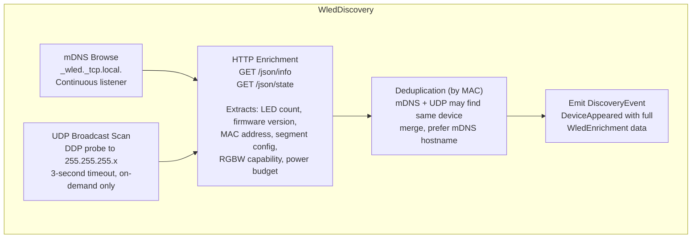
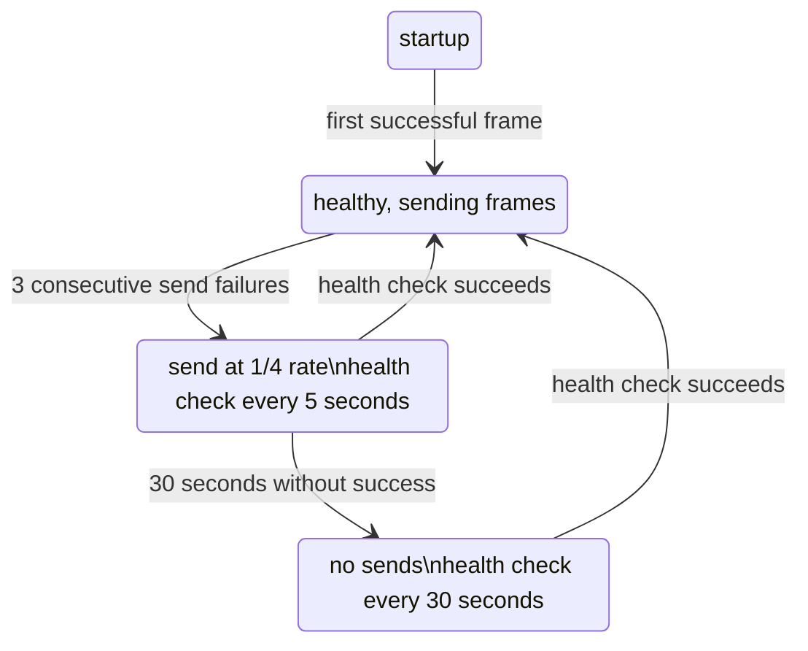

# 03 -- WLED Device Backend Specification

> Wire-level protocol details, Rust types, and operational semantics for driving WLED devices from Hypercolor.

**Status:** Implemented
**Crate:** `hypercolor-driver-wled`
**Module path:** `hypercolor_driver_wled`
**Feature flag:** Built-in daemon driver selection, not a core feature flag
**Author:** Nova
**Date:** 2026-03-01

---

## Table of Contents

1. [Overview](#1-overview)
2. [DDP Packet Format](#2-ddp-packet-format)
3. [E1.31/sACN Packet Format](#3-e131sacn-packet-format)
4. [WledDevice Struct](#4-wleddevice-struct)
5. [WledDiscovery](#5-wleddiscovery)
6. [WLED JSON API](#6-wled-json-api)
7. [WledSegment Mapping](#7-wledsegment-mapping)
8. [Multi-Device Coordination](#8-multi-device-coordination)
9. [Network Error Handling](#9-network-error-handling)
10. [Color Format & Processing](#10-color-format--processing)
11. [Configuration TOML Schema](#11-configuration-toml-schema)
12. [Crate Dependencies](#12-crate-dependencies)

---

## 1. Overview

WLED is the primary network-attached LED backend for Hypercolor. WLED devices are ESP32/ESP8266 microcontrollers running [WLED firmware](https://kno.wled.ge/) that accept pixel data over two UDP-based protocols: **DDP** (Distributed Display Protocol) and **E1.31/sACN** (Streaming ACN). Hypercolor prefers DDP for its smaller header overhead and lack of universe management, but supports E1.31 for compatibility with older firmware and mixed-protocol environments.

**Protocol selection logic:**

| Condition                                       | Protocol       |
| ----------------------------------------------- | -------------- |
| WLED firmware >= 0.11.0 (all modern)            | DDP (default)  |
| User override in config                         | E1.31          |
| Device reports DDP unsupported via `/json/info` | E1.31 fallback |
| Integration with xLights/Vixen/DMX ecosystem    | E1.31          |

**Transport:** UDP unicast to each device. No multicast. No TCP.

**Port assignments:**

| Protocol      | Port | Direction                  |
| ------------- | ---- | -------------------------- |
| DDP           | 4048 | Hypercolor --> WLED        |
| E1.31         | 5568 | Hypercolor --> WLED        |
| WLED JSON API | 80   | Hypercolor --> WLED (HTTP) |
| mDNS          | 5353 | Bidirectional (multicast)  |

---

## 2. DDP Packet Format

DDP is the preferred protocol. A 10-byte header followed by raw pixel data. No universe management, no 170-pixel limits, no ACN boilerplate. The protocol is defined by [3waylabs](http://www.3waylabs.com/ddp/).

### 2.1 Header Layout

```
Byte:   0         1         2         3         4  5  6  7    8  9
      ┌─────────┬─────────┬─────────┬─────────┬───────────┬─────────┐
      │  Flags  │ Seq/Rsvd│DataType │   ID    │Data Offset│Data Len │
      │ VVxTSRQP│ xxxxnnnn│ CRTTTBBB│         │  (32-bit) │ (16-bit)│
      └─────────┴─────────┴─────────┴─────────┴───────────┴─────────┘
```

**Byte 0 -- Flags:**

| Bits       | Name     | Description                                                                                             |
| ---------- | -------- | ------------------------------------------------------------------------------------------------------- |
| `VV` (7:6) | Version  | Protocol version. Always `01` (version 1).                                                              |
| `x` (5)    | Reserved | Set to `0`.                                                                                             |
| `T` (4)    | Timecode | If `1` AND `P` is `1`, 4-byte timecode appended after header. WLED ignores timecodes -- never set this. |
| `S` (3)    | Storage  | If `1`, data comes from device storage, not packet payload. Not used for streaming.                     |
| `R` (2)    | Reply    | Set in replies from displays. Never set by Hypercolor.                                                  |
| `Q` (1)    | Query    | Request data from the device. Not used for streaming.                                                   |
| `P` (0)    | Push     | **Critical.** Set to `1` on the final packet of a frame. Tells WLED to latch and display.               |

**Standard flags value for streaming:** `0x41` (version 1, push set) for the last/only packet of a frame. `0x40` (version 1, no push) for non-final fragmented packets.

**Byte 1 -- Sequence Number:**

| Bits         | Name     | Description                                                                           |
| ------------ | -------- | ------------------------------------------------------------------------------------- |
| `xxxx` (7:4) | Reserved | Set to `0`.                                                                           |
| `nnnn` (3:0) | Sequence | 1-15, wrapping. `0` = sequence tracking disabled. WLED uses this for packet ordering. |

**Byte 2 -- Data Type:**

| Bits        | Name             | Description                                                                                              |
| ----------- | ---------------- | -------------------------------------------------------------------------------------------------------- |
| `C` (7)     | Custom           | `0` = standard types, `1` = vendor-defined. Always `0`.                                                  |
| `R` (6)     | Reserved         | Set to `0`.                                                                                              |
| `TTT` (5:3) | Type             | `000` = undefined, `001` = RGB, `010` = HSL, `011` = RGBW, `100` = grayscale.                            |
| `BBB` (2:0) | Bits per element | `000` = undefined (1 bit), `001` = 4-bit, `010` = 8-bit, `011` = 16-bit, `100` = 24-bit, `101` = 32-bit. |

**Standard data type for RGB 8-bit:** `0x0A` (`TTT=001` RGB, `BBB=010` 8-bit).
**Standard data type for RGBW 8-bit:** `0x1A` (`TTT=011` RGBW, `BBB=010` 8-bit).

**Byte 3 -- Destination ID:**

| Value         | Meaning                                  |
| ------------- | ---------------------------------------- |
| `0x00`        | Reserved                                 |
| `0x01`        | Default output device (the one you want) |
| `0x02`-`0xF9` | Custom device IDs                        |
| `0xFE`        | DMX transit                              |
| `0xFF`        | All devices (broadcast)                  |

**Standard value:** `0x01`.

**Bytes 4-7 -- Data Offset (big-endian u32):**

Byte offset into the device's pixel buffer where this packet's data begins. For a single-packet frame, this is `0x00000000`. For fragmented frames, this is `packet_index * bytes_per_packet`.

**Bytes 8-9 -- Data Length (big-endian u16):**

Number of bytes in the data payload following the header. Maximum practical value: 1440 bytes (480 RGB pixels per packet to stay within typical MTU).

### 2.2 Data Payload

Raw pixel data immediately follows the header. No padding, no alignment.

**RGB (3 bytes per pixel):**

```
┌──────────┬──────────┬──────────┬──────────┬──────────┬──────────┬─ ─ ─
│ R0       │ G0       │ B0       │ R1       │ G1       │ B1       │ ...
└──────────┴──────────┴──────────┴──────────┴──────────┴──────────┴─ ─ ─
  Pixel 0                         Pixel 1
```

**RGBW (4 bytes per pixel):**

```
┌──────────┬──────────┬──────────┬──────────┬──────────┬──────────┬──────────┬──────────┬─ ─ ─
│ R0       │ G0       │ B0       │ W0       │ R1       │ G1       │ B1       │ W1       │ ...
└──────────┴──────────┴──────────┴──────────┴──────────┴──────────┴──────────┴──────────┴─ ─ ─
  Pixel 0                                    Pixel 1
```

### 2.3 Packet Fragmentation

When the pixel payload exceeds the per-packet maximum (1440 bytes for RGB = 480 pixels), the frame is split across multiple packets. All packets except the last have `P=0`. The final packet has `P=1` (push), which triggers WLED to latch the complete frame.

**Example: 600 RGB pixels (1800 bytes) split into 2 packets:**

| Packet | Flags  | Seq | Offset       | Length | Pixels  |
| ------ | ------ | --- | ------------ | ------ | ------- |
| 1      | `0x40` | 1   | `0x00000000` | 1440   | 0-479   |
| 2      | `0x41` | 1   | `0x000005A0` | 360    | 480-599 |

### 2.4 Rust Types

```rust
/// Maximum pixel data bytes per DDP packet.
/// 480 RGB pixels * 3 = 1440, or 360 RGBW pixels * 4 = 1440.
/// Stays under 1472-byte UDP payload (1500 MTU - 20 IP - 8 UDP).
const DDP_MAX_PAYLOAD: usize = 1440;

/// DDP header is always 10 bytes (we never use timecodes).
const DDP_HEADER_SIZE: usize = 10;

/// DDP default port.
const DDP_PORT: u16 = 4048;

/// DDP protocol version 1.
const DDP_VERSION: u8 = 0x40; // version bits in position

/// DDP flag: push (latch frame).
const DDP_FLAG_PUSH: u8 = 0x01;

/// DDP data type: RGB, 8-bit per channel.
const DDP_DTYPE_RGB8: u8 = 0x0A;

/// DDP data type: RGBW, 8-bit per channel.
const DDP_DTYPE_RGBW8: u8 = 0x1A;

/// DDP destination: default output.
const DDP_ID_DEFAULT: u8 = 0x01;

/// A single DDP packet ready for transmission.
#[derive(Debug)]
pub struct DdpPacket {
    /// Pre-built header + data buffer. Max size = 10 + 1440 = 1450 bytes.
    buf: Vec<u8>,
}

impl DdpPacket {
    /// Build a DDP data packet.
    ///
    /// - `pixel_data`: slice of RGB or RGBW bytes for this fragment
    /// - `offset`: byte offset into the device's pixel buffer
    /// - `push`: true if this is the final packet of the frame
    /// - `sequence`: 1-15 wrapping sequence number
    /// - `data_type`: DDP_DTYPE_RGB8 or DDP_DTYPE_RGBW8
    pub fn new(
        pixel_data: &[u8],
        offset: u32,
        push: bool,
        sequence: u8,
        data_type: u8,
    ) -> Self {
        debug_assert!(pixel_data.len() <= DDP_MAX_PAYLOAD);
        debug_assert!(sequence <= 15);

        let mut buf = Vec::with_capacity(DDP_HEADER_SIZE + pixel_data.len());

        // Byte 0: flags -- version 1, optional push
        let flags = DDP_VERSION | if push { DDP_FLAG_PUSH } else { 0 };
        buf.push(flags);

        // Byte 1: sequence (low nibble)
        buf.push(sequence & 0x0F);

        // Byte 2: data type
        buf.push(data_type);

        // Byte 3: destination ID
        buf.push(DDP_ID_DEFAULT);

        // Bytes 4-7: data offset (big-endian u32)
        buf.extend_from_slice(&offset.to_be_bytes());

        // Bytes 8-9: data length (big-endian u16)
        buf.extend_from_slice(&(pixel_data.len() as u16).to_be_bytes());

        // Payload
        buf.extend_from_slice(pixel_data);

        Self { buf }
    }

    /// The raw bytes to send over UDP.
    pub fn as_bytes(&self) -> &[u8] {
        &self.buf
    }
}

/// Builds a sequence of DDP packets for a complete frame.
pub fn build_ddp_frame(
    pixel_data: &[u8],
    data_type: u8,
    sequence: &mut DdpSequence,
) -> Vec<DdpPacket> {
    let seq = sequence.next();
    let chunks: Vec<&[u8]> = pixel_data.chunks(DDP_MAX_PAYLOAD).collect();
    let last_idx = chunks.len().saturating_sub(1);

    chunks
        .into_iter()
        .enumerate()
        .map(|(i, chunk)| {
            let offset = (i * DDP_MAX_PAYLOAD) as u32;
            let push = i == last_idx;
            DdpPacket::new(chunk, offset, push, seq, data_type)
        })
        .collect()
}

/// Wrapping 1-15 sequence counter.
/// Sequence 0 means "not used" in DDP, so we skip it.
#[derive(Debug, Default)]
pub struct DdpSequence(u8);

impl DdpSequence {
    pub fn next(&mut self) -> u8 {
        self.0 = if self.0 >= 15 { 1 } else { self.0 + 1 };
        self.0
    }
}
```

---

## 3. E1.31/sACN Packet Format

E1.31 (Streaming ACN) is the fallback protocol. Each universe carries a maximum of 512 DMX channels, which maps to **170 RGB pixels** (170 _ 3 = 510 channels + 1 start code = 511) or **128 RGBW pixels** (128 _ 4 = 512). Defined by [ANSI E1.31-2018](https://tsp.esta.org/tsp/documents/docs/E1-31-2016.pdf).

### 3.1 Packet Layout

The full E1.31 packet is 638 bytes (for a full 512-channel universe). It consists of three nested layers:

```
┌──────────────────────────────────────────────────────────────────────┐
│ Byte Offsets     Layer              Fields                          │
├──────────────────────────────────────────────────────────────────────┤
│  0-1            Root Layer          Preamble Size (0x0010)          │
│  2-3                                Postamble Size (0x0000)         │
│  4-15                               ACN Packet Identifier (12 B)   │
│  16-17                              Flags & Length                  │
│  18-21                              Root Vector (0x00000004)        │
│  22-37                              Sender CID (UUID, 16 B)        │
├──────────────────────────────────────────────────────────────────────┤
│  38-39          Framing Layer       Flags & Length                  │
│  40-43                              Framing Vector (0x00000002)     │
│  44-107                             Source Name (64 B, UTF-8 null)  │
│  108                                Priority (0-200, default 100)   │
│  109-110                            Sync Address (0x0000)           │
│  111                                Sequence Number (0-255 wrap)    │
│  112                                Options Flags                   │
│  113-114                            Universe (1-63999, big-endian)  │
├──────────────────────────────────────────────────────────────────────┤
│  115-116        DMP Layer           Flags & Length                  │
│  117                                DMP Vector (0x02)               │
│  118                                Addr & Data Type (0xA1)         │
│  119-120                            First Property Addr (0x0000)    │
│  121-122                            Address Increment (0x0001)      │
│  123-124                            Property Value Count (N+1)      │
│  125                                DMX Start Code (0x00)           │
│  126-637                            DMX Channel Data (up to 512 B)  │
└──────────────────────────────────────────────────────────────────────┘
```

**Total packet size:** 126 bytes header + up to 512 bytes data = 638 bytes max.

### 3.2 Key Constants

```
ACN Packet Identifier: 0x41 0x53 0x43 0x2D 0x45 0x31 0x2E 0x31 0x37 0x00 0x00 0x00
                        "A    S    C    -    E    1    .    1    7    \0   \0   \0"

Root Vector:    0x00000004  (VECTOR_ROOT_E131_DATA)
Framing Vector: 0x00000002  (VECTOR_E131_DATA_PACKET)
DMP Vector:     0x02        (VECTOR_DMP_SET_PROPERTY)
Addr/Data Type: 0xA1
First Address:  0x0000
Addr Increment: 0x0001
DMX Start Code: 0x00
Default Port:   5568
```

### 3.3 Universe Management

Each universe carries 510 usable bytes (512 channels minus the 2 reserved by convention). For RGB pixels, that means **170 pixels per universe** (170 _ 3 = 510). For RGBW, **127 pixels** (127 _ 4 = 508, rounding down to avoid splitting a pixel across universes).

**Universe allocation for N pixels (RGB):**

```
Universe 1: pixels   0 - 169   (channels 1-510)
Universe 2: pixels 170 - 339   (channels 1-510)
Universe 3: pixels 340 - 509   (channels 1-510)
Universe 4: pixels 510 - N     (channels 1 to remainder*3)
```

**Multicast addressing (not used by Hypercolor -- unicast only, but documented for reference):**

```
239.255.{universe_high}.{universe_low}
Universe 1   -> 239.255.0.1
Universe 256 -> 239.255.1.0
Universe 512 -> 239.255.2.0
```

### 3.4 Priority

E1.31 priority ranges from 0 (lowest) to 200 (highest). Default is 100. Hypercolor should use **150** to ensure it overrides default sACN sources but can still be overridden by intentional higher-priority sources (e.g., an emergency lighting system on a DMX installation).

### 3.5 Sequence Numbers

E1.31 uses a per-universe uint8 sequence number that wraps from 255 back to 0. Receivers use this to detect out-of-order and dropped packets. Hypercolor must maintain a separate sequence counter per universe.

### 3.6 Rust Types

```rust
use uuid::Uuid;

/// Pixels per E1.31 universe for RGB data.
const E131_PIXELS_PER_UNIVERSE_RGB: usize = 170;

/// Pixels per E1.31 universe for RGBW data.
const E131_PIXELS_PER_UNIVERSE_RGBW: usize = 127;

/// Max DMX channels per universe (not counting start code).
const E131_CHANNELS_PER_UNIVERSE: usize = 512;

/// E1.31 default port.
const E131_PORT: u16 = 5568;

/// Hypercolor's E1.31 priority. Higher than default (100) to take precedence.
const E131_PRIORITY: u8 = 150;

/// E1.31 packet header size (fixed).
const E131_HEADER_SIZE: usize = 126;

/// Complete E1.31 packet template.
/// The header is mostly static -- only sequence, universe, data length,
/// and flags/length fields change per packet.
#[derive(Debug, Clone)]
pub struct E131Packet {
    buf: [u8; 638],
    /// Number of DMX channels actually used in this packet (1-512).
    channel_count: u16,
}

impl E131Packet {
    /// Create a new E1.31 packet with all fixed fields pre-populated.
    pub fn new(source_name: &str, cid: Uuid, universe: u16, priority: u8) -> Self {
        let mut buf = [0u8; 638];

        // ---- Root Layer ----
        // Preamble size: 0x0010
        buf[0..2].copy_from_slice(&0x0010u16.to_be_bytes());
        // Postamble size: 0x0000
        buf[2..4].copy_from_slice(&0x0000u16.to_be_bytes());
        // ACN Packet Identifier
        buf[4..16].copy_from_slice(b"ASC-E1.17\x00\x00\x00");
        // Root vector: 0x00000004
        buf[18..22].copy_from_slice(&0x00000004u32.to_be_bytes());
        // CID (sender UUID)
        buf[22..38].copy_from_slice(cid.as_bytes());

        // ---- Framing Layer ----
        // Framing vector: 0x00000002
        buf[40..44].copy_from_slice(&0x00000002u32.to_be_bytes());
        // Source name (64 bytes, null-padded)
        let name_bytes = source_name.as_bytes();
        let copy_len = name_bytes.len().min(63);
        buf[44..44 + copy_len].copy_from_slice(&name_bytes[..copy_len]);
        // Priority
        buf[108] = priority;
        // Sync address: 0x0000 (no synchronization)
        buf[109..111].copy_from_slice(&0x0000u16.to_be_bytes());
        // Options: 0x00
        buf[112] = 0x00;
        // Universe
        buf[113..115].copy_from_slice(&universe.to_be_bytes());

        // ---- DMP Layer ----
        // DMP vector: 0x02
        buf[117] = 0x02;
        // Address & Data Type: 0xA1
        buf[118] = 0xA1;
        // First Property Address: 0x0000
        buf[119..121].copy_from_slice(&0x0000u16.to_be_bytes());
        // Address Increment: 0x0001
        buf[121..123].copy_from_slice(&0x0001u16.to_be_bytes());
        // DMX start code at byte 125
        buf[125] = 0x00;

        Self {
            buf,
            channel_count: 0,
        }
    }

    /// Write pixel data into the DMX channel slots and update length fields.
    /// `channels` is raw DMX data (RGB triplets or RGBW quads).
    /// Max 512 bytes.
    pub fn set_channels(&mut self, channels: &[u8], sequence: u8) {
        let count = channels.len().min(E131_CHANNELS_PER_UNIVERSE);
        self.channel_count = count as u16;

        // DMX channel data starts at byte 126 (after start code at 125)
        self.buf[126..126 + count].copy_from_slice(&channels[..count]);

        // Sequence number
        self.buf[111] = sequence;

        // Property value count = channels + 1 (for start code)
        let prop_count = (count + 1) as u16;
        self.buf[123..125].copy_from_slice(&prop_count.to_be_bytes());

        // Update Flags & Length fields (include high nibble 0x7 for flags)
        // DMP layer length: from byte 115 to end of data
        let dmp_len = (count + 11) as u16; // 10 DMP header bytes + start code + data
        self.buf[115..117].copy_from_slice(&(0x7000 | dmp_len).to_be_bytes());

        // Framing layer length: from byte 38 to end of data
        let frame_len = (count + 88) as u16; // 77 framing header bytes + DMP layer
        self.buf[38..40].copy_from_slice(&(0x7000 | frame_len).to_be_bytes());

        // Root layer length: from byte 16 to end of data
        let root_len = (count + 110) as u16; // 22 root header bytes + framing layer
        self.buf[16..18].copy_from_slice(&(0x7000 | root_len).to_be_bytes());
    }

    /// The raw bytes to send over UDP.
    pub fn as_bytes(&self) -> &[u8] {
        // Only send the bytes that are actually populated
        let total = E131_HEADER_SIZE + 1 + self.channel_count as usize;
        &self.buf[..total]
    }
}

/// Manages per-universe sequence numbers.
#[derive(Debug, Default)]
pub struct E131SequenceTracker {
    sequences: HashMap<u16, u8>,
}

impl E131SequenceTracker {
    pub fn next(&mut self, universe: u16) -> u8 {
        let seq = self.sequences.entry(universe).or_insert(0);
        *seq = seq.wrapping_add(1);
        *seq
    }
}

/// Compute how many E1.31 universes are needed for a given pixel count.
pub fn universes_needed(pixel_count: usize, bytes_per_pixel: usize) -> usize {
    let channels_per_pixel = bytes_per_pixel;
    let pixels_per_universe = E131_CHANNELS_PER_UNIVERSE / channels_per_pixel;
    (pixel_count + pixels_per_universe - 1) / pixels_per_universe
}
```

---

## 4. WledDevice Struct

The `WledDevice` is the runtime representation of a single WLED controller. It implements the `DeviceBackend` trait exported by `hypercolor-driver-api`.

### 4.1 Core Types

```rust
use std::net::{IpAddr, SocketAddr};
use std::time::{Duration, Instant};
use tokio::net::UdpSocket;
use serde::{Deserialize, Serialize};

/// Protocol transport for a WLED device.
#[derive(Debug, Clone, Copy, PartialEq, Eq, Serialize, Deserialize)]
#[serde(rename_all = "lowercase")]
pub enum WledProtocol {
    /// Distributed Display Protocol (preferred).
    Ddp,
    /// E1.31 / Streaming ACN (fallback).
    E131,
}

impl Default for WledProtocol {
    fn default() -> Self {
        Self::Ddp
    }
}

/// Color format reported by the WLED device.
#[derive(Debug, Clone, Copy, PartialEq, Eq, Serialize, Deserialize)]
#[serde(rename_all = "lowercase")]
pub enum WledColorFormat {
    /// 3 bytes per pixel: red, green, blue.
    Rgb,
    /// 4 bytes per pixel: red, green, blue, white.
    Rgbw,
}

impl WledColorFormat {
    pub fn bytes_per_pixel(&self) -> usize {
        match self {
            Self::Rgb => 3,
            Self::Rgbw => 4,
        }
    }

    /// DDP data type byte for this color format.
    pub fn ddp_data_type(&self) -> u8 {
        match self {
            Self::Rgb => DDP_DTYPE_RGB8,
            Self::Rgbw => DDP_DTYPE_RGBW8,
        }
    }
}

/// Connection health state for a WLED device.
#[derive(Debug, Clone, Copy, PartialEq, Eq)]
pub enum WledConnectionState {
    /// Device is reachable and accepting frames.
    Connected,
    /// Device was reachable but has stopped responding.
    /// Contains the timestamp of the last successful frame.
    Degraded { last_seen: Instant },
    /// Device is unreachable. Discovery will attempt reconnection.
    Offline,
    /// Initial state before first contact.
    Unknown,
}

/// Information enriched from WLED's `/json/info` endpoint.
#[derive(Debug, Clone, Serialize, Deserialize)]
pub struct WledDeviceInfo {
    /// Firmware version string (e.g., "0.15.3").
    pub firmware_version: String,
    /// Firmware build ID in YYMMDDB format.
    pub build_id: u32,
    /// Hardware MAC address, lowercase hex without colons (e.g., "aabbccddeeff").
    pub mac: String,
    /// Human-friendly name configured in WLED.
    pub name: String,
    /// Total LED count across all segments.
    pub led_count: u16,
    /// Whether the device has RGBW LEDs.
    pub rgbw: bool,
    /// Maximum number of segments supported.
    pub max_segments: u8,
    /// Current frames per second reported by WLED.
    pub fps: u8,
    /// Current power draw in milliamps (if ABL is enabled).
    pub power_draw_ma: u16,
    /// Maximum power budget in milliamps.
    pub max_power_ma: u16,
    /// Free heap memory in bytes (health indicator).
    pub free_heap: u32,
    /// Uptime in seconds.
    pub uptime_secs: u32,
    /// Architecture string (e.g., "esp32").
    pub arch: String,
    /// Number of built-in effects.
    pub effect_count: u8,
    /// Number of palettes.
    pub palette_count: u16,
}

/// A WLED segment as reported by `/json/state`.
#[derive(Debug, Clone, Serialize, Deserialize)]
pub struct WledSegmentInfo {
    /// Segment index (0-based).
    pub id: u8,
    /// Start LED index (inclusive).
    pub start: u16,
    /// Stop LED index (exclusive).
    pub stop: u16,
    /// LED grouping factor.
    pub grouping: u8,
    /// Spacing between groups.
    pub spacing: u8,
    /// Whether the segment is currently on.
    pub on: bool,
    /// Segment brightness (0-255).
    pub brightness: u8,
    /// Whether the LEDs in this segment support RGBW.
    pub rgbw: bool,
    /// Virtual light capabilities bitfield.
    pub light_capabilities: u8,
}

impl WledSegmentInfo {
    /// Logical LED count accounting for grouping and spacing.
    pub fn pixel_count(&self) -> u16 {
        let raw = self.stop.saturating_sub(self.start);
        if self.grouping == 0 || self.spacing == 0 {
            return raw;
        }
        // Each group of `grouping` LEDs acts as one logical pixel,
        // with `spacing` dark LEDs between groups.
        let group_size = self.grouping as u16 + self.spacing as u16;
        raw / group_size * self.grouping as u16
    }
}
```

### 4.2 WledDevice Runtime Struct

```rust
/// Runtime handle for a single WLED device.
/// Owns its UDP socket and maintains per-device state.
pub struct WledDevice {
    // ---- Identity ----
    /// Stable device ID derived from MAC address or config.
    pub id: String,
    /// User-assigned friendly name.
    pub name: String,
    /// mDNS hostname (e.g., "wled-kitchen.local").
    pub hostname: Option<String>,
    /// Resolved IP address.
    pub ip: IpAddr,

    // ---- Protocol ----
    /// Which protocol to use for pixel data.
    pub protocol: WledProtocol,
    /// Socket address for pixel data (ip:4048 for DDP, ip:5568 for E1.31).
    pub pixel_addr: SocketAddr,
    /// Color format (RGB or RGBW).
    pub color_format: WledColorFormat,
    /// Total LED count on this device.
    pub led_count: u16,

    // ---- Segments ----
    /// WLED segments, enriched from `/json/state`.
    pub segments: Vec<WledSegmentInfo>,
    /// Which segments Hypercolor is actively driving.
    /// `None` means drive the entire device as one zone.
    pub active_segments: Option<Vec<u8>>,

    // ---- Network ----
    /// Shared UDP socket for sending pixel data.
    /// Multiple devices can share a socket via `send_to`.
    socket: Arc<UdpSocket>,

    // ---- State ----
    /// Connection health.
    pub state: WledConnectionState,
    /// Enriched device info from `/json/info`.
    pub info: Option<WledDeviceInfo>,
    /// DDP sequence counter.
    ddp_sequence: DdpSequence,
    /// E1.31 per-universe sequence counters.
    e131_sequences: E131SequenceTracker,
    /// E1.31 sender CID (stable UUID per Hypercolor instance).
    e131_cid: Uuid,
    /// Starting E1.31 universe number for this device.
    e131_start_universe: u16,

    // ---- Metrics ----
    /// Frames successfully sent.
    pub frames_sent: u64,
    /// Frames that failed to send (network errors).
    pub frames_failed: u64,
    /// Last successful frame timestamp.
    pub last_frame_at: Option<Instant>,
    /// Exponentially weighted moving average of send latency.
    pub ewma_send_us: f64,
}

impl WledDevice {
    /// Send a frame of pixel data to this device.
    /// `pixel_data` is a flat buffer of RGB or RGBW bytes,
    /// ordered by LED index, for the LEDs this device owns.
    pub async fn send_frame(&mut self, pixel_data: &[u8]) -> Result<(), WledError> {
        let start = Instant::now();

        let result = match self.protocol {
            WledProtocol::Ddp => self.send_ddp(pixel_data).await,
            WledProtocol::E131 => self.send_e131(pixel_data).await,
        };

        match &result {
            Ok(()) => {
                self.frames_sent += 1;
                self.last_frame_at = Some(Instant::now());
                self.state = WledConnectionState::Connected;
                let elapsed = start.elapsed().as_micros() as f64;
                self.ewma_send_us = 0.9 * self.ewma_send_us + 0.1 * elapsed;
            }
            Err(_) => {
                self.frames_failed += 1;
                if self.state == WledConnectionState::Connected {
                    self.state = WledConnectionState::Degraded {
                        last_seen: self.last_frame_at.unwrap_or(start),
                    };
                }
            }
        }

        result
    }

    /// Send pixel data via DDP, fragmenting if necessary.
    async fn send_ddp(&mut self, pixel_data: &[u8]) -> Result<(), WledError> {
        let packets = build_ddp_frame(
            pixel_data,
            self.color_format.ddp_data_type(),
            &mut self.ddp_sequence,
        );

        for packet in &packets {
            self.socket
                .send_to(packet.as_bytes(), self.pixel_addr)
                .await
                .map_err(WledError::Io)?;
        }

        Ok(())
    }

    /// Send pixel data via E1.31, splitting across universes.
    async fn send_e131(&mut self, pixel_data: &[u8]) -> Result<(), WledError> {
        let bpp = self.color_format.bytes_per_pixel();
        let pixels_per_universe = E131_CHANNELS_PER_UNIVERSE / bpp;
        let bytes_per_universe = pixels_per_universe * bpp;

        for (i, chunk) in pixel_data.chunks(bytes_per_universe).enumerate() {
            let universe = self.e131_start_universe + i as u16;
            let sequence = self.e131_sequences.next(universe);

            let mut packet = E131Packet::new(
                "Hypercolor",
                self.e131_cid,
                universe,
                E131_PRIORITY,
            );
            packet.set_channels(chunk, sequence);

            self.socket
                .send_to(packet.as_bytes(), (self.ip, E131_PORT))
                .await
                .map_err(WledError::Io)?;
        }

        Ok(())
    }
}

/// Errors specific to WLED device operations.
#[derive(Debug, thiserror::Error)]
pub enum WledError {
    #[error("UDP I/O error: {0}")]
    Io(#[from] std::io::Error),

    #[error("WLED API error: {0}")]
    Api(#[from] reqwest::Error),

    #[error("WLED API returned unexpected response: {0}")]
    ApiParse(String),

    #[error("Device offline: {0}")]
    Offline(String),

    #[error("Pixel data length {got} does not match expected {expected} for {led_count} LEDs")]
    PixelCountMismatch {
        got: usize,
        expected: usize,
        led_count: u16,
    },
}
```

### 4.3 DeviceBackend Trait Implementation

```rust
#[async_trait]
impl DeviceBackend for WledDevice {
    fn id(&self) -> &str {
        &self.id
    }

    fn name(&self) -> &str {
        &self.name
    }

    fn backend_type(&self) -> BackendType {
        BackendType::Wled
    }

    fn led_count(&self) -> usize {
        self.led_count as usize
    }

    fn zones(&self) -> &[Zone] {
        // Mapped from segments -- see section 6
        &self.zones
    }

    fn is_connected(&self) -> bool {
        matches!(self.state, WledConnectionState::Connected)
    }

    async fn send_colors(&mut self, colors: &[Rgb]) -> Result<(), DeviceError> {
        let bpp = self.color_format.bytes_per_pixel();
        let expected = self.led_count as usize * bpp;
        let pixel_data: Vec<u8> = colors
            .iter()
            .flat_map(|c| match self.color_format {
                WledColorFormat::Rgb => vec![c.r, c.g, c.b],
                WledColorFormat::Rgbw => {
                    let w = c.r.min(c.g).min(c.b); // naive white extraction
                    vec![c.r - w, c.g - w, c.b - w, w]
                }
            })
            .collect();

        if pixel_data.len() != expected {
            return Err(DeviceError::Wled(WledError::PixelCountMismatch {
                got: pixel_data.len(),
                expected,
                led_count: self.led_count,
            }));
        }

        self.send_frame(&pixel_data)
            .await
            .map_err(DeviceError::Wled)
    }

    async fn identify(&mut self) -> Result<(), DeviceError> {
        // Flash SilkCircuit cyan (#80ffea) three times via WLED JSON API
        let url = format!("http://{}/json/state", self.ip);
        let client = reqwest::Client::new();

        for _ in 0..3 {
            // All LEDs to cyan
            client
                .post(&url)
                .json(&serde_json::json!({
                    "on": true,
                    "bri": 255,
                    "seg": [{"col": [[128, 255, 234]]}]
                }))
                .send()
                .await
                .map_err(WledError::Api)?;

            tokio::time::sleep(Duration::from_millis(300)).await;

            // All LEDs off
            client
                .post(&url)
                .json(&serde_json::json!({"on": false}))
                .send()
                .await
                .map_err(WledError::Api)?;

            tokio::time::sleep(Duration::from_millis(200)).await;
        }

        // Restore to live mode
        client
            .post(&url)
            .json(&serde_json::json!({"on": true, "live": true}))
            .send()
            .await
            .map_err(WledError::Api)?;

        Ok(())
    }
}
```

---

## 5. WledDiscovery

Discovery uses a layered approach: mDNS for zero-config, UDP broadcast for fallback, and HTTP enrichment for full device characterization.

### 5.1 mDNS Service Browsing

WLED devices advertise themselves as `_wled._tcp` services via mDNS.

```rust
use mdns_sd::{ServiceDaemon, ServiceEvent, ServiceInfo};
use tokio::sync::broadcast;

/// Watches for WLED devices via mDNS.
pub struct WledMdnsDiscovery {
    daemon: ServiceDaemon,
}

impl WledMdnsDiscovery {
    const SERVICE_TYPE: &'static str = "_wled._tcp.local.";

    pub fn new() -> Result<Self, mdns_sd::Error> {
        let daemon = ServiceDaemon::new()?;
        Ok(Self { daemon })
    }

    /// Start browsing for WLED services. Emits discovery events.
    pub async fn browse(
        &self,
        tx: broadcast::Sender<DiscoveryEvent>,
    ) -> Result<(), mdns_sd::Error> {
        let receiver = self.daemon.browse(Self::SERVICE_TYPE)?;

        loop {
            match receiver.recv_async().await {
                Ok(ServiceEvent::ServiceResolved(info)) => {
                    let ip = match info.get_addresses().iter().next() {
                        Some(addr) => *addr,
                        None => continue,
                    };
                    let hostname = info
                        .get_hostname()
                        .trim_end_matches('.')
                        .to_string();

                    // Enrich via HTTP before emitting
                    match self.enrich(ip).await {
                        Ok(enriched) => {
                            let _ = tx.send(DiscoveryEvent::WledFound {
                                ip,
                                hostname,
                                info: enriched,
                            });
                        }
                        Err(e) => {
                            tracing::warn!(
                                %ip, %hostname,
                                "WLED mDNS found but enrichment failed: {e}"
                            );
                            // Still emit with partial info
                            let _ = tx.send(DiscoveryEvent::WledFoundPartial {
                                ip,
                                hostname,
                            });
                        }
                    }
                }
                Ok(ServiceEvent::ServiceRemoved(_, fullname)) => {
                    let _ = tx.send(DiscoveryEvent::WledLost {
                        service_name: fullname,
                    });
                }
                Ok(_) => {} // SearchStarted, etc.
                Err(e) => {
                    tracing::error!("mDNS browse error: {e}");
                    break;
                }
            }
        }

        Ok(())
    }

    /// Fetch `/json/info` and `/json/state` to fully characterize the device.
    async fn enrich(&self, ip: IpAddr) -> Result<WledEnrichment, WledError> {
        let client = reqwest::Client::builder()
            .timeout(Duration::from_secs(5))
            .build()?;

        // Fetch info and state in parallel
        let (info_resp, state_resp) = tokio::try_join!(
            client.get(format!("http://{}/json/info", ip)).send(),
            client.get(format!("http://{}/json/state", ip)).send(),
        )?;

        let info: serde_json::Value = info_resp.json().await?;
        let state: serde_json::Value = state_resp.json().await?;

        Ok(WledEnrichment {
            device_info: parse_wled_info(&info)?,
            segments: parse_wled_segments(&state)?,
        })
    }
}

/// Parsed enrichment data from WLED's JSON API.
#[derive(Debug, Clone)]
pub struct WledEnrichment {
    pub device_info: WledDeviceInfo,
    pub segments: Vec<WledSegmentInfo>,
}

/// Parse the `/json/info` response.
fn parse_wled_info(json: &serde_json::Value) -> Result<WledDeviceInfo, WledError> {
    Ok(WledDeviceInfo {
        firmware_version: json["ver"]
            .as_str()
            .unwrap_or("unknown")
            .to_string(),
        build_id: json["vid"].as_u64().unwrap_or(0) as u32,
        mac: json["mac"]
            .as_str()
            .unwrap_or("")
            .to_string(),
        name: json["name"]
            .as_str()
            .unwrap_or("WLED")
            .to_string(),
        led_count: json["leds"]["count"].as_u64().unwrap_or(0) as u16,
        rgbw: json["leds"]["rgbw"].as_bool().unwrap_or(false),
        max_segments: json["leds"]["maxseg"].as_u64().unwrap_or(1) as u8,
        fps: json["leds"]["fps"].as_u64().unwrap_or(0) as u8,
        power_draw_ma: json["leds"]["pwr"].as_u64().unwrap_or(0) as u16,
        max_power_ma: json["leds"]["maxpwr"].as_u64().unwrap_or(0) as u16,
        free_heap: json["freeheap"].as_u64().unwrap_or(0) as u32,
        uptime_secs: json["uptime"].as_u64().unwrap_or(0) as u32,
        arch: json["arch"].as_str().unwrap_or("unknown").to_string(),
        effect_count: json["fxcount"].as_u64().unwrap_or(0) as u8,
        palette_count: json["palcount"].as_u64().unwrap_or(0) as u16,
    })
}

/// Parse segments from the `/json/state` response.
fn parse_wled_segments(json: &serde_json::Value) -> Result<Vec<WledSegmentInfo>, WledError> {
    let segments = json["seg"]
        .as_array()
        .ok_or_else(|| WledError::ApiParse("Missing 'seg' array in state".into()))?;

    segments
        .iter()
        .enumerate()
        .map(|(i, seg)| {
            // Determine RGBW capability from light capability bitfield
            // Bit 0 = RGB, Bit 1 = White
            let lc = seg["lc"].as_u64().unwrap_or(1) as u8;
            let has_white = (lc & 0x02) != 0;

            Ok(WledSegmentInfo {
                id: seg["id"].as_u64().unwrap_or(i as u64) as u8,
                start: seg["start"].as_u64().unwrap_or(0) as u16,
                stop: seg["stop"].as_u64().unwrap_or(0) as u16,
                grouping: seg["grp"].as_u64().unwrap_or(1) as u8,
                spacing: seg["spc"].as_u64().unwrap_or(0) as u8,
                on: seg["on"].as_bool().unwrap_or(true),
                brightness: seg["bri"].as_u64().unwrap_or(255) as u8,
                rgbw: has_white,
                light_capabilities: lc,
            })
        })
        .collect()
}
```

### 5.2 UDP Broadcast Fallback

For networks where mDNS is unreliable (cross-VLAN, mDNS reflector issues), a UDP broadcast scan probes the subnet.

```rust
use tokio::net::UdpSocket;
use std::time::{Duration, Instant};

pub struct WledUdpDiscovery;

impl WledUdpDiscovery {
    /// Broadcast a DDP identify packet to the subnet.
    /// WLED devices respond on port 4048.
    pub async fn scan(
        broadcast_addr: IpAddr,
        timeout: Duration,
    ) -> Result<Vec<(IpAddr, WledEnrichment)>, WledError> {
        let socket = UdpSocket::bind("0.0.0.0:0").await?;
        socket.set_broadcast(true)?;

        // Send a minimal DDP query packet to the broadcast address
        // Flags: version 1, query bit set
        let probe = [
            0x42, // VV=01, Q=1
            0x00, // no sequence
            0x00, // undefined type
            0xFF, // all devices
            0x00, 0x00, 0x00, 0x00, // offset 0
            0x00, 0x00, // length 0
        ];

        socket
            .send_to(&probe, (broadcast_addr, DDP_PORT))
            .await?;

        let mut found = Vec::new();
        let deadline = Instant::now() + timeout;
        let mut recv_buf = [0u8; 64];

        loop {
            let remaining = deadline.saturating_duration_since(Instant::now());
            if remaining.is_zero() {
                break;
            }

            match tokio::time::timeout(remaining, socket.recv_from(&mut recv_buf)).await {
                Ok(Ok((_, addr))) => {
                    let ip = addr.ip();
                    // Verify via HTTP that this is actually WLED
                    let client = reqwest::Client::builder()
                        .timeout(Duration::from_secs(3))
                        .build()
                        .unwrap();

                    if let Ok(resp) = client
                        .get(format!("http://{}/json/info", ip))
                        .send()
                        .await
                    {
                        if let Ok(info_json) = resp.json::<serde_json::Value>().await {
                            if info_json.get("ver").is_some() {
                                if let Ok(info) = parse_wled_info(&info_json) {
                                    // Also grab segments
                                    let segments = if let Ok(state_resp) = client
                                        .get(format!("http://{}/json/state", ip))
                                        .send()
                                        .await
                                    {
                                        if let Ok(state_json) =
                                            state_resp.json::<serde_json::Value>().await
                                        {
                                            parse_wled_segments(&state_json).unwrap_or_default()
                                        } else {
                                            Vec::new()
                                        }
                                    } else {
                                        Vec::new()
                                    };

                                    found.push((
                                        ip,
                                        WledEnrichment {
                                            device_info: info,
                                            segments,
                                        },
                                    ));
                                }
                            }
                        }
                    }
                }
                Ok(Err(_)) | Err(_) => break,
            }
        }

        Ok(found)
    }
}
```

### 5.3 Discovery Flow Diagram



### 5.4 Periodic Re-Enrichment

WLED devices can be reconfigured while running (segments added, LED count changed). Hypercolor re-fetches `/json/info` and `/json/state` every 60 seconds for connected devices, and on every reconnection after an offline period.

```rust
impl WledDevice {
    /// Re-fetch device info and update internal state.
    /// Called periodically and on reconnection.
    pub async fn refresh_info(&mut self) -> Result<(), WledError> {
        let client = reqwest::Client::builder()
            .timeout(Duration::from_secs(5))
            .build()?;

        let (info_resp, state_resp) = tokio::try_join!(
            client.get(format!("http://{}/json/info", self.ip)).send(),
            client.get(format!("http://{}/json/state", self.ip)).send(),
        )?;

        let info_json: serde_json::Value = info_resp.json().await?;
        let state_json: serde_json::Value = state_resp.json().await?;

        let new_info = parse_wled_info(&info_json)?;
        let new_segments = parse_wled_segments(&state_json)?;

        // Detect changes
        let led_count_changed = new_info.led_count != self.led_count;
        let segments_changed = new_segments.len() != self.segments.len();

        self.led_count = new_info.led_count;
        self.color_format = if new_info.rgbw {
            WledColorFormat::Rgbw
        } else {
            WledColorFormat::Rgb
        };
        self.segments = new_segments;
        self.info = Some(new_info);

        if led_count_changed || segments_changed {
            tracing::info!(
                device = %self.id,
                led_count = %self.led_count,
                segments = %self.segments.len(),
                "WLED device configuration changed"
            );
        }

        Ok(())
    }
}
```

---

## 6. WLED JSON API

The HTTP JSON API is the control and metadata plane for WLED devices. Hypercolor uses it for device characterization during discovery, segment configuration reading, and realtime mode management. The JSON API is **never** on the hot path -- all 60fps color streaming goes through DDP or E1.31.

> **Synthesized from:** RESEARCH.md section 4 (WLED integration, Home Assistant auto-discovery via mDNS), Design 12 section 2.3 (mDNS enrichment flow: "After mDNS discovery, Hypercolor issues a GET /json/info request..."), ARCHITECTURE.md (device backend trait system).

### 6.1 Endpoint Map

| Endpoint      | Method | Purpose                                         | Hot Path?                  |
| ------------- | ------ | ----------------------------------------------- | -------------------------- |
| `/json/info`  | GET    | Device capabilities, firmware, LED config, MAC  | No -- discovery only       |
| `/json/state` | GET    | Current state, segment definitions, brightness  | No -- discovery + periodic |
| `/json/state` | POST   | Modify device state (realtime mode, brightness) | No -- lifecycle events     |
| `/json/si`    | GET    | Combined state + info in one request            | No -- health checks        |
| `/json/eff`   | GET    | List of available built-in effects              | No -- optional             |
| `/json/pal`   | GET    | List of available palettes                      | No -- optional             |

### 6.2 Typed `/json/info` Response

Rather than parsing `serde_json::Value` manually (error-prone, no compile-time guarantees), Hypercolor deserializes into typed structs. Unknown fields are silently ignored for forward compatibility with future WLED firmware.

```rust
/// Typed response from GET /json/info.
///
/// Contains read-only device metadata. No field is modifiable via this endpoint.
/// Forward-compatible: unknown fields from newer WLED firmware are silently dropped.
#[derive(Debug, Clone, Deserialize)]
pub struct WledInfoResponse {
    /// Firmware version string (e.g., "0.15.3").
    pub ver: String,

    /// Build ID in YYMMDDB format.
    pub vid: u32,

    /// LED hardware configuration.
    pub leds: WledLedConfig,

    /// User-assigned device name.
    pub name: String,

    /// UDP port for realtime protocols (default: 4048 for DDP, 21324 for WLED UDP).
    pub udpport: u16,

    /// True if currently receiving realtime data from another source.
    pub live: bool,

    /// Source description of current realtime data (e.g., "DDP", "E1.31").
    #[serde(default)]
    pub lm: String,

    /// IP address of current realtime data source.
    #[serde(default)]
    pub lip: String,

    /// MAC address as hexadecimal string (e.g., "AABBCCDDEEFF").
    pub mac: String,

    /// Number of built-in effects.
    #[serde(default)]
    pub fxcount: u16,

    /// Number of configured palettes.
    #[serde(default)]
    pub palcount: u16,

    /// Platform architecture (e.g., "esp32", "esp8266", "esp32s3").
    #[serde(default)]
    pub arch: String,

    /// Underlying SDK/core version.
    #[serde(default)]
    pub core: String,

    /// Free heap memory in bytes (health indicator).
    #[serde(default)]
    pub freeheap: u32,

    /// Uptime in seconds since last boot.
    #[serde(default)]
    pub uptime: u32,

    /// WiFi connection details (optional -- absent on Ethernet-connected devices).
    #[serde(default)]
    pub wifi: Option<WledWifiInfo>,

    /// Filesystem usage info (since WLED 0.11.0).
    #[serde(default)]
    pub fs: Option<WledFsInfo>,

    /// Number of discovered WLED devices on the network (-1 = disabled).
    #[serde(default = "default_neg_one")]
    pub ndc: i16,

    /// Device brand (typically "WLED").
    #[serde(default)]
    pub brand: String,

    /// Device product (typically "FOSS").
    #[serde(default)]
    pub product: String,
}

fn default_neg_one() -> i16 { -1 }

/// LED hardware configuration from /json/info.
#[derive(Debug, Clone, Deserialize)]
pub struct WledLedConfig {
    /// Total LED count across all outputs.
    pub count: u32,

    /// Current frames per second being rendered by WLED itself.
    #[serde(default)]
    pub fps: u8,

    /// Current power draw in milliamps (requires ABL enabled).
    #[serde(default)]
    pub pwr: u32,

    /// Maximum power budget in milliamps (0 = unlimited).
    #[serde(default)]
    pub maxpwr: u32,

    /// Maximum number of segments supported.
    #[serde(default)]
    pub maxseg: u8,

    /// Global light capabilities bitfield (AND of all segment capabilities).
    /// See section 6.4 for bitfield decoding.
    #[serde(default)]
    pub lc: u8,

    /// Per-segment light capabilities (indexed by segment ID).
    #[serde(default)]
    pub seglc: Vec<u8>,
}

/// WiFi connection info from /json/info.
#[derive(Debug, Clone, Deserialize)]
pub struct WledWifiInfo {
    /// Connected network BSSID.
    #[serde(default)]
    pub bssid: String,

    /// Signal quality percentage (0-100).
    #[serde(default)]
    pub signal: u8,

    /// WiFi channel (1-14).
    #[serde(default)]
    pub channel: u8,
}

/// Filesystem usage from /json/info.
#[derive(Debug, Clone, Deserialize)]
pub struct WledFsInfo {
    /// Used space in kilobytes.
    #[serde(default)]
    pub u: u32,

    /// Total space in kilobytes.
    #[serde(default)]
    pub t: u32,

    /// Last presets.json modification timestamp.
    #[serde(default)]
    pub pmt: u32,
}
```

### 6.3 Typed `/json/state` Response

The state endpoint returns the current lighting configuration including the critical segment array.

```rust
/// Typed response from GET /json/state.
///
/// Contains modifiable state. POST a partial JSON object to change values.
#[derive(Debug, Clone, Deserialize)]
pub struct WledStateResponse {
    /// Master on/off state.
    pub on: bool,

    /// Master brightness (0-255). 0 is off, 1-255 is on at that brightness.
    pub bri: u8,

    /// Crossfade transition time in 100ms units.
    #[serde(default)]
    pub transition: u16,

    /// Segment array -- the primary data for Hypercolor's spatial mapping.
    pub seg: Vec<WledSegmentState>,

    /// Currently active preset ID (-1 = none).
    #[serde(default = "default_neg_one_i16")]
    pub ps: i16,

    /// Main segment ID.
    #[serde(default)]
    pub mainseg: u8,

    /// UDP sync config.
    #[serde(default)]
    pub udpn: Option<WledUdpSync>,

    /// Live mode (true when receiving realtime data).
    #[serde(default)]
    pub live: bool,

    /// Live data override mode.
    /// 0 = realtime overrides everything (what Hypercolor sets).
    /// 1 = realtime overrides until manually changed.
    /// 2 = realtime data ignored.
    #[serde(default)]
    pub lor: u8,
}

fn default_neg_one_i16() -> i16 { -1 }

/// A single WLED segment from /json/state.
#[derive(Debug, Clone, Deserialize)]
pub struct WledSegmentState {
    /// Segment ID (0-indexed).
    pub id: u8,

    /// First LED index (inclusive, 0-based).
    pub start: u32,

    /// Last LED index (exclusive). Segment covers [start, stop).
    pub stop: u32,

    /// Computed segment length.
    #[serde(default)]
    pub len: u32,

    /// LED grouping: N consecutive LEDs treated as one pixel.
    #[serde(default = "default_one_u8")]
    pub grp: u8,

    /// Spacing: N dark LEDs inserted between groups.
    #[serde(default)]
    pub spc: u8,

    /// Offset/rotation value.
    #[serde(default)]
    pub of: i32,

    /// Segment on/off state.
    #[serde(default = "default_true_val")]
    pub on: bool,

    /// Segment-level brightness (0-255).
    #[serde(default = "default_u8_max")]
    pub bri: u8,

    /// Custom segment name (ASCII, may be empty).
    #[serde(default)]
    pub n: String,

    /// Current effect ID.
    #[serde(default)]
    pub fx: u8,

    /// Effect speed (0-255).
    #[serde(default)]
    pub sx: u8,

    /// Effect intensity (0-255).
    #[serde(default)]
    pub ix: u8,

    /// Up to 3 colors: primary, secondary, tertiary.
    /// Each is [R, G, B] or [R, G, B, W] for RGBW devices.
    #[serde(default)]
    pub col: Vec<Vec<u8>>,

    /// Palette ID.
    #[serde(default)]
    pub pal: u8,

    /// Horizontal reverse/flip.
    #[serde(default)]
    pub rev: bool,

    /// Horizontal mirror.
    #[serde(default)]
    pub mi: bool,

    /// Freeze effect animation.
    #[serde(default)]
    pub frz: bool,

    /// Segment selected state.
    #[serde(default)]
    pub sel: bool,

    /// Custom slider values (c1, c2, c3) and options (o1, o2, o3).
    #[serde(default)]
    pub c1: u8,
    #[serde(default)]
    pub c2: u8,
    #[serde(default)]
    pub c3: u8,
    #[serde(default)]
    pub o1: bool,
    #[serde(default)]
    pub o2: bool,
    #[serde(default)]
    pub o3: bool,
}

fn default_one_u8() -> u8 { 1 }
fn default_true_val() -> bool { true }
fn default_u8_max() -> u8 { 255 }

/// UDP sync configuration from /json/state.
#[derive(Debug, Clone, Deserialize)]
pub struct WledUdpSync {
    /// Send broadcast sync packets.
    #[serde(default)]
    pub send: bool,

    /// Receive broadcast sync packets.
    #[serde(default)]
    pub recv: bool,
}
```

### 6.4 Light Capabilities Bitfield

The `lc` field (global) and `seglc` array (per-segment) encode what color modes each segment supports. This determines whether to send RGB or RGBW data.

```
Light capability bitfield:

  Bit 0 (value 1): RGB support
  Bit 1 (value 2): Dedicated white channel (W LED)
  Bit 2 (value 4): CCT (correlated color temperature)

Decoded values:
  0 = Inactive segment (no LEDs assigned)
  1 = RGB only         (WS2812B, WS2815, APA102, etc.)
  2 = White only       (single-color CCT strip)
  3 = RGBW             (SK6812 RGBW, etc.)
  4 = CCT only         (tunable white, no color)
  5 = RGB + CCT        (RGB with color temperature, no white LED)
  6 = White + CCT      (dedicated white with color temperature)
  7 = RGBW + CCT       (full feature set)
```

```rust
/// Decoded light capabilities from the WLED lc / seglc bitfield.
#[derive(Debug, Clone, Copy, PartialEq, Eq)]
pub struct LightCapabilities {
    pub rgb: bool,
    pub white_channel: bool,
    pub cct: bool,
}

impl LightCapabilities {
    pub fn from_bitfield(lc: u8) -> Self {
        Self {
            rgb: lc & 0x01 != 0,
            white_channel: lc & 0x02 != 0,
            cct: lc & 0x04 != 0,
        }
    }

    /// True if this device/segment needs 4-byte RGBW pixel data.
    pub fn is_rgbw(&self) -> bool {
        self.rgb && self.white_channel
    }

    /// Bytes per pixel for DDP/E1.31 data formatting.
    pub fn bytes_per_pixel(&self) -> usize {
        if self.is_rgbw() { 4 } else { 3 }
    }
}
```

### 6.5 `/json/si` Combined Endpoint

The `/json/si` endpoint returns both state and info in a single HTTP request, cutting round-trips in half during health checks and periodic re-characterization.

```rust
/// Combined state + info response from GET /json/si.
#[derive(Debug, Clone, Deserialize)]
pub struct WledCombinedResponse {
    pub state: WledStateResponse,
    pub info: WledInfoResponse,
}
```

### 6.6 Realtime Mode Control

When Hypercolor starts streaming DDP data to a WLED device, it must signal the device to enter realtime mode and stop running its own effects. When streaming stops, realtime mode should be released.

```rust
/// Prepare a WLED device to receive realtime DDP/E1.31 data.
///
/// Sets `live: true` and `lor: 0` (realtime data takes full priority,
/// overriding any WLED-side effects or presets).
pub async fn enter_realtime_mode(
    client: &reqwest::Client,
    ip: IpAddr,
) -> Result<(), WledError> {
    client
        .post(format!("http://{}/json/state", ip))
        .json(&serde_json::json!({
            "live": true,
            "lor": 0,       // realtime overrides everything
            "bri": 255,     // max brightness -- Hypercolor controls brightness in software
            "transition": 0 // no crossfade -- we handle transitions
        }))
        .timeout(Duration::from_secs(3))
        .send()
        .await
        .map_err(WledError::Api)?;
    Ok(())
}

/// Release a WLED device from realtime mode.
///
/// Restores WLED's own effect rendering. Called on disconnect,
/// daemon shutdown, or when the user removes the device from a scene.
pub async fn exit_realtime_mode(
    client: &reqwest::Client,
    ip: IpAddr,
) -> Result<(), WledError> {
    client
        .post(format!("http://{}/json/state", ip))
        .json(&serde_json::json!({
            "live": false
        }))
        .timeout(Duration::from_secs(3))
        .send()
        .await
        .map_err(WledError::Api)?;
    Ok(())
}
```

### 6.7 API Client Wrapper

A thin wrapper around `reqwest::Client` with WLED-specific defaults.

```rust
/// HTTP client for WLED JSON API interactions.
///
/// Shared across all WLED devices. Connection pooling and keep-alive
/// are handled by reqwest internally.
pub struct WledApiClient {
    client: reqwest::Client,
    /// Default timeout for all API calls.
    timeout: Duration,
}

impl WledApiClient {
    pub fn new(timeout: Duration) -> Result<Self, reqwest::Error> {
        let client = reqwest::Client::builder()
            .timeout(timeout)
            .pool_max_idle_per_host(10)
            .build()?;
        Ok(Self { client, timeout })
    }

    /// Fetch combined state + info in a single request.
    pub async fn get_si(&self, ip: IpAddr) -> Result<WledCombinedResponse, WledError> {
        let resp = self
            .client
            .get(format!("http://{}/json/si", ip))
            .send()
            .await
            .map_err(WledError::Api)?;
        resp.json().await.map_err(|e| WledError::ApiParse(e.to_string()))
    }

    /// Fetch device info only.
    pub async fn get_info(&self, ip: IpAddr) -> Result<WledInfoResponse, WledError> {
        let resp = self
            .client
            .get(format!("http://{}/json/info", ip))
            .send()
            .await
            .map_err(WledError::Api)?;
        resp.json().await.map_err(|e| WledError::ApiParse(e.to_string()))
    }

    /// Fetch state (including segments) only.
    pub async fn get_state(&self, ip: IpAddr) -> Result<WledStateResponse, WledError> {
        let resp = self
            .client
            .get(format!("http://{}/json/state", ip))
            .send()
            .await
            .map_err(WledError::Api)?;
        resp.json().await.map_err(|e| WledError::ApiParse(e.to_string()))
    }

    /// Post a partial state update.
    pub async fn set_state(
        &self,
        ip: IpAddr,
        state: &serde_json::Value,
    ) -> Result<(), WledError> {
        self.client
            .post(format!("http://{}/json/state", ip))
            .json(state)
            .send()
            .await
            .map_err(WledError::Api)?;
        Ok(())
    }
}
```

---

## 7. WledSegment Mapping

WLED segments divide a single LED strip into independently controllable regions. Hypercolor maps each WLED segment to a Hypercolor **zone**.

### 6.1 Mapping Rules

| WLED Concept        | Hypercolor Concept       | Relationship          |
| ------------------- | ------------------------ | --------------------- |
| Device (ESP32)      | `WledDevice`             | 1:1                   |
| Segment             | `Zone`                   | 1:1, or N:1 if merged |
| Segment pixel range | Zone LED range           | Direct mapping        |
| Segment brightness  | Zone brightness override | Respected as ceiling  |

### 6.2 Zone Construction from Segments

```rust
/// Build Hypercolor zones from WLED segments.
pub fn zones_from_segments(
    device_id: &str,
    segments: &[WledSegmentInfo],
    user_overrides: &HashMap<u8, ZoneOverride>,
) -> Vec<Zone> {
    segments
        .iter()
        .filter(|seg| seg.on) // Only map active segments
        .map(|seg| {
            let override_cfg = user_overrides.get(&seg.id);

            Zone {
                id: format!("{}:seg-{}", device_id, seg.id),
                name: override_cfg
                    .and_then(|o| o.name.clone())
                    .unwrap_or_else(|| format!("Segment {}", seg.id)),
                led_count: seg.pixel_count() as usize,
                led_offset: seg.start as usize,
                topology: override_cfg
                    .map(|o| o.topology)
                    .unwrap_or(Topology::Strip),
                color_format: if seg.rgbw {
                    ColorFormat::Rgbw
                } else {
                    ColorFormat::Rgb
                },
                brightness_ceiling: seg.brightness as f32 / 255.0,
            }
        })
        .collect()
}

/// User overrides for a WLED segment -> Hypercolor zone mapping.
#[derive(Debug, Clone, Serialize, Deserialize)]
pub struct ZoneOverride {
    /// Custom name for this zone.
    pub name: Option<String>,
    /// Physical topology (strip, ring, matrix, fan).
    pub topology: Topology,
    /// Canvas position for spatial mapping.
    pub canvas_position: Option<CanvasRect>,
}
```

### 6.3 Pixel Data Routing

When Hypercolor renders a frame, the spatial engine produces per-zone color arrays. The WLED backend must reassemble these into a single contiguous pixel buffer matching the device's physical LED order, then ship it over DDP or E1.31.

```rust
impl WledDevice {
    /// Assemble zone color arrays into a single device-wide pixel buffer,
    /// respecting segment offsets.
    pub fn assemble_frame(&self, zone_colors: &HashMap<String, Vec<Rgb>>) -> Vec<u8> {
        let bpp = self.color_format.bytes_per_pixel();
        let mut buffer = vec![0u8; self.led_count as usize * bpp];

        for seg in &self.segments {
            let zone_id = format!("{}:seg-{}", self.id, seg.id);
            if let Some(colors) = zone_colors.get(&zone_id) {
                let byte_offset = seg.start as usize * bpp;
                for (i, color) in colors.iter().enumerate() {
                    let pos = byte_offset + i * bpp;
                    if pos + bpp <= buffer.len() {
                        buffer[pos] = color.r;
                        buffer[pos + 1] = color.g;
                        buffer[pos + 2] = color.b;
                        if bpp == 4 {
                            let w = color.r.min(color.g).min(color.b);
                            buffer[pos] -= w;
                            buffer[pos + 1] -= w;
                            buffer[pos + 2] -= w;
                            buffer[pos + 3] = w;
                        }
                    }
                }
            }
        }

        buffer
    }
}
```

---

## 8. Multi-Device Coordination

At 60fps, Hypercolor sends frames to every WLED device on the network simultaneously. With N devices, that means N \* M packets per frame (where M is the number of DDP fragments or E1.31 universes per device). Low latency and minimal jitter are non-negotiable.

### 7.1 Shared Socket Architecture

All WLED devices share a **single** `UdpSocket`, using `send_to` with per-device addresses. This avoids the overhead of N sockets, N file descriptors, and N kernel buffer allocations.

```rust
use std::sync::Arc;
use tokio::net::UdpSocket;

pub struct WledBackend {
    /// Shared UDP socket for all WLED devices.
    socket: Arc<UdpSocket>,
    /// All managed WLED devices.
    devices: Vec<WledDevice>,
    /// Pre-allocated send buffer pool.
    send_buffers: Vec<Vec<u8>>,
}

impl WledBackend {
    pub async fn new(devices: Vec<WledDeviceConfig>) -> Result<Self, WledError> {
        let socket = Arc::new(UdpSocket::bind("0.0.0.0:0").await?);

        // Set socket send buffer size for burst sending
        // Each DDP packet is ~1450 bytes. 10 devices * 3 packets = ~43KB burst.
        let send_buf_size = 256 * 1024; // 256KB
        socket.set_send_buffer_size(send_buf_size)?;

        let devices = devices
            .into_iter()
            .map(|cfg| WledDevice::from_config(cfg, Arc::clone(&socket)))
            .collect::<Result<Vec<_>, _>>()?;

        Ok(Self {
            socket,
            devices,
            send_buffers: Vec::new(),
        })
    }
}
```

### 7.2 Batched Frame Dispatch

All device sends for a single frame are dispatched concurrently using `tokio::join!` or `futures::future::join_all`. No device waits for another to finish.

```rust
impl WledBackend {
    /// Send a frame to all WLED devices concurrently.
    /// `zone_colors` maps zone IDs to their color arrays.
    pub async fn send_frame_all(
        &mut self,
        zone_colors: &HashMap<String, Vec<Rgb>>,
    ) -> Vec<Result<(), WledError>> {
        let futures: Vec<_> = self
            .devices
            .iter_mut()
            .map(|device| {
                let buffer = device.assemble_frame(zone_colors);
                async move { device.send_frame(&buffer).await }
            })
            .collect();

        futures::future::join_all(futures).await
    }
}
```

### 7.3 `sendmmsg` Batching (Linux Optimization)

On Linux, `sendmmsg(2)` can send multiple UDP datagrams in a single syscall, reducing per-packet syscall overhead. This is a performance optimization for setups with many devices or many E1.31 universes.

```rust
#[cfg(target_os = "linux")]
mod sendmmsg {
    use std::io;
    use std::net::SocketAddr;
    use std::os::unix::io::AsRawFd;

    /// Batch-send multiple UDP packets in a single syscall.
    /// Falls back to individual `sendto` if `sendmmsg` fails.
    pub fn send_batch(
        socket_fd: i32,
        packets: &[(SocketAddr, &[u8])],
    ) -> io::Result<usize> {
        use libc::{sendmmsg, mmsghdr, msghdr, iovec, sockaddr_storage};

        let mut msgs: Vec<mmsghdr> = Vec::with_capacity(packets.len());
        let mut iovecs: Vec<iovec> = Vec::with_capacity(packets.len());
        let mut addrs: Vec<sockaddr_storage> = Vec::with_capacity(packets.len());

        for (addr, data) in packets {
            let mut storage: sockaddr_storage = unsafe { std::mem::zeroed() };
            let (addr_ptr, addr_len) = socket_addr_to_raw(*addr, &mut storage);

            iovecs.push(iovec {
                iov_base: data.as_ptr() as *mut _,
                iov_len: data.len(),
            });
            addrs.push(storage);

            let iov_idx = iovecs.len() - 1;
            msgs.push(mmsghdr {
                msg_hdr: msghdr {
                    msg_name: &mut addrs[addrs.len() - 1] as *mut _ as *mut _,
                    msg_namelen: addr_len,
                    msg_iov: &mut iovecs[iov_idx],
                    msg_iovlen: 1,
                    msg_control: std::ptr::null_mut(),
                    msg_controllen: 0,
                    msg_flags: 0,
                },
                msg_len: 0,
            });
        }

        let sent = unsafe {
            sendmmsg(socket_fd, msgs.as_mut_ptr(), msgs.len() as u32, 0)
        };

        if sent < 0 {
            Err(io::Error::last_os_error())
        } else {
            Ok(sent as usize)
        }
    }
}
```

### 7.4 Frame Timing Constraints

| Metric                   | Budget                         | Notes                                            |
| ------------------------ | ------------------------------ | ------------------------------------------------ |
| Total device output      | 2.0ms target, 4.0ms hard limit | From the 16.6ms frame budget (see design doc 13) |
| Per-device DDP send      | ~0.1ms                         | Single `sendto` syscall for <= 480 pixels        |
| Per-device E1.31 send    | ~0.1ms per universe            | Multiple `sendto` calls                          |
| `sendmmsg` batch         | ~0.05ms for 10 packets         | Single syscall, Linux only                       |
| Network RTT (local WiFi) | 1-5ms                          | Not waited on -- UDP is fire-and-forget          |

**If the 2ms budget is exceeded:** The frame is still sent (not dropped), but the render loop logs a warning and the adaptive performance system may reduce target FPS for WLED devices specifically.

---

## 9. Network Error Handling

UDP is inherently unreliable. Frames will be lost. Devices will go offline. The network will hiccup. Hypercolor must handle all of this without visible disruption.

### 8.1 Error Classification

| Error                                   | Classification | Response                                                     |
| --------------------------------------- | -------------- | ------------------------------------------------------------ |
| `sendto` returns `EAGAIN`/`EWOULDBLOCK` | Transient      | Log, skip frame, continue. Socket buffer full.               |
| `sendto` returns `EHOSTUNREACH`         | Degraded       | Mark device degraded. Reduce send rate. Start health checks. |
| `sendto` returns `ENETUNREACH`          | Offline        | Mark device offline. Stop sending. Await rediscovery.        |
| `sendto` returns other error            | Transient      | Log, retry next frame.                                       |
| HTTP enrichment timeout                 | Transient      | Use cached info. Retry on next enrichment cycle.             |
| HTTP enrichment connection refused      | Offline        | Device rebooting or firmware changed. Mark offline.          |
| mDNS service removed                    | Offline        | Device powered off or left network.                          |

### 8.2 Health State Machine



### 8.3 Health Check Implementation

```rust
impl WledDevice {
    /// Lightweight health check. Attempts to reach the WLED JSON API.
    /// Does NOT send pixel data -- just verifies the device is alive.
    pub async fn health_check(&mut self) -> bool {
        let client = reqwest::Client::builder()
            .timeout(Duration::from_secs(3))
            .build()
            .unwrap();

        match client
            .get(format!("http://{}/json/info", self.ip))
            .send()
            .await
        {
            Ok(resp) if resp.status().is_success() => {
                // Device is alive. Transition to Connected.
                self.state = WledConnectionState::Connected;
                tracing::info!(device = %self.id, "WLED device back online");
                true
            }
            _ => false,
        }
    }
}

/// Manages periodic health checks for all WLED devices.
pub struct WledHealthMonitor {
    devices: Vec<Arc<Mutex<WledDevice>>>,
}

impl WledHealthMonitor {
    /// Run health checks on a background task.
    pub async fn run(&self) {
        let mut interval = tokio::time::interval(Duration::from_secs(5));

        loop {
            interval.tick().await;

            for device in &self.devices {
                let mut dev = device.lock().await;
                match dev.state {
                    WledConnectionState::Connected => {
                        // No health check needed -- frame sends are the heartbeat
                    }
                    WledConnectionState::Degraded { last_seen } => {
                        if last_seen.elapsed() > Duration::from_secs(30) {
                            dev.state = WledConnectionState::Offline;
                            tracing::warn!(
                                device = %dev.id,
                                "WLED device marked offline after 30s degraded"
                            );
                        } else {
                            dev.health_check().await;
                        }
                    }
                    WledConnectionState::Offline => {
                        // Check every 30 seconds (controlled by the 5s tick + skipping)
                        dev.health_check().await;
                    }
                    WledConnectionState::Unknown => {
                        dev.health_check().await;
                    }
                }
            }
        }
    }
}
```

### 8.4 Timeout Configuration

| Operation           | Default Timeout                           | Configurable                              |
| ------------------- | ----------------------------------------- | ----------------------------------------- |
| DDP frame send      | No timeout (UDP `sendto` is non-blocking) | N/A                                       |
| E1.31 frame send    | No timeout (UDP `sendto` is non-blocking) | N/A                                       |
| HTTP enrichment     | 5 seconds                                 | `device.protocol.wled.api_timeout_ms`     |
| Health check HTTP   | 3 seconds                                 | `device.protocol.wled.health_timeout_ms`  |
| mDNS browse         | Continuous                                | N/A                                       |
| UDP broadcast scan  | 3 seconds                                 | `discovery.udp_scan_timeout_secs`         |
| Degraded -> Offline | 30 seconds                                | `device.protocol.wled.offline_after_secs` |

---

## 11. Configuration TOML Schema

WLED devices are configured in per-device TOML files under `$XDG_CONFIG_HOME/hypercolor/devices/`.

### 9.1 Full Device Config

```toml
# ~/.config/hypercolor/devices/wled-kitchen-strip.toml
#
# Auto-generated by Hypercolor on first discovery.
# User-editable. Changes are hot-reloaded.
schema_version = 1

[device]
id = "wled-kitchen-strip"                  # Stable ID (derived from MAC)
name = "Kitchen Underglow"                 # User-assigned friendly name
backend = "wled"
hostname = "wled-kitchen.local"            # mDNS hostname (preferred)
ip = "192.168.1.42"                        # Resolved / fallback static IP
mac = "aabbccddeeff"                       # MAC address (for deduplication)
enabled = true
aliases = ["wled-192.168.1.42"]            # Previous IDs for profile portability

[device.protocol]
transport = "ddp"                          # "ddp" | "e131"
color_format = "rgb"                       # "rgb" | "rgbw"
brightness_multiplier = 1.0               # 0.0 - 1.0, applied before sending

[device.protocol.wled]
api_timeout_ms = 5000                      # Timeout for HTTP JSON API calls
health_timeout_ms = 3000                   # Timeout for health check probes
offline_after_secs = 30                    # Seconds in degraded before marking offline
refresh_interval_secs = 60                 # How often to re-fetch /json/info

[device.protocol.e131]
start_universe = 1                         # First E1.31 universe for this device
priority = 150                             # E1.31 priority (0-200)

# Segments -> Zones mapping
# Each WLED segment becomes a Hypercolor zone.
# If no explicit mapping is defined, all segments are auto-imported.

[[device.zones]]
segment_id = 0                             # WLED segment index
name = "Main Strip"                        # Hypercolor zone name
topology = "strip"                         # "strip" | "ring" | "matrix" | "fan"
enabled = true

  [device.zones.canvas]                    # Spatial layout position
  x = 50
  y = 180
  width = 220
  height = 10

[[device.zones]]
segment_id = 1
name = "Cabinet Accent"
topology = "strip"
enabled = true

  [device.zones.canvas]
  x = 280
  y = 10
  width = 10
  height = 160

# Per-device calibration
[device.calibration]
brightness_curve = "gamma"                 # "linear" | "gamma" | "custom"
gamma = 2.8                                # WLED strips often need higher gamma
white_point = [255, 255, 255]              # Per-channel max (for color correction)
color_temp_k = 6500                        # White balance target

# Shutdown behavior for this specific device
[device.shutdown]
behavior = "static"                        # "off" | "static" | "hardware_default"
color = "#1a1a2e"                          # Color when shutdown_behavior = "static"
```

### 9.2 Minimal Config (Auto-Discovered)

When a WLED device is discovered for the first time, Hypercolor generates a minimal config:

```toml
# Auto-generated -- edit to customize
schema_version = 1

[device]
id = "wled-aabbccddeeff"
name = "wled-kitchen"
backend = "wled"
hostname = "wled-kitchen.local"
ip = "192.168.1.42"
mac = "aabbccddeeff"
enabled = true

[device.protocol]
transport = "ddp"
color_format = "rgb"

# Segments auto-imported from device
# Run `hypercolor device refresh wled-aabbccddeeff` to re-sync
```

### 9.3 Manual Device Addition

For devices on different VLANs or with mDNS issues:

```toml
# Manually added WLED device -- no mDNS, static IP only
schema_version = 1

[device]
id = "wled-garage"
name = "Garage LED Panel"
backend = "wled"
ip = "10.10.20.15"                         # Static IP on IoT VLAN
enabled = true

[device.protocol]
transport = "ddp"
color_format = "rgbw"

# Firewall note: ensure UDP 4048 is open from workstation VLAN to IoT VLAN
```

### 9.4 Multi-Device E1.31 Universe Allocation

When multiple WLED devices share an E1.31 universe space, their starting universes must not overlap:

```toml
# Device 1: 300 RGB LEDs = 2 universes (1-2)
# ~/.config/hypercolor/devices/wled-living-room.toml

[device.protocol.e131]
start_universe = 1
priority = 150

# Device 2: 150 RGB LEDs = 1 universe (3)
# ~/.config/hypercolor/devices/wled-bedroom.toml

[device.protocol.e131]
start_universe = 3
priority = 150

# Device 3: 500 RGB LEDs = 3 universes (4-6)
# ~/.config/hypercolor/devices/wled-office.toml

[device.protocol.e131]
start_universe = 4
priority = 150
```

Hypercolor validates that universes do not overlap at startup and logs a clear error if they do.

### 9.5 Discovery Section in Main Config

```toml
# In ~/.config/hypercolor/hypercolor.toml

[discovery]
mdns_enabled = true
scan_interval_secs = 300                   # Re-scan every 5 minutes
wled_scan = true
udp_scan_timeout_secs = 3
auto_add_discovered = true                 # Auto-create config files for new devices

[discovery.wled]
default_protocol = "ddp"                   # Default protocol for new WLED devices
default_gamma = 2.8                        # Default gamma for new WLED devices
auto_import_segments = true                # Auto-create zones from WLED segments
```

---

## 12. Crate Dependencies

| Crate                                                                                           | Version | Purpose                                                                                                                                                                                                                    |
| ----------------------------------------------------------------------------------------------- | ------- | -------------------------------------------------------------------------------------------------------------------------------------------------------------------------------------------------------------------------- |
| [`ddp-rs`](https://crates.io/crates/ddp-rs)                                                     | `^1.2`  | DDP packet construction and connection management. Provides `DDPConnection`, `PixelConfig`, and protocol types. Hypercolor may use its packet building or hand-roll packets for tighter control (as shown in section 2.4). |
| [`sacn`](https://crates.io/crates/sacn)                                                         | `^2.1`  | E1.31/sACN source implementation. Provides `SacnSource` for universe management, multicast/unicast transmission, and sequence tracking per ANSI E1.31-2018.                                                                |
| [`mdns-sd`](https://crates.io/crates/mdns-sd)                                                   | `^0.11` | mDNS/DNS-SD service browsing and resolution. Used for `_wled._tcp` zero-config discovery. Async-compatible via `recv_async()`.                                                                                             |
| [`tokio`](https://crates.io/crates/tokio)                                                       | `^1.36` | Async runtime. `tokio::net::UdpSocket` for all UDP I/O, `tokio::time` for health check intervals, `tokio::sync` for device state sharing.                                                                                  |
| [`reqwest`](https://crates.io/crates/reqwest)                                                   | `^0.12` | HTTP client for WLED JSON API enrichment (`/json/info`, `/json/state`). Used with `tokio` runtime.                                                                                                                         |
| [`serde`](https://crates.io/crates/serde) / [`serde_json`](https://crates.io/crates/serde_json) | `^1.0`  | JSON parsing for WLED API responses and TOML config (de)serialization.                                                                                                                                                     |
| [`uuid`](https://crates.io/crates/uuid)                                                         | `^1.7`  | E1.31 sender CID generation. One UUID per Hypercolor instance, persisted across restarts.                                                                                                                                  |
| [`thiserror`](https://crates.io/crates/thiserror)                                               | `^2.0`  | Error type derivation for `WledError`.                                                                                                                                                                                     |
| [`tracing`](https://crates.io/crates/tracing)                                                   | `^0.1`  | Structured logging for discovery events, health state transitions, and frame metrics.                                                                                                                                      |

### 10.1 Dependency Notes

**`ddp-rs` vs. hand-rolled DDP:** The `ddp-rs` crate provides a convenient `DDPConnection::write()` API, but it owns its own `UdpSocket` and blocks on send. For Hypercolor's shared-socket, async, multi-device architecture, hand-rolling DDP packets (section 2.4) and sending via `tokio::net::UdpSocket::send_to` is the better path. The `ddp-rs` crate remains useful as a reference implementation and for its `PixelConfig` types.

**`sacn` vs. hand-rolled E1.31:** The `sacn` crate handles universe management, sequence tracking, and the complex E1.31 header construction. This is worth using directly rather than hand-rolling, given the 126-byte header with three nested layers. Hypercolor wraps `SacnSource` to integrate with the shared socket and async runtime.

### 10.2 Cargo.toml Fragment

```toml
# In crates/hypercolor-driver-wled/Cargo.toml

[dependencies]
# WLED protocol support
ddp-rs = "1.2"
sacn = "2.1"

# Discovery
mdns-sd = "0.11"

# Async runtime
tokio = { version = "1.36", features = ["net", "time", "sync", "macros", "rt-multi-thread"] }

# HTTP client (WLED JSON API)
reqwest = { version = "0.12", features = ["json"], default-features = false }

# Serialization
serde = { version = "1.0", features = ["derive"] }
serde_json = "1.0"

# E1.31 CID
uuid = { version = "1.7", features = ["v4"] }

# Error handling
thiserror = "2.0"

# Logging
tracing = "0.1"

# Async utilities
futures = "0.3"
async-trait = "0.1"
```

---

## Appendix A: Wire Examples

### A.1 DDP: 6 RGB Pixels, Single Packet

```
Hex dump (28 bytes total):

41 01 0A 01 00 00 00 00 00 12   <- 10-byte header
FF 00 00  80 FF EA  E1 35 FF   <- pixels 0-2
50 FA 7B  F1 FA 8C  FF 63 63   <- pixels 3-5

Breakdown:
  Byte 0:  0x41 = version 1 (0x40) | push (0x01)
  Byte 1:  0x01 = sequence 1
  Byte 2:  0x0A = RGB (001), 8-bit (010)
  Byte 3:  0x01 = default output device
  Bytes 4-7: 0x00000000 = offset 0
  Bytes 8-9: 0x0012 = 18 bytes (6 pixels * 3)
  Data: red, SilkCircuit cyan, electric purple,
        success green, electric yellow, error red
```

### A.2 E1.31: 170 RGB Pixels, Single Universe

```
Total packet: 636 bytes (126 header + 510 data)

Root Layer (bytes 0-37):
  00 10  00 00                              Preamble/Postamble
  41 53 43 2D 45 31 2E 31 37 00 00 00       ACN ID
  72 6E                                     Flags & Length (0x726E)
  00 00 00 04                               Vector
  <16 bytes UUID>                           CID

Framing Layer (bytes 38-114):
  72 58                                     Flags & Length
  00 00 00 02                               Vector
  48 79 70 65 72 63 6F 6C 6F 72 00 ...      "Hypercolor" + null padding
  96                                        Priority (150)
  00 00                                     Sync Address
  01                                        Sequence
  00                                        Options
  00 01                                     Universe 1

DMP Layer (bytes 115-635):
  72 0B                                     Flags & Length
  02                                        Vector
  A1                                        Addr & Data Type
  00 00                                     First Address
  00 01                                     Address Increment
  01 FF                                     Property Count (511)
  00                                        DMX Start Code
  <510 bytes of RGB data>                   170 pixels * 3 bytes
```
