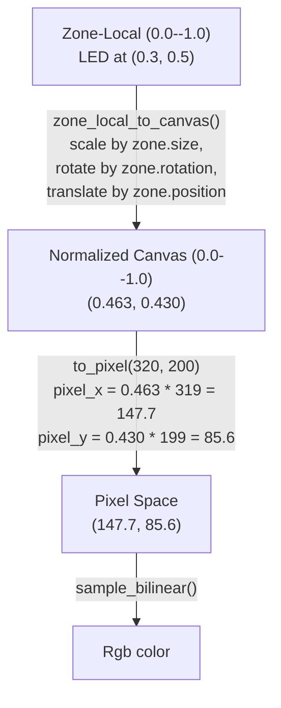
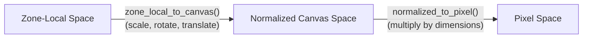
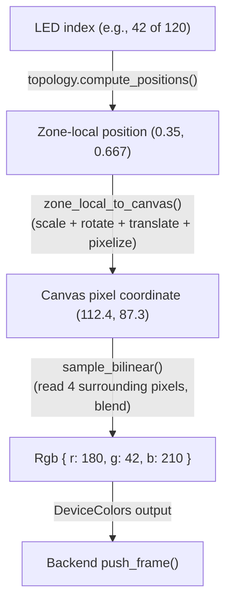
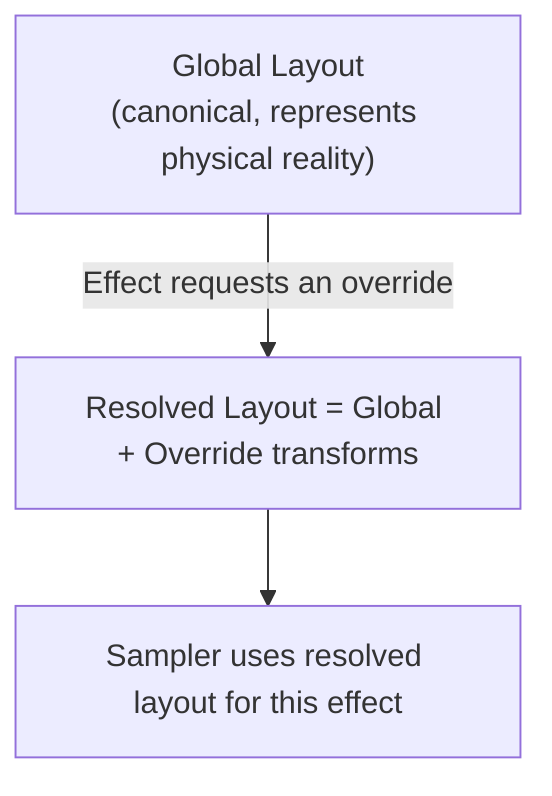
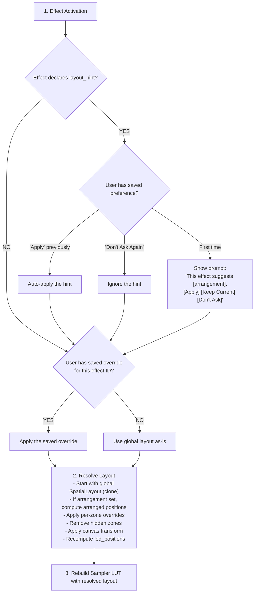

# Spec 06: Spatial Layout Engine

> Maps effect canvas pixels to physical LED positions. The bridge between beautiful pixels and physical photons.

**Status:** Draft
**Crate:** `hypercolor-core::spatial`
**Files:** `layout.rs`, `sampler.rs`, `topology.rs`, `editor.rs`
**Synthesizes from:** `ARCHITECTURE.md` (Spatial Layout Engine section), `docs/design/03-spatial-layout.md` (sections 1, 3, 4, 7-9), `docs/design/18-room-mapping.md` (sections 2-5, 7)

---

## Table of Contents

1. [SpatialLayout Struct](#1-spatiallayout-struct)
2. [DeviceZone Struct](#2-devicezone-struct)
3. [LedTopology Types](#3-ledtopology-types)
4. [NormalizedPosition](#4-normalizedposition)
5. [Sampling Algorithms](#5-sampling-algorithms)
6. [Precomputed Lookup Tables](#6-precomputed-lookup-tables)
7. [Coordinate Transforms](#7-coordinate-transforms)
8. [Summed Area Table](#8-summed-area-table)
9. [Layout Serialization](#9-layout-serialization)
10. [Per-Effect Layout Overrides](#10-per-effect-layout-overrides)

---

## 1. SpatialLayout Struct

*Synthesized from: ARCHITECTURE.md (SpatialLayout data model), design/03 section 1 (mapping problem), design/03 section 9 (persistence), design/18 section 2 (coordinate systems)*

The top-level container for spatial mapping. One `SpatialLayout` exists per active configuration. It holds the canvas definition, every device zone, and optional multi-room metadata. The layout is the single source of truth for "where does every LED sample the canvas."

### Type Definition

```rust
/// Top-level spatial layout container.
///
/// The SpatialLayout defines the complete mapping from a 2D effect canvas
/// to the physical LED positions of every connected device. All coordinates
/// within the layout use a normalized [0.0, 1.0] coordinate space, where
/// (0.0, 0.0) is the top-left corner and (1.0, 1.0) is the bottom-right.
///
/// Canvas dimensions are stored explicitly so the layout is self-describing
/// and can be validated independently of the render pipeline.
#[derive(Debug, Clone, Serialize, Deserialize)]
pub struct SpatialLayout {
    // ── Identity ──────────────────────────────────────────────────────

    /// Unique layout identifier (UUID or slug).
    pub id: String,

    /// Human-readable name (e.g., "Bliss's PC Case", "Full Room").
    pub name: String,

    /// Optional description for the layout editor UI.
    pub description: Option<String>,

    // ── Canvas ────────────────────────────────────────────────────────

    /// Canvas width in pixels. Standard: 320.
    /// Configurable for multi-room setups that need higher resolution.
    pub canvas_width: u32,

    /// Canvas height in pixels. Standard: 200.
    pub canvas_height: u32,

    // ── Zones ─────────────────────────────────────────────────────────

    /// All device zones in this layout. Ordered by rendering priority
    /// (affects output grouping, not sampling correctness).
    /// Every zone MUST have a unique `id`.
    pub zones: Vec<DeviceZone>,

    // ── Defaults ──────────────────────────────────────────────────────

    /// Default sampling mode for zones that don't specify one.
    #[serde(default = "default_sampling_mode")]
    pub default_sampling_mode: SamplingMode,

    /// Default edge behavior for zones that don't specify one.
    #[serde(default = "default_edge_behavior")]
    pub default_edge_behavior: EdgeBehavior,

    // ── Multi-Room (Optional) ─────────────────────────────────────────

    /// Space hierarchy for multi-room layouts.
    /// When `None`, all zones live in a flat canvas (device/desk scale).
    /// When `Some`, zones are grouped into named spaces with physical
    /// dimensions for room-aware rendering.
    pub spaces: Option<Vec<SpaceDefinition>>,

    // ── Metadata ──────────────────────────────────────────────────────

    /// Schema version for forward-compatible migrations.
    pub version: u32,

    /// Timestamps for layout management.
    pub created: chrono::DateTime<chrono::Utc>,
    pub modified: chrono::DateTime<chrono::Utc>,
}

fn default_sampling_mode() -> SamplingMode {
    SamplingMode::Bilinear
}

fn default_edge_behavior() -> EdgeBehavior {
    EdgeBehavior::Clamp
}
```

### Invariants

- `canvas_width` and `canvas_height` MUST be positive non-zero. Default canvas is 640x480 (user-tunable via `daemon.canvas_width` / `daemon.canvas_height`).
- Every `DeviceZone` in `zones` MUST have a unique `id`. Duplicate IDs are a deserialization error.
- `zones` may be empty (valid layout with no devices mapped -- useful as a starting point).
- When `spaces` is `Some`, every zone's `id` SHOULD appear in exactly one space's `zone_ids` list. Orphaned zones (not in any space) are permitted but produce a warning.

### Lifecycle

1. **Load:** Layout is deserialized from TOML on daemon startup, or created fresh via the editor.
2. **Build:** The `PrecomputedSampler` builds its lookup table from the layout (Section 6).
3. **Sample:** Every frame, the sampler reads the canvas buffer and produces `Vec<DeviceColors>`.
4. **Edit:** Layout edits from the web UI mutate the layout and set `dirty = true` on the sampler.
5. **Rebuild:** The sampler detects the dirty flag and recomputes its lookup table.
6. **Save:** Layout is serialized back to TOML on explicit save or daemon shutdown.

The daemon holds a `tokio::sync::watch::Sender<SpatialLayout>` so the sampler task can detect layout changes without polling.

### SpaceDefinition (Multi-Room)

```rust
/// A physical space (room) containing a subset of zones.
/// Used for multi-room orchestration and per-room canvas rendering.
#[derive(Debug, Clone, Serialize, Deserialize)]
pub struct SpaceDefinition {
    /// Unique space identifier.
    pub id: String,

    /// Human-readable name (e.g., "Office", "Living Room").
    pub name: String,

    /// Physical dimensions of the room. Optional -- omit for
    /// virtual spaces or when physical measurements are unknown.
    pub dimensions: Option<RoomDimensions>,

    /// Region of the unified canvas this space occupies.
    /// Normalized coordinates (0.0--1.0).
    /// Only meaningful in unified-canvas mode.
    pub canvas_region: Option<NormalizedRect>,

    /// IDs of zones belonging to this space.
    pub zone_ids: Vec<String>,

    /// Which neighboring spaces share walls with this one.
    /// Used for cross-room effect continuity.
    pub adjacency: Vec<RoomAdjacency>,
}

/// Physical room dimensions in centimeters.
#[derive(Debug, Clone, Copy, Serialize, Deserialize)]
pub struct RoomDimensions {
    pub width: f64,   // x-axis (left to right)
    pub height: f64,  // y-axis (floor to ceiling)
    pub depth: f64,   // z-axis (front to back)
}

/// Normalized rectangle in [0.0, 1.0] canvas space.
#[derive(Debug, Clone, Copy, Serialize, Deserialize)]
pub struct NormalizedRect {
    pub x: f32,
    pub y: f32,
    pub width: f32,
    pub height: f32,
}

/// Declares adjacency between two rooms for cross-room effects.
#[derive(Debug, Clone, Serialize, Deserialize)]
pub struct RoomAdjacency {
    pub neighbor_id: String,
    pub shared_wall: Wall,
    /// Canvas pixels for cross-room blending zone.
    pub blend_width: u32,
}

#[derive(Debug, Clone, Copy, Serialize, Deserialize)]
pub enum Wall {
    North,
    South,
    East,
    West,
}
```

---

## 2. DeviceZone Struct

*Synthesized from: ARCHITECTURE.md (DeviceZone), design/03 sections 3-4 (shape library, per-effect layouts), design/18 sections 3-5 (topology, room editor, ambient/accent separation)*

A zone binds a physical device (or device segment) to a rectangular region of the canvas. It defines where the device lives on the canvas, how its LEDs are geometrically arranged within the zone, and which sampling algorithm reads colors from the canvas.

### Type Definition

```rust
/// A device zone: the spatial binding between a physical device and a
/// region of the effect canvas.
///
/// The zone's bounding rectangle is defined by `position` (center) and
/// `size` (width, height), both in normalized [0.0, 1.0] canvas coordinates.
/// LED positions within the zone are computed from the `topology` and stored
/// in `led_positions` as zone-local normalized coordinates.
#[derive(Debug, Clone, Serialize, Deserialize)]
pub struct DeviceZone {
    // ── Identity ──────────────────────────────────────────────────────

    /// Unique identifier within the layout.
    pub id: String,

    /// Human-readable name (e.g., "ATX Strimer", "Front Fan 1").
    pub name: String,

    /// Backend device identifier.
    /// Format: "<backend>:<device_id>" (e.g., "hid:prism-s-1", "wled:192.168.1.42").
    pub device_id: String,

    /// Sub-device channel or segment name (e.g., "ch1", "atx", "segment-0").
    /// `None` for single-zone devices.
    pub zone_name: Option<String>,

    // ── Placement ─────────────────────────────────────────────────────

    /// Center position of the zone on the canvas.
    /// Normalized [0.0, 1.0] coordinates, where (0,0) = top-left, (1,1) = bottom-right.
    pub position: NormalizedPosition,

    /// Zone dimensions on the canvas.
    /// Normalized [0.0, 1.0] relative to canvas size.
    /// A size of (0.5, 0.25) covers half the canvas width and a quarter of its height.
    pub size: NormalizedPosition,

    /// Rotation in radians around the zone's center point.
    /// Positive = counter-clockwise (standard math convention).
    /// Serialized as degrees in TOML, converted to radians on load.
    pub rotation: f32,

    /// Scale factor applied uniformly to the zone.
    /// Default 1.0. Used for quick resizing without changing `size` directly.
    #[serde(default = "default_scale")]
    pub scale: f32,

    /// Zone orientation hint for the editor.
    /// Does not affect sampling -- purely visual metadata.
    pub orientation: Option<Orientation>,

    // ── Topology ──────────────────────────────────────────────────────

    /// LED arrangement within the zone's bounding rectangle.
    /// Determines how `led_positions` are computed.
    pub topology: LedTopology,

    /// Precomputed LED positions in zone-local normalized coordinates [0.0, 1.0].
    /// Derived from `topology` during layout build.
    /// Length equals the device's LED count (see Section 3 for count rules).
    ///
    /// This field is computed, not serialized. On deserialization, it is
    /// rebuilt from `topology`.
    #[serde(skip)]
    pub led_positions: Vec<NormalizedPosition>,

    // ── Sampling ──────────────────────────────────────────────────────

    /// Sampling algorithm for this zone.
    /// `None` inherits from `SpatialLayout::default_sampling_mode`.
    pub sampling_mode: Option<SamplingMode>,

    /// Edge behavior when LEDs fall outside canvas bounds.
    /// `None` inherits from `SpatialLayout::default_edge_behavior`.
    pub edge_behavior: Option<EdgeBehavior>,

    // ── Shape ─────────────────────────────────────────────────────────

    /// Shape descriptor for the zone's visual appearance in the editor.
    /// Does not affect sampling -- the sampler only uses `led_positions`.
    pub shape: Option<ZoneShape>,

    /// Shape preset ID from the device library (e.g., "strimer-atx-24pin").
    /// Used to load default topology, size, and editor visuals.
    pub shape_preset: Option<String>,
}

fn default_scale() -> f32 {
    1.0
}

/// Visual shape of the zone in the editor.
#[derive(Debug, Clone, Serialize, Deserialize)]
pub enum ZoneShape {
    /// Rectangular bounding box (default for strips, matrices).
    Rectangle,
    /// Circular arc or full circle (fans).
    Arc {
        start_angle: f32,
        sweep_angle: f32,
    },
    /// Full ring (fan rings).
    Ring,
    /// Arbitrary polygon defined by normalized vertices.
    Custom {
        vertices: Vec<NormalizedPosition>,
    },
}

/// Orientation hint for the editor.
#[derive(Debug, Clone, Copy, Serialize, Deserialize)]
pub enum Orientation {
    Horizontal,
    Vertical,
    Diagonal,
    Radial,
}
```

### Invariants

- `size.x` and `size.y` MUST be positive (> 0.0).
- `position` components SHOULD be in `[0.0, 1.0]` for the zone center to be on-canvas. Values outside this range are permitted -- LEDs that project off-canvas are handled by `EdgeBehavior`.
- `led_positions.len()` MUST equal the LED count implied by `topology` (see Section 3).
- `scale` MUST be positive (> 0.0). Default is 1.0.
- `rotation` has no range constraint. Values outside `[0, 2*pi)` are normalized internally.

### LED Position Rebuild

When a zone's topology, position, size, or rotation changes, its `led_positions` must be recomputed. This is a two-step process:

1. **Topology computation:** The topology generates zone-local positions in `[0.0, 1.0]` space (Section 3).
2. **Transform to canvas:** Each local position is transformed through the zone's placement (Section 7).

The `led_positions` field stores the result of step 1. The canvas-space coordinates are stored in the `PrecomputedSampler` (Section 6), not in the zone itself.

---

## 3. LedTopology Types

*Synthesized from: ARCHITECTURE.md (LedTopology enum), design/03 sections 3 and 7 (shape library, topology management), design/18 section 3 (topology primitives and challenges)*

Topologies define the geometric arrangement of LEDs within a zone's bounding rectangle. Each topology type computes a set of zone-local normalized positions from its parameters.

### Type Definitions

```rust
/// LED arrangement within a zone's bounding rectangle.
///
/// Each variant computes zone-local positions in normalized [0.0, 1.0] space.
/// The topology determines how many LEDs exist and where they sit within
/// the zone's rectangular bounds.
#[derive(Debug, Clone, Serialize, Deserialize)]
#[serde(tag = "type", rename_all = "snake_case")]
pub enum LedTopology {
    /// Linear strip: LEDs in a straight line across the zone.
    ///
    /// The strip runs along one axis; the perpendicular axis is fixed at 0.5
    /// (the zone midline). This is the most common topology.
    Strip {
        /// Total number of LEDs.
        count: u32,
        /// Which direction LED index 0 starts from.
        direction: StripDirection,
    },

    /// 2D grid of LEDs (WLED matrix, Strimer, LED panel).
    ///
    /// LEDs form a regular grid. Row-major indexing.
    /// The `serpentine` flag affects output buffer ordering only, NOT
    /// spatial positions -- the sampler always uses logical (row, col) order.
    Matrix {
        /// Columns in the grid.
        width: u32,
        /// Rows in the grid.
        height: u32,
        /// Alternating row direction for serpentine wiring.
        /// Physical wiring detail. See Section 7 (Coordinate Transforms)
        /// for how the backend reorders the output buffer.
        serpentine: bool,
        /// Which corner is LED index 0 in logical grid order.
        start_corner: Corner,
    },

    /// LEDs arranged in a circle (fan ring, LED halo).
    ///
    /// Positions are computed from polar coordinates centered in the zone.
    /// When the zone is non-square, the ring becomes an ellipse.
    Ring {
        /// Number of LEDs on the ring.
        count: u32,
        /// Angle of LED 0 in radians. 0 = right (3 o'clock position).
        start_angle: f32,
        /// Clockwise or counter-clockwise winding.
        direction: Winding,
    },

    /// Concentric rings (dual-ring fans like Corsair QL120).
    ///
    /// Multiple rings centered at the same point with different radii.
    /// LEDs are emitted ring-by-ring (outermost first).
    ConcentricRings {
        rings: Vec<RingDef>,
    },

    /// Rectangular perimeter loop (monitor backlight, ambilight-style).
    ///
    /// LEDs trace the rectangular perimeter of the zone. Each edge
    /// distributes its LEDs evenly, with corner LEDs at exact corners.
    PerimeterLoop {
        /// LED count on each edge.
        top: u32,
        right: u32,
        bottom: u32,
        left: u32,
        /// Which corner begins the LED chain.
        start_corner: Corner,
        /// CW or CCW traversal direction.
        direction: Winding,
    },

    /// Single point source (smart bulbs, single-LED indicators).
    ///
    /// Always produces exactly 1 LED at the zone center (0.5, 0.5).
    /// Defaults to AreaAverage sampling with radius covering the full zone.
    Point,

    /// Arbitrary LED positions defined manually or imported.
    ///
    /// Positions are normalized [0.0, 1.0] within the zone bounding box.
    /// No geometric computation -- positions are stored directly.
    Custom {
        positions: Vec<NormalizedPosition>,
    },
}

/// Direction for strip LED indexing.
#[derive(Debug, Clone, Copy, Serialize, Deserialize)]
#[serde(rename_all = "snake_case")]
pub enum StripDirection {
    LeftToRight,
    RightToLeft,
    TopToBottom,
    BottomToTop,
}

/// Corner for matrix start position.
#[derive(Debug, Clone, Copy, Serialize, Deserialize)]
#[serde(rename_all = "snake_case")]
pub enum Corner {
    TopLeft,
    TopRight,
    BottomLeft,
    BottomRight,
}

/// Winding direction for circular topologies.
#[derive(Debug, Clone, Copy, Serialize, Deserialize)]
#[serde(rename_all = "snake_case")]
pub enum Winding {
    Clockwise,
    CounterClockwise,
}

/// Definition for a single ring within ConcentricRings.
#[derive(Debug, Clone, Serialize, Deserialize)]
pub struct RingDef {
    /// Number of LEDs in this ring.
    pub count: u32,
    /// Radius as a fraction of the zone's half-size.
    /// 0.0 = center, 1.0 = zone edge. Scaled to 0.45 max for margin.
    pub radius: f32,
    /// Angle of LED 0 in radians.
    pub start_angle: f32,
    /// Winding direction.
    pub direction: Winding,
}
```

### LED Count Rules

| Topology | LED Count | Formula |
|---|---|---|
| `Strip` | `count` | Direct parameter |
| `Matrix` | `width * height` | Grid dimensions |
| `Ring` | `count` | Direct parameter |
| `ConcentricRings` | `sum(rings[i].count)` | Sum across all rings |
| `PerimeterLoop` | `top + right + bottom + left` | Sum of all edges |
| `Point` | `1` | Always single LED |
| `Custom` | `positions.len()` | Length of position array |

### Position Computation

Each topology computes zone-local positions in `[0.0, 1.0]` space. Full computation pseudocode follows.

#### Strip

```
fn compute_strip_positions(count: u32, direction: StripDirection) -> Vec<NormalizedPosition>:
    positions = []
    for i in 0..count:
        t = if count == 1 { 0.5 } else { i as f32 / (count - 1) as f32 }

        match direction:
            LeftToRight  => positions.push(NormalizedPosition { x: t,       y: 0.5 })
            RightToLeft  => positions.push(NormalizedPosition { x: 1.0 - t, y: 0.5 })
            TopToBottom   => positions.push(NormalizedPosition { x: 0.5,     y: t })
            BottomToTop   => positions.push(NormalizedPosition { x: 0.5,     y: 1.0 - t })

    return positions
```

**Edge case:** When `count == 1`, the single LED is placed at zone center `(0.5, 0.5)`.

#### Matrix

```
fn compute_matrix_positions(w: u32, h: u32, corner: Corner) -> Vec<NormalizedPosition>:
    positions = []
    for row in 0..h:
        for col in 0..w:
            u = if w == 1 { 0.5 } else { col as f32 / (w - 1) as f32 }
            v = if h == 1 { 0.5 } else { row as f32 / (h - 1) as f32 }

            match corner:
                TopLeft     => positions.push(NormalizedPosition { x: u,       y: v })
                TopRight    => positions.push(NormalizedPosition { x: 1.0 - u, y: v })
                BottomLeft  => positions.push(NormalizedPosition { x: u,       y: 1.0 - v })
                BottomRight => positions.push(NormalizedPosition { x: 1.0 - u, y: 1.0 - v })

    return positions
```

**Serpentine indexing:** The `serpentine` flag does NOT affect spatial positions. It affects the mapping from `(row, col)` to the flat output buffer index:

```
fn flat_index(row: u32, col: u32, width: u32, serpentine: bool) -> u32:
    if serpentine && row % 2 == 1:
        return row * width + (width - 1 - col)
    else:
        return row * width + col
```

The backend uses this mapping when packing the output buffer for the wire protocol.

#### Ring

```
fn compute_ring_positions(count: u32, start_angle: f32, dir: Winding) -> Vec<NormalizedPosition>:
    const MARGIN: f32 = 0.45   // Inset from zone edge for visual margin
    positions = []

    for i in 0..count:
        t = i as f32 / count as f32
        angle = match dir:
            Clockwise        => start_angle + t * 2.0 * PI
            CounterClockwise => start_angle - t * 2.0 * PI

        positions.push(NormalizedPosition {
            x: 0.5 + MARGIN * angle.cos(),
            y: 0.5 + MARGIN * angle.sin(),
        })

    return positions
```

**Aspect ratio:** When `zone.size.x != zone.size.y`, the ring projects as an ellipse. For a true circle, constrain the zone to a 1:1 aspect ratio in the editor.

#### PerimeterLoop

```
fn compute_perimeter_positions(
    top: u32, right: u32, bottom: u32, left: u32,
    start_corner: Corner, direction: Winding,
) -> Vec<NormalizedPosition>:
    // Build edges in CW order from TopLeft, then rotate/reverse for other configs.
    // For TopLeft + Clockwise:

    positions = []

    // Top edge: left to right (LED 0 at top-left, not at corner overlap)
    for i in 0..top:
        t = i as f32 / top as f32
        positions.push(NormalizedPosition { x: t, y: 0.0 })

    // Right edge: top to bottom
    for i in 0..right:
        t = i as f32 / right as f32
        positions.push(NormalizedPosition { x: 1.0, y: t })

    // Bottom edge: right to left
    for i in 0..bottom:
        t = i as f32 / bottom as f32
        positions.push(NormalizedPosition { x: 1.0 - t, y: 1.0 })

    // Left edge: bottom to top
    for i in 0..left:
        t = i as f32 / left as f32
        positions.push(NormalizedPosition { x: 0.0, y: 1.0 - t })

    // Rotate and/or reverse based on start_corner and direction.
    // (Implementation: compute offset from TopLeft, rotate the array.)
    return adjust_for_start_and_direction(positions, start_corner, direction)
```

#### ConcentricRings

```
fn compute_concentric_positions(rings: &[RingDef]) -> Vec<NormalizedPosition>:
    positions = []
    for ring in rings:
        r = ring.radius * 0.45   // Scale to margin
        for i in 0..ring.count:
            t = i as f32 / ring.count as f32
            angle = match ring.direction:
                Clockwise        => ring.start_angle + t * 2.0 * PI
                CounterClockwise => ring.start_angle - t * 2.0 * PI

            positions.push(NormalizedPosition {
                x: 0.5 + r * angle.cos(),
                y: 0.5 + r * angle.sin(),
            })

    return positions
```

LEDs are emitted ring-by-ring (first ring in the array = outermost).

#### Point

```
fn compute_point_positions() -> Vec<NormalizedPosition>:
    return vec![NormalizedPosition { x: 0.5, y: 0.5 }]
```

#### Custom

```
fn compute_custom_positions(positions: &[NormalizedPosition]) -> Vec<NormalizedPosition>:
    return positions.clone()
```

No computation -- positions are stored directly.

---

## 4. NormalizedPosition

*Synthesized from: ARCHITECTURE.md (zone position/size fields), design/03 section 7 (position computation), design/18 section 2 (coordinate systems)*

All spatial coordinates within the layout use a normalized `[0.0, 1.0]` coordinate system. The `NormalizedPosition` type encodes a point in this space and provides conversions to and from pixel coordinates.

### Type Definition

```rust
/// A position in normalized [0.0, 1.0] canvas space.
///
/// - `(0.0, 0.0)` = top-left corner of the canvas
/// - `(1.0, 1.0)` = bottom-right corner of the canvas
/// - `(0.5, 0.5)` = center of the canvas
///
/// Values outside [0.0, 1.0] are permitted -- they represent positions
/// beyond the canvas bounds and are handled by EdgeBehavior.
///
/// This type is used for:
/// - Zone positions and sizes on the canvas
/// - LED positions within a zone's bounding box
/// - Space regions in multi-room layouts
#[derive(Debug, Clone, Copy, PartialEq, Serialize, Deserialize)]
pub struct NormalizedPosition {
    /// Horizontal position. 0.0 = left edge, 1.0 = right edge.
    pub x: f32,
    /// Vertical position. 0.0 = top edge, 1.0 = bottom edge.
    pub y: f32,
}

impl NormalizedPosition {
    /// Create a new normalized position.
    pub const fn new(x: f32, y: f32) -> Self {
        Self { x, y }
    }

    /// Create from pixel coordinates given canvas dimensions.
    ///
    /// # Arguments
    /// - `px`: Pixel x-coordinate (0 to canvas_width - 1)
    /// - `py`: Pixel y-coordinate (0 to canvas_height - 1)
    /// - `canvas_width`: Canvas width in pixels
    /// - `canvas_height`: Canvas height in pixels
    ///
    /// The conversion maps pixel centers to normalized space:
    /// pixel 0 maps to 0.0, pixel (W-1) maps to 1.0.
    pub fn from_pixel(px: f32, py: f32, canvas_width: u32, canvas_height: u32) -> Self {
        Self {
            x: if canvas_width <= 1 {
                0.5
            } else {
                px / (canvas_width - 1) as f32
            },
            y: if canvas_height <= 1 {
                0.5
            } else {
                py / (canvas_height - 1) as f32
            },
        }
    }

    /// Convert to fractional pixel coordinates.
    ///
    /// Returns pixel coordinates suitable for bilinear sampling.
    /// The result is in the range [0.0, W-1] x [0.0, H-1].
    pub fn to_pixel(&self, canvas_width: u32, canvas_height: u32) -> (f32, f32) {
        (
            self.x * (canvas_width - 1) as f32,
            self.y * (canvas_height - 1) as f32,
        )
    }

    /// Convert to integer pixel coordinates (nearest pixel).
    pub fn to_pixel_rounded(&self, canvas_width: u32, canvas_height: u32) -> (u32, u32) {
        let (px, py) = self.to_pixel(canvas_width, canvas_height);
        (
            px.round().clamp(0.0, (canvas_width - 1) as f32) as u32,
            py.round().clamp(0.0, (canvas_height - 1) as f32) as u32,
        )
    }

    /// Linearly interpolate between two positions.
    pub fn lerp(a: Self, b: Self, t: f32) -> Self {
        Self {
            x: a.x + (b.x - a.x) * t,
            y: a.y + (b.y - a.y) * t,
        }
    }

    /// Euclidean distance between two normalized positions.
    pub fn distance(a: Self, b: Self) -> f32 {
        let dx = b.x - a.x;
        let dy = b.y - a.y;
        (dx * dx + dy * dy).sqrt()
    }

    /// Clamp both components to [0.0, 1.0].
    pub fn clamp_to_canvas(self) -> Self {
        Self {
            x: self.x.clamp(0.0, 1.0),
            y: self.y.clamp(0.0, 1.0),
        }
    }

    /// Check if the position is within the [0.0, 1.0] canvas bounds.
    pub fn is_on_canvas(&self) -> bool {
        self.x >= 0.0 && self.x <= 1.0 && self.y >= 0.0 && self.y <= 1.0
    }
}
```

### Coordinate Space Conventions

| Space | Range | Origin | Used For |
|---|---|---|---|
| Normalized canvas | `[0.0, 1.0]` | Top-left `(0,0)` | Zone placement, LED positions |
| Pixel | `[0, W-1] x [0, H-1]` | Top-left `(0,0)` | Sampling the canvas buffer |
| Zone-local | `[0.0, 1.0]` | Top-left of zone bounding box | LED positions within a zone |

**Why normalized?** Effects don't care about absolute pixel counts. A strip placed at `x=0.5` is centered horizontally regardless of whether the canvas is 320 or 640 pixels wide. Normalized coordinates make layouts resolution-independent.

### Conversion Diagram



---

## 5. Sampling Algorithms

*Synthesized from: design/03 section 8 (sampling algorithms, performance budget, SAT optimization), design/18 section 5 (ambient/accent separation, role-based sampling), ARCHITECTURE.md (SpatialSampler)*

Four sampling algorithms are provided, each trading off between speed, quality, and appropriateness for different device types. The sampling mode is selectable per-zone, with a layout-wide default.

### 5.1 Nearest-Neighbor

Snap to the closest integer pixel. The simplest and fastest algorithm.

**Math:**

```
Given fractional canvas coordinate (x, y):

    px = round(x)
    py = round(y)
    result = canvas[px][py]
```

**Implementation:**

```rust
pub fn sample_nearest(canvas: &Canvas, x: f32, y: f32) -> Rgb {
    let px = x.round().clamp(0.0, (canvas.width - 1) as f32) as u32;
    let py = y.round().clamp(0.0, (canvas.height - 1) as f32) as u32;
    canvas.pixel(px, py)
}
```

**Characteristics:**

| Property | Value |
|---|---|
| Complexity | O(1) per LED |
| Pixel reads | 1 |
| Quality | Low (visible stepping between adjacent LEDs) |
| Best for | Low-density strips (30 LED/m), prototyping, performance-critical paths |

### 5.2 Bilinear Interpolation

Blends the four surrounding pixels based on the fractional position. The default and recommended mode for most devices.

**Math:**

Given fractional canvas coordinate `(x, y)`:

```
x0 = floor(x)        x1 = x0 + 1        fx = fract(x)
y0 = floor(y)        y1 = y0 + 1        fy = fract(y)

c00 = canvas[x0][y0]     (top-left neighbor)
c10 = canvas[x1][y0]     (top-right neighbor)
c01 = canvas[x0][y1]     (bottom-left neighbor)
c11 = canvas[x1][y1]     (bottom-right neighbor)

Weights (bilinear basis functions):
    w00 = (1 - fx) * (1 - fy)
    w10 = fx       * (1 - fy)
    w01 = (1 - fx) * fy
    w11 = fx       * fy

    Note: w00 + w10 + w01 + w11 = 1.0 (partition of unity)

Per-channel interpolation:
    result.r = c00.r * w00 + c10.r * w10 + c01.r * w01 + c11.r * w11
    result.g = c00.g * w00 + c10.g * w10 + c01.g * w01 + c11.g * w11
    result.b = c00.b * w00 + c10.b * w10 + c01.b * w01 + c11.b * w11
```

This is equivalent to two sequential linear interpolations (horizontal, then vertical):

```
top    = lerp(c00, c10, fx)       // horizontal blend across top edge
bottom = lerp(c01, c11, fx)       // horizontal blend across bottom edge
result = lerp(top, bottom, fy)    // vertical blend between the two
```

**Implementation:**

```rust
pub fn sample_bilinear(canvas: &Canvas, x: f32, y: f32) -> Rgb {
    let x0 = x.floor() as u32;
    let y0 = y.floor() as u32;
    let x1 = (x0 + 1).min(canvas.width - 1);
    let y1 = (y0 + 1).min(canvas.height - 1);

    let fx = x - x0 as f32;
    let fy = y - y0 as f32;

    let c00 = canvas.pixel(x0, y0);
    let c10 = canvas.pixel(x1, y0);
    let c01 = canvas.pixel(x0, y1);
    let c11 = canvas.pixel(x1, y1);

    let w00 = (1.0 - fx) * (1.0 - fy);
    let w10 = fx * (1.0 - fy);
    let w01 = (1.0 - fx) * fy;
    let w11 = fx * fy;

    Rgb {
        r: (c00.r as f32 * w00 + c10.r as f32 * w10
          + c01.r as f32 * w01 + c11.r as f32 * w11) as u8,
        g: (c00.g as f32 * w00 + c10.g as f32 * w10
          + c01.g as f32 * w01 + c11.g as f32 * w11) as u8,
        b: (c00.b as f32 * w00 + c10.b as f32 * w10
          + c01.b as f32 * w01 + c11.b as f32 * w11) as u8,
    }
}
```

**Characteristics:**

| Property | Value |
|---|---|
| Complexity | O(1) per LED |
| Pixel reads | 4 |
| Arithmetic ops | 3 lerps (12 multiply-adds) |
| Quality | Good (smooth gradients, no stepping) |
| Best for | Most devices -- strips, matrices, fan rings, keyboards |

### 5.3 Area Average

For devices that represent a large physical area (Hue bulbs, ceiling wash lights). Returns the flat arithmetic mean of all pixels in a rectangular canvas region. The LED's color reflects the *mood* of its area, not any specific pixel.

**Math:**

Given center `(cx, cy)` and radii `(rx, ry)` in pixel coordinates:

```
Bounding rectangle:
    x0 = clamp(floor(cx - rx), 0, W-1)
    y0 = clamp(floor(cy - ry), 0, H-1)
    x1 = clamp(floor(cx + rx), 0, W-1)
    y1 = clamp(floor(cy + ry), 0, H-1)

Area = (x1 - x0 + 1) * (y1 - y0 + 1)

Channel average:
    result.r = (1/Area) * sum_{py=y0}^{y1} sum_{px=x0}^{x1} canvas[px][py].r
    result.g = (1/Area) * sum_{py=y0}^{y1} sum_{px=x0}^{x1} canvas[px][py].g
    result.b = (1/Area) * sum_{py=y0}^{y1} sum_{px=x0}^{x1} canvas[px][py].b
```

**Naive implementation (O(area)):**

```rust
pub fn sample_area_average(
    canvas: &Canvas,
    center_x: f32,
    center_y: f32,
    radius_x: f32,
    radius_y: f32,
) -> Rgb {
    let x0 = (center_x - radius_x).max(0.0) as u32;
    let y0 = (center_y - radius_y).max(0.0) as u32;
    let x1 = (center_x + radius_x).min(canvas.width as f32 - 1.0) as u32;
    let y1 = (center_y + radius_y).min(canvas.height as f32 - 1.0) as u32;

    let mut r_sum: u64 = 0;
    let mut g_sum: u64 = 0;
    let mut b_sum: u64 = 0;
    let mut count: u64 = 0;

    for py in y0..=y1 {
        for px in x0..=x1 {
            let c = canvas.pixel(px, py);
            r_sum += c.r as u64;
            g_sum += c.g as u64;
            b_sum += c.b as u64;
            count += 1;
        }
    }

    if count == 0 {
        return Rgb { r: 0, g: 0, b: 0 };
    }

    Rgb {
        r: (r_sum / count) as u8,
        g: (g_sum / count) as u8,
        b: (b_sum / count) as u8,
    }
}
```

**Optimized implementation:** Use a Summed Area Table (Section 8) to reduce per-query cost to O(1).

**Characteristics:**

| Property | Value |
|---|---|
| Complexity (naive) | O(area) per LED |
| Complexity (SAT) | O(1) per LED (after O(W*H) precomputation) |
| Quality | Excellent for ambient/mood lighting |
| Best for | Hue bulbs, single-color smart lights, room wash zones |

### 5.4 Gaussian-Weighted Average

A refinement of area average where pixels near the center contribute more than pixels at the edges. Produces more natural color blending for ambient lighting -- the center of the device's influence zone dominates, with a smooth falloff.

**Math:**

The weight of pixel `(px, py)` relative to center `(cx, cy)` with standard deviation `sigma`:

```
w(px, py) = exp(-((px - cx)^2 + (py - cy)^2) / (2 * sigma^2))
```

The 2D Gaussian kernel is a `(2*radius + 1) x (2*radius + 1)` grid of weights, precomputed and normalized to sum to 1.0:

```
For a kernel with radius R and sigma S:

    kernel_size = 2*R + 1

    For dy in -R..=R, dx in -R..=R:
        raw_weight[dy + R][dx + R] = exp(-(dx^2 + dy^2) / (2 * S^2))

    total = sum of all raw_weight values

    weight[dy + R][dx + R] = raw_weight[dy + R][dx + R] / total
```

The weighted color at `(cx, cy)`:

```
result.r = sum_{dy=-R}^{R} sum_{dx=-R}^{R} weight[dy+R][dx+R] * canvas[cx+dx][cy+dy].r
result.g = (same for green)
result.b = (same for blue)
```

**Kernel precomputation (done once at layout build time):**

```rust
pub fn build_gaussian_kernel(sigma: f32, radius: u32) -> GaussianKernel {
    let size = (2 * radius + 1) as usize;
    let mut weights = Vec::with_capacity(size * size);
    let mut total = 0.0f32;

    let s2 = 2.0 * sigma * sigma;

    for dy in 0..size {
        for dx in 0..size {
            let fx = dx as f32 - radius as f32;
            let fy = dy as f32 - radius as f32;
            let w = (-(fx * fx + fy * fy) / s2).exp();
            weights.push(w);
            total += w;
        }
    }

    // Normalize: weights sum to 1.0
    for w in &mut weights {
        *w /= total;
    }

    GaussianKernel { radius, weights, sigma }
}
```

**Per-frame sampling with precomputed kernel:**

```rust
pub fn sample_gaussian(
    canvas: &Canvas,
    cx: f32,
    cy: f32,
    kernel: &GaussianKernel,
) -> Rgb {
    let r = kernel.radius as i32;
    let size = (2 * kernel.radius + 1) as usize;

    let mut acc_r = 0.0f32;
    let mut acc_g = 0.0f32;
    let mut acc_b = 0.0f32;

    let base_x = cx.round() as i32 - r;
    let base_y = cy.round() as i32 - r;

    for dy in 0..size {
        for dx in 0..size {
            let px = (base_x + dx as i32)
                .clamp(0, canvas.width as i32 - 1) as u32;
            let py = (base_y + dy as i32)
                .clamp(0, canvas.height as i32 - 1) as u32;

            let w = kernel.weights[dy * size + dx];
            let c = canvas.pixel(px, py);

            acc_r += c.r as f32 * w;
            acc_g += c.g as f32 * w;
            acc_b += c.b as f32 * w;
        }
    }

    Rgb {
        r: acc_r.round() as u8,
        g: acc_g.round() as u8,
        b: acc_b.round() as u8,
    }
}
```

**Characteristics:**

| Property | Value |
|---|---|
| Complexity | O(kernel_area) per LED |
| Example: radius=8 | 17x17 = 289 multiply-accumulates per LED |
| Quality | Excellent (natural smooth falloff, no box artifacts) |
| Best for | Premium ambient lighting, Hue bulbs, room accents |

### 5.5 Sampling Mode Recommendations

| Device Type | Recommended Mode | Rationale |
|---|---|---|
| High-density strip (60+ LED/m) | Bilinear | Full spatial detail, smooth gradients |
| Low-density strip (30 LED/m) | Bilinear or Nearest | Nearest is fine for widely spaced LEDs |
| LED matrix (Strimer, panel) | Bilinear | Natural match for pixel-grid nature |
| Fan ring | Bilinear | Smooth circular gradient sampling |
| Hue / smart bulb | GaussianArea | Represents a room area, not a point |
| Large wash zone | AreaAverage | Fast aggregate of wide region |
| Monitor backlight | Bilinear | Per-LED positional precision |
| Keyboard per-key | Bilinear | Standard sub-pixel accuracy |

### 5.6 Edge Behavior

When an LED's sampling coordinate falls outside the `[0, W) x [0, H)` canvas bounds, edge behavior determines the result:

```rust
/// Edge behavior for out-of-bounds LED positions.
#[derive(Debug, Clone, Copy, Serialize, Deserialize)]
#[serde(rename_all = "snake_case")]
pub enum EdgeBehavior {
    /// Clamp coordinates to canvas bounds (default).
    /// LEDs beyond the edge see the edge color.
    Clamp,

    /// Wrap around to the opposite edge.
    /// Creates seamless loop effects for strips that physically wrap.
    Wrap,

    /// Fade to black outside canvas bounds.
    /// `falloff` controls the fade rate: higher = sharper cutoff.
    FadeToBlack { falloff: f32 },

    /// Mirror coordinates at canvas edges.
    /// Creates symmetric reflections.
    Mirror,
}
```

**Implementation of coordinate wrapping:**

```rust
fn apply_edge(normalized: f32, dimension: f32, edge: EdgeBehavior) -> f32 {
    let pixel = normalized * (dimension - 1.0);
    match edge {
        EdgeBehavior::Clamp => pixel.clamp(0.0, dimension - 1.0),
        EdgeBehavior::Wrap => pixel.rem_euclid(dimension),
        EdgeBehavior::Mirror => {
            let p = pixel.rem_euclid(dimension * 2.0);
            if p >= dimension { dimension * 2.0 - p - 1.0 } else { p }
        }
        EdgeBehavior::FadeToBlack { .. } => pixel, // Fade applied post-sample
    }
}
```

---

## 6. Precomputed Lookup Tables

*Synthesized from: design/03 section 8 (precomputed sampler, performance budget), ARCHITECTURE.md (SpatialSampler sample method)*

The layout changes rarely (user drags a zone in the editor). The canvas changes every frame (60fps effect rendering). The sampler exploits this asymmetry by precomputing all per-LED data at layout-change time and reusing it every frame.

### SamplingLut Struct

```rust
/// Precomputed lookup table for spatial sampling.
///
/// Stores the canvas pixel coordinate, sampling mode, and precomputed
/// weights for every LED across all zones. Rebuilt when the layout changes.
/// Queried once per frame to produce LED colors.
///
/// This is the hot-path data structure. Its layout is optimized for
/// sequential traversal during frame sampling.
pub struct SamplingLut {
    /// Flat array of sample points for every LED across all zones.
    /// Ordered by zone (zone 0 LEDs first, then zone 1, etc.).
    /// Contiguous in memory for cache-friendly sequential access.
    sample_points: Vec<LutEntry>,

    /// Zone metadata for slicing `sample_points` into per-zone output.
    zone_slices: Vec<ZoneSlice>,

    /// Precomputed summed area table for O(1) area-average queries.
    /// Rebuilt every frame from the canvas (only if any zone uses area sampling).
    sat: Option<SummedAreaTable>,

    /// True when the layout has changed and the LUT needs rebuilding.
    dirty: bool,

    /// Generation counter. Incremented on each rebuild.
    /// Used by the editor to confirm the sampler has consumed a layout change.
    generation: u64,

    /// Canvas dimensions that were used to build this LUT.
    /// If the canvas size changes, the LUT must be rebuilt.
    canvas_width: u32,
    canvas_height: u32,
}

/// A single entry in the sampling lookup table.
/// One entry per LED across the entire layout.
#[derive(Debug, Clone)]
pub struct LutEntry {
    /// Canvas pixel coordinate (fractional, for bilinear interpolation).
    /// Range: x in [0.0, canvas_width), y in [0.0, canvas_height).
    pub x: f32,
    pub y: f32,

    /// Sampling algorithm for this LED.
    pub mode: SamplingMode,

    /// For AreaAverage: precomputed bounding rectangle in pixel coords.
    pub area_rect: Option<PixelRect>,

    /// For GaussianArea: precomputed normalized kernel weights.
    /// Stored as a flat Vec in row-major order covering the kernel window.
    pub gaussian_kernel: Option<GaussianKernel>,
}

/// Metadata for one zone's slice within the LUT.
pub struct ZoneSlice {
    /// Index into `sample_points` where this zone's LEDs begin.
    pub start: usize,
    /// Number of LEDs in this zone.
    pub count: usize,
    /// Back-references for output routing.
    pub zone_id: String,
    pub device_id: String,
    pub zone_name: Option<String>,
}

/// Bounding rectangle in pixel coordinates (integer bounds).
#[derive(Debug, Clone, Copy)]
pub struct PixelRect {
    pub x0: u32,
    pub y0: u32,
    pub x1: u32,   // inclusive
    pub y1: u32,   // inclusive
}

/// Precomputed 2D Gaussian kernel for weighted sampling.
#[derive(Debug, Clone)]
pub struct GaussianKernel {
    /// Kernel half-size in pixels. Full kernel is (2*radius+1)^2.
    pub radius: u32,
    /// Row-major weight values. Length = (2*radius+1)^2.
    /// Weights are pre-normalized (sum to 1.0).
    pub weights: Vec<f32>,
    /// Sigma used to generate this kernel.
    pub sigma: f32,
}
```

### Rebuild (on Layout Change)

Called when any zone is added, removed, moved, resized, or rotated. Also called when the canvas resolution changes. This is NOT on the frame-critical path -- it happens during editor interaction.

```rust
impl SamplingLut {
    /// Rebuild the entire lookup table from the current layout.
    ///
    /// Complexity: O(total_leds) for bilinear/nearest zones.
    /// O(total_leds * kernel_area) for zones with Gaussian kernels.
    /// Typical time: ~10 us per 1000 LEDs.
    pub fn rebuild(&mut self, layout: &SpatialLayout) {
        self.sample_points.clear();
        self.zone_slices.clear();
        self.canvas_width = layout.canvas_width;
        self.canvas_height = layout.canvas_height;

        let cw = layout.canvas_width as f32;
        let ch = layout.canvas_height as f32;

        for zone in &layout.zones {
            let start = self.sample_points.len();

            let mode = zone.sampling_mode
                .clone()
                .unwrap_or(layout.default_sampling_mode.clone());

            let edge = zone.edge_behavior
                .unwrap_or(layout.default_edge_behavior);

            for local_pos in &zone.led_positions {
                // Transform: zone-local -> canvas pixel coordinates
                let canvas_pos = zone_local_to_canvas(
                    *local_pos, zone, cw, ch, edge,
                );

                let entry = LutEntry {
                    x: canvas_pos.x,
                    y: canvas_pos.y,
                    mode: mode.clone(),
                    area_rect: Self::compute_area_rect(&mode, canvas_pos, cw, ch),
                    gaussian_kernel: Self::compute_gaussian_kernel(&mode),
                };
                self.sample_points.push(entry);
            }

            self.zone_slices.push(ZoneSlice {
                start,
                count: zone.led_positions.len(),
                zone_id: zone.id.clone(),
                device_id: zone.device_id.clone(),
                zone_name: zone.zone_name.clone(),
            });
        }

        self.generation += 1;
        self.dirty = false;
    }

    fn compute_area_rect(
        mode: &SamplingMode,
        center: NormalizedPosition,
        cw: f32,
        ch: f32,
    ) -> Option<PixelRect> {
        match mode {
            SamplingMode::AreaAverage { radius_x, radius_y } => {
                Some(PixelRect {
                    x0: (center.x - radius_x).max(0.0) as u32,
                    y0: (center.y - radius_y).max(0.0) as u32,
                    x1: (center.x + radius_x).min(cw - 1.0) as u32,
                    y1: (center.y + radius_y).min(ch - 1.0) as u32,
                })
            }
            _ => None,
        }
    }

    fn compute_gaussian_kernel(mode: &SamplingMode) -> Option<GaussianKernel> {
        match mode {
            SamplingMode::GaussianArea { sigma, radius } => {
                Some(build_gaussian_kernel(*sigma, *radius))
            }
            _ => None,
        }
    }
}
```

### Cache Invalidation Strategy

The LUT is invalidated (marked dirty) by any of the following events:

| Event | Invalidation Scope | Cost |
|---|---|---|
| Zone added/removed | Full rebuild | O(total_leds) |
| Zone moved (position change) | Full rebuild | O(total_leds) |
| Zone resized (size change) | Full rebuild | O(total_leds) |
| Zone rotated | Full rebuild | O(total_leds) |
| Zone sampling mode changed | Full rebuild | O(total_leds) |
| Canvas resolution changed | Full rebuild | O(total_leds) |
| Zone topology changed (LED count) | Full rebuild | O(total_leds) |
| Effect changed (no layout change) | No invalidation | 0 |
| Control value changed | No invalidation | 0 |

**Why always full rebuild?** The LUT is a flat contiguous array. Partial rebuilds would require tracking zone offsets and potentially shifting subsequent zones' data. At ~10 us per 1000 LEDs, a full rebuild for a 10,000-LED setup costs ~100 us -- well within interactive latency. The simplicity of "always rebuild everything" outweighs the marginal performance gain of incremental updates.

**Dirty flag protocol:**

1. Layout editor sends a `LayoutChanged(SpatialLayout)` event via the event bus.
2. The sampler task receives the new layout via `watch::Receiver<SpatialLayout>`.
3. The sampler sets `dirty = true` and stores the new layout.
4. On the next frame, the sampler checks `dirty` and calls `rebuild()` before sampling.
5. The sampler increments `generation` and clears `dirty`.

The SAT (Summed Area Table) is rebuilt every frame from the canvas buffer, NOT on layout change. The SAT depends on canvas *content* (which changes every frame), while the LUT depends on layout *geometry* (which changes rarely).

### Frame Sampling

The per-frame hot path. Called 60 times per second.

```rust
impl SamplingLut {
    /// Sample all LEDs from the current canvas.
    /// Returns one `DeviceColors` per zone.
    ///
    /// Complexity: O(total_leds) for bilinear/nearest.
    /// O(total_leds * kernel_area) for Gaussian zones.
    /// With SAT, area-average zones are O(1) per LED after SAT build.
    pub fn sample(&mut self, canvas: &Canvas) -> Vec<DeviceColors> {
        // Rebuild LUT if layout changed since last frame.
        // (The calling code is responsible for setting dirty.)

        // Build SAT if any zone uses area-average sampling.
        if self.needs_sat() {
            self.sat = Some(SummedAreaTable::from_canvas(canvas));
        }

        // Sample all LEDs in one sequential pass.
        let all_colors: Vec<Rgb> = self.sample_points.iter()
            .map(|entry| self.sample_one(canvas, entry))
            .collect();

        // Slice into per-zone DeviceColors for dispatch to backends.
        self.zone_slices.iter().map(|slice| {
            DeviceColors {
                device_id: slice.device_id.clone(),
                zone_name: slice.zone_name.clone(),
                colors: all_colors[slice.start..slice.start + slice.count].to_vec(),
            }
        }).collect()
    }

    fn sample_one(&self, canvas: &Canvas, entry: &LutEntry) -> Rgb {
        match &entry.mode {
            SamplingMode::Nearest =>
                sample_nearest(canvas, entry.x, entry.y),
            SamplingMode::Bilinear =>
                sample_bilinear(canvas, entry.x, entry.y),
            SamplingMode::AreaAverage { .. } => {
                if let (Some(rect), Some(sat)) = (&entry.area_rect, &self.sat) {
                    sat.average(rect.x0, rect.y0, rect.x1, rect.y1)
                } else {
                    // Fallback to naive if SAT unavailable
                    sample_nearest(canvas, entry.x, entry.y)
                }
            }
            SamplingMode::GaussianArea { .. } => {
                if let Some(kernel) = &entry.gaussian_kernel {
                    sample_gaussian(canvas, entry.x, entry.y, kernel)
                } else {
                    sample_bilinear(canvas, entry.x, entry.y)
                }
            }
        }
    }

    fn needs_sat(&self) -> bool {
        self.sample_points.iter().any(|sp| {
            matches!(sp.mode, SamplingMode::AreaAverage { .. })
        })
    }
}
```

### Performance Budget

Target: entire spatial sampling phase completes within 1ms at 60fps.

| Total LEDs | Bilinear (~50ns/LED) | Budget Used (of 1ms) |
|---|---|---|
| 100 | ~5 us | 0.5% |
| 500 | ~25 us | 2.5% |
| 1,000 | ~50 us | 5% |
| 5,000 | ~250 us | 25% |
| 10,000 | ~500 us | 50% |
| 50,000 | ~2.5 ms | Over budget -- requires SIMD |

**The sampler is NOT the bottleneck.** Effect rendering (especially the Servo HTML path) and device I/O dominate frame time. The sampler's O(N) linear scan with cache-friendly memory access is trivially fast for typical setups.

**SIMD future optimization (50,000+ LEDs):** The bilinear sampling loop is trivially vectorizable with `std::simd` or portable SIMD intrinsics. Process 4/8 sample points per SIMD lane for ~4-8x throughput. Not needed for Phase 0-2.

---

## 7. Coordinate Transforms

*Synthesized from: design/03 section 7 (position computation, rotation transform), design/18 section 2 (four coordinate spaces, transformation chain)*

Three coordinate spaces are connected by a two-step transform chain. Every LED position traverses this chain exactly once during the LUT rebuild.

### 7.1 The Three Spaces

```
Zone-Local Space              Normalized Canvas Space       Pixel Space
(0.0 -- 1.0)                 (0.0 -- 1.0)                  (fractional pixel coords)

  LED position                 LED position                  Sampling coordinate
  within the zone's            on the effect canvas          for canvas buffer access
  bounding box



### 7.2 Transform 1: Zone-Local to Normalized Canvas

Transforms a point from the zone's `[0,1]` local space to the canvas's `[0,1]` normalized space, applying scale, rotation, and translation.

**Math:**

```
Given:
    local   = zone-local position (0.0 -- 1.0)
    pos     = zone.position (center of zone on canvas, normalized)
    sz      = zone.size (width and height, normalized)
    scale   = zone.scale (uniform multiplier, default 1.0)
    theta   = zone.rotation (radians, CCW positive)

Step 1: Center the local position at the origin and scale to zone dimensions
    scaled_x = (local.x - 0.5) * sz.x * scale
    scaled_y = (local.y - 0.5) * sz.y * scale

Step 2: Rotate around the origin (zone center)
    rotated_x = scaled_x * cos(theta) - scaled_y * sin(theta)
    rotated_y = scaled_x * sin(theta) + scaled_y * cos(theta)

Step 3: Translate to the zone's position on the canvas
    canvas_x = pos.x + rotated_x
    canvas_y = pos.y + rotated_y
```

This is an affine transform: `T(translate) * R(rotate) * S(scale) * C(center)`.

### 7.3 Transform 2: Normalized Canvas to Pixel

Simple multiplication by canvas dimensions, with edge behavior applied.

```
pixel_x = canvas_x * (canvas_width - 1)
pixel_y = canvas_y * (canvas_height - 1)
```

These two steps are combined in the implementation for efficiency:

```rust
/// Transform a zone-local position to canvas pixel coordinates.
///
/// Applies the full transform chain: center -> scale -> rotate -> translate -> pixelize.
/// The returned position is in fractional pixel coordinates suitable for
/// bilinear sampling.
pub fn zone_local_to_canvas(
    local: NormalizedPosition,
    zone: &DeviceZone,
    canvas_width: f32,
    canvas_height: f32,
    edge: EdgeBehavior,
) -> NormalizedPosition {
    let s = zone.scale;

    // Step 1: Center at origin and scale to zone dimensions
    let sx = (local.x - 0.5) * zone.size.x * s;
    let sy = (local.y - 0.5) * zone.size.y * s;

    // Step 2: Rotate around zone center
    let cos_t = zone.rotation.cos();
    let sin_t = zone.rotation.sin();
    let rx = sx * cos_t - sy * sin_t;
    let ry = sx * sin_t + sy * cos_t;

    // Step 3: Translate to zone position (still in normalized canvas space)
    let cx = zone.position.x + rx;
    let cy = zone.position.y + ry;

    // Step 4: Convert to pixel coordinates and apply edge behavior
    let px = apply_edge(cx, canvas_width, edge);
    let py = apply_edge(cy, canvas_height, edge);

    NormalizedPosition { x: px, y: py }
}

/// Apply edge behavior to a normalized coordinate being converted to pixel space.
fn apply_edge(normalized: f32, dimension: f32, edge: EdgeBehavior) -> f32 {
    let pixel = normalized * (dimension - 1.0);
    match edge {
        EdgeBehavior::Clamp => pixel.clamp(0.0, dimension - 1.0),
        EdgeBehavior::Wrap => pixel.rem_euclid(dimension),
        EdgeBehavior::Mirror => {
            let p = pixel.rem_euclid(dimension * 2.0);
            if p >= dimension { dimension * 2.0 - p - 1.0 } else { p }
        }
        EdgeBehavior::FadeToBlack { .. } => pixel, // Fade handled post-sample
    }
}
```

### 7.4 Inverse Transform (Editor Use)

The editor needs the reverse: given a canvas pixel position (from a mouse click), determine which zone and LED it corresponds to. This is used for hit-testing, LED selection, and live preview.

```rust
/// Inverse transform: canvas pixel -> zone-local position.
/// Used by the editor for hit testing and interactive manipulation.
pub fn canvas_to_zone_local(
    pixel: NormalizedPosition,
    zone: &DeviceZone,
    canvas_width: f32,
    canvas_height: f32,
) -> NormalizedPosition {
    let s = zone.scale;

    // Step 1: Convert pixel to normalized canvas
    let cx = pixel.x / (canvas_width - 1.0);
    let cy = pixel.y / (canvas_height - 1.0);

    // Step 2: Translate to zone-relative (center at origin)
    let dx = cx - zone.position.x;
    let dy = cy - zone.position.y;

    // Step 3: Inverse rotation
    let cos_t = zone.rotation.cos();
    let sin_t = zone.rotation.sin();
    let rx = dx * cos_t + dy * sin_t;
    let ry = -dx * sin_t + dy * cos_t;

    // Step 4: Inverse scale
    let local_x = rx / (zone.size.x * s) + 0.5;
    let local_y = ry / (zone.size.y * s) + 0.5;

    NormalizedPosition { x: local_x, y: local_y }
}
```

### 7.5 Full Mapping Chain (LED Index to Color)

The complete mapping from a physical LED to its sampled color:



### 7.6 Room-Space Transform (Multi-Room, Optional)

When physical room coordinates are available (design/18 section 2), an additional transform chain maps between physical space and canvas space:

```rust
/// Physical coordinates in centimeters.
pub struct PhysicalCoord {
    pub x: f64,
    pub y: f64,
    pub z: f64,
}

/// Projection from 3D room space to 2D canvas plane.
#[derive(Debug, Clone, Copy, Serialize, Deserialize)]
pub enum Projection {
    /// Bird's-eye view: (x, z) -> (canvas_x, canvas_y). Default.
    TopDown,
    /// Facing the front wall: (x, y) -> (canvas_x, canvas_y).
    FrontWall,
    /// Facing the left wall: (z, y) -> (canvas_x, canvas_y).
    LeftWall,
    /// Facing the right wall: (z_inv, y) -> (canvas_x, canvas_y).
    RightWall,
    /// Facing the back wall: (x_inv, y) -> (canvas_x, canvas_y).
    BackWall,
}

/// Transform chain for room-aware layouts.
/// Extends the standard zone transform with physical space mapping.
pub struct RoomTransformChain {
    /// Physical -> Room: normalize physical coords to [0, 1].
    pub room_dimensions: RoomDimensions,

    /// Room -> 2D: project 3D to 2D plane.
    pub projection: Projection,

    /// 2D Room -> Canvas: map room plane to canvas pixels.
    pub viewport: NormalizedRect,
}

impl RoomTransformChain {
    /// Full pipeline: physical LED position -> canvas pixel coordinate.
    pub fn physical_to_canvas(&self, phys: PhysicalCoord) -> NormalizedPosition {
        // Normalize to room space [0, 1]
        let room_x = phys.x / self.room_dimensions.width;
        let room_y = phys.y / self.room_dimensions.height;
        let room_z = phys.z / self.room_dimensions.depth;

        // Project to 2D
        let (proj_x, proj_y) = match self.projection {
            Projection::TopDown   => (room_x, room_z),
            Projection::FrontWall => (room_x, 1.0 - room_y),
            Projection::LeftWall  => (room_z, 1.0 - room_y),
            Projection::RightWall => (1.0 - room_z, 1.0 - room_y),
            Projection::BackWall  => (1.0 - room_x, 1.0 - room_y),
        };

        // Map to viewport region on canvas
        NormalizedPosition {
            x: (self.viewport.x + proj_x as f32 * self.viewport.width),
            y: (self.viewport.y + proj_y as f32 * self.viewport.height),
        }
    }
}
```

This chain is optional and only used when the user has defined physical room dimensions. For simple setups (1-3 devices, no room defined), the standard zone-local -> canvas transform is sufficient.

---

## 8. Summed Area Table

*Synthesized from: design/03 section 8 (SAT optimization for area average sampling)*

The Summed Area Table (SAT), also known as an integral image, enables O(1) rectangle-sum queries over the canvas. It is the critical optimization that makes area-average sampling practical for ambient lighting zones with large influence radii.

### Construction

The SAT stores cumulative channel sums from the origin `(0,0)` to every pixel `(x,y)`. For a 320x200 canvas with 3 channels, the table has 64,000 entries of `(u64, u64, u64)`.

**Math:**

```
SAT[x][y] = sum of all pixel values in the rectangle (0,0) to (x,y) inclusive.

Recurrence (row-major, single pass):
    SAT[x][y] = pixel(x, y)
              + SAT[x-1][y]         (left neighbor, or 0 if x = 0)
              + SAT[x][y-1]         (top neighbor, or 0 if y = 0)
              - SAT[x-1][y-1]       (corner correction, or 0 if x = 0 or y = 0)
```

**Implementation:**

```rust
/// Summed Area Table for O(1) rectangle-average queries.
///
/// Rebuilt every frame from the canvas buffer. Construction is O(W*H) = O(64,000)
/// for a 320x200 canvas, taking approximately 20-40 microseconds.
pub struct SummedAreaTable {
    /// Cumulative sums per channel. Indexed as [y * width + x].
    /// Using u64 to handle accumulation without overflow:
    /// worst case = 255 * 320 * 200 = 16,320,000 (fits u32, but u64
    /// provides headroom for larger canvases and avoids any risk).
    data: Vec<(u64, u64, u64)>,
    width: u32,
    height: u32,
}

impl SummedAreaTable {
    /// Build the SAT from a canvas in a single O(W*H) pass.
    pub fn from_canvas(canvas: &Canvas) -> Self {
        let w = canvas.width as usize;
        let h = canvas.height as usize;
        let mut data = vec![(0u64, 0u64, 0u64); w * h];

        for y in 0..h {
            for x in 0..w {
                let px = canvas.pixel(x as u32, y as u32);
                let val = (px.r as u64, px.g as u64, px.b as u64);

                let left  = if x > 0 { data[y * w + (x - 1)] } else { (0, 0, 0) };
                let above = if y > 0 { data[(y - 1) * w + x] } else { (0, 0, 0) };
                let diag  = if x > 0 && y > 0 {
                    data[(y - 1) * w + (x - 1)]
                } else {
                    (0, 0, 0)
                };

                data[y * w + x] = (
                    val.0 + left.0 + above.0 - diag.0,
                    val.1 + left.1 + above.1 - diag.1,
                    val.2 + left.2 + above.2 - diag.2,
                );
            }
        }

        Self { data, width: canvas.width, height: canvas.height }
    }

    /// Inline accessor for the cumulative sum at (x, y).
    #[inline]
    fn at(&self, x: u32, y: u32) -> (u64, u64, u64) {
        self.data[(y as usize) * (self.width as usize) + (x as usize)]
    }
}
```

### O(1) Rectangle Average Query

To compute the average color of rectangle `(x0, y0)` to `(x1, y1)` (inclusive):

**Math (inclusion-exclusion):**

```
Let D = SAT[x1][y1]              // full rectangle from origin to (x1, y1)
Let A = SAT[x0-1][y1]            // strip to the left (0 if x0 = 0)
Let B = SAT[x1][y0-1]            // strip above (0 if y0 = 0)
Let C = SAT[x0-1][y0-1]          // double-subtracted corner (0 if x0 = 0 or y0 = 0)

sum = D - A - B + C

area = (x1 - x0 + 1) * (y1 - y0 + 1)

average.r = sum.r / area
average.g = sum.g / area
average.b = sum.b / area
```

**Visual diagram:**

```
     0       x0-1    x0       x1      W-1
     ┌────────┬───────────────┬────────┐
  0  │        │               │        │
     │   C    │      B        │        │
y0-1 ├────────┼───────────────┤        │
  y0 │        │               │        │
     │   A    │   Rectangle   │        │
     │        │   (query area)│        │
  y1 ├────────┼───────────────┤        │
     │        │               │        │
 H-1 └────────┴───────────────┴────────┘

sum = SAT(D) - SAT(A) - SAT(B) + SAT(C)
```

**Implementation:**

```rust
impl SummedAreaTable {
    /// O(1) average color of a rectangular region.
    /// Coordinates are inclusive pixel indices, clamped to canvas bounds.
    pub fn average(&self, x0: u32, y0: u32, x1: u32, y1: u32) -> Rgb {
        let x0 = x0.min(self.width - 1);
        let y0 = y0.min(self.height - 1);
        let x1 = x1.min(self.width - 1);
        let y1 = y1.min(self.height - 1);

        let area = ((x1 - x0 + 1) as u64) * ((y1 - y0 + 1) as u64);
        if area == 0 {
            return Rgb { r: 0, g: 0, b: 0 };
        }

        let d = self.at(x1, y1);
        let a = if x0 > 0 { self.at(x0 - 1, y1) } else { (0, 0, 0) };
        let b = if y0 > 0 { self.at(x1, y0 - 1) } else { (0, 0, 0) };
        let c = if x0 > 0 && y0 > 0 {
            self.at(x0 - 1, y0 - 1)
        } else {
            (0, 0, 0)
        };

        let sum = (
            d.0 - a.0 - b.0 + c.0,
            d.1 - a.1 - b.1 + c.1,
            d.2 - a.2 - b.2 + c.2,
        );

        Rgb {
            r: (sum.0 / area) as u8,
            g: (sum.1 / area) as u8,
            b: (sum.2 / area) as u8,
        }
    }
}
```

### Integration with Area Average Sampling

The SAT is rebuilt every frame (it depends on canvas content, which changes every frame). The cost is O(W * H) = O(64,000) for a 320x200 canvas, approximately 20-40 microseconds.

After SAT construction, every area-average query is O(1) regardless of the query rectangle's size. For a setup with 20 ambient lights, each with a large sampling radius:

| Operation | Cost | Notes |
|---|---|---|
| SAT construction | ~30 us (once per frame) | O(W * H) |
| 20 area-average queries | ~1 us (total) | O(1) each |
| Total | ~31 us | Negligible at 60fps |

**When the SAT is NOT built:** If no zone uses `AreaAverage` sampling, the SAT construction is skipped entirely (checked via `needs_sat()`). This avoids the ~30 us cost for setups that only use bilinear sampling.

---

## 9. Layout Serialization

*Synthesized from: design/03 section 9 (layout persistence, file format, import/export, schema versioning)*

Layouts are serialized as TOML files for human readability and consistency with the Hypercolor configuration system. The schema is versioned for forward-compatible evolution.

### TOML Format

```toml
# Hypercolor Spatial Layout
# This file defines the mapping from effect canvas to physical LED positions.

version = 1
name = "Bliss's PC Case"
description = "PrismRGB Strimers + Nollie 8 fans"
created = "2026-03-01T18:00:00Z"
modified = "2026-03-01T18:45:00Z"

[canvas]
width = 320
height = 200

[defaults]
sampling = "bilinear"
edge_behavior = "clamp"

# ── Zone Definitions ───────────────────────────────────────────────

[[zones]]
id = "atx-strimer"
name = "ATX Strimer"
device_id = "hid:prism-s-1"
zone_name = "atx"
shape_preset = "strimer-atx-24pin"
rotation = 0.0

[zones.topology]
type = "matrix"
width = 20
height = 6
serpentine = false
start_corner = "top_left"

[zones.position]
x = 0.50
y = 0.45

[zones.size]
width = 0.30
height = 0.15


[[zones]]
id = "front-fan-1"
name = "Front Fan (Bottom)"
device_id = "hid:nollie-8"
zone_name = "ch1"
shape_preset = "fan-120mm-16"
rotation = 0.0

[zones.topology]
type = "ring"
count = 16
start_angle = 0.0
winding = "cw"

[zones.position]
x = 0.10
y = 0.75

[zones.size]
width = 0.12
height = 0.12


[[zones]]
id = "desk-lamp"
name = "Desk Lamp"
device_id = "hue:bridge-1.lamp-desk"
shape_preset = "point"
rotation = 0.0

[zones.topology]
type = "point"

[zones.position]
x = 0.85
y = 0.80

[zones.size]
width = 0.10
height = 0.10

[zones.sampling]
type = "gaussian"
sigma = 8.0
radius = 16


# ── Per-Effect Layout Overrides ────────────────────────────────────

[effect_overrides."spectrum-visualizer"]
arrangement = "vertical_stack"
hidden_zones = ["desk-lamp"]

[effect_overrides."ambient-wash"]
arrangement = "centered"
```

### Per-Zone Topology Variants in TOML

Each topology type uses different fields within the `[zones.topology]` table:

**Strip:**
```toml
[zones.topology]
type = "strip"
count = 60
direction = "left_to_right"   # or "right_to_left", "top_to_bottom", "bottom_to_top"
```

**Matrix:**
```toml
[zones.topology]
type = "matrix"
width = 20
height = 6
serpentine = false
start_corner = "top_left"
```

**Ring:**
```toml
[zones.topology]
type = "ring"
count = 16
start_angle = 0.0
winding = "cw"
```

**Concentric Rings:**
```toml
[zones.topology]
type = "concentric_rings"

[[zones.topology.rings]]
count = 16
radius = 1.0
start_angle = 0.0
winding = "cw"

[[zones.topology.rings]]
count = 18
radius = 0.6
start_angle = 0.0
winding = "cw"
```

**Perimeter Loop:**
```toml
[zones.topology]
type = "perimeter_loop"
top = 15
right = 8
bottom = 15
left = 8
start_corner = "bottom_left"
winding = "cw"
```

**Point:**
```toml
[zones.topology]
type = "point"
```

**Custom:**
```toml
[zones.topology]
type = "custom"

[[zones.topology.positions]]
x = 0.1
y = 0.2

[[zones.topology.positions]]
x = 0.5
y = 0.8

[[zones.topology.positions]]
x = 0.9
y = 0.3
```

### Sampling Mode Serialization

Simple modes are serialized as a string. Parameterized modes use a table:

```toml
# Simple modes (string shorthand)
sampling = "nearest"
sampling = "bilinear"

# Parameterized modes (table)
[zones.sampling]
type = "area_average"
radius_x = 20.0
radius_y = 20.0

[zones.sampling]
type = "gaussian"
sigma = 8.0
radius = 16
```

### Multi-Room Extensions

```toml
[[spaces]]
id = "office"
name = "Office"
zone_ids = ["atx-strimer", "front-fan-1", "desk-lamp"]

[spaces.dimensions]
width = 500.0    # cm
height = 250.0
depth = 350.0

[spaces.canvas_region]
x = 0.0
y = 0.0
width = 0.45
height = 0.55

[[spaces.adjacency]]
neighbor_id = "living-room"
shared_wall = "east"
blend_width = 8
```

### File Location

```
~/.config/hypercolor/
  config.toml              # Main daemon configuration
  layouts/
    default.toml           # Active layout (loaded on startup)
    pc-only.toml           # Saved preset: PC case devices only
    full-room.toml         # Saved preset: everything
    exported/
      shared-layout.toml   # Portable export for sharing
  profiles/
    gaming.toml
    chill.toml
    work.toml
```

### Import/Export

**Export** produces a self-contained TOML file with all zone definitions, topology parameters, and layout metadata. Device IDs are included but not required for import -- the importer can remap zones to available devices by topology match.

**Import** workflow:

1. User selects a `.toml` layout file.
2. Parser validates `version` field and schema structure.
3. **Device matching:** For each zone, the system attempts to match `device_id` to a connected device. Unmatched zones are imported as "unassigned" (visible in editor, not connected to hardware).
4. **Conflict resolution:** If a zone ID already exists in the current layout, the user chooses: replace, rename, or skip.

```rust
/// Result of importing a layout file.
pub struct ImportResult {
    /// Zones successfully matched to connected devices.
    pub matched: Vec<(String, String)>,   // (zone_id, device_id)
    /// Zones with no matching device (imported as unassigned).
    pub unmatched: Vec<String>,           // zone_ids
    /// Zones skipped due to ID conflicts.
    pub skipped: Vec<String>,
}
```

### Schema Versioning

The `version` field enables forward-compatible migrations:

```
Version 1: This spec. 2D canvas, all topology types, sampling modes.
Version 2+: Reserved for 3D coordinates, new topology types, room-mapping extensions.
```

Migration is a chain: `v1 -> v2 -> ... -> current`. Each version bump has a migration function in `editor.rs`. Unknown future fields are preserved using `serde`'s `#[serde(flatten)]` with `HashMap<String, toml::Value>` to ensure older versions of the daemon can load newer layout files without data loss.

```rust
/// Layout schema migration.
pub fn migrate_layout(raw: toml::Value) -> Result<SpatialLayout, MigrationError> {
    let version = raw.get("version")
        .and_then(|v| v.as_integer())
        .ok_or(MigrationError::MissingVersion)?;

    let mut current = raw;
    for v in (version as u32)..CURRENT_VERSION {
        current = match v {
            1 => migrate_v1_to_v2(current)?,
            // Future migrations here
            _ => return Err(MigrationError::UnsupportedVersion(v)),
        };
    }

    toml::from_str(&current.to_string())
        .map_err(MigrationError::Deserialization)
}
```

---

## 10. Per-Effect Layout Overrides

*Synthesized from: design/03 section 4 (per-effect layouts, layout overrides, effect-declared hints)*

Not every effect looks good with the same zone placement. A sweeping horizontal gradient works with a horizontal strip; a radial pulse effect needs centered zones; an audio spectrum visualizer wants all zones stacked vertically. Per-effect layout overrides solve this without requiring the user to maintain multiple independent layouts.

### Architecture: Global Layout + Per-Effect Overrides



**Global layout** is the canonical "where are my devices?" definition. It represents physical reality and is what the user edits in the main layout editor.

**Per-effect overrides** are optional transforms applied to the global layout when a specific effect is active. They do NOT create a new layout from scratch -- they modify the existing one.

### Type Definitions

```rust
/// Per-effect layout override.
///
/// Applied on top of the global layout when a specific effect is active.
/// Missing fields inherit from the global layout. This is a diff, not a
/// complete layout definition.
#[derive(Debug, Clone, Serialize, Deserialize)]
pub struct LayoutOverride {
    /// Global canvas transform applied to ALL zones.
    /// Applied before per-zone overrides.
    pub arrangement: Option<LayoutArrangement>,

    /// Per-zone position/size/rotation overrides.
    /// Zones not listed here inherit their global layout placement.
    /// Keys are zone IDs.
    pub zone_overrides: HashMap<String, ZoneOverride>,

    /// Zones to hide (exclude from sampling) for this effect.
    /// Useful for hiding ambient lights during a spectrum visualizer.
    pub hidden_zones: Vec<String>,

    /// Canvas transform applied after arrangement and zone overrides.
    pub canvas_transform: Option<CanvasTransform>,
}

/// Override for a single zone's placement.
#[derive(Debug, Clone, Serialize, Deserialize)]
pub struct ZoneOverride {
    /// New center position (overrides global position).
    pub position: Option<NormalizedPosition>,
    /// New dimensions (overrides global size).
    pub size: Option<NormalizedPosition>,
    /// New rotation in radians (overrides global rotation).
    pub rotation: Option<f32>,
    /// New sampling mode (overrides global/zone default).
    pub sampling_mode: Option<SamplingMode>,
}

/// Predefined layout arrangements computed from the global layout.
#[derive(Debug, Clone, Copy, Serialize, Deserialize)]
#[serde(rename_all = "snake_case")]
pub enum LayoutArrangement {
    /// All zones stacked vertically (for spectrum/bar effects).
    /// Each zone gets an equal vertical slice of the canvas.
    VerticalStack,

    /// All zones stacked horizontally.
    /// Each zone gets an equal horizontal slice.
    HorizontalStack,

    /// All zones centered and overlapping at (0.5, 0.5).
    /// For radial/pulse effects that expand outward.
    Centered,

    /// Zones arranged in a ring around the canvas center.
    Ring,
}

/// Canvas-level transform applied to the entire resolved layout.
#[derive(Debug, Clone, Serialize, Deserialize)]
#[serde(tag = "type", rename_all = "snake_case")]
pub enum CanvasTransform {
    /// Mirror all zone positions across an axis.
    Mirror { axis: Axis },
    /// Rotate all zone positions around canvas center.
    Rotate { degrees: f32 },
    /// Scale all zones toward/from canvas center.
    Scale { factor: f32 },
}

#[derive(Debug, Clone, Copy, Serialize, Deserialize)]
#[serde(rename_all = "snake_case")]
pub enum Axis {
    Horizontal,
    Vertical,
}
```

### Layout Negotiation Protocol

When an effect is activated, the system resolves the active layout through a negotiation protocol:



**Resolution implementation:**

```rust
/// Resolve a layout override into a complete SpatialLayout.
///
/// Takes the global layout and applies the override transforms to produce
/// the layout that the sampler will use while this effect is active.
pub fn resolve_layout(
    global: &SpatialLayout,
    override_def: &LayoutOverride,
) -> SpatialLayout {
    let mut resolved = global.clone();

    // Step 1: Apply arrangement (recomputes all zone positions)
    if let Some(arrangement) = &override_def.arrangement {
        apply_arrangement(&mut resolved, *arrangement);
    }

    // Step 2: Apply per-zone overrides
    for zone in &mut resolved.zones {
        if let Some(zo) = override_def.zone_overrides.get(&zone.id) {
            if let Some(pos) = zo.position {
                zone.position = pos;
            }
            if let Some(size) = zo.size {
                zone.size = size;
            }
            if let Some(rot) = zo.rotation {
                zone.rotation = rot;
            }
            if let Some(ref mode) = zo.sampling_mode {
                zone.sampling_mode = Some(mode.clone());
            }
        }
    }

    // Step 3: Remove hidden zones
    resolved.zones.retain(|z| !override_def.hidden_zones.contains(&z.id));

    // Step 4: Apply canvas transform
    if let Some(transform) = &override_def.canvas_transform {
        apply_canvas_transform(&mut resolved, transform);
    }

    // Step 5: Recompute LED positions for zones that changed
    for zone in &mut resolved.zones {
        zone.led_positions = zone.topology.compute_positions();
    }

    resolved
}

/// Compute zone positions for a predefined arrangement.
fn apply_arrangement(layout: &mut SpatialLayout, arrangement: LayoutArrangement) {
    let n = layout.zones.len();
    if n == 0 { return; }

    match arrangement {
        LayoutArrangement::VerticalStack => {
            let slice_height = 1.0 / n as f32;
            for (i, zone) in layout.zones.iter_mut().enumerate() {
                zone.position = NormalizedPosition {
                    x: 0.5,
                    y: (i as f32 + 0.5) * slice_height,
                };
                zone.size = NormalizedPosition {
                    x: 0.9,
                    y: slice_height * 0.9,
                };
                zone.rotation = 0.0;
            }
        }
        LayoutArrangement::HorizontalStack => {
            let slice_width = 1.0 / n as f32;
            for (i, zone) in layout.zones.iter_mut().enumerate() {
                zone.position = NormalizedPosition {
                    x: (i as f32 + 0.5) * slice_width,
                    y: 0.5,
                };
                zone.size = NormalizedPosition {
                    x: slice_width * 0.9,
                    y: 0.9,
                };
                zone.rotation = 0.0;
            }
        }
        LayoutArrangement::Centered => {
            for zone in &mut layout.zones {
                zone.position = NormalizedPosition { x: 0.5, y: 0.5 };
                // Size and rotation preserved from global layout
            }
        }
        LayoutArrangement::Ring => {
            for (i, zone) in layout.zones.iter_mut().enumerate() {
                let angle = (i as f32 / n as f32) * 2.0 * std::f32::consts::PI;
                zone.position = NormalizedPosition {
                    x: 0.5 + 0.35 * angle.cos(),
                    y: 0.5 + 0.35 * angle.sin(),
                };
                zone.size = NormalizedPosition {
                    x: 0.15,
                    y: 0.15,
                };
            }
        }
    }
}

/// Apply a canvas-level transform to all zone positions.
fn apply_canvas_transform(layout: &mut SpatialLayout, transform: &CanvasTransform) {
    match transform {
        CanvasTransform::Mirror { axis } => {
            for zone in &mut layout.zones {
                match axis {
                    Axis::Horizontal => zone.position.y = 1.0 - zone.position.y,
                    Axis::Vertical => zone.position.x = 1.0 - zone.position.x,
                }
            }
        }
        CanvasTransform::Rotate { degrees } => {
            let theta = degrees.to_radians();
            let cos_t = theta.cos();
            let sin_t = theta.sin();
            for zone in &mut layout.zones {
                let dx = zone.position.x - 0.5;
                let dy = zone.position.y - 0.5;
                zone.position.x = 0.5 + dx * cos_t - dy * sin_t;
                zone.position.y = 0.5 + dx * sin_t + dy * cos_t;
                zone.rotation += theta;
            }
        }
        CanvasTransform::Scale { factor } => {
            for zone in &mut layout.zones {
                zone.position.x = 0.5 + (zone.position.x - 0.5) * factor;
                zone.position.y = 0.5 + (zone.position.y - 0.5) * factor;
                zone.size.x *= factor;
                zone.size.y *= factor;
            }
        }
    }
}
```

### Effect-Declared Layout Hints

Effects can declare their preferred layout in metadata:

**HTML meta tags (LightScript compatibility):**
```html
<meta property="layout_hint" content="vertical_stack" />
```

**Rust native effect:**
```rust
pub fn metadata() -> EffectMetadata {
    EffectMetadata {
        layout_hint: Some(LayoutArrangement::Centered),
        layout_reason: Some("Radial effect works best with centered zones".into()),
        ..Default::default()
    }
}
```

Layout hints are suggestions, not requirements. The system prompts the user once per effect and remembers their preference.

### Override Persistence

Per-effect overrides are stored in the layout TOML file under the `[effect_overrides]` table:

```toml
[effect_overrides."spectrum-visualizer"]
arrangement = "vertical_stack"
hidden_zones = ["desk-lamp"]

[effect_overrides."spectrum-visualizer".zone_overrides."atx-strimer"]
rotation = 1.5708   # 90 degrees in radians

[effect_overrides."ambient-wash"]
arrangement = "centered"

[effect_overrides."ambient-wash".canvas_transform]
type = "scale"
factor = 0.8
```

User preferences for effect hints (apply/ignore/don't-ask) are stored separately in the daemon's config file, not in the layout:

```toml
# In ~/.config/hypercolor/config.toml
[layout_preferences]
"nebula" = "apply"             # Auto-apply this effect's hint
"spectrum-visualizer" = "keep" # Ignore this effect's hint
```

---

## Appendix A: DeviceColors Output Type

The sampler's output. One `DeviceColors` per zone, containing the color array ready for the device backend.

```rust
/// Sampler output for one device zone.
pub struct DeviceColors {
    /// Device backend identifier (matches DeviceZone::device_id).
    pub device_id: String,

    /// Zone/channel/segment name (matches DeviceZone::zone_name).
    pub zone_name: Option<String>,

    /// Ordered color array. Length equals the zone's LED count.
    /// Colors are in logical order (matching the topology's LED indexing).
    /// The device backend handles wire-format reordering (serpentine,
    /// GRB channel swapping, chunked packets).
    pub colors: Vec<Rgb>,
}

/// 8-bit RGB color.
#[derive(Clone, Copy, Debug, PartialEq)]
pub struct Rgb {
    pub r: u8,
    pub g: u8,
    pub b: u8,
}
```

**Output grouping:** The render loop receives `Vec<DeviceColors>` from the sampler and dispatches each entry to the appropriate device backend via `device_id`. Multiple entries may share the same `device_id` (e.g., a Prism S controller with separate ATX and GPU Strimer zones).

**Backend contract:** The backend receives colors in logical topology order. Serpentine row reversal, GRB channel swapping, and protocol-specific packet chunking are the backend's responsibility. The spatial engine produces clean, logical-order RGB data.

## Appendix B: SamplingMode Enum

```rust
/// Sampling algorithm for canvas-to-LED color extraction.
#[derive(Debug, Clone, Serialize, Deserialize)]
#[serde(tag = "type", rename_all = "snake_case")]
pub enum SamplingMode {
    /// Snap to nearest integer pixel. O(1), 1 pixel read.
    Nearest,

    /// Bilinear interpolation of 4 surrounding pixels. O(1), 4 pixel reads.
    Bilinear,

    /// Flat average of a rectangular region. O(1) with SAT.
    AreaAverage {
        /// Half-width of the averaging rectangle in pixels.
        radius_x: f32,
        /// Half-height of the averaging rectangle in pixels.
        radius_y: f32,
    },

    /// Gaussian-weighted average for natural ambient falloff. O(kernel_area).
    GaussianArea {
        /// Standard deviation of the Gaussian kernel.
        sigma: f32,
        /// Kernel half-size in pixels (full kernel = (2*radius+1)^2).
        radius: u32,
    },
}
```

## Appendix C: Performance Characteristics

| Operation | Complexity | Time @ 320x200 | Notes |
|---|---|---|---|
| Sampler LUT rebuild | O(total LEDs) | ~10 us / 1000 LEDs | On layout change only |
| SAT construction | O(W * H) | ~30 us | Once per frame, only if area sampling used |
| Nearest sample | O(1) per LED | ~20 ns | 1 pixel read |
| Bilinear sample | O(1) per LED | ~50 ns | 4 pixel reads + 3 lerps |
| Area average (SAT) | O(1) per LED | ~30 ns | After SAT construction |
| Gaussian sample | O(kernel area) per LED | ~300 ns (r=8) | Precomputed kernel weights |
| Full frame (1,000 LEDs, bilinear) | O(N) | ~50 us | Well within 1ms budget |
| Full frame (10,000 LEDs, bilinear) | O(N) | ~500 us | Still under 1ms |
| Full frame (50,000 LEDs, bilinear) | O(N) | ~2.5 ms | Requires SIMD optimization |
