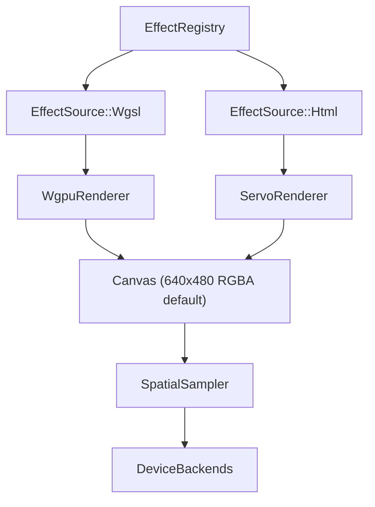
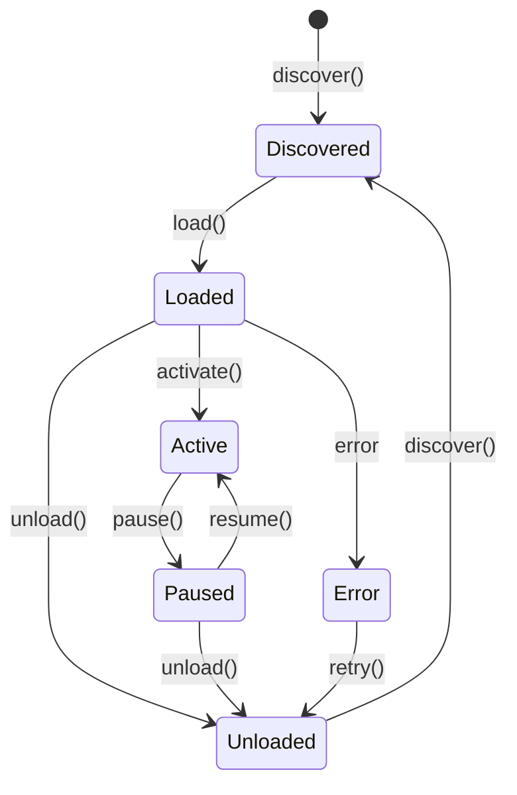

# Spec 07: Effect System

> Technical specification for the Hypercolor effect system -- the dual-path renderer, metadata model, control system, effect registry, and composition engine.

**Status:** Draft
**Covers:** `hypercolor-core/src/effect/`

---

## Table of Contents

1. [Overview](#1-overview)
2. [Effect Metadata](#2-effect-metadata)
3. [Control System](#3-control-system)
4. [Effect Source Model](#4-effect-source-model)
5. [Effect Registry](#5-effect-registry)
6. [Renderer Traits](#6-renderer-traits)
7. [HTML Meta Tag Parser](#7-html-meta-tag-parser)
8. [Standard Uniforms](#8-standard-uniforms)
9. [WGSL Effect File Format](#9-wgsl-effect-file-format)
10. [Effect Lifecycle](#10-effect-lifecycle)
11. [Effect Composition](#11-effect-composition)
12. [Error Handling](#12-error-handling)
13. [Open Questions](#13-open-questions)

---

## 1. Overview

The effect system renders visual content to an RGBA canvas whose dimensions are loaded from
`daemon.canvas_width` / `daemon.canvas_height` (defaults: 640x480). Everything downstream -- spatial sampling, device color output, UI preview -- consumes that canvas. Two rendering paths coexist:

| Path            | Renderer        | Input Format                | Use Case                            |
| --------------- | --------------- | --------------------------- | ----------------------------------- |
| **Fast path**   | `WgpuRenderer`  | `.wgsl` / `.glsl` shaders   | Native effects, maximum throughput  |
| **Compat path** | `ServoRenderer` | `.html` (Canvas 2D / WebGL) | Community HTML effects, Lightscript |

Both paths produce the same output: a `Canvas` struct containing an RGBA pixel buffer sized
from the configured canvas dimensions (~1.17 MB/frame at the 640x480 default). The effect engine
selects the appropriate renderer based on the `EffectSource` variant declared in metadata.



**Crate location:** `hypercolor-core/src/effect/`

```
effect/
├── mod.rs              # Re-exports, EffectEngine orchestrator
├── types.rs            # All types in this spec
├── registry.rs         # Discovery, loading, caching
├── engine.rs           # Dual-path render orchestrator
├── wgpu_renderer.rs    # Native shader pipeline
├── servo_renderer.rs   # HTML/Canvas effect runner
├── meta_parser.rs      # HTML <meta> tag parser
└── composition.rs      # Layer stack, blending
```

---

## 2. Effect Metadata

`EffectMetadata` is the universal descriptor for every effect regardless of source format. It is parsed from TOML sidecar files (WGSL/GLSL path) or extracted from HTML `<meta>` tags (Servo path).

### 2.1 Type Definition

```rust
use serde::{Deserialize, Serialize};

/// Unique identifier for an effect. Derived from the filesystem path
/// relative to the effects root, e.g. `"community/borealis"`.
pub type EffectId = String;

/// Universal effect descriptor.
///
/// Serialized as TOML for native effects (`aurora.toml`) and as JSON
/// for the REST API and WebSocket protocol.
#[derive(Debug, Clone, Serialize, Deserialize)]
pub struct EffectMetadata {
    /// Stable identifier. Unique within the registry.
    /// Derived from the effect's filesystem path.
    pub id: EffectId,

    /// Human-readable display name.
    pub name: String,

    /// Short description (max 200 chars). Shown in the effect browser.
    pub description: String,

    /// Author or publisher name.
    pub author: String,

    /// Semantic version string (e.g. "1.2.0").
    /// Used by the marketplace update system.
    #[serde(default = "default_version")]
    pub version: String,

    /// Taxonomy and discovery tags. Free-form, lowercase, hyphenated.
    /// Examples: "ambient", "audio-reactive", "generative", "cyberpunk".
    #[serde(default)]
    pub tags: Vec<String>,

    /// User-facing controls declared by the effect.
    #[serde(default)]
    pub controls: Vec<ControlDefinition>,

    /// Whether this effect reads audio data. When `true`, the engine
    /// injects audio uniforms/globals every frame. When `false`, the
    /// audio pipeline can skip injection for this effect.
    #[serde(default)]
    pub audio_reactive: bool,

    /// How this effect is rendered. Determines which renderer is used.
    pub source: EffectSource,

    /// Optional categories from the taxonomy enum.
    /// Used for primary classification in the effect browser.
    #[serde(default)]
    pub categories: Vec<EffectCategory>,
}

fn default_version() -> String {
    "0.1.0".to_string()
}

/// Primary classification categories from the effect taxonomy.
/// An effect can belong to multiple categories.
#[derive(Debug, Clone, Copy, PartialEq, Eq, Hash, Serialize, Deserialize)]
#[serde(rename_all = "snake_case")]
pub enum EffectCategory {
    Ambient,
    Reactive,
    Interactive,
    Informational,
    ScreenReactive,
    Generative,
    Artistic,
    Utility,
}
```

### 2.2 TOML Representation

Native effects (WGSL/GLSL) store metadata in a companion `.toml` file:

```toml
[effect]
name = "Aurora"
description = "Northern lights simulation with audio-reactive wave intensity"
author = "hyperb1iss"
version = "1.0.0"
tags = ["ambient", "audio-reactive", "nature"]
categories = ["ambient", "generative"]
audio_reactive = true

[[controls]]
id = "speed"
label = "Speed"
type = { number = { min = 1.0, max = 20.0, step = 0.5 } }
default = { number = 5.0 }
tooltip = "Animation speed"

[[controls]]
id = "color_shift"
label = "Color Shift"
type = { number = { min = 0.0, max = 360.0 } }
default = { number = 0.0 }
tooltip = "Rotate the color palette"
```

### 2.3 Derivation Rules

| Source Format     | Metadata Source              | `id` derivation         |
| ----------------- | ---------------------------- | ----------------------- |
| `.wgsl` + `.toml` | Parsed from `.toml` sidecar  | `"native/{stem}"`       |
| `.glsl` + `.toml` | Parsed from `.toml` sidecar  | `"native/{stem}"`       |
| `.html`           | Extracted from `<meta>` tags | `"{parent_dir}/{stem}"` |

The `id` field is **never** stored in metadata files -- it is computed at discovery time from the filesystem path. This prevents conflicts when effects are moved or renamed.

---

## 3. Control System

Controls are the user-facing parameters of an effect. The UI auto-generates widgets from control definitions. The engine injects values into the active renderer every frame.

### 3.1 ControlDefinition

```rust
/// A single user-facing parameter declared by an effect.
#[derive(Debug, Clone, Serialize, Deserialize)]
pub struct ControlDefinition {
    /// Stable identifier. Must match the shader uniform name (wgpu path)
    /// or the `window[id]` global name (Servo path).
    pub id: String,

    /// Human-readable label shown in the control panel.
    pub label: String,

    /// The kind of control and its constraints.
    pub control_type: ControlType,

    /// Initial value. Must be compatible with `control_type`.
    pub default: ControlValue,

    /// Optional help text shown on hover/focus.
    #[serde(default)]
    pub tooltip: Option<String>,
}
```

### 3.2 ControlType

Defines the widget kind and its domain constraints. Each variant maps to a specific UI component.

```rust
/// Control type with domain-specific constraints.
///
/// Serialized as an externally tagged enum in TOML/JSON:
/// `{ "number": { "min": 0.0, "max": 100.0, "step": 1.0 } }`
#[derive(Debug, Clone, Serialize, Deserialize)]
#[serde(rename_all = "snake_case")]
pub enum ControlType {
    /// Numeric slider with optional step quantization.
    /// UI: horizontal slider + numeric input field.
    Number {
        min: f32,
        max: f32,
        /// Step increment. `None` means continuous.
        #[serde(default)]
        step: Option<f32>,
    },

    /// On/off toggle.
    /// UI: toggle switch.
    Boolean,

    /// Selection from a fixed set of string values.
    /// UI: dropdown / combobox.
    Combobox {
        values: Vec<String>,
    },

    /// RGB color picker.
    /// UI: color swatch + picker dialog.
    /// Value stored as `[u8; 3]` (RGB) or hex string `"#rrggbb"`.
    Color,

    /// Hue-only selection on the 0-360 degree wheel.
    /// UI: circular hue wheel or horizontal hue strip.
    Hue {
        min: f32,
        max: f32,
    },

    /// Free-form text input.
    /// UI: single-line text field.
    TextField,
}
```

### 3.3 ControlValue

The runtime value of a control. Serialized for presets, profiles, and the API.

```rust
/// Runtime value of a control parameter.
///
/// The variant must be compatible with the corresponding `ControlType`:
///
/// | ControlType | Valid ControlValue |
/// |---|---|
/// | Number | Number(f32) |
/// | Boolean | Boolean(bool) |
/// | Combobox | String(String) |
/// | Color | Color([u8; 3]) |
/// | Hue | Number(f32) |
/// | TextField | String(String) |
#[derive(Debug, Clone, PartialEq, Serialize, Deserialize)]
#[serde(rename_all = "snake_case")]
pub enum ControlValue {
    /// Numeric value. Used by `Number` and `Hue` controls.
    Number(f32),

    /// Boolean value. Used by `Boolean` controls.
    Boolean(bool),

    /// String value. Used by `Combobox` and `TextField` controls.
    String(String),

    /// RGB color triplet. Used by `Color` controls.
    Color([u8; 3]),
}

impl ControlValue {
    /// Returns the value as an f32, or `None` if not numeric.
    pub fn as_f32(&self) -> Option<f32> {
        match self {
            Self::Number(v) => Some(*v),
            Self::Boolean(v) => Some(if *v { 1.0 } else { 0.0 }),
            _ => None,
        }
    }

    /// Returns the value as a JavaScript-compatible string for injection
    /// into Servo's `window[name]` globals.
    pub fn to_js_literal(&self) -> String {
        match self {
            Self::Number(v) => v.to_string(),
            Self::Boolean(v) => if *v { "1" } else { "0" }.to_string(),
            Self::String(v) => format!("\"{}\"", v.replace('\\', "\\\\").replace('"', "\\\"")),
            Self::Color([r, g, b]) => format!("\"#{:02x}{:02x}{:02x}\"", r, g, b),
        }
    }
}
```

### 3.4 Control Validation

When a `ControlValue` is set (by user interaction, preset load, or API call), the engine validates it against the corresponding `ControlType`:

```rust
impl ControlDefinition {
    /// Validate and clamp a value to this control's constraints.
    /// Returns the (possibly clamped) valid value, or an error if
    /// the value type is incompatible with the control type.
    pub fn validate(&self, value: &ControlValue) -> Result<ControlValue, ControlError> {
        match (&self.control_type, value) {
            (ControlType::Number { min, max, step }, ControlValue::Number(v)) => {
                let mut clamped = v.clamp(min, max);
                if let Some(s) = step {
                    clamped = (clamped / s).round() * s;
                }
                Ok(ControlValue::Number(clamped))
            }
            (ControlType::Boolean, ControlValue::Boolean(_)) => Ok(value.clone()),
            (ControlType::Combobox { values }, ControlValue::String(s)) => {
                if values.contains(s) {
                    Ok(value.clone())
                } else {
                    Err(ControlError::InvalidOption {
                        control: self.id.clone(),
                        value: s.clone(),
                        valid: values.clone(),
                    })
                }
            }
            (ControlType::Color, ControlValue::Color(_)) => Ok(value.clone()),
            (ControlType::Hue { min, max }, ControlValue::Number(v)) => {
                Ok(ControlValue::Number(v.clamp(min, max)))
            }
            (ControlType::TextField, ControlValue::String(_)) => Ok(value.clone()),
            _ => Err(ControlError::TypeMismatch {
                control: self.id.clone(),
                expected: format!("{:?}", self.control_type),
                got: format!("{:?}", value),
            }),
        }
    }
}

#[derive(Debug, thiserror::Error)]
pub enum ControlError {
    #[error("control `{control}`: type mismatch, expected {expected}, got {got}")]
    TypeMismatch {
        control: String,
        expected: String,
        got: String,
    },
    #[error("control `{control}`: invalid option `{value}`, valid: {valid:?}")]
    InvalidOption {
        control: String,
        value: String,
        valid: Vec<String>,
    },
}
```

### 3.5 Control Injection

The engine maintains a `HashMap<String, ControlValue>` for the active effect. On each frame:

**wgpu path:** Control values are written into the uniform buffer at offsets derived from the shader's struct layout. The engine builds a byte-level mapping at pipeline creation time by reflecting on the WGSL module (via `naga`).

**Servo path:** Control values are injected as JavaScript window globals:

```javascript
window["speed"] = 5.0;
window["palette"] = "Aurora";
window.update?.();
```

The `window.update()` call is optional -- some HTML effects use it to react to control changes, while others simply read globals on each frame.

---

## 4. Effect Source Model

The `EffectSource` enum determines which renderer handles an effect and where the source files live.

```rust
use std::path::PathBuf;

/// Identifies the rendering path and source location for an effect.
#[derive(Debug, Clone, Serialize, Deserialize)]
#[serde(rename_all = "snake_case")]
pub enum EffectSource {
    /// WGSL fragment or compute shader. Rendered by `WgpuRenderer`.
    ///
    /// The path points to a `.wgsl` file. A companion `.toml` metadata
    /// sidecar must exist at the same location with the same stem.
    Wgsl {
        /// Path to the `.wgsl` file, relative to the effects root.
        path: PathBuf,
    },

    /// HTML/Canvas/WebGL effect. Rendered by `ServoRenderer`.
    ///
    /// The path points to an `.html` file. Metadata is extracted from
    /// `<meta>` tags within the HTML `<head>`.
    Html {
        /// Path to the `.html` file, relative to the effects root.
        path: PathBuf,
    },

    /// GLSL fragment shader (Shadertoy-compatible). Transpiled to WGSL
    /// via naga at load time, then rendered by `WgpuRenderer`.
    ///
    /// The path points to a `.glsl` file. A companion `.toml` metadata
    /// sidecar must exist at the same location with the same stem.
    Glsl {
        /// Path to the `.glsl` file, relative to the effects root.
        path: PathBuf,
    },
}

impl EffectSource {
    /// Returns the path to the primary source file.
    pub fn path(&self) -> &PathBuf {
        match self {
            Self::Wgsl { path } | Self::Html { path } | Self::Glsl { path } => path,
        }
    }

    /// Returns which renderer should handle this effect.
    pub fn renderer_kind(&self) -> RendererKind {
        match self {
            Self::Wgsl { .. } | Self::Glsl { .. } => RendererKind::Wgpu,
            Self::Html { .. } => RendererKind::Servo,
        }
    }
}

#[derive(Debug, Clone, Copy, PartialEq, Eq)]
pub enum RendererKind {
    Wgpu,
    Servo,
}
```

### 4.1 Effects Directory Layout

```
effects/
├── native/                 # WGSL/GLSL shaders (wgpu path)
│   ├── aurora.wgsl
│   ├── aurora.toml
│   ├── plasma-ocean.wgsl
│   ├── plasma-ocean.toml
│   └── lib/                # Shared shader libraries (not effects)
│       ├── noise.wgsl
│       ├── color.wgsl
│       ├── audio.wgsl
│       └── math.wgsl
├── builtin/                # Stock HTML effects shipped with Hypercolor
│   ├── rainbow.html
│   ├── solid-color.html
│   └── spectrum.html
├── community/              # Downloaded from the effect marketplace
│   ├── borealis.html
│   ├── fire.html
│   └── ...
└── custom/                 # User-created effects
    └── my-effect/
        ├── my-effect.html
        └── my-effect.png
```

The registry scans these directories at startup and watches them for changes.

---

## 5. Effect Registry

The `EffectRegistry` is the centralized index of all known effects. It handles discovery, loading, metadata caching, and filesystem watching.

### 5.1 Interface

```rust
use std::path::Path;
use std::collections::HashMap;
use tokio::sync::RwLock;

/// Central index of all discovered effects.
///
/// Thread-safe: wrapped in `Arc<RwLock<_>>` and shared across the
/// render loop, API handlers, and filesystem watcher.
pub struct EffectRegistry {
    /// All known effects, indexed by id.
    effects: HashMap<EffectId, EffectEntry>,

    /// Root directories to scan for effects.
    search_paths: Vec<PathBuf>,

    /// Filesystem watcher handle (notify crate).
    watcher: Option<notify::RecommendedWatcher>,
}

/// An effect entry in the registry.
#[derive(Debug, Clone)]
pub struct EffectEntry {
    /// Parsed metadata.
    pub metadata: EffectMetadata,

    /// Absolute path to the primary source file.
    pub source_path: PathBuf,

    /// Filesystem modification time of the source file.
    /// Used for cache invalidation.
    pub modified: std::time::SystemTime,

    /// Current lifecycle state.
    pub state: EffectState,
}
```

### 5.2 Discovery

On startup (and on filesystem change events), the registry scans all search paths:

```rust
impl EffectRegistry {
    /// Scan all search paths and discover effects.
    ///
    /// Discovery rules:
    /// - `.html` files -> EffectSource::Html (parse <meta> tags for metadata)
    /// - `.wgsl` files with a companion `.toml` -> EffectSource::Wgsl
    /// - `.glsl` files with a companion `.toml` -> EffectSource::Glsl
    /// - Files in `lib/` subdirectories are skipped (shared libraries, not effects)
    /// - Files starting with `_` or `.` are skipped
    pub async fn discover(&mut self) -> Result<Vec<EffectId>> {
        let mut discovered = Vec::new();

        for search_path in &self.search_paths {
            for entry in walkdir::WalkDir::new(search_path)
                .max_depth(3)
                .into_iter()
                .filter_entry(|e| !is_hidden_or_lib(e))
            {
                let entry = entry?;
                if !entry.file_type().is_file() {
                    continue;
                }

                if let Some(effect) = self.try_parse_effect(entry.path()).await? {
                    let id = effect.metadata.id.clone();
                    self.effects.insert(id.clone(), effect);
                    discovered.push(id);
                }
            }
        }

        Ok(discovered)
    }

    /// Attempt to parse a file as an effect.
    /// Returns `None` if the file is not a recognized effect format.
    async fn try_parse_effect(&self, path: &Path) -> Result<Option<EffectEntry>> {
        let ext = path.extension().and_then(|e| e.to_str());

        match ext {
            Some("html") => {
                let html = tokio::fs::read_to_string(path).await?;
                let metadata = crate::effect::meta_parser::parse_html_meta(&html, path)?;
                Ok(Some(EffectEntry {
                    metadata,
                    source_path: path.to_path_buf(),
                    modified: path.metadata()?.modified()?,
                    state: EffectState::Discovered,
                }))
            }
            Some("wgsl") => {
                let toml_path = path.with_extension("toml");
                if !toml_path.exists() {
                    return Ok(None); // No sidecar = not an effect (likely a library)
                }
                let toml_str = tokio::fs::read_to_string(&toml_path).await?;
                let metadata = parse_wgsl_toml(&toml_str, path)?;
                Ok(Some(EffectEntry {
                    metadata,
                    source_path: path.to_path_buf(),
                    modified: path.metadata()?.modified()?,
                    state: EffectState::Discovered,
                }))
            }
            Some("glsl") => {
                let toml_path = path.with_extension("toml");
                if !toml_path.exists() {
                    return Ok(None);
                }
                let toml_str = tokio::fs::read_to_string(&toml_path).await?;
                let metadata = parse_glsl_toml(&toml_str, path)?;
                Ok(Some(EffectEntry {
                    metadata,
                    source_path: path.to_path_buf(),
                    modified: path.metadata()?.modified()?,
                    state: EffectState::Discovered,
                }))
            }
            _ => Ok(None),
        }
    }
}
```

### 5.3 Filesystem Watching

The registry uses the `notify` crate to watch the effects directories for changes. This powers hot-reload during development and runtime effect installation.

```rust
impl EffectRegistry {
    /// Start watching all search paths for filesystem changes.
    pub fn start_watching(&mut self, tx: tokio::sync::mpsc::Sender<RegistryEvent>) -> Result<()> {
        use notify::{RecommendedWatcher, RecursiveMode, Watcher};

        let mut watcher = RecommendedWatcher::new(
            move |event: notify::Result<notify::Event>| {
                if let Ok(event) = event {
                    let _ = tx.blocking_send(RegistryEvent::FsChange(event));
                }
            },
            notify::Config::default()
                .with_poll_interval(std::time::Duration::from_secs(2)),
        )?;

        for path in &self.search_paths {
            watcher.watch(path, RecursiveMode::Recursive)?;
        }

        self.watcher = Some(watcher);
        Ok(())
    }
}

/// Events emitted by the registry.
#[derive(Debug)]
pub enum RegistryEvent {
    /// A filesystem change was detected.
    FsChange(notify::Event),
    /// A new effect was discovered.
    EffectDiscovered(EffectId),
    /// An existing effect's source was modified (triggers hot-reload).
    EffectModified(EffectId),
    /// An effect was removed from the filesystem.
    EffectRemoved(EffectId),
}
```

### 5.4 Metadata Caching

Parsing HTML `<meta>` tags and TOML files on every startup is fast (sub-millisecond per file), but for large community libraries (200+ effects), the registry maintains an on-disk cache:

- **Location:** `~/.cache/hypercolor/effect-registry.json`
- **Format:** JSON array of `EffectEntry` (minus `state`, which is always `Discovered` on load)
- **Invalidation:** Cache entry is stale if the file's `modified` timestamp differs from the cached value
- **Cold start:** Full re-scan of all search paths, rebuild cache
- **Warm start:** Load cache, validate timestamps, re-parse only stale entries

---

## 6. Renderer Traits

Both renderers conform to a shared interface. The `EffectEngine` orchestrator dispatches to the correct renderer based on the active effect's `EffectSource`.

### 6.1 Canvas

The universal output type for all renderers.

```rust
/// RGBA pixel buffer. The fundamental output of the effect system.
///
/// Dimensions come from `daemon.canvas_width` / `daemon.canvas_height`
/// (default 640x480, ~1.17 MB). The historical LightScript grid of
/// 320x200 remains the canonical SDK target — effects should read
/// `canvas.width`/`height` every frame rather than hardcoding.
#[derive(Debug, Clone)]
pub struct Canvas {
    pub width: u32,
    pub height: u32,
    /// RGBA pixels in row-major order. Length = width * height * 4.
    pub pixels: Vec<u8>,
}

impl Canvas {
    pub const DEFAULT_WIDTH: u32 = 320;
    pub const DEFAULT_HEIGHT: u32 = 200;

    pub fn new(width: u32, height: u32) -> Self {
        Self {
            width,
            height,
            pixels: vec![0; (width * height * 4) as usize],
        }
    }

    /// Bilinear-interpolated color sample at normalized coordinates (0.0-1.0).
    pub fn sample_bilinear(&self, nx: f32, ny: f32) -> [u8; 3] {
        let fx = nx * (self.width - 1) as f32;
        let fy = ny * (self.height - 1) as f32;
        let x0 = fx.floor() as u32;
        let y0 = fy.floor() as u32;
        let x1 = (x0 + 1).min(self.width - 1);
        let y1 = (y0 + 1).min(self.height - 1);
        let dx = fx - x0 as f32;
        let dy = fy - y0 as f32;

        let sample = |x: u32, y: u32| -> [f32; 3] {
            let i = ((y * self.width + x) * 4) as usize;
            [
                self.pixels[i] as f32,
                self.pixels[i + 1] as f32,
                self.pixels[i + 2] as f32,
            ]
        };

        let c00 = sample(x0, y0);
        let c10 = sample(x1, y0);
        let c01 = sample(x0, y1);
        let c11 = sample(x1, y1);

        let lerp = |a: f32, b: f32, t: f32| a + (b - a) * t;
        [
            lerp(lerp(c00[0], c10[0], dx), lerp(c01[0], c11[0], dx), dy) as u8,
            lerp(lerp(c00[1], c10[1], dx), lerp(c01[1], c11[1], dx), dy) as u8,
            lerp(lerp(c00[2], c10[2], dx), lerp(c01[2], c11[2], dx), dy) as u8,
        ]
    }
}
```

### 6.2 Uniforms

The shared input data passed to both renderers each frame.

```rust
/// Per-frame data passed to the active renderer.
#[derive(Debug, Clone, Default)]
pub struct RenderUniforms {
    /// Elapsed time in seconds since effect activation.
    pub time: f32,

    /// Canvas resolution (always 320.0, 200.0 unless overridden).
    pub resolution: [f32; 2],

    /// Mouse position in normalized coordinates (0.0-1.0).
    /// Rarely used for LED effects; included for Shadertoy compat.
    pub mouse: [f32; 2],

    /// Frame counter since effect activation.
    pub frame: u32,

    /// Current audio analysis data. `None` when audio is unavailable
    /// or the effect declares `audio_reactive = false`.
    pub audio: Option<AudioUniforms>,

    /// Current control values. Keys are control ids.
    pub controls: HashMap<String, ControlValue>,
}

/// Audio analysis data passed as uniforms.
///
/// This is the subset of `AudioData` that is injected into renderers.
/// The full `AudioData` struct lives in `hypercolor-core::input::audio`.
#[derive(Debug, Clone, Default)]
pub struct AudioUniforms {
    pub level: f32,
    pub bass: f32,
    pub mid: f32,
    pub treble: f32,
    pub beat: f32,          // 1.0 on beat frame, 0.0 otherwise
    pub beat_pulse: f32,    // Decaying pulse: 1.0 -> 0.0
    pub beat_phase: f32,    // 0.0-1.0 within current beat period
    pub spectral_flux: f32,
    pub harmonic_hue: f32,
    pub chord_mood: f32,    // -1.0 (minor) to 1.0 (major)
    pub density: f32,
    pub brightness: f32,

    /// 200-bin log-scaled frequency magnitudes. Uploaded as a 200x1
    /// texture on the wgpu path, or as `window.engine.audio.freq`
    /// (Uint8Array) on the Servo path.
    pub spectrum: [f32; 200],

    /// 24 mel-scaled frequency bands.
    pub mel_bands: [f32; 24],

    /// 12-bin chromagram (C, C#, D, ..., B).
    pub chromagram: [f32; 12],
}
```

### 6.3 WgpuRenderer

Renders WGSL and GLSL (transpiled) shaders via wgpu. Headless GPU execution, pixel readback to CPU.

```rust
/// Native GPU shader renderer.
///
/// Manages a wgpu device, render pipeline, uniform buffer, and
/// staging buffer for pixel readback. One instance per active
/// wgpu-rendered effect.
pub struct WgpuRenderer {
    device: wgpu::Device,
    queue: wgpu::Queue,
    pipeline: wgpu::RenderPipeline,
    uniform_buffer: wgpu::Buffer,
    /// Byte-level mapping from control ids to uniform buffer offsets.
    /// Built at pipeline creation by reflecting on the naga module.
    uniform_layout: UniformLayout,
    /// MAP_READ buffer for GPU -> CPU pixel readback.
    staging_buffer: wgpu::Buffer,
    /// Render target texture (320x200 RGBA8).
    output_texture: wgpu::Texture,
    /// Optional audio spectrum texture (200x1 R32Float).
    spectrum_texture: Option<wgpu::Texture>,
    /// Optional persistent state buffer for compute shaders.
    state_buffer: Option<wgpu::Buffer>,
}

impl WgpuRenderer {
    /// Create a new renderer and compile the shader pipeline.
    ///
    /// For GLSL effects, the source is first transpiled to WGSL via
    /// naga (GLSL -> SPIR-V -> WGSL).
    ///
    /// Returns an error if:
    /// - The shader fails validation (naga)
    /// - The shader fails compilation (wgpu)
    /// - The uniform struct cannot be reflected
    /// - No suitable GPU adapter is found
    pub async fn init(
        source: &EffectSource,
        metadata: &EffectMetadata,
    ) -> Result<Self, RendererError> {
        // 1. Request adapter + device (prefer low-power for LED rendering)
        // 2. Read shader source, resolve #include directives
        // 3. For GLSL: transpile via naga (glsl -> spir-v -> wgsl)
        // 4. Create shader module (wgpu validates via naga)
        // 5. Reflect uniform struct to build UniformLayout
        // 6. Create render pipeline (vertex = fullscreen quad, fragment = effect)
        // 7. Allocate uniform buffer, staging buffer, output texture
        // 8. If audio_reactive: create 200x1 spectrum texture
        todo!()
    }

    /// Render one frame and return the pixel buffer.
    ///
    /// 1. Write current time, audio, and control values into uniform buffer
    /// 2. If audio_reactive: upload spectrum data to spectrum texture
    /// 3. Execute render pass (or compute dispatch for compute shaders)
    /// 4. Copy output texture -> staging buffer
    /// 5. Map staging buffer, copy pixels to Canvas
    pub async fn render(&mut self, uniforms: &RenderUniforms) -> Result<Canvas, RendererError> {
        // Update uniform buffer
        self.write_uniforms(uniforms);

        // Create command encoder
        let mut encoder = self.device.create_command_encoder(
            &wgpu::CommandEncoderDescriptor { label: Some("effect_render") }
        );

        // Render pass: fullscreen quad with effect fragment shader
        {
            let view = self.output_texture.create_view(&Default::default());
            let mut pass = encoder.begin_render_pass(&wgpu::RenderPassDescriptor {
                label: Some("effect_pass"),
                color_attachments: &[Some(wgpu::RenderPassColorAttachment {
                    view: &view,
                    resolve_target: None,
                    ops: wgpu::Operations {
                        load: wgpu::LoadOp::Clear(wgpu::Color::BLACK),
                        store: wgpu::StoreOp::Store,
                    },
                })],
                ..Default::default()
            });
            pass.set_pipeline(&self.pipeline);
            pass.set_bind_group(0, &self.bind_group, &[]);
            pass.draw(0..3, 0..1); // Fullscreen triangle
        }

        // Copy output texture -> staging buffer
        encoder.copy_texture_to_buffer(
            self.output_texture.as_image_copy(),
            wgpu::ImageCopyBuffer {
                buffer: &self.staging_buffer,
                layout: wgpu::ImageDataLayout {
                    offset: 0,
                    bytes_per_row: Some(320 * 4),
                    rows_per_image: Some(200),
                },
            },
            wgpu::Extent3d { width: 320, height: 200, depth_or_array_layers: 1 },
        );

        self.queue.submit(Some(encoder.finish()));

        // Map staging buffer and read pixels
        let buffer_slice = self.staging_buffer.slice(..);
        let (tx, rx) = tokio::sync::oneshot::channel();
        buffer_slice.map_async(wgpu::MapMode::Read, move |result| {
            let _ = tx.send(result);
        });
        self.device.poll(wgpu::Maintain::Wait);
        rx.await??;

        let data = buffer_slice.get_mapped_range();
        let canvas = Canvas {
            width: 320,
            height: 200,
            pixels: data.to_vec(),
        };
        drop(data);
        self.staging_buffer.unmap();

        Ok(canvas)
    }

    /// Update a single control value. The value is written to the
    /// uniform buffer at the pre-computed offset.
    pub fn update_control(&mut self, id: &str, value: &ControlValue) {
        if let Some(offset) = self.uniform_layout.control_offset(id) {
            let bytes = value_to_bytes(value);
            self.queue.write_buffer(&self.uniform_buffer, offset, &bytes);
        }
    }

    /// Release GPU resources.
    pub fn destroy(self) {
        // wgpu resources are dropped automatically.
        // Explicit drop ensures deterministic ordering if needed.
        drop(self.pipeline);
        drop(self.output_texture);
        drop(self.staging_buffer);
        drop(self.uniform_buffer);
    }
}
```

### 6.4 ServoRenderer

Renders HTML/Canvas/WebGL effects via embedded Servo. Headless, no window or display required.

```rust
use std::rc::Rc;

/// HTML/Canvas/WebGL renderer using embedded Servo.
///
/// Runs community HTML effects and Lightscript effects unmodified.
/// Uses `SoftwareRenderingContext` for headless rendering (no GPU
/// required, though Servo can optionally use GPU compositing).
pub struct ServoRenderer {
    servo: Servo,
    webview: WebView,
    ctx: Rc<SoftwareRenderingContext>,
    /// Cached control values for re-injection after page reload.
    controls: HashMap<String, ControlValue>,
}

impl ServoRenderer {
    /// Initialize Servo and load the effect HTML.
    ///
    /// Steps:
    /// 1. Create SoftwareRenderingContext at 320x200
    /// 2. Initialize Servo with MinimalEmbedder (no window chrome)
    /// 3. Create WebView targeting the effect HTML file
    /// 4. Wait for initial page load
    /// 5. Inject the Lightscript compatibility shim
    pub fn init(html_path: &Path) -> Result<Self, RendererError> {
        let ctx = SoftwareRenderingContext::new(
            PhysicalSize::new(320, 200)
        )?;

        let servo = Servo::new(
            Default::default(),
            Default::default(),
            Rc::new(ctx.clone()),
            Box::new(MinimalEmbedder),
            Box::new(MinimalWindow::new(320, 200)),
            Default::default(),
        );

        let url = format!("file://{}", html_path.display());
        let webview = servo.new_webview(url.parse()?);

        Ok(Self {
            servo,
            webview,
            ctx,
            controls: HashMap::new(),
        })
    }

    /// Render one frame by spinning the Servo event loop and
    /// reading back the composited pixel buffer.
    pub fn render(&mut self) -> Result<Canvas, RendererError> {
        self.servo.spin_event_loop();
        self.webview.paint();

        let image = self.ctx.read_to_image(
            Box2D::from_size(Size2D::new(320, 200))
        ).ok_or(RendererError::ReadbackFailed)?;

        Ok(Canvas {
            width: 320,
            height: 200,
            pixels: image.into_raw(),
        })
    }

    /// Inject a control value as a JavaScript window global.
    ///
    /// Sets `window[name] = value` and calls `window.update?.()` if
    /// the effect defines an update callback.
    pub fn inject_control(&mut self, name: &str, value: &ControlValue) {
        self.controls.insert(name.to_string(), value.clone());

        let js = format!(
            "window['{}'] = {}; window.update?.();",
            name,
            value.to_js_literal()
        );
        self.webview.evaluate_javascript(&js, |_| {});
    }

    /// Inject audio data into `window.engine.audio`.
    ///
    /// Updates all fields of the Lightscript audio API surface:
    /// level, bass, mid, treble, freq[200], beat, beatPulse,
    /// melBands[24], chromagram[12], spectralFlux, harmonicHue,
    /// chordMood, and all derived fields.
    pub fn inject_audio(&mut self, audio: &AudioUniforms) {
        // Build the audio object as a JavaScript expression.
        // The freq array is a Uint8Array (0-255 scaled) for
        // LightScript compatibility.
        let freq_array: Vec<String> = audio.spectrum
            .iter()
            .map(|v| ((v * 255.0).clamp(0.0, 255.0) as u8).to_string())
            .collect();

        let mel_array: Vec<String> = audio.mel_bands
            .iter()
            .map(|v| format!("{:.4}", v))
            .collect();

        let chroma_array: Vec<String> = audio.chromagram
            .iter()
            .map(|v| format!("{:.4}", v))
            .collect();

        let js = format!(
            r#"
            if (!window.engine) window.engine = {{}};
            window.engine.audio = {{
                level: {level},
                bass: {bass},
                mid: {mid},
                treble: {treble},
                freq: new Uint8Array([{freq}]),
                beat: {beat},
                beatPulse: {beat_pulse},
                beatPhase: {beat_phase},
                onset: {onset},
                onsetPulse: {onset_pulse},
                melBands: new Float32Array([{mel}]),
                melBandsNormalized: new Float32Array([{mel}]),
                chromagram: new Float32Array([{chroma}]),
                dominantPitch: 0,
                dominantPitchConfidence: 0.0,
                spectralFlux: {spectral_flux},
                spectralFluxBands: new Float32Array([0, 0, 0]),
                brightness: {brightness},
                spread: 0.0,
                rolloff: 0.0,
                harmonicHue: {harmonic_hue},
                chordMood: {chord_mood},
                density: {density},
                width: 0.0,
            }};
            "#,
            level = audio.level,
            bass = audio.bass,
            mid = audio.mid,
            treble = audio.treble,
            freq = freq_array.join(","),
            beat = if audio.beat > 0.5 { "true" } else { "false" },
            beat_pulse = audio.beat_pulse,
            beat_phase = audio.beat_phase,
            onset = if audio.beat > 0.5 { "true" } else { "false" },
            onset_pulse = audio.beat_pulse,
            mel = mel_array.join(","),
            chroma = chroma_array.join(","),
            spectral_flux = audio.spectral_flux,
            brightness = audio.brightness,
            harmonic_hue = audio.harmonic_hue,
            chord_mood = audio.chord_mood,
            density = audio.density,
        );

        self.webview.evaluate_javascript(&js, |_| {});
    }

    /// Reload the effect page. Used for hot-reload during development.
    /// Re-injects all cached control values after reload.
    pub fn reload(&mut self) {
        self.webview.reload();
        // Re-inject controls after reload settles
        for (name, value) in &self.controls.clone() {
            self.inject_control(name, value);
        }
    }

    /// Release Servo resources.
    pub fn destroy(self) {
        drop(self.webview);
        drop(self.servo);
    }
}
```

### 6.5 RendererError

```rust
#[derive(Debug, thiserror::Error)]
pub enum RendererError {
    #[error("shader compilation failed: {message}")]
    ShaderCompilation { message: String, source_line: Option<u32> },

    #[error("no suitable GPU adapter found")]
    NoAdapter,

    #[error("GPU readback failed")]
    ReadbackFailed,

    #[error("servo initialization failed: {0}")]
    ServoInit(String),

    #[error("effect load failed: {0}")]
    LoadFailed(String),

    #[error("GLSL transpilation failed: {0}")]
    GlslTranspile(String),

    #[error(transparent)]
    Io(#[from] std::io::Error),

    #[error(transparent)]
    Wgpu(#[from] wgpu::Error),
}
```

---

## 7. HTML Meta Tag Parser

Parses `<meta>` tags from HTML effect files into `ControlDefinition` values. This is the compatibility layer that allows community HTML effects to run unmodified.

### 7.1 Supported Tags

The parser recognizes these `<meta>` tag patterns in the HTML `<head>`:

| Tag                                                                             | Maps To                                           |
| ------------------------------------------------------------------------------- | ------------------------------------------------- |
| `<title>text</title>`                                                           | `EffectMetadata.name`                             |
| `<meta description="text" />`                                                   | `EffectMetadata.description`                      |
| `<meta publisher="text" />`                                                     | `EffectMetadata.author`                           |
| `<meta property="categories" content="a,b" />`                                  | `EffectMetadata.tags`                             |
| `<meta property="id" label="L" type="number" min="0" max="100" default="50" />` | `ControlDefinition` with `ControlType::Number`    |
| `<meta property="id" label="L" type="boolean" default="0" />`                   | `ControlDefinition` with `ControlType::Boolean`   |
| `<meta property="id" label="L" type="combobox" values="A,B,C" default="A" />`   | `ControlDefinition` with `ControlType::Combobox`  |
| `<meta property="id" label="L" type="color" default="#ff0000" />`               | `ControlDefinition` with `ControlType::Color`     |
| `<meta property="id" label="L" type="hue" min="0" max="360" default="180" />`   | `ControlDefinition` with `ControlType::Hue`       |
| `<meta property="id" label="L" type="textfield" default="" />`                  | `ControlDefinition` with `ControlType::TextField` |

### 7.2 Parser Implementation

```rust
use std::path::Path;

/// Parse HTML <meta> tags from an effect file into EffectMetadata.
///
/// This is a lenient parser -- it extracts what it can and ignores
/// malformed tags. Effects in the wild have inconsistent formatting
/// (single quotes, missing attributes, unusual whitespace).
///
/// The parser does NOT use a full HTML parser (too heavyweight).
/// Instead, it uses regex-based extraction on the <head> section.
pub fn parse_html_meta(html: &str, path: &Path) -> Result<EffectMetadata> {
    let stem = path.file_stem()
        .and_then(|s| s.to_str())
        .unwrap_or("unknown");

    let parent = path.parent()
        .and_then(|p| p.file_name())
        .and_then(|s| s.to_str())
        .unwrap_or("custom");

    let id = format!("{}/{}", parent, stem);

    // Extract <title>
    let name = extract_title(html).unwrap_or_else(|| stem.to_string());

    // Extract <meta description="...">
    let description = extract_meta_attr(html, "description").unwrap_or_default();

    // Extract <meta publisher="...">
    let author = extract_meta_attr(html, "publisher").unwrap_or_default();

    // Extract control definitions from <meta property="..." ...> tags
    let controls = extract_controls(html);

    // Detect audio reactivity by scanning for audio API usage
    let audio_reactive = html.contains("engine.audio")
        || html.contains("getAudioData")
        || html.contains("iAudioLevel")
        || html.contains("iAudioBass");

    Ok(EffectMetadata {
        id,
        name,
        description,
        author,
        version: "0.1.0".to_string(),
        tags: vec![],
        controls,
        audio_reactive,
        source: EffectSource::Html { path: path.to_path_buf() },
        categories: vec![],
    })
}

/// Extract control definitions from <meta property="..." ...> tags.
///
/// Handles both self-closing (`/>`) and unclosed (`>`) meta tags.
/// Attribute order does not matter. Missing optional attributes
/// (tooltip, step) produce None/default values.
fn extract_controls(html: &str) -> Vec<ControlDefinition> {
    // Match <meta ... property="..." ... > tags
    // The regex captures the full tag content between < and >
    let meta_re = regex::Regex::new(
        r#"<meta\s+([^>]*property\s*=\s*"[^"]+?"[^>]*)/?\s*>"#
    ).unwrap();

    let attr_re = regex::Regex::new(
        r#"(\w+)\s*=\s*"([^"]*?)""#
    ).unwrap();

    meta_re.captures_iter(html).filter_map(|cap| {
        let tag_content = cap.get(1)?.as_str();
        let attrs: HashMap<&str, &str> = attr_re.captures_iter(tag_content)
            .filter_map(|a| Some((a.get(1)?.as_str(), a.get(2)?.as_str())))
            .collect();

        let property = attrs.get("property")?;
        let label = attrs.get("label").unwrap_or(property);
        let type_str = attrs.get("type")?;
        let default_str = attrs.get("default").unwrap_or(&"");
        let tooltip = attrs.get("tooltip").map(|s| s.to_string());

        let (control_type, default) = match *type_str {
            "number" => {
                let min = attrs.get("min").and_then(|s| s.parse().ok()).unwrap_or(0.0);
                let max = attrs.get("max").and_then(|s| s.parse().ok()).unwrap_or(100.0);
                let step = attrs.get("step").and_then(|s| s.parse().ok());
                let val: f32 = default_str.parse().unwrap_or(min);
                (ControlType::Number { min, max, step }, ControlValue::Number(val))
            }
            "boolean" => {
                let val = *default_str == "1" || *default_str == "true";
                (ControlType::Boolean, ControlValue::Boolean(val))
            }
            "combobox" => {
                let values: Vec<String> = attrs.get("values")
                    .unwrap_or(&"")
                    .split(',')
                    .map(|s| s.trim().to_string())
                    .filter(|s| !s.is_empty())
                    .collect();
                let val = default_str.to_string();
                (ControlType::Combobox { values }, ControlValue::String(val))
            }
            "color" => {
                let rgb = parse_hex_color(default_str).unwrap_or([0, 0, 0]);
                (ControlType::Color, ControlValue::Color(rgb))
            }
            "hue" => {
                let min = attrs.get("min").and_then(|s| s.parse().ok()).unwrap_or(0.0);
                let max = attrs.get("max").and_then(|s| s.parse().ok()).unwrap_or(360.0);
                let val: f32 = default_str.parse().unwrap_or(0.0);
                (ControlType::Hue { min, max }, ControlValue::Number(val))
            }
            "textfield" => {
                (ControlType::TextField, ControlValue::String(default_str.to_string()))
            }
            _ => return None,
        };

        Some(ControlDefinition {
            id: property.to_string(),
            label: label.to_string(),
            control_type,
            default,
            tooltip,
        })
    }).collect()
}

/// Parse a hex color string ("#rrggbb" or "rrggbb") into [r, g, b].
fn parse_hex_color(s: &str) -> Option<[u8; 3]> {
    let hex = s.strip_prefix('#').unwrap_or(s);
    if hex.len() != 6 {
        return None;
    }
    Some([
        u8::from_str_radix(&hex[0..2], 16).ok()?,
        u8::from_str_radix(&hex[2..4], 16).ok()?,
        u8::from_str_radix(&hex[4..6], 16).ok()?,
    ])
}
```

### 7.3 Edge Cases from Real Effects

The parser must handle these patterns found in the 100+ community effects:

| Pattern                         | Example                                         | Handling                                         |
| ------------------------------- | ----------------------------------------------- | ------------------------------------------------ |
| Missing `type` attribute        | `<meta property="x" label="X" />`               | Skip (not a control)                             |
| `type="color"` with `min`/`max` | `<meta ... type="color" min="0" max="360" ...>` | Ignore `min`/`max` (artifact from older engines) |
| Multi-line meta tags            | See `fire.html`                                 | Regex matches across whitespace                  |
| No `label` attribute            | `<meta property="x" type="number" ...>`         | Use `property` value as label                    |
| `default="0"` for boolean       | Common in community effects                     | Parse as `false`                                 |
| `default="1"` for boolean       | Common in community effects                     | Parse as `true`                                  |
| Combobox with spaces            | `values="Color Shift,Sparkle"`                  | Split on `,`, trim whitespace                    |
| Duplicate `property` ids        | Rare, but exists                                | Last definition wins                             |

---

## 8. Standard Uniforms

Both renderer paths provide a standard set of uniforms/globals that effects can depend on. These are injected automatically every frame.

### 8.1 WGSL Standard Uniform Block

Every WGSL effect declares this struct (or a subset of it) at `@group(0) @binding(0)`:

```wgsl
struct Uniforms {
    // ---- Standard (always available) ----
    time: f32,              // Elapsed seconds since effect activation
    resolution: vec2<f32>,  // Canvas size: vec2(320.0, 200.0)
    mouse: vec2<f32>,       // Normalized mouse position (0-1), rarely used

    // ---- Audio (available when audio_reactive = true) ----
    audio_level: f32,       // Overall RMS level, 0.0-1.0
    audio_bass: f32,        // Bass band energy (20-250 Hz), 0.0-1.0
    audio_mid: f32,         // Mid band energy (250-4000 Hz), 0.0-1.0
    audio_treble: f32,      // Treble band energy (4-20kHz), 0.0-1.0
    audio_beat: f32,        // 1.0 on beat frame, 0.0 otherwise
    audio_beat_pulse: f32,  // Decaying pulse (1.0 -> 0.0)
    audio_beat_phase: f32,  // Phase within beat period (0.0-1.0)
    audio_spectral_flux: f32,
    audio_harmonic_hue: f32,
    audio_chord_mood: f32,  // -1.0 (minor) to 1.0 (major)

    // ---- User controls (defined per effect) ----
    // e.g. speed: f32, intensity: f32, color_shift: f32
}
```

Additional texture bindings for audio data:

```wgsl
@group(0) @binding(1) var audio_spectrum: texture_2d<f32>;   // 200x1 FFT magnitudes
@group(0) @binding(2) var spectrum_sampler: sampler;
```

### 8.2 WebGL/GLSL Standard Uniforms (Servo Path)

For Three.js and raw WebGL effects running in Servo. These match the Shadertoy/LightScript convention:

| Uniform           | GLSL Type   | Description                        |
| ----------------- | ----------- | ---------------------------------- |
| `iTime`           | `float`     | Elapsed seconds since effect start |
| `iResolution`     | `vec2`      | Canvas size (320.0, 200.0)         |
| `iMouse`          | `vec2`      | Mouse position (normalized 0-1)    |
| `iFrame`          | `int`       | Frame counter                      |
| `iAudioLevel`     | `float`     | Overall audio level (0-1)          |
| `iAudioBass`      | `float`     | Bass band energy (0-1)             |
| `iAudioMid`       | `float`     | Mid band energy (0-1)              |
| `iAudioTreble`    | `float`     | Treble band energy (0-1)           |
| `iAudioSpectrum`  | `sampler2D` | 200-bin FFT as 200x1 texture       |
| `iAudioBeat`      | `float`     | Beat pulse (0-1, spikes on beat)   |
| `iAudioBeatPhase` | `float`     | Phase within current beat (0-1)    |

These are injected by the Lightscript SDK's `WebGLEffect` base class. Raw HTML effects access audio via `window.engine.audio` instead.

### 8.3 Servo Window Globals (Canvas 2D Path)

For raw HTML/Canvas 2D effects (the LightScript-compatible path):

```javascript
// Control values -- one global per <meta property="..."> tag
window["speed"] = 50;
window["palette"] = "Aurora";
window["frontColor"] = "#ff00ff";

// Audio data -- injected every frame when audio_reactive = true
window.engine.audio = {
  level: 0.0, // Overall RMS level
  bass: 0.0, // Bass band (0-1)
  mid: 0.0, // Mid band (0-1)
  treble: 0.0, // Treble band (0-1)
  freq: Uint8Array(200), // Log-scaled FFT (0-255)
  beat: false, // True on beat onset
  beatPulse: 0.0, // Decaying beat pulse
  beatPhase: 0.0, // Phase within beat
  // ... full Lightscript audio API surface
};

// Optional callback -- called when controls change
window.update = function () {
  /* ... */
};
```

---

## 9. WGSL Effect File Format

Native effects use a two-file format: a `.wgsl` shader and a `.toml` metadata sidecar.

### 9.1 File Structure

```
effects/native/my-effect/
├── my-effect.wgsl       # Shader source (required)
├── my-effect.toml       # Metadata + controls (required)
└── my-effect.png        # Preview thumbnail (optional, 320x200)
```

Or flat (no subdirectory):

```
effects/native/
├── aurora.wgsl
├── aurora.toml
├── plasma.wgsl
└── plasma.toml
```

Both layouts are valid. The registry discovers effects by finding `.wgsl` files with matching `.toml` sidecars.

### 9.2 TOML Sidecar Format

```toml
[effect]
name = "Aurora"
description = "Northern lights with audio-reactive wave intensity"
author = "hyperb1iss"
version = "1.0.0"
tags = ["ambient", "audio-reactive", "nature"]
categories = ["ambient", "generative"]
audio_reactive = true

# Controls are defined as a table of tables, keyed by control id.
# The id key in the table matches the uniform struct field name.

[controls.speed]
label = "Speed"
type = "number"
min = 1.0
max = 20.0
default = 5.0
step = 0.5
tooltip = "Animation speed"

[controls.color_shift]
label = "Color Shift"
type = "number"
min = 0.0
max = 360.0
default = 0.0
tooltip = "Rotate the color palette"

[controls.wave_count]
label = "Waves"
type = "number"
min = 3.0
max = 15.0
default = 7.0
step = 1.0
tooltip = "Number of aurora bands"

[controls.palette]
label = "Palette"
type = "combobox"
values = ["Boreal", "Sunset", "Neon", "Monochrome"]
default = "Boreal"

[controls.glow]
label = "Glow"
type = "boolean"
default = true
```

Note: The TOML representation uses a flat `type = "number"` string rather than the Rust enum's tagged format. A custom deserializer converts between them:

```rust
/// Deserialization adapter for the TOML control format.
///
/// TOML uses flat keys (`type = "number"`, `min = 0.0`, etc.)
/// which are converted to the `ControlType` enum during parsing.
#[derive(Debug, Deserialize)]
struct TomlControl {
    label: String,
    #[serde(rename = "type")]
    type_str: String,
    #[serde(default)]
    min: Option<f32>,
    #[serde(default)]
    max: Option<f32>,
    #[serde(default)]
    step: Option<f32>,
    #[serde(default)]
    values: Option<Vec<String>>,
    default: toml::Value,
    #[serde(default)]
    tooltip: Option<String>,
}

impl TomlControl {
    fn into_definition(self, id: String) -> Result<ControlDefinition> {
        let (control_type, default) = match self.type_str.as_str() {
            "number" => {
                let min = self.min.unwrap_or(0.0);
                let max = self.max.unwrap_or(100.0);
                let val = self.default.as_float().unwrap_or(min as f64) as f32;
                (
                    ControlType::Number { min, max, step: self.step },
                    ControlValue::Number(val),
                )
            }
            "boolean" => {
                let val = self.default.as_bool().unwrap_or(false);
                (ControlType::Boolean, ControlValue::Boolean(val))
            }
            "combobox" => {
                let values = self.values.unwrap_or_default();
                let val = self.default.as_str().unwrap_or("").to_string();
                (ControlType::Combobox { values }, ControlValue::String(val))
            }
            "color" => {
                let hex = self.default.as_str().unwrap_or("#000000");
                let rgb = parse_hex_color(hex).unwrap_or([0, 0, 0]);
                (ControlType::Color, ControlValue::Color(rgb))
            }
            "hue" => {
                let min = self.min.unwrap_or(0.0);
                let max = self.max.unwrap_or(360.0);
                let val = self.default.as_float().unwrap_or(0.0) as f32;
                (ControlType::Hue { min, max }, ControlValue::Number(val))
            }
            "textfield" | "text" => {
                let val = self.default.as_str().unwrap_or("").to_string();
                (ControlType::TextField, ControlValue::String(val))
            }
            other => return Err(anyhow!("unknown control type: {}", other)),
        };

        Ok(ControlDefinition {
            id,
            label: self.label,
            control_type,
            default,
            tooltip: self.tooltip,
        })
    }
}
```

### 9.3 Include System

WGSL effects can include shared library modules via a preprocessor directive:

```wgsl
// #include "lib/noise.wgsl"
// #include "lib/color.wgsl"
```

The include preprocessor runs before shader compilation:

1. Scan for `// #include "path"` comments
2. Resolve paths relative to the effects root (`effects/native/lib/`)
3. Read included file contents
4. Replace the include comment with the file contents
5. Track included files for duplicate-include prevention
6. Feed the concatenated source to wgpu's shader compiler

This is deliberately simple -- no module system, no namespacing. Includes are inlined at build time, making distributed effects fully self-contained.

### 9.4 Standard Library

| Module             | Contents                                                                          |
| ------------------ | --------------------------------------------------------------------------------- |
| `lib/noise.wgsl`   | Simplex 2D/3D/4D, value noise, Worley/cellular, FBM, curl noise, domain warping   |
| `lib/color.wgsl`   | HSV/HSL/Oklab conversion, palette interpolation, gamma correction, named palettes |
| `lib/audio.wgsl`   | Spectrum sampling helpers, beat-reactive easing, frequency band extraction        |
| `lib/math.wgsl`    | Rotation matrices, SDF primitives, smooth min/max, polar coordinates, remapping   |
| `lib/pattern.wgsl` | Voronoi, checkerboard, hexagonal grid, truchet tiles                              |

---

## 10. Effect Lifecycle

Every effect transitions through a defined set of states. The `EffectEngine` manages these transitions.

### 10.1 State Machine



### 10.2 State Definitions

```rust
/// Lifecycle state of an effect in the registry.
#[derive(Debug, Clone, Copy, PartialEq, Eq, Serialize, Deserialize)]
#[serde(rename_all = "snake_case")]
pub enum EffectState {
    /// Metadata parsed from filesystem. Source not yet compiled/loaded.
    /// This is the default state after registry discovery.
    Discovered,

    /// Renderer initialized and ready. Shader compiled (wgpu) or
    /// HTML page loaded (Servo). Not yet producing frames.
    Loaded,

    /// Actively rendering frames. Exactly one effect (or composition)
    /// can be Active at a time per render loop.
    Active,

    /// Renderer alive but not producing frames. Used during effect
    /// transitions (the outgoing effect is Paused, not Unloaded,
    /// to allow crossfade).
    Paused,

    /// Renderer destroyed, resources freed. Can be re-loaded.
    Unloaded,

    /// Failed to load or render. Stores the error message.
    /// Can be retried (transitions back to Discovered).
    Error,
}
```

### 10.3 Transition Behavior

| Transition             | What Happens                                                                                                              |
| ---------------------- | ------------------------------------------------------------------------------------------------------------------------- |
| `Discovered -> Loaded` | **wgpu:** Compile shader, create pipeline, allocate buffers. **Servo:** Initialize Servo, load HTML, wait for page ready. |
| `Loaded -> Active`     | Start rendering frames. Inject default control values. Begin audio injection if `audio_reactive`.                         |
| `Active -> Paused`     | Stop rendering but keep resources alive. Used during transitions.                                                         |
| `Paused -> Active`     | Resume rendering. Re-inject current control values.                                                                       |
| `Active -> Unloaded`   | Stop rendering. **wgpu:** Drop pipeline, free GPU buffers. **Servo:** Drop WebView, release Servo.                        |
| `Paused -> Unloaded`   | Same as Active -> Unloaded.                                                                                               |
| `* -> Error`           | Log error, emit `HypercolorEvent::Error`. Retain metadata for UI display.                                                 |
| `Error -> Discovered`  | Clear error state. Ready for another load attempt.                                                                        |

### 10.4 Resource Budget

Only one effect (or composition) is `Active` at a time per render loop. During transitions, at most two effects are alive simultaneously (outgoing `Paused` + incoming `Active`). The `Paused` effect is unloaded after the transition completes.

---

## 11. Effect Composition

The composition system layers multiple effects into a single canvas output.

### 11.1 Layer Stack

```rust
/// A layered composition of multiple effects.
///
/// Replaces a single active effect with a stack of blended layers.
/// Each layer renders independently; the compositor blends them
/// bottom-to-top into the final 320x200 canvas.
#[derive(Debug, Clone, Serialize, Deserialize)]
pub struct EffectComposition {
    /// Ordered layer stack. Index 0 is the bottom (background) layer.
    pub layers: Vec<EffectLayer>,
}

/// A single layer in a composition stack.
#[derive(Debug, Clone, Serialize, Deserialize)]
pub struct EffectLayer {
    /// Which effect to render for this layer.
    pub effect_id: EffectId,

    /// Layer opacity (0.0 = fully transparent, 1.0 = fully opaque).
    pub opacity: f32,

    /// How this layer blends with the layers below it.
    pub blend_mode: BlendMode,

    /// Optional spatial mask restricting where this layer is visible.
    #[serde(default)]
    pub mask: Option<LayerMask>,

    /// If set, this layer only applies to the specified device zones.
    /// Other zones see through to the layer below.
    #[serde(default)]
    pub zone_filter: Option<Vec<String>>,

    /// Whether this layer is currently visible.
    #[serde(default = "default_true")]
    pub enabled: bool,
}

fn default_true() -> bool { true }
```

### 11.2 Blend Modes

```rust
/// Blend modes for layer compositing.
///
/// All blend operations work on premultiplied-alpha RGBA pixels.
/// At 320x200 (64,000 pixels), blending is trivially fast on CPU.
/// The wgpu path runs compositing as a compute shader.
#[derive(Debug, Clone, Copy, PartialEq, Eq, Serialize, Deserialize)]
#[serde(rename_all = "snake_case")]
pub enum BlendMode {
    /// Standard source-over alpha compositing.
    Normal,

    /// Additive blending: dst + src. Great for glow and flash effects.
    /// Result is clamped to [0, 255].
    Add,

    /// Screen: 1 - (1-dst)(1-src). Brightens without blowing out.
    Screen,

    /// Multiply: dst * src. Darkens, useful for tinting.
    Multiply,

    /// Overlay: Screen if dst > 0.5, Multiply otherwise.
    /// Increases contrast.
    Overlay,

    /// Soft Light: Subtle tinting, less harsh than Overlay.
    SoftLight,

    /// Difference: |dst - src|. Psychedelic color inversion.
    Difference,
}

impl BlendMode {
    /// Blend a source pixel onto a destination pixel.
    /// Both are RGBA in [0.0, 1.0] range.
    pub fn blend(&self, dst: [f32; 4], src: [f32; 4], opacity: f32) -> [f32; 4] {
        let a = src[3] * opacity;
        let blend_channel = |d: f32, s: f32| -> f32 {
            let blended = match self {
                BlendMode::Normal    => s,
                BlendMode::Add       => (d + s).min(1.0),
                BlendMode::Screen    => 1.0 - (1.0 - d) * (1.0 - s),
                BlendMode::Multiply  => d * s,
                BlendMode::Overlay   => {
                    if d < 0.5 { 2.0 * d * s }
                    else { 1.0 - 2.0 * (1.0 - d) * (1.0 - s) }
                }
                BlendMode::SoftLight => {
                    if s < 0.5 { d - (1.0 - 2.0 * s) * d * (1.0 - d) }
                    else { d + (2.0 * s - 1.0) * (d.sqrt() - d) }
                }
                BlendMode::Difference => (d - s).abs(),
            };
            d * (1.0 - a) + blended * a
        };

        [
            blend_channel(dst[0], src[0]),
            blend_channel(dst[1], src[1]),
            blend_channel(dst[2], src[2]),
            (dst[3] + a - dst[3] * a).min(1.0),
        ]
    }
}
```

### 11.3 Layer Masks

```rust
/// Spatial mask restricting a layer's visibility to a canvas region.
#[derive(Debug, Clone, Serialize, Deserialize)]
#[serde(rename_all = "snake_case")]
pub enum LayerMask {
    /// Rectangular region in normalized coordinates (0.0-1.0).
    Rect { x: f32, y: f32, width: f32, height: f32 },

    /// Elliptical region.
    Ellipse { cx: f32, cy: f32, rx: f32, ry: f32 },

    /// Grayscale image mask (same resolution as canvas).
    /// 255 = fully visible, 0 = fully masked.
    Image(Vec<u8>),

    /// Linear or radial gradient mask.
    Gradient {
        gradient_type: GradientType,
        angle: f32,
        /// (position, opacity) pairs. Position in 0.0-1.0.
        stops: Vec<(f32, f32)>,
    },
}

#[derive(Debug, Clone, Copy, Serialize, Deserialize)]
#[serde(rename_all = "snake_case")]
pub enum GradientType {
    Linear,
    Radial,
}
```

### 11.4 Per-Zone Effect Assignment

Different device zones can run different effects. This is implemented as a composition where each layer has a `zone_filter`:

```rust
// Example: keyboard runs Typing Ripples, LED strip runs Spectrum
let composition = EffectComposition {
    layers: vec![
        EffectLayer {
            effect_id: "builtin/spectrum".into(),
            opacity: 1.0,
            blend_mode: BlendMode::Normal,
            mask: None,
            zone_filter: Some(vec!["led-strip-1".into()]),
            enabled: true,
        },
        EffectLayer {
            effect_id: "custom/typing-ripples".into(),
            opacity: 1.0,
            blend_mode: BlendMode::Normal,
            mask: None,
            zone_filter: Some(vec!["keyboard".into()]),
            enabled: true,
        },
    ],
};
```

When a layer has a `zone_filter`, it only affects the spatial sampler's output for those zones. Zones not covered by any layer's filter see the bottom-most unfiltered layer.

### 11.5 Transitions

```rust
/// Transition type for switching between effects or compositions.
#[derive(Debug, Clone, Serialize, Deserialize)]
#[serde(rename_all = "snake_case")]
pub enum Transition {
    /// Instant switch. Default for utility effects.
    Cut,

    /// Linear opacity crossfade.
    Crossfade { duration_ms: u64 },

    /// Directional wipe.
    Wipe { direction: WipeDirection, duration_ms: u64 },

    /// Noise-based dissolve pattern.
    Dissolve { duration_ms: u64 },

    /// Fade out to black, hold, fade in new effect.
    FadeThrough {
        fade_out_ms: u64,
        hold_ms: u64,
        fade_in_ms: u64,
    },
}

#[derive(Debug, Clone, Copy, Serialize, Deserialize)]
#[serde(rename_all = "snake_case")]
pub enum WipeDirection {
    Left,
    Right,
    Up,
    Down,
}
```

During a transition, both outgoing and incoming effects render simultaneously. The compositor blends them according to the transition's progress curve. After completion, the outgoing effect transitions to `Unloaded` and its resources are freed.

---

## 12. Error Handling

### 12.1 Error Categories

| Category                 | Source                               | Recovery                                         |
| ------------------------ | ------------------------------------ | ------------------------------------------------ |
| **Shader compilation**   | Invalid WGSL/GLSL syntax             | Show error overlay, keep previous shader running |
| **HTML load failure**    | Servo can't parse HTML, missing file | Show error in UI, fall back to solid color       |
| **GPU readback failure** | wgpu buffer mapping fails            | Retry once, then fall back to previous frame     |
| **Control validation**   | Invalid value type or out-of-range   | Clamp to valid range, log warning                |
| **Registry I/O**         | Filesystem permission error          | Skip file, continue scanning, log warning        |
| **Include resolution**   | Missing `#include` file              | Shader compilation error with clear path         |
| **GLSL transpilation**   | naga can't convert GLSL to WGSL      | Report as shader compilation error               |

### 12.2 Graceful Degradation

The effect system never crashes the daemon. The degradation chain:

1. **Active effect fails** -> Fall back to the previously-rendered frame (LEDs hold last good state)
2. **Effect won't load** -> Mark as `Error` state, show in UI, suggest alternatives
3. **No effects available** -> Render solid black canvas
4. **GPU unavailable** -> All effects route through Servo's `SoftwareRenderingContext`
5. **Servo unavailable** -> Only WGSL effects available (Servo is an optional heavy dependency)

---

## 13. Open Questions

| #   | Question                                                                                                                                                             | Context                                                                                                       |
| --- | -------------------------------------------------------------------------------------------------------------------------------------------------------------------- | ------------------------------------------------------------------------------------------------------------- |
| 1   | **Compute shader state buffer sizing.** Should the state buffer size be declared in the TOML sidecar, or should the engine infer it from the WGSL `@group/@binding`? | Compute shaders for cellular automata and fluid sims need persistent state.                                   |
| 2   | **GLSL multi-pass shaders.** Should we support Shadertoy's Buffer A/B/C/D pattern, or require manual conversion to compute passes?                                   | Multi-pass covers ~30% of Shadertoy effects.                                                                  |
| 3   | **Effect sandboxing boundaries.** Should Servo effects be process-isolated (separate child process), or is in-process Servo sufficient?                              | Process isolation adds latency but prevents effect crashes from affecting the daemon.                         |
| 4   | **Uniform buffer reflection.** Use naga's module reflection to auto-build the uniform layout, or require an explicit layout declaration in the TOML?                 | Auto-reflection is elegant but fragile if the shader struct layout doesn't match expectations.                |
| 5   | **Hot-reload state preservation.** When a WGSL shader is recompiled, should the compute state buffer be preserved or reset?                                          | Preserving state makes iteration faster; resetting prevents stale-state bugs.                                 |
| 6   | **Color control representation.** Should `Color` controls carry alpha? Some effects want translucent colors.                                                         | Current spec: RGB only `[u8; 3]`. RGBA would be `[u8; 4]`.                                                    |
| 7   | **Composition performance.** At how many simultaneous layers does CPU compositing become a bottleneck? Should the wgpu compute compositor be the default?            | At 320x200, even 8 layers is fast on CPU. GPU compositor adds complexity for minimal gain at this resolution. |
