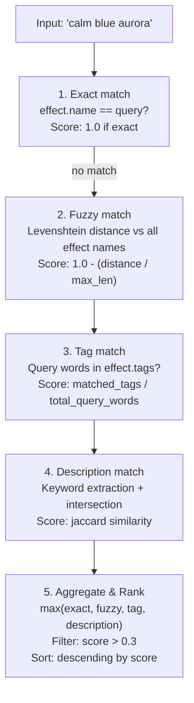

# 11 — MCP Server Specification

> Natural language meets photons. The Model Context Protocol surface for AI-driven RGB control.

**Status:** Implemented
**Crate:** `hypercolor-daemon`
**Module path:** `hypercolor_daemon::mcp`

> **Note (2026-05-16):** The shipping daemon exposes **16 tools** and 5 resources.
> This spec was written before `get_devices`, `stop_effect`, `get_audio_state`,
> `get_sensor_data`, `set_display_face`, `set_profile`, `get_layout`, and `get_status`
> were finalized in their current forms. Several tool names in this spec differ from
> the shipped names (e.g. `list_devices` shipped as `get_devices`, `apply_profile` as
> `set_profile`, `get_state` as `get_status`). The shipped tool list (from
> `build_tool_definitions()`) is: `set_effect`, `list_effects`, `stop_effect`,
> `set_color`, `get_devices`, `set_brightness`, `get_status`, `activate_scene`,
> `list_scenes`, `create_scene`, `get_audio_state`, `get_sensor_data`,
> `set_display_face`, `set_profile`, `get_layout`, `diagnose`.
> Resource count of 5 (`state`, `devices`, `effects`, `profiles`, `audio`) is correct.

---

## Table of Contents

1. [Overview](#1-overview)
2. [Server Metadata & Capabilities](#2-server-metadata--capabilities)
3. [Tools](#3-tools)
4. [Resources](#4-resources)
5. [Prompts](#5-prompts)
6. [Transport Configuration](#6-transport-configuration)
7. [Natural Language Pipeline](#7-natural-language-pipeline)
8. [Implementation — `rmcp` Crate](#8-implementation--rmcp-crate)
9. [Security](#9-security)
10. [Error Handling](#10-error-handling)

---

## 1. Overview

The Hypercolor MCP server exposes RGB lighting control as a set of tools, resources, and prompt templates conforming to the [Model Context Protocol specification (2025-11-25)](https://modelcontextprotocol.io/specification/2025-11-25). AI assistants — Claude, GPT, local LLMs — speak natural language; the MCP server translates intent into precise hardware commands via the Hypercolor daemon's internal bus.

**Why MCP for lighting:**

- **Natural language is the right interface.** "Make it a calm ocean blue" beats `POST /effects/solid-color/apply { "controls": { "color": "#4488CC" } }`.
- **Context compounds.** An AI can interpret "match my music" by combining audio analysis, effect selection, and control tuning in a single reasoning step.
- **Discovery is exploratory.** Users don't memorize 230+ effects. The AI browses, suggests, and refines.
- **Composition is creative.** "Set up movie night" requires orchestrating brightness, effect choice, color temperature, and device selection — exactly the kind of multi-step reasoning LLMs excel at.

The MCP server runs as a tokio task within the daemon process, sharing the `HypercolorBus` event bus and `DaemonState`. It is **not** a separate binary — it's an integrated API surface alongside REST, WebSocket, D-Bus, and CLI.

---

## 2. Server Metadata & Capabilities

### 2.1 Initialization

On connection, the server responds to the `initialize` request with its identity and declared capabilities.

**`InitializeResult`:**

```json
{
  "protocolVersion": "2025-11-25",
  "capabilities": {
    "tools": {
      "listChanged": true
    },
    "resources": {
      "subscribe": true,
      "listChanged": true
    },
    "prompts": {
      "listChanged": true
    },
    "logging": {},
    "completions": {}
  },
  "serverInfo": {
    "name": "hypercolor",
    "title": "Hypercolor RGB Lighting Controller",
    "version": "0.1.0",
    "description": "AI-powered RGB lighting control for Linux. Manage effects, devices, profiles, audio reactivity, screen capture, and automation through natural language.",
    "websiteUrl": "https://github.com/hyperb1iss/hypercolor"
  },
  "instructions": "You are controlling Hypercolor, an RGB lighting system. Use get_state to understand the current setup before making changes. Use list_effects to discover available effects before applying them. Natural language queries work for effect names — you don't need exact IDs. When the user describes a mood or activity, use suggest_lighting first, then apply the recommendation."
}
```

### 2.2 Capability Breakdown

| Capability    | Feature             | Purpose                                                                  |
| ------------- | ------------------- | ------------------------------------------------------------------------ |
| `tools`       | `listChanged: true` | Notify when plugin effects add/remove tools                              |
| `resources`   | `subscribe: true`   | Clients subscribe to state/device/audio changes                          |
| `resources`   | `listChanged: true` | Notify when new resource types appear (e.g., new input source)           |
| `prompts`     | `listChanged: true` | Notify if prompt templates are updated                                   |
| `logging`     | —                   | Emit structured log messages for debugging                               |
| `completions` | —                   | Autocomplete effect names, profile names, device IDs in prompt arguments |

---

## 3. Tools

All tools use `snake_case` names per MCP SDK convention. Each definition below is the exact JSON object returned by `tools/list`.

### 3.1 `set_effect` — Apply a Lighting Effect

Apply an effect by name or natural language description. The server runs a fuzzy matching pipeline (see [Section 7](#7-natural-language-pipeline)) against the full effect catalog.

```json
{
  "name": "set_effect",
  "title": "Set Lighting Effect",
  "description": "Apply a lighting effect to the RGB setup. Accepts exact effect names, partial matches, or natural language descriptions of the desired visual (e.g., 'aurora', 'something with northern lights', 'calm blue waves'). Returns the matched effect and confidence score. Use list_effects first if unsure what's available.",
  "inputSchema": {
    "type": "object",
    "properties": {
      "query": {
        "type": "string",
        "description": "Effect name or natural language description of the desired lighting"
      },
      "controls": {
        "type": "object",
        "description": "Optional effect parameter overrides as key-value pairs (e.g., {\"speed\": 70, \"color\": \"#ff00ff\"}). Use list_effects to discover available parameters for a specific effect.",
        "additionalProperties": true
      },
      "transition_ms": {
        "type": "integer",
        "description": "Crossfade transition duration in milliseconds. 0 = instant switch.",
        "default": 500,
        "minimum": 0,
        "maximum": 10000
      },
      "devices": {
        "type": "array",
        "items": { "type": "string" },
        "description": "Optional list of device IDs to target. Omit to apply to all devices."
      }
    },
    "required": ["query"]
  },
  "outputSchema": {
    "type": "object",
    "properties": {
      "matched_effect": {
        "type": "object",
        "properties": {
          "id": { "type": "string" },
          "name": { "type": "string" },
          "description": { "type": "string" },
          "category": { "type": "string" }
        },
        "required": ["id", "name"]
      },
      "confidence": {
        "type": "number",
        "description": "Match confidence score from 0.0 to 1.0",
        "minimum": 0.0,
        "maximum": 1.0
      },
      "alternatives": {
        "type": "array",
        "items": {
          "type": "object",
          "properties": {
            "id": { "type": "string" },
            "name": { "type": "string" },
            "score": { "type": "number" }
          }
        },
        "description": "Other effects that matched the query, ranked by confidence"
      },
      "applied": { "type": "boolean" }
    },
    "required": ["matched_effect", "confidence", "applied"]
  },
  "annotations": {
    "title": "Set Lighting Effect",
    "readOnlyHint": false,
    "destructiveHint": false,
    "idempotentHint": true,
    "openWorldHint": false
  }
}
```

### 3.2 `set_color` — Set Solid Color

Set a solid color across all devices or specific targets. Accepts color names, hex codes, RGB tuples, or natural language descriptions.

```json
{
  "name": "set_color",
  "title": "Set Solid Color",
  "description": "Set a solid color on all or specific RGB devices. Accepts CSS color names ('coral', 'dodgerblue'), hex codes ('#ff6ac1'), RGB values ('rgb(255, 106, 193)'), HSL values ('hsl(330, 100%, 71%)'), or natural language descriptions ('warm sunset orange', 'deep ocean blue'). The color parser resolves descriptions to the closest named color or interpolated value.",
  "inputSchema": {
    "type": "object",
    "properties": {
      "color": {
        "type": "string",
        "description": "Color specification: name, hex, rgb(), hsl(), or natural language description"
      },
      "brightness": {
        "type": "integer",
        "description": "Optional brightness override (0-100). If omitted, uses current global brightness.",
        "minimum": 0,
        "maximum": 100
      },
      "transition_ms": {
        "type": "integer",
        "description": "Crossfade transition duration in milliseconds",
        "default": 500,
        "minimum": 0,
        "maximum": 10000
      },
      "devices": {
        "type": "array",
        "items": { "type": "string" },
        "description": "Optional list of device IDs. Omit to apply to all devices."
      }
    },
    "required": ["color"]
  },
  "outputSchema": {
    "type": "object",
    "properties": {
      "resolved_color": {
        "type": "object",
        "properties": {
          "hex": {
            "type": "string",
            "description": "Resolved hex code (e.g., '#ff6ac1')"
          },
          "name": {
            "type": "string",
            "description": "Nearest CSS color name, if applicable"
          },
          "rgb": {
            "type": "object",
            "properties": {
              "r": { "type": "integer" },
              "g": { "type": "integer" },
              "b": { "type": "integer" }
            }
          }
        },
        "required": ["hex", "rgb"]
      },
      "applied": { "type": "boolean" },
      "device_count": {
        "type": "integer",
        "description": "Number of devices the color was applied to"
      }
    },
    "required": ["resolved_color", "applied"]
  },
  "annotations": {
    "readOnlyHint": false,
    "destructiveHint": false,
    "idempotentHint": true,
    "openWorldHint": false
  }
}
```

### 3.3 `list_effects` — Browse Effect Library

List available lighting effects with optional filtering by category, audio reactivity, or search query.

```json
{
  "name": "list_effects",
  "title": "List Available Effects",
  "description": "Browse the lighting effect library. Returns effect names, descriptions, categories, and available control parameters. Use category and audio_reactive filters to narrow results. The query parameter searches effect names, descriptions, and tags.",
  "inputSchema": {
    "type": "object",
    "properties": {
      "category": {
        "type": "string",
        "enum": [
          "ambient",
          "reactive",
          "visualizer",
          "pattern",
          "nature",
          "gaming",
          "holiday"
        ],
        "description": "Filter by effect category"
      },
      "audio_reactive": {
        "type": "boolean",
        "description": "Filter to only audio-reactive effects (true) or only non-reactive effects (false)"
      },
      "query": {
        "type": "string",
        "description": "Full-text search across effect names, descriptions, and tags"
      },
      "limit": {
        "type": "integer",
        "description": "Maximum number of results to return",
        "default": 20,
        "minimum": 1,
        "maximum": 100
      },
      "offset": {
        "type": "integer",
        "description": "Pagination offset for large result sets",
        "default": 0,
        "minimum": 0
      }
    }
  },
  "outputSchema": {
    "type": "object",
    "properties": {
      "effects": {
        "type": "array",
        "items": {
          "type": "object",
          "properties": {
            "id": { "type": "string" },
            "name": { "type": "string" },
            "description": { "type": "string" },
            "category": { "type": "string" },
            "audio_reactive": { "type": "boolean" },
            "tags": { "type": "array", "items": { "type": "string" } },
            "controls": {
              "type": "array",
              "items": {
                "type": "object",
                "properties": {
                  "name": { "type": "string" },
                  "type": {
                    "type": "string",
                    "enum": ["number", "color", "boolean", "enum"]
                  },
                  "default": {},
                  "min": { "type": "number" },
                  "max": { "type": "number" }
                }
              }
            }
          },
          "required": ["id", "name", "category"]
        }
      },
      "total": { "type": "integer" },
      "has_more": { "type": "boolean" }
    },
    "required": ["effects", "total", "has_more"]
  },
  "annotations": {
    "readOnlyHint": true,
    "destructiveHint": false,
    "idempotentHint": true,
    "openWorldHint": false
  }
}
```

### 3.4 `list_devices` — Enumerate Connected Devices

List all known RGB devices with connection status, LED count, and zone information.

```json
{
  "name": "list_devices",
  "title": "List RGB Devices",
  "description": "Enumerate all known RGB devices with their connection status, driver origin, output route, LED count, and zone configuration. Use the status filter to show only connected or disconnected devices.",
  "inputSchema": {
    "type": "object",
    "properties": {
      "status": {
        "type": "string",
        "enum": ["all", "connected", "disconnected"],
        "default": "all",
        "description": "Filter by connection status"
      }
    }
  },
  "outputSchema": {
    "type": "object",
    "properties": {
      "devices": {
        "type": "array",
        "items": {
          "type": "object",
          "properties": {
            "id": { "type": "string" },
            "name": { "type": "string" },
            "backend": {
              "type": "string",
              "enum": ["wled", "usb_hid", "hue", "razer", "corsair"]
            },
            "status": {
              "type": "string",
              "enum": ["connected", "disconnected", "error"]
            },
            "total_leds": { "type": "integer" },
            "zones": {
              "type": "array",
              "items": {
                "type": "object",
                "properties": {
                  "id": { "type": "string" },
                  "name": { "type": "string" },
                  "led_count": { "type": "integer" },
                  "topology": { "type": "string" }
                }
              }
            },
            "firmware_version": { "type": "string" },
            "last_seen": { "type": "string", "format": "date-time" }
          },
          "required": ["id", "name", "backend", "status", "total_leds"]
        }
      },
      "summary": {
        "type": "object",
        "properties": {
          "total": { "type": "integer" },
          "connected": { "type": "integer" },
          "total_leds": { "type": "integer" }
        }
      }
    },
    "required": ["devices", "summary"]
  },
  "annotations": {
    "readOnlyHint": true,
    "destructiveHint": false,
    "idempotentHint": true,
    "openWorldHint": false
  }
}
```

### 3.5 `get_state` — Current System State

Retrieve the full daemon state: running effect, brightness, connected devices, active profile, performance metrics, and input source status.

```json
{
  "name": "get_state",
  "title": "Get System State",
  "description": "Get the current state of the Hypercolor daemon including: active effect, global brightness, connected device count, active profile, FPS metrics, audio/screen input status, and uptime. Call this first to understand the current setup before making changes.",
  "inputSchema": {
    "type": "object",
    "additionalProperties": false
  },
  "outputSchema": {
    "type": "object",
    "properties": {
      "running": { "type": "boolean" },
      "paused": { "type": "boolean" },
      "brightness": { "type": "integer", "minimum": 0, "maximum": 100 },
      "fps": {
        "type": "object",
        "properties": {
          "target": { "type": "integer" },
          "actual": { "type": "number" }
        }
      },
      "effect": {
        "type": "object",
        "properties": {
          "id": { "type": "string" },
          "name": { "type": "string" },
          "category": { "type": "string" }
        }
      },
      "profile": {
        "type": "object",
        "properties": {
          "id": { "type": "string" },
          "name": { "type": "string" }
        }
      },
      "devices": {
        "type": "object",
        "properties": {
          "connected": { "type": "integer" },
          "total": { "type": "integer" },
          "total_leds": { "type": "integer" }
        }
      },
      "inputs": {
        "type": "object",
        "properties": {
          "audio": {
            "type": "string",
            "enum": ["active", "disabled", "error"]
          },
          "screen": {
            "type": "string",
            "enum": ["active", "disabled", "error"]
          }
        }
      },
      "uptime_seconds": { "type": "integer" },
      "version": { "type": "string" }
    },
    "required": ["running", "paused", "brightness", "devices", "uptime_seconds"]
  },
  "annotations": {
    "readOnlyHint": true,
    "destructiveHint": false,
    "idempotentHint": true,
    "openWorldHint": false
  }
}
```

### 3.6 `set_brightness` — Adjust Brightness

Set global or per-device brightness level.

```json
{
  "name": "set_brightness",
  "title": "Set Brightness",
  "description": "Set the brightness level globally or for specific devices. Brightness is a percentage from 0 (off/dark) to 100 (maximum). When device_id is omitted, sets the global master brightness that affects all devices.",
  "inputSchema": {
    "type": "object",
    "properties": {
      "brightness": {
        "type": "integer",
        "minimum": 0,
        "maximum": 100,
        "description": "Brightness percentage (0 = off, 100 = full brightness)"
      },
      "device_id": {
        "type": "string",
        "description": "Optional device ID for per-device brightness. Omit to set global brightness."
      },
      "transition_ms": {
        "type": "integer",
        "description": "Fade transition duration in milliseconds",
        "default": 300,
        "minimum": 0,
        "maximum": 5000
      }
    },
    "required": ["brightness"]
  },
  "outputSchema": {
    "type": "object",
    "properties": {
      "brightness": { "type": "integer" },
      "scope": { "type": "string", "enum": ["global", "device"] },
      "device_id": { "type": "string" },
      "previous_brightness": { "type": "integer" }
    },
    "required": ["brightness", "scope"]
  },
  "annotations": {
    "readOnlyHint": false,
    "destructiveHint": false,
    "idempotentHint": true,
    "openWorldHint": false
  }
}
```

### 3.7 `apply_profile` — Activate a Saved Profile

Apply a previously saved lighting profile by name or fuzzy query.

```json
{
  "name": "apply_profile",
  "title": "Apply Lighting Profile",
  "description": "Activate a saved lighting profile. Profiles capture the complete lighting state: effect, control parameters, device selection, brightness, and layout. Accepts exact profile names or natural language descriptions (e.g., 'gaming', 'movie night', 'chill vibes').",
  "inputSchema": {
    "type": "object",
    "properties": {
      "query": {
        "type": "string",
        "description": "Profile name or description to search for"
      },
      "transition_ms": {
        "type": "integer",
        "description": "Crossfade transition duration in milliseconds",
        "default": 1000,
        "minimum": 0,
        "maximum": 10000
      }
    },
    "required": ["query"]
  },
  "outputSchema": {
    "type": "object",
    "properties": {
      "profile": {
        "type": "object",
        "properties": {
          "id": { "type": "string" },
          "name": { "type": "string" },
          "description": { "type": "string" },
          "effect": { "type": "string" },
          "brightness": { "type": "integer" }
        },
        "required": ["id", "name"]
      },
      "applied": { "type": "boolean" },
      "confidence": { "type": "number" }
    },
    "required": ["profile", "applied"]
  },
  "annotations": {
    "readOnlyHint": false,
    "destructiveHint": false,
    "idempotentHint": true,
    "openWorldHint": false
  }
}
```

### 3.8 `create_scene` — Create a New Scene

Create a new automated lighting scene from a natural language description.

```json
{
  "name": "create_scene",
  "title": "Create Lighting Scene",
  "description": "Create an automated lighting scene that activates based on triggers (time, events, audio). A scene links a trigger condition to a profile with transition settings. Describe what you want and when — the server resolves effect, profile, and trigger details.",
  "inputSchema": {
    "type": "object",
    "properties": {
      "name": {
        "type": "string",
        "description": "Human-readable scene name (e.g., 'Sunset Warmth', 'Gaming Mode')"
      },
      "description": {
        "type": "string",
        "description": "What this scene does and when it should activate"
      },
      "profile_id": {
        "type": "string",
        "description": "Profile ID to activate when triggered. Use list_profiles or apply_profile to find profiles."
      },
      "trigger": {
        "type": "object",
        "description": "Trigger condition that activates this scene",
        "properties": {
          "type": {
            "type": "string",
            "enum": [
              "schedule",
              "sunset",
              "sunrise",
              "device_connect",
              "device_disconnect",
              "audio_beat",
              "webhook"
            ],
            "description": "Trigger type"
          },
          "cron": {
            "type": "string",
            "description": "Cron expression for schedule triggers (e.g., '0 18 * * *' for 6 PM daily)"
          },
          "offset_minutes": {
            "type": "integer",
            "description": "Offset in minutes from solar event (negative = before, positive = after)"
          },
          "device_id": {
            "type": "string",
            "description": "Device ID for device_connect/disconnect triggers"
          }
        },
        "required": ["type"]
      },
      "transition_ms": {
        "type": "integer",
        "description": "Crossfade duration in milliseconds when the scene activates",
        "default": 1000,
        "minimum": 0,
        "maximum": 30000
      },
      "enabled": {
        "type": "boolean",
        "description": "Whether the scene is active immediately after creation",
        "default": true
      }
    },
    "required": ["name", "profile_id", "trigger"]
  },
  "outputSchema": {
    "type": "object",
    "properties": {
      "scene_id": { "type": "string" },
      "name": { "type": "string" },
      "enabled": { "type": "boolean" },
      "next_trigger": {
        "type": "string",
        "format": "date-time",
        "description": "Next scheduled activation time, if applicable"
      }
    },
    "required": ["scene_id", "name", "enabled"]
  },
  "annotations": {
    "readOnlyHint": false,
    "destructiveHint": false,
    "idempotentHint": false,
    "openWorldHint": false
  }
}
```

### 3.9 `set_audio_reactive` — Configure Audio Reactivity

Enable, disable, or configure audio-reactive lighting.

```json
{
  "name": "set_audio_reactive",
  "title": "Configure Audio Reactivity",
  "description": "Enable or configure audio-reactive lighting. When enabled, effects respond to system audio — bass hits trigger flashes, melodies drive color shifts, beats pulse the LEDs. Configure sensitivity, frequency focus, and gain. The audio source is auto-detected from PipeWire/PulseAudio system output.",
  "inputSchema": {
    "type": "object",
    "properties": {
      "enabled": {
        "type": "boolean",
        "description": "Enable or disable audio reactivity"
      },
      "sensitivity": {
        "type": "number",
        "description": "Beat detection sensitivity (0.0 = least sensitive, 1.0 = most sensitive)",
        "minimum": 0.0,
        "maximum": 1.0,
        "default": 0.6
      },
      "gain": {
        "type": "number",
        "description": "Audio input gain multiplier (0.1 = quiet, 2.0 = amplified)",
        "minimum": 0.1,
        "maximum": 5.0,
        "default": 1.0
      },
      "frequency_focus": {
        "type": "string",
        "enum": ["full", "bass", "mid", "treble"],
        "description": "Which frequency range to emphasize for reactive effects",
        "default": "full"
      },
      "smoothing": {
        "type": "number",
        "description": "Temporal smoothing factor (0.0 = instant response, 1.0 = very smooth/slow)",
        "minimum": 0.0,
        "maximum": 0.95,
        "default": 0.7
      },
      "noise_gate": {
        "type": "number",
        "description": "Minimum audio level to trigger reactivity (filters background noise)",
        "minimum": 0.0,
        "maximum": 0.5,
        "default": 0.02
      }
    }
  },
  "outputSchema": {
    "type": "object",
    "properties": {
      "enabled": { "type": "boolean" },
      "audio_source": {
        "type": "string",
        "description": "Detected audio device name"
      },
      "sample_rate": { "type": "integer" },
      "config": {
        "type": "object",
        "properties": {
          "sensitivity": { "type": "number" },
          "gain": { "type": "number" },
          "frequency_focus": { "type": "string" },
          "smoothing": { "type": "number" },
          "noise_gate": { "type": "number" }
        }
      },
      "current_levels": {
        "type": "object",
        "description": "Snapshot of current audio levels at time of call",
        "properties": {
          "level": { "type": "number" },
          "bass": { "type": "number" },
          "mid": { "type": "number" },
          "treble": { "type": "number" },
          "beat": { "type": "boolean" }
        }
      }
    },
    "required": ["enabled"]
  },
  "annotations": {
    "readOnlyHint": false,
    "destructiveHint": false,
    "idempotentHint": true,
    "openWorldHint": false
  }
}
```

### 3.10 `suggest_lighting` — AI Lighting Suggestions

Get effect and configuration recommendations based on mood, activity, or aesthetic description.

```json
{
  "name": "suggest_lighting",
  "title": "Suggest Lighting",
  "description": "Get intelligent lighting suggestions based on a mood, activity, time of day, or aesthetic description. Returns ranked effect recommendations with explanations and suggested control settings. Does NOT apply anything — the user or AI decides which suggestion to use.",
  "inputSchema": {
    "type": "object",
    "properties": {
      "mood": {
        "type": "string",
        "description": "Desired mood or vibe (e.g., 'relaxing', 'energetic', 'spooky', 'focused', 'romantic')"
      },
      "activity": {
        "type": "string",
        "description": "What the user is doing (e.g., 'gaming', 'coding', 'watching a movie', 'hosting a party', 'meditating')"
      },
      "colors": {
        "type": "array",
        "items": { "type": "string" },
        "description": "Preferred colors — names or hex codes (e.g., ['blue', 'purple'] or ['#ff00ff'])"
      },
      "audio_reactive": {
        "type": "boolean",
        "description": "Whether suggestions should include audio-reactive effects"
      },
      "time_of_day": {
        "type": "string",
        "enum": ["morning", "afternoon", "evening", "night", "auto"],
        "description": "Time context for brightness and warmth. 'auto' uses system clock.",
        "default": "auto"
      },
      "limit": {
        "type": "integer",
        "description": "Number of suggestions to return",
        "default": 3,
        "minimum": 1,
        "maximum": 10
      }
    }
  },
  "outputSchema": {
    "type": "object",
    "properties": {
      "suggestions": {
        "type": "array",
        "items": {
          "type": "object",
          "properties": {
            "effect_id": { "type": "string" },
            "effect_name": { "type": "string" },
            "reason": {
              "type": "string",
              "description": "Why this effect fits the request"
            },
            "recommended_controls": {
              "type": "object",
              "additionalProperties": true,
              "description": "Suggested control parameter values"
            },
            "recommended_brightness": {
              "type": "integer",
              "minimum": 0,
              "maximum": 100
            },
            "score": { "type": "number", "minimum": 0, "maximum": 1 }
          },
          "required": ["effect_id", "effect_name", "reason", "score"]
        }
      }
    },
    "required": ["suggestions"]
  },
  "annotations": {
    "readOnlyHint": true,
    "destructiveHint": false,
    "idempotentHint": true,
    "openWorldHint": false
  }
}
```

### 3.11 `toggle` — Power On/Off

Toggle the lighting system on or off, or explicitly set power state.

```json
{
  "name": "toggle",
  "title": "Toggle Lighting On/Off",
  "description": "Toggle the Hypercolor lighting system on or off. When turned off, all LEDs go dark but the daemon continues running and maintains device connections. Use the 'state' parameter to explicitly set on/off, or omit it to toggle the current state.",
  "inputSchema": {
    "type": "object",
    "properties": {
      "state": {
        "type": "string",
        "enum": ["on", "off", "toggle"],
        "description": "Desired power state. 'toggle' flips the current state.",
        "default": "toggle"
      }
    }
  },
  "outputSchema": {
    "type": "object",
    "properties": {
      "power": { "type": "string", "enum": ["on", "off"] },
      "was": {
        "type": "string",
        "enum": ["on", "off"],
        "description": "Previous power state"
      }
    },
    "required": ["power", "was"]
  },
  "annotations": {
    "readOnlyHint": false,
    "destructiveHint": false,
    "idempotentHint": true,
    "openWorldHint": false
  }
}
```

### 3.12 `set_schedule` — Create Time-Based Automation

Create or update a time-based schedule for automatic lighting changes.

```json
{
  "name": "set_schedule",
  "title": "Set Lighting Schedule",
  "description": "Create a time-based automation rule. Schedules can trigger on cron expressions, solar events (sunrise/sunset), or recurring intervals. Each schedule activates a profile or specific effect at the designated time.",
  "inputSchema": {
    "type": "object",
    "properties": {
      "name": {
        "type": "string",
        "description": "Human-readable schedule name"
      },
      "schedule_type": {
        "type": "string",
        "enum": ["cron", "solar", "interval"],
        "description": "Type of time trigger"
      },
      "cron": {
        "type": "string",
        "description": "Cron expression (for 'cron' type). E.g., '0 22 * * *' for 10 PM daily, '0 18 * * 1-5' for 6 PM weekdays."
      },
      "solar_event": {
        "type": "string",
        "enum": [
          "sunrise",
          "sunset",
          "civil_dawn",
          "civil_dusk",
          "nautical_dawn",
          "nautical_dusk"
        ],
        "description": "Solar event to trigger on (for 'solar' type)"
      },
      "offset_minutes": {
        "type": "integer",
        "description": "Offset from solar event in minutes (negative = before, positive = after)",
        "default": 0
      },
      "interval_minutes": {
        "type": "integer",
        "description": "Repeat interval in minutes (for 'interval' type)",
        "minimum": 1
      },
      "action": {
        "type": "object",
        "description": "What to do when the schedule triggers",
        "properties": {
          "type": {
            "type": "string",
            "enum": ["apply_profile", "set_effect", "set_brightness", "toggle"],
            "description": "Action type"
          },
          "profile_id": { "type": "string" },
          "effect_query": { "type": "string" },
          "brightness": { "type": "integer", "minimum": 0, "maximum": 100 },
          "power_state": { "type": "string", "enum": ["on", "off"] }
        },
        "required": ["type"]
      },
      "enabled": {
        "type": "boolean",
        "default": true
      }
    },
    "required": ["name", "schedule_type", "action"]
  },
  "outputSchema": {
    "type": "object",
    "properties": {
      "schedule_id": { "type": "string" },
      "name": { "type": "string" },
      "enabled": { "type": "boolean" },
      "next_trigger": { "type": "string", "format": "date-time" },
      "description": {
        "type": "string",
        "description": "Human-readable summary of the schedule"
      }
    },
    "required": ["schedule_id", "name", "enabled"]
  },
  "annotations": {
    "readOnlyHint": false,
    "destructiveHint": false,
    "idempotentHint": false,
    "openWorldHint": false
  }
}
```

### 3.13 `diagnose` — Troubleshoot Device Issues

Run diagnostics on the lighting system or specific devices.

```json
{
  "name": "diagnose",
  "title": "Diagnose Issues",
  "description": "Run diagnostics on the Hypercolor system or a specific device. Checks connectivity, protocol health, frame delivery, latency, and error rates. Returns actionable findings with severity levels. Useful when devices aren't responding, colors look wrong, or frame rates drop.",
  "inputSchema": {
    "type": "object",
    "properties": {
      "device_id": {
        "type": "string",
        "description": "Specific device to diagnose. Omit for full system diagnostics."
      },
      "checks": {
        "type": "array",
        "items": {
          "type": "string",
          "enum": [
            "connectivity",
            "latency",
            "frame_delivery",
            "color_accuracy",
            "protocol",
            "all"
          ]
        },
        "description": "Which diagnostic checks to run. Defaults to 'all'.",
        "default": ["all"]
      }
    }
  },
  "outputSchema": {
    "type": "object",
    "properties": {
      "overall_status": {
        "type": "string",
        "enum": ["healthy", "degraded", "error"],
        "description": "Overall system health assessment"
      },
      "findings": {
        "type": "array",
        "items": {
          "type": "object",
          "properties": {
            "severity": {
              "type": "string",
              "enum": ["info", "warning", "error", "critical"]
            },
            "component": {
              "type": "string",
              "description": "Affected component (device ID, subsystem name)"
            },
            "message": { "type": "string" },
            "suggestion": {
              "type": "string",
              "description": "Actionable fix recommendation"
            }
          },
          "required": ["severity", "component", "message"]
        }
      },
      "metrics": {
        "type": "object",
        "properties": {
          "fps": { "type": "number" },
          "frame_drop_rate": {
            "type": "number",
            "description": "Percentage of dropped frames"
          },
          "avg_latency_ms": { "type": "number" },
          "device_error_count": { "type": "integer" },
          "uptime_seconds": { "type": "integer" }
        }
      }
    },
    "required": ["overall_status", "findings"]
  },
  "annotations": {
    "readOnlyHint": true,
    "destructiveHint": false,
    "idempotentHint": true,
    "openWorldHint": false
  }
}
```

### 3.14 `capture_screen` — Screen Ambient Mode

Enable or configure screen capture ambient lighting (Ambilight-style).

```json
{
  "name": "capture_screen",
  "title": "Screen Ambient Mode",
  "description": "Enable screen capture ambient lighting — LEDs mirror the colors on your monitor edges (Ambilight-style). Captures screen content via PipeWire/XDG Desktop Portal on Wayland or XShm on X11. On first enable, the system may request screen sharing permission from the compositor.",
  "inputSchema": {
    "type": "object",
    "properties": {
      "enabled": {
        "type": "boolean",
        "description": "Enable or disable screen capture mode"
      },
      "monitor": {
        "type": "string",
        "description": "Monitor to capture. Use display name or index (e.g., 'DP-1', '0'). Omit for primary monitor."
      },
      "saturation_boost": {
        "type": "number",
        "description": "Boost color saturation for more vivid LEDs (1.0 = natural, 2.0 = double saturation)",
        "minimum": 0.5,
        "maximum": 3.0,
        "default": 1.4
      },
      "brightness_boost": {
        "type": "number",
        "description": "Boost brightness for dark scenes (1.0 = natural, 2.0 = double brightness)",
        "minimum": 0.5,
        "maximum": 3.0,
        "default": 1.2
      },
      "smoothing": {
        "type": "number",
        "description": "Temporal smoothing to reduce flickering (0.0 = instant, 1.0 = very smooth)",
        "minimum": 0.0,
        "maximum": 0.95,
        "default": 0.3
      },
      "black_threshold": {
        "type": "number",
        "description": "Brightness below this threshold is treated as black (for letterboxing). Range 0.0-0.3.",
        "minimum": 0.0,
        "maximum": 0.3,
        "default": 0.05
      }
    }
  },
  "outputSchema": {
    "type": "object",
    "properties": {
      "enabled": { "type": "boolean" },
      "capture_backend": {
        "type": "string",
        "enum": ["pipewire", "xshm", "dma_buf"]
      },
      "monitor": { "type": "string" },
      "resolution": {
        "type": "string",
        "description": "Capture resolution (e.g., '1920x1080')"
      },
      "fps": { "type": "number", "description": "Current capture frame rate" },
      "permission_required": {
        "type": "boolean",
        "description": "Whether the user needs to grant screen sharing permission"
      }
    },
    "required": ["enabled"]
  },
  "annotations": {
    "readOnlyHint": false,
    "destructiveHint": false,
    "idempotentHint": true,
    "openWorldHint": false
  }
}
```

### 3.15 Tool Summary

The following 16 tools are shipped in v0.1 (from `build_tool_definitions()`).
Tool names and descriptions in earlier sections of this spec use pre-release names
that differ in some cases — the table below reflects the shipped names.

| Tool                 | Read-only | Description                                        |
| -------------------- | --------- | -------------------------------------------------- |
| `set_effect`         | No        | Apply effect by name or natural language           |
| `list_effects`       | Yes       | Browse/filter the effect catalog                   |
| `stop_effect`        | No        | Stop the active effect and clear all LEDs          |
| `set_color`          | No        | Set solid color by name, hex, or description       |
| `get_devices`        | Yes       | Enumerate connected devices                        |
| `set_brightness`     | No        | Global or per-device brightness                    |
| `get_status`         | Yes       | Current system state snapshot                      |
| `activate_scene`     | No        | Activate a saved scene by ID or name               |
| `list_scenes`        | Yes       | List all saved scenes                              |
| `create_scene`       | No        | Create a new scene from current state              |
| `get_audio_state`    | Yes       | Current audio analysis snapshot                    |
| `get_sensor_data`    | Yes       | System telemetry (GPU, CPU, temperatures)          |
| `set_display_face`   | No        | Set the active face on an LCD display device       |
| `set_profile`        | No        | Activate a saved lighting profile                  |
| `get_layout`         | Yes       | Current spatial LED layout                         |
| `diagnose`           | Yes       | Troubleshoot device and daemon issues              |

---

## 4. Resources

Resources provide read-only contextual data that the AI can reference without making tool calls. All Hypercolor resources use the `hypercolor://` custom URI scheme per [RFC 3986](https://datatracker.ietf.org/doc/html/rfc3986).

### 4.1 Resource Definitions

The following resources are returned by `resources/list`:

#### `hypercolor://state` — System State

```json
{
  "uri": "hypercolor://state",
  "name": "System State",
  "title": "Hypercolor System State",
  "description": "Current daemon state including active effect, brightness, connected devices, FPS, and input status. Updates on every state change.",
  "mimeType": "application/json",
  "annotations": {
    "audience": ["assistant"],
    "priority": 0.9
  }
}
```

**Content shape** (returned by `resources/read`):

```json
{
  "uri": "hypercolor://state",
  "mimeType": "application/json",
  "text": "{\"running\":true,\"paused\":false,\"brightness\":85,\"fps\":{\"target\":60,\"actual\":59.7},\"effect\":{\"id\":\"aurora\",\"name\":\"Aurora\"},\"profile\":{\"id\":\"chill\",\"name\":\"Chill Mode\"},\"devices\":{\"connected\":5,\"total_leds\":842},\"inputs\":{\"audio\":\"active\",\"screen\":\"disabled\"},\"uptime_seconds\":86423}"
}
```

#### `hypercolor://devices` — Device Inventory

```json
{
  "uri": "hypercolor://devices",
  "name": "Device Inventory",
  "title": "Connected RGB Devices",
  "description": "Full inventory of all known RGB devices with connection status, driver origin, output route, LED count, zone configuration, and connection details. Updates when devices connect/disconnect.",
  "mimeType": "application/json",
  "annotations": {
    "audience": ["assistant"],
    "priority": 0.7
  }
}
```

#### `hypercolor://effects` — Effect Catalog

```json
{
  "uri": "hypercolor://effects",
  "name": "Effect Catalog",
  "title": "Available Lighting Effects",
  "description": "Complete catalog of all available lighting effects with names, descriptions, categories, tags, and available control parameters. Updates when plugins add/remove effects.",
  "mimeType": "application/json",
  "annotations": {
    "audience": ["assistant"],
    "priority": 0.8
  }
}
```

#### `hypercolor://profiles` — Saved Profiles

```json
{
  "uri": "hypercolor://profiles",
  "name": "Saved Profiles",
  "title": "Lighting Profiles",
  "description": "All saved lighting profiles with their names, descriptions, associated effects, brightness settings, and device targets.",
  "mimeType": "application/json",
  "annotations": {
    "audience": ["assistant"],
    "priority": 0.6
  }
}
```

#### `hypercolor://audio` — Audio Analysis

```json
{
  "uri": "hypercolor://audio",
  "name": "Audio Analysis",
  "title": "Current Audio Analysis Data",
  "description": "Real-time audio analysis data: overall level, bass/mid/treble energy, beat detection status, beat confidence, and a compact spectrum summary. Updates at ~10Hz (not every render frame — rate-limited for MCP).",
  "mimeType": "application/json",
  "annotations": {
    "audience": ["assistant"],
    "priority": 0.4
  }
}
```

**Content shape:**

```json
{
  "uri": "hypercolor://audio",
  "mimeType": "application/json",
  "text": "{\"enabled\":true,\"source\":\"PipeWire Multimedia (default)\",\"sample_rate\":48000,\"levels\":{\"overall\":0.42,\"bass\":0.71,\"mid\":0.35,\"treble\":0.18},\"beat\":{\"detected\":false,\"confidence\":0.45,\"bpm_estimate\":128},\"spectrum_summary\":{\"bands\":24,\"peak_frequency_hz\":120}}"
}
```

### 4.2 Resource Templates

The server also exposes parameterized resource templates via `resources/templates/list`:

```json
{
  "uriTemplate": "hypercolor://effect/{effect_id}",
  "name": "Effect Details",
  "title": "Detailed Effect Information",
  "description": "Full metadata for a specific effect including all control parameters with types, ranges, defaults, and current values.",
  "mimeType": "application/json"
}
```

```json
{
  "uriTemplate": "hypercolor://device/{device_id}",
  "name": "Device Details",
  "title": "Detailed Device Information",
  "description": "Full details for a specific device including zones, connection info, firmware version, and real-time metrics.",
  "mimeType": "application/json"
}
```

### 4.3 Subscriptions

Clients can subscribe to resource changes via `resources/subscribe`. The server emits `notifications/resources/updated` when the subscribed resource changes.

| Resource                | Update frequency    | Trigger                                        |
| ----------------------- | ------------------- | ---------------------------------------------- |
| `hypercolor://state`    | On state change     | Effect change, brightness change, pause/resume |
| `hypercolor://devices`  | On device change    | Device connect/disconnect, config change       |
| `hypercolor://effects`  | Rare                | Plugin load/unload                             |
| `hypercolor://profiles` | On profile CRUD     | Profile create/update/delete                   |
| `hypercolor://audio`    | Rate-limited ~10 Hz | Continuous while audio is active               |

Audio resource subscriptions are rate-limited to prevent flooding the MCP client. The daemon's internal audio analysis runs at 60 Hz, but MCP updates are decimated to ~10 Hz with change-detection gating — updates only emit when levels shift by more than 5% or a beat is detected.

---

## 5. Prompts

Prompt templates provide structured interaction patterns for common workflows. Clients surface these as slash commands or menu items.

### 5.1 `mood_lighting` — Set Lighting for a Mood

```json
{
  "name": "mood_lighting",
  "title": "Mood Lighting Setup",
  "description": "Interactive workflow to configure lighting based on a mood, vibe, or activity. Walks through effect selection, brightness, and color tuning.",
  "arguments": [
    {
      "name": "mood",
      "description": "Desired mood or vibe (e.g., 'relaxing evening', 'energetic party', 'deep focus coding'). If omitted, the prompt will ask.",
      "required": false
    },
    {
      "name": "audio_reactive",
      "description": "Whether to include audio-reactive effects in suggestions. Values: 'yes', 'no', 'auto'.",
      "required": false
    }
  ]
}
```

**Prompt messages** (returned by `prompts/get`):

```json
{
  "description": "Configure Hypercolor RGB lighting to match a mood",
  "messages": [
    {
      "role": "user",
      "content": {
        "type": "text",
        "text": "I want to set up my RGB lighting for this mood: {{mood}}"
      }
    },
    {
      "role": "assistant",
      "content": {
        "type": "text",
        "text": "I'll help you set up the perfect lighting. Let me check what we're working with."
      }
    },
    {
      "role": "assistant",
      "content": {
        "type": "resource",
        "resource": {
          "uri": "hypercolor://state",
          "mimeType": "application/json",
          "text": "{{resource:hypercolor://state}}"
        }
      }
    },
    {
      "role": "assistant",
      "content": {
        "type": "resource",
        "resource": {
          "uri": "hypercolor://effects",
          "mimeType": "application/json",
          "text": "{{resource:hypercolor://effects}}"
        }
      }
    },
    {
      "role": "assistant",
      "content": {
        "type": "resource",
        "resource": {
          "uri": "hypercolor://devices",
          "mimeType": "application/json",
          "text": "{{resource:hypercolor://devices}}"
        }
      }
    },
    {
      "role": "user",
      "content": {
        "type": "text",
        "text": "Based on the available effects, connected devices, and current state, suggest an effect and control settings that match the requested mood. Consider the hardware setup and which effects work best with the device count and spatial layout. Provide your top 2-3 recommendations with explanations, then apply the best match after confirming."
      }
    }
  ]
}
```

### 5.2 `troubleshoot` — Diagnose Device Issues

```json
{
  "name": "troubleshoot",
  "title": "Troubleshoot Lighting Issues",
  "description": "Guided troubleshooting for device connectivity, rendering, or performance issues. Runs diagnostics and walks through fixes.",
  "arguments": [
    {
      "name": "issue",
      "description": "Description of the problem (e.g., 'WLED strip not responding', 'colors look wrong', 'low frame rate')",
      "required": true
    },
    {
      "name": "device_id",
      "description": "Specific device ID if the issue is device-specific",
      "required": false
    }
  ]
}
```

**Prompt messages:**

```json
{
  "description": "Troubleshoot Hypercolor device and rendering issues",
  "messages": [
    {
      "role": "user",
      "content": {
        "type": "text",
        "text": "I'm having an issue with my RGB lighting: {{issue}}"
      }
    },
    {
      "role": "assistant",
      "content": {
        "type": "text",
        "text": "Let me run diagnostics and check the system state."
      }
    },
    {
      "role": "assistant",
      "content": {
        "type": "resource",
        "resource": {
          "uri": "hypercolor://state",
          "mimeType": "application/json",
          "text": "{{resource:hypercolor://state}}"
        }
      }
    },
    {
      "role": "assistant",
      "content": {
        "type": "resource",
        "resource": {
          "uri": "hypercolor://devices",
          "mimeType": "application/json",
          "text": "{{resource:hypercolor://devices}}"
        }
      }
    },
    {
      "role": "user",
      "content": {
        "type": "text",
        "text": "Use the diagnose tool to run a full diagnostic. Based on the results and the device/state information above, identify the root cause, explain it clearly, and provide step-by-step instructions to fix the issue. If the fix can be applied through Hypercolor tools (reconnecting a device, adjusting settings), offer to do it."
      }
    }
  ]
}
```

### 5.3 `setup_automation` — Create Scheduling Rules

```json
{
  "name": "setup_automation",
  "title": "Set Up Lighting Automation",
  "description": "Guided workflow to create automated lighting schedules and scenes. Walks through trigger selection, profile assignment, and transition settings.",
  "arguments": [
    {
      "name": "description",
      "description": "Natural language description of the desired automation (e.g., 'dim lights at 10pm', 'warm colors at sunset')",
      "required": false
    }
  ]
}
```

**Prompt messages:**

```json
{
  "description": "Create automated lighting rules and schedules",
  "messages": [
    {
      "role": "user",
      "content": {
        "type": "text",
        "text": "I want to set up automated lighting{{#description}}: {{description}}{{/description}}."
      }
    },
    {
      "role": "assistant",
      "content": {
        "type": "resource",
        "resource": {
          "uri": "hypercolor://profiles",
          "mimeType": "application/json",
          "text": "{{resource:hypercolor://profiles}}"
        }
      }
    },
    {
      "role": "assistant",
      "content": {
        "type": "resource",
        "resource": {
          "uri": "hypercolor://state",
          "mimeType": "application/json",
          "text": "{{resource:hypercolor://state}}"
        }
      }
    },
    {
      "role": "user",
      "content": {
        "type": "text",
        "text": "Based on the available profiles and current state, help me create an automation rule. Ask about:\n1. When should it trigger? (time of day, solar event, device connection, etc.)\n2. What should happen? (apply a profile, set a specific effect, adjust brightness)\n3. Any conditions? (only on weekdays, only when a device is connected)\n4. Transition style? (instant, slow fade, etc.)\n\nThen use create_scene or set_schedule to create the automation."
      }
    }
  ]
}
```

---

## 6. Transport Configuration

The MCP server supports three transport modes, selectable via daemon configuration or CLI flags.

### 6.1 stdio (Default)

The primary transport for local AI tools — Claude Code, Cursor, Zed, and other editor-integrated assistants.

**How it works:**

- The AI client launches the Hypercolor MCP server as a child process.
- JSON-RPC messages flow over stdin/stdout, one message per line.
- stderr is reserved for daemon log output.
- The client terminates the subprocess on disconnect.

**Configuration:**

```toml
# ~/.config/hypercolor/config.toml
[mcp]
transport = "stdio"
```

**Claude Code integration** (`claude_desktop_config.json`):

```json
{
  "mcpServers": {
    "hypercolor": {
      "command": "hypercolor",
      "args": ["mcp", "--transport", "stdio"],
      "env": {
        "HYPERCOLOR_SOCKET": "/run/hypercolor/hypercolor.sock"
      }
    }
  }
}
```

In stdio mode, the MCP subprocess connects to the running daemon over the Unix socket. It acts as a thin translation layer: MCP JSON-RPC on the outside, Hypercolor internal bus messages on the inside.

### 6.2 Streamable HTTP

The modern MCP transport for web-based AI agents, remote access, and multi-client scenarios.

**How it works:**

- The daemon hosts an HTTP endpoint at the configured MCP port.
- Clients POST JSON-RPC requests; the server responds with JSON or SSE streams.
- Supports session management via `MCP-Session-Id` headers.
- Server-to-client notifications (state changes, resource updates) flow over SSE.

**Configuration:**

```toml
[mcp]
transport = "http"
port = 9421
bind_address = "127.0.0.1"  # Localhost-only by default
```

**CLI override:**

```bash
hypercolor daemon --mcp-transport http --mcp-port 9421
```

**Security requirements for HTTP transport:**

- Origin header validation to prevent DNS rebinding attacks.
- Localhost-only binding by default. Network binding requires explicit opt-in.
- API key authentication when `bind_address` is not localhost.
- TLS termination recommended for any non-localhost exposure.

### 6.3 SSE (Legacy Compatibility)

The deprecated HTTP+SSE transport from MCP protocol version 2024-11-05. Supported for backwards compatibility with older MCP clients.

**Configuration:**

```toml
[mcp]
transport = "sse"
port = 9421
```

The server hosts separate SSE and POST endpoints matching the legacy specification. New clients should use Streamable HTTP instead.

### 6.4 Transport Selection Matrix

| Transport           | Use case                   | Multi-client | Session state      |
| ------------------- | -------------------------- | ------------ | ------------------ |
| **stdio**           | Claude Code, local editors | No (1:1)     | In-process         |
| **Streamable HTTP** | Web agents, remote access  | Yes          | Session ID headers |
| **SSE (legacy)**    | Older MCP clients          | Yes          | Per-connection     |

---

## 7. Natural Language Pipeline

The MCP server includes a semantic matching layer for queries that don't map to exact identifiers. This is intentionally lightweight — no embedding models or vector databases. The AI assistant provides the semantic reasoning; the daemon provides good fuzzy matching.

### 7.1 Intent Classification

When a tool receives a natural language `query` parameter, the matching pipeline runs in this order:



### 7.2 Color Resolution

The `set_color` tool runs a separate pipeline for color specifications:

1. **Hex code** — `#ff6ac1` parsed directly
2. **CSS named color** — `coral`, `dodgerblue`, `rebeccapurple` — 148 named colors
3. **RGB/HSL function** — `rgb(255, 106, 193)`, `hsl(330, 100%, 71%)`
4. **Natural language** — `"warm sunset orange"` decomposed into color keywords and mapped to the nearest palette entry via weighted keyword scoring

### 7.3 Implementation

```rust
/// Multi-strategy fuzzy matcher for effect queries
pub fn match_effect(query: &str, effects: &[EffectMetadata]) -> Vec<EffectMatch> {
    let query_lower = query.to_lowercase();
    let query_words: Vec<&str> = query_lower.split_whitespace().collect();
    let mut matches = Vec::new();

    for effect in effects {
        let score = [
            exact_match_score(&query_lower, &effect.name.to_lowercase()),
            fuzzy_match_score(&query_lower, &effect.name.to_lowercase()),
            tag_match_score(&query_words, &effect.tags),
            description_match_score(&query_words, &effect.description),
        ]
        .into_iter()
        .fold(0.0_f32, f32::max);

        if score > 0.3 {
            matches.push(EffectMatch {
                effect: effect.clone(),
                score,
            });
        }
    }

    matches.sort_by(|a, b| b.score.partial_cmp(&a.score).unwrap_or(Ordering::Equal));
    matches
}

fn exact_match_score(query: &str, name: &str) -> f32 {
    if query == name { 1.0 } else { 0.0 }
}

fn fuzzy_match_score(query: &str, name: &str) -> f32 {
    let distance = levenshtein(query, name);
    let max_len = query.len().max(name.len());
    if max_len == 0 { return 0.0; }
    1.0 - (distance as f32 / max_len as f32)
}

fn tag_match_score(query_words: &[&str], tags: &[String]) -> f32 {
    if query_words.is_empty() { return 0.0; }
    let tag_set: HashSet<&str> = tags.iter().map(|t| t.as_str()).collect();
    let matched = query_words.iter().filter(|w| tag_set.contains(*w)).count();
    matched as f32 / query_words.len() as f32
}

fn description_match_score(query_words: &[&str], description: &str) -> f32 {
    let desc_words: HashSet<&str> = description.to_lowercase()
        .split_whitespace()
        .collect();
    let query_set: HashSet<&&str> = query_words.iter().collect();
    let intersection = query_words.iter().filter(|w| desc_words.contains(**w)).count();
    let union = query_set.len() + desc_words.len() - intersection;
    if union == 0 { return 0.0; }
    intersection as f32 / union as f32
}
```

### 7.4 Confidence Thresholds

| Threshold   | Behavior                                           |
| ----------- | -------------------------------------------------- |
| `>= 0.9`    | Apply immediately, high confidence                 |
| `0.6 - 0.9` | Apply best match, mention alternatives in response |
| `0.3 - 0.6` | Return matches but suggest the user confirm        |
| `< 0.3`     | No match — suggest using `list_effects` to browse  |

---

## 8. Implementation — `rmcp` Crate

The MCP server is built on [`rmcp`](https://crates.io/crates/rmcp), the official Rust SDK for the Model Context Protocol. The server lives in the `hypercolor-mcp` crate within the workspace.

### 8.1 Crate Structure

```
crates/
  hypercolor-mcp/
    Cargo.toml
    src/
      lib.rs           # Server struct, initialization, trait impls
      tools/
        mod.rs         # Tool registration and routing
        effects.rs     # set_effect, list_effects, suggest_lighting
        devices.rs     # list_devices, diagnose
        colors.rs      # set_color
        controls.rs    # set_brightness, toggle, set_audio_reactive, capture_screen
        profiles.rs    # apply_profile, create_scene, set_schedule
      resources.rs     # Resource definitions and read handlers
      prompts.rs       # Prompt templates
      matching.rs      # Fuzzy match pipeline
      color_parser.rs  # Natural language color resolution
      transport.rs     # Transport setup (stdio, HTTP, SSE)
```

### 8.2 Server Definition

```rust
use rmcp::{ServerHandler, tool, tool_router, tool_handler};
use rmcp::model::{ServerInfo, ServerCapabilities, Implementation};
use rmcp::transport;

/// The Hypercolor MCP server handler.
///
/// Shares state with the daemon via Arc references to the
/// event bus and state store.
#[derive(Clone)]
pub struct HypercolorMcp {
    bus: HypercolorBus,
    state: Arc<RwLock<DaemonState>>,
    effect_matcher: EffectMatcher,
    color_parser: ColorParser,
}

#[tool_router]
impl HypercolorMcp {
    #[tool(
        name = "set_effect",
        description = "Apply a lighting effect by name or description"
    )]
    async fn set_effect(
        &self,
        #[arg(description = "Effect name or natural language description")]
        query: String,
        #[arg(description = "Optional control parameter overrides")]
        controls: Option<HashMap<String, Value>>,
        #[arg(description = "Crossfade transition duration in ms")]
        transition_ms: Option<u32>,
        #[arg(description = "Target device IDs")]
        devices: Option<Vec<String>>,
    ) -> Result<CallToolResult, McpError> {
        let state = self.state.read().await;
        let effects = state.effects.list();
        let matches = self.effect_matcher.match_query(&query, &effects);

        if matches.is_empty() {
            return Ok(CallToolResult::error(format!(
                "No effects matching '{}'. Try list_effects to browse available effects.",
                query
            )));
        }

        let best = &matches[0];
        drop(state);

        // Apply the best match
        self.bus.send(Command::ApplyEffect {
            effect_id: best.effect.id.clone(),
            controls: controls.unwrap_or_default(),
            transition_ms: transition_ms.unwrap_or(500),
            devices: devices.unwrap_or_default(),
        }).await?;

        let result = SetEffectResult {
            matched_effect: EffectSummary {
                id: best.effect.id.clone(),
                name: best.effect.name.clone(),
                description: best.effect.description.clone(),
                category: best.effect.category.to_string(),
            },
            confidence: best.score,
            alternatives: matches[1..].iter().take(3)
                .map(|m| AlternativeMatch {
                    id: m.effect.id.clone(),
                    name: m.effect.name.clone(),
                    score: m.score,
                })
                .collect(),
            applied: true,
        };

        Ok(CallToolResult::structured(result)?)
    }

    #[tool(
        name = "get_state",
        description = "Get current system state"
    )]
    async fn get_state(&self) -> Result<CallToolResult, McpError> {
        let state = self.state.read().await;
        Ok(CallToolResult::structured(state.snapshot())?)
    }

    // ... remaining tools follow the same pattern
}

#[tool_handler]
impl ServerHandler for HypercolorMcp {
    fn get_info(&self) -> ServerInfo {
        ServerInfo {
            name: "hypercolor".into(),
            title: Some("Hypercolor RGB Lighting Controller".into()),
            version: env!("CARGO_PKG_VERSION").into(),
            description: Some(
                "AI-powered RGB lighting control for Linux".into()
            ),
            website_url: Some(
                "https://github.com/hyperb1iss/hypercolor".into()
            ),
            ..Default::default()
        }
    }
}
```

### 8.3 Transport Startup

```rust
use rmcp::transport::{io::stdio, StreamableHttpService};

pub async fn start_mcp_server(
    config: &McpConfig,
    bus: HypercolorBus,
    state: Arc<RwLock<DaemonState>>,
) -> Result<()> {
    let handler = HypercolorMcp::new(bus, state);

    match config.transport {
        McpTransport::Stdio => {
            // stdio: launched as child process by the AI client
            let transport = stdio();
            handler.serve(transport).await?;
        }
        McpTransport::Http { port, bind_address } => {
            // Streamable HTTP: standalone HTTP server
            let addr = SocketAddr::new(bind_address, port);
            let service = StreamableHttpService::new(handler);
            let listener = tokio::net::TcpListener::bind(addr).await?;
            axum::serve(listener, service).await?;
        }
        McpTransport::Sse { port, bind_address } => {
            // Legacy SSE transport for older clients
            let addr = SocketAddr::new(bind_address, port);
            // SSE transport setup via rmcp compat layer
            let service = rmcp::transport::sse::SseService::new(handler);
            let listener = tokio::net::TcpListener::bind(addr).await?;
            axum::serve(listener, service).await?;
        }
    }

    Ok(())
}
```

### 8.4 Resource Implementation

```rust
use rmcp::model::{Resource, ResourceContents};

impl HypercolorMcp {
    /// Handle resources/list
    pub fn list_resources(&self) -> Vec<Resource> {
        vec![
            Resource {
                uri: "hypercolor://state".into(),
                name: "System State".into(),
                description: Some("Current daemon state".into()),
                mime_type: Some("application/json".into()),
                ..Default::default()
            },
            Resource {
                uri: "hypercolor://devices".into(),
                name: "Device Inventory".into(),
                description: Some("All known RGB devices".into()),
                mime_type: Some("application/json".into()),
                ..Default::default()
            },
            Resource {
                uri: "hypercolor://effects".into(),
                name: "Effect Catalog".into(),
                description: Some("Available lighting effects".into()),
                mime_type: Some("application/json".into()),
                ..Default::default()
            },
            Resource {
                uri: "hypercolor://profiles".into(),
                name: "Saved Profiles".into(),
                description: Some("Lighting profiles".into()),
                mime_type: Some("application/json".into()),
                ..Default::default()
            },
            Resource {
                uri: "hypercolor://audio".into(),
                name: "Audio Analysis".into(),
                description: Some("Current audio analysis data".into()),
                mime_type: Some("application/json".into()),
                ..Default::default()
            },
        ]
    }

    /// Handle resources/read
    pub async fn read_resource(&self, uri: &str) -> Result<ResourceContents, McpError> {
        let state = self.state.read().await;

        let json = match uri {
            "hypercolor://state" => serde_json::to_string(&state.snapshot())?,
            "hypercolor://devices" => serde_json::to_string(&state.devices.list())?,
            "hypercolor://effects" => serde_json::to_string(&state.effects.catalog())?,
            "hypercolor://profiles" => serde_json::to_string(&state.profiles.list())?,
            "hypercolor://audio" => serde_json::to_string(&state.audio.analysis())?,
            uri if uri.starts_with("hypercolor://effect/") => {
                let id = &uri["hypercolor://effect/".len()..];
                let effect = state.effects.get(id)
                    .ok_or_else(|| McpError::resource_not_found(uri))?;
                serde_json::to_string(&effect)?
            }
            uri if uri.starts_with("hypercolor://device/") => {
                let id = &uri["hypercolor://device/".len()..];
                let device = state.devices.get(id)
                    .ok_or_else(|| McpError::resource_not_found(uri))?;
                serde_json::to_string(&device)?
            }
            _ => return Err(McpError::resource_not_found(uri)),
        };

        Ok(ResourceContents::text(uri, "application/json", json))
    }
}
```

### 8.5 Dependencies

```toml
# crates/hypercolor-mcp/Cargo.toml
[dependencies]
rmcp = { version = "0.16", features = ["server", "transport-io", "transport-streamable-http"] }
serde = { version = "1", features = ["derive"] }
serde_json = "1"
schemars = "0.8"      # JSON Schema generation for tool I/O types
tokio = { version = "1", features = ["full"] }
axum = "0.8"           # HTTP server for streamable HTTP transport
tracing = "0.1"

# Workspace dependencies
hypercolor-core = { path = "../hypercolor-core" }
```

---

## 9. Security

### 9.1 Access Model

The MCP server inherits the daemon's local-first security model:

| Transport        | Default auth                   | Network exposure          |
| ---------------- | ------------------------------ | ------------------------- |
| stdio            | None (process-level isolation) | None — child process only |
| HTTP (localhost) | None                           | Localhost only            |
| HTTP (network)   | API key required               | Explicit opt-in           |

### 9.2 Input Validation

All tool inputs are validated against their JSON Schema before execution. The `rmcp` crate handles schema-level validation automatically via `schemars` derive macros.

Additional validation:

- **Color inputs** are sanitized to prevent injection through color name resolution.
- **Cron expressions** are parsed with `cron` crate and validated for syntax.
- **Device IDs** are checked against the known device inventory.
- **Effect queries** are length-limited (256 chars max) to bound fuzzy matching cost.
- **File paths** in screen capture monitor selection are rejected — only display names and indices are accepted.

### 9.3 Rate Limiting

MCP tool calls are rate-limited to prevent abuse from misbehaving clients:

| Operation type                                         | Limit     | Scope       |
| ------------------------------------------------------ | --------- | ----------- |
| Read-only tools (`get_state`, `list_*`, `diagnose`)    | 120 / min | Per session |
| Write tools (`set_*`, `apply_*`, `create_*`, `toggle`) | 60 / min  | Per session |
| Resource reads                                         | 120 / min | Per session |
| Resource subscriptions                                 | 10 active | Per session |

### 9.4 Sensitive Operations

Tools that modify state include `annotations` with `destructiveHint: false` because lighting changes are inherently reversible. However, the `instructions` field in the server's `InitializeResult` guides the AI to confirm before making dramatic changes (e.g., turning all lights off during a party).

---

## 10. Error Handling

### 10.1 Protocol Errors

Standard MCP JSON-RPC error codes:

| Code     | Meaning            | When                          |
| -------- | ------------------ | ----------------------------- |
| `-32600` | Invalid request    | Malformed JSON-RPC            |
| `-32601` | Method not found   | Unknown tool name             |
| `-32602` | Invalid params     | Input fails schema validation |
| `-32603` | Internal error     | Daemon crash, bus failure     |
| `-32002` | Resource not found | Unknown resource URI          |

### 10.2 Tool Execution Errors

Tool-level errors use `isError: true` in the result with actionable feedback:

```json
{
  "content": [
    {
      "type": "text",
      "text": "Cannot apply effect 'aurora': no devices are currently connected. Run list_devices to check device status, or discover_devices to scan for new hardware."
    }
  ],
  "isError": true
}
```

**Error categories:**

| Category           | Example                               | Guidance                                            |
| ------------------ | ------------------------------------- | --------------------------------------------------- |
| No match           | Effect query returned zero results    | Suggest `list_effects` with different filters       |
| Device offline     | Target device disconnected            | Suggest checking connectivity or running `diagnose` |
| Invalid state      | Cannot pause when already paused      | Return current state for context                    |
| Permission denied  | Screen capture requires user approval | Explain the portal permission flow                  |
| Resource exhausted | Too many active schedules             | Suggest removing unused schedules                   |

### 10.3 Graceful Degradation

When the daemon's internal state is partially available (e.g., audio subsystem crashed but device control works), the MCP server:

1. Continues serving tools that don't depend on the failed subsystem.
2. Returns descriptive errors for tools that do.
3. Includes the failure in `diagnose` output.
4. Marks affected resources as unavailable via `resources/list` (removes them from the list and emits `notifications/resources/list_changed`).

---

_Built on the [Model Context Protocol (2025-11-25)](https://modelcontextprotocol.io/specification/2025-11-25) and the [`rmcp`](https://crates.io/crates/rmcp) Rust SDK._
