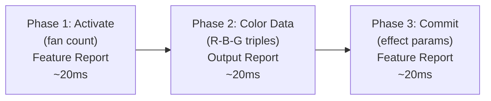

# 19 -- Lian Li Uni Hub Protocol Driver

> Complete protocol specification for the Lian Li fan hub family. Covers the ENE 6K77 HID protocol (SL, AL, SL V2, AL V2, SL Infinity), the TL Fan protocol, fan speed PWM, RPM telemetry, and white LED protection. Sufficient detail for clean-room Rust implementation.

**Status:** Draft (v2 -- research expansion)
**Crate:** `hypercolor-hal`
**Module path:** `hypercolor_hal::drivers::lianli`
**Author:** Nova
**Date:** 2026-03-28

---

## Table of Contents

1.  [Overview](#1-overview)
2.  [Device Registry](#2-device-registry)
3.  [Protocol Families](#3-protocol-families)
4.  [ENE 6K77 Protocol -- HID Transport](#4-ene-6k77-protocol--hid-transport)
5.  [ENE 6K77 Protocol -- Libusb Transport (Legacy)](#5-ene-6k77-protocol--libusb-transport-legacy)
6.  [TL Fan Protocol](#6-tl-fan-protocol)
7.  [Fan Speed Control](#7-fan-speed-control)
8.  [RPM Telemetry](#8-rpm-telemetry)
9.  [Motherboard Sync](#9-motherboard-sync)
10. [White Color Protection](#10-white-color-protection)
11. [Firmware Version Detection](#11-firmware-version-detection)
12. [HAL Integration](#12-hal-integration)
13. [Relationship to PrismRGB (Spec 20)](#13-relationship-to-prismrgb-spec-20)
14. [Testing Strategy](#14-testing-strategy)
15. [References](#15-references)

---

## 1. Overview

Native USB HID driver for Lian Li's fan hub controller family. These hubs centralize RGB and fan control for Lian Li's Uni Fan ecosystem -- SL, AL, SL V2, AL V2, SL Infinity, and TL fans.

**Three distinct protocol families:**

| Family | Chip | VID | Transport | Devices |
|--------|------|-----|-----------|---------|
| ENE 6K77 (modern) | ENE | `0x0CF2` | HID Feature + Output Reports | SL, AL, SL V2, AL V2, SL Infinity, Strimer L Connect |
| ENE 6K77 (legacy) | ENE | `0x0CF2` | libusb control transfers | Original Uni Hub |
| TL Fan | Nuvoton | `0x0416` | HID Output Reports | TL series hubs |

**Primary target:** SL Infinity (`0xA102`) -- Bliss's active hardware. Full coverage of all variants for completeness.

**Clean-room references:**
- OpenRGB's ENE-based controller implementations (`LianLiController/` -- 10 subdirectories)
- `sgtaziz/lian-li-linux` -- Rust L-Connect 3 replacement (619-line ENE driver, TL Fan driver)
- `EightB1ts/uni-sync` -- Rust fan speed control with per-model PWM formulas
- L-Connect 3 x OpenRGB Beta documentation

---

## 2. Device Registry

### 2.1 ENE 6K77 Hubs (VID `0x0CF2`)

| Controller | PID | Transport | Interface | Usage Page | Usage | LEDs/Fan | Max Fans/Group | Groups | Notes |
|---|---|---|---|---|---|---|---|---|---|
| Uni Hub (original) | `0x7750` | libusb | -- | -- | -- | 16 | 4 | 4 | Legacy control transfers |
| Uni Hub SL | `0xA100` | HID | 1 | `0xFF72` | `0xA1` | 16 | 4 | 4 | Single ring |
| Uni Hub AL | `0xA101` | HID | 1 | `0xFF72` | `0xA1` | 8+12 | 4 | 4 | Dual ring (fan+edge) |
| Uni Hub SL Infinity | `0xA102` | HID | 1 | `0xFF72` | `0xA1` | 8+12 | 4 | 4 | Dual ring, 8 logical channels |
| Uni Hub SL V2 | `0xA103` | HID | 1 | `0xFF72` | `0xA1` | 16 | 6 | 4 | V2 architecture |
| Uni Hub AL V2 | `0xA104` | HID | 1 | `0xFF72` | `0xA1` | 8+12 | 6 | 4 | V2 dual ring |
| Uni Hub SL V2a | `0xA105` | HID | 1 | `0xFF72` | `0xA1` | 16 | 6 | 4 | V2 revision |
| Uni Hub SL Redragon | `0xA106` | HID | 1 | `0xFF72` | `0xA1` | 16 | 4 | 4 | Redragon collab |
| Strimer L Connect | `0xA200` | HID | 1 | `0xFF72` | `0xA1` | variable | -- | 12 zones | LED cable strips |

### 2.2 TL Fan Hubs (VID `0x0416`)

| Controller | PID | Transport | Interface | Usage Page | Notes |
|---|---|---|---|---|---|
| TL Fan Hub | `0x7372` | HID | -- | `0xFF1B` | Per-fan addressing, synchronous R/R |

### 2.3 Other Lian Li (VID `0x0416`, Nuvoton)

| Controller | PID | Interface | Notes |
|---|---|---|---|
| GA II Trinity | `0x7373` | 2 | AIO cooler, distinct protocol |
| GA II Trinity Perf | `0x7371` | 2 | AIO cooler, distinct protocol |
| Universal Screen | `0x8050` | 0 | 8.8" LED matrix, libusb |

### 2.4 Wireless Dongles (future scope)

| VID | PID | Device | Transport |
|-----|-----|--------|-----------|
| `0x0416` | `0x8040` | Wireless TX Dongle V1 | USB bulk |
| `0x0416` | `0x8041` | Wireless RX Dongle V1 | USB bulk |
| `0x1A86` | `0xE304` | Wireless TX Dongle V2 (CH340) | USB bulk |
| `0x1A86` | `0xE305` | Wireless RX Dongle V2 (CH340) | USB bulk |

Wireless dongles use USB bulk transport with RF framing. Out of scope for initial implementation.

### 2.5 Model Properties

| Property | SL | AL | SL V2 | AL V2 | SL V2a | SL Infinity | SL Redragon |
|----------|----|----|-------|-------|--------|-------------|-------------|
| `is_v2` | no | no | **yes** | **yes** | **yes** | no | no |
| `uses_double_port` | no | **yes** | no | **yes** | no | **yes** | no |
| `max_fans_per_group` | 4 | 4 | 6 | 6 | 6 | 4 | 4 |
| `leds_per_fan` | 16 | 20 | 16 | 20 | 16 | 20 | 16 |
| Activate sub-cmd | `0x32` | `0x40` | `0x60` | `0x60` | `0x60` | `0x60` | `0x32` |

**`uses_double_port`**: When true, each fan group exposes two HID ports -- one for inner ring LEDs (8/fan), one for outer ring LEDs (12/fan). Color data and effect commits are sent separately per ring.

---

## 3. Protocol Families

### 3.1 ENE 6K77 -- Two Report Types

The ENE protocol uses **two distinct HID report types** for different operations. This is a critical implementation detail -- using the wrong report type causes silent failures.

| Operation | HID Report Type | Function |
|-----------|----------------|----------|
| Commands (activate, commit, fan config, firmware read) | **Feature Report** (`send_feature_report`) | Control operations |
| Color data | **Output Report** (`write`) | Bulk LED data |
| RPM / firmware responses | **Input Report** (`get_input_report`) | Read-back data |

All reports use **Report ID `0xE0`**.

**Response parsing convention:** All parsing examples in this spec assume the Report ID byte (`0xE0`) has been **stripped** by the transport layer. That is, `response[0]` refers to the first payload byte after the report ID. The transport's `read_input()` method is responsible for consuming and discarding the leading report ID byte before returning the payload buffer to the caller. This matches the behavior of `hidapi`'s `hid_get_input_report()` on most platforms, but implementations must verify platform-specific behavior (Windows HIDAPI includes the report ID in the buffer; Linux hidraw does not).

### 3.2 TL Fan -- Output Reports Only

The TL Fan protocol uses standard HID Output Reports with Report ID `0x01` and a 6-byte framing header. Synchronous request/response -- every command expects a read-back.

### 3.3 Timing

| Source | ENE Delay | TL Delay | Notes |
|--------|-----------|----------|-------|
| OpenRGB | 5ms | -- | Between every HID write |
| lian-li-linux | 20ms | 100ms read timeout | More conservative, production-tested |
| uni-sync | 200ms | -- | After sync commands specifically |

**Recommendation:** Use 20ms inter-command delay for ENE (matches lian-li-linux production driver). Use 5ms only if latency profiling shows it's safe for the specific variant.

---

## 4. ENE 6K77 Protocol -- HID Transport

All modern Lian Li hubs (PID `0xA100`+) use this protocol. Every packet starts with Report ID `0xE0`.

### 4.1 Three-Phase Lighting Update



### 4.2 Phase 1 -- Activate (Fan Quantity)

Announces how many fans are connected on a group. Must precede color data.

**Model-specific packet formats:**

#### SL / SL Redragon (`0xA100`, `0xA106`)

```
[0] 0xE0                           Report ID
[1] 0x10                           Command
[2] 0x32                           Sub-command
[3] (group << 4) | (qty & 0x0F)   Group + fan count packed
```
Packet size: 11 bytes (zero-padded).

#### AL (`0xA101`)

```
[0] 0xE0                           Report ID
[1] 0x10                           Command
[2] 0x40                           Sub-command
[3] group + 1                      1-indexed group
[4] qty                            Fan count (1-4)
[5] 0x00                           Padding
```
Packet size: 65 bytes (zero-padded).

#### SL V2 / SL V2a (`0xA103`, `0xA105`)

```
[0] 0xE0                           Report ID
[1] 0x10                           Command
[2] 0x60                           Sub-command
[3] (group << 4) | (qty & 0x0F)   Group + fan count packed
```
Packet size: 65 bytes (zero-padded).

#### AL V2 / SL Infinity (`0xA104`, `0xA102`)

```
[0] 0xE0                           Report ID
[1] 0x10                           Command
[2] 0x60                           Sub-command
[3] group + 1                      1-indexed group
[4] qty                            Fan count (1-4 for SL Infinity, 1-6 for AL V2)
[5] 0x00                           Padding
```
Packet size: 65 bytes (zero-padded).

#### SL Infinity Channel Pairing

The SL Infinity's 8 logical channels map to 4 physical fan groups. Each group exposes two LED zones (spinner ring + side band):

```
Logical channels 0, 1 -> Physical fan group 1 (inner, outer)
Logical channels 2, 3 -> Physical fan group 2
Logical channels 4, 5 -> Physical fan group 3
Logical channels 6, 7 -> Physical fan group 4
```

### 4.3 Phase 2 -- Color Data

Sends LED color values for a group. **Sent as an Output Report (write), NOT a Feature Report.**

```
[0] 0xE0                           Report ID
[1] 0x30 | port                    Port selector
[2+] R, B, G, R, B, G, ...        LED color data
```

**CRITICAL: Color byte order is R-B-G, NOT R-G-B.** Blue and green are swapped in the wire format. This applies to ALL ENE 6K77 variants. (TL Fan uses standard R-G-B.)

#### Port Calculation

| Model | Port Formula | Example: group 2, fan zone |
|-------|-------------|---------------------------|
| SL / SL V2 / SL V2a / Redragon | `group` | `0x32` |
| AL / AL V2 | `group * 2 + ring` | `0x34` (inner), `0x35` (outer) |
| SL Infinity | `group * 2 + ring` | `0x34` (inner), `0x35` (outer) |

Where `ring` = 0 for inner (fan) LEDs, 1 for outer (edge) LEDs.

#### Dual-Ring Color Packing (AL, AL V2, SL Infinity)

Each fan has two LED rings packed into separate color data packets:

| Ring | LEDs/Fan | Buffer Size (4 fans) | Port Offset |
|------|----------|---------------------|-------------|
| Inner (fan) | 8 | 4 x 8 x 3 = 96 bytes | `group * 2` |
| Outer (edge) | 12 | 4 x 12 x 3 = 144 bytes | `group * 2 + 1` |

Both rings require their own Phase 1 -> Phase 2 -> Phase 3 sequence.

#### Color Data Packing -- Per-LED Mode

LEDs are addressed sequentially within each fan:

```
for each LED (0..total):
    fan_idx = led / leds_per_fan
    led_in_fan = led % leds_per_fan
    offset = (fan_idx * leds_per_fan + led_in_fan) * 3
    buffer[offset + 0] = R
    buffer[offset + 1] = B    // swapped!
    buffer[offset + 2] = G    // swapped!
```

#### Color Data Packing -- Effect Mode

Effect modes use a palette of 1-6 colors expanded across the fan array:

**Full-array effects (Static, Breathing):** Each color is repeated for all LEDs of one fan:

```
for fan_idx in 0..num_fans:
    color = palette[fan_idx % palette.len()]
    for led in 0..leds_per_fan:
        buffer[offset + 0] = color.r
        buffer[offset + 1] = color.b
        buffer[offset + 2] = color.g
```

**Palette effects (2-4 colors):** Colors are arranged in a compact grid, with each color filling 6 "slots" of `leds_per_fan` bytes. The device interpolates between palette entries during animation.

```
for color_idx in 0..palette.len():
    for slot in 0..6:
        buffer[slot * palette.len() * 3 + color_idx * 3 + 0] = color.r
        buffer[slot * palette.len() * 3 + color_idx * 3 + 1] = color.b
        buffer[slot * palette.len() * 3 + color_idx * 3 + 2] = color.g
```

#### Packet Sizes

| Variant | Ring | Max Payload | Total Packet |
|---------|------|------------|--------------|
| SL (`0xA100`) | single | 4 x 16 x 3 = 192B | 194B (dynamic) |
| AL (`0xA101`) | inner (fan) | 4 x 8 x 3 = 96B | 146B (zero-padded) |
| AL (`0xA101`) | outer (edge) | 4 x 12 x 3 = 144B | 146B |
| SL V2 (`0xA103`) | single | 6 x 16 x 3 = 288B | 353B (zero-padded) |
| AL V2 (`0xA104`) | inner (fan) | 6 x 8 x 3 = 144B | 353B (zero-padded) |
| AL V2 (`0xA104`) | outer (edge) | 6 x 12 x 3 = 216B | 353B (zero-padded) |
| SL Infinity (`0xA102`) | inner (fan) | 4 x 8 x 3 = 96B | 353B (zero-padded) |
| SL Infinity (`0xA102`) | outer (edge) | 4 x 12 x 3 = 144B | 353B (zero-padded) |

**SL Infinity note:** Despite sharing the `0x60` sub-command and 353-byte packet size with SL V2, the SL Infinity's protocol view is **4 physical groups x 2 ports** (inner/outer), NOT 8 independent single-ring channels. Each group requires two complete Phase 1-2-3 sequences (one per ring).

### 4.4 Phase 3 -- Commit (Effect Apply)

Activates the lighting configuration. **Sent as a Feature Report.**

```
[0] 0xE0                           Report ID
[1] 0x10 | port                    Port selector (same formula as Phase 2)
[2] effect                         Mode byte (see SS 4.5)
[3] speed                          Speed byte (see SS 4.6)
[4] direction                      Direction byte (see SS 4.7)
[5] brightness                     Brightness byte (see SS 4.8)
```

Packet size: 65 bytes for AL/SLV2/SL Infinity, 11 bytes for SL.

#### AL Dual-Zone Commit Behavior

Some AL effects update both fan and edge zones; others update fan only:

| Updates Both Rings | Fan Only |
|---|---|
| Static, Breathing, Runway, Meteor | Rainbow, Rainbow Morph, Taichi, Color Cycle, Warning, Voice, Spinning Teacup, Tornado, Mixing, Stack, Staggered, Tide, Scan, Contest |

### 4.5 Frame Commit (Global Apply)

After completing the per-port 3-phase sequence for all active groups, send a global frame commit:

```
[0] 0xE0
[1] 0x60
[2] 0x00
[3] 0x01
```

This triggers the device to latch all pending updates atomically. Documented in `lian-li-linux` but absent from OpenRGB (which relies on per-channel commits only).

### 4.6 Effect Byte Tables

#### SL V2 / AL V2 / SL Infinity Effects

| Effect | Byte | Palette Size | Direction | Notes |
|--------|------|-------------|-----------|-------|
| Static Color | `0x01` | full array | -- | Per-LED direct control |
| Breathing | `0x02` | full array | -- | Fade in/out cycle |
| Rainbow Morph | `0x04` | 0 | -- | Spectrum shift |
| Rainbow Wave | `0x05` | 0 | yes | Traveling rainbow |
| Staggered | `0x18` | 2 | -- | Alternating segments |
| Tide | `0x1A` | 2 | -- | Wave pattern |
| Runway | `0x1C` | 2 | -- | Chase pattern |
| Mixing | `0x1E` | 2 | -- | Color blend |
| Stack | `0x20` | 1 | yes | Stacking animation |
| Stack Multi Color | `0x21` | 0 | yes | Rainbow stack |
| Neon | `0x22` | 0 | -- | Neon pulse |
| Color Cycle | `0x23` | 3 | yes | Rotate through colors |
| Meteor | `0x24` | 2 | -- | Shooting star |
| Voice | `0x26` | 0 | -- | Audio reactive (device-side) |
| Groove | `0x27` | 2 | yes | Rhythmic pattern |
| Render | `0x28` | 4 | yes | Multi-color sweep |
| Tunnel | `0x29` | 4 | yes | Tunnel vision effect |

**Merged effects** (SLV2 / SL Infinity only -- synchronized across all channels):

| Effect | Byte |
|--------|------|
| Meteor Merged | `0x2A` |
| Runway Merged | `0x2B` |
| Tide Merged | `0x2C` |
| Mixing Merged | `0x2D` |
| Stack Multi Color Merged | `0x2E` |

#### SL Effects (Original)

Same byte values as SLV2 where they overlap. Merged modes use a separate `SendMerge` packet (sub-command `0x33`/`0x34`) rather than distinct mode bytes:

**Merge packet (SL only):**

```
Unmerge:  [0xE0, 0x10, 0x34, 0x00, ...]
Merge:    [0xE0, 0x10, 0x33, 0x00, 0x01, 0x02, 0x03, 0x08, ...]
```

#### AL Effects (Different Byte Map!)

The AL (`0xA101`) uses a **completely different** mode byte mapping:

| Effect | Byte |
|--------|------|
| Static | `0x01` |
| Breathing | `0x02` |
| Meteor | `0x19` |
| Runway | `0x1A` |
| Rainbow Wave | `0x28` |
| Color Cycle | `0x2B` |
| Taichi | `0x2C` |
| Warning | `0x2D` |
| Voice | `0x2E` |
| Mixing | `0x2F` |
| Stack | `0x30` |
| Tide | `0x31` |
| Scan | `0x32` |
| Contest | `0x33` |
| Rainbow Morph | `0x35` |
| Tornado | `0x36` |
| Staggered | `0x37` |
| Spinning Teacup | `0x38` |

#### Non-Normative: lian-li-linux Effect Map

> **This section is informational only.** The OpenRGB tables above are the canonical byte values for this spec. The mapping below is included for reference and future investigation.

The `lian-li-linux` project uses a simpler mode numbering that may represent an older firmware mapping or an alternative command path:

| Effect | Byte |
|--------|------|
| Off | 0 |
| Static | 1 |
| Breathing | 2 |
| Color Cycle | 3 |
| Rainbow | 4 |
| Runway | 5 |
| Meteor | 6 |
| Staggered | 7 |
| Tide | 8 |
| Mixing | 9 |

The relationship to the OpenRGB mode bytes is unresolved. They may be firmware-version-dependent, represent a different register path, or be a simplified abstraction. **Do not use these values for implementation** -- use the OpenRGB-sourced tables in the preceding sections.

### 4.7 Speed Byte Encoding

Counter-intuitive mapping -- medium is 0, values wrap around through 0xFF:

| Level | Byte | Description |
|-------|------|-------------|
| 0% (slowest) | `0x02` | Very slow |
| 25% | `0x01` | Slow |
| 50% | `0x00` | Medium |
| 75% | `0xFF` | Fast |
| 100% (fastest) | `0xFE` | Very fast |

**Note:** The original hub (`0x7750`) uses different speed values.

### 4.8 Brightness Byte Encoding

Inverse mapping -- `0x00` is brightest:

| Level | Byte | Description |
|-------|------|-------------|
| 100% (brightest) | `0x00` | Full |
| 75% | `0x01` | Bright |
| 50% | `0x02` | Medium |
| 25% | `0x03` | Dim |
| 0% (off) | `0x08` | Black |

### 4.9 Direction Byte

| Direction | Byte |
|-----------|------|
| Left to Right / Clockwise | `0x00` |
| Right to Left / Counter-clockwise | `0x01` |

---

## 5. ENE 6K77 Protocol -- Libusb Transport (Legacy)

The original Uni Hub (`0x7750`) uses USB vendor-specific control transfers with register-addressed `wIndex` values. No HID report protocol.

### 5.1 Control Transfer Parameters

| Operation | bmRequestType | bRequest | wValue | wIndex | Data |
|-----------|---------------|----------|--------|--------|------|
| Write | `0x40` | `0x80` | `0x0000` | register address | config bytes |
| Read | `0xC0` | `0x81` | `0x0000` | register address | response buffer |

### 5.2 Register Address Map

**LED registers:**

| Register | Ch 1 | Ch 2 | Ch 3 | Ch 4 | Size | Purpose |
|----------|------|------|------|------|------|---------|
| LED data | `0xE300` | `0xE3C0` | `0xE480` | `0xE540` | 192B | Color buffer (R-B-G) |
| Mode | `0xE021` | `0xE031` | `0xE041` | `0xE051` | 1B | Effect mode byte |
| Speed | `0xE022` | `0xE032` | `0xE042` | `0xE052` | 1B | Speed byte |
| Direction | `0xE023` | `0xE033` | `0xE043` | `0xE053` | 1B | Direction byte |
| Brightness | `0xE029` | `0xE039` | `0xE049` | `0xE059` | 1B | Brightness byte |
| LED commit | `0xE02F` | `0xE03F` | `0xE04F` | `0xE05F` | 1B | Write `0x01` to apply |

**Fan registers:**

| Register | Ch 1 | Ch 2 | Ch 3 | Ch 4 | Size | Purpose |
|----------|------|------|------|------|------|---------|
| Hub action | `0xE8A0` | `0xE8A2` | `0xE8A4` | `0xE8A6` | -- | Fan hub enable/config |
| Hub commit | `0xE890` | `0xE891` | `0xE892` | `0xE893` | 1B | Hub control commit |
| PWM action | `0xE818` | `0xE81A` | `0xE81C` | `0xE81E` | -- | PWM duty config |
| PWM commit | `0xE810` | `0xE811` | `0xE812` | `0xE813` | 1B | PWM control commit |
| RPM read | `0xE800` | `0xE802` | `0xE804` | `0xE806` | 2B | RPM (big-endian u16) |

**Global registers:**

| Register | Purpose |
|----------|---------|
| `0xB500` | Firmware version (5B read) |
| `0xE02F` | Global LED commit |

Color buffer: 192 bytes = 64 LEDs x 3 bytes (R-B-G order). Timing: 5ms delay after every control transfer.

**ARGB sync magic bytes (legacy only):** When motherboard ARGB sync is enabled on the original hub, OpenRGB writes sentinel bytes `{0x66, 0x33, 0xCC}` to color buffer bytes 6-8 as a sync indicator. This behavior is specific to the libusb legacy controller and does **not** apply to modern HID hubs.

**Why libusb?** The original hub requires custom `wIndex` values in control transfers that HIDAPI cannot express. All modern variants switched to HID reports.

---

## 6. TL Fan Protocol

The TL series uses a **completely different protocol** from the ENE-based hubs. Uses standard HID Output Reports with a framed packet structure.

### 6.1 Identification

| Property | Value |
|----------|-------|
| VID | `0x0416` (Nuvoton) |
| PID | `0x7372` |
| Usage Page | `0xFF1B` |
| Report ID | `0x01` |
| Packet Size | 64 bytes |
| Payload | 58 bytes (64 - 6 header) |

### 6.2 Packet Structure

```
[0] 0x01                           Report ID
[1] command                        Command byte (see SS 6.3)
[2] 0x00                           Reserved
[3] pkt_num_hi                     Packet number (big-endian u16)
[4] pkt_num_lo
[5] data_len                       Payload length
[6+] payload                       Command-specific data
```

**Synchronous protocol:** Every command write is followed by a response read. 100ms read timeout.

### 6.3 Commands

**Fully specified (implemented in initial driver):**

| Byte | Command | Description | Payload |
|------|---------|-------------|---------|
| `0xA1` | Handshake | Discover fans + read RPMs | -- |
| `0xA3` | SetFanLight | Per-fan RGB control | 20 bytes |
| `0xA6` | GetProductInfo | Read firmware version | -- |
| `0xAA` | SetFanSpeed | Per-fan PWM duty | 2 bytes |
| `0xB0` | SetFanGroupLight | Group RGB control | 20 bytes |

**Out of scope for initial implementation** (payload layouts not fully documented):

| Byte | Command | Description | Notes |
|------|---------|-------------|-------|
| `0xAD` | SetFanGroup | Group fans for LED sync | Requires per-port group mapping research |
| `0xAE` | SetFanDirection | Per-fan LR/TB swap | Reversible fan orientation |
| `0xAF` | SetPortDirection | Port-level direction | Port-wide orientation |
| `0xB1` | SetMbRpmSync | Motherboard PWM sync | MB header passthrough |

These commands are documented in `sgtaziz/lian-li-linux` but require additional validation before inclusion in this spec.

### 6.4 Handshake (Fan Discovery)

**Command:** `0xA1` with empty payload.

**Response:** 3 bytes per detected fan:

```
Byte 0: [7] is_detected | [6] is_upgrading | [5:4] port | [3:0] fan_index
Byte 1: RPM high byte
Byte 2: RPM low byte
```

Fan count = `response[5] / 3` (data_len / bytes_per_entry).

### 6.5 SetFanLight Payload (20 bytes)

```
[0]  (port << 4) | is_sync         Port + sync flag
[1]  (port << 4) | fan_index       Fan address
[2]  mode                          Effect mode (1-28)
[3]  brightness                    Brightness (0-4)
[4]  speed                         Speed (0-4)
[5-7]   R, G, B                    Color 1 (standard RGB!)
[8-10]  R, G, B                    Color 2
[11-13] R, G, B                    Color 3
[14-16] R, G, B                    Color 4
[17] direction                     0-5: CW/CCW/Up/Down/Spread/Gather
[18] disable                       0=enabled, 1=disabled
[19] color_count                   Number of active colors
```

**IMPORTANT:** TL Fan uses standard R-G-B byte order, unlike ENE's R-B-G.

### 6.6 SetFanSpeed

```
[0] (port << 4) | (fan_index & 0x0F)    Fan address
[1] duty                                  PWM duty (0-255)
```

TL supports **per-fan** speed control (ENE only supports per-group).

### 6.7 TL Fan LED Layout

Each TL fan has **26 LEDs** arranged across two sides (the TL's dual-sided transparent design). This matches the Hypercolor attachment model (`data/attachments/builtin/lian-li/lian-li-tl-fan.toml`, `count = 26`).

Group setup uses two groups per port (top/bottom sides):

```
Top group:    (port * 4) * 2
Bottom group: (port * 4) * 2 + 1
```

**Topology limits:** 4 ports, max 10 fans per port, max 16 fans total per controller (per Lian Li TL Fan Number Guide). Fan count per port is discovered dynamically via the Handshake command.

---

## 7. Fan Speed Control

### 7.1 ENE 6K77 Speed Command

```
[0] 0xE0
[1] 0x20 | group                   Group (0-3)
[2] 0x00
[3] duty                           PWM duty byte (0-255)
```

Sent as a **Feature Report**.

### 7.2 PWM Duty Formulas (Percentage -> Byte)

Each model variant uses a different mapping from percentage to duty byte. These formulas are from `uni-sync`:

| Model | Formula | 0% Value |
|-------|---------|----------|
| SL / AL | `floor((800 + 11 * percent) / 19)` | `0x28` (40) |
| SL Infinity | `floor((250 + 17.5 * percent) / 20)` | `0x0A` (10) |
| SL V2 / AL V2 | `floor((200 + 19 * percent) / 21)` | `0x07` (7) |

**Zero percent has special minimum values** -- the device won't spin below these (prevents stall).

### 7.3 TL Fan Speed

Uses `SetFanSpeed` command (`0xAA`) with per-fan addressing. Direct 0-255 duty, no model-specific formula needed.

### 7.4 Timing Caveat

`uni-sync` uses 100ms delay between successive speed writes to the same group to avoid race conditions. This is more conservative than the general 20ms inter-command delay.

---

## 8. RPM Telemetry

### 8.1 ENE 6K77 RPM Read

**Command (Feature Report):**

```
[0] 0xE0
[1] 0x50
[2] 0x00
```

**Response (Input Report):**

| Variant | Response Length | Format |
|---------|---------------|--------|
| Standard (SL, AL, SL Infinity, Redragon) | 8 bytes | 4 x u16 big-endian RPM |
| V2 (SL V2, AL V2, SL V2a) | **9 bytes** | 1 padding byte + 4 x u16 big-endian RPM |

```rust
// Standard models
let rpm_group_0 = u16::from_be_bytes([response[0], response[1]]);
let rpm_group_1 = u16::from_be_bytes([response[2], response[3]]);

// V2 models -- skip padding byte
let rpm_group_0 = u16::from_be_bytes([response[1], response[2]]);
let rpm_group_1 = u16::from_be_bytes([response[3], response[4]]);
```

### 8.2 TL Fan RPM

RPM data is returned as part of the handshake response (see SS 6.4). Each fan entry includes a big-endian u16 RPM value. No separate RPM read command needed -- just re-issue the handshake.

### 8.3 Original Hub RPM

Uses register reads at addresses `0xE800`-`0xE806`, returning 2-byte big-endian u16 per channel.

---

## 9. Motherboard Sync

ENE hubs can sync fan speed and ARGB control to motherboard headers, deferring to the motherboard's PWM signal or ARGB output instead of software control.

### 9.1 RPM Sync (Fan Speed from Motherboard)

```
[0] 0xE0
[1] 0x10
[2] <sub_cmd>                      Model-dependent (see below)
[3] <data>                         Bitmask encoding
[4] 0x00
[5] 0x00
```

**Sub-command by model:**

| Model | Sub-cmd |
|-------|---------|
| SL / SL Redragon | `0x31` |
| AL | `0x42` |
| SL V2 / AL V2 / SL Infinity | `0x62` |

**Data byte:** `(1 << (group + 4)) | ((sync_flag as u8) << group)`

`uni-sync` uses 200ms delay after sync commands.

### 9.2 ARGB Sync (LED Colors from Motherboard)

Same packet structure, different sub-commands:

| Model | Sub-cmd |
|-------|---------|
| SL / SL Redragon | `0x30` |
| AL | `0x41` |
| SL V2 / AL V2 / SL Infinity | `0x61` |

The ARGB sync enable/disable state is communicated via the sub-command packet above. Note: the legacy libusb hub (SS 5.2) uses sentinel bytes `{0x66, 0x33, 0xCC}` in the color buffer as a sync indicator, but this does **not** apply to modern HID hubs.

---

## 10. White Color Protection

Lian Li hubs include recommended brightness limiting to prevent LED damage from sustained full-white output.

### 10.1 Sum-Based Limiter (SLV2 / SL Infinity / AL V2)

```rust
fn brightness_limit(r: u8, g: u8, b: u8) -> (u8, u8, u8) {
    let sum = r as u16 + g as u16 + b as u16;
    if sum > 460 {
        let scale = 460.0 / sum as f32;
        (
            (r as f32 * scale) as u8,
            (g as f32 * scale) as u8,
            (b as f32 * scale) as u8,
        )
    } else {
        (r, g, b)
    }
}
```

Proportional scaling preserves hue. Threshold: R + G + B > 460.

### 10.2 Equality-Based Limiter (AL / Original Hub)

```rust
fn al_brightness_limit(r: u8, g: u8, b: u8) -> (u8, u8, u8) {
    if r > 153 && r == g && g == b {
        (153, 153, 153)
    } else {
        (r, g, b)
    }
}
```

Only triggers on pure white/grey. Max white: `(153, 153, 153)`.

### 10.3 SL (Original)

No software-side limiter. Relies on the 5-level brightness scale.

### 10.4 Application Order

The limiter is applied **before** R-B-G reordering. Operates on standard RGB values, then swaps B/G for wire encoding.

---

## 11. Firmware Version Detection

### 11.1 ENE 6K77 Firmware Read

**Command (Feature Report):**

```
[0] 0xE0
[1] 0x50
[2] 0x01
```

**Response (Input Report):** 5 bytes:

| Byte | Field |
|------|-------|
| 0 | `customer_id` |
| 1 | `project_id` |
| 2 | `major_id` |
| 3 | `minor_id` |
| 4 | `fine_tune` |

### 11.2 Version String Calculation

```rust
fn firmware_version(fine_tune: u8) -> String {
    if fine_tune < 8 {
        "1.0".to_string()
    } else {
        let v = ((fine_tune >> 4) * 10 + (fine_tune & 0x0F) + 2) as f32 / 10.0;
        format!("{v:.1}")
    }
}
```

Examples: `fine_tune = 0x06` -> "1.0", `fine_tune = 0x15` -> "1.7", `fine_tune = 0x16` -> "1.8"

### 11.3 Firmware-Gated Detection

Some hub PIDs dispatch to different drivers based on firmware version:

| PID | Firmware | Driver |
|-----|----------|--------|
| `0xA100` | `v1.8` only | SL HID driver |
| `0xA101` | `v1.7` | AL HID driver |
| `0xA101` | `v1.0` | AL10 libusb driver (falls back to control transfers) |

SLV2, ALV2, SL Infinity, and Redragon accept all firmware versions.

### 11.4 HID Product String Parsing

OpenRGB additionally parses firmware from the HID product string descriptor:

- SL: `"LianLi-UNI FAN-SL-v1.8"` -- extract after last `-`
- AL: `"LianLi-UNI FAN-AL-v1.7"` -- extract 4 chars after last `-`

### 11.5 TL Fan Firmware

Uses `GetProductInfo` command (`0xA6`). Response contains ASCII firmware version string.

---

## 12. HAL Integration

### 12.1 Hub Variant Enum

```rust
/// Lian Li hub hardware variant.
///
/// Parameterizes packet format, LED layout, and feature differences.
#[derive(Debug, Clone, Copy, PartialEq, Eq)]
pub enum LianLiHubVariant {
    /// Original hub (0x7750) -- libusb control transfers.
    Original,
    /// SL hub (0xA100) -- 11-byte HID packets, single ring.
    Sl,
    /// AL hub (0xA101) -- 65-byte HID, dual ring (fan+edge).
    Al,
    /// SL V2 / SL V2a (0xA103, 0xA105) -- 65-byte HID, V2 single ring.
    SlV2,
    /// AL V2 (0xA104) -- 65-byte HID, V2 dual ring (fan+edge).
    AlV2,
    /// SL Infinity (0xA102) -- 65-byte HID, 8 channels, dual ring.
    SlInfinity,
    /// SL Redragon (0xA106) -- 11-byte HID, single ring.
    SlRedragon,
    /// TL Fan (0x7372) -- 64-byte packets, per-fan control.
    TlFan,
}

impl LianLiHubVariant {
    pub fn activate_sub_cmd(self) -> u8 {
        match self {
            Self::Sl | Self::SlRedragon => 0x32,
            Self::Al => 0x40,
            Self::SlV2 | Self::AlV2 | Self::SlInfinity => 0x60,
            Self::Original | Self::TlFan => 0x00,
        }
    }

    pub fn group_count(self) -> u8 {
        match self {
            Self::TlFan => 4,  // 4 ports, per-fan within
            Self::SlInfinity => 4, // 4 physical groups, 8 logical channels
            _ => 4,
        }
    }

    pub fn logical_channel_count(self) -> u8 {
        match self {
            Self::SlInfinity => 8,
            _ => 4,
        }
    }

    pub fn uses_double_port(self) -> bool {
        matches!(self, Self::Al | Self::AlV2 | Self::SlInfinity)
    }

    pub fn is_v2(self) -> bool {
        matches!(self, Self::SlV2 | Self::AlV2)
    }

    pub fn max_fans_per_group(self) -> u8 {
        match self {
            Self::SlV2 | Self::AlV2 => 6,
            _ => 4,
        }
    }

    pub fn leds_per_fan(self) -> u8 {
        match self {
            Self::Al | Self::AlV2 | Self::SlInfinity => 20, // 8 inner + 12 outer
            Self::TlFan => 26,
            _ => 16,
        }
    }

    pub fn color_order(self) -> ColorOrder {
        match self {
            Self::TlFan => ColorOrder::Rgb,
            _ => ColorOrder::Rbg,
        }
    }
}
```

### 12.2 Protocol Implementation

```rust
/// ENE 6K77 protocol encoder/decoder.
///
/// Pure byte encoding for the 3-phase HID protocol. Contains no I/O.
pub struct Ene6k77Protocol {
    variant: LianLiHubVariant,
    fan_counts: [u8; 8],
}

/// TL Fan protocol encoder/decoder.
///
/// Framed packet protocol with request/response semantics. Contains no I/O.
pub struct TlFanProtocol {
    packet_counter: u16,
}
```

### 12.3 Transport Layer

```rust
/// HID transport for modern ENE hubs (0xA100+).
///
/// Uses feature reports for commands, output reports for color data.
pub struct Ene6k77Transport {
    device: nusb::Device,
    interface: u8,  // always 1
}

impl Ene6k77Transport {
    /// Send a command via HID Feature Report.
    /// Data must include Report ID 0xE0 as the first byte.
    pub fn send_feature(&self, data: &[u8]) -> Result<()>;

    /// Send color data via HID Output Report.
    /// Data must include Report ID 0xE0 as the first byte.
    pub fn write_output(&self, data: &[u8]) -> Result<()>;

    /// Read response via HID Input Report.
    /// Returns payload bytes with Report ID stripped.
    /// All parsing offsets in this spec assume this convention.
    pub fn read_input(&self, buf: &mut [u8]) -> Result<usize>;
}

/// Libusb control transfer transport for original hub (0x7750).
pub struct LegacyCtrlTransport {
    device: nusb::Device,
}

/// HID transport for TL Fan hubs.
pub struct TlFanTransport {
    device: nusb::Device,
    read_timeout: Duration,  // 100ms
}
```

### 12.4 Device Family

Requires `DeviceFamily::LianLi` in `hypercolor-types`:

```rust
pub enum DeviceFamily {
    // ... existing variants
    LianLi,
}
```

### 12.5 Protocol Database Registration

```rust
// ENE HID hubs
lianli_device!(UNI_HUB_SL,          0x0CF2, 0xA100, "Lian Li Uni Hub - SL",          Sl);
lianli_device!(UNI_HUB_AL,          0x0CF2, 0xA101, "Lian Li Uni Hub - AL",          Al);
lianli_device!(UNI_HUB_SL_INFINITY, 0x0CF2, 0xA102, "Lian Li Uni Hub - SL Infinity", SlInfinity);
lianli_device!(UNI_HUB_SL_V2,       0x0CF2, 0xA103, "Lian Li Uni Hub - SL V2",       SlV2);
lianli_device!(UNI_HUB_AL_V2,       0x0CF2, 0xA104, "Lian Li Uni Hub - AL V2",       AlV2);
lianli_device!(UNI_HUB_SL_V2A,      0x0CF2, 0xA105, "Lian Li Uni Hub - SL V2a",      SlV2);
lianli_device!(UNI_HUB_SL_REDRAGON, 0x0CF2, 0xA106, "Lian Li Uni Hub - SL Redragon", SlRedragon);
lianli_device!(STRIMER_L_CONNECT,    0x0CF2, 0xA200, "Lian Li Strimer L Connect",     Sl);

// ENE Legacy
lianli_device!(UNI_HUB_ORIGINAL,    0x0CF2, 0x7750, "Lian Li Uni Hub",               Original);

// TL Fan
lianli_device!(TL_FAN_HUB,          0x0416, 0x7372, "Lian Li TL Fan Hub",            TlFan);
```

---

## 13. Relationship to PrismRGB (Spec 20)

PrismRGB controllers (Spec 20) and Lian Li Uni Hubs are **completely separate hardware** with different VIDs and protocols.

| Aspect | PrismRGB (Spec 20) | Uni Hub (This Spec) |
|--------|-------------------|---------------------|
| VIDs | `0x16D5`, `0x16D2`, `0x16D0` | `0x0CF2` (ENE), `0x0416` (Nuvoton) |
| Protocol | `0xFC`/`0xFE` HID commands | 3-phase ENE or framed TL |
| Color format | GRB or RGB (varies) | **R-B-G** (ENE) or R-G-B (TL) |

**Strimer cable disambiguation:** Both ecosystems can drive Strimer LED cables through different controllers:
- PrismRGB Prism S (`0x16D0:0x1294`) -- Spec 20 protocol
- Strimer L Connect (`0x0CF2:0xA200`) -- this spec's ENE protocol

Same cable, different protocols, different drivers. VID matching prevents confusion.

---

## 14. Testing Strategy

### 14.1 Mock Transports

```rust
/// Mock ENE HID transport.
struct MockEneTransport {
    feature_writes: Vec<Vec<u8>>,    // Feature reports sent
    output_writes: Vec<Vec<u8>>,     // Output reports sent (color data)
    input_responses: VecDeque<Vec<u8>>, // Queued read responses
}

/// Mock TL Fan transport.
struct MockTlFanTransport {
    writes: Vec<Vec<u8>>,
    responses: VecDeque<Vec<u8>>,
}
```

### 14.2 Test Categories

**3-phase protocol validation:**
- Phase 1: Verify activate packet format per variant (sub-command, channel encoding)
- Phase 2: Verify R-B-G color ordering for ENE, R-G-B for TL
- Phase 2: Verify color data sent as Output Report (not Feature Report)
- Phase 3: Verify commit packet with correct effect/speed/direction/brightness
- Full sequence: activate -> color -> commit -> frame commit

**Per-model packet format:**
- SL: 11-byte packets, `0x32` sub-command
- AL: 65-byte packets, `0x40` sub-command, fan+edge dual sequence
- SLV2: 65-byte packets, `0x60` sub-command, `(group << 4) + fans`
- SL Infinity: 65-byte packets, 8-channel addressing, paired groups
- TL: 64-byte framed packets, handshake discovery

**Color encoding round-trip:**
- ENE: Input RGB `(255, 128, 64)` -> wire `(255, 64, 128)` (B/G swap)
- TL: Input RGB `(255, 128, 64)` -> wire `(255, 128, 64)` (no swap)

**White color protection:**
- Sum-based: `(200, 200, 200)` -> sum 600 > 460 -> `(153, 153, 153)`
- Sum-based: `(255, 0, 0)` -> sum 255 <= 460 -> unchanged
- Equality-based: `(200, 200, 200)` -> clamped to `(153, 153, 153)`
- Equality-based: `(200, 100, 50)` -> unchanged

**Fan speed & RPM:**
- PWM formula per model variant against uni-sync reference values
- RPM parsing: standard (8-byte) vs V2 (9-byte with padding)
- TL per-fan speed addressing

**Firmware version parsing:**
- `fine_tune = 0x06` -> "1.0"
- `fine_tune = 0x15` -> "1.7"
- `fine_tune = 0x16` -> "1.8"
- Firmware-gated driver dispatch for PID `0xA101`

**Effect byte mapping:**
- Verify SLV2 and AL use different mode byte tables
- Merged mode bytes only on SLV2/SL Infinity
- TL uses simple 1-28 mode range

---

## 15. References

### Source Code

- `~/dev/OpenRGB/Controllers/LianLiController/` -- 10 controller subdirectories, C++
- `sgtaziz/lian-li-linux` -- Full Rust L-Connect 3 replacement (ENE, TL, wireless, LCD)
  - `crates/lianli-devices/src/ene6k77.rs` -- 619 lines, best single-file ENE reference
  - `crates/lianli-devices/src/tl_fan.rs` -- TL Fan protocol
- `EightB1ts/uni-sync` -- Rust fan speed + PWM sync, per-model formulas
- `EightB1ts/FanControl.LianLi` -- C# Windows fan plugin
- `yannlambret/ll-uni-fan-linux` -- Rust fan speed daemon, YAML protocol defs
- `liquidctl/liquidctl` PR #738 -- Python Lian Li Uni Fan support

### OpenRGB Merge Requests & Issues

- MR !369 -- Original Uni Hub support
- MR !1647 -- SL V2 support
- MR !1195 -- AL firmware v1.0/v1.7 variant detection
- Issue #3072 -- SL V2 device request
- Issue #4209 -- SL V2 found but not responding
- Issue #4882 -- TL Series Hub (PID 0x7372)
- Issue #3729 -- AL V2 (PID 0xA104)

### Official

- L-Connect 3 x OpenRGB Beta: `lian-li.com/l-connect-3-x-openrgb/`
