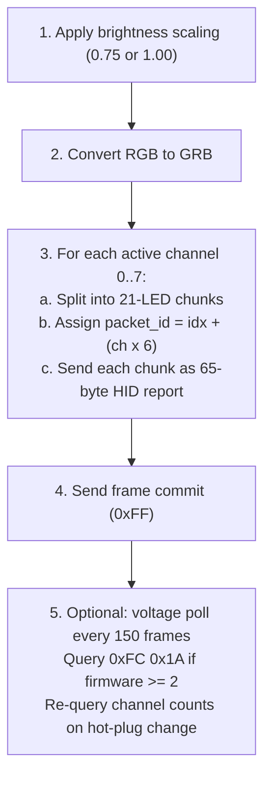
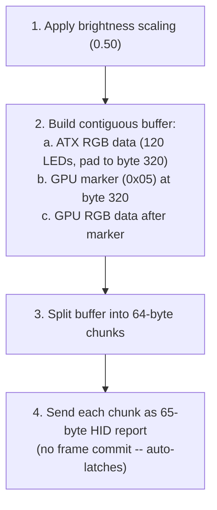
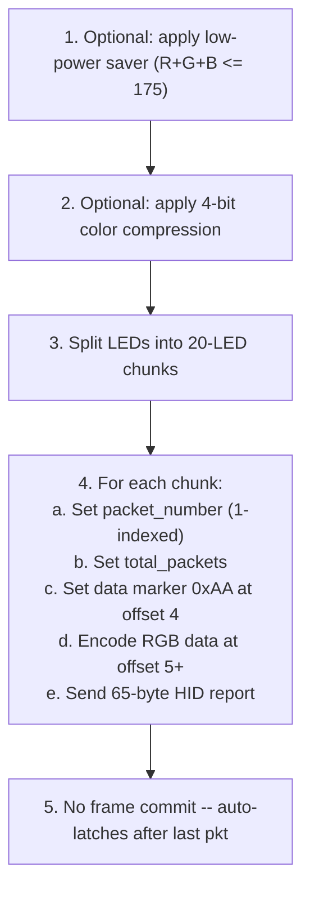

# 20 -- PrismRGB Protocol Driver

> Native USB HID driver for the PrismRGB and Nollie controller family. Four controller variants, two color orderings, three packetization strategies, and clean-room integration with the HAL.

**Status:** Draft
**Crate:** `hypercolor-hal`
**Module path:** `hypercolor_hal::drivers::prismrgb`
**Author:** Nova
**Date:** 2026-03-04
**Supersedes:** Spec 04 (USB HID Backend — now deprecated)

---

## Table of Contents

1. [Overview](#1-overview)
2. [Device Registry](#2-device-registry)
3. [Common Protocol Foundation](#3-common-protocol-foundation)
4. [Prism 8 / Nollie 8 v2 Protocol](#4-prism-8--nollie-8-v2-protocol)
5. [Prism S Protocol](#5-prism-s-protocol)
6. [Prism Mini Protocol](#6-prism-mini-protocol)
7. [HAL Integration](#7-hal-integration)
8. [Render Pipeline](#8-render-pipeline)
9. [Migration from Spec 04](#9-migration-from-spec-04)
10. [Testing Strategy](#10-testing-strategy)

---

## 1. Overview

Native USB HID driver for PrismRGB and Nollie LED controllers via the `hypercolor-hal` abstraction layer. All four controllers communicate over USB HID with 65-byte reports (1-byte report ID + 64-byte payload), sharing a common command vocabulary but differing in channel layout, color format, and packetization strategy.

Clean-room implementation derived from publicly available protocol knowledge:

- OpenRGB's `ENESMBusInterface` and `LianLiController` implementations (C++)
- uni-sync Rust crate by EightB1ts
- Original community driver source documentation

### Controller Family

| Controller      | Channels | Max LEDs | Color Format | Unique Traits                              |
| --------------- | -------- | -------- | ------------ | ------------------------------------------ |
| **Prism 8**     | 8        | 1,008    | GRB          | Voltage monitoring, dynamic channel counts |
| **Nollie 8 v2** | 8        | 1,008    | GRB          | Identical protocol to Prism 8              |
| **Prism S**     | 2        | 282      | RGB          | Strimer cable controller, combined buffer  |
| **Prism Mini**  | 1        | 128      | RGB          | Low-power saver, 4-bit color compression   |

### Relationship to Other Specs

- **Spec 16 (HAL):** Defines the `Protocol` and `Transport` traits this driver implements
- **Spec 19 (Lian Li):** Covers Uni Hub controllers (VID `0x0CF2`). PrismRGB uses different VIDs (`0x16D5`, `0x16D2`, `0x16D0`) and completely separate protocols — no code is shared between the two driver families
- **Spec 04 (USB HID Backend):** Superseded by this spec. Spec 04 used `hidapi` and defined a `HidController` trait that no longer exists. This spec migrates all protocol knowledge to the HAL's `Protocol` + `Transport` architecture using `nusb`

---

## 2. Device Registry

### 2.1 Controller Variants

| Device          | VID      | PID      | HID Interface | Channels | LEDs/Channel | Max LEDs | Color Format | Brightness Scale |
| --------------- | -------- | -------- | ------------- | -------- | ------------ | -------- | ------------ | ---------------- |
| **Prism 8**     | `0x16D5` | `0x1F01` | 0             | 8        | 126          | 1,008    | GRB          | 0.75             |
| **Nollie 8 v2** | `0x16D2` | `0x1F01` | 0             | 8        | 126          | 1,008    | GRB          | 1.00             |
| **Prism S**     | `0x16D0` | `0x1294` | 2             | 2        | variable     | 282      | RGB          | 0.50             |
| **Prism Mini**  | `0x16D0` | `0x1407` | 2             | 1        | 128          | 128      | RGB          | 1.00             |

### 2.2 VID Disambiguation

PrismRGB uses three different Vendor IDs. Prism S and Prism Mini share VID `0x16D0` but have distinct PIDs:

| VID      | Vendor                | Controllers         |
| -------- | --------------------- | ------------------- |
| `0x16D5` | PrismRGB              | Prism 8             |
| `0x16D2` | PrismRGB (Nollie)     | Nollie 8 v2         |
| `0x16D0` | GCS (MCS Electronics) | Prism S, Prism Mini |

### 2.3 Protocol Database Registration

```rust
prismrgb_device!(PRISM_8, 0x16D5, 0x1F01, "PrismRGB Prism 8", Prism8);
prismrgb_device!(NOLLIE_8_V2, 0x16D2, 0x1F01, "Nollie 8 v2", Nollie8);
prismrgb_device!(PRISM_S, 0x16D0, 0x1294, "PrismRGB Prism S", PrismS);
prismrgb_device!(PRISM_MINI, 0x16D0, 0x1407, "PrismRGB Prism Mini", PrismMini);
```

---

## 3. Common Protocol Foundation

### 3.1 HID Report Format

Every PrismRGB command is a 65-byte USB HID output/feature report:

```
┌──────────────────────────────────────────────────────────┐
│                    USB HID Report (65 bytes)              │
├──────┬───────────────────────────────────────────────────┤
│ [0]  │ Report ID: always 0x00                            │
│ [1]  │ Payload byte 0 (packet_id, command, or data)      │
│ [2]  │ Payload byte 1                                    │
│ ...  │ ...                                               │
│ [64] │ Payload byte 63                                   │
└──────┴───────────────────────────────────────────────────┘

Total: 1 byte report ID + 64 bytes payload = 65 bytes per write
All unused bytes MUST be zero-padded.
```

All controllers use USB HID interrupt transfers (not control transfers like Razer). This maps to `UsbHidTransport` from spec 16.

### 3.2 Command Vocabulary

| Prefix | Direction       | Purpose                                                                 | Used By                    |
| ------ | --------------- | ----------------------------------------------------------------------- | -------------------------- |
| `0xFC` | Write then Read | Query commands (firmware version, channel counts, voltage)              | Prism 8, Nollie 8          |
| `0xFE` | Write only      | Configuration commands (hardware effect, settings save, channel update) | Prism 8, Nollie 8, Prism S |
| `0xFF` | Write only      | Frame commit / latch                                                    | Prism 8, Nollie 8          |
| `0xAA` | Write only      | Data marker (at offset 4)                                               | Prism Mini                 |
| `0xBB` | Write only      | Hardware lighting config (at offset 4)                                  | Prism Mini                 |
| `0xCC` | Write only      | Firmware version query (at offset 4)                                    | Prism Mini                 |

Note: Prism 8 / Nollie 8 use byte [1] as the command prefix. Prism Mini uses byte [4] as the marker byte (bytes [1-3] are part of the packet header).

### 3.3 Packet Builder

All controllers share a common 65-byte packet builder:

```rust
/// Fixed-size HID report buffer
pub const HID_REPORT_SIZE: usize = 65;

/// A 65-byte HID output report with report ID 0x00.
///
/// All PrismRGB controllers use this format. The report ID
/// is always 0x00, leaving 64 bytes of payload.
#[derive(Clone)]
pub struct PrismPacket {
    buf: [u8; HID_REPORT_SIZE],
    cursor: usize,
}

impl PrismPacket {
    /// Create a new packet with report ID 0x00 and zero-filled payload.
    pub fn new() -> Self {
        Self {
            buf: [0u8; HID_REPORT_SIZE],
            cursor: 1, // skip report ID byte
        }
    }

    /// Create a packet with the first payload byte set (e.g., packet_id or command prefix).
    pub fn with_header(byte: u8) -> Self {
        let mut pkt = Self::new();
        pkt.buf[1] = byte;
        pkt.cursor = 2;
        pkt
    }

    /// Create a command packet: [0x00, prefix, subcommand, ...].
    pub fn command(prefix: u8, subcommand: u8) -> Self {
        let mut pkt = Self::new();
        pkt.buf[1] = prefix;
        pkt.buf[2] = subcommand;
        pkt.cursor = 3;
        pkt
    }

    /// Append a single byte at the current cursor position.
    pub fn push(&mut self, byte: u8) -> &mut Self { /* ... */ }

    /// Append a slice of bytes starting at the current cursor.
    pub fn extend(&mut self, data: &[u8]) -> &mut Self { /* ... */ }

    /// Set a byte at an absolute offset (0-indexed from report ID).
    pub fn set(&mut self, offset: usize, byte: u8) -> &mut Self { /* ... */ }

    /// Return the raw 65-byte buffer.
    pub fn as_bytes(&self) -> &[u8; HID_REPORT_SIZE] {
        &self.buf
    }
}
```

### 3.4 Color Encoding

```rust
/// Encode an (R, G, B) triple with brightness scaling and format conversion.
///
/// - GRB devices (Prism 8, Nollie 8): reorder to [G, R, B]
/// - RGB devices (Prism S, Prism Mini): keep [R, G, B]
/// - Brightness is pre-multiplied into each channel before transmission
fn encode_color(r: u8, g: u8, b: u8, scale: f32, format: DeviceColorFormat) -> [u8; 3] {
    let rs = (r as f32 * scale) as u8;
    let gs = (g as f32 * scale) as u8;
    let bs = (b as f32 * scale) as u8;
    match format {
        DeviceColorFormat::Grb => [gs, rs, bs],
        _ => [rs, gs, bs],
    }
}
```

---

## 4. Prism 8 / Nollie 8 v2 Protocol

**Devices:** Prism 8 (`0x16D5`/`0x1F01`) and Nollie 8 v2 (`0x16D2`/`0x1F01`)
**Interface:** 0 | **Color format:** GRB | **Channels:** 8

The Nollie 8 v2 uses the **exact same protocol** as the Prism 8. The only differences:

| Property         | Prism 8  | Nollie 8 v2       |
| ---------------- | -------- | ----------------- |
| Vendor ID        | `0x16D5` | `0x16D2`          |
| Brightness scale | 0.75     | 1.00 (no scaling) |

All protocol logic is shared. The implementation parameterizes only VID and brightness.

### 4.1 Initialization Sequence

Three steps, executed in order. Each write is a 65-byte HID report.

#### Step 1: Query Firmware Version

```
WRITE → 65 bytes
┌────────┬──────┬──────┬──────────────────────────────────┐
│ Offset │ Size │ Value│ Description                       │
├────────┼──────┼──────┼──────────────────────────────────┤
│ 0      │ 1    │ 0x00 │ Report ID                        │
│ 1      │ 1    │ 0xFC │ Command prefix (query)           │
│ 2      │ 1    │ 0x01 │ Subcommand: firmware version     │
│ 3-64   │ 62   │ 0x00 │ Zero padding                     │
└────────┴──────┴──────┴──────────────────────────────────┘

READ ← 65 bytes
┌────────┬──────┬────────────────────────────────────────┐
│ Offset │ Size │ Description                             │
├────────┼──────┼────────────────────────────────────────┤
│ 0      │ 1    │ Report ID (device-dependent)            │
│ 1      │ 1    │ Reserved                                │
│ 2      │ 1    │ Firmware version (uint8)                │
│ 3-64   │ 62   │ Reserved                                │
└────────┴──────┴────────────────────────────────────────┘
```

#### Step 2: Query Channel LED Counts

```
WRITE → 65 bytes: [0x00, 0xFC, 0x03, 0x00...]

READ ← 65 bytes  (8 channels × 2 bytes = 16 bytes of data)
┌────────┬──────┬────────────────────────────────────────┐
│ Offset │ Size │ Description                             │
├────────┼──────┼────────────────────────────────────────┤
│ 0-1    │ 2    │ Channel 0 LED count (uint16, big-endian)│
│ 2-3    │ 2    │ Channel 1 LED count                    │
│ ...    │ ...  │ ...                                     │
│ 14-15  │ 2    │ Channel 7 LED count                    │
│ 16-64  │ 49   │ Reserved                                │
└────────┴──────┴────────────────────────────────────────┘
```

#### Step 3: Set Hardware Effect (Idle Fallback)

Sets the static color displayed when the daemon is not streaming frames.

```
WRITE → 65 bytes
┌────────┬──────┬──────┬──────────────────────────────────┐
│ Offset │ Size │ Value│ Description                       │
├────────┼──────┼──────┼──────────────────────────────────┤
│ 0      │ 1    │ 0x00 │ Report ID                        │
│ 1      │ 1    │ 0xFE │ Command prefix (config write)    │
│ 2      │ 1    │ 0x02 │ Subcommand: set hardware effect  │
│ 3      │ 1    │ 0x00 │ Reserved                         │
│ 4      │ 1    │ R    │ Red component (0-255)            │
│ 5      │ 1    │ G    │ Green component (0-255)          │
│ 6      │ 1    │ B    │ Blue component (0-255)           │
│ 7      │ 1    │ 0x64 │ Brightness (100%)                │
│ 8      │ 1    │ 0x0A │ Effect speed (10)                │
│ 9      │ 1    │ 0x00 │ Reserved                         │
│ 10     │ 1    │ 0x01 │ Effect enable flag               │
│ 11-64  │ 54   │ 0x00 │ Zero padding                     │
└────────┴──────┴──────┴──────────────────────────────────┘
```

### 4.2 Packet Addressing

Each channel occupies a fixed 6-packet block. The `packet_id` (byte [1]) encodes both channel index and position within:

```
packet_id = packet_index + (channel × 6)

Channel 0:  packets  0,  1,  2,  3,  4,  5
Channel 1:  packets  6,  7,  8,  9, 10, 11
Channel 2:  packets 12, 13, 14, 15, 16, 17
Channel 3:  packets 18, 19, 20, 21, 22, 23
Channel 4:  packets 24, 25, 26, 27, 28, 29
Channel 5:  packets 30, 31, 32, 33, 34, 35
Channel 6:  packets 36, 37, 38, 39, 40, 41
Channel 7:  packets 42, 43, 44, 45, 46, 47

Each packet carries 21 LEDs × 3 bytes (GRB) = 63 bytes of color data
6 packets × 21 LEDs = 126 LEDs max per channel
8 channels × 126 LEDs = 1,008 LEDs max total
```

#### Color Data Packet

```
WRITE → 65 bytes
┌────────┬──────┬────────────────────────────────────────┐
│ Offset │ Size │ Description                             │
├────────┼──────┼────────────────────────────────────────┤
│ 0      │ 1    │ Report ID: 0x00                        │
│ 1      │ 1    │ Packet ID (0-47, see addressing above) │
│ 2-4    │ 3    │ LED 0: G, R, B                         │
│ 5-7    │ 3    │ LED 1: G, R, B                         │
│ ...    │ ...  │ ...                                     │
│ 62-64  │ 3    │ LED 20: G, R, B                        │
└────────┴──────┴────────────────────────────────────────┘

Color order: GRB (Green first, then Red, then Blue)
Max LEDs per packet: 21 (63 bytes / 3 bytes per LED)
Unused LED slots in the final packet: zero-padded
```

#### Frame Commit

After all channel data has been transmitted, a commit packet latches the new colors:

```
WRITE → 65 bytes: [0x00, 0xFF, 0x00...]

The 0xFF byte at offset 1 signals the controller to latch all pending data.
```

### 4.3 Voltage Monitoring

Available on firmware v2+. Recommended polling interval: every 150 frames (~2.5s at 60fps).

```
WRITE → 65 bytes: [0x00, 0xFC, 0x1A, 0x00...]

READ ← 65 bytes
┌────────┬──────┬────────────────────────────────────────┐
│ Offset │ Size │ Description                             │
├────────┼──────┼────────────────────────────────────────┤
│ 0      │ 1    │ Reserved                                │
│ 1-2    │ 2    │ USB voltage (uint16 LE, millivolts)     │
│ 3-4    │ 2    │ SATA 1 voltage (uint16 LE, millivolts)  │
│ 5-6    │ 2    │ SATA 2 voltage (uint16 LE, millivolts)  │
│ 7-64   │ 58   │ Reserved                                │
└────────┴──────┴────────────────────────────────────────┘

Conversion: volts = uint16_value as f32 / 1000.0
Expected: USB ~5.0V, SATA ~5.0V or ~12.0V
```

### 4.4 Dynamic Channel Update

When LED counts change (hot-plug), the host writes updated counts:

```
WRITE → 65 bytes: [0x00, 0xFE, 0x03, ch0_lo, ch0_hi, ch1_lo, ch1_hi, ...]

Note: Query (0xFC 0x03) returns big-endian, but update (0xFE 0x03)
uses little-endian. This asymmetry is confirmed from the original
original driver source.
```

### 4.5 Shutdown Sequence

```
1. Send all channels filled with the shutdown color (GRB encoded)
2. Commit the frame (0xFF)
3. Set hardware effect with desired idle color (0xFE 0x02)
4. Activate hardware mode (0xFE 0x01 0x00)
```

---

## 5. Prism S Protocol

**Device:** PrismRGB Prism S (Strimer Controller)
**VID/PID:** `0x16D0` / `0x1294` | **Interface:** 2
**Color format:** RGB | **Brightness scale:** 0.50
**Channels:** 2 (ATX cable + GPU cable)

### 5.1 Strimer Cable Types

| Cable                        | LED Count | Grid Layout | RGB Data Size |
| ---------------------------- | --------- | ----------- | ------------- |
| **24-pin ATX Strimer**       | 120       | 20 × 6      | 360 bytes     |
| **Dual 8-pin GPU Strimer**   | 108       | 27 × 4      | 324 bytes     |
| **Triple 8-pin GPU Strimer** | 162       | 27 × 6      | 486 bytes     |

```rust
/// Cable mode byte for settings save command.
///   Triple 8-pin → 0x00
///   Dual 8-pin   → 0x01
///   ATX 24-pin   → not used in cable_mode field
```

### 5.2 Initialization — Settings Save

The Prism S has no firmware version query. Initialization consists of saving the idle color and cable configuration.

```
WRITE → 65 bytes
┌────────┬──────┬──────┬──────────────────────────────────┐
│ Offset │ Size │ Value│ Description                       │
├────────┼──────┼──────┼──────────────────────────────────┤
│ 0      │ 1    │ 0x00 │ Report ID                        │
│ 1      │ 1    │ 0xFE │ Command prefix (config write)    │
│ 2      │ 1    │ 0x01 │ Subcommand: save settings        │
│ 3      │ 1    │ R    │ Idle color red (0-255)           │
│ 4      │ 1    │ G    │ Idle color green (0-255)         │
│ 5      │ 1    │ B    │ Idle color blue (0-255)          │
│ 6      │ 1    │ mode │ Cable mode: 0=Triple, 1=Dual     │
│ 7-64   │ 58   │ 0x00 │ Zero padding                     │
└────────┴──────┴──────┴──────────────────────────────────┘

IMPORTANT: Wait 50ms after this write before sending any further packets.
```

### 5.3 Render Loop — Combined Buffer Strategy

Unlike the Prism 8's per-channel packet addressing, the Prism S builds a single contiguous buffer containing both ATX and GPU cable data, then transmits it as sequential 64-byte chunks. There is **no frame commit byte** — data latches automatically when transmission completes.

#### Buffer Layout

```
ATX + GPU Combined Buffer:

  ┌───────────────────────────────────────────────────────────┐
  │ ATX Cable Data (if connected)                             │
  ├───────┬────────────────────────────────────────────────────┤
  │ Pkt 0 │ Bytes 0-62:   LEDs 0-20 RGB (63 bytes)           │
  │ Pkt 1 │ Bytes 63-125: LEDs 21-41 RGB (63 bytes)          │
  │ Pkt 2 │ Bytes 126-188: LEDs 42-62 RGB (63 bytes)         │
  │ Pkt 3 │ Bytes 189-251: LEDs 63-83 RGB (63 bytes)         │
  │ Pkt 4 │ Bytes 252-314: LEDs 84-104 RGB (63 bytes)        │
  │ Pkt 5 │ Bytes 315-359: LEDs 105-119 RGB (45 bytes)       │
  ├───────┼────────────────────────────────────────────────────┤
  │       │ Byte 320: GPU marker = 0x05                       │
  │       │ Bytes 321-359: First 13 GPU LEDs (39 bytes inline)│
  ├───────┼────────────────────────────────────────────────────┤
  │ GPU Cable Data (continuing after marker)                   │
  │ Pkt 6+│ Remaining GPU LEDs in 64-byte chunks              │
  └───────┴────────────────────────────────────────────────────┘

GPU only (no ATX):
  ┌───────────────────────────────────────────────────────────┐
  │ Byte 0: GPU marker = 0x05                                │
  │ Bytes 1-63: Zero fill                                     │
  │ Then: GPU cable data in subsequent 64-byte chunks         │
  └───────────────────────────────────────────────────────────┘
```

#### Transmission Protocol

```
For each 64-byte chunk of the combined buffer:

WRITE → 65 bytes
┌────────┬──────┬────────────────────────────────────────┐
│ Offset │ Size │ Description                             │
├────────┼──────┼────────────────────────────────────────┤
│ 0      │ 1    │ Report ID: 0x00                        │
│ 1-64   │ 64   │ Buffer chunk data (raw RGB bytes)      │
└────────┴──────┴────────────────────────────────────────┘

No explicit frame commit — data latches on transmission completion.
No packet_id field — chunks are sent sequentially, the controller
reconstructs the buffer by byte offset.
```

### 5.4 Key Differences from Prism 8

| Feature                | Prism 8 / Nollie 8       | Prism S                     |
| ---------------------- | ------------------------ | --------------------------- |
| Color format           | GRB                      | RGB                         |
| Brightness scale       | 0.75 / 1.00              | 0.50                        |
| Frame commit           | Explicit `0xFF` byte     | Implicit (on completion)    |
| Firmware version query | Yes (`0xFC 0x01`)        | No                          |
| Voltage monitoring     | Yes (`0xFC 0x1A`)        | No                          |
| Packet addressing      | `packet_id = idx + ch*6` | Sequential byte stream      |
| HID interface          | 0                        | 2                           |
| Channel model          | 8 independent channels   | 2 cables in combined buffer |

### 5.5 Shutdown

1. Send one final frame with the idle color on all LEDs
2. Save settings with the idle color (`0xFE 0x01`)

---

## 6. Prism Mini Protocol

**Device:** PrismRGB Prism Mini Controller
**VID/PID:** `0x16D0` / `0x1407` | **Interface:** 2
**Color format:** RGB | **Brightness scale:** 1.00
**Channels:** 1, up to 128 LEDs

### 6.1 Initialization — Firmware Version Query

The Prism Mini uses a different command structure: marker byte `0xCC` at offset 4 (not offset 1 like the Prism 8 family).

```
WRITE → 65 bytes
┌────────┬──────┬──────┬──────────────────────────────────┐
│ Offset │ Size │ Value│ Description                       │
├────────┼──────┼──────┼──────────────────────────────────┤
│ 0      │ 1    │ 0x00 │ Report ID                        │
│ 1      │ 1    │ 0x00 │ Reserved                         │
│ 2      │ 1    │ 0x00 │ Reserved                         │
│ 3      │ 1    │ 0x00 │ Reserved                         │
│ 4      │ 1    │ 0xCC │ Firmware version query marker     │
│ 5-64   │ 60   │ 0x00 │ Zero padding                     │
└────────┴──────┴──────┴──────────────────────────────────┘

READ ← 65 bytes
┌────────┬──────┬────────────────────────────────────────┐
│ Offset │ Size │ Description                             │
├────────┼──────┼────────────────────────────────────────┤
│ 0      │ 1    │ Reserved                                │
│ 1      │ 1    │ Major version                           │
│ 2      │ 1    │ Minor version                           │
│ 3      │ 1    │ Patch version                           │
│ 4-64   │ 61   │ Reserved                                │
└────────┴──────┴────────────────────────────────────────┘

Version string: "{major}.{minor}.{patch}" (expected: "1.0.0")
```

### 6.2 Render Loop — Numbered Packets with Data Marker

Each packet has an explicit header with 1-indexed packet numbering and a `0xAA` data marker. Each packet carries up to 20 LEDs (60 bytes of RGB data).

```
WRITE → 65 bytes
┌────────┬──────┬────────────────────────────────────────┐
│ Offset │ Size │ Description                             │
├────────┼──────┼────────────────────────────────────────┤
│ 0      │ 1    │ Report ID: 0x00                        │
│ 1      │ 1    │ Packet number (1-indexed)              │
│ 2      │ 1    │ Total packet count                     │
│ 3      │ 1    │ Reserved: 0x00                         │
│ 4      │ 1    │ Data marker: 0xAA                      │
│ 5-7    │ 3    │ LED 0: R, G, B                         │
│ 8-10   │ 3    │ LED 1: R, G, B                         │
│ ...    │ ...  │ ...                                     │
│ 62-64  │ 3    │ LED 19: R, G, B                        │
└────────┴──────┴────────────────────────────────────────┘

Max LEDs per packet: 20 (60 bytes / 3 bytes per LED)
Max total LEDs: 128 → ceil(128/20) = 7 packets
No explicit frame commit — data latches after final packet
```

### 6.3 Low Power Saver Mode

Per-LED brightness limiting that caps the total RGB sum to prevent overcurrent on WS2812 strips powered through USB. This is a **host-side** computation applied before encoding.

```
Algorithm:
  For each LED (R, G, B):
    total = R + G + B
    if total > 175:
      scale = 175.0 / total as f32
      R = (R as f32 * scale) as u8
      G = (G as f32 * scale) as u8
      B = (B as f32 * scale) as u8

Threshold: 175 (sum of all three color components)
Effect: Preserves hue and saturation, reduces brightness proportionally
```

```rust
/// Maximum sum of R+G+B components per LED in low-power mode.
const LOW_POWER_THRESHOLD: u16 = 175;

/// Apply low-power brightness limiting to a color triple.
/// Preserves hue and saturation, scales brightness so R+G+B <= 175.
pub fn apply_low_power_saver(r: u8, g: u8, b: u8) -> (u8, u8, u8) {
    let total = r as u16 + g as u16 + b as u16;
    if total > LOW_POWER_THRESHOLD {
        let scale = LOW_POWER_THRESHOLD as f32 / total as f32;
        (
            (r as f32 * scale) as u8,
            (g as f32 * scale) as u8,
            (b as f32 * scale) as u8,
        )
    } else {
        (r, g, b)
    }
}
```

### 6.4 Color Compression Mode

Optional 4-bit color packing that doubles LED density per packet. Two LEDs are compressed into 3 bytes by reducing each channel from 8-bit to 4-bit precision.

```
Compression algorithm (2 LEDs → 3 bytes):

  Input:  LED1 = (R1, G1, B1), LED2 = (R2, G2, B2)  [8-bit each]
  Output: 3 compressed bytes

  Byte 0: [G1₃ G1₂ G1₁ G1₀ R1₃ R1₂ R1₁ R1₀]   = (R1 >> 4) | ((G1 >> 4) << 4)
  Byte 1: [R2₃ R2₂ R2₁ R2₀ B1₃ B1₂ B1₁ B1₀]   = (B1 >> 4) | ((R2 >> 4) << 4)
  Byte 2: [B2₃ B2₂ B2₁ B2₀ G2₃ G2₂ G2₁ G2₀]   = (G2 >> 4) | ((B2 >> 4) << 4)
```

```rust
/// Compress two RGB LEDs into 3 bytes using 4-bit color depth.
pub fn compress_color_pair(led1: (u8, u8, u8), led2: (u8, u8, u8)) -> [u8; 3] {
    let (r1, g1, b1) = led1;
    let (r2, g2, b2) = led2;
    [
        (r1 >> 4) | ((g1 >> 4) << 4),
        (b1 >> 4) | ((r2 >> 4) << 4),
        (g2 >> 4) | ((b2 >> 4) << 4),
    ]
}
```

### 6.5 Hardware Lighting Configuration

Configures the onboard effect engine for hardware fallback when the host disconnects.

```
WRITE → 65 bytes
┌────────┬──────┬──────┬──────────────────────────────────┐
│ Offset │ Size │ Value│ Description                       │
├────────┼──────┼──────┼──────────────────────────────────┤
│ 0      │ 1    │ 0x00 │ Report ID                        │
│ 1-3    │ 3    │ 0x00 │ Reserved                         │
│ 4      │ 1    │ 0xBB │ Hardware lighting config marker   │
│ 5      │ 1    │      │ HW lighting enable (0x00/0x01)   │
│ 6      │ 1    │      │ Return to HW on disconnect (0/1) │
│ 7      │ 1    │      │ Return timeout (1-60 seconds)    │
│ 8      │ 1    │      │ Effect mode (see below)          │
│ 9      │ 1    │      │ Effect speed (1-20)              │
│ 10     │ 1    │      │ Brightness (10-255)              │
│ 11-13  │ 3    │      │ Color: R, G, B                   │
│ 14     │ 1    │      │ Status LED enable (0x00/0x01)    │
│ 15     │ 1    │      │ Compression enable (0x00/0x01)   │
│ 16-64  │ 49   │ 0x00 │ Zero padding                     │
└────────┴──────┴──────┴──────────────────────────────────┘

Effect modes:
  0x01 = Rainbow Wave
  0x02 = Rainbow Cycle
  0x03 = Solid Color
  0x04 = Breathing
```

### 6.6 Shutdown

1. Send final frame with idle color on all 128 LEDs
2. Configure hardware lighting with desired fallback effect (`0xBB`)

---

## 7. HAL Integration

### 7.1 Protocol Implementation

`PrismRgbProtocol` implements the HAL `Protocol` trait as a pure byte encoder/decoder. A single struct handles all four controller variants, parameterized by a `PrismRgbModel` enum:

```rust
/// PrismRGB controller model.
///
/// Each model determines packetization strategy, color format,
/// brightness scaling, and available features.
#[derive(Debug, Clone, Copy, PartialEq, Eq)]
pub enum PrismRgbModel {
    /// Prism 8: 8 channels, GRB, 0.75 brightness, firmware queries, voltage monitoring
    Prism8,
    /// Nollie 8 v2: identical to Prism 8 except VID and brightness (1.0)
    Nollie8,
    /// Prism S: 2-channel Strimer controller, RGB, 0.50 brightness
    PrismS,
    /// Prism Mini: single channel, RGB, low-power saver, 4-bit compression
    PrismMini,
}

/// Pure byte-level protocol encoder/decoder for all PrismRGB controllers.
///
/// Handles packetization, color format conversion, brightness scaling,
/// and command encoding for all four controller models. Contains
/// no I/O — all USB communication flows through the transport layer.
pub struct PrismRgbProtocol {
    /// Controller model (determines packetization strategy).
    model: PrismRgbModel,
    /// Per-channel LED counts, populated during init.
    /// - Prism 8 / Nollie 8: 8 entries (from 0xFC 0x03 query)
    /// - Prism S: 2 entries (ATX + GPU)
    /// - Prism Mini: 1 entry (single channel)
    channel_led_counts: Vec<u16>,
    /// Firmware version, if available.
    firmware_version: Option<u8>,
    /// Whether low-power saver is enabled (Prism Mini only).
    low_power_mode: bool,
    /// Whether 4-bit color compression is enabled (Prism Mini only).
    compression_enabled: bool,
}
```

### 7.2 Protocol Trait Mapping

| Protocol Trait Method | Prism 8 / Nollie 8                                          | Prism S                                | Prism Mini                              |
| --------------------- | ----------------------------------------------------------- | -------------------------------------- | --------------------------------------- |
| `name()`              | `"PrismRGB Prism 8"` / `"Nollie 8 v2"`                      | `"PrismRGB Prism S"`                   | `"PrismRGB Prism Mini"`                 |
| `init_sequence()`     | `[FC 01]` firmware, `[FC 03]` channels, `[FE 02]` hw effect | `[FE 01]` settings save                | `[CC]` firmware query, `[BB]` hw config |
| `shutdown_sequence()` | Fill + commit + `[FE 02]` + `[FE 01]` hw mode               | Fill + `[FE 01]` settings save         | Fill + `[BB]` hw config                 |
| `encode_frame()`      | Per-channel GRB packets + `[FF]` commit                     | Combined RGB buffer, sequential chunks | Numbered RGB packets with `[AA]` marker |
| `parse_response()`    | Firmware version, channel counts, voltage                   | — (no responses)                       | Firmware version                        |
| `zones()`             | 8 zones (one per channel)                                   | 2 zones (ATX + GPU)                    | 1 zone                                  |
| `total_leds()`        | Sum of channel counts (up to 1,008)                         | ATX + GPU count (up to 282)            | 128                                     |
| `frame_interval()`    | 16ms (60fps)                                                | 16ms (60fps)                           | 16ms (60fps)                            |

### 7.3 Transport

All PrismRGB controllers use USB HID interrupt transfers. This maps to `UsbHidTransport` from spec 16:

```rust
/// PrismRGB transport configuration.
///
/// All controllers use HID interrupt transfers with 65-byte reports.
/// The transport handles the USB HID interface claim and report I/O.
pub struct PrismRgbTransportConfig {
    /// USB interface number (0 for Prism 8/Nollie 8, 2 for Prism S/Mini).
    pub interface: u8,
    /// HID report size (always 65 for PrismRGB).
    pub report_size: usize,
    /// Usage page for HID interface matching.
    pub usage_page: Option<u16>,
}
```

### 7.4 Device Family

Requires `DeviceFamily::PrismRgb` variant in `hypercolor-types` (defined in spec 16):

```rust
pub enum DeviceFamily {
    OpenRgb,
    Wled,
    Hue,
    Razer,
    Corsair,
    LianLi,
    PrismRgb,   // ← this family
    Custom(String),
}
```

### 7.5 Protocol Database Entries

```rust
/// ProtocolParams variant for PrismRGB controllers (defined in spec 16).
pub enum ProtocolParams {
    // ... other variants from spec 16 ...
    PrismRgb {
        model: PrismRgbModel,
    },
}
```

Static registration via `prismrgb_device!` macro:

```rust
/// Register a PrismRGB device in the protocol database.
///
/// Usage: prismrgb_device!(NAME, vid, pid, "display name", Model);
///
/// The model variant encodes all controller-specific parameters:
/// interface number, brightness scale, color format, and
/// packetization strategy.
macro_rules! prismrgb_device {
    ($name:ident, $vid:expr, $pid:expr, $display:expr, $model:ident) => {
        pub const $name: DeviceDescriptor = DeviceDescriptor {
            vid: $vid,
            pid: $pid,
            name: $display,
            family: DeviceFamily::PrismRgb,
            transport_type: TransportType::HidInterrupt,
            params: ProtocolParams::PrismRgb {
                model: PrismRgbModel::$model,
            },
            firmware_predicate: None,
        };
    };
}
```

---

## 8. Render Pipeline

### 8.1 Prism 8 / Nollie 8 — Full-Frame Update



### 8.2 Prism S — Combined Buffer Update



### 8.3 Prism Mini — Numbered Packet Update



### 8.4 Bandwidth Analysis

| Device                            | Packets/Frame           | Bytes/Frame | At 60fps |
| --------------------------------- | ----------------------- | ----------- | -------- |
| Prism 8 (all 8ch, 126 LEDs each)  | 48 data + 1 commit = 49 | 3,185       | 191 KB/s |
| Nollie 8 (all 8ch, 126 LEDs each) | 49                      | 3,185       | 191 KB/s |
| Prism S (ATX + Triple GPU)        | ceil(846/64) = 14       | 910         | 55 KB/s  |
| Prism Mini (128 LEDs)             | 7                       | 455         | 27 KB/s  |

All devices operate well within USB 1.1 Full Speed bandwidth (1.5 MB/s for interrupt transfers).

### 8.5 Timing Constraints

| Operation                  | Minimum Delay      | Notes                                  |
| -------------------------- | ------------------ | -------------------------------------- |
| Prism S settings save      | 50ms               | Required pause after `0xFE 0x01` write |
| Prism 8 voltage poll       | Every 150 frames   | ~2.5s at 60fps                         |
| Inter-packet gap           | None required      | Controllers handle back-to-back writes |
| Frame commit to next frame | One frame interval | Don't send color data until next tick  |

---

## 9. Migration from Spec 04

Spec 04 defined a self-contained USB HID backend using `hidapi` and a `HidController` trait. This spec replaces it entirely with the HAL architecture. Here is the mapping:

### 9.1 What Changed

| Spec 04                       | Spec 20 (this spec)                          | Reason                                                                |
| ----------------------------- | -------------------------------------------- | --------------------------------------------------------------------- |
| `hidapi` crate                | `nusb` crate                                 | Async-native, better cross-platform support                           |
| `HidController` trait         | `Protocol` trait (spec 16)                   | Pure encoding, zero I/O — testable without hardware                   |
| `HidTransport` trait (custom) | `Transport` trait (spec 16)                  | Unified async I/O abstraction shared with all USB drivers             |
| `HidDeviceType` enum          | `PrismRgbModel` enum                         | Scoped to PrismRGB family, protocol-database-aware                    |
| `HidDeviceInfo` struct        | `DeviceDescriptor` (spec 16)                 | Static compile-time registry with `prismrgb_device!` macro            |
| `discover_devices()` function | `UsbScanner` (spec 16)                       | Shared USB scanner filtered by protocol database                      |
| `open_device()` factory       | `UsbBackend` (spec 16)                       | Unified connect flow: lookup descriptor → create Protocol + Transport |
| `HidError` enum               | `ProtocolError` + `TransportError` (spec 16) | Separated encoding errors from I/O errors                             |
| Per-device `HidDevice` field  | Transport injected by `UsbBackend`           | Protocol holds no I/O resources                                       |

### 9.2 What Stays the Same

All byte-level protocol knowledge is preserved exactly:

- Packet formats (§4, §5, §6) are identical to spec 04
- Command bytes, color orderings, brightness scales unchanged
- Voltage monitoring, low-power saver, 4-bit compression logic unchanged
- Endianness quirks (BE query / LE update for channel counts) documented and preserved

### 9.3 Spec 04 Deprecation

Spec 04 should be considered **deprecated** and **not implemented**. All protocol knowledge has been migrated here. The `HidController` trait defined in spec 04 does not exist in the codebase and will not be created.

---

## 10. Testing Strategy

### 10.1 Mock Transport

A `MockTransport` replaces real USB I/O for all protocol tests:

```rust
/// Mock transport for PrismRGB protocol tests.
///
/// Records all outgoing packets and returns pre-configured
/// responses. Validates packet sizes and report IDs.
pub struct MockPrismTransport {
    /// All 65-byte packets sent via `send()`.
    pub sent: Vec<[u8; 65]>,
    /// Pre-configured 65-byte responses for `receive()`.
    pub responses: VecDeque<[u8; 65]>,
}
```

### 10.2 Test Categories

**Packet encoding (all variants):**

- Verify byte-level packet layout for every command type
- Round-trip encode → parse for query/response pairs
- Color format conversion: RGB input → GRB wire bytes (Prism 8/Nollie 8)
- Brightness scaling: verify channel values are pre-multiplied correctly

**Prism 8 / Nollie 8 specific:**

- Packet addressing: verify `packet_id = idx + (ch × 6)` for all 48 packets
- Channel count parsing: big-endian query response vs little-endian update
- Voltage reading: uint16 LE → float conversion
- Frame commit: verify `0xFF` is sent exactly once after all channel data
- Shared implementation: same test suite passes for both Prism 8 (0.75 scale) and Nollie 8 (1.0 scale)

**Prism S specific:**

- Combined buffer layout: ATX data pads to byte 320, GPU marker at 320
- GPU-only mode: marker at byte 0, zero-filled first chunk
- Buffer chunking: verify 64-byte splits align correctly
- No frame commit: verify no `0xFF` byte is sent

**Prism Mini specific:**

- 1-indexed packet numbering: packets start at 1, not 0
- Total packet count header: verify `ceil(led_count / 20)`
- Data marker: verify `0xAA` at offset 4 in every data packet
- Low-power saver: test threshold boundary (174 passes, 176 scales, 175 exact)
- 4-bit compression: round-trip compress → decompress with known test vectors
- Hardware config: verify `0xBB` marker and field positions

**Protocol database:**

- All four devices resolve to valid descriptors
- VID/PID disambiguation: `0x16D0` maps to both Prism S and Prism Mini via different PIDs
- Interface numbers match (0 for Prism 8/Nollie 8, 2 for Prism S/Mini)
- `PrismRgbModel` → brightness scale mapping is correct

**Init/shutdown sequences:**

- Init produces correct command order for each variant
- Shutdown produces correct command order including final frame
- Prism S 50ms delay is encoded in `ProtocolCommand::post_delay`

### 10.3 Packet Capture Replay

Reference packets captured from working implementations can be replayed through the mock transport:

```rust
#[test]
fn prism8_firmware_query_matches_reference() {
    let protocol = PrismRgbProtocol::new(PrismRgbModel::Prism8);
    let init = protocol.init_sequence();
    // First command should be firmware version query
    assert_eq!(init[0].data[0], 0x00); // report ID
    assert_eq!(init[0].data[1], 0xFC); // query prefix
    assert_eq!(init[0].data[2], 0x01); // firmware version subcommand
    assert_eq!(init[0].data.len(), 65);
    assert!(init[0].expects_response);
}
```

---

## Appendix A: Quick Reference — All Packet Formats

| Device                 | Packet                                                      | Bytes [0..] | Purpose                   |
| ---------------------- | ----------------------------------------------------------- | ----------- | ------------------------- |
| **Prism 8 / Nollie 8** | `[0x00, 0xFC, 0x01, 0x00...]`                               | 65          | Query firmware version    |
|                        | `[0x00, 0xFC, 0x03, 0x00...]`                               | 65          | Query channel LED counts  |
|                        | `[0x00, 0xFC, 0x1A, 0x00...]`                               | 65          | Read voltage rails        |
|                        | `[0x00, 0xFE, 0x01, 0x00, ...]`                             | 65          | Activate hardware mode    |
|                        | `[0x00, 0xFE, 0x02, 0x00, R, G, B, 0x64, 0x0A, 0x00, 0x01]` | 65          | Set hardware effect       |
|                        | `[0x00, 0xFE, 0x03, ch0_lo, ch0_hi, ...]`                   | 65          | Update channel counts     |
|                        | `[0x00, packet_id, GRB...]`                                 | 65          | Color data (21 LEDs)      |
|                        | `[0x00, 0xFF]`                                              | 65          | Frame commit / latch      |
| **Prism S**            | `[0x00, 0xFE, 0x01, R, G, B, mode]`                         | 65          | Save settings             |
|                        | `[0x00, <64 bytes RGB data>]`                               | 65          | Buffer chunk (sequential) |
| **Prism Mini**         | `[0x00, 0x00, 0x00, 0x00, 0xCC]`                            | 65          | Query firmware version    |
|                        | `[0x00, pkt#, total, 0x00, 0xAA, RGB...]`                   | 65          | Color data (20 LEDs)      |
|                        | `[0x00, 0x00, 0x00, 0x00, 0xBB, ...]`                       | 65          | Hardware lighting config  |

## Appendix B: Command Byte Map

```
0x00-0xFB  — Packet IDs / data payload (device-specific)
0xFC       — Query prefix (Prism 8 / Nollie 8)
  0xFC 0x01  Firmware version
  0xFC 0x03  Channel LED counts
  0xFC 0x1A  Voltage monitoring
0xFE       — Config write prefix (Prism 8, Nollie 8, Prism S)
  0xFE 0x01  Activate hardware mode / save settings
  0xFE 0x02  Set hardware effect
  0xFE 0x03  Update channel counts
0xFF       — Frame commit (Prism 8 / Nollie 8 only)
0xAA       — Data marker (Prism Mini, at offset 4)
0xBB       — Hardware lighting config marker (Prism Mini, at offset 4)
0xCC       — Firmware version query (Prism Mini, at offset 4)
```

## Appendix C: Byte Order Summary

| Protocol                                    | Query Response    | Config Write      |
| ------------------------------------------- | ----------------- | ----------------- |
| Prism 8 channel counts query (`0xFC 0x03`)  | **Big-endian**    | N/A               |
| Prism 8 channel counts update (`0xFE 0x03`) | N/A               | **Little-endian** |
| Prism 8 voltage (`0xFC 0x1A`)               | **Little-endian** | N/A               |

This endianness mismatch is intentional behavior observed in the original firmware.

---

## References

- `~/dev/OpenRGB/Controllers/LianLiController/` — C++ PrismRGB controller implementations
- uni-sync Rust crate by EightB1ts — Lian Li Uni Hub communication reference
- Spec 04 (USB HID Backend) — protocol details migrated to this spec
- Spec 16 (HAL) — Protocol and Transport trait definitions
- Spec 19 (Lian Li Uni Hub) — sibling driver for the Uni Hub family (separate protocol)
