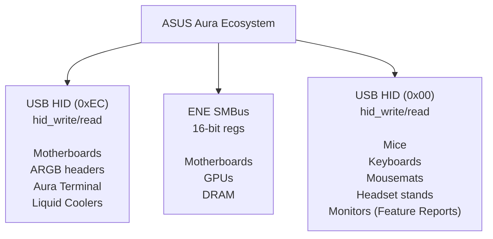
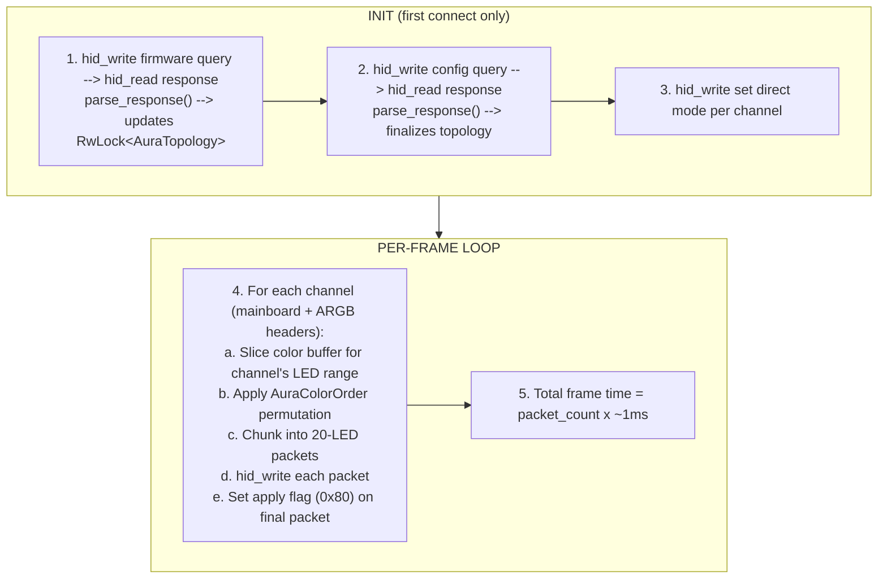
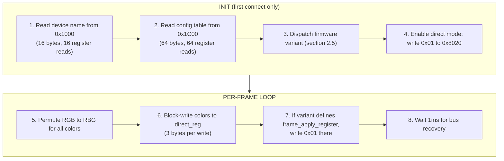

# 24 -- ASUS Aura Protocol Driver

> Native USB HID and ENE SMBus driver for the ASUS Aura RGB ecosystem. Three transport families, five protocol variants, a 200+ device catalog, and clean-room integration with the HAL via interior-mutability runtime discovery.

**Status:** Draft (Rev 2 — post cross-model review)
**Crate:** `hypercolor-hal`
**Module path:** `hypercolor_hal::drivers::asus`
**Author:** Nova
**Date:** 2026-03-08

---

## Table of Contents

1. [Overview](#1-overview)
2. [Device Registry](#2-device-registry)
3. [Protocol Architecture](#3-protocol-architecture)
4. [USB Motherboard Protocol](#4-usb-motherboard-protocol)
5. [USB Addressable Header Protocol](#5-usb-addressable-header-protocol)
6. [ENE SMBus Protocol](#6-ene-smbus-protocol)
7. [Peripheral Protocols](#7-peripheral-protocols)
8. [HAL Integration](#8-hal-integration)
9. [Render Pipeline](#9-render-pipeline)
10. [Testing Strategy](#10-testing-strategy)
11. [Phase Plan](#11-phase-plan)

---

## 1. Overview

Native driver for ASUS Aura RGB hardware via the `hypercolor-hal` abstraction layer. ASUS Aura is the largest and most heterogeneous RGB ecosystem in the PC hardware world, spanning motherboards, GPUs, DRAM, peripherals, AIOs, monitors, and handhelds. The ecosystem converges on two primary transport mechanisms — USB HID and ENE SMBus — with protocol variants per device class.

Clean-room implementation derived from publicly available protocol knowledge:
- OpenRGB's `AsusAuraUSBController`, `ENESMBusController`, and `AsusAuraGPUController` (C++)
- Community ASUS plugin implementations (JavaScript)
- ASUS Armoury Crate reverse-engineering community documentation

### Ecosystem Map

| Transport | Controller | Devices | Priority |
|-----------|-----------|---------|----------|
| **USB HID** | Aura Motherboard | Z790/Z890/B650/X570+ boards | **Phase 1** |
| **USB HID** | Aura Addressable | ARGB headers on motherboards | **Phase 1** |
| **USB HID** | Aura Terminal | Standalone ARGB controller | **Phase 1** |
| **I2C SMBus** | ENE Motherboard | Older AMD/Intel boards | Phase 2 |
| **I2C SMBus** | ENE GPU | RTX 30/40/50, RX 6000/7000 (ASUS) | Phase 2 |
| **I2C SMBus** | ENE DRAM | Aura-compatible RGB RAM | Phase 3 |
| **USB HID** | Aura Mouse | ROG/TUF mice | Phase 3 |
| **USB HID** | Aura Keyboard | ROG/TUF keyboards | Phase 3 |
| **USB HID** | Aura Peripherals | Mousemats, headset stands, monitors, AIOs | Phase 4 |

### Architectural Precedent

ASUS Aura motherboards require **runtime topology discovery** — the device's LED layout is not known until firmware and config table responses are received. This follows the same pattern as the Corsair iCUE LINK protocol (Spec 18), which uses `RwLock<State>` interior mutability in the Protocol impl to update topology during `parse_response()`. See §8.3 for the full design.

### Local Hardware (Test Targets)

Confirmed on this system:

| Device | Transport | Identifier | Notes |
|--------|-----------|------------|-------|
| **ROG STRIX Z790-A GAMING WIFI II** | USB HID | `0B05:19AF` | Motherboard Aura controller on `/dev/hidraw1` |
| **NVIDIA RTX 4070 SUPER** | I2C SMBus | Buses 3–8 | GPU RGB via ENE controller (if ASUS-branded) |
| **DDR5 DIMMs (x2)** | I2C SMBus | Bus 9, SPD `0x51`/`0x53`, RGB `0x71`/`0x73` | ENE DRAM V2 (`AUDA0-E6K5-0101`) |

**Vendor ID:** `0x0B05` (ASUSTek Computer Inc.)

---

## 2. Device Registry

### 2.1 USB Motherboard Controllers

These are the primary motherboard Aura controllers accessible over USB HID. They expose both fixed onboard LEDs and ARGB header control through a unified 65-byte packet protocol.

| PID | Generation | Example Boards |
|-----|-----------|----------------|
| `0x1867` | Addressable Gen 1 | Early X470/B450 |
| `0x1872` | Addressable Gen 2 | Mid-cycle X470/Z390 |
| `0x18A3` | Addressable Gen 3 | X570/Z490 |
| `0x18A5` | Addressable Gen 4 | B550/Z490 refresh |
| `0x18F3` | Motherboard Gen 1 | X570/Z590 |
| `0x1939` | Motherboard Gen 2 | B660/Z690 |
| `0x19AF` | **Motherboard Gen 3** | **Z790-A Gaming WiFi II** (local) |
| `0x1AA6` | Motherboard Gen 4 | X870E/Z890 |
| `0x1BED` | Motherboard Gen 5 | Latest Z890/B850 |

### 2.2 Board-Specific Zone Overrides

The config table returned by device firmware is not always accurate. Overrides are applied by **exact match** on either the 16-byte firmware string (`DeviceInfo.Model`) or the DMI board name. Both keys are checked; first match wins.

**Firmware string overrides:**

| Firmware String | Board | Mainboard LEDs | ARGB Headers | 12V Headers |
|----------------|-------|---------------|-------------|-------------|
| `AULA3-AR32-0207` | ROG STRIX Z690 Gaming WiFi | 3 | 3 | 1 |
| `AULA3-AR32-0213` | (TBD — Z790 variant) | 2 | 3 | 1 |
| `AULA3-AR32-0218` | ROG MAXIMUS Z790 Apex | 5 | 3 | 1 |

**DMI board name overrides (fallback):**

| DMI Board Name | Mainboard LEDs | ARGB Headers | 12V Headers | Notes |
|---------------|---------------|-------------|-------------|-------|
| `ROG CROSSHAIR VIII HERO` | 8 | 2 | 2 | |
| `ROG MAXIMUS Z690 EXTREME` | 7 | 3 | 1 | |
| `ROG MAXIMUS Z690 EXTREME GLACIAL` | 7 | 4 | 1 | Polymo panel disabled |
| `TUF GAMING X570-PRO (WI-FI)` | 3 | 1 | 2 | |
| `PRIME Z790-A WIFI` | 4 | 3 | 1 | |
| `ROG STRIX B650-A GAMING WIFI` | 3 | 3 | 1 | |
| `ROG STRIX B650E-F GAMING WIFI` | 3 | 3 | 1 | |
| `ROG MAXIMUS Z790 APEX ENCORE` | 2 | 3 | 1 | |
| `ROG STRIX B760-F GAMING WIFI` | 2 | 3 | 1 | |
| `ROG STRIX Z890-E GAMING WIFI` | 3 | 3 | 1 | |
| `TUF GAMING Z890-PLUS WIFI` | 1 | 3 | 0 | 4 12V total (special) |
| `ROG STRIX Z890-A GAMING WIFI` | 2 | 3 | 0 | 3 12V total (special) |
| `PRIME Z890-P WIFI` | 0 | 3 | 1 | No fixed LEDs |
| `ROG STRIX B850-F GAMING WIFI` | 2 | 3 | 2 | |

DMI board name is read at runtime via `/sys/class/dmi/id/board_name` on Linux.

### 2.3 Aura Terminal

Standalone addressable RGB header controller (external hub):

| PID | Name | Channels | LEDs/Channel | Extra |
|-----|------|----------|-------------|-------|
| `0x1889` | ASUS Aura Terminal | 4 | 90 | +1 Logo LED |

### 2.4 ENE SMBus Device Addresses

**Motherboard controllers:**

| Address | Role |
|---------|------|
| `0x40` | Primary Aura controller |
| `0x4E` | Secondary controller |
| `0x4F` | Tertiary controller |

**DRAM controllers (remappable):**

Hub address `0x77` manages dynamic remapping to:
```
0x70, 0x71, 0x72, 0x73, 0x74, 0x75, 0x76, 0x78, 0x79, 0x7A, 0x7B,
0x7C, 0x7D, 0x7E, 0x7F, 0x4F, 0x66, 0x67, 0x39, 0x3A, 0x3B, 0x3C, 0x3D
```

**GPU controllers:**

| Address | GPU Era |
|---------|---------|
| `0x29` | GTX 10-series, RTX 20-series, RX 400/500/5000 |
| `0x2A` | Newer variants |
| `0x67` | RTX 30/40/50-series, RX 6000+ |

### 2.5 ENE Firmware Variant Dispatch

Read from register `0x1000` (16 bytes). Determines register layout and capabilities via a 4-tuple: `(direct_reg, effect_reg, channel_cfg_offset, led_count_offset)`.

| Version String | Type | Direct Reg | Effect Reg | Channel Cfg | LED Count Offset | Notes |
|---------------|------|-----------|-----------|------------|-----------------|-------|
| `LED-0116` | Motherboard V1 | `0x8000` | `0x8010` | `0x13` | `0x02` | First generation |
| `AUMA0-E8K4-0101` | Motherboard V1 | `0x8000` | `0x8010` | `0x13` | `0x02` | First gen variant |
| `AUMA0-E6K5-0104` | Motherboard V2 | `0x8100` | `0x8160` | `0x1B` | `0x02` | Second generation |
| `AUMA0-E6K5-0105` | Motherboard V2 | `0x8100` | `0x8160` | `0x1B` | `0x02` | Variant A |
| `AUMA0-E6K5-0106` | Motherboard V2 | `0x8100` | `0x8160` | `0x1B` | `0x02` | Variant B |
| `AUMA0-E6K5-0107` | GPU V2 | `0x8100` | `0x8160` | `0x1B` | `0x03` | GPU cards |
| `AUMA0-E6K5-0008` | GPU V2 (hybrid) | `0x8100` | `0x8160` | **`0x13`** | `0x03` | V2 regs + **V1 config offset** |
| `AUMA0-E6K5-1107` | GPU V2 | `0x8100` | `0x8160` | `0x1B` | `0x03` | TUF RTX 4070 Ti |
| `AUMA0-E6K5-1110` | GPU V3 | `0x8100` | `0x8160` | `0x1B` | `0x03` | RTX 4080+ |
| `AUMA0-E6K5-1111` | GPU V4 | `0x8100` | `0x8160` | `0x1B` | `0x03` | RTX 4090 |
| `AUMA0-E6K5-1113` | GPU V5 | `0x8100` | `0x8160` | `0x1B` | `0x03` | RTX 5080 |
| `DIMM_LED-0102` | DRAM V1 | `0x8000` | `0x8010` | `0x13` | `0x02` | Trident Z RGB era |
| `AUDA0-E6K5-0101` | DRAM V2 | `0x8100` | `0x8160` | `0x13` | `0x02` | Geil Super Luce; supports Mode 14 |

**Key quirk:** `AUMA0-E6K5-0008` (Strix RTX 4070 Super) uses V2 color registers but V1 config table offset — a hybrid that cannot be represented by a simple V1/V2 enum. The implementation must dispatch all four parameters independently per firmware string.

### 2.6 Mouse Product IDs (Phase 3)

<details>
<summary>Click to expand — 50+ mice</summary>

**ROG Gladius II Family:**
`0x18DD` Core, `0x1845` Standard, `0x1877` Origin, `0x18CD` Origin PNK,
`0x18B1` Origin CoD, `0x189E` Wireless (P1), `0x18A0` Wireless (P2)

**ROG Gladius III Family:**
`0x197B` Wired, `0x197D` Wireless USB, `0x197F` Wireless 2.4G,
`0x1981` Wireless BT, `0x1A70` AimPoint USB, `0x1A72` AimPoint 2.4G

**ROG Chakram Family:**
`0x18E3` Wired, `0x18E5` Wireless, `0x1958` Core,
`0x1A18` X USB, `0x1A1A` X 2.4G

**ROG Spatha Family:**
`0x181C` Wired (Gen1), `0x1824` Wireless (Gen1),
`0x1977` X USB, `0x1979` X 2.4G/Dock

**ROG Pugio Family:**
`0x1846` Gen1, `0x1906` II Wired, `0x1908` II Wireless

**ROG Strix Impact Family:**
`0x1847` Gen1, `0x18E1` II, `0x1956` II Electro Punk,
`0x19D2` II Moonlight, `0x1947` II Wireless USB, `0x1949` II Wireless 2.4G,
`0x1A88` III

**ROG Keris Family:**
`0x195C` Wired, `0x195E` Wireless USB, `0x1960` Wireless 2.4G,
`0x1962` Wireless BT, `0x1A66` AimPoint USB, `0x1A68` AimPoint 2.4G

**TUF Gaming Mice:**
`0x1910` M3, `0x1A9B` M3 Gen II, `0x1898` M5

**Legacy (Gen1 Feature Reports):**
`0x185B` ROG Strix Evolve

</details>

### 2.7 Keyboard Product IDs (Phase 3)

<details>
<summary>Click to expand — 30+ keyboards</summary>

**ROG Azoth:** `0x1A83` USB, `0x1A85` 2.4G

**ROG Claymore:** `0x184D`

**ROG Falchion:** `0x193C` Wired, `0x193E` Wireless, `0x1A64` Ace, `0x1B04` RX Low Profile

**ROG Strix Flare:**
`0x1875` Gen1, `0x18CF` PNK LTD, `0x18AF` CoD BO4,
`0x19FC` II Animate, `0x19FE` II

**ROG Strix Scope:**
`0x18F8` Gen1, `0x190C` TKL, `0x1954` TKL PNK,
`0x1951` RX, `0x1B12` RX EVA-02, `0x1A05` RX TKL Deluxe,
`0x19F6` NX Wireless USB, `0x19F8` NX Wireless 2.4G,
`0x1AB3` II, `0x1AB5` II RX, `0x1AAE` II 96 Wireless USB,
`0x1B78` II 96 RX Wireless USB

**TUF Gaming Keyboards:**
`0x1945` K1, `0x194B` K3, `0x1B30` K3 Gen II,
`0x1899` K5, `0x18AA` K7, `0x1C5E` K3 Gen II Miku

</details>

### 2.8 Other Peripherals (Phase 4)

<details>
<summary>Click to expand — monitors, mousemats, headset stands, AIOs, handhelds</summary>

**Mousemats:** `0x1891` Balteus, `0x1890` Balteus Qi

**Monitors:**
`0x198C` XG27AQ, `0x19BB` XG27AQM, `0x1919` XG279Q,
`0x1933` XG27W, `0x1968` XG32VC, `0x19B9` PG32UQ

**Headset Stands:**
`0x18D9` Throne, `0x18C5` Throne Qi, `0x1994` Throne Qi Gundam

**Liquid Coolers:**
`0x879E` ROG Strix LC120, `0x1887` ROG Ryuo AIO

**Handhelds:**
`0x1ABE` ROG Ally, `0x1B4C` ROG Ally X

</details>

---

## 3. Protocol Architecture

ASUS Aura devices fall into three distinct transport/protocol families:



### 3.1 Protocol Family Comparison

| Aspect | USB Motherboard | ENE SMBus | USB Peripherals |
|--------|----------------|-----------|-----------------|
| Report ID | `0xEC` | N/A | `0x00` / `0xEE` / `0x03` |
| Packet size | 65 bytes | 1–3 bytes/op | 8–65 bytes |
| Transport | `hid_write`/`hid_read` | I2C SMBus | `hid_write`/`hid_read` or feature reports |
| HID Interface | 2 (via hidraw) | `/dev/i2c-*` | 0–2 (device-dependent) |
| Max LEDs/pkt | 20 | 5 (V1) / 10 (V2) | 1–15 |
| Color order | RGB (configurable) | **RBG** (all versions) | RGB or RBG (device-dependent) |
| Direct mode | `0xFF` | Register `0x8020` | Varies |
| Apply mechanism | Apply flag in packet | Direct writes usually self-apply; DRAM variants latch via `0x802F`, effect/save uses `0x80A0` | Save packet or read handshake |

### 3.2 USB HID Transport

**Verified via OpenRGB source:** All ASUS Aura USB devices use `hid_write()`/`hid_read()` through the kernel HID driver, **not** raw USB control transfers. On Linux, packets flow through `/dev/hidraw*` nodes.

For the motherboard controller (`0x19AF`) detected on this system:

| Interface | Class | Endpoints | Driver | Purpose |
|-----------|-------|-----------|--------|---------|
| 0 | Vendor (`ff:ff:ff`) | 0 endpoints | None | Not used for RGB (vendor-specific, no driver) |
| 2 | HID | EP 0x82 IN (interrupt, 32B, 4ms) | `usbhid` | **Aura command interface** via hidraw |

**HID Report Descriptor (Interface 2):** Vendor Usage Page `0xFF72`, Report ID `0xEC`, 65-byte reports. Both Input and Output reports supported.

The correct Hypercolor transport binding is `TransportType::UsbHidRaw` — send/receive 65-byte HID reports through `/dev/hidraw*` while the kernel `usbhid` driver remains attached.

---

## 4. USB Motherboard Protocol

The primary protocol for modern ASUS motherboards. All packets are 65-byte HID output/input reports with report ID `0xEC` as byte 0.

### 4.1 Packet Format

```
Offset  Size  Field               Description
──────  ────  ──────────────────  ──────────────────────────────────────────
  0       1   report_id           Always 0xEC
  1       1   command_id          Command type (see §4.2)
  2      63   payload             Command-specific data (zero-padded)
```

Packets are sent via `hid_write(dev, buf, 65)` and responses read via `hid_read(dev, buf, 65)`.

### 4.2 Command Vocabulary

| Command | ID | Direction | Description |
|---------|----|-----------|-------------|
| Firmware Version | `0x82` | Request/Response | Query 16-byte firmware string |
| Config Table | `0xB0` | Request/Response | Query 60-byte device topology |
| Set Mode (Effect) | `0x35` | Write | Set channel effect mode |
| Set Effect Color | `0x36` | Write | Set LED colors for effect mode |
| Set Addressable Mode | `0x3B` | Write | Set ARGB header effect |
| Commit | `0x3F` | Write | Apply pending changes |
| Direct Control | `0x40` | Write | Stream per-LED colors (direct mode) |
| Disable Gen2 | `0x52` | Write | Gen1 compatibility init |

### 4.3 Firmware Version Query (`0x82`)

**Request:**
```
[0x00] = 0xEC
[0x01] = 0x82
[0x02..0x40] = 0x00
```

**Response:**
```
[0x00] = 0xEC
[0x01] = 0x02        (FIRMWARE_RESPONSE marker)
[0x02..0x11] = 16-byte ASCII firmware string (e.g., "AULA3-AR32-0207")
```

The firmware string identifies the board model and is used for zone override lookups (§2.2). Matching is exact string comparison against the firmware string first, then DMI board name as fallback.

### 4.4 Configuration Table Query (`0xB0`)

**Request:**
```
[0x00] = 0xEC
[0x01] = 0xB0
[0x02..0x40] = 0x00
```

**Response:**
```
[0x00] = 0xEC
[0x01] = 0x30        (CONFIG_TABLE_RESPONSE marker)
[0x02..0x03] = reserved
[0x04..0x3F] = 60-byte configuration table
```

**Configuration table layout (60 bytes, offsets relative to table start at byte 4):**

| Offset | Field | Description |
|--------|-------|-------------|
| `0x02` | `argb_channel_count` | Number of addressable RGB headers |
| `0x1B` | `mainboard_led_count` | Total fixed onboard LEDs |
| `0x1D` | `rgb_header_count` | Number of 12V RGB headers |

These values are used as defaults. If an override exists in §2.2 for the firmware string or DMI board name, the override values take precedence.

### 4.5 Set Channel to Direct Mode (`0x35`)

Switches a channel from hardware effect mode to direct (per-LED) control:

```
[0x00] = 0xEC
[0x01] = 0x35        (CONTROL_MODE_EFFECT)
[0x02] = channel_idx (0x00 = first channel)
[0x03] = 0x00
[0x04] = 0x00        (shutdown_effect flag: 0x00 normal, 0x01 shutdown)
[0x05] = 0xFF        (MODE_DIRECT)
```

**Channel indexing:**
- `0x00`..`0x03` — ARGB header channels 1–4
- `0x04` — Mainboard fixed LEDs (MAINBOARD_DIRECT_IDX)

### 4.6 Set Effect Color (`0x36`)

Sets LED colors for hardware effect mode. Uses a 16-bit bitmask to select which LEDs receive color data:

```
[0x00] = 0xEC
[0x01] = 0x36        (CONTROL_MODE_EFFECT_COLOR)
[0x02] = mask >> 8   (16-bit LED mask, high byte)
[0x03] = mask & 0xFF (16-bit LED mask, low byte)
[0x04] = shutdown    (0x00 normal, 0x01 shutdown effect)
[0x05 + start*3] = R (color data placed at LED offset)
[0x06 + start*3] = G
[0x07 + start*3] = B
```

**LED mask calculation:**
```rust
fn led_mask(start: u8, count: u8) -> u16 {
    ((1u16 << count) - 1) << start
}
// led_mask(0, 1) = 0x0001 — LED 0 only
// led_mask(2, 3) = 0x001C — LEDs 2, 3, 4
```

Color data is placed at byte offset `0x05 + (start_led * 3)` within the packet, allowing sparse updates. **Not used for direct mode** — this command is for hardware effect color configuration only. Hypercolor uses direct mode (§4.7) exclusively for real-time rendering; this command is documented for completeness and shutdown-effect support.

### 4.7 Direct Color Streaming (`0x40`)

Stream per-LED RGB data in 20-LED chunks:

```
[0x00] = 0xEC
[0x01] = 0x40        (DIRECT_CONTROL)
[0x02] = flags       (channel_idx | apply_flag)
[0x03] = led_offset  (starting LED index within channel)
[0x04] = led_count   (LEDs in this packet, max 20)
[0x05..] = RGB data  (3 bytes per LED: R, G, B)
```

**Flags byte breakdown:**

| Bit | Mask | Meaning |
|-----|------|---------|
| 7 | `0x80` | **Apply flag** — set on final packet to commit frame |
| 6–0 | `0x7F` | Channel index |

**Maximum 20 LEDs per packet** (`0x14`). For channels with more than 20 LEDs, send multiple packets with incrementing `led_offset`, setting the apply flag only on the final packet.

**Example: 3-LED mainboard update:**
```
Packet 1 (and only):
  [0x00] = 0xEC
  [0x01] = 0x40
  [0x02] = 0x84       (channel 4 | 0x80 apply flag)
  [0x03] = 0x00       (offset 0)
  [0x04] = 0x03       (3 LEDs)
  [0x05] = R0, [0x06] = G0, [0x07] = B0
  [0x08] = R1, [0x09] = G1, [0x0A] = B1
  [0x0B] = R2, [0x0C] = G2, [0x0D] = B2
```

### 4.8 Commit (`0x3F`)

Explicitly commits pending changes:

```
[0x00] = 0xEC
[0x01] = 0x3F        (COMMIT)
[0x02] = 0x55        (magic value)
[0x03..0x40] = 0x00
```

### 4.9 Gen1 Compatibility Init (`0x52`)

Some older boards require a Gen1 disable command before entering direct mode:

```
[0x00] = 0xEC
[0x01] = 0x52
[0x02] = 0x53
[0x03] = 0x00
[0x04] = 0x01
```

### 4.10 USB Motherboard Hardware Effect Modes

| Mode ID | Name | Colors | Speed | Direction |
|---------|------|--------|-------|-----------|
| `0x00` | Off | — | — | — |
| `0x01` | Static | 1 | — | — |
| `0x02` | Breathing | 1 | Yes | — |
| `0x03` | Flashing | 1 | Yes | — |
| `0x04` | Spectrum Cycle | — | Yes | — |
| `0x05` | Rainbow | — | Yes | Yes |
| `0x06` | Spectrum Breathing | — | Yes | — |
| `0x07` | Chase Fade | 1 | Yes | Yes |
| `0x08` | Spectrum Chase Fade | — | Yes | Yes |
| `0x09` | Chase | 1 | Yes | Yes |
| `0x0A` | Spectrum Chase | — | Yes | Yes |
| `0x0B` | Spectrum Wave | — | Yes | Yes |
| `0x0C` | Chase Rainbow Pulse | — | Yes | Yes |
| `0x0D` | Random Flicker | — | Yes | — |
| `0x0E` | Music | — | — | — |
| `0xFF` | **Direct** | Per-LED | — | — |

### 4.11 Color Order Permutations

The USB motherboard protocol defaults to RGB, but some boards have non-standard color ordering. Hypercolor exposes a user-configurable color order:

| Setting | Byte Order | Index Map |
|---------|-----------|-----------|
| RGB | R, G, B | `[0, 1, 2]` |
| RBG | R, B, G | `[0, 2, 1]` |
| GRB | G, R, B | `[1, 0, 2]` |
| GBR | G, B, R | `[1, 2, 0]` |
| BRG | B, R, G | `[2, 0, 1]` |
| BGR | B, G, R | `[2, 1, 0]` |

Default is RGB. Stored as a per-device configuration parameter.

---

## 5. USB Addressable Header Protocol

ARGB headers on the motherboard share the same USB device (`0xEC` reports) but use distinct command IDs for mode control.

### 5.1 Set Addressable Header Effect (`0x3B`)

```
[0x00] = 0xEC
[0x01] = 0x3B        (ADDRESSABLE_CONTROL_MODE_EFFECT)
[0x02] = channel_idx (0–3 for ARGB headers 1–4)
[0x03] = 0x00
[0x04] = mode        (same mode IDs as §4.10)
[0x05] = R
[0x06] = G
[0x07] = B
```

### 5.2 Direct Color Streaming for ARGB

Uses the same `0x40` direct control packet as §4.7, with channel indices 0–3 for ARGB headers.

**Max LEDs per ARGB channel:** 120 (user-configurable per header; typical strips are 30–90 LEDs).

**LED counts are per-header, not uniform.** A system might have Header 1 with 60 LEDs and Header 2 with 30. The protocol struct stores a `Vec<u32>` of per-header counts, not a single scalar.

**Multi-packet streaming example (90-LED ARGB strip on channel 0):**
```
Packet 1: [0xEC, 0x40, 0x00, 0x00, 0x14, RGB x20]  channel 0, offset 0, 20 LEDs
Packet 2: [0xEC, 0x40, 0x00, 0x14, 0x14, RGB x20]  channel 0, offset 20, 20 LEDs
Packet 3: [0xEC, 0x40, 0x00, 0x28, 0x14, RGB x20]  channel 0, offset 40, 20 LEDs
Packet 4: [0xEC, 0x40, 0x00, 0x3C, 0x14, RGB x20]  channel 0, offset 60, 20 LEDs
Packet 5: [0xEC, 0x40, 0x80, 0x50, 0x0A, RGB x10]  channel 0|apply, offset 80, 10 LEDs
```

### 5.3 Terminal Controller Variant

The Aura Terminal (`0x1889`) uses the same packet format but addresses 4 independent ARGB channels plus a single logo LED. It uses `0x3B` for mode control (not `0x35`):

| Channel | Zone | Max LEDs |
|---------|------|----------|
| 0 | ARGB Channel 1 | 90 |
| 1 | ARGB Channel 2 | 90 |
| 2 | ARGB Channel 3 | 90 |
| 3 | ARGB Channel 4 | 90 |
| 4 | Logo | 1 |

---

## 6. ENE SMBus Protocol

The ENE SMBus protocol is used by embedded ENE Technology RGB controllers on ASUS motherboards, GPUs, and DRAM modules. Communication happens over the system I2C/SMBus bus.

### 6.1 Linux Prerequisites

| Requirement | Command |
|------------|---------|
| Kernel module | `modprobe i2c-dev` |
| Tools (optional) | `pacman -S i2c-tools` |
| SMBus controller | `i2c-i801` (Intel) or `i2c-piix4` (AMD) |
| User access | udev rule for `/dev/i2c-*` or run as root |

### 6.2 Register Addressing

ENE controllers use a **16-bit register address space** accessed via 2-step indirect addressing:

**Read sequence:**
```
1. Write byte-swapped 16-bit register address to SMBus word register 0x00:
   i2c_smbus_write_word_data(addr, 0x00, byte_swap(register))

2. Read value from data register 0x81:
   value = i2c_smbus_read_byte_data(addr, 0x81)
```

**Write sequence:**
```
1. Write byte-swapped 16-bit register address to SMBus word register 0x00:
   i2c_smbus_write_word_data(addr, 0x00, byte_swap(register))

2. Write value to data register 0x01:
   i2c_smbus_write_byte_data(addr, 0x01, value)
```

**Block write sequence (max 3 bytes per operation):**
```
1. Write byte-swapped 16-bit register address to SMBus word register 0x00:
   i2c_smbus_write_word_data(addr, 0x00, byte_swap(register))

2. Write block data to register 0x03:
   i2c_smbus_write_block_data(addr, 0x03, size, data)   // size <= 3
```

**Address byte swap:**
```rust
fn ene_byte_swap(reg: u16) -> u16 {
    ((reg << 8) & 0xFF00) | ((reg >> 8) & 0x00FF)
}
```

### 6.3 Register Map

```
Register           Address   Size  Description
─────────────────  ────────  ────  ──────────────────────────────────────────
DEVICE_NAME        0x1000    16    ASCII device version string (§2.5)
MICRON_CHECK       0x1030    16    Manufacturer string (skip if "Micron")
CONFIG_TABLE       0x1C00    64    LED zone configuration table

COLORS_DIRECT_V1   0x8000    15    Direct mode colors (V1: 5 LEDs x RBG)
COLORS_EFFECT_V1   0x8010    15    Effect mode colors (V1: 5 LEDs x RBG)
DIRECT             0x8020     1    Direct mode enable (write 0x01)
MODE               0x8021     1    Effect mode selection (§6.5)
SPEED              0x8022     1    Effect speed (0x00=fastest..0x04=slowest)
DIRECTION          0x8023     1    Effect direction (0x00=fwd, 0x01=rev)
APPLY              0x80A0     1    Apply/Save register (see §6.4)
FRAME_APPLY_DRAM   0x802F     1    DRAM direct-frame latch (write 0x01)

COLORS_DIRECT_V2   0x8100    30    Direct mode colors (V2: 10 LEDs x RBG)
COLORS_EFFECT_V2   0x8160    30    Effect mode colors (V2: 10 LEDs x RBG)

SLOT_INDEX         0x80F8     1    DRAM slot selector (hub 0x77 only)
I2C_ADDRESS        0x80F9     1    DRAM I2C address remapper (hub 0x77 only)
```

### 6.4 Apply vs Save Semantics

Register `0x80A0` accepts two distinct values:

| Value | Constant | Behavior |
|-------|----------|----------|
| `0x01` | `ENE_APPLY_VAL` | **Transient apply** — immediate effect, lost on power cycle |
| `0xAA` | `ENE_SAVE_VAL` | **Persistent save** — writes to non-volatile storage |

Hypercolor reserves `0xAA` (persistent) for explicit user "save to device" operations, if exposed.

Direct-mode behavior splits by controller family:
- Motherboard/GPU ENE direct writes generally take effect once direct mode is enabled; they do not require a per-frame `0x80A0` write.
- DRAM variants `DIMM_LED-0102` and `AUDA0-E6K5-0101` require a **per-frame** latch write of `0x01` to register `0x802F` after the color block uploads. This matches the known working ENE RAM flow.
- OpenRGB still uses `0x80A0 = 0x01` when switching controller mode/state, but not as the steady-state direct-frame commit path.

### 6.5 Color Byte Order

**All ENE SMBus controllers use RBG byte order, regardless of register version:**

```
Both V1 (0x8000) and V2 (0x8100):
  Byte 0: Red
  Byte 1: Blue    ← swapped vs standard RGB
  Byte 2: Green   ← swapped vs standard RGB
  Pattern: [R, B, G, R, B, G, ...]
```

Verified from OpenRGB source (`ENESMBusController.cpp:426-435`):
```cpp
color_buf[i + 0] = RGBGetRValue(colors[i / 3]);   // RED
color_buf[i + 1] = RGBGetBValue(colors[i / 3]);   // BLUE
color_buf[i + 2] = RGBGetGValue(colors[i / 3]);   // GREEN
```

The Hypercolor protocol encoder must swap B and G when writing to ENE controllers.

### 6.6 ENE SMBus Hardware Effect Modes

**Separate from USB motherboard modes (§4.10).** The ENE controller has its own mode table:

| Mode ID | Name | Colors | Speed | Direction | Notes |
|---------|------|--------|-------|-----------|-------|
| `0` | Off | — | — | — | |
| `1` | Static | 1 | — | — | |
| `2` | Breathing | 1 | Yes | — | |
| `3` | Flashing | 1 | Yes | — | |
| `4` | Spectrum Cycle | — | Yes | — | |
| `5` | Rainbow | — | Yes | Yes | |
| `6` | Spectrum Breathing | — | Yes | — | |
| `7` | Chase Fade | 1 | Yes | Yes | |
| `8` | Spectrum Chase Fade | — | Yes | Yes | |
| `9` | Chase | 1 | Yes | Yes | |
| `10` | Spectrum Chase | — | Yes | Yes | |
| `11` | Spectrum Wave | — | Yes | Yes | |
| `12` | Chase Rainbow Pulse | — | Yes | Yes | |
| `13` | Random Flicker | — | Yes | — | |
| `14` | **Double Fade** | — | Yes | — | **DRAM only** — gated on DRAM_3 zone presence |

**Mode 14 (Double Fade)** is only supported on second-gen DRAM controllers (`AUDA0-E6K5-0101`) where a DRAM_3 zone channel (`0x0E`) is present in the config table. The implementation must check `supports_mode_14` before exposing this mode.

**Speed values:**
```
0x00 = Fastest
0x01 = Fast
0x02 = Normal
0x03 = Slow
0x04 = Slowest
```

### 6.7 LED Zone Channel IDs

Zone channels are stored in the configuration table at the firmware-specific `channel_cfg` offset:

| Channel ID | Zone Name | Description |
|-----------|-----------|-------------|
| `0x05` | DRAM 2 | DRAM (Gen 1) |
| `0x0E` | DRAM 3 | DRAM (Gen 2) — presence enables Mode 14 |
| `0x82` | Center Start | First center zone LED |
| `0x83` | Center | Main center zone |
| `0x84` | Audio | Audio area LEDs |
| `0x85` | Back I/O | Rear I/O panel LEDs |
| `0x86` | RGB Header 1 | Primary 12V header |
| `0x87` | RGB Header 2 | Secondary 12V header |
| `0x88` | Backplate | Backplate LEDs |
| `0x8A` | DRAM | DRAM slot LEDs |
| `0x8B` | PCIe | PCIe slot LEDs |
| `0x91` | RGB Header 3 | Tertiary 12V header |
| `0x95` | QLED | Q-LED diagnostic |
| `0x98` | Power/Reset | Power/Reset buttons |
| `0x99` | Chipset Top | Chipset heatsink (top) |
| `0x9A` | Chipset Middle | Chipset heatsink (mid) |
| `0x9B` | Chipset Bottom | Chipset heatsink (bottom) |
| `0x9C` | Chipset Bottom 2 | Chipset heatsink (lower) |
| `0xA0` | I/O Shield | I/O shield LEDs |
| `0xA2` | M.2 Cover | M.2 heatsink cover |
| `0xA3` | M.2 Cover 2 | Second M.2 cover |

### 6.8 Detection Sequences

**ENE controller detection (motherboard/GPU):**
```
1. Read registers 0xA0..0xAF via i2c_smbus_read_byte_data
2. Values must be sequential: 0x00, 0x01, 0x02, ..., 0x0F
   (Validates the ENE register indirection mechanism)
3. If sequential, read device name from 0x1000 (16 bytes)
4. Check if name starts with "Micron" — if so, skip (incompatible firmware)
5. Dispatch on device name to determine register layout (§2.5)
```

**Simple Aura GPU detection (0x29/0x2A):**
```
1. Read byte from register 0x20 → expect 0x15
2. Read byte from register 0x21 → expect 0x89
3. Combined magic value: 0x1589 (AURA_GPU_MAGIC)
```

### 6.9 DRAM Remapping Protocol

RGB-capable DRAM modules may be managed through a hub controller at address `0x77`, but direct address-pool probing must remain available when no remap hub is exposed:

```
1. Probe the chipset SMBus adapter only (OpenRGB parity)
2. Check for optional remap hub at 0x77
3. If the hub exists, for each DRAM slot (0–7):
   a. Write slot index:   ENE_write(0x77, 0x80F8, slot)
   b. Pick next available address from the address pool
   c. Write remapped addr: ENE_write(0x77, 0x80F9, address << 1)
4. Probe the known DRAM ENE address pool (and any remapped addresses) for ENE signature
5. Read device name from 0x1000 to determine firmware variant
```

### 6.10 Simple Aura GPU Register Map

For older GPU controllers (GTX 10-series through RTX 20-series) at addresses `0x29`/`0x2A`:

```
Register  Address  Description
────────  ───────  ──────────────────
RED       0x04     Red channel (0–255)
GREEN     0x05     Green channel (0–255)
BLUE      0x06     Blue channel (0–255)
MODE      0x07     Effect mode (0=Off, 1=Static, 2=Breathing, 3=Flash, 4=Spectrum)
SYNC      0x0C     Sync register
APPLY     0x0E     Apply (write 0x01)
```

**Single zone only** — one RGB color for the entire card. Standard RGB byte order (not RBG).

### 6.11 Timing Requirements

| Operation | Delay | Source |
|-----------|-------|--------|
| Between SMBus operations | 1ms | ENE bus recovery |
| DRAM hub free-bus reads | 30ms per byte | OpenRGB SMBus interface |
| Between ENE block writes | 1ms | Protocol requirement |

---

## 7. Peripheral Protocols

Peripherals (mice, keyboards, mousemats, etc.) share the 65-byte HID report format but use different report IDs and command vocabularies.

### 7.1 Mouse Protocol (Gen2)

**Report ID:** `0x00`
**Interface:** 1 (Usage Page `0xFF01`)

**Update packet (`0x51 0x28`):**
```
[0x00] = 0x00        (Report ID)
[0x01] = 0x51        (Update command)
[0x02] = 0x28        (Sub-command)
[0x03] = zone_id     (0=Logo, 1=Scroll, 2=Underglow, 3=All, 4=Dock)
[0x04] = 0x00
[0x05] = mode        (0=Static, 1=Breathing, 2=Spectrum, 3=Wave, 4=Reactive, 5=Comet)
[0x06] = brightness  (0–4 or 0–100, device-dependent)
[0x07] = R
[0x08] = G
[0x09] = B
[0x0A] = direction   (0–3)
[0x0B] = random      (0/1)
[0x0C] = speed       (0–255, some devices invert)
```

**Direct mode (`0x51 0x29`):**
```
[0x00] = 0x00
[0x01] = 0x51
[0x02] = 0x29
[0x03] = color_count (max 5)
[0x04] = 0x00
[0x05] = led_offset
[0x06..] = RGB data  (3 bytes per LED, max 5 LEDs/packet)
```

**Save command (`0x50 0x03`):**
```
[0x00] = 0x00
[0x01] = 0x50
[0x02] = 0x03
```

### 7.2 Keyboard Protocol

**Report ID:** `0x00`
**Interface:** 1 (Usage Page `0xFF00`)

**Direct frame update sequence:**

1. **Data packets** — Send LED data in 15-LED chunks:
```
[0x00] = 0x00        (Report ID)
[0x01] = 0xC0        (Direct command)
[0x02] = 0x81        (Sub-command)
[0x03] = remaining   (total LED frames remaining across all packets)
[0x04] = 0x00
[0x05..] = LED data  (4 bytes per LED: [index, R, G, B], max 15 LEDs/packet)
```
Sent via `hid_write()`. Last data packet padded with `0xFF`.

2. **Apply packet** — Finalize the frame with a write+read handshake:
```
[0x00] = 0x00
[0x01] = 0xC0
[0x02] = 0x81
[0x03] = 0x90        (apply signal)
[0x04] = 0x00
```
Sent via `hid_write()`, immediately followed by `hid_read()` to complete the handshake. The read response confirms the frame was applied.

### 7.3 Mousemat Protocol

**Report ID:** `0xEE` (distinct from other devices)

**Direct LED packet (`0xC0 0x81`):**
```
[0x00] = 0xEE
[0x01] = 0xC0
[0x02] = 0x81
[0x03..0x04] = 0x00
[0x05..] = LED data  (4 bytes per LED: [padding, R, G, B], max 15 LEDs)
```

### 7.4 Monitor Protocol

**HID Feature Reports — 8 bytes**, Report ID `0x03`. Uses `hid_send_feature_report()` (not `hid_write()`).

**Per-model quirks:**

| Model | PID | LED Offset | Preamble | Component Order |
|-------|-----|-----------|----------|-----------------|
| XG279Q | `0x1919` | `0` | None | R, B, G |
| XG27AQ | `0x198C` | `16` | None | R, B, G |
| XG27AQM | `0x19BB` | `16` | None | R, B, G |
| XG27W | `0x1933` | `16` | None | R, B, G |
| XG32VC | `0x1968` | `16` | **2-phase** | R, B, G |
| PG32UQ | `0x19B9` | `16` | **2-phase** | R, B, G |

**Component write order is R, B, G** (not standard RGB). Each LED requires 3 separate feature reports — one per color component.

**2-phase preamble (PG32UQ and XG32VC only):**
```
Phase 1: [0x03, 0x02, 0xA1, 0x80, 0x20, 0x00, 0x00, 0x00]
Phase 2: [0x03, 0x02, 0xA1, 0x80, 0x30, 0x00, 0x00, 0x00]
```

**Per-LED update (3 feature reports per LED):**
```
Red:   [0x03, 0x02, 0xA1, 0x80, offset + led*3 + 0, red_value,   0x00, 0x00]
Blue:  [0x03, 0x02, 0xA1, 0x80, offset + led*3 + 1, blue_value,  0x00, 0x00]
Green: [0x03, 0x02, 0xA1, 0x80, offset + led*3 + 2, green_value, 0x00, 0x00]
```

**Apply:**
```
[0x03, 0x02, 0xA1, 0x80, 0xA0, 0x01, 0x00, 0x00]
```

---

## 8. HAL Integration

### 8.1 Module Structure

```
crates/hypercolor-hal/src/drivers/asus/
  mod.rs           — Re-exports
  types.rs         — Protocol enums, command constants, zone IDs
  devices.rs       — Device descriptors + protocol builder functions
  protocol.rs      — AuraUsbProtocol: Protocol trait impl (interior mutability)
  smbus.rs         — AuraSmBusProtocol: Protocol trait impl for ENE controllers (Phase 2)
```

### 8.2 Type Definitions

```rust
/// ASUS Aura USB command IDs.
#[derive(Debug, Clone, Copy, PartialEq, Eq)]
pub enum AuraCommand {
    FirmwareVersion = 0x82,
    ConfigTable = 0xB0,
    SetMode = 0x35,
    SetEffectColor = 0x36,
    SetAddressableMode = 0x3B,
    Commit = 0x3F,
    DirectControl = 0x40,
    DisableGen2 = 0x52,
}

/// ASUS Aura motherboard controller variant.
#[derive(Debug, Clone, Copy, PartialEq, Eq)]
pub enum AuraControllerGen {
    /// PIDs 0x1867, 0x1872, 0x18A3, 0x18A5 — addressable-only controllers.
    AddressableOnly,
    /// PIDs 0x18F3, 0x1939, 0x19AF, 0x1AA6, 0x1BED — full motherboard controllers.
    Motherboard,
    /// PID 0x1889 — Aura Terminal standalone controller.
    Terminal,
}

/// Color byte ordering for a device.
#[derive(Debug, Clone, Copy, PartialEq, Eq, Default)]
pub enum AuraColorOrder {
    #[default]
    Rgb,
    Rbg,
    Grb,
    Gbr,
    Brg,
    Bgr,
}

impl AuraColorOrder {
    /// Permute an RGB triple into the configured wire order.
    pub fn permute(self, r: u8, g: u8, b: u8) -> [u8; 3] {
        match self {
            Self::Rgb => [r, g, b],
            Self::Rbg => [r, b, g],
            Self::Grb => [g, r, b],
            Self::Gbr => [g, b, r],
            Self::Brg => [b, r, g],
            Self::Bgr => [b, g, r],
        }
    }
}

/// ENE SMBus firmware variant — determines register layout.
///
/// Each variant is a concrete 4-tuple, not a V1/V2 abstraction.
/// Some firmwares (e.g., AUMA0-E6K5-0008) use hybrid register layouts
/// that don't fit a simple V1/V2 split.
#[derive(Debug, Clone, Copy, PartialEq, Eq)]
pub struct EneFirmwareVariant {
    /// Register base for direct-mode colors.
    pub direct_reg: u16,
    /// Register base for effect-mode colors.
    pub effect_reg: u16,
    /// Offset within config table for channel zone IDs.
    pub channel_cfg_offset: u8,
    /// Offset within config table for LED count.
    pub led_count_offset: u8,
    /// Whether Mode 14 (Double Fade) might be supported.
    pub may_support_mode_14: bool,
}

impl EneFirmwareVariant {
    /// Color byte order — RBG for all ENE variants.
    pub const COLOR_ORDER: [usize; 3] = [0, 2, 1]; // R, B, G

    /// Rearrange RGB into RBG for ENE wire format.
    pub fn permute_color(r: u8, g: u8, b: u8) -> [u8; 3] {
        [r, b, g]
    }
}

/// Channel role on a motherboard controller.
#[derive(Debug, Clone, Copy, PartialEq, Eq)]
pub enum AuraChannelKind {
    /// Fixed onboard LEDs (chipset, heatsink, I/O shield, etc.)
    Mainboard,
    /// Addressable RGB header (WS2812B-compatible strip output)
    Addressable,
    /// 12V non-addressable RGB header
    RgbHeader,
}
```

### 8.3 Runtime Topology Discovery (Interior Mutability Pattern)

ASUS motherboards require runtime config to determine their LED topology. This uses the same architectural pattern as the Corsair iCUE LINK protocol: **`RwLock<State>` interior mutability** with state updates during `parse_response()`.

**Lifecycle:**

```
DISCOVERY (UsbScanner::scan):
  1. ProtocolDatabase::lookup(0x0B05, 0x19AF) → DeviceDescriptor
  2. protocol = (descriptor.protocol.build)()    ← zero-arg factory
  3. protocol.zones() → placeholder zones        ← returns defaults
  4. Build DeviceInfo with placeholder topology
  5. Device appears in UI as "ASUS Aura Motherboard (Gen 3)" with unknown LED count

CONNECT (UsbBackend::connect):
  6. protocol = (descriptor.protocol.build)()    ← FRESH instance
  7. transport.open()
  8. init_sequence() → [firmware_query, config_query, set_direct_modes...]
  9. For firmware_query (expects_response: true):
     a. transport.send_receive()
     b. protocol.parse_response(&response)       ← UPDATES INTERIOR STATE
        - Parses firmware string
        - Checks override table
  10. For config_query (expects_response: true):
     a. transport.send_receive()
     b. protocol.parse_response(&response)       ← UPDATES INTERIOR STATE
        - Parses config table
        - Applies overrides
        - Now knows exact LED counts, zone names, channel layout
  11. Remaining init commands (set direct mode per channel) generated dynamically

POST-CONNECT (connected_device_info):
  12. protocol.zones() → REAL zones              ← reads updated state
  13. protocol.capabilities() → REAL capabilities
  14. DeviceInfo refreshed with actual topology
```

**State struct:**

```rust
/// Runtime-discovered topology for an ASUS Aura device.
#[derive(Debug, Clone)]
struct AuraTopology {
    /// Firmware version string (16 bytes ASCII).
    firmware: Option<String>,
    /// Number of fixed onboard LEDs.
    mainboard_leds: u32,
    /// LED count per ARGB header (variable-length).
    argb_led_counts: Vec<u32>,
    /// Number of 12V RGB headers.
    rgb_header_count: u32,
    /// Whether overrides were applied.
    overrides_applied: bool,
    /// Init phase — tracks which responses we've seen.
    init_phase: AuraInitPhase,
}

#[derive(Debug, Clone, Copy, PartialEq, Eq)]
enum AuraInitPhase {
    /// No responses received yet. zones() returns placeholders.
    PreInit,
    /// Firmware response received, awaiting config table.
    FirmwareReceived,
    /// Config table received, topology finalized.
    Configured,
}
```

### 8.4 Protocol Implementation

```rust
/// ASUS Aura USB motherboard protocol encoder/decoder.
///
/// Uses RwLock interior mutability to update topology
/// during init sequence response parsing (Corsair Link pattern).
pub struct AuraUsbProtocol {
    /// Controller generation determines command set.
    gen: AuraControllerGen,
    /// Color byte ordering.
    color_order: AuraColorOrder,
    /// Whether to send Gen1 disable on init.
    needs_gen1_disable: bool,
    /// Runtime-discovered topology (updated via parse_response).
    topology: RwLock<AuraTopology>,
}
```

```rust
impl Protocol for AuraUsbProtocol {
    fn name(&self) -> &str { "ASUS Aura USB" }

    fn init_sequence(&self) -> Vec<ProtocolCommand> {
        let mut cmds = Vec::new();

        // 1. Query firmware version (response updates topology)
        cmds.push(ProtocolCommand {
            data: build_firmware_query(),
            expects_response: true,
            response_delay: Duration::from_millis(50),
            post_delay: Duration::from_millis(5),
            transfer_type: TransferType::Primary,
        });

        // 2. Query config table (response updates topology)
        cmds.push(ProtocolCommand {
            data: build_config_query(),
            expects_response: true,
            response_delay: Duration::from_millis(50),
            post_delay: Duration::from_millis(5),
            transfer_type: TransferType::Primary,
        });

        // 3. Gen1 disable (if needed)
        if self.needs_gen1_disable {
            cmds.push(build_disable_gen2());
        }

        // 4. Set all channels to direct mode
        //    (uses current topology — may be defaults if pre-init)
        let topo = self.topology.read().expect("topology lock");
        let argb_count = topo.argb_led_counts.len() as u8;
        drop(topo);

        for ch in 0..argb_count {
            cmds.push(build_set_direct(ch));
        }
        if self.gen == AuraControllerGen::Motherboard {
            cmds.push(build_set_direct(MAINBOARD_DIRECT_IDX));
        }

        cmds
    }

    fn parse_response(&self, data: &[u8]) -> Result<ProtocolResponse, ProtocolError> {
        if data.len() < 2 {
            return Err(ProtocolError::MalformedResponse { detail: "too short".into() });
        }

        match data[1] {
            0x02 => {
                // Firmware version response
                let firmware = parse_firmware_string(&data[2..18]);
                let mut topo = self.topology.write().expect("topology lock");
                topo.firmware = Some(firmware.clone());
                topo.init_phase = AuraInitPhase::FirmwareReceived;

                // Check override table
                if let Some(ovr) = lookup_override(&firmware) {
                    topo.mainboard_leds = ovr.mainboard_leds;
                    topo.argb_led_counts = vec![120; ovr.argb_channels as usize];
                    topo.rgb_header_count = ovr.rgb_headers;
                    topo.overrides_applied = true;
                }

                Ok(ProtocolResponse {
                    status: ResponseStatus::Ok,
                    data: firmware.into_bytes(),
                })
            }
            0x30 => {
                // Config table response
                let table = &data[4..64];
                let mut topo = self.topology.write().expect("topology lock");

                if !topo.overrides_applied {
                    topo.argb_led_counts = vec![120; table[0x02] as usize];
                    topo.mainboard_leds = table[0x1B] as u32;
                    topo.rgb_header_count = table[0x1D] as u32;
                }

                topo.init_phase = AuraInitPhase::Configured;

                Ok(ProtocolResponse {
                    status: ResponseStatus::Ok,
                    data: table.to_vec(),
                })
            }
            _ => Ok(ProtocolResponse {
                status: ResponseStatus::Unsupported,
                data: vec![],
            }),
        }
    }

    fn encode_frame(&self, colors: &[[u8; 3]]) -> Vec<ProtocolCommand> {
        let topo = self.topology.read().expect("topology lock");
        let mut cmds = Vec::new();
        let mut color_idx = 0;

        // Mainboard LEDs (channel MAINBOARD_DIRECT_IDX)
        if self.gen == AuraControllerGen::Motherboard && topo.mainboard_leds > 0 {
            let count = topo.mainboard_leds as usize;
            let slice = &colors[color_idx..color_idx + count];
            cmds.extend(encode_channel_direct(
                MAINBOARD_DIRECT_IDX, slice, &self.color_order,
            ));
            color_idx += count;
        }

        // ARGB headers (channels 0..N)
        for (ch, &led_count) in topo.argb_led_counts.iter().enumerate() {
            let count = led_count as usize;
            if color_idx + count > colors.len() { break; }
            let slice = &colors[color_idx..color_idx + count];
            cmds.extend(encode_channel_direct(
                ch as u8, slice, &self.color_order,
            ));
            color_idx += count;
        }

        cmds
    }

    fn zones(&self) -> Vec<ProtocolZone> {
        let topo = self.topology.read().expect("topology lock");
        let mut zones = Vec::new();

        if self.gen == AuraControllerGen::Motherboard && topo.mainboard_leds > 0 {
            zones.push(ProtocolZone {
                name: "Mainboard".into(),
                led_count: topo.mainboard_leds,
                topology: DeviceTopologyHint::Strip,
                color_format: DeviceColorFormat::Rgb,
            });
        }

        for (i, &count) in topo.argb_led_counts.iter().enumerate() {
            zones.push(ProtocolZone {
                name: format!("ARGB Header {}", i + 1),
                led_count: count,
                topology: DeviceTopologyHint::Strip,
                color_format: DeviceColorFormat::Rgb,
            });
        }

        zones
    }

    fn total_leds(&self) -> u32 {
        let topo = self.topology.read().expect("topology lock");
        let argb_total: u32 = topo.argb_led_counts.iter().sum();
        topo.mainboard_leds + argb_total
    }

    fn capabilities(&self) -> DeviceCapabilities {
        DeviceCapabilities {
            led_count: self.total_leds(),
            supports_direct: true,
            supports_brightness: false,
            has_display: false,
            display_resolution: None,
            max_fps: 60,
        }
    }

    fn frame_interval(&self) -> Duration {
        Duration::from_millis(16)
    }

    fn response_timeout(&self) -> Duration {
        Duration::from_millis(2000)
    }
}
```

### 8.5 Transport Binding

The USB motherboard controller uses **HID reports through hidraw** — the kernel `usbhid` driver stays attached:

```rust
TransportType::UsbHidRaw {
    interface: 2,
    report_id: 0xEC,
}
```

This matches the verified OpenRGB transport path: `hid_open_path()` → `hid_write(buf, 65)` / `hid_read(buf, 65)`.

### 8.6 Device Descriptors

```rust
pub const ASUS_VID: u16 = 0x0B05;
pub const MAINBOARD_DIRECT_IDX: u8 = 0x04;

macro_rules! asus_mobo_descriptor {
    ($name:ident, $pid:expr, $display:expr, $builder:expr) => {
        DeviceDescriptor {
            vendor_id: ASUS_VID,
            product_id: $pid,
            name: $display,
            family: DeviceFamily::Asus,
            transport: TransportType::UsbHidRaw { interface: 2, report_id: 0xEC },
            protocol: ProtocolBinding {
                id: concat!("asus/", stringify!($name)),
                build: $builder,
            },
            firmware_predicate: None,
        }
    };
}

static ASUS_DESCRIPTORS: &[DeviceDescriptor] = &[
    // Motherboard controllers
    asus_mobo_descriptor!(mobo_gen1, 0x18F3, "ASUS Aura Motherboard (Gen 1)", build_mobo),
    asus_mobo_descriptor!(mobo_gen2, 0x1939, "ASUS Aura Motherboard (Gen 2)", build_mobo),
    asus_mobo_descriptor!(mobo_gen3, 0x19AF, "ASUS Aura Motherboard (Gen 3)", build_mobo),
    asus_mobo_descriptor!(mobo_gen4, 0x1AA6, "ASUS Aura Motherboard (Gen 4)", build_mobo),
    asus_mobo_descriptor!(mobo_gen5, 0x1BED, "ASUS Aura Motherboard (Gen 5)", build_mobo),
    // Addressable-only controllers
    asus_mobo_descriptor!(addr_gen1, 0x1867, "ASUS Aura Addressable (Gen 1)", build_addr),
    asus_mobo_descriptor!(addr_gen2, 0x1872, "ASUS Aura Addressable (Gen 2)", build_addr),
    asus_mobo_descriptor!(addr_gen3, 0x18A3, "ASUS Aura Addressable (Gen 3)", build_addr),
    asus_mobo_descriptor!(addr_gen4, 0x18A5, "ASUS Aura Addressable (Gen 4)", build_addr),
    // Terminal
    asus_mobo_descriptor!(terminal, 0x1889, "ASUS Aura Terminal", build_terminal),
];

pub fn descriptors() -> &'static [DeviceDescriptor] {
    ASUS_DESCRIPTORS
}
```

### 8.7 Device Family Registration

Add `Asus` variant to `DeviceFamily` in `hypercolor-types`:

```rust
pub enum DeviceFamily {
    Wled,
    Hue,
    Razer,
    Corsair,
    Dygma,
    LianLi,
    PrismRgb,
    Asus,  // new
}
```

Register in `hypercolor-hal/src/database.rs`:

```rust
descriptors.extend_from_slice(asus::devices::descriptors());
```

Add in `hypercolor-hal/src/drivers/mod.rs`:

```rust
pub mod asus;
```

---

## 9. Render Pipeline

### 9.1 Full-Frame Update (Motherboard + ARGB)



### 9.2 Timing Budget

| Operation | Duration | Source |
|-----------|----------|--------|
| HID write (65B) | ~1ms | USB Full Speed via hidraw |
| HID read (65B) | ~1ms | USB Full Speed via hidraw |
| Config query round-trip | ~50ms | Write + response delay + read |
| Apply overhead | 0ms | Folded into apply flag on final packet |

**Example: 3 mainboard LEDs + 60-LED ARGB strip:**
- Mainboard: 1 packet (3 LEDs with apply flag)
- ARGB: 3 packets (20 + 20 + 20 LEDs, last with apply)
- Total: 4 packets x ~1ms = **~4ms per frame** → 250fps theoretical max

**Example: 3 mainboard LEDs + 3 x 90-LED ARGB strips:**
- Mainboard: 1 packet
- ARGB Ch1: 5 packets (20+20+20+20+10)
- ARGB Ch2: 5 packets
- ARGB Ch3: 5 packets
- Total: 16 packets x ~1ms = **~16ms per frame** → ~60fps

### 9.3 ENE SMBus Frame Update (Phase 2)



**Frame timing:**
- 5-LED V1 DRAM: 5 colors x 3 bytes / 3 bytes per block = 5 writes + 1 latch = **~6ms**
- 10-LED V2 DRAM: 10 colors x 3 bytes / 3 bytes per block = 10 writes + 1 latch = **~11ms**
- Non-DRAM ENE direct mode omits the per-frame latch step

---

## 10. Testing Strategy

### 10.1 Mock Transport

```rust
/// Mock USB transport for ASUS Aura protocol tests.
///
/// Supports enqueued responses for firmware/config queries
/// and records all outgoing packets for validation.
pub struct MockAuraTransport {
    sent: Vec<Vec<u8>>,
    responses: VecDeque<Vec<u8>>,
}
```

### 10.2 Test Categories

**Packet encoding:**
- Direct control packet layout for various LED counts (1, 20, 21, 60, 90, 120)
- Apply flag only on final packet per channel
- Color order permutation: all 6 orderings produce correct byte sequences
- Multi-channel frame splitting (mainboard + variable ARGB headers)

**Runtime topology discovery:**
- Pre-init: `zones()` returns placeholder with default LED counts
- Post firmware response: `parse_response()` updates firmware string
- Post config response: `parse_response()` finalizes topology, `zones()` returns real data
- Override table: firmware string match takes precedence over config table
- Override table: DMI board name fallback when firmware string doesn't match
- Per-header LED counts: mixed-length ARGB strips produce correct zone descriptors

**Init sequence:**
- Firmware query packet format (byte-exact)
- Config table query packet format
- Gen1 disable emitted when configured
- Direct mode set for correct channels per controller gen:
  - Motherboard: channels 0..N + MAINBOARD_DIRECT_IDX
  - AddressableOnly: channels 0..N only (no mainboard)
  - Terminal: channels 0..4 (uses 0x3B, not 0x35)

**Effect color packet (0x36):**
- LED mask calculation for various (start, count) pairs
- Color data placement at correct offset within packet
- Shutdown effect flag handling

**ENE SMBus protocol (Phase 2):**
- Register byte-swap calculation
- RBG color permutation applied uniformly (V1 and V2)
- Block write chunking at 3-byte boundary
- Firmware variant dispatch: all 13 version strings map to correct register tuples
- AUMA0-E6K5-0008 hybrid: V2 direct_reg + V1 channel_cfg_offset
- Mode 14 gating: only exposed when DRAM_3 zone present
- Apply (0x01) vs Save (0xAA) register semantics
- DRAM hub remapping sequence

**Device descriptor validation:**
- All PIDs resolve to valid descriptors
- Transport type is `UsbHidRaw` for all USB motherboard/addressable/terminal
- Protocol binding IDs are unique
- Family is `DeviceFamily::Asus`

### 10.3 Hardware Smoke Test

```rust
/// Hardware integration test — requires ASUS Aura device.
///
/// Skipped when no device present (CI-safe).
#[test]
#[ignore]
fn smoke_test_asus_aura_motherboard() {
    // 1. Open hidraw transport to 0B05:19AF
    // 2. Send firmware version query → validate 0x02 response marker
    // 3. Parse firmware string → verify non-empty ASCII
    // 4. Send config table query → validate 0x30 response marker
    // 5. Parse config table → verify sane LED counts (0..255)
    // 6. Set direct mode on mainboard channel
    // 7. Send single red frame → verify no transport errors
    // 8. Send black frame to restore
}
```

---

## 11. Phase Plan

### Phase 1: USB Motherboard + ARGB + Terminal

**Scope:** Full direct-mode control of motherboard fixed LEDs, ARGB headers, and Aura Terminal via USB HID.

**Files to create:**
- `crates/hypercolor-hal/src/drivers/asus/mod.rs`
- `crates/hypercolor-hal/src/drivers/asus/types.rs`
- `crates/hypercolor-hal/src/drivers/asus/devices.rs`
- `crates/hypercolor-hal/src/drivers/asus/protocol.rs`
- `crates/hypercolor-hal/tests/asus_protocol_tests.rs`

**Files to modify:**
- `crates/hypercolor-types/src/device.rs` — Add `DeviceFamily::Asus`
- `crates/hypercolor-hal/src/drivers/mod.rs` — Add `pub mod asus;`
- `crates/hypercolor-hal/src/database.rs` — Register ASUS descriptors

**Deliverables:**
- [ ] `AuraUsbProtocol` with `RwLock<AuraTopology>` interior mutability
- [ ] `parse_response()` handling for firmware (0x02) and config (0x30) responses
- [ ] Firmware string + DMI board name override table (17 entries)
- [ ] Direct mode streaming with 20-LED chunking and per-channel apply flags
- [ ] Per-header LED counts (`Vec<u32>`, not single scalar)
- [ ] Color order permutation support (6 orderings)
- [ ] Variant-aware init: Motherboard vs AddressableOnly vs Terminal
- [ ] 10 device descriptors (5 motherboard + 4 addressable + 1 terminal)
- [ ] Protocol tests with byte-exact validation + topology discovery tests

### Phase 2: ENE SMBus (Motherboard + GPU)

**Scope:** SMBus-based control for ENE controllers on motherboards and GPUs.

**New files:**
- `crates/hypercolor-hal/src/drivers/asus/smbus.rs` — `AuraSmBusProtocol`
- `crates/hypercolor-hal/src/transport/smbus.rs` — `SmBusTransport`
- `crates/hypercolor-hal/tests/asus_smbus_tests.rs`

**Required infrastructure changes:**

| Change | Location | Impact |
|--------|----------|--------|
| New `TransportType::I2cSmBus` variant | `registry.rs` | Enum addition |
| New `SmBusTransport` impl | `transport/smbus.rs` | Uses `/dev/i2c-*` via `i2cdev` crate |
| New `ConnectionType::SmBus` variant | `hypercolor-types/device.rs` | Existing `ConnectionType` is USB-centric |
| SMBus bus scanner | `hypercolor-core/src/device/` | New discovery path alongside USB scanner |
| GPU PCI subsystem matching | `smbus.rs` | PCI vendor/subsystem ID lookup to confirm ASUS GPU |

**Key challenges:**
- GPU I2C bus identification (PCI vendor/device/subsystem IDs)
- Firmware variant dispatch (13 version strings → register tuples)
- V1 and V2 color writes both use RBG byte order
- AUMA0-E6K5-0008 hybrid: V2 registers + V1 config offset
- 3-byte block write chunking (SMBus limit)
- Apply (0x01) vs Save (0xAA) semantics

### Phase 3: Peripherals (Mice + Keyboards + DRAM)

**Scope:** USB HID control for ROG/TUF mice and keyboards; SMBus DRAM RGB.

**Key challenges:**
- Different report ID and command vocabulary per device class
- Keyboard apply handshake (write 0x90 packet + hid_read)
- Wireless device support (USB dongle vs direct)
- Per-key keyboard layouts
- Battery status polling (15s interval)
- DRAM hub remapping protocol (address 0x77)
- Mode 14 (Double Fade) gating on DRAM_3 zone presence

### Phase 4: Extended Ecosystem

**Scope:** Mousemats, headset stands, monitors, AIOs, handhelds.

**Key challenges:**
- Monitor uses 8-byte HID feature reports (`hid_send_feature_report`) — unique transport
- Monitor per-model quirks: XG279Q offset=0, others offset=16, all use RBG component order
- PG32UQ/XG32VC require 2-phase preamble before LED writes
- AIO controllers have fan speed telemetry
- ROG Ally uses a distinct handshake protocol with "ASUS Tech.Inc." string identification

---

## References

- `~/dev/OpenRGB/Controllers/AsusAuraUSBController/` — USB motherboard/keyboard/monitor protocol (C++)
- `~/dev/OpenRGB/Controllers/ENESMBusController/` — ENE SMBus protocol (C++)
- `~/dev/OpenRGB/Controllers/AsusAuraGPUController/` — Simple GPU controller (C++)
- Community ASUS JS driver plugins (reverse-engineering reference)
- OpenRGB `AsusAuraMouseDevices.h` — Mouse device ID registry
- OpenRGB `ENESMBusController.h` — ENE register map and zone channel IDs
