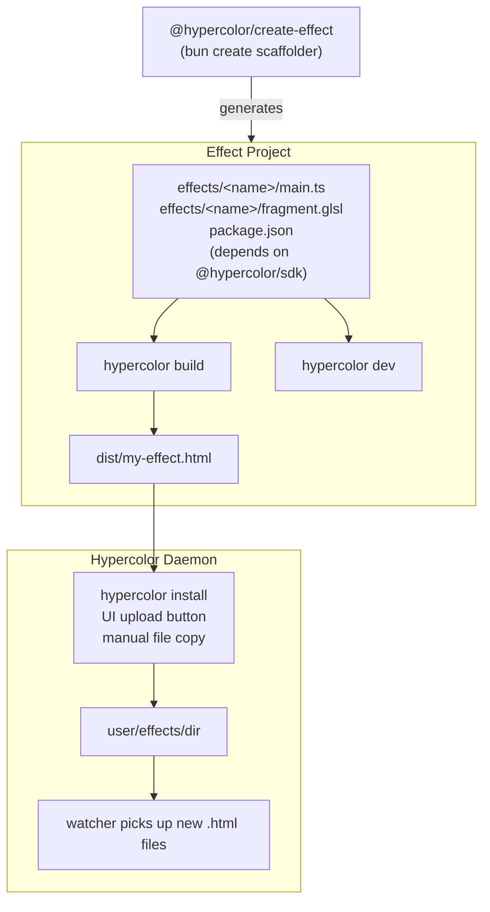

# Spec 31: Effect Developer Experience

> From zero to a running RGB effect in under a minute.

**Status:** Draft
**Scope:** SDK (npm packages), Daemon (install endpoint), CLI (install command), UI (upload)
**Date:** 2026-04-16
**Runtime:** Bun (primary); Node.js 24 LTS (minimum for library consumers)

---

## Table of Contents

- [1. Overview](#1-overview)
  - [1.1 Developer Personas](#11-developer-personas)
  - [1.2 Design Principles](#12-design-principles)
  - [1.3 Non-Goals](#13-non-goals-for-this-spec)
- [2. Architecture](#2-architecture)
- [3. The HTML Effect Contract](#3-the-html-effect-contract)
- [4. Package: `@hypercolor/sdk`](#4-package-hypercolorsdk)
- [5. Package: `@hypercolor/create-effect`](#5-package-hypercolorcreate-effect)
- [6. CLI: `hypercolor` (SDK bin)](#6-cli-hypercolor-sdk-bin)
- [7. Dev Server: `hypercolor dev`](#7-dev-server-hypercolor-dev)
- [8. Build Tool: `hypercolor build`](#8-build-tool-hypercolor-build)
- [9. Validation: `hypercolor validate`](#9-validation-hypercolor-validate)
- [10. Effect Installation](#10-effect-installation)
- [11. Claude Code Agent Skill](#11-claude-code-agent-skill)
- [12. Implementation Plan](#12-implementation-plan)

---

## 1. Overview

Hypercolor effects are self-contained HTML files. The daemon discovers them from
the filesystem, parses their metadata, renders them via Servo, and maps the
output to LED hardware. Today, effects are authored inside the Hypercolor
monorepo using the TypeScript SDK. This spec opens that pipeline to external
developers.

### 1.1 Developer Personas

| Persona            | Skill level  | Toolchain      | What they produce                            |
| ------------------ | ------------ | -------------- | -------------------------------------------- |
| **HTML Hacker**    | Any          | Text editor    | Hand-coded HTML file                         |
| **AI Prompter**    | Any          | AI chat        | AI-generated HTML file                       |
| **TypeScript Dev** | Intermediate | Node/Bun + SDK | TypeScript effect compiled to HTML           |
| **Shader Artist**  | Advanced     | Node/Bun + SDK | GLSL shader wrapped by SDK, compiled to HTML |

All four personas produce the same artifact: a standalone `.html` file that
conforms to the effect contract (section 3).

### 1.2 Design Principles

1. **HTML is the universal format.** The SDK is one way to produce it, not the
   only way.
2. **Two packages, not three.** `@hypercolor/sdk` is both the library and the
   CLI. `@hypercolor/create-effect` is the scaffolder. Nothing else to install.
3. **Bun-native tooling, Node 24 library compat.** The `hypercolor` CLI runs on
   Bun (uses `Bun.build`, `Bun.serve`, native TypeScript, `.glsl` text loader).
   Scaffolded projects are Bun projects. The published `@hypercolor/sdk`
   library is plain ESM and consumable from Node 24+ toolchains (Vite, Next,
   etc.) for authors who need to embed effects elsewhere, but effect
   development itself assumes Bun.
4. **Many effects per project, from day one.** Scaffolds produce a multi-effect
   workspace (`effects/*/main.ts`), not a single-file template. Most authors
   outgrow a one-effect project fast; the shape should not punish growth.
5. **Zero config.** Scaffolded projects work out of the box with no
   configuration files to edit.
6. **Version the contract.** The HTML format carries a version tag so the daemon
   can evolve the spec without breaking old effects.
7. **Hardware bridge deferred.** MVP is browser-only preview. Live-on-LED
   preview during dev is a future phase — see §1.3 Non-Goals.

### 1.3 Non-Goals (for this spec)

- **Live hardware preview during dev.** Streaming dev-server frames directly to
  a running daemon's LEDs is explicitly out of scope. The MVP dev loop is
  browser-only; hardware validation happens after `hypercolor install`. This
  shortens the first implementation by ~4 weeks and keeps the daemon surface
  stable.
- **Audio simulation in dev.** Shipped as a stub (muted `audio` object).
  Metronome/sweep/spectrum simulators land in a follow-up pass.
- **WGSL / compute shaders.** The effect contract is GLSL-fragment only for
  now. WGSL is a design-doc-17 aspiration, not a spec-31 commitment.
- **Native Rust effects.** Out of scope — those ship in `hypercolor-core`
  via the `EffectRenderer` trait and don't pass through this pipeline.
- **Node-without-Bun effect development.** The library works on Node 24; the
  CLI requires Bun. We do not ship a Node-only fork of the CLI.

---

## 2. Architecture



---

## 3. The HTML Effect Contract

This section is the normative reference for the effect file format. Everything
else (SDK, build tool, scaffolder) exists to help produce files that conform to
this contract.

### 3.1 Format Version

Every effect should declare its format version:

```html
<meta name="hypercolor-version" content="1" />
```

The daemon treats missing version as `1` (backwards compatibility). When the
format evolves, the version increments and the daemon can apply migration logic
or warn on unsupported versions.

### 3.2 Required Structure

```html
<!DOCTYPE html>
<html>
  <head>
    <meta charset="utf-8" />
    <meta name="hypercolor-version" content="1" />
    <title>Effect Name</title>
    <!-- metadata tags (see 3.3-3.7) -->
  </head>
  <body>
    <canvas id="exCanvas" width="320" height="200"></canvas>
    <script>
      // effect code
    </script>
  </body>
</html>
```

**Canvas requirements:**

- ID must be `exCanvas`
- Dimensions are dictated by the daemon (640x480 by default, user-configurable).
  The runtime injects them as `window.engine.width` / `window.engine.height` and
  the SDK auto-resizes the canvas every frame. Read `ctx.canvas.width/height`
  inside your draw function — never hardcode. For effects ported from the
  legacy 320x200 SDK grid, use `scaleContext(ctx.canvas, { width: 320, height: 200 })`
  from `@hypercolor/sdk` to translate design-space coordinates.
- Background: black (`#000000`)

### 3.3 Title and Description

```html
<title>Aurora Borealis</title>
<meta description="Shimmering curtains of light dancing across the sky" />
<meta publisher="Your Name" />
```

| Tag                  | Attribute          | Required | Default                    |
| -------------------- | ------------------ | -------- | -------------------------- |
| `<title>`            | text content       | Yes      | "Unnamed Effect"           |
| `<meta description>` | `description` attr | No       | "No description provided." |
| `<meta publisher>`   | `publisher` attr   | No       | "unknown"                  |

Alternative forms accepted:

- `<meta name="description" content="..." />`
- `<meta name="publisher" content="..." />`
- `<meta name="author" content="..." />`

### 3.4 Controls

Controls declare user-adjustable parameters that the daemon exposes in its UI
and API.

```html
<meta
  property="speed"
  label="Speed"
  type="number"
  min="1"
  max="10"
  default="5"
  step="0.5"
  tooltip="How fast the effect moves"
  group="Motion"
/>
```

| Attribute  | Required | Description                                    |
| ---------- | -------- | ---------------------------------------------- |
| `property` | Yes      | Control ID (used in `getControlValue()` calls) |
| `label`    | No       | Display name (defaults to `property`)          |
| `type`     | No       | Control kind (defaults to `number`)            |
| `min`      | No       | Minimum value (number/hue types)               |
| `max`      | No       | Maximum value (number/hue types)               |
| `step`     | No       | Step increment (number/hue types)              |
| `default`  | No       | Initial value                                  |
| `values`   | No       | Comma-separated options (combobox type)        |
| `tooltip`  | No       | Help text shown on hover                       |
| `group`    | No       | UI grouping label                              |

**Control types:**

| Type       | Aliases              | Value domain              | Notes                                       |
| ---------- | -------------------- | ------------------------- | ------------------------------------------- |
| `number`   | —                    | float, bounded by min/max | Default type if omitted                     |
| `boolean`  | —                    | `true`/`false`            | Parsed: `1`, `true`, `yes`, `on` = true     |
| `color`    | —                    | `#RRGGBB` hex string      | Converted to linear sRGB internally         |
| `combobox` | `dropdown`           | string from `values` list | First value is default if `default` omitted |
| `hue`      | —                    | 0-360 float               | Circular hue angle                          |
| `text`     | `textfield`, `input` | arbitrary string          | Free text input                             |
| `sensor`   | —                    | float (read-only)         | System-provided value                       |
| `area`     | —                    | float                     | Spatial parameter                           |

### 3.5 Presets

Named snapshots of control values:

```html
<meta
  preset="Cosmic Dawn"
  preset-description="Warm aurora with gentle drift"
  preset-controls='{"speed":"3","palette":"Aurora","glow":"80"}'
/>
```

| Attribute            | Required | Description                                      |
| -------------------- | -------- | ------------------------------------------------ |
| `preset`             | Yes      | Preset name                                      |
| `preset-description` | No       | Short description                                |
| `preset-controls`    | Yes      | JSON object mapping control IDs to string values |

Control values in `preset-controls` are always strings, regardless of control
type. The daemon converts them to the appropriate type using the control's type
declaration.

### 3.6 Audio Reactivity

```html
<meta audio-reactive="true" />
```

If this tag is absent, the daemon applies a heuristic: it searches the HTML
content for markers like `engine.audio`, `iAudio`, `audio.freq`, `audio.level`,
`audio.density`. If any are found, the effect is flagged as audio-reactive.

Explicit declaration is preferred.

### 3.7 Runtime Environment

The daemon injects a `window.engine` object before the effect script runs:

```typescript
window.engine = {
  width: number,          // target LED width (may differ from canvas)
  height: number,         // target LED height
  getControlValue(id: string): string | number | boolean,
  audio?: {               // present if audio-reactive
    freq: Float32Array,   // frequency bins
    level: number,        // overall level 0-1
    bass: number,         // bass level 0-1
    mid: number,          // mid level 0-1
    treble: number,       // treble level 0-1
    // ... see SDK AudioData type for full surface
  }
}
```

Effects read control values via `window.engine.getControlValue(propertyId)`.
The SDK wraps this — raw HTML effects call it directly.

### 3.8 Minimal Viable Effect (No SDK)

A complete, valid effect with no dependencies:

```html
<!DOCTYPE html>
<html>
  <head>
    <meta charset="utf-8" />
    <meta name="hypercolor-version" content="1" />
    <title>Purple Pulse</title>
    <meta description="Simple pulsing purple light" />
    <meta publisher="You" />
    <meta
      property="speed"
      label="Speed"
      type="number"
      min="1"
      max="10"
      default="5"
      group="Motion"
    />
    <meta
      property="brightness"
      label="Brightness"
      type="number"
      min="0"
      max="100"
      default="80"
      group="Color"
    />
    <meta
      preset="Chill"
      preset-description="Slow gentle pulse"
      preset-controls='{"speed":"2","brightness":"60"}'
    />
    <style>
      body {
        margin: 0;
        overflow: hidden;
        background: #000;
      }
    </style>
  </head>
  <body>
    <canvas id="exCanvas" width="320" height="200"></canvas>
    <script>
      const canvas = document.getElementById("exCanvas");
      const ctx = canvas.getContext("2d");

      function ctrl(name, fallback) {
        return window.engine?.getControlValue?.(name) ?? fallback;
      }

      let t = 0;
      function draw() {
        t += 0.016;
        const speed = ctrl("speed", 5);
        const brightness = ctrl("brightness", 80) / 100;
        const pulse = (Math.sin(t * speed) * 0.5 + 0.5) * brightness;
        const r = Math.floor(128 * pulse);
        const b = Math.floor(255 * pulse);

        ctx.fillStyle = `rgb(${r},0,${b})`;
        ctx.fillRect(0, 0, canvas.width, canvas.height);
        requestAnimationFrame(draw);
      }
      draw();
    </script>
  </body>
</html>
```

Drop this file into `~/.local/share/hypercolor/effects/user/` and it works.

---

## 4. Package: `@hypercolor/sdk`

Published to npm under the `@hypercolor` scope. Contains both the importable
library and the `hypercolor` CLI binary.

### 4.1 Package Structure

```json
{
  "name": "@hypercolor/sdk",
  "version": "0.1.0",
  "type": "module",
  "main": "./dist/index.js",
  "module": "./dist/index.js",
  "types": "./dist/index.d.ts",
  "exports": {
    ".": {
      "types": "./dist/index.d.ts",
      "import": "./dist/index.js"
    }
  },
  "bin": {
    "hypercolor": "./bin/hypercolor.js"
  },
  "files": ["dist", "bin", "templates"],
  "engines": {
    "node": ">=24.0.0",
    "bun": ">=1.2.0"
  },
  "keywords": [
    "hypercolor",
    "rgb",
    "lighting",
    "effects",
    "led",
    "webgl",
    "shader",
    "canvas",
    "bun"
  ]
}
```

**Runtime split.** The published library (`dist/index.js`) is plain ESM — it
imports no runtime-specific APIs and works equally well when consumed by Node
24+, Bun, or a downstream bundler (Vite, Next, esbuild-in-a-tool). The `bin`
entry (`bin/hypercolor.js`) is a Bun-only CLI: it uses `Bun.build`,
`Bun.serve`, native TypeScript loading, and the built-in `.glsl` text loader
declared in `bunfig.toml`. The shebang is `#!/usr/bin/env bun`. Node users who
want to consume the library (e.g. embed `effect()` in a Next.js app) can do so
without ever invoking the CLI.

### 4.2 Library API

The public API surface, importable by effect authors:

```typescript
// --- Effect declarations ---
export function effect(
  name: string,
  shader: string,
  controls: ControlMap,
  options?: EffectOptions,
): void;

export function canvas(
  name: string,
  controls: ControlMap,
  draw: DrawFn,
  options?: CanvasOptions,
): void;

export namespace canvas {
  function stateful(
    name: string,
    controls: ControlMap,
    factory: () => DrawFn,
    options?: CanvasOptions,
  ): void;
}

// --- Control factories ---
export function num(
  label: string,
  range: [min: number, max: number],
  defaultValue: number,
  options?: {
    group?: string;
    tooltip?: string;
    step?: number;
    normalize?: "speed" | "percentage";
    uniform?: string;
  },
): ControlSpec;

export function combo(
  label: string,
  values: string[],
  options?: {
    default?: string;
    group?: string;
    tooltip?: string;
    uniform?: string;
  },
): ControlSpec;

export function toggle(
  label: string,
  defaultValue?: boolean,
  options?: { group?: string; tooltip?: string; uniform?: string },
): ControlSpec;

export function color(
  label: string,
  defaultValue?: string,
  options?: { group?: string; tooltip?: string; uniform?: string },
): ControlSpec;

export function hue(
  label: string,
  defaultValue?: number,
  options?: { group?: string; tooltip?: string; uniform?: string },
): ControlSpec;

export function text(
  label: string,
  defaultValue?: string,
  options?: { group?: string; tooltip?: string },
): ControlSpec;

// --- Control shorthand ---
// Controls can also be declared inline:
//   { speed: [1, 10, 5] }           → num
//   { palette: ['A', 'B', 'C'] }    → combo
//   { active: true }                → toggle
//   { color: '#ff0000' }            → color

// --- Audio ---
export function getAudioData(): AudioData;
export function getBassLevel(): number;
export function getMidLevel(): number;
export function getTrebleLevel(): number;
export function getBeatAnticipation(): number;
export function isOnBeat(): boolean;
export function getHarmonicColor(): [number, number, number];
export function getPitchClassName(): string;
export function getScreenZoneData(): ScreenZoneData;

// --- Palettes ---
export function paletteNames(): string[];
export function samplePalette(
  name: string,
  t: number,
): [r: number, g: number, b: number];
export function createPaletteFn(name: string): PaletteFn;

// --- Utilities ---
export function normalizeSpeed(value: number): number;
export function normalizePercentage(value: number): number;
export function comboboxValueToIndex(values: string[], value: string): number;
export function createDebugLogger(name: string): DebugLogger;
```

### 4.3 Shorthand Control Inference

For concise effect declarations, the SDK infers control type from the value
shape:

| Value                 | Inferred type | Example                       |
| --------------------- | ------------- | ----------------------------- |
| `[min, max, default]` | `num()`       | `speed: [1, 10, 5]`           |
| `string[]`            | `combo()`     | `palette: ['Aurora', 'Fire']` |
| `boolean`             | `toggle()`    | `glow: true`                  |
| `'#RRGGBB'` string    | `color()`     | `accent: '#ff00ff'`           |

### 4.4 Publishing

The published artifact has two parts: the library (`dist/`) and the CLI
(`bin/`). Both ship in a single tarball under `@hypercolor/sdk`.

**Library build (ESM + `.d.ts`):**

Bun builds the JS; `tsc --emitDeclarationOnly` emits types. Bun does not yet
generate `.d.ts` natively, so the split is:

```bash
cd sdk/packages/core
bun build ./src/index.ts \
    --target=browser \
    --format=esm \
    --outdir=./dist \
    --sourcemap=linked
tsc --emitDeclarationOnly --outDir ./dist   # types only, no JS
```

Target `browser` (not `node`) because effect code runs inside Servo's web
context — not in Node's runtime. The library is pure compute + DOM APIs; it
has no Node built-ins to preserve.

**CLI build:** The `bin/hypercolor.js` entry is shipped un-bundled (it
dynamically imports the metadata extractor and build pipeline at runtime).
Minimal transformation — just the shebang and a thin argv dispatcher. Bun
loads its `.ts` dependencies directly.

**Publish command:**

```bash
bun publish --access public
# (bun publish delegates to npm under the hood; npm publish also works.)
```

**Versioning:**

- `@hypercolor/sdk` follows semver against its public library API.
- The HTML format version (`hypercolor-version` meta tag) is a separate integer
  versioned independently (see §4.5).
- The CLI version matches the SDK version — they ship together.
- Release cadence is decoupled from the daemon. A daemon release does not
  force an SDK release and vice versa.

### 4.5 Versioning Strategy

The SDK version and the effect format version are independent:

- **SDK version** (`package.json` `version`): semver, tracks API changes
- **Effect format version** (`hypercolor-version` meta tag): integer, tracks
  the HTML contract

SDK 0.x → format version 1. SDK 1.0 release locks format version 1 as stable.

---

## 5. Package: `@hypercolor/create-effect`

A `bun create` initializer. Scaffolds a new effect _workspace_ — a directory
structured to hold one or many effects. The first effect is generated from the
chosen template; adding more is `hypercolor add <name>` (see §6.5).

### 5.1 Usage

```bash
# Interactive — Bun's native initializer
bun create @hypercolor/effect my-effects

# Non-interactive
bun create @hypercolor/effect my-effects --template shader --first aurora

# Also works via npm-style initializers (Bun is still required at runtime):
npm init @hypercolor/effect my-effects
pnpm create @hypercolor/effect my-effects
```

### 5.2 CLI Arguments

The scaffolder binary (published as `@hypercolor/create-effect`) is invoked
via `bun create @hypercolor/effect`. Bun's `create` resolves `@scope/foo` to
the `@scope/create-foo` package, so the package name and the invocation
command are related by that convention, not identity.

```
bun create @hypercolor/effect [name] [options]

Arguments:
  name                    Workspace directory name (prompted if omitted)

Options:
  --template <type>       Starter template: canvas, shader, face, html
                          (prompted if omitted)
  --first <effect-name>   Name of the first effect inside the workspace
                          (defaults to 'my-effect')
  --audio                 Include audio reactivity boilerplate in the starter
  --no-git                Skip git init
  --no-install            Skip `bun install` after scaffolding
```

### 5.3 Interactive Prompts

When run without arguments:

```
  What's your workspace called? › my-effects

  Pick a starter template:
  ❯ Canvas (2D drawing with TypeScript)
    Shader (GLSL fragment shader + TypeScript)
    Face   (device-mounted display / gauges)
    HTML   (no SDK — plain HTML skeleton)

  Name for your first effect? › aurora

  Audio reactive? (y/N) › N
```

### 5.4 Generated Workspace Layout

All templates produce the same shell. What differs is the contents of the
first generated effect under `effects/<first-effect>/`.

```
my-effects/
├── package.json
├── bunfig.toml
├── tsconfig.json
├── biome.jsonc
├── .gitignore
├── README.md
├── effects/
│   └── aurora/
│       ├── main.ts
│       └── fragment.glsl        # shader template only
└── dist/                        # gitignored, created on first build
```

The workspace holds as many effects as the author wants. Each effect is a
self-contained directory under `effects/`. `hypercolor build` discovers them
all by scanning for `effects/*/main.ts`.

**`package.json`:**

```json
{
  "name": "my-effects",
  "version": "0.1.0",
  "private": true,
  "type": "module",
  "scripts": {
    "dev": "hypercolor dev",
    "build": "hypercolor build --all",
    "build:one": "hypercolor build",
    "validate": "hypercolor validate dist/*.html",
    "ship": "hypercolor install dist/*.html",
    "ship:daemon": "hypercolor install dist/*.html --daemon",
    "add": "hypercolor add",
    "check": "biome check .",
    "check:fix": "biome check --write ."
  },
  "devDependencies": {
    "@biomejs/biome": "^2.4.0",
    "@hypercolor/sdk": "^0.1.0",
    "typescript": "^5.9.0"
  },
  "engines": {
    "bun": ">=1.2.0",
    "node": ">=24.0.0"
  }
}
```

`dev` with no argument opens a picker for the workspace's effects. `build`
defaults to all effects; `build:one <path>` targets a single entry. Ship
scripts have two modes: `ship` copies built HTML into
`$XDG_DATA_HOME/hypercolor/effects/user/` and works even when no daemon is
running; `ship:daemon` uploads via the daemon API once the install endpoint
from section 10.3 is available.

> **Why not `install`?** Bun and npm reserve `install` as a lifecycle script
> name and run it automatically during `bun install`. Using it here would
> trigger an effect deploy every time someone installs dependencies, before
> `dist/` exists. `ship` sidesteps the collision.

Both ship scripts accept a glob expanding to many HTML files; the underlying
`hypercolor install` command iterates and handles each file independently.
In multi-effect workspaces this is the common case. Pass a single file path
to target one effect: `bunx hypercolor install dist/aurora.html`.

**`bunfig.toml`:**

```toml
[loader]
".glsl" = "text"

[install]
link = "hardlink"
```

**`tsconfig.json`:**

```json
{
  "compilerOptions": {
    "target": "ES2024",
    "module": "ESNext",
    "moduleResolution": "bundler",
    "strict": true,
    "noUnusedLocals": true,
    "noUnusedParameters": true,
    "esModuleInterop": true,
    "skipLibCheck": true,
    "types": ["bun-types"]
  },
  "include": ["effects/**/*"]
}
```

**`biome.jsonc`:** Inherits the Hypercolor SilkCircuit style (4-space indent,
single quotes, trailing commas, `arrowParentheses: always`).

### 5.4.1 First Effect: Canvas Template

**`effects/aurora/main.ts`:**

The scaffolder substitutes the effect name you chose (`aurora` here) for the
placeholder. The directory name is the canonical effect ID and becomes the
built filename. The display name inside `canvas()` / `effect()` / `face()`
is user-facing metadata shown in the UI and can differ.

```typescript
import { canvas, num, combo } from "@hypercolor/sdk";

export default canvas(
  "Aurora",
  {
    speed: num("Speed", [1, 10], 5, { group: "Motion" }),
    palette: combo("Palette", ["Aurora", "Fire", "Ocean"], {
      group: "Color",
    }),
    brightness: num("Brightness", [0, 100], 80, { group: "Color" }),
  },
  (ctx, time, controls) => {
    const { width, height } = ctx.canvas;
    const speed = controls.speed ?? 5;
    const brightness = (controls.brightness ?? 80) / 100;

    ctx.fillStyle = "#000";
    ctx.fillRect(0, 0, width, height);

    const hue = (time * speed * 36) % 360;
    ctx.fillStyle = `hsla(${hue}, 100%, 50%, ${brightness})`;
    ctx.fillRect(0, 0, width, height);
  },
  {
    description: "A starter canvas effect",
    author: "You",
    presets: [
      {
        name: "Default",
        description: "Standard configuration",
        controls: { speed: 5, palette: "Aurora", brightness: 80 },
      },
    ],
  },
);
```

### 5.4.2 First Effect: Shader Template

Same workspace layout. The effect directory contains `main.ts` plus
`fragment.glsl`:

```
effects/aurora/
├── main.ts
└── fragment.glsl
```

**`effects/aurora/main.ts`:**

```typescript
import { effect, num, combo } from "@hypercolor/sdk";
import shader from "./fragment.glsl";

export default effect(
  "My Shader Effect",
  shader,
  {
    speed: num("Speed", [1, 10], 5, { group: "Motion" }),
    intensity: num("Intensity", [0, 100], 70, { group: "Color" }),
    palette: combo("Palette", ["Aurora", "Fire", "Ocean"], {
      group: "Color",
    }),
  },
  {
    description: "A starter shader effect",
    author: "You",
    presets: [
      {
        name: "Default",
        description: "Standard configuration",
        controls: { speed: 5, intensity: 70, palette: "Aurora" },
      },
    ],
  },
);
```

**`effects/aurora/fragment.glsl`:**

```glsl
#version 300 es
precision highp float;

out vec4 fragColor;

uniform float iTime;
uniform vec2 iResolution;
uniform float iSpeed;
uniform float iIntensity;
uniform int iPalette;

void main() {
    vec2 uv = gl_FragCoord.xy / iResolution.xy;
    float t = iTime * iSpeed * 0.1;
    float intensity = iIntensity / 100.0;

    // Your shader here
    vec3 col = 0.5 + 0.5 * cos(t + uv.xyx + vec3(0, 2, 4));
    col *= intensity;

    fragColor = vec4(col, 1.0);
}
```

### 5.4.3 First Effect: Face Template

Faces render to a device's onboard display (e.g. a Stream Deck, an
LCD-equipped AIO). They use the `face()` function from the SDK and differ from
standard effects in their metadata and render contract. See Spec 43 (Face
SDK) for the full face contract.

```
effects/hud/
└── main.ts   # uses face(), not canvas()/effect()
```

### 5.4.4 First Effect: HTML Template (no SDK)

For the "I just want to write HTML" path, the scaffolder generates a minimal
workspace with a hand-written effect file — no SDK runtime imports and no
TypeScript build step.

```
my-effects/
├── package.json         # scripts only use hypercolor validate + install
├── .gitignore
└── effects/
    └── aurora.html      # a single file, ready to install
```

`package.json` in this mode carries only the CLI dependency so
`hypercolor validate` and `hypercolor install` still work:

```json
{
  "scripts": {
    "validate": "hypercolor validate effects/*.html",
    "ship": "hypercolor install effects/*.html",
    "ship:daemon": "hypercolor install effects/*.html --daemon"
  },
  "devDependencies": {
    "@hypercolor/sdk": "^0.1.0"
  }
}
```

The HTML file follows the minimal viable effect pattern from §3.8.

### 5.5 Growing the Workspace

After scaffolding, authors add effects with the CLI:

```bash
hypercolor add           # interactive: prompts for name + template
hypercolor add fireball --template shader
hypercolor add hud --template face
```

This creates a new `effects/<name>/` directory seeded from the chosen
template. No edits to `package.json` required — the build tool auto-discovers.

### 5.6 Implementation

`@hypercolor/create-effect` is a small Bun package. Templates live in
`templates/` as real files (not inlined strings) so contributors can iterate
on them in the monorepo without a build step. The scaffolder copies and
variable-substitutes them into the target directory.

Interactive prompts use `@clack/prompts` (small, Bun-friendly, nice SilkCircuit-
compatible output). The package depends on nothing else at runtime beyond
`@clack/prompts` and Bun's stdlib.

The scaffolder runs `bun install` at the end unless `--no-install` is passed,
then prints a "Next steps" block pointing the user at `bun dev`.

---

## 6. CLI: `hypercolor` (SDK workspace bin)

The `hypercolor` command is a bin entry in `@hypercolor/sdk`. It provides
five commands for effect authoring: `dev`, `build`, `validate`, `install`,
and `add`. The shebang is `#!/usr/bin/env bun`; invoking under Node exits
with a clear "please use Bun" message plus install instructions. In this spec,
SDK commands are invoked via `bunx hypercolor` or workspace scripts. The
system Rust CLI remains the bare `hypercolor` command used for daemon,
device, and runtime control.

### 6.1 Command: `hypercolor dev`

Start a development server with live preview.

```
hypercolor dev [entry] [options]

Arguments:
  entry               Effect entry (default: picker over effects/*/main.ts)

Options:
  --port <port>       Dev server port (default: 4200)
  --open              Open browser automatically
```

With no `entry` argument, the dev server scans the workspace for
`effects/*/main.ts` and shows a picker in the browser UI; switching effects
does not restart the server. See section 7 for full dev server specification.

### 6.2 Command: `hypercolor build`

Compile a TypeScript effect (or all effects) into standalone HTML files.

```
hypercolor build [entry] [options]

Arguments:
  entry               Single effect entry to build (default: all)

Options:
  --all               Build every effects/*/main.ts in the workspace (default)
  --out <dir>         Output directory (default: dist/)
  --minify            Minify the output (default: false)
  --watch             Rebuild on source change (not the same as `dev`)
```

Output filenames are derived from each effect's ID, which is the
`effects/<id>/` directory name. The effect's declared title is preserved as
display metadata inside the generated HTML. See section 8 for full build
specification.

### 6.3 Command: `hypercolor add`

Generate a new effect inside an existing workspace.

```
hypercolor add [name] [options]

Arguments:
  name                Effect ID (prompted if omitted)

Options:
  --template <type>   canvas | shader | face | html (prompted if omitted)
  --audio             Include audio reactivity scaffolding
```

Copies the appropriate template into `effects/<name>/` and opens the new
`main.ts` in `$EDITOR` if set. Will not overwrite an existing directory —
collision prints an error and exits non-zero.

### 6.4 Command: `hypercolor validate`

Validate an HTML effect file against the format contract.

```
hypercolor validate <file.html> [options]

Options:
  --strict            Fail on warnings (default: false)
  --json              Output results as JSON
```

See section 9 for full validation specification.

### 6.5 Command: `hypercolor install`

Install a built effect to the Hypercolor user effects directory.

```
hypercolor install [file ...] [options]

Options:
  --daemon            Upload via daemon API instead of file copy
```

See section 10 for full install specification.

---

## 7. Dev Server: `hypercolor dev`

### 7.1 Architecture

The dev server is built on `Bun.serve` — no Vite, no extra runtime. It serves
a preview shell that loads the user's effect in an iframe and provides
interactive controls. A WebSocket channel (also `Bun.serve` native) pushes
reload signals on source changes. Bundling per reload uses `Bun.build` with
the same options as `hypercolor build` (IIFE format, `.glsl` text loader),
producing an in-memory blob served to the iframe without writing to disk.

```
┌─────────────────────────────────────────────────────────┐
│  Hypercolor Effect Studio          http://localhost:4200 │
├──────────────────────────┬──────────────────────────────┤
│                          │                              │
│   ┌──────────────────┐   │  Controls                    │
│   │                  │   │  ┌─ Motion ──────────────┐   │
│   │  Canvas Preview  │   │  │ Speed  [====------] 5 │   │
│   │  (effect iframe) │   │  └───────────────────────┘   │
│   │                  │   │  ┌─ Color ───────────────┐   │
│   └──────────────────┘   │  │ Palette  [Aurora   ▾] │   │
│                          │  │ Brightness [======] 80│   │
│                          │  └───────────────────────┘   │
│                          │                              │
│                          │  Presets                      │
│                          │  [Default] [Chill] [Fire]    │
│                          │                              │
├──────────────────────────┴──────────────────────────────┤
│  Status: Connected │ FPS: 60 │ Canvas: 320x200          │
└─────────────────────────────────────────────────────────┘
```

### 7.2 Core Features

**Hot reload:** File changes in `effects/` trigger a `Bun.build` rebuild
and iframe reload. The control panel state, selected effect, and preview
canvas sizing are preserved across reloads.

**Control panel:** Generated from the effect's declared controls. Sliders for
numbers, dropdowns for comboboxes, toggles for booleans, color pickers for
colors. Grouped by the `group` option. Changes are injected into the iframe's
`window.engine.getControlValue()`.

**Preset switcher:** Buttons for each declared preset. Clicking a preset
updates all controls to the preset values.

**Canvas sizing:** Defaults to the daemon's configured canvas (640x480 by default).
Configurable via the preview shell for testing different hardware layouts.

### 7.3 Bun Integration

The dev server uses Bun's native primitives:

- **`.glsl` loader:** Declared in `bunfig.toml` (`".glsl" = "text"`). No
  plugin needed. `Bun.build` respects the workspace `bunfig.toml`.
- **TypeScript:** Bun loads `.ts` files natively. No transpile step.
- **Source change detection:** `Bun.$` → `fs.watch` on `effects/` with a
  150ms debounce. File change triggers a `Bun.build` rebuild for the affected
  entry.
- **Reload signal:** A WebSocket (`Bun.serve({ websocket })`) broadcasts
  `{ type: 'reload' }` to the preview shell after each successful rebuild.
  The shell reloads the effect iframe (full reload — effects are stateful,
  partial HMR would corrupt state). Control panel state, effect selection,
  and preview sizing are preserved across reloads.
- **Effect picker:** When the dev server is started without an `entry` arg,
  it serves the full workspace. The preview shell shows a dropdown of
  discovered effects; switching re-bundles the selected entry without
  restarting the server.

### 7.4 `window.engine` Stub

The preview shell injects a stub `window.engine` into the effect iframe:

```typescript
window.engine = {
  width: 320,
  height: 200,
  getControlValue(id: string) {
    // reads from the control panel state
    return controlPanelState[id] ?? defaults[id];
  },
  audio: audioSimState, // populated by audio sim controls
};
```

### 7.5 Future: Audio Simulation

Not in MVP. Future versions add audio simulation controls to the preview shell:

- Bass/mid/treble sliders (0-1)
- Beat trigger button
- Audio file playback with real FFT analysis
- Microphone input pass-through

### 7.6 Future: LED Grid Preview

Not in MVP. Future versions add a simulated LED grid below the canvas preview,
showing how the effect maps to physical hardware:

- Configurable grid dimensions
- Different layout shapes (strip, matrix, ring)
- Brightness simulation (gamma-corrected preview)

---

## 8. Build Tool: `hypercolor build`

### 8.1 Pipeline

The build pipeline is the spiritual successor to the monorepo's
`sdk/scripts/build-effect.ts`, ported to `Bun.build` and made workspace-aware
so it can run against external projects. Internally, the monorepo's own
effects eventually migrate to this same CLI (see §12 Phase 1) — dogfooding
the external path.

```
effects/<id>/main.ts ──┬──▶ Metadata Extraction ──▶ Meta Tags
                        │
                        └──▶ Bun.build Bundle ─────▶ Inline JS
                                                        │
                                HTML Template ◀─────────┘
                                     │
                                     ▼
                              dist/<id>.html
```

**Step 1: Metadata extraction**

Import the effect module with `__HYPERCOLOR_METADATA_ONLY__` set on
`globalThis`. The SDK's `effect()` / `canvas()` / `face()` functions detect
this flag and store metadata in `globalThis.__hypercolorEffectDefs__` instead
of initializing a renderer. Extract: name, description, author, controls
(with resolved specs), presets, audio reactivity, optional `builtinId`.

Because Bun loads `.ts` natively, the extractor can just `await import(entry)`
— no transpile step, no fake-DOM seeding beyond the minimal `window` +
`document` stubs already in use.

**Step 2: Bun.build bundle**

Bundle the effect source into a single IIFE-shaped string:

```typescript
const result = await Bun.build({
  entrypoints: [entryPath],
  target: "browser",
  format: "iife",
  minify: options.minify ?? false,
  sourcemap: "none",
  // .glsl is loaded as text via bunfig.toml [loader]
});

const jsBundle = await result.outputs[0].text();
```

`@hypercolor/sdk` resolves from the workspace's `node_modules` via the usual
resolution chain. No path alias is required in the external-project case —
the alias the monorepo currently sets is only needed when building the
monorepo's own effects against the in-tree source.

**Step 3: HTML generation**

Assemble the final HTML file from:

- Meta tags generated from extracted metadata
- `hypercolor-version` meta tag (value: `1`)
- Canvas element (320x200 for effects; face container for face effects)
- Inline script with the bundled JS

**Step 4: Output**

Write to `dist/<id>.html`. The effect ID is the directory name under
`effects/<id>/` and is already kebab-cased by convention from
`hypercolor add`. This ID is the canonical artifact stem for build output,
local install, and daemon upload. The declared effect title remains display
metadata only.

### 8.2 GLSL Handling

Fragment shaders are imported as text strings via Bun's `text` loader, which
is configured once in the workspace's `bunfig.toml`:

```toml
[loader]
".glsl" = "text"
```

```typescript
import shader from "./fragment.glsl"; // string
```

No per-tool configuration required. The scaffolder writes this file; both
`bun build` and `Bun.build` (the API) pick it up automatically.

### 8.3 Shader Uniform Validation

During metadata extraction, if the effect has a shader, the build tool parses
`uniform` declarations from the GLSL source and cross-references them against
declared controls:

- **Extra uniform** (declared in GLSL but not in controls): warning
- **Missing uniform** (declared in controls but not in GLSL): warning
- **Built-in uniforms** (`iTime`, `iResolution`, `iMouse`, `iAudio*`): skipped

This catches typos and forgotten bindings at build time.

### 8.4 Error Reporting

Build errors include:

- TypeScript / `Bun.build` compilation errors (with source locations)
- Metadata extraction failures (effect didn't register)
- Shader uniform mismatches (warnings, not errors)
- Missing entry point

---

## 9. Validation: `hypercolor validate`

### 9.1 Purpose

Validate any HTML effect file — hand-coded, AI-generated, or SDK-built —
against the format contract. This is the quality gate for all personas.

### 9.2 Checks

| Check                               | Severity | Description                            |
| ----------------------------------- | -------- | -------------------------------------- |
| Has `<canvas id="exCanvas">`        | Error    | Required element                       |
| Has `<title>`                       | Error    | Effect must be named                   |
| Has `<script>`                      | Error    | Effect must have code                  |
| Has `hypercolor-version` meta       | Warning  | Recommended for forward compat         |
| Has `description` meta              | Warning  | Recommended for discoverability        |
| Has `publisher`/`author` meta       | Warning  | Recommended                            |
| Controls have valid `type`          | Error    | Must be a known control type           |
| Control `min` < `max`               | Error    | Invalid range                          |
| Control `default` in range          | Warning  | Default outside declared range         |
| Combobox has `values`               | Error    | Combobox without options is broken     |
| Preset controls reference valid IDs | Warning  | Preset references non-existent control |
| Preset controls have valid values   | Warning  | Combobox preset value not in options   |
| No duplicate control IDs            | Error    | Duplicate `property` attributes        |
| `preset-controls` is valid JSON     | Error    | Malformed JSON                         |
| Canvas has reasonable dimensions    | Warning  | Width/height outside 100-1920 range    |
| `audio-reactive` is `true`/`false`  | Warning  | Invalid boolean value                  |
| No external script/link tags        | Warning  | Effect should be self-contained        |

### 9.3 Output

**Default (human-readable):**

```
  my-effect.html

  PASS  Has canvas element
  PASS  Has title: "Aurora Borealis"
  PASS  Has script content
  WARN  Missing hypercolor-version meta tag
  PASS  3 controls validated
  PASS  2 presets validated

  Result: PASS (1 warning)
```

**JSON (`--json`):**

```json
{
  "file": "my-effect.html",
  "valid": true,
  "errors": [],
  "warnings": [
    {
      "code": "MISSING_VERSION",
      "message": "Missing hypercolor-version meta tag"
    }
  ],
  "metadata": {
    "title": "Aurora Borealis",
    "controls": 3,
    "presets": 2,
    "audioReactive": false
  }
}
```

**Strict mode (`--strict`):** Treats warnings as errors. Exit code 1 if any
warnings exist.

---

## 10. Effect Installation

### 10.1 User Effects Directory

The canonical location for user-installed effects:

```
$XDG_DATA_HOME/hypercolor/effects/user/
```

On Linux, this is typically `~/.local/share/hypercolor/effects/user/`.

The daemon watches this directory (via `notify` crate, 300ms debounce). New
`.html` files are automatically discovered, parsed, and added to the registry.
No daemon restart required.

### 10.2 CLI Install

`hypercolor install` ships one or more HTML effects to the daemon or to the
user effects directory. It accepts a file path, a glob, or no argument (in
which case it defaults to `dist/*.html`).

```bash
# From within the scaffolded workspace:
bun run ship                  # dist/*.html copied to user effects dir
bun run ship:daemon           # dist/*.html via daemon API

# Direct invocation:
bunx hypercolor install                        # everything in dist/
bunx hypercolor install dist/aurora.html       # single file
bunx hypercolor install dist/*.html --daemon   # many files, via API
```

**Argument semantics:** `hypercolor install` accepts zero, one, or many file
paths. Zero args means "glob `dist/*.html` in the current directory." One arg
installs that single file. Many args (or a glob that expands to many) install
each file in sequence, with per-file success/failure reporting. A partial
failure (some succeed, some don't) exits non-zero but continues processing so
one broken effect does not block the rest.

**Default behavior (no `--daemon`):**

1. Resolve the list of source HTML files (from args, glob, or default).
2. Resolve user effects directory (`$XDG_DATA_HOME/hypercolor/effects/user/`).
3. Create directory if it does not exist.
4. For each file: validate locally (same checks as `hypercolor validate`),
   copy, print per-file confirmation.
5. The daemon's filesystem watcher picks up new files within 300ms.

**With `--daemon`:**

1. Resolve the list of source HTML files (same as above).
2. For each file: `POST /api/v1/effects/install` with the file as multipart
   form data. The daemon validates server-side and returns registered
   metadata.
3. Print per-file confirmation.
4. If any upload fails (validation error, 409 conflict, etc.), report it and
   continue with the remaining files.

### 10.3 Daemon Install Endpoint

New REST endpoint on the daemon:

```
POST /api/v1/effects/install
Content-Type: multipart/form-data
Body: file=@my-effect.html
```

**Response (201 Created):**

```json
{
  "data": {
    "id": "550e8400-e29b-41d4-a716-446655440000",
    "name": "Aurora Borealis",
    "source": "user",
    "path": "/home/user/.local/share/hypercolor/effects/user/aurora.html",
    "controls": 3,
    "presets": 2
  }
}
```

**Behavior:**

1. Validate the uploaded HTML (same checks as `hypercolor validate`, errors
   are fatal)
2. Derive the installed filename from the uploaded artifact stem
   (`aurora.html` -> `aurora.html`), sanitized and deduped with a suffix on
   collision. If the upload has no usable filename, fall back to the effect
   title.
3. Write to user effects directory
4. Watcher picks it up, or manually trigger rescan
5. Return registered effect metadata

**Error responses:**

- `400 Bad Request` — validation errors (missing canvas, duplicate controls, etc.)
- `413 Payload Too Large` — file exceeds 1 MB limit

### 10.4 UI Upload

The web UI's effects page adds an "Install Effect" action:

1. File picker dialog (accepts `.html`)
2. Client-side validation preview (parse meta tags in JS, show summary)
3. Upload via `POST /api/v1/effects/install`
4. Show confirmation with effect name and control count
5. Navigate to the newly installed effect's detail page

This is a Leptos component addition to `hypercolor-ui`. Implementation details
are deferred to the UI crate's own work.

### 10.5 Manual Install

For users who prefer not to use the CLI or UI:

```bash
cp my-effect.html ~/.local/share/hypercolor/effects/user/
```

The file watcher picks it up within 300ms. Alternatively, poke the rescan
endpoint:

```bash
curl -X POST http://localhost:9420/api/v1/effects/rescan
```

---

## 11. Claude Code Agent Skill

A Claude Code skill that wraps the `hypercolor` CLI, enabling AI-assisted effect
development and system control from within a conversation.

### 11.1 Skill Metadata

```yaml
name: hypercolor
description: >
  Control Hypercolor RGB lighting from the CLI. Use when the user mentions
  effects, devices, lighting, LED, RGB, presets, playlists, or Hypercolor.
  Covers: browsing/activating effects, managing devices, creating presets
  and playlists, tweaking controls, diagnosing issues, and installing effects.
```

### 11.2 Trigger Patterns

The skill activates on:

- "apply this effect", "activate aurora", "stop the effect"
- "list my devices", "show connected devices"
- "set the keyboard to purple", "identify the light strip"
- "create a preset", "make a playlist"
- "check hypercolor status", "diagnose hypercolor"
- "install this effect", "rescan effects"
- "set brightness to 80"
- "what effects are available", "search for audio effects"

### 11.3 Command Reference

The skill provides the agent with the full `hypercolor` CLI surface:

```
SYSTEM STATUS
  hypercolor status [--watch] [--json]
  hypercolor diagnose [--system] [--json]

DEVICES
  hypercolor devices list [--json]
  hypercolor devices discover [--backend hid|wled|hue]
  hypercolor devices info <device>
  hypercolor devices identify <device> [--duration <secs>]
  hypercolor devices set-color <device> <color>

EFFECTS
  hypercolor effects list [--search <term>] [--audio] [--json]
  hypercolor effects info <effect>
  hypercolor effects activate <effect> [-p key=value]... [--speed N] [--intensity N]
  hypercolor effects stop

LIVE CONTROL
  curl -X PATCH localhost:9420/api/v1/effects/current/controls \
    -H 'Content-Type: application/json' \
    -d '{"controls": {"speed": 7, "brightness": 90}}'

PROFILES
  hypercolor profiles list [--json]
  hypercolor profiles create <name> [--description <desc>]
  hypercolor profiles apply <name>
  hypercolor profiles delete <name> --yes

LIBRARY — PRESETS
  hypercolor library presets list [--json]
  hypercolor library presets create <name> --effect <effect> [-c key=value]...
  hypercolor library presets apply <preset>
  hypercolor library presets delete <preset> --yes

LIBRARY — PLAYLISTS
  hypercolor library playlists list [--json]
  hypercolor library playlists create <name> [-i effect:name:duration_ms]...
  hypercolor library playlists activate <playlist>
  hypercolor library playlists stop

LIBRARY — FAVORITES
  hypercolor library favorites list [--json]
  hypercolor library favorites add <effect>
  hypercolor library favorites remove <effect>

SCENES
  hypercolor scenes list [--json]
  hypercolor scenes create <name> --profile <profile> --trigger <type>
  hypercolor scenes activate <scene>
  hypercolor scenes delete <scene> --yes

LAYOUTS
  hypercolor layouts list [--json]
  hypercolor layouts show <layout>

CONFIG
  hypercolor config show [--json]
  hypercolor config get <key>
  hypercolor config set <key> <value> [--live]

EFFECTS MANAGEMENT
  bunx hypercolor install <file.html> [--daemon]
  curl -X POST localhost:9420/api/v1/effects/rescan

SERVICE
  hypercolor service status
  hypercolor service logs [-f] [-n <lines>]

SETTINGS
  curl -X PUT localhost:9420/api/v1/settings/brightness \
    -H 'Content-Type: application/json' \
    -d '{"brightness": 80}'
```

### 11.4 Agent Workflow Examples

**Build-test-install loop:**

```
1. Write/modify effect source in effects/<name>/main.ts
2. bunx hypercolor build
3. bunx hypercolor validate dist/<name>.html
4. bunx hypercolor install dist/<name>.html --daemon
5. hypercolor effects activate <name>
6. hypercolor effects activate <name> -p speed=8 -p brightness=90
7. Iterate on source, rebuild, re-install (or keep `bun dev` running for
   browser-only iteration, then install when ready for hardware)
```

**Live tweaking:**

```
1. hypercolor effects activate iris
2. PATCH /api/v1/effects/current/controls → {"controls": {"speed": 3}}
3. Observe result
4. PATCH /api/v1/effects/current/controls → {"controls": {"speed": 7}}
5. hypercolor library presets create "iris-fast" --effect iris -c speed=7
```

**Diagnostics:**

```
1. hypercolor status --json
2. hypercolor diagnose --system
3. hypercolor service logs -n 50
4. hypercolor devices list --json
```

### 11.5 Implementation

The skill is a Claude Code skill file (markdown with YAML frontmatter) that
lives in the Hypercolor repo or a dedicated plugin. It contains the command
reference above as context, plus behavioral guidance:

- Always use `--json` when parsing output programmatically
- Prefer `hypercolor effects activate` over raw curl for effect activation
- Use `PATCH /effects/current/controls` for live control tweaking (no CLI
  equivalent currently)
- Don't restart the daemon without asking the user
- When installing effects, validate first

---

## 12. Implementation Plan

### Phase 1: Foundation

Publish the SDK, dogfood the CLI against the monorepo's own effects, then
ship the scaffolder.

| Task | Scope      | Description                                                                                                                                                                                              |
| ---- | ---------- | -------------------------------------------------------------------------------------------------------------------------------------------------------------------------------------------------------- |
| 1.1  | SDK        | Port `sdk/scripts/build-effect.ts` to a workspace-aware `Bun.build` pipeline that lives inside `@hypercolor/sdk` (shared by the CLI and the monorepo), and emit `hypercolor-version=1` in generated HTML |
| 1.2  | SDK        | Add `bin/hypercolor.js` (Bun shebang) with `build`, `validate`, `install`, `add` subcommands                                                                                                             |
| 1.3  | SDK        | Implement `hypercolor validate` (section 9)                                                                                                                                                              |
| 1.4  | SDK        | Implement `hypercolor install` — file copy to user effects dir, preserving the artifact stem as the installed filename                                                                                   |
| 1.5  | SDK        | Flip `@hypercolor/sdk` off `"private": true`; add `bin`, `exports`, `files`, `engines` fields                                                                                                            |
| 1.6  | SDK        | Dogfood: switch `just effects-build` / `just effect-build` recipes to call `hypercolor build` against the monorepo's `sdk/src/effects/` layout                                                           |
| 1.7  | SDK        | Register `@hypercolor` scope on npm, publish `@hypercolor/sdk@0.1.0`                                                                                                                                     |
| 1.8  | Scaffolder | Implement `@hypercolor/create-effect` with canvas, shader, face, html templates — all producing the multi-effect workspace layout                                                                        |
| 1.9  | Scaffolder | Publish `@hypercolor/create-effect@0.1.0`                                                                                                                                                                |

**Verify:** `bun create @hypercolor/effect test-effects --template canvas --first aurora && cd test-effects && bun run build` produces `dist/aurora.html`, which passes `hypercolor validate` without warnings.

**Dogfood check:** `just effects-build` in the monorepo produces byte-identical output to the old `sdk/scripts/build-effect.ts --all`. If any diffs exist, they must be justified by the new tool or the old tool is updated first.

### Phase 2: Dev Server

Build the live development experience on `Bun.serve`.

| Task | Scope | Description                                                                                                              |
| ---- | ----- | ------------------------------------------------------------------------------------------------------------------------ |
| 2.1  | SDK   | Implement `hypercolor dev` using `Bun.serve` + native WebSocket for reload signals                                       |
| 2.2  | SDK   | Build the preview shell (HTML page with iframe + control panel) — plain HTML/CSS/JS, no framework                        |
| 2.3  | SDK   | Implement `window.engine` stub injection into effect iframe                                                              |
| 2.4  | SDK   | Wire control panel state to iframe's `getControlValue()`; preserve state across reloads                                  |
| 2.5  | SDK   | Add preset switcher to preview shell                                                                                     |
| 2.6  | SDK   | File watcher (`fs.watch` on `effects/`, 150ms debounce) → `Bun.build` → WebSocket reload                                 |
| 2.7  | SDK   | Effect picker: when started with no entry, list workspace effects and let the shell switch without restarting the server |

**Verify:** `bun create @hypercolor/effect test && cd test && bun dev` opens a browser with live-updating effect preview and working controls. Editing a control's default in source rebuilds in under 300ms.

### Phase 3: Daemon Integration

Add the install endpoint and UI upload.

| Task | Scope  | Description                                                    |
| ---- | ------ | -------------------------------------------------------------- |
| 3.1  | Daemon | Add `POST /api/v1/effects/install` endpoint (multipart upload) |
| 3.2  | Daemon | Validation logic (reuse meta parser, check required elements)  |
| 3.3  | Daemon | File write to user effects dir + dedup naming                  |
| 3.4  | SDK    | Add `--daemon` mode to `hypercolor install`                    |
| 3.5  | UI     | "Install Effect" button on effects page                        |

**Verify:** Build an effect externally, install via CLI, API, and UI. Effect appears in the catalog and can be activated.

### Phase 4: Agent Skill

Create the Claude Code skill for Hypercolor control.

| Task | Scope | Description                                               |
| ---- | ----- | --------------------------------------------------------- |
| 4.1  | Skill | Write the skill file with full `hypercolor` CLI reference |
| 4.2  | Skill | Add workflow examples and behavioral guidance             |
| 4.3  | Skill | Test trigger patterns and command execution               |

**Verify:** In a Claude Code session, ask the agent to list effects, activate one, tweak controls, and install a new effect — all via natural language.

### Phase 5: Polish

Iterative improvements based on real usage.

| Task | Scope | Description                                                |
| ---- | ----- | ---------------------------------------------------------- |
| 5.1  | SDK   | Audio simulation controls in dev server                    |
| 5.2  | SDK   | LED grid preview in dev server                             |
| 5.3  | SDK   | `hypercolor dev` canvas size presets (strip, matrix, ring) |
| 5.4  | Docs  | Effect authoring guide on docsite                          |
| 5.5  | Docs  | SDK API reference on docsite                               |
| 5.6  | Docs  | AI prompt template for generating effects                  |
