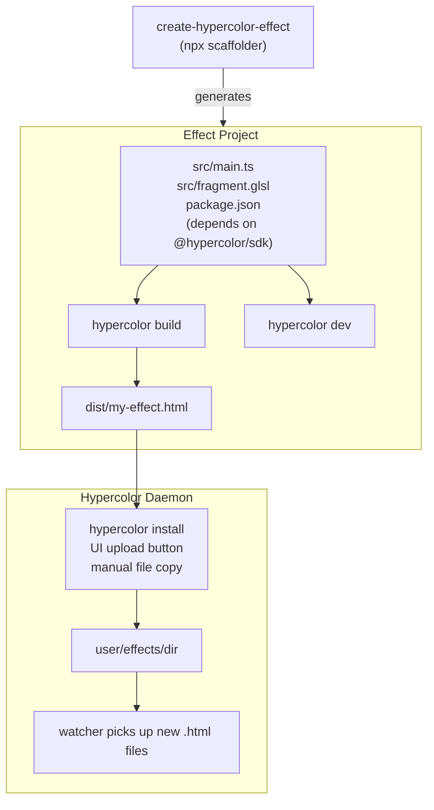

# Spec 31: Effect Developer Experience

> From zero to a running RGB effect in under a minute.

**Status:** Draft
**Scope:** SDK (npm packages), Daemon (install endpoint), CLI (install command), UI (upload)
**Date:** 2026-03-12

---

## Table of Contents

- [1. Overview](#1-overview)
- [2. Architecture](#2-architecture)
- [3. The HTML Effect Contract](#3-the-html-effect-contract)
- [4. Package: `@hypercolor/sdk`](#4-package-hypercolorsdk)
- [5. Package: `create-hypercolor-effect`](#5-package-create-hypercolor-effect)
- [6. CLI: `hypercolor` (SDK bin)](#6-cli-hypercolor-sdk-bin)
- [7. Dev Server: `hypercolor dev`](#7-dev-server-hypercolor-dev)
- [8. Build Tool: `hypercolor build`](#8-build-tool-hypercolor-build)
- [9. Validation: `hypercolor validate`](#9-validation-hypercolor-validate)
- [10. Effect Installation](#10-effect-installation)
- [11. Claude Code Agent Skill](#11-claude-code-agent-skill)
- [12. Implementation Plan](#12-implementation-plan)

---

## 1. Overview

Hypercolor effects are self-contained HTML files. The daemon discovers them from
the filesystem, parses their metadata, renders them via Servo, and maps the
output to LED hardware. Today, effects are authored inside the Hypercolor
monorepo using the TypeScript SDK. This spec opens that pipeline to external
developers.

### 1.1 Developer Personas

| Persona | Skill level | Toolchain | What they produce |
|---------|-------------|-----------|-------------------|
| **HTML Hacker** | Any | Text editor | Hand-coded HTML file |
| **AI Prompter** | Any | AI chat | AI-generated HTML file |
| **TypeScript Dev** | Intermediate | Node/Bun + SDK | TypeScript effect compiled to HTML |
| **Shader Artist** | Advanced | Node/Bun + SDK | GLSL shader wrapped by SDK, compiled to HTML |

All four personas produce the same artifact: a standalone `.html` file that
conforms to the effect contract (section 3).

### 1.2 Design Principles

1. **HTML is the universal format.** The SDK is one way to produce it, not the
   only way.
2. **Two packages, not three.** `@hypercolor/sdk` is both the library and the
   CLI. `create-hypercolor-effect` is the scaffolder. Nothing else to install.
3. **Node-compatible, Bun-optional.** All tooling runs on Node 20+. Bun is
   faster but never required.
4. **Zero config.** Scaffolded projects work out of the box with no
   configuration files to edit.
5. **Version the contract.** The HTML format carries a version tag so the daemon
   can evolve the spec without breaking old effects.

---

## 2. Architecture



---

## 3. The HTML Effect Contract

This section is the normative reference for the effect file format. Everything
else (SDK, build tool, scaffolder) exists to help produce files that conform to
this contract.

### 3.1 Format Version

Every effect should declare its format version:

```html
<meta name="hypercolor-version" content="1" />
```

The daemon treats missing version as `1` (backwards compatibility). When the
format evolves, the version increments and the daemon can apply migration logic
or warn on unsupported versions.

### 3.2 Required Structure

```html
<!DOCTYPE html>
<html>
<head>
  <meta charset="utf-8" />
  <meta name="hypercolor-version" content="1" />
  <title>Effect Name</title>
  <!-- metadata tags (see 3.3-3.7) -->
</head>
<body>
  <canvas id="exCanvas" width="320" height="200"></canvas>
  <script>
    // effect code
  </script>
</body>
</html>
```

**Canvas requirements:**
- ID must be `exCanvas`
- Default dimensions: 320x200 (daemon overrides at runtime via
  `window.engine.width` / `window.engine.height`)
- Background: black (`#000000`)

### 3.3 Title and Description

```html
<title>Aurora Borealis</title>
<meta description="Shimmering curtains of light dancing across the sky" />
<meta publisher="Your Name" />
```

| Tag | Attribute | Required | Default |
|-----|-----------|----------|---------|
| `<title>` | text content | Yes | "Unnamed Effect" |
| `<meta description>` | `description` attr | No | "No description provided." |
| `<meta publisher>` | `publisher` attr | No | "unknown" |

Alternative forms accepted:
- `<meta name="description" content="..." />`
- `<meta name="publisher" content="..." />`
- `<meta name="author" content="..." />`

### 3.4 Controls

Controls declare user-adjustable parameters that the daemon exposes in its UI
and API.

```html
<meta property="speed"
      label="Speed"
      type="number"
      min="1"
      max="10"
      default="5"
      step="0.5"
      tooltip="How fast the effect moves"
      group="Motion" />
```

| Attribute | Required | Description |
|-----------|----------|-------------|
| `property` | Yes | Control ID (used in `getControlValue()` calls) |
| `label` | No | Display name (defaults to `property`) |
| `type` | No | Control kind (defaults to `number`) |
| `min` | No | Minimum value (number/hue types) |
| `max` | No | Maximum value (number/hue types) |
| `step` | No | Step increment (number/hue types) |
| `default` | No | Initial value |
| `values` | No | Comma-separated options (combobox type) |
| `tooltip` | No | Help text shown on hover |
| `group` | No | UI grouping label |

**Control types:**

| Type | Aliases | Value domain | Notes |
|------|---------|-------------|-------|
| `number` | — | float, bounded by min/max | Default type if omitted |
| `boolean` | — | `true`/`false` | Parsed: `1`, `true`, `yes`, `on` = true |
| `color` | — | `#RRGGBB` hex string | Converted to linear sRGB internally |
| `combobox` | `dropdown` | string from `values` list | First value is default if `default` omitted |
| `hue` | — | 0-360 float | Circular hue angle |
| `text` | `textfield`, `input` | arbitrary string | Free text input |
| `sensor` | — | float (read-only) | System-provided value |
| `area` | — | float | Spatial parameter |

### 3.5 Presets

Named snapshots of control values:

```html
<meta preset="Cosmic Dawn"
      preset-description="Warm aurora with gentle drift"
      preset-controls='{"speed":"3","palette":"Aurora","glow":"80"}' />
```

| Attribute | Required | Description |
|-----------|----------|-------------|
| `preset` | Yes | Preset name |
| `preset-description` | No | Short description |
| `preset-controls` | Yes | JSON object mapping control IDs to string values |

Control values in `preset-controls` are always strings, regardless of control
type. The daemon converts them to the appropriate type using the control's type
declaration.

### 3.6 Audio Reactivity

```html
<meta audio-reactive="true" />
```

If this tag is absent, the daemon applies a heuristic: it searches the HTML
content for markers like `engine.audio`, `iAudio`, `audio.freq`, `audio.level`,
`audio.density`. If any are found, the effect is flagged as audio-reactive.

Explicit declaration is preferred.

### 3.7 Runtime Environment

The daemon injects a `window.engine` object before the effect script runs:

```typescript
window.engine = {
  width: number,          // target LED width (may differ from canvas)
  height: number,         // target LED height
  getControlValue(id: string): string | number | boolean,
  audio?: {               // present if audio-reactive
    freq: Float32Array,   // frequency bins
    level: number,        // overall level 0-1
    bass: number,         // bass level 0-1
    mid: number,          // mid level 0-1
    treble: number,       // treble level 0-1
    // ... see SDK AudioData type for full surface
  }
}
```

Effects read control values via `window.engine.getControlValue(propertyId)`.
The SDK wraps this — raw HTML effects call it directly.

### 3.8 Minimal Viable Effect (No SDK)

A complete, valid effect with no dependencies:

```html
<!DOCTYPE html>
<html>
<head>
  <meta charset="utf-8" />
  <meta name="hypercolor-version" content="1" />
  <title>Purple Pulse</title>
  <meta description="Simple pulsing purple light" />
  <meta publisher="You" />
  <meta property="speed" label="Speed" type="number"
        min="1" max="10" default="5" group="Motion" />
  <meta property="brightness" label="Brightness" type="number"
        min="0" max="100" default="80" group="Color" />
  <meta preset="Chill" preset-description="Slow gentle pulse"
        preset-controls='{"speed":"2","brightness":"60"}' />
  <style>
    body { margin: 0; overflow: hidden; background: #000; }
  </style>
</head>
<body>
  <canvas id="exCanvas" width="320" height="200"></canvas>
  <script>
    const canvas = document.getElementById('exCanvas')
    const ctx = canvas.getContext('2d')

    function ctrl(name, fallback) {
      return window.engine?.getControlValue?.(name) ?? fallback
    }

    let t = 0
    function draw() {
      t += 0.016
      const speed = ctrl('speed', 5)
      const brightness = ctrl('brightness', 80) / 100
      const pulse = (Math.sin(t * speed) * 0.5 + 0.5) * brightness
      const r = Math.floor(128 * pulse)
      const b = Math.floor(255 * pulse)

      ctx.fillStyle = `rgb(${r},0,${b})`
      ctx.fillRect(0, 0, canvas.width, canvas.height)
      requestAnimationFrame(draw)
    }
    draw()
  </script>
</body>
</html>
```

Drop this file into `~/.local/share/hypercolor/effects/user/` and it works.

---

## 4. Package: `@hypercolor/sdk`

Published to npm under the `@hypercolor` scope. Contains both the importable
library and the `hypercolor` CLI binary.

### 4.1 Package Structure

```json
{
  "name": "@hypercolor/sdk",
  "version": "0.1.0",
  "type": "module",
  "main": "./dist/index.js",
  "module": "./dist/index.js",
  "types": "./dist/index.d.ts",
  "exports": {
    ".": {
      "types": "./dist/index.d.ts",
      "import": "./dist/index.js"
    }
  },
  "bin": {
    "hypercolor": "./bin/hypercolor.js"
  },
  "files": ["dist", "bin", "templates"],
  "engines": {
    "node": ">=20.0.0"
  },
  "keywords": [
    "hypercolor", "rgb", "lighting", "effects",
    "led", "webgl", "shader", "canvas"
  ]
}
```

### 4.2 Library API

The public API surface, importable by effect authors:

```typescript
// --- Effect declarations ---
export function effect(
  name: string,
  shader: string,
  controls: ControlMap,
  options?: EffectOptions
): void

export function canvas(
  name: string,
  controls: ControlMap,
  draw: DrawFn,
  options?: CanvasOptions
): void

export namespace canvas {
  function stateful(
    name: string,
    controls: ControlMap,
    factory: () => DrawFn,
    options?: CanvasOptions
  ): void
}

// --- Control factories ---
export function num(
  label: string,
  range: [min: number, max: number],
  defaultValue: number,
  options?: { group?: string; tooltip?: string; step?: number;
              normalize?: 'speed' | 'percentage'; uniform?: string }
): ControlSpec

export function combo(
  label: string,
  values: string[],
  options?: { default?: string; group?: string; tooltip?: string;
              uniform?: string }
): ControlSpec

export function toggle(
  label: string,
  defaultValue?: boolean,
  options?: { group?: string; tooltip?: string; uniform?: string }
): ControlSpec

export function color(
  label: string,
  defaultValue?: string,
  options?: { group?: string; tooltip?: string; uniform?: string }
): ControlSpec

export function hue(
  label: string,
  defaultValue?: number,
  options?: { group?: string; tooltip?: string; uniform?: string }
): ControlSpec

export function text(
  label: string,
  defaultValue?: string,
  options?: { group?: string; tooltip?: string }
): ControlSpec

// --- Control shorthand ---
// Controls can also be declared inline:
//   { speed: [1, 10, 5] }           → num
//   { palette: ['A', 'B', 'C'] }    → combo
//   { active: true }                → toggle
//   { color: '#ff0000' }            → color

// --- Audio ---
export function getAudioData(): AudioData
export function getBassLevel(): number
export function getMidLevel(): number
export function getTrebleLevel(): number
export function getBeatAnticipation(): number
export function isOnBeat(): boolean
export function getHarmonicColor(): [number, number, number]
export function getPitchClassName(): string
export function getScreenZoneData(): ScreenZoneData

// --- Palettes ---
export function paletteNames(): string[]
export function samplePalette(name: string, t: number): [r: number, g: number, b: number]
export function createPaletteFn(name: string): PaletteFn

// --- Utilities ---
export function normalizeSpeed(value: number): number
export function normalizePercentage(value: number): number
export function comboboxValueToIndex(values: string[], value: string): number
export function createDebugLogger(name: string): DebugLogger
```

### 4.3 Shorthand Control Inference

For concise effect declarations, the SDK infers control type from the value
shape:

| Value | Inferred type | Example |
|-------|--------------|---------|
| `[min, max, default]` | `num()` | `speed: [1, 10, 5]` |
| `string[]` | `combo()` | `palette: ['Aurora', 'Fire']` |
| `boolean` | `toggle()` | `glow: true` |
| `'#RRGGBB'` string | `color()` | `accent: '#ff00ff'` |

### 4.4 Publishing

The SDK is built with `tsup` (ESM, tree-shaken, source maps, `.d.ts`). The
`bin/hypercolor.js` entry point is a Node-compatible CLI (section 6). The
`templates/` directory contains project scaffolding templates used by
`create-hypercolor-effect`.

**Build command:**

```bash
cd sdk/packages/core
tsup           # → dist/index.js, dist/index.d.ts
tsc --noEmit   # type-check
```

**Publish command:**

```bash
npm publish --access public
```

### 4.5 Versioning Strategy

The SDK version and the effect format version are independent:

- **SDK version** (`package.json` `version`): semver, tracks API changes
- **Effect format version** (`hypercolor-version` meta tag): integer, tracks
  the HTML contract

SDK 0.x → format version 1. SDK 1.0 release locks format version 1 as stable.

---

## 5. Package: `create-hypercolor-effect`

An `npm create` initializer. Scaffolds a new effect project.

### 5.1 Usage

```bash
# Interactive
npx create-hypercolor-effect

# Non-interactive
npx create-hypercolor-effect my-effect --template shader
```

### 5.2 CLI Arguments

```
create-hypercolor-effect [name] [options]

Arguments:
  name                    Project directory name (prompted if omitted)

Options:
  --template <type>       Template: canvas, shader, html (prompted if omitted)
  --audio                 Include audio reactivity boilerplate
  --no-git                Skip git init
  --package-manager <pm>  npm | pnpm | yarn | bun (auto-detected)
```

### 5.3 Interactive Prompts

When run without arguments:

```
  What's your effect called? › my-effect

  Pick a template:
  ❯ Canvas (2D drawing with TypeScript)
    Shader (GLSL fragment shader + TypeScript)
    HTML (no SDK — plain HTML skeleton)

  Audio reactive? (y/N) › N
```

### 5.4 Generated Project: Canvas Template

```
my-effect/
├── package.json
├── tsconfig.json
├── src/
│   └── main.ts
└── .gitignore
```

**`package.json`:**

```json
{
  "name": "my-effect",
  "version": "0.1.0",
  "private": true,
  "type": "module",
  "scripts": {
    "dev": "hypercolor dev",
    "build": "hypercolor build",
    "validate": "hypercolor validate dist/*.html",
    "install-effect": "hypercolor install"
  },
  "devDependencies": {
    "@hypercolor/sdk": "^0.1.0"
  }
}
```

**`tsconfig.json`:**

```json
{
  "compilerOptions": {
    "target": "ES2024",
    "module": "ESNext",
    "moduleResolution": "bundler",
    "strict": true,
    "noUnusedLocals": true,
    "noUnusedParameters": true,
    "esModuleInterop": true,
    "skipLibCheck": true
  },
  "include": ["src"]
}
```

**`src/main.ts`:**

```typescript
import { canvas, num, combo } from '@hypercolor/sdk'

export default canvas(
    'My Effect',
    {
        speed: num('Speed', [1, 10], 5, { group: 'Motion' }),
        palette: combo('Palette', ['Aurora', 'Fire', 'Ocean'], {
            group: 'Color',
        }),
        brightness: num('Brightness', [0, 100], 80, { group: 'Color' }),
    },
    (ctx, time, controls) => {
        const { width, height } = ctx.canvas
        const speed = controls.speed ?? 5
        const brightness = (controls.brightness ?? 80) / 100

        ctx.fillStyle = '#000'
        ctx.fillRect(0, 0, width, height)

        // Your effect here
        const hue = (time * speed * 36) % 360
        ctx.fillStyle = `hsla(${hue}, 100%, 50%, ${brightness})`
        ctx.fillRect(0, 0, width, height)
    },
    {
        description: 'A starter canvas effect',
        author: 'You',
        presets: [
            {
                name: 'Default',
                description: 'Standard configuration',
                controls: { speed: 5, palette: 'Aurora', brightness: 80 },
            },
        ],
    },
)
```

### 5.5 Generated Project: Shader Template

Same structure plus `src/fragment.glsl`:

**`src/main.ts`:**

```typescript
import { effect, num, combo } from '@hypercolor/sdk'
import shader from './fragment.glsl'

export default effect('My Shader Effect', shader, {
    speed: num('Speed', [1, 10], 5, { group: 'Motion' }),
    intensity: num('Intensity', [0, 100], 70, { group: 'Color' }),
    palette: combo('Palette', ['Aurora', 'Fire', 'Ocean'], {
        group: 'Color',
    }),
}, {
    description: 'A starter shader effect',
    author: 'You',
    presets: [
        {
            name: 'Default',
            description: 'Standard configuration',
            controls: { speed: 5, intensity: 70, palette: 'Aurora' },
        },
    ],
})
```

**`src/fragment.glsl`:**

```glsl
#version 300 es
precision highp float;

out vec4 fragColor;

uniform float iTime;
uniform vec2 iResolution;
uniform float iSpeed;
uniform float iIntensity;
uniform int iPalette;

void main() {
    vec2 uv = gl_FragCoord.xy / iResolution.xy;
    float t = iTime * iSpeed * 0.1;
    float intensity = iIntensity / 100.0;

    // Your shader here
    vec3 col = 0.5 + 0.5 * cos(t + uv.xyx + vec3(0, 2, 4));
    col *= intensity;

    fragColor = vec4(col, 1.0);
}
```

### 5.6 Generated Project: HTML Template

No SDK dependency. Just the skeleton:

```
my-effect/
├── my-effect.html
└── .gitignore
```

The HTML file follows the minimal viable effect pattern from section 3.8 with
placeholder controls and a simple render loop. No `package.json`, no build step.

### 5.7 Implementation

`create-hypercolor-effect` is a standalone npm package. It has zero runtime
dependencies — templates are inlined as string literals (no file system
lookups). The interactive prompts use a lightweight prompt library
(`@inquirer/prompts` or `@clack/prompts`).

The package runs on Node 20+ and auto-detects the user's package manager from
the invoking command (`npm create`, `pnpm create`, `bun create`, `yarn create`).

---

## 6. CLI: `hypercolor` (SDK bin)

The `hypercolor` command is a bin entry in `@hypercolor/sdk`. It provides three
commands: `dev`, `build`, `validate`, and `install`.

### 6.1 Command: `hypercolor dev`

Start a development server with live preview.

```
hypercolor dev [options]

Options:
  --port <port>       Dev server port (default: 4200)
  --open              Open browser automatically
  --entry <path>      Effect entry point (default: src/main.ts)
```

See section 7 for full dev server specification.

### 6.2 Command: `hypercolor build`

Compile a TypeScript effect to a standalone HTML file.

```
hypercolor build [options]

Options:
  --entry <path>      Entry point (default: src/main.ts)
  --out <dir>         Output directory (default: dist/)
  --name <name>       Output filename (default: derived from effect name)
  --minify            Minify the output (default: false)
```

See section 8 for full build specification.

### 6.3 Command: `hypercolor validate`

Validate an HTML effect file against the format contract.

```
hypercolor validate <file.html> [options]

Options:
  --strict            Fail on warnings (default: false)
  --json              Output results as JSON
```

See section 9 for full validation specification.

### 6.4 Command: `hypercolor install`

Install a built effect to the Hypercolor user effects directory.

```
hypercolor install [file] [options]

Options:
  --file <path>       HTML file to install (default: dist/*.html)
  --daemon            Upload via daemon API instead of file copy
```

See section 10 for full install specification.

---

## 7. Dev Server: `hypercolor dev`

### 7.1 Architecture

The dev server is a Vite-based development environment. It serves a preview
shell that loads the user's effect in an iframe and provides interactive
controls.

```
┌─────────────────────────────────────────────────────────┐
│  Hypercolor Effect Studio          http://localhost:4200 │
├──────────────────────────┬──────────────────────────────┤
│                          │                              │
│   ┌──────────────────┐   │  Controls                    │
│   │                  │   │  ┌─ Motion ──────────────┐   │
│   │  Canvas Preview  │   │  │ Speed  [====------] 5 │   │
│   │  (effect iframe) │   │  └───────────────────────┘   │
│   │                  │   │  ┌─ Color ───────────────┐   │
│   └──────────────────┘   │  │ Palette  [Aurora   ▾] │   │
│                          │  │ Brightness [======] 80│   │
│                          │  └───────────────────────┘   │
│                          │                              │
│                          │  Presets                      │
│                          │  [Default] [Chill] [Fire]    │
│                          │                              │
├──────────────────────────┴──────────────────────────────┤
│  Status: Connected │ FPS: 60 │ Canvas: 320x200          │
└─────────────────────────────────────────────────────────┘
```

### 7.2 Core Features

**Hot reload:** File changes in `src/` trigger an esbuild rebuild and iframe
reload. The control panel state is preserved across reloads.

**Control panel:** Generated from the effect's declared controls. Sliders for
numbers, dropdowns for comboboxes, toggles for booleans, color pickers for
colors. Grouped by the `group` option. Changes are injected into the iframe's
`window.engine.getControlValue()`.

**Preset switcher:** Buttons for each declared preset. Clicking a preset
updates all controls to the preset values.

**Canvas sizing:** Defaults to 320x200 (standard LED matrix). Configurable via
the preview shell for testing different hardware layouts.

### 7.3 Vite Integration

The dev server uses Vite under the hood:

- **GLSL plugin:** `.glsl` files imported as strings (via `vite-plugin-glsl`
  or a minimal esbuild loader)
- **TypeScript:** Vite handles TS natively via esbuild
- **HMR:** Vite's built-in hot module replacement for the preview shell; the
  effect iframe does a full reload on source changes (effects are stateful,
  partial HMR would corrupt state)

### 7.4 `window.engine` Stub

The preview shell injects a stub `window.engine` into the effect iframe:

```typescript
window.engine = {
  width: 320,
  height: 200,
  getControlValue(id: string) {
    // reads from the control panel state
    return controlPanelState[id] ?? defaults[id]
  },
  audio: audioSimState,  // populated by audio sim controls
}
```

### 7.5 Future: Audio Simulation

Not in MVP. Future versions add audio simulation controls to the preview shell:

- Bass/mid/treble sliders (0-1)
- Beat trigger button
- Audio file playback with real FFT analysis
- Microphone input pass-through

### 7.6 Future: LED Grid Preview

Not in MVP. Future versions add a simulated LED grid below the canvas preview,
showing how the effect maps to physical hardware:

- Configurable grid dimensions
- Different layout shapes (strip, matrix, ring)
- Brightness simulation (gamma-corrected preview)

---

## 8. Build Tool: `hypercolor build`

### 8.1 Pipeline

The build pipeline mirrors the existing `build-effect.ts` from the monorepo,
adapted to work with external projects.

```
src/main.ts ──┬──▶ Metadata Extraction ──▶ Meta Tags
              │
              └──▶ esbuild Bundle ────────▶ Inline JS
                                               │
                          HTML Template ◀───────┘
                               │
                               ▼
                        dist/effect.html
```

**Step 1: Metadata extraction**

Import the effect module with `__HYPERCOLOR_METADATA_ONLY__` set. The SDK's
`effect()` and `canvas()` functions detect this flag and store metadata instead
of initializing a renderer. Extract: name, description, author, controls
(with resolved specs), presets, audio reactivity.

**Step 2: esbuild bundle**

Bundle the effect source into an IIFE:

```typescript
await esbuild.build({
  entryPoints: [entryPath],
  bundle: true,
  format: 'iife',
  target: 'es2024',
  minify: options.minify ?? false,
  loader: { '.glsl': 'text' },
  write: false,
  // resolve @hypercolor/sdk from node_modules
})
```

Key difference from monorepo build: no path alias override. `@hypercolor/sdk`
resolves normally from `node_modules`.

**Step 3: HTML generation**

Assemble the final HTML file from:
- Meta tags generated from extracted metadata
- `hypercolor-version` meta tag (value: `1`)
- Canvas element (320x200)
- Inline script with the bundled JS

**Step 4: Output**

Write to `dist/{effectId}.html`. The effect ID is derived from the effect name
(kebab-cased, ASCII-safe).

### 8.2 GLSL Handling

Fragment shaders are imported as text strings via esbuild's `text` loader:

```typescript
import shader from './fragment.glsl'
```

esbuild resolves this at bundle time. No Vite plugin needed for the build step.

### 8.3 Shader Uniform Validation

During metadata extraction, if the effect has a shader, the build tool parses
`uniform` declarations from the GLSL source and cross-references them against
declared controls:

- **Extra uniform** (declared in GLSL but not in controls): warning
- **Missing uniform** (declared in controls but not in GLSL): warning
- **Built-in uniforms** (`iTime`, `iResolution`, `iMouse`, `iAudio*`): skipped

This catches typos and forgotten bindings at build time.

### 8.4 Error Reporting

Build errors include:
- TypeScript/esbuild compilation errors (with source locations)
- Metadata extraction failures (effect didn't register)
- Shader uniform mismatches (warnings, not errors)
- Missing entry point

---

## 9. Validation: `hypercolor validate`

### 9.1 Purpose

Validate any HTML effect file — hand-coded, AI-generated, or SDK-built —
against the format contract. This is the quality gate for all personas.

### 9.2 Checks

| Check | Severity | Description |
|-------|----------|-------------|
| Has `<canvas id="exCanvas">` | Error | Required element |
| Has `<title>` | Error | Effect must be named |
| Has `<script>` | Error | Effect must have code |
| Has `hypercolor-version` meta | Warning | Recommended for forward compat |
| Has `description` meta | Warning | Recommended for discoverability |
| Has `publisher`/`author` meta | Warning | Recommended |
| Controls have valid `type` | Error | Must be a known control type |
| Control `min` < `max` | Error | Invalid range |
| Control `default` in range | Warning | Default outside declared range |
| Combobox has `values` | Error | Combobox without options is broken |
| Preset controls reference valid IDs | Warning | Preset references non-existent control |
| Preset controls have valid values | Warning | Combobox preset value not in options |
| No duplicate control IDs | Error | Duplicate `property` attributes |
| `preset-controls` is valid JSON | Error | Malformed JSON |
| Canvas has reasonable dimensions | Warning | Width/height outside 100-1920 range |
| `audio-reactive` is `true`/`false` | Warning | Invalid boolean value |
| No external script/link tags | Warning | Effect should be self-contained |

### 9.3 Output

**Default (human-readable):**

```
  my-effect.html

  PASS  Has canvas element
  PASS  Has title: "Aurora Borealis"
  PASS  Has script content
  WARN  Missing hypercolor-version meta tag
  PASS  3 controls validated
  PASS  2 presets validated

  Result: PASS (1 warning)
```

**JSON (`--json`):**

```json
{
  "file": "my-effect.html",
  "valid": true,
  "errors": [],
  "warnings": [
    {
      "code": "MISSING_VERSION",
      "message": "Missing hypercolor-version meta tag"
    }
  ],
  "metadata": {
    "title": "Aurora Borealis",
    "controls": 3,
    "presets": 2,
    "audioReactive": false
  }
}
```

**Strict mode (`--strict`):** Treats warnings as errors. Exit code 1 if any
warnings exist.

---

## 10. Effect Installation

### 10.1 User Effects Directory

The canonical location for user-installed effects:

```
$XDG_DATA_HOME/hypercolor/effects/user/
```

On Linux, this is typically `~/.local/share/hypercolor/effects/user/`.

The daemon watches this directory (via `notify` crate, 300ms debounce). New
`.html` files are automatically discovered, parsed, and added to the registry.
No daemon restart required.

### 10.2 CLI Install

`hypercolor install` copies the built HTML to the user effects directory:

```bash
# Install from dist/ (default)
npx hypercolor install

# Install specific file
npx hypercolor install dist/aurora.html

# Install via daemon API (validates + copies server-side)
npx hypercolor install --daemon
```

**Default behavior:**
1. Find `dist/*.html` (error if zero or multiple without `--file`)
2. Resolve user effects directory (`$XDG_DATA_HOME/hypercolor/effects/user/`)
3. Create directory if it doesn't exist
4. Copy file
5. Print confirmation with the installed path

**With `--daemon`:**
1. Find the HTML file (same as above)
2. `POST /api/v1/effects/install` with the file as multipart form data
3. The daemon validates, copies, and returns the registered effect metadata

### 10.3 Daemon Install Endpoint

New REST endpoint on the daemon:

```
POST /api/v1/effects/install
Content-Type: multipart/form-data
Body: file=@my-effect.html
```

**Response (201 Created):**

```json
{
  "data": {
    "id": "550e8400-e29b-41d4-a716-446655440000",
    "name": "Aurora Borealis",
    "source": "user",
    "path": "/home/user/.local/share/hypercolor/effects/user/aurora-borealis.html",
    "controls": 3,
    "presets": 2
  }
}
```

**Behavior:**
1. Validate the uploaded HTML (same checks as `hypercolor validate`, errors
   are fatal)
2. Derive filename from effect `<title>` (kebab-cased, deduped with suffix if
   collision)
3. Write to user effects directory
4. Watcher picks it up, or manually trigger rescan
5. Return registered effect metadata

**Error responses:**
- `400 Bad Request` — validation errors (missing canvas, duplicate controls, etc.)
- `409 Conflict` — effect with same name already installed (use `?force=true`
  to overwrite)
- `413 Payload Too Large` — file exceeds 1 MB limit

### 10.4 UI Upload

The web UI's effects page adds an "Install Effect" action:

1. File picker dialog (accepts `.html`)
2. Client-side validation preview (parse meta tags in JS, show summary)
3. Upload via `POST /api/v1/effects/install`
4. Show confirmation with effect name and control count
5. Navigate to the newly installed effect's detail page

This is a Leptos component addition to `hypercolor-ui`. Implementation details
are deferred to the UI crate's own work.

### 10.5 Manual Install

For users who prefer not to use the CLI or UI:

```bash
cp my-effect.html ~/.local/share/hypercolor/effects/user/
```

The file watcher picks it up within 300ms. Alternatively, poke the rescan
endpoint:

```bash
curl -X POST http://localhost:9420/api/v1/effects/rescan
```

---

## 11. Claude Code Agent Skill

A Claude Code skill that wraps the `hyper` CLI, enabling AI-assisted effect
development and system control from within a conversation.

### 11.1 Skill Metadata

```yaml
name: hypercolor
description: >
  Control Hypercolor RGB lighting from the CLI. Use when the user mentions
  effects, devices, lighting, LED, RGB, presets, playlists, or Hypercolor.
  Covers: browsing/activating effects, managing devices, creating presets
  and playlists, tweaking controls, diagnosing issues, and installing effects.
```

### 11.2 Trigger Patterns

The skill activates on:
- "apply this effect", "activate aurora", "stop the effect"
- "list my devices", "show connected devices"
- "set the keyboard to purple", "identify the light strip"
- "create a preset", "make a playlist"
- "check hypercolor status", "diagnose hypercolor"
- "install this effect", "rescan effects"
- "set brightness to 80"
- "what effects are available", "search for audio effects"

### 11.3 Command Reference

The skill provides the agent with the full `hyper` CLI surface:

```
SYSTEM STATUS
  hyper status [--watch] [--json]
  hyper diagnose [--system] [--json]

DEVICES
  hyper devices list [--json]
  hyper devices discover [--backend hid|wled|hue]
  hyper devices info <device>
  hyper devices identify <device> [--duration <secs>]
  hyper devices set-color <device> <color>

EFFECTS
  hyper effects list [--search <term>] [--audio] [--json]
  hyper effects info <effect>
  hyper effects activate <effect> [-p key=value]... [--speed N] [--intensity N]
  hyper effects stop

LIVE CONTROL
  curl -X PATCH localhost:9420/api/v1/effects/current/controls \
    -H 'Content-Type: application/json' \
    -d '{"controls": {"speed": 7, "brightness": 90}}'

PROFILES
  hyper profiles list [--json]
  hyper profiles create <name> [--description <desc>]
  hyper profiles apply <name>
  hyper profiles delete <name> --yes

LIBRARY — PRESETS
  hyper library presets list [--json]
  hyper library presets create <name> --effect <effect> [-c key=value]...
  hyper library presets apply <preset>
  hyper library presets delete <preset> --yes

LIBRARY — PLAYLISTS
  hyper library playlists list [--json]
  hyper library playlists create <name> [-i effect:name:duration_ms]...
  hyper library playlists activate <playlist>
  hyper library playlists stop

LIBRARY — FAVORITES
  hyper library favorites list [--json]
  hyper library favorites add <effect>
  hyper library favorites remove <effect>

SCENES
  hyper scenes list [--json]
  hyper scenes create <name> --profile <profile> --trigger <type>
  hyper scenes activate <scene>
  hyper scenes delete <scene> --yes

LAYOUTS
  hyper layouts list [--json]
  hyper layouts show <layout>

CONFIG
  hyper config show [--json]
  hyper config get <key>
  hyper config set <key> <value> [--live]

EFFECTS MANAGEMENT
  hyper effects install <file.html>
  curl -X POST localhost:9420/api/v1/effects/rescan

SERVICE
  hyper service status
  hyper service logs [-f] [-n <lines>]

SETTINGS
  curl -X PUT localhost:9420/api/v1/settings/brightness \
    -H 'Content-Type: application/json' \
    -d '{"brightness": 80}'
```

### 11.4 Agent Workflow Examples

**Build-test-install loop:**

```
1. Write/modify effect source in src/main.ts
2. npx hypercolor build
3. npx hypercolor validate dist/my-effect.html
4. npx hypercolor install dist/my-effect.html
5. hyper effects activate my-effect
6. hyper effects activate my-effect -p speed=8 -p brightness=90
7. Iterate on source, rebuild, re-install
```

**Live tweaking:**

```
1. hyper effects activate iris
2. PATCH /api/v1/effects/current/controls → {"controls": {"speed": 3}}
3. Observe result
4. PATCH /api/v1/effects/current/controls → {"controls": {"speed": 7}}
5. hyper library presets create "iris-fast" --effect iris -c speed=7
```

**Diagnostics:**

```
1. hyper status --json
2. hyper diagnose --system
3. hyper service logs -n 50
4. hyper devices list --json
```

### 11.5 Implementation

The skill is a Claude Code skill file (markdown with YAML frontmatter) that
lives in the Hypercolor repo or a dedicated plugin. It contains the command
reference above as context, plus behavioral guidance:

- Always use `--json` when parsing output programmatically
- Prefer `hyper effects activate` over raw curl for effect activation
- Use `PATCH /effects/current/controls` for live control tweaking (no CLI
  equivalent currently)
- Don't restart the daemon without asking the user
- When installing effects, validate first

---

## 12. Implementation Plan

### Phase 1: Foundation

Publish the SDK and build the scaffolder.

| Task | Scope | Description |
|------|-------|-------------|
| 1.1 | SDK | Extract build logic from `build-effect.ts` into a standalone module that resolves `@hypercolor/sdk` from `node_modules` |
| 1.2 | SDK | Add `bin/hypercolor.js` CLI entry with `build` and `validate` commands |
| 1.3 | SDK | Implement `hypercolor validate` (section 9) |
| 1.4 | SDK | Implement `hypercolor install` — file copy to user effects dir |
| 1.5 | SDK | Prepare `package.json` for npm publish (files, exports, bin, engines) |
| 1.6 | SDK | Register `@hypercolor` scope on npm, publish `@hypercolor/sdk@0.1.0` |
| 1.7 | Scaffolder | Implement `create-hypercolor-effect` with canvas, shader, html templates |
| 1.8 | Scaffolder | Publish `create-hypercolor-effect@0.1.0` |

**Verify:** `npx create-hypercolor-effect test-effect --template canvas && cd test-effect && npm install && npx hypercolor build` produces a valid HTML file.

### Phase 2: Dev Server

Build the live development experience.

| Task | Scope | Description |
|------|-------|-------------|
| 2.1 | SDK | Implement `hypercolor dev` using Vite as the underlying server |
| 2.2 | SDK | Build the preview shell (HTML page with iframe + control panel) |
| 2.3 | SDK | Implement `window.engine` stub injection into effect iframe |
| 2.4 | SDK | Wire control panel state to iframe's `getControlValue()` |
| 2.5 | SDK | Add preset switcher to preview shell |
| 2.6 | SDK | File watcher: rebuild + iframe reload on `src/` changes |

**Verify:** `npx create-hypercolor-effect test && cd test && npm install && npx hypercolor dev` opens a browser with live-updating effect preview and working controls.

### Phase 3: Daemon Integration

Add the install endpoint and UI upload.

| Task | Scope | Description |
|------|-------|-------------|
| 3.1 | Daemon | Add `POST /api/v1/effects/install` endpoint (multipart upload) |
| 3.2 | Daemon | Validation logic (reuse meta parser, check required elements) |
| 3.3 | Daemon | File write to user effects dir + dedup naming |
| 3.4 | CLI | Add `hyper effects install <file>` command |
| 3.5 | SDK | Add `--daemon` mode to `hypercolor install` |
| 3.6 | UI | "Install Effect" button on effects page |
| 3.7 | Types | Add `hypercolor-version` meta tag to format version constant |

**Verify:** Build an effect externally, install via CLI, API, and UI. Effect appears in the catalog and can be activated.

### Phase 4: Agent Skill

Create the Claude Code skill for Hypercolor control.

| Task | Scope | Description |
|------|-------|-------------|
| 4.1 | Skill | Write the skill file with full `hyper` CLI reference |
| 4.2 | Skill | Add workflow examples and behavioral guidance |
| 4.3 | Skill | Test trigger patterns and command execution |

**Verify:** In a Claude Code session, ask the agent to list effects, activate one, tweak controls, and install a new effect — all via natural language.

### Phase 5: Polish

Iterative improvements based on real usage.

| Task | Scope | Description |
|------|-------|-------------|
| 5.1 | SDK | Audio simulation controls in dev server |
| 5.2 | SDK | LED grid preview in dev server |
| 5.3 | SDK | `hypercolor dev` canvas size presets (strip, matrix, ring) |
| 5.4 | Docs | Effect authoring guide on docsite |
| 5.5 | Docs | SDK API reference on docsite |
| 5.6 | Docs | AI prompt template for generating effects |
