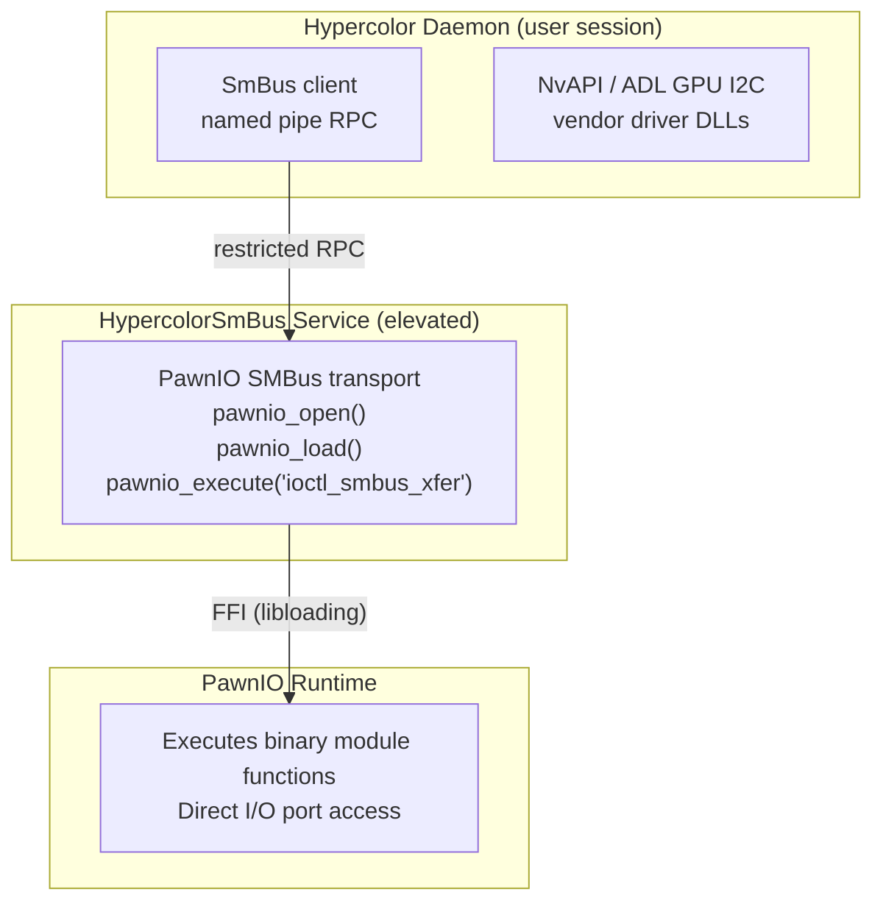

# 32 — Windows Platform Support

> Full Windows support for Hypercolor: USB peripherals, SMBus motherboard/GPU/DRAM RGB, audio-reactive input, session awareness, and native service lifecycle — shipping as both a tray applet and an optional Windows Service.

**Status:** Active implementation
**Author:** Nova
**Date:** 2026-03-13

**Implementation snapshot (2026-05-03):** Windows now has a native development path,
cross-platform HID routing for supported USB devices, PawnIO-backed SMBus transport,
and an optional Windows Service entry point for elevated hardware access. Use
`just windows-diagnose` to inspect the current process owner, PawnIO service/files,
and daemon API state. Use `just windows-service-install` from an elevated PowerShell
session to install the `Hypercolor` service; the recipe does not start it unless
`-Start` is passed. The installer validates that the selected daemon binary supports
SCM mode, prefers the cache-wrapper preview build, and sets service-local PawnIO
environment variables so `LocalSystem` can find the user's downloaded SMBus modules.

---

## Table of Contents

1. [Overview](#1-overview)
2. [Current Platform State](#2-current-platform-state)
3. [Architecture Principles](#3-architecture-principles)
4. [Phase 1 — USB Peripherals & Core Runtime](#4-phase-1--usb-peripherals--core-runtime)
5. [Phase 2 — Audio-Reactive & Input](#5-phase-2--audio-reactive--input)
6. [Phase 3 — SMBus / I2C (Motherboard, GPU, DRAM)](#6-phase-3--smbus--i2c-motherboard-gpu-dram)
7. [Phase 4 — Session, Service & Desktop Integration](#7-phase-4--session-service--desktop-integration)
8. [Phase 5 — Installer & Distribution](#8-phase-5--installer--distribution)
9. [SMBus Deep Dive — Windows I2C Access](#9-smbus-deep-dive--windows-i2c-access)
10. [Dependency Inventory](#10-dependency-inventory)
11. [Testing Strategy](#11-testing-strategy)
12. [Risk Register](#12-risk-register)
13. [Recommendation](#13-recommendation)

---

## 1. Overview

Hypercolor's architecture is already well-factored for multi-platform support. The core engine, effect pipeline, render loop, REST/WebSocket API, Leptos UI, and HIDAPI transport are platform-agnostic. Six subsystems have Linux-specific implementations that need Windows counterparts:

| Subsystem          | Linux Impl                      | Windows Target                   | Difficulty  |
| ------------------ | ------------------------------- | -------------------------------- | ----------- |
| USB HID            | HIDAPI + HIDRAW + nusb          | HIDAPI (already works)           | **Trivial** |
| Audio capture      | PulseAudio (`libpulse-binding`) | WASAPI via `cpal`                | **Medium**  |
| Keyboard input     | `evdev`                         | `device_query` (already in deps) | **Small**   |
| SMBus / I2C        | `i2cdev` (`/dev/i2c-*`)         | PawnIO + NvAPI + ADL             | **Hard**    |
| Session monitoring | D-Bus logind + screensaver      | Win32 power/session events       | **Medium**  |
| Service lifecycle  | systemd + launchd               | Windows Service API or tray-only | **Medium**  |

**~65% of the codebase compiles on Windows today** with no changes. The work is filling in platform-conditional branches that already have `#[cfg]` gates.

---

## 2. Current Platform State

### Already Cross-Platform

- **Engine core** — `EffectEngine`, `RenderLoop`, `EventBus`, `SpatialEngine`
- **Effect system** — All effects are pure color math, no platform code
- **Configuration** — `dirs` crate handles `%APPDATA%` / `%LOCALAPPDATA%` paths
- **REST + WebSocket API** — Tokio + axum, fully cross-platform
- **Leptos UI** — WASM, runs in any browser
- **HIDAPI transport** — `hidapi` crate wraps platform backends
- **Tray applet** — `hypercolor-tray` already has `#[cfg(target_os = "windows")]` arms using `windows-sys`
- **Protocol layer** — All protocol impls (Razer, Corsair, ASUS USB, etc.) are transport-agnostic
- **Wire-format structs** — `zerocopy` is pure Rust, no platform deps

### Linux-Only (Needs Windows Impl)

- `hypercolor-core/src/input/audio/linux.rs` — PulseAudio capture + source enumeration
- `hypercolor-core/src/input/evdev.rs` — Keyboard reactive input
- `hypercolor-core/src/session/logind.rs` — systemd-logind sleep/lock events
- `hypercolor-core/src/session/screensaver.rs` — D-Bus screensaver signals
- `hypercolor-hal/src/transport/hidraw.rs` — Linux HIDRAW (not needed on Windows)
- `hypercolor-hal/src/transport/smbus.rs` — Linux I2C userspace
- `hypercolor-core/src/device/smbus_scanner.rs` — Linux I2C bus enumeration
- `hypercolor-cli/src/commands/service.rs` — systemctl / launchctl only
- `hypercolor-daemon/src/main.rs` — `sd-notify` for systemd readiness

---

## 3. Architecture Principles

### Follow Existing Patterns

The codebase already has a clean multi-platform strategy. Windows support must follow it:

1. **Traits are platform-agnostic** — `Transport`, `Protocol`, `InputSource`, `SessionMonitor`, `DeviceBackend` never import platform code
2. **Implementations are `#[cfg]`-gated** — Platform code lives in separate modules selected at compile time
3. **Graceful fallback** — If a subsystem isn't available, it's silently absent (see `SessionWatcher::start()` pattern)
4. **No stubs** — Don't create placeholder impls. Either implement the real thing or gate it out.

### Platform Module Convention

```
src/input/
├── mod.rs              # Platform-agnostic trait + manager
├── audio/
│   ├── mod.rs          # AudioInput (cross-platform DSP)
│   ├── linux.rs        # PulseAudio capture
│   └── windows.rs      # WASAPI capture (NEW)
├── evdev.rs            # Linux keyboard (existing)
├── windows_input.rs    # Windows keyboard (NEW)
└── screen/
    └── mod.rs          # Cross-platform abstraction
```

### Cargo Feature Strategy

No feature flags for platform selection — use `#[cfg(target_os)]` exclusively. Feature flags are for optional capabilities (like `servo` for HTML effects), not OS selection. This matches the existing codebase convention.

---

## 4. Phase 1 — USB Peripherals & Core Runtime

> **Goal:** `cargo build --workspace` succeeds on Windows. USB HID devices (Razer, Corsair, ASUS USB, etc.) work. Daemon starts and serves the web UI.

### 4.1 Compile Gate Audit

Every `#[cfg(target_os = "linux")]` block needs a corresponding `#[cfg(target_os = "windows")]` or `#[cfg(not(target_os = "linux"))]` branch. Audit and fix all compile errors.

**Key files:**

- `hypercolor-daemon/src/main.rs` — Gate `sd-notify` behind `#[cfg(target_os = "linux")]` (already done), ensure Windows builds skip it
- `hypercolor-daemon/src/startup.rs` — Gate evdev import
- `hypercolor-hal/src/transport/mod.rs` — Gate HIDRAW and SMBus module inclusion
- `hypercolor-core/src/input/mod.rs` — Gate evdev module
- `hypercolor-core/src/session/mod.rs` — Gate logind and screensaver modules
- `hypercolor-core/src/device/smbus_scanner.rs` — Already gated, verify stub returns empty

### 4.2 HIDAPI on Windows

HIDAPI already works on Windows — the `hidapi` crate links against the Windows HID API. No new transport needed. HIDRAW is Linux-only but unnecessary on Windows since HIDAPI covers all USB HID use cases.

**Verify:** All devices currently using HIDAPI transport work on Windows:

- Razer peripherals (keyboards, mice, headsets, docks)
- ASUS USB motherboard controllers (Gen 1–5)
- ASUS addressable headers (Gen 1–4)
- ASUS Terminal
- Corsair iCUE LINK (USB control + bulk transfers)
- Lian Li Uni Hub
- PrismRGB
- Dygma Defy

### 4.3 nusb (USB) on Windows

The `nusb` crate (used by `hid.rs` transport) supports Windows via WinUSB. One Linux-specific code path needs gating:

```rust
// hid.rs — Linux-only kernel driver detach
#[cfg(target_os = "linux")]
device.detach_kernel_driver(interface)?;
```

Verify this is already gated or add the gate.

### 4.4 Daemon Startup

- Remove `sd-notify` dependency on Windows (already conditionally compiled)
- Ensure `XDG_RUNTIME_DIR` fallback on Windows uses `%TEMP%\hypercolor\` for PID file / IPC
- WebSocket + REST API: no changes needed (Tokio + axum are cross-platform)

### 4.5 CLI

- Service commands: add `#[cfg(target_os = "windows")]` arm that errors with "use tray applet or install as Windows Service" (full service support in Phase 4)
- All other CLI commands are API clients — work unchanged

### Deliverable

A Windows binary that starts, discovers USB HID devices, applies effects, and serves the web UI. Audio-reactive and SMBus devices show as unavailable.

---

## 5. Phase 2 — Audio-Reactive & Input

> **Goal:** Audio-reactive effects work with Windows system audio. Keyboard-reactive input works.

### 5.1 WASAPI Audio Capture

**Approach:** Use the `cpal` crate with its WASAPI backend. `cpal` is the Rust standard for cross-platform audio I/O and supports loopback capture on Windows.

**New file:** `hypercolor-core/src/input/audio/windows.rs`

**Implementation:**

1. Enumerate audio sources via `cpal::available_hosts()` → `cpal::Host::output_devices()`
2. Open a loopback stream on the default output device (captures system audio)
3. Feed samples into the existing `AudioAnalyzer` FFT pipeline via the lock-free ring buffer
4. Expose `enumerate_named_audio_sources()` returning `Vec<NamedAudioSource>` (same interface as `linux.rs`)

**Key difference from Linux:** PulseAudio uses `.monitor` sink sources for loopback. WASAPI has native loopback capture on output devices — simpler in some ways.

**Wire-up in `audio/mod.rs`:**

```rust
#[cfg(target_os = "linux")]
mod linux;
#[cfg(target_os = "windows")]
mod windows;

// In AudioInput::start():
#[cfg(target_os = "linux")]
{ /* existing PulseAudio path */ }
#[cfg(target_os = "windows")]
{ /* WASAPI path via cpal */ }
```

### 5.2 Keyboard Input

**Approach:** `device_query` is already a workspace dependency and supports Windows. Alternatively, use the `windows` crate with `GetAsyncKeyState` for lower latency.

**New file:** `hypercolor-core/src/input/windows_input.rs`

**Implementation:**

1. Implement `InputSource` trait
2. Poll key states at the engine tick rate
3. Map Windows virtual key codes to the existing `KeyCode` enum

**Wire-up in `input/mod.rs`:**

```rust
#[cfg(target_os = "linux")]
pub mod evdev;
#[cfg(target_os = "windows")]
pub mod windows_input;
```

### Deliverable

Audio spectrum visualizers and keyboard-reactive effects work on Windows.

---

## 6. Phase 3 — SMBus / I2C (Motherboard, GPU, DRAM)

> **Goal:** ASUS Aura ENE SMBus devices (motherboard, GPU, DRAM) work on Windows. This is the hardest phase and the one with the most open questions.

This phase has its own deep dive in §9. Summary here:

### 6.1 Three Access Strategies

Windows has no `/dev/i2c-*` equivalent. Three complementary approaches are needed (matching OpenRGB's proven model):

| Strategy   | Covers                                             | Mechanism                                                   | Privilege Model             |
| ---------- | -------------------------------------------------- | ----------------------------------------------------------- | --------------------------- |
| **PawnIO** | Motherboard SMBus (Intel i801, AMD PIIX4, Nuvoton) | Userspace I/O executor with chipset-specific binary modules | `HypercolorSmBus` broker    |
| **NvAPI**  | NVIDIA GPU I2C                                     | NVIDIA driver SDK (`nvapi64.dll`)                           | User-mode daemon            |
| **ADL**    | AMD GPU I2C                                        | AMD Display Library (`atiadlxx.dll`)                        | User-mode daemon            |

### 6.2 Transport Abstraction

The existing `SmBusTransport` already encodes operations as platform-independent `SmBusOperation` sequences. The Windows port replaces only the I/O backend:

```
SmBusOperation (platform-agnostic)
    ↓ encode
Linux: i2cdev ioctl              →  /dev/i2c-N
Windows broker: PawnIO execute   →  SmbusI801.bin / SmbusPIIX4.bin
Windows user: NvAPI i2c_xfer     →  nvapi64.dll
Windows user: ADL WriteAndReadI2C → atiadlxx.dll
```

**New files:**

- `hypercolor-hal/src/transport/smbus_pawnio.rs` — PawnIO wrapper
- `hypercolor-hal/src/transport/smbus_nvapi.rs` — NVIDIA I2C wrapper
- `hypercolor-hal/src/transport/smbus_adl.rs` — AMD I2C wrapper

### 6.3 Bus Enumeration

Linux uses sysfs to discover I2C buses and their parent PCI devices. Windows equivalent:

1. **PawnIO:** Load chipset modules, probe known addresses (same as Linux scanner)
2. **NvAPI:** `NvAPI_EnumPhysicalGPUs()` → GPU handles → I2C bus per GPU
3. **ADL:** `ADL2_Adapter_NumberOfAdapters_Get()` → adapter indices → I2C per adapter

**New file:** `hypercolor-core/src/device/smbus_scanner_windows.rs`

### 6.4 PawnIO Integration

PawnIO is a third-party userspace executor created by namazso. Hypercolor bundles
the official PawnIO installer plus the LGPL-2.1 module release artifacts needed
for the chipset SMBus controllers it currently loads:

- `SmbusI801.bin` — Intel i801 (most Intel boards)
- `SmbusPIIX4.bin` — AMD PIIX4 (most AMD boards, dual bus with port selection)
- `SmbusNCT6793.bin` — Nuvoton Super I/O (some boards expose SMBus through Super I/O)

**Integration approach:**

1. Stage `PawnIO_setup.exe` and required `.bin` modules with the Hypercolor Windows installer
2. Install PawnIO only after explicit user action and UAC consent
3. Run motherboard/DRAM SMBus transactions through the narrow `HypercolorSmBus` broker
4. Load PawnIO at runtime via `libloading` (Rust FFI)
5. Implement `Transport` trait using `pawnio_execute("ioctl_smbus_xfer", ...)`
6. Global mutex (`Global\Access_SMBUS.HTP.Method`) for multi-process safety (matches OpenRGB convention)

**PawnIO API (FFI bindings):**

```rust
// Minimal FFI surface
extern "C" {
    fn pawnio_version(version: *mut u32) -> HRESULT;
    fn pawnio_open(handle: *mut HANDLE) -> HRESULT;
    fn pawnio_load(handle: HANDLE, blob: *const u8, size: u32) -> HRESULT;
    fn pawnio_execute(
        handle: HANDLE,
        function: *const c_char,
        input: *const u8,
        input_size: u32,
        output: *mut u8,
        output_size: u32,
        bytes_returned: *mut u32,
    ) -> HRESULT;
    fn pawnio_close(handle: HANDLE) -> HRESULT;
}
```

### 6.5 GPU Vendor SDK Integration

**NVIDIA NvAPI:**

- Dynamically load `nvapi64.dll` (ships with NVIDIA driver)
- Use `NvAPI_I2CRead` / `NvAPI_I2CWrite` for I2C transactions
- GPU port 1 is where ASUS Aura controllers live
- Existing `AuraSmBusProtocol` works unchanged — it just needs a different transport

**AMD ADL:**

- Dynamically load `atiadlxx.dll` (ships with AMD driver)
- Use `ADL2_Display_WriteAndReadI2C` for I2C transactions
- Enumerate adapters to find GPUs with I2C buses

Both are runtime-optional: if the DLL isn't present, that GPU vendor's SMBus is unavailable (graceful degradation). They should not run in the `HypercolorSmBus` service because they are display-driver APIs and may depend on the interactive user session.

### 6.6 DRAM Considerations

ASUS Aura DRAM uses a remap hub at I2C address 0x77 to move DRAM controller addresses into accessible ranges. This hub manipulation works through standard SMBus operations — if the motherboard SMBus is accessible via PawnIO, DRAM should work too.

**Risk:** Some chipsets may not expose the SPD hub through the same SMBus controller PawnIO targets. Testing required on real hardware.

### Deliverable

ASUS Aura motherboard LEDs, GPU LEDs, and DRAM LEDs controllable on Windows. The privileged broker is only for PawnIO-backed motherboard and DRAM SMBus; GPU I2C works at user privilege through vendor driver DLLs.

---

## 7. Phase 4 — Session, Service & Desktop Integration

> **Goal:** Hypercolor runs as a background service, responds to sleep/wake/lock, integrates with Windows desktop.

### 7.1 Session Monitoring

**New file:** `hypercolor-core/src/session/windows.rs`

Implement `SessionMonitor` for:

- **Sleep/wake** — `WM_POWERBROADCAST` with `PBT_APMQUERYSUSPEND` / `PBT_APMRESUMEAUTOMATIC`
- **Lock/unlock** — `WTSRegisterSessionNotification` → `WM_WTSSESSION_CHANGE` with `WTS_SESSION_LOCK` / `WTS_SESSION_UNLOCK`
- **Lid close** (laptops) — `RegisterPowerSettingNotification` with `GUID_LIDSWITCH_STATE_CHANGE`

Uses the `windows` crate for Win32 API access. Spawns a hidden message-only window for receiving system messages.

### 7.2 Service Lifecycle

**Two modes on Windows:**

1. **Tray applet mode** (default) — Hypercolor runs as a tray application started at login. Uses `hypercolor-tray` (already has Windows support). Registered via `HKCU\Software\Microsoft\Windows\CurrentVersion\Run`.

2. **Windows Service mode** (optional) — For headless/server setups. Uses the `windows-service` crate. Registered via `sc.exe` or the installer.

**CLI integration:**

```rust
#[cfg(target_os = "windows")]
ServiceCommand::Start => {
    // Check if running as service or start tray app
}
```

### 7.3 Autostart

- Tray mode: Registry key `HKCU\...\Run\Hypercolor`
- Service mode: `sc.exe create hypercolor` with auto-start

### Deliverable

Hypercolor survives sleep/wake cycles, pauses effects on lock, and starts automatically on boot.

---

## 8. Phase 5 — Installer & Distribution

> **Goal:** One-click Windows installer that handles driver prerequisites and admin elevation.

### 8.1 Installer Requirements

1. Install binaries to `%PROGRAMFILES%\Hypercolor\`
2. Include pinned PawnIO payloads and install them only after explicit user consent
3. Install web UI assets to `%LOCALAPPDATA%\Hypercolor\ui\`
4. Register tray applet autostart
5. Create Start Menu shortcuts
6. Optional: register as Windows Service

### 8.2 Installer Technology

**Recommended:** [WiX Toolset](https://wixtoolset.org/) (MSI) or [NSIS](https://nsis.sourceforge.io/). WiX preferred for clean uninstall and upgrade paths.

**Alternative:** `cargo-wix` for Rust-native MSI generation.

### 8.3 Admin Elevation

SMBus access via PawnIO requires elevated hardware access. The app keeps that
surface in a narrow broker instead of elevating the whole daemon:

1. **Default desktop mode** — Daemon starts unprivileged; USB, HID, GPU vendor SDK, audio, UI, and network backends work from the user session.
2. **SMBus broker mode** — Install `HypercolorSmBus` as a Windows Service for PawnIO-backed motherboard and DRAM SMBus transactions.

Recommended: **tray app for normal devices (no elevation)**, **optional service install for PawnIO SMBus devices (elevated)**. This mirrors how OpenRGB separates ordinary USB/device-driver paths from SMBus access while avoiding a fully elevated daemon.

### Deliverable

`Hypercolor-Setup.exe` that installs everything with appropriate elevation prompts.

---

## 9. SMBus Deep Dive — Windows I2C Access

This section covers the technical details of Windows SMBus access, informed by OpenRGB's production-proven approach.

### 9.1 Why Windows SMBus Is Hard

Linux exposes I2C buses as `/dev/i2c-*` device files accessible from userspace. Windows has no equivalent. The SMBus controller is owned by the chipset driver (Intel or AMD), and there's no public API to perform I2C transactions.

**Historical approaches (and why they failed):**

- **InpOut32** — Direct port I/O from userspace. Now flagged as malware by AV vendors.
- **WinRing0** — Ring 0 privilege escalation. Same AV problem, plus security risk.
- **Custom kernel driver** — Requires EV code signing ($$$), Microsoft WHQL process.

**Current approach (proven by OpenRGB):**

- **PawnIO** — Modern userspace executor. Not flagged by AV. Requires admin but no kernel driver signing.

### 9.2 PawnIO Architecture

PawnIO is a lightweight executor framework that runs chipset-specific binary modules in a privileged context:



### 9.3 Chipset Module Coverage

| Module             | Chipset         | Coverage                                                |
| ------------------ | --------------- | ------------------------------------------------------- |
| `SmbusI801.bin`    | Intel i801      | Intel 6th gen+ (Skylake through current)                |
| `SmbusPIIX4.bin`   | AMD PIIX4       | AMD Ryzen (all generations) — dual bus with port select |
| `SmbusNCT6793.bin` | Nuvoton NCT6793 | Some boards with Super I/O SMBus                        |

This covers the vast majority of gaming motherboards with ASUS Aura.

### 9.4 Rust FFI Design

```rust
/// PawnIO runtime handle (Windows-only)
#[cfg(target_os = "windows")]
pub struct PawnioRuntime {
    lib: libloading::Library,
    handle: HANDLE,
}

#[cfg(target_os = "windows")]
impl PawnioRuntime {
    /// Load PawnIO DLL and open executor
    pub fn open() -> Result<Self> { /* ... */ }

    /// Load a chipset module (.bin blob)
    pub fn load_module(&self, blob: &[u8]) -> Result<()> { /* ... */ }

    /// Execute an SMBus transfer
    pub fn smbus_xfer(
        &self,
        addr: u8,
        read_write: SmBusReadWrite,
        command: u8,
        size: SmBusSize,
        data: &mut [u8],
    ) -> Result<()> { /* ... */ }
}
```

### 9.5 Global SMBus Mutex

OpenRGB convention: all programs accessing SMBus on Windows share a named mutex `Global\Access_SMBUS.HTP.Method`. Hypercolor must acquire this mutex before any SMBus transaction to prevent bus corruption when running alongside OpenRGB or Armoury Crate.

```rust
let mutex = unsafe {
    CreateMutexW(null(), FALSE, w!("Global\\Access_SMBUS.HTP.Method"))
};
// Acquire before each transaction sequence, release after
```

### 9.6 GPU I2C via Vendor SDKs

**NvAPI wrapper:**

```rust
#[cfg(target_os = "windows")]
pub struct NvApiI2cBus {
    lib: libloading::Library,
    gpu_handle: NvPhysicalGpuHandle,
    port: u8,  // typically 1 for RGB controllers
}
```

**ADL wrapper:**

```rust
#[cfg(target_os = "windows")]
pub struct AdlI2cBus {
    lib: libloading::Library,
    context: ADL_CONTEXT_HANDLE,
    adapter_index: i32,
}
```

Both implement the `Transport` trait, so the existing `AuraSmBusProtocol` works without modification — it just gets a different transport handle.

### 9.7 Cross-Platform SmBusTransport Refactor

Current `SmBusTransport` mixes platform-independent operation encoding with Linux-specific I2C access. Refactor:

```
SmBusTransport (platform-agnostic: operation encoding/decoding)
    ├── LinuxI2cBackend (i2cdev ioctl)
    ├── PawnioBackend (PawnIO executor)
    ├── NvApiBackend (NVIDIA I2C)
    └── AdlBackend (AMD I2C)
```

The `SmBusOperation` enum and `encode_operations()` / `decode_operations()` are already platform-independent. Extract the actual I/O into a backend trait:

```rust
/// Platform-specific SMBus I/O backend
trait SmBusBackend: Send + Sync {
    fn quick_write(&self, addr: u8) -> Result<()>;
    fn read_byte_data(&self, addr: u8, register: u8) -> Result<u8>;
    fn write_byte_data(&self, addr: u8, register: u8, value: u8) -> Result<()>;
    fn write_word_data(&self, addr: u8, register: u8, value: u16) -> Result<()>;
    fn write_block_data(&self, addr: u8, register: u8, data: &[u8]) -> Result<()>;
}
```

---

## 10. Dependency Inventory

### New Windows Dependencies

| Crate             | Purpose                                           | Conditional                                   |
| ----------------- | ------------------------------------------------- | --------------------------------------------- |
| `cpal`            | WASAPI audio capture                              | `cfg(target_os = "windows")` in core          |
| `windows`         | Win32 session/power events, named mutex, registry | `cfg(target_os = "windows")` in core + daemon |
| `windows-service` | Optional Windows Service mode                     | `cfg(target_os = "windows")` in daemon        |
| `libloading`      | PawnIO DLL + NvAPI + ADL runtime loading          | `cfg(target_os = "windows")`; PawnIO wrapper lives in `hypercolor-windows-pawnio` |

### Bundled Artifacts (Windows only)

| Artifact             | Source                                        | License / Handling |
| -------------------- | --------------------------------------------- | ------------------ |
| `PawnIO_setup.exe`   | [PawnIO.Setup](https://github.com/namazso/PawnIO.Setup) | Third-party installer, staged by hash |
| `SmbusI801.bin`      | [PawnIO.Modules](https://github.com/namazso/PawnIO.Modules) | LGPL 2.1 module artifact |
| `SmbusPIIX4.bin`     | PawnIO.Modules                                | LGPL 2.1 module artifact |
| `SmbusNCT6793.bin`   | PawnIO.Modules                                | LGPL 2.1 module artifact |
| `manifest.json`      | Generated by `scripts/fetch-pawnio-assets.ps1` | Versions, URLs, SHA256 pins |

Do not commit the binary payloads. Release staging downloads the pinned upstream
artifacts, verifies SHA256, writes a manifest, and places them under the Tauri
`tools\pawnio\` resources directory. PawnIO is loaded dynamically through
`PawnIOLib.dll` after the user installs the runtime; it is not statically linked
into Hypercolor.

### Existing Dependencies That Already Support Windows

- `hidapi` — Windows HID backend
- `nusb` — WinUSB backend
- `tokio` — Windows IOCP
- `axum` — cross-platform
- `dirs` — Windows `Known Folder` paths
- `device_query` — Windows input

---

## 11. Testing Strategy

### CI Matrix

Add Windows to the GitHub Actions matrix:

```yaml
strategy:
  matrix:
    os: [ubuntu-latest, macos-latest, windows-latest]
```

**Phase 1 gate:** `cargo check --workspace` and `cargo test --workspace` pass on Windows.

### Hardware Testing

| Phase | Test Target       | Hardware Required                     |
| ----- | ----------------- | ------------------------------------- |
| 1     | USB HID devices   | Any Razer/Corsair/ASUS USB peripheral |
| 2     | Audio reactive    | Any Windows audio output              |
| 3a    | Motherboard SMBus | Intel or AMD board with ASUS Aura     |
| 3b    | GPU I2C           | ASUS ROG GPU (NVIDIA or AMD)          |
| 3c    | DRAM              | ASUS Aura RGB RAM                     |

Linux already has the `/dev/i2c-*`/`i2c-dev` transport path used by the ASUS
SMBus scanner, but broad motherboard, DRAM, and GPU coverage remains
hardware-untested. NvAPI and ADL are Windows-only; Linux GPU I2C support would
use exposed I2C buses or a future vendor-specific backend.

### Mock Testing

- PawnIO: Mock the `pawnio_execute` FFI for unit tests
- NvAPI / ADL: Mock DLL loading with stub implementations
- `SmBusBackend` trait enables test doubles without platform code

---

## 12. Risk Register

| Risk                                                   | Impact | Likelihood | Mitigation                                                                                      |
| ------------------------------------------------------ | ------ | ---------- | ----------------------------------------------------------------------------------------------- |
| PawnIO flagged by AV                                   | High   | Low        | PawnIO is actively maintained and not currently flagged. Distribute with code signing.          |
| ASUS locks SMBus to Armoury Crate                      | High   | Medium     | Armoury Crate doesn't lock the bus — OpenRGB coexists. Global mutex prevents conflicts.         |
| PawnIO doesn't cover niche chipsets                    | Medium | Low        | i801 + PIIX4 cover 95%+ of gaming boards. NCT6793 for edge cases.                               |
| GPU vendor SDK API changes                             | Medium | Low        | NvAPI and ADL are stable for years. Dynamic loading isolates breakage.                          |
| Admin requirement deters users                         | Medium | Medium     | USB, network, and GPU SDK paths work without admin. Only PawnIO SMBus needs the broker.         |
| DRAM remap hub inaccessible                            | Low    | Medium     | DRAM is Phase 3 / lower priority. USB peripherals and motherboard LEDs are the primary targets. |
| Windows Defender SmartScreen blocks unsigned installer | Medium | High       | Get EV code signing cert or distribute via winget/scoop with checksums.                         |

---

## 13. Recommendation

**Ship in phases, USB-first.**

Phase 1 is low-hanging fruit — the code is nearly there. Getting `cargo build` working on Windows and USB devices functional is probably a week of focused work, mostly compile-gate cleanup.

Phase 2 (audio + keyboard input) is straightforward with `cpal` and `device_query`.

Phase 3 (SMBus) is the real investment, but OpenRGB has proven the path. PawnIO + vendor GPU SDKs is a known-good architecture. The key insight is that the `AuraSmBusProtocol` implementation doesn't change at all — only the transport backend underneath it.

**Recommended priority order:**

1. Phase 1 (USB + compile) — unlocks the largest device catalog
2. Phase 2 (audio + input) — completes the effect experience
3. Phase 4 (session + service) — makes it production-ready
4. Phase 3 (SMBus) — the enthusiast power feature
5. Phase 5 (installer) — distribution polish

Phase 3 and 4 can be parallelized. Phase 5 depends on everything else.

The architecture is ready. The hard part isn't design — it's testing on real Windows hardware across chipset variants.
