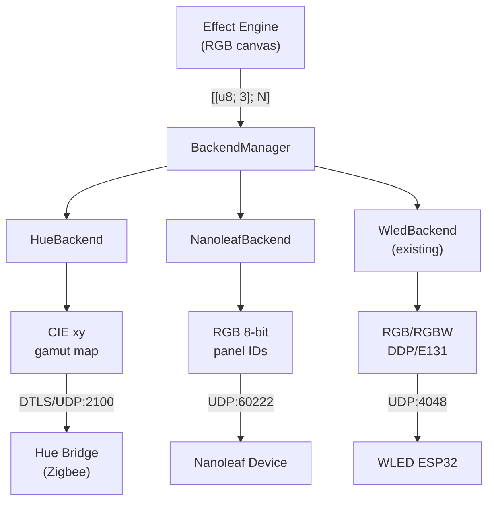

# Spec 33 — Network Device Backends (Hue, Nanoleaf, Shared Infrastructure)

> Implementation-ready specification for Philips Hue, Nanoleaf, and shared network
> device infrastructure in Hypercolor.

**Status:** Draft
**Author:** Nova
**Date:** 2026-03-15
**Crates:** `hypercolor-core`, `hypercolor-types`
**Feature flags:** `hue` (default), `nanoleaf` (default)

---

## Table of Contents

1. [Overview](#1-overview)
2. [Architecture](#2-architecture)
3. [Shared Network Infrastructure](#3-shared-network-infrastructure)
4. [Philips Hue Backend](#4-philips-hue-backend)
5. [Nanoleaf Backend](#5-nanoleaf-backend)
6. [Type Extensions](#6-type-extensions)
7. [Configuration](#7-configuration)
8. [Dependency Additions](#8-dependency-additions)
9. [Implementation Plan](#9-implementation-plan)

---

## 1. Overview

Hypercolor's device backend system currently supports USB/HID devices (via HAL) and
WLED (via UDP DDP/E1.31). This spec adds two new network-native backends — Philips
Hue and Nanoleaf — plus shared network infrastructure extracted from the WLED
implementation.

### Design decisions (from brainstorm)

- **No new crates.** Backends live in `hypercolor-core/src/device/{family}/`,
  following the proven WLED pattern. Shared utilities in `core/device/net/`.
- **Feature flags per backend.** `hue` and `nanoleaf`, both default-enabled.
- **DTLS via `webrtc-dtls`.** Pure Rust, async/tokio native, has the exact PSK
  cipher suite Hue requires. No system OpenSSL dependency.
- **Credential store.** Encrypted at rest in XDG data dir. Hue stores API key +
  DTLS client key per bridge. Nanoleaf stores auth token per device.

### Protocol comparison

| Dimension | WLED | Hue | Nanoleaf |
|-----------|------|-----|----------|
| Discovery | mDNS `_wled._tcp` | mDNS `_hue._tcp` + N-UPnP | mDNS `_nanoleafapi._tcp` |
| Auth | None | Bridge link-button → API key + DTLS PSK | Power-button → auth token |
| Streaming | UDP DDP/E1.31 | DTLS 1.2 over UDP | UDP |
| Port | 4048 / 5568 | 2100 | 60222 |
| Color space | RGB/RGBW 8-bit | CIE xy + brightness (16-bit) | RGB 8-bit |
| Effective FPS | 60 Hz | 25 Hz (Zigbee) | 10 Hz |
| Addressing | IP → segments | Bridge → entertainment → channels | IP → panel IDs |
| Max per group | Unlimited | 20 channels | Device panels |

---

## 2. Architecture

### Module layout

```
crates/hypercolor-core/src/device/
  net/                          ← NEW: shared network infrastructure
    mod.rs                      — re-exports
    credentials.rs              — encrypted credential store
    mdns.rs                     — shared mDNS browse helpers
  hue/                          ← NEW: Philips Hue backend
    mod.rs                      — re-exports
    backend.rs                  — HueBackend: DeviceBackend
    bridge.rs                   — bridge discovery, CLIP v2 client
    streaming.rs                — DTLS entertainment streaming
    color.rs                    — CIE xy conversion, gamut mapping
    scanner.rs                  — TransportScanner impl
    types.rs                    — Hue-specific types
  nanoleaf/                     ← NEW: Nanoleaf backend
    mod.rs                      — re-exports
    backend.rs                  — NanoleafBackend: DeviceBackend
    streaming.rs                — UDP panel streaming (v2)
    scanner.rs                  — TransportScanner impl
    topology.rs                 — shape types → DeviceTopologyHint
    types.rs                    — Nanoleaf-specific types
  wled/                         ← existing (reference pattern)
```

### Data flow



### Registration (daemon startup)

In `startup.rs`, following the existing WLED pattern:

```rust
#[cfg(feature = "hue")]
if config.discovery.hue_scan {
    backend_manager.register_backend(Box::new(
        hue::HueBackend::new(config.hue.clone(), credential_store.clone())
    ));
}

#[cfg(feature = "nanoleaf")]
if config.discovery.nanoleaf_scan {
    backend_manager.register_backend(Box::new(
        nanoleaf::NanoleafBackend::new(config.nanoleaf.clone(), credential_store.clone())
    ));
}
```

---

## 3. Shared Network Infrastructure

### 3.1 Credential Store (`net/credentials.rs`)

Persistent, encrypted credential storage for network device auth tokens.

```rust
/// Credential store backed by an encrypted file in the XDG data directory.
///
/// Path: `<data_dir>/hypercolor/credentials.json.enc`
/// Encryption: AES-256-GCM with a key derived from a machine-specific seed.
pub struct CredentialStore {
    store_path: PathBuf,
    /// In-memory cache of decrypted credentials.
    cache: RwLock<HashMap<String, Credentials>>,
}

/// Stored credentials for a network device.
#[derive(Debug, Clone, Serialize, Deserialize)]
pub enum Credentials {
    /// Philips Hue bridge credentials.
    HueBridge {
        /// CLIP v2 API key (the "username" from registration).
        api_key: String,
        /// DTLS PSK for entertainment streaming (hex-encoded).
        client_key: String,
    },
    /// Nanoleaf device auth token.
    Nanoleaf {
        /// Auth token from pairing.
        auth_token: String,
    },
}

impl CredentialStore {
    /// Open or create the credential store.
    pub async fn open(data_dir: &Path) -> Result<Self>;

    /// Retrieve credentials for a device.
    pub async fn get(&self, key: &str) -> Option<Credentials>;

    /// Store credentials for a device.
    pub async fn store(&self, key: &str, creds: Credentials) -> Result<()>;

    /// Remove credentials for a device.
    pub async fn remove(&self, key: &str) -> Result<()>;

    /// List all stored credential keys.
    pub async fn keys(&self) -> Vec<String>;
}
```

**Credential key format:**
- Hue: `"hue:{bridge_id}"` (e.g., `"hue:001788FFFE123456"`)
- Nanoleaf: `"nanoleaf:{device_id}"` (e.g., `"nanoleaf:AB:CD:EF:12:34:56"`)

**Encryption approach:** AES-256-GCM using a key derived from a machine-specific
seed file (`<data_dir>/hypercolor/.credential_seed`). The seed is generated on first
use. This is not high-security vault-grade protection — it prevents casual file
reads and makes credentials non-portable across machines, which is appropriate for
home automation tokens.

### 3.2 mDNS Helpers (`net/mdns.rs`)

Extract common mDNS patterns from the WLED scanner into reusable utilities.

```rust
/// Shared mDNS browse helper.
///
/// Wraps `mdns-sd::ServiceDaemon` with timeout, IPv4 preference, and
/// address resolution patterns used across all network backends.
pub struct MdnsBrowser {
    daemon: ServiceDaemon,
}

impl MdnsBrowser {
    pub fn new() -> Result<Self>;

    /// Browse for services of the given type with timeout.
    ///
    /// Returns resolved services with addresses. Prefers IPv4 when both
    /// IPv4 and IPv6 are available (matching WLED scanner behavior).
    pub async fn browse(
        &self,
        service_type: &str,
        timeout: Duration,
    ) -> Result<Vec<MdnsService>>;

    /// Shutdown the mDNS daemon gracefully.
    pub fn shutdown(&self);
}

/// A resolved mDNS service.
#[derive(Debug, Clone)]
pub struct MdnsService {
    pub name: String,
    pub host: IpAddr,
    pub port: u16,
    pub txt: HashMap<String, String>,
}
```

---

## 4. Philips Hue Backend

### 4.1 Discovery (`hue/scanner.rs`)

Two discovery methods, run in parallel:

1. **mDNS** — browse `_hue._tcp.local.`, extract bridge ID from TXT records
2. **N-UPnP** — `GET https://discovery.meethue.com` → JSON array of bridges

```rust
pub struct HueScanner {
    mdns: MdnsBrowser,
    known_bridges: Vec<HueKnownBridge>,
    credential_store: Arc<CredentialStore>,
}

/// Cached bridge identity for re-discovery.
#[derive(Debug, Clone, Serialize, Deserialize)]
pub struct HueKnownBridge {
    pub bridge_id: String,
    pub ip: IpAddr,
    pub name: String,
    pub last_seen: Instant,
}

#[async_trait]
impl TransportScanner for HueScanner {
    fn name(&self) -> &str { "hue" }

    async fn scan(&mut self) -> Result<Vec<DiscoveredDevice>> {
        // 1. mDNS browse _hue._tcp (2s timeout)
        // 2. N-UPnP fallback (1s timeout)
        // 3. Probe known bridges from cache
        // 4. For each bridge: GET /clip/v2/resource/light (if authenticated)
        //    to enumerate lights and entertainment configs
        // 5. Return DiscoveredDevice per bridge (zones = entertainment channels)
    }
}
```

**Discovery → DeviceInfo mapping:**

Each Hue bridge becomes one `DeviceInfo` with zones mapped from its active
entertainment configuration's channels:

```rust
DeviceInfo {
    id: fingerprint.stable_device_id(),  // deterministic from "hue:{bridge_id}"
    name: bridge.name,                   // e.g., "Hue Bridge (Living Room)"
    vendor: "Philips Hue".into(),
    family: DeviceFamily::Hue,
    model: Some(bridge.model_id),
    connection_type: ConnectionType::Network,
    zones: entertainment_config.channels.iter().map(|ch| ZoneInfo {
        name: ch.name,                   // e.g., "Play Bar Left"
        led_count: ch.segment_count,     // 1 for bulbs, 3-7 for gradient
        topology: match ch.segment_count {
            1 => DeviceTopologyHint::Point,
            _ => DeviceTopologyHint::Strip,
        },
        color_format: DeviceColorFormat::Rgb, // engine sends RGB, we convert
    }).collect(),
    firmware_version: Some(bridge.sw_version),
    capabilities: DeviceCapabilities {
        led_count: total_channels,
        supports_direct: true,
        supports_brightness: true,
        has_display: false,
        display_resolution: None,
        max_fps: 25,                     // Zigbee bottleneck
        features: DeviceFeatures::default(),
    },
}
```

### 4.2 Bridge Client (`hue/bridge.rs`)

CLIP v2 REST client for bridge management.

```rust
pub struct HueBridgeClient {
    ip: IpAddr,
    api_key: Option<String>,
    http: reqwest::Client,
}

impl HueBridgeClient {
    /// Create a client for an unauthenticated bridge (discovery probe only).
    pub fn new(ip: IpAddr) -> Self;

    /// Create a client with stored credentials.
    pub fn authenticated(ip: IpAddr, api_key: String) -> Self;

    /// Initiate pairing. User must press the bridge link button first.
    /// Returns (api_key, client_key) on success.
    pub async fn pair(&self, app_name: &str) -> Result<HuePairResult>;

    /// Fetch all lights.
    pub async fn lights(&self) -> Result<Vec<HueLight>>;

    /// Fetch entertainment configurations.
    pub async fn entertainment_configs(&self) -> Result<Vec<HueEntertainmentConfig>>;

    /// Activate an entertainment configuration for streaming.
    pub async fn start_streaming(&self, config_id: &str) -> Result<()>;

    /// Deactivate streaming.
    pub async fn stop_streaming(&self, config_id: &str) -> Result<()>;
}

/// Result of a successful bridge pairing.
pub struct HuePairResult {
    pub api_key: String,
    pub client_key: String,
}

/// Entertainment configuration from CLIP v2.
pub struct HueEntertainmentConfig {
    pub id: String,
    pub name: String,
    pub config_type: HueEntertainmentType,
    pub channels: Vec<HueChannel>,
}

pub struct HueChannel {
    pub id: u8,
    pub name: String,
    pub position: HuePosition,
    pub segment_count: u32,
    pub members: Vec<HueChannelMember>,
}

/// Channel spatial position (normalized -1.0 to 1.0).
pub struct HuePosition {
    pub x: f64,
    pub y: f64,
    pub z: f64,
}

#[derive(Debug, Clone, Copy, Serialize, Deserialize)]
#[serde(rename_all = "snake_case")]
pub enum HueEntertainmentType {
    Screen,
    Monitor,
    Music,
    ThreeDSpace,
    Other,
}
```

**HTTPS notes:** The Hue bridge serves HTTPS with a certificate signed by Signify's
private CA. For initial implementation, use `reqwest` with `danger_accept_invalid_certs`
scoped to bridge IPs only. Future work: pin the Signify root CA and validate CN
matches bridge ID.

### 4.3 DTLS Streaming (`hue/streaming.rs`)

Entertainment streaming over DTLS 1.2.

```rust
use webrtc_dtls::config::Config as DtlsConfig;
use webrtc_dtls::conn::DTLSConn;

/// Active DTLS streaming session to a Hue bridge.
pub struct HueStreamSession {
    conn: DTLSConn,
    config_id: String,
    channels: Vec<HueChannel>,
    sequence: u8,
    /// Reusable packet buffer (max 192 bytes: 52 header + 20*7 channels).
    packet_buf: Vec<u8>,
}

impl HueStreamSession {
    /// Establish a DTLS connection to the bridge.
    ///
    /// 1. Connect UDP socket to bridge:2100
    /// 2. DTLS handshake with PSK identity = api_key, PSK = client_key
    /// 3. Cipher suite: TLS_PSK_WITH_AES_128_GCM_SHA256
    pub async fn connect(
        bridge_ip: IpAddr,
        api_key: &str,
        client_key: &[u8],
        config_id: &str,
        channels: Vec<HueChannel>,
    ) -> Result<Self>;

    /// Send a color frame to the entertainment group.
    ///
    /// `colors` is RGB triplets, one per channel (ordered by channel ID).
    /// Converts RGB → CIE xy using the appropriate device gamut.
    pub async fn send_frame(&mut self, colors: &[[u8; 3]]) -> Result<()>;

    /// Gracefully close the DTLS session.
    pub async fn close(self) -> Result<()>;
}
```

**HueStream v2 packet format:**

```
Offset  Size   Field
──────────────────────────────────────────────────
0       9      Protocol: ASCII "HueStream"
9       1      API version major: 0x02
10      1      API version minor: 0x00
11      1      Sequence number (0-255, wrapping)
12      2      Reserved: 0x0000
14      1      Color space: 0x01 (CIE xy + brightness)
15      1      Reserved: 0x00
16      36     Entertainment config UUID (ASCII)
52      7*N    Channel data
```

Per-channel (7 bytes):
```
Byte 0:     Channel ID (0x00-0x13)
Bytes 1-2:  CIE x (u16 BE, 0x0000-0xFFFF → 0.0-1.0)
Bytes 3-4:  CIE y (u16 BE, 0x0000-0xFFFF → 0.0-1.0)
Bytes 5-6:  Brightness (u16 BE, 0x0000-0xFFFF → 0.0-1.0)
```

**Buffer reuse:** The packet buffer is allocated once at session start (max 192
bytes) and reused every frame. Only the per-channel color values and sequence byte
change per frame. Zero allocations in the hot path.

### 4.4 Color Conversion (`hue/color.rs`)

RGB → CIE xy with gamut mapping.

```rust
/// CIE 1931 xy chromaticity + brightness.
#[derive(Debug, Clone, Copy)]
pub struct CieXyb {
    pub x: f64,
    pub y: f64,
    pub brightness: f64,
}

/// Hue device color gamut triangle.
#[derive(Debug, Clone, Copy)]
pub struct ColorGamut {
    pub red: (f64, f64),
    pub green: (f64, f64),
    pub blue: (f64, f64),
}

/// Known Hue gamuts.
pub const GAMUT_A: ColorGamut = ColorGamut {
    red: (0.704, 0.296),
    green: (0.2151, 0.7106),
    blue: (0.138, 0.08),
};

pub const GAMUT_B: ColorGamut = ColorGamut {
    red: (0.675, 0.322),
    green: (0.409, 0.518),
    blue: (0.167, 0.04),
};

pub const GAMUT_C: ColorGamut = ColorGamut {
    red: (0.6915, 0.3083),
    green: (0.17, 0.7),
    blue: (0.1532, 0.0475),
};

/// Convert sRGB (0-255) to CIE xy + brightness.
///
/// 1. Linearize sRGB (remove gamma)
/// 2. sRGB → XYZ via 3x3 matrix
/// 3. XYZ → xy chromaticity
/// 4. Clamp to gamut triangle (perpendicular projection)
/// 5. Extract brightness from Y
pub fn rgb_to_cie_xyb(r: u8, g: u8, b: u8, gamut: &ColorGamut) -> CieXyb;

/// Check if (x, y) is inside the gamut triangle.
fn point_in_gamut(x: f64, y: f64, gamut: &ColorGamut) -> bool;

/// Clamp (x, y) to the nearest point on the gamut triangle edge.
fn clamp_to_gamut(x: f64, y: f64, gamut: &ColorGamut) -> (f64, f64);
```

**Performance:** The conversion runs per-channel (max 20 channels), not per-LED.
At 20 channels * 50fps = 1000 conversions/sec. No need for SIMD or lookup tables.

### 4.5 Backend (`hue/backend.rs`)

```rust
pub struct HueBackend {
    config: HueConfig,
    credential_store: Arc<CredentialStore>,
    /// Active bridges indexed by DeviceId.
    bridges: HashMap<DeviceId, HueBridgeState>,
    scanner: HueScanner,
}

struct HueBridgeState {
    client: HueBridgeClient,
    stream: Option<HueStreamSession>,
    entertainment_config: HueEntertainmentConfig,
    /// Gamut per channel (looked up from light model).
    channel_gamuts: Vec<ColorGamut>,
}

#[async_trait]
impl DeviceBackend for HueBackend {
    fn info(&self) -> BackendInfo {
        BackendInfo {
            id: "hue".into(),
            name: "Philips Hue".into(),
            description: "Philips Hue lights via Entertainment streaming".into(),
        }
    }

    async fn discover(&mut self) -> Result<Vec<DeviceInfo>> {
        self.scanner.scan().await
        // Merge with known bridges, enrich with CLIP v2 data if authenticated
    }

    async fn connect(&mut self, id: &DeviceId) -> Result<()> {
        // 1. Look up bridge by device ID
        // 2. Load credentials from store
        // 3. If no credentials, return error (pairing required via API/UI)
        // 4. Activate entertainment config via REST
        // 5. Establish DTLS streaming session
    }

    async fn disconnect(&mut self, id: &DeviceId) -> Result<()> {
        // 1. Close DTLS session
        // 2. Deactivate entertainment config via REST
    }

    async fn write_colors(&mut self, id: &DeviceId, colors: &[[u8; 3]]) -> Result<()> {
        // 1. Look up active stream session
        // 2. Convert RGB → CIE xy per channel using channel gamuts
        // 3. Send HueStream frame via DTLS
    }

    async fn set_brightness(&mut self, id: &DeviceId, brightness: u8) -> Result<()> {
        // Scale brightness in the streaming session (multiply into xyB values)
    }

    fn target_fps(&self, _id: &DeviceId) -> Option<u32> {
        Some(50) // Send at 50Hz for UDP redundancy; bridge outputs at 25Hz
    }
}
```

---

## 5. Nanoleaf Backend

### 5.1 Discovery (`nanoleaf/scanner.rs`)

```rust
pub struct NanoleafScanner {
    mdns: MdnsBrowser,
    known_devices: Vec<NanoleafKnownDevice>,
    credential_store: Arc<CredentialStore>,
}

#[derive(Debug, Clone, Serialize, Deserialize)]
pub struct NanoleafKnownDevice {
    pub device_id: String,
    pub ip: IpAddr,
    pub port: u16,
    pub name: String,
    pub model: String,
    pub firmware: String,
}

#[async_trait]
impl TransportScanner for NanoleafScanner {
    fn name(&self) -> &str { "nanoleaf" }

    async fn scan(&mut self) -> Result<Vec<DiscoveredDevice>> {
        // 1. mDNS browse _nanoleafapi._tcp (2s timeout)
        // 2. Probe known devices from cache
        // 3. For authenticated devices: GET /api/v1/{token}/panelLayout/layout
        // 4. Return DiscoveredDevice per device (zones = panels with LEDs)
    }
}
```

**Discovery → DeviceInfo mapping:**

Each Nanoleaf device becomes one `DeviceInfo`. Panels with LEDs become zones;
controllers and connectors are filtered out.

```rust
DeviceInfo {
    id: fingerprint.stable_device_id(),
    name: device.name,                  // e.g., "Living Room Shapes"
    vendor: "Nanoleaf".into(),
    family: DeviceFamily::Nanoleaf,     // NEW variant
    model: Some(device.model),
    connection_type: ConnectionType::Network,
    zones: panels.iter()
        .filter(|p| p.shape_type.has_leds())
        .map(|p| ZoneInfo {
            name: format!("Panel {}", p.panel_id),
            led_count: 1,               // each panel = 1 addressable unit
            topology: p.shape_type.to_topology_hint(),
            color_format: DeviceColorFormat::Rgb,
        }).collect(),
    firmware_version: Some(device.firmware),
    capabilities: DeviceCapabilities {
        led_count: panel_count,
        supports_direct: true,
        supports_brightness: true,
        max_fps: 10,                    // Nanoleaf hard limit
        ..Default::default()
    },
}
```

### 5.2 Topology (`nanoleaf/topology.rs`)

Panel shape type mapping with side lengths and LED filtering.

```rust
/// Nanoleaf panel shape types.
#[derive(Debug, Clone, Copy, PartialEq, Eq, Serialize, Deserialize)]
#[repr(u8)]
pub enum NanoleafShapeType {
    TriangleLightPanels = 0,
    Rhythm              = 1,
    SquareCanvas        = 2,
    ControlSquareMaster = 3,
    ControlSquarePassive = 4,
    HexagonShapes       = 7,
    TriangleShapes      = 8,
    MiniTriangle        = 9,
    ShapesController    = 12,
    ElementsHexagon     = 14,
    ElementsHexCorner   = 15,
    LinesConnector      = 16,
    LightLines          = 17,
    LightLinesSingleZone = 18,
    ControllerCap       = 19,
    PowerConnector      = 20,
    FourDLightstrip     = 29,
    SkylightPanel       = 30,
    SkylightCtrlPrimary = 31,
    SkylightCtrlPassive = 32,
}

impl NanoleafShapeType {
    /// Whether this shape type has addressable LEDs.
    pub const fn has_leds(&self) -> bool {
        !matches!(
            self,
            Self::Rhythm
                | Self::ShapesController
                | Self::LinesConnector
                | Self::ControllerCap
                | Self::PowerConnector
        )
    }

    /// Side length in mm for layout calculations.
    pub const fn side_length(&self) -> f64 {
        match self {
            Self::TriangleLightPanels => 150.0,
            Self::SquareCanvas
            | Self::ControlSquareMaster
            | Self::ControlSquarePassive => 100.0,
            Self::HexagonShapes | Self::MiniTriangle => 67.0,
            Self::TriangleShapes | Self::ElementsHexagon => 134.0,
            Self::ElementsHexCorner => 33.5,
            Self::LightLines => 154.0,
            Self::LightLinesSingleZone => 77.0,
            Self::FourDLightstrip => 50.0,
            Self::SkylightPanel
            | Self::SkylightCtrlPrimary
            | Self::SkylightCtrlPassive => 180.0,
            _ => 0.0, // controllers/connectors
        }
    }

    /// Map to Hypercolor topology hint.
    pub const fn to_topology_hint(&self) -> DeviceTopologyHint {
        match self {
            Self::FourDLightstrip | Self::LightLines | Self::LightLinesSingleZone => {
                DeviceTopologyHint::Strip
            }
            _ => DeviceTopologyHint::Point, // panels are single-color addressable
        }
    }
}
```

### 5.3 Streaming (`nanoleaf/streaming.rs`)

UDP External Control v2 protocol.

```rust
/// Active UDP streaming session to a Nanoleaf device.
pub struct NanoleafStreamSession {
    socket: UdpSocket,
    device_ip: IpAddr,
    /// Panel IDs that have LEDs, in the order we send colors.
    panel_ids: Vec<u16>,
    /// Reusable packet buffer.
    packet_buf: Vec<u8>,
}

impl NanoleafStreamSession {
    /// Enable external control mode and open UDP socket.
    ///
    /// 1. PUT /api/v1/{token}/effects with extControl v2 command
    /// 2. Bind local UDP socket
    /// 3. Connect to device_ip:60222
    pub async fn connect(
        device_ip: IpAddr,
        api_port: u16,
        auth_token: &str,
        panel_ids: Vec<u16>,
    ) -> Result<Self>;

    /// Send a color frame to all panels.
    ///
    /// `colors` is RGB triplets, one per panel (ordered by panel_ids).
    pub async fn send_frame(
        &mut self,
        colors: &[[u8; 3]],
        transition_time: u16,
    ) -> Result<()>;
}
```

**v2 packet format:**

```
Bytes 0-1:  nPanels (u16 BE)
Per panel (8 bytes):
  Bytes 0-1:  panelId (u16 BE)
  Byte  2:    R
  Byte  3:    G
  Byte  4:    B
  Byte  5:    W (always 0x00)
  Bytes 6-7:  transitionTime (u16 BE, units of 100ms)
```

**Buffer reuse:** Packet buffer allocated once at connect. At 10Hz with ~20
panels, that is 2 + (20 * 8) = 162 bytes per frame. Zero allocations in hot path.

### 5.4 Backend (`nanoleaf/backend.rs`)

```rust
pub struct NanoleafBackend {
    config: NanoleafConfig,
    credential_store: Arc<CredentialStore>,
    devices: HashMap<DeviceId, NanoleafDeviceState>,
    scanner: NanoleafScanner,
}

struct NanoleafDeviceState {
    ip: IpAddr,
    api_port: u16,
    auth_token: String,
    stream: Option<NanoleafStreamSession>,
    panel_ids: Vec<u16>,
}

#[async_trait]
impl DeviceBackend for NanoleafBackend {
    fn info(&self) -> BackendInfo {
        BackendInfo {
            id: "nanoleaf".into(),
            name: "Nanoleaf".into(),
            description: "Nanoleaf panels via External Control streaming".into(),
        }
    }

    async fn discover(&mut self) -> Result<Vec<DeviceInfo>> { /* ... */ }

    async fn connect(&mut self, id: &DeviceId) -> Result<()> {
        // 1. Load auth token from credential store
        // 2. GET panel layout, filter to LED panels
        // 3. Enable external control mode via REST
        // 4. Open UDP streaming session
    }

    async fn disconnect(&mut self, id: &DeviceId) -> Result<()> {
        // Drop UDP session. Nanoleaf auto-exits extControl on timeout.
    }

    async fn write_colors(&mut self, id: &DeviceId, colors: &[[u8; 3]]) -> Result<()> {
        // Send UDP frame with transition_time = 1 (100ms, matches 10Hz)
    }

    fn target_fps(&self, _id: &DeviceId) -> Option<u32> {
        Some(10)
    }
}
```

---

## 6. Type Extensions

### 6.1 `DeviceFamily` — add Nanoleaf variant

In `hypercolor-types/src/device.rs`:

```rust
#[non_exhaustive]
pub enum DeviceFamily {
    // ... existing variants ...
    /// Nanoleaf WiFi panels (Shapes, Canvas, Elements, Lines, Skylight).
    Nanoleaf,
}
```

Add to `vendor_name()` → `"Nanoleaf"`, `id()` → `"nanoleaf"`,
`backend_id()` → `"nanoleaf"`.

### 6.2 `DeviceCapabilities` — add color space

```rust
pub struct DeviceCapabilities {
    // ... existing fields ...

    /// Native color space of the device.
    ///
    /// The engine sends RGB to all backends. Backends that use a different
    /// native color space (e.g., CIE xy for Hue) perform the conversion
    /// internally before transmission.
    #[serde(default)]
    pub color_space: DeviceColorSpace,
}

/// Native color model used by a device backend.
#[derive(Debug, Clone, Copy, Default, PartialEq, Eq, Serialize, Deserialize)]
#[serde(rename_all = "snake_case")]
pub enum DeviceColorSpace {
    /// Standard sRGB. Used by WLED, Nanoleaf, USB devices.
    #[default]
    Rgb,
    /// CIE 1931 xy chromaticity with separate brightness.
    /// Used by Philips Hue. Backend handles gamut mapping.
    CieXy,
}
```

### 6.3 `DeviceIdentifier` — add Nanoleaf variant

The existing `Network` variant works for Nanoleaf. No new variant needed — Nanoleaf
devices are identified by MAC address like WLED. The `HueBridge` variant already
exists for Hue.

---

## 7. Configuration

### 7.1 Discovery config additions

In `hypercolor-types/src/config.rs`, add to `DiscoveryConfig`:

```rust
pub struct DiscoveryConfig {
    // ... existing fields ...

    /// Enable Nanoleaf device scanning (mDNS).
    #[serde(default = "default_true")]
    pub nanoleaf_scan: bool,
}
```

Note: `hue_scan` already exists in the current config.

### 7.2 Backend-specific configs

```rust
/// Philips Hue backend configuration.
#[derive(Debug, Clone, Default, Serialize, Deserialize)]
#[serde(default)]
pub struct HueConfig {
    /// Preferred entertainment configuration name or ID.
    /// If not set, uses the first available configuration.
    pub entertainment_config: Option<String>,

    /// Manual bridge IPs for environments where mDNS doesn't work.
    #[serde(default)]
    pub bridge_ips: Vec<IpAddr>,

    /// Use CIE xy color space (true) or RGB (false) for streaming.
    /// CIE xy is more accurate but RGB is simpler. Default: true.
    #[serde(default = "default_true")]
    pub use_cie_xy: bool,
}

/// Nanoleaf backend configuration.
#[derive(Debug, Clone, Default, Serialize, Deserialize)]
#[serde(default)]
pub struct NanoleafConfig {
    /// Manual device IPs for environments where mDNS doesn't work.
    #[serde(default)]
    pub device_ips: Vec<IpAddr>,

    /// Transition time per frame in deciseconds (100ms units).
    /// Default: 1 (100ms, matches 10Hz streaming).
    #[serde(default = "default_nanoleaf_transition")]
    pub transition_time: u16,
}

fn default_nanoleaf_transition() -> u16 { 1 }
```

### 7.3 TOML schema

```toml
[hue]
# entertainment_config = "Living Room"
# bridge_ips = ["192.168.1.50"]
# use_cie_xy = true

[nanoleaf]
# device_ips = ["192.168.1.60"]
# transition_time = 1
```

---

## 8. Dependency Additions

### `hypercolor-core/Cargo.toml`

```toml
[dependencies]
# Existing: mdns-sd, reqwest, tokio, serde, serde_json, uuid, ...

# NEW: Hue DTLS streaming
webrtc-dtls = { version = "0.12", optional = true }
webrtc-util = { version = "0.12", optional = true }

# NEW: Credential encryption
aes-gcm = { version = "0.10", optional = true }
rand = { version = "0.9", optional = true }  # if not already present

[features]
default = ["wled", "hue", "nanoleaf"]
wled = []  # existing
hue = ["dep:webrtc-dtls", "dep:webrtc-util", "dep:aes-gcm", "dep:rand"]
nanoleaf = ["dep:aes-gcm", "dep:rand"]  # shares credential deps with hue
```

`aes-gcm` is only needed if either `hue` or `nanoleaf` is enabled (both require
the credential store). If neither is enabled, no crypto deps are pulled in.

---

## 9. Implementation Plan

### Success criteria

- `cargo check --workspace` passes with `hue` and `nanoleaf` features
- `cargo test --workspace` passes, including new tests
- `cargo clippy --workspace --all-targets -- -D warnings` clean
- Hue bridge discovered via mDNS, paired, streaming colors over DTLS
- Nanoleaf device discovered via mDNS, paired, streaming colors over UDP
- Credentials persisted and survive daemon restart
- Manual IP entry works when mDNS is unavailable

### Wave 1: Foundation (types + shared infra)

#### Task 1: Add `Nanoleaf` to `DeviceFamily` and `DeviceColorSpace` to capabilities

**Files:**
- `crates/hypercolor-types/src/device.rs`
- `crates/hypercolor-types/tests/device_tests.rs`

**Implementation:**
- Add `Nanoleaf` variant to `DeviceFamily` with `vendor_name`, `id`, `backend_id`
- Add `DeviceColorSpace` enum (Rgb, CieXy) with `Default` → `Rgb`
- Add `color_space: DeviceColorSpace` field to `DeviceCapabilities` with `#[serde(default)]`
- Update tests for serialization round-trip

**Verify:** `cargo check -p hypercolor-types && cargo test -p hypercolor-types`

#### Task 2: Add Hue and Nanoleaf config types

**Files:**
- `crates/hypercolor-types/src/config.rs`
- `crates/hypercolor-types/tests/config_tests.rs`

**Implementation:**
- Add `HueConfig` struct with `entertainment_config`, `bridge_ips`, `use_cie_xy`
- Add `NanoleafConfig` struct with `device_ips`, `transition_time`
- Add `nanoleaf_scan: bool` to `DiscoveryConfig`
- Add `hue: HueConfig` and `nanoleaf: NanoleafConfig` to `HypercolorConfig`
- Update serde defaults and tests

**Verify:** `cargo check -p hypercolor-types && cargo test -p hypercolor-types`

**Parallel:** Yes — Tasks 1 and 2 can run in parallel.

#### Task 3: Credential store (`net/credentials.rs`)

**Files:**
- `crates/hypercolor-core/src/device/net/mod.rs` (new)
- `crates/hypercolor-core/src/device/net/credentials.rs` (new)
- `crates/hypercolor-core/src/device/mod.rs` (add `pub mod net`)
- `crates/hypercolor-core/Cargo.toml` (add `aes-gcm`, `rand`)
- `crates/hypercolor-core/tests/credential_store_tests.rs` (new)

**Implementation:**
- `CredentialStore` with `open`, `get`, `store`, `remove`, `keys`
- AES-256-GCM encryption with machine-local seed file
- JSON serialization of credential entries
- `Credentials` enum with `HueBridge` and `Nanoleaf` variants

**Verify:** `cargo test -p hypercolor-core credential`

**Depends on:** None (uses core crate only).

#### Task 4: Shared mDNS browser (`net/mdns.rs`)

**Files:**
- `crates/hypercolor-core/src/device/net/mdns.rs` (new)
- `crates/hypercolor-core/src/device/net/mod.rs` (add re-export)

**Implementation:**
- `MdnsBrowser` wrapping `mdns-sd::ServiceDaemon`
- `browse(service_type, timeout)` → `Vec<MdnsService>`
- IPv4 preference logic (extracted from WLED scanner)
- Graceful shutdown

**Verify:** `cargo check -p hypercolor-core`

**Parallel:** Yes — Tasks 3 and 4 can run in parallel.

---

### Wave 2: Nanoleaf Backend (simpler protocol first)

#### Task 5: Nanoleaf types and topology

**Files:**
- `crates/hypercolor-core/src/device/nanoleaf/mod.rs` (new)
- `crates/hypercolor-core/src/device/nanoleaf/types.rs` (new)
- `crates/hypercolor-core/src/device/nanoleaf/topology.rs` (new)
- `crates/hypercolor-core/tests/nanoleaf_topology_tests.rs` (new)

**Implementation:**
- `NanoleafShapeType` enum with all shape variants
- `has_leds()`, `side_length()`, `to_topology_hint()` methods
- `NanoleafDeviceInfo`, `NanoleafPanelLayout` response types
- Tests for shape filtering and topology mapping

**Verify:** `cargo test -p hypercolor-core nanoleaf`

**Depends on:** Task 1 (DeviceFamily::Nanoleaf).

#### Task 6: Nanoleaf scanner

**Files:**
- `crates/hypercolor-core/src/device/nanoleaf/scanner.rs` (new)

**Implementation:**
- `NanoleafScanner` implementing `TransportScanner`
- mDNS browse for `_nanoleafapi._tcp`
- HTTP probe for device info and panel layout
- Known-device caching and re-probe
- `DiscoveredDevice` construction with panel → zone mapping

**Verify:** `cargo check -p hypercolor-core`

**Depends on:** Tasks 4 (mDNS browser), 5 (types/topology).

#### Task 7: Nanoleaf UDP streaming

**Files:**
- `crates/hypercolor-core/src/device/nanoleaf/streaming.rs` (new)
- `crates/hypercolor-core/tests/nanoleaf_streaming_tests.rs` (new)

**Implementation:**
- `NanoleafStreamSession` with connect, send_frame, close
- v2 packet builder (2-byte nPanels + 8 bytes/panel)
- External control activation via REST PUT
- Buffer pre-allocation and reuse
- Tests for packet serialization (round-trip with known bytes)

**Verify:** `cargo test -p hypercolor-core nanoleaf_streaming`

**Parallel:** Yes — Tasks 6 and 7 can run in parallel (different files).

#### Task 8: Nanoleaf `DeviceBackend` implementation

**Files:**
- `crates/hypercolor-core/src/device/nanoleaf/backend.rs` (new)
- `crates/hypercolor-core/src/device/mod.rs` (add `pub mod nanoleaf`)

**Implementation:**
- `NanoleafBackend` implementing `DeviceBackend`
- `discover()`, `connect()`, `disconnect()`, `write_colors()`
- Credential loading from `CredentialStore`
- `target_fps()` → `Some(10)`

**Verify:** `cargo check -p hypercolor-core`

**Depends on:** Tasks 3, 6, 7.

---

### Wave 3: Hue Backend

#### Task 9: Hue CIE xy color conversion

**Files:**
- `crates/hypercolor-core/src/device/hue/mod.rs` (new)
- `crates/hypercolor-core/src/device/hue/color.rs` (new)
- `crates/hypercolor-core/tests/hue_color_tests.rs` (new)

**Implementation:**
- `rgb_to_cie_xyb()` conversion
- `point_in_gamut()`, `clamp_to_gamut()` geometry helpers
- Gamut constants (A, B, C)
- Tests against known conversion values (Philips reference data)

**Verify:** `cargo test -p hypercolor-core hue_color`

**Depends on:** None (pure math).
**Parallel:** Can start during Wave 2.

#### Task 10: Hue types and bridge client

**Files:**
- `crates/hypercolor-core/src/device/hue/types.rs` (new)
- `crates/hypercolor-core/src/device/hue/bridge.rs` (new)
- `crates/hypercolor-core/tests/hue_types_tests.rs` (new)

**Implementation:**
- `HueBridgeClient` with `pair()`, `lights()`, `entertainment_configs()`,
  `start_streaming()`, `stop_streaming()`
- CLIP v2 response types with serde derives
- `HueEntertainmentConfig`, `HueChannel`, `HuePosition`, `HueLight`
- `HueEntertainmentType` enum

**Verify:** `cargo check -p hypercolor-core && cargo test -p hypercolor-core hue_types`

**Depends on:** Task 2 (HueConfig).

#### Task 11: Hue DTLS streaming

**Files:**
- `crates/hypercolor-core/src/device/hue/streaming.rs` (new)
- `crates/hypercolor-core/Cargo.toml` (add `webrtc-dtls`, `webrtc-util`)
- `crates/hypercolor-core/tests/hue_streaming_tests.rs` (new)

**Implementation:**
- `HueStreamSession` with DTLS connect, send_frame, close
- `webrtc-dtls` PSK config with `TLS_PSK_WITH_AES_128_GCM_SHA256`
- UDP `Conn` trait adapter for tokio `UdpSocket`
- HueStream v2 packet builder (52-byte header + 7 bytes/channel)
- Buffer pre-allocation (max 192 bytes)
- Tests for packet serialization

**Verify:** `cargo test -p hypercolor-core hue_streaming`

**Depends on:** Task 9 (color conversion).

#### Task 12: Hue scanner

**Files:**
- `crates/hypercolor-core/src/device/hue/scanner.rs` (new)

**Implementation:**
- `HueScanner` implementing `TransportScanner`
- mDNS browse for `_hue._tcp` + N-UPnP fallback
- Bridge probe with credential check
- Entertainment config enumeration for authenticated bridges
- `DiscoveredDevice` construction with channels → zones

**Verify:** `cargo check -p hypercolor-core`

**Depends on:** Tasks 4, 10.

#### Task 13: Hue `DeviceBackend` implementation

**Files:**
- `crates/hypercolor-core/src/device/hue/backend.rs` (new)
- `crates/hypercolor-core/src/device/mod.rs` (add `pub mod hue`)

**Implementation:**
- `HueBackend` implementing `DeviceBackend`
- Full lifecycle: discover → connect (DTLS) → write_colors (CIE xy) → disconnect
- Entertainment config activation/deactivation
- Per-channel gamut lookup from light model
- `target_fps()` → `Some(50)`

**Verify:** `cargo check -p hypercolor-core`

**Depends on:** Tasks 3, 11, 12.

---

### Wave 4: Integration

#### Task 14: Daemon registration and feature flags

**Files:**
- `crates/hypercolor-core/Cargo.toml` (feature flag wiring)
- `crates/hypercolor-daemon/src/startup.rs` (backend registration)
- `crates/hypercolor-daemon/Cargo.toml` (forward feature flags)

**Implementation:**
- Wire `hue` and `nanoleaf` feature flags through workspace
- Add conditional backend registration in daemon startup
- Pass credential store to both backends
- Add to default features

**Verify:** `cargo check --workspace && cargo check --workspace --no-default-features`

**Depends on:** Tasks 8, 13.

#### Task 15: Pairing API endpoints

**Files:**
- `crates/hypercolor-daemon/src/api/devices.rs` (or new `pairing.rs`)

**Implementation:**
- `POST /api/v1/devices/pair/hue` — initiate Hue bridge pairing
  - Request: `{ "bridge_ip": "192.168.1.x" }`
  - Response: `{ "status": "press_button" }` or `{ "status": "paired" }`
- `POST /api/v1/devices/pair/nanoleaf` — initiate Nanoleaf pairing
  - Request: `{ "device_ip": "192.168.1.x" }`
  - Response: `{ "status": "hold_power" }` or `{ "status": "paired" }`
- Store credentials on successful pair

**Verify:** `cargo check -p hypercolor-daemon`

**Depends on:** Task 14.

#### Task 16: CLI pairing commands

**Files:**
- `crates/hypercolor-cli/src/commands/devices.rs` (extend existing)

**Implementation:**
- `hyper devices pair hue [--bridge-ip <IP>]` — interactive Hue pairing
- `hyper devices pair nanoleaf [--device-ip <IP>]` — interactive Nanoleaf pairing
- Progress spinner while waiting for button press
- Credential store confirmation

**Verify:** `cargo check -p hypercolor-cli`

**Depends on:** Task 15.

---

### Wave 5: Tests and Polish

#### Task 17: Integration tests

**Files:**
- `crates/hypercolor-core/tests/hue_backend_tests.rs` (new)
- `crates/hypercolor-core/tests/nanoleaf_backend_tests.rs` (new)
- `crates/hypercolor-daemon/tests/network_backend_tests.rs` (new)

**Implementation:**
- Mock-based backend lifecycle tests (discover → connect → write → disconnect)
- Packet format validation against known-good byte sequences
- Credential store round-trip tests
- Config deserialization tests with all combinations

**Verify:** `cargo test --workspace`

#### Task 18: WLED scanner refactor to use shared mDNS

**Files:**
- `crates/hypercolor-core/src/device/wled/scanner.rs` (modify)

**Implementation:**
- Replace inline `mdns-sd` usage with `MdnsBrowser` from `net/mdns.rs`
- Preserve all existing behavior (IPv4 preference, caching, timeouts)
- Remove duplicated mDNS boilerplate

**Verify:** `cargo test -p hypercolor-core wled`

**Parallel:** Yes — Tasks 17 and 18 can run in parallel.

---

### Wave summary

```
Wave 1 (foundation):   Tasks 1-4   [1+2 parallel, 3+4 parallel]
Wave 2 (Nanoleaf):     Tasks 5-8   [6+7 parallel]
Wave 3 (Hue):          Tasks 9-13  [9 can start during Wave 2, 10+11 after]
Wave 4 (integration):  Tasks 14-16 [sequential]
Wave 5 (tests/polish): Tasks 17-18 [parallel]
```

**Parallelizability:** ~55% of tasks can run in parallel within their wave.

---

## Future Work

- **Hue bridge TLS pinning** — pin Signify CA cert instead of accepting invalid certs
- **Nanoleaf v1 fallback** — support ancient Light Panels firmware (v1 packet format)
- **WLED auth** — WLED 0.15+ adds optional HTTP basic auth
- **OpenRGB bridge backend** — communicate with OpenRGB SDK server for unsupported hardware
- **Bluetooth backends** — BLE RGB controllers (Govee, etc.)
- **Device pairing UI** — Leptos web UI and TUI flows for interactive pairing
- **Multi-bridge Hue** — support multiple Hue bridges simultaneously
- **Nanoleaf touch events** — subscribe to panel touch events for interactive effects
