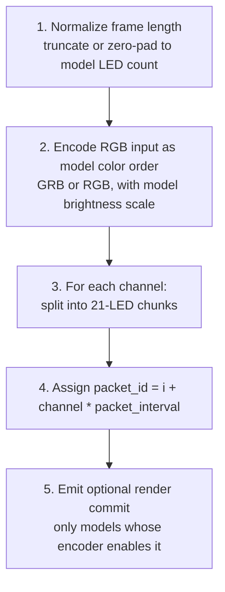
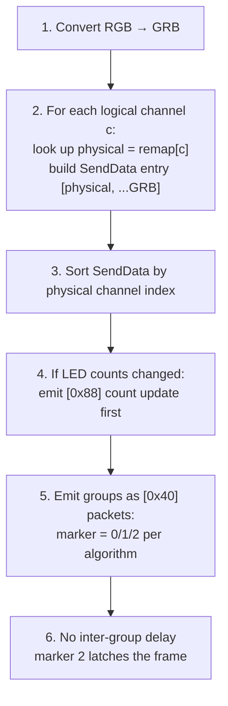
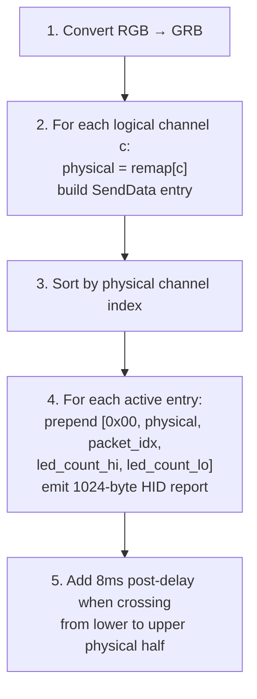

# 45 -- Nollie Protocol Driver

> Native USB HID/CDC driver for the Nollie ARGB controller family. Coverage now follows the official `nolliecontroller` source tree, including current NOS2 devices, CDC serial variants, discontinued legacy HID boards, and exact component LED maps.

**Status:** Implemented
**Crate:** `hypercolor-hal`
**Module path:** `hypercolor_hal::drivers::nollie`
**Author:** Nova
**Date:** 2026-04-25
**Companion to:** Spec 20 (PrismRGB Protocol Driver). Nollie is the OEM; PrismRGB is the US-facing reseller. Prism 8 is byte-identical to Nollie 8 v2 with a VID swap. This spec defines the canonical `nollie` driver module covering the full Nollie OEM lineup (Gen-1 + Gen-2 + Strimer cables) and owns the Prism 8 / Nollie 8 v2 protocol path. Spec 20's `prismrgb` module owns PrismRGB-exclusive silicon (Prism S, Prism Mini).

---

## Table of Contents

1. [Overview](#1-overview)
2. [Device Registry](#2-device-registry)
3. [Protocol Families](#3-protocol-families)
4. [Gen-1, Legacy, CDC, and Stream65 Protocols](#4-gen-1-legacy-cdc-and-stream65-protocols)
5. [Gen-2 Protocol (Nollie16v3, Nollie32)](#5-gen-2-protocol)
6. [Nollie32 Strimer Cables](#6-nollie32-strimer-cables)
7. [HAL Integration](#7-hal-integration)
8. [Render Pipelines](#8-render-pipelines)
9. [Cross-Validation With External References](#9-cross-validation-with-external-references)
10. [Test Coverage](#10-test-coverage)
11. [Appendices](#11-appendices)

---

## 1. Overview

Nollie is a Chinese ARGB controller OEM whose lineup spans single-channel inline strips, eight-channel mid-range hubs, and 16/20/32-channel professional hubs with optional ATX-24 and PCIe-8 Strimer cable attachments. The lineup is distributed under both the **Nollie** brand (USB VIDs `0x16D2`, `0x3061`, `0x16D5`) and the **PrismRGB** US-facing reseller brand (USB VIDs `0x16D5`, `0x16D0`). Spec 20 already covers Prism 8 (`0x16D5:0x1F01`) and Nollie 8 v2 (`0x16D2:0x1F01`) under a shared Gen-1 protocol implementation.

This spec covers Hypercolor's current Nollie stack: modern HID devices, NOS2 HID
devices, CDC serial variants, discontinued legacy HID boards, Stream65 boards, and
the Nollie32 Strimer-style ATX/GPU cable rows. The high-end Nollie16v3 and Nollie32
use 1024-byte HID reports, physical channel remapping, and either grouped Gen-2
packets or direct per-physical-channel NOS2 packets.

### Goals

- Full byte-level wire format for every supported Nollie SKU covered by official packet definitions
- Spec-first implementation path from the official source refresh and Hypercolor packet tests
- Single `Protocol` impl module that handles all official lighting-output SKUs through a `NollieModel` enum
- First-class Strimer cable support (mode byte, per-cable packet generation, subdevice topology hints)
- Tests cover packetization, channel remap, group markers, color encoding, init/shutdown, mode switching

### 2026-05-03 Official Source Refresh

Bliss provided the official `~/dev/nolliecontroller` source tree. That source supersedes earlier community-only assumptions in this spec:

- NOS2 HID devices use VID `0x16D5` with direct 1024-byte per-physical-channel packets, not the grouped `0x40` Gen-2 format used by VID `0x3061`.
- CDC variants exist for Nollie1 (`0x16D5:0x2A01`) and Nollie8 (`0x16D5:0x2A08`) using 64-byte serial writes at 115200 8N1.
- Discontinued devices under VID `0x16D1`, VID `0x16D2`, and VID `0x16D3` are supported with their official 65-byte packet formats.
- PID `0x16D2:0x1617` and `0x16D2:0x1618` are Nollie L1/L2 v1.2 in the official source, not Nollie 28/12 rev B/C.
- `0x16D5:0x1F01` remains ambiguous: existing Hypercolor support treats it as PrismRGB Prism 8, while the NOS2 source also identifies it as Nollie 8 v2. Without a reliable runtime discriminator, the registry keeps the existing Prism 8 descriptor.
- The official `0x3061:0x4714` Nollie32 script exposes V1/V2 render modes but defaults to V1. That V2 selector is separate from the firmware-2.x/NOS2 source tree.

### Non-goals

- Driver-level support for hardware effect playback (we always stream; the hardware effect is the idle fallback only)
- Vendor-app controls that are not needed for streamed lighting: Nollie1 display modes, MOS/source toggles, custom text/pixel-art upload, hardware lamp effects, energy/current reads, voltage telemetry parsing
- Firmware flashing (no public bootloader path)
- Mixing Strimer cables with main channels in a single zone (kept as separate subdevices)

### Relationship to Other Specs

- **Spec 20 (PrismRGB Protocol Driver):** Now owns only PrismRGB-exclusive controllers (Prism S and Prism Mini). This spec owns the Gen-1 Prism 8 / Nollie 8 v2 protocol and the wider Nollie OEM controller family.
- **Spec 16 (HAL):** Provides the `Protocol` and `Transport` traits this driver implements. Gen-2 report sizing is carried by the transport descriptors and exact command buffers.
- **Spec 19 (Lian Li Uni Hub):** Shares the Strimer Plus visual aesthetic for Nollie32's Strimer subdevices, but the wire formats are unrelated.

---

## 2. Device Registry

### 2.1 Controller Variants

The official `~/dev/nolliecontroller` tree currently exposes 29 VID/PID tuples. Hypercolor
covers all lighting-output tuples with descriptors in
`crates/hypercolor-hal/src/drivers/nollie/devices.rs`. The vendor TOML groups a few rows by
logical product when the same PID is reused across VIDs.

| Device / protocol model         | VID(s)                  | PID(s)                 | Transport       | Interface | Channels / LEDs        | Format |
| ------------------------------- | ----------------------- | ---------------------- | --------------- | --------- | ---------------------- | ------ |
| PrismRGB Prism 8                | `0x16D5`                | `0x1F01`               | HID             | 0         | 8 x 126                | GRB    |
| Nollie 1                        | `0x16D2`, `0x16D5`      | `0x1F11`               | HID             | 0         | 1 x 630                | GRB    |
| Nollie 8 v2                     | `0x16D2`                | `0x1F01`               | HID             | 0         | 8 x 126                | GRB    |
| Nollie 28/12 v1.2               | `0x16D2`                | `0x1616`               | HID             | 2         | 12 x 42                | RGB    |
| Nollie L1/L2 v1.2               | `0x16D2`                | `0x1617`, `0x1618`     | HID             | 2         | 8 x 525                | RGB    |
| Nollie 16 v3                    | `0x3061`                | `0x4716`               | HID             | 0         | 16 x 256               | GRB    |
| Nollie 32                       | `0x3061`                | `0x4714`               | HID             | 0         | 20 x 256 + cables      | GRB    |
| Nollie 16 v3 NOS2               | `0x16D5`                | `0x4716`, `0x2A16`     | HID             | 0         | 16 x 256               | GRB    |
| Nollie 32 NOS2                  | `0x16D5`                | `0x4714`, `0x2A32`     | HID             | 0         | 20 x 256 + cables      | GRB    |
| Nollie 1 CDC                    | `0x16D5`                | `0x2A01`               | CDC serial      | 1         | 1 x 630                | GRB    |
| Nollie 8 CDC                    | `0x16D5`                | `0x2A08`               | CDC serial      | 1         | 8 x 126                | GRB    |
| Nollie Matrix                   | `0x16D3`                | `0x0001`               | HID             | 2         | 1 x 256                | RGB    |
| Legacy Nollie 8 / 16 / 28 rows  | `0x16D1`                | `0x1612`, `0x1613`, `0x1615`-`0x1618` | HID | 2 | model-specific | RGB    |
| Legacy Nollie 2 / TT            | `0x16D1`                | `0x1619`, `0x1620`     | HID             | 2         | 2 x 512                | RGB    |
| Nollie 8/16 v1.2 rows           | `0x16D2`                | `0x1612`, `0x1613`, `0x1615` | HID       | 2         | 8 x 525                | RGB    |
| Nollie 4 / 8 Youth              | `0x3061`                | `0x4711`, `0x4712`     | HID             | 3         | 4 x 636 / 8 x 300      | GRB    |

`0x16D5:0x1F01` remains ambiguous: the official NOS2 source identifies it as
Nollie 8 v2, while existing Hypercolor and PrismRGB coverage identify it as
PrismRGB Prism 8. Without a reliable runtime discriminator, Hypercolor keeps the
Prism 8 descriptor and routes it through the Nollie encoder.

### 2.2 Nollie1 LED Count

Hypercolor uses the active official Nollie1 behavior: one 630-LED channel split into
30 HID packets. Earlier drafts mentioned a 525-LED firmware split, but the current
implementation does not branch by firmware response and no hardware capture has
proved a 525-LED Nollie1 path. The 525-LED path is used by v1.2 L1/L2/16-row boards,
not by the current Nollie1 model.

### 2.3 Per-PID Notes for Nollie 28/12 and L1/L2

The official source maps only `0x16D2:0x1616` to Nollie 28/12 v1.2 (`12 x 42`,
RGB, dense 21-LED packets). Earlier drafts treated `0x1617` and `0x1618` as Nollie
28/12 rev B/C, but the official files identify those PIDs as Nollie L1/L2 v1.2
(`8 x 525`, RGB, 25 packets per channel). Hypercolor follows the official source.

### 2.4 Protocol Database Registration

All Nollie-silicon SKUs live in `crates/hypercolor-hal/src/drivers/nollie/devices.rs`.
Descriptors use HID output-report transports on Linux/Windows for HID SKUs and
`UsbSerial { baud_rate: 115_200 }` for CDC SKUs. PrismRGB-exclusive silicon
(Prism S and Prism Mini) remains in `crates/hypercolor-hal/src/drivers/prismrgb/`.

The logical descriptor count is smaller than the official tuple count because
some device rows share a PID across VID families; the concrete descriptors still
cover every official VID/PID/interface combination listed above.

---

## 3. Protocol Families

The current Nollie stack has two broad firmware generations plus three transport/legacy
variants. They share a few command bytes, but packet size, framing, color order, and
channel addressing are selected by `NollieModel::protocol_kind()`.

### 3.1 Generation Comparison

| Kind             | Devices                                           | Transport / size                       | Frame carrier                                      |
| ---------------- | ------------------------------------------------- | -------------------------------------- | -------------------------------------------------- |
| Modern Gen-1     | Nollie1, Nollie 8 v2, Prism 8                     | HID, 65 bytes                          | 21-LED packets, optional `[0x00, 0xFF]` commit     |
| Dense Gen-1      | Nollie 28/12, Matrix, v1.2 8/16/L1/L2             | HID, 65 bytes                          | Dense 21-LED packets, model-specific commit        |
| Legacy header    | VID `0x16D1` discontinued boards                  | HID, 65 bytes                          | 20-LED packets with a 5-byte legacy header         |
| CDC serial       | Nollie1 CDC, Nollie8 CDC                          | Serial, 64 bytes at 115200 8N1         | 21-LED blocks plus `0xFF` show packet              |
| Gen-2 grouped    | VID `0x3061` Nollie16v3 and Nollie32              | HID, 1024 color / 513 settings bytes   | V2 `[0x40]` groups or Nollie32 V1 standalone rows  |
| NOS2 HID         | VID `0x16D5` Nollie16v3/Nollie32 firmware 2.x     | HID, 1024 bytes                        | Direct per-physical-channel packets                |
| Stream65         | Nollie4, Nollie8 Youth                            | HID, 65 bytes                          | `0x86` count config plus 20-LED channel stream     |

### 3.2 Color Encoding (both generations)

Color order is model-specific:

- GRB: Nollie1, Nollie 8 v2, Prism 8, CDC variants, Gen-2 grouped, NOS2 HID, Stream65, and Nollie32 cable rows.
- RGB: Nollie 28/12, Matrix, v1.2 L1/L2/8/16 rows, and VID `0x16D1` legacy header boards.

Brightness scaling is `1.00` for all Nollie-branded SKUs. Prism 8 keeps its existing
`0.75` host-side scale while using the same modern Gen-1 encoder.

### 3.3 Common Command Vocabulary

| Byte   | Kind                 | Position | Purpose                                                   |
| ------ | -------------------- | -------- | --------------------------------------------------------- |
| `0xFC` | Modern Gen-1         | offset 1 | Firmware and channel-count queries                       |
| `0xFE` | Modern / Dense Gen-1 | offset 1 | Hardware mode/effect writes                              |
| `0xFF` | Gen-1 / CDC          | offset 1 or 0 | Frame commit or serial show packet                  |
| `0x86` | Stream65             | offset 1 | LED count config                                         |
| `0x40` | Gen-2 grouped        | offset 1 | Grouped multi-channel color data                         |
| `0x80` | Gen-2 grouped        | offset 1 | Settings save (MOS + hardware effect + idle color)       |
| `0x88` | Gen-2 grouped        | offset 1 | LED count config                                         |
| `0xFF` | Gen-2 grouped        | offset 1 | Shutdown latch (513-byte packet)                         |

HID packets include report ID `0x00` at offset 0. CDC serial packets do not include a
HID report ID; byte 0 is the packet index or `0xFF` show marker.

### 3.4 Inter-Packet Timing

The official scripts include per-model delays. Hypercolor preserves the ones that
matter to current command ordering and relies on the render loop's frame pacing for
steady-state output:

| Operation                            | Delay encoded today |
| ------------------------------------ | ------------------- |
| Gen-2 settings save / shutdown latch | 50ms post-delay     |
| Nollie32 V1 lower-to-upper boundary  | 8ms post-delay      |
| Stream65 count config                | 200ms post-delay    |
| Gen-1 steady-state frames            | none                |

---

## 4. Gen-1, Legacy, CDC, and Stream65 Protocols

### 4.1 Modern Gen-1 HID

Modern Gen-1 covers Nollie1, Nollie 8 v2, and Prism 8. Packets are 65-byte HID
reports with report ID `0x00`, a packet ID at offset 1, and up to 21 LEDs of color
data at offset 2.

| SKU        | Channels | LEDs/ch | Packet interval | Color | Render commit |
| ---------- | -------- | ------- | --------------- | ----- | ------------- |
| Nollie1    | 1        | 630     | 30              | GRB   | No            |
| Nollie 8   | 8        | 126     | 6               | GRB   | Yes           |
| Prism 8    | 8        | 126     | 6               | GRB   | Yes           |

The packet ID formula is `packet_id = packet_index + channel * packet_interval`.
Modern Gen-1 init sends firmware query `[0x00, 0xFC, 0x01]`, channel-count query
`[0x00, 0xFC, 0x03]`, and hardware static-effect packet `[0x00, 0xFE, 0x02, ...]`.
The current implementation preserves raw responses but does not parse firmware,
channel-count, or voltage telemetry into protocol state.

Shutdown re-emits the hardware static effect and hardware mode (`0xFE 0x01`).
Nollie1 also sends a final `[0x00, 0xFF]` commit during shutdown because normal
render frames omit it.

### 4.2 Dense 21-LED HID

Dense Gen-1 covers Nollie 28/12, Matrix, and VID `0x16D2` v1.2 boards. It uses the
same 65-byte packet shape as Modern Gen-1 but model-specific channel counts,
packet intervals, color order, and commit behavior:

| SKU family             | Channels | LEDs/ch | Packet interval | Color | Init hardware mode | Render commit |
| ---------------------- | -------- | ------- | --------------- | ----- | ------------------ | ------------- |
| Nollie 28/12 v1.2      | 12       | 42      | 2               | RGB   | Yes                | Yes           |
| Nollie Matrix          | 1        | 256     | 2               | RGB   | No                 | No            |
| Nollie 8/16/L1/L2 v1.2 | 8        | 525     | 25              | RGB   | Yes                | Yes           |

Nollie 28/12 packet IDs are dense `0..23`, followed by `[0x00, 0xFF]`. The earlier
"fixed x6" Nollie 28/12 hypothesis is not used by the implementation.

### 4.3 Legacy Header HID

VID `0x16D1` discontinued boards use 20-LED packets with a 5-byte header:

```
[0x00, packet_id, channel_count_marker, packet_count, channel_id, RGB...]
```

`packet_id` and `channel_id` are 1-based. Eight-channel legacy boards use
`channel_count_marker = 8` and emit a shutdown commit; Nollie2, Nollie TT, and
legacy Nollie 28/12 use marker `0` and no shutdown commit.

### 4.4 CDC Serial

Nollie1 CDC (`0x16D5:0x2A01`) and Nollie8 CDC (`0x16D5:0x2A08`) stream 64-byte
serial blocks at 115200 8N1. Byte 0 is the packet ID, bytes 1..63 hold up to
21 GRB LEDs, and a final 64-byte packet with byte 0 set to `0xFF` shows the frame.

### 4.5 Stream65 HID

Nollie4 (`0x3061:0x4711`) and Nollie8 Youth (`0x3061:0x4712`) use a 65-byte HID
stream with 20 LEDs per packet. On the first frame or after count changes,
Hypercolor sends `[0x00, 0x86, 0x00, ch0_hi, ch0_lo, ...]` with a 200ms post-delay,
then concatenates channel packets with dense packet IDs.

---

## 5. Gen-2 Protocol

Nollie16v3 and Nollie32 use a completely new wire format. The fundamental change: HID reports balloon to **1024 bytes** (color data) and **513 bytes** (settings/shutdown), and color data for **multiple channels is packed into a single grouped packet** rather than one packet per chunk per channel.

### 5.1 Packet Sizes

| Packet Type      | Size       | Used For                                                                                  |
| ---------------- | ---------- | ----------------------------------------------------------------------------------------- |
| Color data       | 1024 bytes | Grouped channel color frames (`0x40` header) and V1 standalone channel (no `0x40` header) |
| LED count config | 1024 bytes | `0x88` channel-count update                                                               |
| Settings save    | 513 bytes  | `0x80` mode + idle color                                                                  |
| Shutdown latch   | 513 bytes  | `0xFF` shutdown trigger                                                                   |

**HID output report size is 1024 / 513 bytes including the report ID at offset 0.**
Linux hardware testing on `3061:4714` shows the controller responds to
`/dev/hidraw*` output reports with the report ID included, matching the official
`device.write(packet, 1024)` path. Raw endpoint-level interrupt OUT writes can
be accepted by the kernel while leaving the controller in its hardware effect.

Some host libraries annotate these as `1025`/`514` because they inject an extra prefix byte
at the host abstraction layer. Hypercolor encodes packets with the report ID in
byte 0 and routes Nollie HID SKUs through platform HID output-report APIs
(`hidraw` on Linux, `hidapi` on Windows). A 513-byte settings packet must stay
513 bytes; padding it to 1024 leaves the controller in its hardware effect.

### 5.2 LED Count Config — `0x88`

```
WRITE → 1024 bytes
┌────────┬──────┬──────┬──────────────────────────────────┐
│ Offset │ Size │ Value│ Description                       │
├────────┼──────┼──────┼──────────────────────────────────┤
│ 0      │ 1    │ 0x00 │ Report ID                        │
│ 1      │ 1    │ 0x88 │ LED count config marker           │
│ 2-3    │ 2    │      │ Physical channel 0 LED count     │
│        │      │      │   byte 2 = high, byte 3 = low    │
│ 4-5    │ 2    │      │ Physical channel 1 LED count      │
│ ...    │ ...  │      │ ... 32 channels total             │
│ 64-65  │ 2    │      │ Physical channel 31 LED count     │
│ 66-1023│ 958  │ 0x00 │ Zero padding                      │
└────────┴──────┴──────┴──────────────────────────────────┘

Channel ordering is by PHYSICAL index (0..31), not logical. The
channel index remap table (§5.6) maps user-facing logical channels
to physical slots BEFORE this packet is built.

Bytes are written high-then-low (big-endian uint16) per channel.
```

The driver emits this packet only when channel LED counts change between frames (memoize the previous values). On steady-state rendering this packet is silent.

### 5.3 Color Data — `0x40` Grouped Multi-Channel Packet

This is the per-frame data carrier. A single 1024-byte packet may carry color data for one or more consecutive (in physical-index order) channels.

```
WRITE → 1024 bytes
┌────────┬──────┬──────┬──────────────────────────────────┐
│ Offset │ Size │ Value│ Description                       │
├────────┼──────┼──────┼──────────────────────────────────┤
│ 0      │ 1    │ 0x00 │ Report ID                        │
│ 1      │ 1    │ 0x40 │ Color data marker                 │
│ 2      │ 1    │      │ Group start — physical channel    │
│        │      │      │   index of first channel in group │
│ 3      │ 1    │      │ Group end — physical channel      │
│        │      │      │   index of last channel in group  │
│ 4      │ 1    │      │ Marker (0, 1, or 2)               │
│ 5+     │ var  │      │ Concatenated GRB color data,      │
│        │      │      │   per channel, in physical order  │
│ ...    │ ...  │ 0x00 │ Zero padding to 1024 bytes        │
└────────┴──────┴──────┴──────────────────────────────────┘
```

The marker byte semantics:

| Marker | Meaning                                                        |
| ------ | -------------------------------------------------------------- |
| `0`    | Continuation packet (more groups follow)                       |
| `1`    | End of FLAG1 region (Nollie32 lower-half boundary)             |
| `2`    | End of FLAG2 region / final group of frame (latches the frame) |

Marker `2` acts as the implicit frame commit; no separate `0xFF` packet is needed during normal rendering.

### 5.4 Settings Save — `0x80`

```
WRITE → 513 bytes
┌────────┬──────┬──────┬──────────────────────────────────┐
│ Offset │ Size │ Value│ Description                       │
├────────┼──────┼──────┼──────────────────────────────────┤
│ 0      │ 1    │ 0x00 │ Report ID                        │
│ 1      │ 1    │ 0x80 │ Settings save marker              │
│ 2      │ 1    │      │ MOS byte (Nollie32 only):         │
│        │      │      │   0x00 = Triple 8-pin GPU         │
│        │      │      │   0x01 = Dual 8-pin GPU           │
│        │      │      │   Always 0x00 for Nollie16v3      │
│ 3      │ 1    │      │ Hardware effect mode:             │
│        │      │      │   0x01 = Nollie animated effect   │
│        │      │      │   0x03 = Static idle color        │
│ 4      │ 1    │      │ Idle color R                      │
│ 5      │ 1    │      │ Idle color G                      │
│ 6      │ 1    │      │ Idle color B                      │
│ 7-512  │ 506  │ 0x00 │ Zero padding                      │
└────────┴──────┴──────┴──────────────────────────────────┘

REQUIRED: 50ms pause after this write before sending any further
packets. The firmware commits to NVRAM during this window.
```

### 5.5 Shutdown Latch — `0xFF`

After settings save, the shutdown sequence ends with a 513-byte latch packet:

```
WRITE → 513 bytes: [0x00, 0xFF, 0x00, 0x00, ..., 0x00]
                   followed by 50ms pause.
```

This signals the controller to enter hardware-only mode using the just-saved settings.

### 5.6 Channel Index Remap Tables

Logical channels (what the user sees in the UI / spatial layout) map to physical channel indices (what the firmware addresses) through fixed remap tables.

#### Nollie16v3

```rust
const NOLLIE16V3_CHANNEL_REMAP: [u8; 16] = [
    19, 18, 17, 16,   //  Logical channels  0..3 → physical 19,18,17,16
    24, 25, 26, 27,   //  Logical channels  4..7 → physical 24..27
    20, 21, 22, 23,   //  Logical channels  8..11 → physical 20..23
    31, 30, 29, 28,   //  Logical channels 12..15 → physical 31,30,29,28
];
```

All 16 logical channels map into the upper-half physical range `[16..31]`. The lower-half `[0..15]` is unused by Nollie16v3 firmware. The grouping logic in §5.3 iterates only `ChLedNum.slice(16, 32)`.

#### Nollie32

```rust
const NOLLIE32_MAIN_CHANNEL_REMAP: [u8; 20] = [
     5,  4,  3,  2,  1,  0,   // Logical channels  0..5  → physical 5,4,3,2,1,0
    15, 14,                   // Logical channels  6..7  → physical 15,14 (FLAG1)
    26, 27, 28, 29, 30, 31,   // Logical channels  8..13 → physical 26..31
     8,  9,                   // Logical channels 14..15 → physical 8,9
    13, 12, 11, 10,           // Logical channels 16..19 → physical 13,12,11,10
];

const NOLLIE32_ATX_CABLE_REMAP: [u8; 6] = [
    19, 18, 17, 16, 7, 6,
];

const NOLLIE32_GPU_CABLE_REMAP: [u8; 6] = [
    25, 24, 23, 22, 21, 20,
];
```

Physical channels 15 and 31 are the **FLAG1** and **FLAG2** boundary channels respectively. The firmware uses the marker byte at the end of each FLAG channel's packet to detect frame partitioning. See §5.7.

### 5.7 Group + Marker Algorithm (Nollie32)

The algorithm groups channels into 1024-byte packets that fit within a per-group cap of **340 LEDs** (sum of LED counts across the channels in the group). For Nollie32 specifically:

```
Step 1: Build SendData[] entries — one per packet per active channel.
        For V2, each entry is: [physical_ch_idx, ...GRB_data].
        Sort SendData by physical_ch_idx ascending.

Step 2: Split ChLedNum (length 32) into two halves:
          Group_A = ChLedNum[0..16]   (lower half, FLAG1 region)
          Group_B = ChLedNum[16..32]  (upper half, FLAG2 region)

Step 3: For each half independently, group consecutive non-zero entries
        with cumulative LED count ≤ 340 per group.

Step 4: Concatenate the two halves' groups into a single ordered list.
        Track index `k_FLAG1_last` = last group ending in lower half.
        Track index `k_FLAG2_last` = last group overall.

Step 5: Emit each group as one [0x40] packet:
          marker = 0          (default)
          marker = 1          (this group is k_FLAG1_last)
          marker = 2          (this group is k_FLAG2_last)
```

**FLAG1 → FLAG2 inter-packet delay (V1 path only):** insert an 8ms sleep between the
FLAG1 and FLAG2 region writes for the **V1** standalone-channel path in §5.8. The V2 grouped
path issues group packets back-to-back with no inter-packet delay.

The implementation does this today:

- **V2 path:** No inter-group delay. Emit groups back-to-back.
- **V1 path:** 8ms pause between any FLAG1-region (physical channels `[0..16)`) and FLAG2-region (physical channels `[16..32)`) writes.

Nollie16v3 uses the same algorithm as V2 but only the upper half (Group_B); marker `1` never appears, and `marker = 2` is set on the final packet only.

### 5.8 V1 vs V2 Protocol (Nollie32 only)

Nollie32 firmware accepts two render protocols, selectable at runtime:

- **V1 (legacy, default):** Each `SendData[]` entry is sent as its own 1024-byte packet **without** the `[0x40, ch_start, ch_end, marker]` header. Instead, the format is:

  ```
  [0x00, physical_ch_idx, packet_index, led_count_hi, led_count_lo, ...GRB_data]
  ```

  Each active physical entry is transmitted independently. The official default
  Nollie32 config has 32 active physical entries because the 20 main rows, ATX
  rows, and triple-GPU rows fill every slot. A bare hub writes the 20 active main
  entries only.

- **V2 (grouped, optional):** Multi-channel packets with `[0x40, ch_start, ch_end, marker]` headers as described in §5.3. The marker `2` provides the explicit frame latch.

V2 is faster because it uses fewer USB transactions, but the official Nollie32 script defaults to V1. Hypercolor follows the vendor default for `0x3061:0x4714` and keeps V2 in the protocol model for an explicit optional selector.

For V1 the per-channel packet template is:

```
WRITE → 1024 bytes
┌────────┬──────┬────────────────────────────────────────┐
│ Offset │ Size │ Description                             │
├────────┼──────┼────────────────────────────────────────┤
│ 0      │ 1    │ Report ID: 0x00                        │
│ 1      │ 1    │ Physical channel index (from remap)    │
│ 2      │ 1    │ Packet index within channel            │
│ 3-4    │ 2    │ Channel total LED count (uint16-BE)    │
│ 5+     │ var  │ GRB color data                         │
│ ...    │ ...  │ Zero padding to 1024 bytes              │
└────────┴──────┴────────────────────────────────────────┘
```

Nollie16v3 supports V2 only.

### 5.9 NOS2 HID Direct Packets

NOS2 firmware under VID `0x16D5` does not use the `0x40` grouped Gen-2 format. It
emits one 1024-byte packet per active physical channel:

```
[0x00, physical_ch_idx, marker, 0x00, 0x00, ...GRB_data]
```

The marker byte at offset 2 is `1` for the highest active lower-half physical
channel, `2` for the highest active upper-half physical channel, and `0` otherwise.
Nollie16v3 NOS2 uses its own official remap
`[3, 2, 1, 0, 8, 9, 10, 11, 4, 5, 6, 7, 15, 14, 13, 12]`; Nollie32 NOS2 reuses the
Nollie32 main/ATX/GPU remaps from §5.6.

---

## 6. Nollie32 Strimer Cables

The Nollie32 controller supports up to two simultaneous Strimer cable subdevices: one ATX-24 cable and one PCIe-8 GPU cable (dual or triple variant). When connected, these cables consume specific physical channel slots and have fixed LED layouts.

### 6.1 Cable Variants

| Cable                        | LED Count | Grid (cols × rows) | Physical Channels                       | LEDs/Packet |
| ---------------------------- | --------- | ------------------ | --------------------------------------- | ----------- |
| **24-pin ATX Strimer**       | 120       | 20 × 6             | `[19, 18, 17, 16, 7, 6]` (6 channels)   | 20          |
| **Dual 8-pin GPU Strimer**   | 108       | 27 × 4             | `[25, 24, 23, 22]` (4 channels)         | 27          |
| **Triple 8-pin GPU Strimer** | 162       | 27 × 6             | `[25, 24, 23, 22, 21, 20]` (6 channels) | 27          |

Each Strimer "channel" is a horizontal row in the cable's LED grid. The driver renders the user's spatial layout into the grid coordinate space, then slices it row-by-row into per-channel buffers.

### 6.2 Strimer Packet Format (V1 layout, per cable channel)

```
WRITE → 1024 bytes
┌────────┬──────┬──────┬──────────────────────────────────┐
│ Offset │ Size │ Value│ Description                       │
├────────┼──────┼──────┼──────────────────────────────────┤
│ 0      │ 1    │ 0x00 │ Report ID                        │
│ 1      │ 1    │      │ Physical channel index from cable │
│        │      │      │   remap table (§5.6)              │
│ 2      │ 1    │ 0x00 │ Packet index = 0 (each row is one │
│        │      │      │   packet, fits in 1024 bytes)     │
│ 3-4    │ 2    │      │ LEDs in this row, uint16-BE:      │
│        │      │      │   ATX = 20, GPU = 27              │
│ 5+     │ var  │      │ GRB color data:                   │
│        │      │      │   ATX: 60 bytes (20 LEDs × 3)    │
│        │      │      │   GPU: 81 bytes (27 LEDs × 3)    │
│ ...    │ ...  │ 0x00 │ Zero padding to 1024 bytes        │
└────────┴──────┴──────┴──────────────────────────────────┘
```

When V2 is selected, Strimer-cable packets are merged into the standard `0x40` grouped packets exactly like main channels — the cable rows are simply additional logical channels with non-zero LED counts. The grouping algorithm (§5.7) handles them transparently.

### 6.3 GPU Mode Byte

The MOS byte in the settings-save packet (§5.4 byte 2) selects between dual and triple GPU cable models:

| GPU Cable              | MOS byte |
| ---------------------- | -------- |
| Triple 8-pin (default) | `0x00`   |
| Dual 8-pin             | `0x01`   |

Setting the MOS byte tells the firmware how to drive the cable output mode. Hypercolor
derives it from the attachment profile binding LED count: 108 LEDs selects dual 8-pin,
162 LEDs selects triple 8-pin, disabled bindings select no GPU cable. The settings packet
is emitted during Gen-2 init and shutdown for grouped Gen-2 Nollie32 paths; NOS2 direct
packets do not currently emit a settings-save sequence.

### 6.4 Cable Topology Hints

Hypercolor exposes Strimer cables as separate device-attachment subdevices, mirroring the Lian Li Strimer Plus pattern from Spec 19. The `Protocol::zones()` for Nollie32 returns:

- 20 main-channel `Strip` zones (variable LED counts based on user's attached strips).
- One `Matrix(20, 6)` zone for the ATX-24 Strimer (if attached).
- One `Matrix(27, 4)` zone for Dual 8-pin OR `Matrix(27, 6)` for Triple 8-pin (if attached).

Attachment profiles use the shared component-binding model. `protocol_config.rs` derives
`Nollie32Config { atx_cable_present, gpu_cable_type }` from `atx-strimer` and
`gpu-strimer` bindings, falling back to the device's discovered zones or
`Nollie32Config::OFFICIAL_DEFAULT` when no stored profile exists. The public profile
schema does not carry a protocol-version selector today; VID `0x3061:0x4714` defaults
to vendor V1, while NOS2 descriptors use the NOS2 direct path.

---

## 7. HAL Integration

### 7.1 Module Factoring

The silicon-aligned split is implemented. `nollie/` owns Nollie OEM silicon plus
Prism 8 because Prism 8 is a rebranded Nollie 8 v2. `prismrgb/` owns only
PrismRGB-exclusive controllers.

#### Current structure

```
crates/hypercolor-hal/src/drivers/
├── nollie/                           # Nollie OEM silicon (canonical)
│   ├── mod.rs
│   ├── devices.rs                    # Descriptors for all official VID/PID tuples
│   ├── protocol.rs                   # NollieProtocol with NollieModel enum
│   ├── gen1.rs                       # Modern 65-byte HID
│   ├── gen2.rs                       # Gen-2 grouped + Nollie32 V1 HID
│   ├── legacy.rs                     # Dense Gen-1 + discontinued header packets
│   ├── nos2.rs                       # Firmware 2.x direct 1024-byte HID
│   ├── serial.rs                     # CDC serial 64-byte packets
│   └── stream65.rs                   # Nollie4 / Nollie8 Youth 65-byte stream
└── prismrgb/                         # PrismRGB-exclusive silicon
    ├── mod.rs
    ├── devices.rs                    # PRISM_S, PRISM_MINI
    └── protocol.rs                   # PrismRgbProtocol (Prism S + Prism Mini paths)
```

#### Type definitions

```rust
// crates/hypercolor-hal/src/drivers/nollie/protocol.rs

#[derive(Debug, Clone, Copy, PartialEq, Eq)]
pub enum NollieModel {
    Nollie1,
    Nollie8,
    Nollie28_12,
    Prism8,
    Nollie16v3,
    Nollie32 { protocol_version: ProtocolVersion },
    Nollie1Cdc,
    Nollie8Cdc,
    Nollie16v3Nos2,
    Nollie32Nos2,
    NollieMatrix,
    NollieLegacy8,
    NollieLegacy2,
    NollieLegacyTt,
    NollieLegacy16_1,
    NollieLegacy16_2,
    NollieLegacy28_12,
    NollieLegacy28L1,
    NollieLegacy28L2,
    Nollie8V12,
    Nollie16_1V12,
    Nollie16_2V12,
    NollieL1V12,
    NollieL2V12,
    Nollie4,
    Nollie8Youth,
}

#[derive(Debug, Clone, Copy, PartialEq, Eq)]
pub enum ProtocolVersion { V1, V2 }

pub struct NollieProtocol {
    model: NollieModel,
    nollie32_config: Nollie32Config,
    last_gen2_counts: Mutex<[u16; 32]>,
    last_stream65_counts: Mutex<[u16; 8]>,
}
```

```rust
// crates/hypercolor-hal/src/drivers/prismrgb/protocol.rs (post-refactor, reduced)

/// PrismRGB-exclusive controller model. Covers ONLY chips that are unique to
/// the PrismRGB brand (different silicon, different wire format from Nollie).
#[derive(Debug, Clone, Copy, PartialEq, Eq)]
pub enum PrismRgbModel {
    PrismS,                                      // Strimer controller, RGB, combined buffer
    PrismMini,                                   // Single channel, RGB, low-power saver, 4-bit compression
}

pub struct PrismRgbProtocol {
    model: PrismRgbModel,
    /* Prism S and Prism Mini state only */
}
```

#### Why this is the right cut

1. **Names match silicon.** When a future Nollie SKU ships (Nollie 64? Nollie Pro?), it goes in `nollie/`. When PrismRGB ships a new exclusive chip, it goes in `prismrgb/`. No more "PrismRGB driver covering Nollie 16/32" mismatch.
2. **Prism 8 honesty.** Prism 8 is a Nollie 8 v2 with a different VID. Encoding it as a `Prism8` variant inside `NollieModel` rather than creating a parallel "PrismRGB-says-it-handles-Nollie" code path matches the actual hardware.
3. **Gen-1 / Gen-2 share infrastructure.** Channel-remap tables, group algorithm, GRB encoding helpers, and the `0x40`/`0x80`/`0x88` packet builders are all Nollie-firmware concepts. Keeping them in one module avoids the "shared helper" gravity well that comes with splitting along an arbitrary boundary.
4. **PrismRGB module stays coherent.** Prism S and Prism Mini are genuinely different chips: RGB byte order, no frame commit, sequential 64-byte chunks (Prism S), 4-bit color compression and low-power saver (Prism Mini). They share nothing structural with the Nollie protocol family. Letting them have their own small, focused module is correct.

#### Backwards compatibility

The refactor is internal. User-facing Prism 8 naming remains `"PrismRGB Prism 8"`,
but its protocol binding is `nollie/prism-8`. Native Nollie SKUs use
`DeviceFamily::new_static("nollie", "Nollie")`; Prism S and Prism Mini keep the
PrismRGB family.

The wire format on USB stayed bit-identical for Prism 8 / Nollie 8 v2.

### 7.2 Capability Flags

`NollieProtocol::capabilities()` returns the current shared HAL capability shape:

```rust
DeviceCapabilities {
    led_count: self.total_leds(),
    supports_direct: true,
    supports_brightness: false,
    has_display: false,
    display_resolution: None,
    max_fps: 60,
    color_space: DeviceColorSpace::default(),
    features: DeviceFeatures::default(),
}
```

Report sizes and HID report mode are transport concerns, not capability fields.
Descriptors use `UsbHidRaw` on Linux, `UsbHidApi` on Windows, and exact command
buffer lengths (`65`, `64`, `513`, or `1024`) from the encoder.

### 7.3 Attachment Profiles

There are no static Nollie32 controller fixture files. The only Nollie built-in
component templates are:

- `data/attachments/builtin/nollie/nollie-fan-gc120.toml`
- `data/attachments/builtin/nollie/nollie-fan-gc140.toml`

Controller slots come from device zones plus HAL augmentation. `attachment_profile.rs`
adds generic fan/AIO/heatsink/ring categories to Nollie channel slots and appends
`atx-strimer` / `gpu-strimer` slots for Nollie32 and Nollie32 NOS2 protocols.

When no stored Nollie32 profile exists, runtime config falls back to the official
default: ATX present and triple 8-pin GPU present. Disabled cable bindings are an
explicit bare or partial-cable configuration.

### 7.4 Daemon Integration

The daemon stores attachment-derived runtime config in `UsbProtocolConfigStore`.
`ProtocolRuntimeConfig::{Nollie32, Nollie32Nos2}` rebuilds the protocol with the
derived `Nollie32Config` when the USB backend opens the device. There is no bespoke
`gpu_cable_type` REST field; cable state flows through the shared attachment profile
binding model and template LED counts.

---

## 8. Render Pipelines

### 8.1 Gen-1 Render Pipeline

Modern and dense Gen-1 share the same core loop with model-parameterized channel
count, packet interval, color order, brightness scale, and commit behavior:



### 8.2 Gen-2 V2 Render Pipeline (Nollie16v3 / Nollie32)



### 8.3 Gen-2 V1 Render Pipeline (Nollie32 V1 mode)



### 8.4 Bandwidth Analysis

| Device                          | Mode     | Steady Packets/Frame | Bytes/Frame        | At 60fps  |
| ------------------------------- | -------- | -------------------- | ------------------ | --------- |
| Nollie1 (630 LEDs)              | Gen-1    | 30                   | 30 x 65 = 1,950    | 117 KB/s  |
| Nollie 8 v2 (full 1,008)        | Gen-1    | 49                   | 49 x 65 = 3,185    | 191 KB/s  |
| Nollie 28/12 (full 504)         | Gen-1    | 25                   | 25 x 65 = 1,625    | 98 KB/s   |
| Nollie16v3 (full 4,096)         | Gen-2 V2 | 16                   | 16 x 1,024 = 16,384 | 0.98 MB/s |
| Nollie32 main only (5,120 LEDs) | Gen-2 V2 | 20                   | 20 x 1,024 = 20,480 | 1.23 MB/s |
| Nollie32 + ATX + Triple GPU     | Gen-2 V2 | 22                   | 22 x 1,024 = 22,528 | 1.35 MB/s |
| Nollie32 + ATX + Triple GPU     | Gen-2 V1 | 32                   | 32 x 1,024 = 32,768 | 1.97 MB/s |
| Nollie32 NOS2 + full cables     | NOS2 HID | 32                   | 32 x 1,024 = 32,768 | 1.97 MB/s |

The first Gen-2 V2 frame also includes a 1024-byte count-config packet when counts
change. USB 2.0 High Speed has ample headroom for all supported modes. If a device
enumerates on a constrained bus, the right behavior is diagnostics and topology
guidance, not silently lowering Hypercolor's performance ceiling.

### 8.5 Timing Constraints

| Operation                         | Encoded Delay | Notes                                      |
| --------------------------------- | ------------- | ------------------------------------------ |
| Gen-2 settings save (`0x80`)      | 50ms          | Post-delay on init/shutdown command        |
| Gen-2 shutdown latch (`0xFF`)     | 50ms          | Post-delay after latch                     |
| Nollie32 V1 lower-to-upper split  | 8ms           | Post-delay on the last lower-half packet   |
| Stream65 count config (`0x86`)    | 200ms         | Sent only when cached counts change        |
| Steady-state frame interval       | 16ms          | All Nollie models currently advertise 60fps |

---

## 9. Cross-Validation With External References

The protocol facts in this spec were cross-checked against the official
`~/dev/nolliecontroller` source tree, existing PrismRGB behavior, and Hypercolor's
packet tests.

### 9.1 Confirmed Matches

| Detail                            | Official source / test behavior                         | This spec / implementation                              |
| --------------------------------- | ------------------------------------------------------- | ------------------------------------------------------- |
| Official VID/PID tuple coverage   | 29 tuples across Default, Firmware 2.x, Discontinued   | Descriptors cover all tuples                            |
| HID report size (Gen-1)           | 65 bytes                                                | 65 bytes                                                |
| CDC report size                   | 64-byte serial blocks + `0xFF` show                     | `serial.rs`                                             |
| NOS2 HID frame shape              | 1024-byte direct physical-channel packets               | `nos2.rs`                                               |
| Gen-2 grouped report sizes        | 1024-byte color/count, 513-byte settings/shutdown       | `gen2.rs`                                               |
| Max LEDs per modern packet        | 21                                                      | 21                                                      |
| Legacy header packet size         | 20 LEDs plus 5-byte header                              | `legacy.rs`                                             |
| Nollie 28/12 PID                  | only `0x16D2:0x1616`                                    | `Nollie28_12`                                           |
| L1/L2 v1.2 PIDs                   | `0x16D2:0x1617`, `0x16D2:0x1618`                        | `NollieL1V12`, `NollieL2V12`                            |
| Nollie32 default render mode      | VID `0x3061:0x4714` defaults to V1                      | default builder uses `ProtocolVersion::V1`              |
| Nollie32 cable rows               | ATX 20x6, GPU 27x4 or 27x6                              | `Nollie32Config` + remap tables                         |

### 9.2 Discrepancies

| Detail                       | Resolution                                                                                                           |
| ---------------------------- | -------------------------------------------------------------------------------------------------------------------- |
| `0x16D5:0x1F01` identity     | Keep existing Prism 8 descriptor; route through Nollie encoder until a reliable discriminator exists.                 |
| Gen-2 HID report size        | Use exact on-wire command sizes: 1024 for color/count, 513 for settings/shutdown.                                     |
| Nollie1 LEDs/channel         | Use current official 630-LED behavior; no firmware-threshold branch is implemented.                                   |
| Vendor-app controls          | Display modes, text/pixel art, source selection, energy/current reads, and voltage parsing are non-goals for now.     |

### 9.3 Open Questions

- Whether `0x16D5:0x1F01` can be distinguished reliably as Prism 8 vs NOS2 Nollie 8 v2 at runtime.
- Whether firmware/channel-count/voltage responses should be parsed into diagnostics. The current driver preserves raw responses only.
- Whether Hypercolor should expose a Nollie32 V1/V2 selector for VID `0x3061:0x4714`; the current default intentionally follows the vendor V1 default.
- Whether any vendor-app display or power controls are worth adding as explicit user features outside the streaming lighting path.

### 9.4 License Hygiene

Only wire-format facts are used here: byte layouts, command codes, packet sizes, and timing observations. The implementation remains clean-room and is written directly against the synthesized protocol described in this spec.

---

## 10. Test Coverage

### 10.1 Protocol Encoder Tests

`crates/hypercolor-hal/tests/nollie_protocol_tests.rs` covers:

- Prism 8 init and 0.75-scaled GRB frame commit.
- Nollie 8 v2 full-brightness GRB frames.
- Nollie1 dense packet IDs `0..29` and omitted render commit.
- Nollie 28/12 interval-two RGB packets plus render commit.
- CDC 64-byte serial blocks plus `0xFF` show packet.
- NOS2 direct 1024-byte packets and marker bytes.
- Legacy 5-byte discontinued-device packet headers.
- Stream65 `0x86` count config and command-buffer reuse.
- Gen-2 V2 count-config caching, grouping, remaps, and marker bytes.
- Nollie32 V1 standalone channel packets and 8ms boundary post-delay.
- Nollie32 default V1 builder with official ATX + triple-GPU config.
- Nollie32 Strimer zones and MOS byte derivation.
- 60fps capability ceiling for Gen-2 models.

### 10.2 Registry and Database Tests

`crates/hypercolor-hal/tests/database_tests.rs` verifies descriptor lookup for modern,
NOS2, CDC, discontinued, Matrix, v1.2, and Stream65 Nollie tuples. Vendor metadata lives
in `data/drivers/vendors/nollie.toml` and intentionally groups some same-PID variants.

### 10.3 Runtime Config Tests

`crates/hypercolor-hal/tests/protocol_config_tests.rs` and
`crates/hypercolor-core/tests/usb_protocol_config_tests.rs` verify that attachment
profiles derive `Nollie32Config`, preserve the official default when no bindings are
stored, honor disabled cable bindings, and build the NOS2 runtime protocol when the
device protocol ID is NOS2.

---

## 11. Appendices

### Appendix A: All Packet Formats Quick Reference

| Device(s)                 | Packet                                                    | Wire Bytes                          | Size |
| ------------------------- | --------------------------------------------------------- | ----------------------------------- | ---- |
| Modern Gen-1              | `[0x00, 0xFC, 0x01, ...]`                                 | Firmware version query              | 65   |
|                           | `[0x00, 0xFC, 0x03, ...]`                                 | Channel LED count query             | 65   |
|                           | `[0x00, 0xFE, 0x01, ...]`                                 | Activate hardware mode              | 65   |
|                           | `[0x00, 0xFE, 0x02, 0x00, R, G, B, 0x64, 0x0A, 0x00, 0x01]` | Set hardware static effect        | 65   |
|                           | `[0x00, packet_id, GRB...]`                               | Color data (21 LEDs)                | 65   |
|                           | `[0x00, 0xFF]`                                            | Optional frame commit               | 65   |
| Dense Gen-1               | `[0x00, packet_id, RGB...]`                               | Color data (21 LEDs)                | 65   |
| Legacy header             | `[0x00, packet_id, marker, packet_count, channel_id, RGB...]` | Color data (20 LEDs)             | 65   |
| CDC serial                | `[packet_id, GRB...]`                                     | Color data (21 LEDs)                | 64   |
|                           | `[0xFF, ...]`                                             | Show packet                         | 64   |
| Stream65                  | `[0x00, 0x86, 0x00, ch0_hi, ch0_lo, ...]`                 | LED count config                    | 65   |
|                           | `[0x00, packet_id, GRB...]`                               | Color data (20 LEDs)                | 65   |
| Gen-2 grouped             | `[0x00, 0x88, ch0_hi, ch0_lo, ...]`                       | LED count config (32 channels)      | 1024 |
|                           | `[0x00, 0x40, ch_start, ch_end, marker, GRB...]`          | Color data (grouped)                | 1024 |
|                           | `[0x00, 0x80, mos, hle_mode, R, G, B, ...]`               | Settings save                       | 513  |
|                           | `[0x00, 0xFF, ...]`                                       | Shutdown latch                      | 513  |
| Gen-2 V1 (Nollie32)       | `[0x00, physical_ch, packet_idx, led_hi, led_lo, GRB...]` | Standalone channel packet           | 1024 |
| NOS2 HID                  | `[0x00, physical_ch, marker, 0x00, 0x00, GRB...]`         | Direct physical-channel packet      | 1024 |

### Appendix B: Command Byte Map

```
Modern Gen-1 (offset 1 of 65-byte HID packet)
  0xFC       Read prefix
    0xFC 0x01   Firmware version
    0xFC 0x03   Channel LED counts (BE response)
  0xFE       Write prefix
    0xFE 0x01   Activate hardware mode
    0xFE 0x02   Set hardware static effect
  0xFF       Optional frame commit

Dense / legacy / Stream65 (offset 1 of 65-byte HID packet)
  0x86       Stream65 LED count config
  0xFE 0x01 Dense Gen-1 hardware mode packet
  0xFF       Dense Gen-1 commit where model enables it

CDC serial (offset 0 of 64-byte serial packet)
  0x00..     Packet index
  0xFF       Show packet

Gen-2 (offset 1 of variable-size packet)
  0x40       Color data (1024-byte), header at offsets 2,3,4
  0x80       Settings save (513-byte), MOS, HLE, RGB at offsets 2..6
  0x88       LED count config (1024-byte)
  0xFF       Shutdown latch (513-byte)

Note: Marker bytes 0x01 and 0x02 inside the 0x40 packet are NOT
commands; they're frame-partition signals at offset 4.
NOS2 uses marker bytes at offset 2 of direct packets.
```

### Appendix C: Channel Remap Quick Reference

```
Nollie16v3 (16 logical → physical 16..31):
  L0..L3   → 19, 18, 17, 16
  L4..L7   → 24, 25, 26, 27
  L8..L11  → 20, 21, 22, 23
  L12..L15 → 31, 30, 29, 28

Nollie32 main (20 logical → mixed physical slots, lower + upper halves):
  L0..L5   → 5, 4, 3, 2, 1, 0
  L6, L7   → 15, 14   (FLAG1 channels)
  L8..L13  → 26, 27, 28, 29, 30, 31
  L14, L15 → 8, 9
  L16..L19 → 13, 12, 11, 10

Nollie32 ATX-24 cable (6 cable-rows → physical):
  Row 0..5 → 19, 18, 17, 16, 7, 6

Nollie32 Dual 8-pin GPU cable (4 cable-rows → physical):
  Row 0..3 → 25, 24, 23, 22

Nollie32 Triple 8-pin GPU cable (6 cable-rows → physical):
  Row 0..5 → 25, 24, 23, 22, 21, 20
```

### Appendix D: Endianness Summary

| Operation                                        | Byte Order                                                   |
| ------------------------------------------------ | ------------------------------------------------------------ |
| Gen-1 channel-count query response (`0xFC 0x03`) | **Big-endian** uint16 per channel                            |
| Gen-2 LED count config (`0x88`)                  | **Big-endian** uint16 per physical channel (high byte first) |
| Gen-2 V1 channel header (bytes 3–4)              | **Big-endian** uint16 (LED count high, low)                  |
| Stream65 count config (`0x86`)                   | **Big-endian** uint16 per active channel                     |
| NOS2 direct packet header (bytes 3–4)            | Currently zero-filled                                        |

Modern Gen-1 channel-count query responses are preserved raw; the current driver does
not update those counts from parsed responses.

### Appendix E: Current Implementation Checklist

- [x] Canonical `nollie` module with `gen1`, `gen2`, `legacy`, `nos2`, `serial`, and `stream65` encoders.
- [x] Prism 8 routed through the Nollie encoder while preserving PrismRGB family/name.
- [x] Official Default, Firmware 2.x, CDC, Discontinued, Matrix, and Stream65 VID/PID tuples covered by descriptors.
- [x] Nollie 28/12 / L1 / L2 PID mapping corrected to match the official source.
- [x] Nollie32 V1 vendor default, V2 grouped path, NOS2 direct path, ATX rows, and GPU rows implemented.
- [x] Nollie32 attachment-derived runtime config through `ProtocolRuntimeConfig`.
- [x] GC120 and GC140 Nollie fan component templates included.
- [ ] Optional diagnostics parser for firmware/channel-count/voltage/current responses.
- [ ] Optional UI/runtime selector for Nollie32 V1 vs V2 on VID `0x3061:0x4714`.

---

## References

- [Nollie homepage](https://nolliergb.cn/)
- Spec 16 — Hardware Abstraction Layer (Protocol + Transport traits)
- Spec 20 — PrismRGB Protocol Driver (companion spec, defines Gen-1 base)
- Official source tree: `~/dev/nolliecontroller`
