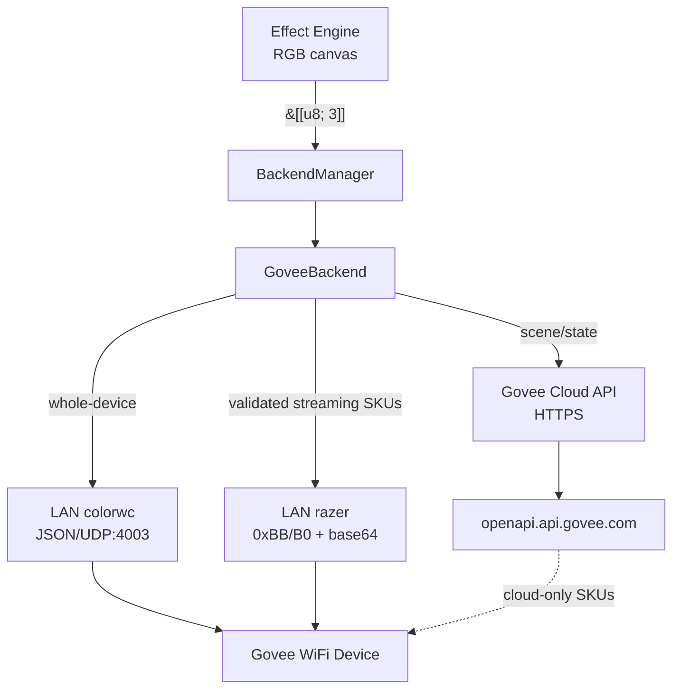

# Spec 49 — Govee Driver (LAN, Cloud, BLE)

> Implementation-ready specification for Govee hardware support in Hypercolor.

**Status:** Implemented, research refreshed
**Author:** Nova
**Date:** 2026-04-25
**Crates:** `hypercolor-driver-govee`, `hypercolor-driver-builtin`, `hypercolor-driver-api`, `hypercolor-types`, `hypercolor-daemon`
**Feature flag:** `hypercolor-driver-builtin/govee` via the default `network` bundle
**Dependencies (runtime):** `tokio`, `serde`, `reqwest`, `base64`, `async-trait`, `anyhow`, `thiserror`

---

## Table of Contents

1. [Overview](#1-overview)
2. [Product & Protocol Landscape](#2-product--protocol-landscape)
3. [Architecture](#3-architecture)
4. [LAN Transport (primary)](#4-lan-transport-primary)
5. [Razer Streaming Transport (per-segment)](#5-razer-streaming-transport-per-segment)
6. [Cloud Transport](#6-cloud-transport)
7. [BLE Transport (deferred)](#7-ble-transport-deferred)
8. [Capability Registry](#8-capability-registry)
9. [Discovery](#9-discovery)
10. [Pairing](#10-pairing)
11. [Device Backend Behavior](#11-device-backend-behavior)
12. [Type Extensions](#12-type-extensions)
13. [Configuration](#13-configuration)
14. [Daemon Integration](#14-daemon-integration)
15. [Testing Strategy](#15-testing-strategy)
16. [Phase Plan](#16-phase-plan)
17. [Risks & Open Questions](#17-risks--open-questions)
18. [References](#18-references)

---

## 1. Overview

Hypercolor ships network drivers as independent `DriverModule` implementations. The daemon sees a module registry, descriptor metadata, optional discovery/pairing/config/control capabilities, and optional output backend construction. Concrete WLED, Govee, Hue, and Nanoleaf crates are bundled by `hypercolor-driver-builtin`, so core daemon startup does not branch on individual driver crates.

`hypercolor-driver-govee` supports Govee's WiFi-connected LED strips, light bars, TV backlights, bulbs, and outdoor lights. The driver spans three transports behind one module feature: a documented LAN API for control, a reverse-engineered Razer/Desktop streaming protocol for per-segment effects on validated SKUs, and Govee cloud APIs for cloud-only devices and capability enrichment. A fourth BLE transport is scoped in later phases.

### Design decisions

- **One crate, multiple transports.** LAN, Cloud, and later BLE all live in `hypercolor-driver-govee`. Per-device transport selection happens at the backend layer based on capabilities discovered during pairing or LAN scan.
- **LAN is the default and primary path.** No auth, no account, works offline, covers the majority of Govee RGB SKUs in circulation.
- **Cloud is opt-in.** User provides a personal API key via a credentials-form pairing flow. Cloud adds scene libraries, music reactivity metadata, and reach to devices that cannot be driven from the LAN.
- **Single module feature.** `hypercolor-driver-builtin/govee` toggles the whole driver inside the built-in bundle. Individual transport knobs live in driver-owned config settings, not in Cargo features.
- **Capability registry in the driver crate.** A Rust translation of `govee-local-api`'s `light_capabilities.py`, scoped to `hypercolor-driver-govee::capabilities`. Not in `hypercolor-types`. Segment counts from this table mean LAN/BLE `ptReal` segment support, not automatically Razer/Desktop streaming support.
- **No bundled API key.** Govee's "Open API" is key-based but per-user. Hypercolor never ships or proxies a key.
- **Driver-scoped credentials.** The Govee account key is stored as driver-scoped JSON in the shared encrypted `CredentialStore`, not as a core enum variant.

### What SignalRGB and OpenRGB tell us

SignalRGB 2.5.51 ships zero Govee plugins. Its device surface is USB-HID only, so there is no prior art to port. OpenRGB's Govee controller at `~/dev/OpenRGB/Controllers/GoveeController/GoveeController.cpp` is the cleanest existing LAN reference and confirms the exact byte-level layout of the Razer streaming payload. `wez/govee2mqtt` (Rust, MIT, actively maintained) is the secondary reference for LAN state machine and cloud behavior; we mirror its shape in idiomatic tokio.

### 2026-04-25 research refresh

Current sources split the Govee world more sharply than the original draft did:

- Govee's current supported-product page lists many `H60xx`, `H61xx`, `H70xx`, and `H80xx` models for the developer platform, including `H6163`, `H6199`, `H6054`, `H6056`, `H619A`, `H619B`, `H619D`, `H6003`, `H6008`, `H6009`, and `H7020`. It does **not** list `H617A` or `H617C` on the developer-platform page as of 2026-04-25.
- Govee's downloadable Developer API reference still documents the legacy `https://developer-api.govee.com/v1` API, with `GET /v1/devices`, `GET /v1/devices/state`, and `PUT /v1/devices/control`, plus `X-RateLimit-*` and `API-RateLimit-*` headers.
- The newer developer-platform pages expose the `/router/api/v1/...` family and "devices and capabilities" language, but the public HTML currently omits request/response schemas unless loaded through the interactive docs. Treat router schemas as live-capture-required before implementation.
- `govee-local-api` v2.4.0 is broader than the original draft assumed. It marks `H6163`, `H6056`, `H6008`, `H6009`, `H7020`, and `H619Z` as basic RGB/Kelvin/brightness/scenes, while `H619A`/`H619B`/`H619C`/`H619D`/`H619E` have 10 segment codes and `H6046`/`H6047` have 10 segment codes.
- OpenRGB's Razer streaming implementation currently hardcodes only `H619A` and `H70B1` to 20 logical LEDs, with an unknown-SKU fallback of 20. That validates the envelope, not a complete SKU-to-segment matrix.

---

## 2. Product & Protocol Landscape

Govee RGB hardware fans out into five overlapping protocol classes, and any given SKU lands in one, two, or three of them depending on firmware:

- **LAN API v1.** Documented, no auth, JSON over UDP. Covers ~184 SKUs after the user toggles "LAN Control" per device in the Govee Home app. Whole-device color, brightness, power, and color-temperature only.
- **LAN `ptReal`.** Documented by community implementations, not by the LAN manual. Sends BLE-shaped packets through LAN JSON as `cmd: "ptReal"` with `data.command: Vec<Base64HexBytes>`. This is how `govee2mqtt` drives scenes and some segment operations without BLE.
- **Razer/Desktop streaming.** Undocumented. Rides on the same UDP 4003 channel as `cmd: "razer"` with `data.pt` base64. Per-segment or per-LED binary streaming wrapped in JSON. This is the only known real-time path for RGBIC strips and TV backlights, but SKU coverage must be validated separately from LAN segment support.
- **Developer API v1 and Platform API.** API-key auth. Legacy v1 at `https://developer-api.govee.com/v1` is still the best documented public surface for inventory, state, and control. The newer platform surface at `https://openapi.api.govee.com/router/api/v1` exposes capability-typed payloads and scene metadata, but schema details must be confirmed with live responses. Both are unsuitable for real-time effects; both are useful for inventory, state, cloud-only devices, and optional scene activation.
- **BLE.** Undocumented. Pure reverse-engineering. Relevant only for legacy BLE-only strips like H6127. Deferred.

Govee's own literature conflates "LAN v1" with "LAN v2" but there is no published LAN v2. What third parties call v2 is usually either the `ptReal` packet tunnel or the Razer/Desktop streaming extension layered on top of LAN v1.

### Priority SKUs

Top six models covering the bulk of install base:

| Rank | SKU family | Category | Known transport | Streaming status |
|------|-----------|----------|-----------------|------------------|
| 1 | H6163 | RGBIC basic strip | LAN + cloud v1 | Razer candidate only; `govee-local-api` marks basic LAN, no LAN segments |
| 2 | H6199 | Immersion TV backlight | cloud v1; LAN varies by firmware/app toggle | Razer candidate only; requires local capture |
| 3 | H6054 / H6056 | Flow Plus / Pro light bars | LAN + cloud v1 | H6056 basic LAN in `govee-local-api`; Razer candidate only |
| 4 | H619A / H619B / H619D | RGBIC Pro strip | LAN + cloud v1 | H619A/B/C/D/E have 10 LAN segment codes; OpenRGB validates Razer envelope for H619A |
| 5 | H6003 / H6008 / H6009 | Smart bulb | LAN + cloud v1 | Whole-device only |
| 6 | H7020 | Outdoor string lights | LAN + cloud v1 | Basic LAN in `govee-local-api`; segment/Razer support unverified |

Phase 1 should ship reliable LAN whole-device support for LAN-enabled devices in the top six. Cloud-only or LAN-disabled firmware variants become reachable in Phase 4. Phase 3 should enable Razer streaming only for validated SKUs, beginning with H619A/H70B1 from OpenRGB and any Bliss-owned device we can capture locally.

---

## 3. Architecture

### Crate layout

```
crates/hypercolor-driver-govee/
  Cargo.toml
  src/
    lib.rs                    — DriverModule plus discovery, pairing, config, controls, presentation, runtime cache
    backend.rs                — GoveeBackend: DeviceBackend
    capabilities.rs           — SKU → GoveeCapabilities table (port of govee-local-api)
    config.rs                 — GoveeConfig (mirrors types crate for local use)
    error.rs                  — thiserror-based GoveeError, plus From impls
    fingerprint.rs            — Fingerprint builders for LAN/Cloud/BLE paths
    lan/
      mod.rs                  — LAN transport entrypoints
      discovery.rs            — Multicast scan, broadcast-receive loop
      protocol.rs             — JSON command types, colorwc, turn, brightness
      razer.rs                — 0xBB/0xB0 envelope, base64 wrap, XOR
      transport.rs            — UdpSocket owner, send/receive task pair
    cloud/
      mod.rs                  — Cloud transport entrypoints
      client.rs               — reqwest client, rate-limit budget, retry
      types.rs                — Cloud API schemas (devices, state, control)
      capabilities.rs         — Maps cloud capability lists → GoveeCapabilities
    scanner.rs                — GoveeScanner: ties LAN discovery + optional Cloud inventory
    pairing.rs                — PairingDescriptor factory, key validation
  tests/
    lan_protocol_tests.rs     — encoding round-trips, razer XOR, base64
    capability_tests.rs       — SKU registry lookups
    cloud_schema_tests.rs     — serde round-trips for cloud API payloads
    discovery_tests.rs        — multicast flow against mock devices
```

The module exposes the same host-facing capability contracts as other drivers, while LAN/cloud details stay local to `hypercolor-driver-govee`.

### Data flow



The per-device transport choice is keyed off `GoveeCapabilities` and protocol-specific counts (Section 8). Backend policy: prefer LAN Razer only when `razer_led_count` is known, fall back to LAN `colorwc` for whole-device, use cloud only when LAN is unreachable and the device is cloud-registered.

### Driver registration

The daemon calls `hypercolor_driver_builtin::build_driver_module_registry(...)` when the `builtin-drivers` feature is enabled. The bundle registers `GoveeDriverModule::with_credential_store(...)` behind its `govee` feature. The daemon then treats it like any other `DriverModule`: config normalization creates `drivers.govee`, discovery uses the module's `DiscoveryCapability`, presentation comes from `DriverPresentationProvider`, and output routing calls `build_output_backend`.

---

## 4. LAN Transport (primary)

### Ports and addressing

| Port | Direction | Purpose |
|------|-----------|---------|
| `239.255.255.250:4001` | multicast out | Discovery scan |
| `:4001` (device) | unicast in | Device listens for scan requests |
| `:4002` (client bind) | unicast in | Device replies to scan land here |
| `:4003` (device) | unicast out | All control commands (colorwc, turn, brightness, razer) |

A single `tokio::net::UdpSocket` bound to `0.0.0.0:4002` should be attempted first for the Hypercolor daemon. The socket joins the `239.255.255.250` multicast group at startup; it sends scan requests to the multicast address and unicast control commands to `<device_ip>:4003` from the same source port. It receives scan replies and `devStatus` echoes on its bound port.

Reference implementations differ here: `govee2mqtt` binds a long-lived listener on `:4002` but uses short-lived sockets for unicast commands, while OpenRGB creates a UDP client for multicast `4001` / local `4002` and writes commands through that client. Hypercolor should keep the simpler single-socket design if real-device tests pass. If a device ignores commands sourced from `:4002`, split into one `:4002` listener plus ephemeral command sockets and keep the public `LanTransport` API unchanged.

### Message envelope

All LAN messages are JSON with a two-level envelope:

```json
{ "msg": { "cmd": "<name>", "data": { ... } } }
```

`cmd` is one of `scan`, `devStatus`, `turn`, `brightness`, `colorwc`, `ptReal`, or `razer`. `ptReal` and `razer` are distinct tunnels: `ptReal` carries BLE-shaped command packets and `razer` carries the Desktop/Razer streaming payload.

### Commands

**`scan` (client → multicast).**

```json
{ "msg": { "cmd": "scan", "data": { "account_topic": "reserve" } } }
```

Devices reply with:

```json
{ "msg": { "cmd": "scan", "data": {
  "ip": "192.168.1.42",
  "device": "AB:CD:EF:01:02:03",
  "sku": "H6163",
  "bleVersionHard": "1.00.01",
  "bleVersionSoft": "1.01.09",
  "wifiVersionHard": "1.00.10",
  "wifiVersionSoft": "1.00.18"
}}}
```

`sku` identifies the hardware model. `device` is the LAN fingerprint input. Both are stable across reboots and IP changes.

**`devStatus` (client → device:4003).** Requests current state. Device replies on :4002 with on-off, brightness, color, and color-temp.

**`turn` (client → device:4003).**

```json
{ "msg": { "cmd": "turn", "data": { "value": 1 } } }
```

`value` is 0 or 1.

**`brightness` (client → device:4003).**

```json
{ "msg": { "cmd": "brightness", "data": { "value": 50 } } }
```

Range is 1 to 100, not 0 to 255.

**`colorwc` (client → device:4003).**

```json
{ "msg": { "cmd": "colorwc", "data": {
  "color": { "r": 255, "g": 128, "b": 0 },
  "colorTemInKelvin": 0
}}}
```

When `colorTemInKelvin` is 0, the device uses RGB. When nonzero (typical range 2700-9000), the device uses color-temperature mode and `color` is ignored. OpenRGB serializes `colorTemInKelvin` as a string (`"0"`) but Govee firmware accepts both; we emit an integer.

### Rust protocol types

```rust
#[derive(Debug, Serialize, Deserialize)]
#[serde(tag = "cmd", content = "data", rename_all = "camelCase")]
pub enum LanCommand {
    Scan { account_topic: String },
    DevStatus {},
    Turn { value: u8 },
    Brightness { value: u8 },
    Colorwc { color: Rgb, #[serde(rename = "colorTemInKelvin")] color_tem_in_kelvin: u16 },
    PtReal { command: Vec<String> },
    Razer { pt: String },
}

#[derive(Debug, Serialize, Deserialize)]
pub struct LanEnvelope<T> { pub msg: T }

#[derive(Debug, Serialize, Deserialize)]
pub struct Rgb { pub r: u8, pub g: u8, pub b: u8 }
```

### Transport task structure

```rust
pub struct LanTransport {
    socket: Arc<UdpSocket>,                   // 0.0.0.0:4002, joined to 239.255.255.250
    targets: Arc<RwLock<HashMap<MacAddress, SocketAddr>>>,
    events: broadcast::Sender<LanEvent>,      // scan responses, devStatus updates
}

impl LanTransport {
    pub async fn new() -> Result<Self> { ... }
    pub async fn scan(&self) -> Result<()> { ... }
    pub async fn send(&self, mac: &MacAddress, cmd: LanCommand) -> Result<()> { ... }
    pub fn subscribe(&self) -> broadcast::Receiver<LanEvent> { self.events.subscribe() }
}
```

A single receive task drains the discovery socket, parses JSON, and fans out via `broadcast::Sender`. The scanner subscribes for scan responses; the backend subscribes for devStatus echoes.

### Rate and pacing

Govee devices accept LAN state commands at roughly 10 Hz reliably. For whole-device `colorwc` we cap writes at 10 Hz with dedup against the last-sent color (same byte triplet, skip). For Razer streaming we cap at 25 Hz for single-device deployments and 15 Hz for multi-device, because streaming frames are latest-value output and need a different cadence from state commands.

---

## 5. Razer Streaming Transport (per-segment)

### Envelope

Razer streaming reuses the LAN JSON envelope with `cmd: "razer"`. The payload is a base64-encoded binary packet carried in `data.pt`:

```json
{ "msg": { "cmd": "razer", "data": { "pt": "<base64>" } } }
```

### Binary packet layout

Confirmed against OpenRGB's `GoveeController::SendRazerData` in `~/dev/OpenRGB/Controllers/GoveeController/GoveeController.cpp:184`:

```
offset       bytes                          meaning
-----------  -----                          -------
0            0xBB                           frame header
1            length_hi                      u16 big-endian, value = 2 + 3*N
2            length_lo                      (low byte of length)
3            0xB0                           subcommand: "set LED colors"
4            0x01                           gradient_off flag, always 1 for per-LED
5            N                              led/segment count, u8
6 .. 5+3*N   R0 G0 B0 R1 G1 B1 ... B(N-1)   3*N interleaved RGB bytes
6+3*N        xor                            XOR of all prior bytes, u8
```

Total packet size is `7 + 3*N` bytes before base64 encoding. The XOR byte sits at offset `6 + 3*N`, immediately after the last blue byte at offset `5 + 3*N`. An implementer sanity check: for N=1 with RGB `(0xFF, 0x00, 0x00)` the packet is `BB 00 05 B0 01 01 FF 00 00` followed by `XOR = 0xBB ^ 0x00 ^ 0x05 ^ 0xB0 ^ 0x01 ^ 0x01 ^ 0xFF ^ 0x00 ^ 0x00 = 0xF1`, total 10 bytes.

### Razer enable/disable

Before the first streaming frame to a device, the driver sends a razer-enable packet. After the last frame (or on disconnect), it sends razer-disable. Both are fixed 6-byte payloads:

```rust
const RAZER_ENABLE:  [u8; 6] = [0xBB, 0x00, 0x01, 0xB1, 0x01, 0x0A];
const RAZER_DISABLE: [u8; 6] = [0xBB, 0x00, 0x01, 0xB1, 0x00, 0x0B];
```

The trailing byte in each is the XOR checksum: `0xBB ^ 0x00 ^ 0x01 ^ 0xB1 ^ 0x01 = 0x0A` for enable, `0x0B` for disable.

### Encoder

```rust
pub fn encode_razer_frame(colors: &[[u8; 3]]) -> Vec<u8> {
    let count = colors.len().min(255) as u8;
    let payload_len: u16 = 2 + 3 * u16::from(count);
    let mut packet = Vec::with_capacity(7 + 3 * usize::from(count));

    packet.push(0xBB);
    packet.push((payload_len >> 8) as u8);
    packet.push((payload_len & 0xFF) as u8);
    packet.push(0xB0);
    packet.push(0x01);
    packet.push(count);
    for rgb in colors.iter().take(usize::from(count)) {
        packet.extend_from_slice(rgb);
    }
    let xor = packet.iter().fold(0u8, |acc, b| acc ^ *b);
    packet.push(xor);
    packet
}
```

Round-trip unit tests verify the format against three fixed frames: 1 LED, 10 LEDs, 255 LEDs.

### Segment count vs LED count

Do not assume every RGBIC product exposes the same segment model across LAN `ptReal`, Razer/Desktop streaming, Cloud, and BLE. Current references disagree by protocol surface:

- `govee-local-api` segment counts are LAN/BLE packet segment codes. For example, it marks `H619A`/`H619B`/`H619C`/`H619D`/`H619E` as 10 segments, but marks `H6163` as basic RGB/Kelvin/brightness/scenes with no segment codes.
- OpenRGB's Razer path hardcodes `H619A` and `H70B1` to 20 logical LEDs and lets unknown SKUs resize from 1 to 255. That table validates Razer streaming for `H619A` and `H70B1`, not every RGBIC SKU.
- Govee's cloud/router capability response can expose `segment_color_setting`; when present, it should refine per-install segment counts, but this must be confirmed from a live response before becoming a source of truth.

The driver therefore stores two optional counts:

```rust
pub struct SkuProfile {
    // ...
    pub lan_segment_count: Option<u8>,
    pub razer_led_count: Option<u8>,
}
```

`lan_segment_count` gates `ptReal`/scene segment work. `razer_led_count` gates real-time streaming. Unknown or unvalidated Razer counts must not enable streaming automatically; the backend falls back to whole-device `colorwc`.

### Frame pacing

We target 25 frames per second per device by default. Minimum frame interval is enforced at 40 milliseconds. If the render loop calls `write_colors` faster, the backend coalesces and drops the older frame. The latest-frame semantics match the `write_colors_shared` API contract (`hypercolor-core::device::traits::DeviceBackend::write_colors_shared`).

### Multi-device coordination

A single backend instance manages every Govee device on the LAN. When multiple streaming devices are active, the backend round-robins sends so each device respects its configured frame floor, 40 milliseconds at 25 FPS or about 67 milliseconds at 15 FPS.

---

## 6. Cloud Transport

### Purpose

Cloud is not the control plane. Its three jobs:

1. **Inventory enrichment.** Pull the cloud-supported device list when the user connects an API key, so discovery populates capability flags even for SKUs the local registry does not yet cover. Note: this list is a subset of what the Govee Home app displays; devices outside Govee's developer platform are not cloud-reachable.
2. **Scene activation.** Trigger named presets (music mode, dynamic scenes) that LAN cannot reach.
3. **Fallback control.** For devices not LAN-enabled but covered by the developer platform, fall back to cloud for on/off, color, and brightness at sub-10 Hz rates.

### API surfaces

Hypercolor should model cloud as two API surfaces behind one client:

- **Developer API v1:** `https://developer-api.govee.com/v1`. Official PDF and ReadMe docs publish stable schemas for `GET /devices`, `GET /devices/state`, and `PUT /devices/control`. Use this first for Phase 4 inventory/state/control because it is documented enough to implement without a live schema scrape.
- **Platform/router API:** `https://openapi.api.govee.com/router/api/v1`. Current developer-platform pages describe "devices and capabilities" and the endpoint names below, but the public HTML does not expose full schemas. Use this for capability enrichment and scenes only after capturing live request/response fixtures.

All requests set `Govee-API-Key: <user-key>`.

Rate limits: Govee's official Developer API reference documents two concurrent budgets for lights/plugs/switches: `X-RateLimit-*` for the account-level 10,000/day cap and `API-RateLimit-*` for endpoint-specific windows. Documented endpoint windows are `DeviceList` 10/minute, `DeviceControl` 10/minute/device, and `DeviceState` 10/minute/device. Appliances use the same per-minute endpoint windows but a lower 100/day account cap, so the driver must classify non-light SKUs before polling.

### Endpoints used

- `GET /v1/devices` — v1 inventory. Returns `device`, `model`, `deviceName`, `controllable`, `retrievable`, `supportCmds`, and optional `properties.colorTem.range`.
- `GET /v1/devices/state` — v1 state. Query/body shape follows the official reference; uses `device` and `model`.
- `PUT /v1/devices/control` — v1 control. Body carries `{ device, model, cmd }`.
- `GET /router/api/v1/user/devices` — platform inventory and capability metadata. Body shape must be captured live before implementation.
- `POST /router/api/v1/device/state` — platform read state. Body carries `{ requestId, payload: { sku, device } }` in current examples.
- `POST /router/api/v1/device/control` — platform control. Body carries `{ requestId, payload: { sku, device, capability: { type, instance, value } } }` in current examples.
- `GET /router/api/v1/user/devices/scenes` — list dynamic scenes for a device. Treat as Phase 4b, not Phase 4a.
- `GET /router/api/v1/user/devices/diy-scenes` — list user-defined DIY scenes. Treat as optional; skip if the response is 404 or the endpoint is absent from the live docs.

Before committing to router response shapes, the implementer must capture a current request/response example against a live account and sanity-check endpoint names against https://developer.govee.com/reference. Govee revised the platform docs recently and the spec should not lock in a shape that has silently drifted.

### Capability model

Each device's capabilities list is a vector of typed descriptors. Known `type` values Hypercolor consumes:

| Type | Purpose |
|------|---------|
| `devices.capabilities.on_off` | Power |
| `devices.capabilities.range` | Brightness (0-100), fan speed, etc. |
| `devices.capabilities.color_setting` | RGB integer (`0xRRGGBB`) + Kelvin |
| `devices.capabilities.segment_color_setting` | Per-segment RGB + brightness, instance `segmentedColorRgb` |
| `devices.capabilities.music_setting` | Music-reactive modes |
| `devices.capabilities.dynamic_scene` | Named preset activation |
| `devices.capabilities.work_mode` | Device-specific mode switching |

Each descriptor carries a `parameters` object describing the accepted value shape. The driver parses these once at pairing and stores a synthesized `GoveeCapabilities` bitflag per device.

### Rust cloud client sketch

```rust
pub struct CloudClient {
    http: reqwest::Client,
    base_url: Url,
    api_key: String,
    budget: Arc<Mutex<RateBudget>>,
}

impl CloudClient {
    pub async fn list_v1_devices(&self) -> Result<Vec<V1Device>> { ... }
    pub async fn v1_state(&self, model: &str, device: &str) -> Result<V1State> { ... }
    pub async fn v1_control(&self, model: &str, device: &str, cmd: V1Command) -> Result<()> { ... }
    pub async fn router_devices(&self) -> Result<Vec<RouterDevice>> { ... }
    pub async fn router_control(&self, sku: &str, device: &str, cap: RouterCapability) -> Result<()> { ... }
    pub async fn scenes(&self, sku: &str, device: &str) -> Result<Vec<CloudScene>> { ... }
}
```

`RateBudget` tracks per-device-minute and per-key-day counters. Control requests for a device already at its per-minute limit either delay or surface `GoveeError::RateLimited` depending on whether they came from user action or automation.

---

## 7. BLE Transport (deferred)

Scoped in Phase 6 only. Notes here exist so the Phase 1-4 work does not paint us into a corner.

Target devices: legacy BLE-only SKUs without LAN support, primarily H6127, H6159 (early firmware), H6160, and H6001 bulbs.

Library: `btleplug 0.11.x`. No maintained Rust Govee BLE crate exists. The framing (20-byte packets, `0x33` header, XOR checksum, `...1910` service UUID, `...2b11` write char) is documented in Section 18 references and inside `wez/govee2mqtt`'s BLE module.

The BLE transport will live in `crates/hypercolor-driver-govee/src/ble/` and share the capability registry, scanner output shape, and fingerprint builder. The Protocol 7 pattern uses fixed 20-byte frames and XOR checksums, so checksum helpers can be shared with `razer.rs` when we add it, but command encoding stays protocol-specific.

Fingerprint for BLE devices: `ble:govee:<mac>`.

---

## 8. Capability Registry

The registry is a compile-time table mapping SKU strings to a `GoveeCapabilities` bitflag and static metadata. It lives in `hypercolor-driver-govee/src/capabilities.rs`.

### Bitflags

```rust
bitflags::bitflags! {
    #[derive(Debug, Clone, Copy, PartialEq, Eq, Default)]
    pub struct GoveeCapabilities: u16 {
        const ON_OFF              = 1 << 0;
        const BRIGHTNESS          = 1 << 1;
        const COLOR_RGB           = 1 << 2;
        const COLOR_KELVIN        = 1 << 3;
        const SEGMENTS            = 1 << 4;   // LAN/BLE ptReal segment commands
        const SCENES_DYNAMIC      = 1 << 5;   // cloud-triggered presets
        const SCENES_MUSIC        = 1 << 6;   // music mode
        const LAN                 = 1 << 7;   // LAN API v1 reachable
        const CLOUD               = 1 << 8;   // reachable via Govee cloud API
        const RAZER_STREAMING     = 1 << 9;   // Desktop/Razer real-time frames validated
    }
}
```

### Per-SKU entry

```rust
pub struct SkuProfile {
    pub sku: &'static str,
    pub family: SkuFamily,
    pub capabilities: GoveeCapabilities,
    pub lan_segment_count: Option<u8>,
    pub razer_led_count: Option<u8>,
    pub kelvin_range: Option<(u16, u16)>,
    pub name: &'static str,
}

pub enum SkuFamily {
    RgbicStrip,
    RgbicBar,
    RgbicTvBacklight,
    RgbicOutdoor,
    RgbStrip,
    Bulb,
    Unknown,
}
```

### Implemented tables

```rust
pub static BASIC_LAN_SKUS: &[&str] = &[/* 188 whole-device LAN SKUs */];
pub static CUSTOM_LAN_PROFILES: &[CustomLanProfile] = &[/* 78 LAN SKUs with feature/segment overrides */];
pub static CLOUD_SUPPORTED_SKUS: &[&str] = &[/* 259 developer-platform lighting SKUs */];
```

The LAN registry is translated from `Galorhallen/govee-local-api` v2.4.0 and currently covers 266 local-control SKUs. The cloud registry is refreshed from Govee's official supported-product page and includes lighting families `H60xx`, `H61xxx`, `H66xx`, `H68xx`, `H70xx`, and `H8xxx`. It intentionally excludes `H5xxx` sensors and `H71xx` appliances/heaters for this lighting driver pass.

SKUs present only in `CLOUD_SUPPORTED_SKUS` resolve to a cloud-only profile with `CLOUD | ON_OFF`, no LAN capability, and no static segment count. Live `supportCmds` from cloud inventory refine brightness/control metadata per device.

### Lookups

```rust
pub fn profile_for_sku(sku: &str) -> Option<SkuProfile> { ... }
pub fn fallback_profile(sku: &str) -> SkuProfile { ... }   // LAN + COLOR_RGB only, segments unknown
pub const fn known_sku_count() -> usize { ... }             // LAN table count
pub const fn known_cloud_sku_count() -> usize { ... }       // cloud table count
```

Unknown SKUs fall back to `ON_OFF | BRIGHTNESS | COLOR_RGB | LAN`. The backend treats them as whole-device-only until cloud inventory, local capture, or a registry update fills in protocol-specific segment counts.

### Source of truth

The LAN table is translated from `Galorhallen/govee-local-api/src/govee_local_api/light_capabilities.py`. The translation is mechanical: Python `IntFlag` members map to `GoveeCapabilities` bits, and scene code lookups become a second companion table if Phase 4 needs them. License note: `govee-local-api` is Apache-2.0, compatible with Hypercolor's Apache-2.0.

The cloud table follows Govee's official developer-platform supported product list. Because that page includes non-light devices, only lighting-oriented families are imported here until the driver grows appliance-safe capability routing.

---

## 9. Discovery

The `GoveeScanner` implements the `DiscoveryCapability` contract from `hypercolor-driver-api::DiscoveryCapability`. It runs two concurrent subtasks:

1. **LAN multicast.** Send `scan` to `239.255.255.250:4001`. Listen on `:4002` for replies for the configured `request.timeout` (default 2 seconds, bumped to 5 for first scan of a session). Drain every reply into a `DriverDiscoveredDevice` with fingerprint `net:govee:<mac>`, metadata `ip`, `sku`, firmware versions, and `connect_behavior: AutoConnect`.
2. **Cloud inventory (optional).** If the driver-scoped account credential is present, call `list_v1_devices()` on the cloud client and synthesize `DriverDiscoveredDevice` entries for any SKUs missing from the LAN scan. Fingerprint is `net:govee:<mac>` if the cloud inventory provides a MAC, otherwise `cloud:govee:<device_id>`.

Both subtasks run concurrently via `tokio::join!`. Cloud errors never block LAN discovery.

### Known-device hints

The scanner respects config-provided IP hints through its driver-owned `known_ips` setting:

```rust
pub struct GoveeKnownDevice {
    pub ip: IpAddr,
    pub sku: Option<String>,
    pub mac: Option<String>,
}
```

A known IP is unicast-scanned in addition to the multicast, so devices on VLANs that block multicast still surface. This matches `wez/govee2mqtt`'s `DiscoOptions::global_broadcast` fallback.

### Fingerprint

Preferred form: `net:govee:<mac_lowercase_colon_separated>` whenever a MAC is known, regardless of which transport revealed it. LAN scan replies always include the MAC in the `device` field. Cloud inventory entries often include a MAC as well; when present, use it. Fall back to `cloud:govee:<device_id>` only when MAC is truly unavailable from both paths.

**Promotion rule.** Hypercolor's registry dedupes by exact fingerprint string (`crates/hypercolor-core/src/device/registry.rs:132`), so a device that first appeared as `cloud:govee:<device_id>` and later surfaces on LAN with a MAC cannot merge automatically. The driver handles this explicitly: on every scan, if a LAN response arrives for a device whose cloud-derived `<device_id>` maps to a known `cloud:govee:<device_id>` entry but no matching `net:govee:<mac>` entry exists yet, the scanner emits the LAN device as a new `DriverDiscoveredDevice` with fingerprint `net:govee:<mac>` and marks the cloud-only entry as superseded in its metadata. The daemon's next lifecycle tick removes the superseded cloud entry. Unit tests cover the promotion path.

Same fingerprint means same `DeviceId` across daemon restarts. When a device surfaces via both LAN and cloud in the same scan, metadata merges: LAN takes precedence for `ip`, cloud adds `cloud_device_id` and any capability hints not present in the LAN reply.

---

## 10. Pairing

Govee LAN needs no pairing: the user toggles "LAN Control" per device in the Govee Home app before Hypercolor sees them, and from then on control is automatic. Cloud pairing is a one-time step per user, not per device.

### Flow

The API key is **account-scoped**, not device-scoped. A single credential at the registry key `"govee:account"` governs cloud access for every Govee device in the household. This asymmetry between Hypercolor's per-device `PairingCapability` contract and Govee's per-account credential model shapes the rules below.

`DeviceAuthState` resolution per tracked device, via `auth_summary`:

| Device class | Account key stored? | `auth_state` | `can_pair` | `descriptor` |
|--------------|---------------------|--------------|------------|--------------|
| LAN-reachable, no cloud needed | either | `Open` | `false` | `None` |
| LAN-reachable, cloud-optional (scenes/music opt-in) | yes and valid | `Configured` | `false` (already paired) | `None` |
| LAN-reachable, cloud-optional | no | `Open` | `true` | shared account descriptor |
| Cloud-only (developer-platform SKU, not LAN-reachable) | yes and valid | `Configured` | `false` | `None` |
| Cloud-only | no | `Required` | `true` | shared account descriptor |
| Cloud-only, last call returned 401 | yes (stale) | `Error` | `true` | shared account descriptor with "key rejected" hint |
| Cloud-only, outside developer-platform support | any | `Error` | `false` | `None` with message "device not exposed by Govee cloud APIs" |

`can_pair == true` on a LAN-reachable device is how we surface the one-time account pairing flow to users who want scenes; they only see it if cloud would unlock something.

### PairingDescriptor

Shared across all cloud-requiring devices. Presented once; subsequent devices reuse the stored key:

```rust
fn govee_pairing_descriptor() -> PairingDescriptor {
    PairingDescriptor {
        kind: PairingFlowKind::CredentialsForm,
        title: "Connect Govee Cloud".to_owned(),
        instructions: vec![
            "Open the Govee Home app on your phone.".to_owned(),
            "Profile → About Us → Apply for API Key.".to_owned(),
            "Govee will email the key to your account address.".to_owned(),
            "Paste the key below. Hypercolor stores it encrypted at rest.".to_owned(),
        ],
        action_label: "Connect".to_owned(),
        fields: vec![PairingFieldDescriptor {
            key: "api_key".to_owned(),
            label: "Govee API Key".to_owned(),
            secret: true,
            optional: false,
            placeholder: Some("00000000-0000-0000-0000-000000000000".to_owned()),
        }],
    }
}
```

### Validation

On submit, call `CloudClient::list_v1_devices()` using the submitted key. If the response is 200, store the credential through the driver host:

```rust
host.credentials()
    .set_json("govee", "account", json!({ "api_key": form.api_key.clone() }))
    .await?;
```

The `CredentialStore` encrypts at rest and namespaces the payload under the driver ID. A single account credential covers every cloud-requiring device.

If the call returns 401, return `PairDeviceOutcome::InvalidInput` with the message "Govee rejected the API key. Check the value in the Govee Home app and try again."

### Clearing credentials

`clear_credentials` invoked against any cloud-backed Govee device is a household-wide action: it removes the single `"govee:account"` entry from the `CredentialStore`. Because this one key governs every cloud-reachable Govee device, the driver:

1. Removes the stored credential.
2. Iterates every tracked Govee device in the registry whose capability set includes `CLOUD` (or whose discovery path was cloud-only).
3. For each such device, disconnects the backend session and downgrades `auth_state` to `Required` (LAN-capable) or keeps it `Required` (cloud-only).
4. Enqueues a discovery rescan so LAN-only devices remain reachable while cloud-dependent ones surface as pending-pairing.

Pure LAN-only devices are unaffected.

The `ClearPairingOutcome` returned to the caller carries a `message` explaining that the action cleared the household cloud key and lists the device IDs whose `auth_state` transitioned, so the UI can show a single confirmation banner rather than per-device ones.

---

## 11. Device Backend Behavior

`GoveeBackend: DeviceBackend` lives in `src/backend.rs`. It holds:

```rust
pub struct GoveeBackend {
    config: GoveeConfig,
    credential_store: Arc<CredentialStore>,
    lan: LanTransport,
    cloud: Option<CloudClient>,
    devices: Arc<RwLock<HashMap<DeviceId, GoveeDeviceState>>>,
    registry: &'static [SkuProfile],
}

struct GoveeDeviceState {
    sku: String,
    profile: SkuProfile,
    address: SocketAddr,            // LAN target
    last_sent: Option<(Vec<[u8; 3]>, Instant)>,
    cloud_id: Option<String>,
    razer_enabled: bool,
    rate_gate: FrameRateGate,
}
```

### `discover`

Calls `GoveeScanner::scan()` and returns the resulting `DeviceInfo` vector. Idempotent; subsequent calls refresh LAN state.

### `connect`

Looks up the device, resolves its SKU profile, and sends a `turn:1` via LAN. If `RAZER_STREAMING` is present and `razer_led_count` is known, also sends `RAZER_ENABLE` and marks `razer_enabled = true`. No DTLS handshake, no long-lived TCP — LAN is stateless.

### `disconnect`

If `razer_enabled`, send `RAZER_DISABLE`. Optional `turn:0` gated by config (`govee.power_off_on_disconnect`, default false). Clear `last_sent`.

### `write_colors` and `write_colors_shared`

Behavior is driven by the SKU profile:

- If `RAZER_STREAMING` and `colors.len() == profile.razer_led_count.unwrap_or(0)` → `razer` encoder, base64 wrap, send LAN JSON.
- If `RAZER_STREAMING` and `colors.len() != razer_led_count` → compute the mean color across `colors` and fall back to `colorwc`. Log once per device at `warn`.
- Otherwise → mean color, `colorwc`, honoring Kelvin of 0.

Before every send, `rate_gate.ready()` enforces the configured frame floor. If not ready, the call returns `Ok(())` without sending; `write_colors_shared` semantics allow coalescing, and the engine never expects per-call guarantees.

### `health_check`

Returns `HealthStatus::Healthy` if LAN `devStatus` replied within the last 10 seconds, `Degraded` if 10-30 seconds stale, `Unreachable` beyond 30. For cloud-only devices, checks the cloud rate-limit budget and last successful call timestamp.

### `set_brightness`

LAN `brightness` command with 1-100 range. Remember brightness is separate from color in Govee's model; setting color does not reset brightness.

---

## 12. Type Extensions

### Driver-scoped credential payload

No core credential enum is extended. Govee stores the user's account key as encrypted driver-scoped JSON:

```json
{
  "api_key": "..."
}
```

Storage key convention: driver `"govee"`, key `"account"` (single per-user, unlike per-device pairing keys).

### `hypercolor-types::config::GoveeConfig`

Type in `crates/hypercolor-types/src/config.rs`:

```rust
#[derive(Debug, Clone, Default, PartialEq, Eq, Serialize, Deserialize)]
#[serde(default, rename_all = "snake_case")]
pub struct GoveeConfig {
    /// Known device IPs to unicast-scan in addition to the multicast probe.
    pub known_ips: Vec<IpAddr>,
    /// Whether to power devices off when Hypercolor disconnects.
    pub power_off_on_disconnect: bool,
    /// Maximum whole-device LAN state command rate.
    pub lan_state_fps: u32,
    /// Maximum validated Razer/Desktop streaming frame rate.
    pub razer_fps: u32,
}
```

The host stores this under `drivers.govee` as a `DriverConfigEntry`, so module-owned settings stay outside daemon-specific config structs.

---

## 13. Configuration

Defaults:

```toml
[drivers.govee]
enabled = true
known_ips = []
power_off_on_disconnect = false
lan_state_fps = 10
razer_fps = 25
```

LAN is the out-of-box path and we do not prompt users for an API key until cloud access would unlock a device or flow.

---

## 14. Daemon Integration

### `hypercolor-driver-builtin/Cargo.toml`

The built-in bundle owns concrete driver feature flags:

```toml
[features]
default = ["network", "hal"]
network = ["wled", "govee", "hue", "nanoleaf"]
govee = ["dep:hypercolor-driver-govee"]
```

The daemon depends on this bundle through its `builtin-drivers` feature. It should not depend on or register `hypercolor-driver-govee` directly.

### `hypercolor-driver-builtin/src/lib.rs`

Register the module inside the bundle:

```rust
#[cfg(feature = "govee")]
registry.register(GoveeDriverModule::with_credential_store(
    GoveeConfig::default(),
    Arc::clone(&credential_store),
))?;
```

`normalize_driver_config_entries` ensures `drivers.govee` exists. The daemon's `driver_enabled`, `driver_config_flag`, and backend construction paths are generic over `DriverModuleDescriptor` and `DriverConfigEntry`.

### Workspace `Cargo.toml`

The workspace root uses `members = ["crates/*"]`, so `crates/hypercolor-driver-govee/` is part of the workspace. The workspace dependency entry lets the built-in bundle reference it via `workspace = true`:

```toml
hypercolor-driver-govee = { path = "crates/hypercolor-driver-govee" }
```

Place this next to the existing `hypercolor-driver-hue`, `hypercolor-driver-nanoleaf`, and `hypercolor-driver-wled` entries in the workspace dependency block.

---

## 15. Testing Strategy

### Unit tests (`tests/` directory per crate conventions)

**`lan_protocol_tests.rs`**

- Round-trip every `LanCommand` variant through serde_json, verifying exact field names and numeric types.
- Verify `colorwc` emits `colorTemInKelvin` as an integer, not a string.
- Encode `scan` + parse a reference reply fixture captured from a real device.

**`razer_tests.rs`**

- `encode_razer_frame(&[[255,0,0]])` produces a 10-byte packet with a known XOR.
- 10-LED and 255-LED frames produce correct `length_hi`/`length_lo` bytes.
- `RAZER_ENABLE` and `RAZER_DISABLE` have correct XOR bytes (`0x0A`, `0x0B`).
- Base64-wrap length invariant: `encoded_len == 4 * ceil((7 + 3*N) / 3)`.

**`capability_tests.rs`**

- `profile_for_sku("H6163")` returns a profile with `LAN`, `CLOUD`, `COLOR_RGB`, `COLOR_KELVIN`, `BRIGHTNESS`, and `ON_OFF`, but not `SEGMENTS` or `RAZER_STREAMING`.
- `profile_for_sku("H619A")` returns `SEGMENTS`, `RAZER_STREAMING`, `lan_segment_count == Some(10)`, and `razer_led_count == Some(20)`.
- Unknown SKU falls back to `ON_OFF | BRIGHTNESS | COLOR_RGB | LAN`.
- All seed entries have at least one reachable transport bit (`LAN` or `CLOUD`) set.

**`cloud_schema_tests.rs`**

- Parse v1 inventory/state fixtures and a captured router `/user/devices` response fixture with three devices.
- Serialize v1 and router control requests and verify each shape against its corresponding fixture.
- `RateBudget::reserve` enforces the 10/min/device limit deterministically.

**`discovery_tests.rs`**

- Spin up a mock UDP server that echoes a scan reply. Scanner surfaces one `DriverDiscoveredDevice` with expected fingerprint.
- Timeout path returns `DiscoveryResult { devices: vec![] }` cleanly.

### Integration test

One end-to-end test against a real H6163 or H6199 on Bliss's LAN (Phase 1 exit criterion). Sends `colorwc` red, green, blue, off; verifies `devStatus` echoes each; no assertions on RGB precision (gamma and power curves intervene).

Phase 3 adds a streaming integration test that runs a 5-second Razer-mode gradient at 25 FPS and verifies no dropped-frame errors in the LAN transport log.

### Manual test matrix

- SKU under test: at minimum H6163 or H619x (Bliss owns RGBIC strips).
- Transports: LAN-only (no cloud key), LAN+Cloud (cloud key stored).
- Scenarios: cold discovery, warm rediscovery after IP change, daemon restart preserving DeviceId, brightness control, power toggle, Razer streaming steady state on a validated Razer SKU, Razer streaming under engine tier downshift from 60 to 30 FPS.

### Cargo-deny

No new vulnerabilities expected. `reqwest` is already in the workspace. `base64` is minimal. `btleplug` only appears in Phase 6 and gets its own deny review at that point.

---

## 16. Phase Plan

Phase 0 complete: this spec and research refresh.

### Phase 1 — LAN v1 skeleton (complete)

Exit criteria:

- `crates/hypercolor-driver-govee` compiles, registered through the built-in driver module bundle.
- LAN multicast discovery finds at least one real device on Bliss's network.
- `colorwc` drives the device to correct colors from the Hypercolor UI.
- `turn` + `brightness` work.
- Capability registry covers 266 LAN SKUs and 259 developer-platform lighting cloud SKUs.
- Unit tests: LAN protocol encode/decode, capability lookups, scanner mock.
- `just verify` passes.

### Phase 2 — Capability registry completion (complete)

- Port the rest of the `govee-local-api` SKU table. Target coverage: the full v2.4.0 light table.
- Add `SkuFamily` routing for UI grouping.
- Tests extend to cover every seeded SKU returning a non-empty capability set.
- Keep `lan_segment_count` and `razer_led_count` separate. Do not infer Razer streaming from LAN segment codes.

### Phase 3 — Razer streaming (complete for validated SKUs)

Exit criteria:

- `encode_razer_frame` tests pass.
- `RAZER_ENABLE` sent on connect when SKU has `RAZER_STREAMING`, `RAZER_DISABLE` on disconnect.
- Hypercolor engine drives a validated RGBIC strip at 25 FPS with visible per-segment gradient motion.
- Frame rate gate holds the configured floor, 40 milliseconds at 25 FPS.
- Manual cross-check against OpenRGB's Govee controller on the same device to confirm byte equivalence.
- First enabled SKUs are `H619A` and `H70B1` from OpenRGB plus any Bliss-owned SKU with a captured working frame.

### Phase 4 — Cloud API + pairing (complete for Developer API v1)

Exit criteria:

- Driver-scoped account credential storage added.
- Pairing descriptor renders in UI with API-key entry field.
- Phase 4a implements Developer API v1 inventory/state/control with fixtures from the official PDF shape.
- Phase 4b captures live router `/user/devices` and optional scene responses, then implements capability enrichment only for fields observed in fixtures.
- `CloudClient::list_v1_devices` call validates the key on submit.
- Rate-limit budget enforced, tests cover per-device minute and per-key day tiers for light and appliance budgets.
- Cloud-fallback path works for at least one cloud-only device or a fixture-backed mock if Bliss does not own one.

### Phase 5 — UI polish (partial)

- Transport badge on device cards (LAN / Cloud / Streaming validated).
- Capability chips (segments, scenes, music).
- Rate-limit budget indicator for cloud devices.
- Pairing flow renders the CredentialsForm shape correctly.

### Phase 6 — BLE (deferred, ~5 days if prioritized)

Separate spec or addendum when we pick this up.

Remaining work is mostly optional device-specific UX polish and live router capability capture.

---

## 17. Risks & Open Questions

### Risks

**Razer packet drift.** Govee firmware has silently changed Razer headers before (LedFx has patched for this). Our encoder is per-SKU-agnostic today. If drift appears, the fix is a `profile.razer_variant: Option<RazerVariant>` field on `SkuProfile` and branching inside `encode_razer_frame`. The bitflags design already accommodates this without churn.

**Segment false positives.** A SKU can be RGBIC in marketing, support DreamView in the app, expose LAN `ptReal` segment codes, and still fail Razer/Desktop streaming. Keep `lan_segment_count` and `razer_led_count` separate, and require a fixture or device capture before setting `RAZER_STREAMING`.

**Cloud API split.** Govee currently exposes both legacy v1 developer endpoints and newer router endpoints. The v1 docs are stable enough for inventory/state/control; router endpoints need live fixtures before we rely on capability shapes or scene response fields.

**Cloud rate-limit surprises.** 10 requests per minute per device is easier to exhaust than it sounds when paired with automation rules. The budget is per-device, so a six-device household doing one state-refresh a minute each plus periodic scene changes can spike. Tests cover the budget, but we should instrument in metrics (`hypercolor_bus` event on rate-limit events) to surface drift in production.

**Multicast on isolated VLANs.** Govee discovery uses `239.255.255.250`, which some routers drop between VLANs. The `known_ips` config field and unicast-scan fallback mitigate. Same risk exists for Nanoleaf and WLED today; no new primitive required.

**Base64 overhead.** Every Razer frame is JSON + base64, which doubles on-wire size vs a raw binary protocol like WLED's DDP. At 25 FPS per device with 40 segments, that is about 200 bytes per frame post-base64, per device — negligible on modern LANs but worth sampling for multi-device setups.

### Open questions

**Do we expose the `razer` command as a first-class user toggle, or is it always-on when `RAZER_STREAMING` is validated?** Recommendation: always-on. Users pick effects, not transports.

**Cloud pairing UX: one account-wide key, or per-device?** Decision: account-wide, stored as driver `"govee"` key `"account"`. Per-device is unnecessary since Govee's key model is per-user.

**Do we add a `govee:recent` LRU cache for cloud device lists?** Not in Phase 4. Revisit if daemon startup time regresses.

**Should `GoveeCapabilities` live in `hypercolor-driver-govee` or `hypercolor-types`?** Decision per this spec: driver-local. The type does not cross driver boundaries and the daemon does not reason about Govee-specific capability bits; it only consumes the existing `DeviceInfo` / `DeviceTopologyHint` surface.

**Non-RGBIC strip handling.** A few older H6159 revs ship without segment support despite the family rule. Mark them `LAN | COLOR_RGB` without `SEGMENTS` in the registry; the backend's fallback to `colorwc` handles them correctly.

---

## 18. References

Primary:

- `wez/govee2mqtt` (Rust, MIT) — `src/lan_api.rs` is the closest Rust reference for LAN state machine. https://github.com/wez/govee2mqtt
- `Galorhallen/govee-local-api` (Python, Apache-2.0) — capability registry source. https://github.com/Galorhallen/govee-local-api
- `~/dev/OpenRGB/Controllers/GoveeController/GoveeController.cpp` (GPL-2.0-or-later) — reference-only for the Razer envelope; we do not copy code.

Official:

- Govee LAN API user manual. https://app-h5.govee.com/user-manual/wlan-guide
- Govee supported product models. https://developer.govee.com/docs/support-product-model
- Govee cloud control reference. https://developer.govee.com/reference/control-you-devices
- Govee Developer Platform. https://developer.govee.com/

Secondary:

- Home Assistant `govee_light_local` integration. https://www.home-assistant.io/integrations/govee_light_local/
- `Bluetooth-Devices/govee-ble` (Python, Apache-2.0) — BLE reference for Phase 6. https://github.com/Bluetooth-Devices/govee-ble
- spezifisch H619A reverse-engineering. https://spezifisch.codeberg.page/posts/2023-03-13/govee-rgb-strip-h619a-part-1-investigation/
- Community LAN API 101 thread. https://community.govee.com/posts/mastering-the-lan-api-series-lan-api-101/136755

Internal:

- Spec 33 — Network Device Backends. Historical network-driver context.
- Spec 35 — Network Driver Architecture. Historical driver-API context.
- Spec 51 — Unified Driver Module API. Current driver module contract.
- `crates/hypercolor-driver-govee/src/lib.rs` — current module, pairing, config, controls, presentation, and runtime-cache implementation.
- `crates/hypercolor-driver-builtin/src/lib.rs` — built-in module bundle registration.
- `crates/hypercolor-driver-api/src/net/credentials.rs` — encrypted driver-scoped credential store.
