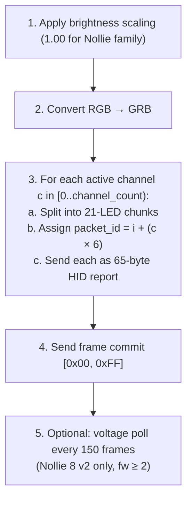
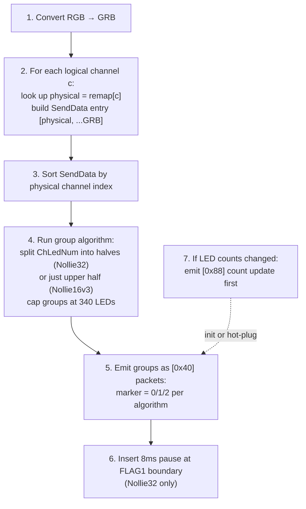
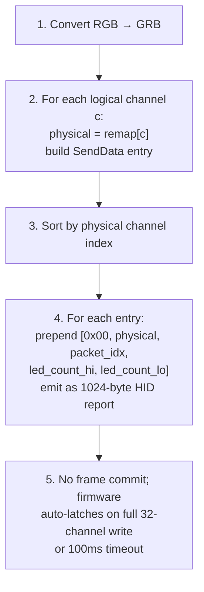

# 49 -- Nollie Protocol Driver

> Native USB HID driver for the Nollie ARGB controller family. Six controller variants across two protocol generations, with full coverage for the Nollie 28/12, Nollie1, Nollie 8 v2, Nollie16v3, and Nollie32 (including ATX/GPU Strimer cables).

**Status:** Draft
**Crate:** `hypercolor-hal`
**Module path:** `hypercolor_hal::drivers::nollie` (extends existing `prismrgb` module)
**Author:** Nova
**Date:** 2026-04-25
**Companion to:** Spec 20 (PrismRGB Protocol Driver) — Nollie 8 v2 and Prism 8 share the Gen-1 wire format defined there. This spec extends with three additional Nollie SKUs and the new Gen-2 wire format used by Nollie16v3 / Nollie32.

---

## Table of Contents

1. [Overview](#1-overview)
2. [Device Registry](#2-device-registry)
3. [Two Protocol Generations](#3-two-protocol-generations)
4. [Gen-1 Protocol (Nollie1, Nollie 8 v2, Nollie 28/12)](#4-gen-1-protocol)
5. [Gen-2 Protocol (Nollie16v3, Nollie32)](#5-gen-2-protocol)
6. [Nollie32 Strimer Cables](#6-nollie32-strimer-cables)
7. [HAL Integration](#7-hal-integration)
8. [Render Pipelines](#8-render-pipelines)
9. [Cross-Validation with OpenRGB](#9-cross-validation-with-openrgb)
10. [Testing Strategy](#10-testing-strategy)
11. [Appendices](#11-appendices)

---

## 1. Overview

Nollie is a Chinese ARGB controller OEM whose lineup spans single-channel inline strips, eight-channel mid-range hubs, and 16/20/32-channel professional hubs with optional ATX-24 and PCIe-8 Strimer cable attachments. The lineup is distributed under both the **Nollie** brand (USB VIDs `0x16D2`, `0x3061`, `0x16D5`) and the **PrismRGB** US-facing reseller brand (USB VIDs `0x16D5`, `0x16D0`). Spec 20 already covers Prism 8 (`0x16D5:0x1F01`) and Nollie 8 v2 (`0x16D2:0x1F01`) under a shared Gen-1 protocol implementation.

This spec extends Hypercolor's coverage to the rest of the Nollie family: the entry-level **Nollie1**, the recently-added **Nollie 28/12** mid-range, and the high-end **Nollie16v3** and **Nollie32** which use a completely new wire format (1024-byte HID reports, grouped multi-channel packets, physical channel remapping). The Nollie32 additionally exposes Strimer-style ATX-24 and dual/triple PCIe-8 cable subdevices that mirror the Lian Li Strimer Plus visually but speak the Nollie protocol.

### Goals

- Full byte-level wire format for every Nollie SKU SignalRGB ships
- Cross-validated against OpenRGB's GPL-2.0 `NollieController` implementation
- Single `Protocol` impl module that handles all Gen-1 and Gen-2 SKUs through a `NollieModel` enum
- First-class Strimer cable support (mode byte, per-cable packet generation, subdevice topology hints)
- Tests cover packetization, channel remap, group markers, color encoding, init/shutdown, mode switching

### Non-goals

- Driver-level support for hardware effect playback (we always stream; the hardware effect is the idle fallback only)
- Firmware flashing (no public bootloader path)
- USB CDC / virtual-COM transports (Nollie is HID-only)
- Mixing Strimer cables with main channels in a single zone (kept as separate subdevices)

### Relationship to Other Specs

- **Spec 20 (PrismRGB Protocol Driver):** Defines the Gen-1 base for Prism 8 and Nollie 8 v2. This spec **extends** that module rather than duplicating it. The shared `PrismRgbProtocol` becomes `NollieGen1Protocol` internally with a wider model enum, OR the existing `PrismRgbProtocol` accepts new model variants (`Nollie1`, `Nollie28_12`, `Nollie16v3`, `Nollie32`). Section 7 specifies the recommended factoring.
- **Spec 16 (HAL):** Provides the `Protocol` and `Transport` traits this driver implements. Gen-2 may need a new `report_size` capability advertised by `UsbHidTransport`.
- **Spec 19 (Lian Li Uni Hub):** Shares the Strimer Plus visual aesthetic for Nollie32's Strimer subdevices, but the wire formats are unrelated.

---

## 2. Device Registry

### 2.1 Controller Variants

| Device              | VID      | PID(s)                       | Generation | Channels               | LEDs/Channel | Max LEDs                       | Color Format | HID Report Size |
| ------------------- | -------- | ---------------------------- | ---------- | ---------------------- | ------------ | ------------------------------ | ------------ | --------------- |
| **Nollie1**         | `0x16D2` | `0x1F11`                     | Gen-1      | 1                      | 525–630      | 525–630                        | GRB          | 65              |
| **Nollie 8 v2**     | `0x16D2` | `0x1F01`                     | Gen-1      | 8                      | 126          | 1,008                          | GRB          | 65              |
| **Nollie 28/12**    | `0x16D2` | `0x1616`, `0x1617`, `0x1618` | Gen-1      | 12                     | 42           | 504                            | GRB          | 65              |
| **Nollie16v3**      | `0x3061` | `0x4716`                     | Gen-2      | 16                     | 256          | 4,096                          | GRB          | 1024            |
| **Nollie32**        | `0x3061` | `0x4714`                     | Gen-2      | 20 + ATX + GPU Strimer | 256          | 5,120 main (+ up to 390 cable) | GRB          | 1024            |
| _Prism 8_ (spec 20) | `0x16D5` | `0x1F01`                     | Gen-1      | 8                      | 126          | 1,008                          | GRB          | 65              |

The "OS2 firmware" alias VID `0x16D5` may also surface for re-flashed Nollie units; treat it as a firmware-distinguished variant of Nollie 8.

### 2.2 LED-count Disambiguation (Nollie1) — UNRESOLVED

OpenRGB's header defines `NOLLIE_FS_CH_LED_NUM = 525`; SignalRGB's plugin hard-codes `ChannelLedNum = 630`. Both values are present in shipping code, but we have **no evidence** of a firmware-version-keyed split: SignalRGB's plugin doesn't gate on firmware, and OpenRGB's `RGBController_Nollie.cpp` uses `630` for the Nollie1 path despite defining `525` as a constant.

The driver should:

1. **Default to 630** LEDs per channel for Nollie1 (matches SignalRGB and OpenRGB's actual code path).
2. Treat `525` as a **compatibility fallback**: if the firmware rejects an `0xFE 0x03` update with 630, retry with 525.
3. Query firmware version via `0xFC 0x01` at init and surface it in device metadata for diagnostics.
4. Capture the actual cap discovery in real hardware testing and update this spec with the observed firmware behavior.

This is an **open question** — we should not ship the 525-vs-630 firmware-threshold rule as fact until validated on hardware.

### 2.3 Per-PID Notes for Nollie 28/12

Three PIDs identify cosmetic variants of the same Gen-1 12-channel controller (different PCB color, same firmware). All three should resolve to `NollieModel::Nollie28_12` and share the entire protocol implementation. The "28/12" naming reflects the maximum LED count quoted by Nollie marketing (28 strips × 12 LEDs = 336, or 12 channels × 42 LEDs = 504, depending on the configuration).

### 2.4 Protocol Database Registration

```rust
// New entries to add alongside the existing PrismRGB family in
// crates/hypercolor-hal/src/drivers/prismrgb/devices.rs.

prismrgb_device!(NOLLIE_1,        0x16D2, 0x1F11, "Nollie 1",        Nollie1);
prismrgb_device!(NOLLIE_28_12_A,  0x16D2, 0x1616, "Nollie 28/12",    Nollie28_12);
prismrgb_device!(NOLLIE_28_12_B,  0x16D2, 0x1617, "Nollie 28/12",    Nollie28_12);
prismrgb_device!(NOLLIE_28_12_C,  0x16D2, 0x1618, "Nollie 28/12",    Nollie28_12);
prismrgb_device!(NOLLIE_16_V3,    0x3061, 0x4716, "Nollie 16 v3",    Nollie16v3);
prismrgb_device!(NOLLIE_32,       0x3061, 0x4714, "Nollie 32",       Nollie32);
```

The `NollieModel` variants extend the existing `PrismRgbModel` enum (see §7.1 for the recommended factoring).

---

## 3. Two Protocol Generations

The Nollie family splits cleanly into two protocol generations. They share command-byte vocabulary but differ in wire format, packetization strategy, and channel addressing.

### 3.1 Generation Comparison

| Property               | Gen-1                                                     | Gen-2                                                   |
| ---------------------- | --------------------------------------------------------- | ------------------------------------------------------- |
| Devices                | Nollie1, Nollie 8 v2, Nollie 28/12, Prism 8               | Nollie16v3, Nollie32                                    |
| HID report size        | 65 bytes                                                  | 1024 bytes (color data), 513 bytes (settings)           |
| Packet addressing      | `packet_id = packet_index + (channel × 6)`                | `[0x40, ch_start, ch_end, marker, ...]` grouped         |
| Max LEDs per packet    | 21                                                        | 256 (per channel slot in a group)                       |
| Max LEDs per group     | n/a                                                       | 340 (cumulative across grouped channels)                |
| Frame commit           | Explicit `[0x00, 0xFF]` 65-byte packet                    | Implicit (last group's marker = 2)                      |
| LED count config       | `[0xFE, 0x03, ch0_lo, ch0_hi, ...]`                       | `[0x88, ch0_hi, ch0_lo, ch1_hi, ch1_lo, ...]` 1024-byte |
| Settings save          | `[0xFE, 0x02, ...]` (effect) + `[0xFE, 0x01, ...]` (mode) | `[0x80, mos, effect, R, G, B]` 513-byte                 |
| Channel remap          | None (logical = physical)                                 | Required (tables in §5.6)                               |
| Voltage monitoring     | Yes (Nollie 8 v2 firmware ≥ 2)                            | No                                                      |
| Firmware version query | Yes (`0xFC 0x01`)                                         | No (V1/V2 selectable in plugin)                         |

### 3.2 Color Encoding (both generations)

All Nollie devices, including the Strimer cable subdevices on Nollie32, transmit color data in **GRB byte order** (Green, Red, Blue per LED, three bytes per LED, no padding). Brightness scaling is `1.00` for all Nollie SKUs (no host-side reduction, unlike Prism 8's 0.75).

The Strimer cable code paths in the Nollie32 SignalRGB plugin re-order the color triples manually (`color[1], color[0], color[2]`), which is equivalent to GRB if the input is RGB. This is a quirk of the SignalRGB API: main-channel data is requested as `getColors("Inline", "GRB")` and emerges already-reordered, while subdevice colors are requested as raw RGB and the plugin swaps R/G inline. Hypercolor's encoding path applies a single `to_grb()` helper at the boundary, so the distinction disappears.

### 3.3 Common Command Vocabulary

| Byte   | Generation | Position | Purpose                                                    |
| ------ | ---------- | -------- | ---------------------------------------------------------- |
| `0xFC` | Gen-1      | offset 1 | Read commands (firmware version, channel counts, voltage)  |
| `0xFE` | Gen-1      | offset 1 | Config writes (channel counts, hardware effect, mode/save) |
| `0xFF` | Gen-1      | offset 1 | Frame commit                                               |
| `0x40` | Gen-2      | offset 1 | Color data (grouped multi-channel packet)                  |
| `0x80` | Gen-2      | offset 1 | Settings save (mode + hardware effect + idle color)        |
| `0x88` | Gen-2      | offset 1 | LED count config                                           |
| `0xFF` | Gen-2      | offset 1 | Shutdown latch (513-byte packet)                           |

Both generations use report ID `0x00` at offset 0 in every packet.

### 3.4 Inter-Packet Timing

OpenRGB's `NollieController` enforces per-model inter-packet delays, observed empirically to avoid USB queue overruns:

| Model                                   | Inter-packet delay |
| --------------------------------------- | ------------------ |
| Nollie1                                 | 30ms               |
| Nollie 8 v2                             | 6ms                |
| Nollie 28/12                            | 2ms                |
| Nollie16v3 / Nollie32                   | 25ms               |
| Nollie32 FLAG1 → FLAG2 channels (Gen-2) | 8ms additional     |

Hypercolor's render loop already enforces a minimum frame interval, so these delays are mostly redundant at 60fps. The driver should still emit them on `init_sequence()` boundaries (where back-to-back command writes are unbuffered) and between FLAG1/FLAG2 writes for Nollie32 (see §5.7).

---

## 4. Gen-1 Protocol

This section covers Nollie1, Nollie 8 v2, and Nollie 28/12. The protocol is identical to the Prism 8 implementation defined in Spec 20 §4, with three parameterized variations:

| SKU                 | Channels | LEDs/ch (max)               | Packets/ch | Brightness | Voltage Monitoring                                         |
| ------------------- | -------- | --------------------------- | ---------- | ---------- | ---------------------------------------------------------- |
| Nollie1             | 1        | 525 (fw < 2) / 630 (fw ≥ 2) | 25 / 30    | 1.00       | No (single-channel; firmware doesn't expose voltage rails) |
| Nollie 8 v2         | 8        | 126                         | 6          | 1.00       | Yes (every 150 frames if fw ≥ 2)                           |
| Nollie 28/12        | 12       | 42                          | 2          | 1.00       | Unknown — driver assumes No                                |
| _Prism 8 (spec 20)_ | 8        | 126                         | 6          | 0.75       | Yes                                                        |

### 4.1 Packet Addressing — Per-Model Multiplier

Spec 20 documents the formula `packet_id = packet_index + (channel × 6)` for Prism 8 / Nollie 8 v2. SignalRGB's Nollie1 plugin uses the same `× 6` literal even though the device has only one channel ([Nollie1.js:149](file:///home/bliss/app-2.5.51/Signal-x64/Plugins/Nollie/Nollie1.js)) — which is harmless because `channel` is always `0` there. Whether the multiplier is **truly fixed at 6 in firmware** or a per-PID parameter is **not yet verified** for Nollie 28/12.

OpenRGB's `NollieController.cpp` uses **per-PID packet intervals** rather than a fixed `× 6`:

- Nollie 28/12 → interval `2`
- Nollie 8 → interval `6`
- Nollie 1 → interval `30`

These intervals match the per-channel packet count for each SKU. So OpenRGB's model is `packet_id = packet_index + (channel × packet_interval)` where `packet_interval` is configured per device — packet IDs are dense across all channels.

```
Nollie1 (1 channel × 30 packets, interval 30):
  Channel 0: packets 0..29 (only one channel so multiplier is moot)

Nollie 8 v2 (8 channels × 6 packets, interval 6):
  Channel 0: packets 0..5
  Channel 1: packets 6..11
  ...
  Channel 7: packets 42..47

Nollie 28/12 (12 channels × 2 packets, interval 2 — OpenRGB model):
  Channel 0: packets 0, 1
  Channel 1: packets 2, 3
  Channel 2: packets 4, 5
  ...
  Channel 11: packets 22, 23

Nollie 28/12 (alternative — fixed × 6 model):
  Channel 0: packets 0, 1
  Channel 1: packets 6, 7
  Channel 2: packets 12, 13
  ...
  Channel 11: packets 66, 67
```

**Status:** UNVERIFIED for Nollie 28/12. We have no SignalRGB plugin and no captured packet trace. The driver should be implemented with a **`packet_interval` configuration field per model** so we can switch between OpenRGB's "interval = packets-per-channel" model and the fixed-`× 6` model based on hardware testing. Default to OpenRGB's model (interval `2`) for Nollie 28/12 since OpenRGB has hardware-validated their value, and provide a fallback config flag.

For Nollie1, Nollie 8 v2, and Prism 8 (where the plugins are explicit and confirmed), use the existing `× 6` literal. These are not in question.

### 4.2 Init Sequence

The full Gen-1 init sequence is identical to Spec 20 §4.1:

1. `[0x00, 0xFC, 0x01]` — query firmware version, read 65 bytes back, parse `version = response[2]`.
2. `[0x00, 0xFC, 0x03]` — query channel LED counts, read 65 bytes back, parse 8 × uint16 big-endian. For Nollie1 only the first uint16 is meaningful; for Nollie 28/12 read 12 × uint16.
3. `[0x00, 0xFE, 0x02, 0x00, R, G, B, 0x64, 0x0A, 0x00, 0x01]` — set hardware effect to static idle color.

If the host's intended channel LED counts differ from the firmware's reported counts (e.g., user attached longer strips), emit:

4. `[0x00, 0xFE, 0x03, ch0_lo, ch0_hi, ch1_lo, ch1_hi, ...]` — update channel counts, **little-endian** (the asymmetry from Spec 20 §4.4 applies).

### 4.3 Frame Encoding

For each frame:

1. For each active channel `c` in `[0, channel_count)`:
   - Take `min(led_count, max_leds[c])` colors from the spatial engine, encode as GRB.
   - Split into 21-LED chunks: `num_packets = ceil(led_count / 21)`.
   - For each chunk `i` in `[0, num_packets)`:
     - Emit packet `[0x00, i + (c × packet_interval), G0, R0, B0, G1, R1, B1, ..., G20, R20, B20]`, zero-padded to 65 bytes.
     - `packet_interval` is `6` for Nollie 8 v2 / Prism 8, `30` for Nollie1 (single channel — value is moot), and tentatively `2` for Nollie 28/12 (see §4.1 for the open question).
2. Emit frame commit: `[0x00, 0xFF]`, zero-padded to 65 bytes — **but only for SKUs that ship one**. See §4.3.1.

#### 4.3.1 Frame-Commit Variance

The frame commit packet `[0x00, 0xFF]` is **not** universal across Gen-1 SKUs:

| SKU          | Frame Commit | Source                                                                                                                                                                                |
| ------------ | ------------ | ------------------------------------------------------------------------------------------------------------------------------------------------------------------------------------- |
| Prism 8      | Yes          | Spec 20 §4.2                                                                                                                                                                          |
| Nollie 8 v2  | Yes          | [Nollie8 v2.js:141-142](file:///home/bliss/app-2.5.51/Signal-x64/Plugins/Nollie/Nollie8%20v2.js)                                                                                      |
| **Nollie1**  | **No**       | [Nollie1.js:106-113](file:///home/bliss/app-2.5.51/Signal-x64/Plugins/Nollie/Nollie1.js) — the render function returns immediately after the per-channel sends, with no commit packet |
| Nollie 28/12 | Unknown      | No reference implementation available                                                                                                                                                 |

The Nollie1 firmware auto-latches when the channel's color stream completes (or when a packet with fewer than 21 LEDs of data is observed). For the driver:

- **Nollie 8 v2 / Prism 8:** emit frame commit unconditionally, every frame.
- **Nollie1:** **omit** the frame commit packet during normal rendering. Send it once during shutdown to fully flush the firmware buffer.
- **Nollie 28/12:** treat as Nollie 8 (emit commit) **provisionally**; revisit after hardware testing.

This is a per-SKU capability flag the `NollieModel` enum must track.

### 4.4 Voltage Monitoring (Nollie 8 v2 only — confirmed)

When firmware version ≥ 2, every 150 frames the driver issues `[0x00, 0xFC, 0x1A]` and reads 65 bytes back. Bytes `[1..7]` decode as three uint16-LE millivolt readings: `usb`, `sata1`, `sata2`. The values surface through the daemon's device-metrics bus (see Spec 47) and inform low-power-saver fallback if SATA voltages dip.

**Per-SKU support:**

| SKU               | Voltage Polling                                                                                                           |
| ----------------- | ------------------------------------------------------------------------------------------------------------------------- |
| Nollie 8 v2       | Confirmed — implemented in [Nollie8 v2.js:62-85](file:///home/bliss/app-2.5.51/Signal-x64/Plugins/Nollie/Nollie8%20v2.js) |
| Nollie1           | Plugin omits voltage polling; rails likely absent (single-channel inline strip)                                           |
| Nollie 28/12      | **Unknown** — no plugin and no OpenRGB voltage path; may or may not respond to `0xFC 0x1A`                                |
| Prism 8 (spec 20) | Confirmed (same code path as Nollie 8 v2)                                                                                 |

The driver should:

- Enable voltage polling for Nollie 8 v2 / Prism 8 only by default.
- Treat Nollie1 and Nollie 28/12 as **disabled-by-default** with a runtime probe: send `0xFC 0x1A` once at init; if the response is all zeros, leave polling disabled. If non-zero readings come back, surface them with a "voltage support detected" log line and enable steady-state polling.

### 4.5 Shutdown Sequence

Identical to Spec 20 §4.5:

1. Send a final frame with the configured idle color (GRB-encoded) on every channel.
2. Emit frame commit `[0x00, 0xFF]`.
3. Re-emit the hardware effect packet `[0x00, 0xFE, 0x02, 0x00, R, G, B, ...]` so the firmware retains the idle color when the host disconnects.
4. Activate hardware mode: `[0x00, 0xFE, 0x01, 0x00]`.

---

## 5. Gen-2 Protocol

Nollie16v3 and Nollie32 use a completely new wire format. The fundamental change: HID reports balloon to **1024 bytes** (color data) and **513 bytes** (settings/shutdown), and color data for **multiple channels is packed into a single grouped packet** rather than one packet per chunk per channel.

### 5.1 Packet Sizes

| Packet Type      | Size       | Used For                                                                                  |
| ---------------- | ---------- | ----------------------------------------------------------------------------------------- |
| Color data       | 1024 bytes | Grouped channel color frames (`0x40` header) and V1 standalone channel (no `0x40` header) |
| LED count config | 1024 bytes | `0x88` channel-count update                                                               |
| Settings save    | 513 bytes  | `0x80` mode + idle color                                                                  |
| Shutdown latch   | 513 bytes  | `0xFF` shutdown trigger                                                                   |

**On-the-wire size is 1024 / 513 bytes including the report ID at offset 0.** This is the size SignalRGB's plugin passes to `device.write()` ([Nollie32.js:391](file:///home/bliss/app-2.5.51/Signal-x64/Plugins/Nollie/Nollie32.js), [Nollie32.js:576](file:///home/bliss/app-2.5.51/Signal-x64/Plugins/Nollie/Nollie32.js)) and is what our existing `UsbHidTransport` already supports (see [`crates/hypercolor-hal/src/transport/hid.rs`](../../crates/hypercolor-hal/src/transport/hid.rs) — variable-size writes around lines 418/422).

OpenRGB's header annotates these as `1025`/`514` because some `hidapi` builds inject an extra prefix byte at the host abstraction layer. We do not use `hidapi`; `nusb` writes the buffer verbatim. **Verified operationally** through SignalRGB's plugin behavior (which targets the same firmware via `hidapi` underneath but with the report ID embedded in the buffer SignalRGB hands it). Hardware testing should confirm.

### 5.2 LED Count Config — `0x88`

```
WRITE → 1024 bytes
┌────────┬──────┬──────┬──────────────────────────────────┐
│ Offset │ Size │ Value│ Description                       │
├────────┼──────┼──────┼──────────────────────────────────┤
│ 0      │ 1    │ 0x00 │ Report ID                        │
│ 1      │ 1    │ 0x88 │ LED count config marker           │
│ 2-3    │ 2    │      │ Physical channel 0 LED count     │
│        │      │      │   byte 2 = high, byte 3 = low    │
│ 4-5    │ 2    │      │ Physical channel 1 LED count      │
│ ...    │ ...  │      │ ... 32 channels total             │
│ 64-65  │ 2    │      │ Physical channel 31 LED count     │
│ 66-1023│ 958  │ 0x00 │ Zero padding                      │
└────────┴──────┴──────┴──────────────────────────────────┘

Channel ordering is by PHYSICAL index (0..31), not logical. The
channel index remap table (§5.6) maps user-facing logical channels
to physical slots BEFORE this packet is built.

Bytes are written high-then-low (big-endian uint16) per channel.
```

The driver emits this packet only when channel LED counts change between frames (memoize the previous values). On steady-state rendering this packet is silent.

### 5.3 Color Data — `0x40` Grouped Multi-Channel Packet

This is the per-frame data carrier. A single 1024-byte packet may carry color data for one or more consecutive (in physical-index order) channels.

```
WRITE → 1024 bytes
┌────────┬──────┬──────┬──────────────────────────────────┐
│ Offset │ Size │ Value│ Description                       │
├────────┼──────┼──────┼──────────────────────────────────┤
│ 0      │ 1    │ 0x00 │ Report ID                        │
│ 1      │ 1    │ 0x40 │ Color data marker                 │
│ 2      │ 1    │      │ Group start — physical channel    │
│        │      │      │   index of first channel in group │
│ 3      │ 1    │      │ Group end — physical channel      │
│        │      │      │   index of last channel in group  │
│ 4      │ 1    │      │ Marker (0, 1, or 2)               │
│ 5+     │ var  │      │ Concatenated GRB color data,      │
│        │      │      │   per channel, in physical order  │
│ ...    │ ...  │ 0x00 │ Zero padding to 1024 bytes        │
└────────┴──────┴──────┴──────────────────────────────────┘
```

The marker byte semantics:

| Marker | Meaning                                                        |
| ------ | -------------------------------------------------------------- |
| `0`    | Continuation packet (more groups follow)                       |
| `1`    | End of FLAG1 region (Nollie32 lower-half boundary)             |
| `2`    | End of FLAG2 region / final group of frame (latches the frame) |

Marker `2` acts as the implicit frame commit; no separate `0xFF` packet is needed during normal rendering.

### 5.4 Settings Save — `0x80`

```
WRITE → 513 bytes
┌────────┬──────┬──────┬──────────────────────────────────┐
│ Offset │ Size │ Value│ Description                       │
├────────┼──────┼──────┼──────────────────────────────────┤
│ 0      │ 1    │ 0x00 │ Report ID                        │
│ 1      │ 1    │ 0x80 │ Settings save marker              │
│ 2      │ 1    │      │ MOS byte (Nollie32 only):         │
│        │      │      │   0x00 = Triple 8-pin GPU         │
│        │      │      │   0x01 = Dual 8-pin GPU           │
│        │      │      │   Always 0x00 for Nollie16v3      │
│ 3      │ 1    │      │ Hardware effect mode:             │
│        │      │      │   0x01 = Nollie animated effect   │
│        │      │      │   0x03 = Static idle color        │
│ 4      │ 1    │      │ Idle color R                      │
│ 5      │ 1    │      │ Idle color G                      │
│ 6      │ 1    │      │ Idle color B                      │
│ 7-512  │ 506  │ 0x00 │ Zero padding                      │
└────────┴──────┴──────┴──────────────────────────────────┘

REQUIRED: 50ms pause after this write before sending any further
packets. The firmware commits to NVRAM during this window.
```

### 5.5 Shutdown Latch — `0xFF`

After settings save, the shutdown sequence ends with a 513-byte latch packet:

```
WRITE → 513 bytes: [0x00, 0xFF, 0x00, 0x00, ..., 0x00]
                   followed by 50ms pause.
```

This signals the controller to enter hardware-only mode using the just-saved settings.

### 5.6 Channel Index Remap Tables

Logical channels (what the user sees in the UI / spatial layout) map to physical channel indices (what the firmware addresses) through fixed remap tables.

#### Nollie16v3

```rust
const NOLLIE16V3_CHANNEL_REMAP: [u8; 16] = [
    19, 18, 17, 16,   //  Logical channels  0..3 → physical 19,18,17,16
    24, 25, 26, 27,   //  Logical channels  4..7 → physical 24..27
    20, 21, 22, 23,   //  Logical channels  8..11 → physical 20..23
    31, 30, 29, 28,   //  Logical channels 12..15 → physical 31,30,29,28
];
```

All 16 logical channels map into the upper-half physical range `[16..31]`. The lower-half `[0..15]` is unused by Nollie16v3 firmware. The grouping logic in §5.3 iterates only `ChLedNum.slice(16, 32)`.

#### Nollie32

```rust
const NOLLIE32_MAIN_CHANNEL_REMAP: [u8; 20] = [
     5,  4,  3,  2,  1,  0,   // Logical channels  0..5  → physical 5,4,3,2,1,0
    15, 14,                   // Logical channels  6..7  → physical 15,14 (FLAG1)
    26, 27, 28, 29, 30, 31,   // Logical channels  8..13 → physical 26..31
     8,  9,                   // Logical channels 14..15 → physical 8,9
    13, 12, 11, 10,           // Logical channels 16..19 → physical 13,12,11,10
];

const NOLLIE32_ATX_CABLE_REMAP: [u8; 6] = [
    19, 18, 17, 16, 7, 6,
];

const NOLLIE32_GPU_CABLE_REMAP: [u8; 6] = [
    25, 24, 23, 22, 21, 20,
];
```

Physical channels 15 and 31 are the **FLAG1** and **FLAG2** boundary channels respectively. The firmware uses the marker byte at the end of each FLAG channel's packet to detect frame partitioning. See §5.7.

### 5.7 Group + Marker Algorithm (Nollie32)

The algorithm groups channels into 1024-byte packets that fit within a per-group cap of **340 LEDs** (sum of LED counts across the channels in the group). For Nollie32 specifically:

```
Step 1: Build SendData[] entries — one per packet per active channel.
        For V2, each entry is: [physical_ch_idx, ...GRB_data].
        Sort SendData by physical_ch_idx ascending.

Step 2: Split ChLedNum (length 32) into two halves:
          Group_A = ChLedNum[0..16]   (lower half, FLAG1 region)
          Group_B = ChLedNum[16..32]  (upper half, FLAG2 region)

Step 3: For each half independently, group consecutive non-zero entries
        with cumulative LED count ≤ 340 per group.

Step 4: Concatenate the two halves' groups into a single ordered list.
        Track index `k_FLAG1_last` = last group ending in lower half.
        Track index `k_FLAG2_last` = last group overall.

Step 5: Emit each group as one [0x40] packet:
          marker = 0          (default)
          marker = 1          (this group is k_FLAG1_last)
          marker = 2          (this group is k_FLAG2_last)
```

**FLAG1 → FLAG2 inter-packet delay (V1 path only):** OpenRGB's `NollieController.cpp` inserts an 8ms sleep between the FLAG1 and FLAG2 region writes ([NollieController.cpp:136](https://gitlab.com/CalcProgrammer1/OpenRGB/-/blob/master/Controllers/NollieController/NollieController.cpp)). However, this delay applies to OpenRGB's per-channel send model (closer to our **V1** standalone-channel path in §5.8), **not** the SignalRGB V2 grouped path. SignalRGB's Nollie32 plugin V2 codepath ([Nollie32.js:308-309](file:///home/bliss/app-2.5.51/Signal-x64/Plugins/Nollie/Nollie32.js)) issues group packets back-to-back with no inter-packet delay.

The driver should:

- **V2 path:** No inter-group delay. Emit groups back-to-back.
- **V1 path:** 8ms pause between any FLAG1-region (physical channels `[0..16)`) and FLAG2-region (physical channels `[16..32)`) writes, matching OpenRGB.

Nollie16v3 uses the same algorithm as V2 but only the upper half (Group_B); marker `1` never appears, and `marker = 2` is set on the final packet only.

### 5.8 V1 vs V2 Protocol (Nollie32 only)

Nollie32 firmware accepts two render protocols, selectable at runtime:

- **V1 (legacy, default):** Each `SendData[]` entry is sent as its own 1024-byte packet **without** the `[0x40, ch_start, ch_end, marker]` header. Instead, the format is:

  ```
  [0x00, physical_ch_idx, packet_index, led_count_hi, led_count_lo, ...GRB_data]
  ```

  Each channel's packets are independently transmitted; the firmware buffers them and latches when all 32 physical channels have been written (or a timeout elapses).

- **V2 (grouped, recommended):** Multi-channel packets with `[0x40, ch_start, ch_end, marker]` headers as described in §5.3. The marker `2` provides the explicit frame latch.

V2 is faster (fewer USB transactions) and more reliable (explicit frame boundary). The driver should emit V2 by default and only fall back to V1 if the user explicitly opts in via attachment profile.

For V1 the per-channel packet template is:

```
WRITE → 1024 bytes
┌────────┬──────┬────────────────────────────────────────┐
│ Offset │ Size │ Description                             │
├────────┼──────┼────────────────────────────────────────┤
│ 0      │ 1    │ Report ID: 0x00                        │
│ 1      │ 1    │ Physical channel index (from remap)    │
│ 2      │ 1    │ Packet index within channel            │
│ 3-4    │ 2    │ Channel total LED count (uint16-BE)    │
│ 5+     │ var  │ GRB color data                         │
│ ...    │ ...  │ Zero padding to 1024 bytes              │
└────────┴──────┴────────────────────────────────────────┘
```

Nollie16v3 supports V2 only.

---

## 6. Nollie32 Strimer Cables

The Nollie32 controller supports up to two simultaneous Strimer cable subdevices: one ATX-24 cable and one PCIe-8 GPU cable (dual or triple variant). When connected, these cables consume specific physical channel slots and have fixed LED layouts.

### 6.1 Cable Variants

| Cable                        | LED Count | Grid (cols × rows) | Physical Channels                       | LEDs/Packet |
| ---------------------------- | --------- | ------------------ | --------------------------------------- | ----------- |
| **24-pin ATX Strimer**       | 120       | 20 × 6             | `[19, 18, 17, 16, 7, 6]` (6 channels)   | 20          |
| **Dual 8-pin GPU Strimer**   | 108       | 27 × 4             | `[25, 24, 23, 22]` (4 channels)         | 27          |
| **Triple 8-pin GPU Strimer** | 162       | 27 × 6             | `[25, 24, 23, 22, 21, 20]` (6 channels) | 27          |

Each Strimer "channel" is a horizontal row in the cable's LED grid. The driver renders the user's spatial layout into the grid coordinate space, then slices it row-by-row into per-channel buffers.

### 6.2 Strimer Packet Format (V1 layout, per cable channel)

```
WRITE → 1024 bytes
┌────────┬──────┬──────┬──────────────────────────────────┐
│ Offset │ Size │ Value│ Description                       │
├────────┼──────┼──────┼──────────────────────────────────┤
│ 0      │ 1    │ 0x00 │ Report ID                        │
│ 1      │ 1    │      │ Physical channel index from cable │
│        │      │      │   remap table (§5.6)              │
│ 2      │ 1    │ 0x00 │ Packet index = 0 (each row is one │
│        │      │      │   packet, fits in 1024 bytes)     │
│ 3-4    │ 2    │      │ LEDs in this row, uint16-BE:      │
│        │      │      │   ATX = 20, GPU = 27              │
│ 5+     │ var  │      │ GRB color data:                   │
│        │      │      │   ATX: 60 bytes (20 LEDs × 3)    │
│        │      │      │   GPU: 81 bytes (27 LEDs × 3)    │
│ ...    │ ...  │ 0x00 │ Zero padding to 1024 bytes        │
└────────┴──────┴──────┴──────────────────────────────────┘
```

When V2 is selected, Strimer-cable packets are merged into the standard `0x40` grouped packets exactly like main channels — the cable rows are simply additional logical channels with non-zero LED counts. The grouping algorithm (§5.7) handles them transparently.

### 6.3 GPU Mode Byte

The MOS byte in the settings-save packet (§5.4 byte 2) selects between dual and triple GPU cable models:

| GPU Cable              | MOS byte |
| ---------------------- | -------- |
| Triple 8-pin (default) | `0x00`   |
| Dual 8-pin             | `0x01`   |

Setting the MOS byte tells the firmware how to drive the MOSFETs that switch power to the cable strands. Setting it incorrectly with the wrong cable connected can damage the cable's MOSFETs, so the driver should:

1. Read the cable type from the user's attachment profile (similar to Prism S in Spec 20 §5).
2. Validate the user's selection matches the physical hardware before writing settings.
3. Save the validated MOS byte during init **and** on every cable-type change event.

### 6.4 Cable Topology Hints

Hypercolor exposes Strimer cables as separate device-attachment subdevices, mirroring the Lian Li Strimer Plus pattern from Spec 19. The `Protocol::zones()` for Nollie32 returns:

- 20 main-channel `Strip` zones (variable LED counts based on user's attached strips).
- One `Matrix(20, 6)` zone for the ATX-24 Strimer (if attached).
- One `Matrix(27, 4)` zone for Dual 8-pin OR `Matrix(27, 6)` for Triple 8-pin (if attached).

Attachment profiles for Nollie32 mirror the Prism S structure (`atx_present: bool`, `gpu_cable: GpuCableType`), with a third field `protocol_version: ProtocolVersion` (V1 or V2).

---

## 7. HAL Integration

### 7.1 Recommended Factoring

The existing `PrismRgbProtocol` struct in `crates/hypercolor-hal/src/drivers/prismrgb/protocol.rs` already handles four models. Extending it to cover the Nollie family creates an awkward "PrismRGB-named driver covering many Nollie SKUs." Two options:

**Option A — Extend `PrismRgbProtocol` (recommended for now):**

Add new variants to `PrismRgbModel`:

```rust
pub enum PrismRgbModel {
    Prism8,
    Nollie8,
    PrismS,
    PrismMini,
    // New variants:
    Nollie1,
    Nollie28_12,
    Nollie16v3,
    Nollie32 { protocol_version: ProtocolVersion },
}

#[derive(Debug, Clone, Copy, PartialEq, Eq)]
pub enum ProtocolVersion {
    V1,
    V2,
}
```

The protocol's encode methods dispatch on the model variant. Gen-1 SKUs reuse `encode_prism8_frame_into()` (parameterized by channel count and per-channel LED cap). Gen-2 SKUs use new methods `encode_gen2_v1_frame_into()` and `encode_gen2_v2_frame_into()`.

**Pro:** No new module, minimal disruption to existing tests, clean reuse of Gen-1 logic.

**Con:** The struct name `PrismRgbProtocol` is misleading once it covers Nollie16v3/32 which are not PrismRGB at all.

**Option B — Split into two modules:**

Create `crates/hypercolor-hal/src/drivers/nollie/` as a sibling of `prismrgb/`. The `nollie` module owns Gen-2 (Nollie16v3, Nollie32) and any pure-Nollie-branded Gen-1 SKUs (Nollie1, Nollie 28/12). The `prismrgb` module continues to own Prism 8/S/Mini and Nollie 8 v2 (which is protocol-identical to Prism 8 and naturally lives there).

**Pro:** Cleaner naming, each module is conceptually coherent.

**Con:** Some duplication (Gen-1 packet builders shared between modules), larger refactor.

**Recommendation:** Start with Option A to ship Nollie support quickly. Plan Option B as a follow-up cleanup once the Gen-2 implementation is stable. Preserve the current test suite (Spec 20 §10) under Option A and add Nollie-specific tests alongside.

### 7.2 Capability Flags

Add Gen-2 capability flags to `Protocol::capabilities()`:

```rust
pub struct ProtocolCapabilities {
    pub max_fps: u32,
    pub supports_direct: bool,
    pub supports_brightness: bool,
    // New:
    pub max_report_size: usize,         // 65 for Gen-1, 1024 for Gen-2
    pub variable_report_sizes: bool,    // true for Gen-2 (1024 + 513 mix)
    pub channel_remap_required: bool,   // true for Gen-2
}
```

`UsbHidTransport` from Spec 16 already supports variable report sizes per write call; no transport changes needed.

### 7.3 Attachment Profiles

Nollie32 needs an attachment profile schema mirroring Prism S (Spec 20 §5):

```toml
# data/attachments/builtin/nollie/nollie-32-default.toml
[attachment]
device_family = "prism_rgb"
device_model = "nollie_32"
name = "Nollie 32 (default)"
description = "20 main channels, no Strimer cables"

[config]
atx_cable_present = false
gpu_cable_type = "none"   # "none", "dual_8_pin", "triple_8_pin"
protocol_version = "v2"

# Per-main-channel LED counts and topology hints:
[[main_channel]]
index = 0
led_count = 0
topology = "strip"
```

Built-in attachment fixtures we should ship:

| Fixture                         | Description                             |
| ------------------------------- | --------------------------------------- |
| `nollie-32-default.toml`        | Bare 20-channel hub, no cables          |
| `nollie-32-atx-only.toml`       | ATX-24 Strimer only                     |
| `nollie-32-atx-dual-gpu.toml`   | ATX-24 + Dual 8-pin GPU                 |
| `nollie-32-atx-triple-gpu.toml` | ATX-24 + Triple 8-pin GPU (most common) |
| `nollie-16v3-default.toml`      | Bare 16-channel hub                     |
| `nollie-1-default.toml`         | Single channel, 256 LEDs                |
| `nollie-1-pro.toml`             | Single channel, 525 LEDs (legacy fw)    |
| `nollie-1-pro-630.toml`         | Single channel, 630 LEDs (newer fw)     |
| `nollie-28-12-default.toml`     | 12 channels × 42 LEDs                   |

### 7.4 Daemon Integration

The daemon's `attachment_profiles` module (from Spec 20 §5.5) extends to handle Nollie32 cable configuration similarly to Prism S. The PUT endpoint at `/api/v1/devices/{id}/attachments` accepts updated `gpu_cable_type` and re-emits the settings-save packet with the new MOS byte.

Discovery in `daemon/src/discovery/device_helpers.rs` filters Nollie32 devices and applies their dynamic config the same way Prism S is handled today (Spec 20 §7.4).

---

## 8. Render Pipelines

### 8.1 Gen-1 Render Pipeline

Identical to Spec 20 §8.1, with model-parameterized channel count:



### 8.2 Gen-2 V2 Render Pipeline (Nollie16v3 / Nollie32)



### 8.3 Gen-2 V1 Render Pipeline (Nollie32 V1 mode)



### 8.4 Bandwidth Analysis

| Device                          | Mode     | Packets/Frame | Bytes/Frame          | At 60fps  |
| ------------------------------- | -------- | ------------- | -------------------- | --------- |
| Nollie1 (630 LEDs)              | Gen-1    | 30 + 1 commit | 31 × 65 = 2,015      | 121 KB/s  |
| Nollie 8 v2 (full 1,008)        | Gen-1    | 48 + 1 commit | 49 × 65 = 3,185      | 191 KB/s  |
| Nollie 28/12 (full 504)         | Gen-1    | 24 + 1 commit | 25 × 65 = 1,625      | 98 KB/s   |
| Nollie16v3 (full 4,096)         | Gen-2 V2 | ~13 groups    | ~13 × 1,024 = 13,312 | 800 KB/s  |
| Nollie32 main only (5,120 LEDs) | Gen-2 V2 | ~17 groups    | ~17 × 1,024 = 17,408 | 1.05 MB/s |
| Nollie32 + ATX + Triple GPU     | Gen-2 V2 | ~25 groups    | ~25 × 1,024 = 25,600 | 1.54 MB/s |
| Nollie32 + ATX + Triple GPU     | Gen-2 V1 | ~32 packets   | ~32 × 1,024 = 32,768 | 1.97 MB/s |

USB 2.0 High Speed (60 MB/s theoretical, ~25 MB/s practical for HID interrupt) accommodates all loads. USB 1.1 Full Speed (1.5 MB/s) is **insufficient** for Nollie32 at full LED density — the driver should detect Full Speed and degrade frame rate (cap at 30fps) or warn the user.

### 8.5 Timing Constraints

| Operation                          | Required Delay   | Notes                                                |
| ---------------------------------- | ---------------- | ---------------------------------------------------- |
| Gen-2 settings save (`0x80`)       | 50ms             | NVRAM commit window                                  |
| Gen-2 shutdown latch (`0xFF`)      | 50ms             | Firmware applies saved settings                      |
| Nollie32 FLAG1 → FLAG2 boundary    | 8ms              | OpenRGB-observed; mitigates buffer rollover          |
| Nollie1 inter-packet               | 30ms init only   | OpenRGB-observed; not enforced at steady-state 60fps |
| Nollie 8 v2 inter-packet           | 6ms init only    | Same                                                 |
| Nollie 28/12 inter-packet          | 2ms init only    | Same                                                 |
| Nollie16v3 / Nollie32 inter-packet | 25ms init only   | Same                                                 |
| Nollie 8 v2 voltage poll           | Every 150 frames | Skip if firmware < 2                                 |

The "init only" annotation means the delay applies between back-to-back command writes during init/shutdown; the render loop's 16.6ms frame interval (60fps) already exceeds the steady-state minimum.

---

## 9. Cross-Validation with OpenRGB

OpenRGB ships a GPL-2.0-or-later [`NollieController`](https://gitlab.com/CalcProgrammer1/OpenRGB/-/tree/master/Controllers/NollieController) submitted by `cnn1236661` (the Nollie OEM themselves) via merge requests [!1912](https://gitlab.com/CalcProgrammer1/OpenRGB/-/merge_requests/1912) and [!2225](https://gitlab.com/CalcProgrammer1/OpenRGB/-/merge_requests/2225). This is our second source for wire-format details. The implementation cross-validates against the SignalRGB plugin in the following ways:

### 9.1 Confirmed Matches

| Detail                            | SignalRGB Plugin     | OpenRGB                                                | This Spec                                               |
| --------------------------------- | -------------------- | ------------------------------------------------------ | ------------------------------------------------------- |
| HID report size (Gen-1)           | 65 bytes             | 65 bytes                                               | 65 bytes ✓                                              |
| Color order (main channels)       | GRB                  | GRB ("RGBGetGValue first")                             | GRB ✓                                                   |
| Init: firmware version query      | `[0xFC, 0x01]`       | `usb_buf[1] = 0xFC` write/read                         | `[0x00, 0xFC, 0x01]` ✓                                  |
| Init: channel LED counts          | `[0xFC, 0x03]`       | `usb_buf[1] = 0xFE; usb_buf[2] = 0x03` (write)         | `[0x00, 0xFE, 0x03]` to write, `[0xFC, 0x03]` to read ✓ |
| Frame commit (Gen-1)              | `[0x00, 0xFF]`       | `usb_buf[1] = 0xFF`                                    | `[0x00, 0xFF]` ✓                                        |
| Max LEDs per Gen-1 packet         | 21                   | 21                                                     | 21 ✓                                                    |
| `(num_colors / 21) + remainder`   | implicit `Math.ceil` | explicit `(num_colors / 21) + ((num_colors % 21) > 0)` | `ceil(num_colors / 21)` ✓                               |
| Packet ID formula                 | `i + ch × 6`         | `packet_id + (channel × packet_interval)`              | `i + (ch × 6)` ✓                                        |
| FLAG1 / FLAG2 channels (Nollie32) | physical 15 / 31     | `FLAG1_CHANNEL = 15`, `FLAG2_CHANNEL = 31`             | physical 15 / 31 ✓                                      |
| Nollie 28/12 LEDs/channel         | not in plugin        | `NOLLIE_12_CH_LED_NUM = 42`                            | 42 ✓                                                    |
| Nollie 8 LEDs/channel             | 126                  | `NOLLIE_8_CH_LED_NUM = 126`                            | 126 ✓                                                   |
| Nollie HS LEDs/channel            | 256                  | `NOLLIE_HS_CH_LED_NUM = 256`                           | 256 ✓                                                   |
| MOS byte position                 | settings byte 2      | `usb_buf[1] = 0x80; usb_buf[2] = mos_value`            | byte 2 in 0x80 packet ✓                                 |

### 9.2 Discrepancies

| Detail                | SignalRGB                                             | OpenRGB                         | Resolution                                                                                                                                                                                                              |
| --------------------- | ----------------------------------------------------- | ------------------------------- | ----------------------------------------------------------------------------------------------------------------------------------------------------------------------------------------------------------------------- |
| Gen-2 HID report size | 1024 (in `device.write(packet, 1024)`)                | "1025-byte reports" in summary  | Use **1024** on the wire for `nusb`. The `1025` figure in OpenRGB likely includes a `hidapi`-level prefix byte (some platforms inject one). `nusb` does not, so we write 1024 directly including report ID at offset 0. |
| Nollie1 LEDs/channel  | 630                                                   | `NOLLIE_FS_CH_LED_NUM = 525`    | Both are correct for different firmware revisions. Cap at 525 for fw < 2, 630 for fw ≥ 2 (§2.2).                                                                                                                        |
| Strimer color reorder | `color[1], color[0], color[2]` (manual swap from RGB) | not directly visible in summary | Both produce GRB output; SignalRGB just expresses it differently. Hypercolor uses a single `to_grb()` helper.                                                                                                           |

### 9.3 Open Questions

- **Nollie 28/12 PID disambiguation:** OpenRGB lists three PIDs (`0x1616`, `0x1617`, `0x1618`) but doesn't document the per-PID variant. We treat all three as the same protocol and surface the PID in the device name (e.g., `Nollie 28/12 (rev A)`) for diagnostic clarity.
- **Voltage monitoring on Nollie1 / Nollie 28/12:** OpenRGB's source doesn't expose voltage rails for these models; SignalRGB's plugin only polls voltage on Nollie 8 v2. Until we confirm with hardware, **disable** voltage polling on Nollie1 and Nollie 28/12.
- **Firmware version branching for Gen-2:** OpenRGB doesn't query firmware version on Nollie16v3 / Nollie32 at all; SignalRGB's V1/V2 toggle is a user-facing combobox, not a firmware-detected capability. Default to V2 unless the user selects V1 via attachment profile.

### 9.4 License Hygiene

OpenRGB is GPL-2.0-or-later. Hypercolor is Apache-2.0. We MUST NOT copy code from OpenRGB; only the wire-format facts (byte layouts, command codes) are uncopyrightable interface specifications and free to document independently. This spec cites the OpenRGB source as a confirmation reference, not a derivation source. Our implementation is clean-room, written from the SignalRGB plugin observations and the wire-format synthesis in this spec.

---

## 10. Testing Strategy

### 10.1 Mock Transport Extensions

Extend `MockPrismTransport` from Spec 20 §10.1 to support variable report sizes:

```rust
pub struct MockNollieTransport {
    /// All packets sent, with their wire size (65 for Gen-1, 1024/513 for Gen-2).
    pub sent: Vec<(usize, Vec<u8>)>,
    /// Pre-configured responses for read commands.
    pub responses: VecDeque<Vec<u8>>,
}
```

### 10.2 Gen-1 Tests (Nollie1, Nollie 28/12)

For each new Gen-1 SKU:

- **Init sequence:** Verify the three-step init produces expected bytes for each variant. Nollie1 firmware query reads back a different byte width than Nollie 8 v2 (1 channel × uint16 vs 8 channels × uint16); confirm parser handles both.
- **Packet addressing:** For Nollie 28/12 (12 channels × 2 packets each), verify packet IDs are `0, 1, 6, 7, 12, 13, ..., 66, 67`. For Nollie1 (1 channel × up to 30 packets), verify IDs are `0..29` densely.
- **LED count cap negotiation (Nollie1):** With mocked firmware version 1, verify the driver caps LED count at 525. With version 2+, cap at 630.
- **Color encoding:** GRB byte order, brightness 1.00 (no scaling), zero-padding in the final packet.
- **Frame commit:** `[0x00, 0xFF]` is sent exactly once per frame, after all channel data.

### 10.3 Gen-2 V2 Tests (Nollie16v3, Nollie32)

- **LED count config (`0x88`):** Verify only emitted when counts change. Verify byte order: physical channel 0 high+low, then channel 1 high+low, etc.
- **Color data (`0x40`) packet structure:** ch_start, ch_end, marker bytes at offsets 2, 3, 4. GRB color data starts at offset 5.
- **Group algorithm:**
  - Single channel of 256 LEDs → one group, marker = 2.
  - Two channels of 200 LEDs each (sum 400 > 340 cap) → two groups, markers `[0, 2]`.
  - Nollie32 with 16 main channels in lower half + 16 in upper half → groups split at the FLAG1 boundary, markers `[..., 1, ..., 2]`.
  - Empty channels (LED count 0) are skipped, not represented in any group.
- **Channel index remap:**
  - Nollie16v3: logical channel 0 emits packet with `ch_start = 19`. Logical channel 15 emits `ch_start = 28`.
  - Nollie32: logical channel 0 emits `ch_start = 5`. Logical channel 19 emits `ch_start = 10`. Round-trip remap → logical for verification.
- **FLAG boundary delay:** Verify the encoder schedules an 8ms gap between the marker-1 packet and the next packet (test via fake-clock injection).
- **Settings save (`0x80`):** Verify byte 2 (MOS) reflects cable type, byte 3 reflects HLE mode, bytes 4–6 reflect idle color. 50ms post-write delay encoded as `ProtocolCommand::post_delay`.
- **Shutdown latch (`0xFF` 513-byte):** Verify exact 513-byte size and post-delay.

### 10.4 Gen-2 V1 Tests (Nollie32 V1 mode)

- Per-channel packet template: `[0x00, physical_ch, packet_idx, led_count_hi, led_count_lo, ...GRB]`.
- No `0x40` header.
- No frame commit packet (firmware auto-latches).
- Verify all 32 physical channels are written (zero-data channels still get a packet so the firmware sees a "complete" frame).

### 10.5 Strimer Cable Tests (Nollie32)

- ATX-24 packet generation: 6 packets (one per row), 60 bytes GRB each, physical channel indices `[19, 18, 17, 16, 7, 6]`.
- Dual 8-pin GPU: 4 packets, 81 bytes GRB each, physical `[25, 24, 23, 22]`, MOS byte = 1.
- Triple 8-pin GPU: 6 packets, 81 bytes GRB each, physical `[25, 24, 23, 22, 21, 20]`, MOS byte = 0.
- Cable + main channels mixed: V2 grouping algorithm interleaves them by physical-index sort order.
- Mode change: switching cable type re-emits settings-save with new MOS byte.

### 10.6 Property Tests

- Round-trip encode → mock-decode → re-encode for arbitrary frame inputs. Result should be byte-identical.
- Random LED counts (0..512) per channel, random group cap (1..1024) — algorithm must produce valid groups respecting cap and marker invariants.
- Channel remap is a permutation — applying remap twice should not equal identity (it's not involutive); applying remap then reverse-remap should equal identity.

### 10.7 Integration Tests (Mock USB)

- Fake `nusb::Device` returns predetermined responses for `0xFC 0x01` (firmware version 2) and `0xFC 0x03` (channel counts). Driver reads responses, populates state, emits init packets. Test asserts the full init wire trace.
- Hot-plug LED count change: simulate channel count delta between frames, verify `0xFE 0x03` (Gen-1) or `0x88` (Gen-2) is emitted before the next color-data packet.

### 10.8 Regression Hooks for Spec 20

The existing `prismrgb_protocol_tests.rs` suite must continue to pass after refactor. The Nollie tests live in a new file `nollie_protocol_tests.rs` (or `nollie_gen2_tests.rs` and `nollie_gen1_tests.rs`) under `crates/hypercolor-hal/tests/` to keep test counts manageable.

---

## 11. Appendices

### Appendix A: All Packet Formats Quick Reference

| Device(s)               | Packet                                                      | Wire Bytes                                   | Size |
| ----------------------- | ----------------------------------------------------------- | -------------------------------------------- | ---- |
| **Gen-1 (all)**         | `[0x00, 0xFC, 0x01, ...]`                                   | Firmware version query                       | 65   |
|                         | `[0x00, 0xFC, 0x03, ...]`                                   | Channel LED count query                      | 65   |
|                         | `[0x00, 0xFC, 0x1A, ...]`                                   | Voltage rail query (Nollie 8 v2 fw ≥ 2 only) | 65   |
|                         | `[0x00, 0xFE, 0x01, 0x00, ...]`                             | Activate hardware mode                       | 65   |
|                         | `[0x00, 0xFE, 0x02, 0x00, R, G, B, 0x64, 0x0A, 0x00, 0x01]` | Set hardware static effect                   | 65   |
|                         | `[0x00, 0xFE, 0x03, ch0_lo, ch0_hi, ...]`                   | Update channel LED counts                    | 65   |
|                         | `[0x00, packet_id, GRB...]`                                 | Color data (21 LEDs)                         | 65   |
|                         | `[0x00, 0xFF]`                                              | Frame commit                                 | 65   |
| **Gen-2**               | `[0x00, 0x88, ch0_hi, ch0_lo, ...]`                         | LED count config (32 channels)               | 1024 |
|                         | `[0x00, 0x40, ch_start, ch_end, marker, GRB...]`            | Color data (grouped)                         | 1024 |
|                         | `[0x00, 0x80, mos, hle_mode, R, G, B, ...]`                 | Settings save                                | 513  |
|                         | `[0x00, 0xFF, ...]`                                         | Shutdown latch                               | 513  |
| **Gen-2 V1 (Nollie32)** | `[0x00, physical_ch, packet_idx, led_hi, led_lo, GRB...]`   | Standalone channel packet                    | 1024 |

### Appendix B: Command Byte Map

```
Gen-1 (offset 1 of 65-byte packet)
  0xFC       Read prefix
    0xFC 0x01   Firmware version
    0xFC 0x03   Channel LED counts (BE response)
    0xFC 0x1A   Voltage rails (LE response, Nollie 8 v2 fw ≥ 2 only)
  0xFE       Write prefix
    0xFE 0x01   Activate hardware mode
    0xFE 0x02   Set hardware static effect
    0xFE 0x03   Update channel LED counts (LE write)
    0xFE 0x1A   Power source select (Nollie1 only: byte 3 = 0=USB / 1=External)
  0xFF       Frame commit

Gen-2 (offset 1 of variable-size packet)
  0x40       Color data (1024-byte) — header at offsets 2,3,4
  0x80       Settings save (513-byte) — MOS, HLE, RGB at offsets 2..6
  0x88       LED count config (1024-byte)
  0xFF       Shutdown latch (513-byte)

Note: Marker bytes 0x01 and 0x02 inside the 0x40 packet are NOT
commands; they're frame-partition signals at offset 4.
```

### Appendix C: Channel Remap Quick Reference

```
Nollie16v3 (16 logical → physical 16..31):
  L0..L3   → 19, 18, 17, 16
  L4..L7   → 24, 25, 26, 27
  L8..L11  → 20, 21, 22, 23
  L12..L15 → 31, 30, 29, 28

Nollie32 main (20 logical → mixed physical slots, lower + upper halves):
  L0..L5   → 5, 4, 3, 2, 1, 0
  L6, L7   → 15, 14   (FLAG1 channels)
  L8..L13  → 26, 27, 28, 29, 30, 31
  L14, L15 → 8, 9
  L16..L19 → 13, 12, 11, 10

Nollie32 ATX-24 cable (6 cable-rows → physical):
  Row 0..5 → 19, 18, 17, 16, 7, 6

Nollie32 Dual 8-pin GPU cable (4 cable-rows → physical):
  Row 0..3 → 25, 24, 23, 22

Nollie32 Triple 8-pin GPU cable (6 cable-rows → physical):
  Row 0..5 → 25, 24, 23, 22, 21, 20
```

### Appendix D: Endianness Summary

| Operation                                        | Byte Order                                                   |
| ------------------------------------------------ | ------------------------------------------------------------ |
| Gen-1 channel-count query response (`0xFC 0x03`) | **Big-endian** uint16 per channel                            |
| Gen-1 channel-count update (`0xFE 0x03`)         | **Little-endian** uint16 per channel                         |
| Gen-1 voltage response (`0xFC 0x1A`)             | **Little-endian** uint16 per rail                            |
| Gen-2 LED count config (`0x88`)                  | **Big-endian** uint16 per physical channel (high byte first) |
| Gen-2 V1 channel header (bytes 3–4)              | **Big-endian** uint16 (LED count high, low)                  |

The Gen-1 query/update endianness asymmetry is intentional firmware behavior; do not "fix" it.

### Appendix E: Implementation Checklist

- [ ] Extend `PrismRgbModel` enum with `Nollie1`, `Nollie28_12`, `Nollie16v3`, `Nollie32 { protocol_version }`.
- [ ] Add device descriptors in `prismrgb/devices.rs` for the 5 new SKUs (6 PIDs counting Nollie 28/12 variants).
- [ ] Add `encode_gen2_v2_frame_into()` and `encode_gen2_v1_frame_into()` to `PrismRgbProtocol`.
- [ ] Add `gen2_init_sequence()` returning `[0x88]` count-config + `[0x80]` settings-save with 50ms delays.
- [ ] Add `gen2_shutdown_sequence()` returning fill-frame + `[0x80]` save + `[0xFF]` latch.
- [ ] Add channel remap tables as `pub const` arrays.
- [ ] Add group/marker algorithm with 340-LED cap.
- [ ] Wire `UsbHidTransport` to support 1024-byte and 513-byte writes (verify with existing transport code; may already work).
- [ ] Update `data/drivers/vendors/prismrgb.toml` with the 5 new SKUs.
- [ ] Author 9 attachment fixtures (§7.3).
- [ ] Update spec 20's "Status" header to note Spec 49 extends it.
- [ ] Land tests per §10.

---

## References

- [SignalRGB Nollie1.js plugin](file:///home/bliss/app-2.5.51/Signal-x64/Plugins/Nollie/Nollie1.js)
- [SignalRGB Nollie 8 v2.js plugin](file:///home/bliss/app-2.5.51/Signal-x64/Plugins/Nollie/Nollie8%20v2.js)
- [SignalRGB Nollie16v3.js plugin](file:///home/bliss/app-2.5.51/Signal-x64/Plugins/Nollie/Nollie16v3.js)
- [SignalRGB Nollie32.js plugin](file:///home/bliss/app-2.5.51/Signal-x64/Plugins/Nollie/Nollie32.js)
- [OpenRGB NollieController.cpp (master)](https://gitlab.com/CalcProgrammer1/OpenRGB/-/blob/master/Controllers/NollieController/NollieController.cpp)
- [OpenRGB NollieController.h (master)](https://gitlab.com/CalcProgrammer1/OpenRGB/-/blob/master/Controllers/NollieController/NollieController.h)
- [OpenRGB MR !1912 — Nollie32 initial driver](https://gitlab.com/CalcProgrammer1/OpenRGB/-/merge_requests/1912)
- [OpenRGB MR !2225 — Nollie32 fixes and Nollie8](https://gitlab.com/CalcProgrammer1/OpenRGB/-/merge_requests/2225)
- [Nollie homepage](https://nolliergb.com/)
- Spec 16 — Hardware Abstraction Layer (Protocol + Transport traits)
- Spec 20 — PrismRGB Protocol Driver (companion spec, defines Gen-1 base)
- Spec 47 — Device Metrics (voltage telemetry surface)
