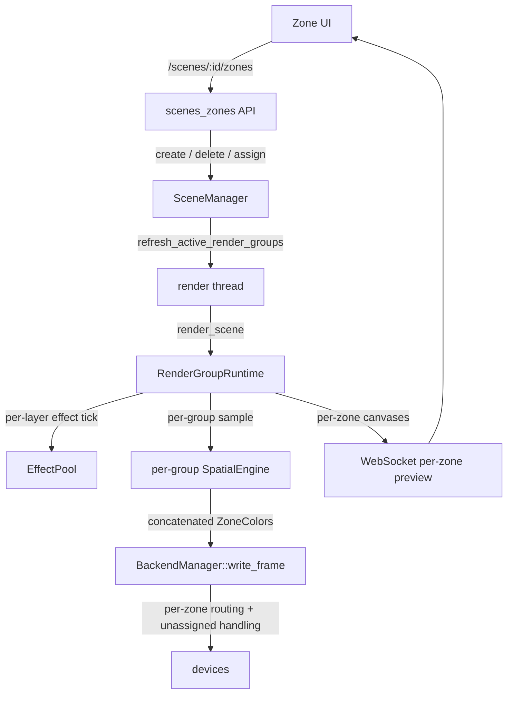

# Spec 64 — Multi-Zone Scenes

> Make running independent effects on disjoint device groups a first-class,
> authorable feature. The data model and per-group rendering primitives
> already exist; this spec adds the missing core piece (per-group LED
> sampling, so multi-zone output is partition-safe), the authoring surface
> (zone lifecycle in `SceneManager`, REST API, real-time preview, UI), and
> the engine hardening (unassigned-device behavior) needed to ship it.

**Status:** Draft
**Author:** Nova
**Date:** 2026-05-17
**Crates:** `hypercolor-core`, `hypercolor-daemon`, `hypercolor-ui`
**Evolves:** Render Groups (27)
**Depends on:** Spatial Layout Engine (06), Effect System (07),
Scenes & Automation (13), Render Groups (27), Canonical Render Pipeline (48)
**Related:** User Media & Layer Stack (60), SparkleFlinger (design/30),
brainstorm decision `decision_626e122a924d`

---

## Naming Convention

| Context                                | Term            | Notes                                                       |
| --------------------------------------- | --------------- | ----------------------------------------------------------- |
| **User-facing** (UI, API paths, docs)   | **Zone**        | "Add a zone", "Desk zone", "drag devices into a zone"       |
| **Internal** (Rust types, engine code)  | **RenderGroup** | Already the type name; avoids collision with `DeviceZone`   |

This follows Spec 27 §1. The `RenderGroup` type already exists and ships in
`hypercolor-types`; this spec does not rename it. The REST surface uses
`/zones` because that is the word users understand. `DeviceZone` (a single
device's spatial placement on a canvas) remains internal-only, so users never
see the collision. If `DeviceZone` is renamed later (Spec 27 §1 suggested
`DeviceSlot`), the internal type could become `Zone`; that rename is out of
scope here.

A note on the word "scene." The original feature request framed this as
"multi-scene." In Hypercolor vocabulary a **Scene** is the switchable,
priority-stackable container. The thing the request wanted (one effect for PC
devices, another for ambient devices, at the same time) is a **Zone** inside a
single Scene. This spec keeps that vocabulary: a Scene holds many Zones.

---

## Table of Contents

1. [Overview](#1-overview)
2. [Problem Statement](#2-problem-statement)
3. [Goals and Non-Goals](#3-goals-and-non-goals)
4. [Architecture Overview](#4-architecture-overview)
5. [Current Render Pipeline](#5-current-render-pipeline)
6. [Zone Model](#6-zone-model)
7. [SceneManager: Zone Lifecycle Mutations](#7-scenemanager-zone-lifecycle-mutations)
8. [Device and Zone Assignment](#8-device-and-zone-assignment)
9. [API Surface](#9-api-surface)
10. [Real-Time Preview](#10-real-time-preview)
11. [UI Integration](#11-ui-integration)
12. [Render Engine Changes](#12-render-engine-changes)
13. [Migration and Persistence](#13-migration-and-persistence)
14. [Relationship to Spec 60](#14-relationship-to-spec-60)
15. [Delivery Waves](#15-delivery-waves)
16. [Verification Strategy](#16-verification-strategy)
17. [Known Constraints](#17-known-constraints)
18. [Recommendation](#18-recommendation)
19. [Appendix A — File Inventory](#19-appendix-a--file-inventory)

---

## 1. Overview

A Hypercolor scene drives every connected device from one effect. Pick
"Aurora Wave" and it lands on the keyboard, the case fans, the motherboard,
the desk strips, and the room WLED controllers all at once. There is no
supported way to run a screen-mirror effect on the keyboard while case fans
run ambient plasma and room strips pulse to music.

Much of the groundwork is in place. A `Scene` carries `groups:
Vec<RenderGroup>`. The `EffectPool` runs an isolated effect renderer per
effect layer. Each render group owns a `SpatialLayout`, a `target_canvas`,
and its own `SpatialEngine` instance. Display-face groups already render to a
device's screen on an independent path. `RenderGroupRole::Custom` exists and
`Scene::validate` already permits any number of `Custom` groups.

Three things are missing, and this spec supplies all three.

1. **Multi-group LED output is not partition-safe.** Today, when a scene has
   more than one LED group, the renderer composites every group onto one
   shared scene canvas and samples it once. Groups author their layouts
   independently against their own canvases, so two groups commonly cover the
   same canvas region; the later group overwrites the earlier, and devices
   sample the wrong effect. The single-group product never hit this because
   it never had two LED groups. §12.1 fixes it with per-group sampling.

2. **There is no authoring surface.** `SceneManager` can create or update
   exactly one LED group (the `Primary` group) and one display group per
   screen device. Nothing creates a second LED zone, assigns a device subset
   to it, or gives it its own effect. No REST endpoint and no UI exist for
   it.

3. **Unassigned-device behavior is type-only.** `Scene.unassigned_behavior`
   exists with `Off`, `Hold`, and `Fallback` variants, but nothing in the
   render pipeline acts on it. With one group covering every device, no
   device was ever unassigned.

Spec 64 makes multi-zone real: per-group LED sampling so output is correct,
`UnassignedBehavior` enforcement, zone lifecycle mutations in the
`SceneManager`, a `/api/v1/scenes/:id/zones` REST surface, per-zone preview
frames, and a zone-management UI.

The data model is complete. This spec adds exactly one field to
`hypercolor-types` (`Scene.groups_revision`, a version counter). The
remaining work is a contained render-thread change, `SceneManager` methods,
daemon API, UI, and verification. It is not a pipeline rewrite, but §12.1 is
a real engine change, not cosmetic hardening.

---

## 2. Problem Statement

### 2.1 One Effect Per Scene Is the Only Authorable Shape

The everyday path is `POST /api/v1/effects/:id/apply`. It resolves the
effect, resolves the full active layout, and writes both into the active
scene's `Primary` render group through `SceneManager::upsert_primary_group`.
Every connected LED device is a zone inside that one group's layout, so every
device shows the same effect.

`SceneManager` exposes group mutations, but they are role-locked:

- `upsert_primary_group` creates or replaces the single `Primary` group.
- `upsert_display_group`, `patch_display_group_target`, and
  `remove_display_group` manage `Display` groups, one per screen device.
- `patch_group_controls`, `add_group_layer`, `clear_group_effect`,
  `set_group_preset_id`, and the Spec 60 layer mutations operate on a group
  **that already exists**, addressed by `RenderGroupId`.

There is no `create_render_group`, no `delete_render_group`, and no way to
move a device zone from one group to another. The `RenderGroupRole::Custom`
variant exists and `Scene::validate` already permits any number of `Custom`
groups, but nothing constructs one.

### 2.2 The REST Surface Cannot Touch Groups

`PUT /api/v1/scenes/:id` (`update_scene`) rebuilds a `Scene` from the request
body but copies `existing.groups` through untouched. `create_scene` always
produces an empty `groups` vector. `GET /api/v1/scenes/active` returns
`groups` for display, but no endpoint creates, edits, or deletes them. The
only group-shaped writes are the implicit ones behind `effects/apply` and the
display-face endpoints.

### 2.3 Multi-Group LED Output Is Not Partition-Safe

This is the load-bearing problem, and it is easy to miss because the
machinery looks complete.

`RenderGroupRuntime` renders each LED group's effect into that group's own
`target_canvas`, and it holds a per-group `SpatialEngine` in
`spatial_engines: HashMap<RenderGroupId, SpatialEngine>`. So far, so
partitioned. But the multi-group path does not use those per-group engines
for output. Instead `compose_authoritative_scene_canvas` projects every
group's device zones onto one shared scene canvas, and
`combined_led_spatial_engine` (built from `combine_led_group_layouts`, the
union of every group's zones) samples that one canvas.

`Scene::validate_group_exclusivity` guarantees that zone **identifiers** are
unique across groups. It does **not** check that zones occupy disjoint
**regions** of the scene canvas. Because each group authors its layout
against its own canvas, two groups will routinely place zones over the same
canvas area (each group's layout centered, each spanning the full canvas).
When that happens, `compose_authoritative_scene_canvas` writes the groups in
order and the later group's pixels overwrite the earlier group's; the
combined engine then samples the wrong group's colors for the overlapped
zones.

The current multi-group path is correct only for the special case where the
user has manually arranged every group's zones into disjoint canvas regions.
The authoring model neither enforces nor encourages that. Device partitioning
is therefore **not** a property the pipeline has today. §12.1 makes it one,
by sampling each group's canvas with its own engine instead of compositing.

### 2.4 Two Engine Paths Are Under-Exercised

Because the product never produces more than one LED group, two more
behaviors have no real coverage.

- **Unassigned devices.** `Scene.unassigned_behavior: UnassignedBehavior`
  exists with `Off`, `Hold`, and `Fallback(RenderGroupId)`. Nothing in the
  render pipeline reads it. With one group covering every device, no device
  is unassigned. The moment a user splits devices into two zones and leaves a
  device in neither, the behavior must be defined and correct.

- **Per-zone preview.** The WebSocket streams the composited authoritative
  scene canvas as a single preview. A zone UI needs each zone's own canvas.

### 2.5 Why This Matters

Multi-zone control is the single most-requested capability that Hypercolor's
architecture is closest to supporting. Competing tools treat the keyboard,
the case, and the room as one canvas, or force the user into separate apps.
Hypercolor can present them as named zones in one scene, each with its own
effect, layout, and brightness, switched together when the scene changes and
tunable independently while it runs. The data model is built and most of the
renderer is built; the missing core piece (§2.3) is contained, and the rest
is authoring surface.

---

## 3. Goals and Non-Goals

### 3.1 Goals

- **Per-group LED sampling.** Multi-group LED scenes sample each group's
  canvas with that group's own `SpatialEngine` and concatenate the
  `ZoneColors`, so output is partition-safe regardless of how groups lay out
  their canvases. This is the core engine change.
- **Zone lifecycle in `SceneManager`.** Create, update, and delete `Custom`
  render groups in any scene, with optimistic-concurrency guards consistent
  with the existing `controls_version` / `layers_version` pattern.
- **Device-to-zone assignment.** Move a `DeviceZone` from one group's layout
  into another, preserving the exclusivity invariant.
- **REST surface.** A `/api/v1/scenes/:id/zones` resource for zone CRUD and
  device assignment, mirroring the CRUD shape used by `api/layers.rs`.
- **`UnassignedBehavior` enforcement.** Define and wire `Off`, `Hold`, and
  `Fallback` for devices not claimed by any zone, with a concrete routing
  mechanism (§12.2).
- **`effects/apply` that respects zones.** Applying an effect updates the
  `Primary` zone's content without clobbering an established multi-zone
  device assignment.
- **Per-zone preview.** Publish each zone's canvas as an addressable preview
  frame on the WebSocket.
- **Zone-management UI.** A zone sidebar, device assignment, per-zone effect
  and control panels, a zone-scoped layout editor, and a tiled multi-zone
  preview.
- **Backwards compatibility.** Existing single-group and legacy
  `zone_assignments` scenes load and render unchanged.

### 3.2 Non-Goals

- **Per-zone input routing.** Every zone shares the daemon's global audio,
  screen-capture, and sensor inputs. A zone choosing its own monitor for
  screen capture is deferred (§17).
- **Per-zone frame cadence.** All LED zones render on the shared render-loop
  FPS tier. Display-face groups keep their existing independent target FPS.
- **Concurrent Scenes.** A device belongs to exactly one zone within one
  active scene. Multiple scenes rendering simultaneously, each owning a
  device subset, was considered in the brainstorm and rejected: it overloads
  the priority stack.
- **Surfaces.** A future model where a stable device partition owns its own
  independent scene stack and automation is the north star but out of scope.
  v1 zones are its substrate.
- **New `hypercolor-types` domain types.** Only `Scene.groups_revision` (a
  `u64` version counter) is added.
- **A per-zone target for `effects/apply`.** `effects/apply` keeps targeting
  the `Primary` zone. Setting a non-primary zone's effect goes through the
  per-group layer endpoints. A `?zone=` parameter is a possible future
  convenience, not v1.
- **Changes to the layer stack.** Spec 60 owns the per-group layer model.
  Spec 64 consumes `RenderGroup` as Spec 60 leaves it (see §14).

---

## 4. Architecture Overview

### 4.1 The Two Axes

Hypercolor composition has two independent axes. Keeping them distinct is the
core of this spec.

```
Across groups (Spec 64):  M zones, each a device partition
                          disjoint device sets, sampled independently

Within a group (Spec 60): N layers, stacked and blended
                          one canvas per group
```

A **Zone** (`RenderGroup`) is a device partition. A **Layer** (`SceneLayer`,
Spec 60) is one source inside a single zone's stack. A zone with three layers
still drives exactly its own devices; a scene with three zones drives three
disjoint device sets. The two compose cleanly and touch different fields of
`RenderGroup` (see §14).

### 4.2 What Already Exists

| Capability                                   | Where                                       | Status   |
| ---------------------------------------------- | ------------------------------------------- | -------- |
| Multiple render groups per scene               | `Scene.groups: Vec<RenderGroup>`            | Built    |
| One effect renderer per effect layer            | `EffectPool`, keyed `(RenderGroupId, SceneLayerId)` | Built |
| Per-group canvas                                | `RenderGroupRuntime.target_canvases`        | Built    |
| Per-group `SpatialEngine` (created, unused for output) | `RenderGroupRuntime.spatial_engines`  | Built    |
| Zone exclusivity by id                          | `Scene::validate_group_exclusivity`         | Built    |
| Display-face groups with independent routing    | `RenderGroupRole::Display`, `display_target` | Built   |
| `UnassignedBehavior` field                      | `Scene.unassigned_behavior`                 | Type only |
| Single-group LED fast path                      | `render_single_full_scene_group`            | Built    |

### 4.3 What This Spec Adds

| Capability                              | Where                                   | Wave |
| ----------------------------------------- | --------------------------------------- | ---- |
| Per-group LED sampling for multi-group scenes | `render_thread/render_groups.rs`    | 1    |
| `UnassignedBehavior` enforcement         | render thread + `BackendManager`        | 1    |
| Custom-zone lifecycle and assignment     | `SceneManager`, `Scene.groups_revision` | 2    |
| `effects/apply` zone-preserving behavior | `api/effects.rs`                        | 2    |
| `/api/v1/scenes/:id/zones` REST surface  | new `api/scenes_zones.rs`               | 3    |
| Per-zone preview frames                  | WebSocket, render thread                | 3    |
| Zone-management UI                       | `hypercolor-ui`                         | 4    |

### 4.4 Data Flow



---

## 5. Current Render Pipeline

This section documents the pipeline as it exists today, because §12 changes
one part of it and leaves the rest. Names are current as of the Spec 60
Wave 0A and layer-mutation landings.

### 5.1 Per-Frame Flow

The render thread calls `RenderGroupRuntime::render_scene(groups, ...)` once
per frame. `groups` is the active scene's `Vec<RenderGroup>`.

1. **`reconcile`** diffs the group set against runtime state. For each active
   group it ensures `EffectPool` renderer slots (one per effect layer, keyed
   `(RenderGroupId, SceneLayerId)`), a `target_canvas` sized to the group's
   layout, a cached scene projection, and a per-group `SpatialEngine`. It
   rebuilds `combined_led_layout` from `combine_led_group_layouts` (the union
   of every scene-contributing group's device zones) and the matching
   `combined_led_spatial_engine`.

2. **Single-group fast path** (`render_single_full_scene_group`). When
   exactly one scene-contributing group exists, it renders that group's
   layers to a pooled surface and returns
   `LedSamplingStrategy::SparkleFlinger(spatial_engine)` using that group's
   own `SpatialEngine`. No intermediate scene canvas. This is the path the
   single-LED-group product takes every frame. Note: this path renders to a
   surface, not into the group's `target_canvas`, which stays blank (a test
   asserts this); §12.3 accounts for it in per-zone preview.

3. **Multi-group path.** When two or more scene-contributing groups exist,
   each group's layers render into its own `target_canvas`. Then
   `compose_scene_frame` calls `compose_authoritative_scene_canvas`.

4. **`compose_authoritative_scene_canvas`** clears the authoritative scene
   canvas, then for each scene-contributing group, for each device zone in
   that group's layout, writes that zone's projected pixels into the scene
   canvas, sampled from that group's `target_canvas`. The combined spatial
   engine then samples the authoritative canvas.

5. **Display-face groups** (`display_target.is_some()`) never touch the scene
   canvas. They render to a pooled surface and publish a
   `PendingGroupCanvasFrame` routed to the display worker.

6. **`BackendManager::write_frame(zone_colors, layout)`** routes each zone's
   colors to its device.

### 5.2 Why Multi-Group Sampling Is Not Partition-Safe

Step 4 is the problem. `compose_authoritative_scene_canvas` writes projected
group pixels into one shared canvas in group order. `validate_group_exclusivity`
guarantees zone **ids** are disjoint, not that zones occupy disjoint
**regions** of that canvas. Two groups whose layouts both span their canvases
land on the same authoritative-canvas pixels; the later group wins, and the
combined engine samples corrupted colors for the overlapped zones. §2.3 has
the full description. This is why §12.1 replaces compositing with per-group
sampling for the LED output path.

### 5.3 Group Activity Predicate

`group_is_active` in `render_groups.rs` counts a group's enabled effect
layers (`enabled_effect_layer_count`); `scene_snapshot.rs` has the parallel
`group_has_enabled_effect_layer`. These no longer gate on the legacy
`effect_id` field directly. §14.2 records the remaining cross-spec concern:
several call sites still treat "active" as "has an effect layer," which
excludes a zone whose stack is non-effect layers only.

---

## 6. Zone Model

### 6.1 Roles

`RenderGroupRole` already has the three variants this spec needs.

| Role      | Count per scene | Purpose                                                    |
| --------- | --------------- | ---------------------------------------------------------- |
| `Primary` | 0 or 1          | The default LED zone. `effects/apply` targets it.          |
| `Custom`  | 0 or more       | Additional LED zones. The new first-class authorable role. |
| `Display` | 0 or more       | Face groups, one per screen device. Unchanged by this spec. |

`Scene::validate` already rejects more than one `Primary` group, requires
`Display` groups to carry a `display_target`, and rejects `display_target` on
`Custom` or `Primary` groups. Spec 64 does not change these rules.

### 6.2 Primary as the Default Zone

The `Primary` zone stays the implicit default and the target of
`effects/apply`. A fresh install, or any user who never opens the zone UI,
has exactly one `Primary` zone covering every device, exactly as today.

Creating a `Custom` zone does not change the `Primary` zone's role. The user
moves device zones out of `Primary` into the new `Custom` zone (§8). If
`Primary` ends up owning no device zones, it renders nothing and is
harmless. The UI may let a user promote a different zone to `Primary` through
`update_render_group_meta` (§7.2).

This interacts with `effects/apply`. Today `effects/apply` resolves the full
active layout and hands it to `upsert_primary_group`, which overwrites the
`Primary` group's layout. In a multi-zone scene that would pull every device
back into `Primary` and duplicate zones already owned by `Custom` groups.
"Unchanged" is therefore not safe. §9.5 specifies the corrected behavior:
`effects/apply` seeds `Primary`'s layout with the full device set only when
the scene has no `Custom` zones; otherwise it updates `Primary`'s content
without expanding `Primary`'s device assignment beyond the devices that no
`Custom` zone has claimed.

### 6.3 Exclusivity

A `DeviceZone` (one device's placement, identified by `DeviceZone.id`)
appears in exactly one `RenderGroup.layout.zones` within a scene.
`Scene::validate_group_exclusivity` enforces this id-level invariant and is
already called by `Scene::validate`. Every mutation in §7 preserves it by
construction: assignment removes a device zone from its previous owner before
adding it to the target. Note that exclusivity is by zone id; per-group
sampling (§12.1) is what makes the rendered output correct, independent of
how groups place zones on their canvases.

### 6.4 Unassigned Outputs

Assignment is per `DeviceZone`, not per device. A device can expose several
addressable channels or segments, each its own `DeviceZone` with its own
`zone_name`. A multi-channel device may therefore be partially assigned: one
channel in a zone, another in none.

An **unassigned output** is a device channel or segment that no `DeviceZone`
in any zone's layout covers. A single-channel device is the common case where
"unassigned output" and "unassigned device" coincide. The scene's
`unassigned_behavior` decides what unassigned outputs do:

| Variant                    | Behavior                                                       |
| --------------------------- | -------------------------------------------------------------- |
| `Off` (default)             | Unassigned outputs are actively cleared to black.              |
| `Hold`                      | Unassigned outputs retain their last rendered colors.          |
| `Fallback(RenderGroupId)`   | Unassigned outputs are routed through the named zone.          |

§12.2 specifies the mechanism, evaluated per output and preserving each
device's `zone_name` and segment routing. The type exists; the enforcement is
the work.

### 6.5 Zone Identity

A zone is already a first-class object. `RenderGroup` carries `id`, `name`,
`description`, `color`, `brightness`, and `enabled`. Spec 64 adds no identity
fields. What it adds is the management surface (§7, §9) and the runtime
visibility (§10) that make that identity usable.

---

## 7. SceneManager: Zone Lifecycle Mutations

New methods on `SceneManager` in `crates/hypercolor-core/src/scene/mod.rs`.
They follow the conventions of the existing group and layer mutations:
operate by `SceneId` plus `RenderGroupId`, reject structural edits on scenes
where `Scene::blocks_runtime_mutation()` is true, and, when they change the
active scene, call the same cache-refresh path the existing group mutators
use so the render thread does not read a stale group set.

### 7.1 The Cache-Refresh Requirement

Existing group mutators (`upsert_primary_group`, `clear_group_effect`, the
layer mutators) call `refresh_active_render_groups` after changing group
data, which rebuilds the cached `active_render_groups` the render thread
reads. `invalidate_active_render_groups` alone only bumps a revision counter;
it does not rebuild the cache. Every structural mutation in this section
**must** call `refresh_active_render_groups` when it edits the active scene.
This is called out explicitly because it is an easy and silent mistake: a
mutation that bumps the revision but skips the refresh leaves the render
thread rendering the old group set.

### 7.2 Zone Creation and Deletion

```rust
impl SceneManager {
    /// Create an empty `Custom` zone in the target scene and return its id.
    ///
    /// The zone starts with an empty layout, no layers, `enabled = true`,
    /// and `brightness = 1.0`. Devices are assigned separately (§8).
    pub fn create_render_group(
        &mut self,
        scene_id: &SceneId,
        name: String,
        color: Option<String>,
    ) -> Result<RenderGroupId>;

    /// Delete a `Custom` zone.
    ///
    /// Rejected for `Primary` and `Display` zones; those have dedicated
    /// lifecycle methods. Device zones owned by the deleted zone become
    /// unassigned and are handled by the scene's `UnassignedBehavior` on the
    /// next frame.
    pub fn delete_render_group(
        &mut self,
        scene_id: &SceneId,
        group_id: RenderGroupId,
    ) -> Result<()>;
}
```

### 7.3 Zone Metadata Updates

```rust
/// Presentation fields that can be patched without touching effects,
/// layers, or device assignment.
#[derive(Debug, Clone, Default)]
pub struct RenderGroupMetaPatch {
    pub name: Option<String>,
    pub description: Option<Option<String>>,
    pub color: Option<Option<String>>,
    pub brightness: Option<f32>,
    pub enabled: Option<bool>,
    /// Promote this zone to `Primary`. Demotes the existing `Primary`
    /// zone to `Custom` in the same transaction.
    pub make_primary: Option<bool>,
}

impl SceneManager {
    pub fn update_render_group_meta(
        &mut self,
        scene_id: &SceneId,
        group_id: RenderGroupId,
        patch: RenderGroupMetaPatch,
    ) -> Result<RenderGroup>;
}
```

`brightness` is clamped to `[0.0, 1.0]`. `make_primary = Some(true)` is the
only path that changes a zone's role; it runs as one atomic edit so the scene
never transiently has zero or two `Primary` zones.

### 7.4 Effects, Controls, and Layers

Zone effects and controls need **no new methods**. The existing per-group
mutations are already keyed by `RenderGroupId` and work for any role:
`patch_group_controls`, `reset_group_controls`, `set_group_control_binding`,
`set_group_preset_id`, `clear_group_effect`, and the Spec 60 layer mutations
(`add_group_layer`, `update_group_layer`, `remove_group_layer`,
`reorder_group_layers`, `patch_layer_effect_controls`).

Spec 64 reuses all of them. Setting a zone's effect is adding or updating an
`Effect` layer in that zone's stack, exactly as for the `Primary` zone today.

### 7.5 Concurrency and Snapshot Policy

Structural zone mutations (create, delete, role change, device assignment)
are scene-structural. They are rejected on scenes where
`Scene::blocks_runtime_mutation()` is true, matching the existing active
effect and display-group APIs.

Within-zone edits (layers, controls) are **not** changed by this spec. The
existing layer and control mutators are not snapshot-locked today; Spec 64
deliberately leaves that policy alone rather than retrofitting it, so the
only new snapshot-locked surface is structural zone mutation. If a uniform
policy is wanted, that is a separate change.

A new `groups_revision: u64` on `Scene`, bumped on every create, delete,
assignment, or role change, gives the API an optimistic-concurrency token for
structural edits and lets the UI detect a concurrent restructure. It is added
with `#[serde(default)]`, the same compatibility pattern as
`controls_version`. This is the single field Spec 64 adds to
`hypercolor-types`.

---

## 8. Device and Zone Assignment

### 8.1 Layouts Are Per Zone

Each `RenderGroup` owns a `SpatialLayout`. A device's placement is a
`DeviceZone` inside exactly one zone's `layout.zones`. The layout a
single-zone user edits today is the `Primary` zone's layout.

"Assigning device D to zone G" means moving D's `DeviceZone` out of its
current owning zone's layout and into G's layout.

### 8.2 Assignment Methods

```rust
impl SceneManager {
    /// Move a device zone into `group_id`, removing it from whatever zone
    /// currently owns it. Preserves exclusivity by construction.
    ///
    /// If the device zone is new to the scene, it is placed at a default
    /// position on the target zone's canvas. If it is moving between zones,
    /// its topology and LED mapping are preserved; only its canvas-relative
    /// placement resets to the target zone's default, because position is
    /// meaningful only against a specific canvas.
    pub fn assign_device_zone(
        &mut self,
        scene_id: &SceneId,
        group_id: RenderGroupId,
        device_zone: DeviceZone,
    ) -> Result<()>;

    /// Remove a device zone from its owning zone. The device becomes
    /// unassigned and is handled by `UnassignedBehavior`.
    pub fn unassign_device_zone(
        &mut self,
        scene_id: &SceneId,
        device_zone_id: &str,
    ) -> Result<()>;
}
```

`assign_device_zone` is idempotent: assigning a device zone to the zone that
already owns it updates its placement in place. Both methods bump
`groups_revision` and call `refresh_active_render_groups` (§7.1).

### 8.3 Why Position Resets on a Move

`DeviceZone.position`, `size`, `rotation`, and `scale` are normalized against
the owning zone's canvas, and Spec 27 §3.3 establishes that canvas geometry
is effect-relative. Moving a device zone between zones resets its placement
to the target zone's default (centered, native scale) and keeps its topology
and `led_mapping`. The user re-places it in the target zone's layout editor.
Silently carrying a position across canvases produces wrong-looking results.

### 8.4 The Layout Editor Is Zone-Scoped

The existing canvas layout editor (Spec 46) edits one `SpatialLayout`. Under
multi-zone it edits the **selected zone's** layout. Selecting a zone in the
sidebar switches the editor to that zone's canvas and device zones. The
standalone layout library (the `/api/v1/layouts` resource) is unchanged;
applying a saved layout targets a specific zone, defaulting to `Primary`.

### 8.5 Device Discovery and First Assignment

Newly discovered devices are not auto-assigned to `Custom` zones. They appear
in the UI's unassigned tray; the user drags them into a zone, which calls
`assign_device_zone`. The synthesized default scene's `Primary` zone is
seeded with all devices on first run, so the out-of-box experience is
unchanged.

---

## 9. API Surface

A new `/api/v1/scenes/:id/zones` resource, handled by a new
`crates/hypercolor-daemon/src/api/scenes_zones.rs` module, shaped like
`api/layers.rs`. All responses use the standard `{ data, meta }` envelope.

### 9.1 Endpoints

```
GET    /api/v1/scenes/:id/zones                       List zones in a scene
POST   /api/v1/scenes/:id/zones                       Create a Custom zone
GET    /api/v1/scenes/:id/zones/:zone_id              Get one zone
PATCH  /api/v1/scenes/:id/zones/:zone_id              Update zone metadata
DELETE /api/v1/scenes/:id/zones/:zone_id              Delete a Custom zone
POST   /api/v1/scenes/:id/zones/:zone_id/devices      Assign device zones
DELETE /api/v1/scenes/:id/zones/:zone_id/devices/:dz  Unassign a device zone
```

Per-zone effects, controls, and layers are **not** new endpoints. They reuse
the existing per-group layer and control routes, addressed by the zone's
`RenderGroupId`. Spec 64's API is zone lifecycle and device assignment only.

### 9.2 Request Types

```rust
#[derive(Debug, Deserialize)]
pub struct CreateZoneRequest {
    pub name: String,
    pub color: Option<String>,
}

#[derive(Debug, Deserialize)]
pub struct UpdateZoneRequest {
    pub name: Option<String>,
    pub description: Option<Option<String>>,
    pub color: Option<Option<String>>,
    pub brightness: Option<f32>,
    pub enabled: Option<bool>,
    pub make_primary: Option<bool>,
}

#[derive(Debug, Deserialize)]
pub struct AssignDevicesRequest {
    pub device_zones: Vec<DeviceZoneAssignment>,
}

#[derive(Debug, Deserialize)]
#[serde(untagged)]
pub enum DeviceZoneAssignment {
    /// Move an existing device zone by id.
    Existing { id: String },
    /// Place a newly constructed device zone.
    New(DeviceZone),
}
```

### 9.3 Optimistic Concurrency

Structural endpoints (`POST`, `DELETE`, the device endpoints, and `PATCH`
when it sets `make_primary`) follow the **same precondition contract the
per-effect controls and layer endpoints use**: the response carries the
scene's `groups_revision` as an `ETag`, and a structural request may carry an
`If-Match` header. A mismatch returns `412 Precondition Failed` with the
current revision in the body. This matches `PATCH /effects/:id/controls` and
the `api/layers.rs` endpoints. The legacy `PATCH /effects/current/controls`
endpoint predates that contract and does not use it; new code follows the
`412` plus `ETag` pattern. `412` is distinct from the `409 Conflict` this
spec uses for snapshot-locked scenes. Metadata-only `PATCH` calls do not
require `If-Match`.

### 9.4 Error Cases

| Condition                                    | Status | Notes                                       |
| --------------------------------------------- | ------ | ------------------------------------------- |
| Scene not found                               | 404    |                                             |
| Zone not found in scene                       | 404    |                                             |
| Device zone id not found in the scene         | 404    |                                             |
| Structural mutation on a `Snapshot` scene     | 409    | `blocks_runtime_mutation` is true           |
| Delete a `Primary` or `Display` zone          | 409    | Use the dedicated lifecycle endpoints       |
| `If-Match` revision mismatch                  | 412    | Body carries current `groups_revision`      |
| Assignment that empties a zone                | 200    | An empty zone is valid                      |

### 9.5 `effects/apply` Preserves Zone Assignment

`POST /api/v1/effects/:id/apply` keeps targeting the `Primary` zone, but its
layout handling changes (§6.2). Today it always passes the full resolved
layout to `upsert_primary_group`, which overwrites `Primary`'s device
assignment. Under multi-zone that destroys the partition.

The corrected behavior depends on the active scene's shape:

- **No `Custom` zones.** `effects/apply` behaves exactly as today: it seeds
  `Primary` with the full device layout and sets its effect. Single-zone
  users see no change.
- **`Custom` zones present, `Primary` already exists.** `effects/apply`
  updates only `Primary`'s content (effect layers and controls) and leaves
  `Primary`'s `layout` (its device assignment) intact.
- **`Custom` zones present, no `Primary` zone yet.** `effects/apply` must
  create `Primary`. It seeds the new `Primary`'s layout with the device zones
  that no `Custom` zone has claimed (the unassigned-output set of §6.4), keyed
  by `DeviceZone` identity, never the full layout. A scene whose `Custom`
  zones already cover every device output gets an empty `Primary`, which is
  valid.

This logic belongs in a shared `SceneManager` helper, not in the REST handler.
`upsert_primary_group` either gains a layout-preserving mode or splits into
"create `Primary` with a computed layout" and "update `Primary` content." The
MCP `set_effect` and `set_color` tools also call `upsert_primary_group` with
the full layout today; they must move to the same helper so the REST and MCP
paths cannot diverge. The quick path "pick an effect, it covers everything"
is preserved for users who have not opted into zones.

---

## 10. Real-Time Preview

### 10.1 Per-Zone Preview Frames

The render thread holds each zone's rendered output. Spec 64 publishes each
as an addressable preview. A new WebSocket message:

```
ZonePreviewFrame {
    scene_id: SceneId,
    zone_id: RenderGroupId,
    width: u32,
    height: u32,
    encoding: PreviewEncoding,   // existing JPEG/raw encoding enum
    payload: Bytes,
}
```

Published on the existing preview channel, one message per active zone per
preview tick. The composited authoritative-canvas preview stays as is for the
single-canvas dashboard view.

### 10.2 Frame Source

The source of a zone's preview depends on the render path that produced it:

- **Multi-group path:** each LED zone's `target_canvas` holds its rendered
  output. Source the preview there.
- **Single-group fast path:** the sole group renders to a pooled surface
  (`scene_frame`), not its `target_canvas`, which stays blank (§5.1). Source
  that zone's preview from `scene_frame`.
- **Display zones:** source from the zone's `PendingGroupCanvasFrame`.

§12.3 wires this into the render thread.

### 10.3 Encoding Reuse and Cadence

Per-zone previews reuse the display-preview fanout cache pattern: the encoded
header-plus-payload `Bytes` is built once per zone per frame and cloned by
reference for every subscriber. Zones unchanged since the last preview tick
(retained frame, unchanged `SceneDependencyKey`) reuse the prior encoded
frame. Previews are throttled to the preview tick rate, not the render rate.

---

## 11. UI Integration

In `crates/hypercolor-ui`, Leptos 0.8 CSR, following the leptos-ui
conventions (SilkCircuit tokens, signal-driven state, WebSocket binary
protocol).

### 11.1 Zone Sidebar

A panel listing the active scene's zones. Each row shows the zone's `color`
swatch, `name`, current effect name, an enabled toggle, and a small live
preview fed by the §10 `ZonePreviewFrame`. A "new zone" control calls `POST
/zones`. Selecting a zone makes it the editing context for the effect panel,
the control panel, and the layout editor.

### 11.2 Device Assignment

An unassigned-device tray plus drag-and-drop into zone rows. A drop issues
`POST /zones/:zone_id/devices`. Dragging a device from one zone row to
another issues the same call against the destination; the source loses the
device by exclusivity. The tray is populated from connected devices whose
`DeviceZone` is in no zone.

### 11.3 Per-Zone Panels

The effect picker, the control panel, and the layout editor bind to the
selected zone's `RenderGroupId` and call the existing per-group layer and
control endpoints. The layout editor is zone-scoped (§8.4).

### 11.4 Multi-Zone Dashboard Preview

The dashboard shows a tiled preview, one tile per active zone, each labeled
with the zone name and effect, built client-side from the per-zone
`ZonePreviewFrame` stream.

### 11.5 Progressive Disclosure

A user with one zone sees the current single-effect dashboard; the zone
sidebar shows one row ("All Devices"). Zone management is discoverable but
never in the way. Complexity scales with the user's setup.

---

## 12. Render Engine Changes

### 12.1 Per-Group LED Sampling

This is the core engine change and the fix for §2.3. Multi-group LED scenes
stop compositing onto a shared canvas and sample each group independently.

`RenderGroupRuntime` already holds, per group, a `SpatialEngine` in
`spatial_engines` and a `target_canvas`. The multi-group LED path becomes:

```
zones.clear()
for group in active scene-contributing LED groups (display_target is none):
    render the group's effect layers into its target_canvas
    let start = zones.len();
    spatial_engines[group.id]
        .sample_append_into_at(target_canvas, &mut zones, start)
// zones now holds ZoneColors for every assigned device, each sampled
// from its own group's canvas
```

`SpatialEngine` already provides `sample_append_into_at`, which appends
sampled `ZoneColors` to an existing buffer; it is the concatenation
primitive. Each group's effect renders at its own full canvas resolution and
is sampled only for its own device zones. There is no shared canvas, no
projection, and no overlap hazard, because no two groups ever write the same
pixels.

The single-group fast path (`render_single_full_scene_group`) is unchanged.

`compose_authoritative_scene_canvas` and `combined_led_spatial_engine` are
**retained**, but only to build the one composited image the dashboard shows
as a scene-wide preview. They leave the LED output path entirely. Their
group-order overwrite behavior, the §2.3 bug, becomes a harmless cosmetic
detail of a preview image rather than a correctness fault in device output.

`LedSamplingStrategy` is adjusted so the multi-group path returns
pre-sampled `ZoneColors` rather than deferring to a combined-engine sample of
the authoritative canvas. The single-group and display paths keep their
current strategies.

This is Spec 27 §5.2's original design. The brainstorm
(`decision_626e122a924d`) recommended it; the first draft of this spec
mistakenly assumed the projection path already partitioned safely. It does
not. Per-group sampling is required for v1, not a future optimization.

### 12.2 Enforce `UnassignedBehavior`

With per-group sampling (§12.1), `zones` holds `ZoneColors` only for assigned
`DeviceZone`s. Per §6.4, assignment is per device channel or segment, not per
device, so the unit of "unassigned" is a device output, not a whole device.

The render thread computes the unassigned-output set whenever the device
roster or the scene's `groups_revision` changes: every device channel or
segment present in the device registry that no `DeviceZone` in any zone's
layout covers. It then applies the scene's `unassigned_behavior`:

- **`Off`.** `BackendManager` gains a companion clear path: after routing
  `zone_colors`, it writes black to every connected device output that
  received no `ZoneColors` this frame. This needs the device id, channel or
  segment range, and LED count, all available from device metadata in the
  registry without a `DeviceZone`.
- **`Hold`.** `BackendManager` skips unassigned outputs, leaving their last
  colors in place. This is the current accidental behavior, made intentional.
- **`Fallback(RenderGroupId)`.** The render thread synthesizes a temporary
  `DeviceZone` for each unassigned output (LED count, segment range, and
  `zone_name` taken from device metadata; a default topology and canvas
  placement). A `SpatialEngine` samples only the prepared zones of the layout
  it was built from, so the fallback zone's own engine cannot sample these
  ad-hoc zones. The render thread instead builds a scratch `SpatialLayout`
  for the frame, equal to the fallback zone's layout plus the synthesized
  unassigned `DeviceZone`s, and a scratch `SpatialEngine` from it. That
  scratch engine samples the fallback zone's `target_canvas` and appends the
  resulting `ZoneColors`, exactly as §12.1 does for a normal zone. The
  synthesized zones are never persisted into the scene.

Because the mechanism keys on device channels and segments, a partially
assigned multi-channel device is handled correctly: its assigned channels
render from their zones, its unassigned channels follow `unassigned_behavior`.

**Snapshot and cache correctness.** The per-frame scene snapshot the render
thread reads (`SceneRuntimeSnapshot`) currently carries the active render
groups but not `Scene.unassigned_behavior`. Spec 64 adds `unassigned_behavior`
to that snapshot so the render thread applies the policy without locking the
scene manager mid-frame. The render thread's frame-reuse key currently
combines the active-render-group revision with the effect-registry
generation; Spec 64 also folds in the device-registry generation and the
active `unassigned_behavior`. Without the device-registry generation, a
device connecting or disconnecting would not invalidate a retained frame and
the unassigned-output set would go stale; without `unassigned_behavior` in
the key, a policy change from (say) `Off` to `Hold` would not take effect
until some unrelated change invalidated the frame.

### 12.3 Publish Per-Zone Preview Frames

Wire the §10 `ZonePreviewFrame` publication into the render thread after
`render_scene` returns, sourcing each zone per §10.2 (multi-group from
`target_canvases`, single-group fast path from `scene_frame`, display zones
from `group_canvases`). Gate publication on the preview tick and the per-zone
retained-frame check so an unchanged zone is not re-encoded.

### 12.4 Verify Multi-Custom-Group Rendering

`render_groups.rs` has a `multiple_custom_groups_render_distinct_zone_colors`
test today, but it exercises the compositing path. Update and extend coverage
for the per-group sampling path: two and three `Custom` LED groups with
**overlapping** canvas layouts must still produce correct per-zone colors
(the case the old path fails), and the single-group fast path must not engage
when a second group exists.

### 12.5 Out of Scope for v1

- **Per-zone FPS.** LED zones share the render-loop tier. Deferred.
- **GPU per-group sampling.** Spec 59 (GPU spatial sampling) and per-group
  sampling are compatible but their integration is not in scope here.

---

## 13. Migration and Persistence

### 13.1 No Format Change

`Scene.groups` already serializes (the scene store persists it), and
`RenderGroup` already has a custom `Serialize`/`Deserialize` that mirrors
legacy effect fields for old clients. `Custom` zones are additional entries
in an existing `Vec`. The one new field, `Scene.groups_revision`,
deserializes with `#[serde(default)]` to `0` for scenes written before this
spec. No version bump, no migration pass.

### 13.2 Existing Scenes

- A scene with a single `Primary` group loads and renders unchanged. It takes
  the single-group fast path, which §12.1 does not touch.
- A scene using legacy flat `zone_assignments` is still handled by
  `Scene::effective_zone_assignments`; it has no `Custom` zones and is
  unaffected.
- The synthesized default scene keeps its single `Primary` zone seeded with
  all devices.

### 13.3 Runtime Session

`RuntimeSessionSnapshot` already persists the default scene's groups and the
active scene id. `Custom` zones in the default scene persist through it with
no change. Named scenes persist through the scene store as before.

---

## 14. Relationship to Spec 60

Spec 60 (User Media & the Layer Stack) and Spec 64 both evolve `RenderGroup`.
They are orthogonal sibling specs (brainstorm decision
`decision_626e122a924d`). Spec 60 Wave 0A and its core layer mutations have
already landed.

### 14.1 The Boundary

```
Spec 60:  Vec<SceneLayer>  --composite-->  one zone canvas
Spec 64:  M zone canvases  --sample per group-->  disjoint device sets
shared boundary:  the per-zone canvas (target_canvas)
shared type:      RenderGroup
```

Spec 60 owns `RenderGroup.layers` and how a zone's canvas is produced. Spec
64 owns the zone-set lifecycle, device assignment, and how zone canvases are
sampled to devices. Spec 64 adds exactly one field (`Scene.groups_revision`)
and no fields to `RenderGroup`.

### 14.2 Shared Concern: The Renderable-Layer Predicate

`group_is_active` already counts enabled effect layers rather than gating on
the legacy `effect_id` (§5.3). The remaining concern is broader and shared
with Spec 60: several call sites still equate "active" with "has an effect
layer." `active_render_group_count`, the inactive-group cleanup path, and the
fast-path display loop all use that test. A zone whose stack is a `ColorFill`
layer only is already renderable by the producer pump, yet those call sites
would classify it inactive and skip it.

The fix is one shared `group_has_renderable_layer` predicate, used at every
"is this group active" site, that counts a group as renderable if it has any
enabled layer with a renderable source: `Effect` and `ColorFill` today,
`Media`, `ScreenRegion`, and `WebViewport` as Spec 60 lands their producers.
Whichever spec's implementation reaches those call sites first should
introduce the predicate; the other consumes it. This is the only code region
both specs touch, and it is recorded here so it is not lost between the two
workstreams.

### 14.3 Composition

A zone can have a Spec 60 layer stack and be a Spec 64 device partition at the
same time, with no interaction. Per-group sampling (§12.1) samples whatever
canvas the layer stack composited.

---

## 15. Delivery Waves

Ordered by dependency. Each wave is independently shippable and verifiable.

| Wave | Scope                                                                | Crates           |
| ---- | -------------------------------------------------------------------- | ---------------- |
| 1    | Per-group LED sampling; `UnassignedBehavior` enforcement; render tests | core, daemon   |
| 2    | `SceneManager` zone lifecycle and assignment; `groups_revision`; `effects/apply` zone-preserving change | types, core, daemon |
| 3    | `/scenes/:id/zones` REST surface; per-zone `ZonePreviewFrame`         | daemon           |
| 4    | Zone-management UI: sidebar, assignment, per-zone panels, preview     | ui               |

Wave 1 makes a manually constructed multi-zone scene render correctly. It
carries the real engine risk and must land first, before any authoring
surface can produce such a scene. Wave 2 makes zones constructible in the
core and corrects `effects/apply`. Wave 3 exposes them over REST. Wave 4
makes them usable. Waves 1 through 3 are testable headless; Wave 4 needs
visual verification.

---

## 16. Verification Strategy

Tests live in `tests/` directories, named `{feature}_tests.rs`, per the
workspace convention. Inline `#[cfg(test)]` is used only where the existing
`render_groups.rs` tests already live.

### 16.1 Unit and Integration

- **Per-group sampling** (`render_groups.rs`): two and three `Custom` LED
  zones with **overlapping** canvas layouts produce correct, distinct
  per-zone colors; the result is independent of group order; the single-group
  fast path does not engage with two groups present.
- **`UnassignedBehavior`**: `Off` clears unassigned outputs to black; `Hold`
  leaves them; `Fallback` routes them through the named zone; a partially
  assigned multi-channel device renders its assigned channels and applies the
  behavior only to its unassigned channels; a device connecting or
  disconnecting recomputes the set (cache key includes device-registry
  generation).
- **Zone lifecycle** (`hypercolor-core`): create, delete, metadata patch,
  `make_primary` atomicity, deletion of `Primary`/`Display` rejected,
  `Snapshot` scene rejects structural edits, every structural mutation
  refreshes the active-render-group cache.
- **Assignment**: `assign_device_zone` moves a device zone and removes it
  from the prior owner; exclusivity holds after arbitrary move sequences;
  placement resets on a cross-zone move while topology is preserved.
- **`effects/apply`**: a scene with no `Custom` zones still gets a full
  `Primary` layout; a scene with `Custom` zones keeps its `Primary` device
  assignment after apply.
- **API** (`hypercolor-daemon`): zone CRUD, device assignment,
  `If-Match` / `412` handling, the §9.4 error matrix.
- **Persistence**: a scene with `Custom` zones round-trips through the scene
  store; `groups_revision` defaults to `0` on older scenes.

### 16.2 Manual

- A scene with a `Primary` zone (keyboard, fans) on one effect and a `Custom`
  zone (room strips) on another renders both concurrently and correctly,
  including when both zones' layouts span their full canvases.
- Dragging a device between zones in the UI updates its output within one
  scene tick.
- Per-zone previews track each zone's effect live.
- Switching the active scene swaps all zones together; per-zone control edits
  change one zone without disturbing the others.

### 16.3 Gates

`just verify` (fmt, lint, test) passes after every wave. `cargo check
--workspace` passes for Waves 1 through 3. `just ui-test` passes for Wave 4.

---

## 17. Known Constraints

- **Per-zone input routing is deferred.** All zones share the daemon's
  global audio, screen-capture, and sensor inputs. An audio-reactive effect
  in one zone and a static effect in another both read the same audio; the
  static one ignores it. Two zones capturing two different monitors is future
  work.

- **Per-zone FPS is deferred.** LED zones share the render-loop tier.
  Display-face zones keep their existing independent target FPS.

- **The composited preview keeps its overlap behavior.** After §12.1 the
  authoritative scene canvas feeds only the dashboard's single composited
  preview image. Two zones overlapping on it still overwrite in group order.
  This is now a cosmetic property of one preview image, not a device-output
  fault, and is left as is.

- **Surfaces are the north star, not this spec.** A stable device partition
  that owns its own switchable scene stack and automation is a larger model.
  v1 zones are its substrate.

- **Concurrent Scenes were rejected.** Running multiple scenes at once, each
  scoped to a device subset, overloads the priority stack. The container
  stays single-active; partitioning happens inside one scene.

---

## 18. Recommendation

Build it, in the four waves of §15.

The data model is complete and most of the renderer is built: per-layer
effect renderers, per-group canvases, per-group spatial engines, independent
display-face routing, zone-exclusivity validation, and the
`UnassignedBehavior` type all exist. What this spec found, and the first
draft missed, is that the multi-group LED path composites onto a shared
canvas and is not partition-safe. §12.1 fixes that with per-group sampling,
reusing the per-group `SpatialEngine`s that already exist and the
`sample_append_into_at` primitive. That is a contained render-thread change,
not a rewrite, but it is real engine work and it is the heart of Wave 1.

The rest is authoring surface: one new field, a handful of `SceneManager`
methods, the `effects/apply` correction, one REST module, one WebSocket
message, and a UI panel.

Start with Wave 1. Per-group sampling and `UnassignedBehavior` carry the
engine risk and must prove out before any authoring surface is built on top
of them. A manually constructed two-zone scene with overlapping layouts is
the acceptance test. Waves 2 through 4 are then additive and low-risk.

The result is the most-requested capability Hypercolor's architecture is
closest to: a scene that runs your screen mirror on the keyboard, an ambient
effect on the case, and a music visualizer on the room, as named zones you
manage in one place.

---

## 19. Appendix A — File Inventory

New files:

| Path                                                       | Purpose                          |
| ----------------------------------------------------------- | -------------------------------- |
| `crates/hypercolor-daemon/src/api/scenes_zones.rs`          | `/scenes/:id/zones` handlers     |
| `crates/hypercolor-core/tests/zone_lifecycle_tests.rs`      | Zone mutation coverage           |
| `crates/hypercolor-daemon/tests/scenes_zones_api_tests.rs`  | Zone REST coverage               |
| `crates/hypercolor-ui/src/zones/` (module)                  | Zone sidebar, assignment, panels |

Modified files:

| Path                                                       | Change                                          |
| ----------------------------------------------------------- | ----------------------------------------------- |
| `crates/hypercolor-types/src/scene.rs`                      | Add `Scene.groups_revision`                     |
| `crates/hypercolor-core/src/scene/mod.rs`                   | Zone lifecycle and assignment mutations         |
| `crates/hypercolor-core/src/device/manager.rs`              | `BackendManager` unassigned clear path          |
| `crates/hypercolor-daemon/src/render_thread/render_groups.rs` | Per-group LED sampling; multi-group tests     |
| `crates/hypercolor-daemon/src/render_thread/` (snapshot, reuse) | `unassigned_behavior` in the scene snapshot; device-registry generation and policy in the reuse key |
| `crates/hypercolor-daemon/src/api/effects.rs`               | `effects/apply` preserves zone assignment       |
| `crates/hypercolor-daemon/src/mcp/tools/effects.rs`         | MCP `set_effect`/`set_color` use the shared helper |
| `crates/hypercolor-daemon/src/api/mod.rs`                   | Mount the zones router                          |
| `crates/hypercolor-daemon/src/api/ws/` (preview channel)    | `ZonePreviewFrame` message                      |
| `crates/hypercolor-ui/` (dashboard, layout editor)          | Zone-scoped editing, tiled preview              |

No changes to `hypercolor-hal`, the driver crates, or `hypercolor-types`
beyond the single `groups_revision` field.
